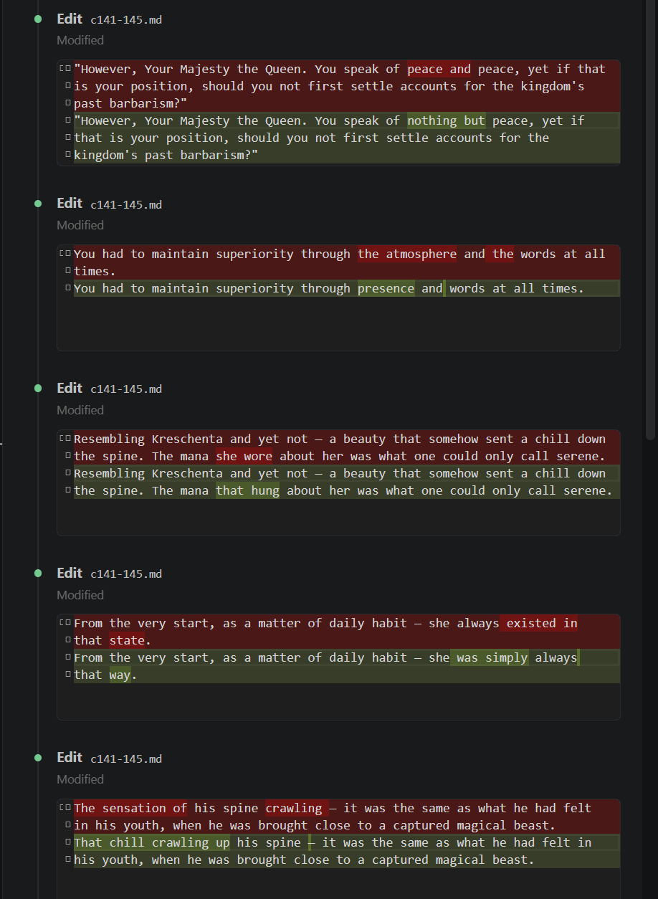
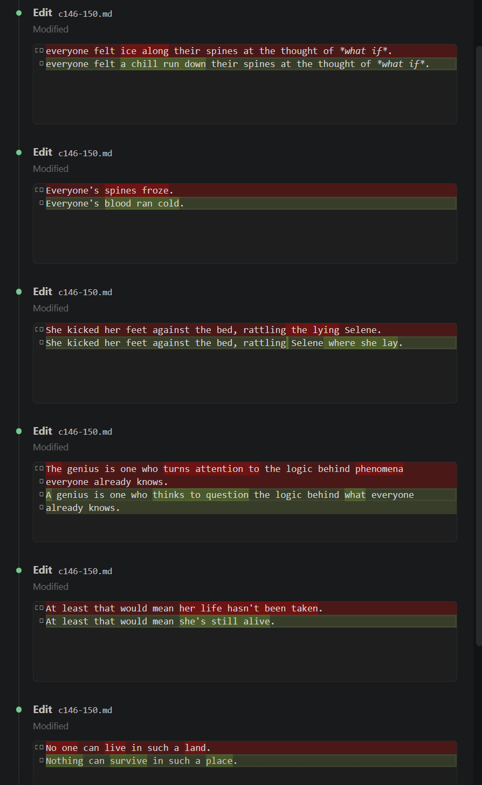

## UwU

Aight if you're looking at this file the the cat's out of the bag. You may or may not have noticed the translation sounded like AI. Welp, that's because it is AI. The translation was completed using the latest and strongest LLM model: Claude Opus 4.6.

I actually tried doing this in early 2025 using GPT for this exact novel but found that although the translation itself was passable, it often couldn't even fit a single chapter in it's context window and often truncated up to half the chapter. It also didn't like what it was translating, often straight up refusing to translate due to "content violation". 
Looks like GPT couldn't handle Krische's personality lol.

Claude solved both these issues with a very large context window, capable of translating well over 10 chapters in a single prompt, and didn't bat an eye even to the more gory chapters.

## Methodology

Even Opus 4.6 isn't powerful enough to translate the entire novel from start to finish with 0 errors, and there is also the problem of usage limits to consider. To get around this, I opted to translate chapters in batches of 5 at a time. To maintain accuracy and consistency of the translation, I maintained a `context.md` that is updated after every batch. 
`context.md` contains information critical for translation only, such as a romanization table and key translation choices for terms, titles, places etc.. It also contains other information about the task itself, some translation nuances to watch out for, and other information about the novel itself such as previous events.

For each batch, the model was provided with 6 files (`context.md` + 5 chapters in txt format) + the prompt. The prompt specified to output 2 files:
1. A `.md` file containing the translation of the 5 chapters
2. A `.md` file containing additions to the knowledge base (`context.md`)

Instead of having the model redo the knowledge base from scratch which takes a lot of time, I simple had it generate any additions necessary in a structued format, then used the `merge.py` script to merge the information into the existing knowledge base.

The original translation prompt asked for a direct and literal translation, prioritising translation accuracy over naturalness so as not to lose some of the nuances of the original text. This worked very well, too well in fact. Some phrases came out janky and unnatural but you could tell exactly what the original text meant e.g. "you may raise your faces" --> "you may raise your heads". Can't exactly blame the model it was just doing what it was asked to do, but to make the reading experience more natural, I used Claude Code directly as an Editor and had it edit each chapter directly in the file.

<table>
  <tr>
    <td></td>
    <td></td>
  </tr>
</table>

## Translation Quality

I can confidently say that the translation quality after the edit pass is **on par if not better** than a highly experienced Japanese to English translator. It's amazing how far LLMs have come; the latest SOTA models are already almost superhuman in terms of accuracy, reasoning, and capable of understanding even the most complicated of nuances in a translation task. Unfortanately, I was only using a Pro plan on claude.ai. If you are willing to purchase API tokens, you could automate the whole process described above and translate a whole novel from beginning to end by just running a script.

If HecateHonryuu's translation is a 10/10, then I would say that Opus 4.6's translation is a solid 9.5/10 after the editor pass (while inoveltranslations' would be like a 4/10). Although the LLM does have the edge in grammar/spelling/punctuation and overall sentence structure.

## Translation Prompt (Opus 4.6)

Translate the following chapters of 少女の望まぬ英雄譚 in order.

Follow all rules in context.md exactly.
Treat all chapters as one continuous session — maintain perfect consistency in character
voice, name romanizations, and terminology across all of them.

### Output: two files

---

#### File 1 — Translation (Markdown)

Produce a single `.md` file containing all translated chapters in order.

Formatting rules:
- Use `#` for the chapter title (e.g. `# Chapter 42: The Holy War of the Kitchen`)
- Use `---` between chapters as a chapter divider
- Use `* * *` for scene breaks within a chapter
- Use *italics* for internal thoughts, inner monologue, and recalled memories when they
  are typographically distinct in the source (e.g. set off by the `――` em-dash convention,
  indentation, or a change in visual register)
- Use *italics* for meaningful emphasis where the source uses emphasis markers
  (傍点 dots, 《》 brackets, or similar)
- Use **bold** sparingly, only where the source uses explicit strong visual emphasis
- Preserve the author's paragraph rhythm — do not merge or split paragraphs
- Translator notes go inline at the relevant passage as: `(T/N: ...)`
- Author's notes, if present, go at the end of their chapter after a `---` divider

Do not invent formatting that has no basis in the source text. When in doubt, plain prose
is correct. The goal is a clean reading experience, not aggressive annotation.

---

#### File 2 — Knowledge Base Additions
After ALL chapters are translated, produce a second file containing ONLY new information
introduced in this batch. A merge script will apply these additions automatically, so
follow the format rules exactly — the script depends on them.

**First line of File 2 must always be:**
`*Update coverage line to: Chapters 1–[last chapter number in this batch]*`

**Then include only the sections below that actually have new content.**
If nothing at all is new, write only: `No updates required.`

---

`## NAME ROMANIZATIONS`
New rows only. Same 3-column table format — do NOT repeat the header row:
```
| Japanese | English | Role/Notes |
```
One row per new name. Do not include names already in context.md.

---

`## SPEECH PATTERNS`
New characters only. Use the same bullet format as the existing section:
```
- **Name:** Register description. Distinctive features.
```
Do not re-list characters already present.

---

`## RECURRING TERMS`
New rows only. Same 3-column table format — do NOT repeat the header row:
```
| Japanese | English | Notes |
```

---

`## TRANSLATION DECISIONS`
New decisions only. Use the same bullet format as the existing section:
```
- Japanese = "English" (explanation if needed)
```

---

`## SECONDARY CHARACTERS`
New characters only, as bold-name entry lines matching the existing format:
```
**Name** — Role/description. Key facts relevant to translation (speech register, status, relationship to main cast).
```
One line per character. Do not create subsections or headers within this block.
For existing characters, only add a new entry line if there is a genuinely new
fact that affects translation (e.g. a new speech register note, a name change,
a status change that will alter how other characters address them).

## Editor Prompt (Claude Code @ Medium Effort)

You are a literary editor. This file is an English translation of a Japanese web novel.

The translation is accurate but occasionally too literal — it follows the Japanese phrasing
closely in ways that sound unnatural to a native English reader. Your only job is to find
these cases and suggest more natural English phrasing that preserves the exact meaning.

### WHAT TO FLAG

**Literal phrasing:** Sentences or short passages where the phrasing is a direct
carry-over from Japanese idiom or syntax that no native English speaker would naturally say.

- "You have plenty of road ahead of you" → "There is still a long road ahead of you"
- "That person is one who does not speak unnecessarily" → "He is not one to speak unnecessarily"
- "runner" → "messenger" (when referring to a military courier)

**Register mismatch:** Single words that are technically accurate translations but feel
tonally wrong in context — too formal, too clinical, or too stiff for the surrounding
sentence and the character speaking it.

- "Oww…… that hurt, ridiculously……" → "Oww…… that hurt, so much……"
  (ridiculously is accurate but the register clashes with a pained exclamation)

In both cases, the meaning must be preserved exactly. You are changing how it is said,
not what is said.

### WHAT NOT TO FLAG

- Anything that already reads naturally in English — do not flag for the sake of it
- Character voice — each character has a fixed, intentional register; do not smooth it out
- Names, honorifics, fixed terms — these are correct as-is
- "……" ellipses, scene breaks (* * *), chapter titles, (T/N: ...) notes
- Proofreading issues (typos, punctuation) — out of scope
- Style preferences — only flag genuine literalism, not alternatives you would prefer

### THE TASK

Make edits directly in the file.

<!-- 
A script will merge your proposed edits. Output a single .md file where each proposed
edit is one block in this exact format:

```
ORIGINAL: <exact text of the paragraph to be replaced>
EDIT: <proposed replacement paragraph>
```

One ORIGINAL/EDIT pair per proposed change, separated by a blank line.

The ORIGINAL text must be copied exactly as it appears in the translation —
the script locates the paragraph by exact string match. Do not paraphrase,
truncate, or alter it in any way.

Include a `# Chapter N` heading before each chapter's edits.
If a chapter has no edits, write `No edits.` under its heading.

End the file with a `## SUMMARY` listing each change and the reason in one line. -->
