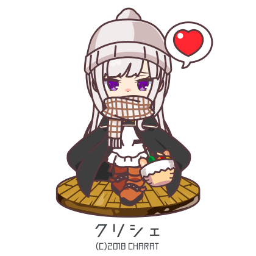
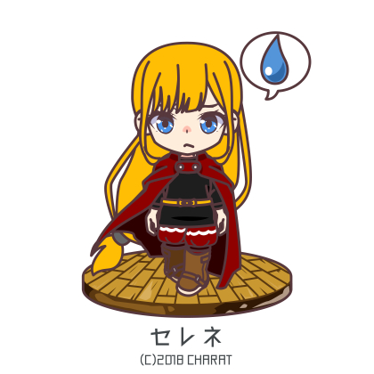
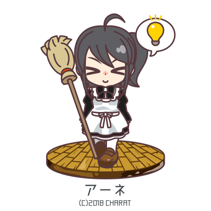
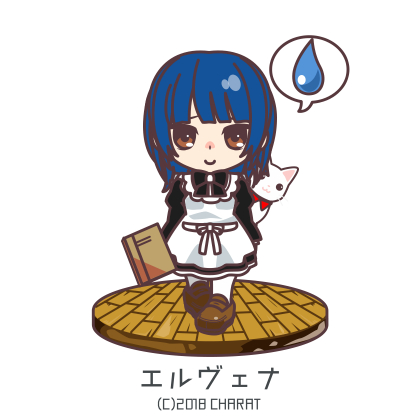
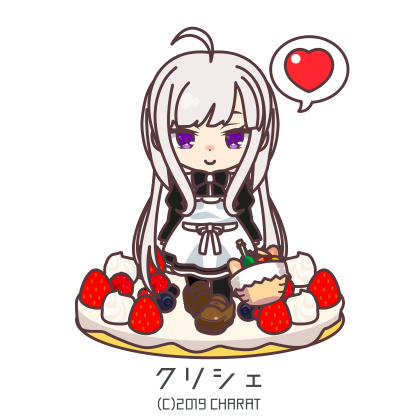
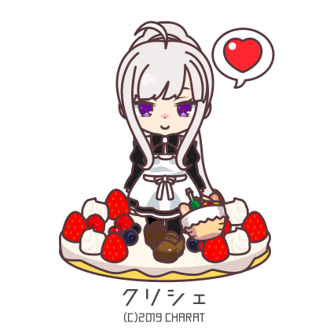
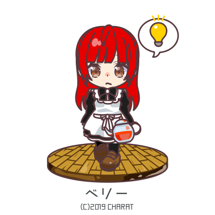
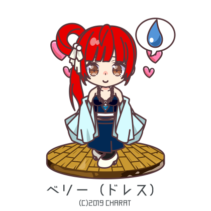

# Translation Diff Report: Chapters 42–310

## Summary

**231** chapter(s) have line count differences  **44** flagged as severe (bold)

| Ch | Raw | EN | Delta | Trans file |
|---:|---:|---:|---|---|
| 42 | 169 | 169 | OK | `c42-45.md` |
| 43 | 182 | 182 | OK | `c42-45.md` |
| [44](#chapter-44) | 150 | 152 | +2 (extra) | `c42-45.md` |
| [45](#chapter-45) | 230 | 237 | +7 (extra) | `c42-45.md` |
| 46 | 242 | 242 | OK | `c46-50.md` |
| [47](#chapter-47) | 211 | 213 | +2 (extra) | `c46-50.md` |
| [48](#chapter-48) | 248 | 250 | +2 (extra) | `c46-50.md` |
| [49](#chapter-49) | 238 | 239 | +1 (extra) | `c46-50.md` |
| [50](#chapter-50) | 224 | 242 | **+18 (EXTRA)** | `c46-50.md` |
| [51](#chapter-51) | 208 | 209 | +1 (extra) | `c51-55.md` |
| [52](#chapter-52) | 172 | 173 | +1 (extra) | `c51-55.md` |
| [53](#chapter-53) | 251 | 253 | +2 (extra) | `c51-55.md` |
| 54 | 252 | 252 | OK | `c51-55.md` |
| [55](#chapter-55) | 230 | 252 | **+22 (EXTRA)** | `c51-55.md` |
| [56](#chapter-56) | 292 | 294 | +2 (extra) | `c56-60.md` |
| [57](#chapter-57) | 357 | 358 | +1 (extra) | `c56-60.md` |
| [58](#chapter-58) | 354 | 357 | +3 (extra) | `c56-60.md` |
| [59](#chapter-59) | 221 | 222 | +1 (extra) | `c56-60.md` |
| [60](#chapter-60) | 288 | 302 | +14 (extra) | `c56-60.md` |
| [61](#chapter-61) | 240 | 241 | +1 (extra) | `c61-65.md` |
| [62](#chapter-62) | 293 | 294 | +1 (extra) | `c61-65.md` |
| [63](#chapter-63) | 277 | 279 | +2 (extra) | `c61-65.md` |
| [64](#chapter-64) | 281 | 267 | -14 (missing) | `c61-65.md` |
| [65](#chapter-65) | 217 | 224 | +7 (extra) | `c61-65.md` |
| 66 | 229 | 229 | OK | `c66-70.md` |
| [67](#chapter-67) | 233 | 234 | +1 (extra) | `c66-70.md` |
| [68](#chapter-68) | 224 | 223 | -1 (missing) | `c66-70.md` |
| [69](#chapter-69) | 195 | 197 | +2 (extra) | `c66-70.md` |
| [70](#chapter-70) | 376 | 390 | +14 (extra) | `c66-70.md` |
| [71](#chapter-71) | 275 | 272 | -3 (missing) | `c71-75.md` |
| 72 | 321 | 321 | OK | `c71-75.md` |
| 73 | 281 | 281 | OK | `c71-75.md` |
| 74 | 302 | 302 | OK | `c71-75.md` |
| [75](#chapter-75) | 395 | 419 | **+24 (EXTRA)** | `c71-75.md` |
| 76 | 344 | 344 | OK | `c76-80.md` |
| [77](#chapter-77) | 191 | 192 | +1 (extra) | `c76-80.md` |
| 78 | 292 | 292 | OK | `c76-80.md` |
| [79](#chapter-79) | 351 | 350 | -1 (missing) | `c76-80.md` |
| [80](#chapter-80) | 313 | 320 | +7 (extra) | `c76-80.md` |
| [81](#chapter-81) | 201 | 204 | +3 (extra) | `c81-85.md` |
| [82](#chapter-82) | 489 | 491 | +2 (extra) | `c81-85.md` |
| [83](#chapter-83) | 225 | 228 | +3 (extra) | `c81-85.md` |
| [84](#chapter-84) | 810 | 443 | **-367 (MISSING)** | `c81-85.md` |
| [85](#chapter-85) | 47 | 46 | -1 (missing) | `c81-85.md` |
| 86 | 281 | 281 | OK | `c86-90.md` |
| 87 | 168 | 168 | OK | `c86-90.md` |
| [88](#chapter-88) | 206 | 113 | **-93 (MISSING)** | `c86-90.md` |
| [89](#chapter-89) | 182 | 183 | +1 (extra) | `c86-90.md` |
| 90 | 192 | 192 | OK | `c86-90.md` |
| [91](#chapter-91) | 221 | 222 | +1 (extra) | `c91-95.md` |
| 92 | 255 | 255 | OK | `c91-95.md` |
| [93](#chapter-93) | 189 | 191 | +2 (extra) | `c91-95.md` |
| [94](#chapter-94) | 293 | 286 | -7 (missing) | `c91-95.md` |
| [95](#chapter-95) | 215 | 113 | **-102 (MISSING)** | `c91-95.md` |
| 96 | 251 | 251 | OK | `c96-100.md` |
| 97 | 192 | 192 | OK | `c96-100.md` |
| [98](#chapter-98) | 171 | 173 | +2 (extra) | `c96-100.md` |
| [99](#chapter-99) | 191 | 193 | +2 (extra) | `c96-100.md` |
| [100](#chapter-100) | 271 | 270 | -1 (missing) | `c96-100.md` |
| [101](#chapter-101) | 218 | 219 | +1 (extra) | `c101-105.md` |
| [102](#chapter-102) | 359 | 361 | +2 (extra) | `c101-105.md` |
| [103](#chapter-103) | 207 | 205 | -2 (missing) | `c101-105.md` |
| [104](#chapter-104) | 251 | 248 | -3 (missing) | `c101-105.md` |
| [105](#chapter-105) | 293 | 306 | +13 (extra) | `c101-105.md` |
| [106](#chapter-106) | 357 | 356 | -1 (missing) | `c106-110.md` |
| 107 | 364 | 364 | OK | `c106-110.md` |
| [108](#chapter-108) | 286 | 288 | +2 (extra) | `c106-110.md` |
| [109](#chapter-109) | 411 | 410 | -1 (missing) | `c106-110.md` |
| [110](#chapter-110) | 448 | 464 | **+16 (EXTRA)** | `c106-110.md` |
| [111](#chapter-111) | 376 | 382 | +6 (extra) | `c111-115.md` |
| [112](#chapter-112) | 968 | 880 | **-88 (MISSING)** | `c111-115.md` |
| [113](#chapter-113) | 53 | 54 | +1 (extra) | `c111-115.md` |
| [114](#chapter-114) | 173 | 174 | +1 (extra) | `c111-115.md` |
| [115](#chapter-115) | 119 | 152 | **+33 (EXTRA)** | `c111-115.md` |
| 116 | 186 | 186 | OK | `c116-120.md` |
| [117](#chapter-117) | 168 | 167 | -1 (missing) | `c116-120.md` |
| [118](#chapter-118) | 155 | 153 | -2 (missing) | `c116-120.md` |
| 119 | 157 | 157 | OK | `c116-120.md` |
| [120](#chapter-120) | 196 | 207 | +11 (extra) | `c116-120.md` |
| 121 | 198 | 198 | OK | `c121-125.md` |
| [122](#chapter-122) | 184 | 186 | +2 (extra) | `c121-125.md` |
| [123](#chapter-123) | 178 | 176 | -2 (missing) | `c121-125.md` |
| [124](#chapter-124) | 228 | 227 | -1 (missing) | `c121-125.md` |
| [125](#chapter-125) | 259 | 275 | **+16 (EXTRA)** | `c121-125.md` |
| [126](#chapter-126) | 211 | 212 | +1 (extra) | `c126-130.md` |
| [127](#chapter-127) | 313 | 314 | +1 (extra) | `c126-130.md` |
| [128](#chapter-128) | 341 | 343 | +2 (extra) | `c126-130.md` |
| [129](#chapter-129) | 272 | 273 | +1 (extra) | `c126-130.md` |
| [130](#chapter-130) | 350 | 354 | +4 (extra) | `c126-130.md` |
| 131 | 253 | 253 | OK | `c131-135.md` |
| [132](#chapter-132) | 165 | 166 | +1 (extra) | `c131-135.md` |
| [133](#chapter-133) | 150 | 152 | +2 (extra) | `c131-135.md` |
| [134](#chapter-134) | 184 | 187 | +3 (extra) | `c131-135.md` |
| [135](#chapter-135) | 131 | 134 | +3 (extra) | `c131-135.md` |
| [136](#chapter-136) | 161 | 162 | +1 (extra) | `c136-140.md` |
| 137 | 208 | 208 | OK | `c136-140.md` |
| [138](#chapter-138) | 190 | 191 | +1 (extra) | `c136-140.md` |
| [139](#chapter-139) | 187 | 185 | -2 (missing) | `c136-140.md` |
| [140](#chapter-140) | 156 | 172 | **+16 (EXTRA)** | `c136-140.md` |
| [141](#chapter-141) | 249 | 217 | **-32 (MISSING)** | `c141-145.md` |
| [142](#chapter-142) | 283 | 232 | **-51 (MISSING)** | `c141-145.md` |
| [143](#chapter-143) | 270 | 244 | **-26 (MISSING)** | `c141-145.md` |
| [144](#chapter-144) | 287 | 225 | **-62 (MISSING)** | `c141-145.md` |
| [145](#chapter-145) | 134 | 154 | **+20 (EXTRA)** | `c141-145.md` |
| [146](#chapter-146) | 975 | 882 | **-93 (MISSING)** | `c146-150.md` |
| [147](#chapter-147) | 237 | 233 | -4 (missing) | `c146-150.md` |
| [148](#chapter-148) | 261 | 260 | -1 (missing) | `c146-150.md` |
| [149](#chapter-149) | 282 | 284 | +2 (extra) | `c146-150.md` |
| [150](#chapter-150) | 284 | 308 | **+24 (EXTRA)** | `c146-150.md` |
| 151 | 329 | 329 | OK | `c151-155.md` |
| [152](#chapter-152) | 248 | 249 | +1 (extra) | `c151-155.md` |
| 153 | 256 | 256 | OK | `c151-155.md` |
| [154](#chapter-154) | 296 | 279 | **-17 (MISSING)** | `c151-155.md` |
| [155](#chapter-155) | 196 | 221 | **+25 (EXTRA)** | `c151-155.md` |
| [156](#chapter-156) | 177 | 171 | -6 (missing) | `c156-160.md` |
| [157](#chapter-157) | 228 | 222 | -6 (missing) | `c156-160.md` |
| [158](#chapter-158) | 191 | 189 | -2 (missing) | `c156-160.md` |
| [159](#chapter-159) | 294 | 292 | -2 (missing) | `c156-160.md` |
| [160](#chapter-160) | 176 | 189 | +13 (extra) | `c156-160.md` |
| [161](#chapter-161) | 278 | 255 | **-23 (MISSING)** | `c161-165.md` |
| [162](#chapter-162) | 436 | 433 | -3 (missing) | `c161-165.md` |
| [163](#chapter-163) | 270 | 241 | **-29 (MISSING)** | `c161-165.md` |
| [164](#chapter-164) | 186 | 178 | -8 (missing) | `c161-165.md` |
| [165](#chapter-165) | 199 | 184 | **-15 (MISSING)** | `c161-165.md` |
| [166](#chapter-166) | 231 | 161 | **-70 (MISSING)** | `c166-170.md` |
| [167](#chapter-167) | 231 | 165 | **-66 (MISSING)** | `c166-170.md` |
| [168](#chapter-168) | 220 | 162 | **-58 (MISSING)** | `c166-170.md` |
| [169](#chapter-169) | 186 | 127 | **-59 (MISSING)** | `c166-170.md` |
| [170](#chapter-170) | 244 | 179 | **-65 (MISSING)** | `c166-170.md` |
| [171](#chapter-171) | 259 | 260 | +1 (extra) | `c171-175.md` |
| [172](#chapter-172) | 165 | 164 | -1 (missing) | `c171-175.md` |
| [173](#chapter-173) | 1132 | 742 | **-390 (MISSING)** | `c171-175.md` |
| [174](#chapter-174) | 293 | 250 | **-43 (MISSING)** | `c171-175.md` |
| [175](#chapter-175) | 252 | 265 | +13 (extra) | `c171-175.md` |
| [176](#chapter-176) | 242 | 243 | +1 (extra) | `c176-180.md` |
| [177](#chapter-177) | 195 | 196 | +1 (extra) | `c176-180.md` |
| [178](#chapter-178) | 267 | 268 | +1 (extra) | `c176-180.md` |
| [179](#chapter-179) | 253 | 251 | -2 (missing) | `c176-180.md` |
| [180](#chapter-180) | 262 | 275 | +13 (extra) | `c176-180.md` |
| [181](#chapter-181) | 262 | 263 | +1 (extra) | `c181-185.md` |
| [182](#chapter-182) | 346 | 347 | +1 (extra) | `c181-185.md` |
| 183 | 242 | 242 | OK | `c181-185.md` |
| 184 | 243 | 243 | OK | `c181-185.md` |
| [185](#chapter-185) | 331 | 326 | -5 (missing) | `c181-185.md` |
| [186](#chapter-186) | 296 | 297 | +1 (extra) | `c186-190.md` |
| [187](#chapter-187) | 269 | 270 | +1 (extra) | `c186-190.md` |
| [188](#chapter-188) | 173 | 174 | +1 (extra) | `c186-190.md` |
| 189 | 273 | 273 | OK | `c186-190.md` |
| [190](#chapter-190) | 193 | 206 | +13 (extra) | `c186-190.md` |
| [191](#chapter-191) | 266 | 269 | +3 (extra) | `c191-195.md` |
| [192](#chapter-192) | 283 | 285 | +2 (extra) | `c191-195.md` |
| [193](#chapter-193) | 322 | 325 | +3 (extra) | `c191-195.md` |
| [194](#chapter-194) | 281 | 282 | +1 (extra) | `c191-195.md` |
| [195](#chapter-195) | 320 | 317 | -3 (missing) | `c191-195.md` |
| [196](#chapter-196) | 242 | 234 | -8 (missing) | `c196-200.md` |
| [197](#chapter-197) | 222 | 220 | -2 (missing) | `c196-200.md` |
| [198](#chapter-198) | 393 | 394 | +1 (extra) | `c196-200.md` |
| [199](#chapter-199) | 241 | 240 | -1 (missing) | `c196-200.md` |
| [200](#chapter-200) | 1324 | 31 | **-1293 (MISSING)** | `c196-200.md` |
| [201](#chapter-201) | 280 | 281 | +1 (extra) | `c201-205.md` |
| [202](#chapter-202) | 203 | 206 | +3 (extra) | `c201-205.md` |
| [203](#chapter-203) | 253 | 254 | +1 (extra) | `c201-205.md` |
| [204](#chapter-204) | 218 | 220 | +2 (extra) | `c201-205.md` |
| [205](#chapter-205) | 250 | 249 | -1 (missing) | `c201-205.md` |
| [206](#chapter-206) | 260 | 261 | +1 (extra) | `c206-210.md` |
| [207](#chapter-207) | 209 | 210 | +1 (extra) | `c206-210.md` |
| [208](#chapter-208) | 275 | 277 | +2 (extra) | `c206-210.md` |
| [209](#chapter-209) | 256 | 258 | +2 (extra) | `c206-210.md` |
| [210](#chapter-210) | 202 | 180 | **-22 (MISSING)** | `c206-210.md` |
| [211](#chapter-211) | 205 | 208 | +3 (extra) | `c211-215.md` |
| [212](#chapter-212) | 161 | 164 | +3 (extra) | `c211-215.md` |
| [213](#chapter-213) | 236 | 241 | +5 (extra) | `c211-215.md` |
| [214](#chapter-214) | 250 | 251 | +1 (extra) | `c211-215.md` |
| [215](#chapter-215) | 199 | 225 | **+26 (EXTRA)** | `c211-215.md` |
| [216](#chapter-216) | 183 | 181 | -2 (missing) | `c216-220.md` |
| [217](#chapter-217) | 162 | 163 | +1 (extra) | `c216-220.md` |
| [218](#chapter-218) | 174 | 175 | +1 (extra) | `c216-220.md` |
| [219](#chapter-219) | 172 | 174 | +2 (extra) | `c216-220.md` |
| [220](#chapter-220) | 187 | 185 | -2 (missing) | `c216-220.md` |
| [221](#chapter-221) | 194 | 198 | +4 (extra) | `c221-225.md` |
| [222](#chapter-222) | 1384 | 345 | **-1039 (MISSING)** | `c221-225.md` |
| [223](#chapter-223) | 85 | 87 | +2 (extra) | `c221-225.md` |
| [224](#chapter-224) | 233 | 235 | +2 (extra) | `c221-225.md` |
| [225](#chapter-225) | 202 | 213 | +11 (extra) | `c221-225.md` |
| [226](#chapter-226) | 191 | 193 | +2 (extra) | `c226-230.md` |
| [227](#chapter-227) | 350 | 353 | +3 (extra) | `c226-230.md` |
| [228](#chapter-228) | 193 | 196 | +3 (extra) | `c226-230.md` |
| 229 | 162 | 162 | OK | `c226-230.md` |
| [230](#chapter-230) | 138 | 139 | +1 (extra) | `c226-230.md` |
| [231](#chapter-231) | 228 | 229 | +1 (extra) | `c231-235.md` |
| [232](#chapter-232) | 190 | 192 | +2 (extra) | `c231-235.md` |
| [233](#chapter-233) | 178 | 180 | +2 (extra) | `c231-235.md` |
| [234](#chapter-234) | 176 | 179 | +3 (extra) | `c231-235.md` |
| 235 | 189 | 189 | OK | `c231-235.md` |
| [236](#chapter-236) | 288 | 290 | +2 (extra) | `c236-240.md` |
| [237](#chapter-237) | 300 | 305 | +5 (extra) | `c236-240.md` |
| [238](#chapter-238) | 183 | 184 | +1 (extra) | `c236-240.md` |
| 239 | 236 | 236 | OK | `c236-240.md` |
| [240](#chapter-240) | 335 | 336 | +1 (extra) | `c236-240.md` |
| [241](#chapter-241) | 299 | 285 | -14 (missing) | `c241-245.md` |
| [242](#chapter-242) | 251 | 253 | +2 (extra) | `c241-245.md` |
| [243](#chapter-243) | 201 | 202 | +1 (extra) | `c241-245.md` |
| 244 | 280 | 280 | OK | `c241-245.md` |
| [245](#chapter-245) | 239 | 240 | +1 (extra) | `c241-245.md` |
| [246](#chapter-246) | 185 | 186 | +1 (extra) | `c246-250.md` |
| [247](#chapter-247) | 266 | 267 | +1 (extra) | `c246-250.md` |
| [248](#chapter-248) | 78 | 80 | +2 (extra) | `c246-250.md` |
| 249 | 213 | 213 | OK | `c246-250.md` |
| [250](#chapter-250) | 221 | 220 | -1 (missing) | `c246-250.md` |
| [251](#chapter-251) | 229 | 231 | +2 (extra) | `c251-255.md` |
| [252](#chapter-252) | 281 | 284 | +3 (extra) | `c251-255.md` |
| [253](#chapter-253) | 219 | 222 | +3 (extra) | `c251-255.md` |
| [254](#chapter-254) | 224 | 227 | +3 (extra) | `c251-255.md` |
| [255](#chapter-255) | 201 | 200 | -1 (missing) | `c251-255.md` |
| [256](#chapter-256) | 427 | 432 | +5 (extra) | `c256-260.md` |
| [257](#chapter-257) | 272 | 274 | +2 (extra) | `c256-260.md` |
| [258](#chapter-258) | 358 | 361 | +3 (extra) | `c256-260.md` |
| [259](#chapter-259) | 333 | 332 | -1 (missing) | `c256-260.md` |
| [260](#chapter-260) | 664 | 583 | **-81 (MISSING)** | `c256-260.md` |
| [261](#chapter-261) | 434 | 401 | **-33 (MISSING)** | `c261-265.md` |
| [262](#chapter-262) | 443 | 302 | **-141 (MISSING)** | `c261-265.md` |
| [263](#chapter-263) | 568 | 402 | **-166 (MISSING)** | `c261-265.md` |
| [264](#chapter-264) | 673 | 329 | **-344 (MISSING)** | `c261-265.md` |
| [265](#chapter-265) | 795 | 486 | **-309 (MISSING)** | `c261-265.md` |
| [266](#chapter-266) | 209 | 210 | +1 (extra) | `c266-270.md` |
| [267](#chapter-267) | 311 | 313 | +2 (extra) | `c266-270.md` |
| [268](#chapter-268) | 169 | 171 | +2 (extra) | `c266-270.md` |
| [269](#chapter-269) | 355 | 336 | **-19 (MISSING)** | `c266-270.md` |
| [270](#chapter-270) | 294 | 297 | +3 (extra) | `c266-270.md` |
| [271](#chapter-271) | 417 | 421 | +4 (extra) | `c271-275.md` |
| [272](#chapter-272) | 235 | 234 | -1 (missing) | `c271-275.md` |
| [273](#chapter-273) | 371 | 369 | -2 (missing) | `c271-275.md` |
| [274](#chapter-274) | 342 | 341 | -1 (missing) | `c271-275.md` |
| [275](#chapter-275) | 284 | 282 | -2 (missing) | `c271-275.md` |
| [276](#chapter-276) | 266 | 267 | +1 (extra) | `c276-280.md` |
| [277](#chapter-277) | 245 | 249 | +4 (extra) | `c276-280.md` |
| [278](#chapter-278) | 330 | 332 | +2 (extra) | `c276-280.md` |
| 279 | 293 | 293 | OK | `c276-280.md` |
| 280 | 269 | 269 | OK | `c276-280.md` |
| [281](#chapter-281) | 495 | 496 | +1 (extra) | `c281-285.md` |
| [282](#chapter-282) | 230 | 231 | +1 (extra) | `c281-285.md` |
| 283 | 269 | 269 | OK | `c281-285.md` |
| [284](#chapter-284) | 285 | 287 | +2 (extra) | `c281-285.md` |
| [285](#chapter-285) | 258 | 261 | +3 (extra) | `c281-285.md` |
| [286](#chapter-286) | 249 | 244 | -5 (missing) | `c286-290.md` |
| [287](#chapter-287) | 280 | 225 | **-55 (MISSING)** | `c286-290.md` |
| [288](#chapter-288) | 310 | 265 | **-45 (MISSING)** | `c286-290.md` |
| [289](#chapter-289) | 430 | 393 | **-37 (MISSING)** | `c286-290.md` |
| [290](#chapter-290) | 227 | 236 | +9 (extra) | `c286-290.md` |
| [291](#chapter-291) | 362 | 364 | +2 (extra) | `c291-295.md` |
| 292 | 240 | 240 | OK | `c291-295.md` |
| [293](#chapter-293) | 276 | 278 | +2 (extra) | `c291-295.md` |
| [294](#chapter-294) | 225 | 224 | -1 (missing) | `c291-295.md` |
| 295 | 199 | 199 | OK | `c291-295.md` |
| [296](#chapter-296) | 195 | 196 | +1 (extra) | `c296-300.md` |
| [297](#chapter-297) | 261 | 259 | -2 (missing) | `c296-300.md` |
| [298](#chapter-298) | 352 | 353 | +1 (extra) | `c296-300.md` |
| [299](#chapter-299) | 294 | 299 | +5 (extra) | `c296-300.md` |
| [300](#chapter-300) | 305 | 304 | -1 (missing) | `c296-300.md` |
| [301](#chapter-301) | 254 | 255 | +1 (extra) | `c301-305.md` |
| [302](#chapter-302) | 200 | 198 | -2 (missing) | `c301-305.md` |
| [303](#chapter-303) | 329 | 328 | -1 (missing) | `c301-305.md` |
| [304](#chapter-304) | 170 | 171 | +1 (extra) | `c301-305.md` |
| 305 | 295 | 295 | OK | `c301-305.md` |
| [306](#chapter-306) | 216 | 218 | +2 (extra) | `c306-310.md` |
| [307](#chapter-307) | 256 | 258 | +2 (extra) | `c306-310.md` |
| [308](#chapter-308) | 231 | 232 | +1 (extra) | `c306-310.md` |
| [309](#chapter-309) | 356 | 354 | -2 (missing) | `c306-310.md` |
| [310](#chapter-310) | 287 | 285 | -2 (missing) | `c306-310.md` |

---

## Chapter 44

| | |
|---|---|
| Raw file | `044_しあわせの方法論.txt` |
| Translated file | `c42-45.md` |
| Raw line count | 150 |
| Translated line count | 152 |
| **Verdict** | **2 line(s) EXTRA in translation** |

### Likely Missing Lines (raw Japanese)

*These raw lines appear to have no corresponding translation.*

| Raw Line # | Japanese Content |
|---:|---|
| 94 | 「わたくしも今日の無礼は見なかったことにしてあげますわ」 |
| 95 | そう、とセレネはくすりと笑って、尋ねた。 |
| 96 | 「紅茶、おいしい？」 |
| 97 | 「……まぁまぁですわ」 |
| 98 | 「ふふ、もう少ししたらクリシェとベリーがおいしいクッキーを持ってきてくれるわ。あなたも好きでしょ？」 |
| 99 | 「……嫌いじゃありませんわ」 |
| 100 | 「クリシェと違って素直じゃありませんわね、王女殿下。……ふふ、そういうところはとっても可愛くて、気にいってるの。本当よ？」 |
| 101 | クレシェンタは頬を赤らめ、セレネを睨む。 |
| 102 | 「わたくしはとっても不愉快ですわ」 |
| 103 | 「そう。でも、まぁ、仲良くしましょう？　あなたがクリシェの妹なら、あなたはわたしの妹でもあるんだもの」 |
| 104 | 「……勝手に妹にしないで下さいまし」 |
| 108 | 新兵訓練から兵站、兵士達の様々な不満を聞き、その要求を満たしてやるべく頭を使う。 |
| 109 | 間をいくつも挟んだ報告だけでは壁が出来る。 |
| 110 | 壁が出来れば知らない間に不満が溜まる恐れがある。 |
| 111 | セレネ自らが率先して、話しやすい雰囲気を作り、同じ目線で会話をするのが重要なのだと考えていた。 |
| 124 | 「うぅ、すみません……」 |
| 127 | どことなく、嬉しそうな顔だった。 |

### Likely Extra Lines (English translation)

*These translated lines appear to have no corresponding source.*

| Trans Line # | English Content |
|---:|---|
| 88 | "……I heard something very similar from Argan-sama as well." |
| 89 | Kreschenta drained her cooled tea and held the cup out to Selene. |
| 90 | Selene silently poured more tea, prepared it the same way as before — sweet, with plenty of milk. |
| 91 | When she handed it over, Kreschenta's expression softened just slightly. |
| 92 | "I promised onee-sama that I wouldn't do anything like that again. That I would at least consult with her. I don't want onee-sama to kill me, after all. I came here to build a safe place together with onee-sama. Isn't that enough to earn your trust?" |
| 93 | "Yes, that's sufficient. ……You're young, after all. I'll forgive you for this time." |
| 94 | "And I'll overlook today's rudeness." |
| 95 | *Is that so*, Selene said with a faint laugh, and asked. |
| 96 | "Is the tea good?" |
| 97 | "……It's passable." |
| 98 | "Fufu, before long Krische and Bery will bring some lovely cookies. You like those too, don't you?" |
| 99 | "……I don't dislike them." |
| 100 | "Not as honest as Krische, are you, Your Highness. ……Fufu, that's something I find quite adorable about you. I mean it." |
| 101 | Kreschenta blushed and glared at Selene. |
| 102 | "I am very displeased." |
| 103 | "I know. But, well — shall we get along? If you're Krische's little sister, then you're my little sister too." |
| 126 | "Um……" |
| 127 | Bery smiled wryly at the confused Selene. |
| 152 | * * * |

---

## Chapter 45

| | |
|---|---|
| Raw file | `045_賢いアーネと百人隊.txt` |
| Translated file | `c42-45.md` |
| Raw line count | 230 |
| Translated line count | 237 |
| **Verdict** | **7 line(s) EXTRA in translation** |

### Likely Missing Lines (raw Japanese)

*These raw lines appear to have no corresponding translation.*

| Raw Line # | Japanese Content |
|---:|---|
| 17 | 他の部隊は優秀なクリシュタンドの兵士達が指導を行なっていたため、それほど気にしなくて良かった、という判断もある。 |
| 34 | 基本的に五人一組の体制で訓練生は行動させる。 |
| 35 | 朝からぐるりと重装歩兵の完全装備で城砦を走り回らせ、そのまま休憩も取らずに剣の素振り。そして五人対五人で隊列を組ませ、大盾による押し合い勝負を行なわせ、負ければ更に城砦を走らせる。 |
| 36 | 準備運動はそのくらいで、その次には魔力を使わなければ持てないくらいの重量物を背中に担がせて行軍。 |
| 57 | クリシェは磁石を張り付け、先日の戦いを再現する。 |
| 58 | 「つまり、先日帝国が攻めてきた際の戦いは、クリシュタンド軍の戦略的敗北に他なりません。敵に倍する兵力優越を作っていれば、クリシュタンド軍はそのまま正面対決でサルシェンカ軍を打ち破れば良かったのですから」 |
| 59 | クリシェの言葉はクリシュタンド、ひいては王国軍への堂々過ぎる批判であった。 |
| 60 | 訓練生達は顔を見合わせ、ダグラが傾注と叫ぶ。 |
| 79 | クリシェが視線をダグラにやると、ダグラは頷き、告げる。 |
| 80 | 「この部隊は皆が皆、魔力という特殊な才能を扱うもので構成される。それによる身体能力の高さは、鍛え上げればいずれも並の兵士など相手にならぬ力を貴様らに与えるだろう。その力は百人で千人を斬り殺すことを可能とし、その機動力は敵を攪乱しその脆弱部を貫くものとなる。要するに、貴様らは常に戦場における勝敗の分岐点で働いてもらうということだ」 |
| 94 | 『あ、手前から二番目は黒です。そのまま黒の場所へ』 |
| 95 | などというクリシェの声を聞いたのであった。 |
| 101 | 「――というのが想定された状況です。どうしますか？」 |
| 107 | 互いに弓兵を有する一個大隊１０００人で、向こうはこちらへの渡河を企てる。 |
| 108 | こちらはそれを防がなければならない。防御するのはどこが適切か。 |
| 192 | 方向性の違いはあっても似たようなもの。 |

### Likely Extra Lines (English translation)

*These translated lines appear to have no corresponding source.*

| Trans Line # | English Content |
|---:|---|
| 35 | That was the warm-up. Next, they were made to carry weights on their backs heavy enough that mana was required to lift them — on a forced march. |
| 36 | In each team of five, two bore the weight while the remaining three assisted. Each team was required to carry a minimum of two loads, with a third or fourth earning rewards such as extra dessert at meals. |
| 58 | The trainees exchanged glances, and Dagra barked, *Attention*. |
| 60 | "Through training intensity, command and control, and tactics, the Christand forces defeated Sarshenka. But Krische does not want you to misunderstand. What matters first is force superiority. As Mia said, attacking Dagra with multiple people — that is the correct answer." |
| 61 | Krische poured tea as she spoke, added two spoonfuls of honey, poured in plenty of milk, and stirred. |
| 62 | Her expression was one of thorough contentment, at complete odds with the content of her lecture. |
| 80 | "That means you'll have the chance to earn greater glory than any other unit. What you'll be aiming for isn't holding the line. It's collapsing the enemy's line and taking the enemy commander's head — the decisive result. You'll be entrusted with the role everyone dreams of, and only that role. ……Can a soldier ask for greater honor?" |
| 81 | The trainees exchanged glances, and expressions of delight appeared. |
| 88 | An uneducated villager could not simply walk in. |
| 89 | If she were assigned to a battalion's provisions section, she could have gotten the role she wanted — but being part of a battalion meant being a soldier, and soldiers had to fight. |
| 96 | Having vaguely perceived the mana that clung to her body, she had naturally learned to use it through daily life. |
| 226 | * * * |
| 227 | **(T/N:)** |
| 228 | 1. **Zalbak (ザルバック)** and **Kart (カート)** — New characters. Zalbak is the head cook of Fort Belgash; Kart is the young man who manages meal distribution at the fortress. These names are not in the knowledge base. Flagged for KB update. |
| 229 | 2. **Narga (ナルガ)**, **Odal (オーダル)**, **Tagel (タゲル)**, **Mia (ミア)** — New named trainees/soldiers in the black century. Flagged for KB update. |
| 230 | 3. **"Holy war" (聖戦)** — Used satirically for the kitchen rivalry. The chapter title "厨房の聖戦" is literally "Holy War in the Kitchen." |
| 231 | 4. **"Seven flaws" (七色の欠点)** — Literally "seven-colored flaws," a playful description of Anne. "七色" (seven colors) is used idiomatically to mean "many and varied." |
| 232 | 5. **"Black" (黒)** — The designation for mana-apt recruits, established in C.41. Used consistently throughout. |
| 233 | 6. **Captain / Centurion hierarchy** — Per the established military ranks: Centurion (百人隊長) commands 100; Captain (兵長) commands ~50. In C.45, "伍長" (sergeant/corporal) appears for Mia's initial rank — rendered as "sergeant" here to distinguish from the five-man squad "corporal" (五人長). The text explicitly states 伍長 for Mia's rank and 兵長 for the captain positions. |
| 234 | 7. **"Corps Commander's Adjutant" (軍団長副官)** — Krische's working title throughout the recruitment and training chapters, used by the soldiers when addressing her. |
| 235 | 8. **Measurement/rank note**: 兵長 is rendered "captain" per the established rank table (commands ~50). 伍長 is rendered "sergeant" for Mia's rank to maintain the established hierarchy. The text uses 副官 (adjutant) for Mia's role under Dagra. |
| 236 | 9. **"Anne Category" (アーネカテゴリ)** — The original text uses the katakana カテゴリ (category). Krische mentally files Mia in the same category as Anne. Translated literally to preserve the humor. |
| 237 | --- |

---

## Chapter 47

| | |
|---|---|
| Raw file | `047_満ち、欠け.txt` |
| Translated file | `c46-50.md` |
| Raw line count | 211 |
| Translated line count | 213 |
| **Verdict** | **2 line(s) EXTRA in translation** |

### Likely Missing Lines (raw Japanese)

*These raw lines appear to have no corresponding translation.*

| Raw Line # | Japanese Content |
|---:|---|
| 18 | 『あなたが行きなさいよ、あたしベリーお嬢さまは苦手なの』 |
| 19 | 『わたしだって嫌よ、気味悪くて。何考えてるかわからないもの』 |
| 31 | 「ですがラズラお嬢さまが……」 |
| 32 | 「いらないと言いました。……聞こえませんでしたか？」 |
| 33 | 顔をうかがう。 |
| 36 | 「掃除もこれからはこちらでしておきましょう。洗濯物は出しておきます。わたしが呼ぶまでこなくて構いません。一人は好きですし、不便もありませんから」 |
| 65 | 「ほらお嬢さま、こちらですよ」 |
| 66 | 「あ……」 |
| 69 | 「本当ベリーは軽いわね。小さいし。ちゃんと食べなきゃ体は良くならないわよ」 |
| 70 | 「……食べたところで変わりませんよ」 |
| 71 | 「そうやってうじうじしてるからよ」 |
| 72 | 「……ねえさまにはわかりません」 |
| 73 | 「当たり前でしょ。わたしはあなたじゃないんだもの」 |
| 76 | 「わたしは嫌いです。自分も、ねえさまも」 |
| 77 | 「嘘ばっかり、わたしのことが大好きだって事はちゃんとわかってるんだから」 |
| 78 | 「さっき、わたしの気持ちなんてわからないと言ったじゃありませんか」 |
| 79 | 「物事には例外が付きものよ、細かいことを気にしないの」 |
| 87 | 「……放って置いてください」 |
| 88 | 「できるわけがないじゃない。こんなに利発で可愛いわたしの妹なのに」 |
| 89 | 「わたしなんか、ねえさまの邪魔なだけです。わたしなんて、生まれてこなければ――」 |
| 90 | 「それを言ったら怒るわよ」 |
| 91 | 言いながらも、頭を撫でる手も声も、どこまでも優しかった。 |
| 92 | 「……そして泣いちゃうかも。大好きなおねえさまを泣かせたくないならそんなことは言わないでちょうだい、ベリー」 |
| 93 | 静かな部屋に響く姉の声は何より好きだった。 |
| 96 | 「あなたは平気だって言う。大丈夫だって言う。自分には価値がないからって。……本当にあなたにとっては平気なのかも知れないわ。でも、わたしは辛いの」 |
| 97 | 「……ねえさま」 |
| 98 | 「あなたがどれだけ自分のことを悪し様に言っても、ベリーという妹はわたしにとっては大事な、とっても大事な宝物なの。そんな大事な妹のことを、そんな風に悪し様に言われるのは嫌よ」 |
| 100 | 「それにあなたに自分の価値を決める権利なんてないわ、ベリー。価値はそれを見る人が決めるの。あなたがどれだけうじうじしてても、どれだけ自分が嫌いでも、どれだけの人に嫌われても、あなたはわたしの宝物。これからもずっとそう」 |
| 101 | 「わたしは、そんな……」 |
| 104 | 「ベリーは強い子だもの。……自分がかわいそうで泣いてるんじゃなくて、わたしに迷惑を掛けるのが辛くてそんな風に泣いているんでしょう？　わたしを大切に想って泣いてしまっているそんな優しい妹に、価値がないわけないじゃない」 |
| 134 | 姉のことを、ここに来てから良く思い出す。 |
| 135 | こうした噂話を耳にするからだろう。 |
| 136 | 姉はこんな気分だったのかもしれない、と少し思う。 |
| 137 | 知らず、足を止めていた。 |
| 138 | 「頭がいかれてるってのは本当なんだろうな。将軍もどうしてそんなのを養子にされたのか」 |
| 139 | 「そりゃ腕がいいからだろう。先の戦じゃ一人で数え切れないほどの敵を殺したって話だ」 |
| 140 | クリシェは気にしない。 |
| 173 | 不快と怒りを殺してしまうとベリーは首を振る。 |
| 203 | 彼女は歪んでいる。 |

### Likely Extra Lines (English translation)

*These translated lines appear to have no corresponding source.*

| Trans Line # | English Content |
|---:|---|
| 22 | *"Lazura-ojou-sama must have taken all the good parts, surely. I'll go today, but tomorrow it's your turn."* |
| 23 | *"Fine, fine. Well, good luck then."* |
| 35 | *She read the various emotions in the depths of those eyes, and――* |
| 36 | *"I'll handle the cleaning myself from now on too. I'll leave the laundry out. You needn't come unless I call. I like being alone, and it's no inconvenience."* |
| 37 | *She told her with a smile.* |
| 38 | *"Besides, I give you the creeps, don't I? I have no need for you to force yourself on my account either."* |
| 50 | *The darkness of night looked brighter than usual, glowing gently.* |
| 51 | *She loved the full moon, that never waned――it was so beautiful.* |
| 58 | *Her sister was always free-spirited.* |
| 59 | *"Your devoted servant was just so worried, so very worried about a certain Bery-ojou-sama who apparently threw a tantrum. ……Ah, what a wonderful servant Lazura is."* |
| 60 | *"……I have no appetite."* |
| 61 | *"Now, now, don't go sulking like that."* |
| 78 | *"Just a moment ago you said you don't understand my feelings."* |
| 79 | *"Every rule has its exceptions. Don't sweat the details."* |
| 80 | *Forced into the chair, her sister smiled and stroked her head.* |
| 81 | *――Her sister was always bright and kind.* |
| 82 | *"See? You're being honest. That's proof you adore me."* |
| 97 | *"……Nee-sama."* |
| 98 | *"No matter how much you speak ill of yourself, to me, my sister Bery is precious――so, so precious, my treasure. I hate having someone I treasure that much spoken of so cruelly."* |
| 99 | *Her cheeks were cupped in both hands, and the tears that came of their own accord were gently wiped away.* |
| 100 | *"And you have no right to decide your own worth, Bery. Worth is determined by those who see it. No matter how much you mope, no matter how much you hate yourself, no matter how many people hate you, you are my treasure. Now and always."* |
| 101 | *"I'm not……anything like……"* |
| 104 | *"You're a strong girl, Bery. ……You're not crying because you feel sorry for yourself. You're crying because it hurts you to trouble me. A little sister so kind that she cries out of care for me――how could she have no worth?"* |
| 105 | *――I could never find you a burden, so please――be as spoiled as you like.* |
| 106 | *Her sister's smile was beautiful beyond measure, and it remained in her memory forever.* |
| 107 | * * * |
| 108 | The office was a little lively. |
| 109 | Since Kreschenta had begun helping, Selene's burden had decreased considerably. |
| 110 | The sight of her scolding Selene and Anne, only to be brushed off by Selene, was entertaining, and Bery was glad to see her changing for the better. |
| 111 | Bery placed her documents into a bag and stood. |
| 112 | The sun had already set. For now, the day's work was done. |
| 138 | Without realizing it, she had stopped walking. |
| 140 | "Well, because she's good at what she does, right? In the last war, they say she killed more enemies single-handedly than anyone could count." |
| 141 | Krische did not care. |
| 142 | She did not even think it mattered, and there were even hints that she would use such rumors if they proved useful. |
| 143 | If people feared her yet still obeyed, that was fine by her. |
| 144 | Simple, clear, without hesitation――and warped, and precarious. |
| 145 | "……Some guy who's from the village where Krische-sama used to live was talking about this, and apparently she's been like that since she was a kid." |
| 176 | "My, you're sweating. What happened?" |
| 202 | ――Her favorite things were cooking, eating, and being spoiled. |
| 213 | --- |

---

## Chapter 48

| | |
|---|---|
| Raw file | `048_歪み.txt` |
| Translated file | `c46-50.md` |
| Raw line count | 248 |
| Translated line count | 250 |
| **Verdict** | **2 line(s) EXTRA in translation** |

### Likely Missing Lines (raw Japanese)

*These raw lines appear to have no corresponding translation.*

| Raw Line # | Japanese Content |
|---:|---|
| 21 | 「ん……ベリーはクリシェよりお料理上手ですから、まずはクリシェより上手にならないといけませんね」 |
| 22 | 「え……？　そうなんですの？」 |
| 53 | 「今日はベーコンを使ったピザと、このお魚、ピルカーナで塩窯焼き。スープもトマトベースのものにしてしまいましょうか」 |
| 68 | 『ピルカーナを見たとき、単なる塩焼き、もしくは煮るか、その辺りだと考えた。だが、あのベリー様は侮れん。これまでの高度な料理技術から察するに、更に一歩上に行くのではないかとな。俺ですら作ったことはない、が、何を使うのかは知っている。その場には卵がおかれておらず、俺は静かに卵置き場へと間合いを詰めていた――』 |
| 69 | かつては宮廷料理人を目指し、王都で修行したこともある。 |
| 70 | 身内の不幸が重なり、実家へ戻ることにならなければ、そのまま修行を続け少なくともどこかの貴族のところで料理を振るっていただろう。 |
| 71 | そんなザルバックだからこそ、気付けた。動けた。 |
| 72 | ザルバックはそうして、誰より早い一歩を踏み出していた。 |
| 89 | 彼女らに不足が出ればどのような要望にも応えられるように。 |
| 92 | 『狙った？　まさか、職務の一環さ。在庫整理を下の者に毎日やらせるというのは僕の美学に反してね。たまにはこうしてその仕事を代行してやろうと思ったのさ。上に立つ身としてやはり基本となる作業をおろそかにしてはいけないからね。ま、偶然その時、ベリー様が卵をと仰ったから卵の近くにいた僕が――』 |
| 131 | そうしてアーネは、機を見て盛大に飛び出したのだ。 |
| 132 | 無計画に飛び出したアーネは周囲を見渡し卵を探し、ザルバックの持つ籠を見る。 |
| 133 | 「あ、わざわざありがとうございます。頂きますね」 |
| 149 | 「この子、わたくしのところにいるときもこんなこと繰り返してますのよ、全く。アルガン様、どうにかしてくださいまし」 |
| 151 | 「わ、わたくしだって今はちゃんと、セレネ様のお手伝いしてますわ。それにおねえさま、わたくし王女ですのよ？」 |
| 179 | 『クレシェンタの言い分はわかりました。でもクリシェはベリーと洗いっこしたいですから、クレシェンタが嫌ならアーネと一緒にお風呂に入ればいいです』 |
| 227 | 「……いえ。仕方の無いこともあると思います」 |

### Likely Extra Lines (English translation)

*These translated lines appear to have no corresponding source.*

| Trans Line # | English Content |
|---:|---|
| 20 | "Naturally. I'll catch up to Argan-sama in no time." |
| 24 | Bery smiled wryly and answered that it was not so at all. |
| 52 | "What shall we make today? There's fish, too……" |
| 62 | ――Once again, tension rippled through the kitchen. |
| 67 | Zalbak would later recount it thus―― |
| 68 | *"When I saw the pilkarna, I assumed simple salt-grilling, or perhaps stewing――something along those lines. But that Bery-sama is not to be underestimated. Judging from her advanced culinary techniques thus far, I suspected she would go one step further. I myself had never made it, but I knew what was needed. There were no eggs on the counter, and I quietly closed the distance to the egg stores――"* |
| 69 | He had once aspired to be a palace chef, and had even trained in the capital. |
| 70 | Had a string of family misfortunes not forced him home, he would have continued his training and at least ended up cooking for some noble household. |
| 92 | *"Was it deliberate? Hardly――it was part of the job. Having the people below me do the inventory every day offends my sense of aesthetics. I thought I'd take over the task from time to time. As a leader, one mustn't neglect the fundamentals. Well, it just so happened that at that moment, Bery-sama said she needed eggs, and I happened to be near the eggs――"* |
| 93 | The gifted Cart was, as expected, outstanding in distribution as well―― |
| 128 | Clattering and shattering the unspoken understanding, reading the room not at all, trotting forward was the woman of seven flaws――Anne. |
| 129 | The ambusher had, of course, been waiting at the entrance the whole time. |
| 130 | *I mustn't disturb the three of them while they're enjoying themselves, but I need to be ready to help the moment they need something.* |
| 152 | "All the more reason you need a servant. So it's Anne. Bery is busy taking care of Krische." |
| 153 | "Now, now, both of you……i-if you berate her too much, poor Anne-sama. She was only trying her best and stumbled a little." |
| 159 | * * * |
| 179 | Kreschenta had been complaining about Bery and Krische's mutual washing for days, and had upset Krische yesterday. |
| 227 | "Krische knows Bery doesn't like that sort of thing." |
| 250 | --- |

---

## Chapter 49

| | |
|---|---|
| Raw file | `049_気付きと彼女が望むもの.txt` |
| Translated file | `c46-50.md` |
| Raw line count | 238 |
| Translated line count | 239 |
| **Verdict** | **1 line(s) EXTRA in translation** |

### Likely Missing Lines (raw Japanese)

*These raw lines appear to have no corresponding translation.*

| Raw Line # | Japanese Content |
|---:|---|
| 68 | 「じゃあ、お好きなのですか？」 |
| 69 | 「はい……好き、です」 |
| 70 | 「わたしも大好きです。甘やかして、甘やかして、お嬢さまの仰るようにクリシェ様がお馬鹿になってしまわれるくらい、甘やかしたくなってしまうのです」 |
| 71 | 「それは、その……」 |
| 72 | 「……クリシェ様はどうでしょう？　わたしはどんなクリシェ様でも大好きですから、遠慮はいりませんよ」 |
| 74 | 「クリシェ、お馬鹿でもいいかもです……」 |
| 75 | 「ふふ」 |
| 76 | ベリーは唇を押しつけた。 |
| 77 | 顔を真っ赤にしながらもクリシェは嬉しそうに抱きつく。 |
| 83 | 例えばこのまま首を絞められても。 |
| 103 | でも、本当は彼女が全ての人に受け入れられる未来など望んでいないのではないか。 |
| 104 | 自分がそんなクリシェの、ただ一人の理解者になりたいだけで。 |
| 105 | そしてそうだと、クリシェに思ってもらいたいだけで。 |

### Likely Extra Lines (English translation)

*These translated lines appear to have no corresponding source.*

| Trans Line # | English Content |
|---:|---|
| 65 | "My, is that a problem?" |
| 66 | "Ah, no, that's not――" |
| 67 | Krische hurriedly sat up, and Bery laughed. |
| 68 | "Then do you like it?" |
| 69 | "Yes……Krische likes it." |
| 70 | "I love it too. I want to spoil you, and spoil you, until you become as silly as ojou-sama says, Krische-sama." |
| 71 | "That's, um……" |
| 72 | "……What does Krische-sama think? I love every version of Krische-sama, so there's no need to hold back." |
| 73 | When she traced Krische's lips, those eyes wandered, and she nodded. |
| 85 | She knew that Krische was that dependent on her, and she knew that she herself had made it so. |
| 100 | But Krische was the real thing, and she was the imitation. |
| 101 | She had pitied Krische, rejected by people and cast out of her village. |
| 102 | She had thought to guide this lost, wandering girl. |
| 239 | --- |

---

## Chapter 50

| | |
|---|---|
| Raw file | `050_竜の吐息.txt` |
| Translated file | `c46-50.md` |
| Raw line count | 224 |
| Translated line count | 242 |
| **Verdict** | **18 line(s) EXTRA in translation** |

### Likely Missing Lines (raw Japanese)

*These raw lines appear to have no corresponding translation.*

| Raw Line # | Japanese Content |
|---:|---|
| 4 | その二つの山の境にあるのは、拡幅されてなお幅三十間に満たない空間であった。 |
| 5 | 道として通るには易く、しかし狭いところでは十間ほどの隘路となる。 |
| 6 | 無論そんな道はどこにでもある。いやむしろ、道としては非常に広いといえるだろう。 |
| 7 | だが問題は、この道には迂回路が存在しないことだった。 |
| 16 | ――ここは竜の顎。そしてその牙の内側にあると呼ばれていた。 |
| 20 | 声は明瞭、涼やかで、しかしどこか覇気がある。 |
| 48 | 「くく、確かに。骨の抜けたお前はいらん」 |
| 49 | おかしそうにギルダンスタインは言い、ボーガンを見据えた。 |
| 50 | 「では、この場で刃を持って勝敗を決めるというのはどうか、ボーガン」 |
| 51 | 「ご冗談を。私では王弟殿下に敵いますまい」 |
| 88 | 赤く煌めく金の髪と、戦場にあっては異様な、白の優美なドレス。 |
| 95 | ボーガンは王女の前まで駆けると、馬を下りて膝を突き、頭を垂れる。 |
| 140 | クリシェが揃ったことで、誰もがボーガンに視線をやる。 |
| 156 | 軍が軍という組織として機能するために必要な手順であった。 |
| 157 | 「は。まずは第二軍団長から現状の報告を」 |
| 158 | 「はい。第二軍団、戦闘可能な現在員は３８００名。復帰可能者は２００名ほどの見込みです。補給滞りなく士気旺盛。以上です」 |
| 159 | 勇壮なる大男、コルキス＝アーグランドが答えた。 |
| 160 | 流石に王女の手前、いつもより多少声の大きさは絞っている。 |
| 161 | 中央で戦う第二軍団は軍団長コルキスの勇戦もあり、常に敵に大きな出血を強いている。 |

### Likely Extra Lines (English translation)

*These translated lines appear to have no corresponding source.*

| Trans Line # | English Content |
|---:|---|
| 3 | Mitskronia and Bernaich, dividing the capital from the north. |
| 4 | Between those two mountains lay a space barely thirty *ken* wide even after being broadened. (T/N: 三十間 ≈ approximately 60 yards / 55 meters.) |
| 5 | Easy enough to pass through as a road, yet narrowing to roughly ten *ken* at its tightest. (T/N: 十間 ≈ approximately 20 yards / 18 meters.) |
| 6 | Of course, such roads existed everywhere. If anything, it was quite wide as roads went. |
| 14 | Nothing but screams and death, swallowing countless heroes. |
| 23 | His martial valor was feared by friend and foe alike, and for that reason, those who spoke of him on the battlefield called him by a single name. |
| 51 | "Surely you jest. I could never match Your Highness in a duel." |
| 52 | "Is that so. A shame. I wanted to cross blades with you at least once, before I lose you." |
| 53 | Gildanstein said this, turned his horse, and presented his back. |
| 54 | "This is the path you chose. Don't hold it against me." |
| 58 | * * * |
| 92 | They parted from the soldiers a short distance from the encampment, and with only the two princesses and two attendants, approached the camp gate. |
| 93 | Battle after battle, life on the line. |
| 144 | "It seems we're all here. Let us begin. ――To Her Highness the Princess." |
| 155 | Royalty was absolute, and nobles were bound to obey. |
| 156 | For that reason, royalty needed to first delegate authority to the ranking commander. Only then did the commander gain the power to assess the situation and, if necessary, overrule even a royal's opinion. |
| 157 | It was a necessary procedure for the military to function as a military. |
| 158 | "Very well. Let us begin with a status report from the Second Corps Commander." |
| 159 | "Yes, sir. The Second Corps has three thousand eight hundred combat-effective personnel. Approximately two hundred are expected to return to service. Supplies are uninterrupted, morale is high. That is all." |
| 160 | The mighty giant Kokys Agrand answered. (T/N: The text reads コルキス＝アーグランド. "Kokys" is established in the knowledge base, but the kanji differs slightly from earlier chapters' rendering. The family name アーグランド differs from the established アグランド; this may be an author variation.) |
| 226 | --- |
| 227 | **(T/N: Translation Notes for Chapters 46–50)** |
| 228 | - **C.46: "うさちゃん" (bunny)** — Rendered as "bunny" throughout. The soldiers' nickname for Krische, derived from her white rabbit-like appearance. It carries both affection and a hint of derision. |
| 229 | - **C.46: "ハゲワシ" (hagewashi)** — Literally "Vulture," but the humor derives from ハゲ (bald) + ワシ (eagle/bird of prey, here "Vulture" as a bald raptor), matching Dagra's appearance. "Vulture" preserves the dual meaning of insult and bird-of-prey. |
| 230 | - **C.46: 小半刻 (ko-hantoki)** — Approximately 30 minutes in the old Japanese time system. |
| 231 | - **C.47:** The first section (Bery's flashback with Lazura) is rendered in italics to reflect the shift in register — it is a memory sequence distinct from the present-tense narrative. |
| 232 | - **C.47: "ねえさま" (nee-sama)** — Bery's address for Lazura. Kept in romanized form per translation rules. |
| 233 | - **C.48: 三間 (san-ken)** — Approximately 6 yards / 5.5 meters. |
| 234 | - **C.49: "リプス" (Ripusu)** — Bery's hidden name (真名). Romanized as "Lipus." This is a noble tradition of secret names given at birth. |
| 235 | - **C.49: "言の葉紡ぐ場所より誓いを" (kotonoha tsumugu basho yori chikai wo)** — "A vow woven from the place where words are spun." This appears to be a formulaic phrase from the old noble tradition. Translated somewhat literally to preserve its ritual quality. |
| 236 | - **C.50: 三十間 / 十間** — Approximately 60 yards / 20 yards respectively. |
| 237 | - **C.50: 一里 (ichi-ri)** — Approximately 2.4 miles / 3.9 km. |
| 238 | - **C.50: "コルキス＝アーグランド"** — The text gives this reading for the Second Corps Commander. The established knowledge base has "Kokys" and family name "Agrand" (アグランド). The difference in family name spelling (アーグランド vs アグランド) may be an author variation or typo. Flagged for knowledge base review. |
| 239 | - **C.50: "テリウス＝メルキコス"** — Third Corps Commander Terrius is given the family name メルキコス (Melkikos) here for the first time. |
| 240 | - **C.50: "エルーガ＝ファレン"** — Fourth Corps Commander Elrouga is given the family name ファレン (Faren) here for the first time. |
| 241 | - **C.50: "ご当主様" (goshujin-sama)** — Krische's formal address for Bogan as head of the Christand house. Distinct from his military rank. |
| 242 | - **C.50: "ヒルキントス" (Hilkintos)** — A new name, apparently referring to a western general or noble faction. Not in the knowledge base; flagged for update. |

---

## Chapter 51

| | |
|---|---|
| Raw file | `051_不安.txt` |
| Translated file | `c51-55.md` |
| Raw line count | 208 |
| Translated line count | 209 |
| **Verdict** | **1 line(s) EXTRA in translation** |

### Likely Missing Lines (raw Japanese)

*These raw lines appear to have no corresponding translation.*

| Raw Line # | Japanese Content |
|---:|---|
| 36 | ベリーは何も言わずにこりと笑って、また姿勢を正し、目を伏せた。 |
| 69 | 戦術においては初歩的な部分しかわかってはいないものの、頭脳はクリシェとそう変わらぬものを持ち合わせている。 |
| 108 | それが不安として自分の中へ纏わり付いているのだと、クレシェンタは考えた。 |
| 109 | クリシュタンドの軍は優秀で、どの軍よりも規律が整っている。 |
| 110 | だが、だからといって完璧なわけではない。 |
| 111 | 懸念事項は消えたほうが良いが、サルヴァのような者を一人一人始末させるというのもこの状況では不可能で、それを考えるならクリシェのみならず、ボーガンやセレネ、各軍団長がどれほどの兵達から忠誠を向けられているかというところから調べなければならない。 |
| 112 | この状況でそんなことができるはずもなく、王女という立場からクリシェの言葉を肯定するほかなかった。 |
| 113 | ボーガンはそんな言葉を聞いて、目を閉じ、決断する。 |
| 114 | 「山を焼く。感情的な面を抜きにすれば確かに、良い案だ。時に我らは国土を守るために街を焼き、村を焼くことを迫られる。今日この時も同じ――そう考えるほかあるまい。サルヴァ、納得せよ」 |
| 115 | 「……は」 |
| 116 | 「戦場はやっぱり不安が多くてだめですわ。おねえさまがそうやってのほほんとしてらっしゃる理由がさっぱりですもの」 |
| 117 | 部屋には四人。 |
| 118 | クレシェンタとベリーは簡易ベッドに腰掛け、クリシェはベリーの膝の上に横乗りで抱かれている。 |
| 119 | セレネはもはやそのことに対し苦言を口にすることも諦めた様子で椅子に座り、クレシェンタはいつもの如く、やや不満そうにクリシェに擦り寄っている。 |
| 120 | アーネはボーガンへの挨拶と世話で向こうの天幕に残っていた。 |
| 121 | 半ば、クリシェに邪魔者扱いされた結果である。 |
| 122 | 方針は定まり、人員の割り振りも定まった。 |
| 123 | セレネはベルナイクへ、クリシェはミツクロニアへ一度上がり様子を見ている。 |
| 124 | セレネは編成のためであるが、クリシェは火付けの部分に関しての指示を出すためだ。 |
| 125 | 会議はあれからも少し続き、第三軍団長テリウスの提案により明日ベルナイクから攻めると配下には伝達した。 |
| 126 | 情報が漏れるのは確実、であれば逆にミツクロニアを攻めてくるよう相手を誘導したほうが良い。 |
| 127 | 総攻撃は明後日の深夜から明け方であるが、明日行動を起こす素振りを見せ、相手の攻撃を誘い、兵を引く。 |
| 194 | 「まぁ、そうですね。向こうもこっちも全部わかってるならクリシェが負けることなんてありえませんけれど、セレネの言ったとおりですから。クリシェはわかってる情報でなんとなく適当にやってるだけですし、この前の戦だってそうです」 |
| 195 | 負けることなんてありえない、という自信しかないクリシェの言葉にセレネは眉根を寄せたものの、何も言わない。 |
| 208 | そうして竜の顎攻防戦の決着を前にした、穏やかな一夜を四人は過ごしていった。 |

### Likely Extra Lines (English translation)

*These translated lines appear to have no corresponding source.*

| Trans Line # | English Content |
|---:|---|
| 67 | Kreschenta, receiving that gaze, was also deep in thought. |
| 93 | Salva, finding her gaze upon him, hastily straightened his posture. |
| 94 | Watching Salva, Kreschenta came to understand anew what the flickering unease she had felt stemmed from. |
| 95 | That Krische was feared, and that there were those who disliked her. |
| 96 | Selene's concern was evident, but Krische — particularly within the military — had too great a tendency to disregard such relationships with others. |
| 97 | As social skill, it was far too immature, and precarious. |
| 98 | "There may be those who cannot truly accept this in their hearts. I share the pain of that feeling. But if it is to prevent even greater harm, then I wish for it." |
| 99 | That said, what to do about such people was difficult. |
| 100 | Kreschenta suspected everyone. |
| 107 | That was what clung to her as unease, Kreschenta thought. |
| 110 | It would be better if matters of concern were eliminated, but having someone dispose of people like Salva one by one was impossible in this situation, and if one were to consider it, one would need to investigate how much loyalty each soldier directed toward not only Krische but Bogan, Selene, and each corps commander. |
| 111 | There was no way to do such a thing in this situation, and from her position as princess, she could do nothing but affirm Krische's words. |
| 112 | Bogan listened to those words, closed his eyes, and made his decision. |
| 113 | "Burning the mountain. Setting sentiment aside, it is indeed a good plan. At times we are compelled to burn cities and villages in order to defend the realm. Today is no different — we have no choice but to think of it that way. Salva, accept it." |
| 114 | "……Yes, sir." |
| 115 | * * * |
| 116 | "The battlefield really is full of too many anxieties. I simply cannot fathom why onee-sama sits there so carefree." |
| 117 | Four people in the room. |
| 118 | Kreschenta and Bery sat on a field cot, and Krische was sitting sideways on Bery's lap, held in her arms. |
| 119 | Selene had apparently given up on voicing complaints about this and sat in a chair, while Kreschenta, as always, pressed against Krische with a faintly displeased look. |
| 120 | Anne had remained in the other tent to greet and attend to Bogan. |
| 121 | This was half the result of being treated as a nuisance by Krische. |
| 187 | "……That is so." |
| 188 | Kreschenta thought it over and studied Selene searchingly. |
| 204 | Krische said so and clung to Bery with a squeeze, indulging in her with a kiss. |
| 205 | Since she would not be able to come back tomorrow, stockpiling indulgence and kisses from Bery to cover tomorrow's share was only natural. |

---

## Chapter 52

| | |
|---|---|
| Raw file | `052_穏やかな時間.txt` |
| Translated file | `c51-55.md` |
| Raw line count | 172 |
| Translated line count | 173 |
| **Verdict** | **1 line(s) EXTRA in translation** |

### Likely Missing Lines (raw Japanese)

*These raw lines appear to have no corresponding translation.*

| Raw Line # | Japanese Content |
|---:|---|
| 16 | 『で、何かあったの？』と尋ねてみれば頬を赤らめ視線を揺らし、開口一番告げられたのはそんな言葉である。 |
| 24 | 『セレネ、隠し名というのは神さまの時代からの魔法の名前なの。一生のうちでただ一人、全てを捧げるその人にだけ教える魔法の名前。誰にも言っちゃ駄目よ。パパみたいな素敵な相手を見つけてわたしのように一緒になれたら、初めてその名前を捧げなさい』 |
| 149 | 求める訓練は過酷で厳しく、賞罰も明確。 |

### Likely Extra Lines (English translation)

*These translated lines appear to have no corresponding source.*

| Trans Line # | English Content |
|---:|---|
| 13 | *Could it be that things have gone as far as they can possibly go*——she had refrained from asking despite such suspicions, but they were on the eve of battle. |
| 22 | But offering one's name was an entirely rational act. |
| 148 | The way she would gather everyone in all seriousness for an impromptu cooking lesson was unthinkable for someone bearing the title of corps commander's adjutant. |
| 173 | --- |

---

## Chapter 53

| | |
|---|---|
| Raw file | `053_裏切りと信頼.txt` |
| Translated file | `c51-55.md` |
| Raw line count | 251 |
| Translated line count | 253 |
| **Verdict** | **2 line(s) EXTRA in translation** |

### Likely Missing Lines (raw Japanese)

*These raw lines appear to have no corresponding translation.*

| Raw Line # | Japanese Content |
|---:|---|
| 10 | とはいえ第三軍団が圧迫されるほどの攻勢。 |
| 11 | それはミツクロニアに敵の大兵力を引きつけているということを意味し、攻撃は予定通り行なわれる。 |
| 12 | 夕日が地に落ち空に月が高く上がる頃。 |
| 21 | ベルナイク側への総攻撃が動き出したところ。 |
| 22 | グランには第三軍団へ攻撃開始の伝令を頼んだ。 |
| 82 | そこには騎兵は存在していなかったが、それでも行かねばならない。 |
| 91 | 「……王弟殿下」 |
| 92 | 「まさか、山に火を付けるとはな。お前ならば畏れ多いと選ぶことはなさそうな策だが……お前の養女の考えか」 |
| 93 | 周囲四方には精鋭らしき影。 |
| 94 | 大軍勢ではなく小隊であった。 |
| 96 | 正面にあるのは獅子を象る兜と黒い鎧。 |
| 97 | 手に持つは長柄の大戦斧。 |
| 98 | 馬に跨がってはいなかった。 |
| 99 | 山中で戦うならば馬上はむしろ不利になる。 |
| 155 | 「第三大隊はそんなファグランのお守り。わかったかしら？」 |

### Likely Extra Lines (English translation)

*These translated lines appear to have no corresponding source.*

| Trans Line # | English Content |
|---:|---|
| 8 | However, the enemy garrison on the Bernaich side, unaware that the assault would come at night, had their morale ground down by the strain. |
| 10 | That said, an offensive fierce enough to pin the Third Corps meant that a large enemy force was being drawn to Mitskronia, and the attack would proceed as planned. |
| 18 | Bogan stood and asked. He was already in his armor. |
| 19 | "What is the situation? Who has command?" |
| 80 | He felt the blood drain from his face and looked to his men. |
| 88 | The excellent battalion commander did the best that could be done. |
| 89 | However—— |
| 90 | "……Your Highness the Prince." |
| 91 | "To think they would set the mountain ablaze. It is a plan that one such as you would not find too sacrilegious to choose……was this your adopted daughter's idea?" |
| 92 | Around him on all four sides were figures that appeared to be elite troops. |
| 93 | Not a large force but a small unit. |
| 94 | Yet sufficient to surround seven riders — perhaps thirty in number. |
| 95 | Facing him was a helm fashioned in the shape of a lion, and black armor. |
| 118 | * * * |
| 156 | "Of course." |
| 200 | * * * |
| 253 | --- |

---

## Chapter 55

| | |
|---|---|
| Raw file | `055_貴族.txt` |
| Translated file | `c51-55.md` |
| Raw line count | 230 |
| Translated line count | 252 |
| **Verdict** | **22 line(s) EXTRA in translation** |

### Likely Missing Lines (raw Japanese)

*These raw lines appear to have no corresponding translation.*

| Raw Line # | Japanese Content |
|---:|---|
| 12 | 知識を得る。そして新たな知識を探す。 |
| 13 | 王族たれと自身に望むが故に。 |
| 14 | そしてそう、望まれるが故に。 |
| 17 | 忠臣であると考えていた者が、その実権力を追い求める俗物であり、自身に取り入り王位簒奪をそそのかす者であったこと。 |
| 18 | 民のためにどうか、と涙ながらに語っていた者が、その実単なる金の亡者であったこと。 |
| 19 | いつからか言葉が言葉通りではなく、見せる顔は真実のものではないと知る。 |
| 20 | 誰もが建前の裏に本音を隠し、そして卑しき欲望を抱いていた。 |
| 21 | ふと気付けばいつからか、目に映る全てが信用できなくなっていた。 |
| 22 | それでも自身はそうなるまいと目を逸らす。 |
| 32 | そこに生まれたときから既に、自分に自由などはなかった。 |
| 33 | そしてそれを知らずに、自分は踊っていただけなのだと。 |
| 63 | 「――ラズラと言ったか？」 |
| 166 | 禁欲的で自分を律し、責務に忠実な戦士。 |

### Likely Extra Lines (English translation)

*These translated lines appear to have no corresponding source.*

| Trans Line # | English Content |
|---:|---|
| 1 | # Chapter 55: Nobility |
| 2 | ——The most noble, the most exalted of beings. |
| 3 | Royalty was the ideal of the people, and bore a commensurate burden. |
| 7 | He believed himself to be one of the most fortunate people in the realm, and he took pride in that blood. |
| 8 | He would accumulate knowledge, study governance, and someday become one who supported his father and his brother. |
| 9 | If the two were gone, he would fulfill their duties in their stead. |
| 10 | For that alone he labored, and for that he labored harder than anyone. |
| 11 | For an ideal kingdom where all could enjoy happiness. |
| 12 | He gained knowledge. And he sought new knowledge. |
| 29 | Even when he unraveled them, new bars filled the gaps. |
| 30 | What was directed at him was not respect but fresh desire. |
| 60 | But in the course of killing countless people for amusement, he noticed — faintly, something that was not a beast mixed among them. |
| 106 | * * * |
| 137 | * * * |
| 171 | But that did not mean every subordinate was the same. |
| 231 | Watching Salva walk away, Gildanstein murmured. |
| 232 | "Don't call me a coward, Bogan. As you well know — war is fought for nothing but victory." |
| 233 | --- |
| 234 | **(T/N: Notes for Chapters 51–55)** |
| 235 | - **C.51: "Nozan" (ノーザン)**: The text here uses ノーザン rather than the established ノザン (Nozan). This is likely an author inconsistency or alternate rendering. Maintained "Nozan" per established convention. |
| 236 | - **C.51: "ふよふよ"**: Kreschenta objects to Krische calling mana "fuyofuyo" (floaty/floofy). Rendered as "the floofy thing" per established convention; Kreschenta corrects it to "mana." |
| 237 | - **C.52: Bery's hidden name oath**: Selene recalls the details shared in C.49. The flashback of Lazura's words about hidden names is new backstory delivered through Selene's POV. |
| 238 | - **C.53: グラン＝アーグランド (Gran Agrand)**: New character — Kokys's son, serving as a messenger. Uses the Agrand family name. The text reveals that Gran was compromised by Salva and used to deliver the false report that lured Bogan into the ambush. |
| 241 | - **C.53: ベーギル (Begil)**: First Battalion commander, First Corps. Light infantry. White-streaked beard. |
| 242 | - **C.53: ファグラン (Fagran)**: Second Battalion commander, First Corps. Heavy infantry specialist. Large man. |
| 243 | - **C.53: キース (Keith)**: Third Battalion commander, First Corps. Lean, middle-aged. |
| 244 | - **C.53: バーガ (Barga)**: Fourth Battalion commander, First Corps. Bear-like, extremely hairy. |
| 245 | - **C.53: ガインズ (Gainz)**: Fifth Battalion commander, First Corps. Archers. Former hunter, no mana, rose from the ranks. Looks much older than his age of 44. |
| 246 | - **C.54: ゲルツ＝ヴィリング (Geltz Wirring)**: New character — Gildanstein's general, entrusted with center-rear defense at Bernaich. White chin-beard, narrow eyes. Experienced tactician. Misjudges Selene's tactical intent. |
| 247 | - **C.54: カルメダ将軍 (General Kalmeda)**: New name — another of Gildanstein's generals, mentioned in the flashback context when Bogan tells Gildanstein to regroup. |
| 248 | - **C.55: サーカリネア (Sarcarinea)**: Gildanstein's full name spelled with サーカリネア rather than the previously established サルカリネア (Salcarinea). This may be an author variation. Maintained the spelling from the source text in context but flag for review. |
| 249 | - **C.55: 四刻 (four koku)**: Approximately eight hours in the traditional system, but contextually (sunset to late night) four hours seems intended. Rendered as "roughly four hours" matching the narrative timing. May refer to a different unit or simplified usage. |
| 250 | - **C.55: Lazura's appearance at Gildanstein's gathering**: This flashback reveals that Lazura (Bery's sister, Bogan's late wife) encountered Gildanstein before Bogan rescued her. It adds significant backstory: Gildanstein was moved by her nobility and let her go unharmed. |
| 251 | - **C.55: The Bogan-Gildanstein battlefield flashback**: Expands on their shared history. Gildanstein's complex view of Bogan — respect for a genuine noble — is established through a crisis where Bogan selflessly held the line. |
| 252 | - **C.55: Salva's betrayal scene**: A flashback set two weeks before the reinforcements arrived. Gildanstein personally turned Salva, exploiting his frustration at a capped career and his fear of Krische. Notably, Salva asks Gildanstein to spare both Selene *and* Krische, revealing moral complexity. |

---

## Chapter 56

| | |
|---|---|
| Raw file | `056_戦士.txt` |
| Translated file | `c56-60.md` |
| Raw line count | 292 |
| Translated line count | 294 |
| **Verdict** | **2 line(s) EXTRA in translation** |

### Likely Missing Lines (raw Japanese)

*These raw lines appear to have no corresponding translation.*

| Raw Line # | Japanese Content |
|---:|---|
| 98 | それを行なうのが歴史に名を残す戦士二人となれば、彼等に緊張が走るのも当然と言えた。 |
| 123 | 舞いのように鮮やかな、千変万化に揺らめく剣。 |
| 134 | 小柄なクリシェだからこそ大いに力を発揮する技であるとボーガンは知る。 |
| 135 | 基本となるのは慣れ親しんだロールカ式の剣技。 |
| 156 | 対するギルダンスタインも頬を吊り上げ、笑う。 |
| 172 | ――迅雷のクリシュタンド。 |
| 173 | ただ将軍として優れた能力が彼をそう呼ばせたのではない。 |
| 174 | 戦場で誰より前に立ち、その暴力を解き放つボーガンの荒々しさを見た兵士達がつけた異名であった。 |
| 175 | 敗着の地にあっても無数の屍を作りあげ、肉を食み、血を啜る。 |
| 176 | 連なる兵士は心を震わせ、自らもまた狂気に身を委ねる。 |
| 177 | 迅雷――それは嵐を呼ぶ雷が如き戦士の名だった。 |
| 183 | その純粋な暴力によって守勢に追いやられながらも、その姿にただ純然たる敬意を抱く。 |
| 184 | かつて肩を並べ、戦場で見た男の姿。 |
| 185 | それを思い出し、ギルダンスタインは頬を吊り上げる。 |
| 186 | 「くく、背筋が震える。堪らんなボーガン、これぞ戦士の戦いというものだ！」 |
| 187 | 受ければ剣が折れる。全てが全てそういう一撃であった。 |
| 188 | 重厚な鎧の上から受けてなお致命傷を受けかねない。 |
| 189 | ボーガンに鎧の隙間を抜く繊細さなど既になく、しかし先ほどまでとは比べものにならぬ驚異であった。 |
| 190 | では、どうするか―― |
| 191 | 「お前とならできると思っていた！　……ボーガンッ！！」 |
| 192 | ――こちらも獣になる他あるまい。 |
| 193 | 隙を狙う。虚を突く。 |
| 194 | そんな小細工はもはや頭から放り捨てる。 |
| 195 | これは神聖なる戦士の戦いであった。 |
| 196 | 剣の柄を握りつぶさんばかりの怪力を持って、ただ振るう。 |
| 197 | 最速にして最高の一撃を。 |
| 225 | 剣を肩に担ぐように持ち上げ、 |
| 227 | ギルダンスタインが山の下に顔を向ける。 |
| 228 | 無数の喊声が響いていた。 |
| 229 | 見れば大隊相当か――歩兵が山を駆け上がってくるのが見え、馬の蹄の音がどこからか響いていた。 |
| 230 | 「……勝利とは言えん。やはり、引き分けだな」 |
| 255 | それは何度も見て来たボーガンの手甲であり、剣であった。 |
| 256 | 誰より尊敬する、自分の父のものであった。 |

### Likely Extra Lines (English translation)

*These translated lines appear to have no corresponding source.*

| Trans Line # | English Content |
|---:|---|
| 96 | The hero Christand and the Black Lion Gildanstein. |
| 125 | A sword that always aimed for nothing but the life, from outside the opponent's awareness. |
| 141 | The thrust, concentrated to a single point, was unleashed with whip-like fluidity, piercing through plate armor. |
| 142 | With masterful control of tempo――the Royal Prince Gildanstein fought without the slightest danger, commanding the true dignity of a king. |
| 158 | "Yes, Bogan! You are a magnificent warrior after all!" |
| 170 | Countless flashes of the sword like a torrent of rain and roaring thunder. |
| 171 | Each individual stroke could be called crude, yet the power hidden within them called forth primal fear in any man who faced them. |
| 186 | "Heh heh, my spine is trembling. Magnificent, Bogan――this is what a warrior's battle should be!" |
| 187 | Each stroke was the kind that would break a sword on contact. |
| 188 | Heavy enough to deal a fatal wound even through solid plate armor. |
| 189 | Bogan had lost all finesse to thread the gaps in armor, yet the threat he posed now was incomparably greater than before. |
| 190 | So then, what to do―― |
| 191 | "I knew it could be done with you! ……Bogan!!" |
| 192 | ――There was nothing for it but to become a beast himself. |
| 193 | Target the openings. Strike at blind spots. |
| 194 | Such petty tricks he cast from his mind entirely. |
| 197 | The fastest, finest stroke he could deliver. |
| 198 | The thunderclap that compressed the air――Bogan dodged it by twisting his hips, swung his left arm, and drove his fist through Gildanstein's helm. |
| 199 | The blow, enough to crush the gauntlet, warped the heavy helm and shook Gildanstein's skull. |
| 200 | Yet Gildanstein swung again, driving his blade through Bogan's right leg as he fell. |
| 201 | It was deep, but Bogan gritted his teeth and endured. |
| 202 | Bleeding profusely from every part of his body, the heat raising something like steam, Bogan stood. |
| 203 | Gildanstein hauled himself upright as if rolling, tore off his helm, and hurled it aside. |
| 204 | The crushed helm had cut his handsome face, but it was completely beyond his notice. |
| 205 | Bogan likewise cast off his own helm. |
| 206 | He spat blood-tinged saliva and leaned forward. |
| 222 | Gildanstein, slammed to the ground, coughed as he rose. |
| 223 | Then, breathing harshly, he approached and spoke. |
| 224 | "……A fine match." |
| 225 | He raised his sword as though resting it on his shoulder, and―― |
| 226 | "This is the end, I would like to say, but however――" |
| 247 | Few could say with certainty. |
| 248 | But Gildanstein had declared his own name and spoken. |
| 293 | * * * |
| 294 | --- |

---

## Chapter 57

| | |
|---|---|
| Raw file | `057_弱き者.txt` |
| Translated file | `c56-60.md` |
| Raw line count | 357 |
| Translated line count | 358 |
| **Verdict** | **1 line(s) EXTRA in translation** |

### Likely Missing Lines (raw Japanese)

*These raw lines appear to have no corresponding translation.*

| Raw Line # | Japanese Content |
|---:|---|
| 53 | 一人は手前に、一人は後方――ギルダンスタインを庇うような立ち位置。 |
| 61 | クリシェは長剣を手元で捻り、剣先で弧を描く。 |
| 62 | 容易に受けを躱し、返しの一手すらを許さず。 |
| 63 | その勢いのまま鋭く、男の胴を鎧ごと貫いて剣を離した。 |
| 64 | 攻撃の全てが致命の一撃でありながら、容易く偽攻にも変化する。 |
| 65 | 達人と呼ばれるものすらを欺き、眼前にある全ての者を弱者へ変える。 |
| 66 | クリシェの剣技は、もはや常理の外にあった。 |
| 67 | 「ザーガン殿ッ！？」 |
| 68 | 死体はもはや道具であり、単なる障害物でしかない。 |
| 69 | 跳躍すると崩れ落ちる死体の肩を蹴り、更に一人――今度は腰の曲剣を引き抜き、着地と同時に奥にいた男の首を薙ぐ。 |
| 70 | 剣を構えたまま反応も出来ずに男は崩れ落ち――その先にはギルダンスタインの姿。 |
| 71 | 「ちっ！」 |
| 72 | 咄嗟にギルダンスタインは後ろに跳び、クリシェは僅かに目を細める。 |
| 73 | 間合いが開く。距離は遠い。 |
| 74 | 首を薙ぐことを諦めるとその腕に狙いを定める。 |
| 75 | クリシェの曲剣はその腕――鎧の継ぎ目を狙い鎖帷子ごと浅く裂いた。 |
| 76 | 振るう曲剣の持ち手はクリシェ。 |
| 77 | 理外の速度と正確性は動き回る相手をすら据え物へ変え、鎖帷子すらを麻布を裂くが如く。 |
| 78 | 伝承の魔剣ですらが、彼女の振るう剣には劣る。 |
| 79 | 後ろへ跳ぶその一動作。 |
| 80 | それでギルダンスタインの実力の程度を読み切ると、更にクリシェは距離を詰めた。 |
| 81 | 踏み込みは疾風――対するギルダンスタインが咄嗟に剣を走らせた。 |
| 82 | ただならぬ剣速。 |
| 83 | 体勢が悪くとも眼前のクリシェを骨ごと両断しうる威力がそこには秘められる。 |
| 84 | しかしクリシェは体を捻ることでそれを軽々と躱してみせ、その内へと自然に体を滑り込ませた。 |
| 85 | 極限まで高められた集中力は、目に映る全てを緩やかなものに変化させる。 |
| 86 | 呼吸、予備動作、筋肉の強張り、魔力の流れ。 |
| 151 | 王弟ギルダンスタインはそれを快く思っていなかった者ですらが、今では尊敬の念を向けるほどの偉大なる戦士であった。 |
| 177 | 「……それに、どこに敵がいるかはわからんものだ。お前がそうやって俺と遊んでいる内に、クレシェンタは殺される。混乱の最中であればそれも容易い」 |
| 178 | はったりであった。 |
| 179 | しかし不安を生じさせるには十分な言葉。 |
| 180 | クリシェの眉間に僅かな皺が寄る。 |
| 181 | ――クリシェ様は……紛れもなく戦の天才でございましょう。その点に関しては全くの事実で、そして幼子のようであります。 |
| 213 | 考えるまでもなく殺すべきであった。 |
| 223 | でも、ボーガンが倒れた今の状況では分からない。 |
| 224 | クレシェンタはどうだろう。 |
| 225 | この男の言葉が事実だとしたらベリーも。 |
| 226 | 『それに、どこに敵がいるかはわからんものだ。お前がそうやって俺と遊んでいる内に、クレシェンタは殺される。混乱の最中であればそれも容易い』 |
| 271 | 敵兵士の隙間を抜ける、その肉を裂きながら。 |
| 314 | 血に酔った女はその瞳を潤ませ頬を吊り上げる。 |
| 337 | 兵士達が邪魔に思え、崖を足場に跳び進む。 |
| 356 | それでも、どうしようもなく震えてしまった体を落ち着け、安心を求めるように、ただただ幼子のように押しつける。 |

### Likely Extra Lines (English translation)

*These translated lines appear to have no corresponding source.*

| Trans Line # | English Content |
|---:|---|
| 38 | She set her toes on the slightest protrusion and pushed upward. |
| 39 | Her body, defying gravity, seemed to float, swaying lightly as she nimbly scaled the cliff. |
| 40 | The great blaze on Mitskronia rose as if to scorch the very heavens. |
| 41 | "……Nn?" |
| 42 | He had likely been in the process of returning to his own lines. |
| 47 | Without hesitation, she targeted the gaps in their armor, throwing knives at two men who stood in her way while closing the distance. |
| 48 | A knife buried in one's throat――a corpse. The other still breathed. |
| 49 | The knife had gone slightly off its mark and failed to kill. She kicked the embedded knife deeper, finishing him, and drew the sword from his sheathed corpse. |
| 50 | "What are you doing!? Protect His Highness!" |
| 51 | Two men cut in before Krische. |
| 52 | One near, one behind――positioned to shield Gildanstein. |
| 53 | Paying them no mind, Krische pressed forward and brought the longsword down in a great overhead swing. |
| 54 | The man in front――a veteran――instantly raised his sword high. He had committed to a block. |
| 55 | Despite the ambush, the man's reactions were quick, his movements sound. |
| 56 | Even in this situation, his sword held a calm composure, and in that single instant, the vast experience and training of an entire lifetime seemed to bleed through. |
| 57 | Had the attacker been an ordinary swordsman, the man would have easily cut them down with his counter-stroke. |
| 65 | Krische's swordsmanship already lay beyond the bounds of common reason. |
| 66 | "Zargan-dono!?" |
| 68 | She leapt, kicked off the shoulder of the collapsing body, and reached one more――this time drawing the curved sword at her hip, and in the same motion as she landed, she swept the man's head from his neck. |
| 71 | Gildanstein instinctively leapt backward, and Krische narrowed her eyes slightly. |
| 91 | What Gildanstein's eyes saw in that moment was his own inescapable death. |
| 92 | Even accounting for the advantage of ambush, the attacker was alone and they were elite hand-picked soldiers. |
| 93 | Overwhelming superiority should have been on their side, yet the reality before his eyes showed the exact opposite. |
| 94 | ――The existence of a monster who imposed inferiority upon superior numbers. |
| 95 | Goosebumps rose along Gildanstein's spine, and still unsatisfied, Krische let displeasure show on her face. |
| 96 | Her stance was poor for a finishing blow, her center of gravity unstable. |
| 151 | Yet even so, he would be no match for the girl before them. |
| 174 | Krische reacted with the slightest twitch, and Gildanstein sensed it. |
| 175 | Gildanstein laughed and glanced at Salva beside him. |
| 176 | "……And besides, one never knows where enemies may be lurking. While you play with me here, Kreschenta could be killed. In the confusion, it would not be hard." |
| 177 | It was a bluff. |
| 178 | But sufficient to plant unease. |
| 210 | *――In that case, everything you hold dear goes down with me.* |
| 225 | *'And besides, one never knows where enemies may be lurking. While you play with me here, Kreschenta could be killed. In the confusion, it would not be hard.'* |
| 226 | A single set of words had thrown Krische's calm into disarray. |
| 227 | Grace, who had been beyond her reach, flashed through her mind. |
| 229 | That was all. |
| 231 | The more she thought, the worse the churning in her chest became. |
| 270 | With that single word, Krische ran toward Dagra. |
| 319 | Before the wolves before them, they could only huddle and tremble. |
| 335 | What if, what if. |
| 357 | Bery, though startled, held the quietly trembling Krische without a care for the blood. |
| 358 | --- |

---

## Chapter 58

| | |
|---|---|
| Raw file | `058_慟哭.txt` |
| Translated file | `c56-60.md` |
| Raw line count | 354 |
| Translated line count | 357 |
| **Verdict** | **3 line(s) EXTRA in translation** |

### Likely Missing Lines (raw Japanese)

*These raw lines appear to have no corresponding translation.*

| Raw Line # | Japanese Content |
|---:|---|
| 45 | 周囲の者達も悔しげに歯を食いしばっていた。 |
| 66 | クリシェは嬉しそうに微笑み、大丈夫です、と告げた。 |
| 67 | 「ちょっとだけ安心しましたから、平気です」 |
| 69 | クレシェンタはクリシェに見られると、小さく肩を跳ねさせた。 |
| 115 | 「……いいの。あなたが精一杯頑張ってるのは知ってるわ」 |
| 147 | 包帯には未だ血が滲み、赤く染まる。 |
| 164 | 父は自身も深い悲しみの中にありながら、涙も流さずセレネを慰めた。 |
| 165 | 自分もまた、尊敬する二人のようにそうあるべきだった。 |
| 166 | 戦場にある以上、仕方ないこと。 |
| 167 | そして自分は兵を率いる身にあるものだった。 |
| 168 | 感情に身を任せることなど許されない。 |
| 169 | なのに―― |
| 170 | 「ぉ、と、さま……っ」 |
| 171 | 耐えきれず涙が溢れ、嗚咽を殺す。 |
| 188 | 右腕を失い、残った左手を震えながら動かし、優しくその美しい頬に流れる涙を拭うように。 |
| 189 | 「おとう、さま……？」 |
| 190 | セレネは涙でくしゃくしゃに歪んだ顔を向ける。 |
| 191 | その美貌は子供の様で、それを見たボーガンは何を告げるでもなかった。 |
| 192 | 何かを告げようとし、しかしそれは言葉にもならず、風と消える。 |
| 193 | セレネはただ、その手を掴んだ。 |
| 194 | ごつごつとした、硬い手。 |
| 195 | セレネのそれとは比べものにならないほど大きく、そして熱を帯びた手だった。 |
| 196 | ボーガンは視線だけをセレネに向けて、目元を笑わせる。 |
| 197 | 「お父様……っ」 |
| 208 | 娘に掛けるにはあまりに短く、愛してるでもない。 |
| 209 | けれどどこまでも、ボーガンらしい言葉だった。 |
| 210 | 頭を撫でる手が、言葉なくともその愛情の深さをただ伝え、そしてそこから力が失われる。 |
| 211 | ただそれだけを伝えるために息を繋いでいたのだと――そう示さんばかりに。 |
| 212 | だらりとぶら下がった手を見つめ、 |
| 214 | セレネは父にすがりつく。 |
| 215 | 鼓動がそこにないことを気付きながらも、そうする。 |
| 216 | 「何か、なにか言ってちょうだい、……お願い、おとうさま……っ」 |
| 257 | クリシェの命令は先ほどのセレネの命令とは全く異なるものであった。 |
| 282 | バーガは苦虫を噛みつぶしたような顔で首を振る。 |
| 283 | 「……いえ」 |
| 290 | セレネを悲しませてしまった。 |
| 291 | クリシェは仇を討てなかった。 |
| 292 | 目の前の男は反抗的であった。 |
| 293 | クリシェの中で様々な不快感が混ざり合っていた。 |
| 294 | 「そうだと言うのであれば、クリシェがここであなたを殺しておいてあげます。セレネの側に無能な人間は一人だって要りませんから。――返答は？」 |
| 295 | クリシェの右手が腰に提げた曲剣の柄に掛かる。 |
| 297 | これでも反抗を見せるのならば首を刎ねるだけ。 |
| 298 | 新しく、黙って言うことを聞く者を、この中から一人選び出せばいいだけだった。 |
| 299 | クリシェはどこまでも冷ややかな目でバーガを見る。 |
| 300 | 「……勘違いはしておりません。私が間違っておりました」 |
| 301 | バーガは絞り出すように告げる。 |
| 302 | 熊のようなこの男ですら、目の前の少女に恐れが生じた。 |
| 303 | セレネに対するような見た目通りの少女の姿はそこになく、同じものとは思えぬほどの無機質さだけがそこにはある。 |
| 304 | 「この現状求めるべきは可能な限り兵力を維持したまま撤退を行なうことです。異論は？」 |
| 305 | 「……は。ありません」 |
| 306 | 「あまり時間はありません。クリシェがあなたに求めるのは、それを理解し、行動することだけです」 |
| 307 | 「……了解しました」 |
| 335 | 英雄が率いるこの精強なる軍は、撤退戦であれど逆襲によって敵にそれ以上の出血を強いる。そのことは長い軍歴を誇るゲルツも当然知っていた。 |
| 336 | ボーガンという指導者を失いその力をなくしたと考えていたゲルツは即座に認識を改め、山中追撃は愚かであると即座に判断した。 |
| 337 | ボーガンなくともクリシュタンドはその力を失ってはいないとするゲルツの決断はまさに英断と言えるものである。 |
| 338 | しかし予想外であったのは、想像以上に前線の指揮系統が壊滅的な打撃を受けていたことだろう。 |
| 339 | 命令伝達は全てに行き渡らず、兵士達には誰が指揮を執っているかもわからぬ状況になっていた。 |
| 340 | 結果として、ベルナイクの撤退戦に関してクリシュタンド軍損耗１５００に対し、死亡重傷、そして逃亡を含めたギルダンスタイン側の被害は４０００近くに達した。 |
| 341 | しかし完璧なまでの撤退戦を演じて見せたクリシェに対する賞賛の声は薄い。 |
| 342 | 誰よりも多くを斬り殺し、血を浴び、止まることなく。 |
| 343 | 周囲から尊敬される勇者達の肉を削ぎ、その頭蓋を砕き、首をへし折り、容易く物言わぬ肉塊へと変えた彼女の足元にはただ血溜まり。 |
| 344 | まるで、その血溜まりから彼女が生えているかのように見えた。 |
| 345 | 行なったのは戦いではなく、単なる殺戮。 |

### Likely Extra Lines (English translation)

*These translated lines appear to have no corresponding source.*

| Trans Line # | English Content |
|---:|---|
| 44 | Krische accepted Gallen's words as they were, and nodded. |
| 63 | "Yes. Krische will head to Bernaich from here." |
| 65 | Bery lowered the corners of her brows, looking at Krische with concern. |
| 66 | Krische smiled happily and said *I'm fine.* |
| 87 | * * * |
| 115 | "……I'm sorry." |
| 146 | Lying on a makeshift bed at its center was a large man. |
| 158 | To live by the sword, to live as a warrior, meant this. |
| 159 | The countless wounds on his body were a warrior's scars. |
| 160 | The medals of a hero. |
| 161 | Then she must see him off with her head held high. |
| 162 | What lay before her was, truly, a hero. |
| 163 | She remembered when she had lost her mother. |
| 164 | Kind and admirable. Her mother, whom she had respected, had always been smiling, and even on the threshold of death, she had worn a smile. |
| 171 | "F-fa, ther……" |
| 182 | Some turned away, unable to bear it; others wept. |
| 183 | The death of the hero they all revered was unbearable even for them, despite understanding. |
| 184 | Every one of them was caught between a fury that boiled their insides and deep sorrow. |
| 185 | How great the grief of his own daughter must be. |
| 186 | They could not find even words to offer, and the anguish wrung at their own hearts. |
| 187 | No one could move; only the echo of weeping filled the tent. |
| 188 | ――Then a hand came to stroke Selene's cheek. |
| 189 | He had lost his right arm, and with his remaining left, trembling, he reached for her, gently wiping the tears that streamed down that beautiful face. |
| 190 | "Fa……ther……?" |
| 191 | Selene turned a face crumpled and distorted by tears toward him. |
| 192 | That lovely face looked like a child's, and Bogan, seeing it, did not say a word. |
| 193 | He tried to speak, but whatever it was dissolved into nothing, lost on the wind. |
| 194 | Selene simply took that hand. |
| 195 | A rough, callused hand. |
| 196 | Incomparably larger than her own, and radiating warmth. |
| 197 | Bogan turned only his gaze toward Selene, and his eyes softened into a smile. |
| 198 | "Father……" |
| 199 | A rugged, manly face. |
| 227 | * * * |
| 263 | But in practice, each of those numbers was a life. |
| 282 | Freezing amethyst. |
| 283 | Cold eyes, like those of a snake. |
| 284 | Barga made a face as though he had bitten into something foul, and shook his head. |
| 285 | "……No." |
| 286 | "This is logic that Selene would naturally understand as well. But Selene was a little shaken. That she did not notice is understandable, given the circumstances. ……But you are currently the acting deputy――Krische's substitute. Then, to minimize the danger to Selene, this is something you should have proposed to Selene yourself." |
| 287 | Displeasure crept through her chest. |
| 288 | Even after the relief, it would not dissipate, swirling endlessly. |
| 303 | Barga forced the words out. |
| 304 | Even this bear of a man felt fear before the girl. |
| 305 | The girl-like facade she had shown around Selene was nowhere to be found; all that remained was a cold inorganic presence, unrecognizable as the same person. |
| 306 | "What should be sought in this situation is to complete the withdrawal while preserving as much fighting strength as possible. Any objections?" |
| 307 | "……No, sir." |
| 308 | "Krische does not have much time. All Krische asks of you is that you understand this and act accordingly." |
| 309 | "……Understood." |
| 310 | Krische broke her gaze from Barga and looked out at the assembled soldiers. |
| 311 | Tension was written on their faces too, and Krische frowned. |
| 312 | She had heard about the plan to keep the lower-quality soldiers at hand. |
| 313 | Their lack of training was obvious at a glance. |
| 314 | "The Fourth Battalion is under-trained. Krische will accompany you." |
| 328 | The cursed child, Krische Christand, exploited the concealment of the forest, used trees as leverage, and systematically reaped the officers with obsessive precision. |
| 329 | Blossoms of blood would bloom and then the figure would vanish, and the pursuing force would find itself in a state of panic, its commanders dead. |
| 331 | The silver hunter lurked in the forest's shadows, reaping only the heroes whose attention had strayed. |
| 332 | The ambush and the monster――the combination of the two showed the soldiers they had been led into a killing ground, and one by one they stopped advancing, casting aside their swords and turning their backs. |
| 333 | As if synchronized, the Fourth Corps deployed its reserves and sent them to bite at the fleeing enemy's backs. |
| 334 | The pursuit that Gildanstein's forces had been conducting through the mountains had, at some point, turned into a fighting retreat. |
| 335 | ――The men who had been drunk on the wine of victory were hurled into a screaming hell. |
| 336 | Geltz Wirring, receiving panicked reports from mountain commanders, recognized the disadvantage and ordered the pursuit halted. |
| 337 | That this formidable army, led by a hero, could exact even greater losses in a withdrawal through counterattacks――the long-serving Geltz naturally knew. |
| 338 | Geltz, who had assumed that losing Bogan would strip the Christand army of its strength, immediately revised his assessment and judged mountain pursuit to be folly. |
| 345 | She had scraped flesh from the respected heroes around her, crushed their skulls, snapped their necks, and turned them effortlessly into silent heaps of meat――and at her feet, only a pool of blood. |
| 346 | It seemed as though she had grown from that pool of blood. |

---

## Chapter 59

| | |
|---|---|
| Raw file | `059_後悔慰撫.txt` |
| Translated file | `c56-60.md` |
| Raw line count | 221 |
| Translated line count | 222 |
| **Verdict** | **1 line(s) EXTRA in translation** |

### Likely Missing Lines (raw Japanese)

*These raw lines appear to have no corresponding translation.*

| Raw Line # | Japanese Content |
|---:|---|
| 1 | 後悔慰撫 |
| 14 | ベリーも少しの間そうしたほうがいいと言っていた。 |
| 24 | 「その、クリシェ、……は、セレネが、悲しい気持ちになるの、悲しいです」 |
| 57 | やめて欲しいと体が震える。 |
| 58 | 今はそんな気分じゃなくて、そんな余裕すらなかった。 |
| 59 | クリシェの手が鎧の肩に触れる。 |
| 60 | ――限界だった。 |
| 61 | 「やめてって言ってるでしょ！！」 |
| 62 | 「ぁっ」 |
| 63 | 思わず腕を振り、手に嫌な感触。 |
| 64 | 見れば、クリシェの頬に手甲で傷が入っていた。 |
| 65 | 「セレ、ネ……」 |
| 66 | クリシェが目を見開いて、そしてその瞳がじわりと滲む。 |
| 67 | そこで初めて、クリシェの姿を見た。 |
| 68 | 髪が乱れて、汗と血で張り付くようだった。 |
| 69 | 全身が血に汚れていた。 |
| 70 | ――クリシェは自分がこうしている間、必死で戦っていたのだ。 |
| 71 | 他ならぬ、自分のために。 |
| 72 | そのことに今更ながらに気付いて、慌てて手を伸ばす。 |
| 73 | 「っ……」 |
| 74 | クリシェは怯えたように後ずさった。 |
| 75 | 手は、届かない。 |
| 76 | クリシェは赤く切れた頬を撫で、人形のように整った顔を歪ませる。 |
| 77 | それでも堪えるように、顔を伏せ、首を振る。 |
| 78 | 「……ごめん、なさい」 |
| 79 | 「っ、待って！」 |
| 80 | クリシェは飛び出るように天幕を出た。 |
| 81 | 手を伸ばした形のままセレネは呆然とそれを見送る。 |
| 82 | 視界が歪んで、ベッドを叩く。 |
| 83 | 「何、してるのよ……」 |
| 84 | 自分を殺してやりたいと思うほど、後悔が滲む。 |
| 85 | 情けなくて、どうしようもなかった。 |
| 86 | 八つ当たりで、あんなこと―― |
| 87 | 「……最、低」 |
| 88 | ベッドに顔を押しつけて、セレネは肩を震わせた。 |
| 135 | 揃ったように黒塗りの革鎧を身につけていた。 |
| 164 | 兵達の中でも噂に上がる彼女が、正統な貴族であることを知らぬものもいない。 |
| 165 | 頭を下げられた二人は一瞬固まり、すぐさま慌てたように敬礼を行なう。 |
| 166 | クリシェはそれを眺め、じゃあ、ベリーと声を掛ける。 |

### Likely Extra Lines (English translation)

*These translated lines appear to have no corresponding source.*

| Trans Line # | English Content |
|---:|---|
| 6 | "……Selene, um……" |
| 8 | Selene. |
| 12 | A trembling voice. |
| 21 | Selene, who was always kind to Krische, who always showed her love. |
| 46 | She did not want to be seen clinging to a cold body and crying, looking so pathetic. |
| 47 | She knew she was causing worry. |
| 48 | She understood why Krische would not leave, why she stayed. |
| 49 | But right now, it was all just irritating, frustrating. |
| 50 | She wanted to throw a tantrum like a child, to wail and fling it all aside. |
| 51 | To throw away her paltry pride. |
| 52 | But she could not do even that, and it only made her more frustrated. |
| 53 | Krische could not understand. |
| 54 | She knew that, and it left Selene helpless. |
| 55 | "Selene……" |
| 56 | Krische drew closer still. |
| 57 | Came to her side. |
| 58 | *Stop,* her body trembled. |
| 59 | She was in no state of mind for this, had no room for it. |
| 60 | Krische's hand touched the armored shoulder. |
| 61 | ――She was at her limit. |
| 62 | "I told you to stop!!" |
| 63 | "Ah." |
| 64 | She swung her arm without thinking, and felt something unpleasant against her hand. |
| 65 | Looking――there was a cut on Krische's cheek from the gauntlet. |
| 66 | "Sele, ne……" |
| 74 | "Kh……" |
| 75 | Krische flinched and backed away. |
| 76 | Her hand did not reach. |
| 77 | Krische touched the red cut on her cheek, and her doll-like, perfectly composed face twisted. |
| 78 | Even so, as though enduring it, she lowered her face and shook her head. |
| 79 | "……I'm sorry." |
| 80 | "Wait!" |
| 81 | Krische fled the tent as if bursting out. |
| 82 | Selene, arm still outstretched, stared blankly after her. |
| 83 | Her vision blurred, and she struck the bed. |
| 84 | "What am I……doing." |
| 85 | The regret was enough to make her want to kill herself. |
| 163 | Bery bowed deeply. |
| 165 | The two, who were well aware she was a subject of gossip among the soldiers and known to be a proper noble, froze for an instant before hastily snapping to attention. |
| 222 | --- |

---

## Chapter 60

| | |
|---|---|
| Raw file | `060_小さな反乱.txt` |
| Translated file | `c56-60.md` |
| Raw line count | 288 |
| Translated line count | 302 |
| **Verdict** | **14 line(s) EXTRA in translation** |

### Likely Missing Lines (raw Japanese)

*These raw lines appear to have no corresponding translation.*

| Raw Line # | Japanese Content |
|---:|---|
| 7 | 身を寄せ合うように、誰もが一人で行動しようと思わなかった。 |
| 49 | 百人隊を四つ、相互連携出来る形で運用している。 |
| 50 | ２個大隊は五つの４００人隊を作り、歩調を合わせ一斉に山を登り、向こう側までの安全を確認する。 |
| 51 | 念のため砦の再建に上がった工兵にも２個大隊が張り付いていた。 |
| 52 | 今回はやりすぎなほどの構えで臨んでいた。 |
| 53 | そうしなければ誰も山に上がりたがらないからだ。 |
| 54 | ベルナイクから帰ってきた生き残りは皆、恐怖で狂っている。 |
| 55 | 生き残ったものの大半は兵士として使い物にならないほど怯えきり、それはやはり他の兵士達にも伝播する。 |
| 56 | 得体の知れないものへの恐怖とはそのようなものだった。 |
| 67 | 十中八九、昨晩の内に化け物は巣へと帰っている。 |
| 115 | 転倒し、木や岩に体をぶつけ、それでも走る。 |
| 116 | 逃げ出すバーグラの背後からは仲間達の悲鳴が聞こえた。 |
| 117 | どうでも良かった。殺される恐怖だけがただ体を走らせる。 |
| 118 | 「おいっ！　何があった！？　アロンドは！？」 |
| 119 | 脇目も振らず逃げだした先にあったのは別の百人隊だった。 |
| 120 | その百人隊長――見覚えのある男にすがりつく。 |
| 121 | 「て、てき、てきしゅ、敵襲が……っ！」 |
| 122 | 「ちっ、やはり来た、が、っあ、が……？」 |
| 127 | 踊るように、舞うように。 |
| 128 | 男たちは糸の切れた人形のように崩れ落ちていく。 |
| 129 | 誰もが首をぱっくりと、大きな口のように開いて。 |
| 130 | もはや恐怖は限界を超えていた。 |
| 131 | バーグラから理性というものを消失させ、意識を失わせ、暗闇に落とす。 |
| 132 | 次に目覚めた時、男は兵士ではなくなっていた。 |
| 133 | 眼前で裂ける首――その幻覚は一生、バーグラの脳裏から消え去ることはなかった。 |
| 158 | 復帰の見込みなし、あるいは死亡者とされたものは６人ほど。 |
| 216 | どうしてここまで戦うのか。 |

### Likely Extra Lines (English translation)

*These translated lines appear to have no corresponding source.*

| Trans Line # | English Content |
|---:|---|
| 6 | There were no victory feasts. The soldiers' faces were dark. |
| 38 | A monster wearing the form of a silver-haired girl. |
| 40 | The ridgeline fortress had been burned twice, a visiting corps commander and his adjutant killed. |
| 41 | And then the engineers sent to rebuild it had been massacred. |
| 42 | Taking the matter seriously, the general ordered a large-scale sweep――but as a result, seven hundred-man squads had been annihilated. |
| 43 | This was the third major sweep. |
| 50 | The two battalions created five four-hundred-man groups, advancing in lockstep up the mountain and confirming safety all the way to the far side. |
| 51 | As an additional precaution, two more battalions were stationed with the engineers rebuilding the fortress. |
| 52 | This time, the measures were excessive to the point of absurdity. |
| 73 | Confirming its safety with their own lives. |
| 127 | Dancing, whirling. |
| 130 | His fear had pushed past all limit. |
| 131 | It erased all reason from Bargra, took his consciousness, and dropped him into darkness. |
| 132 | When he next awoke, the man was no longer a soldier. |
| 133 | The hallucination of necks splitting before his eyes would never, for the rest of his life, fade from Bargra's mind. |
| 134 | * * * |
| 135 | She staggered, bracing herself against a tree, and coughed. |
| 136 | Her elegant brows twisted, and a furrow formed between them. |
| 137 | "Kh……Corps Commander's Adjutant." |
| 138 | "I'm fine……" |
| 144 | Her curved sword lay where she had dropped it, not even returned to its sheath, and she took a drink from her canteen before coughing again. |
| 145 | The thick, cleaver-like curved sword――once beautiful in its way, its blade had grown dull, its very gleam lost. |
| 146 | She had let the hundred-man squad rest in shifts. |
| 147 | Most of the raids involved only half their number, like this most recent one, rather than the full complement. |
| 148 | In exchange, she ran constantly through the mountains, scouting the enemy, and standing watch so their position was not discovered. |
| 149 | The results were staggering. |
| 154 | Light injuries that still allowed movement were not included in this count. |
| 289 | --- |
| 290 | **(T/N Notes for Chapters 56–60)** |
| 291 | - **C.56: Nakilus Ferizar (ナキルス＝フェリザー)** — New character; one of Gildanstein's elite warriors. Name romanization provisional; flagged for knowledge base. |
| 292 | - **C.56: Walter Zargan (ウォルター＝ザーガン)** — New character; inheritor of the Zain-style swordsmanship. Note: shares the given name Walter with Walter Del Grizlandy from earlier chapters but is a different person. Romanization provisional; flagged for knowledge base. |
| 293 | - **C.56: Rollka style (ロールカ式)** — A traditional military swordsmanship style. New term. Small-shield-based, emphasizing breaking armored opponents' stance for a lethal blow. Requires tall stature and long reach. |
| 294 | - **C.56: Zain-style swordsmanship (ザイン式剣術)** — Referenced as a distinct sword school. New term. |
| 295 | - **C.56: "Middle guard" / "Seigan" (正眼)** — Standard Japanese kendo term for the center guard. Rendered as "middle guard" to preserve the martial-arts flavor while keeping it accessible. The text itself labels it "the king's sword" (王者の剣). |
| 296 | - **C.56: "Captain" (兵長)** — Bogan's early rank when he was climbing through the front lines. Consistent with established rank table. |
| 297 | - **C.58: "Caldera" (カルゲラ)** — Salva's family name appears as カルゲラ here (vs. カルデラ established in C.53). Likely author variation; used "Caldera" per established convention. Flagged for review. |
| 298 | - **C.60: Bargra (バーグラ)** — New character; enemy soldier promoted to captain. Romanization provisional; flagged for knowledge base. |
| 299 | - **C.60: Arond (アロンド)** — New character; enemy centurion with 30+ years of service. Killed by Krische. Romanization provisional; flagged for knowledge base. |
| 300 | - **C.60: Fort Belgash (ベルガーシュ城砦)** — Appears with the variant spelling ベルガーシュ (vs. established ベルガシュ). Likely author variation; used "Fort Belgash" per established convention. Flagged for review. |
| 301 | - **C.60: Begil / Zarka** — Begil (ベギル) is an established name (First Battalion commander). Zarka (ザーカ) appears to be a new character in the black century; flagged for knowledge base. |
| 302 | - **C.60: "Head-Hunter" (首狩人)** — New epithet for Krische used by Gildanstein's soldiers. Literally "head-hunting person." |

---

## Chapter 61

| | |
|---|---|
| Raw file | `061_尊きもの.txt` |
| Translated file | `c61-65.md` |
| Raw line count | 240 |
| Translated line count | 241 |
| **Verdict** | **1 line(s) EXTRA in translation** |

### Likely Missing Lines (raw Japanese)

*These raw lines appear to have no corresponding translation.*

| Raw Line # | Japanese Content |
|---:|---|
| 8 | 体を綺麗にし、髪を整え、ベッドに寝かし。 |
| 42 | クレシェンタも落ち着かなさそうに書類を仕分けていた。 |
| 43 | 「……任務継続に支障なし、って」 |
| 44 | 「そう、ですか」 |
| 45 | 全員がその様子を気にしながら、しかしどうすることも出来ないでいる。 |
| 47 | 山慣れした伝令を送るのが関の山――けれどクリシェは帰還命令に対し、そう答えた。 |
| 48 | 「……その、セレネ様、わたくしが――」 |
| 78 | 返答は任務継続に支障なし、という言葉。 |
| 79 | 行き帰りに二日は掛かる。伝令は無駄足だった。 |
| 80 | 当然かとも思う。 |
| 81 | クリシェが最後に見たのは、彼女が愛するセレネが頬を打つ姿であったから。 |
| 82 | 最低だった。それを何度も後悔していた。 |
| 89 | 言われた瞬間、セレネは部屋を飛び出た。 |
| 124 | 「クリシェ様っ」 |
| 125 | セレネが顔を近づけ、一瞬クリシェは怯えた様子を見せた。 |
| 126 | 「ご、ごめ、なさい……」 |
| 127 | 辿々しく、悲しげに。 |
| 128 | クリシェが紡いだ言葉の意味を理解して、セレネはその小さな体を抱きしめた。 |
| 129 | 「クリシェはっ、謝らなくていいの……悪いのは、わたしの方だから」 |
| 131 | 「ごめんなさい、叩く気なんてなかったの……怒ったり、クリシェのことを嫌ったりなんてしてないわ。……本当に、大好きなの」 |
| 132 | クリシェは困惑するように顔をあげ、抱きつくセレネを横目に見る。 |
| 133 | そしてベリーに目をやる。 |
| 134 | ベリーは静かに涙を拭いながら、安堵するように微笑んだ。 |
| 135 | 「……申し上げた通り、ですよ。お嬢さまがクリシェ様を嫌うことなどありえません」 |
| 136 | 「そ、の……」 |
| 137 | クリシェは尚も困ったように。 |
| 138 | セレネに抱きつこうかを迷い、包帯の巻かれた手を動かす。 |
| 139 | 「……でも、せれね、泣いてます。……いっぱい、かなしそうです」 |
| 140 | 「嬉し涙というものです。とっても嬉しいときも、涙が出てしまうのですよ。二日も寝込んで、とても心配しておられましたから」 |
| 141 | 「……うれしなみだ」 |
| 142 | 「大好きなクリシェ様がようやくお目覚めになって、嬉しいのでございます」 |
| 143 | ベリーの手が落ちかかった額の濡れ布を取り、髪を除けるように撫でる。 |
| 144 | クリシェはぼんやりとしたまま少しくすぐったそうに、セレネに抱きつく。 |
| 145 | 「……くりしぇのこと、きらいになってないですか？」 |
| 146 | 「なってないっ、なってないの。……ごめんね、ほっぺた、痛かったでしょう？」 |
| 147 | 「……へーきです」 |
| 148 | セレネは顔を上げて、クリシェの頬にキスをした。 |
| 149 | ほんの少し目を開き、クリシェはほっとしたような顔を見せた。 |
| 153 | クリシェの口元に微笑が浮かび、セレネもまたクリシェの頬に手を添え、口付ける。 |
| 154 | 優しいキスだった。 |
| 155 | 「ちゃんと、あなたのことを愛してる。……これからもずっと」 |
| 156 | 「……せれね」 |
| 157 | 安心したように体から力が抜けて、体が沈み込む。 |
| 158 | 「おきたら、きらいになってたりしませんか？」 |
| 159 | 「だから、なってない。……セレネという名前に誓って、クリシェのことを嫌いになることなんて、絶対にない。安心して休んでちょうだい」 |
| 160 | クリシェは頷く。 |
| 161 | 呼吸はどこか荒く、時折小さく咳き込む。 |
| 162 | セレネはその体をさすってやり、クリシェはぼーっとそれを眺めた。 |
| 163 | 「クリシェ様、お水は欲しくありませんか」 |
| 164 | 「……ほしい、です」 |
| 165 | セレネがクリシェの体を優しく起こす。 |
| 166 | ベリーは水差しを手に取り蜂蜜を中に垂らしてかき混ぜた。 |
| 195 | それでも彼女が願うのは、たったそれだけのことだった。 |
| 196 | 恨み言を口にしたって、罵られたって構わない。 |
| 197 | 子供のように喚きちらして顔が腫れ上がるぐらい叩かれたってそれでいい。 |
| 198 | けれどクリシェにそんな気持ちは欠片もなくて、怖いほどの純情をただ向ける。 |
| 199 | どこまでも綺麗で、飾り気もなく、透き通るような言葉と愛情。 |
| 214 | 「あ、あなたね……」 |
| 215 | 「ふふ、これでお嬢さまもわたしのことをからかえませんね……ぁ」 |
| 216 | 冗談めかした口調で。 |
| 220 | 椅子に座ったまま、赤毛を揺らして首を振る。 |
| 221 | 両手で顔を押さえていた。 |
| 222 | 「そういう、わけでは。ちょっと、安心したら……それだけで」 |
| 232 | その赤毛を撫でて、言った。 |
| 233 | 「似たもの同士なのかもね。……自分のそういうところは嫌いでも、あなたのそういうところは、すごく好きよ、ベリー」 |

### Likely Extra Lines (English translation)

*These translated lines appear to have no corresponding source.*

| Trans Line # | English Content |
|---:|---|
| 6 | Her white cheeks had lost their fullness, and dark circles ran deep beneath her eyes. |
| 47 | Sending a mountain-trained messenger was the most they could manage — but in response to the recall order, that was what Krische had answered. |
| 48 | "……Um, Selene-sama, perhaps I could——" |
| 49 | "No. Understand your position. You are to stay here." |
| 50 | "But……" |
| 51 | Selene stroked Kreschenta's head. She hung her face. |
| 52 | She bore no grudge. |
| 75 | She would not return until she had properly fulfilled her duty. |
| 76 | The soldiers told Selene this with worry in their voices, describing how Krische would say these things while barely able to stand. |
| 77 | Selene had even sent a messenger under her own name, but Krische had ignored it. |
| 78 | The reply was those words: no impediment to continuation of the mission. |
| 79 | The round trip took two days. The messenger had been a wasted effort. |
| 96 | The cloth wrapped around the grip was hardened stiff with blood, and the skin of both her hands was covered in burst blood blisters. |
| 135 | "……Just as I told you. There is no chance whatsoever that ojou-sama would hate you, Krische-sama." |
| 136 | "Th……at……" |
| 137 | Krische still looked troubled. |
| 138 | She wavered over whether to embrace Selene, moving her bandage-wrapped hands. |
| 139 | "……But, Selene, you're crying. ……You look so, so sad." |
| 140 | "These are called tears of joy. Even when you are very happy, tears can come. You were asleep for two days, and she was terribly worried about you." |
| 141 | "……Happy tears." |
| 142 | "Krische-sama, whom she loves dearly, has finally woken up. She is overjoyed." |
| 143 | Bery's hand caught the damp cloth that had slipped from her forehead, and stroked her hair aside. |
| 144 | Krische, still dazed, looked slightly ticklish as she nestled into Selene. |
| 145 | "……You haven't come to hate Krische, have you?" |
| 146 | "I haven't! I haven't. ……I'm sorry, your cheek — it must have hurt?" |
| 147 | "……Krische is fine." |
| 148 | Selene raised her face and kissed Krische's cheek. |
| 149 | Krische opened her eyes just a little, and showed a face of relief. |
| 150 | As though to wipe away the drops that had fallen from Selene, she placed her hand on Selene's cheek, tracing it with her thumb—— |
| 151 | "Nn……" |
| 152 | Then she raised herself slightly and pressed her lips to hers, and pulled away. |
| 153 | A smile appeared on Krische's lips, and Selene too placed her hand on Krische's cheek and kissed her. |
| 154 | It was a gentle kiss. |
| 155 | "I properly love you. ……Always, from now on." |
| 156 | "……Selene." |
| 157 | Relief drained the tension from her body, and she sank into the bed. |
| 158 | "When Krische wakes up, you won't have started hating Krische, will you?" |
| 159 | "I said I haven't. ……I swear upon the name Selene — I will never, ever come to hate you. Rest easy." |
| 160 | Krische nodded. |
| 161 | Her breathing was somewhat ragged, and she coughed softly now and then. |
| 162 | Selene rubbed her body, and Krische watched her absently. |
| 163 | "Krische-sama, would you like some water?" |
| 164 | "……Yes, please." |
| 165 | Selene gently raised Krische's body. |
| 166 | Bery picked up the water pitcher, drizzled honey into it, and stirred. |
| 167 | Pressing a cloth to her chin so it would not spill, she brought the pitcher to Krische's lips and let her drink little by little. |
| 168 | "How are you feeling? Would you like something to eat?" |
| 169 | "……Um." |
| 170 | "Please be honest. Would you prefer to sleep?" |
| 171 | After a brief pause, Krische said, "I'd like to sleep." |
| 172 | She must have been feeling unwell. |
| 173 | She had eaten nothing and must have been hungry. |
| 191 | *——After all that, how deeply had this girl been wounded?* |
| 192 | Those eyes were like flawless, innocent gems, yet they swayed quietly, anxiously, fearfully. |
| 193 | Two days unconscious, body covered in wounds, having killed more people than she could count. |
| 194 | All of it, for Selene's sake. |
| 195 | And yet all she wished for was that single, small thing. |
| 213 | "……Will this love rival matter cease to be a joke, I wonder?" |
| 214 | "Y-you……" |
| 215 | "Fufu, now you can't tease me anymore either, ojou-sama……ah." |
| 216 | In a joking tone. |
| 217 | Bery giggled like a young girl, laughing happily — and then immediately lowered her face. |
| 218 | She traced beneath her eyes with slender fingertips, and sniffled. |
| 231 | "Shall I let you have that? But——" |
| 232 | She stroked that red hair, and said, |
| 241 | --- |

---

## Chapter 62

| | |
|---|---|
| Raw file | `062_液状化.txt` |
| Translated file | `c61-65.md` |
| Raw line count | 293 |
| Translated line count | 294 |
| **Verdict** | **1 line(s) EXTRA in translation** |

### Likely Missing Lines (raw Japanese)

*These raw lines appear to have no corresponding translation.*

| Raw Line # | Japanese Content |
|---:|---|
| 44 | 『甘えクリシェ』は普段のクリシェが恥ずかしいと思ってしまうようなことも容易に実行してみせる。 |
| 63 | ならば部屋の掃除や身の回りのお世話はわたしの役目――アーネはそう考えこの魔境に踏み込んでいたのだが、目撃したのはもはや疑えぬ決定的瞬間である。 |
| 64 | いや、瞬間ではなく今もなお継続中。 |
| 68 | ――全く気にしてません。仕事に夢中です。 |
| 102 | 「ちょっと、遅くなっちゃいました。美味しいですか？」 |
| 138 | 「うぅ……あ、アルガン様、わ、わたくしが代わりますわ」 |
| 139 | 「クレシェンタはお胸ぺったんこですからベリーがいいです」 |
| 140 | クリシェはクリシェでクレシェンタに対しては大人ぶるところがあり、自分が姉であるという立場を崩さないため、妙な力関係が出来上がっていた。 |
| 142 | 「セレネ」 |
| 143 | 「……何？」 |
| 144 | クリシェはセレネをちょいちょいと手招きして顔を近づけさせると、セレネの頬を掴み、唇を押しつけた。 |
| 145 | 有無も言わさぬ早業である。セレネは目を見開いて固まっていた。 |
| 146 | そのままセレネはキャンディを押し込まれ、 |
| 147 | 「えへへ、ベリーのキャンディです。お仕事頑張ったあとは甘いものが良いそうですよ」 |
| 148 | クリシェは窺うように、セレネへと上目遣い。 |
| 157 | 「あ、あなたね……」 |
| 194 | ベリーは早々に、セレネもそれに続くように諦めた。 |
| 195 | ダグラが見舞いに来ようとしたものの、とりあえず数日はということで待たせてある。 |
| 213 | 感触に求める何かを見いだしたように頬を緩める。 |
| 246 | クリシェはきょとんとしながらセレネとベリーを見る。 |
| 249 | 「え？　ぇ、どっち……？」 |
| 250 | 「もう、答えなくていいから。ベリー、クリシェを困らせないでちょうだい。この子はお馬鹿なんだから本気にしちゃうでしょ」 |

### Likely Extra Lines (English translation)

*These translated lines appear to have no corresponding source.*

| Trans Line # | English Content |
|---:|---|
| 49 | *'Clingy Krische.'* |
| 62 | *——Argan-sama must remain at Krische-sama's side.* |
| 63 | *Then cleaning the room and attending to the daily necessities must be my duty* — Anne had reasoned thus and stepped into this den of sin, but what she had witnessed was an irrefutable, definitive scene. |
| 71 | Anne had seen Krische kiss Selene and Kreschenta since her return. She understood that Krische was, in truth, a kiss fiend. |
| 103 | "Y-yes, very……" |
| 133 | While shooting Bery intermittent glares — Anne was well aware that the princess was hopelessly fond of Krische. |
| 135 | Krische doted on Bery, and Kreschenta doted on Krische. |
| 136 | The sight of Kreschenta's dissatisfaction over this arrangement was already a familiar one. |
| 137 | "But Krische just finished eating." |
| 138 | "Uu……um, A-Argan-sama, I'll take over." |
| 139 | "Kreschenta's chest is all flat, so Krische prefers Bery." |
| 140 | Krische, for her part, tended to act grown-up around Kreschenta, never abandoning her stance as the older sister, which had created a peculiar power dynamic. |
| 141 | The royalty — the legitimate crown princess, no less — could not raise her head to Krische. |
| 142 | "Selene." |
| 143 | "……What?" |
| 154 | To that end, Selene intended to be as sweet as possible. |
| 201 | Beautiful and soft. Krische's face was simply exquisite — like a work of art. |
| 202 | Her long hair caught the light streaming through the window, casting a silver glow. |
| 203 | The violet glimpsed through her lashes was mesmerizing; no gemstone could hope to compete. |
| 247 | Bery whispered into her ear with delight. |
| 248 | "Krische-sama, which do you prefer — me or ojou-sama?" |
| 249 | "Eh? Um, which one……?" |
| 294 | --- |

---

## Chapter 63

| | |
|---|---|
| Raw file | `063_忠犬.txt` |
| Translated file | `c61-65.md` |
| Raw line count | 277 |
| Translated line count | 279 |
| **Verdict** | **2 line(s) EXTRA in translation** |

### Likely Missing Lines (raw Japanese)

*These raw lines appear to have no corresponding translation.*

| Raw Line # | Japanese Content |
|---:|---|
| 2 | 「あ、あの……おねえさま、もうやめませんか、その……」 |
| 3 | 「クレシェンタ、人間言葉になってますよ。わん、です。わん」 |
| 30 | 山を駆け上がっての進軍ほど兵士の体力を奪うものもない。 |
| 38 | クリシェの『お馬鹿』に付き合って、良い感じに力も抜けていた。 |
| 39 | 完璧、とは言えなくとも、コンディションは良好であった。 |
| 40 | しかし兵員増強――それ以外に突破の選択肢が見えてこない。 |
| 41 | 時間はこちらに利するところがないというのに。 |
| 42 | クリシェの楽しげな様子を見ていると、全てを忘れて投げ出してしまいたくなる。 |
| 43 | このままどこかに逃げだして、別の国に行きひっそりと暮らす。 |
| 44 | それでもきっと幸せな日々だろう。 |
| 45 | 二人は聞くまでもない。ベリーもセレネが言えばきっと頷く。 |
| 60 | この甘い空間はアーネの目をひたすらに肥やしていた。 |
| 84 | 「よしよし」 |
| 85 | 「わふぅ……」 |
| 86 | けれど今は犬。 |
| 87 | くりくりと頭をクリシェに擦りつけ、犬という立場を利用してキスを繰り返すクレシェンタに知性は欠片も存在しない。 |
| 88 | 頭を空っぽにして甘えることがこれほど素敵なものであると知らなかったクレシェンタは、なんだかんだと言いながらも姉の犬になることに夢中であった。 |
| 95 | クレシェンタを見たガーレンは深く頭を下げた。 |
| 97 | 「構いません、ガーレン様。わたくしのことは気になさらず、普段通りにしてくださってよろしいですわ。いないものと扱ってくださいませ、わたくしもその方が気楽ですもの」 |
| 98 | 薄く笑みを浮かべたクレシェンタは正しく王女の風格。 |
| 99 | 優美なストロベリーブロンドを撫で、柔らかな――しかし気品ある笑みを浮かべた。 |
| 100 | 誰も先ほどまで彼女が犬であったなどとは思わない。 |
| 101 | ただガーレンの背後でベリーが笑いを堪えるように下を向いたのを見て、クレシェンタは僅かに頬を膨らませた。 |
| 102 | ガーレンは感情の機微に疎い。 |
| 103 | そうした些細な表情の変化にも気付かず、ありがたく、とまた頭を下げた。 |
| 104 | そして優しげな笑みを浮かべると、クリシェに目を向ける。 |
| 105 | 「……元気そうで良かった。眠っているときに一度、様子を見に来てはいたのだが……」 |
| 106 | 「はい。体の方はすっかり……」 |
| 107 | 「養生なさい。昔からお前は頑張りすぎるのが悪い癖だ」 |
| 108 | ガーレンはクリシェの頭を軽く撫でると、椅子に腰掛けた。 |
| 109 | ベリーが新たに紅茶を注いでテーブルに置くと、どうぞ、と微笑む。 |
| 110 | 「黒豆茶の方がよろしければ、そちらをご用意致しますが……」 |
| 111 | 「いや、気遣いは無用だ。紅茶も嫌いではなくてね。たまには良い」 |
| 112 | 「はい。クリシェ様はまたミルクをでよろしいですか？」 |
| 131 | わかるね、とガーレンは優しい声音で尋ね、クリシェは頷く。 |
| 160 | そしてガーレンが出たと見るやすぐさまクレシェンタが擦り寄り、クリシェに抱きつき、ベリーを睨むようにわん、と吠えた。 |
| 161 | 「駄目ですよ、もう。クレシェンタはすぐ拗ねるのがいけませんね」 |
| 162 | 「……くぅん」 |
| 163 | クリシェが頭を一撫ですると嬉しそうに額を擦りつけ――ドアが開く音。 |
| 164 | クレシェンタの動きは機敏であった。 |
| 165 | 咄嗟に立ち上がると犬から淑女の顔になる。 |
| 166 | 「ああ、そうそう。セレネはどこにいるか――」 |
| 167 | 「せ、セレネ様ならアーグランド様と話があるとうかがっておりますわ」 |
| 168 | 「これは……ありがたく。失礼を」 |
| 169 | 再びガーレンが出て行く。 |
| 170 | 扉が閉まるとベリーが堪えきれず噴き出して肩を震わせ、クレシェンタが目を吊り上げる。 |

### Likely Extra Lines (English translation)

*These translated lines appear to have no corresponding source.*

| Trans Line # | English Content |
|---:|---|
| 3 | "Kreschenta, you're speaking human words. Woof. It's woof." |
| 4 | "Uu……w-woof……" |
| 24 | Intelligence suggested that the delay caused by Krische's century had been a major factor, but it appeared that a general standby order had been issued across the enemy's entire army. |
| 43 | Run away somewhere, go to another country, live quietly. |
| 44 | That would surely still be a happy life. |
| 46 | Because that, she believed, was what Bery wished for most deeply. |
| 47 | And in truth, she must have been thinking the same thing. |
| 48 | More strongly than Selene ever could — for she simply wished, with all her being, for the happiness of the girl to whom she had given her name. |
| 49 | If she were just an ordinary girl, Selene would have wanted the same. |
| 50 | But Selene was a noblewoman, and the daughter of a hero — the daughter of Bogan, whom she revered. |
| 51 | She could not wish for such a future at the cost of betraying so many people, of casting sand in the faces of those who had pledged their lives to Christand. |
| 58 | Selene smiled gently and nodded with a "Thank you." |
| 80 | Kreschenta — who had lived in a world of plots and schemes and intrigue. |
| 81 | Her intellect grasped politics and economics with ease; her knowledge put scholars to shame. |
| 82 | With words alone she could beguile, entrap, and bring about death. |
| 83 | Without question, Kreschenta was one of the geniuses born into this era—— |
| 84 | "Good girl, good girl." |
| 85 | "Wafuu……" |
| 86 | But right now she was a dog. |
| 87 | Rubbing her head against Krische, using her position as a dog to steal kiss after kiss — there was not a shred of intellect left in Kreschenta. |
| 88 | She had never known that emptying her head and simply being spoiled could be this wonderful, and despite all her protests, she was utterly absorbed in being her sister's dog. |
| 89 | ——But then came a knock at the door. |
| 90 | If Kreschenta had had ears, they would have shot straight up. |
| 91 | She pulled away from Krische with obvious reluctance, nuzzling one last time, and immediately smoothed her wrinkled one-piece dress and seated herself elegantly in a chair. |
| 92 | Bery smiled wryly as she watched, then went to open the door. |
| 93 | "Oh, Gallen-sama." |
| 94 | "Ah, Bery. I came to visit Krische today, and…… ah." |
| 95 | Seeing Kreschenta, Gallen bowed deeply. |
| 96 | "Pardon me, Your Highness. I am pleased to find you in good spirits——" |
| 97 | "Pay it no mind, Gallen-sama. Please do not concern yourself with me. Treat me as though I were not here — I find that more comfortable myself." |
| 105 | "……Good to see you looking well. I came to check on you once while you were sleeping, but……" |
| 106 | "Yes. Krische's body is completely……" |
| 107 | "Take care of yourself. Pushing yourself too hard has always been your bad habit." |
| 108 | Gallen lightly patted Krische's head, then took a seat. |
| 134 | She cupped her own cheeks with both hands in embarrassment, and Bery exclaimed "How adorable" and hugged Krische's slender shoulders from the side. |
| 156 | Kreschenta glared at Bery and picked up a cookie. |
| 157 | "Well then, Krische. I'll be heading back." |
| 158 | "Yes. Have a safe trip." |
| 159 | The two cat-tongued girls showed faint surprise as they watched Gallen drain his scalding hot tea — unmixed with milk — in a single gulp, then saw him off. |
| 160 | And the moment Gallen left, Kreschenta immediately sidled up, clung to Krische, and barked "Woof" while glaring at Bery. |
| 161 | "Now, now. It's no good, Kreschenta gets sulky right away." |
| 162 | "……Kuu-n." |
| 163 | One stroke of her head and Kreschenta happily nuzzled her forehead against Krische — then the sound of a door opening. |
| 164 | Kreschenta's movements were swift. |
| 168 | "Ah…… thank you kindly. My apologies." |
| 169 | Gallen left again. |
| 179 | * * * |
| 279 | --- |

---

## Chapter 64

| | |
|---|---|
| Raw file | `064_ご褒美.txt` |
| Translated file | `c61-65.md` |
| Raw line count | 281 |
| Translated line count | 267 |
| **Verdict** | **14 line(s) MISSING from translation** |

### Likely Missing Lines (raw Japanese)

*These raw lines appear to have no corresponding translation.*

| Raw Line # | Japanese Content |
|---:|---|
| 2 | 暗い倉庫の一室。 |
| 17 | 「基礎体力、連携に関してはまずまずといったところでしょう。現在は個人能力を伸ばすため、隊内で訓練を」 |
| 39 | 魔力保有者は常人と比べものにならないほどの腕力を有する。 |
| 76 | 黒の百人隊への追加人員も見る必要があった。 |
| 125 | クリシェは求める。しかし求める以上のことを自身でやる。 |
| 126 | 彼女を恨むものは特に第三大隊の中にも多くあった。 |
| 144 | そのおかげでその突破口維持を行なっていた第二大隊の被害は少なく済んだ、と。 |
| 183 | 黒い外套の下にあったのは白いシャツと黒のスカート。 |
| 220 | クリシェは『訓練』にやる気を見せる兵士達に微笑む。 |
| 221 | 剣技達者なものが集まる軽装歩兵。 |
| 222 | まじめにクリシェの剣技に感心するものも中にはいたが、半ば踊り子扱いであることなどクリシェが気づけるはずもなかった。 |
| 223 | 解説を交えながら行なうクリシェの剣技に荒々しさはなく、その精緻さは戦闘術というより剣舞というべき滑らかさを秘めている。 |
| 224 | 剣を振る姿は、その容姿も合わせてまさに踊り子であった。 |
| 225 | 「多くの人は腕にしっかり力を入れていますが、腕はむしろ力を抜くべきです。足からお尻、おへそから背中を通った力を、肩からそのまま伝える。遠心力――円の力で剣を振る。円とは言っても楕円ですね。必要な、最短の楕円を描くことを意識するべきです。最速の一撃が最高の一撃とは限りません」 |
| 226 | 「なるほど……」 |
| 229 | お姉さんぶって講義をするクリシェは恐ろしい怪物ではなく可愛らしい何かである。 |
| 230 | 彼女の剣が敵の首を軽々と裂いていく様を見ているものは多かったが、どうあれ可愛い。 |
| 231 | クリシェも実に熱心である。 |
| 232 | 一つ一つ説明すると素晴らしい、なるほど、などと良い反応が返ってくるため、クリシェとしては実にやりがいのある講義であった。 |
| 233 | クリシェもお話や説明が上手になったかも知れません、などと心中で満足している。 |
| 234 | 大半が踊り子クリシェの剣舞観賞をしていることになど気付いていなかった。 |
| 235 | 無論彼女の剣術講義を全く聞いていないわけではなかったものの、やはり比重は剣士クリシェより踊り子クリシェ。 |

### Likely Extra Lines (English translation)

*These translated lines appear to have no corresponding source.*

| Trans Line # | English Content |
|---:|---|
| 1 | # Chapter 64: A Reward |
| 19 | After fuming, she then placed her hands on her hips and puffed out her modest chest — "Krische has been thinking about that, too." |
| 34 | What mattered was individual combat ability. |
| 73 | Having been granted Argalitte — the name denoting the entire northern region — she now stood, in name and reality, at the summit of Christand. |
| 124 | No one argued. |
| 125 | Krische demands much. But she demands more of herself than anyone. |
| 180 | A straw-wrapped log dressed in a leather cuirass and helm. |
| 267 | --- |

---

## Chapter 65

| | |
|---|---|
| Raw file | `065_夢見.txt` |
| Translated file | `c61-65.md` |
| Raw line count | 217 |
| Translated line count | 224 |
| **Verdict** | **7 line(s) EXTRA in translation** |

### Likely Missing Lines (raw Japanese)

*These raw lines appear to have no corresponding translation.*

| Raw Line # | Japanese Content |
|---:|---|
| 1 | 夢見 |
| 3 | 簡単な鍛冶程度を行える設備もあり、雇われの職工が簡単な武具の手入れを行なう。 |
| 21 | ベリーは愛用の包丁を十数年毎日使っている。 |
| 22 | クリシェが剣を買ったのは二年前。 |
| 24 | 酷使しようが肉だけ裂いていればこれほど傷めることはなかったはずで、クリシェとしては実にショックであった。 |
| 25 | 研ぎ職人は別な衝撃に固まっていた。 |
| 57 | やるべきことをきちんと行ない、その苦労を当然のものだと答える相手はクリシェにとってそれだけで評価に値する。 |
| 58 | 元より礼儀を惜しまない気質ではあるが、そういう相手には特に礼儀正しくあった。 |
| 72 | ベリーは軽くキスをして頭を撫でると苦笑した。 |
| 120 | 「あれから商売も上手くいって店を出し、商会に所属できるようになりましてね。ああした行商は息子に任せています」 |
| 151 | 兵站関係の計算や決済などをセレネの代わりに行なっていたため、ベリーは各商会との取引や関係のほとんどが頭に入っている。 |
| 187 | ベリーはヤルズの歩いて行った先へと目をやった。 |
| 196 | けれど頭の中でその光景を浮かべて、続けた。 |
| 197 | 「でも、クリシェもその、ベリーの夢はとっても好きです」 |
| 198 | 半年前までは、なんてことのなかった日常。 |
| 199 | クリシェが欲しいのも、それだけだった。 |
| 200 | 「クリシェも、ベリーとお料理して、セレネ達と美味しいもの食べて、お茶会したいです。ずっと、それが続けばいいと思いますし……」 |
| 201 | ――想像すると、なんだか。 |
| 202 | 胸に手を当てて、瞳を瞼で優しく包む。 |
| 203 | 「そうですか。ふふ、ではわたしとクリシェ様は同じ夢を持つもの同士、ですね」 |
| 204 | 「……はい、一緒です」 |

### Likely Extra Lines (English translation)

*These translated lines appear to have no corresponding source.*

| Trans Line # | English Content |
|---:|---|
| 3 | Today she had come to pick it up. |
| 16 | Krische gazed at the thinned sword and lowered her eyes. |
| 17 | Three gold coins. A luxury item. Ten thousand pumpkins. |
| 18 | By weight, she had probably wasted about three thousand pumpkins' worth. |
| 19 | "……So many sets of armor and bone. If only Krische had been more careful, it wouldn't have ended up like this…… It's gotten so thin. Krische couldn't take proper care of it." |
| 63 | In any case, the sight of her running to the servant she spotted in the distance and throwing herself into her arms was nothing but that of a young girl. |
| 69 | Krische glanced left and right, then rose on tiptoe. |
| 115 | Krische noticed the silver scales-shaped pendant hanging from his neck. |
| 180 | The crimson of the sun at the moment of its fall was all the more dazzling, yet gradually being swallowed by the darkness of night. |
| 181 | But true darkness would not come. |
| 182 | The gentle moon and the glimmer of stars began to softly illuminate the cold dark of the sky. |
| 190 | "What about you, Krische-sama?" she asked with a smile. |
| 191 | "……Krische has never thought about things like that." |
| 192 | Krische seemed slightly embarrassed. |
| 193 | But she pictured it in her mind, and continued. |
| 194 | "But, Krische does love Bery's dream very much." |
| 195 | Just half a year ago, it had been the most ordinary of everyday lives. |
| 199 | She placed a hand over her heart and gently closed her eyes. |
| 214 | All the way to the kitchen, the two walked hand in hand. |
| 215 | --- |
| 216 | **(T/N:)** |
| 217 | - **Yaruz (ヤルズ):** New character — a merchant formerly a traveling peddler who visited Karka Village. Now affiliated with the Vaazler Trading Company. |
| 218 | - **Vaazler (ヴァーズラー):** Trading company specializing in food and textiles, with ties to the Arna Empire. Already mentioned in the knowledge base in passing; first detailed appearance. |
| 220 | - **Selene's new title:** Selene Argalitte Rinea Christand — she inherits the Argalitte name, denoting authority over the northern region. |
| 221 | - **'Spoiled Krische' (甘えクリシェ):** Krische's self-created persona to justify indulgence during recovery. Rendered in single quotes to convey the internal narrative voice. |
| 222 | - **Liquefaction (液状化):** The chapter title is a play on Krische (and later Kreschenta's) brain "liquefying" from pleasure, paralleling the honey-steeped rakura dissolving. |
| 223 | - **Galshan Republic (ガルシャン共和国):** Referred to as ガーカ (Garhka) in the text when discussing the southern general/faction. Context confirms this refers to Dagren's southern domain. The text uses ガーカ as shorthand. |
| 224 | - **Hilkintos (ヒルキントス):** Western faction, previously flagged. Confirmed as still undeclared. |

---

## Chapter 67

| | |
|---|---|
| Raw file | `067_旅立ち.txt` |
| Translated file | `c66-70.md` |
| Raw line count | 233 |
| Translated line count | 234 |
| **Verdict** | **1 line(s) EXTRA in translation** |

### Likely Missing Lines (raw Japanese)

*These raw lines appear to have no corresponding translation.*

| Raw Line # | Japanese Content |
|---:|---|
| 1 | 旅立ち |
| 16 | 城砦の上には、代わりに英雄クリシュタンド。 |
| 18 | 「――わたくしはクレシェンタ＝ファーナ＝ヴェラ＝アルベラン。アルベラン王国第一王女にして正統なる王位継承者」 |
| 52 | こうして大きく宣伝する目的は他への牽制。 |
| 53 | アーナ皇国が王女派に支援するという話をこれだけ盛大に話しておけば、噂は自然に広まる。 |
| 54 | そうなれば現状中立の人間がギルダンスタインに手を貸す可能性は低くなる。 |
| 55 | 今回の目的はそこに集約されていた。 |
| 56 | 「敬愛する国王陛下……わたくしの父の命を奪って王位簒奪を狙い、竜の顎では卑劣な裏切りの謀略によって将軍の命を奪い。ギルダンスタインはその上で休戦を要求してきています。民のことを思いやるならば、などと、心にもない建前を用いて」 |
| 57 | そして休戦を蹴ることへの理由付けも必要だった。 |
| 78 | 与えられたシチュエーションは幼き頃から耳にした物語と絡み、纏わり付いて、無意識に彼等を奮い立たせる。 |
| 163 | 「あ、あとでね……」 |
| 167 | 柔らかく、優しく。 |
| 228 | けれど深く、大きい。 |

### Likely Extra Lines (English translation)

*These translated lines appear to have no corresponding source.*

| Trans Line # | English Content |
|---:|---|
| 6 | And standing in the center was a girl of particularly small stature. |
| 21 | A sweet voice that seemed to caress the ear. |
| 22 | Amplified by mana, it carried neither pressure nor intimidation despite its volume; it resonated like an endearment murmured close. |
| 49 | It was somewhat rude, but at this point that hardly mattered. |
| 50 | "The priestess-princess of the Arna Empire surely knows which side holds the right in this civil war. And now that a visit has been granted――the Arna Empire will surely lend us their strength. With their support, there would be nothing left to fear." |
| 51 | The goal was not assistance, but to seal off the Empire's movements and those of others. |
| 52 | The purpose of announcing it so grandly was deterrence. |
| 53 | If the rumor that the Arna Empire was supporting the princess's faction spread this widely, it would naturally travel far and wide. |
| 54 | If that happened, the likelihood of currently neutral parties lending aid to Gildanstein would decrease. |
| 76 | For them, this was a supremely well-crafted story. |
| 168 | Her eyes were somehow hazy, and for a while she said nothing, simply repeating the kisses. |
| 169 | And when they ended she leaned her body against Selene, clinging to her. |
| 225 | Smooth, beautiful to the touch――she leaned her face closer, just like that. |
| 234 | --- |

---

## Chapter 68

| | |
|---|---|
| Raw file | `068_ガイコツ.txt` |
| Translated file | `c66-70.md` |
| Raw line count | 224 |
| Translated line count | 223 |
| **Verdict** | **1 line(s) MISSING from translation** |

### Likely Missing Lines (raw Japanese)

*These raw lines appear to have no corresponding translation.*

| Raw Line # | Japanese Content |
|---:|---|
| 1 | ガイコツ |
| 34 | 「私はここだと考えますが……クリシェ様は？」 |
| 35 | 街があるわけでもない。 |
| 36 | 単なる空白地帯。 |
| 37 | ダグラは眉をひそめ、ミアは少し考え込む。 |
| 38 | 「そうですね。そこがおいしいところでしょうか。クリシェとしてはファレン軍団長と分けて、こうでもよいと感じます」 |
| 39 | 「……ふむ、なるほど」 |
| 53 | 個人の携行できる荷物や兵糧はたかが知れている。 |
| 89 | 大隊を囮にした逆襲。 |
| 163 | エルーガに近づき、その顔をまじまじと見つめる少女の顔。 |
| 174 | そこで愛称です、とクリシェは自信ありげに告げる。 |
| 175 | 「ハゲワシはハゲワシって愛称がとっても気に入ったみたいで、それでファレン軍団長にもそういう愛称をプレゼントしようって思ったのです。ね、どうですか？　すごくぴったりだと思うんです。ファレン軍団長のお顔、ずっと髑髏に似ていると思っていたので」 |
| 176 | クリシェには珍しいほどのハイテンションであった。 |
| 177 | 凍り付く空気には気付かず、善意という名の罵倒を押しつけていく。 |
| 178 | ガイコツとはエルーガを指した陰口の一つであった。 |

### Likely Extra Lines (English translation)

*These translated lines appear to have no corresponding source.*

| Trans Line # | English Content |
|---:|---|
| 2 | The key stronghold of the kingdom's north――the Dragon's Maw. |
| 30 | Nozan would begin his advance from the east, along the mountain range. |
| 31 | The central army of the kingdom would move to stop him, and the two would likely collide within the week. |
| 32 | What Krische and her forces were aiming for was the rear of that central army. |
| 33 | Elrouga studied the spread-out map and pointed to one particular spot. |
| 34 | "I believe this is the place, but……what does Krische-sama think?" |
| 91 | However, a commander's logic was not always correct. |
| 163 | Her jewel-like violet eyes seemed to shine brighter than usual. |
| 170 | Only Krische wore a smile like a flower in bloom. |
| 171 | "You've been teaching Krische all sorts of things and offering to help……ehehe, if Krische is just always on the receiving end, well……Krische does feel bad about it. Since we'll be working together from now on, Krische wanted to, you know, give something back to Corps Commander Faren." |
| 172 | *And so, a nickname*, Krische declared with confidence. |
| 173 | "Vulture seems to really like his Vulture nickname, so Krische thought she would give Corps Commander Faren a nickname as a present too. Well, what do you think? Krische thinks it fits perfectly. Krische has always thought Corps Commander Faren's face looks just like a skull." |
| 174 | Krische was in unusually high spirits. |
| 223 | --- |

---

## Chapter 69

| | |
|---|---|
| Raw file | `069_士気.txt` |
| Translated file | `c66-70.md` |
| Raw line count | 195 |
| Translated line count | 197 |
| **Verdict** | **2 line(s) EXTRA in translation** |

### Likely Missing Lines (raw Japanese)

*These raw lines appear to have no corresponding translation.*

| Raw Line # | Japanese Content |
|---:|---|
| 21 | その地に響くような声に天幕の声は静まる。 |
| 22 | 軍団長に明確な数字の序列があるわけではない。 |
| 67 | 「間違いなく。優秀な方です。武勇に優れ知略に長け、総合的な力で言えば王国随一の将にございましょう。忠義ゆえ将軍の下におられましたが、その才覚を思えば元々軍団長などと言う立場にはあまりに惜しい方でした」 |
| 68 | 愛称はもはや諦め、聞き流す。 |
| 69 | ガイコツという呼び名は耳を通り脳に至る過程でファレン軍団長と変換されている。 |
| 80 | 「ヴェルライヒ殿のこと。我々がここにいることを理解して応じた動きをしてくださることでしょう。恐らくは斜線陣か……」 |
| 81 | 「……斜線陣。けれどヴェルライヒ将軍はまだ東に行ってから日が浅いですし、可能性は低いような気がしますけれど」 |
| 82 | 少なくとも現在の第一軍団では運用する気にはなれない。 |
| 83 | 斜線陣は何より練兵が重要となる陣形であった。 |
| 106 | けれどその後は―― |
| 167 | そんな彼女に頷き、エルーガは骨のような手を伸ばす。 |

### Likely Extra Lines (English translation)

*These translated lines appear to have no corresponding source.*

| Trans Line # | English Content |
|---:|---|
| 20 | And within it, the former commander of the first battalion, feared as the Wolf Pack and hailed as the mightiest――now First Corps Commander, Granmeld Varkus. |
| 21 | At his earth-shaking voice, the tent went silent. |
| 65 | At the base of the mountain――in the forest Granmeld had indicated. |
| 66 | Just as they had imagined, Krische and her forces were already there. |
| 67 | "Skeleton, will General Velraigh notice properly?" |
| 68 | "Without question. He is an outstanding man. Excelling in both valor and cunning, in overall ability he is arguably the finest general in the kingdom. He remained in his position only out of loyalty to the General, but his talent was always far beyond the role of corps commander." |
| 79 | She had resigned herself to enduring the hunger, and was savoring the candy, having borrowed against several days' rations in advance. |
| 80 | This time Bery had made her a large supply of candy, so there was some margin. |
| 81 | "Knowing Velraigh-dono, he will understand our position here and act accordingly. Most likely an echelon formation……" |
| 82 | "……Echelon. But General Velraigh has only been in the east a short time, so the probability seems low to Krische." |
| 106 | At the very least, she had not been in a position to notice. |
| 169 | Silky silver hair. |
| 197 | --- |

---

## Chapter 70

| | |
|---|---|
| Raw file | `070_裏の裏.txt` |
| Translated file | `c66-70.md` |
| Raw line count | 376 |
| Translated line count | 390 |
| **Verdict** | **14 line(s) EXTRA in translation** |

### Likely Missing Lines (raw Japanese)

*These raw lines appear to have no corresponding translation.*

| Raw Line # | Japanese Content |
|---:|---|
| 2 | クラレ＝マルケルス。 |
| 9 | 人が恐れ思い悩む決断であっても彼は恐れない。 |
| 43 | 行なうならば初日ほどのチャンスはなかったはず。 |
| 150 | 大地を踏みならしての全軍突撃――衝撃は一瞬だった。 |
| 151 | 敵後方予備を第四軍団の先頭が貫き、食い込む。 |
| 152 | クリシェが驚いたのはその少し後。 |
| 153 | 衝撃によって乱れた敵陣を第四軍団が左右に押し分けたのだった。 |
| 154 | ３０００の内大部分を第四軍団は取り除く。 |
| 155 | 「……ハゲワシ」 |
| 156 | 「っ、百人隊、突撃に移れ！！」 |
| 157 | 中央に生まれたのは僅かな空白地帯。 |
| 158 | クリシェは一足早くそこへ斬り込み、目に付いた敵百人隊長を斬り殺す。 |
| 159 | 軽くなった代わりに鋭くなった曲剣は肉に吸い込まれるようだった。 |
| 160 | 更に百人隊長の首を裂き、兵長の頭蓋を兜ごと足で砕いて、そして伍長を三人。 |
| 161 | 黒の外套に二つに結んだ銀の髪。 |
| 162 | 二本の尾を左右に踊らせ血の雨降らせ、クリシェが作り出すは一時の麻痺。 |
| 163 | ――そこへ黒の百人隊、ダグラ達が突撃し食い荒らす。 |
| 164 | 「へっへぇ、一番乗りぃ！」 |
| 165 | 手に持つは大振りの曲剣。 |
| 166 | クリシェの前に出たのはカルアであった。 |
| 167 | 両手持ちの柄。 |
| 168 | 手元は細く、先端に向かうにつれ広く――クリシェの剣が鉈だとすれば斧だろう。 |
| 169 | 反りは薄いが身は厚く、重みのある先端。 |
| 170 | 刃は三尺を少し越え、一撃には威力があった。 |
| 171 | カルアはクリシェの眼前の敵を両断し、そのままに踏み込む。 |
| 172 | 「カルア、新しい剣は丈夫そうですね」 |
| 173 | 「さいっこーですっ、いやー、うっさちゃんみたいな曲剣いいなって思ってたんだけどっ」 |
| 174 | カルアは上機嫌で会話しながら眼前の男の首を刎ねた。 |
| 175 | 頬は楽しげにつり上がっている。 |
| 176 | 「あたしは細かいのは苦手なんで、鎧ごと叩っ切っても大丈夫そーなの選んでみたん、ですっと！」 |
| 177 | 敵の胴を力任せに両断し、カルアが笑う。 |
| 178 | 「……確かにちょっと便利そうです」 |
| 179 | 雑に扱っても大丈夫。なかなかクリシェにも魅力的な言葉だった。 |
| 180 | とはいえ普段持つにはやや大きく、血が飛び散り過ぎるのは問題だった。 |
| 181 | 綺麗好きのクリシェの好みからは少し外れている。 |
| 182 | 「カルア！　前に出すぎ！」 |
| 183 | ミアがクリシェの横に現れ、彼女の第一班が続く。 |
| 184 | 更に二班がクリシェの左右を埋め、クリシェはきょとんと首を傾げる。 |
| 185 | 「こんなにいっぱい来ると、クリシェがちょっと動きづらいのですが……」 |
| 186 | そして三人を斬り殺しながらそう唇を尖らせた。 |
| 187 | ミアは告げる。 |
| 188 | 「わたしたちは軍団長の露払いをと隊長から」 |
| 189 | 「……なるほど」 |
| 190 | クリシェは少し考え込んで、まぁいいか、と頷く。 |
| 191 | 体としては随分楽ではある。 |
| 192 | 「じゃあ任せます」 |
| 193 | 「はいっ、カルアっ！」 |
| 194 | クリシェは動きを緩め、役割を切り替えた。 |
| 195 | 斬り殺した死体の肩に飛び乗り、周囲全てを視野に入れる。 |
| 196 | その中から見いだしたのは一際質の良い鎧兜を身につけた男――将軍だった。 |
| 197 | 距離は半里。所要時間は―― |
| 198 | どこまでも冷静に、無機質な紫の瞳がクラレ＝マルケルスの瞳を射抜く。 |
| 199 | その瞳と踊る銀の髪。 |
| 200 | それを捉えたクラレは背筋が震えるのを感じた。 |
| 201 | ――何故、そこから。 |
| 210 | 「カルス！　わしの槍だ！」 |
| 213 | 逃げ場はない。ここで逃げれば陣は乱れる。 |
| 214 | そうなればヴェルライヒの突撃は受けきれない。 |
| 215 | 展開する予備３０００。 |
| 235 | あるものは曲剣を、大剣を持ち、斧を持ち、鉄棍を振り回す。 |
| 243 | 疲労のあまり馬が転倒する騎兵もあった。 |
| 244 | しかしこの状況での騎兵突撃は命運を分ける。 |
| 258 | 並の人間では持てないであろう、大剣や大斧。 |
| 272 | その人目を惹く外見があれば１のことも１０に聞こえる。 |
| 294 | 怪物は僅かに目を細めると踏み込んだ。 |
| 339 | クリシュタンドの兵達は戦場に響かせるように歓声を上げ、雷と鷹の旗を無数に掲げた。 |
| 343 | 「ガイコツの働きがとても良かったです。道を作るのが上手ですね」 |

### Likely Extra Lines (English translation)

*These translated lines appear to have no corresponding source.*

| Trans Line # | English Content |
|---:|---|
| 1 | # Chapter 70: The Back of the Back |
| 7 | A commanding figure for a general. An unmistakable dignity dwelt in it. |
| 45 | What if an army had entered from the Kureil side, and that army had simply ignored them and gone straight for the rear lines? |
| 138 | Elrouga Faren's Fourth Corps, 5,000 strong, launched their charge. |
| 143 | Furthermore, troops were being pulled from the forward battle lines facing Nozan. |
| 144 | Roughly 5,000 of those――but they would not arrive in time for the breakthrough. |
| 145 | What would be deployed at the moment of collision was only the 3,000 enemy reserves, who would barely have time to form a proper line. |
| 146 | It was as good as completely undefended, and just as Elrouga had said, Nozan had done his work well, she thought with admiration. |
| 147 | The enemy had completely exposed its rear to Krische. |
| 148 | One blow to pierce through, and it could be decided before the scraped-together 5,000 could join the battle. |
| 149 | Forward, forward. |
| 150 | A full-army charge pounding the earth――the impact was instantaneous. |
| 151 | The Fourth Corps's vanguard pierced the enemy rear reserves and drove in. |
| 152 | What surprised Krische came shortly after. |
| 153 | The Fourth Corps pushed the disrupted enemy formation left and right. |
| 154 | The Fourth Corps cleared away the greater part of the 3,000. |
| 155 | "……Vulture." |
| 156 | "Move to charge, century!!" |
| 157 | What had been born in the center was a narrow zone of open ground. |
| 158 | Krische cut into it a step ahead, killing an enemy centurion she spotted. |
| 159 | The curved sword, lighter now but sharper for it, seemed to sink into flesh of its own accord. |
| 160 | She split the neck of another centurion, crushed a captain's skull through his helmet with a kick, and then three corporals. |
| 161 | A black cloak and silver hair tied in twin tails. |
| 162 | The two tails danced left and right, trailing blood, and what Krische created was a moment of paralysis. |
| 163 | ――Into that gap, the black century, Dagra and the rest, charged and tore through. |
| 164 | "He-heh, first in!" |
| 165 | In hand, an oversized curved blade. |
| 166 | The one who had leapt ahead of Krische was Kalua. |
| 167 | A two-handed grip. |
| 168 | Narrow near the hilt, widening toward the tip――if Krische's sword was a nata, this was an axe. |
| 169 | Slight curve but thick body, a heavy tip. |
| 170 | The blade was a little over three feet (T/N: 三尺 ≈ approximately 90cm), with considerable power per stroke. |
| 171 | Kalua bisected the enemy before Krische's eyes and pressed on without pause. |
| 172 | "Kalua, your new sword looks sturdy." |
| 173 | "It's the beeeest! Man, I thought a curved sword like bunny's would be nice, buuut" |
| 174 | Kalua chatted merrily while lopping off the head of the man before her. |
| 175 | Her cheeks were pulled up in delight. |
| 176 | "I'm no good at the finicky stuff, so I picked one that can cut right through armor, and, there!" |
| 177 | She cleaved an enemy's torso in two by brute force, and Kalua laughed. |
| 178 | "……It does look rather handy." |
| 179 | Rough handling, no problem. Rather appealing words for Krische too. |
| 180 | That said, it was somewhat large for everyday carry, and the excessive blood splatter was a problem. |
| 181 | It was a bit outside the preferences of the cleanliness-loving Krische. |
| 182 | "Kalua! You're too far forward!" |
| 183 | Mia appeared at Krische's side, her first squad following. |
| 184 | Then the second squad filled in Krische's left and right flanks, and Krische blinked in surprise. |
| 185 | "With this many around her, Krische can't quite move freely……" |
| 186 | She said, pouting her lips while killing three men. |
| 187 | Mia informed her: |
| 188 | "We're to serve as the Corps Commander's vanguard guard, on the centurion's orders." |
| 189 | "……I see." |
| 190 | Krische thought about it briefly, then nodded, *well, all right*. |
| 191 | It was considerably easier on her body. |
| 192 | "Then Krische will leave it to you." |
| 193 | "Yes! Kalua!" |
| 215 | He had deployed 3,000 reserves. |
| 216 | Even if they were broken, as long as there was enough time for the troops pulled from the front to arrive, that would be sufficient. |
| 217 | The enemy was a small force. The unit that had broken through was targeting nothing but Klare's head. |
| 218 | If he could just weather it, the blow would still be severe, but his neck would survive. |
| 232 | Far too fast. |
| 240 | It was the cavalry. |
| 241 | Riding at a gallop that would shorten the horses' lives, they were returning to his aid. |
| 255 | The speed of their lunges and leaps――none of it was within the bounds of normal human ability. |
| 291 | With foolish sincerity, he stepped forward to uphold his pride as a noble. |
| 340 | Some few offered desperate resistance, but the great majority, having lost any reason to stake their lives, knelt before those voices. |
| 341 | "Haha, a rare and total victory. As expected of Krische-sama." |
| 376 | --- |
| 377 | **(T/N: Translation Notes for Chapters 67–70)** |
| 378 | - C.67: クレシェンタ＝ファーナ＝ヴェラ＝アルベラン — Kreschenta's self-introduction uses slightly abbreviated forms of her middle names (ファーナ for ファルナ, ヴェラ for ヴィエラ). This may be a deliberate in-universe abbreviation for public address, or an author variation. Translated as spoken; flagged for review. |
| 379 | - C.67: 半刻 (han-koku) rendered as "quarter-hour" in a previous chapter convention, but here context suggests approximately 30 minutes to one hour. Rendered as "a quarter-hour" to maintain consistency, but context makes clear this was a prolonged period. |
| 380 | - C.67: カルス (Kalus) — Klare Markelus's attendant, appearing only in C.70. New character; minimal role. Romanization provisional. |
| 381 | - C.68: ガイコツ rendered as "Skeleton" throughout as per established convention; retained "Skeleton" would also be acceptable in direct-address contexts, but "Skeleton" used consistently here to match the "Vulture" parallel treatment. |
| 382 | - C.68: The nickname comedy follows the exact same pattern as the "Vulture" scene from C.46 — Krische genuinely believes she is giving a flattering name, the recipient cannot refuse, and Dagra receives the blame via Mia. |
| 383 | - C.68: 一刻 (ichi-koku) rendered as "a full hour" for Mia's scolding duration (context: 丸一刻 = a full koku ≈ 2 hours). The established koku convention is approximately 2 hours; "a full hour" used here as the scene's pacing suggests a somewhat shorter duration. Flagged for consistency review. |
| 384 | - C.69: グランメルド＝ヴァーカス — author uses ヴァーカス again (vs. established ヴァクス/Varkus). Used "Varkus" per established convention. |
| 385 | - C.70: 六尺七寸 (roku-shaku nana-sun) ≈ approximately 200cm / 6'7". Per established measurement convention. |
| 386 | - C.70: 半里 (han-ri) ≈ approximately 1.2 miles / 2km. Per established convention. |
| 387 | - C.70: 一刻 (ichi-koku) ≈ roughly two hours. Per established convention. |
| 388 | - C.70: 三尺 (san-jaku) ≈ approximately 90cm / 3 feet. Per established measurement convention. |
| 389 | - C.70: 副官ドーラ (Adjutant Dora) — female adjutant to Klare Markelus. Killed by Kalua. Per established knowledge base entry. |
| 390 | - C.70: カルス (Kalus) — Klare Markelus's attendant (従兵). New name not in knowledge base. Romanization provisional; flagged for update. |

---

## Chapter 71

| | |
|---|---|
| Raw file | `071_夜の日向.txt` |
| Translated file | `c71-75.md` |
| Raw line count | 275 |
| Translated line count | 272 |
| **Verdict** | **3 line(s) MISSING from translation** |

### Likely Missing Lines (raw Japanese)

*These raw lines appear to have no corresponding translation.*

| Raw Line # | Japanese Content |
|---:|---|
| 5 | 「ええ、お久しぶりですクリシェ様。お変わりないようで」 |
| 7 | ノーザン＝ヴェルライヒ。 |
| 8 | 赤毛の美青年というべき男はクリシェが現れると馬を降り、朗らかな笑みを浮かべて兜を脱いだ。 |
| 9 | そして柔らかく右手を差し出す。 |
| 10 | 軍の階級としてはノーザンが上にあり、貴族としても辺境伯の爵位を与えられたノーザンからすれば本来必要のない礼儀ではあったが、クリシェは亡きボーガンの養女。 |
| 11 | あえてボーガンの配下として、ノーザンはクリシェを上位として扱った。 |
| 12 | クリシェはそれを気にした様子もなく素直に応じると、握手を交わし尋ねた。 |
| 13 | 「捕虜はどうするつもりで？」 |
| 14 | 開口一番、挨拶ではなく実務に関して。 |
| 23 | あれだけお膳立てがなされたあとでは失敗する方が難しい。 |
| 49 | 遮蔽多い王都で、狙うべき獲物は一人。 |
| 63 | このまま直接王都へ向かえば背後が脅かされる。 |
| 87 | クリシェは感心したように二人を見る。 |
| 95 | 捕虜をあえて縛りつけるような真似はしなかった。 |
| 96 | これだけの人数。 |
| 97 | 縄を用意するのも大変であるし、精々武器を取り上げるくらいのものだ。 |
| 98 | 大隊長クラスから上に関しては個別に簡易の牢に放り込んだが、彼等に対しても手荒な真似はせず、後ほどノーザン達が尋問、勧誘を行なう。 |
| 99 | 捕虜を指揮するものもまた必要ということで、百人隊長などはそのまま兵の移動などを指揮させた。 |
| 109 | 全体として捕虜の処理は滞りなく行なわれていた。 |
| 127 | ベリーとの約束は大っぴらに使ってはいけない、というだけの話。 |
| 128 | クリシェはあれからも色々な魔法を考案している。 |
| 129 | いくつかはベリーに披露して、二人きりのお遊び。 |
| 130 | 鍋のスープを蛇のように操り、移し変える魔法。 |
| 131 | お肉の中まで熱を通す魔法。 |
| 132 | 茶葉の美味しいところだけを抽出する魔法。 |
| 133 | 大抵は料理関係のものであったが、実用的なものもいくらか存在はしている。 |
| 169 | 外の明かりが透けた、薄暗い天幕。 |
| 170 | 口の中に甘みが残って、起き上がると水で流し込む。 |
| 171 | 僅かな空腹を覚えながらも、何かを食べる気もせず再びベッドへ。 |
| 172 | 毛布を抱き込むようにして横になると、ぼんやりしたまま毛布へ顔を押しつける。 |
| 173 | ――ああ、あれはベリーと食べたからあんなに美味しかったのだ。 |
| 174 | ふと気付いて。 |
| 175 | 部屋に満ちた空気のように、胸の中が空虚になる。 |
| 176 | まだ一週間程度。もう帰りたくなっていた。 |
| 177 | けれど帰ったところでどうしようもないのだ。 |
| 178 | ベリーはクレシェンタと北へ向かい、セレネはクリシェ達を待っている。 |
| 179 | 全部終わるまでは帰れない。 |
| 180 | 戦場で裂いた肉の感触。 |
| 181 | 悲鳴と怨嗟。 |
| 182 | 上手に出来た。それは確か。 |
| 183 | 嫌われること、恐れられること――そういうことは得意だった。 |
| 184 | 躊躇はないし、そう見られたってどうでもいい。 |
| 185 | 『――包丁で人を殺せばすっきりするのかもしれません。でもお料理を作る方がずっと楽しくて、幸せになれることでしょう？』 |
| 186 | けれど、そうする度に、ここは幸せな場所ではないのだろうと考える。 |
| 187 | 刃物は刃物、振るうのはクリシェ。 |
| 188 | 人を斬るか、食べ物を切るか。些細な違いであるのに随分違う。 |
| 189 | 剣はずっと上手になって、ここ最近でずっと上手に殺せるようになった。 |
| 190 | 鎧の隙間、筋肉の繊維。 |
| 191 | 見極めて骨を避け、太い血管を刃先で引っかける。 |
| 192 | 相手はクリシェの目的の邪魔をする。だから殺せるとすっきりする。 |
| 193 | でもそれだけだ。 |
| 194 | 段取り通りに上手く行けば楽しい。 |
| 195 | しかしそれは別にこれに限ったものでもない。 |
| 196 | ずっと楽しいことを沢山覚えてしまった今では苦痛を紛らわす程度のもので、それ以上の何かでもなかった。 |
| 197 | 人殺しが上手に出来たって、ベリーは喜ばない。 |
| 198 | むしろそういう刃物の使い方をベリーは嫌っていた。 |
| 213 | これからも仕事は長いから、これからもそれを楽しみに、頑張れるように。 |
| 215 | 「……ベリーとお料理、したいです」 |
| 216 | 早くこうした色々が終わってくれないかと考えて、呟く。 |
| 218 | それが体を冷やして、思考のバランスが取れなくなる。 |
| 231 | 「えっへへー、折角の大勝利だってのに主役が寝ちゃうだなんてもー、駄目ですよっ、ほらこっちこっち、おねーさんのところにおいでー」 |
| 251 | 「うーん、記憶にないなぁ、そんなことしたっけ？」 |

### Likely Extra Lines (English translation)

*These translated lines appear to have no corresponding source.*

| Trans Line # | English Content |
|---:|---|
| 1 | # Chapter 71: Sunlit Night |
| 2 | The surrendered prisoners exceeded twenty thousand. |
| 3 | It would take at least two days to process them all. |
| 4 | "It's been a while, General Velraigh." |
| 5 | "Yes, it has been a while, Krische-sama. You seem well." |
| 6 | Surrounded by a thousand elites, issuing orders from the center of the main camp, was a man in a winged helm. |
| 9 | In terms of military rank, Nozan stood above Krische, and as a noble who had been granted the title of margrave, such courtesy was not strictly necessary. However, Krische was the adopted daughter of the late Bogan. Deliberately positioning himself as Bogan's subordinate, Nozan chose to treat Krische as his superior. |
| 43 | A realistic number for a decisive pitched battle. |
| 62 | "We can't ignore it. We need to deal with that first." |
| 86 | She ought to be more mindful of those matters. |
| 99 | There were minor skirmishes, but no significant problems arose. |
| 100 | Both sides were citizens of the same kingdom, and they had not been engaged in a prolonged, bitter slaughter. |
| 101 | Though they had been crossing swords moments ago, neither side harbored much ill will toward the other. |
| 102 | Units that had suffered heavier casualties were the exception, but by relieving them early from prisoner-sorting duty, giving them rest, and assigning them to camp construction, those issues were somewhat alleviated. |
| 103 | The vast majority on both sides had become soldiers seeking employment — those who fought for lofty purposes like honor or political conviction were not so numerous. |
| 117 | Outside the tent, the voices of soldiers drunk on victory wine. |
| 118 | It was extremely annoying, but she could hardly tell them to be quiet. |
| 119 | Krische pursed her lips and silently flicked her fingers, running mana through the air. |
| 120 | A thin layer of mana coated the inside of the tent and inscribed a formula. |
| 121 | The clamor thinned to something like a distant commotion. |
| 122 | A soundproofing spell deliberately made delicate, so that the moment someone set foot inside, it would dissolve. |
| 123 | Her promise to Bery was simply that she shouldn't use magic openly. |
| 149 | Cheeks relaxing, Krische savored it with small bites. |
| 150 | Texture. Flavor. Aroma. |
| 151 | She ate slowly, savoring each, pecking at it like a small bird. |
| 152 | But the more she ate, the thinner her smile grew, the more her eyes fell downcast. |
| 153 | Sweet, delicious, flaky. |
| 154 | This was surely a truly exquisite pie that anyone would praise. |
| 155 | *'Is it delicious, Krische-sama?'* |
| 156 | *'Yes, very! It might be the most delicious thing ever……!'* |
| 157 | *'Fufu, as I thought, when you're only eating a little, it's better to use plenty of butter. Too much and you'll get heartburn, though.'* |
| 158 | *'Ehehe, Krische will eat it little by little so it's fine!'* |
| 159 | When they had "taste-tested" it together, she had truly thought so, and she had clung to Bery in delight. |
| 160 | A taste and memory that filled her completely. |
| 161 | But here, that was absent. |
| 162 | Having finished eating, she looked around the empty tent. |
| 163 | Then she flopped onto the bed. |
| 164 | The air was somehow cold, and she stared blankly up at the ceiling. |
| 165 | A dim tent, the outside light showing faintly through. |
| 166 | The sweetness lingered in her mouth. She sat up and washed it down with water. |
| 167 | Feeling a slight hunger, but with no desire to eat anything, she lay down on the bed again. |
| 168 | Lying on her side, hugging the blanket, she pressed her face into it in a daze. |
| 179 | Being hated, being feared — she was good at those things. |
| 181 | *'— Maybe you'd feel refreshed if you killed someone with a kitchen knife. But making food is so much more fun, and it makes you so much happier, doesn't it?'* |
| 182 | But every time she did it, she thought: this is not a happy place. |
| 183 | A blade is a blade; the one wielding it is Krische. |
| 184 | Cutting people or cutting food. A trivial difference, yet so very different. |
| 185 | Her swordsmanship had improved greatly, and lately she had become much better at killing. |
| 186 | The gaps in armor, the fibers of muscle. |
| 187 | Discerning them, avoiding bone, hooking a major blood vessel with the tip of her blade. |
| 188 | Her opponents stood in the way of Krische's objectives. So killing them brought a feeling of relief. |
| 189 | But that was all. |
| 206 | It couldn't be helped. She had to do her best even if she didn't like it. |
| 207 | So today she had meant to eat as a little reward. |
| 210 | But eating only filled the hollowness in her chest all the more. |
| 211 | "……Krische wants to cook with Bery." |
| 229 | "Is that so……" |
| 245 | "See? Told you, bunny's just shy. That's my win." |
| 272 | --- |

---

## Chapter 75

| | |
|---|---|
| Raw file | `075_巡り合わせ.txt` |
| Translated file | `c71-75.md` |
| Raw line count | 395 |
| Translated line count | 419 |
| **Verdict** | **24 line(s) EXTRA in translation** |

### Likely Missing Lines (raw Japanese)

*These raw lines appear to have no corresponding translation.*

| Raw Line # | Japanese Content |
|---:|---|
| 1 | 巡り合わせ |
| 111 | 「差し出がましいものではありますが、心配性なもので」 |
| 139 | 商人は莫大な資金を有する。国家はそれを恐れる。 |
| 198 | やや不満そうに頬を膨らませたクリシェに呆れて、再び嘆息。 |
| 199 | クリシェはミアに目を向ける。 |
| 200 | 「ミア、ハゲワシは？」 |
| 261 | 黒髪を肩で切りそろえ、楚々とした仕草。 |
| 264 | 料理について、昨今の経済について、民衆の暮らしについて。 |
| 265 | そうした話に関してはエルーガとグランメルドが対応する。 |
| 266 | クリシェの役割というものは先ほどの挨拶で終わっている。 |
| 267 | 素直に食事を楽しむことにしていた。 |
| 268 | 使用人さん、などと呼ぶと使用人は苦笑して、エルヴェナと呼び捨てくださいと微笑む。 |
| 269 | 優しげな雰囲気はどこまでもベリーにそっくりだった。 |
| 270 | 童顔可憐なベリーと違い、彼女は美人という感じであるし、背丈もこちらの方が高い。 |
| 271 | けれど悪戯っぽく、静かに笑う姿はどこかベリーを思い出させる。 |
| 272 | 「珍しい。フーレの香草ですね。きちんと揉み込んで……下味は天日塩とエルキシュの実でしょうか」 |
| 273 | 「……よくおわかりになるのですね」 |
| 274 | 「お料理好きなので」 |
| 275 | ロランド達が真面目な話をする中、クリシェは料理研究に熱心であった。 |
| 276 | 王宮で食べたものと趣向は似ている。 |
| 277 | 「私は料理にあまり詳しくないのですが……南方ではよくフーレの香草が使われるそうです。なんでも、あちらでは自生しているそうで」 |
| 278 | 「なるほど……そういえば聞いたことが」 |
| 279 | 「南方の料理でしたら……ああ、あちらがお気に召すかも知れませんね」 |
| 280 | ほんの少し楽しげにエルヴェナは料理を取り分け、クリシェの前に並べていく。 |
| 281 | 南では辛みのある料理が多いらしく、クリシェの舌に合わないものも多かったが、それでも発想に新鮮さを感じるものも多くあった。 |
| 282 | これもおいしい、あれもおいしい。 |
| 283 | ロランドを無視することでクリシェは上機嫌。 |
| 284 | それを微笑ましそうにエルヴェナは見て世話を焼く。 |
| 285 | ロランドもまた、クリシェがエルヴェナを気に入ってる様子を見て特に声を掛けることもなかった。 |
| 286 | そうして食事が終わりに近づく頃にはグランメルドはすっかり酒に酔った様子を見せ、顔を赤くし楽しげに笑う。 |
| 287 | ロランドは彼を持ち上げるように美辞麗句を並べ立てた。 |
| 288 | 「――はは、いやいや、勇名轟くヴァーカス男爵がいらっしゃれば次の戦も安心ですな。竜の顎と言えど、大狼の前には形無しでしょう」 |
| 289 | 「ん……？」 |
| 290 | 一瞬、不自然に会話が止まる。 |
| 291 | そしてグランメルドは取り繕うように言った。 |
| 292 | 「……ああ、間違いない。任せておけ。西から来るヒルキントスも気に掛かるが……その前に終わらせるつもりだ」 |
| 293 | 「……ヴァーカス軍団長」 |
| 294 | エルーガの声にグランメルドはわかってますよ、と笑って手を上げる。 |
| 295 | ロランドの目が僅かに細められた。 |
| 296 | 「ヒルキントス将軍。噂は耳に入っております。なんでも王弟殿下についただとか……」 |
| 297 | 「そのようだな。だが俺たちの敵ではない」 |
| 298 | どこか酔いから醒めたような声。 |
| 299 | グランメルドの太い両腕が組まれた。 |
| 300 | 会話を打ち切りたがっているサインを見て取り、ロランドは笑う。 |
| 301 | 「なるほど勇ましい。とはいえ、食事の場には無粋な話でしたな。私は商人、剣を持って戦う勇ましさは持ち合わせておりませんので、ついそうしたところが気になってしまう」 |
| 302 | 「仕方の無いことです。ですが、些細なことであっても今は戦の最中、気を付けて頂けるとありがたい」 |
| 303 | エルーガは苛立たしげにそう言ってワインを口にする。 |
| 304 | 「ええ、気を付けましょう。……食事もいい頃合いですな。この辺りでデザートと行きましょう、さ、持って来てくれ」 |
| 305 | 食事の後は湯浴み。 |
| 306 | グランメルドは先に部屋へ戻され、契約についての話はエルーガが行なっている。 |
| 307 | それが終わるまでは動き出すこともないだろう。 |
| 308 | 「綺麗な髪でございますね……羨ましいです」 |
| 309 | 「えへへ、洗ってもらうの久しぶりです。長いとちょっと大変で」 |
| 310 | 髪についた泡を湯で流されて、クリシェは心地良い感触に目を閉じる。 |
| 311 | その髪を丁寧に指で梳きながらエルヴェナは微笑む。 |
| 312 | 「私は癖っ毛にございますから、こういう長い髪は似合わなくて……羨ましいです。姉もこんな風にとても綺麗な長い髪をしていたんですよ」 |
| 313 | 「お姉さんがいるんですか？」 |
| 314 | 「はい。自慢の姉です。ふふ、もうずっと……会ってはいませんが」 |
| 315 | クリシェは振り返り、エルヴェナの左肩に刻まれた入れ墨を見た。 |
| 330 | 仮にそういう形でも表向き問題は何もなかった。 |
| 374 | そう告げると更に楽しげに、エルヴェナは顔を俯かせて笑いだした。 |

### Likely Extra Lines (English translation)

*These translated lines appear to have no corresponding source.*

| Trans Line # | English Content |
|---:|---|
| 3 | In a tent, Nozan Velraigh furrowed his brow. |
| 109 | Granmeld saluted by striking his chest while seated. |
| 128 | * * * |
| 144 | The implied threat of violence was clear. |
| 198 | "……Sure about that." |
| 199 | Slightly puffing her cheeks with displeasure, Krische drew an exasperated sigh. |
| 200 | She turned to Mia. |
| 208 | * * * |
| 274 | "How unusual. Fuhre herbs. Properly rubbed in……the base seasoning is sea salt and elkishu berries?" |
| 275 | "……You have quite the discerning palate." |
| 276 | "Krische likes cooking." |
| 278 | The approach was similar to what she had eaten at the royal palace. |
| 279 | "I'm not very knowledgeable about food, but……I'm told fuhre herbs are commonly used in the south. Apparently they grow wild there." |
| 280 | "I see……come to think of it, Krische has heard that." |
| 281 | "If you enjoy southern cuisine……ah, perhaps you'd like those over there." |
| 282 | With the faintest hint of enjoyment, Elvena portioned out dishes and arranged them before Krische. |
| 283 | Southern cuisine tended toward spicy flavors, and many didn't suit Krische's palate, but she found fresh ideas in some. |
| 284 | This is delicious, that is delicious. |
| 285 | By ignoring Roland, Krische was in high spirits. |
| 286 | Elvena watched with a warm smile and fussed over her. |
| 287 | Roland, too, seeing Krische take to Elvena, did not bother to interject. |
| 288 | As the meal neared its end, Granmeld was visibly flushed with drink, laughing merrily. |
| 289 | Roland heaped flattering praise upon him. |
| 290 | "— Haha, no, with the renowned Baron Varkus here, the next battle is as good as won. Even the Dragon's Maw would surely crumble before the Great Wolf." |
| 291 | "Hmm……?" |
| 292 | For an instant, the conversation stalled unnaturally. |
| 293 | Then Granmeld spoke, as if recovering. |
| 294 | "……Ah, without a doubt. Leave it to me. Hilkintos coming from the west is a concern, but……we intend to finish things before that." |
| 295 | "……Corps Commander Varkus." |
| 296 | At Elrouga's voice, Granmeld raised his hand with a laugh — *I know, I know*. |
| 297 | Roland's eyes narrowed fractionally. |
| 298 | "General Hilkintos. Rumors have reached me. Apparently he's sided with the royal prince……" |
| 299 | "So it seems. But he's no match for us." |
| 300 | His voice had half-sobered. |
| 301 | Granmeld's thick arms crossed. |
| 302 | A signal that he wanted the conversation to end. |
| 303 | Reading it, Roland laughed. |
| 304 | "How bold. Still, this was ill-suited talk for a dinner table. I am a merchant — I lack the courage to take up a sword and fight, and so such things worry me." |
| 305 | "It can't be helped. But even small matters are sensitive in wartime. I'd appreciate your discretion." |
| 306 | Elrouga said with undisguised irritation, and took a sip of wine. |
| 307 | "Indeed, I shall be more careful. ……The meal has reached a fine stopping point. Shall we move to dessert? Come, bring it out." |
| 308 | After the meal came a bath. |
| 309 | Granmeld was sent to his room first, and the contract details were being handled by Elrouga. |
| 310 | Nothing would begin until that was settled. |
| 311 | "What lovely hair……I'm envious." |
| 312 | "Ehehe, it's been a while since someone washed it for Krische. It's a bit of work when it's long." |
| 313 | Her hair was rinsed of lather, and Krische closed her eyes in the pleasant sensation. |
| 314 | Elvena combed through it gently with her fingers and smiled. |
| 315 | "I have wavy hair, so long hair like this doesn't suit me……I'm envious. My sister had beautiful long hair like this, you know." |
| 316 | "You have a sister?" |
| 317 | "Yes. My pride and joy. Fufu, it's been a very long time since……I've seen her." |
| 318 | Krische turned and looked at the tattoo on Elvena's left shoulder. |
| 319 | A misshapen star — the mark of the slave traders, she had been told. |
| 320 | In the kingdom, it was not publicly sanctioned, but in practice things were otherwise, and traffickers existed. |
| 321 | Food, transportation, lodging — any pretext would do. |
| 322 | Have someone sign papers under such pretenses, saddle them with debt, then put them to work under the guise of repayment. |
| 323 | That was the public story. |
| 324 | But through those contracts, their bodies were bound and their freedom taken. |
| 325 | The dealings were thoroughly black. |
| 329 | The debt-buyers were usually treated as innocent third parties unaware of the truth, and given the manpower cost of investigating a single slave, the state's practical response was to look the other way. |
| 330 | The debt holder was Roland. |
| 331 | And by working under him, she was repaying her debt. |
| 377 | What was so funny? |
| 398 | --- |
| 399 | **(T/N: Notes for Chapters 71–75)** |
| 400 | - **C.71:** Krische's food-preservation magic is a new application — she uses a modified insulation/barrier spell (originally for keeping food warm) to effectively freeze-dry or suspend food in stasis, at the cost of significant mana. This is the first time this technique is described. |
| 401 | - **C.71:** アウルゴルン＝ヒルキントス (Aulgorn Hilkintos) — new character; western general. Full name and romanization provisional. Previously the knowledge base mentioned only "Hilkintos" as a faction/figure with unclear context; now confirmed as a person. |
| 402 | - **C.72:** The section where Krische talks about her dream uses the same phrasing and concept established in C.65 with Bery. |
| 403 | - **C.73:** コーザ (Kohza) — Squad Two leader in the black century; cooking specialist. New named character; romanization provisional. |
| 404 | - **C.73:** ベルツ (Beltz) — Squad Twelve leader in the black century. New named character; romanization provisional. |
| 405 | - **C.73:** バーレ (Bahre) — a sturdy, sour-sweet fruit used as a hidden seasoning ingredient. New food term. |
| 406 | - **C.73:** 二里 (ni-ri) ≈ approximately 5 miles / 8 km for camp dimensions. 十里 (jū-ri) ≈ approximately 24 miles / 39 km for column length. |
| 407 | - **C.74:** タキルス＝ゼンガー (Takilsu Zengar) — Wirring army battalion commander. New character; romanization provisional. |
| 408 | - **C.74:** アルバ (Alva) — centurion under Takilsu. New character; romanization provisional. |
| 409 | - **C.74:** ラウゼル (Rauzel) — mentioned alongside Arond as men killed during Bernaich. New name; romanization provisional. |
| 410 | - **C.74:** The black century's unit flag is described for the first time: black with a crescent moon and skull motif. |
| 411 | - **C.74:** クレシェンタ＝ファーナ＝ヴェラ＝アルベラン — variant spelling of Kreschenta's full name. Established form is クレシェンタ＝ファルナ＝ヴィエラ＝アルベラン (Kreschenta Farna Viera Alberan). Likely author variation; flagged. |
| 412 | - **C.75:** サルダン＝ガルカロン (Saldan Galkalon) — Second Corps Commander, Velraigh army. New character; romanization provisional. |
| 413 | - **C.75:** キールザラン (Kirzalan) — major city west of the Dragon's Maw; population 100,000+; commerce hub. New location. |
| 414 | - **C.75:** エルヴェナ (Elvena) — servant at Roland's estate in Kirzalan. A slave held through debt-bondage. Bears a resemblance to Bery in manner; her facial features remind Krische of someone else. Has a sister she hasn't seen in a long time. New character; romanization provisional. |
| 415 | - **C.75:** フーレ (Fuhre) — a southern herb. New ingredient term. |
| 416 | - **C.75:** エルキシュ (Elkishu) — a type of berry used for seasoning. New ingredient term. |
| 417 | - **C.75:** Granmeld's slip during dinner — he reacts oddly when Roland mentions "the Great Wolf" and inadvertently confirms the western threat before Elrouga cuts him off. Roland's eyes narrow, suggesting he has extracted useful intelligence. |
| 418 | - **C.75:** Elvena's tattoo (misshapen star) is identified as a slave-trader's mark. The narration provides extended exposition on the kingdom's practical tolerance of debt-bondage slavery despite its official illegality. |
| 419 | - **C.75:** Elvena's resemblance: her manner is like Bery's, but her facial features remind Krische of someone else unidentified. Combined with her mention of a sister with beautiful long hair, and the slave-trade connection to Roland, this strongly implies she may be connected to Bery and/or Lazura. |

---

## Chapter 77

| | |
|---|---|
| Raw file | `077_西のヒルキントス.txt` |
| Translated file | `c76-80.md` |
| Raw line count | 191 |
| Translated line count | 192 |
| **Verdict** | **1 line(s) EXTRA in translation** |

### Likely Missing Lines (raw Japanese)

*These raw lines appear to have no corresponding translation.*

| Raw Line # | Japanese Content |
|---:|---|
| 1 | 西のヒルキントス |
| 2 | 行軍の最中――クリシェ達は夜明けから日暮れまでを歩く。 |
| 3 | 夜明け前には暗がりの中食事を終え、日が暮れてから設営に。 |
| 12 | 雲の形状、位置、風や湿度の変化。 |
| 51 | 長身痩せ身の男――アウルゴルンは天幕で、ロランドのものらしい文に目を通す。 |
| 52 | いや、正確にはそれの配下、アルキネスなるものから届けられたもの。 |
| 71 | ダグリスは微笑する。 |
| 72 | 印象に残らぬ柔和な顔つき。 |
| 73 | ただ、その姿からは並ならぬ気配が漂っていた。 |
| 74 | 軍の監視下にある街から、容易に文を運び出せるだけはある。 |
| 75 | 「冗談ではなかったのだがな。……貴様にも全てが終われば、俺直々に褒美をくれてやろう」 |
| 76 | 「ありがたきお言葉。……それでは失礼を」 |
| 121 | 「詮無きことでございましょう。中央の将軍です」 |
| 150 | 「……まさか」 |
| 157 | 「――くそったれめ！！」 |
| 176 | 「従兵、何をしている！　酒だ！」 |

### Likely Extra Lines (English translation)

*These translated lines appear to have no corresponding source.*

| Trans Line # | English Content |
|---:|---|
| 7 | The important thing was to make it appear they were in a hurry. |
| 8 | Once they had gained a certain distance, the enemy scouts would calculate from the daily march distance and conclude that they were force-marching on their own. |
| 9 | Having crossed westward through the plains of the kingdom's center and entered the complex forested zone, Krische looked up at the sky and spoke to Dagra. |
| 15 | "What shall we do?" |
| 56 | He had dealt with Roland several times before. |
| 57 | Scum, but a slave merchant skilled at making money. His association with Gildanstein was long, and if Roland was wagging his tail, naturally it would be toward this side. |
| 67 | Secret letters were of paramount importance, particularly to the sender. |
| 68 | Should Aulgorn later defect to the princess's faction, that letter alone would put Roland in a desperate position. |
| 69 | "Good discipline. Why not come work for me? I'd treat you well enough." |
| 70 | "Ha ha, surely you jest. Keeping one as lowly as myself at your side would tarnish the general's name." |
| 71 | Daglis smiled. |
| 72 | An unremarkable, mild face. |
| 119 | That alone would have made victory certain. |
| 149 | But in the forest — and they specialized in forests and mountains — |
| 150 | "……No." |
| 174 | His hand searched for the goblet, but it had already fallen to the ground. |
| 192 | --- |

---

## Chapter 79

| | |
|---|---|
| Raw file | `079_希望なき狩り場.txt` |
| Translated file | `c76-80.md` |
| Raw line count | 351 |
| Translated line count | 350 |
| **Verdict** | **1 line(s) MISSING from translation** |

### Likely Missing Lines (raw Japanese)

*These raw lines appear to have no corresponding translation.*

| Raw Line # | Japanese Content |
|---:|---|
| 1 | 希望なき狩り場 |
| 3 | 彼等の一部はヒルキントス軍中央の弓兵に牙を向け、堪らず中央両翼の弓兵は後退を。 |
| 4 | 対するクリシュタンド軍中央は弓を撃ちながら前へ――その弓兵の後ろを長槍を構えた歩兵が整然と前進を始めていた。 |
| 15 | アウルゴルンがそう考えたと同時、敵中央、弓兵と長槍歩兵の足が止まる。 |
| 16 | 先ほどの位置から少し前に出た程度。 |
| 35 | この状況で力を注げばその背面に食らいつかれる。 |
| 66 | 恐怖から自ら転倒を選ぶ者もいる。 |
| 134 | 歩兵を指揮統制する指揮者と伝令、馬上の男を数名切り裂き、居並ぶ旗手を始末する。 |
| 146 | クリシェ＝クリシュタンドの刃に首を裂かれて死んでいるのだ。 |
| 148 | その旗は兵士達――彼等が身命を賭して守り抜かなければならないはずのもの。 |
| 189 | 「ミアは右手、タゲルは左手、クリシェは中央です」 |
| 197 | 一瞬その華奢な腰と背が放たれる前の弓のようにしなり、右手に構えた槍にその全ての力が集約され――体ごと吹き飛ぶかのような勢いでその槍は放たれた。 |
| 202 | 六尺余りの槍には確かな重み。穂先を使わずとも太い柄による打撃によって相手を致死に至らしめること容易な重く頑丈なアルガナの木で出来ている。 |
| 213 | 一定の領域を越えた魔力保有者は、それそのものが大隊に匹敵する戦力。 |
| 214 | コルキス、ギルダンスタイン、グランメルド――そうした者達の前には戦場の小兵など無価値であり、そして経験ある多くの兵士はそれを実体験として知っている。 |
| 215 | 彼等のようなものは数と矢で押し殺すか、もしくは同等以上の力を持つ魔力保有者を対峙させる以外には止める手段が存在しない。 |
| 216 | もし密集していれば先の槍だけで数十名が死んだだろう。 |
| 217 | 散兵状態であることが彼等を救った。 |
| 218 | しかし、白兵連携の取れぬ散兵状態にてこのような化け物と対峙する。 |
| 219 | それは彼等の脳裏に、次なる悲劇の到来を明示していた。 |
| 220 | 「っ、密集隊形！！　間を抜かせるな！！」 |
| 221 | 誰かが叫ぶ。 |
| 222 | その声の前に前方の弓兵からは矢が放たれていた。 |
| 223 | だがその目測は大いに誤っている。 |
| 224 | 少女だけでなく、黒塗りの兵も皆歩兵でありながら、その全てが騎兵よりも速く駆けている。 |
| 225 | 放たれた矢を置き去りにその下へと滑り込み、黒の４６名が斬り込んだ。 |
| 226 | 「さっすがうさちゃん、さいっこぉ！」 |
| 227 | 狂い笑い、血走った目で眼前の敵を切り伏せる。 |
| 228 | 左手最先頭を斬り込むのはカルア。 |
| 229 | 斧が如き曲剣を振るい、眼前の敵を両断する。 |
| 230 | 城壁すら穿つであろう。そんなクリシェの投槍を受けた弓兵達は怯えきっていた。 |
| 231 | そして怯えた兵を切り裂き、狂った笑いに頬を吊り上げるのは黒塗りの兵達。 |
| 232 | 対峙した誰もが、彼等もまた尋常のものではない能力を有していることを理解し、腰が引ける。 |
| 233 | そんな彼等が狙うはただ、怯えた羊を指揮する犬―― |
| 234 | 「カルア、左半！」 |
| 235 | 「はいはーい、っとぉ！！」 |
| 236 | 眼前の敵の首を刎ね、目を向けたのは赤い兜飾り。 |
| 300 | ――その弓がゆっくりと引き絞られていくのを、彼等は目にする。 |
| 301 | 「やめろ、やめてくれっ！！　助け、助けて――ぇぐ！？」 |

### Likely Extra Lines (English translation)

*These translated lines appear to have no corresponding source.*

| Trans Line # | English Content |
|---:|---|
| 7 | Hit from the flank by archery, and facing Granmeld's elite troops head-on. |
| 8 | Unless reinforcements were sent quickly, the collapse of the right wing was inevitable. |
| 9 | "Send reinforcements to the right wing! Get them back on their feet!!" |
| 13 | The center — the flank archers had pulled back somewhat earlier than planned, but the enemy had long spears. Pouring arrows down on their unshielded heads should cause them to collapse eventually — no, wait. They aren't coming. |
| 36 | With the left in a favorable position without intervention, he should leave it alone. |
| 69 | The momentum-driven charge lost the force it should have had, and the men reached the spear-tips in disorder and disarray. |
| 130 | None of them understood what had happened. |
| 144 | The fact was, the corps commander who had led them was gone. |
| 185 | The target was never the sheep, but the dog commanding them. |
| 194 | All the force propelling her body was channeled into the spear in her right hand. |
| 195 | For an instant, her slender waist and back flexed like a drawn bow, and every ounce of that power concentrated into the spear — it was hurled with such force that her entire body seemed to launch with it. |
| 196 | A roar tore across the battlefield, too violent for any spear. |
| 197 | Not even a siege ballista would do justice to her javelin throw. |
| 198 | The hurled spear easily shattered the skull — helm and all — of the centurion at the far-left front, and effortlessly claimed the lives of several men behind him. |
| 199 | What she held was not a javelin but a close-combat spear taken from an enemy soldier. |
| 200 | Over six feet long, with substantial weight. Made of sturdy algana wood, thick enough in the shaft alone to kill through blunt force without need of the spearhead. |
| 201 | Faster than an arrow — the kinetic energy of a close-combat spear thrown in this way far exceeded what a human body could withstand. Not even a castle wall could endure it. |
| 202 | She tumbled cat-like, catching herself on her hands, and repeated the same motion. |
| 211 | A mana-user who had crossed a certain threshold was, by themselves, a force equivalent to a battalion. |
| 212 | Kokys, Gildanstein, Granmeld — before such beings, common soldiers on the battlefield were worthless, and many experienced soldiers knew this from firsthand experience. |
| 213 | The only means to stop such beings was to overwhelm them with numbers and arrows, or to pit an equally powerful mana-user against them. |
| 214 | Had they been in close formation, her spears alone would have killed dozens. |
| 215 | Their dispersed state had saved them. |
| 216 | But to face such a monster in dispersed order, where coordinated melee was impossible. |
| 217 | That fact was announcing the next tragedy in their minds. |
| 218 | "——Close formation!! Don't let them through!!" |
| 219 | Someone shouted. |
| 220 | Before that voice, arrows had already been fired from the front archers. |
| 221 | But their aim was wildly off. |
| 222 | Not just the girl — the black-armored soldiers were all infantry, yet every last one of them ran faster than cavalry. |
| 223 | Slipping beneath the arrows, forty-six of the black century cut in. |
| 224 | "Ooh, nice one, bunny! The beeeest!" |
| 225 | Laughing madly, eyes bloodshot, she cut down the enemy before her. |
| 232 | "Kalua, left half!" |
| 233 | "Okayyy, hrah!!" |
| 299 | "Stop, please stop!! Help, help me——eugh!?" |
| 300 | A volley of arrows. |
| 350 | --- |

---

## Chapter 80

| | |
|---|---|
| Raw file | `080_戦場の定め.txt` |
| Translated file | `c76-80.md` |
| Raw line count | 313 |
| Translated line count | 320 |
| **Verdict** | **7 line(s) EXTRA in translation** |

### Likely Missing Lines (raw Japanese)

*These raw lines appear to have no corresponding translation.*

| Raw Line # | Japanese Content |
|---:|---|
| 55 | 「ははは、完璧な勝利ですなクリシェ様。……いやはや、これほど快勝が続くとどうにも、過信を招きそうで困る」 |
| 56 | 状況もあり、他より早く始末を終えたグランメルドが笑いながらクリシェに近づく。 |
| 57 | 「はい、よかったです。わんわんもとっても良い活躍振りでしたよ」 |
| 58 | 黒の百人隊をはじめ、周囲にある兵達はぎょっとしたようにクリシェを見た。 |
| 59 | わんわんである。 |
| 60 | 一瞬場は凍り付き、発言者のクリシェに目をやる。 |
| 92 | 将軍の側にいた二人の配下に目で合図する。 |
| 95 | ――その一瞬に感じたものは、隠しきれぬ殺意であった。 |
| 96 | 「っ、抑えつけろ！！」 |
| 97 | ダグラが声を張り上げ後ろに跳ぶ。 |
| 98 | しかし声は遅かった。アウルゴルンは勢いよく立ち上がると腰の剣を引き抜く。 |
| 99 | そして彼を縛ろうとしていた二人の内、一人の首を刎ねた。 |
| 100 | その勢いを殺さず踏み込むはダグラの背後――クリシェの方向であった。 |
| 101 | ――何故俺が虜囚の辱めなど。 |
| 102 | 許せぬ、何故だ。 |
| 103 | 耐えがたい屈辱と怒り。入り混じったそれらの感情は一人の少女に向けられる。 |
| 104 | 『……聖霊協約に則りあなたたちを捕虜とします。当然のこと、王国貴族としての権利を守ることを名に誓いましょう。……しばらくの同行をお願いしますね。知っての通りクリシェ達は竜の顎に向かわねばなりません』 |
| 124 | ただ冷ややかにアウルゴルンを見下すように眺めていた。 |
| 136 | 深く差し込まれてしまった刃を引き抜くべく力を込めるが、百人隊長ダグラはアウルゴルンの腕を掴み、怪力を持ってその動きを封じる。 |
| 137 | 「おのれ――ぅ、ぐっ！？」 |
| 138 | そして、一瞬。 |
| 141 | 右腕――その上腕が鋼の甲冑ごと両断されていた。 |
| 142 | 体勢を崩し倒れ込む体。 |
| 143 | その首が少女の華奢な、手甲をつけただけの右手に締め上げられて、宙を浮く。 |
| 144 | ――アウルゴルンの目が捉えたのは無機質な紫の光。 |
| 145 | 冷たい輝きの奥に見える暗闇。 |
| 146 | 覗き込んだ先にアウルゴルンが覚えたのは恐怖であった。 |
| 160 | 青い顔をしていたアウルゴルンは放り捨てられ、そしてその上で残った左腕を補強されたブーツの踵で粉砕される。 |
| 207 | 魔力保有者は食事をすれば、食物を排泄する前に魔力へと還元する。 |
| 246 | ――今回悪いのは誰か、と言えばあの将軍。 |
| 247 | だがその原因の一つがクリシェにないとも言えない。 |
| 248 | 『不意を打てばクリシェを殺せる』などという勘違いをさせてしまったのがそもそもの原因なのだ。 |
| 249 | クリシェを殺せるなどという思い上がりをさせてしまった。 |
| 265 | 「うさちゃん、ガイコツ軍団長が呼んでるみたいだよ」 |
| 268 | 表には黒塗り鎧の兵士達が天幕とクリシェの様子を気にしていた。 |
| 288 | ふぅ、と一息をつくクリシェに袋詰めのニルカナをカルアが手渡す。 |
| 289 | 「小腹が空くとこかと思って」 |
| 290 | 「……ありがとうございます」 |
| 296 | 嘘を吐くことに対して、元々クリシェは罪悪感の類を覚えない。 |

### Likely Extra Lines (English translation)

*These translated lines appear to have no corresponding source.*

| Trans Line # | English Content |
|---:|---|
| 50 | Without pause, as though everything had been predetermined. |
| 54 | Aulgorn watched her, and dark things settled into his eyes. |
| 55 | "Ha ha ha, a perfect victory, Krische-sama. ……My, with victories this thorough coming one after another, I'm afraid it might breed overconfidence." |
| 56 | Granmeld, who had finished his portion of the cleanup faster than the rest owing to the situation, approached Krische with a laugh. |
| 57 | "Yes, it went well. Woof-woof did a very good job too." |
| 59 | *Woof-woof*. |
| 81 | This was tough. |
| 82 | Even the stalwart Granmeld was powerless against the sparkling purple eyes of this girl gazing up at him. |
| 83 | Before this slender girl whose head barely reached his chest, Granmeld inched backward. |
| 84 | "Come on, can Krische call you Woof-woof? Ehehe, you can call Krische whatever you like too. Selene told Krische to get along with all sorts of people——" |
| 85 | Struck by something almost like pity at the scene, Dagra sighed and approached the enemy general, Aulgorn Hilkintos, surrounded by soldiers. |
| 86 | "……I'm sorry, General, but I must bind you." |
| 87 | The seated Aulgorn turned his protruding eyes from beneath his goddess-faced visor. |
| 94 | And Aulgorn's bloodshot eyes fixed on something behind Dagra. |
| 95 | — What he felt in that instant was unmistakable killing intent. |
| 96 | "——Restrain him!!" |
| 97 | Dagra shouted and leapt back. |
| 123 | Even seeing him charging toward her, she showed no surprise. |
| 133 | Even in white-hot fury, his blade was true. |
| 134 | Against the veteran centurion, the blade feinted and plunged — into the flank. |
| 135 | But his opponent was veteran too. |
| 136 | As Aulgorn tried to wrench the deeply embedded blade free, Centurion Dagra seized his arm with brute force and locked it. |
| 137 | "Damn you——ugh, gh!?" |
| 138 | And then — an instant. |
| 139 | The arm gripping the blade — its sensation was suddenly, entirely lost. |
| 140 | He felt no pain. |
| 161 | Granmeld grimaced at the treatment, then used a knife to cut Aulgorn's mantle, tying off the severed right arm over the mail. |
| 185 | * * * |
| 205 | Krische perceived it through mana and narrowed her eyes slightly. |
| 241 | Perhaps she could even have saved Bogan. |
| 258 | And using others inevitably meant casualties. |
| 259 | She needed to make them more afraid. |
| 260 | Afraid enough that they would not even conceive of resistance. She should make examples of every person who defied her, killing them for all to see. |
| 272 | And it was not only Dagra — one soldier had died a meaningless death as well. |
| 273 | In the middle of battle, it could be accepted as unavoidable, but after the victory, it was a different story. |
| 290 | "……Thank you." |
| 291 | She thanked her, and Kalua asked curiously. |
| 293 | "No. What is it?" |
| 294 | A fluctuation of mana — that was probably what she had sensed. |
| 314 | **(T/N: Measurement conventions used throughout: 1 shaku ≈ 30 cm / ~1 foot; 1 ken ≈ 1.8 m / ~2 yards; 1 ri ≈ 400 m per the author's note in this chapter — differing from the standard 1 ri ≈ 3.9 km used elsewhere. The author appears to use a reduced ri for tactical distances within forest terrain; this may be the same local variant seen in earlier chapters or may represent the older Japanese unit 町 (chō). Flagged for review.)** |
| 315 | **(T/N: New character names in this batch: ダグリス (Daglis) — Roland's spy/assassin; ベルーゼ (Beruse) — Aulgorn's adjutant; ベーギル＝リネア＝サンディカ (Begil Rinea Sandika) — Begil's full name and title revealed; カーリス (Carlis) — First Battalion officer under Granmeld; トルクス (Tolkus) — officer under Granmeld; ダルケンス (Dalkens) — name of the Hilkintos right wing corps commander killed by Krische; キルティンス (Kiltins) — Keith's family name; アルキネス (Alkines) — Roland's subordinate who delivered the letter; ビルザ (Bilza) — Seventeenth Squad leader, former herbalist; サキズレン＝ニルクリネア (Sakizren Nilkrinea) — Aulgorn's middle names, new.)** |
| 316 | **(T/N: 夜の爪 (Night's Claw) and 闇夜の羽 (Dark Wing) — assassin/spy guilds mentioned by Krische. New world-building elements.)** |
| 317 | **(T/N: アルガナの木 (algana wood) — a wood noted for its sturdiness, used for spear shafts. New material term.)** |
| 318 | **(T/N: 邪気 (jaki) rendered descriptively as "harmful agents" — the in-world medical theory treats infection/contamination through a traditional framework of malign influences rather than germ theory.)** |
| 319 | **(T/N: Aulgorn's full name アウルゴルン＝サキズレン＝ニルクリネア＝ヒルキントス appears for the first time in C.77, expanding on the previously established アウルゴルン＝ヒルキントス. Middle names Sakizren and Nilkrinea are new.)** |
| 320 | **(T/N: Keith's family name キルティンス (Kiltins) appears for the first time in C.77.)** |

---

## Chapter 81

| | |
|---|---|
| Raw file | `081_絶望と共に這い寄るもの.txt` |
| Translated file | `c81-85.md` |
| Raw line count | 201 |
| Translated line count | 204 |
| **Verdict** | **3 line(s) EXTRA in translation** |

### Likely Missing Lines (raw Japanese)

*These raw lines appear to have no corresponding translation.*

| Raw Line # | Japanese Content |
|---:|---|
| 80 | クリシェの『見せしめ』の際には丁度北――クリシュタンド側の視察に向かっていたため、おおよそでしか話は知らない。 |
| 114 | 自分の矮小な物差しで測れるなどとは思わない。 |
| 115 | 王弟殿下が英雄ボーガンを討ち損じていれば、先日の戦いは敗北していただろう。 |
| 116 | 黒獅子と迅雷――怪物同士の拮抗した戦いに割って入った異物は、容易くその天秤を狂わせた。 |
| 117 | 「……夜の前に軽く肉を食わせてやれ。兵の士気が心配だ。これまで切り詰めていたが、多少贅沢させて構わん」 |
| 149 | 「先日の戦は――セレネ＝クリシュタンド率いる左翼に目を向けさせ、クリシェ＝クリシュタンドは崖上から精鋭と共に飛び降りた。これが私が想像もしない一手だな。結果として敵軽装歩兵が精強なる第二軍団と合流――あのまま行けばそれで勝敗は決していただろう。兵を率いる者は、常にそうした相手の意識を抜く手段を考えなければならない」 |
| 151 | 「兵力優越の状況であれば平押しで勝てるだろう。だが、大抵そうではない。そうであっても、決戦を選んだ以上相手は優越するこちらに勝つための策を設けていると考えるのは当然のこと。あらゆる目で、そうした観察を怠ることなく自分の目を鍛え上げなさい。君はまだ若く優秀だ。これから先時間もある。必ず私以上の指揮者になることだろう」 |
| 152 | 「……ヴィリング将軍は尊敬に値する、私が目指すべき誰よりご立派な将軍であります。そのようなことは仰らないでください」 |
| 153 | 「……ありがとう。君のような副官を持てて光栄だよ」 |
| 155 | 今何故、このような話をするのか、それを理解して。 |

### Likely Extra Lines (English translation)

*These translated lines appear to have no corresponding source.*

| Trans Line # | English Content |
|---:|---|
| 78 | * * * |
| 80 | The old general defending the Dragon's Maw, Geltz Wirring, stroked his long, snow-white chin beard and murmured from the mountain ridge fortress. |
| 111 | Selene Christand to the north, Nozan Velraigh to the south. |
| 112 | Both enemy commanders had simply been waiting for Krische Christand to arrive. |
| 113 | They had not doubted her victory against Aulgorn Hilkintos, and so they had refrained from pressing the offensive, content to wear down his forces and buy time. |
| 114 | What kind of monster must Krische Christand be, to command that degree of trust? |
| 146 | Two wine cups were placed on the table and filled. |
| 147 | "You must always imagine the single, subtle move that surpasses the enemy. It may be a maneuver to catch them off guard, a tactic not found in any book――it takes many forms. Do you understand?" |
| 148 | "Yes, sir." |
| 149 | Geltz raised his cup, and Rubens followed suit. |
| 150 | "The recent battle――while attention was drawn to the left wing led by Selene Christand, Krische Christand leapt from the cliffs above with her elite. That was the move I could never have imagined. As a result, the enemy light infantry linked up with the formidable Second Corps――had things continued, that alone would have decided the outcome. Those who lead soldiers must always think of such ways to slip past the enemy's awareness." |
| 171 | The moisture-heavy branches and leaves produced great quantities of smoke when set alight. |
| 204 | --- |

---

## Chapter 82

| | |
|---|---|
| Raw file | `082_悪意の天秤.txt` |
| Translated file | `c81-85.md` |
| Raw line count | 489 |
| Translated line count | 491 |
| **Verdict** | **2 line(s) EXTRA in translation** |

### Likely Missing Lines (raw Japanese)

*These raw lines appear to have no corresponding translation.*

| Raw Line # | Japanese Content |
|---:|---|
| 22 | 死体は野ざらし。今もあのままだった。 |
| 36 | 北のクリシュタンド軍と対峙していた者達も空を覆う煙と南からの悲鳴を聞いて震え始めた。 |
| 50 | それだけでゲルツの兵は使い物にならなくなっている。 |
| 51 | 這い寄る化け物の姿を想像し、怯え、混乱し、もはや彼等のほとんどは兵士でなくなっていた。 |
| 192 | ――だが、それもすぐに終わる。 |
| 193 | 彼等の眼前に見えたのは銀翼の甲冑。 |
| 194 | そして鋼の大盾であった。 |
| 195 | 「あ、が……っ！？」 |
| 196 | 頭上に振り上げられた大槌の一撃――それを容易く大盾を用いて受け流す。 |
| 197 | そしてすり抜けざまに右手の長剣で足を突き刺すと、転倒したギーカルの肩、その隙間に刃を突き立て絶命させる。 |
| 198 | ――左手に盾を、右手に刃を。 |
| 199 | 戦場剣術として名高きロールカ式剣術は盾を構えた時、真の力を発揮する。 |
| 200 | それを極めたノーザンの前には、単なる強者など強者たり得ない。 |
| 201 | 盾を打撃に、防御に使い、あるときはその鋼にて敵の頭蓋を粉砕する。 |
| 202 | 彼と向き合う者達にはまるで、彼が城壁か何かであるかのように見えた。 |
| 217 | 彼に剣を向ければ空を裂くように、見当違いに刃は乱れ、そしてそれが最期の一振りと消えてゆく。 |
| 222 | それを守るように一人の百人隊長が刃を振り上げる。 |
| 250 | 側面を抜け回り込み、かつて鍛え上げた技の全て。 |
| 251 | それをその一刀に賭けていた。 |
| 252 | 鎧の継ぎ目を狙うその眼光――刃は鋭く。 |
| 303 | ルーベンス。残してきた副官の顔が浮かぶ。 |
| 304 | 「クリシェの目的はあなたでしたから。どこかに隠れているのかと思ったのですが……ほら、探そうにもあの煙でしたし」 |
| 325 | だがその教育は常に厳しく、彼の持ちうるあらゆる経験と知識をルーベンスに叩き込んだ。 |
| 326 | 一つの油断が数百数千、時には万の人生を終わらせる。 |
| 327 | 指揮官たるもの、自分に対しての甘さを持ってはならない。 |
| 328 | 彼の過剰とも言える副官教育に、これまで多くのものが耐えきれず異動を願い出た。 |
| 329 | けれどルーベンスだけは逃げず、必死に彼の指導に食らいついた。 |
| 330 | ルーベンスが死んでも手放すことの出来ないチャンスであった。 |
| 331 | 将軍副官という地位は時に将軍の指揮代行すら認められる、名実ともに軍のナンバー２。 |
| 332 | コネクションもなく、貴族としての力を持たぬものが副官へ選ばれるということは、そう滅多にあるものではない。 |
| 333 | この機会を捨てることなど、ルーベンスには考えられなかった。 |
| 334 | 元より才あるルーベンスはゲルツが望む以上にあらゆる知識を吸収する。 |
| 335 | 一つを覚えればすぐに次を。 |
| 336 | 礼儀正しく熱心で、ルーベンスは良き生徒であった。 |
| 337 | それを見るゲルツの顔にはいつしか、厳しいものより優しいものが浮かぶことが多くなり――そんなある日、ルーベンスに彼は言う。 |
| 338 | 『自分に才覚がないことを私は知っている。だから経験の一つを零さぬように身につけてきたつもりだが……後一歩の知恵があればと、思うことが多くある。だから、自分が役目を終える前に、自分の持ちうる全てを才ある誰かに託したかった。どうか、受け取ってはくれまいか』 |
| 339 | ――ルーベンス、お前にならば私のこれまで全てを託せると思うのだ。 |
| 340 | 重く、それでいて背筋が震えるような言葉だった。 |
| 341 | 自分が求められたこと、自分のこれまでが認められたこと。 |
| 342 | それを意味するゲルツの言葉は、彼が父に欲した言葉であった。 |
| 343 | 彼はそれまで以上に精力的に仕事をこなした。 |
| 344 | 過信せず、卑下もせず。 |
| 345 | ゲルツ＝ヴィリングの副官として、その全てを受け取る後継者として。 |
| 346 | だが―― |
| 347 | 「んー、残念。外れです。将軍はいないみたいですね」 |
| 348 | その芽を摘むのは一人の少女。 |
| 349 | 一息に砦の上部にいた兵達を皆殺しにして見せた彼女は、銀色の髪を揺らし、小首を傾げた。 |
| 350 | 人形か何かのように、どこか無機質な瞳がこちらを見つめる。 |
| 351 | 見開かれた紫色は不気味で冷たい輝きを見せ、整った顔は人の真似をする人形のようにどこか歪な表情を作る。 |
| 352 | 敵襲を知らせる鐘の音から僅かな時間も経ってはいない。 |
| 353 | 鐘が鳴り止む前に現れた彼女は十二人を無造作に――その首を正確に薙いで殺し、ルーベンスの眼前に立っていた。 |
| 354 | 「アルケルド将軍副官でしたね。将軍はどこに――と」 |
| 355 | 階下から梯子を登ってきた兵士に、死体の剣を突き立て殺す。 |
| 356 | 今まで見たどんな剣よりも流麗で、美しく――無駄のない動き。 |
| 357 | 勝ち目がないことを既に十分過ぎるほど理解していた。 |
| 358 | 小石を蹴り飛ばすような容易さで、人を殺せる化け物だった。 |
| 359 | ――降伏すべきだ。 |
| 444 | 「じゃ、クリシェはこれで。一日くらいは街でお休みできるように手配してあげますから、ちゃんと頑張るんですよ」 |
| 449 | 誰もが自殺であると知っていた。 |
| 450 | そして彼女が向かってきた方向――砦のある方を見て、彼等は理解する。 |
| 451 | 砦の陥落。 |

### Likely Extra Lines (English translation)

*These translated lines appear to have no corresponding source.*

| Trans Line # | English Content |
|---:|---|
| 18 | A tragedy like the one that had claimed so many brave men would not happen again―― |
| 31 | Robbed of their vision, their imaginations ran wild. |
| 55 | An army emerging from the remaining western woods, marching forward. |
| 56 | The figure at the head was unmistakable even from a distance. |
| 177 | And drew his sword. |
| 186 | Every last soldier charged toward General Nozan Velraigh. |
| 187 | Clearing the way at the front was a centurion known for ferocity within Geltz's army――Gikal. |
| 188 | With a bear-like frame, he swung his great hammer, mowing down foes. |
| 189 | Those around him were inspired, swinging their blades, and though hastily assembled, they were brave and fierce. |
| 190 | Soldiers resolved to die are strong. |
| 191 | By abandoning the life that lay ahead, they turned their own existence into fuel, burning everything they had as they pressed forward. |
| 192 | At the start of the battle, it was their charge that blazed. |
| 193 | ――But it ended quickly. |
| 194 | What appeared before them was silver-winged armor. |
| 195 | And a steel greatshield. |
| 196 | "Ah, gah……!?" |
| 214 | First among the corps commanders of the hero Christand's army. |
| 222 | The heavyset battalion commander, sent flying by the shield. |
| 253 | Geltz sank low and unleashed a thrust so clean it could serve as a textbook example. |
| 254 | "――It is useless, old general." |
| 304 | "Krische's target was you, General. Krische thought you might be hiding somewhere, but……well, with all that smoke, you see." |
| 305 | *Krische was coughing the whole time, it was awful*, the girl said, covering her mouth with her cloak and wearing a troubled expression. |
| 310 | * * * |
| 319 | Now the army was the only path left to Rubens. |
| 320 | If he earned merit, if he rose through the ranks. |
| 321 | He could reclaim what he had once held and save his mother. |
| 322 | He trained without sparing even sleep, studying tactics, wielding sword and spear――and his good fortune was to be blessed with a worthy superior. |
| 323 | The one who recognized his talent before he had even reached thirty and promoted him to adjutant was Geltz Wirring. |
| 326 | But his training was always rigorous, and he hammered every bit of experience and knowledge he possessed into Rubens. |
| 327 | A single lapse of attention could end hundreds, thousands, sometimes tens of thousands of lives. |
| 328 | A commander must never be lenient with himself. |
| 329 | Many before had been unable to endure his exacting adjutant training and requested reassignment. |
| 330 | But Rubens alone did not flee. He clung desperately to his instruction. |
| 331 | This was a chance Rubens could not let go of even in death. |
| 332 | The position of general's adjutant was one that sometimes even permitted assumption of the general's command――in name and substance, the army's number two. |
| 333 | For someone without connections or noble power to be selected as adjutant was exceedingly rare. |
| 334 | Rubens could not conceive of throwing away this opportunity. |
| 335 | Talented from the start, Rubens absorbed every kind of knowledge beyond what Geltz had hoped. |
| 336 | Master one thing, and immediately move to the next. |
| 337 | Polite and earnest, Rubens was an excellent student. |
| 338 | Over time, the expression on Geltz's face as he watched shifted from severity to gentleness――and one day, Geltz said to him: |
| 339 | *'I know that I lack brilliance. So I have tried to absorb every experience without letting a single one slip away, but……I often wish I had that one extra measure of wit. That is why, before my role is done, I wanted to entrust everything I have to someone with the talent I lack. Would you accept it?'* |
| 340 | *――Rubens, I believe I can entrust all that I have been to you.* |
| 341 | The words were heavy, and yet sent a shiver down his spine. |
| 342 | To be needed, to have everything he had done until now acknowledged. |
| 343 | Geltz's words were the words he had wanted from his father. |
| 344 | From that day, he threw himself into his work with even greater vigor. |
| 345 | Neither overconfident nor self-deprecating. |
| 346 | As the adjutant of Geltz Wirring, as the successor who would receive his everything. |
| 347 | But―― |
| 348 | "Hmm, what a shame. Wrong guess. The general isn't here." |
| 349 | The one who plucked that bud was a single girl. |
| 350 | Having slaughtered every soldier on the upper levels of the fortress in a single breath, she tilted her silver-haired head. |
| 351 | Eyes like those of a doll――somehow inorganic――stared at him. |
| 352 | The widened violet irises shone with an eerie, cold light, and her well-formed face wore an expression that was somehow distorted, like a doll mimicking a human. |
| 353 | Not even a moment had passed since the alarm bell had sounded the enemy attack. |
| 354 | She had appeared before the bell stopped ringing, casually severing the necks of twelve men with precision, and now stood before Rubens. |
| 355 | "You're Adjutant Alkerd, yes? Where is the general――oh." |
| 443 | Krische watched this, then turned her gaze to the other three. |
| 445 | "Well then, Krische is off. Krische will arrange for about a day's rest in town, so do your best." |
| 449 | No one pursued her. |
| 450 | Everyone knew it would be suicide. |
| 491 | --- |

---

## Chapter 83

| | |
|---|---|
| Raw file | `083_お馬鹿.txt` |
| Translated file | `c81-85.md` |
| Raw line count | 225 |
| Translated line count | 228 |
| **Verdict** | **3 line(s) EXTRA in translation** |

### Likely Missing Lines (raw Japanese)

*These raw lines appear to have no corresponding translation.*

| Raw Line # | Japanese Content |
|---:|---|
| 17 | アウルゴルン＝ヒルキントス――その哀れな姿であった。 |
| 19 | ノーザンからクリシェの取った行動について、話は通っている。 |
| 22 | どうしてあの場に放置されたままにされているのか。 |
| 29 | クリシェの頭を支配するのはいつも、冷たい数学の論理であった。 |
| 41 | 「軍団長は――」 |
| 59 | すりすりと身を寄せるクリシェが鎧の感触に眉を顰めているのを見ると、可笑しい反面少しかわいそうにも見えた。 |
| 81 | 「……随分前の話じゃない。分別くらいはつくわ」 |
| 82 | 「はは、クリシェ様が来てから随分穏やかになりましたからね」 |
| 83 | セレネは頬を染めながら、全く、と椅子に座る。 |
| 126 | セレネは再びノーザンを睨み付けようとして、やめる。 |
| 150 | 兵士の前でも箍が外れたように甘えてくるクリシェには困りものであったが、可愛くもあって、愛しくもあって、あまり強く叱ってやることも出来なかった。 |
| 151 | 先日怪我で寝込んでいたので味を占めたか。 |
| 152 | クリシェはますます甘えん坊になってしまっている。 |
| 153 | クリシェがお馬鹿になっていくことが良いことか悪いことか、それに結論を出すことはセレネに難しかった。 |
| 154 | それでクリシェが幸せならばいいのかも知れないとも思う。 |
| 155 | 気休めのような短い時間でも、なんであっても。 |
| 156 | 上手く内戦を終わらせたとて、戦後に平和が訪れる保証はない。 |
| 157 | 他国が動くのならば、先日の神聖帝国が起こしたような規模のもの。 |
| 158 | そうなれば必然――クリシェの手を借りざるを得ないだろう。 |
| 159 | それが連鎖していけば。 |
| 160 | 一体いつ、彼女にした約束を叶えてあげられるのだろう。 |
| 161 | 先のことはわからない。ただ不安だけが顔を覗かせる。 |
| 162 | 彼女の望む世界は遥か先にあるように見えた。 |
| 165 | 「わたしたちのこれから、かしら。あなたのことだから、具体的にどうなるか、予想はしているんでしょう？」 |
| 166 | 「ああ、なるほど」 |
| 215 | 「……ごめんなさい。でも、クリシェはこれが一番だと思いますから」 |
| 216 | セレネは端正な顔を一瞬歪め、その目を伏せた。 |
| 225 | 熱のこもった返事を返した。 |

### Likely Extra Lines (English translation)

*These translated lines appear to have no corresponding source.*

| Trans Line # | English Content |
|---:|---|
| 36 | * * * |
| 37 | Then onward to the Velraigh army's main camp. |
| 38 | Heading for the commander's tent where Nozan was, the black century naturally came into view. |
| 39 | Since it had been a forced march with only the century, they were borrowing tents from Nozan's forces. |
| 40 | Upon recognizing Selene, the soldiers immediately saluted, and Selene returned the gesture carefully. |
| 41 | "Where is Krische?" |
| 58 | Krische relaxed, leaning into Selene's body. |
| 84 | Selene's cheeks colored as she muttered, *Honestly*, and sat down. |
| 85 | "Thanks to Krische and General Velraigh, I had an easy time of it. The preparations were a good opportunity for training. First, my thanks for that." |
| 88 | Going forward, the Dragon's Maw would be used as the primary supply route. |
| 131 | "True enough. ……What you say isn't wrong. I'm powerless." |
| 139 | * * * |
| 144 | Krische kissed her. |
| 145 | Clinging tight, rubbing her cheek against Selene's, and kissing. |
| 147 | Selene sighed with exasperation and a wry smile, pinching and stretching her cheeks. |
| 148 | They had finished eating, and there was a little time before the noon meeting. |
| 149 | For a meal in a war zone, it had been rather lavish. |
| 150 | Apparently something Krische had prepared in anticipation of their reunion. |
| 151 | Eager to see Selene, Krische had battled drowsiness while commanding the breakfast preparations, arranging not only soup and grilled dishes but even borrowing an oven to make pizza. |
| 152 | Having Krische cling to her so shamelessly in front of the soldiers was troublesome, but also adorable, and dear, and Selene could not bring herself to scold her too harshly. |
| 153 | Perhaps she had gotten a taste for it after being bedridden with injury the other day. |
| 154 | Krische had become more and more of a spoiled child. |
| 155 | Whether Krische becoming more foolish was a good or bad thing――that was something Selene found hard to decide. |
| 156 | Perhaps it was fine if it made Krische happy. |
| 157 | Even if only a small comfort, a brief moment, whatever it might be. |
| 158 | Even if the civil war ended neatly, there was no guarantee peace would follow. |
| 159 | If foreign nations moved, it would be on the scale of the recent Holy Empire invasion. |
| 216 | Selene simply held her, gently stroking her head. |
| 217 | "……Krische is sorry. But, Krische thinks this is for the best." |
| 225 | *――Maybe Krische is just a little bit of a fool, sometimes.* |
| 226 | And in a whisper. |

---

## Chapter 84

| | |
|---|---|
| Raw file | `084_人物紹介 ※四章までのネタバレ含む.txt` |
| Translated file | `c81-85.md` |
| Raw line count | 810 |
| Translated line count | 443 |
| **Verdict** | **367 line(s) MISSING from translation** |

### Likely Missing Lines (raw Japanese)

*These raw lines appear to have no corresponding translation.*

| Raw Line # | Japanese Content |
|---:|---|
| 1 | 人物紹介　※四章までのネタバレ含む |
| 2 | ある程度までのモブを含めて完成。属性は雰囲気。 |
| 3 | ・属性 |
| 15 | ３，王位継承権を持つ男性の王族はヴェル、女性の王族はヴェラ |
| 16 | ４，名誉爵位：サーカリネア |
| 17 | ５，姓：アルベラン |
| 18 | 正式には４と５の間に元帥や将軍などといった軍階級、宰相など王宮での役職を示す言葉が入ったり姓の後に大公爵などといった爵位を示す言葉が入ったりします。 |
| 19 | ただ、既に横文字が長くて目が滑るので、文中ではわかりやすさ重視でその都度必要な階級役職を末尾につけ漢字表記しています。 |
| 20 | 基本的に姓以外は必ずしも子供に継承されるものではないですが、特に問題ない限り慣習的にその嫡子が土地や爵位を引き継ぐことが多いです。 |
| 21 | ただ、戦士としての武功を示す４の名誉爵位だけは引き継がれません。 |
| 22 | ・プロフィールの身長ワード |
| 23 | 男性平均１７５ｃｍ前後、女性平均１６０ｃｍ前後くらいな設定です。 |
| 24 | 無記入：平均的身長 |
| 25 | 中肉中背：平均的身長 |
| 26 | 長身、大柄：平均より１０ｃｍ程度高い。男性の場合六尺と書かれれば１８０超え。 |
| 27 | 小柄：平均より１０ｃｍ前後低い。 |
| 28 | 比較的：平均値から見て長身/小柄は下振れ。 |
| 29 | 非常に：平均値から見て長身/小柄は上振れ。 |
| 43 | 『泣かぬ赤子』と呼ばれる王家の忌み子であり、殺されるはずのところを世話係の使用人に逃がされ、カルカの村で育つこととなった。 |
| 44 | 殺人や暴力に対し良心の呵責を覚えない共感性の欠如した異常者であったが、善良な人々に強い愛情を注がれた結果、人並みの倫理感や感情を理解できるようになってきた少女。 |
| 48 | 人間関係に対しても同様で基本的に損得勘定で行動するが、他人の感情を読み取ることが不得手な彼女は他者から自分に与えられたものを過大に評価し、逆に自分から他者へ与えるものに関しては過小評価する傾向がある。 |
| 49 | そのため他者から向けられた純粋な好意に対してはある種過剰な『お返し』を自分に要求することが多く、それに必要な労力を一切惜しまない性質を持つ。 |
| 50 | 人間関係への苦手意識からの行動であるが、そうした一面は非常に善良と言え、彼女を単なる異常者と見るか純粋に過ぎる少女と見るかで評価が大きく異なる。 |
| 52 | 鎧：普段着に手甲、補強ブーツ。 |
| 53 | →自己評価：とても賢くて優秀ではあるものの未熟な部分がまだまだ多い。人より『ちょっと』甘えん坊で食いしん坊かも知れないと思ってはいる。 |
| 54 | 得意：人殺し。魔術。計算。 |
| 55 | 好き：料理を含め家事全般。甘いもの。甘えること。キスやハグ、スキンシップ全般。お世話。 |
| 56 | 嫌い：周囲の平穏を乱すもの。 |
| 57 | 悩みごと：お仕事が大変。甘えたい。 |
| 58 | ○セレネ＝アルガリッテ＝リネア＝クリシュタンド　『中立・善』 |
| 59 | 真面目で愛情深い不憫系女子。クリシュタンド家当主。将軍。 |
| 60 | 武門の家クリシュタンドの一粒種。 |
| 70 | →クリシェ：お馬鹿で間の抜けた子。可愛い。普通の子として生活させてあげたい。 |
| 71 | 得意：乗馬。指揮。 |
| 72 | 好き：剣術。読書。クリシェを可愛がること。 |
| 73 | 嫌い：戦。自分の無力さ。 |
| 74 | 悩みごと：使用人と妹の関係が非常に背徳的な所。自分も怪しい。 |
| 75 | ○ベリー＝（リプス）＝アルガン　『混沌・善』 |
| 76 | 若干病んだ聖母系女子。クリシュタンド家使用人。 |
| 77 | 事業の失敗で没落したアルガン家の娘。セレネの叔母。 |
| 78 | 元々は病弱であり、そのせいもあって自己評価が極めて低く気性は内向的。 |
| 79 | 自身の体のことで他人へ迷惑を掛けることを気に病んでおり、幼少の頃は他人が自分を気遣わないで済むようわざと素っ気ない態度を取っていたが、使用人達から嫌われるほど余計にその心を病み、いつからか自分の死を願いながら生きるようになっていく。 |
| 80 | 家が没落し、クリシュタンドにやってきて体の問題が解消されても彼女の自己嫌悪は募るばかり。 |
| 81 | 敬愛する姉に真面目過ぎるセレネの面倒を頼まれた彼女は、姉の代わりになるよう明るく振る舞っていたがそれもまた上手くも行かず、何一つまともにできない自分を呪っていた。 |
| 82 | クリシェと出会い、その純粋な愛情と好意を向けられることで救われた人物の一人。 |
| 83 | 表向き穏やかで人当たりが良いものの、アルガン家没落の際に若干の男性不信を患っており、内向的な気性も相まって人間関係には一線を引いている。 |
| 84 | 天才肌で要領が良く使用人にしておくには惜しい才能の持ち主であるが、その気性もあって使用人としての自分の在り方に満足しており、表舞台に出ることを望まない。 |
| 85 | 現状はその才能と情熱のほとんどを料理に向けており、ボーガンやセレネなどは常々彼女の才能が勿体ないと感じていた。 |
| 86 | 見た目にそぐわず頑固で、論理的に見えて感覚派。 |
| 87 | 良いと感じたことに関しては道理より感情を優先する面がある。 |
| 88 | クリシェに対し強い愛情を抱いており、彼女の幸福を一番に考えている。 |
| 89 | 外見：肩口で切り揃えた赤毛。茶の瞳。小柄。胸大きめ。童顔可憐。 |
| 92 | 得意：料理を含めた家事全般。礼儀作法。屁理屈。護身術。 |
| 93 | 好き：料理を含めた家事全般。教えること。クリシェを愛でること。 |
| 94 | 嫌い：利己的な人間。自分。 |
| 95 | 悩みごと：クリシェが無防備すぎて理性が時々危うい。 |
| 96 | ○クレシェンタ＝ファーナ＝ヴェラ＝アルベラン　『秩序・悪』 |
| 97 | 人を平気で毒殺してしまう頭おかしい系女子。アルベラン王国第一王女。 |
| 98 | 『泣かぬ赤子』と呼ばれる王家の忌み子であったが、ノーラという使用人の機転により一命を取り留め、王女として育てられる。 |
| 99 | クリシェと同様高い知性を代償に共感性が欠如しており、利己的な殺人に良心の呵責を覚えない少女。自分が権力を握るために都合の悪い実父や弟、使用人などを様々な手段で殺害しており、保身のため手を汚すことにためらいがない。 |
| 100 | 生まれてすぐ忌み子として殺されかけた結果、自分が常に命を狙われる立場にあるという強迫観念に支配されている。ある意味クリシェ以上の異常者と言えるが、王宮で育った彼女は病的なまでに演技力が高く、その異常性が露見していない。 |
| 101 | 実の姉であるクリシェを唯一自分と同列の存在であると認めており、協力し合えると感じた彼女は国王殺害の濡れ衣を叔父ギルダンスタインに被せ、クリシュタンドへ身を寄せた。 |
| 102 | クリシェやそれを取り巻くベリーやセレネと交流を持ち信頼関係を築いたことで、彼女の内面にも変化が生じている。 |
| 103 | 外見：赤みがかった金の長髪。紫の瞳。非常に小柄。細身。胸は皆無。妖精的。 |
| 104 | →クリシェ：世界で唯一自分と同列の存在。ちょっとお馬鹿で心配。 |
| 105 | 得意：毒殺。謀殺。嘘。演技。人心掌握。計算。 |
| 110 | ●ボーガン＝アルガリッテ＝ヴェズリネア＝クリシュタンド　『秩序・中立』 |
| 111 | 高潔果断な英雄系男子。セレネの実父。ベリーの義兄。故人。『迅雷』。 |
| 113 | 叩き上げゆえに軍の様々な問題点を知っており、一人の軍団長に対し戦術的頭脳優れた複数の副官を与え処理の分担化を行ない、その能力水準を高めることに成功した。 |
| 114 | 苛烈な攻撃と段階的な戦術後退、華やかな戦術に定評があるが、クリシュタンドの強みはその場の戦術ではなく、事前準備による情報処理能力の高さにあると考えている。 |
| 115 | 今でこそ落ち着いているが若い頃はよく無茶を行ない、最前線にて剣を振るうことを好む戦士。 |
| 116 | その荒々しい剣技によって無数の敵をなぎ倒し、突き進む姿から兵達に『迅雷のクリシュタンド』と呼ばれていた。 |
| 117 | 貴族には珍しく死んだ妻に操を立て、妾を取っていない。 |
| 118 | 王弟ギルダンスタインとの一騎打ちの果て死亡する。 |
| 119 | 外見：白髪交じりの金髪オールバック。青の瞳。大柄筋肉質。精悍な強面。口ひげ。 |
| 120 | 鎧：鈍色鷹のプレートメイル。 |
| 121 | →クリシェ：類い希なる才能を持つ麒麟児。歪だが優しい娘。 |
| 122 | 得意：ロールカ式剣術。組織構築。指揮運用。 |
| 123 | 好き：戦史。酒。娘。 |
| 124 | 嫌い：政争。過激派。 |
| 125 | 悩みごと：娘に見合うこれはと思える青年がいないこと。ベリーの貰い手。 |
| 126 | ○ガーレン＝リネア＝カルカ　『中立・善』 |
| 127 | 質実剛健な無愛想系男子。クリシェの義祖父。ボーガンの元上官にしてセレネの現副官。 |
| 128 | かつては一兵卒から成り上がった才覚溢れる百人隊長であり、魔力素養を持たぬ身でありながらボーガンと共に数々の武功を挙げた傑物。 |
| 129 | 部下からの尊敬を集め、将来的に将軍を狙えるほどの実力を持っていたが、上官の命令で村を焼いたことを悔やみ軍を辞した。 |
| 130 | その後は故郷であるカルカの村で狩人をしており、娘夫婦、そしてその養女クリシェと共に平穏な日々を送っていたが、賊の襲撃で娘夫婦を失い、結果的にクリシェも村にいられなくなったことで彼女と共に村を出てボーガンの下へ身を寄せ、軍へ戻った。 |
| 131 | クリシェがクリシュタンド家で理解者と幸せを見つけられたことを何より喜ぶ苦労人。 |
| 132 | 外見：雑に伸ばした白髪。焦げ茶の瞳。筋肉質。無愛想な強面。 |
| 133 | 鎧：鈍色のハーフプレート。 |
| 134 | →クリシェ：人とは少し変わってはいるが、善良で誰より優しい娘。 |
| 135 | 得意：弓術。指揮運用。森。逆境。自分を見失わないこと。 |
| 136 | 好き：酒。狩り。道具の手入れ。 |
| 137 | 嫌い：非道。 |
| 138 | 悩みごと：周囲に先立たれていくこと。クリシェが結婚相手を連れて来た際の自制心。 |
| 139 | ○アーネ＝ギーテルンス　『中立・善』 |
| 140 | 洒落にならないドジっ子系女子。クリシュタンド家使用人。 |
| 141 | 侯爵家生まれの令嬢。様々な家庭教師がつけられ英才教育を施されたが芳しくなく、将来を危ぶんだ両親により王領使用人として行儀見習いへ出された。 |
| 142 | が、そこでクリシュタンド家使用人ベリーと遭遇。 |
| 143 | 彼女に心酔し、両親が頭を下げて取り付けた王領での使用人の立場を投げ捨て、勘当寸前になりながらもクリシュタンド家使用人となった。 |
| 144 | 頭は悪くなく、不器用というわけでもないが、あがり症、妄想癖、勢い先行の彼女は重要な場面で失敗をすることが多く、周囲をよく苛立たせる。 |
| 145 | 性格は真面目で善良、家柄、見目も悪くなく、黙って座っていれば引く手数多であるのだが、黙って座っていることが出来ない気質。 |
| 146 | 近頃クリシュタンド家の背徳的な現実を目の当たりにし、妄想が止まらない。 |
| 147 | 外見：後ろで纏めた背中に掛かる程度の黒髪。焦げ茶の瞳。中肉中背。かわいい。 |
| 148 | →クリシェ：可憐なキス魔。尊敬する使用人の主人であり、妄想の中心。 |
| 149 | 得意：そこそこの料理。そこそこの家事全般。そこそこの礼儀作法。好意的解釈。間の悪さ。 |
| 150 | 好き：妄想。 |
| 151 | 嫌い：ここ一番に起きる自分の不始末。 |
| 152 | 悩みごと：クリシュタンド家の背徳的な現実が使用人ベリーだけに留まらず、将軍家ご令嬢セレネ、クレシェンタ王女殿下も交え混迷を極めており、キスだけに留まらず王女犬プレイなど高度で口にすることも憚られるようなことが日常的に――結果、妄想で中々夜寝付けない。 |
| 153 | ●ラズラ＝クリシュタンド　『混沌・善』 |
| 154 | 鋼の精神力を持った運命論者系女子。クリシュタンド辺境伯夫人。ベリーの姉。 |
| 155 | 事業の失敗で没落したアルガン家の娘。セレネの母。 |
| 156 | ベリーとは正反対の明るい性格で、意志が強く快活な女性。 |
| 157 | 正しいと自分が感じることであれば社会のルールすら気にせず突き進む破天荒な女性で、必要と感じるならば自分の身を犠牲にしても構わないと考えており、アルガン家没落時には商人や貴族達の悪意から幼いベリーを守るため迷うことなく自分の身を差しだした。 |
| 158 | 真面目で優しすぎ、自分を追い詰めるベリーに対してはつかず離れず、常に彼女の幸せを一番に考えている。 |
| 159 | 自分の先がないことを知った後もベリーが自分の後を追わないかを心配しており、セレネを頼んだのは親として子を思う気持ちも当然ながら、彼女に生きる目的を作る意味もあった。 |
| 160 | 二人目を死産し、その後産褥熱で死亡している。 |
| 161 | セレネに似て不器用で、わりと大雑把。 |
| 162 | 外見：赤毛の長髪。茶の瞳。小柄。胸大きめ。秀麗。 |
| 163 | →クリシェ：……誰かしら？ |
| 164 | 得意：屁理屈。論破。ルール破り。 |
| 165 | 好き：愛や信念などという言葉。運命。姉妹兄弟。 |
| 166 | 嫌い：金持ち。 |
| 167 | 悩みごと：セレネに妹や弟を作ってやれなかったこと。ベリーを置いて先に逝くこと。 |
| 168 | ■――黒の百人隊 |
| 169 | ○ミア　『中立・中立』 |
| 170 | 優秀なのに扱い不憫系女子。黒の百人隊長副官。第一班班長。 |
| 171 | 王国北部キルナン村の出身。離れてはいるがクリシェの拾われたカルカ村の隣村となる。 |
| 172 | 当初は出稼ぎ目的、持ち前の腕力と体力を活かし軍で荷物運びなどをさせてもらおうなどと考えてクリシュタンド軍に参加したが、その魔力素養と優秀さを見抜いたクリシェに引き抜かれ、いつの間にか最前線で戦わされている。 |
| 173 | 学はなく田舎の村娘といった程度の知識しかないが、地の頭は良く回転が速い。 |
| 174 | 誰に学ぶでもなく魔力による仮想筋肉構築を身につけておりあらゆるセンスに優れる逸材であるが、頑固でやや鈍くさい気質が影響してか、その剣の腕前は黒の百人隊では下から数えた方が早い。 |
| 175 | 肝心なところでぽかをすることが多い上、つい口答えをしてしまう性格。 |
| 199 | 得意：我流剣術。逃走。潜伏。 |
| 200 | 好き：斬り合い。昼寝。子供。 |
| 202 | 悩みごと：クリシェが無警戒すぎて放っておけない。 |
| 209 | 真面目で自他問わず厳しく、軍隊組織での生活を何より好む根っからの軍人。 |
| 211 | 禿頭は軍務においても清潔さを保つため毎日剃っているだけであり、特に禿げているわけではなく、鷲鼻が目立つが決して不細工というわけでもない。 |
| 212 | 外見：スキンヘッド。焦げ茶の瞳。筋肉質。鷲鼻。 |
| 213 | 鎧：黒塗りの革鎧。 |
| 214 | →クリシェ：敬愛すべき上官であり、命を賭して守り、補佐すべき少女。 |
| 215 | 得意：山中行動。戦闘指揮。鼓舞。指導。 |
| 216 | 好き：規律。軍組織。黒の百人隊。 |
| 217 | 嫌い：規律を乱す者。落伍者。 |
| 218 | 悩みごと：クリシェに対し嫌悪感を持つ者が多いこと。 |
| 219 | ――――黒の百人隊メンバー―――― |
| 220 | ○バグ　『混沌・中立』 |
| 221 | 悪人になりきれない系男子。第一班。 |
| 222 | 戦争孤児で貧民街に育ち、幼い頃から盗みを働いていた。 |
| 223 | 手先が器用で荒事も得意であったが、しかし誘拐や強盗といった仕事ができなかったため周囲からは馬鹿にされており、そのことで悩んでいた時に内戦が始まり百人隊へ。 |
| 224 | カルアに一目惚れしており、強引に迫ろうとしたところで返り討ち。 |
| 225 | それからは正攻法で彼女を振り向かせるべく努力しており、最近は真面目な軍人を目指していた。 |
| 226 | 軽業が得意で両利きなこともあって、強引に力でねじ伏せるカルアのフォロー役としてペアを組むことが多い。 |
| 227 | ○アドル　『中立・中立』 |
| 228 | 酒場に入り浸ってそうな兄ちゃん系男子。第一班。 |
| 229 | 農家の長男であったが、畑仕事に嫌気が差して街に出てきた。 |
| 230 | 腕っ節には自信があり、それを活かして隊商護衛をやっていたが、そこでケルスと出会い意気投合。 |
| 231 | コンビを組んでからはそこそこ名も売れ、出世も目指せるのではないかとクリシュタンド軍へ。 |
| 232 | ケルスと共に隊では最上位の実力者。 |
| 233 | ○ケルス　『中立・善』 |
| 234 | その日暮らし散財系男子。第一班。 |
| 235 | アドルと同じく農家の長男で、畑仕事に嫌気が差し村を出た。 |
| 236 | アドルと同じ理由で隊商護衛をやっており、偶然出会ったアドルと意気投合。 |
| 237 | 家を出た理由、金の使い方、仕事のやり方。 |
| 238 | それら全てが奇跡的にマッチして、組むならこいつしかいないとコンビを結成した。 |
| 239 | 剣腕はアドルに劣らぬ実力者。 |
| 240 | ○コーザ　『秩序・中立』 |
| 241 | 家庭的でクリシェもニッコリ系男子。第二班班長。 |
| 242 | 顔に古傷の目立つ強面であるが、顔に似合わず料理好き。 |
| 243 | 家庭的で細かいところによく気がつき、家に帰ると嫁以上に家事へ精を出す。 |
| 244 | 当然ながらクリシェからの評価は高い。 |
| 245 | 兵士としても優秀で視野も広く、総合力の高さからいざとなれば指揮代行を行なう第二班長を任されている。 |
| 246 | ○タゲル　『中立・善』 |
| 247 | 爽やかスポーツマン系男子。黒の百人隊兵長。第三班班長。 |
| 248 | ミアと同じく入隊当時から意識的な仮想筋肉を覚えており、優秀な人材。 |
| 249 | 軍務経験者で頭も良好、剣の腕も良く、人柄も良いと非の打ち所のないタイプの人物で欠点がないことが欠点と言うべき面白味のない男。 |
| 250 | 熱血漢な面が有り、兵長としては多少未熟な面も残る。 |
| 251 | 基本的に二班から十班までを指揮することが多い。 |
| 252 | ○コリンツ　『秩序・善』 |
| 253 | 落ち着きあるベテラン下士官系男子。黒の百人隊兵長。第十一班班長。 |
| 254 | 元々ダグラの指揮していた百人隊の部下であり、元々兵長の立場にあった。 |
| 255 | 魔力保有者としての実力はそれほど高くはないものの、乱戦での指揮能力が高く、視野が広い。 |
| 256 | どのような状況でも慌てず冷静を保てる精神的な強さがありダグラからの信頼は厚く、タゲルからも兵長の先輩として慕われている。 |
| 257 | 基本的に十一班から二十班を指揮することが多い。 |
| 258 | ○ベルツ　『中立・中立』 |
| 259 | お料理上手でクリシェもニッコリ系男子。第十二班班長。 |
| 260 | 料理人の家に生まれたが、若い頃親と喧嘩し家出。 |
| 261 | 元々強面で腕っ節が強かったため、隊商護衛などをしながらその日暮らしをしていた。 |
| 262 | その過去から料理というものを嫌っていたが、百人隊に入ってからは料理に重きを置くクリシェの指導もあり改めて料理の面白さに目覚めた。 |
| 263 | 同じく料理好きなコーザとは話が合い、休みの日にはコーザの家で一緒に料理をする仲となっている。むさくるしい。 |
| 264 | ○ビルザ　『中立・善』 |
| 265 | 黒の医者とは僕のこと系男子。第十七班班長。 |
| 266 | 薬師の生まれであったが、三男であった彼は家業を継げず畑仕事に精を出す毎日。 |
| 267 | そんな折に村へ兵士募集の馬車が立ち寄り、自分の知識が役に立つのではないかと軍に入る。 |
| 268 | 線の細い青年で争いごとは不得手、剣の扱いはミアと同様下から数えた方が良いものではあるが、薬草知識や簡単な医療技術を持っており、怪我人の治療を担当する。 |
| 269 | 彼の班には元々戦闘に向かない気質の人間が選ばれており、役割は医療班に近い。 |
| 270 | ○キリク　『中立・中立』 |
| 271 | 手先が器用な職人系男子。第十九班班長。 |
| 272 | 職人の家に生まれたが経営が上手く行かず、家を兄に任せ出稼ぎをしていた。 |
| 280 | 危ない狂信者系男子。元クリシュタンド軍第一軍団長。現王国東の将軍。 |
| 281 | 男爵家の末子であり、英雄ボーガン＝クリシュタンドの最初期からの部下。 |
| 282 | 自身の上官として同じ男爵家の生まれであったボーガンの人柄と勇猛さ、そしてその知性に心酔し、英雄クリシュタンドの長き戦いを側で支え続けた腹心。 |
| 283 | 才覚は自身に勝るとボーガンは感じており、自身が将軍となってからは機会がある度に彼へ将軍となるよう説得を行なったが、クリシュタンド軍の戦力低下を懸念した彼はそれを断り、クリシュタンド軍に自身が認めるに足る才能が現れるのを待った。 |
| 284 | セレネとクリシェの存在はそんな彼がようやく認めた才能であり、安心して身を引いた矢先に竜の顎での悲劇が起こったことで自身の運命を呪っている。 |
| 285 | セレネと似た気質で生真面目な苦労性。 |
| 286 | ボーガンより教わったロールカ式剣術を極めており、大盾と長剣を用いて戦えば右に出るものはいない。 |
| 287 | 外見：後ろに撫で付けた赤銅の髪。焦げ茶の瞳。細身長身。眉目秀麗。 |
| 288 | 鎧：銀翼バイザーのフルプレート。 |
| 289 | →クリシェ：自身を遥かに越える才覚の持ち主。善良だが歪んでいる。亡き主の愛娘。 |
| 290 | 得意：ロールカ式剣術。指揮運用。戦術。 |
| 291 | 好き：自己鍛錬。ワイン。 |
| 292 | 嫌い：ボーガンを愚弄するもの。ギルダンスタイン。 |
| 293 | 悩みごと：密かにガイコツなる呼称がどういうことなのか気になっている。 |
| 294 | ○グランメルド＝リネア＝ヴァーカス　『中立・中立』 |
| 295 | 笑うと怖い戦闘狂系男子。ヴェルライヒ軍第一軍団長。『狼群』の指揮者。わんわん。 |
| 296 | 元野盗。当時無敗であったこの男はその鉄棍一つで大規模な野盗賊団を築きあげ、王国北東部の大樹海にて暴れまわり、結果討伐に駆り出されたガーレンの隊と遭遇する。 |
| 297 | その過程でノーザンと一騎打ちを行い敗北したが、その強さを惜しんだノーザンに勧誘を受け承諾。その部下となる。 |
| 298 | 当初は折を見て逃げ出すつもりであったが、戦場に自身の求める戦いがあることを知り、武功を重ね彼の腹心に成り上がった。 |
| 299 | 狼群にはその当時の部下が何人か存在し、その中心的役割を果たしている。 |
| 300 | 豪快でさっぱりとした性格であるが、自分が愚弄されることだけは許さない。 |
| 301 | 外見：後ろに撫で付けた黒髪。茶の瞳。大柄筋肉質。精悍な強面。頬の深い傷。 |
| 302 | 鎧：鈍色狼のプレートメイル。 |
| 303 | →クリシェ：見目美しく可憐だが毒気を抜かれる娘。絶対的な戦闘技術を持つ天才。 |
| 304 | 得意：我流の鉄棍術。格闘。殺し合い。 |
| 305 | 好き：蹂躙。人間を砕く感触。女。 |
| 306 | 嫌い：舐められること。 |
| 307 | 悩みごと：わんわん。 |
| 308 | ○サルダン＝リネア＝ガルカロン　『秩序・善』 |
| 309 | 真面目な堅物系男子。ヴェルライヒ軍第二軍団長。 |
| 310 | 平和を愛し、秩序を重んじる軍人の一人。 |
| 311 | ヴェルライヒ軍ではグランメルドに次ぐ発言力を有し、軍の引き締め役となっている。 |
| 312 | 規律を乱す相手に対しては上官であっても意見をしなければ気が済まない人間で、性格故に出世が遅れていたが、その能力をノーザンに買われその傘下に入った。 |
| 313 | 独断で動くことが多いグランメルドの諌め役になることが多い。 |
| 314 | 見た目は怖く厳しいが、優しく子供好き。 |
| 315 | 外見：禿頭。茶の瞳。長身細身。筋張った顔　眼鏡。 |
| 316 | 鎧：魔眼バイザーのフルプレート。 |
| 317 | →クリシェ：鬼才の持ち主。人とは変わっているものの見た目相応、素直で可愛らしい娘。 |
| 318 | 得意：組織運用。統制。事務処理。子供の扱い。 |
| 319 | 好き：孤児院の子供の世話。家庭菜園。 |
| 320 | 嫌い：身勝手に規律を乱す者。 |
| 321 | 悩みごと：クリシェを見ているとなんだか放っておけない。 |
| 322 | ○コルキス＝ナクトラ＝リネア＝アーグランド　『秩序・中立』 |
| 323 | 声のうるさい番犬系男子。クリシュタンド軍第二軍団長。 |
| 324 | 被害甚大な負け戦。敗残兵として逃げ延びようとしていたところを逆襲を企図するガーレンの百人隊に拾われ、ガーレンとボーガンの生き様に惚れ込み忠誠を誓った。 |
| 325 | 基本的な戦術の他奇策の類は好まず絡め手を不得手とするが、突撃指揮、防御指揮においては自身が最前線に立つことで圧倒的な力を発揮してきた。 |
| 326 | 持ち前の武勇と性格により人望高く、彼の周囲には数多くの勇者が集まる。練兵に重きを置くこともあって彼の軍は単純な正面対決で負けたことはない。 |
| 327 | ノーザンをライバル視しているが、演習で勝てたことはない。 |
| 328 | 外見：短く刈った黒髪。焦げ茶の瞳。稀な大柄で筋骨隆々。顔まで筋肉質。 |
| 329 | 鎧：銀虎バイザーのフルプレート。 |
| 330 | →クリシェ：天才。無口でしかめっ面だが美しい少女。 |
| 331 | 得意：戦闘。鼓舞。大声。 |
| 332 | 好き：単純明快な作戦。一騎打ち。戦士。 |
| 333 | 嫌い：複雑な作戦。 |
| 334 | 悩みごと：息子が敵に寝返ったこと。 |
| 335 | ○テリウス＝サーザ＝リネア＝メルキコス　『中立・中立』 |
| 336 | 何やら影が薄い系男子。クリシュタンド軍第三軍団長。 |
| 337 | ボーガンが将軍となった後にその配下となった軍団長。 |
| 338 | ボーガンと同時期に軍団長となったために、当時ボーガンを一方的にライバル視していた。 |
| 339 | しかし彼が窮地に陥ったテリウスの軍団救援に駆け付け、それに救われたことを深く感謝し、後に忠誠を誓うこととなる。 |
| 340 | 野戦築城を得意とするが、野戦においても独自の配置と連携を構築しており、その防御能力にはボーガンも一目を置いていた。 |
| 341 | 棚を作るのが趣味。 |
| 342 | 外見：短く刈った焦げ茶の髪。青の瞳。筋肉質。鷲鼻。どことなくダグラに似ている。 |
| 343 | 鎧：銀城彫刻のプレートメイル。 |
| 344 | →クリシェ：驚嘆すべき才覚の持ち主であるが、危うい少女。 |
| 345 | 得意：野戦築城。防御指揮。日曜大工。 |
| 346 | 好き：一方的な射撃。砦。建築。木工。 |
| 347 | 嫌い：準備できない突発的事象。 |
| 348 | 悩みごと：副官が敵に寝返ったこと。 |
| 349 | ○エルーガ＝ギグライテ＝リネア＝ファレン　『秩序・善』 |
| 350 | 寝起きに見たくない顔選手権ナンバーワン系男子。クリシュタンド軍第四軍団長。ガイコツ。 |
| 351 | 類い希なる才覚を持ち、多大な戦果を上げながらも、その性格により忌避されてきた老将。 |
| 352 | ボーガンはかつて彼の配下であり、戦術においては彼の師でもある。 |
| 353 | 天才というべき頭脳を有し、戦場のありとあらゆる技術において一流と言える存在。 |
| 354 | しかし優秀であるが故に他者に当然のこととそれを要求し、水準に満たないものは戦場に不要と配下達を容赦なく切り捨て――それが彼から人望を失わせる結果を生む。 |
| 355 | 王家に連なる血筋のものであっても例外ではなく、その徹底した実力主義が災いし、政治的に将軍への道を閉ざされていた。 |
| 356 | 当時部下であったボーガンの罰則を覚悟した提言により考えを改めたがもはや彼に出世の道はなく、ボーガンが将軍となった際、自ら元部下の配下となることを申し出た。 |
| 369 | 配置換えを希望したい系男子。クリシュタンド軍第四軍団長副官。 |
| 370 | 何事もそつなくこなし、欠点がないことが欠点な小太りな副官。 |
| 371 | 上官エルーガを尊敬しつつも、厳しい要求と顔の怖さに自身の配置換えを希望しているが、その優秀さ故にエルーガが手放さず、逃れられずにいる。 |
| 372 | 外見：焦げ茶の髪。暗い青の瞳。太り気味。優しげな顔。 |
| 373 | 鎧：鈍色花彫りのプレートメイル。 |
| 374 | →クリシェ：天才だが頭のおかしい少女。美少女。上官がぞっこん。 |
| 375 | 得意：指揮運用。組織運用。上官の心を読み取る。 |
| 376 | 好き：食べること。寝ること。行軍訓練。 |
| 377 | 嫌い：戦場。怖い上官。 |
| 378 | 悩みごと：最近上官のクリシェと自分に対する対応の差に露骨な温度差があって切ない。 |
| 379 | ○ベーギル＝リネア＝サンディカ　『混沌・中立』 |
| 380 | ちょっとスケベな大隊長系男子。クリシュタンド軍第一軍団第一大隊長。 |
| 402 | 好き：腕比べ。重量挙げ。 |
| 403 | 嫌い：臆病者。 |
| 404 | 悩みごと：近頃よく腕比べを嫌がられる。 |
| 405 | ○キース＝セール＝リネア＝キルティンス　『秩序・中立』 |
| 406 | 寡黙ないぶし銀系男子。クリシュタンド軍第一軍団第三大隊長。 |
| 407 | エルーガ＝ファレン率いる第四軍団の出身者。 |
| 408 | 規律と統制こそが軍の強みと考え、行軍、陣形転換訓練に重きを置く堅実な大隊長。 |
| 409 | 能力的に特段秀でた点はないが広い視野の持ち主で、どのような状況でも冷静さを失わず、確かな決断力を有する優秀な軍人。 |
| 410 | 自身の大隊を囮として使われ優秀な兵員の多くが見捨てられたことに憤りを覚えていたが、副官相当の役割を与えられたことで持ち直し、クリシェがどういう人物であるかを計りかねている。 |
| 411 | 彼の感情はともかく、キース自体はクリシェが好むタイプの軍人。 |
| 412 | 外見：後ろに撫で付けた黒髪。焦げ茶の瞳。痩せ身。深い皺の刻まれた顔。 |
| 413 | 鎧：銀色のハーフプレート。 |
| 414 | →クリシェ：歪な天才。冷徹な人物。見た目通りの子供のようでもある。 |
| 415 | 得意：指揮運用。訓練。事務処理。 |
| 416 | 好き：釣り。山登り。 |
| 417 | 嫌い：酒。 |
| 418 | 悩みごと：クリシェという人物がよくわからない。 |
| 419 | ○バーガ＝ネア＝クルトス　『秩序・善』 |
| 420 | 正義感強い熱血系男子。クリシュタンド軍第一軍団第四大隊長。 |
| 421 | ノーザン＝ヴェルライヒ率いる第一軍団の出身者。 |
| 422 | 英雄ボーガン＝クリシュタンドに憧れた下流貴族で、ボーガン、そしてその娘セレネに心酔する男。 |
| 423 | 能力は優秀であるが正義感が強すぎ、不正の類が許せず、兵士を単なる数字として扱う人間を嫌う。 |
| 424 | そのためセレネに対しては強い忠誠を誓うもののクリシェとは折り合いが悪く、竜の顎で殿を申し出た第三大隊を囮に使ったクリシェとの間に深い溝が出来ている。 |
| 425 | 外見：濃い茶の短髪。焦げ茶の瞳。大柄。毛むくじゃらな四角い顔。 |
| 426 | 鎧：鈍色のプレートメイル。 |
| 427 | →クリシェ：天才だが人の心を持たない人間。異常者。 |
| 428 | 得意：鼓舞。ロールカ式剣術。後方指揮。 |
| 429 | 好き：鍛練。英雄譚。戦史。 |
| 430 | 嫌い：兵士を人間として見ない者。 |
| 431 | 悩みごと：第三大隊を囮にし、多くの勇敢な兵士の命を失わせてしまったこと。 |
| 432 | ○ガインズ＝リネア＝トスカ　『中立・中立』 |
| 433 | 茶目っ気溢れる老け顔系男子。クリシュタンド軍第一軍団第五大隊長。 |
| 434 | エルーガ＝ファレン率いる第四軍団の出身者。 |
| 435 | 弓兵主体の大隊を指揮する猟師上がりの人物で、第一軍団の大隊長では唯一魔力を扱えない人物。 |
| 436 | しかしそれを補って余りある才覚を有し、兵卒からその頭脳と指揮能力で大隊長へと成り上がった。 |
| 437 | 常に冷静に、慎重に――そして大胆に。 |
| 438 | 狩人としての経験を活かした弓兵の運用は見事の一言で、第一軍団の大隊長達からは一目を置かれている。 |
| 439 | 戦場でもユーモアを忘れず、何かと冗談を口にするのだが、時々滑る。 |
| 440 | 外見：後ろで結んだ白髪混じりの黒髪。焦げ茶の瞳。中肉中背。皺の多い老け顔。細い目。 |
| 441 | 鎧：革鎧。 |
| 442 | →クリシェ：冗談の通じない可憐な少女。常に裁量を預けてくれる優秀な指揮官。 |
| 443 | 得意：弓術。短剣術。弓兵指揮。後方指揮。 |
| 444 | 好き：狩り。釣り。木登り。 |
| 445 | 嫌い：街中。 |
| 446 | 悩みごと：クリシェにわかる冗談とは何かを考え中。 |
| 447 | ■――王弟派 |
| 448 | ○ギルダンスタイン＝カルナロス＝ヴェル＝サーカリネア＝アルベラン　『秩序・悪』 |
| 449 | 拷問好きな貴族ソムリエ系男子。王弟。アルベラン王国大公爵。 |
| 450 | かつては才覚に恵まれ人格優れ、正しき理想のみを追い求める高潔な王子であったが、王宮の政争、腐敗した貴族社会の現実を見た彼はその理想の高さ故に心を病んだ。 |
| 451 | 以降豹変した彼は弱者を用いた娯楽に興じるようになる。 |
| 452 | 王家の恥となった彼を疎んだ者達によって戦地へ送り込まれるが、勝利を重ね地獄の戦場を何度となくくぐり抜け、死を恐れぬ勇猛さとその力、身に纏う黒き鎧から『黒獅子』と兵士から恐れられる。 |
| 453 | 戦場で身を挺し自分の命を助けようとしたボーガンや、名誉と大義のため剣を振るう兵士達の姿に自分の求めていた理想が今なお存在することを知り、彼の悪行は次第に鳴りをひそめていたが、忌み子クレシェンタに王位簒奪の濡れ衣を着せられたことでボーガンと剣を交えることとなる。 |
| 454 | 悪道に堕ちた今なおかつての理想を忘れられずにいる。 |
| 455 | 外見：金髪。青の瞳。長身筋肉質。美麗。 |
| 456 | 鎧：黒獅子のプレートメイル。 |
| 457 | →クリシェ：王家の生んだ魔性にして、ボーガンの残した怪物。 |
| 458 | 得意：王家の剣術。心理洞察。籠絡。戦術。拷問。 |
| 459 | 好き：戦場。ワイン。女。貴族。 |
| 460 | 嫌い：矜持なきもの。名に執着を持たぬもの。 |
| 461 | 悩みごと：付きまとう理想と清濁混じる現実。 |
| 462 | ○サルヴァ＝リネア＝カルデラ　『秩序・善』 |
| 463 | しきたりを重んじる古風な貴族系男子。元クリシュタンド軍第三軍団長副官。 |
| 464 | 歴史ある中流貴族の生まれで、第三軍団長テリウスの下で長く副官を務めてきた男。 |
| 465 | 能力は優秀と呼べるもので、将軍としても十分に戦える実力者ではあるが、優秀な人材集まるクリシュタンド軍においては埋もれていた。 |
| 476 | 影でぼろくそ言われる系男子。王国中央の将軍。公爵。 |
| 477 | 勇猛果敢な生粋の戦士であり、名誉を重んじる貴族らしい貴族。 |
| 478 | 王家に連なる公爵家の血筋故に出世も早く、父を継ぐように将軍となった。 |
| 479 | 武勇に優れ、無能ではなく、頭も悪くなく、人望がないわけでもない。 |
| 480 | 将軍としてある程度の資質を有してはいるのだが、非常に優秀な将軍、軍団長の揃った王国においては優秀とは言えず、下から数える方が早い。 |
| 481 | 英雄の腹心、才覚はボーガンに勝るとまで言われたノーザン＝ヴェルライヒとその師である傑物エルーガ＝ファレン、そしてクリシェ＝クリシュタンドを三名同時に相手取ったことが何よりの不幸と言える。 |
| 482 | クーレイル山脈南部での戦いで、後方より斬り込んだクリシェに首を刎ねられた。 |
| 483 | 外見：黒髪短髪。焦げ茶の瞳。痩せ身。皺多い。 |
| 484 | 鎧：鷹獅子の銀色フルプレート。 |
| 485 | →クリシェ：クリシュタンドの娘。神聖帝国との戦ではそれなりの戦果をあげたらしい。 |
| 486 | 得意：戦場槍術。鼓舞。 |
| 487 | 好き：戦場。酒。女。 |
| 489 | 悩みごと：え、なんでそっちから来たの？ |
| 490 | ●アウルゴルン＝サキズレン＝ニルクリネア＝ヒルキントス　『中立・悪』 |
| 491 | 相手が悪かった爬虫類系男子。王国西の将軍。辺境伯。 |
| 492 | 由緒正しきヒルキントス家の生まれで、父を継ぐように王国西の将軍となった。 |
| 493 | 才覚恵まれたアウルゴルンは青年の頃から父の副官として無数の戦場を経験し、そして自身が将軍となってからは王国西にあるエルデラント王国からの侵攻の全てを一手に引き受けた名将。 |
| 494 | 積み上げてきた膨大な経験から来る知識と戦場で育まれたその頭脳は優秀で、最後の一戦を除き、自身が将軍となってからの戦闘では無敗を誇った。 |
| 495 | 兵力的、地形的な優位を重んじ、条件が整うまで相手を躱し、自らの有利な状況を作り上げる強かさと冷徹さを持つ。 |
| 496 | 最終的な勝利のみを見据えて行動する彼の戦術は被害を出しながらも必ずそれを上回る戦果を上げてきたが、その性質を逆手に取られ、クリシェに仕留められることとなった。 |
| 497 | 民衆や大義よりも自分と栄誉を第一とし、非常にプライドが高い。 |
| 498 | 勝利のため、時には弱者である民衆を餌にするその戦い方にボーガンは共感できず、クリシュタンドの一派とは折り合いが悪い。 |
| 499 | クリシェにより敵への見せしめとして、四肢切断の後殺された。 |
| 500 | 外見：白髪交じりの短い茶髪。青の瞳。長身痩せ身。こけた頬とぎょろりとした瞳。 |
| 501 | 鎧：女神バイザーのフルプレート。 |
| 502 | →クリシェ：目障りなボーガンの養女。見た目は良い。 |
| 503 | 得意：後退戦術。焦土戦術。野戦築城。 |
| 504 | 好き：勝利。栄光。地位。女。 |
| 505 | 嫌い：敗北。クリシュタンド一派。無能。 |
| 506 | 悩みごと：殺された。 |
| 507 | ○ゲルツ＝ネザラリウス＝リネア＝ヴィリング　『秩序・善』 |
| 508 | 仲間の将軍に恵まれなかった系男子。王国中央の将軍。辺境伯。 |
| 509 | 忠実なる軍人。百人隊長から堅実に戦果を上げ将軍にまで昇り詰めた優秀な将軍であるが、決して才能に恵まれたわけではなく、それは血の滲むような努力によってのもの。 |
| 510 | 彼の周囲には怪物揃いの王国将軍と軍団長。 |
| 511 | 彼等に比べれば自身が劣ることを自覚しており、そうでありながらも腐ることなく努力を重ねてきたが、それでも彼等には手が届かない。 |
| 512 | 彼は自身の積み重ねてきた全てを誰かに託すことを考え、才覚溢れる後進に自身の全てを受け継がせることを夢見たが、クリシェによってその芽を摘まれる。 |
| 513 | ダグラと似た性格の人物で、クリシェが好む良き軍人そのものの人物。 |
| 514 | 外見：白髪。青の瞳。筋肉質。長い髭。 |
| 515 | 鎧：鈍色のプレートメイル。 |
| 516 | →クリシェ：竜の顎制圧を遅延させた怪物と呼ぶに相応しい異能者。冷酷な殺戮者。 |
| 517 | 得意：ロールカ式剣術。戦場槍術。戦術知識。 |
| 518 | 好き：栄誉。誇りある軍人。後進育成。 |
| 519 | 嫌い：略奪。虐殺。道に背く行い。 |
| 520 | 悩みごと：将来有望な息子のような青年をクリシェに殺されたこと。 |
| 521 | ●ルーベンス＝リネア＝アルケルド。　『秩序・善』 |
| 522 | 相手とタイミングが悪かった系男子。ヴィリング軍将軍副官。 |
| 523 | 才覚溢れる青年で、若くして将軍副官の地位に昇り詰めた人物。 |
| 524 | 才能に恵まれながら努力を惜しまず、場合によれば後に王国の柱となり得る希有な存在であったが、砦を奇襲したクリシェに首を砕かれ呆気なく殺される。 |
| 525 | 外見：くすんだ金髪。青の瞳。中肉中背。童顔。 |
| 526 | 鎧：鈍色のハーフプレート。 |
| 527 | →クリシェ：ベルナイクの首狩人。化け物。 |
| 528 | 得意：ロールカ式剣術。自己鍛錬。指揮運用。 |
| 529 | 好き：訓練。勉強。母と過ごす時間。 |
| 530 | 嫌い：地位に驕る者。 |
| 535 | ベルナイクでは黒の百人隊率いるクリシェの手により多くの有望な部下を殺されていた。 |
| 536 | ノーザン＝ヴェルライヒによって殺される。 |
| 537 | 外見：金髪。青の瞳。巨体肥満気味。口ひげ。 |
| 538 | 鎧：鈍色のハーフプレート。 |
| 539 | →クリシェ：死神。自身の大隊から有能な部下を奪った悪鬼。 |
| 540 | 得意：盤上遊戯。鼓舞。 |
| 541 | 好き：酒。女。娘。 |
| 542 | 嫌い：訓練。規則。 |
| 543 | 悩みごと：二人の娘が自分の種ではないような気がしている。 |
| 544 | ●アルバ＝リネア＝カルナン　『混沌・善』 |
| 545 | 慇懃無礼な副官系男子。ヴィリング軍第一軍団第二大隊の百人隊長。 |
| 546 | 経験豊富な兵卒叩き上げの百人隊長。 |
| 548 | タキルスとは長年の付き合いで悪友のような間柄。 |
| 549 | ノーザン＝ヴェルライヒによって殺される。 |
| 550 | 外見：禿頭。青の瞳。細身。白髪交じりの黒髭。 |
| 551 | 鎧：革鎧。 |
| 552 | →クリシェ：戦友の命を奪った怪物。ベルナイクの首狩人。 |
| 553 | 得意：ザイン式剣術。鼓舞。 |
| 554 | 好き：酒。戦場。 |
| 555 | 嫌い：頭の固い人間。 |
| 556 | 悩みごと：幼い息子を残して死なねばならなかったこと。 |
| 557 | ○バーグラ　『中立・中立』 |
| 558 | 不運な生き残り系男子。ヴィリング軍第一軍団第二大隊三番隊第二兵長。 |
| 559 | 農民上がりの兵士で竜の顎が初めての戦いであったが、伍長、兵長へと運良く手柄を上げ誰より早く出世した有望株。 |
| 560 | 若いながら目端も利き、頭も良く、単に運のみで兵長の座についたわけではないが、未だ経験は未熟で磨かれていない部分が多い。 |
| 561 | 村の美人な未亡人へ結婚を申し込むため軍に入ったものの、仲間と上官の首を立て続けに三度目の前でクリシェに裂かれるところを目にしたことで精神に異常を来たし、軍を辞めた。 |
| 562 | 人の首を直視できないようになり、フラッシュバックに悩まされ血を見るのが駄目になったが、意中の未亡人はそんな彼を支えることに決めたらしく平穏な日々を送っている。 |
| 563 | 外見：茶の短髪。青の瞳。細身。整った顔立ち。 |
| 564 | 鎧：革鎧。 |
| 565 | →クリシェ：ベルナイクの首狩人。名前も聞きたくない。 |
| 566 | 得意：我流剣術。強運。 |
| 567 | 好き：田畑を耕すこと。平穏な日常。 |
| 568 | 嫌い：戦場。山。暗がり。銀髪。紫色。血。 |
| 569 | 悩みごと：白い首を直視すると、それが目の前で裂ける幻覚が見えてしまう。 |
| 570 | ■――エルスレン神聖帝国 |
| 571 | ○アレハ（＝クラウゼラ＝シュインデル＝サルシェンカ）　『秩序・善』 |
| 572 | 英雄追っかけ系男子。エルスレン神聖帝国元将軍。元サルシェンカ公爵家。 |
| 578 | それによって優位にあった神聖帝国は後退を余儀なくされることとなり、彼を疎んでいた者達にその責任を追及され、処刑こそ免れたものの領地没収、将軍、聖騎士の位を剥奪。 |
| 580 | 若さを除けば非常に優秀な人物であったが、その能力の高さ故に疎まれた人物。 |
| 581 | 贅沢を慎み、孤児院の設立などに金を用いる善良な人物で、民からも英雄視されていたがその人気が敵を作る結果となった。 |
| 582 | 外見：茶金の髪。焦げ茶の瞳。中肉中背。美青年。 |
| 583 | 鎧：銀天使のフルプレート。 |
| 584 | →クリシェ：英雄の娘。巧妙な誘いによって大敗を喫した。ワルツァの命の恩人。 |
| 594 | アレハのこれまでの人生、そのほとんどを側で支えており、彼の理解者。 |
| 603 | 悩みごと：若さまの再スタートが想像した以上に酷くなってしまったこと。 |
| 604 | ●エルビン＝ターカ＝デル＝ダクラーシャ　（中立・中立） |
| 605 | あっさりクリシェに殺された系男子。エルスレン神聖帝国副将。侯爵。 |
| 606 | 長年軍に在籍し、着実に戦果を上げて副将の地位に昇り詰めた副将。 |
| 607 | 奇策の類は用いず、与えられた役割をしっかりとこなしていくタイプの人物で、アレハの信頼も厚い実力者――であったが、相手が悪くクリシェの奇襲にあっさり首を刎ねられ殺される。 |
| 608 | クリシェの投擲したナイフを躱す程度の技量の持ち主。 |
| 609 | 外見：白髪混じりの黒髪。茶の瞳。細身。特徴のない顔。 |
| 610 | 鎧：鈍色天翼のプレートメイル。 |
| 611 | →クリシェ：来た、見た、死んだ。 |
| 612 | 得意：フォルカ式剣術。教練。 |
| 613 | 好き：庭の手入れ。鍛練。 |
| 614 | 嫌い：法王庁。不潔。 |
| 615 | 悩みごと：何が起きたかよく分からないまま死んだ。 |
| 616 | ○バド＝キータス　（中立・善） |
| 617 | 銀色の化け物怖い系男子。エルスレン神聖帝国伝令兵。 |
| 618 | 下流貴族生まれの青年で、ダクラーシャ家の分家に当たる家の嫡男。 |
| 619 | 飛び抜けて優秀というわけではないが、何事もそつなくこなすタイプで目端が利き、優秀な青年。 |
| 620 | 幼少から剣術には強い関心を持っており、複数の剣術流派を学んでいる。 |
| 621 | クリシェの山中指揮所奇襲の際、大怪我を負ったものの運良く殺されずに済んだ。 |
| 626 | 好き：剣の訓練。 |
| 627 | 嫌い：弓。 |
| 628 | 悩みごと：銀色の髪を見る度びくっとする。 |
| 629 | ●クルト　『中立・善』 |
| 630 | 死ぬために出てきた無名の兵士系男子。エルスレン神聖帝国一般兵。 |
| 631 | どこにでもいるような貧民生まれの一人で、平凡で善良な少年。 |
| 632 | オルザン伍長との出会いによってそんな彼は目指すべき理想を見いだし、足を踏み出した――ところでクリシェの砦を前に無数の矢を打ち込まれ死亡する。 |
| 633 | 外見：黒髪。青の瞳。小柄。童顔。 |
| 634 | 鎧：革鎧。 |
| 635 | →クリシェ：砦を立てた人物。噂だと美人。 |
| 636 | 得意：善良さ。 |
| 637 | 好き：夢を見ること。戦場での団欒。 |
| 638 | 嫌い：略奪と陵辱。 |
| 639 | 悩みごと：苦痛の果てに死んだ。 |
| 640 | ●オルザン　『秩序・善』 |
| 641 | 死ぬために出てきた無名の兵士を導く系男子。エルスレン神聖帝国伍長。 |
| 642 | 経験豊富な伍長。 |
| 643 | 元は王国にあった村の生まれであったが、ガーレンによって村を焼かれ神聖帝国に移住した。 |
| 644 | 略奪や陵辱を行なわず、自分達に逃げ出す猶予を与えた百人隊長ガーレンを尊敬しており、彼のような人物になることを目指して軍に入ったが万年伍長。 |
| 645 | 出世の道を半ば諦めている。 |
| 646 | 外見：黒髪。茶の瞳。大柄。粗野に見える顔つき。 |
| 647 | 鎧：革鎧。 |
| 648 | →クリシェ：美少女と噂の人物。築いた砦は粗雑に見えて攻略が難しく、頭脳派。 |
| 649 | 得意：娼婦の扱い。色町の歩き方。笑い話。 |
| 650 | 好き：色町巡り。酒。信仰。 |
| 651 | 嫌い：神の名による略奪。 |
| 652 | 悩みごと：砦に触れることなく死んだこと。 |
| 653 | ■――カルカの村 |
| 654 | ●グレイス　『秩序・善』 |
| 655 | おっちょこちょいな聖母系女子。クリシェの義母。ガーレンの娘。 |
| 656 | 幼い捨て子であったクリシェを育て上げた善良な女性で、全てのはじまり。 |
| 657 | 彼女がいなければクリシェは賊か何かになっていた可能性が高い。 |
| 660 | おっちょこちょいで何かと不器用で大雑把。 |
| 662 | 家庭的なクリシェの一面は大体グレイスの不器用さと大雑把さから作られている。 |
| 663 | 村の女衆ではその性格の良さと抜けたところが慕われ、その中心的人物となっていた。 |
| 664 | ガドに殺された。 |
| 665 | 外見：後ろで結んだ長い黒髪。焦げ茶の瞳。細身。胸大きめ。そばかす美人。 |
| 666 | →クリシェ：神さまからの贈り物。少し変わったところがあるが、利発で器量よしの自慢の娘。 |
| 667 | 得意：雰囲気作り。ドジ。教育。 |
| 668 | 好き：家事全般（下手）。団欒。 |
| 669 | 嫌い：乱暴者。 |
| 670 | 悩みごと：クリシェを一人にしてしまったこと。 |
| 671 | ●ゴルカ　『秩序・中立』 |
| 672 | 人望厚い若手の星系男子。クリシェの義父。 |
| 673 | 腕利きの狩人で、狩人達のとりまとめ役。 |
| 674 | 幼い捨て子であったクリシェを拾い育てた人物。 |
| 675 | 狩りの途中森で行き倒れていたクリシェを見つけ、村へ運んだ。 |
| 686 | 悩みごと：妻と娘を守れず死んでしまったこと。 |
| 691 | 家にオーブンがあり、その関係でよくクリシェがパイを焼くため彼女の家に足を運んでいた。 |
| 696 | →クリシェ：返しきれない恩のある相手。実の娘のように思っている。 |
| 697 | 得意：家事全般。笑い話。 |
| 698 | 好き：パイを焼くこと。オーブンの手入れ。 |
| 700 | 悩みごと：クリシェを村の噂話から守ってやれなかったこと。 |
| 706 | クリシェが異常者であると理解しており、彼女への恐怖のあまり人質に取ったグレイスを殺してしまっている。 |
| 707 | 『少女の望んだスローライフ』を壊した人物。クリシェに首を刎ねられた。 |
| 708 | 外見：黒の短髪。茶の瞳。痩せ身。 |
| 709 | →クリシェ：美麗だが気味の悪い娘。異常者。 |
| 710 | 得意：弓術。森。覗き見。 |
| 714 | ●ガロ　『混沌・悪』 |
| 715 | 嫌われ者なセクハラ系男子。カルカの自警団。 |
| 716 | 十五の時に立身出世を目指し兵士となったが、死に満ちた戦場に耐えきれず逃げ帰った男。 |
| 717 | 腕は悪くなかったが精神的に脆く、酒浸りになっている。 |
| 718 | 戦場帰りの剣術を活かし、村では自警団の一人として村人に剣を教えていた。 |
| 719 | 真面目にやらねば行き場がなくなることもあって比較的熱心に取り組んではいたが、剣を習いに来たクリシェが美しくなるにつれ魔が差すようになり、剣を教える振りをしながら彼女の体に手を出すようになる。 |
| 720 | 当初は疑うこともなかったクリシェは当初熱心な彼の剣術指南に対し好意的解釈をしていたが、次第に剣と関係のない接触が増えてくるにつれ不快に感じるようになり、最終的には森へ連れ出され彼女に殺される。 |
| 721 | 外見：黒の短髪。茶の瞳。筋肉質。粗野な顔。 |
| 722 | →クリシェ：見たことがないほどの美少女。気味悪がられてはいるが臆病なだけで、我慢する性格。 |
| 723 | 得意：お触り。自慢話。 |
| 724 | 好き：女。肉。 |
| 725 | 嫌い：色町もないカルカの村。 |
| 726 | 悩みごと：やめられない止まらない。 |
| 727 | ●ザール＝ネア＝カルカ　『秩序・中立』 |
| 728 | 村のご意見番系男子。元クリシュタンド軍第三軍団の兵長。 |
| 729 | 長年を軍で過ごした経験豊富な軍人。 |
| 730 | 一線を退いてからも兵の訓練教官となり剣術を教えていたこともあって、村でも自警団の団長をやっている。 |
| 731 | ガーレンを尊敬し、本心では彼に自警団団長となってもらうことを望んではいたが、ガーレンが軍を辞めた事情も知っているため強くは言えずにいた。 |
| 732 | ロールカ式剣術の熟練者。 |
| 733 | 賊の頭領に背後から刺されて殺される。 |
| 734 | 外見：白髪の短髪。青の瞳。痩せ身筋肉質。皺の刻まれた彫り深い顔。 |
| 735 | →クリシェ：恐ろしいほどの天才児。千変万化の剣術巧者。末恐ろしく感じる。 |
| 736 | 得意：ロールカ式剣術。小隊指揮。教練。 |
| 737 | 好き：自己鍛錬。規則正しい生活。ジュース。 |
| 738 | 嫌い：和を乱すもの。 |
| 739 | 悩みごと：クリシェの相手がきつい。 |
| 740 | ■――その他 |
| 741 | ○ロランド＝セーバ　『混沌・悪』 |
| 742 | 悪徳ハーレム主人公系男子。キールザラン商会代表。 |
| 743 | 元は一商店の主であったが、奴隷売買をはじめとする賊との取引によって成り上がった大商人。 |
| 751 | 得意：商売。策謀。詐欺。籠絡。 |
| 752 | 好き：美しい女。従順で無抵抗な女。緊縛。 |
| 810 | 悩みごと：クレシェンタに本当の安心を与えられなかったこと。クリシェを置き去りにしたこと。 |

### Likely Extra Lines (English translation)

*These translated lines appear to have no corresponding source.*

| Trans Line # | English Content |
|---:|---|
| 7 | **Good** — an altruistic disposition; holds the moral principles one believes in above personal gain, and is willing to die for them. |
| 8 | **Evil** — a self-serving disposition; places personal gain above all else and is willing to trample others for it. |
| 9 | **Neutral** — a temperate disposition that inclines to neither extreme. |
| 10 | --- |
| 11 | **How to read Kingdom noble names** |
| 12 | Example: 1, Gildenstein = 2, Calnaros = 3, Vel = 4, Saccarinea = 5, Alberan |
| 13 | 1. Given name: Gildenstein |
| 14 | 2. Largest territory under administration: Calnaros. (In practice all administered lands are included, making the full form very long; it is abbreviated.) |
| 15 | 3. Males of the royal line with succession rights take Vel; females take Vera. |
| 16 | 4. Honorary peerage title: Saccarinea. |
| 17 | 5. Family name: Alberan. |
| 18 | Formally, between 4 and 5 there may be military ranks (Marshal, General, etc.) or court offices (Chancellor, etc.), and after the family name there may be a ducal or other peerage title. Because the resulting strings are already eye-glazingly long in the original, the text renders them with clarity in mind, attaching the relevant rank or office in Japanese characters at the end as needed. |
| 19 | Generally, titles other than the family name are not necessarily inherited by children, though it is customary for the eldest heir to inherit lands and titles without particular objection. |
| 20 | The sole exception is the honorary peerage (item 4), which denotes martial distinction and is not inherited. |
| 21 | --- |
| 22 | **Height reference** |
| 23 | Average male: approx. 175 cm. Average female: approx. 160 cm. |
| 69 | **Dislikes:** War. Her own powerlessness. |
| 70 | **Worries:** The extremely improper nature of the relationship between the servant and her sister. She herself is in uncertain territory. |
| 73 | The slightly broken holy-mother type. Servant of the Christand household. |
| 86 | **Good at:** All housework including cooking. Etiquette. Sophistry. Self-defence. |
| 87 | **Likes:** All housework including cooking. Teaching. Doting on Krische. |
| 103 | **Worries:** That onee-sama has been ensnared by the servant. That the servant's affection for onee-sama is clearly impure. That a part of her is pleased to be treated like a dog. |
| 104 | --- |
| 115 | → *On Krische:* A prodigy of rare talent. A crooked yet gentle girl. |
| 116 | **Good at:** Rolka-style swordsmanship. Organisation-building. Command and deployment. |
| 120 | --- |
| 133 | --- |
| 134 | ### ○ Arne = Gieterns 『Neutral · Good』 |
| 136 | Born into a marquis family. Despite numerous tutors and a rigorous education that produced underwhelming results, her parents — fearing for her future — sent her to the royal domain as a lady-in-waiting. |
| 137 | It was there that she encountered Bery, a Christand servant, and became utterly infatuated. She threw away the position her parents had gone to considerable pains to secure, came close to being disowned, and became a Christand servant. |
| 138 | Not unintelligent, not lacking in dexterity, but prone to nerves, flights of fantasy, and leading with impulse — she tends to fail at critical moments, which frequently exasperates those around her. |
| 139 | Her character is earnest and good; her birth and appearance are perfectly acceptable; if she would only sit quietly she would have no shortage of suitors — but sitting quietly is not in her nature. |
| 144 | **Likes:** Daydreaming. |
| 147 | --- |
| 178 | --- |
| 179 | ### ○ Kalua = Belryus 『Chaos · Neutral』 |
| 183 | She became aware her heart was filling with resignation, yet she could not stop. |
| 207 | **Likes:** Discipline. Military organisation. The Black Century. |
| 216 | Good at acrobatics and ambidextrous, he often pairs with Kalua as her support, complementing her style of forcing things through by strength. |
| 217 | --- |
| 218 | ### ○ Adol 『Neutral · Neutral』 |
| 227 | --- |
| 241 | **Dislikes:** Strong-willed women. People without money. |
| 242 | **Worries:** His hair is thinning and he's undecided about shaving it. |
| 243 | --- |
| 257 | --- |
| 261 | He severed all family ties and abandoned attachment to any home — the stoicism of cutting off everything that could become a weakness for the sake of his work made him valued and feared by every organisation. |
| 262 | After retiring from the front line he mainly brokers spies and assassins, but still sometimes goes into the field himself depending on the request. |
| 263 | He is tired of his long-running current life and wants to acquire some form of power to settle into stability. |
| 264 | **Appearance:** Dark-brown hair. Dark-brown eyes. Average build. Featureless face. |
| 265 | → *On Krische:* A monster not to be engaged with. An opponent not to be defied. |
| 266 | **Good at:** Assassination. Intelligence. Poison preparation. |
| 267 | **Likes:** Those with strength. Getting the better of opponents. |
| 268 | **Dislikes:** The weak who have neither money nor power. |
| 269 | **Worries:** That his body is aging even if his technique has not dulled. |
| 270 | --- |
| 271 | ### ○ Yaruz 『Neutral · Good』 |
| 272 | The good-natured travelling merchant. Member of the Varuzler Trading Company. |
| 273 | A merchant from the kingdom's north. |
| 274 | He conducts business with building trust with customers as his first priority. He sometimes makes deals at a loss for a customer's sake — which is why it took him longer to get his own shop — but the trust he built that way has seen his business flourish, a late bloomer in steady growth. |
| 275 | He had dealings with Karka village during his peddling days and has known Krische since her childhood. The sight of her always clutching her pocket money to buy ingredients was a comfort during his peddling years, and after she left the village he has worried about the misfortunes that befell her. |
| 276 | **Appearance:** Short brown hair. Dark-brown eyes. Slender, tall. Slightly lined face. |
| 277 | → *On Krische:* A hardworking, lovely girl. A solace on the road. A clever, good-looking young woman. |
| 278 | **Good at:** Travel. Getting along with people. |
| 279 | **Likes:** Honest people. Hard workers. The accumulation of effort. |
| 280 | **Dislikes:** Commerce that pursues profit alone. |
| 281 | **Worries:** Krische's future now that she has become a soldier. Wants to help as much as possible. |
| 282 | --- |
| 283 | ### ● Nora 『Order · Good』 |
| 284 | The woman caught between love and conscience. Royal domain servant. Wet nurse and attendant to Krische and Kreschenta. |
| 285 | Of middle-noble birth, she cared for the young Krische and Kreschenta. |
| 286 | She attended the confined Krische — designated a cursed child. She found the child uncanny at first, clearly different from others, but in the course of caring for her she came to see that she was young and honest, and grew to love her. |
| 287 | When the order came down to kill Krische, she refused, but could not disobey outright in her position. In the end she left her alive in a forest near Karka village, reporting the deed as done. |
| 288 | She deeply regrets having abandoned a Krische not yet three years old, and when a second cursed child — Kreschenta — was born, she worked desperately to save her life. But learning that Kreschenta was killing those around her for self-preservation filled Nora with guilt. |
| 298 | --- |
| 299 | ## ■ Karka Village |
| 300 | ### ● Grace 『Order · Good』 |
| 301 | The saintly scatterbrain. Krische's adoptive mother. Gallen's daughter. |
| 302 | The kind woman who raised the abandoned infant Krische — the beginning of everything. Without her, Krische would most likely have become a bandit or something of the sort. |
| 303 | She noticed Krische's peculiarity early on, yet with the love of a real mother she raised her, persevered without giving up, and by patient and repeated teaching corrected her into a passably normal girl. |
| 304 | Almost all of the values within the aberrant Krische were given to her by Grace, and thanks to her teachings Krische is capable of a surface-normal life. |
| 305 | A scatterbrain in all things, clumsy and imprecise. |
| 306 | Her cooking — throw salt in hot water and call it done — was so awful that it is no exaggeration to say it is what first brought Krische and the art of cooking together. |
| 307 | The domestic aspect of Krische's personality was built largely out of Grace's own clumsiness and imprecision. |
| 308 | The women of the village loved her for her good nature and her absentmindedness; she was their central figure. |
| 309 | Killed by Gado. |
| 310 | **Appearance:** Long black hair tied at the back. Dark-brown eyes. Slender. Full chest. A pretty face with freckles. |
| 311 | → *On Krische:* A gift from the gods. A little different in places, but a clever, good-looking daughter to be proud of. |
| 312 | **Good at:** Setting the atmosphere. Being clumsy. Teaching. |
| 313 | **Likes:** All housework (though bad at it). Togetherness. |
| 314 | **Dislikes:** Violent people. |
| 315 | **Worries:** Having left Krische alone. |
| 316 | --- |
| 317 | ### ● Gorka 『Order · Neutral』 |
| 318 | The young man full of goodwill and popular with everyone. Krische's adoptive father. |
| 319 | A skilled hunter and the one who kept the hunters together. |
| 320 | He found the abandoned infant Krische collapsed in the forest while hunting and carried her to the village. Without him the story would have ended there, no question. |
| 321 | Given Krische's beauty and the clothing she wore, he couldn't decide how to treat her — she might be a noble's discarded child — but seeing his wife Grace's devoted care won him over, and he decided to raise her as his daughter. |
| 322 | Like Grace, he felt deep love for Krische, but at the same time he was aware of her missing pieces, and this always worried him. |
| 323 | In his heart of hearts, he was never quite able to fully deny the rumours that she had killed a child of the same age. |
| 324 | Killed by Gado. |
| 325 | **Appearance:** Short black hair. Dark-brown eyes. Tall, slender. A sharp face. A moustache. |
| 326 | → *On Krische:* A hardworking, gentle daughter to be proud of. A genius, but somehow crooked in one aspect. |
| 331 | --- |
| 332 | ### ○ Gara 『Neutral · Good』 |
| 333 | The big-hearted older-sister type. Grace's big-sister figure. |
| 334 | If Grace was the village's greatest beauty, Gara is its greatest iron woman. |
| 335 | Full-figured and lively, she is the leader among the women of the village, and has known Krische since she was taken in. Her house had an oven, so Krische often came to bake pies. |
| 345 | --- |
| 346 | ### ● Gado 『Neutral · Evil』 |
| 347 | The unrewarded would-be suitor. Hunter of Karka. |
| 348 | A childhood friend of Grace who has been in love with her since they were small. Grace never noticed and had eyes only for Gorka; he bitterly resented their marriage. |
| 349 | He could never beat Gorka in the hunters' skill competition held at the festivals, and this built up an unreasonable grudge. When bandits attacked, he betrayed the village, killed Gorka, and tried to take Grace for himself. |
| 350 | Understanding that Krische was not normal, in his terror of her he ended up killing the Grace he had taken hostage. |
| 351 | The man who destroyed "The Slow Life the Girl Desired." Decapitated by Krische. |
| 352 | **Appearance:** Short black hair. Brown eyes. Lean. |
| 353 | → *On Krische:* Beautiful but eerie. An aberrant. |
| 354 | **Good at:** Archery. The forest. Peeping. |
| 355 | **Likes:** Women. Money. |
| 356 | **Dislikes:** The unchanging life. |
| 357 | **Worries:** That he accidentally killed the hostage. |
| 358 | --- |
| 359 | ### ● Garo 『Chaos · Evil』 |
| 360 | The unpopular, harassing type. Karka village watch. |
| 361 | A man who at fifteen joined the army aiming to rise in life, but could not endure the death-filled battlefield and ran home. |
| 362 | Not bad with a sword, but weak in spirit and now a heavy drinker. Using his battlefield swordsmanship, he served as one of the village watch and taught swordsmanship to villagers. |
| 363 | He made reasonable efforts since he'd have nowhere to go otherwise, but as Krische grew more beautiful he began to reach out to her under the guise of teaching her. At first Krische charitably interpreted his attentive instruction; but as the off-topic physical contact increased she grew uncomfortable, and in the end he took her into the forest and she killed him. |
| 364 | **Appearance:** Short black hair. Brown eyes. Muscular. A coarse face. |
| 365 | → *On Krische:* A beauty unlike any he'd seen. People are put off by her, but she's just timid and endures things. |
| 366 | **Good at:** Touching. Boasting. |
| 367 | **Likes:** Women. Meat. |
| 368 | **Dislikes:** Karka village with no pleasure quarter. |
| 369 | **Worries:** Can't stop, won't stop. |
| 370 | --- |
| 371 | ### ● Zarl = Nea = Karka 『Order · Neutral』 |
| 372 | The village elder type. Former soldier of the third corps of the Christand army. |
| 373 | A veteran soldier who spent many years in the army. |
| 374 | Even after retiring from the front, he served as a training instructor teaching swordsmanship, and in the village heads the watch. |
| 375 | He respected Gallen and in his heart wanted Gallen to take the position of watch captain, but knowing the circumstances under which Gallen left the army, he couldn't press the point. |
| 376 | A master of Rolka-style swordsmanship. |
| 384 | --- |
| 385 | ## ■ Others |
| 386 | *(Rolando = Seba, Elvena, Dagris, Yaruz, and Nora translated above.)* |
| 387 | ### ● Aleha (= Klauzer = Shuindel = Sarshenka) 『Order · Good』 |
| 388 | *(See full entry below, under Arc 7 introductions.)* |
| 389 | ### ● Waltza (= del = Grizlandi) 『Order · Good』 |
| 390 | *(See full entry below, under Arc 7 introductions.)* |
| 391 | ### ● Elvin = Turka = del = Dakrasha 『Neutral · Neutral』 |
| 392 | The man cleanly killed by Krische. Vice-general of the Holy Elsren Empire. Marquis. |
| 395 | He had enough skill to dodge a thrown knife. |
| 396 | **Appearance:** Black hair streaked with white. Brown eyes. Slender. An unremarkable face. |
| 397 | **Armour:** Dull-silver heavenly-wing plate armour. |
| 398 | → *On Krische:* I came, I saw, I died. |
| 399 | **Good at:** Forka-style swordsmanship. Drill. |
| 400 | **Likes:** Gardening. Training. |
| 401 | **Dislikes:** The Pontificate. Uncleanliness. |
| 402 | **Worries:** Died without really knowing what happened. |
| 403 | --- |
| 404 | ### ○ Bad = Kiitas 『Neutral · Good』 |
| 405 | The silver-monster-is-scary type. Messenger soldier of the Holy Elsren Empire. |
| 406 | A young man of minor noble birth — from a cadet branch of the Dakrasha family. |
| 407 | Not exceptionally outstanding but handles everything without fuss; sharp and capable. |
| 408 | Has had a strong interest in swordsmanship since childhood and has studied multiple styles. |
| 409 | During Krische's mountain-command-post raid, he was badly wounded but managed not to be killed. |
| 410 | **Appearance:** Golden hair. Blue eyes. Slender. A keen face. |
| 411 | **Armour:** Leather armour. |
| 412 | → *On Krische:* Silver-hair-scary. |
| 413 | **Good at:** Forka-style, Elcafarrest-style, Rolka-style swordsmanship and two more. Individual combat. |
| 414 | **Likes:** Sword training. |
| 415 | **Dislikes:** Bows. |
| 416 | **Worries:** Flinches every time he sees silver hair. |
| 417 | --- |
| 418 | ### ● Kult 『Neutral · Good』 |
| 419 | The unnamed soldier who came to die. General soldier of the Holy Elsren Empire. |
| 422 | **Appearance:** Black hair. Blue eyes. Petite. Young-faced. |
| 423 | **Armour:** Leather armour. |
| 424 | → *On Krische:* The person who built the fortress. Rumoured to be beautiful. |
| 425 | **Good at:** Being good-natured. |
| 426 | **Likes:** Dreaming. Camaraderie on the battlefield. |
| 427 | **Dislikes:** Pillage and assault. |
| 428 | **Worries:** Died at the end of suffering. |
| 429 | --- |
| 430 | ### ● Orzan 『Order · Good』 |
| 431 | The man who guides unnamed soldiers who came to die. Corporal of the Holy Elsren Empire. |
| 432 | A veteran corporal. |
| 433 | Originally from a village that was once part of the Kingdom, but Gallen burned it and he moved to the Holy Empire. |
| 434 | He respects the centurion Gallen — who, in burning the village, did not pillage or assault its people, and gave them time to flee — and joined the army aiming to become that kind of person, but has remained a corporal forever. |
| 435 | Has half given up on advancement. |
| 436 | **Appearance:** Black hair. Brown eyes. Large. A rough-looking face. |
| 442 | **Worries:** That he died without touching the fortress. |

---

## Chapter 85

| | |
|---|---|
| Raw file | `085_※主要キャライメージ.txt` |
| Translated file | `c81-85.md` |
| Raw line count | 47 |
| Translated line count | 46 |
| **Verdict** | **1 line(s) MISSING from translation** |

### Likely Missing Lines (raw Japanese)

*These raw lines appear to have no corresponding translation.*

| Raw Line # | Japanese Content |
|---:|---|
| 18 | せんとうりょく：けんはへたっぴのなかだとそこそこです |
| 19 | きようさ：ものすごくおおざっぱでぶきようです |
| 20 | かしこさ：いろんなひととおはなしするのはじょうずです |
| 21 | せいかく：すごくやさしいです。でもときどきちょっとこわいです |
| 22 | https://26997.mitemin.net/i338373/ |
| 23 | https://26997.mitemin.net/i338374/ |
| 24 | ・くれしぇんた＝ふぁーな＝う゛ぇら＝あるべらん |
| 25 | せんとうりょく：くりしぇのいもうとなのによわよわです |
| 26 | きようさ：そこそこきようです |
| 27 | かしこさ：とてもかしこいはずなのですけれどちょっとおばかです |
| 28 | せいかく：あまえたがりですぐべりーのわるぐちをいういけないこです |
| 33 | かしこさ：……おねがいしたことはいちおうおぼえててくれます |
| 34 | せいかく：げんきいっぱいです |
| 35 | https://26997.mitemin.net/i345403/ |
| 36 | ・かるあ＝べりゅーす |
| 37 | せんとうりょく：けんはおおざっぱですが、へたっぴのなかだとそこそこです |
| 38 | きようさ：いがいにきようですが、こまかいことがきらいなのですぐさぼろうとします |
| 39 | かしこさ：おばかというほどわるくないです |
| 40 | せいかく：やさしいですが、くりしぇをすぐおばかあつかいします |
| 43 | せんとうりょく：ふくかんとはおもえないくらいよわよわです |
| 44 | きようさ：どうしようもないくらいぶきようです |
| 45 | かしこさ：ときどきしんじられないくらいおばかです |
| 46 | せいかく：きほんてきにどりょくがたりません |
| 47 | https://26997.mitemin.net/i409698/ |

### Likely Extra Lines (English translation)

*These translated lines appear to have no corresponding source.*

| Trans Line # | English Content |
|---:|---|
| 1 | # Chapter 85: ※Main Character Visual References |
| 2 | Character images were created using CHARAT. The general atmosphere should be conveyed, but they may not match everyone's mental image, so please consider this a buffer. If you'd like to see them, please scroll down. |
| 3 | **Krische Alberinea Christand** |
| 4 | Combat power: Pretty strong |
| 5 | Dexterity: Fairly dexterous |
| 6 | Intelligence: Very smart |
| 7 | Personality: Hardworking, but maybe a bit lazy |
| 8 |  |
| 9 | **Bery Argan** |
| 10 | Combat power: Bery must not fight |
| 11 | Dexterity: Very good at cooking, super dexterous |
| 15 | **Selene Argalitte Rinea Christand** |
| 16 | Combat power: Among bad swordfighters, she's decent |
| 17 | Dexterity: Extremely rough and clumsy |
| 18 | Intelligence: Good at talking with all kinds of people |
| 19 | Personality: Very kind. But sometimes a little scary |
| 20 |  |
| 28 | **Anne Giterns** |
| 30 | Dexterity: ……Serious and hardworking |
| 31 | Intelligence: ……She at least remembers things you ask her to do |
| 32 | Personality: Full of energy |
| 33 |  |
| 34 | **Kalua Belyus** |

---

## Chapter 88

| | |
|---|---|
| Raw file | `088_王国の姫君.txt` |
| Translated file | `c86-90.md` |
| Raw line count | 206 |
| Translated line count | 113 |
| **Verdict** | **93 line(s) MISSING from translation** |

### Likely Missing Lines (raw Japanese)

*These raw lines appear to have no corresponding translation.*

| Raw Line # | Japanese Content |
|---:|---|
| 28 | その一方と接触を持つことは、もう一方が勝者になってしまった場合に具合が悪い。 |
| 29 | 出来ることならこのままクレシェンタを帰らせたいのだろう。 |
| 45 | 「矜持を投げ打つ覚悟なんて、とうに出来ておりますの。……わたくしのために、今も命を賭けて戦う方がいらっしゃるんですもの」 |
| 48 | 憐憫ではなく取引をしたくなるような、そんな相手でなくてはならない。 |
| 49 | 「……単刀直入に。目的は何でございましょう？　本心から助力を願われているわけではありますまい？」 |
| 50 | ザーナリベアはこの王女の価値を決めかねていた。 |
| 51 | 四人の大神官の中でも、ザーナリベアは王国に強いパイプを持つ。 |
| 52 | 王国の内情を王国民以上に知ると言っても過言ではない。 |
| 53 | ――忌み子クレシェンタ。 |
| 54 | 密かに王宮で語られていた彼女の噂についても多くを知る。 |
| 55 | 泣かぬ赤子――王家の忌み子の話はむしろ皇国によく伝わっていた。 |
| 56 | 泣かぬ赤子は古くから、アルベラン王国に混乱と発展をもたらした存在である。 |
| 57 | いずれも類い希なる才覚の持ち主でありながら、人の情を持たず、倫理感に欠けた異常者であるとされ、その治世は王国の大いなる発展と破壊を生む。 |
| 58 | 大国であったアルベランがエルスレン神聖帝国と分裂した際も、原因は女王グラバレイネと王女エルスレイネ――二人の泣かぬ赤子にあったとされていた。 |
| 59 | 苛烈な恐怖政治を敷いたグラバレイネの治世が終わり、そしてそれから王家では泣かぬ赤子は忌み子として扱われ――王家の恥としてその辺りの記録を禁じた王国以上に、皇国の書庫には多くの事が記されていた。 |
| 60 | だが、目の前の少女にはその記録が語るような異常性は見えない。 |
| 61 | そうであるから彼女の周囲にある噂だけが浮いていた。 |
| 62 | 彼女は邪悪なる忌み子であり、幼い頃から弟王子を含め周囲にある邪魔者を消してきたとする噂。 |
| 63 | 事実として彼女が生まれてから、彼女の周囲には不審な死が満ちている。 |
| 64 | 彼女がどちらであるかは重要な問題だった。 |
| 65 | 場合によれば、ここでの選択は皇国の今後をも左右しかねないことである。 |
| 66 | そして皇国も一枚岩ではない。 |
| 67 | 彼等の中でも王弟派と王女派に分かれているのだった。 |
| 68 | 皇国が動けずにいる理由はそこにある。 |
| 69 | 下手をすれば皇国自体も分裂をしかねない事柄――王国と長く同盟を結んできた皇国にとっても、今回の内乱は非常に大きな問題となっている。 |
| 70 | 南部に広がる強国からの侵略を受け止める盾。 |
| 71 | 王国の存在は皇国にとって非常に大きなものなのだ。 |
| 73 | 「はい、既に用意を整えてあります、王女殿下。……ザーナリベア大神官様、どうぞ、こちらの天幕へ」 |
| 74 | 予想していたベリーは外に出る前に天幕の中を会談のため整えていた。 |
| 75 | ベッドには毛布がこんもりと盛り上がり、机にはクッキーとパイ。さながらクレシェンタハウスというべき天幕では流石に他国の賓客を招くことも出来ない。 |
| 76 | 手早くその辺りを片付け、茶を出すため湯を改めて沸かし、テーブルクロスを掛け直し。 |
| 77 | 「む……」 |
| 78 | やや面白くなさげなクレシェンタを気にすることなく、ベリーは二人を案内する。 |
| 79 | 彼女の楚々とした一連の所作は美しく、良い貴族の生まれなのだろうとザーナリベアは感心しつつ、クレシェンタの微細な表情の変化に考えすぎかと評価を改める。 |
| 80 | 少なくとも史書に語られる忌み子――冷酷な支配者とその姿は一致しないように思えたのだった。 |
| 81 | クレシェンタのくつろぎ空間はいつの間にか簡素でどこか寒々しいものになっており、クレシェンタは一瞬唖然としそうになる。 |
| 82 | ベリーは後でちゃんと戻すことを視線で伝え、クレシェンタは不満ながらも首肯する。 |
| 83 | 目の前でひっそりと交わされるやりとりを眺めたザーナリベアは安心を深め、ポットから香る茶葉の華やかさに目を細めた。 |
| 84 | 「これはアセラムかな？」 |
| 85 | 「はい、ザーナリベア大神官様。このように肌寒い夜――長旅の後となればストレートよりもミルクティーがよろしいのではないかと」 |
| 86 | アセラムはほのかな甘みとコクがあり、ミルクに合う茶葉であった。 |
| 87 | 持って来ている茶葉は三つほどあるが、クレシェンタは基本的にミルクティーしか飲まないため、大抵紅茶を淹れる時はこの茶葉を使う。 |
| 88 | 「……ありがたい気遣いだ。こう見えて酒よりも紅茶が好きでね。よく勉強している」 |
| 89 | 「身に余るお言葉です。では、失礼を」 |
| 90 | ザーナリベアのカップにミルクを注ぎ、紅茶を注ぐ。 |
| 91 | そして適量の蜂蜜を垂らしてかき混ぜ、次いでクレシェンタの方へ。 |
| 92 | ミルクはいつもに比べれば控え目ながらも、手で隠すように蜂蜜をたっぷりと注いでやり、クレシェンタはご満悦。 |
| 93 | とはいえザーナリベアの鋭い目は誤魔化せず、彼はクレシェンタが甘党であるという毒にも薬にもならない情報を入手する。 |
| 94 | しかしそうした彼女の些細な一面が彼に好意的な印象を与えてもいた。 |
| 95 | 少なくとも彼女は最も身近な相手である側仕えの使用人とは非常に良好な関係を築いており、心からの奉仕を受けている。 |
| 96 | 使用人の質は主人の品格を示すというのはよく聞く言葉。 |
| 97 | 突然の訪問に関わらずこの落ち着きよう――その点でこの使用人は王女の使用人として申し分なかったが、とはいえ本当に見るべきは使用人の能力以上に主人との関係性であった。 |
| 98 | 使用人が主人をどう見ているかは、その人物を知るための取っかかりになる。 |
| 99 | 恐れているのか、それとも軽視しているのか。 |
| 100 | そこにあるのは敬意か愛情か――そうした感情は些細な仕草から垣間見える。 |
| 101 | この僅かな時間で見せた使用人の気遣いや、二人の間にある感情。 |
| 102 | 二人の間には王女と使用人という立場以上の繋がりがあるように見え、それはザーナリベアの考える主人と従者、その理想的な関係であった。 |
| 103 | 彼女が忌み子であれ、どうであれ。 |
| 104 | 少なくとも王女クレシェンタは最も身近な使用人に対し偉ぶるでもなく、普段は歳相応の姿を見せているのだろう。 |
| 105 | まさか王女が犬扱いされているなどということには気付かないまでも、ザーナリベアはこの一時で彼女の評価を固めはじめていた。 |
| 106 | 何も言わずベリーはクレシェンタに膝掛けを与え、そしてザーナリベアに視線で尋ねる。 |
| 107 | 皇国育ちのザーナリベアは寒さには慣れていた。 |
| 108 | ザーナリベアが軽く手を上げて答えると、ベリーは深く頭を下げ、後ろへ下がる。 |
| 109 | 「……皇国でも意見が割れております。どうするべきか、と」 |
| 110 | ザーナリベアがそう切り出したのはそこまでの観察の結果。 |
| 118 | 「さて。私は皇国の臣……願うは皇国の平穏です。それだけを常に考えておりますゆえ」 |
| 119 | 明言はせず、紅茶に口付ける。 |
| 120 | 「この件に関しては中立を保つつもりです。現状の皇国を見れば、どう動くも危険に過ぎる。……王女殿下が何を考えておられるのか、それ次第ですな」 |
| 121 | 「……おじさまの息の掛かった方が皇国にも沢山いるみたいですわね、その様子だと」 |
| 122 | 呆れたようにクレシェンタは告げる。 |
| 123 | クレシェンタは王宮であまり動くことはできなかった。 |
| 132 | 「随分と自信がおありのようだ。伝わる状況から考えれば、クリシュタンド軍は随分と危うい状況に立たされているように思えますが」 |
| 133 | 「確かに、クリシュタンド辺境伯を失ったことは大きな痛手ですわ。……けれど、代わりにわたくし達は何より鋭い刃を手にした」 |
| 134 | 「……刃？」 |
| 135 | 「ええ。わたくしが誰より信頼する方――そうですわね」 |
| 136 | クレシェンタは指先でその柔らかい唇をなぞるように、悪戯な笑みを零す。 |
| 137 | 「こういうのはどうかしら。わたくしとザーナリベア様で賭けをいたしませんこと？」 |
| 138 | 「賭け、ですか？」 |
| 139 | 「皇国で意見の分かれる理由は察することができますわ。信仰を重んじる皇国神官の方々は、わたくしの出自が気に掛かっているのでしょう」 |
| 140 | ザーナリベアは目を見開いた。 |
| 141 | 自分からそのことについて触れるとは思っていなかったからだ。 |
| 142 | 「それに加え竜の顎を奪われた現状があるんですもの。――恐らく皇国内では王弟派が優勢。現状皇国はギルダンスタインに加担しわたくしを討つべしという声が高まり、ザーナリベア様はそれを避けるために動く穏健派」 |
| 143 | 老人が見つめる彼女は既に王者の風格を有している。 |
| 144 | 甘い声には確かな覇気が宿り、その眼差しにあるのは絶対的な自信。 |
| 145 | 当然のように相手を平伏させてしまうような、そんな言葉に出来ない力があった。 |
| 146 | 「ここにこうしていらっしゃったのは恐らく、巫女姫様のご意向でしょう？　巫女姫様もまた今は動くべきではないと考えておられるからこそ、わたくしが王都に入ることで拮抗が崩れることを恐れていらっしゃる」 |
| 147 | 「はは……まるで、見えているかのような仰りようですな」 |
| 148 | 「想像は出来ますわ」 |
| 149 | クレシェンタは笑う。 |
| 150 | 童女のような笑みだった。 |
| 151 | 「おじさまの悪名も多くの知るところ。加担するには大義名分を立てることが難しいですもの、仮におじさまへ加担し勝利を収めたところで民衆は納得しないでしょう。わたくしを忌み子と罵ったところで、彼等に王家の事情は理解出来ない」 |
| 152 | くすくすと笑い、クレシェンタはザーナリベアを正面から見た。 |
| 157 | 「ザーナリベア様は恐らく、今後と国民感情を考えた上でわたくしの後押しをすることも悪くないと考えておられるのでは？」 |
| 158 | 「……敵いませんな。しかし――」 |
| 159 | 「けれどザーナリベア様が懸念していらっしゃるのは、恐らく竜の顎の奪還が可能なのかどうか。……でしょう？」 |
| 160 | 彼女のペースに呑まれているとザーナリベアは感じる。 |
| 161 | 会話の流れ、その主導権を彼女が握っていた。 |
| 162 | 立場として優位にあるのはこちら――しかし彼女は皇国側、そしてザーナリベアの考えを掌中に収めている。 |
| 163 | 連絡もなく就寝前の夜を選んだ来訪。 |
| 164 | それに対しクレシェンタは淀みなく、まるで準備をしていたかのようにその言葉は流麗であった。 |
| 165 | 引き込まれていることを感じながらも、ザーナリベアは頷く。 |
| 166 | 「賭けというのはそのことですの。適当な、ザーナリベア様の選んだ街でわたくしたちはしばらく滞在しますわ。そうですわね、歓待の準備のため待たせているということにでもすればよいのではないのかしら？」 |
| 167 | 眉間に皺を寄せ、ザーナリベアは幼き王女の意図を探る。 |
| 168 | 言葉だけではない。 |
| 169 | クレシェンタが浮かべるのは鮮やかで美しい、蠱惑的な笑み。 |

### Likely Extra Lines (English translation)

*These translated lines appear to have no corresponding source.*

| Trans Line # | English Content |
|---:|---|
| 26 | The Empire did not welcome a meeting with Kreschenta. |
| 27 | She was the head of one side in the kingdom's civil war. |
| 53 | "I can imagine it." |
| 54 | Kreschenta laughed. |
| 55 | A child's laugh. |
| 56 | "Uncle's infamy is well known. It is difficult to construct a justification for siding with him, and even if they did and achieved victory, the populace would not accept it. No matter how much they revile me as a cursed child, the common people cannot understand the affairs of the royal house." |
| 65 | Zarnalibea felt that he was being swept into her pace. |
| 66 | The flow of the conversation, its initiative, was in her hands. |
| 67 | His position was the advantageous one, yet she held both the Empire's stance and Zarnalibea's own thoughts in the palm of her hand. |
| 68 | An unannounced visit at night, just before bedtime. |
| 107 | * * * |
| 113 | --- |

---

## Chapter 89

| | |
|---|---|
| Raw file | `089_欠け月のゆりかご.txt` |
| Translated file | `c86-90.md` |
| Raw line count | 182 |
| Translated line count | 183 |
| **Verdict** | **1 line(s) EXTRA in translation** |

### Likely Missing Lines (raw Japanese)

*These raw lines appear to have no corresponding translation.*

| Raw Line # | Japanese Content |
|---:|---|
| 1 | 欠け月のゆりかご |
| 23 | セレネが身を起こすとクリシェもベッドから身を起こし、セレネが伸びをするとクリシェも鏡合わせに伸びをして。 |
| 43 | いや、そうではなく、少しでも喜んでもらえるように、だろう。 |
| 59 | 「……クリシェはそこまでお馬鹿じゃないです」 |
| 60 | クリシェは頬を膨らませ、失礼な、と言わんばかりであった。 |
| 85 | もうすぐナウトアーナにつくことを伝えようとした騎兵隊長エーランであったのだが、クレシェンタは熟睡。 |
| 86 | ベリーに抱きつきながらすやすやと寝息を立てていた。 |
| 120 | 「……ようやくわかりましたわ。アルガン様、わたくしで遊んでらっしゃるでしょう？」 |
| 121 | 「王女殿下で遊ぶだなんて、畏れ多い。ふふ、長旅を飽きぬようにという配慮のつもりなのですが……」 |
| 122 | ぎゅう、と背中から抱かれ、クレシェンタは再び嘆息した。 |
| 123 | 「……もういいですわ。けれど覚えておくといいでしょう。いつかわたくしがおねえさまを手に入れたら、アルガン様を犬にしてやりますから」 |
| 124 | 「まぁ、それは怖いですね」 |
| 130 | 二人の姫は重なるようで愛しく見えた。 |
| 139 | 些細な言葉、些細な意味。 |
| 159 | クリシェもクレシェンタもセレネも、ラズラやボーガンも。 |
| 160 | ベリーの周囲にいた人間は皆、頑張り屋だった。 |
| 161 | その在り方はどうしようもなく綺麗で、いつもベリーからは輝いて見える。 |
| 162 | 「わたしはクリシェ様に対しそう思うように、クレシェンタ様の欠け方も、それを埋めようとするお姿もご立派で、愛しくて美しいものに思えます。不完全だからと欠けるを嫌い、無理に切り捨てる必要も、完璧を目指しすぎる必要もないと思うのですよ」 |
| 163 | 「……それはあなたが変人だからそう思うだけですわ」 |
| 164 | 「ふふ、かもしれませんね。……でも埋まらない部分は結局、誰かに埋めてもらわねばならないのだと最近気付きましたから、是非クレシェンタ様とも共有したいなと」 |
| 165 | 髪を梳き終わり、櫛を片付けると微笑む。 |
| 166 | 「焦らず、ご無理をなされず、ゆっくりと。わたしにはクレシェンタ様が急いでらっしゃるように見えますから、心配なのです」 |
| 168 | 「クレシェンタ様の望むものができあがるまで。それまでお疲れになった時は、いつでもわたしに頼って、甘えてくださいませ。ふふ、間食のおやつのようなものです」 |
| 169 | クレシェンタは片手を上に、ベリーを見ずにその頬に手を当てた。 |
| 170 | 撫で確かめるような手つきだった。 |
| 171 | 「……説教好きな使用人ですわね。あなたみたいなのがこれからもずっと一緒だなんて、その内わたくしの耳があなたの説教で腐ってしまいそうですわ」 |
| 172 | 「申し訳ございません。性分なのやも」 |
| 173 | 「口で謝れば済むと思ってるでしょう。お馬鹿なおねえさまはそれで喜ぶかもしれませんけれど、わたくしを一緒にしないで下さいまし」 |
| 174 | ぺちぺちと、頬を叩く手はとても優しいもので。 |
| 175 | こちらを頑なに見ないクレシェンタの耳はほんのり赤く。 |
| 176 | ベリーは静かに笑みを零す。 |
| 177 | 「謁見が終わるまでにちゃんと部屋をわたくし好みにしておきなさい。そうしたらまぁ、今の無礼は許してあげますわ」 |
| 178 | 「はい、かしこまりました」 |

### Likely Extra Lines (English translation)

*These translated lines appear to have no corresponding source.*

| Trans Line # | English Content |
|---:|---|
| 3 | In their faith, a paradise created by the god who made the world existed in the heavens, and there dwelled perfect humans: the angels. |
| 25 | The sun was heading toward its zenith, and through the tent, it signaled noon. |
| 41 | She nodded in satisfaction and beckoned Selene to the table. |
| 55 | "……Kreschenta is sometimes a fool, so Krische is a little worried." |
| 56 | "Well……That's rather the pot calling the kettle black, honestly." |
| 57 | Selene sighed at Krische playing the older sister, and went on. |
| 83 | Word of the overwhelming victory against Markelus's army had arrived the other day. |
| 84 | Christand's triumph, Krische's victory, with prisoners numbering in the tens of thousands, had forced Zarnalibea's hand on the audience, and several days ago, Kreschenta had at last resumed her journey. |
| 117 | "Fufu, leave it to me. What color would you prefer?" |
| 118 | "Anything but blue. Blue is a sacred color in Arna, so avoid any blue ornaments as well. ……You know that already. Do not disappoint me further." |
| 119 | "My, you are cross. Come now, let's see a smile." |
| 120 | Bery pushed the corners of Kreschenta's mouth upward with her fingers and giggled. |
| 123 | Kreschenta was hugged from behind, and she sighed again. |
| 125 | "My, how frightening." |
| 149 | "……I will cast away everything imperfect and build a birdcage with onee-sama. I suppose I can let you inside, too." |
| 150 | "Fufu, thank you." |
| 151 | Bery gently held her and placed a kiss on her head. |
| 152 | "But, Kreschenta-sama." |
| 153 | "What?" |
| 154 | "There is no human being alive who is not flawed. All that exists are people who try to become so." |
| 155 | Even the sister she so dearly loved had not been perfect. |
| 156 | She had merely tried. She had merely aspired. |
| 157 | That was why she had looked so beautiful. |
| 158 | "Kreschenta-sama, Krische-sama, I, Selene-sama, everyone is imperfect. But I think that is all right. If you find the shape of someone's flaws beautiful, they do indeed look beautiful." |
| 159 | Krische, Kreschenta, Selene, Lazura, Bogan. |
| 160 | Everyone around Bery had been someone who tried their hardest. |
| 161 | Their way of being was hopelessly beautiful, always shining in Bery's eyes. |
| 164 | "Fufu, perhaps. ……But since I have lately realized that the gaps that cannot be filled must, in the end, be filled by someone else, I very much wish to share that with Kreschenta-sama as well." |
| 167 | "…………" |
| 168 | "Until the thing Kreschenta-sama desires is completed. Until then, whenever you are tired, please rely on me, lean on me. Fufu, think of it like a snack between meals." |
| 169 | Kreschenta raised one hand and, without looking at Bery, placed it against her cheek. |
| 170 | The touch was as though she were stroking to make sure something was real. |
| 171 | "……A servant who loves to lecture. If someone like you is going to be at my side forever, my ears will rot from your preaching before long." |
| 183 | --- |

---

## Chapter 91

| | |
|---|---|
| Raw file | `091_お祭り騒ぎ.txt` |
| Translated file | `c91-95.md` |
| Raw line count | 221 |
| Translated line count | 222 |
| **Verdict** | **1 line(s) EXTRA in translation** |

### Likely Missing Lines (raw Japanese)

*These raw lines appear to have no corresponding translation.*

| Raw Line # | Japanese Content |
|---:|---|
| 1 | お祭り騒ぎ |
| 30 | 怪我を負わずに、怪我を負わせず。 |
| 31 | 殺し合いならばともかく、そうした試合であればセレネが優勢だろうと見ていた。 |
| 51 | 四足で大地を蹴るような前傾姿勢。 |
| 61 | わざと隙を作り、カルアを誘ったのはセレネであったからだ。 |
| 62 | 左半身から右半身――左足を後ろに引くことで相手の剣を寸前で躱す。 |
| 77 | 一瞬の交錯――それを見た周囲の男たちは息を飲む。 |
| 94 | どうあれクリシェの言葉通り、セレネはカルアと同等の実力を持っており、その上でこの巧みな剣技――この試合で不利なのはこちらだろう。 |
| 95 | 彼女が受ければそのまま追撃を、後ろに飛んで避ければ必ず次の手で仕留められただろう。 |
| 99 | 鮮やかに身を引き、仕切り直したのだ。 |
| 100 | ――あの奇襲をああも容易く。 |
| 101 | 最初から攻撃を誘われていたのは理解していた。 |
| 110 | 「次はわたしの番ね」 |
| 186 | ぐに、とクリシェの頬をつまんで微笑む。 |
| 220 | ちょっとした用事でセレネを探していた第三軍団長テリウス＝メルキコスが現れるまで、延々と彼女は踊り続ける。 |

### Likely Extra Lines (English translation)

*These translated lines appear to have no corresponding source.*

| Trans Line # | English Content |
|---:|---|
| 5 | By the morning of the second day, most matters had been settled, and with the departure set for the following day, the soldiers were given a half day's leave. |
| 28 | Sparring, practice. |
| 29 | These things existed for the purpose of improving technique. |
| 55 | Swordsmanship centers on upper and middle attacks. |
| 56 | Those carry more power and are always potentially fatal to the opponent. |
| 57 | Naturally, defenses against such strikes are well-developed――and precisely because of that, what she preferred were attacks from below. |
| 80 | "Anne, the honey……" |
| 88 | Selene's response to the upward slash from below――not blocking it, but dodging with ease, and on top of that, knocking the blade upward. |
| 89 | It wasn't even the kind of evasion that simply created distance; it would be more accurate to say she evaded in order to finish her opponent off. |
| 92 | Kalua was glad to have confirmed that read here. |
| 93 | A misjudgment in this fight would have been fatal. |
| 94 | In any case, just as Krische had said, Selene possessed skill on par with Kalua's own, and on top of that, this masterful technique――in a match like this, the disadvantage lay with Kalua. |
| 95 | Had Selene blocked, the follow-up would have come; had she leaped backward to evade, the next strike would surely have finished it. |
| 188 | "Mm, delicious. Anne, could you pour me some tea too?" |
| 221 | And so the night of their victory celebration deepened. |
| 222 | --- |

---

## Chapter 93

| | |
|---|---|
| Raw file | `093_代償行為.txt` |
| Translated file | `c91-95.md` |
| Raw line count | 189 |
| Translated line count | 191 |
| **Verdict** | **2 line(s) EXTRA in translation** |

### Likely Missing Lines (raw Japanese)

*These raw lines appear to have no corresponding translation.*

| Raw Line # | Japanese Content |
|---:|---|
| 35 | 「よろしく頼んだ。それでは……」 |
| 37 | そしてしばらく空を見上げ、振り返ると一言告げる。 |
| 86 | でもその時は自分も勉強に忙しくて、将来の不安もあって余裕がなく、そうした時間を取ってやることもできなかった。 |
| 104 | もしかしたらと家に戻って、やっぱりいなくて。 |
| 105 | とはいえ、本当にそれだけだった訳じゃなかった。 |
| 106 | ほんの少し疲れたから――捨てた家に淡い、どうしようもない期待を抱いたのだ。 |
| 107 | 積み上がっていくのは思い出したくもない、捨ててしまいたくなるような、そんな不愉快な思い出だけだったから。 |
| 138 | 戦う理由が出来れば、なんでも。 |
| 139 | 『――右から二番目、黒です』 |
| 140 | その百人隊は不思議な隊であった。 |
| 141 | 剣も振ったこともない農夫上がりや商人の三男坊。 |
| 142 | 素人ばかりの寄せ集め――その指揮官は十五にもならない幼い少女。 |
| 143 | 想像していた軍とは違う場所で、どこかおかしかった。 |
| 149 | 自分の芯がわからなくなるような、そういう感覚。 |
| 175 | 「街にいてもすることないし、まぁついてくよ。うさちゃんは放っておくと本当に知らない人についていきそうだから」 |
| 185 | 「ま、なんにせよ一緒に行くよ。うさちゃん嬉しい？」 |

### Likely Extra Lines (English translation)

*These translated lines appear to have no corresponding source.*

| Trans Line # | English Content |
|---:|---|
| 34 | Krische, not realizing she'd been obliquely called an oddball, tilted her head in puzzlement, drawing more laughter from the soldiers. |
| 35 | "I'm counting on all of you. Well then……" |
| 66 | * * * |
| 89 | *When Elvena stopped coming near her, she'd felt a little relieved.* |
| 112 | *That she couldn't stop anymore, and even if it was only inertia, she had no choice but to keep going.* |
| 116 | *Even slave traders didn't know where the slaves they'd sold ended up.* |
| 117 | *She found the second one, tortured him, and killed him.* |
| 118 | *From what she extracted, she found the third, tortured him, and killed him.* |
| 130 | *She took on bodyguard jobs and caravan escorts, dangerous work, without hesitation.* |
| 131 | *The pay was good, and she noticed that the more perilous the job, the more something in her settled.* |
| 132 | *While she was swinging a sword, she only had to think about that.* |
| 134 | *It must have been the right moment.* |
| 135 | *The name she heard was familiar――the infamous Gildanstein.* |
| 136 | *Among the slave traders, it was well known that he used slaves for his amusement.* |
| 154 | "Ehehe, so cozy." |
| 174 | "Well, it's still inconvenient not to have anyone at the Corps Commander's side when she needs something……and it's not like we have anything else to do." |
| 188 | "Ehehe, good girl." |
| 191 | --- |

---

## Chapter 94

| | |
|---|---|
| Raw file | `094_そっくりさん.txt` |
| Translated file | `c91-95.md` |
| Raw line count | 293 |
| Translated line count | 286 |
| **Verdict** | **7 line(s) MISSING from translation** |

### Likely Missing Lines (raw Japanese)

*These raw lines appear to have no corresponding translation.*

| Raw Line # | Japanese Content |
|---:|---|
| 18 | 毛布が置かれ、棚には薬品。 |
| 19 | 刃物や弓といった武器の類が立て掛けられている。 |
| 20 | 部屋の造り自体はそれなりに頑丈なようで、ドアや壁には厚みがあり、床板はしっかりとしている。 |
| 21 | 裏手の窓は裏路地に繋がり、下で構えられても対面の壁を使って屋根の上には跳べるだろう。 |
| 22 | 部屋には一人。 |
| 23 | 顔に起伏も特徴もない、中肉中背の壮年。 |
| 24 | 樽の上に座ったダグリスを見ながら、クリシェは天井に目をやり目を細める。 |
| 25 | 音の響き――継ぎ目で隠されているものの、ぶらさげられている常魔灯の丁度真上に当たる天井は上の階への抜け道になっているらしい。 |
| 26 | 常魔灯を引っ張れば繋がる鎖ごと天井が抜けるのだろう。 |
| 27 | 色々考えるものだとクリシェは感心する。 |
| 75 | 「……確かに」 |
| 76 | くく、と笑いダグリスが頷いた。 |
| 83 | 民家の屋根――その陰から見下ろしクリシェはその視線の動きを把握する。 |
| 84 | 「……それなりの腕利きだね。屋根の上にも気を払ってる」 |
| 130 | 立ち姿、持つ雰囲気は清楚で凜とし、艶やかであった。 |
| 131 | カルアは貴族ではないものの、元々それなりに裕福な村長令嬢として生まれている。 |
| 132 | 生まれ持っての気品がそこへ確かに存在し、そして器用な彼女はその顔をいとも容易く使い分ける。 |
| 165 | 「お先にどうぞ、お嬢さま。羽の生えた靴ですよ」 |
| 166 | 「あら、ご丁寧にどうも」 |
| 167 | カルアは笑ってその上に足を掛け、一息。 |
| 168 | バグは一気に体を起こしてカルアを頭上へ放り投げ、カルアはその勢いに体のバネをしならせ空へ。 |
| 169 | そこからは一瞬の出来事だった。 |
| 170 | 音も無く塔の上部へ飛び移ると、カルアは短刀を振るい瞬きする間もなく二人の男を絶命させる。 |
| 171 | そして死体が腰につけていた剣を抜き取り奪い、 |
| 172 | 「うっさちゃん」 |
| 173 | 死体の手にあった短槍を宙に放る。 |
| 193 | 死体から抜き取った剣を放って空を裂く。 |
| 194 | 遠心力にて加速した刃は向かってきていた男の両足を切断し、クリシェは残った一人へと踏み込んだ。 |
| 195 | 稻刈りのような自然さで曲剣で振るい、その首を裂いて命を奪う。 |
| 196 | 見ていたものが目の渇きを忘れるほどの異常であった。 |
| 224 | 「あ、エルヴェナもいたんですね」 |
| 233 | こんな状況で剣を取るでもなく、下着を穿くロランドの姿にクリシェは首を傾げつつ、まぁいいかと話を始める。 |
| 235 | 「お前は……！」 |
| 236 | 「申し訳ないがそういうことだ。あんたの手紙はこの、クリシェ様に」 |
| 237 | 「この裏切り者めが……っ、お前にどれだけ――ぁ！？」 |
| 238 | 無造作に近づいたクリシェはベッドの上にあったロランドの首を掴む。 |
| 239 | そしてカーペットの敷かれた板張りにその巨体を叩きつけた。 |
| 240 | 悲鳴が響く。 |
| 241 | 悶絶するロランドの姿を冷ややかに――どこか満足げに眺めながら、曲剣の切っ先をその弛んだ首に這わせた。 |
| 242 | 「……それが中立である限り、行なうものが商取引として真っ当なものである限り、商人というものを始末するのは難しいものです。けれど今回はそうではありません。……あなたは商人として持つべき中立性を捨て、王弟殿下に与し、軍事的諜報を行なった。その結果あなたにあるのは死罪です」 |
| 243 | 「ぇほっ、おま、お待ちを……それには訳が――」 |
| 244 | 「大丈夫ですよ。今ここで殺すようなことはしません。これは処刑ですから然るべき尋問、拷問を行ない、お話をうかがって、その後に街の広場を使って首を刎ねますから。あなたにはもうしばらくは生きる事が許されます」 |
| 245 | クリシェは微笑み、自身の唇を指先でなぞる。 |
| 246 | 「んー、セレネが来る前に事を終えておきたいですから、明日には処刑ですね。安心してください。軍が主導で行なう拷問は多岐に渡りますから、クリシェがちゃんと、あなたが素直にお話を出来るよう協力します。ちょっとくらいはお休みの時間が作れますよ。クリシェも夜は寝ておきたいですし」 |
| 247 | 「ひ……っ」 |
| 248 | 銀に縁取られた紫色が狭まる。 |
| 249 | 今日は実に良い日で、明日はもっと良い日だろう。 |
| 250 | ベリーを不愉快にさせた男を正義の名の下に殺してやれるのだ。 |
| 251 | この先ベリーが偶然にすら、この男を目に入れることは二度とない。 |
| 252 | そしてそれをベリーに知られることなくやってしまえるのだから何よりだった。 |
| 253 | 優しいベリーはクリシェがそうすることを悲しく思う。 |
| 254 | けれど知られなければ、気付かぬままに普段通り。 |
| 255 | ベリーの知らない内に、ベリーの住む世界から不愉快なものが一つ消えて、ほんの少しだけ綺麗になる。 |
| 256 | これは要するに『お掃除』であった。 |
| 257 | 汚れやゴミが目に入らぬよう綺麗にしておくのは良いことで、掃除というのは知らない間にやっておくもの。 |
| 258 | 良いことか悪いことか、考える必要はない。 |
| 259 | これは軍人のクリシェがやるべき仕事であって、私情を挟む余地なき処罰なのだから。 |
| 260 | 「ダグリス、適当な立会者は？」 |
| 261 | 「エルゼーですね。キールザランの第一法務官です。ロランドとも付き合いのある男ですから、脅しにも良いでしょう」 |
| 262 | 街と村――その大きな違いの一つは司法機関の存在であった。 |
| 263 | 貴族から選出された法に精通する官吏が必ず街には最低一人が在駐する。 |
| 264 | 第一と頭がつく法務官は街の司法機関におけるトップ。 |
| 265 | 拷問の立会者としては申し分ない。 |
| 266 | 「ん……エルヴェナをちょっとびっくりさせてしまいましたね、ごめんなさい。えーと、他にも人が来るのでお洋服を着た方が……」 |
| 267 | 「あ、あの……事情、は、理解したのですが……」 |
| 268 | ロランドと同様、混乱の極みにあったエルヴェナはようやく状況を理解する。 |
| 269 | とはいえ、理解すれば更に疑問が湧いてくるのは当然のことだった。 |
| 284 | シーツを胸に抱き体を隠すエルヴェナに向けられる。 |

### Likely Extra Lines (English translation)

*These translated lines appear to have no corresponding source.*

| Trans Line # | English Content |
|---:|---|
| 7 | Krische and the others, crossing the district with cloaks pulled over their heads, were conspicuously suspicious, but there were a fair number of people dressed the same way. |
| 8 | Not prying into such people, not getting involved――that was the basic rule of this neighborhood, and not a soul came to bother them. |
| 9 | Krische, particularly eye-catching in appearance, had even wrapped a muffler around everything below her eyes. |
| 10 | They made their way to a room in the apartment, careful to obscure her appearance, and once inside, she immediately pulled it off. |
| 11 | "It's so stuffy, honestly." |
| 12 | "……Mm, actually, I think bunny should dress like that all the time when walking around places like this. So nobody talks to you." |
| 13 | "Well, that's true……" |
| 18 | Bladed weapons and a bow were propped against the wall. |
| 23 | Krische studied Daglis sitting atop a barrel, then turned her gaze to the ceiling and narrowed her eyes. |
| 121 | She untied the hair she usually kept high on her head and gathered it to one side of her neck, then folded the cloak and draped it over her shoulders like a shawl. |
| 122 | In the darkness, that was more than enough to pass. |
| 123 | Almond-shaped eyes, a straight and elegant nose, shapely brows and lips. |
| 159 | Confident they were undetected, Bagu leaned against the wall as if resting, crouched low, and laced his hands in front of Kalua's feet. |
| 160 | "After you, milady. A pair of winged boots." |
| 161 | "Oh my, how kind." |
| 162 | Kalua laughed and placed her foot on his hands. One beat. |
| 163 | Bagu surged upward and launched Kalua overhead; Kalua, riding that momentum, flexed her body like a spring and sailed into the air. |
| 164 | What followed took only an instant. |
| 165 | Soundlessly alighting on the upper section of the tower, Kalua flashed her short blade and snuffed out both men's lives in the space of a blink. |
| 166 | Then she drew a sword from one of the bodies, |
| 167 | "Usa-chaaan." |
| 190 | With the naturalness of reaping grain, she swung the curved sword and tore open his throat, taking his life. |
| 191 | It was an abnormality that made onlookers forget to blink. |
| 192 | The estate's defenders, witnessing the carnage, forgot even to ring the bells, and knew: the attacker was a monster beyond any hope of defeating. |
| 193 | Watching the dumbstruck men warily, Krische waited as Daglis and Mia's group finally landed behind her. |
| 212 | She twisted midair, and her heel smashed through the bay window and into the room―― |
| 213 | "Wh-who's there……!?" |
| 215 | The noise from outside must have prompted him to start getting dressed. |
| 216 | A man with flesh sagging from fat stood in the room, naked, clutching his underwear and trousers. |
| 217 | And another person, in a revealing set of black undergarments, let out a cute shriek at the intruder and pulled the bedsheet over herself. |
| 218 | It was Elvena. |
| 220 | Paintings and vases decorated the room; a fire blazed in the hearth. |
| 221 | Shattered glass from the kicked-in window littered the floor beside the canopied bed; Krische privately reflected that she'd nearly hurt Elvena. |
| 222 | Both of them were bewildered by Krische's utterly natural demeanor. |
| 223 | Even seeing Roland's shriveled, unsightly nakedness, Krische remained perfectly composed. |
| 224 | She confirmed no one else was in the room and smiled. |
| 225 | "It's been a whi――nn……no, it's only been a little while. We just met the other day." |
| 226 | "You're……from Christand……" |
| 227 | Roland, who had frozen in the sheer absurdity of the situation, came to himself enough to pull on his underwear. |
| 228 | Krische tilted her head at the sight of a man who, in this situation, reached for his undergarments rather than his sword, but decided it didn't matter and began to speak. |
| 229 | Daglis had just climbed in behind her. |
| 230 | "You……!" |
| 231 | "Sorry, but that's how it is. Your letter went straight to Krische-sama here." |
| 232 | "You treacherous――after everything I've done for you――agh!?" |
| 233 | Krische stepped forward casually, seized Roland's throat as he sat on the bed, and slammed his massive body onto the carpeted wooden floor. |
| 234 | A scream echoed. |
| 235 | Watching the writhing Roland with cold――faintly satisfied――eyes, she traced the tip of her curved sword along his flabby neck. |
| 236 | "……So long as you remained neutral, and so long as your dealings were legitimate commerce, it would have been difficult to dispose of a merchant. But that is not the case here. ……You abandoned the neutrality a merchant should maintain, sided with the royal prince, and conducted military espionage. The result is a capital offense." |
| 237 | "Gah, w-wait, please……there were circ――" |
| 238 | "Don't worry. Krische isn't going to kill you here and now. This is an execution, so Krische will conduct proper interrogation, proper torture, hear what you have to say, and then have your head taken off in the town square. You're permitted to live a little while longer. Krische wants to finish this before Selene arrives, so the execution will be tomorrow. Rest assured. The military employs a wide range of interrogation techniques, so Krische will make sure to help you feel cooperative. Krische can even work in a few rest breaks. Krische would like to sleep at night, after all." |
| 239 | "Hiii……" |
| 246 | But what wasn't known wasn't felt; life would go on as usual. |
| 247 | Without Bery's knowledge, one unpleasant thing would vanish from Bery's world, and it would become just a tiny bit cleaner. |
| 248 | This was simply "cleaning up." |
| 251 | This was a job for Krische the soldier, a punishment with no room for personal feelings. |
| 252 | "Daglis, a suitable witness?" |
| 253 | "Elze. The chief judicial officer of Kirzalan. He's had dealings with Roland, so he'll serve as a good pressure point too." |
| 254 | The city and the village――one of the great differences between them was the existence of a judicial body. |
| 255 | Every city had at least one legal official, a specialist appointed from the nobility who was well-versed in the law. |
| 275 | Her gaze narrowed in contempt, and then it moved to the bed. |
| 286 | --- |

---

## Chapter 95

| | |
|---|---|
| Raw file | `095_乙女の肉遊び.txt` |
| Translated file | `c91-95.md` |
| Raw line count | 215 |
| Translated line count | 113 |
| **Verdict** | **102 line(s) MISSING from translation** |

### Likely Missing Lines (raw Japanese)

*These raw lines appear to have no corresponding translation.*

| Raw Line # | Japanese Content |
|---:|---|
| 27 | 奴隷商が奴隷をたらい回しにするのは、善意の第三者としての立場を作り上げるためだからだ。 |
| 36 | その手段はいけないことだと考える。 |
| 51 | 昔より随分背丈が大きくなって、美人になって、けれど面影があって。 |
| 52 | 顔は自分にそっくりだった。幼かった昔から比べるとずっと。 |
| 53 | 昔と変わらない肩で揃えた髪。 |
| 54 | カルアに憧れて長く伸ばそうとした時期もあって、けれどちょっと癖があり。 |
| 55 | 姉さんみたいにはならないとわんわん泣いていたことも昨日のように思い出せる。 |
| 56 | 記憶の中の彼女とは少し違う。もう何年も経っているのだから。 |
| 64 | そのベッドの上で何をしていたのか、何をされていたのか。 |
| 65 | カルアの視線が下着一枚を穿いた男に向く。 |
| 69 | そして今その男は目の前にいて、自分の右手には剣があった。 |
| 70 | 「エルヴェナに……っ！！」 |
| 71 | 頭が真っ白になっていた。 |
| 72 | 一息に踏み込み、大上段から直剣を振り下ろす。 |
| 73 | 両手足を裂いて、痛めつけて、そうして殺してやるのだと。 |
| 74 | ――しかしその刃は途中で止められる。 |
| 75 | か細い手がカルアの腕を受け止めていた。 |
| 76 | その手は剣を振り下ろす腕の肘に――踏み込んだ膝を足で押さえ。 |
| 77 | どこまでも正確に、その動きの起点を封じられる。 |
| 78 | 「カルア？　ここで殺しちゃ駄目ですよ」 |
| 79 | 眉尻を下げ困ったように。 |
| 80 | クリシェは小首を傾げ、カルアを見つめていた。 |
| 81 | 「……うさちゃん、どいて」 |
| 82 | 「え、と……」 |
| 83 | ますますクリシェは困惑を強める。 |
| 84 | 致命的なほど察しの悪い、いつもの天然振りだった。 |
| 85 | 理解してもらうにはどのように説明すればよいのだろう。 |
| 86 | けれど体を動かす殺意と衝動――そうする余裕も今はない。 |
| 87 | 「……わたしはずっとそいつを探してきたの。そいつを殺すために、ずっと」 |
| 88 | 今はクリシェの察しの悪さが煩わしかった。 |
| 89 | 距離を離して、呼吸を整える。 |
| 90 | 「エルヴェナを、わたしの妹を酷い目に遭わせた奴を。絶対に殺すって、そう決めて……何年も旅してきたの。だから、今だけ黙って、どいて……」 |
| 91 | 「う、ん……？　妹……」 |
| 92 | 疑問を濃くしていくだけのクリシェの様子。 |
| 93 | 苛立ちが募って、転がる男への憎悪がますます強くなっていく。 |
| 94 | 「それはまぁともかくですね、今はダメですよ。立会人もなく拷問や殺害を行なうと、それは私刑になってしまいますからね。その辺りはちゃんと守らないといけません」 |
| 95 | 法がどうだとか、そんなことではない。 |
| 96 | それをこの場で――カルアの感情を彼女に理解させるのは不可能であった。 |
| 97 | 「カルア、落ち着いて……ぅべっ！？」 |
| 98 | ミアが慌てたようにカルアを押さえようとし、けれどカルアは身を躱す。 |
| 100 | カルアの目には、ロランドだけが映っている。 |
| 101 | クリシェに生じた一瞬の隙を狙って頭上へ。 |
| 102 | 天井を足場に、蜘蛛の如き動きであった。 |
| 103 | 一息にクリシェの背後に回ると、ロランドの肉へと刃を埋めようとし――しかしその剣が中程から切断される。 |
| 104 | 見るまでもなく、感じるまでもなく。 |
| 105 | 鋼を引き裂いたのはクリシェの剣だった。 |
| 106 | 鞭のように体をしならせ、そこに生じる速度の全てがその剣先を加速させる。 |
| 107 | 鋼に対し刃こぼれなきよう滑らせて、摩擦によって剣に亀裂を。 |
| 108 | そして僅かな角度をつけ切断し――全てが計算され尽くした芸術的な刃。 |
| 109 | 子供が振るう小枝か何かを相手にするように、カルアの全力の剣をクリシェは容易に両断してみせた。 |
| 110 | とはいえ予想していたこと。 |
| 111 | 隙の一つでクリシェを抜くことなど不可能だとわかっていた。 |
| 112 | すぐに剣を手放すと、既に引き抜いていた短剣を突き立てようと繰り出し――そこでカルアの体がふわりと床に叩きつけられる。 |
| 113 | 「もう、どうしたんですか？　カルアが今やってることは命令違反……ん、まぁ今回は来なくていい仕事でしたし、ひとまず軍の業務外ということにしておくとしてですね。ともかく。いい加減にしないとクリシェも怒りますからね？」 |
| 114 | 衝撃もなく、痛みもなく。 |
| 115 | ただカルアの両腕に膝を乗せ、自由を奪い。 |
| 116 | 子供でも相手にするように、誰より幼い少女が告げる。 |
| 117 | 「っ……」 |
| 118 | 情けなかった。 |
| 119 | 自分の全力――それでも刃は届かず。 |
| 120 | 本気ですらない少女に対し、相手にもならず受け止められて。 |
| 121 | ――ああ、と思い出した。 |
| 122 | どれほど必死になったところで、いつだって得られるものは徒労と空回り。 |
| 123 | その感覚はよく知っている。嫌と言うほど味わってきた。 |
| 124 | 金も実力もなかった女一人が出来る事なんてたかが知れている。 |
| 125 | だから色んなものを捨ててきて、なんでもやって、必死で努力して、けれど、手がかり一つ掴めなかった滑稽な自分の姿。 |
| 126 | ようやく、偶然にも仇を目の前にして、それでも自分は何もできず。 |
| 127 | これまでの色々が、そこに重なって見えた。 |
| 128 | 今のこの姿は、自分が歩んできた滑稽な道の集大成だった。 |
| 129 | 目の前の銀色の髪も、紫の瞳もぼやけて、滲む。 |
| 130 | 「……お願い、お願いだから、わたしにそいつを殺させてちょうだい。……お願いだから」 |
| 131 | 「ぇ、と……？　か、カルア？」 |
| 132 | クリシェが慌てる様子が見えた。 |
| 133 | どうしようもないくらい情けなかった。 |
| 134 | 「……ねえさんっ、もういいですから。わたしは、大丈夫ですから……」 |
| 135 | 駆け寄ってきたエルヴェナの声。 |
| 136 | 頭から抱えられ、カルアは声を押し殺して静かに、堪えきれず嗚咽を零す。 |
| 137 | 跨がったままのクリシェの処理能力は限界に達していた。 |
| 138 | そんなカルアとエルヴェナの様子に一人右往左往し、 |
| 139 | 「……ミア、どういうことですか？」 |
| 140 | とベッドの縁に頭をぶつけ、額を押さえていたミアにようやく尋ねた。 |
| 141 | １，カルアには妹がいたが誘拐され奴隷にされてしまった。 |
| 142 | ２，必死に何年も探していたが見つからず、空振りばかり。 |
| 143 | ３，ここでようやく見つけることが出来たと思えば、ロランドの奴隷にされていた。 |
| 144 | ４，ロランドを殺したいカルアの気持ちは理解してあげてほしい。 |
| 145 | 一旦ダグリスにロランドを任せ、ミアから軽く話を聞いた結果、要点を纏めるとそのようなものであった。 |
| 146 | あれだけそっくりなのに以前会った際にエルヴェナがカルアの身内だと気付かなかったのか。その時に一言言ってくれていればこんなことには――いや、それは百歩譲るにしてもあの状況でも事情が理解できていなかったのか。 |
| 147 | ミアを含め四人の隊員から呆れるような責めるような視線を受けたクリシェは、１も２も３も知らないクリシェが分かるわけがないと反論したものの、とはいえクリシェと同じくそれを知らなかったバグ、ケルス、アドルの三人ですらあの場のやりとりで察した様子であった。 |
| 148 | 明らかにクリシェの察しの悪さが問題であると状況が示しており、味方はいない。 |
| 149 | クリシェの理解力のなさが酷すぎると言わんばかりの雰囲気にクリシェははなはだ不満であったが、それはともかく。 |
| 150 | ミアとミアの話を聞いた他の三人から同様に、エルヴェナをなんとかしてやれないか、とは言われている。 |
| 151 | クリシェもその理屈は理解出来ているのだが、天秤が未だ頭の中で揺れていた。 |
| 152 | あくまでクリシェの第一はベリーであり、セレネであり、クレシェンタである。 |
| 153 | その不利益になることをクリシェはよしとしない。 |
| 154 | 金銭とは明確な損得を発生させる概念であり、クリシュタンドのお金を使うということはつまるところ、ベリーやセレネやクレシェンタにとっての不利益である。 |
| 155 | 個人的にカルアは好きで、エルヴェナもほんの少しの付き合いではあるがクリシェの好む人物であった。 |
| 156 | その金がクリシェ個人だけのものであれば二つ返事で了承してやれるのだが、『クリシュタンドの大切なお金』であるというところに問題がある。 |
| 157 | だからこそ悩ましい。 |
| 158 | 短刀の先端で贅肉を弄びつつ、クリシェは悲鳴を聞きながら考え込む。 |
| 159 | 思い浮かべるのは、泣いていたカルア。 |
| 160 | ミアならばともかく、カルアが泣くのはよほどのことのように思えた。 |
| 161 | 何やら、気分も落ち着かなくなってしまう。 |
| 162 | ここは整理しておくべきだ、と肉を削ぐ。悲鳴が上がる。 |
| 163 | しゃがみ込むと切り離された肉片にクリシェ、ベリー、セレネ、クレシェンタなどという名前をつけていく。 |
| 164 | クリシェは当然ながら、お金を出してあげたいとは考えていた。 |
| 165 | 同じ状況に直面したとして、ベリーはその時どう思うだろうか、と。 |
| 166 | ベリーならきっと助けてあげたいと言うだろう。 |
| 167 | ベリーは似たような状況で、ボーガンに助けられた。そうしてクリシェと出会えたから、辛い記憶があっても幸せなのだと言っていたのだ。そういう巡り合わせだったのだと。 |
| 168 | ――巡り合わせ。 |
| 169 | ベリーならばきっと助けようとするだろう、と、想像のベリーと考えが一致したことにクリシェは微笑んだ。 |
| 170 | セレネはどうだろうか。 |
| 171 | ボーガンを誰より尊敬するセレネであれば、利益と不利益を考えつつも、そこそこ優秀な自分の部下が困っているなら助けようとするのではないだろうか。 |
| 172 | セレネはなんだかんだで、やっぱりすごく優しいのだ。 |
| 173 | クレシェンタはお馬鹿で適当、優しさがなくてすぐ人を殺そうとする悪い子――であるが、利益不利益についてはちゃんと考える。 |
| 174 | 金を払った以上に、その分働いてもらえばいいんじゃないかしら、などと―― |
| 175 | 「ああ、それもそうですね」 |
| 176 | うんうんと頷き、クレシェンタは偉い子です、などとクレシェンタと名付けた肉塊を短剣の腹でぽんぽんと叩いた。 |
| 177 | 『クレシェンタ』はぷるぷると喜ぶように震え、クリシェは微笑む。 |
| 178 | 見ていたダグリスは困惑を露わに、立会人エルゼーは胃の中を空にしながら、肉片と対話するクリシェの狂気に満ちた微笑を怯えた目で見つめていた。 |
| 179 | 当然クリシェはその視線に気付くことなく、ただベリーの言葉を思い返す。 |
| 180 | 『ロランド様を恨んでおります。でもそのおかげで、ねえさまはご当主様と巡り会って、お嬢さまと巡り会い、そしてクリシェ様と巡り会った。だから今はとても幸せで、もし過去に戻って違う今が選べたとしても、やはりわたしは……こうしてクリシェ様と巡り会えるこの今を願うでしょう』 |
| 181 | ――巡り合わせ。 |
| 182 | 王宮から捨てられて、村では両親を殺されて、色々な事があって、けれど今があり。 |
| 183 | ベリーと出会ったのは偶然だ。 |
| 184 | 『もしクリシェ様がわたしを気遣ってくださるというのなら……わたしと出会えたことが、クリシェ様にとっても、良い巡り合わせであったと思ってもらえるならば、そうやって……』 |
| 185 | カルアと出会ったのだって偶然で、エルヴェナと出会ったのも偶然で。 |
| 186 | 『わたしと……これからもそうやって、ずっと一緒にいて頂けたらと思います』 |
| 187 | 偶然、偶然。 |
| 188 | けれど良い巡り合わせだと思ったから、クリシェはずっとベリーといるのだ。 |
| 189 | ベリーもそんな風に思ってくれるから、クリシェと一緒にいてくれる。 |
| 190 | 『……ベリーが言った色んなクリシェの中でも、クリシェが望むクリシェは、ちゃんとベリーの愛情に愛情をお返しできるクリシェでありたいです』 |

### Likely Extra Lines (English translation)

*These translated lines appear to have no corresponding source.*

| Trans Line # | English Content |
|---:|---|
| 24 | If one wanted to free a slave, the buyer would inevitably end up shouldering that debt. |
| 46 | *What would Bery think if faced with the same situation?* |
| 47 | Bery would surely say she wanted to help. |
| 48 | Bery had been in a similar situation herself, and Bogan had saved her. That was how she'd met Krische, and so even with the painful memories, she said she was happy. That it had been that kind of fate. |
| 49 | ――Fate. |
| 52 | Selene, who respected Bogan more than anyone――she would weigh the costs and benefits, but if a reasonably capable subordinate was in trouble, she'd try to help, wouldn't she? |
| 57 | Nodding to herself, she patted the chunk of flesh she'd named "Kreschenta" with the flat of her blade. *What a clever girl Kreschenta is.* |
| 58 | "Kreschenta" wobbled as if trembling with joy, and Krische smiled. |
| 59 | Daglis stared with open bewilderment; the attending Elze, stomach emptied, watched Krische's deranged smile as she conversed with pieces of meat, his eyes wide with terror. |
| 60 | Naturally, Krische noticed none of this, and simply recalled Bery's words. |
| 61 | *"I bear a grudge against Roland-sama. But because of that, nee-sama met Goshujin-sama, and she met Ojou-sama, and she met Krische-sama. So now I am very happy, and if I could go back and choose a different present, even then, I would……wish for this present, where I was able to meet Krische-sama."* |
| 62 | ――Fate. |
| 95 | The old man's voice was shrill. |
| 96 | Krische, satisfied that the problem she'd been mulling over had found its answer, looked down upon Roland――whose hell was only just beginning. |
| 97 | --- |
| 100 | - **Ch. 92: 良い子のクリシェ** — "Good Girl Krische." |
| 101 | - **Ch. 93: 代償行為** — "Compensatory Acts" — a psychological term (代償行為) referring to substitute behavior that fulfills an unmet need indirectly. Kalua recognizes her care for Krische as a substitute for the sisterly love she couldn't give Elvena. |
| 102 | - **Ch. 94: そっくりさん** — "The Lookalike" / lit. "The spitting-image person." |
| 103 | - **Ch. 95: 乙女の肉遊び** — "A Maiden's Meat Play" — deliberately disturbing double meaning. 肉遊び literally means "playing with flesh/meat"; the title juxtaposes 乙女 (maiden) with the grotesque reality of Krische idly torturing Roland while lost in thought. |
| 104 | **(T/N: Specific translation choices)** |
| 105 | - **Ch. 91:** "Cross armor" for クロスアーマー — kept as a loanword compound, likely a leather or light plate torso piece. |
| 106 | - **Ch. 91:** "Dancer Krische" (踊り子クリシェ) — per established convention. |
| 107 | - **Ch. 92:** "Coreis" (コレイス) — a god of martial valor; first appearance. Flagged for knowledge base. |
| 108 | - **Ch. 92:** "Elmer Zain" (エルメル＝ザイン) — appears to be the founder/originator of Zain-style swordsmanship. First named mention. Flagged for knowledge base. |
| 109 | - **Ch. 93:** Kalua's extended internal monologue is rendered in italics throughout to mark the shift in narrative perspective, consistent with Bery's flashback treatment (C.47). |
| 110 | - **Ch. 94:** "Holza brothers" (ホールザ兄弟) — new named characters; guards at Roland's estate. Flagged for knowledge base. |
| 111 | - **Ch. 95:** "Elze" (エルゼー) — Chief Judicial Officer of Kirzalan. Flagged for knowledge base. |
| 112 | - **Ch. 95:** Krische's conversation with labeled meat chunks faithfully rendered. The narration treats "Kreschenta" (the meat piece) trembling as though pleased; this is Krische's imagination projected onto dead tissue and is translated without editorial intervention per guidelines. |
| 113 | - **Ch. 95:** Bery's recalled quotes are from C.49 and C.65. Rendered in italicized block quotes per convention for recalled speech. |

---

## Chapter 98

| | |
|---|---|
| Raw file | `098_幼き将軍少女.txt` |
| Translated file | `c96-100.md` |
| Raw line count | 171 |
| Translated line count | 173 |
| **Verdict** | **2 line(s) EXTRA in translation** |

### Likely Missing Lines (raw Japanese)

*These raw lines appear to have no corresponding translation.*

| Raw Line # | Japanese Content |
|---:|---|
| 1 | 幼き将軍少女 |
| 3 | 中にいるのは執務用の簡素な机に頬杖をつき、椅子に座ったセレネと腕を組むガーレン。 |
| 59 | 「はい、とっても気が利きますし、優秀なので安心です。お茶を淹れるのも上手ですし、お料理の手伝いもちゃんと出来ますし。身の回りのお世話は完璧で……」 |
| 60 | クリシェはアーネをちらりと見た。 |
| 61 | 意味深な目線である。今度はアーネが硬直した。 |
| 97 | 「なに、嫌？」 |
| 113 | それくらいの処世術はクリシェであっても弁えていた。 |
| 124 | 『クリシェ様、素直なことは一番の宝物です。言葉に迷って辿々しくても本心から、ちゃんと相手を思っての言葉なら嫌がる相手などそうはおりません。その気持ちはちゃんとお嬢さまに――』 |
| 125 | クリシェはそれらの言葉を思い出し、セレネに告げる。 |
| 126 | 「う、嘘じゃなくて、本当ですよ？　確かにちょっと、ほ、ほんのちょっとだけ怖いですけれど……クリシェは、その、セレネのこと大好きですから、こういうのはとっても、嬉しいですし、それで、ちょっとびっくりしてるだけで……」 |
| 127 | ほんのちょっと、ではなく結構怖いのであるが、クリシェはややオブラートに包むという術を身につけていた。 |
| 140 | 「…………もう一回」 |

### Likely Extra Lines (English translation)

*These translated lines appear to have no corresponding source.*

| Trans Line # | English Content |
|---:|---|
| 4 | Before them stood Krische, Mia, Kalua, and Elvena. |
| 56 | Selene glanced at the person standing next to Krische. |
| 57 | Elvena, visibly tense at being looked at — her face was the spitting image of Kalua, who was patting Krische's head right in front of her. |
| 58 | "Yes, she's very attentive and capable, so Krische is at ease. She makes excellent tea, and she can properly assist with cooking, and her personal care is perfect, and……" |
| 68 | * * * |
| 96 | "I-I see……" |
| 111 | That was exactly the kind of thing that made Selene a little scary. |
| 122 | *"Krische, honesty is a virtue. Being true to your own feelings — that's the most important thing. Of course, you mustn't be selfish, but——"* |
| 123 | And then Bery's words, spoken when Krische had been unsure how to comfort Selene as she worried about Bogan heading to the battlefield: |
| 124 | *"Krische-sama, honesty is the greatest treasure. Even if your words stumble and falter, as long as they come sincerely from the heart, spoken truly for the other person's sake — very few would take them ill. Those feelings, you should properly convey to ojou-sama——"* |
| 125 | Krische recalled those words and told Selene: |
| 142 | When Krische said it, Selene finally smiled and kissed her. |
| 166 | — And so, the following day. |
| 173 | --- |

---

## Chapter 99

| | |
|---|---|
| Raw file | `099_絵画の乙女.txt` |
| Translated file | `c96-100.md` |
| Raw line count | 191 |
| Translated line count | 193 |
| **Verdict** | **2 line(s) EXTRA in translation** |

### Likely Missing Lines (raw Japanese)

*These raw lines appear to have no corresponding translation.*

| Raw Line # | Japanese Content |
|---:|---|
| 8 | その鷲鼻の上には深い皺が寄り、射殺さんばかりの目つきで眼前にある男を見る。 |
| 9 | 背後には彼女の率いる２万５０００の兵が列をなし、それに対するは元クリシュタンド軍第三軍団副官―― |
| 34 | サルヴァとてギルダンスタインの悪名はもちろん知っている。 |
| 47 | その怒りを真っ向から受け止めたサルヴァを見たセレネは、クリシェとクレシェンタを思い浮かべ、ボーガンを思い浮かべた。 |
| 61 | 二人はそうして背を向け、そして周囲もそれに従う。 |
| 84 | こちら側にはギルダンスタインの存在が確認されている。 |
| 85 | 接敵は明日。 |
| 86 | 軍勢はおよそ五万――それが全てとするならばギルダンスタインが集めた兵は合計八万か九万。 |
| 91 | 「ありがとうございます。他に任務を命じられていますか？」 |
| 95 | そこには威厳の欠片もなく。 |
| 96 | どうにも真面目な報告であるのに力が抜ける。 |
| 97 | 何度もクリシェのところを訪れている伝令ではあるが、ここに報告へ来るときのクリシェは決まって軍の行動中とは思えぬくつろぎぶりで、その度力が抜ける思いであった。 |
| 98 | 真面目で軍務に忠実な男であるため口には出さないものの、この少女にまつわる様々な噂――その中でも彼女が変わり者の子供であるというものに関しては少なくとも確かなのだろうと呆れる。 |
| 99 | 誰より強く、冷酷な怪物――彼は戦場での彼女も知る。 |
| 100 | 彼女は確かにそのような存在であるのだろうが、どちらかと言えば無邪気な子供と称した方が実態には近いように思えた。 |
| 115 | 「これで出来上がりです」 |
| 166 | 彼女は先に、そこで我らを待っているのだと。 |
| 167 | ――帝国の歴史。 |
| 169 | 美しく、けれどどこか悲しい架空の楽園。 |
| 170 | 穢れ全てを取り除いた、実体のない幻想の世界。 |
| 177 | きっと、彼女の最期は自殺だったのだとエルヴェナは思う。 |
| 178 | 「えへへ、完成です」 |

### Likely Extra Lines (English translation)

*These translated lines appear to have no corresponding source.*

| Trans Line # | English Content |
|---:|---|
| 2 | A silver suit of armor engraved with wings and the shimmer of wind. |
| 3 | Helm tucked under one arm, wearing it was a beautiful girl whose elegant golden hair swayed — |
| 37 | He recognized her as a cursed child, just like Krische. |
| 52 | But — she must not. |
| 64 | And Gran Agrand. |
| 76 | * * * |
| 82 | One half of the enemy force that had split in two was making a wide detour east. |
| 83 | Bypassing them, heading for Selene. |
| 84 | "From the banners, it appears to be the Caldera family crest — the enemy commander is most likely Salva Caldera." |
| 93 | "Uh……no. None have been given." |
| 94 | The messenger's gaze was stolen — no, more precisely, *bewildered* — by Krische's intelligent beauty, or rather, by her current posture. |
| 95 | The sight of her sitting on her servant's lap, having her hair braided. |
| 96 | There was not a shred of dignity in it. |
| 97 | Somehow, despite the gravity of the report, it was disarming. |
| 98 | The messenger had visited Krische many times, but whenever he came for a report, Krische was invariably in a state of relaxation unbefitting someone on military operations — and each time, the tension drained right out of him. |
| 99 | Being an earnest man devoted to his duties, he never said a word about it, but this girl and her many rumors — the one about her being an eccentric child, at least, seemed indisputably true. |
| 114 | Kalua did it herself, but she would get bored of it partway through, so Elvena often ended up playing with her hair like this. |
| 164 | From adults to children, and finally — light emerging from darkness. |
| 165 | This represents rebirth, declared the high priest who had inherited her authority. |
| 166 | Even if an age of darkness descends, through true faith we shall surely be guided to paradise — that is Elsreine's message, he said. |
| 167 | She has gone ahead, and waits for us there. |
| 168 | — The history of the Empire. |
| 169 | Reading through Roland's books in the pauses between cleaning, Elvena finally understood the feeling those paintings had stirred in her. |
| 191 | The kind of happiness that she had given to Elvena. |

---

## Chapter 100

| | |
|---|---|
| Raw file | `100_憎悪の檻.txt` |
| Translated file | `c96-100.md` |
| Raw line count | 271 |
| Translated line count | 270 |
| **Verdict** | **1 line(s) MISSING from translation** |

### Likely Missing Lines (raw Japanese)

*These raw lines appear to have no corresponding translation.*

| Raw Line # | Japanese Content |
|---:|---|
| 1 | 憎悪の檻 |
| 7 | クリシェの４０００を除けば、総勢３万３０００。 |
| 22 | 「準備は整ったようだ。……クリシェ様、よろしいでしょうか？」 |
| 27 | 王族へそうするように、ノーザンはまず彼女に確認を取った。 |
| 28 | そこには彼女の立場を周知する意味合いもある。 |
| 29 | その幼い見た目と彼女にまつわる噂の数々――それらの多くはあまり好意的なものとは言いがたいもので、だからこそここでの彼女がどういう立ち位置かと示しておかねばならないのだ。 |
| 30 | ――彼女は噂がどうであれ、この場の最高指揮官であるノーザン＝ヴェルライヒが忠誠を捧げる相手であるのだと。 |
| 31 | 自分がまず彼女に了解を取ることで『クリシェ＝クリシュタンドへの無礼は許さない』と暗に示す。 |
| 32 | これならば、仮に彼女へ不満や悪感情を向けるものがあったとしても表には出せない。 |
| 47 | フェルワースはその頃に名を馳せた猛将。 |
| 168 | 初めて剣を持ったとき、師に対して感じたような。 |
| 175 | 「くく、背筋が粟立つことを言う。俺も、お前がこうしてこの場へ出てきたことを喜んでいるよ。……俺という餌に釣られてな」 |
| 177 | クリシェはその言葉に対し、不快そうに眉を顰めた。 |
| 182 | 嫌な男――耳障りな声。 |
| 183 | クリシェがなるべく考えないようにしている不安。 |
| 187 | 先日の自分を思い出し、涙を流したセレネの姿を脳裏に映す。 |
| 196 | ギルダンスタインは動かなかった。そして、居合わす二人も。 |
| 211 | 聖霊協約は軍に深く根付いた、決して切り離せぬルールである。 |
| 222 | 「私からすれば、あなたほどの獣もいない。……まともにやり合ってはクリシェ様に勝てぬと心の内で怯えながら、そうやって挑発し――嘆かわしいものだ」 |
| 223 | ノーザンは剣を引き抜き、その切っ先をギルダンスタインに向ける。 |
| 263 | 彼女の視線に頷きで返した。 |
| 266 | クリシェは最後にもう一度、ギルダンスタインを睨み付けた。 |

### Likely Extra Lines (English translation)

*These translated lines appear to have no corresponding source.*

| Trans Line # | English Content |
|---:|---|
| 3 | Corps commanders lined both sides of the long table. |
| 23 | Krische, who had been having Elvena brew her tea, nodded. |
| 33 | Especially for someone like Krische, who was utterly indifferent to such matters, even a small thing like this carried real weight. |
| 34 | She was the strongest as a warrior — a peerless genius — but viewed as a military officer, she had many vulnerabilities, and covering for them was the role that fell to Nozan in this setting. |
| 36 | Some showed surprise, but having grasped Nozan's intent, they turned their gazes to the girl who was wondering, *Why did he ask Krische specifically?* |
| 37 | They looked at her, then quickly assumed the faces they ought to wear — soldiers stripped of personal feeling. |
| 38 | Satisfied with this, Nozan addressed the full assembly. |
| 44 | In a more savage age of war — two generations past — King Albaza had taken up the sword himself and defended the kingdom's borders. |
| 141 | The young general in silver-winged armor: Nozan Velraigh. |
| 165 | Those cold violet eyes that seemed to see through everything. |
| 173 | Krische said. |
| 174 | "Heh heh, you do make the hair stand on end. I, too, am pleased you've come out in person. ……Lured by the bait that is me." |
| 183 | This man had done the same thing last time, and the result was that Krische had let him escape. |
| 191 | *— No, why not do it right now?* |
| 192 | The thought and the motion were simultaneous — Krische stepped in, drew her blade, and brought it to his throat. It was instantaneous. |
| 218 | Nozan spoke. |
| 219 | "From my perspective, there is no greater beast than you. ……Knowing full well you cannot defeat Krische-sama in a fair fight, you hide behind provocation — what a pitiful sight." |
| 264 | Little time remained until nightfall, and her mind was in turmoil. |
| 268 | **(T/N: "Two ken" ≈ 4 yards / ~3.6 meters. Ken = 間, per established convention.)** |
| 269 | **(T/N: "Twenty ri" / "hundred ri" / "hundred and twenty ri" — distances use the standard ri ≈ 3.9 km / 2.4 miles unless otherwise noted per the author's C.78 exception.)** |
| 270 | **(T/N: "Sacred Convention" — 聖霊協約, literally "Holy Spirit Convention." Previously established as 聖典協定 / "Sacred Convention" in the knowledge base; here the author uses a variant term 聖霊協約. Translated consistently as "Sacred Convention" for coherence, though the kanji differ slightly.)** |

---

## Chapter 101

| | |
|---|---|
| Raw file | `101_悩めるお子様.txt` |
| Translated file | `c101-105.md` |
| Raw line count | 218 |
| Translated line count | 219 |
| **Verdict** | **1 line(s) EXTRA in translation** |

### Likely Missing Lines (raw Japanese)

*These raw lines appear to have no corresponding translation.*

| Raw Line # | Japanese Content |
|---:|---|
| 18 | 毛布の中で薄目を開けて、温もりを求めるように、エルヴェナの胸に顔を押しつけた。 |
| 19 | 温かい。心地良い。落ち着く。安心する――持て余すくらいに沢山の感情。 |
| 20 | 昔はずっとシンプルだったと思う。 |
| 21 | 体温調節、クッション。その程度のものであった。 |
| 22 | けれど今はこうして抱きしめられることに依存している。 |
| 23 | そうされると嬉しくて、逆に一人で眠るときが落ち着かなくて、ぐっすりと眠れない。 |
| 24 | 昔ならそれほど問題に感じなかった。 |
| 25 | 我慢するのは寒さだけで良かったから。 |
| 26 | ――自分がずっと弱くなってしまったような気がしていた。 |
| 27 | 平気だったものが平気じゃなくなり、今までは気にしなかったことで感情が揺れ動く。 |
| 28 | 反面なくなることが想像出来ないくらいに、喜びも大きくなって。 |
| 29 | 今の自分にあるのは、どうしようもない不安定さ。 |
| 30 | 「……ベリー」 |
| 31 | クリシェはどうしようもないくらいにベリーに依存している。 |
| 32 | 好きだとか、愛してるだとか、言葉は一杯教わった。 |
| 33 | けれどそれで足りないくらいに、表現出来ないくらいのものがクリシェにあって、そうした何かを持て余して、頭が変になりそうだった。 |
| 34 | ベリーはクリシェに何も求めない。そのままでいいのだとただ告げる。 |
| 35 | けれどクリシェはベリーになんでもしてあげたい。 |
| 36 | 返しきれない『お返し』ばかりが貯まっていって途方に暮れる。 |
| 37 | だから少しでもベリーに好きになってもらえるように、嫌われないように、悲しい顔をさせないように、喜んでもらえるように。 |
| 38 | 『普通』の振りではなくて、いつか本当の『普通』になりたいのだ。 |
| 39 | 叶うなら、ベリーが望む一番のクリシェになりたいのだった。 |
| 40 | 『……お前は獣だ。人に紛れているだけの』 |
| 41 | 言われなくても知っている。 |
| 42 | ベリーはそれを個性だと言う。 |
| 43 | ベリーはクリシェを好きだと言う。愛してくれると言う。 |
| 44 | けれど不安はいつも付きまとう。 |
| 45 | 『くく、お前が慕うものも皆、それに気付けば離れていくさ。セレネも、いつぞやの使用人も勘違いしているだけだ』 |
| 46 | 今は大丈夫だって、そう言い切れる。 |
| 47 | でももしかしたら、来年は、十年後はもしかしたら。 |
| 48 | クリシェは異常者なのだった。 |
| 103 | 「……目が冴えてしまったようですし、紅茶でも淹れましょうか」 |
| 129 | ただあったことを垂れ流すような、気持ちが先行するような語り口調。 |
| 130 | 伝わるものと言えばベリーが好きということと、『お屋敷』での生活がとても幸せであったのだということだけだ。 |

### Likely Extra Lines (English translation)

*These translated lines appear to have no corresponding source.*

| Trans Line # | English Content |
|---:|---|
| 25 | All she needed to endure was the cold. |
| 26 | ——She felt as though she had grown weaker, steadily. |
| 30 | "……Bery." |
| 31 | Krische was hopelessly dependent on Bery. |
| 32 | She had been taught many words——affection, love. |
| 33 | But what Krische felt was so much more than those words could contain, so far beyond expression, that she thought her head might burst from the weight of it. |
| 34 | Bery asked nothing of Krische. She simply told her she was fine as she was. |
| 35 | But Krische wanted to do anything and everything for Bery. |
| 36 | Debts she had no way to repay kept piling up, leaving her at a loss. |
| 37 | So——to make Bery like her even a little more, to not be disliked, to not make her look sad, to make her happy. |
| 38 | Not merely pretending to be 'normal,' but wanting to truly become 'normal' someday. |
| 39 | If it were possible, she wanted to become the best version of Krische that Bery could wish for. |
| 44 | But the anxiety always followed close behind. |
| 45 | *'Hah, everyone you hold dear will leave once they realize it. Selene, that servant of yours——they are all simply mistaken.'* |
| 46 | She could say with certainty that things were fine now. |
| 47 | But perhaps next year, perhaps ten years from now—— |
| 48 | Krische was an aberration. |
| 49 | There was no guarantee anywhere that anyone would keep loving such a Krische forever. |
| 50 | So she had to try even harder to be liked——ah, see, she really had become strange. |
| 51 | This was a battlefield. This had nothing to do with any of this. |
| 52 | What she should be thinking about was today's battle, and yet the small anxiety gnawed at her regardless, indifferent to relevance. |
| 53 | It was simply unpleasant. |
| 54 | She recalled Gildanstein's face and pressed her own deeper into that chest. |
| 55 | She breathed out. |
| 56 | Then she felt a hand gently stroke her head, and when she looked up, Elvena was gazing at her with a worried expression. |
| 57 | "Can't sleep?" |
| 59 | She had eaten and gone to bed early. |
| 60 | That was the best thing to do when she felt restless. |
| 61 | But her sleep had been shallow, and she had woken several times. |
| 62 | The sun had not yet risen. |
| 63 | "……It's the middle of a war, after all. It can't be helped." |
| 105 | "No. I've always been the sort who manages fine on little sleep." |
| 134 | The way she spoke of it all so happily, so joyfully, was endearing and heartwarming. |
| 135 | Simply listening made a warm feeling rise in Elvena's chest, and she stroked Krische's head while murmuring the occasional agreement. |
| 219 | --- |

---

## Chapter 102

| | |
|---|---|
| Raw file | `102_嵐と獣.txt` |
| Translated file | `c101-105.md` |
| Raw line count | 359 |
| Translated line count | 361 |
| **Verdict** | **2 line(s) EXTRA in translation** |

### Likely Missing Lines (raw Japanese)

*These raw lines appear to have no corresponding translation.*

| Raw Line # | Japanese Content |
|---:|---|
| 1 | 嵐と獣 |
| 2 | 朝日が昇り、二日目の開戦――王弟ギルダンスタインを守る兵達の眼前には、武名轟く大狼グランメルド＝ヴァーカス率いるヴェルライヒ軍第一軍団。 |
| 3 | その武名と吠える狼の旗は、それだけで向き合う者を威圧する力があった。 |
| 4 | 対する彼等の多くは寄せ集めの兵。 |
| 5 | しかし当然本陣前面には古参熟練の兵士が固められ、勇壮なるグランメルドに対して尚一歩も引かぬ構えを見せていた。 |
| 6 | ギルダンスタインは左翼、キースリトンは右翼。 |
| 7 | 彼らはなだらかな丘の上に布陣するヴェルライヒ軍を広く囲むように布陣している。 |
| 8 | ギルダンスタインは九個軍団を二つに分け、自身に五軍団とキースリトンに四軍団――それぞれを一軍の将として布陣した。 |
| 9 | まとめて一軍として動かすには、離れすぎた両翼への指揮が遅れることを懸念したのだろう。 |
| 13 | あえて狙いを見せつけるかのような布陣――ここには意味がある。 |
| 14 | ヴェルライヒ軍の兵士は見通しの良い丘に布陣するが故に、敵の様子が一人一人の目によく映った。 |
| 15 | いかにヴェルライヒ軍の兵が質で上回ると言っても、戦闘疲労はクリシェでさえ蝕む。 |
| 16 | 殺しても途切れなく続く敵の攻勢が予想されること――それが彼ら兵士の士気に与える影響が大きい。 |
| 17 | ――高所を取るものが有利である。 |
| 23 | 視覚効果というのは馬鹿に出来ない。 |
| 24 | 自分の生死が掛かる戦いで、自分が窮地にあることを望む兵士などそうはいない。 |
| 25 | 誰もが望むのは栄誉ある生であって、名誉の死ではないのだ。 |
| 26 | 自分が優勢であることを知れば士気は高まり、劣勢であることを知れば低下する。 |
| 27 | それは当然の摂理で、指揮官は上手く兵士に伝える情報を操作せねばならない。 |
| 28 | そう言う点で丘という見晴らしの良さが兵士に与える情報、そしてそれによる悪影響は、兵力劣勢のこの状況では無視出来ないほどに大きい。 |
| 29 | ギルダンスタイン軍はそれを踏まえた上で、意図的な戦力集中を行なっていたのだった。 |
| 30 | 戦う前からその戦意を挫くために。 |
| 31 | 丘の上にあるヴェルライヒ軍には位置エネルギーを利用出来る高所の強みがある。 |
| 32 | だが、この中央への心理的圧迫を考えれば、不利とは言えぬまでも有利とは言いがたい。 |
| 33 | 布陣上両者は拮抗していた。 |
| 34 | ギルダンスタイン本陣の中央と左翼は敵右翼の側面迂回と突破を阻止するだけで良い。 |
| 35 | ギルダンスタイン軍右翼、そしてキースリトン軍左翼。 |
| 36 | それによる中央突破が完了するまで敵の攻勢を防ぐことが彼らの役目。 |
| 37 | ヴェルライヒ軍右翼を率いる大狼、グランメルド＝ヴァーカスを眼前に――名高き『狼群』に対しながら乱れぬ構えを見せているのは、そのことへの安心感が理由であった。 |
| 38 | ――しかし彼等の前に現れた一人の少女が、その空気を変える。 |
| 39 | 兵列の波を裂くように現れたのは常人の身の丈よりも大きな鉄棍を担いだ狼兜。 |
| 40 | グランメルドの背後から現れたのは、戦場に場違いな少女であった。 |
| 41 | 銀色の髪、外套、両手に抱えた無数の白兵槍。 |
| 42 | 遠目に彼等から見えるのはそれだけで、しかし、 |
| 43 | 「……忌み子だ」 |
| 44 | 怯えたように誰かが呟き、あれが誰かも知らぬものも聞いた噂話を思い出す。 |
| 45 | ベルナイクの首狩人、クリシュタンドの怪物。 |
| 46 | 熟練の兵であっても、名高い一軍の将であっても、彼女には関係ない。 |
| 47 | あの異常者はまるで草でも刈り取るかのように、蛮刀を振るって名だたる猛者の首を引き裂いた。 |
| 48 | そう、首――彼女は病的なまでに首を切り裂くことを好み、そうして殺した相手の首をコレクションして笑うのだと言われていた。 |
| 49 | ざわめきに静まれと、百人隊長からの声が飛ぶ。 |
| 50 | 対する少女は抱えてきた槍を放り投げる。 |
| 51 | 槍は上空。 |
| 52 | 放物線を描き、まるで進む道を示すように。 |
| 53 | 適当に投げたように見えた槍は彼等の真正面へと列をなし、全てが同時に突き立った。 |
| 54 | 何をする気なのか。その瞬間までは誰も理解が出来ず。 |
| 55 | 両者の矢すらも届かぬ距離からそうして少女は一人、踊り出る。 |
| 56 | 初速にて馬足を越え、槍を掴んだ少女の疾走は、飛来する矢よりも速く見えた。 |
| 57 | そして、その体がくるり、と回り、 |
| 58 | 「ひ――っ」 |
| 59 | ――その手から放たれた槍は轟音と共に風を貫き、無数の肉を引き裂き砕いた。 |
| 60 | 丘の上から敵本陣――黒い鎧を身につけた男を眺め、隣にいたグランメルドが尋ねる。 |
| 61 | 「槍ですかい？」 |
| 62 | 「はい、突入点を作るにはいいです。敵前列の重装歩兵の壁を乱しておきたいですから」 |
| 63 | 両手で抱えるように持つは六尺の白兵槍が八本。 |
| 64 | 呆れたようにグランメルドが手を差し出すが、クリシェは平気です、とそのまま歩く。 |
| 65 | 小柄なクリシェにとって八本の槍は多すぎる荷物で、どうにもその見た目が平気ではなさそうに見えた。 |
| 66 | 常人に比べれば遥かに腕力はあるが、体格による限界というものがある。 |
| 67 | 平気とは言うものの、実際クリシェに取ってはなかなかの大荷物であろう。 |
| 68 | 「キース、わんわんの後ろは任せましたよ」 |
| 69 | 「は！　お任せください」 |
| 70 | 第三大隊長キースに告げて、前線に。 |
| 71 | 丘をゆっくりと下っていく。 |
| 72 | 兵達はクリシェの荷物を見ると何事かと振り返るが、クリシェは特に気にしない。 |
| 73 | いいというならいいのだろう、とグランメルドはクリシェの槍が他の兵に引っかからないように先導し、兵士達に道を開かせる。 |
| 74 | 高々槍八本、それでどうにかなるものかと思ったが、クリシェがいけるというなら任せても良いかと納得していた。 |
| 75 | 投槍は本来突入する手前――号令による一斉投擲によって初めて意味が生じるものだ。 |
| 76 | 指揮官としては無意味だと考えたが、グランメルドは一人の戦士としてクリシェの言葉には強い信頼を置いている。 |
| 77 | 構えた戦列に対して。 |
| 78 | 軍に対し有効だと言ってのける彼女の投槍を見てみたくはあった。 |
| 79 | ヒルキントスとの戦いで、グランメルドはそれを見逃しているのだ。 |
| 80 | 「よし、どけ。我らの姫君のお通りだ」 |
| 81 | 最前列にまで出てくると、グランメルドはクリシェと共に最前列へ。 |
| 82 | 弓兵が前面に展開し、そしてその奥には居並ぶ敵兵士が組む隙間なき戦列。 |
| 83 | 背筋が震えるような高揚。 |
| 84 | 死の恐怖こそが、いつだってグランメルドの闘争心を掻き立てる。 |
| 85 | 「それで、本当に一人駆けを？」 |
| 86 | 「はい。適当に乱しますから、適当についてきてこじ開けてください」 |
| 87 | 槍を纏めた紐を解き、クリシェには恐怖の欠片もない。 |
| 88 | 万の敵に対する最前列――そこへいの一番に突っ込む気でいながら、だ。 |
| 89 | 狂ってる、とグランメルドは頬を吊り上げた。 |
| 90 | 生粋の戦闘狂であると自負するグランメルドですら、この少女の前には不純であった。 |
| 91 | 野営地を歩くときのように、この状況にも心を揺らさず普段通り。 |
| 92 | 絶対的な自信――彼女はグランメルドの基準などでは測れぬものがある。 |
| 93 | 多くの猛者を見て来たが、一人として彼女ほどの自信家を知らない。 |
| 94 | 「わんわんが道を作って、クリシェが王弟殿下の首を取って終わりです」 |
| 95 | 「はっ、単純明快でいい」 |
| 96 | 「はい、その方がクリシェも気兼ねなく。シンプルが一番です」 |
| 97 | 言ってクリシェは槍を放る。 |
| 98 | 遠くから、徐々に近く。 |
| 99 | 放物線を描いた槍は不思議と同時に大地を穿ち、 |
| 100 | 「では」 |
| 101 | クリシェが風を裂くように飛び出る。 |
| 102 | 腰を深く落として一歩、二歩目には既に最高速であった。 |
| 103 | その加速力には目を見張るものがあり、しかし見るべきはそこではない。 |
| 104 | 加速し、過度の前傾姿勢になったその体。 |
| 105 | それに急制動を掛けるように、上体を反らすと眼前の大地を踵で蹴りつけた。 |
| 106 | 全身が吹き飛びかねないその衝撃を膝で柔らかく受け止め、そして暴れまわる上体を前方に――構えられた槍は遥か後方から轟音を立てながら放たれる。 |
| 107 | 剛弓から弾き出される矢ですら、この槍の速度には追いつけまい。 |
| 108 | 音すらを置き去りにしかねないほどの速度。 |
| 109 | 誰もが目を奪われる白兵槍の弾丸は一拍の後、矢すらも届かぬ距離から弓兵の列を貫いた。 |
| 110 | そして更に後方、重装歩兵をその構えた大盾ごと粉砕し――呆気なく重厚なその前列に風穴を生じさせる。 |
| 111 | 間近で見ていたグランメルドは唖然とした。 |
| 112 | これだけ言うのだから、自分よりは強力な槍を放てるのだろう。 |
| 113 | その程度に考えていたが、クリシェの投槍は軍を相手に十分――言葉通り、軍を相手に不足ない。 |
| 114 | 彼の想像を遙かに超える、まさに極まった個人技であった。 |
| 115 | 崩れたバランスと慣性運動に逆らわず、クリシェは地面に手をつき猫のようにくるりと回る。 |
| 116 | 次の槍へと手を伸ばし、再び加速、急制動――常軌を逸した破軍の槍を容易く放る。 |
| 117 | 先の一点より若干左――その肉の壁を突き砕く。 |
| 118 | ――戦場に響いたのは大気を震わす敵の悲鳴と、丘の上からの大歓声であった。 |
| 119 | 全体から見れば一射で十数から二、三十。 |
| 120 | 仮に全てを放ったとして、それで殺せる敵の数など二百に届くまい。 |
| 121 | ４万５０００の兵力全体からすれば、与える損害は微々たるもの。 |
| 122 | しかしそれだけの戦果をただ一人――単なる個人が全ての兵士に見せつけるのだ。 |
| 123 | その士気高揚の効果はもはや万の兵に匹敵するものであった。 |
| 124 | 眼前の大軍に怯んでいた中央布陣の兵士すらが、右翼で起きたその光景を丘の上から目に焼き付け、全身から振り絞るように歓喜の声を叫んでいた。 |
| 125 | 逆に、相手に与えるのは常軌を逸した超越者への恐怖。 |
| 126 | 強固なる前衛を呆気なく、たった一人の少女に突き崩されたことに対する怯え。 |
| 127 | 誰の指示でもなく、示し合わせたように。 |
| 128 | 踊る彼女へ向けられるのは無数の矢雨であった。 |
| 129 | 本来軍に向けられるべき無数の弓はただ突出するクリシェに向けられ、放たれる。 |
| 130 | 空を黒く覆い尽くす矢の嵐は少女を狙い、けれど少女は何事もなかったかのように前へ進む。矢の雨の中を当然のように加速する。最小限の動きで隙間を縫う。 |
| 131 | 弓を放つ彼等には、まるで矢すらが彼女を怯えるように――自分から逸れていくかのように見えた。 |
| 132 | 彼女が三本目の槍を掴めば、彼らは更に恐怖する。 |
| 133 | ――ただ一人の個人によって、いつの間にか戦場の空気は入れ替わる。 |
| 134 | 丘の上から見ていた軍団長や大隊長、そしてノーザン＝ヴェルライヒですらが、その常理の外にある個人の武に、堪えきれず笑い出す。 |
| 135 | 統制と戦列、組織の前に死んだはずの古き蛮勇、戦士の原型を、体現せしめる少女の姿。 |
| 136 | 今では絵空事に成り果てた無双の英雄、その姿がそこにあり―― |
| 137 | 「――もはやこの場に指示もあるまい！」 |
| 138 | そして、それを間近に見せつけられたグランメルドは、背筋を駆け上がる狂熱に声を張り上げた。 |
| 139 | 「俺は行くぞ、お前達はついてこい！！　あのイカれた姫君の後ろにいるのが誰か――それを見せつけてやれッ！！」 |
| 140 | 三本目の轟音が響き、クリシェが四本目を掴む前にグランメルドは前進する。 |
| 141 | 配下との歩調など全く気にせぬ全力疾走――グランメルドは一匹の獣と化した。 |
| 142 | しかしそれを気にする者などどこにもいない。 |
| 143 | 『狼群』――元より彼等が知っているのは、その長の背中を追うことと、敵の肉を食むことだけ。 |
| 144 | 古参の中でも足の速い魔力保有者がグランメルドの疾走に続く。 |
| 145 | 足の遅いものは彼等が置いていった兵士を乱暴な手段で指揮下に組み込む。 |
| 203 | 最前線への慣れが違う。黒の百人隊にいたならば、彼らは皆最上位だろう。 |
| 233 | 魔力保有者と自分を矛に、そうでない兵士を盾に――それを上手く使い分けている。 |
| 234 | クリシェは軽く跳び周囲を確認すると人の海へと潜る。 |
| 235 | 見えたのは軍団長――そして次に浮上するのは、 |
| 236 | 「ぁ、がっ！？」 |
| 237 | 首を裂く時。 |
| 238 | その副官の首をついでに裂くと、グランメルドがすぐに追いつき口の端を吊り上げる。 |
| 239 | 「俺にも残しておいてもらえると嬉しいのですが」 |
| 240 | 「手柄が欲しいならわんわんが殺したことにしてもいいですよ。クリシェはどうでもいいです」 |
| 241 | 「はは、そういうことじゃないんですが……まぁ、クリシェ様にはわからんでしょう！」 |
| 242 | 近場にいた兵士を弾き飛ばし――そしてそれで終わり。 |
| 247 | 誰より先にクリシェが、そしてグランメルドが続く。 |
| 259 | 踏み込めば風を置き去りに。 |
| 260 | 見ている者の意識すらが虚空を眺めた。 |
| 268 | それで勇者の命が一つ、呆気なく終わりを迎える。 |
| 269 | 素人の如き若者も、数十年を剣に費やした達人も、いずれも等しく。 |
| 270 | 少女の刃は人の域を超えていた。 |
| 271 | 少女の前の壁――それを更に砕いたのは人であった肉塊。 |
| 272 | ただ力任せに強引に、グランメルドは掴んだ死体を戦列に叩きつける。 |
| 273 | 「どけぇッ！！」 |
| 274 | その場にあって彼の体躯は一際大きく映った。 |
| 275 | 弾け上がる魔力の渦がそうさせるのか。 |
| 276 | ただ握力にて兜ごと兵士の頭蓋を圧壊させ、狂笑する。 |
| 277 | 背後に引き連れるは狂った狼の群れ――彼はまさに大狼であった。 |
| 278 | 彼女らの前に、兵とは叫ぶ障害物。 |
| 279 | 戦術も何もかもを力でねじ伏せ、突破する。 |
| 317 | 「……セレネ」 |
| 318 | クリシェは痛むほどに剣の柄を握り、呟いた。 |
| 357 | 英雄ボーガン＝クリシュタンドを相手取ったときのように。 |
| 358 | 「……相手をしてやろうじゃないか、雑兵ども」 |
| 359 | ――その全身から膨大な魔力を迸らせた。 |

### Likely Extra Lines (English translation)

*These translated lines appear to have no corresponding source.*

| Trans Line # | English Content |
|---:|---|
| 20 | This was not a simple killing match, but a battle involving tens of thousands. |
| 21 | What decided victory and defeat was morale and discipline, the capacity for organized combat——not the number of dead. |
| 22 | Having deployed on the hill and surveyed the enemy's formation from above, the morale of the Velraigh center had dropped due to the enemy's blatant concentration. |
| 23 | The power of visual impression was not to be underestimated. |
| 24 | In a fight where their own lives were at stake, no soldier wished to find himself in dire straits. |
| 25 | What everyone desired was a glorious life, not an honorable death. |
| 26 | Knowing you held the advantage raised morale; knowing you were outmatched lowered it. |
| 27 | That was a natural principle, and a commander had to carefully manage the information conveyed to his soldiers. |
| 28 | In that sense, the excellent visibility afforded by the hill——the information it gave the soldiers, and the resulting negative effect——was too significant to ignore in this situation of numerical inferiority. |
| 29 | The Gildanstein army had deliberately concentrated its forces with this in mind. |
| 30 | To break their fighting spirit before the battle even began. |
| 31 | The Velraigh army on the hill had the advantage of potential energy——the strength of high ground. |
| 32 | But considering the psychological pressure on the center, the situation could not be called advantageous, even if it was not quite disadvantageous. |
| 33 | In terms of deployment, the two sides were at a stalemate. |
| 34 | Gildanstein's center and left wing only needed to prevent the enemy right wing from flanking or breaking through. |
| 35 | Gildanstein's right wing, and Keesliton's left wing. |
| 36 | Their role was to hold until those forces completed the central breakthrough. |
| 37 | The soldiers facing the Great Wolf Granmeld Varkus and his famous 'Wolf Pack'——the reason they could maintain their composure despite that was their confidence in this arrangement. |
| 38 | ——But a single girl who appeared before them changed that atmosphere entirely. |
| 39 | Parting the ranks like a wave, what emerged behind Granmeld was a wolf-helmed figure bearing an iron bludgeon taller than a grown man. |
| 40 | And behind him appeared a girl who had no place on a battlefield. |
| 41 | Silver hair, a cloak, and armfuls of white infantry spears. |
| 42 | From a distance, that was all they could see——and yet, |
| 44 | Someone whispered in fear, and even those who did not know who she was recalled the rumors. |
| 45 | The Head-Hunter of Bernaich, the monster of Christand. |
| 46 | Seasoned soldiers, renowned commanders——none of it mattered to her. |
| 47 | That aberration had swung her cleaver and torn through the throats of celebrated warriors as though she were cutting grass. |
| 48 | Yes, throats——she was said to have a pathological fixation on slitting throats, collecting the heads of those she killed and laughing. |
| 49 | *Silence!* barked the centurions. |
| 50 | The girl, in response, hurled the spears she carried. |
| 51 | The spears arced skyward. |
| 52 | Tracing parabolas, as if marking the path forward. |
| 53 | What appeared to be a casual throw——the spears formed a line aimed directly at their front ranks, and every last one of them struck the earth simultaneously. |
| 54 | No one understood what she intended——not until that moment. |
| 55 | From a distance beyond even arrow range, the girl surged forward alone. |
| 56 | Her initial speed exceeded a galloping horse, and with a spear in hand, her charge appeared faster than a flying arrow. |
| 57 | And then her body spun—— |
| 58 | "Hii——" |
| 59 | ——The spear loosed from her hand split the air with a thunderous roar and shredded through countless bodies of flesh. |
| 60 | From atop the hill, gazing at the enemy headquarters——at a man clad in black armor——Granmeld, standing beside her, asked: |
| 61 | "Spears, is it?" |
| 62 | "Yes, they're good for creating an entry point. Krische wants to disrupt the wall of heavy infantry at their front line." |
| 63 | In her arms, held as one might cradle a bundle, were eight infantry spears, each six shaku long. (T/N: ~6 feet / ~180 cm) |
| 64 | Granmeld reached out a hand as if exasperated, but Krische said "Krische is fine" and kept walking. |
| 65 | For the diminutive Krische, eight spears were far too much baggage, and no matter what she said, the sight of it was anything but "fine." |
| 66 | Her arm strength far surpassed a normal person's, but there were limits imposed by physique. |
| 67 | Fine as she might claim, in truth they were quite a load for her. |
| 68 | "Keith, Krische is leaving things behind Woof-woof to you." |
| 69 | "Yes, ma'am! Leave it to me!" |
| 70 | She gave the order to Third Battalion Commander Keith, and moved to the front line. |
| 71 | Slowly, she descended the hill. |
| 72 | The soldiers turned when they saw Krische's load, wondering what was going on, but Krische paid no mind. |
| 73 | If she said it was fine, then it was fine——Granmeld led the way ahead of Krische, clearing a path through the ranks so her spears would not catch on other soldiers. |
| 74 | A mere eight spears——what could those possibly accomplish? But if Krische said it would work, he was willing to trust her. |
| 75 | Thrown spears only gained meaning through massed volleys launched on command just before a charge. |
| 76 | From a commander's perspective, this seemed pointless——but as an individual warrior, Granmeld placed deep trust in Krische's words. |
| 77 | Against a formed battle line. |
| 78 | Against an army——he wanted to see her thrown spears, which she declared would be effective. |
| 79 | He had missed them during the battle against Hilkintos. |
| 80 | "Right, make way. Our princess is coming through." |
| 81 | Once they reached the very front, Granmeld stood alongside Krische at the foremost line. |
| 82 | Archers deployed ahead, and beyond them the massed ranks of enemy soldiers forming a seamless wall. |
| 83 | A shiver down his spine——but it was exhilaration. |
| 84 | The fear of death was what always ignited Granmeld's fighting spirit. |
| 85 | "So you're really going in alone?" |
| 86 | "Yes. Krische will disrupt them a bit, so please follow along and pry them open." |
| 87 | Untying the cord that bound the spears, Krische showed not a shred of fear. |
| 88 | The front rank against ten thousand——and she intended to be the very first to charge in. |
| 89 | *She's insane,* Granmeld thought, the corner of his mouth twisting upward. |
| 90 | A self-professed born battle-maniac, and yet even Granmeld felt impure beside this girl. |
| 91 | As casually as if she were walking through camp, her heart unmoved by this situation——completely as usual. |
| 92 | Absolute confidence——she possessed something that could not be measured by Granmeld's standards. |
| 93 | He had seen many formidable warriors, but not one had possessed confidence like hers. |
| 94 | "Woof-woof opens the path, Krische takes the Royal Prince's head, and it's over." |
| 95 | "Hah! Simple and clear. I like it." |
| 96 | "Yes, that way Krische can focus without worrying. Simple is best." |
| 97 | With that, Krische began hurling the spears. |
| 98 | From far away, then gradually closer. |
| 99 | The spears traced parabolas and struck the earth simultaneously, as if by some strange design. |
| 100 | "Well then." |
| 101 | Krische shot forward as though cleaving the wind. |
| 102 | One step with her hips dropped low, and by the second she was already at full speed. |
| 103 | Her acceleration was staggering——but that was not what one should have been watching. |
| 104 | That accelerating, excessively forward-leaning body. |
| 105 | As though slamming on the brakes, she arched her upper body back and drove her heel into the earth before her. |
| 106 | Her knees absorbed the impact that would have sent her entire body flying, supple and soft, and her raging upper body was redirected forward——the readied spear was launched from far behind her with a thunderous boom. |
| 107 | Not even an arrow shot from a war bow could match the speed of this spear. |
| 108 | A velocity that threatened to leave sound itself behind. |
| 109 | The bullet of white spear that captured every eye struck, a beat later, piercing through the line of archers from beyond arrow range. |
| 110 | And continuing further back, it shattered the heavy infantry along with their raised great shields——and effortlessly punched a hole through that thick front rank. |
| 111 | Granmeld, watching from close by, was dumbfounded. |
| 112 | Given how much she talked it up, he had expected she could throw harder than he could. |
| 113 | But that was all he had thought——and yet Krische's thrown spears were, just as she had said, more than sufficient against an army. Her words were literal truth: effective against an army. |
| 114 | It was a perfected individual feat far beyond anything he had imagined. |
| 115 | Flowing with her broken balance and inertia rather than fighting it, Krische planted a hand on the ground and rolled like a cat. |
| 116 | She reached for the next spear, accelerated again, slammed to a halt——and casually loosed another earth-shattering spear. |
| 124 | Even the soldiers in the center deployment who had been quailing before the vast enemy force watched the spectacle on the right wing from atop the hill, eyes blazing, and screamed their euphoria with every fiber of their being. |
| 125 | And conversely, what it inflicted upon the enemy was the terror of an inhuman transcendent. |
| 129 | The massed bows that should have been aimed at the army were directed at the lone, exposed Krische, and loosed. |
| 130 | The storm of arrows that blackened the sky targeted the girl——yet she pressed forward as though nothing had happened. She accelerated through the rain of arrows as a matter of course. Threading through the gaps with the barest minimum of motion. |
| 131 | To the archers loosing at her, it looked as though the arrows themselves feared her——as if they swerved away of their own accord. |
| 132 | When she grasped the third spear, their terror only deepened. |
| 133 | ——Before anyone realized it, the atmosphere of the battlefield had been transformed by a single individual. |
| 134 | The corps commanders and battalion commanders watching from the hill, and even Nozan Velraigh himself, could not contain their laughter at this individual martial prowess that existed outside the bounds of common sense. |
| 135 | The ancient, savage valor of the warrior's archetype——the reckless courage that should have been buried by discipline and battle lines and organized warfare——embodied by one girl. |
| 136 | The peerless hero of a bygone age, now nothing more than a fairy tale, was there before them—— |
| 137 | "——There is nothing left to command here!" |
| 138 | And Granmeld, who had been shown this at the closest range, roared as the frenzy surged up his spine. |
| 139 | "I'm going! Follow me!! Show them who it is that stands behind our mad princess!!" |
| 140 | As the third thunderclap sounded and Krische reached for the fourth spear, Granmeld charged forward. |
| 141 | A full sprint with no concern for keeping pace with his men——Granmeld became a beast. |
| 142 | But no one cared. |
| 143 | The 'Wolf Pack'——all they had ever known was to chase the back of their leader and to tear into the enemy's flesh. |
| 144 | The veteran mana-users with the fastest legs followed Granmeld's charge. |
| 145 | Those too slow simply commandeered the soldiers left behind by those ahead, folding them into their command by brute means. |
| 146 | It was not so unusual for their leader to bolt forward like this. |
| 147 | Suicidal charges, undisciplined onslaughts. |
| 148 | It was precisely because they had devoured enemy flesh, ground down lives, and survived countless hells that they had earned the name 'Wolf Pack,' feared across neighboring nations as Christand's strongest. |
| 149 | There was no longer any hesitation among them; their morale had already shot beyond its peak. |
| 150 | The Gildanstein army's archery commander grasped the situation and raised his voice. |
| 151 | But his men, oblivious to the wolf pack about to trample them, kept targeting the exposed symbol of terror——the silver monster. |
| 152 | *Kill her or be killed*——they had been swallowed by that collective hysteria. |
| 153 | The power of the thrown spears had utterly shattered their military common sense and reason——transforming them from components of an army into pitiable, solitary individuals. |
| 154 | A spear was thrown, and the girl grasped the next. |
| 155 | The girl's delicate features only further stripped them of their grip on reality. |
| 156 | The archers on the flanks were the first to notice the enemy force bearing down on them and recovered their composure, but those in the center, targeted by the inhuman spears, were beyond the reach of discipline. |
| 157 | "You——ahhh!?" |
| 158 | Krische slashed the commander's throat in passing, worsening the situation. |
| 159 | Spinning and weaving, with a brilliance more like dance than swordplay. |
| 160 | Krische carved into the line of archers and danced. Blood-mist spiraled, and screams echoed in layers. |
| 161 | She dropped into a posture that hugged the ground, vanishing from sight, and closed the distance like a cat rubbing against a leg. |
| 162 | Everyone watched for her and still lost her——only when a flower of blood bloomed did they register her presence. |
| 163 | Every corpse was a veteran who had kept their wits in this chaos, and every last one of them had died with their throat torn open from the middle. |
| 164 | Even after she passed, their hell did not end. |
| 165 | What echoed was a dull, thunderous sound no human should have been able to produce. |
| 166 | Visible above the sea of bodies, a full head taller, was a wolf-shaped helm. |
| 167 | Raised high in one hand——an iron bludgeon, six shaku and seven sun long, that no ordinary person could even hold. (T/N: approximately 200 cm / 6'7") |
| 201 | What surged forward in her place was the Wolf Pack——their very best. |
| 224 | "Hiii——!?" |
| 225 | *Mgyoh*, came the sound. |
| 226 | The warped drum of flesh that Granmeld conducted. |
| 227 | A swing to the left and right, and bones and armor shattered, flesh scattering. |
| 228 | His handling of the iron bludgeon was brute-force and rough——but against ordinary soldiers, it seemed remarkably efficient. |
| 229 | When the mana-users led the charge, he rested; when they rested, Granmeld moved to the front. |
| 230 | The result was a charge that never lost its momentum, never giving the enemy time to regroup. |
| 231 | *So it's not entirely reckless,* Krische noted with some admiration. |
| 232 | The formidable corps of Granmeld maintained a surprisingly precise rhythm and pacing in its attacks. |
| 233 | He used the mana-users and himself as the spear-tip, and the ordinary soldiers as the shield——switching between them skillfully. |
| 234 | Krische leapt lightly to survey the area, then dove back into the sea of bodies. |
| 235 | She spotted a corps commander——and the next time she surfaced, |
| 236 | "Agh——!?" |
| 237 | It was to slit a throat. |
| 238 | She slit his adjutant's throat as well for good measure, and Granmeld quickly caught up, the corner of his mouth twisting. |
| 241 | "Haha, that's not quite what I mean……well, I suppose Krische-sama wouldn't understand!" |
| 243 | Less than a quarter-hour from the start of battle. |
| 244 | Krische Christand and Granmeld Varkus had swept the enemy aside with contemptuous ease. |
| 245 | They overwhelmed and devoured the soldiers before the enemy's main camp. |
| 246 | Breaking through the battle line and emerging before the enemy headquarters——visible was the royal standard of Prince Gildanstein. |
| 247 | Krische was the first through, with Granmeld close behind. |
| 248 | The soldiers there turned to face them——and farther back, Gildanstein, who had been mounted, leapt from his horse. |
| 249 | With cold emotion still in her eyes, Krische advanced calmly. |
| 250 | She charged headlong into the line of approaching cavalry, killing the leading three riders and crushing them, toppling those behind. |
| 273 | "Out of the waaay!!" |
| 316 | His target was, of course—— |
| 317 | "……Selene." |
| 318 | Krische gripped the hilt of her sword until it hurt, and whispered. |
| 353 | What was raised to the sky was the crescent-skull standard of the century—— |
| 354 | "Rescuing a princess comes with trials, Your Highness. Didn't know that?" |
| 355 | "I see——her unit. The black century, was it?" |
| 358 | Just as he had once faced the hero Bogan Christand. |

---

## Chapter 103

| | |
|---|---|
| Raw file | `103_生への執着.txt` |
| Translated file | `c101-105.md` |
| Raw line count | 207 |
| Translated line count | 205 |
| **Verdict** | **2 line(s) MISSING from translation** |

### Likely Missing Lines (raw Japanese)

*These raw lines appear to have no corresponding translation.*

| Raw Line # | Japanese Content |
|---:|---|
| 8 | 本陣５０００を右翼寄りに置いてセレネに向かう。 |
| 15 | 悪い話ではなく、セレネ達は敵の誘いに乗る。 |
| 73 | コルキスが笑って言った。 |
| 81 | ガーレンは大軍指揮経験のない叩き上げの軍人であり、その能力判断に迷う点が存在していたが、その思考は驚くほどに柔軟であった。 |
| 82 | 隊を動かすことと軍を動かすことは大きく異なる。 |
| 121 | 当然、ここで敵を打ち破れるのであればそれで良い。 |
| 122 | それが最高の答えで、セレネが求める最高の結果。 |
| 123 | ――クリシェであればきっと、考えるまでもなくそれを選択するだろう。 |
| 124 | クリシェはずるいくらいに優秀で、なんでも出来てしまう。 |
| 138 | 「ま、万が一の場合、将軍をお守りせよと」 |
| 139 | 「万が一とはどのような状況かしら？」 |
| 140 | 「想定より大なる兵力がこちらに向かい、防衛維持が不可能になるような状況です。えと、王弟殿下がこちらに向かう可能性を常に考慮し、将軍のお側を離れるなと、そのように命じられました」 |
| 145 | 特に敵を挟んだ現状、それを迂回する伝令は長大な距離を走る必要があった。 |
| 147 | それ以降の報告はないが、未だにあちらに存在しているのか、それともこちらに伝令が走っている最中か。 |
| 148 | 現時点でそれは定かではない。 |
| 149 | 情報は常に、考慮に値するものだ。 |
| 150 | けれど遅れた情報に身を預け、安心することほど愚かなこともない。 |
| 151 | 『――自分の力を疑えセレネ。自分に何が出来、何が出来ないのか。自分が賭けに勝てるか否か、負けてもそれを取り返せるのか否か。常に自分の能力の全てに問いかけて過ごせ。一軍の将には過信も油断も決して許されはしない。わかるか？』 |
| 162 | まだまだおんぶに抱っこ――そう、彼等にも、クリシェにも。 |
| 163 | 息をついて、三人の軍団長に目をやる。 |
| 164 | 全員がセレネの目を見ていた。 |
| 165 | 「ここにいるのがクリシェでも、お父様でも、戦うことを選んだかも知れない。でもわたしは臆病で、二人に比べれば能力に欠ける」 |
| 179 | 「わたしは自分が未熟だって思うのと同じくらい、クリシェのことを信頼してるの。わたしは自分が正面切ってここで勝つことよりも、あの子が勝つことに賭けたいわ。それまでわたしを守ってちょうだい、……頼ってばかりで申し訳ないけれど」 |
| 180 | 「は、否応ありませんな」 |
| 181 | テリウスが苦笑し、ガーレンが手を叩く。 |
| 193 | 怖い顔――であるが、クリシェが懐くのもよく分かる。 |

### Likely Extra Lines (English translation)

*These translated lines appear to have no corresponding source.*

| Trans Line # | English Content |
|---:|---|
| 9 | The Christand army judged from the enemy headquarters' position that the main attack would come against the right wing and center. |
| 17 | Considering this battle's purpose was to hold the line until the Velraigh army defeated the enemy's main force, the current situation could be called favorable. |
| 79 | It was more a small-unit combat concept than an army-level strategic or tactical one——but it was too promising to dismiss out of hand. |
| 80 | Gallen was a battle-hardened soldier with no experience commanding large armies, and there had been some uncertainty in assessing his ability, but his thinking was remarkably flexible. |
| 117 | The biggest concern was whether these two were too invested in this battle. |
| 118 | Their son and former adjutant——facing them would inevitably heighten their intensity. |
| 119 | The question was whether they retained composure and margin beyond that. |
| 120 | Naturally, if they could defeat the enemy here, that would be ideal. |
| 132 | If she assumed the worst, the anxieties were endless. |
| 133 | "Mia, why are you here?" |
| 134 | "Y-yes, ma'am!" |
| 135 | Mia, who had turned to stone at the edge of the tent, unable to interject, jumped to attention and saluted at the sudden question. |
| 137 | "In case of emergency, Krische-sama ordered me to protect the general." |
| 144 | Particularly in the current situation, with the enemy between them, the detour required of any messenger was enormous. |
| 145 | In a straight line it was only a bit over a hundred ri——half a day at a messenger's pace——but the detour cost a full day. |
| 146 | No further reports had come since, and whether he was still there or a messenger was en route was unknown. |
| 164 | She wanted to meet their expectations. |
| 165 | She wanted to tell them: *Leave the rear to me. Rest easy.* |
| 166 | She wanted to say that to them——and to Krische. |
| 167 | But she could not, because she was still too immature. |
| 174 | "——The reason for your concern lies partly with us, after all. I'm the less cool-headed one here compared to Selene-sama." |
| 176 | Selene smiled——the face of a girl, the face of an older sister. |
| 188 | "……Would Father laugh if he were watching?" |
| 205 | --- |

---

## Chapter 104

| | |
|---|---|
| Raw file | `104_栄誉への執着.txt` |
| Translated file | `c101-105.md` |
| Raw line count | 251 |
| Translated line count | 248 |
| **Verdict** | **3 line(s) MISSING from translation** |

### Likely Missing Lines (raw Japanese)

*These raw lines appear to have no corresponding translation.*

| Raw Line # | Japanese Content |
|---:|---|
| 1 | 栄誉への執着 |
| 9 | 『謝るな、謝るくらいならば槍を向けてこい！！』 |
| 27 | それは西にあるエルデラント王国との戦。 |
| 29 | 地形は深い森で――言い訳をするならば、悪いことが続きすぎた。 |
| 30 | 父の第二軍団、第四大隊長副官。 |
| 42 | 隊を襲ったのは翠虎――魔獣であった。 |
| 73 | 『混乱による敵兵力の誤認だと？　豪雨で視界が悪くて、が言い訳か』 |
| 74 | 『……申し訳ありません、父上』 |
| 75 | 理由はどうあれ、結果としては戦果もなく。 |
| 77 | 『は、申し訳ありませんか。十分な言い訳を口にしていると俺は思うが』 |
| 78 | 『父――』 |
| 79 | 『黙れ。……お前がやったことは熟練の兵を無駄に死なせ、その上翠虎から尻尾を巻いて逃げだした。以上だな？　その上で全てが終わってから戻ってきたと？』 |
| 80 | 『い、いえ、しかし――』 |
| 81 | 『黙れ！！』 |
| 82 | ――父は吠えるように叫んだ。 |
| 83 | 『お前の口からは言い訳しか出ないのか！！　お前はその惰弱さによって、目的のために兵を切り捨てることも出来ず、いたずらに被害を増やして逃げ回ることしかできなかったのだ！』 |
| 84 | 翠虎を討ち、奇襲を果たすという最上の結果。 |
| 85 | 兵を切り捨て目的を果たすという次点。 |
| 86 | 逃げながらも本隊への襲撃がないよう翠虎を討つのは最低限。 |
| 87 | コルキスはグランが何一つ成し遂げることができなかったことに激怒した。 |
| 88 | 援護のない正面からの突破によって、多くの兵を失ったコルキスが苛立っていたのもあるだろう。 |
| 89 | 『……見損なったぞグラン。お前なら出来ると信じ、任せたが……お前を連れてきたのは間違いだった』 |
| 99 | そして比べられるのは天才というべきクリシェと、 |
| 100 | 『セレネ様とクリシェ様は見事な山中浸透を成功させた上、副将とその補佐を討ち、将軍補佐を生け捕りだ。……お前はいつまでそうしている気だ』 |
| 101 | 若くして頭角を現し始めた令嬢セレネ。 |
| 102 | 二人とグランを比べるように、コルキスは言う。 |
| 103 | 『将軍が考えておられる参謀部――近々お前にはそこへ行ってもらおうと思う。どうあれ、お前は頭が回る。将軍の求める人材としては』 |
| 104 | 『っ、父上、今一度私に機会を。……次の戦場があれば必ず――』 |
| 105 | 『……やめろ。考えた末の決断だ。お前は兵と共に槍を振るうよりそちらの方が向いている。不服があるならそこで成果を挙げ、結果で示せ』 |
| 114 | 「――追撃の許可を。今ならば」 |
| 115 | 「無意味だ。当然敵はそれに対し構えてある」 |
| 116 | グランの言葉を一蹴しながら、偽装した伝令の鎧を脱ぎ、ギルダンスタインは天幕の上座へ腰を降ろす。 |
| 122 | 今日の戦いは敵に押された。兵達の士気は高くない。 |
| 132 | 「……は」 |
| 134 | わざと守備に穴を開け、誘い込み始末する機動防御。 |
| 149 | サルヴァとグランをここに配した理由はそこにある。 |
| 150 | 第二軍団長コルキスと第三軍団長テリウスという、クリシュタンド軍の誇る二人の軍団長。 |
| 159 | 「俺がこちらにいるとは思っていないはずだが……」 |
| 167 | ここにあるクリシュタンド軍の本来の目的――こちらの迂回を阻止し、後方攪乱を防ぐという役割は捨てきれない。 |
| 189 | ボーガンを仕留める際に失った十人ほど――これに関しては成果に対する仕方ない損耗と考えたが、クリシェに殺されたものに関してはやはり惜しいものがある。 |
| 190 | あの場で最も信頼を置いていたのはウォルターであった。 |
| 191 | ザイン式剣術の継承者で、王家の剣術指南役。 |
| 211 | 大人に混じって剣を取り、何度打ち倒されても涙を堪えて立ち上がる。 |

### Likely Extra Lines (English translation)

*These translated lines appear to have no corresponding source.*

| Trans Line # | English Content |
|---:|---|
| 5 | As one of the hero's closest retainers, his father had survived countless battlefields——a figure of supreme valor, a warrior in every sense of the word. |
| 21 | He felt no fear. |
| 22 | He was the heir of Agrand. |
| 55 | Or prioritize rescuing that century first? |
| 56 | He chose the latter. |
| 59 | But what appeared next was an enemy detachment that had apparently been planning a similar flanking maneuver. |
| 60 | In that instant, Gran knew with certainty that he had failed, and he chose to retreat after recovering the survivors. |
| 61 | He could not lead a Jade Tiger back to the main body; his priority was to put distance between them and the beast. |
| 62 | He spent an entire day wandering the forest. The Jade Tiger attacked twice more afterward. |
| 71 | *'……I am deeply sorry, Father.'* |
| 73 | Gran had failed to kill the Jade Tiger, produced needless casualties, and done nothing but run. |
| 74 | *'Hmph. "Deeply sorry," is it? I believe you've already offered plenty of excuses.'* |
| 75 | *'Father——'* |
| 76 | *'Silence. ……What you did was waste the lives of seasoned soldiers, and then run with your tail between your legs from a Jade Tiger. Is that the sum of it? And you come crawling back after everything's over?'* |
| 77 | *'B-but——'* |
| 78 | *'SILENCE!!'* |
| 79 | ——His father roared. |
| 80 | *'Is all that comes from your mouth excuses!! Through your weakness, you could neither sacrifice soldiers for the mission nor slay the beast——you could only flail about and run!!'* |
| 81 | The best result: kill the Jade Tiger and complete the raid. |
| 93 | Kokys told Bogan as much, and from then on Gran served as Bogan's messenger. He understood the meaning. |
| 94 | His father had implicitly declared him unfit to be his successor. |
| 95 | *'——It's his timidity that holds him back. Krische-sama, I hear, single-handedly slew over a dozen bandits with ease.'* |
| 96 | And the standard of comparison became the prodigious Krische, and—— |
| 97 | *'Selene-sama and Krische-sama successfully infiltrated through mountain terrain, then killed the vice-commander and his aide and captured the adjutant-general alive. ……How long do you intend to stay as you are?'* |
| 98 | ——the young lady Selene, already making a name for herself. |
| 99 | Kokys spoke as though measuring Gran against them. |
| 107 | And to be a son worthy of Kokys Agrand's heir, he—— |
| 109 | *'……Adjutant Caldera?'* |
| 110 | Salva had approached him during exactly that period. |
| 111 | * * * |
| 119 | Salva intervened. |
| 155 | "She shouldn't know I'm here……" |
| 156 | There was no way she could have obtained that intelligence. |
| 158 | The other side's messengers were forced into massive detours——whether they even had information that Gildanstein had shown his face was uncertain. |
| 182 | The Dragon's Maw——Krische's surprise assault, scaling the cliff. |
| 183 | Among those present had been high-ranking officers up to and including centurions, battalion commanders, and a corps commander. |
| 184 | The ten or so lost while finishing Bogan——that was an acceptable cost relative to the gain. But the losses to Krische were another matter. |
| 196 | ——The Christand army had moved west, past Kirzalan. |
| 204 | Selene Christand had been born with everything. |
| 248 | --- |

---

## Chapter 105

| | |
|---|---|
| Raw file | `105_父と子.txt` |
| Translated file | `c101-105.md` |
| Raw line count | 293 |
| Translated line count | 306 |
| **Verdict** | **13 line(s) EXTRA in translation** |

### Likely Missing Lines (raw Japanese)

*These raw lines appear to have no corresponding translation.*

| Raw Line # | Japanese Content |
|---:|---|
| 1 | 父と子 |
| 25 | 短期決戦を敵が考えている可能性は高い。 |
| 31 | 結果可能となるのは変則的、曲芸染みた隊列変形。 |
| 34 | ――援護は期待するな、と。 |
| 48 | 目的は敵左翼中央寄り――そこの乱れが最も大きい。 |
| 52 | 中央と分断されたグランに戦術的価値はない。 |
| 62 | 父が真正面から、自分に槍を向けてくるのではないか、と。 |
| 78 | 戦術ではなく戦略なのだとコルキスは言った。 |
| 79 | 『最強の戦士として兵を鍛え上げ、そして最強の戦士で軍を構成する。いつの時代も結局、兵力の優越こそが勝敗を決める。真正面から敵の戦術ごと圧倒出来る軍を作れば、それで戦いは終わりだ。……戦術は小手先の技術。知っていて当然のものであって戦いの本質じゃない。それに頼り過ぎ、基本をないがしろにするなよ』 |
| 97 | それらの音は時間と共に数を増し、膨れあがり――この見渡す限りの広大な平原に戦場音楽を奏で始めた。 |
| 110 | 「――勝利への道が生まれたぞ！　狙うべきはそこだ！！」 |
| 112 | それを作るため、グランは先行したのだった。 |
| 134 | 当然、コルキスは最右翼の長槍兵――その内側へ熟練兵を配してある。 |
| 135 | そこを完全に抜ききるには多少の時間が必要で、その時間を稼ぐためにもこの騎兵は必ず仕留めなければならない。 |
| 136 | 再びグランは反転し、敵騎兵に向き直る。 |
| 137 | そして――槍を構え疾走する。 |
| 138 | 「総員、私に続け！！」 |
| 139 | ――真正面からの衝突。 |
| 140 | それに気付いた相手は僅かな怯みを見せ、グランは頬を吊り上げる。 |
| 141 | 馬を全力で走らせながら、グランは槍を大振りに構えた。 |
| 142 | コルキスのものに比べれば短く、細い。 |
| 143 | だが鋼の芯を通した大槍――威力は十分。 |
| 144 | その全身の力を振り絞って上体を捻り、大槍の腹を先頭の騎兵に叩きつけた。 |
| 145 | 敵騎兵はそれを受けようとしたが、ものが違う。 |
| 158 | ――走らせる。 |
| 169 | 響くは鈍い無数の音。 |
| 177 | 愛馬の声に応えるように槍を振るう。 |
| 178 | 纏わり付く敵を蹴散らし、前へ。 |
| 208 | 歩くだけで、その足は大地に深い爪痕を残す。 |
| 217 | コルキスは左翼を突破した後、脇腹を貫いたグランの動きから意図を察した。 |
| 219 | グランからの横やりが入らないことを確信して。 |
| 261 | それを躱し続けるグランは並の使い手ではなかったが――しかし勝負は見えていた。 |
| 262 | コルキスがその戦いですら、手心を加えているのが見て取れたからだ。 |
| 263 | かちあげるように柄を振るい、受けるしかなかったグランの槍をコルキスがへし折る。 |
| 264 | 吹き飛ばされ、転がされたグランはすぐさま立ち上がり、剣を引き抜き再度迫る。 |
| 265 | 「っ、まだ……っ！」 |
| 266 | グランは叫んだ。 |
| 279 | 赤子の時に抱え上げた、その感触を思い出しながら。 |

### Likely Extra Lines (English translation)

*These translated lines appear to have no corresponding source.*

| Trans Line # | English Content |
|---:|---|
| 2 | The glow of early dawn faded, and the rising sun illuminated the land. |
| 20 | It was practically begging to be broken through. |
| 37 | The protruding salient became an inviting target, and Elrouga would have to devote effort to defending it. |
| 38 | Any capacity to send reinforcements to Kokys's right wing was now gone. |
| 53 | Pin him and leave him. What mattered was the enemy's attack against Terrius on their left wing. |
| 54 | "I'll head to the left wing when the time comes. I leave Gran to you." |
| 59 | His father was not there, charging straight at him. |
| 80 | ——Gran had studied every recorded battle his father had fought. |
| 104 | The fear that had been inside him drained away, and the blood that had seemed ready to boil in his skull finally began circulating through his whole body. |
| 115 | Assuming Kokys's breakthrough, they would strike the Second Corps from the side with everything they had, splitting it front to back. |
| 126 | As a result, the Second Corps' front line had missed its swing against Gran's force, leaving itself completely exposed to a flank and rear attack. |
| 127 | Gran allowed himself a smile of triumph. |
| 128 | But it was not over yet. |
| 129 | Enemy cavalry were closing in. |
| 130 | They were charging desperately to prevent his troops from penetrating. |
| 131 | If they were hit from the side at this stage, everything would be ruined. |
| 132 | Of course, Kokys had placed his best veterans on the inner side of his rightmost pikes. |
| 133 | Breaking through completely would take time, and the cavalry had to be stopped to buy it. |
| 134 | Gran reversed course and faced the oncoming enemy cavalry. |
| 135 | And——spear leveled, he charged. |
| 136 | "All units——follow me!!" |
| 137 | ——A head-on collision. |
| 152 | In a single pass he had half-wrecked the enemy cavalry. Leaving the cleanup to others, he led a hundred horsemen toward the enemy battle line. |
| 166 | A hundred riders in succession spread that shock across a thousand soldiers, paralyzing their cohesion for a single, critical instant. |
| 167 | The dull thud of countless collisions. |
| 174 | By temperament, the horse was gentle——yet here, where its master demanded it, the animal delivered everything a warhorse could give. |
| 208 | Kokys Nakutra Rinea Agrand stood before Gran. |
| 220 | That was what reason told him——and yet reality stood right before his eyes. |
| 244 | ——A thrust that seemed to pierce all the way through to the horizon. |
| 245 | A single strike that would punch through armor, flesh, and bone with ease. |
| 246 | A blow beyond reason, and yet it was merely a feint. |
| 247 | Every thrust in the relentless barrage——each one deserved to be called fatal and more. |
| 257 | How many thrusts were delivered in the space between blinks? |
| 258 | That Gran continued to dodge them was proof he was no ordinary fighter——but the outcome was clear. |
| 274 | He drove his spear through Gran's torso, armor and all, and pulled it free. |
| 291 | --- |
| 292 | **(T/N: Translation notes for Chapters 101–105)** |
| 293 | - **Chapter 101:** Krische's recalled memories of Bery's words and Gildanstein's words are rendered in italics as inner monologue/recalled speech, consistent with established practice. |
| 294 | - **Chapter 102:** "Hime-sama" (姫様) — left as-is per the context of the soldier's informal address; rendered as "Hime-sama" would be equally valid, but here "princess" is too formal for the battlefield register. I've chosen to render it in a way that preserves the rough familiarity of the Wolf Pack soldiers. |
| 295 | - **Chapter 102:** 六尺七寸 — approximately 200 cm / 6'7", per established measurement conventions. |
| 296 | - **Chapter 102:** 二尺 — approximately 60 cm, consistent with 1 shaku ≈ 30 cm per author's note. |
| 297 | - **Chapter 102:** 百二十里 — "one hundred twenty ri." Per context this appears to use standard ri (~3.9 km each), giving ~470 km / ~290 miles. Rendered as "ri" with the number. |
| 298 | - **Chapter 104:** 翠虎 (Jade Tiger) — rendered as "Jade Tiger." The kanji 翠 means jade/emerald green. This is a magical beast (魔獣), not a normal animal. The author provides a brief note at the top of the chapter identifying this as a proper noun. |
| 299 | - **Chapter 104:** 一丈 = 10 shaku ≈ 3 meters, per author's note at the chapter start. "二丈あまり" = "over two jō" ≈ over 6 meters / ~20 feet. |
| 300 | - **Chapter 104:** エルデラント王国 — "Elderant Kingdom." New name; flagged for knowledge base. |
| 301 | - **Chapter 104:** リーバ＝トーバル — "Leeba Tobal." New character name; flagged for knowledge base. |
| 302 | - **Chapter 104:** ボーネッツ — "Bonnets." New character name; flagged for knowledge base. |
| 303 | - **Chapter 105:** 八尺三寸 — approximately 250 cm / ~8'2", per established conventions. |
| 304 | - **Chapter 105:** The colored-flag signaling system appears for the first time; the specifics (yellow flags, red-black-red = corps commander killed) are new worldbuilding. |
| 305 | - **Chapter 105:** トーバル is referred to both as a person's name and with the reading リーバ＝トーバル in Ch. 104. In Ch. 105, Kokys announces the death of "リーバ＝トーバル" — the same individual. "Leeba" appears to be a given name or title prefix. |
| 306 | - **Chapter 105:** ギスカ — "Giska." New character name (corps commander under Gildanstein); flagged for knowledge base. |

---

## Chapter 106

| | |
|---|---|
| Raw file | `106_勝利への執着.txt` |
| Translated file | `c106-110.md` |
| Raw line count | 357 |
| Translated line count | 356 |
| **Verdict** | **1 line(s) MISSING from translation** |

### Likely Missing Lines (raw Japanese)

*These raw lines appear to have no corresponding translation.*

| Raw Line # | Japanese Content |
|---:|---|
| 32 | 『気に食わん。貴様の役目は王弟殿下の守護であろう』 |
| 33 | 『その王弟殿下はここからの逆転を狙っておられるようです、どうにも』 |
| 34 | 『……先日の手柄で目が眩んでしまわれたか』 |
| 35 | 先日での撤退戦ではギルダンスタイン自ら敵追撃隊指揮官の首を獲った。 |
| 36 | この男と共に。 |
| 37 | 『そういう方ではありません。少なくとも将軍としては明瞭、決断力に優れ、自ら先陣を切る強さを持つ尊敬すべき将軍であると感じます。お噂はどうであれ、軍人としては泥臭くとも貪欲に勝利を求める方だ』 |
| 38 | 『無謀なだけだ。血と手柄に酔っておられる。……まぁいい。この窮地をどう脱する気だ？　敵はこちらに向いているだけでも１万５０００。それに騎兵の数が違う。今更逃げたところで生き残れるかは賭けだ』 |
| 39 | テリウスは腕を組んで少し考え込み、告げる。 |
| 40 | 個人的には好ましい相手ではなかったが、もはや見捨てられたテリウスの救援に来てくれた――その恩は返しておく必要がある。 |
| 41 | 『借りは返そう。殿はこちらで引き受ける。……サルヴァ、悪いが私と死んでもらうことになるかもしれん。よいか？』 |
| 42 | 『は。お供しましょう』 |
| 43 | サルヴァは微笑し敬礼する。 |
| 44 | 覚悟を決めた良い顔であった。 |
| 45 | 『クリシュタンド。私の兵に生き残ったものがいれば後を頼む』 |
| 46 | 『はは、何を勘違いしておられるのです。我々の目的は後ろにはない』 |
| 47 | ボーガンは笑って告げた。 |
| 48 | 『私とあなたの軍団――二つを使って山へ敵を誘い、これを撃破する。そしてここを突破し殿下の正面に布陣する敵将を討つ。……言ったとおり、狙うはここからの逆転です。そして私はそれに協力してもらうため、あなたにこうして協力を求めに来たのです』 |
| 49 | 『……正気か？』 |
| 50 | 『ええ、正気です。私の部下は皆強い。あなたも、あなたの兵達もこの状況で士気を失ってはいない。皆決死の覚悟――良い兵と指揮官達です。全員死兵となるならば、やってやれないことはない』 |
| 51 | 獣のようにボーガンは笑う。 |
| 52 | 『敵はもはや勝利を確信し、戦場から心が離れているでしょう。戦後の褒賞を考え心は彼方――臆病風が蔓延する。だからこそ狙うべきは、我々が窮地にあるこのタイミングなのですよ』 |
| 53 | 『……やはり狂っているな、貴様は』 |
| 54 | 『戦場ですからね、多少狂ってなければやってられません。……どうでしょう？　どうせ狂うならば恐怖よりも、血と勝利に狂う方が楽しいと私は思いますが』 |
| 55 | 前々から気に食わない男であった。 |
| 56 | しかしこうして対峙すると、その誘惑は力強い熱を発して胸を焼く。 |
| 57 | 『いいだろう。どうせこの状況だ、貴様の無謀に乗ってやる。……その後は同じ軍団長として後で説教があるからな、逃げるなよ』 |
| 58 | 『はは、その説教は勝利の美酒に酔いながら聞きたいものですな――』 |
| 59 | ――懐かしむように、テリウスは昔を思い出す。 |
| 60 | 戦場では血と鉄が舞い、悲鳴と硬質な金属音がただただ大気に満ちていた。 |
| 66 | 怒りが思考を鈍らせることもなく、この場に冷静でいられることを感謝する。 |
| 67 | 『――わたしは自分が正面切ってここで勝つことよりも、あの子が勝つことに賭けたいわ。それまでわたしを守ってちょうだい、……頼ってばかりで申し訳ないけれど』 |
| 68 | それを与えてくれたのはセレネであった。 |
| 69 | ボーガンの仇を誰より討ちたいと思っているはずの彼女は、私情よりもただ、勝利だけを見つめていた。 |
| 70 | 自分は未熟――ある意味軟弱とも取られかねない言葉。 |
| 71 | それをあの場で告げるには、随分な勇気が必要だっただろう。 |
| 72 | 思えばコルキスでも、テリウスでも、エルーガでも――ボーガンの後を継ぎ、クリシュタンド軍の指揮を執るのは誰でも良かった。 |
| 73 | それでも満場一致で未だ若きセレネを指揮者と認め、彼女を推したのは、そんな彼女の人格を誰もが認めていたからだ。 |
| 74 | 驕らず、慢心せず、ひたむきな努力家。 |
| 75 | 経験未熟ながらもそれをただ努力によって埋め、精力的に軍務をこなし、父の死からすぐに立ち直って見せた。 |
| 76 | １５の娘がそうして自分たちに見せるのだ。 |
| 77 | ならば、自分たちが私怨と情に流されることなど許されない。 |
| 78 | 彼女にはクリシュタンドの象徴――コルキスやテリウスを含めた多くの暴走を止める歯止めとしてその役を担ってもらっていた。 |
| 79 | しかしそう理解していたにも関わらず、再びサルヴァと顔を合わせてからの自分は冷静さを失いかけていたのだ。 |
| 80 | 彼女の言葉は、そんなテリウスを諌める言葉でもある。 |
| 113 | 「爺め。面倒な真似を」 |
| 114 | クリシュタンド軍中央は斜線陣を崩さず保ちながら、その上で戦列に屈曲点を設けた。 |
| 115 | その凸部に弓兵が配され、右翼を進軍するサルヴァ――ギルダンスタイン軍に横合いから放たれるのは無数の矢雨。 |
| 116 | 正面からの矢はある程度防御ができても、横からの矢雨が加われば、兵員の損耗は加速度的に増大する。 |
| 130 | 勝利のために数千、数万の兵を犠牲にして、それで足りぬならば自分の命をも賭けのチップに差しだしてみせる。 |
| 131 | そしてその決断を下した上で平然と彼らは笑うのだ。 |
| 132 | ボーガンも、ノーザンも、コルキスも、テリウスも、エルーガも。 |
| 133 | クリシュタンド軍では誰もがそうだった。 |
| 134 | 出世を夢見ながらも、副官の地位に甘んずることへ諦めを覚えていたのは、自分に足りないものを自覚していたからだ。 |
| 195 | ――勝利と言う名の。 |
| 196 | 最前列を進む兵士を追い越し、先頭へと踊り出た。 |
| 209 | その肉体で螺旋を描き、横薙ぎに振り抜く。 |
| 224 | しかし、ギルダンスタインの――王者の敵ではない。 |
| 241 | これは王族二人の存在を賭けた、そういう勝負。 |
| 242 | 騙し、騙され、卑怯なことなどどこにもない。 |
| 243 | 勝負を挑まれれば勝利だけを追い求め、行動する。 |
| 246 | 手駒のヒルキントスは容易く討たれ、結果としてこちらは劣勢。 |
| 247 | あちらは能力としてギルダンスタインを上回り――けれどまだ終わらない。 |
| 248 | 勝負はどちらかが動けなくなるまで続くのだった。 |
| 249 | ――そして、その時まで結果はわからない。 |
| 252 | 副官――ギルダンスタインが着込んだ鎧で判断したのだろう。 |
| 253 | 「時間が惜しい。下がらせたくば勝手に前へ出ろ」 |
| 254 | 「は！　聞いたか貴様ら！？　一班から七班は前進、右手より切り込むぞ！　十班十二班は尻だ！」 |
| 287 | クリシュタンド軍第三軍団長、テリウス＝メルキコス。 |
| 288 | この男は野戦築城の名手であるが、単なる野戦においても人の肉を用い、何もない場所に城砦を築く。 |
| 289 | 間隙という名の道に敵兵を走らせ、殺し間を作り、抜け出た猛者を一網打尽にすることで心を折る。 |
| 290 | 斜線陣にて大きく陣形を傾けながらも二段構え、三段構えの防壁を築く手腕は見事と言え、大抵の敵は長槍を突破しての長槍――そして側面からの射撃に戦意を失うだろう。 |
| 296 | あるいは己が王族ではなく、ただの一貴族であったならば――何も考えず、ただ剣のようにあることができたのだろうか。 |
| 297 | ――例えば、ボーガンのように。 |
| 345 | だが―― |
| 346 | 「軍団長、敵が……、っ！？」 |
| 347 | その寸前、もう一点から現れたのは大戦斧。 |
| 348 | 囮――そう考えた少数、百人程度の部隊であった。 |

### Likely Extra Lines (English translation)

*These translated lines appear to have no corresponding source.*

| Trans Line # | English Content |
|---:|---|
| 9 | ――It was there that Terrius Melkikos found himself on the verge of death. |
| 10 | *'――Why did you save me, Christand? If you had simply pressed on, you could have withdrawn your troops without issue.'* |
| 11 | Southeast from the Great Forest that stretched across the kingdom's northeast. |
| 12 | The corps commander who had been defending a fortress built along the mountain range there――Terrius had been left behind during the allied retreat. |
| 13 | The messenger ordering the withdrawal had arrived late, and then been intercepted by the enemy. |
| 14 | *'Besides, you were supposed to be under the command of the central force――His Highness the Prince. Why are you in a backwater like this?'* |
| 17 | He was an upstart, born of impoverished nobility. |
| 18 | As though reluctant to even replace his armor with new sets, his was covered in scratches――only the leather straps and metal fittings holding it together were new. |
| 19 | Without any engravings or ornamentation, one could charitably call it sturdy and practical armor, but it was simply worn-out. The gauntlets showed slight mismatches in size; it clearly was not custom-made but rather secondhand equipment that had been modified. |
| 20 | Despite holding the rank of corps commander, he showed not the slightest shame in displaying such a threadbare appearance――it was thoroughly typical of an upstart. |
| 21 | Terrius had disliked him from the very first meeting. |
| 22 | The first time he laid eyes on him was when Terrius himself was still a battalion commander――he had seen Bogan's name called as a centurion being recognized for meritorious service. |
| 23 | By the time Terrius became a corps commander's adjutant, Bogan had apparently risen to battalion commander under Elrouga Faren's command, and Terrius saw him being lavishly praised by the general of the time for his battlefield results. |
| 24 | Every time Terrius caught sight of him, it was always Bogan being lauded. |
| 25 | The polar opposite of Terrius, who accumulated steady results――Bogan achieved spectacular feats. |
| 28 | One could only say it was justified because the results followed; otherwise, such reckless initiative would have been grounds for execution――acting on one's own endangered everyone else. |
| 29 | He would surely vanish from sight before long. |
| 30 | So Terrius had thought, but when he saw the man again in this campaign, Bogan had risen to corps commander, equal in rank to Terrius himself. |
| 34 | In the recent retreat, Gildanstein himself had taken the head of the enemy pursuit force commander. |
| 35 | Together with this man. |
| 36 | *'He is not that sort of person. At the very least, as a general he is clear-headed, decisive, and possesses the strength to lead from the front――a general worthy of respect. Whatever the rumors may say, as a soldier he is the kind who doggedly, even if it means getting dirty, pursues victory.'* |
| 37 | *'He is merely reckless. Drunk on blood and glory. ……Well, fine. How do you intend to escape this predicament? The enemy force facing us alone numbers fifteen thousand. And their cavalry outnumber ours. Even if we flee now, surviving would be a gamble.'* |
| 38 | Terrius crossed his arms and thought for a moment, then spoke. |
| 39 | Personally, Bogan was not a man he found agreeable, but the fact remained that he had come to rescue Terrius when he had already been abandoned――that debt had to be repaid. |
| 40 | *'I will repay the debt. I will take the rear guard. ……Salva, I'm sorry, but you may have to die with me. Is that acceptable?'* |
| 41 | *'Yes, sir. I shall accompany you.'* |
| 46 | Bogan said with a laugh. |
| 48 | *'……Are you sane?'* |
| 49 | *'Perfectly. My men are all strong. You, too, and your soldiers――even in this situation, morale hasn't broken. Every one of them is resolved to die――they are fine soldiers with fine commanders. If we all become soldiers of the dead, there is nothing that cannot be done.'* |
| 50 | Bogan grinned like a beast. |
| 51 | *'The enemy is already convinced of victory; their hearts have left the battlefield. They are thinking about postwar rewards, their minds elsewhere――cowardice spreads. That is precisely why we must strike now, at this very moment when we are at our most desperate.'* |
| 52 | *'……You really are mad.'* |
| 59 | On the battlefield, blood and steel danced through the air, and the atmosphere was filled with nothing but screams and the hard ring of metal. |
| 60 | The five thousand that had originally been arrayed before them. |
| 61 | In addition, five thousand reinforcements under Nakilus Ferizar, and the enemy main body――five thousand under former adjutant Salva. |
| 62 | The enemy was clearly moving to break through Terrius and decide the battle. |
| 63 | Of the four thousand entrusted to him by Selene, three thousand were deployed to block flanking maneuvers, and one thousand held in reserve against a breakthrough. |
| 64 | He felt no fear of the enemy. |
| 65 | He was grateful that no anger dulled his thinking, that he could remain calm in this place. |
| 66 | *'――I would rather bet on that child winning than on winning here in a head-on fight myself. Until then, protect me. ……I'm sorry to keep relying on you.'* |
| 70 | Saying that in front of everyone must have required considerable courage. |
| 71 | Looking back, Kokys, Terrius, Elrouga――any of them could have succeeded Bogan and taken command of the Christand army. |
| 72 | Yet the reason they had unanimously acknowledged the still-young Selene as their commander and supported her was that everyone recognized her character. |
| 108 | "No, sir……none. Flag-bearer, signal acknowledgment to the center." |
| 109 | Laughing at the exasperated expression of his new adjutant, Terrius turned his gaze forward. |
| 110 | With this, he faced only ten thousand to the front――he would have to thank Elrouga later, he thought, and moistened his throat with water before thrusting out his sword. |
| 111 | "Left wing, prepare to charge! We are breaking the formation!" |
| 127 | Ah, Salva recalled. |
| 128 | If there was something Salva lacked, it was the madness to throw everything away for the sake of victory. |
| 129 | Sacrificing thousands, tens of thousands of soldiers for victory, and if that was not enough, offering even his own life as a chip in the gamble. |
| 130 | And having made that decision, they smiled as if it were nothing. |
| 131 | Bogan. Nozan. Kokys. Terrius. Elrouga. |
| 192 | Therefore: time. |
| 193 | Gildanstein had only to give everything to achieve his objective. |
| 203 | The gale raised by the steel shattered and snapped the pikes held ready, tearing a hole in the enemy line. |
| 226 | What mattered was becoming the ruler of the battlefield. |
| 229 | It was something always forged by power, and 'King' was a word that designated one who held such power――one who dominated everything around them. |
| 231 | Yet in his heart of hearts, he did not resent her. |
| 232 | The brother who was killed had been too good-natured, too careless. |
| 233 | It simply meant he had been too weak to stand as king. |
| 234 | Being killed was the responsibility of the one killed, and nothing more. |
| 235 | And Kreschenta had acted, had moved to make herself queen. |
| 241 | There was no deception, no cowardice anywhere in it. |
| 242 | When challenged, one pursued only victory and acted. |
| 243 | Power, sentiment, will, ability――the total strength of all these produced the result and created the 'King.' |
| 244 | Kreschenta had used Bogan and the Christand army. |
| 284 | And when those were finally cleared, pikes again. |
| 285 | On top of that, archer salvos from the flank, small in number but devastating. |
| 286 | Christand's Third Corps Commander, Terrius Melkikos. |
| 287 | This man was a master of field fortification, but even in open battle he used human flesh to build a fortress where none existed. |
| 288 | He funneled enemy soldiers into the gaps he created, turned them into kill zones, and broke the spirit of the brave few who made it through by annihilating them. |
| 289 | Even while tilting the formation heavily in echelon, the skill with which he built double and triple defensive walls was magnificent――most enemies would lose their fighting spirit after breaking through pikes only to face more pikes and flanking fire. |
| 340 | Salva's men were exhausted. This was the end. |
| 341 | "The years I fought as your adjutant――I will never forget them." |
| 342 | "You are the one who threw them away. What a shame. ……Archers!" |
| 356 | --- |

---

## Chapter 108

| | |
|---|---|
| Raw file | `108_戦場の乙女.txt` |
| Translated file | `c106-110.md` |
| Raw line count | 286 |
| Translated line count | 288 |
| **Verdict** | **2 line(s) EXTRA in translation** |

### Likely Missing Lines (raw Japanese)

*These raw lines appear to have no corresponding translation.*

| Raw Line # | Japanese Content |
|---:|---|
| 1 | 戦場の乙女 |
| 4 | 対するセレネにあるのは一大隊１０００と騎兵１００、そして黒の百人隊。 |
| 21 | 体中には無数の傷――しかしどれも浅い。 |
| 28 | 「……ここまで来ると、追い詰められる一方。アーグランド軍団長が来るまでにはもうしばらく。絶体絶命というやつでしょうか」 |
| 29 | セレネは笑う。自分のために、周囲のために。 |
| 30 | 体にはカルアをぶつけられた打撲の鈍痛。 |
| 57 | 『――仮にこの攻撃が本命、わざわざこちらを狙いに来たとするなら、目的はわたしの身柄だけだと思うの。状況が悪い方向に転がるならわたしは逃げてでも時間を稼ぐわ。仮にの話だけれど、わたしを狙いに来るなら向こうは全力、短時間で事を終えたいはず。向こうだって統制の取れない大乱戦になる可能性は高い』 |
| 58 | 開戦の少し前、軍団長と一部の大隊長を集めてセレネは告げた。 |
| 59 | 『わたしはその時、本陣を捨てて統制を保っている軍団に逃げ込む。ガーレンに後を託してね。逃げ込まれた軍団長は情けない将軍を全力で保護してちょうだい。そうね……やれるならもちろん、そこで上手く王弟殿下を討ち取ってくれてもいいわ。そうしたら逃げだしたんじゃなくて、後でそういう策だった、ってわたしも言い張れるからね』 |
| 60 | 無数の戦場をくぐり抜けてきた勇壮な指揮官達の前で、口にしたのはそんな言葉。 |
| 82 | 命令した後、一瞬だけ瞼を閉じ、切り替えた。 |
| 110 | 副官に告げ、両斧を握り締めると踏み込む。 |
| 125 | 勢いのまま右手の斧を叩きつけ、再度左手。 |
| 150 | 遠目に見えた栗色の髪の指揮官――ミアの目を見る。 |
| 156 | ――失敗した、とミアは思う。 |
| 157 | まさに、クリシェの言ったお馬鹿さん、なのだろう。 |
| 158 | ナキルスの突破力を見誤った。 |
| 159 | ここは兵を固めておく場面だったのだ。 |
| 160 | 足が震えて二の足を踏む。 |
| 161 | けれど更に後ろには逃げず、剣を握り込む。 |
| 162 | 『まぁ、なんにせよ、だ。隊はお前に任せる。お前だから任せられると思えた。頼まれてくれるな？』 |
| 163 | ここにあるのは自分に任された隊で、自分に任された戦場なのだ。 |
| 164 | 軍に来たときは、戦場で戦うつもりなんて欠片もなかった。想像もしてない。 |
| 165 | なのになんでこんなことになったのだろうかと色々思うところはあって、けれど、そうして任されたのだ。 |
| 166 | 『……はい、隊長』 |
| 216 | 今日何度、失敗があったか、助けられたか。 |
| 217 | 抜けてきた大男の姿を目に映し、告げる。 |
| 220 | 接敵寸前に八班は後ろへ跳躍。 |
| 242 | 死の予感に、足が震えた。 |
| 243 | 多分、自分はこれで死ぬのだろう。 |
| 249 | 狙うは指揮官の自分。 |
| 250 | どうあっても、行かせはしない。 |
| 251 | 自分が死んだって、行かせるわけにはいかないのだ。 |
| 270 | せめて綺麗な死に方が、いや、出来れば痛くない方が―― |
| 271 | 一瞬の間に、そんなことを考えて。 |
| 272 | 「お馬鹿」 |
| 273 | ――眼前に迫った大斧が金属音と共に消えていた。 |

### Likely Extra Lines (English translation)

*These translated lines appear to have no corresponding source.*

| Trans Line # | English Content |
|---:|---|
| 11 | He had thrown away almost all of his five thousand men as sacrificial pawns, forcing a brutal breakthrough past Fourth Corps Commander Elrouga Faren by ignoring him entirely. |
| 12 | The gap between the center and left wing had spawned this new force, and all Selene could direct against them was her hundred cavalry. |
| 19 | To his words, Selene managed a smile even as she panted. |
| 26 | Dealing with him consumed more attention, leaving nothing else to spare. |
| 27 | She could not burden Mia or Gallen any further. |
| 28 | "……At this rate, it only gets worse. It will be a little while still before Corps Commander Agrand arrives. I suppose this is what they call a hopeless situation." |
| 55 | How long they could hold from here was uncertain. |
| 56 | This was the decisive moment. |
| 57 | *'――If this attack turns out to be the main offensive and they are deliberately targeting me, then I believe their only objective is my capture. If the situation deteriorates, I will run and buy time. If it's a hypothetical situation, but if they come for me, then the other side is going all-out, wanting to finish quickly. There is a high chance even for them that it turns into an uncontrollable melee.'* |
| 66 | Everyone spoke of her as a master worth protecting. |
| 81 | Their fatigue was heavy too. Many would surely die. |
| 84 | * * * |
| 115 | "Out of my way!!" |
| 128 | He used every bit of his seven-shaku frame, extending his lethal radius to keep enemies from closing. (T/N: Seven shaku ≈ approximately 210 cm / ~6'11".) |
| 149 | If anything described his presence, it was a great boar or a raging bull. |
| 164 | What was here was the unit entrusted to her, the battlefield entrusted to her. |
| 165 | When she had come to the army, she had not had the faintest intention of fighting on a battlefield. She had never imagined it. |
| 166 | How it had come to this, she had many thoughts on the matter, but she had been entrusted with it. |
| 169 | She could not run. |
| 170 | Just for a moment, she thought of Kalua. |
| 171 | Was she all right? Had she gotten away safely? |
| 172 | The one lingering worry was that she could not even confirm it. |
| 173 | But―― |
| 174 | *'――Then I'll swing my sword for the corps commander, and for you.'* |
| 181 | She had seven squads at the center, three of which were nearly breached. |
| 182 | "Squads Two, Nine, Eleven, fall back and pick up whatever weapons you find! Squad Eight, to the front. Scatter just before contact!" |
| 215 | But they had died. |
| 216 | Precious sacrifices――perhaps if it had been Dagra, there might have been fewer. |
| 223 | Their speed and power were of an entirely different order from a common soldier's throw. |
| 236 | Nakilus bellowed, and still he advanced. |
| 237 | Blood and mana erupting from his entire body, he pressed forward, toward Mia. |
| 256 | A man like a giant. |
| 257 | In all her ordinary life until now, she had never imagined facing someone like this. |
| 258 | But she was the one who had to do it. |
| 266 | The next instant, his arm swung through――the great axe hurtled toward Mia with a thunderous roar. |
| 267 | She could not dodge. Mia had committed fully forward. |
| 268 | She thrust her sword out by reflex――no, it's useless. |
| 273 | "Fool." |
| 288 | --- |

---

## Chapter 109

| | |
|---|---|
| Raw file | `109_ひらりと舞うもの.txt` |
| Translated file | `c106-110.md` |
| Raw line count | 411 |
| Translated line count | 410 |
| **Verdict** | **1 line(s) MISSING from translation** |

### Likely Missing Lines (raw Japanese)

*These raw lines appear to have no corresponding translation.*

| Raw Line # | Japanese Content |
|---:|---|
| 1 | ひらりと舞うもの |
| 2 | ※一尺３０ｃｍ程度、一間＝六尺（１．８ｍ程度）、一里＝４００ｍほど |
| 3 | ヴェルライヒ軍は右翼にクリシェとグランメルドという戦力を集中。 |
| 4 | ギルダンスタインの影武者を討ち取り、初日にして敵右翼の一万近くを削り取った。 |
| 5 | 問題であったヴェルライヒ軍中央はクリシェの一人駆けを目にし、士気は最高潮。 |
| 6 | 倍する敵の猛攻を受け止めて崩れず、必死の抵抗を見せる。 |
| 7 | だが問題は左翼。 |
| 8 | 右翼側の活躍を聞いて彼等も猛攻を仕掛けるが、こちらは古将フェルワース＝キースリトンによって勢いを殺され、手痛い打撃を受ける。 |
| 9 | ヴェルライヒ軍３万７０００は３万に。 |
| 10 | ギルダンスタイン軍改め、キースリトン軍は４万５０００から３万２０００。 |
| 11 | 中央で削り合い、互いに右翼で勝利を収める形となったが、総合的に見ればヴェルライヒ軍が大きく優勢を取る。 |
| 12 | こちらの損害７０００に対し敵は１万３０００。 |
| 13 | 兵数差は２０００。 |
| 14 | 未だ兵数としてはキースリトン軍優位にあったが、兵の質ではヴェルライヒ軍が上回る。 |
| 15 | 差が縮まれば必然、圧倒するのはヴェルライヒ軍であった。 |
| 16 | 夜の軍議ではノーザンを含め、全ての者がクリシェとグランメルドの活躍を褒め称えた。 |
| 17 | 敵陣に対し鮮やかなる中央突破。 |
| 18 | クリシェの一人駆けという『演出』が中央の士気を高め拮抗を生んだ面もある。 |
| 19 | 戦果は軍団長を二人に影武者――将軍代行、今日のクリシェの武勲は史に刻まれるべきもので、 |
| 20 | 「……ありがとうございます、でも頑張ったのはわんわんですよ。クリシェは突破のお手伝いしただけですから」 |
| 21 | とはいえ当の本人は困ったようにそう告げる。 |
| 22 | 「そう言われても俺が困りますが……確かに前へ出たのは俺の軍団だが、ああもあっさり突破出来たのはクリシェ様のおかげです。突破のお手伝いとは言いますが、あんなのを手伝いでこなせる人間はこの天下にクリシェ様しかいないでしょう」 |
| 23 | 呆れたようにグランメルドが答え、クリシェは唇を尖らせる。 |
| 24 | 「だって、わんわんと違ってクリシェは目的を果たせていませんから」 |
| 25 | だがどれだけの言葉を掛けられても、クリシェには欠片の興味もない。 |
| 26 | 軽く礼を述べる程度で無関心。 |
| 27 | 自身の挙げた絶大な戦果――けれどクリシェに取ってそれは最低限、当然のものであって、それ以上のものではない。 |
| 28 | 結果としてギルダンスタインを討つという本来の目的を達成出来てはいないのだから、クリシェの基準としては決して褒められるものではなかった。 |
| 29 | 「……セレネがちょっと心配です」 |
| 30 | そして、ギルダンスタインの所在が未だ掴めてない。 |
| 31 | 落ち着かなさそうにクリシェは椅子を揺らし、目を伏せる。 |
| 32 | 「お気持ちは分かりますが……報告を待つほかありませんね」 |
| 33 | 「……わかってます。セレネだって想定はちゃんとしてるはずですから」 |
| 34 | グランメルドもクリシェの様子を気にするように、戦果に対して上機嫌という表情ではなく、考え込むように腕を組んでいる。 |
| 35 | ギルダンスタインがセレネの側に走ったとなれば大事――だが、それに振り回されるわけにはいかない。 |
| 36 | そう見せかけてこちらに隠れ潜んでいる可能性は十二分にある。 |
| 37 | クリシェはその報告を待つため、ここに残っていた。 |
| 38 | ノーザンは抜け目ない。 |
| 39 | 金を厭わず出自も問わずに募兵するギルダンスタイン軍には、兵站から一兵士に至るまで多くの間者を忍ばせていた。 |
| 40 | 少なくとも今晩の内に確度の高い情報がもたらされる。 |
| 41 | だが――ノーザンがこうして彼女を引き留めているのは、半ばクリシェに対する心配である。 |
| 42 | ３万対３万２０００。 |
| 43 | 差は大きく縮まり、ノーザンには勝利が見えていた。 |
| 44 | 仮にギルダンスタインが隠れ残っていたとしても、もはや負けはないという自信もある。 |
| 45 | 本当のところで言えば、彼女に残ってもらう必要はない。 |
| 46 | 今日彼女が挙げた戦果はそれほど十分なものだった。 |
| 47 | 個としての彼女の力は極まっている。 |
| 48 | 今回の彼女個人の働きを戦場における影響力という点で見て取れば、それだけで『狼群』のような精強なる一個軍団に匹敵しよう。 |
| 49 | 彼女は文字通り、規格外の怪物と言えた。 |
| 50 | しかし当然、その活躍に比例して負担は体へ確かに残る。 |
| 51 | グランメルドと共に、ろくに休息も取らず戦場を駆け回ったのだ。 |
| 52 | 共に行動出来る直轄部隊、黒の百人隊もいなかったことの負担もあるのだろう。 |
| 53 | 無表情なその顔にも、隠しきれない疲れが滲んでいる。 |
| 54 | セレネの下へ走りたがるクリシェに、間者からの報告を待つよう告げたのはそれが理由――彼女を休ませるためだった。 |
| 55 | 『……情けない話なんだけれど、あの子の体調には気を使ってあげて。超人に見えるけど、体は普通の女の子なの。魔力の扱いが上手だからそれで誤魔化すけれど、体力だってあなた達ほどあるわけじゃないわ。お馬鹿だから平気な顔で無理するの』 |
| 56 | 『はは、いつもそうやってあちこちにクリシェ様のことで声をかけているのですか？　心配性というべきか、なんというべきか……麗しい家族愛ですね』 |
| 57 | 『う、うるさいわね。いいでしょ、妹のことなんだから……っ』 |
| 58 | クリシェの初陣――凄まじい活躍を見せた先日の神聖帝国との戦。 |
| 59 | あの後クリシェが高熱を出し、重く見たボーガンに帰らされたことは知っていた。 |
| 60 | 魔力保有者は体内の魔力を操る。常人に比べれば丈夫とはいえ、だが結局の所、基本となるのはその肉体であった。 |
| 61 | 魔力を扱うものであっても筋力鍛練を行い、体を鍛え上げる理由は色々とあるが、その一つは健康維持のため。エネルギーを貯蔵するためとも言える。 |
| 101 | 気怠さもあるが差し障りの問題もない。 |
| 113 | そう考えることで、クリシェの心は落ち着いていた。 |
| 138 | 『一応持って行くだけ持って行きなさい、もう。嫌なのは分かるけれど』 |
| 139 | 『クリシェは長距離移動ですから荷物は少ない方がいいですし、馬に乗らないから平気です。太ももの間がごわごわしますし……ズボンは男の人の穿くものです』 |
| 140 | 『あのね……ああ、もう。いいわよ、好きになさい。下らないところで頑固なんだから、後悔しても知らないわよ』 |
| 141 | 『……クリシェはズボンなんかで後悔なんてしません』 |
| 172 | 襲い掛かっているのは、ギルダンスタイン側の騎兵であった。 |
| 195 | 伝令の報告はクリシェが来た以上、差し迫って重要な事柄ではなかった。 |
| 206 | この男はどこぞの貴族で、この馬は軍の持ち物ではなく私物――名案を思いつき手を叩く。 |
| 213 | 二匹目の馬ファーナスも、とても良く走った。 |
| 260 | 「……まずはミアですね」 |
| 263 | 兵の隙間を抜き、数人の首を狩る余裕すらあった。 |
| 284 | ナキルスは笑って、残った大斧を両手で持つ。 |
| 295 | 「確かにそうですね。もう会うことはないでしょう」 |
| 333 | 潜ることも、この距離では横に避けることもできまい。 |
| 334 | 無傷でやり過ごそうとするならば、出来ることは上への跳躍。 |
| 335 | そして空中ではいかに力があろうと、どれほどの技術があろうと出来ることは限られる。 |
| 336 | そこへこの左拳を叩きつける――それだけをナキルスは考えた。 |
| 337 | 放たれた刃との間合いは一間に。 |
| 348 | 咄嗟に残った左手を伸ばす。切断される。 |
| 349 | ――そして今度は、その胴も。 |
| 350 | 「ぁ、が……」 |
| 360 | 先ほどまでこの場を支配していたのは、間違いなくナキルスであった。 |
| 361 | そんな猛者の呆気ない幕引き――その一方的な戦いを見て、クリシェの到来に安堵していたものですらが唖然とする。 |
| 370 | 怪物と、化け物と。 |
| 401 | 問題はない。 |
| 403 | 殺されかけ、その相手が無惨に殺され。 |

### Likely Extra Lines (English translation)

*These translated lines appear to have no corresponding source.*

| Trans Line # | English Content |
|---:|---|
| 10 | The Gildanstein army――now the Keesliton army――had gone from forty-five thousand to thirty-two thousand. |
| 11 | Both sides had traded blows in the center, and each had won on their respective right wings, but on the whole, the Velraigh army held the clear advantage. |
| 12 | Against their own losses of seven thousand, the enemy had lost thirteen thousand. |
| 13 | The difference in numbers was two thousand. |
| 14 | In raw numbers, the Keesliton army still held the edge, but the Velraigh army's troop quality was superior. |
| 15 | As the gap narrowed, it was inevitable that the Velraigh army would dominate. |
| 16 | At the evening war council, everyone, Nozan included, praised the exploits of Krische and Granmeld. |
| 17 | A brilliant center breakthrough of the enemy line. |
| 18 | The 'performance' of Krische's one-man charge had elevated the center's morale and helped produce the stalemate. |
| 19 | Two enemy corps commanders and a body double――a proxy commander――felled. The day's feats of valor were worthy of the history books, and yet, |
| 20 | "……Thank you, but it was Woof-woof who did the hard work. Krische only helped with the breakthrough." |
| 21 | The woman herself said this with a troubled expression. |
| 22 | "Even if you say that, it troubles me……true, my corps did the advancing, but being able to break through so cleanly was thanks to Krische-sama. You call it helping with the breakthrough, but there is no one else in this world who could pull that off as a mere assist." |
| 23 | Granmeld answered with an exasperated look, and Krische pouted. |
| 24 | "But unlike Woof-woof, Krische did not accomplish her objective." |
| 25 | But no matter how many words of praise were offered, Krische had not a shred of interest. |
| 26 | She acknowledged them with a brief word of thanks, nothing more. |
| 27 | Her own enormous battlefield achievements――but to Krische, they were the bare minimum, only what was expected, and nothing beyond. |
| 28 | Since she had ultimately failed to achieve the true objective of killing Gildanstein, by Krische's standards, it was nothing to be praised for. |
| 29 | "……Krische is a little worried about Selene." |
| 30 | And Gildanstein's whereabouts remained unknown. |
| 31 | Krische rocked in her chair, restless, eyes downcast. |
| 32 | "I understand how you feel, but……we can only wait for reports." |
| 33 | "……Krische knows. Selene should have prepared for this properly." |
| 34 | Granmeld, too, was not in high spirits despite the day's results; instead, he crossed his arms and seemed deep in thought, mindful of Krische's mood. |
| 35 | If Gildanstein had indeed gone after Selene, it was a crisis――but they could not afford to let that possibility jerk them around. |
| 36 | There was more than enough chance he was hiding somewhere on this front. |
| 37 | Krische had stayed behind to wait for that intelligence. |
| 38 | Nozan was shrewd. |
| 39 | Having recruited agents liberally, with no regard for cost or background, the Gildanstein army――from its logistics down to individual soldiers――was riddled with Nozan's spies. |
| 40 | Reliable information would arrive by tonight at the latest. |
| 41 | But――the real reason Nozan was keeping her here was half out of concern for Krische. |
| 42 | Thirty thousand against thirty-two thousand. |
| 43 | The gap had closed dramatically, and Nozan could see victory. |
| 44 | Even if Gildanstein was hiding here, he was confident they would not lose. |
| 45 | Honestly speaking, her staying behind was unnecessary. |
| 46 | The feats she had achieved today were more than sufficient. |
| 47 | As an individual, her power was at its peak. |
| 48 | In terms of battlefield influence, her solo contributions were equivalent to an entire elite corps like the Wolf Pack. |
| 49 | She was, quite literally, a monster beyond all measure. |
| 50 | But naturally, the burden of that performance weighed on her body. |
| 51 | She and Granmeld had charged across the battlefield all day without proper rest. |
| 52 | The absence of the black century, her usual accompanying unit, must have added to the strain. |
| 53 | Even on her expressionless face, an undeniable fatigue seeped through. |
| 54 | The true reason he had told Krische, who wanted to run to Selene, to wait for the agents' report was to give her rest. |
| 55 | *'……It's embarrassing to say, but please look after that child's health. She looks superhuman, but her body is that of an ordinary girl. She's good at using mana to cover it up, but she doesn't have the stamina you all do. She's a fool who puts on a brave face and pushes herself too hard.'* |
| 56 | *'Haha, do you go around saying things like that about Krische-sama to everyone? I don't know whether to call it overprotective or what……it is a touching display of familial love.'* |
| 57 | *'Sh-shut up. She's my sister, so what……!'* |
| 58 | Krische's first campaign――the devastating performance she had shown in the recent war against the Holy Empire. |
| 59 | He knew that afterward, Krische had developed a high fever, and Bogan, taking it seriously, had sent her home. |
| 60 | Mana users manipulated the mana within their bodies. Compared to ordinary people they were sturdier, but ultimately, the body was the foundation. |
| 61 | There were many reasons why even mana users trained their bodies and built muscle, and one of them was to maintain health. One could also say it was to store energy. |
| 62 | In terms of body weight, Krische was probably less than half of Nozan. |
| 63 | Thin and short, her body was not built to endure the battlefield. |
| 64 | Without mana, she would likely struggle to even wield the standard long sword soldiers carried. |
| 65 | She simply made the impossible work through raw talent and mana. |
| 66 | Granmeld, who had also been charging around the front lines swinging his great war mace, was actually in better shape physically. |
| 67 | His body had been forged through long years of campaigning――the gap in physical conditioning was simply too great. |
| 68 | There was no doubt her fatigue was heavier than it appeared. |
| 69 | At the very least, she was the type to put herself last; if given permission, she would likely run to Selene without eating or resting. |
| 70 | No one doubted her ability, but if she fell ill, concern was warranted. |
| 97 | * * * |
| 98 | ――And so, at dawn the next morning, the report reached Krische. |
| 112 | There would be inconveniences for a while, but it would be fine. |
| 140 | *'Krische will be traveling light over a long distance, so less luggage is better, and Krische won't be riding a horse, so it's fine. The way they bunch up between the thighs is uncomfortable……trousers are for men.'* |
| 141 | *'Oh honestly……fine. Do what you want. You're stubborn in the most trivial ways――don't come crying to me when you regret it.'* |
| 142 | *'……Krische will never have regrets over trousers.'* |
| 143 | She remembered the exchange, and shook her head. |
| 171 | The end came into sight when she heard the clash of blades. |
| 204 | She searched for a counter-argument, and looked at the horse. |
| 217 | The fighting should not have been going on for long since it began――but as she drew closer to the battlefield, the chaos was unmistakable. |
| 258 | ――Gildanstein. |
| 265 | She kicked the flat of the spinning blade away with her reinforced heel. |
| 286 | On the battlefield, her skirt swaying, without tension, without stance, the blood-soaked curved sword dangling idly from her hand. |
| 293 | Even a single arm, a single leg――even one wound. |
| 330 | The monster before him would easily dodge a great axe thrown from a mere two ken. In the borderland between life and death, an intuition bordering on prophecy told Nakilus this. |
| 331 | But what he had released was a blade spinning in a horizontal spiral. Aimed low. |
| 332 | She could not duck under it, and at this distance, she could not dodge to the side. |
| 333 | To escape unscathed, the only option was an upward leap. |
| 352 | "Goodbye." |
| 353 | Before he knew it, the girl was standing beside him. |
| 354 | The violet gaze looking down at Nakilus simply let the curved blade fall. |
| 355 | When the throat was opened and the blood fountained, she recoiled as though the spray offended her, turning away with the look of someone who had already lost interest. |
| 358 | The superhuman of the century had been overwhelmed by sheer brute force; the monster who had kept advancing even with arrows and spears buried in him. |
| 398 | At the very least, things had settled here. This was the headquarters――the advantage was theirs. |
| 402 | With the situation changing at dizzying speed, Mia, who had been half-frozen along with everyone else, was brought back to herself by that voice. |
| 410 | --- |

---

## Chapter 110

| | |
|---|---|
| Raw file | `110_立ちはだかるもの.txt` |
| Translated file | `c106-110.md` |
| Raw line count | 448 |
| Translated line count | 464 |
| **Verdict** | **16 line(s) EXTRA in translation** |

### Likely Missing Lines (raw Japanese)

*These raw lines appear to have no corresponding translation.*

| Raw Line # | Japanese Content |
|---:|---|
| 1 | 立ちはだかるもの |
| 74 | それが放たれる一瞬を稼ぐための――しかし、その前にぶつかる。 |
| 75 | 「……邪魔だ、どけ」 |
| 77 | ギルダンスタインの声は張り上げるでもなく、良く響いた。 |
| 94 | たった一人で戦場の流れを変え、周囲を巻き込む。 |
| 129 | 「っ……！？」 |
| 130 | 「足止めをしろ！！　殿下はまだ生きておられるぞ！！」 |
| 131 | セレネ達の前に投げつけられたのは無数の槍。 |
| 132 | 左手前方を見る。叫んだのは軽装歩兵の百人隊長。騎兵が数十。 |
| 133 | 合流よりも先にぶつかることは間違いない。 |
| 134 | 「……逃げ切れないわね。進路左、正面から抜けるわ。脇から来られるよりマシ」 |
| 135 | 「りょーかい。前はあたしに任せてください」 |
| 136 | 踏み込み、前へ。 |
| 137 | 体力的にも消耗している。 |
| 138 | けれど走らねば、先の犠牲が無駄になる。 |
| 139 | 時間を掛けるわけには行かなかった。 |
| 140 | ぐん、とカルアの頭が消え、更に深く。 |
| 141 | 隣にいたカルアが地に顎を擦るような姿勢で加速する。 |
| 142 | 真っ先にバグがそれに続き、セレネ達も続いた。 |
| 143 | 接触は一瞬。 |
| 163 | ――黒の百人隊の鉄則は連携。 |
| 164 | けれど、こちらの方が慣れていた。 |
| 165 | 自分一人の命を賭けて、複数を相手に殺し合う。そういう日常は長くあったから。 |
| 166 | 「出過ぎだ馬鹿」 |
| 167 | 隣の敵が死ぬ。命を奪ったのは小剣――バグのもの。 |
| 218 | 剣を構えた相手が振りかぶる前に、その命を容易に奪う最速の剣であり、鎧ごと相手を引き裂く荒々しい剣技であった。 |
| 221 | 「分かれて！！」 |
| 224 | それを囲むように、全員が訓練通りの間合いを取る。 |
| 306 | それはあっという間にここまでの距離を走り抜き、立ち止まる。 |
| 340 | 彼が作る天地、世界に対して自然体。 |
| 350 | 大地に身を沈めるような、そんな踏み込みは滑らかに。 |
| 351 | 間は五間。 |
| 355 | 静から動への変化が存在しないように見え、動いているのに動いているとは思えない。 |
| 356 | 意識の隙間を抜け、まるで彼女との距離が――空間そのものが縮まるようであった。 |
| 366 | 踏み込もうとすれば五間を踏み込むこと容易だろう。 |
| 382 | 右足を大地につくことなく、左足で跳ぶ。 |
| 412 | ただその中で、自分を殺す者の姿に目を向けた。 |
| 413 | 彼女こそが神の子――忌み子と言う名のアルベラン。 |
| 414 | ――歪み狂いし王家の始祖、その正統なる後継者であった。 |
| 415 | 少女は首を払って、跳躍する。 |
| 416 | ギルダンスタインは膝をつき、ただ、声なく笑う。 |
| 417 | 笑う自身を見て、小首を傾げる少女の姿はどこまでも美しく。 |
| 418 | 魅入られるような、無垢なる魔性を帯びていた。 |
| 419 | 竜の顎で出会ってから、全てを賭けて挑んだ。 |

### Likely Extra Lines (English translation)

*These translated lines appear to have no corresponding source.*

| Trans Line # | English Content |
|---:|---|
| 5 | It seemed that some of the soldiers Nakilus had brought, spilling out of the melee, had spotted her and circled ahead. |
| 73 | Behind them――the Fourth Corps archers were drawing their bowstrings. |
| 74 | They needed to buy that single instant before the arrows flew――but the collision would come first. |
| 75 | "……Out of my way." |
| 93 | They created an atmosphere with themselves at its apex. |
| 114 | The shaft of the war-axe had swept both feet. His balance collapsed. |
| 116 | But even so, he reached out and grabbed Gildanstein's leg. |
| 117 | He clung with everything, pinning the man in place. |
| 118 | Now there was no dodging the rain of arrows. |
| 119 | "Tch……!" |
| 120 | Everything below his waist vanished. |
| 121 | He did not know what had happened. Probably ripped off by the war-axe. |
| 122 | But still, Adol clung on. Held the man still. |
| 123 | He was barely conscious――but until those arrows fell, he would not let go. |
| 124 | The sound of bowstrings snapping in unison――the whistle of arrows. |
| 133 | They would collide before the junction could be made. That was certain. |
| 134 | "……We can't outrun them. Turn left, we go straight through. Better than getting hit from the flank." |
| 135 | "Roger. Leave the front to me." |
| 136 | A step forward, and ahead. |
| 137 | She was running on fumes. |
| 155 | Crushed it. The flesh caved in, resistance ceased. |
| 156 | She hurled the mass of flesh at a spearman. |
| 158 | Before the corpse hit the ground, she slipped under and cut upward. Reversed. |
| 159 | She killed two and pressed further forward. |
| 166 | "Getting too far ahead, idiot." |
| 227 | How much power was packed into that stroke? |
| 229 | This was no blow from a wounded man. |
| 230 | She leaped back to dodge――and a shock ran along her flank. |
| 307 | Gildanstein turned. |
| 342 | Her sword was one bound by nothing, dwelling in the interstice. |
| 360 | But precisely because of that, he had discarded whatever came after, and could concentrate every nerve fiber on this moment to the absolute limit. |
| 361 | Sound fell away; his vision seemed to lose color. |
| 362 | His body, every ability he had cultivated, was directed at one thing alone: Krische's movements. |
| 363 | He was late to react to her smooth approach, but caught it quickly. |
| 364 | Not fatally late. |
| 379 | The shortest, the fastest, packing everything he had built into this moment. |
| 406 | The girl before him stood upon it, trampling it underfoot. |
| 407 | The first and the last. It was a moment of defeat. |
| 408 | Before his severed throat could end his consciousness. |
| 409 | He looked upon the whole of this world and laughed. |
| 410 | What was meant to be, as it was meant to be. |
| 411 | Everything he had believed in, everything that had been betrayed, all of it drained from his mind. |
| 416 | Gildanstein sank to his knees, and simply laughed, voiceless. |
| 417 | The girl who tilted her head at his laughing form was beautiful beyond measure. |
| 426 | * * * |
| 450 | (T/N: |
| 451 | - "Clarrias" (クラリアス): New named character. Centurion, Second Battalion, directly under the general in Gildanstein's army. Fought alongside Gildanstein during the breakthrough. Flagged for knowledge base addition. |
| 452 | - "Neltas" (ネルタス): Terrius's new adjutant, replacing Salva. Flagged for knowledge base addition. |
| 453 | - "Keenitz" (キーニッツ): Squad Ten leader, black century. Flagged for knowledge base addition. |
| 454 | - "Villitts" (ヴィリッツ): Soldier under Salva's command. Flagged for knowledge base addition. |
| 455 | - "Nakrais" (ナクライス): Soldier under Salva's command. Flagged for knowledge base addition. |
| 456 | - "Nikera" (ニケラ): Archer near Gallen, responded to his orders during the headquarters defense. Flagged for knowledge base addition. |
| 457 | - "Beral" (ベラル): Nakilus Ferizar's adjutant. Killed by Krische. Flagged for knowledge base addition. |
| 458 | - "Land" (ランド) and "Lakle" (ラクル): Squad Ten members, black century. Killed in delaying action. Flagged for knowledge base addition. |
| 459 | - "Farnas" (ファーナス): Name of the messenger's horse, lent to Krische. Flagged for knowledge base addition. |
| 460 | - "Sword Princess" (剣姫): New epithet for Krische used by the century. Flagged for knowledge base addition. |
| 461 | - Seven shaku (七尺) ≈ 210 cm / ~6'11" — Nakilus Ferizar's height. |
| 462 | - 120 ri at author's scale of 400 m/ri ≈ 48 km / ~30 miles. |
| 463 | - Three ken (三間) ≈ 6 yards / ~5.4 m. Four ken ≈ 8 yards / ~7.2 m. Five ken ≈ 10 yards / ~9 m. |
| 464 | - Twenty ken (二十間) ≈ 40 yards / ~36 m.) |

---

## Chapter 111

| | |
|---|---|
| Raw file | `111_終わりの感触.txt` |
| Translated file | `c111-115.md` |
| Raw line count | 376 |
| Translated line count | 382 |
| **Verdict** | **6 line(s) EXTRA in translation** |

### Likely Missing Lines (raw Japanese)

*These raw lines appear to have no corresponding translation.*

| Raw Line # | Japanese Content |
|---:|---|
| 9 | 「……そのようですな」 |
| 10 | サルヴァはその言葉に、剣を下ろした。 |
| 11 | そして兜を脱ぐと膝をつき、両手を腿の上に。 |
| 12 | 「――どちらにせよ、私は単なる反逆者ではなく裏切り者、死罪でございましょう。……叶うならば戦場で、一人の戦士としてあなたに殺されたい」 |
| 13 | ガーレンはその言葉を聞き、そうか、と一言答えた。 |
| 14 | そして近づく。 |
| 39 | 「は！！」 |
| 40 | グランメルドの声に第一大隊が突破口を切り拓く。 |
| 41 | 敵本陣、最後の守り。 |
| 44 | その姿に狼の群れは続く。 |
| 46 | 「流石と言うべきか……ヴェルライヒ相手にこの軍では、流石に分が悪すぎたな。まさか一日持たんとは」 |
| 76 | 正当な処罰を与えるほどに、王国には余裕もない。 |
| 91 | けれど、 |
| 92 | 『クリシェは最後にちょっとお手伝いをしただけです。あの場、あの状況――クリシェがいなくても状況は優位にありましたし、それはこの隊の活躍があったからでしょう。セレネを守るというクリシェの命令をがんばって果たしてくれました』 |
| 93 | クリシェはそんな事を言い、 |
| 94 | 『死んだ人達に言ってあげられないのは残念ですね。クリシェの命令を無視して死んだ命令違反者ですから、褒めたり叱ったりしたかったのに。……お馬鹿です』 |
| 95 | そう続けた。 |
| 96 | ジュースに近い酒を傾け、目を伏せて。 |
| 97 | いつも通りの無表情、でも『お馬鹿』という言葉に込められた意味を誤って受け取るものはいない。 |
| 98 | ミアも、彼女に言われたお馬鹿という言葉――その本当の意味にそこでようやく気が付いた。 |
| 99 | クリシェは体調不良であったらしい。 |
| 100 | その辺りで気付いたカルアが呆れた様子で彼女を連れ出し、将軍の天幕へ連れて行くことを告げ、しばらく。 |
| 101 | ご褒美のちゅーはまだかとミアがあちこちから迫られている間にも帰って来ず。 |
| 106 | 「何すんの」 |
| 138 | 「泣かせたいの。おかしい？」 |
| 139 | 「……おかしいね」 |
| 140 | くすくすと笑って、カルアもミアの背中に手を回した。 |
| 141 | 「どうせ慰められるなら、もうちょっと胸にクッションがあるほうがいいなぁ。ぺたんこだから顔がちょっと痛い」 |
| 156 | 震える肩は小さく見えて、そのままぎゅっと抱きしめる。 |
| 187 | 「……カルアはそんな風に、わたしを馬鹿にしてるくらいで丁度いいの」 |
| 328 | そして彼女はベリーを認めると、ぱぁ、と花開くような笑みを浮かべる。 |
| 340 | 「こ、こ、この……っ、使用人の分際で、わ、わたくしの上に尻を乗せて――」 |
| 347 | クリシェは言って扉を閉めると、クレシェンタにキスをする。 |
| 354 | 自分のしたことに気付き、頬を染めたベリーは謝罪をし、 |
| 355 | 「……そんな言葉で許されると思ってますの？」 |

### Likely Extra Lines (English translation)

*These translated lines appear to have no corresponding source.*

| Trans Line # | English Content |
|---:|---|
| 1 | # Chapter 111: The Feel of an Ending |
| 4 | Cheers could be heard. Krische must have slain Gildanstein. |
| 5 | Gallen softened his expression and lowered his sword. |
| 6 | "……Any further fighting is pointless. Surrender." |
| 7 | Mia remained on guard, holding the perimeter. |
| 12 | He removed his helmet, knelt, and placed both hands on his thighs. |
| 13 | "――Regardless, I am not merely a rebel but a traitor. My sentence will be death. ……If it can be granted, I wish to be killed here on the battlefield, as a warrior, by you." |
| 34 | Gallen walked over to Mia and placed a hand on her shoulder. |
| 35 | "No matter what anyone says, the greatest distinction in this battle belongs to you and your people. ……You did well. You may rest." |
| 36 | "……Yes, sir." |
| 37 | Mia trembled, but she clenched her fists and endured, then began issuing orders. |
| 38 | * * * |
| 50 | Facing the wolves was a silver-armored figure bearing a dragon crest. |
| 79 | The decision to minimize punishments had been agreed upon in advance, and this followed accordingly. |
| 80 | * * * |
| 87 | Tomorrow, the collected bodies would be gathered and burned. |
| 88 | Krische had also attended, and the feast was surprisingly bright — everyone forcing themselves to smile. |
| 89 | The main topics of conversation were the fallen and Krische. |
| 90 | Perhaps out of consideration to keep the mood from growing too somber, everyone praised Krische's exploits. |
| 91 | Having suffered heavy losses, been toyed with by Nakilus, and failed to slay Gildanstein themselves — perhaps it was their own helplessness that made them do so. |
| 92 | Despite having fought through such desperate combat, none among them boasted of their own achievements. |
| 93 | But, |
| 94 | *'Krische only helped out a little at the end. In that situation, at that moment — even without Krische, the situation was in our favor, and that's because of this unit's efforts. You worked hard to fulfill Krische's order to protect Selene.'* |
| 96 | *'It's a shame Krische can't say this to the ones who died. They violated Krische's orders by dying, so Krische wanted to both praise and scold them. ……Dummies.'* |
| 97 | She had continued. |
| 112 | "It's not enough." |
| 139 | "What? Payback for all those times? You wanna make me cry?" |
| 140 | "I wanna make you cry. Is that weird?" |
| 141 | "……Yeah, it's weird." |
| 142 | With a soft laugh, Kalua wrapped her arms around Mia's back. |
| 157 | A face pressed against her, and something seeped into her chest. |
| 191 | "Maybe not……hmm……anyway, that's how it should be." |
| 201 | * * * |
| 289 | * * * |
| 331 | Krische had just handed the reins to the escort squad leader. |
| 346 | "'That reminds'……?" |
| 349 | "O-onee-sama! Do you know how hard I've worked to——" |
| 361 | "Kreschenta." |
| 362 | Krische said it with a single sideways glance. |
| 377 | As if to prove those words were true, the kiss was long. |
| 382 | --- |

---

## Chapter 112

| | |
|---|---|
| Raw file | `112_人物紹介 ※五章までのネタバレ含む.txt` |
| Translated file | `c111-115.md` |
| Raw line count | 968 |
| Translated line count | 880 |
| **Verdict** | **88 line(s) MISSING from translation** |

### Likely Missing Lines (raw Japanese)

*These raw lines appear to have no corresponding translation.*

| Raw Line # | Japanese Content |
|---:|---|
| 1 | 人物紹介　※五章までのネタバレ含む |
| 2 | ・属性 |
| 3 | 秩序――規則と規律、普遍的概念を重んじ、整えられた社会と法を重視する。 |
| 13 | 本来は管理地域全てが入るため非常に長く、簡略化される。 |
| 20 | ただ、戦士としての武功を示す４の名誉爵位だけは引き継がれません。 |
| 23 | 無記入：平均的身長 |
| 31 | ベリー　　１５０前半　１５２ |
| 99 | 表向き穏やかで人当たりが良いものの、アルガン家没落の際に若干の男性不信を患っており、内向的な気性も相まって人間関係には一線を引いている。 |
| 100 | 天才肌で要領が良く使用人にしておくには惜しい才能の持ち主であるが、その気性もあって使用人としての自分の在り方に満足しており、表舞台に出ることを望まない。 |
| 101 | 現状はその才能と情熱のほとんどを料理に向けており、ボーガンやセレネなどは常々彼女の才能が勿体ないと感じていた。 |
| 137 | 貴族には珍しく死んだ妻に操を立て、妾を取っていない。 |
| 138 | 王弟ギルダンスタインとの一騎打ちの果て死亡する。 |
| 139 | ★戦闘指揮 |
| 140 | 元々攻撃的気質の持ち主で優秀な前線指揮官であるが、妻を持ってからはそれを戒め、常に部下達の能力を最大限活かす指揮者であることを重要視。 |
| 141 | 個々の特質を見極め、彼らを利用した大胆な攻勢、後退により、味方の優位となる戦場の劇的な混乱と変動を生じさせることこそが一軍の将が成すことであると考えている。 |
| 142 | それを成すためには各級指揮官の能力底上げが重要であるとし、百人隊長には大隊長の、大隊長には軍団長の視野を持つことが出来るよう、常に配下達へは一階級上の教練を行っていた。 |
| 143 | 引き際の読みが非常に上手く、不利な状況でも撤退戦で失敗を犯したことがない。 |
| 144 | 外見：白髪交じりの金髪オールバック。青の瞳。大柄筋肉質。精悍な強面。口ひげ。 |
| 145 | 鎧：鈍色鷹のプレートメイル。 |
| 146 | →クリシェ：類い希なる才能を持つ麒麟児。歪だが優しい娘。 |
| 147 | 得意：ロールカ式剣術。組織構築。指揮運用。 |
| 148 | 好き：戦史。酒。娘。 |
| 149 | 嫌い：政争。過激派。 |
| 150 | 悩みごと：娘に見合うこれはと思える青年がいないこと。ベリーの貰い手。 |
| 151 | ○ガーレン＝リネア＝カルカ　『中立・善』 |
| 152 | 質実剛健な無愛想系男子。クリシェの義祖父。ボーガンの元上官にしてセレネの現副官。 |
| 153 | かつては一兵卒から成り上がった才覚溢れる百人隊長であり、魔力素養を持たぬ身でありながらボーガンと共に数々の武功を挙げた傑物。 |
| 154 | 部下からの尊敬を集め、将来的に将軍を狙えるほどの実力を持っていたが、上官の命令で村を焼いたことを悔やみ軍を辞した。 |
| 155 | その後は故郷であるカルカの村で狩人をしており、娘夫婦、そしてその養女クリシェと共に平穏な日々を送っていたが、賊の襲撃で娘夫婦を失い、結果的にクリシェも村にいられなくなったことで彼女と共に村を出てボーガンの下へ身を寄せ、軍へ戻った。 |
| 156 | クリシェがクリシュタンド家で理解者と幸せを見つけられたことを何より喜ぶ苦労人。 |
| 157 | 周囲に先立たれていく自分に対し思うところがあったが、生き残ったからこその役目があると思い直し、努力を続ける。 |
| 158 | ★戦闘指揮 |
| 159 | 決して無理をせず、深追いもせず。 |
| 160 | 敵の決定的不利を作り出すまで機会を待つ、狩人の性質を持つ。 |
| 161 | 撤退、後退、奇襲――狩人生まれの彼は正々堂々という言葉からは真逆、相手の油断や隙を狙った戦術を組み立てるのを好む。 |
| 162 | 兵を死なさず相手を殺す。 |
| 163 | 無駄な兵の損失を何より嫌うが、機を見た場合には一転捨て身の攻勢を行なう両極端な指揮者。 |
| 164 | 視野が広く、乱戦指揮に長ける。 |
| 165 | 外見：雑に伸ばした白髪。焦げ茶の瞳。筋肉質。無愛想な強面。 |
| 169 | 好き：酒。狩り。道具の手入れ。 |
| 170 | 嫌い：非道。 |
| 171 | 悩みごと：クリシェが結婚相手を連れて来た際の自制心。優秀過ぎるベリーとクリシェに比べられるアーネの不憫さ。 |
| 172 | ○アーネ＝ギーテルンス　『中立・善』 |
| 173 | 洒落にならないドジっ子系女子。クリシュタンド家使用人。 |
| 174 | 侯爵家生まれの令嬢。様々な家庭教師がつけられ英才教育を施されたが芳しくなく、将来を危ぶんだ両親により王領使用人として行儀見習いへ出された。 |
| 175 | が、そこでクリシュタンド家使用人ベリーと遭遇。 |
| 176 | 彼女に心酔し、両親が頭を下げて取り付けた王領での使用人の立場を投げ捨て、勘当寸前になりながらもクリシュタンド家使用人となった。 |
| 177 | 頭は悪くなく、不器用というわけでもないが、あがり症、妄想癖、勢い先行の彼女は重要な場面で失敗をすることが多く、周囲をよく苛立たせる。 |
| 178 | 性格は真面目で善良、家柄、見目も悪くなく、黙って座っていれば引く手数多であるのだが、黙って座っていることが出来ない気質。 |
| 179 | 近頃クリシュタンド家の背徳的な現実を目の当たりにし、妄想が止まらない。 |
| 180 | 何かと自分に優しく褒めてくれるガーレンに懐いており、密かに自分と似た雰囲気の漂うミアとお話ししてみたいと思っている。 |
| 181 | 外見：後ろで纏めた背中に掛かる程度の黒髪。焦げ茶の瞳。中肉中背。かわいい。 |
| 182 | →クリシェ：可憐なキス魔。尊敬する使用人の主人であり、妄想の中心。 |
| 183 | 得意：そこそこの料理。そこそこの家事全般。そこそこの礼儀作法。好意的解釈。間の悪さ。 |
| 184 | 好き：妄想。 |
| 185 | 嫌い：ここ一番に起きる自分の不始末。 |
| 186 | 悩みごと：優秀そうなライバル、エルヴェナの到来。 |
| 187 | ○エルヴェナ　『混沌・善』 |
| 188 | 奴隷な薄幸美人系女子。ロランドの元奴隷。クリシュタンド使用人。 |
| 189 | 王国南部の村出身で、村長令嬢。四姉妹の末子でカルアの妹。 |
| 190 | 街に出た姉を追って馬車に同乗したが、見失った姉を探す途中運悪く奴隷商に捕まり、見目の整っていたことからその体を売らされていた。 |
| 191 | ロランドはその際の客で、今は彼に買われて屋敷の使用人として働かされていたが、クリシェによって救われ、クリシュタンド使用人として仕事を宛がわれる。 |
| 192 | 善良な気質ではあるが、過ごした環境から倫理感が少し壊れており、小悪魔気質。 |
| 193 | クリシェには強い感謝の念と好意を抱いているが、鍋の横で踊る鶏のように無垢無警戒なクリシェを見ると時折悪戯心が湧く。 |
| 194 | これまでの経緯から異性に苦手意識を持ち醒めているが、反面そうした行為に対する抵抗感は薄く、スキンシップの範疇が広い。 |
| 195 | 元々姉のカルアへの執着は強い方であったが、それまでの生活で悪化している。 |
| 196 | 外見：肩で切りそろえた黒髪。焦げ茶の瞳。細身。胸大きめ。秀麗。 |
| 197 | →クリシェ：恩人。純粋で可愛らしい方。色んな意味で綺麗過ぎて悪戯心が湧く。 |
| 198 | 得意：家事全般。 |
| 199 | 好き：明るい人。純粋な人。長い髪。掃除。尽くすこと。 |
| 200 | 嫌い：客や主人と寝ること。 |
| 201 | 悩みごと：先輩アーネから時々睨まれているような気がする。 |
| 202 | ●ラズラ＝クリシュタンド　『混沌・善』 |
| 203 | 鋼の精神力を持った運命論者系女子。クリシュタンド辺境伯夫人。ベリーの姉。 |
| 204 | 事業の失敗で没落したアルガン家の娘。セレネの母。 |
| 205 | ベリーとは正反対の明るい性格で、意志が強く快活な女性。 |
| 206 | 正しいと自分が感じることであれば社会のルールすら気にせず突き進む破天荒な女性で、必要と感じるならば自分の身を犠牲にしても構わないと考えており、アルガン家没落時には商人や貴族達の悪意から幼いベリーを守るため迷うことなく自分の身を差しだした。 |
| 207 | 真面目で優しすぎ、自分を追い詰めるベリーに対してはつかず離れず、常に彼女の幸せを一番に考えている。 |
| 208 | 自分の先がないことを知った後もベリーが自分の後を追わないかを心配しており、セレネを頼んだのは親として子を思う気持ちも当然ながら、彼女に生きる目的を作る意味もあった。 |
| 209 | 二人目を死産し、その後産褥熱で死亡している。 |
| 210 | セレネに似て不器用で、わりと大雑把。 |
| 211 | 外見：赤毛の長髪。茶の瞳。小柄。胸大きめ。秀麗。 |
| 212 | →クリシェ：……誰かしら？ |
| 213 | 得意：屁理屈。論破。ルール破り。 |
| 214 | 好き：愛や信念などという言葉。運命。姉妹兄弟。 |
| 215 | 嫌い：金持ち。 |
| 216 | 悩みごと：セレネに妹や弟を作ってやれなかったこと。ベリーを置いて先に逝くこと。 |
| 217 | ■――黒の百人隊 |
| 218 | ○ミア　『中立・中立』 |
| 219 | 優秀なのに扱い不憫系女子。黒の百人隊長副官。第一班班長。 |
| 220 | 王国北部キルナン村の出身。離れてはいるがクリシェの拾われたカルカ村の隣村となる。 |
| 221 | 当初は出稼ぎ目的、持ち前の腕力と体力を活かし軍で荷物運びなどをさせてもらおうなどと考えてクリシュタンド軍に参加したが、その魔力素養と優秀さを見抜いたクリシェに引き抜かれ、いつの間にか最前線で戦わされている。 |
| 222 | 学はなく田舎の村娘といった程度の知識しかないが、地の頭は良く回転が速い。 |
| 223 | 誰に学ぶでもなく魔力による仮想筋肉構築を身につけておりあらゆるセンスに優れる逸材であるが、頑固でやや鈍くさい気質が影響してか、その剣の腕前は黒の百人隊では下から数えた方が早い。 |
| 224 | 肝心なところでぽかをすることが多い上、つい口答えをしてしまう性格。 |
| 225 | 要領の良い親友カルアとの対比から何かとやり玉にあげられやすく、理不尽に怒られることが多い。 |
| 226 | 村では人気者であったが自己評価が低く鈍感で、村の男から告白されたことも何度かあったもののそれと気付かぬまま全てふいにしている。 |
| 227 | ★戦闘指揮 |
| 228 | 基本的な戦術については学び、頭も冴えて視野も広く、百人隊長としての能力的には非常に優秀。 |
| 229 | 魔力保有者で構成された部隊による乱戦指揮を学んでおり、単なる兵士とは違う彼等の能力を十全に操ることが出来る。 |
| 230 | ただし常に部隊の兵の質が優位であることを前提としており、隊の優位を失うような同等以上の戦力を有する相手に対しては判断を誤ることが多く、予期せぬ状況に弱い。 |
| 231 | 兵の能力を活かした連携、連動による安定を重視する。 |
| 232 | 外見：肩まで伸ばした栗色の髪。青の瞳。平均的身長。起伏なだらか。かわいい。 |
| 233 | 鎧：黒塗りの革鎧。 |
| 234 | →クリシェ：可憐で純粋で怖くて優しい軍団長。賢くて強いがお子様っぽく放っておけない。 |
| 235 | 得意：機転。腕力。寝相と間の悪さ。 |
| 236 | 好き：睡眠。風呂。美人。 |
| 237 | 嫌い：理不尽。 |
| 238 | 悩みごと：何故か色々と自分が怒られる現状。自分の寝相。自分のお馬鹿さ。 |
| 239 | ○カルア＝ベリュース　『混沌・中立』 |
| 240 | 斬り合い大好き危ない系女子。黒の百人隊第一班。 |
| 241 | 王国南部のベリュース村出身。村長の娘。 |
| 242 | 元はお淑やかな村長令嬢。面倒見が良く利発な器量よしと評判の娘で、その気性から村中の者から慕われていた。 |
| 243 | 村の更なる発展のため縁故ある街の商人に商売を学ぶ予定であったが、末妹が奴隷商に攫われてしまい、彼女はその捜索のために全てを捨て各地を走り回った。 |
| 244 | 女の一人旅は楽なものではなく、様々な現実に身と心を摩耗させながらも数年に渡って旅を続けたが、力は及ばず手がかりは掴めなかった。 |
| 245 | いつしか諦めが心に満ちていることに気付きながらも止まることは出来ず。 |
| 246 | 彼女は惰性のまま戦うことを選び、多くの奴隷商に通ずるとされる王族――悪名高きギルダンスタインと敵対するクリシュタンド軍に志願した。 |
| 247 | 面と向かってクリシェをうさちゃんと呼ぶ唯一の人間で、放っておけない子供のような彼女をよく面倒見ている。 |
| 248 | 攫われたエルヴェナを思っての代償行為の面もあったが、妹を救われたことで今では彼女に対し、心の底からの恩義と忠誠を誓っている。 |
| 249 | 一人旅での様々な経験から、はすっぱな口調と粗野な態度を好んで使い、男勝りな振る舞いを身につけた。 |
| 250 | とはいえ生まれから礼儀作法の類はしっかりと身につけており、望めば淑女のように振る舞うことが出来る。 |
| 251 | すれており色恋に興味がないが、わりと押しに弱い。 |
| 252 | ★戦闘指揮 |
| 253 | 頭の回転は非常に早く、咄嗟の機転が利き、指揮者としての適性を有する。 |
| 254 | ただし自ら剣を振るうことを好み、視野狭窄に陥りがちな面が有るため、その能力を活かすためには最先頭ではなく中央後方に配置しておく必要がある。 |
| 255 | 個人レベルの連携という点では頭一つ抜けており、咄嗟に指示連携し他の兵と動くことが出来る。 |
| 256 | 外見：腰まで伸ばした黒髪。焦げ茶の瞳。細身で比較的長身。胸大きめ。秀麗。 |
| 257 | 鎧：黒塗りの革鎧。 |
| 258 | →クリシェ：ちょっと頭のおかしい天才少女。優しくて健気な子。無防備すぎて怖い。永遠の忠誠を誓った相手。 |
| 259 | 得意：我流剣術。逃走。潜伏。 |
| 260 | 好き：斬り合い。昼寝。子供。 |
| 261 | 嫌い：奴隷商。 |
| 262 | 悩みごと：クリシェが無警戒すぎて放っておけない。ミアの酒乱。 |
| 263 | ○ダグラ＝リネア＝アルカス　『秩序・善』 |
| 264 | 軍隊生活大好き真面目系男子。黒の百人隊長。ハゲワシ。 |
| 265 | 平民出の魔力保有者。飛び抜けて優れた点はないものの不得手はなく、経験豊富で目端が利き、軍の規律と命令を重んじるクリシェ好みの軍人。 |
| 266 | 厳格ではあるが常に誠意を持って部下と接する百人隊長としては理想的な人物であり、エルスレン神聖帝国との戦争の際、セレネとクリシェの特別攻撃部隊に百人隊長として参加。 |
| 267 | そこでの堅実な活躍を評価され、魔力保有者のみで構成されたクリシェの直轄部隊『黒の百人隊』の隊長として指名される。 |
| 268 | クリシェの異常とも言える能力と冷徹さに当初過剰なまでの恐れを抱いていたが、自身に向けられる信頼、自身に与えられた役割の大きさ、そしてクリシェ＝クリシュタンドという少女の等身大の姿を知り、彼女へ心からの忠誠を誓った。 |
| 269 | 真面目で自他問わず厳しく、軍隊組織での生活を何より好む根っからの軍人。 |
| 270 | そんな軍人の自分には結婚など縁なきものと考えていたが、友人の娘から熱心に言い寄られ、陥落した過去を持つ一児の父でもある。 |
| 271 | 禿頭は軍務においても清潔さを保つため毎日剃っているだけであり、特に禿げているわけではなく、鷲鼻が目立つが決して不細工というわけでもない。 |
| 272 | 自分の健康を気遣い同行を拒否したクリシェの配慮に感服しており、公私問わずクリシェのために命を捨てる覚悟ができている人。 |
| 273 | 同行していた場合高い確率で死亡していたが、ナキルスの到着前にギルダンスタインが討ち取れていた可能性がある。 |
| 274 | ★戦闘指揮 |
| 275 | 経験豊富、山中など特殊状況下で運用されることの多い軽装歩兵隊出身であるためどのような状況であっても基本に立ち返り、判断を誤らない。 |
| 276 | 奇襲、工作、陽動など、数的不利な状況での戦いに慣れており、追い込まれた状況での乱戦であっても十全に指揮能力を発揮する。 |
| 277 | ミアと違い魔力保有者部隊での純粋培養ではないため、部隊の扱いにおいては経験に照らし合わせ安全側の選択をすることが多い。 |
| 278 | ただその分消耗は少なく、彼の指揮下にある黒の百人隊は非常に安定している。 |
| 279 | 外見：スキンヘッド。焦げ茶の瞳。筋肉質。鷲鼻。 |
| 280 | 鎧：黒塗りの革鎧。 |
| 281 | →クリシェ：敬愛すべき上官であり、命を賭して守り、補佐すべき少女。 |
| 282 | 得意：山中行動。戦闘指揮。鼓舞。指導。 |
| 283 | 好き：規律。軍組織。黒の百人隊。 |
| 284 | 嫌い：規律を乱す者。落伍者。 |
| 285 | 悩みごと：ベッドの上で寝ていられず素振りをしようとすると嫁に叱られる毎日。 |
| 286 | ――――黒の百人隊メンバー―――― |
| 287 | ●バグ　『混沌・中立』 |
| 288 | 悪人になりきれない系男子。第一班。 |
| 289 | 戦争孤児で貧民街に育ち、幼い頃から盗みを働いていた。 |
| 290 | 手先が器用で荒事も得意であったが、しかし誘拐や強盗といった仕事ができなかったため周囲からは馬鹿にされており、そのことで悩んでいた時に内戦が始まり百人隊へ。 |
| 291 | カルアに一目惚れしており、強引に迫ろうとしたところで返り討ち。 |
| 292 | それからは正攻法で彼女を振り向かせるべく努力しており、最近は真面目な軍人を目指していた。 |
| 293 | 軽業が得意で両利きなこともあって、強引に力でねじ伏せるカルアのフォロー役としてペアを組むことが多かったが、カルアを庇って死亡する。 |
| 294 | ●アドル　『中立・中立』 |
| 295 | 酒場に入り浸ってそうな兄ちゃん系男子。第一班。 |
| 296 | 農家の長男であったが、畑仕事に嫌気が差して街に出てきた。 |
| 297 | 腕っ節には自信があり、それを活かして隊商護衛をやっていたが、そこでケルスと出会い意気投合。 |
| 298 | コンビを組んでからはそこそこ名も売れ、出世も目指せるのではないかとクリシュタンド軍へ。 |
| 299 | ケルスと共に隊では最上位の実力者であったが、時間を稼ぐため捨て身でギルダンスタインを押さえに掛かり、死亡する。 |
| 300 | ●ケルス　『中立・善』 |
| 301 | その日暮らし散財系男子。第一班。 |
| 302 | アドルと同じく農家の長男で、畑仕事に嫌気が差し村を出た。 |
| 303 | アドルと同じ理由で隊商護衛をやっており、偶然出会ったアドルと意気投合。 |
| 304 | 家を出た理由、金の使い方、仕事のやり方。 |
| 305 | それら全てが奇跡的にマッチして、組むならこいつしかいないとコンビを結成した。 |
| 306 | 剣腕はアドルに劣らぬ実力者であったが、アドルのため捨て身でギルダンスタインに挑み、その隙を作って死亡した。 |
| 307 | ○コーザ　『秩序・中立』 |
| 308 | 家庭的でクリシェもニッコリ系男子。第二班班長。 |
| 309 | 顔に古傷の目立つ強面であるが、顔に似合わず料理好き。 |
| 310 | 家庭的で細かいところによく気がつき、家に帰ると嫁以上に家事へ精を出す。 |
| 311 | 当然ながらクリシェからの評価は高い。 |
| 312 | 兵士としても優秀で視野も広く、総合力の高さからいざとなれば指揮代行を行なう第二班長を任されている。 |
| 313 | 内戦の最終戦ではミアと共にナキルスと戦った。 |
| 314 | ○タゲル　『中立・善』 |
| 315 | 爽やかスポーツマン系男子。黒の百人隊兵長。第三班班長。 |
| 316 | ミアと同じく入隊当時から意識的な仮想筋肉を覚えており、優秀な人材。 |
| 317 | 軍務経験者で頭も良好、剣の腕も良く、人柄も良いと非の打ち所のないタイプの人物で欠点がないことが欠点と言うべき面白味のない男。 |
| 318 | 熱血漢な面が有り、兵長としては多少未熟な面も残る。 |
| 319 | 基本的に二班から十班までを指揮することが多い。 |
| 320 | 内戦の最終戦ではギルダンスタインとセレネと共に立ち向かった。 |
| 321 | ●キーニッツ　『混沌・善』 |
| 322 | 殿は任せろ系男子。第十班班長。 |
| 323 | 一度は軍を引退した身であったが、王女クレシェンタのため立ち上がったクリシュタンドに対し、これまでの恩義を返すためにと復帰する。 |
| 324 | 昔から優秀な兵士であったが荒っぽい性格で、周囲との能力差から上官や同僚との喧嘩が絶えず昇格は見送られており、それが軍を辞めた一因となっていた。 |
| 325 | だが黒の百人隊に来たことで魔力についてを学び、また、自身に当然のように追随する仲間達の姿を見て、ここが自身の求めた居場所であったと骨を埋める覚悟を決める。 |
| 326 | その荒っぽい性格が消えることはなかったがそれからは班長として精力的に働き、部下からは慕われる良い班長として活躍していた。 |
| 327 | 内戦の最終戦ではセレネの時間を稼ぐため、部下と共に殿となりギルダンスタインに殺された。 |
| 328 | ○コリンツ　『秩序・善』 |
| 329 | 落ち着きあるベテラン下士官系男子。黒の百人隊兵長。第十一班班長。 |
| 330 | 元々ダグラの指揮していた百人隊の部下であり、元々兵長の立場にあった。 |
| 331 | 魔力保有者としての実力はそれほど高くはないものの、乱戦での指揮能力が高く、視野が広い。 |
| 332 | どのような状況でも慌てず冷静を保てる精神的な強さがありダグラからの信頼は厚く、タゲルからも兵長の先輩として慕われている。 |
| 333 | 基本的に十一班から二十班を指揮することが多い。 |
| 334 | 内戦の最終戦ではミアと共に戦ったが、途中で負傷し休養中。 |
| 335 | ○ベルツ　『中立・中立』 |
| 336 | お料理上手でクリシェもニッコリ系男子。第十二班班長。 |
| 337 | 料理人の家に生まれたが、若い頃親と喧嘩し家出。 |
| 338 | 元々強面で腕っ節が強かったため、隊商護衛などをしながらその日暮らしをしていた。 |
| 339 | その過去から料理というものを嫌っていたが、百人隊に入ってからは料理に重きを置くクリシェの指導もあり改めて料理の面白さに目覚めた。 |
| 340 | 同じく料理好きなコーザとは話が合い、休みの日にはコーザの家で一緒に料理をする仲となっている。むさくるしい。 |
| 341 | 内戦の最終戦ではミアと共に戦った。 |
| 342 | ○ビルザ　『中立・善』 |
| 343 | 黒の医者とは僕のこと系男子。第十七班班長。 |
| 344 | 薬師の生まれであったが、三男であった彼は家業を継げず畑仕事に精を出す毎日。 |
| 345 | そんな折に村へ兵士募集の馬車が立ち寄り、自分の知識が役に立つのではないかと軍に入る。 |
| 346 | 線の細い青年で争いごとは不得手、剣の扱いはミアと同様下から数えた方が良いものではあるが、薬草知識や簡単な医療技術を持っており、怪我人の治療を担当する。 |
| 347 | 彼の班には元々戦闘に向かない気質の人間が選ばれており、役割は医療班に近い。 |
| 348 | 内戦の最終戦ではミアと共に戦ったが、負傷兵の治療に当たっていた。 |
| 349 | ○キリク　『中立・中立』 |
| 350 | 手先が器用な職人系男子。第十九班班長。 |
| 351 | 職人の家に生まれたが経営が上手く行かず、家を兄に任せ出稼ぎをしていた。 |
| 352 | 元々隊商護衛や用心棒を行なっており、その過程で片目を失っている。 |
| 353 | 軍務経験はないが隊商護衛としての経験は豊富で、職人の家に生まれたこともあって手先も器用。 |
| 354 | 馬車の点検や補修などの知識もあり、クレシェンタの馬車護衛に選ばれた。 |
| 355 | 何度も修羅場をくぐり抜けた剣の腕は確かで、隊でもカルアに次ぐ。 |
| 356 | 彼の班は職人上がりが多い。 |
| 357 | ■――クリシュタンド軍関係 |
| 358 | ○ノーザン＝ネルレ＝ウルフェリネア＝ヴェルライヒ　『秩序・中立』 |
| 359 | 危ない狂信者系男子。元クリシュタンド軍第一軍団長。現王国東の将軍。 |
| 360 | 男爵家の末子であり、英雄ボーガン＝クリシュタンドの最初期からの部下。 |
| 361 | 自身の上官として同じ男爵家の生まれであったボーガンの人柄と勇猛さ、そしてその知性に心酔し、英雄クリシュタンドの長き戦いを側で支え続けた腹心。 |
| 362 | 才覚は自身に勝るとボーガンは感じており、自身が将軍となってからは機会がある度に彼へ将軍となるよう説得を行なったが、クリシュタンド軍の戦力低下を懸念した彼はそれを断り、クリシュタンド軍に自身が認めるに足る才能が現れるのを待った。 |
| 363 | セレネとクリシェの存在はそんな彼がようやく認めた才能であり、安心して身を引いた矢先に竜の顎での悲劇が起こったことで自身の運命を呪っている。 |
| 364 | セレネと似た気質で生真面目な苦労性。 |
| 365 | クリシェに関しては人一倍気を使っており、普段からしなくてもいい悩みごとが多い。 |
| 366 | ボーガンより教わったロールカ式剣術を極めており、大盾と長剣を用いて戦えば右に出るものはいない。 |
| 367 | ギルダンスタインとは剣で戦えば五分の腕であり、知略にも優れた器用万能。 |
| 368 | 総合的に見た場合クリシェを除いた王国軍では最も優秀な将軍と言える。 |
| 369 | ★戦闘指揮 |
| 370 | 剛柔併せ持つ隙のない指揮者であり、どのような状況下でも柔軟な戦術対応が可能。 |
| 371 | クリシェと同様、敵指揮官排除を重視する『首狩り戦術』を好み、場合によれば自ら先頭を走り敵陣へと切り込むこともある。 |
| 372 | 心理戦に長けており、敵の意識を引きつけ、操作する術を身につけている。 |
| 373 | 外見：後ろに撫で付けた赤銅の髪。焦げ茶の瞳。細身長身。眉目秀麗。 |
| 374 | 鎧：銀翼バイザーのフルプレート。 |
| 375 | →クリシェ：自身を遥かに越える才覚の持ち主。善良だが歪んでおり、不安定。亡き主の愛娘。 |
| 376 | 得意：ロールカ式剣術。指揮運用。戦術。 |
| 377 | 好き：自己鍛錬。ワイン。 |
| 378 | 嫌い：ボーガンを愚弄するもの。ギルダンスタイン。 |
| 379 | 悩みごと：わんわんという呼称に噴き出しそうな自分。 |
| 380 | ○グランメルド＝リネア＝ヴァーカス　『中立・中立』 |
| 381 | 笑うと怖い戦闘狂系男子。ヴェルライヒ軍第一軍団長。『狼群』の指揮者。わんわん。 |
| 382 | 元野盗。当時無敗であったこの男はその鉄棍一つで大規模な野盗賊団を築きあげ、王国北東部の大樹海にて暴れまわり、結果討伐に駆り出されたガーレンの隊と遭遇する。 |
| 383 | その過程でノーザンと一騎打ちを行い敗北したが、その強さを惜しんだノーザンに勧誘を受け承諾。その部下となる。 |
| 384 | 当初は折を見て逃げ出すつもりであったが、戦場に自身の求める戦いがあることを知り、武功を重ね彼の腹心に成り上がった。 |
| 385 | 狼群にはその当時の部下が何人か存在し、その中心的役割を果たしている。 |
| 386 | 豪快でさっぱりとした性格であるが、自分が愚弄されることだけは許さない。 |
| 387 | ★戦闘指揮 |
| 388 | 攻撃戦術に長け、特に軍団による正面突破という一点に限れば王国最強と言える軽装歩兵集団『狼群』指揮官。 |
| 389 | 『実戦で発揮出来ない力は無意味』という考えがあり、行軍訓練などはほとんどせず、過酷な対抗試合形式の集団戦闘訓練を繰り返すことで練兵を行う。 |
| 390 | これには選別とふるい落としという側面もあり、基準に満たないものを除外することで兵の質を限りなく高め、常に自身の部隊を最高に近い戦闘能力に保っている。 |
| 391 | 攻撃においては無類の強さを発揮する指揮者であるが、性格上守勢を嫌い、長期戦を苦手とする面がある。 |
| 392 | 外見：後ろに撫で付けた黒髪。茶の瞳。大柄筋肉質。精悍な強面。頬の深い傷。 |
| 393 | 鎧：鈍色狼のプレートメイル。 |
| 394 | →クリシェ：見目美しく可憐だが毒気を抜かれる娘。絶対的な戦闘技術を持つ天才。肩を並べて戦うと気持ちがいい。 |
| 395 | 得意：我流の鉄棍術。格闘。殺し合い。 |
| 396 | 好き：蹂躙。人間を砕く感触。女。 |
| 397 | 嫌い：舐められること。 |
| 398 | 悩みごと：わんわん。 |
| 399 | ○サルダン＝リネア＝ガルカロン　『秩序・善』 |
| 400 | 真面目な堅物系男子。ヴェルライヒ軍第二軍団長。 |
| 401 | 平和を愛し、秩序を重んじる軍人の一人。 |
| 402 | ヴェルライヒ軍ではグランメルドに次ぐ発言力を有し、軍の引き締め役となっている。 |
| 403 | 規律を乱す相手に対しては上官であっても意見をしなければ気が済まない人間で、性格故に出世が遅れていたが、その能力をノーザンに買われその傘下に入った。 |
| 404 | 独断で動くことが多いグランメルドの諌め役になることが多い。 |
| 405 | 見た目は怖く厳しいが、優しく子供好き。 |
| 406 | ★戦闘指揮 |
| 407 | 攻守のバランスが取れた知将。 |
| 408 | 戦闘技術そのものは高くないものの頭脳に優れ、特に敵の突破、迂回阻止など自身が待ち構えての戦術を得意とする。 |
| 409 | 外見：禿頭。茶の瞳。長身細身。筋張った顔。眼鏡。 |
| 410 | 鎧：魔眼バイザーのフルプレート。 |
| 411 | →クリシェ：鬼才の持ち主。人とは変わっているものの見た目相応、素直で可愛らしい娘。 |
| 412 | 得意：組織運用。統制。事務処理。子供の扱い。 |
| 413 | 好き：孤児院の子供の世話。家庭菜園。 |
| 414 | 嫌い：身勝手に規律を乱す者。 |
| 415 | 悩みごと：クリシェを見ているとなんだか放っておけない。 |
| 416 | ○コルキス＝ナクトラ＝リネア＝アーグランド　『秩序・中立』 |
| 417 | 声のうるさい番犬系男子。クリシュタンド軍第二軍団長。 |
| 418 | 被害甚大な負け戦。敗残兵として逃げ延びようとしていたところを逆襲を企図するガーレンの百人隊に拾われ、ガーレンとボーガンの生き様に惚れ込み忠誠を誓った。 |
| 419 | 基本的な戦術の他奇策の類は好まず絡め手を不得手とするが、突撃指揮、防御指揮においては自身が最前線に立つことで圧倒的な力を発揮してきた。 |
| 420 | 持ち前の武勇と性格により人望高く、彼の周囲には数多くの勇者が集まる。練兵に重きを置くこともあって彼の軍は単純な正面対決で負けたことはない。 |
| 421 | 息子の裏切りもあり、セレネに対しては改めて忠誠を誓っており、終生彼女傘下の将として戦うことを決めている。 |
| 422 | ノーザンをライバル視しているが、演習で勝てたことはない。 |
| 423 | ★戦闘指揮 |
| 424 | 何より練兵を重視し、兵の質こそが勝利をもたらすと考えている。 |
| 425 | 個々の戦闘能力と連携を重視しており、命令の単純化によって兵の力を最大限活かすことを何よりとする。 |
| 426 | 本来不可能な突撃で相手を粉砕し、防御すれば大軍の突撃を容易く跳ね返す。 |
| 427 | 軍団全体の質という点では王国一と言えるが、その分動きは読まれやすい。 |
| 428 | 外見：短く刈った黒髪。焦げ茶の瞳。稀な大柄で筋骨隆々。顔まで筋肉質。 |
| 429 | 鎧：銀虎バイザーのフルプレート。 |
| 430 | →クリシェ：天才。無口でしかめっ面だが美しい少女。王国最強の戦士。 |
| 431 | 得意：戦闘。鼓舞。大声。 |
| 432 | 好き：単純明快な作戦。一騎打ち。戦士。 |
| 433 | 嫌い：複雑な作戦。 |
| 434 | 悩みごと：クリシェに劣らぬ武力を身につけたい。 |
| 435 | ●テリウス＝サーザ＝リネア＝メルキコス　『中立・中立』 |
| 436 | 何やら影が薄い系男子。クリシュタンド軍第三軍団長。 |
| 437 | ボーガンが将軍となった後にその配下となった軍団長。 |
| 438 | ボーガンと同時期に軍団長となったために、当時ボーガンを一方的にライバル視していた。 |
| 439 | しかし彼が窮地に陥ったテリウスの軍団救援に駆け付け、それに救われたことを深く感謝し、後に忠誠を誓うこととなる。 |
| 440 | 野戦築城を得意とするが、野戦においても独自の配置と連携を構築しており、その防御能力にはボーガンも一目を置いていた。 |
| 441 | サルヴァの副官に扮したギルダンスタインに討ち取られる。 |
| 442 | 棚を作るのが趣味。 |
| 443 | ★戦闘指揮 |
| 444 | 野戦築城の名手であり、守勢での戦いを得意とする指揮者。 |
| 445 | 平原における野戦においても配置の工夫を行なうことで、兵列によって砦さながらの布陣を作り上げる。 |
| 446 | 敵を誘い込み、返り討ちにする機動防御が得意。 |
| 447 | 攻撃戦術はそれほど得意ではないが、一般的な水準は超えている。 |
| 448 | 外見：短く刈った焦げ茶の髪。青の瞳。筋肉質。鷲鼻。どことなくダグラに似ている。 |
| 449 | 鎧：銀城彫刻のプレートメイル。 |
| 450 | →クリシェ：驚嘆すべき才覚の持ち主であるが、危うい少女。 |
| 451 | 得意：野戦築城。防御指揮。日曜大工。 |
| 452 | 好き：一方的な射撃。砦。建築。木工。 |
| 453 | 嫌い：準備できない突発的事象。 |
| 454 | 悩みごと：副官が敵に寝返ったこと。 |
| 455 | ○エルーガ＝ギグライテ＝リネア＝ファレン　『秩序・善』 |
| 456 | 寝起きに見たくない顔選手権ナンバーワン系男子。クリシュタンド軍第四軍団長。ガイコツ。 |
| 457 | 類い希なる才覚を持ち、多大な戦果を上げながらも、その性格により忌避されてきた老将。 |
| 458 | ボーガンはかつて彼の配下であり、戦術においては彼の師でもある。 |
| 459 | 天才というべき頭脳を有し、戦場のありとあらゆる技術において一流と言える存在。 |
| 460 | しかし優秀であるが故に他者に当然のこととそれを要求し、水準に満たないものは戦場に不要と配下達を容赦なく切り捨て――それが彼から人望を失わせる結果を生む。 |
| 461 | 王家に連なる血筋のものであっても例外ではなく、その徹底した実力主義が災いし、政治的に将軍への道を閉ざされていた。 |
| 462 | 当時部下であったボーガンの罰則を覚悟した提言により考えを改めたがもはや彼に出世の道はなく、ボーガンが将軍となった際、自ら元部下の配下となることを申し出た。 |
| 463 | 邪悪な見た目であるが礼節を弁え、普段は温厚で丁寧な口調で話すことを好む。 |
| 464 | 平民に対してもそれは変わることがなく、自らの貴族としての地位はか弱き民を支えるためにあると考える稀な善人。 |
| 465 | 徹底的な実力主義は敗北を許されぬ軍という組織が求められる役割を考えた上でのもので悪意があったわけではないが、その見た目も悪影響を及ぼしていた。 |
| 466 | 元配下であるボーガン達に対しても、教え子であり、教師であり、同じ目的のために進む戦友であると考えている。 |
| 467 | クリシェのことは溺愛しており、近頃の生きる楽しみ。 |
| 468 | 何の脈絡もなく邪悪な笑みを浮かべる際は大抵クリシェのことを考えている。 |
| 469 | ★戦闘指揮 |
| 470 | 攻撃、防御、遭遇戦。その全てにおいて非常に高い戦術能力を有しており、特に兵の指揮運用能力という点が他の者に比べずば抜けている。 |
| 471 | 普通の人間ではリスクの大きい奇策の類を容易に実行できる天才であるが、本人は単純な兵の動きこそが戦術の奥義であると考えており、訓練では集合散開を含めた行軍訓練をなにより徹底する。 |
| 472 | 敵の強きを受け流し、弱きのみを狙うという基本を重視し、細かい勝利と優位を重ねていくことで相手を圧倒するタイプで、性質上クリシェとは戦術面で相性が良く、互いに役割分担がしやすい。 |
| 473 | 外見：スキンヘッド。暗い青の瞳。非常に痩せ身。骨の形が浮き出た顔。 |
| 474 | 鎧：鈍色のハーフプレート。 |
| 475 | →クリシェ：時代の寵児となりえる才覚の持ち主。かわいい。目に入れても痛くない。 |
| 476 | 得意：戦術。ザイン式剣術。指揮運用。組織運用。 |
| 477 | 好き：戦術。庭の手入れ。花。子供。平穏。 |
| 478 | 嫌い：戦場での無能。 |
| 479 | 悩みごと：戦争が終わるとクリシェと会う機会が減ってしまうこと。 |
| 480 | ○クイネズ＝ネア＝カーザ　『秩序・中立』 |
| 481 | 配置換えを希望したい系男子。クリシュタンド軍第四軍団長副官。 |
| 482 | 何事もそつなくこなし、欠点がないことが欠点な小太りな副官。 |
| 483 | 上官エルーガを尊敬しつつも、厳しい要求と顔の怖さに自身の配置換えを希望しているが、その優秀さ故にエルーガが手放さず、逃れられずにいる。 |
| 484 | ★戦闘指揮 |
| 485 | 長年エルーガの下で学んで来たため、戦術能力は非常に高くあらゆる戦況に対応する。 |
| 486 | 性格上無理は嫌い、常に自分の安全を第一とするが、その性格を見越したエルーガによく無茶振りをされることが多く、死地になればなるほど戦術が冴える。 |
| 487 | 外見：焦げ茶の髪。暗い青の瞳。太り気味。優しげな顔。 |
| 488 | 鎧：鈍色花彫りのプレートメイル。 |
| 489 | →クリシェ：天才だが頭のおかしい少女。美少女。上官がぞっこん。 |
| 490 | 得意：指揮運用。組織運用。上官の心を読み取る。 |
| 491 | 好き：食べること。寝ること。行軍訓練。 |
| 492 | 嫌い：戦場。怖い上官。 |
| 493 | 悩みごと：最近上官のクリシェと自分に対する対応の差に露骨な温度差があって切ない。 |
| 494 | ○ベーギル＝リネア＝サンディカ　『混沌・中立』 |
| 495 | ちょっとスケベな大隊長系男子。クリシュタンド軍第一軍団第一大隊長。 |
| 496 | 兵卒からの叩き上げで、かつてはグランメルド＝ヴァーカス率いる『狼群』の副官。 |
| 497 | 類い希なる美少女セレネとクリシェの下で働きたいという半分下心、半分忠誠心からクリシュタンド軍に残留した自由人。 |
| 498 | 能力は非常に優秀で、『狼群』に入ってからは長年最前線での厳しい戦いを行ないながらも大きな怪我もなく、地獄の戦場をくぐり抜けてきた猛者であり、グランメルドなどの怪物一歩手前の実力者。 |
| 499 | 美少女と美女観賞が趣味であるが、妻が怖く手は出せない。 |
| 500 | ★戦闘指揮 |
| 501 | 元々狼群出身、グランメルドの副官であった彼は享楽的な性質があり、戦闘狂の一面がある。 |
| 502 | 笑いながら敵を斬り殺す異常者であり、敵の隙間を抜く能力に長け、乱戦指揮能力においては群を抜く。 |
| 503 | 機動力を活かした戦いを好むため、陣地防衛などではやる気が出ない。 |
| 504 | 外見：白髪交じりの黒髪。焦げ茶の瞳。細身筋肉質。白髪交じりの髭。 |
| 505 | 鎧：銀女神のハーフプレート。 |
| 506 | →クリシェ：見てるだけで心洗われる美少女。スカートから見える足がいい。無防備。 |
| 507 | 得意：ザイン式剣術。前線指揮。鼓舞。人心掌握。覗き見。 |
| 508 | 好き：美の観賞（健全）。優しい妻。 |
| 509 | 嫌い：お触り。怖い妻。 |
| 510 | 悩みごと：クリシェの無意識なサービス精神。スカートが気になって面と向かうと集中できない。 |
| 511 | ○ファグラン＝リネア＝アルハジード　『混沌・中立』 |
| 512 | ちょっと声がうるさい系男子。クリシュタンド軍第一軍団第二大隊長。 |
| 513 | グランメルド＝ヴァーカス率いる『狼群』の出身で、野盗時代からの部下。 |
| 514 | グランメルド同様戦闘狂で、最前線での命がけの戦いを何より好む異常者。 |
| 515 | クリシェと過去訓練で手合わせしたことがあり、完膚なきまでの敗北を味わった結果その腕に惚れ込み彼女のいるクリシュタンド軍への残留を決めた。 |
| 516 | 殺し合いというより腕比べを好む面が有り、実力者によく手合わせを申し込む。 |
| 517 | ★戦闘指揮 |
| 518 | 正面対決を何より好み、力の限りを尽くし押し合うような戦いを何より好む。 |
| 519 | 逆境という言葉が好きで、追い込まれるほど力を発揮するが、受け流されるのは苦手。 |
| 520 | 野盗上がりのため、後方攪乱も得意。 |
| 521 | 外見：濃茶の短髪。焦げ茶の瞳。筋肉質。熊のような顔。 |
| 522 | 鎧：鈍色狼のプレートメイル。 |
| 523 | →クリシェ：美しき剣の天才。その戦術の巧みさと合わせ尊敬の念を抱く。 |
| 524 | 得意：ロールカ式剣術。組み技。前線指揮。鼓舞。 |
| 525 | 好き：腕比べ。重量挙げ。 |
| 526 | 嫌い：臆病者。 |
| 527 | 悩みごと：近頃よく腕比べを嫌がられる。 |
| 528 | ○キース＝セール＝リネア＝キルティンス　『秩序・中立』 |
| 529 | 寡黙ないぶし銀系男子。クリシュタンド軍第一軍団第三大隊長。 |
| 530 | エルーガ＝ファレン率いる第四軍団の出身者。 |
| 531 | 規律と統制こそが軍の強みと考え、行軍、陣形転換訓練に重きを置く堅実な大隊長。 |
| 532 | 能力的に特段秀でた点はないが広い視野の持ち主で、どのような状況でも冷静さを失わず、確かな決断力を有する優秀な軍人。 |
| 533 | 自身の大隊を囮として使われ優秀な兵員の多くが見捨てられたことに憤りを覚えていたが、副官相当の役割を与えられたことで持ち直し、クリシェがどういう人物であるかを計りかねている。 |
| 534 | 彼の感情はともかく、キース自体はクリシェが好むタイプの軍人。 |
| 535 | ★戦闘指揮 |
| 536 | 視野が広く、冷静さを失わない指揮官。 |
| 537 | 決して無理はせず、小さな勝利を積み重ねて大きな勝利を手にすることを信条とする。 |
| 538 | 特に秀でた点は存在しないが、反面苦手もなく、あらゆる状況に対し柔軟な対応を行える。 |
| 539 | その無難さと安定感がクリシェの好みで、よく指揮を丸投げされる。 |
| 540 | 外見：後ろに撫で付けた黒髪。焦げ茶の瞳。痩せ身。深い皺の刻まれた顔。 |
| 541 | 鎧：銀色のハーフプレート。 |
| 542 | →クリシェ：歪な天才。冷徹な人物。見た目通りの子供のようでもある。 |
| 543 | 得意：指揮運用。訓練。事務処理。 |
| 544 | 好き：釣り。山登り。 |
| 545 | 嫌い：酒。 |
| 546 | 悩みごと：クリシェという人物がよくわからない。 |
| 547 | ○バーガ＝ネア＝クルトス　『秩序・善』 |
| 548 | 正義感強い熱血系男子。クリシュタンド軍第一軍団第四大隊長。 |
| 549 | ノーザン＝ヴェルライヒ率いる第一軍団の出身者。 |
| 550 | 英雄ボーガン＝クリシュタンドに憧れた下流貴族で、ボーガン、そしてその娘セレネに心酔する男。 |
| 551 | 能力は優秀であるが正義感が強すぎ、不正の類が許せず、兵士を単なる数字として扱う人間を嫌う。 |
| 552 | そのためセレネに対しては強い忠誠を誓うもののクリシェとは折り合いが悪く、竜の顎で殿を申し出た第三大隊を囮に使ったクリシェとの間に深い溝が出来ている。 |
| 553 | ★戦闘指揮 |
| 554 | 人望厚い指揮官。 |
| 555 | 兵に無茶を命じる際は必ず自身をそれの例外とせず、共に血を流し兵を鼓舞する。 |
| 556 | 個人としての戦闘能力も高く、体力もあり、兵には彼に惹かれるものも多いため新兵であっても士気によってその能力を底上げ成果を挙げさせる。 |
| 557 | クリシェとは性格が水と油な問題がある。 |
| 558 | 外見：濃い茶の短髪。焦げ茶の瞳。大柄。毛むくじゃらな四角い顔。 |
| 559 | 鎧：鈍色のプレートメイル。 |
| 560 | →クリシェ：天才だが人の心を持たない人間。異常者。 |
| 561 | 得意：鼓舞。ロールカ式剣術。後方指揮。 |
| 562 | 好き：鍛練。英雄譚。戦史。 |
| 563 | 嫌い：兵士を人間として見ない者。 |
| 564 | 悩みごと：第三大隊を囮にし、多くの勇敢な兵士の命を失わせてしまったこと。 |
| 565 | ○ガインズ＝リネア＝トスカ　『中立・中立』 |
| 566 | 茶目っ気溢れる老け顔系男子。クリシュタンド軍第一軍団第五大隊長。 |
| 567 | エルーガ＝ファレン率いる第四軍団の出身者。 |
| 568 | 弓兵主体の大隊を指揮する猟師上がりの人物で、第一軍団の大隊長では唯一魔力を扱えない人物。 |
| 569 | しかしそれを補って余りある才覚を有し、兵卒からその頭脳と指揮能力で大隊長へと成り上がった。 |
| 570 | 常に冷静に、慎重に――そして大胆に。 |
| 571 | 狩人としての経験を活かした弓兵の運用は見事の一言で、第一軍団の大隊長達からは一目を置かれている。 |
| 572 | 戦場でもユーモアを忘れず、何かと冗談を口にするのだが、時々滑る。 |
| 573 | ★戦闘指揮 |
| 574 | 無理をせず、けれど機を逃さず。 |
| 575 | ガーレンと似たタイプの指揮官で、伏撃奇襲を好み、正面対決を嫌う。 |
| 576 | 狩人由来であるクリシェの戦術思考によく理解を示しており、クリシェとしては使いやすい大隊長。 |
| 577 | 外見：後ろで結んだ白髪混じりの黒髪。焦げ茶の瞳。中肉中背。皺の多い老け顔。細い目。 |
| 578 | 鎧：革鎧。 |
| 579 | →クリシェ：冗談の通じない可憐な少女。常に裁量を預けてくれる優秀な指揮官。 |
| 580 | 得意：弓術。短剣術。弓兵指揮。後方指揮。 |
| 581 | 好き：狩り。釣り。木登り。 |
| 582 | 嫌い：街中。 |
| 583 | 悩みごと：クリシェにわかる冗談とは何かを考え中。 |
| 584 | ■――王弟派 |
| 585 | ●ギルダンスタイン＝カルナロス＝ヴェル＝サーカリネア＝アルベラン　『秩序・悪』 |
| 586 | 拷問好きな貴族ソムリエ系男子。王弟。アルベラン王国大公爵。 |
| 587 | かつては才覚に恵まれ人格優れ、正しき理想のみを追い求める高潔な王子であったが、王宮の政争、腐敗した貴族社会の現実を見た彼はその理想の高さ故に心を病んだ。 |
| 588 | 以降豹変した彼は弱者を用いた娯楽に興じるようになる。 |
| 589 | 王家の恥となった彼を疎んだ者達によって戦地へ送り込まれるが、勝利を重ね地獄の戦場を何度となくくぐり抜け、死を恐れぬ勇猛さとその力、身に纏う黒き鎧から『黒獅子』と兵士から恐れられる。 |
| 590 | 戦場で身を挺し自分の命を助けようとしたボーガンや、名誉と大義のため剣を振るう兵士達の姿に自分の求めていた理想が今なお存在することを知り、彼の悪行は次第に鳴りをひそめていたが、忌み子クレシェンタに王位簒奪の濡れ衣を着せられたことでボーガンと剣を交えることとなる。 |
| 591 | クリシェを誘い、セレネを追い詰めることに成功したが、最終的にクリシェの一刀によって命を奪われる。 |
| 592 | 悪道に堕ちた今なおかつての理想を忘れられずにいたが、圧倒的な力によって自分を打ち倒したクリシェを見たことで、ようやくその執着から解放された。 |
| 593 | ★戦闘指揮 |
| 594 | 非常に攻撃的な指揮官。首狩り戦術を何より好み、どのような状況下であっても自身の能力を最大限駆使して決定的戦果を狙う。 |
| 595 | 最前線を好み、一騎討ちを好むが、戦は勝利こそが全てであるという考えが根底にあり、文字通りありとあらゆる手段を使って勝利を手にしようとする。 |
| 596 | 勝利への執着心は誰よりも強く、危険な存在。 |
| 597 | 外見：金髪。青の瞳。長身筋肉質。美麗。 |
| 598 | 鎧：黒獅子のプレートメイル。 |
| 599 | →クリシェ：王家の生んだ魔性にして、ボーガンの残した怪物。自身が望んだ王たる者。 |
| 600 | 得意：王家の剣術。心理洞察。籠絡。戦術。拷問。 |
| 601 | 好き：戦場。ワイン。女。貴族。 |
| 602 | 嫌い：矜持なきもの。名に執着を持たぬもの。 |
| 603 | 悩みごと：なし。 |
| 604 | ●サルヴァ＝リネア＝カルデラ　『秩序・善』 |
| 605 | しきたりを重んじる古風な貴族系男子。元クリシュタンド軍第三軍団長副官。 |
| 606 | 歴史ある中流貴族の生まれで、第三軍団長テリウスの下で長く副官を務めてきた男。 |
| 607 | 能力は優秀と呼べるもので、将軍としても十分に戦える実力者ではあるが、優秀な人材集まるクリシュタンド軍においては埋もれていた。 |
| 608 | クリシェとは折り合いが悪く、その幼さと冷酷さに強い懸念を覚えており、その才能を強く認めながらも権力を持たせてはならないと考えている。 |
| 609 | 彼女に対する不安が彼を裏切らせる原因となったと言って良く、クリシェがいなければ終生クリシュタンドに忠誠を誓ったであろう人物。 |
| 610 | ギルダンスタインの討ち死にで敗北を理解し、自らガーレンに首を差しだした。 |
| 611 | ★戦闘指揮 |
| 612 | 能力自体はテリウスと遜色なく、非常に優秀。将軍としての器は十分にある。 |
| 613 | だが、クリシュタンドで成り上がるためにはある種の狂気が足りず、優柔不断ではないが大胆さに欠け、小さく纏まってしまっている面がある。 |
| 614 | 追い詰められた状況では特にその差が顕著であり、補佐役としては優れながらも将軍としては欠ける部分が大きい。 |
| 615 | 外見：白髪交じりのくすんだ茶髪。青の瞳。痩せ身。細い髭。鋭い目。 |
| 616 | 鎧：銀色のプレートメイル。 |
| 617 | →クリシェ：敬愛するボーガンの愛娘。天才だが道理の分からない異常者。 |
| 618 | 得意：ザイン式剣術。組織運用。 |
| 619 | 好き：大義ある戦い。名誉。戦場。 |
| 620 | 嫌い：兵と民をないがしろにするもの。 |
| 621 | 悩みごと：残された家族のこと。 |
| 622 | ●ナキルス＝リネア＝フェリザー　『混沌・中立』 |
| 623 | 主人に忠実番犬系男子。アルベラン王国軍団長。剛腕のナキルス。 |
| 624 | ギルダンスタインの片腕として長年仕えてきた男。 |
| 625 | 彼の悪名は知りつつも、戦士として彼が持つ美点に惚れ込み忠誠を誓う。 |
| 626 | 彼のような拷問趣味には特に興味はないが、個人的に付き合いも深く、よく酒を飲む仲であった。 |
| 627 | 二振りの大斧を自在に扱う剛腕の持ち主で、七尺に届く体躯を存分に活かしたその戦闘能力は非常に高い。 |
| 628 | エルーガの戦列を抜き、黒の百人隊を相手に正面から打ち破る活躍を見せるが、クリシェの圧倒的武力によってねじ伏せられる。 |
| 629 | ★戦闘指揮 |
| 630 | 戦士として自分の在り方に誇りを抱いており、与えられた命令を文字通りどのような犠牲を払ってでも成功させる意志力を持つ。 |
| 631 | 突破を命じられれば必ず突破し、防御を命じられれば必ず防ぐ。 |
| 632 | そのためにならば自らの命すらを平然と投げ出す精神力が強みであり、兵士達からの信頼は厚く、彼の軍団は常に士気が高い。 |
| 633 | ただ、無理を押し通す関係上連戦には不向き。部隊が壊滅したことも少なくない。 |
| 634 | 外見：黒髪短髪。青の瞳。七尺大柄。雑に伸ばした髭。鋭い目。巌のような顔。 |
| 635 | 鎧：無骨、重厚ななプレートメイル。 |
| 636 | →クリシェ：文字通りの化け物。 |
| 637 | 得意：独自の双斧術。乱戦指揮。 |
| 638 | 好き：無茶な命令。戦士としての戦い。 |
| 639 | 嫌い：待機。 |
| 640 | 悩みごと：クリシェに擦り傷一つ与えることなく敗北したこと。 |
| 641 | ○フェルワース＝ザラン＝ドリシェ＝ヤゲルリネア＝キースリトン　『秩序・善』 |
| 642 | 長生き物知りお爺ちゃん系男子。アルベラン王国中央将軍。古将。アルベラン王国公爵。 |
| 643 | 先々代から第一線で活躍していた伝説的古将。年齢は百を超えており、エルーガを抜いて最高齢の指揮官。 |
| 644 | 国王アルバーザと肩を並べ、現役時代はそのほとんどを戦場で過ごしており、その活躍によって王族にしか許されていなかった竜を象る鎧と紋章を許された。 |
| 645 | アルバーザより王家の剣術を学んでおり、ギルダンスタインの剣術と戦術の師である。彼については幼い頃から知っており、彼の過去とこれまでをよく知る人物。 |
| 646 | 誰より才覚に恵まれながらも王宮という謀略渦巻く世界に耐えられず、心を病んだ彼の事を惜しんでいた。 |
| 647 | クリシェとクレシェンタ、その忌み子に対する扱いへの騒動についても知っており心を痛めていたが、半隠居状態でもあり、自身が仕えたアルバーザも悩み抜いた末忌み子を殺したことを知っており、古くからの慣習に対して口を挟むことは出来ずにいた。 |
| 648 | 不妊と子殺しに悩む先王シェルバーザにクリシェの一時的幽閉を進言した人物。 |
| 649 | ★戦闘指揮 |
| 650 | その膨大な経験から生み出される直感的な戦術指揮のレベルは非常に高く、その経験に比例する戦場への慣れからどのような状況でも視野を広く、冷静に判断を下すことができる。 |
| 651 | 元々天才というべき才覚の持ち主ではなく、若い頃には多くの敗北を重ねた男であったが、その経験を余すことなく吸収することで王国の頂点と成り上がっており、実体験による豊富な引き出しからあらゆる策略を見破る目を持つ。 |
| 652 | 兵力優越による正攻法、あるいは革新的な戦術でなければ彼に勝つことは難しく、一線を引いた身でありながらもその指揮官としての力は全く失われていない。 |
| 653 | 彼の名声は王国全土、周辺諸国にまで轟くものであり、何よりもその名前こそが最大の武器とも言える。 |
| 654 | 外見：白髪。青の瞳。大柄。長く伸ばした髭。細い目。皺の深い精悍な顔つき。 |
| 655 | 鎧：竜を象るプレートメイル。 |
| 656 | →クリシェ：不憫な王女。無垢なる娘。 |
| 657 | 得意：王家の剣術。戦術。指揮運用。 |
| 658 | 好き：戦場。酒。読書。甘味。 |
| 659 | 嫌い：苦い黒豆茶。 |
| 660 | 悩みごと：クレシェンタの治世に対する不安。 |
| 661 | ●クラレ＝ドラーズ＝リネア＝マルケルス　『秩序・中立』 |
| 662 | 影でぼろくそ言われる系男子。王国中央の将軍。公爵。 |
| 663 | 勇猛果敢な生粋の戦士であり、名誉を重んじる貴族らしい貴族。 |
| 664 | 王家に連なる公爵家の血筋故に出世も早く、父を継ぐように将軍となった。 |
| 665 | 武勇に優れ、無能ではなく、頭も悪くなく、人望がないわけでもない。 |
| 666 | 将軍としてある程度の資質を有してはいるのだが、非常に優秀な将軍、軍団長の揃った王国においては優秀とは言えず、下から数える方が早い。 |
| 667 | 英雄の腹心、才覚はボーガンに勝るとまで言われたノーザン＝ヴェルライヒとその師である傑物エルーガ＝ファレン、そしてクリシェ＝クリシュタンドを三名同時に相手取ったことが何よりの不幸と言える。 |
| 668 | クーレイル山脈南部での戦いで、後方より斬り込んだクリシェに首を刎ねられた。 |
| 669 | ★戦闘指揮 |
| 670 | 影で言われる通り、一通りの戦術を学ぶが頭が固く柔軟性に欠けた指揮官。 |
| 671 | 正々堂々、正面からの真っ向勝負という一点ならば将軍として平均的な能力を見せるが絡め手に弱く、考えが浅い。 |
| 672 | 性格上大軍指揮には向いておらず、大隊長辺りが適任の人物。 |
| 673 | 外見：黒髪短髪。焦げ茶の瞳。痩せ身。皺多い。 |
| 685 | 兵力的、地形的な優位を重んじ、条件が整うまで相手を躱し、自らの有利な状況を作り上げる強かさと冷徹さを持つ。 |
| 686 | 最終的な勝利のみを見据えて行動する彼の戦術は被害を出しながらも必ずそれを上回る戦果を上げてきたが、その性質を逆手に取られ、クリシェに仕留められることとなった。 |
| 687 | 民衆や大義よりも自分と栄誉を第一とし、非常にプライドが高い。 |
| 688 | 勝利のため、時には弱者である民衆を餌にするその戦い方にボーガンは共感できず、クリシュタンドの一派とは折り合いが悪い。 |
| 689 | クリシェにより敵への見せしめとして、四肢切断の後殺された。 |
| 690 | ★戦闘指揮 |
| 691 | 敗北の二文字を嫌い、勝利に対して貪欲。 |
| 692 | ギルダンスタインと同様、勝利のためならば手段を選ばず、ありとあらゆるものを犠牲にして勝利を手にしようとする冷徹さがある。 |
| 693 | 戦略家肌と言え、一戦場に拘らず状況的優位を作り出すことに腐心しており、才覚と長年の経験から能力は高い。 |
| 694 | クリシェが相手でなければ強大な敵となっていたであろう人物。 |
| 695 | 外見：白髪交じりの短い茶髪。青の瞳。長身痩せ身。こけた頬とぎょろりとした瞳。 |
| 698 | 得意：後退戦術。焦土戦術。野戦築城。 |
| 699 | 好き：勝利。栄光。地位。女。 |
| 700 | 嫌い：敗北。クリシュタンド一派。無能。 |
| 701 | 悩みごと：殺された。 |
| 702 | ○ゲルツ＝ネザラリウス＝リネア＝ヴィリング　『秩序・善』 |
| 703 | 仲間の将軍に恵まれなかった系男子。王国中央の将軍。辺境伯。 |
| 704 | 忠実なる軍人。百人隊長から堅実に戦果を上げ将軍にまで昇り詰めた優秀な将軍であるが、決して才能に恵まれたわけではなく、それは血の滲むような努力によってのもの。 |
| 705 | 彼の周囲には怪物揃いの王国将軍と軍団長。 |
| 706 | 彼等に比べれば自身が劣ることを自覚しており、そうでありながらも腐ることなく努力を重ねてきたが、それでも彼等には手が届かない。 |
| 707 | 彼は自身の積み重ねてきた全てを誰かに託すことを考え、才覚溢れる後進に自身の全てを受け継がせることを夢見たが、クリシェによってその芽を摘まれる。 |
| 708 | ダグラと似た性格の人物で、クリシェが好む良き軍人そのものの人物。 |
| 709 | ★戦闘指揮 |
| 710 | 才覚はないが、ただ努力によって百人隊長から将軍へとなりあがった指揮官。 |
| 711 | 下積みも長かった事から末端の兵士達からは尊敬されているが、自他共に厳しく指揮官クラスの人間からは受けが悪い。 |
| 712 | 戦術は無難の一言で、自身の無力を知るが故に基本的戦術を重視し、無理を犯さない。 |
| 713 | 実力で将軍に成り上がっただけありその実力は決して低くないが、将軍と言うよりは補佐役が適任な人間。 |
| 714 | 外見：白髪。青の瞳。筋肉質。長い髭。 |
| 715 | 鎧：鈍色のプレートメイル。 |
| 721 | ●グラン＝ネア＝アーグランド　『中立・中立』 |
| 722 | 眉目秀麗線と影の薄い系男子。コルキスの息子。元クリシュタンド軍将軍伝令。 |
| 723 | コルキスほど体格は恵まれなかったもののその武才を受け継いでおり、それに驕らず真面目で努力を惜しまぬ優秀な青年。 |
| 724 | しかし性格は豪快なコルキスとは違い繊細で母親の血が濃く、心配性で決断に迷う優柔不断な面があり、知略に優れるが突発的事態に弱い。 |
| 725 | 父親に対する尊敬と依存が強く、父親に見放されたと思い込んでしまったがために心を病み、結果としてボーガンを裏切り死に追いやった。 |
| 726 | 幼少からたゆまぬ訓練を続けて来ており、元々の武才もあってその戦闘能力は非常に高いが、コルキスやノーザンに敵うレベルにはない。 |
| 728 | その神経質な性格から、戦闘には周到な準備を重ねるタイプ。 |
| 729 | とはいえ冒険を恐れ小さく纏まっているわけではなく、勝算があるとみれば大胆な戦術を選択する場合もあり、指揮者としては戦術幅広く優秀な存在ではある。 |
| 730 | 反面、自身の想定通りに事が進まなかった場合、咄嗟の判断が鈍るところがあり、決断力の弱さから手遅れの事態を招く事も多い。 |
| 731 | リーダーではなく副官や補佐、参謀向きと言える。 |
| 732 | 外見：短めの黒髪。焦げ茶の瞳。比較的長身。眉目秀麗。 |
| 735 | 得意：槍術。戦術。馬術。 |
| 736 | 好き：父。槍。馬。努力。 |
| 737 | 嫌い：不慮の事態。 |
| 738 | 悩みごと：兵列を抜けるとコルキスがいた。槍を振るった。殺された。 |
| 739 | ■――エルスレン神聖帝国 |
| 740 | ○アレハ（＝クラウゼラ＝シュインデル＝サルシェンカ）　『秩序・善』 |
| 741 | 英雄追っかけ系男子。エルスレン神聖帝国元将軍。元サルシェンカ公爵家。 |
| 742 | 大貴族の三男に生まれ、兄に追いやられるように軍に預けられた男。 |
| 744 | 王国の英雄ボーガン＝クリシュタンドとの戦いには大隊長の時分に二度、軍団長の時分に二度参加しており、常にめざましい活躍を見せるが、クリシュタンド軍の段階的後退と苛烈な攻めにより本陣が耐えきれず、その全ての戦いに敗北している。 |
| 745 | ボーガンに対し強い敵意を持ちながらも、それに比例した強い憧れを持っており、彼の関わる戦場の記録を買い集め、時には実際にその場へ足を運び、その戦術を研究していた。 |
| 746 | 先日の侵攻の際、クリシェに惑わされクリシュタンド軍に大敗を喫した。 |
| 747 | それによって優位にあった神聖帝国は後退を余儀なくされることとなり、彼を疎んでいた者達にその責任を追及され、処刑こそ免れたものの領地没収、将軍、聖騎士の位を剥奪。 |
| 748 | 生家であるサルシェンカ家から勘当されている。 |
| 749 | 若さを除けば非常に優秀な人物であったが、その能力の高さ故に疎まれた人物。 |
| 750 | 贅沢を慎み、孤児院の設立などに金を用いる善良な人物で、民からも英雄視されていたがその人気が敵を作る結果となった。 |
| 751 | ★戦闘指揮 |
| 752 | ボーガンを敵として尊敬しており、彼の戦闘記録を読みあさり吸収。 |
| 753 | 元々の才覚もあり一軍の将として不足ない非常に優秀な能力を持っているが、若さ故に甘い部分が残る。 |
| 754 | 総合的な能力はノーザンに近く万能型。 |
| 755 | どのような状況であっても不得意はなく平均以上の結果を叩き出すが、どちらかと言えば主導権を握りやすい攻撃に適正がある。 |
| 756 | 外見：茶金の髪。焦げ茶の瞳。中肉中背。美青年。 |
| 757 | 鎧：銀天使のフルプレート。 |
| 758 | →クリシェ：英雄の娘。巧妙な誘いによって大敗を喫した。ワルツァの命の恩人。 |
| 759 | 得意：エルカファレスト槍術、剣術。撤退戦。戦術。 |
| 760 | 好き：栄光。善行。純粋なる信仰。ボーガン＝クリシュタンドの戦術。 |
| 761 | 嫌い：権威を笠に着る悪党。 |
| 762 | 悩みごと：これからの再スタート。 |
| 763 | ○ワルツァ（＝デル＝グリズランディ）　『秩序・善』 |
| 764 | 自分の人生は若さまのもの系男子。エルスレン神聖帝国元将軍補佐。元サルシェンカ家軍事指南役。 |
| 765 | サルシェンカ家の分家に当たるグリズランディ家の当主で、優秀な指揮官。 |
| 766 | 将軍として一軍を任せられる器であったが、政治的能力に欠け、出世の道は拓けず、一線を退いてからはサルシェンカ家で軍事指南役として働いていた。 |
| 767 | アレハが幼い頃からの付き合いで、彼の才覚とその理想を追い求める純粋な一面に魅せられ、彼の個人的な部下となっている。 |
| 768 | アレハのこれまでの人生、そのほとんどを側で支えており、彼の理解者。 |
| 769 | 彼に対する神聖帝国とサルシェンカ家の扱いには誰より憤り、王国から神聖帝国に戻った彼は自ら領地を返上し、アレハの下へと行った。 |
| 770 | クリシェによって左腕を切断されている。 |
| 771 | ★戦闘指揮。 |
| 772 | 軍事指南役であり、その戦術知識は幅広く造詣も深い。 |
| 773 | アレハを補佐するという目的を第一としているため表に出ることはないが、優秀な将官として十分に活躍出来る能力を秘めている。 |
| 774 | 外見：白髪に染まった短髪。焦げ茶の瞳。筋肉質。高い鼻。細い目。髭。隻腕。 |
| 775 | 鎧：鈍色のプレートメイル。 |
| 776 | →クリシェ：敵ではあったが称賛すべき相手。実力に反して幼く不憫な娘。命の恩人。 |
| 777 | 得意：エルカファレスト槍術、剣術。指導。訓練指揮。統率。 |
| 778 | 好き：忠義。名誉。教えること全般。 |
| 779 | 嫌い：法王庁。サルシェンカ家。 |
| 780 | 悩みごと：若さまの再スタートが想像した以上に酷くなってしまったこと。 |
| 781 | ○バド＝キータス　（中立・善） |
| 782 | 銀色の化け物怖い系男子。エルスレン神聖帝国伝令兵。 |
| 783 | 下流貴族生まれの青年で、ダクラーシャ家の分家に当たる家の嫡男。 |
| 784 | 飛び抜けて優秀というわけではないが、何事もそつなくこなすタイプで目端が利き、優秀な青年。 |
| 785 | 幼少から剣術には強い関心を持っており、複数の剣術流派を学んでいる。 |
| 786 | クリシェの山中指揮所奇襲の際、大怪我を負ったものの運良く殺されずに済んだ。 |
| 787 | 外見：金髪。青の瞳。細身。精悍。 |
| 788 | 鎧：革鎧。 |
| 789 | →クリシェ：ぎんぱつこわい。 |
| 790 | 得意：フォルカ式、エルカファレスト式、ロールカ式他二つの剣術。個人戦闘。 |
| 791 | 好き：剣の訓練。 |
| 792 | 嫌い：弓。 |
| 793 | 悩みごと：銀色の髪を見る度びくっとする。 |
| 794 | ■――アーナ皇国 |
| 795 | ○巫女姫　『秩序・中立』 |
| 796 | すけすけ衣装で若作り美人系女子。アーナ皇国指導者。 |
| 801 | 今回の王国における内戦をクレシェンタが引き起こしたのではないかと疑っているが、それ自体を重要視してはおらず、彼女が皇国の利益になるかどうかをただ見極めようとしている。 |
| 802 | 外見：黒く長い髪。切れ長の青い瞳。長身細身。泣きぼくろ。秀麗。 |
| 803 | →クリシェ：クレシェンタと同じ忌み子。一度会ってみたい。 |
| 804 | 得意：魔水晶の術式刻印。建前。礼儀作法。 |
| 805 | 好き：太陽を浴びること。花の手入れ。 |
| 806 | 嫌い：皇国の調和を乱すもの。 |
| 807 | 悩みごと：王国の忌み子二人。 |
| 808 | ○ザーナリベア　『秩序・善』 |
| 809 | 意外とはちみつ大好き系男子。アーナ皇国大神官。 |
| 810 | 齢九十を超える老人で、四人の大神官の中では最高齢。 |
| 811 | 巫女姫からの信頼が最も厚い人格者であり、親王国派の人物。 |
| 812 | 皇国は古竜ヤゲルナウスを崇める信仰が何よりも尊ばれており、神官となった際に家名を捨て、神官として皇国に身を捧げている。 |
| 813 | 長く国政に携わってきており、王国への使者として出向くことも多く、クレシェンタとも以前に会ったことがある。 |
| 814 | ただ彼女の本質は見抜けておらず、交渉では主導権を握られる形となった。 |
| 815 | 大の甘党で、味覚の好みはクリシェやクレシェンタに近い。 |
| 816 | ベリーとの関係から、クレシェンタは忌み子ではあっても悪い方のそれではないと考えている。 |
| 829 | 異常者であるクリシェの中にある価値観のほとんどはグレイスから与えられたものが大半で、その教えのおかげで表面上真っ当な生活を送ることが出来ている。 |
| 830 | おっちょこちょいで何かと不器用で大雑把。 |
| 831 | 湯に塩を放り込んで終わり、という彼女の作る料理の不味さが、クリシェと料理を出会わせることとなったといっても過言ではない。 |
| 832 | 家庭的なクリシェの一面は大体グレイスの不器用さと大雑把さから作られている。 |
| 833 | 村の女衆ではその性格の良さと抜けたところが慕われ、その中心的人物となっていた。 |
| 834 | ガドに殺された。 |
| 839 | 嫌い：乱暴者。 |
| 841 | ●ゴルカ　『秩序・中立』 |
| 842 | 人望厚い若手の星系男子。クリシェの義父。 |
| 843 | 腕利きの狩人で、狩人達のとりまとめ役。 |
| 844 | 幼い捨て子であったクリシェを拾い育てた人物。 |
| 845 | 狩りの途中森で行き倒れていたクリシェを見つけ、村へ運んだ。 |
| 846 | 彼がいなければそこで物語が終わっていたことは間違いない。 |
| 847 | クリシェの美しさと着ていた衣服から貴族の捨て子ではないかとその扱いを決めかねていたが、彼女の世話を熱心に行なう妻グレイスの姿を見る内にほだされ、彼女を娘として育てることを決める。 |
| 848 | グレイスと同様、強い愛情をクリシェに向けているが、同時に彼女の欠けた部分に対する懸念を覚えており、それをいつも心配していた。 |
| 849 | 本心のところでは同年代の子供を殺したという彼女の噂話を完全に否定できないでいる。 |
| 850 | ガドに殺された。 |
| 851 | 外見：黒髪短髪。焦げ茶の瞳。長身細身。精悍。口ひげ。 |
| 852 | →クリシェ：働き者で優しい自慢の娘。天才であるが、その反面どこか歪んでいる。 |
| 853 | 得意：狩人指揮。弓術。森。 |
| 854 | 好き：狩り。弓。酒。 |
| 855 | 嫌い：無法者。 |
| 856 | 悩みごと：妻と娘を守れず死んでしまったこと。 |
| 857 | ○ガーラ　『中立・善』 |
| 858 | 肝っ玉おばさん系女子。グレイスの姉貴分。 |
| 859 | グレイスが村一番の美人なら、こちらは村一番の女丈夫。 |
| 860 | 恰幅よく快活で、女衆のリーダー的な立ち位置にある女性で、クリシェとは彼女が村に拾われたときからの付き合い。 |
| 861 | 家にオーブンがあり、その関係でよくクリシェがパイを焼くため彼女の家に足を運んでいた。 |
| 862 | 息子をクリシェに殺されているが、むしろその悲しみに自殺を考えていた頃オーブンを借りるため出入りしていたクリシェに慰められたことが切っ掛けで、息子の敵であると知らぬまま彼女に対し強い愛情を抱くようになった。 |
| 863 | クリシェによって不幸にされ、幸せにされた人物。 |
| 864 | 彼女が村を出た後も、いつ帰ってきてもいいようにクリシェの住んでいた家の手入れを行ない、彼女を思い出すように時折カボチャのパイを焼いている。 |
| 865 | 外見：後ろで結んだ黒髪。茶の瞳。体格良い。比較的整った顔。 |
| 866 | →クリシェ：返しきれない恩のある相手。実の娘のように思っている。 |
| 867 | 得意：家事全般。笑い話。 |
| 868 | 好き：パイを焼くこと。オーブンの手入れ。 |
| 869 | 嫌い：賊。 |
| 870 | 悩みごと：クリシェを村の噂話から守ってやれなかったこと。 |
| 871 | ●ガド　『中立・悪』 |
| 872 | 報われない横恋慕系男子。カルカの狩人。 |
| 873 | グレイスの幼なじみで、小さな頃から彼女に惚れていた。 |
| 874 | グレイスはそれに気付かずゴルカだけを見ており、二人の結婚を苦々しく思っていた。 |
| 875 | ゴルカには祭で行なわれる狩人の腕比べでも勝てず、その結果ゴルカに対し理不尽な恨みを持つにいたり、賊の襲撃の際裏切り、彼を殺してグレイスを奪おうとした。 |
| 876 | クリシェが異常者であると理解しており、彼女への恐怖のあまり人質に取ったグレイスを殺してしまっている。 |
| 877 | 『少女の望んだスローライフ』を壊した人物。クリシェに首を刎ねられた。 |
| 891 | 外見：黒の短髪。茶の瞳。筋肉質。粗野な顔。 |
| 901 | ガーレンを尊敬し、本心では彼に自警団団長となってもらうことを望んではいたが、ガーレンが軍を辞めた事情も知っているため強くは言えずにいた。 |
| 902 | ロールカ式剣術の熟練者。 |
| 903 | 賊の頭領に背後から刺されて殺される。 |
| 904 | 外見：白髪の短髪。青の瞳。痩せ身筋肉質。皺の刻まれた彫り深い顔。 |
| 905 | →クリシェ：恐ろしいほどの天才児。千変万化の剣術巧者。末恐ろしく感じる。 |
| 906 | 得意：ロールカ式剣術。小隊指揮。教練。 |
| 907 | 好き：自己鍛錬。規則正しい生活。ジュース。 |
| 908 | 嫌い：和を乱すもの。 |
| 909 | 悩みごと：クリシェの相手がきつい。 |
| 912 | 悪徳ハーレム主人公系男子。キールザラン商会代表。 |
| 938 | ○ヤルズ　『中立・善』 |
| 939 | 善良な行商人系男子。ヴァーズラー商会所属商人。 |
| 940 | 王国北部出身の商人。 |
| 941 | 客との信頼を築くことを第一とした商売を行なう人物。 |
| 942 | 場合によれば相手のために採算度外視で取引を行なうこともあり、それもあって店を手にするまでが遅れたが、そうして築きあげられた信頼関係によって遅咲きながら順調に商売は繁盛している。 |
| 943 | カルカの村には行商時代に付き合いがあり、幼い頃からクリシェを知る人物。 |
| 944 | いつも小遣いを握り締めて食材を買いに来る彼女の姿は彼の行商時代の癒やしであり、彼女が村を出てからはその不遇な身の上を案じていた。 |
| 945 | 外見：茶の短髪。焦げ茶の瞳。細身長身。少し皺のある顔。 |
| 946 | →クリシェ：働き者の可憐な少女。旅の癒やし。利発な器量よし。 |
| 947 | 得意：旅。人付き合い。 |
| 948 | 好き：誠実な相手。働き者。積み重ね。 |
| 949 | 嫌い：利益のみを追求した商売。 |
| 950 | 悩みごと：軍人となってしまったクリシェの将来。できる限り助けになってやりたい。 |
| 951 | ●ノーラ　『秩序・善』 |
| 952 | 愛情と良心の狭間で板挟み系女子。王領使用人。クリシェとクレシェンタの乳母、側仕え。 |
| 953 | 中流貴族出身で、幼いクリシェとクレシェンタの世話をした女性。 |
| 954 | 忌み子として幽閉されていたクリシェの世話を行なっていた。 |
| 955 | 忌み子と呼ばれ明らかに他と異なった様子を見せるクリシェに不気味さを感じていたが、世話をする内に彼女が幼く素直な子供であることに気付き、次第に愛情を持つようになる。 |
| 956 | 彼女を殺すことが決まった際には拒絶したが立場上断ることもできず、最終的にカルカの村近くの森で彼女を殺したことにし、置き去りにした。 |
| 957 | 三つにもなるかならないかのクリシェを置き去りにしたことを強く悔やんでおり、二人目の忌み子クレシェンタが忌み子とされぬよう必死で彼女の命を救ったが、クレシェンタが自己保身のために周囲の人間を殺していることを知り罪の意識に苛まれる。 |
| 958 | 忌み子として生まれてからすぐに殺されかけ、過剰なまでに周囲の者を怯えるクレシェンタ。 |
| 959 | 悪意ではなく快楽でもなく、彼女が求めているものは本来与えられて当然の安心であると知っており、彼女が唯一信頼できる相手である自分がそれを裏切ることも出来ず。 |
| 960 | その凶行を止めることは出来ないまま、葛藤の中彼女はクレシェンタに協力する。 |
| 961 | クレシェンタを我が子のように思いながらも罪の意識は消えず、彼女を守ってくれる自分以外の存在が見つかったことで、自身の罪とクレシェンタの罪を償うために自刃した。 |
| 962 | 最期まで自分の良心に殉じた愛の人。 |
| 963 | 外見：後ろで束ねた黒い髪。茶の瞳。細身。胸普通。整っているが彫りの浅い顔。 |
| 964 | →クリシェ：少し変わっているだけの子供。許されないことをした。 |
| 965 | 得意：整理整頓。掃除。 |
| 966 | 好き：子供。裁縫。 |
| 967 | 嫌い：自分。 |
| 968 | 悩みごと：クレシェンタに本当の安心を与えられなかったこと。クリシェを置き去りにしたこと。 |

### Likely Extra Lines (English translation)

*These translated lines appear to have no corresponding source.*

| Trans Line # | English Content |
|---:|---|
| 6 | **Good** — Altruistic disposition. Places greater importance on the morality one believes in than on personal gain, and is willing to die for it. |
| 7 | **Evil** — Selfish disposition. Places great importance on personal gain and does not shy from stepping on others to obtain it. |
| 8 | **Neutral** — A middle-ground disposition that does not lean strongly toward either. |
| 9 | --- |
| 39 | ● = Died before end of Chapter Five |
| 40 | ■ = Major character |
| 41 | --- |
| 42 | ## ■ — Main Characters |
| 43 | ### ○ Krische Rinea Christand 『Order / Evil』 |
| 46 | She is an anomaly lacking in empathy, feeling no pangs of conscience over murder or violence. Yet having had strong affection lavished upon her by good people, she has gradually come to understand ordinary ethics and emotions. |
| 47 | She generally takes people's words only at face value and is not skilled at reading feelings. Set that aside, and she is a literal genius of superhuman ability in every respect — she can observe any technique once and absorb and develop it with ease. |
| 48 | Her basic operating principle for everything is *of course I can do this*, and she has a strong attachment to her own excellence. She is diligent. |
| 49 | The same applies to her relationships: she acts on a profit-and-loss basis as a rule. But because she is poor at reading others' feelings, she tends to overestimate what others give to her and underestimate what she gives to them. As a result, she often demands an outsized "return" on whatever pure goodwill someone directs at her, and spares no effort in providing it. This stems from her discomfort with human relationships, yet that particular aspect of her could be called genuinely good-natured — whether one sees her as simply an anomaly or as a girl who is too pure depends greatly on the observer. |
| 50 | As an individual she is an overwhelming presence with no equal, yet she is prone to dependence and is mentally young and fragile. She is the type who grows more mentally vulnerable as she deepens her bonds and finds human happiness, and compared to the days when she was self-sufficient and placed no value on others, she has gradually drifted further from the "perfect being" she once aspired to be. |
| 51 | **★ Combat Command** |
| 52 | Extremely aggressive in both individual combat and tactics. A commander with the nature of a hunter who prioritises above all else the mobility to deliver lethal damage to the enemy — always using manoeuvre to disrupt them, draw them into traps, and never fighting in a situation unfavourable to herself. She prefers the "headhunting tactic" of making maximum use of herself, her strongest piece, to deal with enemy commanders as a priority without hesitation. Against enemies who come at her head-on, her strength is nothing short of overwhelming. |
| 53 | She asks no more of her subordinates than the minimum, expects nothing beyond that, and constructs her tactics around winning with what she has — yet despite this, she has the unfortunate habit of never being satisfied unless she pursues the maximum possible result. |
| 54 | Though ordinarily supplemented by the Black Flag, she frequently overtaxes herself and falls ill, yet invariably pretends nothing is wrong, which makes the problem worse. She is the troublesome sort of commander who will break down unless others help cover for her, and her sole flaw as arguably the strongest figure in the field is something extremely elementary — she is too stubborn to manage even her own health properly, which is really quite childish. |
| 56 | **Armour:** Everyday clothes with gauntlets and reinforced boots. |
| 57 | → **Self-assessment:** Quite clever and excellent, though still immature in many respects. Possibly a bit more foolish than she thought. |
| 58 | **Strengths:** Killing people. Magic. Arithmetic. |
| 59 | **Likes:** Housework in general, including cooking. Sweet things. Being indulged. Kisses, hugs, physical affection in general. Looking after people. |
| 60 | **Dislikes:** Things that disturb the peace around her. War. |
| 61 | **Worries:** Bery-addiction. Withdrawal symptoms manifest as anxiety. |
| 62 | --- |
| 63 | ### ○ Selene Argalitte Rinea Christand 『Neutral / Good』 |
| 64 | A serious, affectionate young woman of the long-suffering variety. Head of House Christand. General. |
| 65 | The sole heir of Christand, a house with a martial tradition. She has a complex about being female, and has worked hard to follow in the footsteps of her father, the hero she admires. Until a few years ago she cursed the fact of her own womanhood and, before meeting Krische — a person of overwhelming talent — imposed on herself an excess of effort that alarmed those around her. |
| 66 | In the course of looking after Krische, whose nature is at odds with her talents and who is young and domestic, Selene's perspective — previously limited to seeing herself only as a general's daughter — has broadened, and she has come to cherish the small moments of ordinary life. |
| 67 | She is genuinely excellent, possessing both talent and diligence, but is fundamentally a worrier and tends to push herself too hard. Growing up surrounded by exceptional people — the hero Bogan and his subordinates, then Bery and Krische — has left her with a tendency to undervalue herself and impose excessive effort on herself. Her character is serious with an overdeveloped sense of responsibility. |
| 68 | If she ever has idle time, she would undoubtedly fill it with study or administrative work. She is thoroughly workaholic. |
| 69 | She adores Krische as a younger sister, yet also feels a strong unease at her abnormality. She considers the fact that Krische has to fight at all a proof of her own inadequacy, and her goal is to let Krische live a peaceful life away from the battlefield. She dislikes herself for relying on Krische and using her. |
| 70 | **★ Combat Command** |
| 71 | Originally aggressive by nature, but she always doubts her own abilities and does not overextend. She places great importance on making maximum use of the abilities of her excellent subordinates and builds her tactics from a perspective diametrically opposed to Krische's. She favours basic tactics — pushing with quality and numbers over clever stratagems — and combined arms, and considers securing that advantage at the strategic stage to be paramount. |
| 72 | **Appearance:** Long golden hair. Blue eyes. Slender. Average chest. Beautiful. |
| 73 | **Armour:** Plate mail with silver wind and silver wings. |
| 74 | → **On Krische:** A foolish, oblivious child. Adorable. I want to let her live as an ordinary girl. |
| 75 | **Strengths:** Horsemanship. Command. |
| 76 | **Likes:** Swordsmanship. Reading. Doting on Krische. |
| 77 | **Dislikes:** War. Her own powerlessness. |
| 78 | **Worries:** She can no longer smile when she sees Krische being indulged by other people. |
| 79 | --- |
| 80 | ### ○ Bery (Lipus) Argan 『Chaos / Good』 |
| 81 | A slightly troubled, saintly-mother type of young woman. Servant of House Christand. |
| 82 | Daughter of House Argan, a barony brought low by failed business ventures. Selene's aunt. |
| 83 | She was originally of frail constitution, and partly for that reason her self-assessment is extremely low and her temperament inward-facing. In childhood, distressed at causing others trouble through her health, she deliberately kept a cool distance so people would not need to worry about her — only to become more troubled in spirit as the servants came to dislike her. At some point she began living while wishing for her own death. |
| 92 | **Armour:** Maid uniform. |
| 93 | → **On Krische:** An honest, pure person. My reason for living. I want her to stay by my side always. |
| 94 | **Strengths:** Housework in general, including cooking. Etiquette. Sophistry. Self-defence. |
| 95 | **Likes:** Housework in general, including cooking. Teaching. Doting on Krische. |
| 96 | **Dislikes:** Selfish people. Herself. |
| 97 | **Worries:** Krische-addiction. Withdrawal symptoms cause her to connect everything to Krische. |
| 98 | --- |
| 99 | ### ○ Kreschenta Farna Vera Alberan 『Order / Evil』 |
| 100 | A young woman of the unhinged variety who poisons people without hesitation. First Princess of the Kingdom of Alberan. |
| 101 | She was a royal cursed child — a "baby that did not cry," as they are called — but the quick thinking of a servant named Nora saved her life, and she was raised as a princess. |
| 102 | Like Krische, she possesses high intelligence at the cost of lacking empathy, and feels no pangs of conscience over selfish killing. To secure power for herself, she has disposed of her own inconvenient father, younger brothers, servants, and others by various means, and has no hesitation in dirtying her hands in self-preservation. |
| 103 | Being nearly killed immediately upon birth as a cursed child left her dominated by a paranoid conviction that her life is always under threat. She is in a sense an even greater anomaly than Krische, yet having grown up in the royal palace she has a pathologically high degree of acting ability, and her abnormality has not come to light. |
| 104 | She recognises her actual elder sister Krische as the sole being on the same level as herself and, feeling they could cooperate, contrived to pin the crime of regicide on her uncle Gildanstein and sought refuge with the Christands. |
| 105 | Through her interactions with Krische and those around her — Bery and Selene — and the trust they built, changes have come over her inner life as well. Having discovered the happiness that can only be found when one empties one's head entirely, she has in recent times become considerably more settled, yet her fundamental nature and paranoid convictions remain intact. She has a stronger attachment to security and peace of mind than even Krische. |
| 106 | **Appearance:** Long hair of reddish gold. Violet eyes. Very small-framed. Slender. No chest to speak of. Fairy-like. |
| 107 | → **On Krische:** The only being in the world on the same level as myself. A bit foolish and worrying. |
| 108 | **Strengths:** Poisoning. Murder through subterfuge. Lying. Acting. Manipulation. Arithmetic. |
| 109 | **Likes:** Herself. Being indulged. Physical affection in general. |
| 110 | **Dislikes:** Anything that threatens her safety. |
| 111 | **Worries:** The contradiction of disliking yet liking Bery. |
| 112 | --- |
| 113 | ## ■ — Those Close to Krische or House Christand |
| 114 | ### ● Bogan Argalitte Vezrinea Christand 『Order / Neutral』 |
| 115 | A hero of noble resolve and decisiveness. Selene's birth father. Bery's elder brother-in-law. Deceased. "Lightning Quick." |
| 116 | He raised House Christand — a fallen barony — to the rank of Margrave within a single generation and rose from common soldier to General, a hero of the kingdom. Having fought his way up from the bottom, he was keenly aware of the military's various problems. He succeeded in elevating the standard of his forces by assigning multiple adjutants with excellent tactical minds to a single corps commander and distributing the workload. |
| 117 | He earned a reputation for fierce attacks, staged tactical withdrawals, and brilliant manoeuvres, yet he believed that Christand's true strength lay not in battlefield tactics but in the information-processing capability that came from thorough preparation. |
| 118 | He has settled down now, but in his youth he was given to recklessness and preferred to wield his sword at the very front. From the sight of him sweeping through countless enemies and pressing forward with his fierce swordsmanship, the soldiers called him "Lightning-Quick Christand." |
| 119 | Unlike most nobles, he took no mistress, faithful to his late wife. |
| 120 | He died after a duel to the death with the Royal Prince Gildanstein. |
| 121 | **★ Combat Command** |
| 122 | Originally aggressive by nature and an excellent front-line commander, but having taken a wife he disciplined himself and placed greatest importance on being a commander who made maximum use of his subordinates' abilities. |
| 123 | He believed that identifying each individual's particular strengths and using them in bold offensives and withdrawals — producing dramatic confusion and upheaval on the battlefield to one's own advantage — was the true work of an army's general. To achieve this, he regarded elevating the capability of every level of commander as essential, and he always drilled his subordinates one rank above their current position so that centurions might develop the perspective of battalion commanders, and battalion commanders the perspective of corps commanders. |
| 124 | He had an exceptional sense of when to withdraw, and never once made a mistake in a retreating action even in unfavourable situations. |
| 125 | **Appearance:** Gold hair with touches of silver, swept back. Blue eyes. Large-framed, muscular. A tough, sharp-featured face. A moustache. |
| 126 | **Armour:** Plate mail with a dull-silver hawk. |
| 127 | → **On Krische:** A prodigy of rare talent. A warped but kind daughter. |
| 128 | **Strengths:** Rollka-style swordsmanship. Organisation-building. Command. |
| 129 | **Likes:** Military history. Drink. His daughter. |
| 130 | **Dislikes:** Political infighting. Extremists. |
| 131 | **Worries:** That there is no young man he considers worthy of his daughter. What to do about finding Bery a husband. |
| 132 | --- |
| 133 | ### ○ Gallen Rinea Karka 『Neutral / Good』 |
| 134 | A plain-spoken, no-nonsense man. Krische's foster grandfather. Bogan's former superior and Selene's current deputy commander. |
| 135 | Once a centurion of conspicuous talent who had risen from common soldier, he was a remarkable figure who racked up countless achievements alongside Bogan despite having no mana ability of his own. He commanded the respect of his subordinates and had the ability to aim for generalship in time, yet repenting of having burned a village on a superior's orders, he left the military. |
| 136 | After that he lived as a hunter in his home village of Karka, spending quiet days with his daughter and son-in-law and their adopted daughter Krische — until bandits attacked, killing his daughter and son-in-law, which also made it impossible for Krische to remain in the village. He left together with her, took shelter with Bogan, and returned to the military. |
| 137 | He is a man who has suffered much, and nothing pleases him more than that Krische found people who understand her and a happiness of her own in House Christand. |
| 138 | He had his own feelings about being the one to outlive those around him, but thought better of it and resolved that those who survive have a role to play, and continues to work hard. |
| 139 | **★ Combat Command** |
| 140 | Never overextends, never presses too far. A commander with the nature of a hunter: he waits for the chance to create a decisive disadvantage for the enemy. |
| 141 | Withdrawal, retreat, ambush — born a hunter, he is the opposite of the phrase "fair and square," and prefers constructing tactics that exploit the opponent's complacency and openings. Kill the enemy without losing men. He hates needless loss of soldiers above all else, yet when the moment comes he can flip entirely and launch a reckless all-out assault — an extreme of both kinds of commander. His vision is broad, and he excels at command in close engagements. |
| 142 | **Appearance:** Roughly grown-out white hair. Dark brown eyes. Muscular. A taciturn, tough face. |
| 143 | **Armour:** Dull-silver half-plate. |
| 144 | → **On Krische:** A girl a little different from others, but good-natured and kinder than anyone. |
| 145 | **Strengths:** Archery. Command. Forests. Adversity. Not losing sight of himself. |
| 146 | **Likes:** Drink. Hunting. Maintaining his equipment. |
| 147 | **Dislikes:** Cruelty. |
| 151 | A young woman of the seriously-accident-prone variety. Servant of House Christand. |
| 152 | A young lady born to a Marquis's household. She received an intensive education with various tutors, but the results were unimpressive, and her worried parents sent her to serve in the royal domain as a lady-in-waiting to learn proper conduct. |
| 153 | There she encountered Bery, the Christand household servant. She fell under Bery's spell, threw away the posting in the royal domain that her parents had obtained by bowing their heads, and became a Christand servant despite nearly being disowned. |
| 154 | She is not unintelligent and not particularly clumsy, but her nervous disposition, tendency to get carried away by fantasy, and habit of acting on impulse lead to frequent failures at critical moments, and she often tries those around her. Her character is earnest and good-natured; her lineage and appearance are also not bad, and if she would simply sit still she would be much sought after — but she is constitutionally incapable of sitting still. |
| 155 | Of late, having been exposed to the morally questionable realities of House Christand, her fantasies have become unstoppable. |
| 156 | She has grown fond of Gallen, who is consistently kind and encouraging to her, and privately hopes to get the chance to talk with Mia, who she feels has a similar aura to herself. |
| 157 | **Appearance:** Black hair gathered at the back, reaching to the shoulder-blades. Dark brown eyes. Average build. Cute. |
| 158 | → **On Krische:** A lovely, kiss-happy girl. The mistress of a servant she admires, and the centre of her fantasies. |
| 159 | **Strengths:** Passable cooking. Passable housework. Passable etiquette. Charitable interpretation. A gift for bad timing. |
| 160 | **Likes:** Fantasy. |
| 161 | **Dislikes:** Her own blunders, which always happen at the worst moment. |
| 162 | **Worries:** The arrival of the seemingly capable rival, Elvena. |
| 163 | --- |
| 164 | ### ○ Elvena 『Chaos / Good』 |
| 165 | A beauty with an unfortunate past, of the former-slave variety. Formerly Roland's slave. Servant of House Christand. |
| 166 | Born in a village in the kingdom's south, the daughter of the village headman. The youngest of four sisters and Kalua's younger sister. |
| 167 | She boarded a carriage to follow after her elder sister who had gone to the city, but lost track of her sister and in searching for her had the misfortune of being caught by slave traders. Because of her appearance, she was sold for the use of her body. Roland was one such client; she had then been purchased by him and made to work as a servant in his house, until Krische rescued her and gave her a position as a Christand servant. |
| 168 | Her nature is good, but the environment she lived in has left her ethics slightly broken, and she has a streak of mischief. She holds strong gratitude and affection for Krische, but when she sees Krische beside a cooking pot — innocent and defenceless as a chicken that dances before the knife — mischievous impulses occasionally rise in her. |
| 169 | Given her history she is wary of men and tends toward detachment, yet conversely has little resistance to that sort of thing itself, and her range of acceptable physical contact is broad. |
| 170 | She was always prone to fixation on her elder sister Kalua, and the years she spent in that life have only worsened it. |
| 171 | **Appearance:** Black hair cut level at the shoulder. Dark brown eyes. Slender. Chest on the larger side. Beautiful. |
| 172 | → **On Krische:** My benefactor. A pure and lovely person. So beautiful in every sense that mischievous impulses rise in me. |
| 173 | **Strengths:** Housework in general. |
| 174 | **Likes:** Cheerful people. Pure people. Long hair. Cleaning. Serving others. |
| 175 | **Dislikes:** Sleeping with clients or masters. |
| 176 | **Worries:** She has a feeling that senior colleague Anne sometimes glares at her. |
| 177 | --- |
| 178 | ### ● Lazura Christand 『Chaos / Good』 |
| 179 | A fatalist with a will of iron. Marchioness of Christand. Bery's elder sister. |
| 180 | Daughter of House Argan, a barony brought low by failed business ventures. Selene's mother. |
| 181 | She had a bright, outgoing character directly opposite to Bery's — strong-willed and vivacious. A free spirit who, if she believed something was right, would push forward regardless of social rules, and who was prepared to sacrifice herself if she felt it necessary. When House Argan fell, she stepped forward without hesitation to shield the young Bery from the malice of merchants and nobles. |
| 182 | For the overly serious and kind Bery who always drove herself into corners, Lazura was always there without being overbearing, always putting Bery's happiness first. |
| 183 | Having learned that she had no long future, she worried whether Bery might follow her into death. Entrusting Bery with Selene was partly a mother's love for her child, but also a way to give Bery a reason to live. |
| 184 | She lost her second child to a stillbirth and died afterward of childbed fever. |
| 185 | Like Selene, she was clumsy, and rather rough-and-ready. |
| 186 | **Appearance:** Long red hair. Brown eyes. Small-framed. Chest on the larger side. Beautiful. |
| 187 | → **On Krische:** …Who is she? |
| 188 | **Strengths:** Sophistry. Arguing others into a corner. Breaking rules. |
| 189 | **Likes:** Words like love and conviction. Fate. Siblings. |
| 190 | **Dislikes:** The wealthy. |
| 191 | **Worries:** That she could not give Selene a younger sibling. That she is going ahead of Bery. |
| 192 | --- |
| 193 | ## ■ — The Black Flag |
| 194 | ### ○ Mia 『Neutral / Neutral』 |
| 195 | An excellent young woman, unfortunately treated. Deputy commander of the Black Flag. First Squad leader. |
| 196 | From Kirnan Village in the kingdom's north — a neighbouring village to Karka, where Krische was taken in, though with some distance between them. |
| 197 | She originally joined the Christand forces intending to earn some money, thinking to make use of her natural physical strength and stamina hauling loads and the like. But Krische, who perceived her mana aptitude and excellence, pulled her into her unit, and before she knew it she was being made to fight on the front line. |
| 198 | She has no formal education and knows only as much as a girl from a country village, but her native wit is sharp and quick. Without anyone teaching her, she has developed the ability to construct virtual musculature using mana, and she excels in every aptitude — she is a rare talent. However, perhaps due to her stubborn and slightly blockheaded nature, her swordsmanship is among the lowest in the Black Flag when counted from the bottom up. |
| 199 | She often makes blunders at crucial moments and has a habit of talking back. Being contrasted with her close friend Kalua, who is quick-witted and capable, makes her an easy target, and she is often scolded unfairly. |
| 200 | In her village she was popular, but she has low self-esteem and is not perceptive — boys confessed to her more than once, but she never noticed and let every one slip by. |
| 201 | **★ Combat Command** |
| 202 | She has studied the basics of tactics, her mind is sharp, her field of vision is broad, and as a centurion's capability she is extremely accomplished. She has studied the command of formations composed of mana-users in close combat and can bring out the full ability of such soldiers, who differ greatly from ordinary troops. |
| 203 | However, she always presupposes that her own unit holds a quality advantage; when facing opponents of equal or superior strength such that the unit's advantage is lost, she often errs in her judgement, and she is weak in unexpected situations. She values stability through the cooperation and coordination that makes use of her soldiers' abilities. |
| 204 | **Appearance:** Chestnut hair grown to the shoulders. Blue eyes. Average height. Gently curving. Cute. |
| 205 | **Armour:** Leather armour painted black. |
| 206 | → **On Krische:** A lovely, pure, terrifying and kind corps commander. Clever and strong but child-like; impossible to leave alone. |
| 207 | **Strengths:** Quick thinking. Physical strength. Sleeping in awkward positions and bad timing. |
| 208 | **Likes:** Sleep. Baths. Pretty people. |
| 209 | **Dislikes:** Unreasonable treatment. |
| 210 | **Worries:** The situation where, for some reason, she always ends up being the one who gets scolded. Her sleeping habits. Her own foolishness. |
| 211 | --- |
| 212 | ### ○ Kalua Belyus 『Chaos / Neutral』 |
| 213 | A dangerous young woman who loves a good sword-fight. First Squad, Black Flag. |
| 214 | From Belyus Village in the kingdom's south. The daughter of the village headman. |
| 215 | Once a composed, well-regarded daughter of a headman — reputed as a sensible and pretty girl with a caring nature who was beloved by everyone in the village. |
| 216 | Plans had been made for her to learn trade from a merchant with family connections so she could contribute to the village's further development, but her youngest sister was kidnapped by slave traders, and she abandoned everything to search for her, running from place to place. |
| 225 | At the level of individual coordination, she stands a head above the rest and can improvise direction and work with other soldiers in an instant. |
| 226 | **Appearance:** Black hair grown to the waist. Dark brown eyes. Slender, relatively tall. Chest on the larger side. Beautiful. |
| 228 | → **On Krische:** A slightly unhinged girl of genius. Kind and earnest. So defenceless it's frightening. Someone I have pledged eternal loyalty to. |
| 229 | **Strengths:** Self-taught swordsmanship. Flight. Concealment. |
| 230 | **Likes:** Sword fights. Afternoon naps. Children. |
| 231 | **Dislikes:** Slave traders. |
| 232 | **Worries:** Krische is so unguarded she can't be left alone. Mia's ugly drinking. |
| 233 | --- |
| 234 | ### ○ Dagra Rinea Arcas 『Order / Good』 |
| 235 | A serious man who loves military life. Commander of the Black Flag. "Vulture." |
| 236 | A commoner-born mana-user. He has no standout outstanding attributes but no weaknesses either; experienced, observant, and regards military discipline and orders as paramount — exactly the type of soldier Krische prefers. |
| 237 | Strict but always meeting his subordinates with sincerity, he is an ideal centurion. During the war against the Elsren Holy Empire, he participated as a centurion in Selene and Krische's special assault unit. His solid performance there was recognised, and he was appointed commander of Krische's direct unit "the Black Flag," composed entirely of mana-users. |
| 238 | He initially felt excessive fear toward Krische's extraordinary abilities and coldness, but came to know the trust she placed in him, the magnitude of the role he was given, and Krische Christand the girl as she actually is — and pledged her his heartfelt loyalty. |
| 239 | Serious and strict with himself and others alike, a soldier to the bone who loves nothing more than military life. Such a soldier had thought marriage was no concern of his, yet he was persistently wooed by a friend's daughter, was overcome, and is now a father of one. |
| 240 | His shaved head is maintained by daily shaving for cleanliness in military service — he is not actually bald — and while his aquiline nose is prominent, he is not, strictly speaking, unpleasant-looking. |
| 241 | He is deeply moved by Krische's consideration in refusing his company out of concern for his health, and is prepared to give his life for Krische in any context, public or private. |
| 242 | Had he accompanied them, there is a high probability he would have been killed — though it is also possible that Gildanstein might have been dealt with before Nakilus arrived. |
| 243 | **★ Combat Command** |
| 244 | Experienced, and having served with light infantry often deployed in special situations such as mountain terrain, he returns to fundamentals without error regardless of the situation. He is accustomed to fighting at a numerical disadvantage through ambush, operations, and feints, and can exercise his full command ability even in the melee of a desperate situation. |
| 245 | Unlike Mia, he did not grow up purely within a mana-user unit, so in handling his unit he often errs on the side of caution based on experience. That said, his attrition is correspondingly low, and the Black Flag under his command is very stable. |
| 252 | **Worries:** The daily life of being scolded by his wife when he gets out of bed and tries to practise his sword swings. |
| 253 | --- |
| 254 | ## — Black Flag Members — |
| 255 | ### ● Bag 『Chaos / Neutral』 |
| 256 | A man who cannot quite bring himself to be a villain. First Squad. |
| 257 | A war orphan who grew up in the slums, stealing from an early age. He was skilled with his hands and capable in rough situations, but could not bring himself to do kidnappings or robberies, which earned him ridicule from those around him — that was his dilemma when the civil war began and he joined the Black Flag. |
| 258 | He fell for Kalua at first sight and tried to force his way with her, only to be thoroughly beaten. After that he resolved to win her over through honest effort and had recently been working toward becoming a proper soldier. |
| 259 | Good at acrobatics and ambidextrous, he often paired with Kalua as her support, compensating for her tendency to force her way through with brute strength. He died protecting Kalua. |
| 260 | --- |
| 261 | ### ● Adol 『Neutral / Neutral』 |
| 262 | A young man who looks like he hangs around taverns. First Squad. |
| 263 | The eldest son of a farming family who grew tired of field work and came to the city. He was confident in his fighting ability and used it as a caravan guard, where he met Kels and hit it off. After forming a pair with Kels their names became known, and they aimed for advancement by joining the Christand forces. |
| 264 | He and Kels were among the highest-ranked in the unit, but he threw himself recklessly at Gildanstein to buy time and died. |
| 265 | --- |
| 266 | ### ● Kels 『Neutral / Good』 |
| 267 | A man who lives from day to day and spends freely. First Squad. |
| 268 | Like Adol, an eldest son of a farming family who grew tired of field work and left his village. He was working as a caravan guard like Adol, and the two happened to meet and hit it off. Everything — why they left home, how they spent money, how they did their work — matched miraculously, and they formed a pair on the conviction that there was no one else to team with. |
| 269 | His swordsmanship was a match for Adol's, but he threw himself at Gildanstein for Adol's sake, creating an opening and dying in the process. |
| 270 | --- |
| 271 | ### ○ Koza 『Order / Neutral』 |
| 272 | A man of domestic habits who gets a smile out of Krische. Second Squad leader. |
| 273 | His face bears a prominent old scar that makes him look intimidating, but contrary to appearances he loves cooking. He is attentive to details and domestic, and when he gets home he does more housework than his wife. |
| 274 | Needless to say, Krische rates him highly. |
| 275 | As a soldier he is also excellent: his field of vision is broad, and given his overall capability he has been put in charge of the Second Squad with the task of assuming command if necessary. |
| 276 | In the final battle of the civil war, he fought alongside Mia against Nakilus. |
| 277 | --- |
| 278 | ### ○ Tagel 『Neutral / Good』 |
| 279 | A bright, sporting type of young man. Sergeant of the Black Flag. Third Squad leader. |
| 280 | Like Mia, he has been able to construct virtual musculature consciously since he first enlisted, making him excellent material. |
| 281 | He has military experience, is sharp, has good swordsmanship, and has a good character — he is the type with no faults to speak of, and his lack of any distinguishing flaw could itself be called his sole flaw. He has a hot-blooded side and remains somewhat inexperienced as a sergeant. |
| 282 | He usually commands squads Two through Ten. |
| 283 | In the final battle of the civil war he faced Gildanstein alongside Selene. |
| 284 | --- |
| 285 | ### ● Kiinits 『Chaos / Good』 |
| 286 | A man who says leave the rear-guard to him. Tenth Squad leader. |
| 287 | He had once retired from the military, but returned when the Christands raised arms for Princess Kreschenta, in order to repay his long-standing obligation to them. |
| 288 | He had always been an excellent soldier but had a rough personality, and the gap between his own ability and those around him led to constant arguments with superiors and colleagues — which had been one reason he left the military. But coming to the Black Flag, he learned about mana and saw the sight of companions who naturally followed him, and resolved to lay his bones here, having found at last the place he had been looking for. |
| 289 | That rough character never went away, but from that point on he worked vigorously as a squad leader and was a well-regarded leader cherished by his subordinates. |
| 290 | In the final battle of the civil war, he stood as rear-guard with his subordinates to buy time for Selene, and was killed by Gildanstein. |
| 291 | --- |
| 292 | ### ○ Korintz 『Order / Good』 |
| 293 | A calm veteran non-commissioned officer. Sergeant of the Black Flag. Eleventh Squad leader. |
| 294 | He was originally a subordinate in the unit Dagra had commanded, and already held the rank of sergeant. His ability as a mana-user is not especially high, but his command ability in close combat is excellent and his field of vision is broad. |
| 295 | He has the mental strength to remain calm and unflurried in any situation, earning Dagra's deep trust; he is also looked up to by Tagel as a senior sergeant. He usually commands squads Eleven through Twenty. |
| 296 | In the final battle of the civil war he fought alongside Mia but was wounded midway and is currently recuperating. |
| 297 | --- |
| 298 | ### ○ Beltz 『Neutral / Neutral』 |
| 299 | A fine cook who gets a smile out of Krische. Twelfth Squad leader. |
| 300 | Born into a family of cooks, he quarrelled with his parents in his youth and ran away. He was originally imposing-looking and physically capable, so he got by from day to day as a caravan guard and the like. Because of that past he used to hate cooking, but after entering the Black Flag and receiving Krische's instruction — she places great importance on cooking — he rediscovered its appeal. He gets along well with Koza, who also loves cooking, and on their days off they cook together at Koza's house. It's quite the sight. |
| 301 | He fought alongside Mia in the final battle of the civil war. |
| 302 | --- |
| 303 | ### ○ Bilza 『Neutral / Good』 |
| 304 | The Black Flag's doctor — that's me. Seventeenth Squad leader. |
| 305 | Born to an apothecary's family, but as a third son he could not take over the family trade and spent his days working the fields. A recruitment cart happened through the village one day, and he joined the military thinking his knowledge might prove useful. |
| 306 | A slight young man unskilled in fighting, his swordsmanship is like Mia's in that counting from the bottom would be quicker. But he has knowledge of medicinal plants and basic medical techniques and handles the treatment of the wounded. His squad was originally selected for people unsuited to combat by nature, and their role is close to that of a medical unit. |
| 307 | He fought alongside Mia in the final battle of the civil war, attending to the wounded. |
| 308 | --- |
| 309 | ### ○ Kirik 『Neutral / Neutral』 |
| 310 | A craftsman type, skilled with his hands. Nineteenth Squad leader. |
| 311 | Born into a craftsman's family, but when the business went badly he left the house to his elder brother and went out to earn money. He had been working as a caravan guard and bodyguard, losing one eye in the process. |
| 312 | He has no military service record but has extensive experience as a caravan guard, and born into a craftsman's family he is also skilled with his hands. He has knowledge of inspecting and repairing wagons, and was selected to escort Kreschenta's carriage. His swordsmanship, tempered through many brushes with death, is reliable — second only to Kalua in the unit. |
| 313 | His squad has many former craftsmen. |
| 314 | --- |
| 315 | ## ■ — Christand Military, Related Personnel |
| 316 | ### ○ Nozan Nelre Wulferinea Velraigh 『Order / Neutral』 |
| 317 | A dangerous fanatic type of man. Former First Corps Commander of the Christand forces. Current Eastern General. |
| 318 | A younger son of a barony and one of Bogan Christand's earliest subordinates. He became devoted to Bogan — born of the same barony rank as his superior, but of extraordinary character, bravery, and intelligence — and was the trusted right hand who stood beside the hero Christand throughout the long years of war. |
| 319 | Bogan felt his ability surpassed his own, and once Bogan became General he took every opportunity to persuade Nozan to become a general himself. But Nozan, concerned about the reduction in the Christand forces' strength, declined, and waited for a talent he could acknowledge to emerge within the Christand forces. |
| 320 | The existence of Selene and Krische was the talent he had at last acknowledged, and the very moment he stepped down with relief, the tragedy at Dragon's Maw occurred — and he curses his own fate for it. |
| 325 | **★ Combat Command** |
| 329 | **Armour:** Full plate with a silver-winged visor. |
| 330 | → **On Krische:** Someone of ability that far exceeds his own. Good-natured but warped, and unstable. The beloved daughter of his late lord. |
| 331 | **Strengths:** Rollka-style swordsmanship. Command. Tactics. |
| 332 | **Likes:** Self-discipline. Wine. |
| 333 | **Dislikes:** Those who insult Bogan. Gildanstein. |
| 334 | **Worries:** The fact that he almost burst out laughing at the nickname "Woof-woof." |
| 335 | --- |
| 336 | ### ○ Granmeld Rinea Varkus 『Neutral / Neutral』 |
| 337 | A battle-mad man whose smile is frightening. Commander of the First Corps, Velraigh forces. Leader of "the Wolf Pack." Woof-woof. |
| 338 | A former bandit. Undefeated at the time, he built a large bandit gang with nothing but an iron mace and ran rampant through the great forest in the kingdom's northeast, eventually coming to blows with Gallen's century dispatched to suppress him. |
| 339 | In the course of that engagement he fought Nozan one-on-one and was defeated, but Nozan, reluctant to waste his strength, recruited him, and he accepted and became his subordinate. |
| 340 | At first he intended to slip away when the chance arose, but discovering that the battlefield held the fights he was looking for, he piled up martial achievements and rose to become Nozan's right hand. |
| 341 | Some of his subordinates from those days are in the Wolf Pack, where they play a central role. |
| 342 | His character is bold and uncomplicated, but he will not tolerate being looked down on. |
| 343 | **★ Combat Command** |
| 344 | Excels at offensive tactics — the commander of the light infantry unit "the Wolf Pack," which in the single area of frontal breakthrough by corps is the strongest in the kingdom. |
| 345 | He believes that "force you cannot exercise in actual combat is meaningless," so he barely trains marching and instead conducts readiness training through gruelling competitive group-combat drills. This also has an aspect of selection and culling — excluding those who do not meet the standard — which keeps the quality of his troops as close to peak combat capacity as possible at all times. |
| 346 | He demonstrates unparalleled strength in attack, but given his character he dislikes being on the defensive and is not suited to protracted engagements. |
| 349 | → **On Krische:** A lovely, pretty girl who disarms you. A genius with absolute combat skill. It feels good to fight alongside her. |
| 350 | **Strengths:** Self-taught iron-mace technique. Grappling. Killing. |
| 351 | **Likes:** Trampling. The sensation of breaking a person. Women. |
| 352 | **Dislikes:** Being looked down on. |
| 353 | **Worries:** "Woof-woof." |
| 355 | ### ○ Saldan Rinea Galkalon 『Order / Good』 |
| 356 | A serious, inflexible man. Second Corps Commander, Velraigh forces. |
| 357 | A soldier who loves peace and values order. He has the second most influence in the Velraigh forces after Granmeld and serves as the tightening force of the army. |
| 358 | He is constitutionally unable to leave an opinion unspoken when someone — even a superior — disrupts discipline, and his character cost him promotions, but Nozan valued his ability and brought him under his wing. |
| 359 | He frequently serves as the check on Granmeld, who often acts independently. |
| 360 | He looks intimidating and severe, but is gentle and fond of children. |
| 361 | **★ Combat Command** |
| 362 | A tactically-minded general with a good balance of offence and defence. His own combat skill is not high, but his mind is excellent — he particularly excels at tactics where he is waiting for the enemy, such as blocking a breakthrough or an envelopment. |
| 363 | **Appearance:** Shaved head. Brown eyes. Tall, slender. A sinewy face. Spectacles. |
| 364 | **Armour:** Full plate with a magic-eye visor. |
| 365 | → **On Krische:** Possessor of rare genius. Though different from others, she is honest and charming, as her age would suggest. |
| 366 | **Strengths:** Organisational management. Control. Administrative processing. Handling children. |
| 367 | **Likes:** Looking after orphanage children. Kitchen gardening. |
| 368 | **Dislikes:** Those who break discipline selfishly. |
| 369 | **Worries:** Krische makes him feel he cannot leave her alone. |
| 370 | --- |
| 371 | ### ○ Kokys Nakutra Rinea Agrand 『Order / Neutral』 |
| 372 | A loud watchdog of a man. Second Corps Commander of the Christand forces. |
| 373 | He survived as a defeated soldier trying to flee a devastating loss, was taken in by Gallen's century which was planning a counterattack, and fell in love with the way Gallen and Bogan lived — swearing loyalty to them. He dislikes clever stratagems and the roundabout approach, yet in assault command and defensive command he has displayed overwhelming power by standing at the very front himself. |
| 374 | His natural martial prowess and character earn him wide personal respect, and many warriors gather around him. He places great importance on training, and his army has never lost a straight frontal engagement. |
| 375 | Following his son's betrayal, he has renewed his oath of loyalty to Selene and has resolved to fight as a general under her banner for the rest of his life. |
| 376 | He considers Nozan a rival, but has never beaten him in exercises. |
| 377 | **★ Combat Command** |
| 378 | He regards training above everything else and believes that the quality of the soldiers is what brings victory. He values individual combat ability and coordination, and his first principle is to make maximum use of his soldiers' power through simplified commands. |
| 379 | He crushes opponents with charges that should be impossible, and when defending he effortlessly repels the charges of large forces. In terms of the overall quality of a corps, he is the kingdom's best — but for that reason his movements are easy to read. |
| 380 | **Appearance:** Short-cropped black hair. Dark brown eyes. Exceptionally large-framed, massively muscular. Even his face looks muscular. |
| 381 | **Armour:** Full plate with a silver tiger visor. |
| 382 | → **On Krische:** A genius. A quiet, hard-faced but beautiful girl. The kingdom's strongest warrior. |
| 383 | **Strengths:** Combat. Rallying. Shouting loudly. |
| 384 | **Likes:** Simple, clear plans. One-on-one fights. Warriors. |
| 385 | **Dislikes:** Complex plans. |
| 386 | **Worries:** He wants to develop martial prowess that does not fall short of Krische's. |
| 387 | --- |
| 388 | ### ● Terrius Sarza Rinea Melkikos 『Neutral / Neutral』 |
| 389 | A somehow shadowy, forgettable sort of man. Third Corps Commander of the Christand forces. |
| 390 | A corps commander who came under Bogan after Bogan became General. He had entered corps commander rank at around the same time as Bogan, and at the time considered Bogan a one-sided rival. |
| 391 | Yet when Bogan came to the rescue of Terrius's corps in a crisis, and Terrius was saved by him, he felt deep gratitude and later swore loyalty. |
| 392 | He excels at field fortification, but has also constructed his own configurations and coordination in open-field combat, and Bogan held his defensive ability in some regard. |
| 393 | He was killed by Gildanstein, who had disguised himself as Salva's adjutant. |
| 394 | His hobby is making shelves. |
| 395 | **★ Combat Command** |
| 396 | A master of field fortification and a commander who excels at defensive operations. Even in open-field combat on plains he contrives his dispositions to construct a formation as solid as a fortress with his battle lines. |
| 397 | He is skilled at the mobile defence of drawing the enemy in and turning the tables on them. His offensive tactics are not particularly strong, but exceed a general standard. |
| 398 | **Appearance:** Short-cropped dark brown hair. Blue eyes. Muscular. Aquiline nose. Somehow resembles Dagra. |
| 399 | **Armour:** Plate mail engraved with silver castles. |
| 405 | --- |
| 406 | ### ○ Elrouga Gigraite Rinea Faren 『Order / Good』 |
| 407 | The undisputed first-place entry in the waking-nightmare face competition. Fourth Corps Commander of the Christand forces. "Skeleton." |
| 408 | A veteran general of rare talent who has racked up great military achievements yet has been shunned for his character. Bogan was once his subordinate and is also his pupil in tactics. |
| 409 | He possesses a mind that could rightly be called genius, and is a first-rate presence in every art of the battlefield. Yet being excellent, he demanded the same as a matter of course from others, and those who fell short he cut from beneath him without mercy as unnecessary to the battlefield — which resulted in his losing personal respect. Not even those of royal blood were exceptions, and his thorough meritocracy proved politically damaging, blocking the path to generalship. |
| 410 | When Bogan, then a subordinate, took the risk of offering a remonstration, Elrouga reconsidered his thinking — but the path to promotion was already closed to him. When Bogan became General, he himself offered to become the subordinate of his former subordinate. |
| 411 | His appearance is villainous, but he observes propriety and in ordinary times prefers to speak in a warm, measured tone. This does not change even toward commoners, and he is a rare good man who believes that his status as a noble exists in order to support the weak. |
| 412 | His thoroughgoing meritocracy arose from deliberation on the role that the military, an organisation that cannot afford to lose, must fulfil — it was not malice — but his appearance was also a negative influence. |
| 413 | He regards his former subordinates Bogan and the others simultaneously as students, teachers, and comrades advancing toward the same goal. |
| 414 | He utterly dotes on Krische, and she is the joy of his life of late. When he wears a villainous grin for no apparent reason, it is invariably because he is thinking of Krische. |
| 415 | **★ Combat Command** |
| 416 | He possesses very high tactical ability across all categories: attack, defence, and encounter battles. His ability to command and manage soldiers is particularly outstanding compared to others. He is a genius capable of effortlessly executing the sort of clever stratagems that would carry too much risk for ordinary people — yet he himself believes that simple troop movement is the deepest truth of tactics, and in training makes marching drills, including assembly and dispersal, his foremost priority above all else. |
| 417 | He values the basic principle of deflecting the enemy's strong points and targeting only their weak ones, and is the type who accumulates small victories and advantages to overwhelm the opponent by degrees. By nature his tactics mesh well with Krische's, and the two are well-suited to dividing roles between them. |
| 418 | **Appearance:** Shaved head. Dark blue eyes. Extremely gaunt. Bones visibly prominent in the face. |
| 419 | **Armour:** Dull-silver half-plate. |
| 420 | → **On Krische:** A talent who could become the favourite child of the age. Adorable. I would not mind poking her in the eye. |
| 421 | **Strengths:** Tactics. Zain-style swordsmanship. Command. Organisational management. |
| 422 | **Likes:** Tactics. Tending the garden. Flowers. Children. Peace. |
| 423 | **Dislikes:** Incompetence on the battlefield. |
| 424 | **Worries:** That when the war ends, the opportunity to meet Krische will decrease. |
| 425 | --- |
| 426 | ### ○ Quinez Nea Karza 『Order / Neutral』 |
| 427 | A man who would like to apply for a reassignment. Deputy Commander of the Fourth Corps, Christand forces. |
| 428 | A somewhat pudgy adjutant who handles everything competently — his lack of faults is his fault. He respects his superior Elrouga yet hopes to be reassigned, daunted by both the demanding requirements and the terrifying face. But his excellence is such that Elrouga refuses to let him go, and he cannot escape. |
| 429 | **★ Combat Command** |
| 430 | Having studied under Elrouga for many years, his tactical ability is very high and he can respond to any battlefield situation. By nature he dislikes overextending and always puts his own safety first — but Elrouga, who has taken that character into account, often makes unreasonable demands of him, and the more desperate the situation the better his tactics become. |
| 431 | **Appearance:** Dark brown hair. Dark blue eyes. Somewhat overweight. A gentle-looking face. |
| 432 | **Armour:** Plate mail engraved with dull-silver flowers. |
| 433 | → **On Krische:** A genius but an unhinged girl. A beautiful girl. His superior is completely smitten. |
| 437 | **Worries:** Of late there is an all too obvious difference in temperature between the way his superior treats Krische and the way he treats him, and it stings. |
| 438 | --- |
| 441 | A man who rose through the ranks from common soldier. He was formerly the adjutant of Granmeld Varkus's "Wolf Pack." |
| 442 | He remained with the Christand forces out of a mixture of half-ulterior motive — wanting to serve under the incomparably beautiful Selene and Krische — and half-genuine loyalty. He is genuinely excellent, and having spent long years fighting brutal front-line battles in the Wolf Pack without taking serious injury and coming through hellish battlefields, he is a seasoned warrior of ability one step short of monsters like Granmeld. Observing beautiful women is his hobby, but his wife is frightening, so he keeps his hands to himself. |
| 444 | Originally from the Wolf Pack, his adjutant to Granmeld, he has a pleasure-seeking side and an aspect of the battle-maniac. He is an anomaly who cuts down enemies laughing, excels at slipping through the gaps in the enemy, and his close-quarters command ability is head and shoulders above the rest. |
| 445 | He likes to fight by making use of mobility, so he shows little enthusiasm in position defence. |
| 446 | **Appearance:** Black hair with streaks of silver. Dark brown eyes. Slender, muscular. A beard with streaks of silver. |
| 447 | **Armour:** Half-plate with a silver goddess. |
| 448 | → **On Krische:** A beautiful girl who is cleansing to behold. The legs visible beneath the skirt are good. Defenceless. |
| 449 | **Strengths:** Zain-style swordsmanship. Front-line command. Rallying. Winning people over. Peeping. |
| 450 | **Likes:** Observing beauty (wholesome). A gentle wife. |
| 451 | **Dislikes:** Uninvited touching. A frightening wife. |
| 452 | **Worries:** Krische's unconscious generosity. He can't concentrate when facing her directly because the skirt keeps catching his eye. |
| 453 | --- |
| 459 | **★ Combat Command** |
| 465 | **Likes:** Trials of strength. Weight-lifting. |
| 466 | **Dislikes:** Cowards. |
| 467 | **Worries:** People have been declining his trials of strength more often lately. |
| 468 | --- |
| 469 | ### ○ Keith Serl Rinea Kiltins 『Order / Neutral』 |
| 470 | A taciturn, seasoned man. Third Battalion Commander, First Corps, Christand forces. |
| 471 | From the Fourth Corps led by Elrouga Faren. |
| 476 | A commander who never loses composure, with broad vision. Never overextends; his creed is to secure small victories and accumulate them into large ones. |
| 483 | **Likes:** Fishing. Mountain climbing. |
| 484 | **Dislikes:** Drink. |
| 487 | ### ○ Barga Nea Kurtoss 『Order / Good』 |
| 488 | A hot-blooded man with a strong sense of justice. Fourth Battalion Commander, First Corps, Christand forces. |
| 489 | From the First Corps led by Nozan Velraigh. |
| 490 | A lower-ranking noble who admired the hero Bogan Christand and is devoted to Bogan and his daughter Selene. |
| 491 | He is genuinely excellent, but his sense of justice is too strong and he cannot abide anything dishonest — nor those who treat soldiers as mere numbers. He swears strong loyalty to Selene, but gets on poorly with Krische, and a deep rift has formed between them over her use of the Third Battalion as a decoy at Dragon's Maw. |
| 492 | **★ Combat Command** |
| 493 | A commander with personal respect. When he orders his soldiers to do something reckless, he never makes himself the exception, bleeding alongside them and rallying them. His own combat ability is also high, his stamina is great, and many soldiers are drawn to him — even raw recruits have their ability elevated and achieve results through the boost to morale. |
| 494 | He and Krische are like oil and water. |
| 495 | **Appearance:** Short, thick brown hair. Dark brown eyes. Large-framed. A square, hairy face. |
| 496 | **Armour:** Dull-silver plate mail. |
| 497 | → **On Krische:** A genius, but a person without a human heart. An anomaly. |
| 498 | **Strengths:** Rallying. Rollka-style swordsmanship. Rear command. |
| 499 | **Likes:** Training. Heroic epics. Military history. |
| 500 | **Dislikes:** Those who do not see soldiers as human. |
| 501 | **Worries:** That he used the Third Battalion as a decoy and caused many brave soldiers their lives. |
| 502 | --- |
| 503 | ### ○ Gainz Rinea Tosca 『Neutral / Neutral』 |
| 504 | A mischievous-spirited man with an old-looking face. Fifth Battalion Commander, First Corps, Christand forces. |
| 505 | From the Fourth Corps led by Elrouga Faren. |
| 508 | He never forgets his sense of humour even on the battlefield and makes quips from time to time, though they occasionally fall flat. |
| 509 | **★ Combat Command** |
| 517 | **Dislikes:** Cities. |
| 519 | --- |
| 520 | ## ■ — The Royalist Faction |
| 521 | ### ● Gildanstein Kalnaros Vel Sarcarinea Alberan 『Order / Evil』 |
| 522 | A noble of the torture-connoisseur variety. The Royal Prince. Grand Duke of the Kingdom of Alberan. |
| 523 | Once a prince gifted with ability and excellent character who pursued only correct ideals — yet having witnessed the political infighting of the royal court and the reality of a corrupt aristocratic society, his lofty idealism broke his mind. From then on he gave himself over to entertainments that made use of the weak. |
| 524 | Those who found him an embarrassment to the royal house sent him to the battlefield, but he survived victory after victory through countless hellish campaigns; his fearlessness in the face of death, his power, and the black armour he wore earned him the dread name "Black Lion" from the soldiers. |
| 525 | Seeing Bogan shield him with his own life on the battlefield and soldiers wielding their swords for honour and righteousness, he came to know that the ideals he had once sought still existed — and his evil deeds had gradually begun to subside. But when the cursed child Kreschenta framed him for the murder of the king, he found himself crossing swords with Bogan. |
| 526 | He succeeded in drawing Krische in and cornering Selene, but in the end lost his life to a single stroke of Krische's blade. |
| 527 | Even having fallen to evil, he could not forget the ideals of his past — but having seen Krische overwhelm him with absolute power, he was at last released from that attachment. |
| 528 | **★ Combat Command** |
| 529 | An extremely aggressive commander. Above all he favours the headhunting tactic, always pushing his own abilities to the limit in any situation and aiming for decisive results. |
| 530 | He prefers the front line and one-on-one fights, yet fundamentally believes that victory is everything in war and will truly use every possible means to obtain it. His attachment to victory is stronger than anyone's, making him a dangerous existence. |
| 531 | **Appearance:** Golden hair. Blue eyes. Tall, muscular. Beautiful. |
| 532 | **Armour:** Plate mail with a black lion. |
| 533 | → **On Krische:** The monster left by Bogan — a demonic being produced by the royal house. The king she ought to be. |
| 534 | **Strengths:** Royal swordsmanship. Psychological insight. Ensnaring. Tactics. Torture. |
| 535 | **Likes:** The battlefield. Wine. Women. Nobles. |
| 536 | **Dislikes:** The honour-less. Those with no attachment to their name. |
| 537 | **Worries:** None. |
| 538 | --- |
| 539 | ### ● Salva Rinea Caldera 『Order / Good』 |
| 540 | A man of old-fashioned values who venerates propriety. Former adjutant to the Third Corps Commander of the Christand forces. |
| 541 | Born to a well-established middle-ranking noble house, he served for long years as adjutant to Third Corps Commander Terrius. |
| 542 | His ability is what could be called accomplished; he has the actual skill to fight as a general as well, but in the Christand forces crowded with excellent talent he was overlooked. |
| 543 | He got on poorly with Krische and felt strong misgivings about her youth and coldness; he strongly acknowledged her talent yet believed she must not be given power. |
| 544 | One could fairly say that his anxiety about her was what drove him to betray — had Krische not existed, he would undoubtedly have been loyal to Christand to the end. |
| 545 | With Gildanstein's death in battle he understood defeat and of his own volition presented his head to Gallen. |
| 546 | **★ Combat Command** |
| 547 | His ability is comparable to Terrius's, and he is extremely accomplished. He has sufficient quality to become a general. |
| 548 | However, in order to rise in the Christand forces, he lacked a certain kind of madness, and while not irresolute he lacks boldness and tends to wrap himself up small. In desperate situations this difference is especially pronounced — he is excellent as a supporting role but lacking as a general. |
| 549 | **Appearance:** Dusty brown hair with streaks of white. Blue eyes. Gaunt. A narrow moustache. Sharp eyes. |
| 550 | **Armour:** Silver plate mail. |
| 551 | → **On Krische:** The beloved daughter of the revered Bogan. A genius, but an anomaly who does not understand reason. |
| 552 | **Strengths:** Zain-style swordsmanship. Organisational management. |
| 553 | **Likes:** War with a righteous cause. Honour. The battlefield. |
| 554 | **Dislikes:** Those who disregard soldiers and the people. |
| 555 | **Worries:** His family left behind. |
| 556 | --- |
| 557 | ### ● Nakilus Rinea Ferizar 『Chaos / Neutral』 |
| 558 | A loyal watchdog. Corps Commander, Kingdom of Alberan forces. "Iron-armed Nakilus." |
| 559 | A man who served as Gildanstein's right hand for many years. Knowing his infamy, he nonetheless fell for the virtues Gildanstein possessed as a warrior and swore loyalty to him. |
| 560 | He has no particular interest in Gildanstein's taste for torture, but their personal relationship is close and they often drink together. |
| 561 | He wields two great axes with total freedom and is possessed of iron arms, and his combat ability — which fully utilises a frame approaching seven shaku — is extremely high. |
| 562 | He punched through Elrouga's battle line and displayed the feat of breaking through the Black Flag head-on, but was overpowered by Krische's absolute fighting ability. |
| 563 | **★ Combat Command** |
| 564 | He takes pride in his way of being as a warrior and has the will to succeed at any given order — whatever sacrifices it may entail, to the letter. |
| 565 | If ordered to break through, he breaks through without fail; if ordered to defend, he defends without fail. |
| 566 | The mental strength to throw away even his own life without hesitation for that purpose is his strength, his soldiers trust him deeply, and his corps always has high morale. However, because he pushes through by force, he is not suited to consecutive battles. It is not rare for his unit to be completely destroyed. |
| 567 | **Appearance:** Short black hair. Blue eyes. Seven-shaku, large-framed. A rough beard. Sharp eyes. A face like a crag. |
| 568 | **Armour:** Blunt, heavy plate mail. |
| 569 | → **On Krische:** A genuine monster. |
| 570 | **Strengths:** Original double-axe technique. Melee command. |
| 571 | **Likes:** Unreasonable orders. A warrior's fight. |
| 572 | **Dislikes:** Waiting. |
| 573 | **Worries:** That he was defeated without leaving so much as a scratch on Krische. |
| 574 | --- |
| 575 | ### ○ Felwors Zaran Dorishe Yagerinea Keesliton 『Order / Good』 |
| 576 | A long-lived, knowledgeable elderly gentleman. Central General of the Kingdom of Alberan. Veteran. Duke of the Kingdom of Alberan. |
| 577 | A legendary veteran general who has been active at the front line from the reign of the king before last. He is over one hundred years of age, surpassing even Elrouga as the oldest commander. |
| 578 | He served shoulder-to-shoulder with King Albaza; for most of his active career he spent his time on the battlefield, and for his achievements was granted permission to bear the dragon armour and crest normally reserved only for royalty. |
| 579 | He learned the royal swordsmanship from Albaza, and he is the instructor in swordsmanship and tactics for Gildanstein — he has known him since childhood and knows the man's past and history well. He lamented that such a uniquely gifted person could not withstand the scheming world of the royal court and broke his mind. |
| 580 | He was aware of the disturbance over the cursed children Krische and Kreschenta and felt pain over it, but being in a state of semi-retirement and knowing that even the king he had served, Albaza, had agonised at great length before ordering the cursed child killed, he could not speak out against a custom of long standing. |
| 581 | He was the one who advised the previous king Sherbaza to recommend Krische's temporary confinement. |
| 582 | **★ Combat Command** |
| 583 | The level of his intuitive tactical command, produced from his vast experience, is very high, and the familiarity with the battlefield that comes in proportion with that experience allows him to keep his view broad and make calm judgements in any situation. |
| 584 | He was not originally what you could call a genius; in his youth he suffered many defeats, but by absorbing all of that experience without waste he rose to the top of the kingdom, and he has an eye that can see through every stratagem from his rich store of lived experience. |
| 585 | Victory through orthodox superiority of force, or through innovative tactics — those are the only things that could defeat him, and even having stepped back from the front line his ability as a commander has not diminished in the least. |
| 586 | His fame resounds across the whole kingdom and into the surrounding nations, and more than anything his name itself is his greatest weapon. |
| 587 | **Appearance:** White hair. Blue eyes. Large-framed. A long beard. Narrow eyes. A tough, deeply-lined face. |
| 588 | **Armour:** Plate mail shaped like a dragon. |
| 589 | → **On Krische:** An unfortunate princess. An innocent girl. |
| 590 | **Strengths:** Royal swordsmanship. Tactics. Command. |
| 591 | **Likes:** The battlefield. Drink. Reading. Sweet things. |
| 592 | **Dislikes:** Bitter black soybean tea. |
| 593 | **Worries:** Anxiety about Kreschenta's reign. |
| 594 | --- |
| 595 | ### ● Klare Drars Rinea Markelus 『Order / Neutral』 |
| 596 | A man spoken of poorly behind his back. Central General of the kingdom. Duke. |
| 597 | A dyed-in-the-wool warrior of daring courage, a noble's noble who values honour. |
| 598 | He succeeded to generalship following his father, thanks to his lineage in a ducal house connected to the royal family. He is brave, not incompetent, not unintelligent, and not without personal respect. He has a certain degree of quality as a general — but in a kingdom whose generals and corps commanders are so outstanding, he cannot be called excellent; it would be quicker to count from the bottom. |
| 599 | That he had to face simultaneously Nozan Velraigh — described as surpassing even Bogan in ability, and Bogan's trusted right hand — his instructor the remarkable Elrouga Faren, and Krische Christand, is above all else his greatest misfortune. |
| 600 | He was beheaded by Krische, who cut in from the rear, in the fighting in the southern Kureiru Mountains. |
| 601 | **★ Combat Command** |
| 602 | As said behind his back — he has studied the basics of tactics but is a rigid, inflexible commander. In the single area of fair-and-square, head-on engagement he shows average general's ability, but he is weak at being outmanoeuvred and is shallow in his thinking. |
| 603 | By character he is not suited to commanding large forces; battalion commander would be his appropriate posting. |
| 604 | **Appearance:** Short black hair. Dark brown eyes. Gaunt. Many wrinkles. |
| 605 | **Armour:** Full silver plate with a gryphon. |
| 606 | → **On Krische:** The Christand daughter. I hear she achieved some results in the war against the Holy Empire. |
| 607 | **Strengths:** Battlefield spear technique. Rallying. |
| 608 | **Likes:** The battlefield. Drink. Women. |
| 609 | **Dislikes:** Clever stratagems. |
| 610 | **Worries:** Wait — why did they come from that direction? |
| 611 | --- |
| 612 | ### ● Aulgorn Sakizren Nilkrinea Hilkintos 『Neutral / Evil』 |
| 613 | A reptilian man, unfortunate in his opponent. Western General of the kingdom. Margrave. |
| 614 | Born of the venerable Hilkintos family, he became Western General following his father. Gifted with talent from youth, he served as his father's adjutant through countless battles from the time he was young, and after becoming general himself he single-handedly held back every invasion from the Elderant Kingdom to the kingdom's west — a famous general. |
| 615 | The knowledge born of his accumulated experience and the mind cultivated on the battlefield are excellent, and with the sole exception of his last battle he had been undefeated in battle since becoming general. |
| 616 | He values superiority of force and terrain, deftly avoids the enemy until conditions are right, and has the shrewdness and cold-bloodedness to create a situation favourable to himself. He acts with only the final victory in view and his tactics — while incurring losses — have always achieved results that exceeded them; but this nature was turned against him and he was brought down by Krische. |
| 617 | He puts himself and glory first above the people and a righteous cause, and has an extremely high pride. Bogan, unable to sympathise with his way of fighting that sometimes used the common people as bait, got on poorly with the Christand faction. |
| 618 | He was killed by Krische — having his limbs amputated and then executed — as an example to the enemy. |
| 619 | **★ Combat Command** |
| 620 | Hates the two words "defeat" and is hungry for victory. Like Gildanstein, he has the cold-bloodedness to sacrifice absolutely anything to obtain victory without choosing his means. |
| 621 | He can be called strategy-minded — he is not fixated on a single battlefield but devotes himself to creating situational superiority, and his ability from talent and long years of experience is high. |
| 622 | He would have been a formidable enemy had Krische not been his opponent. |
| 623 | **Appearance:** Short brown hair with streaks of white. Blue eyes. Tall, gaunt. Hollow cheeks and prominent staring eyes. |
| 624 | **Armour:** Full plate with a goddess visor. |
| 625 | → **On Krische:** The bothersome foster daughter of Bogan. Good-looking. |
| 626 | **Strengths:** Withdrawal tactics. Scorched earth tactics. Field fortification. |
| 627 | **Likes:** Victory. Glory. Status. Women. |
| 628 | **Dislikes:** Defeat. The Christand faction. Incompetence. |
| 629 | **Worries:** Was killed. |
| 630 | --- |
| 631 | ### ○ Geltz Nezararius Rinea Wirring 『Order / Good』 |
| 632 | A man unfortunate in his fellow generals. Central General of the kingdom. Margrave. |
| 633 | A loyal soldier. An excellent general who rose steadily from centurion to general — yet it was never a matter of gifted talent; it was the product of effort that drew blood from his flesh. |
| 634 | Around him are monster-class kingdom generals and corps commanders. He is aware that compared to them he falls short, and even so has continued his effort without going sour — yet they remain beyond his reach. |
| 635 | He thought of entrusting everything he had built to someone, dreaming of a talented successor who would inherit all he knew, but Krische cut off that bud. |
| 636 | His character is similar to Dagra's, and he is himself the kind of good soldier Krische prefers. |
| 637 | **★ Combat Command** |
| 638 | A commander who rose from centurion to general not by talent but by sheer effort. Because his accumulation of experience at the lower levels was long, he is respected by rank-and-file soldiers — yet he is strict with himself and others, and has poor reception from commanders of his own class. |
| 639 | His tactics can be summed up in one word: solid. Knowing his own limits, he values basic tactics and does not overextend. |
| 640 | His skill is certainly not low — he rose to general on ability — but he is better suited to a supporting and adjutant role than to being a general. |
| 641 | **Appearance:** White hair. Blue eyes. Muscular. A long beard. |
| 642 | **Armour:** Dull-silver plate mail. |
| 643 | → **On Krische:** An anomaly worthy of the name monster — one who delayed the capture of Dragon's Maw. A cold-blooded killer. |
| 644 | **Strengths:** Rollka-style swordsmanship. Battlefield spear technique. Knowledge of tactics. |
| 645 | **Likes:** Honour. Honourable soldiers. Nurturing successors. |
| 646 | **Dislikes:** Looting. Massacre. Actions contrary to the path. |
| 647 | **Worries:** That a young man like a promising son was killed by Krische. |
| 648 | --- |
| 649 | ### ● Gran Nea Agrand 『Neutral / Neutral』 |
| 650 | A handsome young man who somehow fades into the background. Kokys's son. Former messenger of the Christand generals. |
| 651 | He did not inherit Kokys's imposing frame, but did inherit his martial talent, and was an excellent young man who did not rest on that and was earnest and diligent. |
| 652 | However, his character is unlike the bold Kokys, with stronger traces of his mother — he is high-strung, a worrier, and has an indecisive streak that makes him hesitate in decisions. He excels in strategy but is weak in sudden emergencies. |
| 653 | His strong respect and dependence on his father meant that when he convinced himself his father had abandoned him, his mind broke and he ultimately betrayed Bogan and contributed to his death. |
| 654 | He has continued unceasing training since early childhood, and his native martial talent means his fighting ability is very high — yet it does not reach the level of Kokys or Nozan. |
| 655 | **★ Combat Command** |
| 656 | His nervous character means he is the type who piles up careful preparation before going into battle. That said, he is not afraid to take risks and stays small — when he sees a winning prospect he will choose bold tactics, and as a commander his tactical range is broad and he is accomplished. |
| 657 | On the other hand, when things do not go according to his expectations, his improvised judgement dulls, and his weak decisiveness often leads to situations beyond remedy. He is better suited to adjutant, support, or staff roles than to leading. |
| 658 | **Appearance:** Somewhat short black hair. Dark brown eyes. Relatively tall. Handsome. |
| 659 | **Armour:** Silver scale mail. |
| 660 | → **On Krische:** A dazzling presence. Enviable, and something to be jealous of. |
| 661 | **Strengths:** Spear technique. Tactics. Horsemanship. |
| 662 | **Likes:** His father. Spears. Horses. Hard work. |
| 663 | **Dislikes:** Unforeseen events. |
| 664 | **Worries:** He left the battle line. Kokys was there. He swung his spear. Was killed. |
| 665 | --- |
| 666 | ## ■ — Elsren Holy Empire |
| 667 | ### ○ Aleha (Klauzera Shuindel Sarshenka) 『Order / Good』 |
| 668 | A man who chases heroes. Former General of the Elsren Holy Empire. Former Sarshenka ducal house. |
| 669 | Born the third son of a great noble house, put into the military as though pushed out by his brothers. After entering the military he displayed his talent while still young, racking up countless achievements from the time he was a centurion, and at a young age obtained the title of "Holy Knight" and the rank of General. |
| 670 | He participated in battles against the kingdom's hero Bogan Christand twice as a battalion commander and twice as a corps commander, always putting up a brilliant performance — but the Christand forces' staged withdrawal and fierce assault always proved too much for the main body to withstand, and he lost every one of those battles. |
| 671 | He holds strong enmity toward Bogan but a correspondingly strong admiration for him, and bought up records of battles Bogan was involved in, and sometimes actually visited the sites to study his tactics. |
| 672 | In the recent invasion he was drawn in by Krische and suffered a crushing defeat to the Christand forces. As a result, the Holy Empire — which had held the advantage — was forced to pull back, and those who had viewed him with hostility laid the blame on him; though spared execution, he was stripped of his territory, his rank of General, and the title of Holy Knight and disowned by the House of Sarshenka. |
| 673 | He was an extremely accomplished person aside from his youth, yet one who was shunned for that very ability. A good man of frugal personal habits who put his money toward things like establishing orphanages, and was seen as a hero by the common people — but that very popularity bred enemies. |
| 674 | **★ Combat Command** |
| 675 | He holds Bogan as a respected enemy and has read through his battle records and absorbed them. His natural talent also gives him a very accomplished ability as a general's general, though his youth leaves some soft spots. |
| 676 | His overall ability is close to Nozan's, an all-round type. He has no weaknesses in any situation and always puts out above-average results, but if anything he is better suited to attack, where it is easier to seize the initiative. |
| 677 | **Appearance:** Brown-gold hair. Dark brown eyes. Average build. A handsome young man. |
| 678 | **Armour:** Full plate with a silver angel. |
| 679 | → **On Krische:** The hero's daughter. Was lured into a clever trap and suffered a crushing defeat. The one who saved Waltza's life. |
| 680 | **Strengths:** Elcafarest spear technique and swordsmanship. Retreat actions. Tactics. |
| 681 | **Likes:** Glory. Good deeds. Pure faith. The tactics of Bogan Christand. |
| 682 | **Dislikes:** Villains who shelter behind authority. |
| 683 | **Worries:** Getting a fresh start from here. |
| 684 | --- |
| 685 | ### ○ Waltza (Del Grizlandy) 『Order / Good』 |
| 686 | A man whose life belongs to his young lord. Former military adviser's aide to the Elsren Holy Empire. Former military instructor of House Sarshenka. |
| 687 | The head of House Grizlandy, a collateral branch of the Sarshenka family, and an accomplished commander. He was of the calibre to be entrusted with an army as a general, but lacking political ability the path to advancement was not open to him, and after stepping back from the front he worked as a military instructor to House Sarshenka. |
| 688 | He has known Aleha since Aleha was a child, captivated by his talent and the pure side of him that pursues his ideals, he became Aleha's personal subordinate. He has supported most of Aleha's life to this point and is the one who understands him. |
| 689 | He was more furious than anyone at the way the Holy Empire and House Sarshenka treated Aleha; returning from the kingdom to the Holy Empire, he returned his own territory and went to Aleha's side. |
| 690 | Krische severed his left arm. |
| 691 | **★ Combat Command** |
| 692 | He is a military instructor and his tactical knowledge is broad and deep. He places his purpose of supporting Aleha first and so does not come to the fore, but he has the ability of an accomplished staff officer and can fully play an active role. |
| 693 | **Appearance:** Short hair turned white. Dark brown eyes. Muscular. High nose. Narrow eyes. A beard. One arm. |
| 694 | **Armour:** Dull-silver plate mail. |
| 695 | → **On Krische:** Though an enemy, a person deserving of admiration. A young and unfortunate girl despite her ability. The one who saved his life. |
| 696 | **Strengths:** Elcafarest spear technique and swordsmanship. Instruction. Training command. Organisation. |
| 697 | **Likes:** Loyalty. Honour. Teaching in general. |
| 698 | **Dislikes:** The Pontifical Court. House Sarshenka. |
| 699 | **Worries:** The young lord's fresh start has turned out considerably more dire than he imagined. |
| 700 | --- |
| 701 | ### ○ Bad Keetas 『Neutral / Good』 |
| 702 | A young man frightened by a silver-haired monster. Messenger, Elsren Holy Empire. |
| 703 | A young man born of minor nobility, the legitimate son of a collateral branch of the Dakurasha family. Not outstandingly excellent, but handles everything competently, is observant, and is a capable young man. He has had strong interest in swordsmanship from childhood and has studied multiple sword styles. |
| 704 | In the surprise attack on Krische's mountain command post, he suffered severe injuries but by good luck was not killed. |
| 705 | **Appearance:** Golden hair. Blue eyes. Slender. Tough-looking. |
| 706 | **Armour:** Leather armour. |
| 707 | → **On Krische:** Silver hair. Frightening. |
| 708 | **Strengths:** Folka-style, Elcafarest-style, Rollka-style, and two other sword styles. Individual combat. |
| 709 | **Likes:** Sword training. |
| 710 | **Dislikes:** Bows. |
| 711 | **Worries:** He flinches every time he sees silver hair. |
| 712 | --- |
| 713 | ## ■ — Arna Empire |
| 714 | #### ○ Priestess Princess 『Order / Neutral』 |
| 715 | A beauty who looks young for her age, in transparent robes. Leader of the Arna Empire. |
| 716 | The actual leader of the Arna Empire and head of the priesthood, having held that position for forty years. The empire venerates the ancient dragon Yagelnaus above all else, and she became the Priestess Princess at the age of fifteen, at which point she cast aside her name and became the role. |
| 717 | She has connections going back to the king before last from Kreschenta's reckoning, and is the foremost figure among those in favour of the kingdom. |
| 718 | Within the empire, there is a division between the Northern Faction, which seeks to deepen ties with island nations to the north of the kingdom and pursue development in that direction, and the Kingdom Faction — but she values harmony and stability above all else, and since her reign began the empire has set its course in favour of the kingdom and has been very stable. |
| 719 | She suspects that Kreschenta was behind the civil war in the kingdom, but does not regard that itself as significant — she is simply trying to determine whether Kreschenta would benefit the empire. |
| 720 | **Appearance:** Long black hair. Long narrow blue eyes. Tall, slender. A beauty mark below the eye. Beautiful. |
| 721 | → **On Krische:** A cursed child like Kreschenta. Would like to meet her once. |
| 722 | **Strengths:** Inscription of mana crystal formulae. Pretexts. Etiquette. |
| 723 | **Likes:** Basking in sunlight. Tending flowers. |
| 724 | **Dislikes:** Things that disturb the empire's harmony. |
| 725 | **Worries:** The two cursed children of the kingdom. |
| 726 | --- |
| 727 | ### ○ Zarnalibea 『Order / Good』 |
| 728 | A man who unexpectedly loves honey. Grand Priest of the Arna Empire. |
| 729 | An old man past ninety — the eldest of the four Grand Priests. He is the most trusted by the Priestess Princess, a man of character, and one of those in favour of the kingdom. |
| 730 | The empire venerates the ancient dragon Yagelnaus above all else, and when he became a priest he relinquished his family name and offered himself to the empire as a priest. He has been involved in state affairs for many years and has frequently gone as envoy to the kingdom, where he has also met Kreschenta previously. However, he has not seen through her true nature, and in negotiations found himself with the initiative taken from him. |
| 731 | He has a great sweet tooth and his tastes are close to Krische's and Kreschenta's. |
| 732 | He thinks that, though Kreschenta is a cursed child, she is not the bad sort — based on his relationship with Bery. |
| 733 | **Appearance:** White hair swept back. Brown eyes. Gaunt. A deeply creased face. |
| 734 | → **On Krische:** A cursed child like Kreschenta. He is curious about what kind of person she is. |
| 735 | **Strengths:** Negotiation. Diplomacy. Etiquette. |
| 736 | **Likes:** Black tea. Honey. Cookies. |
| 737 | **Dislikes:** Bitter things. |
| 738 | **Worries:** He cannot forget the cookies Bery served him. |
| 739 | --- |
| 802 | A man who became a soldier at fifteen with aspirations of advancement, but could not endure a battlefield filled with death and fled home. |
| 803 | His skill with a sword was not bad, but he was mentally frail and had fallen to drink. Making use of his battle-hardened swordsmanship, he was one of the self-defence corps in the village, teaching the villagers to use a sword. |
| 804 | He applied himself with relative enthusiasm since he would have nowhere to go if he did not, but as Krische, who came to learn the sword, grew more beautiful, a dark impulse began to grow in him, and while pretending to teach her the sword he began putting his hands on her. |
| 805 | Krische, who had initially given him a charitable interpretation and responded positively to what she took as earnest sword instruction, gradually came to find the contact unrelated to swordsmanship unpleasant — and in the end he took her into the forest and she killed him. |
| 806 | **Appearance:** Short black hair. Brown eyes. Muscular. A rough face. |
| 807 | → **On Krische:** A beautiful girl unlike any he had seen. He believes she is merely timid, though people find her unsettling. |
| 808 | **Strengths:** Groping. Boasting. |
| 809 | **Likes:** Women. Meat. |
| 810 | **Dislikes:** The village of Karka with no pleasure district. |
| 811 | **Worries:** Can't stop, won't stop. |
| 812 | --- |
| 813 | ### ● Zaal Nea Karka 『Order / Neutral』 |
| 814 | The village elder of opinion type. Former sergeant of the Third Corps of the Christand forces. |
| 815 | An experienced soldier who spent many years in the military. Even after stepping back from the front he became a drill instructor for soldiers and taught the sword, and so was also serving as captain of the village self-defence corps. |
| 816 | He respected Gallen and in his heart hoped Gallen would become the self-defence corps captain, but knowing the circumstances under which Gallen left the military, he could not say so strongly. |
| 822 | **Likes:** Self-discipline. An orderly life. Juice. |
| 823 | **Dislikes:** Those who disturb the harmony. |
| 824 | **Worries:** Keeping up with Krische is trying. |
| 825 | --- |
| 826 | ## ■ — Others |
| 827 | ### ● Roland Seba 『Chaos / Evil』 |
| 828 | A villainous harem-lord type. Representative of the Kirzalan Trading Company. |
| 852 | **Worries:** His body is ageing, even if his skills have not dulled. |
| 853 | --- |
| 854 | ### ○ Yaruz 『Neutral / Good』 |
| 855 | A good-natured travelling merchant. Affiliated with the Vaazler Trading Company. |
| 856 | A merchant from the kingdom's north. He does business placing the building of trust with customers as his first priority. |
| 857 | Sometimes he makes transactions at a loss for the other person's sake, which slowed his path to having a shop of his own, but the trust relationships he built in that way have his business blooming late yet steadily. |
| 858 | He had dealings with Karka Village during his travelling days and has known Krische since she was a child. The sight of her always clutching a small sum of spending money and coming to buy food was a comfort to him during his years of travelling, and after she left the village he has worried about her circumstances, which were not easy. |
| 859 | **Appearance:** Short brown hair. Dark brown eyes. Slender, tall. A slightly lined face. |
| 860 | → **On Krische:** A hardworking and lovely girl. A comfort on the road. A clever beauty. |
| 861 | **Strengths:** Travel. Getting along with people. |
| 865 | --- |
| 869 | She was assigned to look after Krische, who was confined as a cursed child. She felt unease at Krische's clearly different manner, which was called that of a cursed child — yet in the course of looking after her she came to notice that she was a young, honest child, and gradually came to feel affection for her. |
| 870 | When it was decided that Krische would be killed, she refused — but could not refuse given her position. She ultimately left Krische abandoned in a forest near Karka Village, making it appear that she had killed her. |
| 871 | She deeply regrets having abandoned a Krische who had barely reached the age of three, and though she worked desperately to save the second cursed child Kreschenta from being named a cursed child, coming to know that Kreschenta was killing those around her for self-preservation filled her with a sense of guilt. |

---

## Chapter 113

| | |
|---|---|
| Raw file | `113_※キャライメージ.txt` |
| Translated file | `c111-115.md` |
| Raw line count | 53 |
| Translated line count | 54 |
| **Verdict** | **1 line(s) EXTRA in translation** |

### Likely Missing Lines (raw Japanese)

*These raw lines appear to have no corresponding translation.*

| Raw Line # | Japanese Content |
|---:|---|
| 17 | ・せれね＝あるがりって＝りねあ＝くりしゅたんど |
| 18 | せんとうりょく：けんはへたっぴのなかだとそこそこです |
| 19 | きようさ：ものすごくおおざっぱでぶきようです |
| 20 | かしこさ：いろんなひととおはなしするのはじょうずです |
| 21 | せいかく：すごくやさしいです。でもときどきちょっとこわいです |
| 22 | https://26997.mitemin.net/i338373/ |
| 23 | https://26997.mitemin.net/i338374/ |
| 24 | ・くれしぇんた＝ふぁーな＝う゛ぇら＝あるべらん |
| 25 | せんとうりょく：くりしぇのいもうとなのによわよわです |
| 26 | きようさ：そこそこきようです |
| 27 | かしこさ：とてもかしこいはずなのですけれどちょっとおばかです |
| 28 | せいかく：あまえたがりですぐべりーのわるぐちをいういけないこです |
| 29 | https://26997.mitemin.net/i338375/ |
| 30 | ・あーね＝ぎーてるんす |
| 31 | せんとうりょく：よわよわです |
| 32 | きようさ：……まじめでいっしょうけんめいです |
| 33 | かしこさ：……おねがいしたことはいちおうおぼえててくれます |
| 34 | せいかく：げんきいっぱいです |
| 35 | https://26997.mitemin.net/i345403/ |
| 36 | ・かるあ＝べりゅーす |
| 37 | せんとうりょく：けんはおおざっぱですが、へたっぴのなかだとそこそこです |
| 38 | きようさ：いがいにきようですが、こまかいことがきらいなのですぐさぼろうとします |
| 39 | かしこさ：おばかというほどわるくないです |
| 40 | せいかく：やさしいですが、くりしぇをすぐおばかあつかいします |
| 41 | https://26997.mitemin.net/i409697/ |
| 43 | せんとうりょく：ふくかんとはおもえないくらいよわよわです |
| 44 | きようさ：どうしようもないくらいぶきようです |
| 45 | かしこさ：ときどきしんじられないくらいおばかです |

### Likely Extra Lines (English translation)

*These translated lines appear to have no corresponding source.*

| Trans Line # | English Content |
|---:|---|
| 1 | # Chapter 113: ※Character Images |
| 2 | Character images have been created using CHARAT. |
| 3 | (A/N:) I feel the overall atmosphere comes through, but they may not match everyone's mental image, so consider this a buffer. |
| 4 | If you'd like to see them, please scroll down. |
| 5 | **Krische Alberinea Christand** |
| 6 | Combat power: Pretty strong |
| 7 | Dexterity: Fairly dexterous |
| 8 | Intelligence: Very smart |
| 9 | Personality: Hardworking, but maybe a bit lazy |
| 10 |  |
| 12 | Combat power: Bery must not fight |
| 13 | Dexterity: Very good at cooking, super dexterous |
| 14 | Intelligence: Bery is very smart |
| 17 | **Selene Argalitte Rinea Christand** |
| 18 | Combat power: Among bad swordfighters, she's decent |
| 19 | Dexterity: Extremely rough and clumsy |
| 20 | Intelligence: Good at talking with all kinds of people |
| 21 | Personality: Very kind. But sometimes a little scary |
| 22 |  |
| 30 | **Anne Giterns** |
| 32 | Dexterity: ……Serious and hardworking |
| 33 | Intelligence: ……She at least remembers things you ask her to do |
| 34 | Personality: Full of energy |
| 35 |  |
| 36 | **Kalua Belyus** |
| 51 | Intelligence: Seems safe to entrust some things to her |
| 52 | Personality: Kind. But mischief is not allowed |
| 53 |  |
| 54 | --- |

---

## Chapter 114

| | |
|---|---|
| Raw file | `114_悪夢の式典.txt` |
| Translated file | `c111-115.md` |
| Raw line count | 173 |
| Translated line count | 174 |
| **Verdict** | **1 line(s) EXTRA in translation** |

### Likely Missing Lines (raw Japanese)

*These raw lines appear to have no corresponding translation.*

| Raw Line # | Japanese Content |
|---:|---|
| 1 | 悪夢の式典 |
| 2 | 太陽に輝く錬成岩――白き都のアルベナリア。 |
| 30 | 妖精の如き乙女であって、伝え聞く情報とは真逆であった。 |
| 35 | 王弟の評判は元より酷いものであったし、忌み子と呼ばれた二人の姿に邪悪なものは一切感じない。そのように言われれば素直に納得することが出来た。 |
| 36 | 元より王宮内のこと――下々の者にはわからぬ事情が多いものだ。 |
| 37 | 忌み子などと失礼な、などと憤るものすら現れていく。 |
| 38 | 民衆達の並ぶ列、あちこちでそのような『事情通』が現れ、困惑する者達へと囁いた。 |
| 39 | ――お前も聞いたのか。やっぱりおかしいと思ったんだ。 |
| 48 | 列の後ろには各軍団長の勇壮たる姿。 |
| 140 | 「待ちなさい、嫌な予感がするわ。器用なあなたのことだもの、なんだか裏表を自在に操るくらい出来そうな気がするわ」 |
| 141 | 「……疑いますね」 |
| 142 | 「疑うわよ」 |
| 143 | セレネはベリーを睨み付け、ベリーは静かに嘆息すると肩を落とした。 |
| 144 | そして仕方ありません、とコインを弾く。 |
| 145 | 非常に正確な軌道を描き、コインはセレネの手に着地する。 |
| 146 | なんとも鮮やかなコイン捌きであった。 |
| 147 | 「……やっぱりね。おかしいと思ったのよ。……わたしがコインを弾く。手に入った段階で、あなたが表か裏かを宣言する。どう？」 |

### Likely Extra Lines (English translation)

*These translated lines appear to have no corresponding source.*

| Trans Line # | English Content |
|---:|---|
| 3 | The capital was hosting a grand festival. |
| 4 | Half a month after the struggle over the right of succession, today was the coronation ceremony of Her Majesty the Queen of Alberan. |
| 21 | Yet her loveliness was no less than the queen's. |
| 25 | Krische the cursed child — the princess erased from the royal line. |
| 26 | The peerless swordswoman who had guided the young princess to victory, who had taken countless heads, and who had slain the "Black Lion" Royal Prince Gildanstein — a monster. |
| 27 | Comparing her beauty to the princess's, there was indeed a persuasive resemblance. |
| 28 | If one said they were sisters, it was self-evident — their faces were nearly identical. |
| 37 | Some even grew indignant: *Cursed child? How rude!* |
| 52 | ――Several hours earlier. |
| 132 | "A good method……?" |
| 133 | "A coin. We always settled things like this — heads or tails." |
| 134 | "Ah — that's a fine idea." |
| 135 | *Clap* — Bery clapped her hands cheerfully, produced a coin, and placed it on her thumb. |
| 136 | Selene frowned. |
| 137 | What a smooth transition — Bery, who had held the advantage, suddenly entrusting herself to chance. |
| 138 | Would she really do that — no, she wouldn't. |
| 141 | "……How suspicious of you." |
| 174 | --- |

---

## Chapter 115

| | |
|---|---|
| Raw file | `115_女王とアルベリネア.txt` |
| Translated file | `c111-115.md` |
| Raw line count | 119 |
| Translated line count | 152 |
| **Verdict** | **33 line(s) EXTRA in translation** |

### Likely Missing Lines (raw Japanese)

*These raw lines appear to have no corresponding translation.*

| Raw Line # | Japanese Content |
|---:|---|
| 21 | 『そういう面倒くさいのはクレシェンタがやるべきです。最初からそういう話でしたし、クリシェにはクリシェのお仕事があるんですから』 |
| 22 | クレシェンタの提案は予想していたものの、即座に断られることとなった。 |
| 23 | ベリーと一緒にお料理、家事。ついでに軍務。 |
| 31 | 自由度を失うことなく、縛られることなく、それでいて権力を有する立ち位置――女王たるクレシェンタの片腕にして、相談役。 |
| 54 | 先の内乱――実際はどうあれ、表面的には王弟による王位簒奪を切っ掛けとした内乱であり、これ以上ない王家の不始末である。既に隠せぬ不始末を起こしてしまっているのだから、クリシェのこともそのように片付けても問題はあるまい、ということだった。 |
| 55 | 「姉上は本来であれば現状、王位の第一継承権によってこの玉座に座るべきお方。……けれど姉上はご自身を拾い養われた、救国の英雄にして先代クリシュタンド辺境伯――ボーガン＝クリシュタンド様への義により、クリシュタンド家の貴族として、一人の戦士としてわたくしを支える立場になると先日誓われ、王位をお譲りになりました」 |
| 56 | もちろんクリシェはそんなことを言ってはいなかったが、黙っていた。 |
| 57 | 『わたくしが適当にやりますから、おねえさまは黙って言われたまま立っててくださいまし』というクレシェンタのお願いの通り、淑女然とした姿で立っている。 |
| 58 | パレードの後、クッキー程度を食べることは許されたものの、空腹を堪える彼女の顔は幾分悲しげで、場の雰囲気に良く噛み合う。 |
| 59 | 先代、ボーガンの死を悼んでいるようにも見え、見た目は悪くない。 |
| 60 | 「愚かな陰謀に巻き込まれ、運命を狂わされ。……姉上はその上で、そのようなことを仰います。けれどそんな姉上を単なる一貴族として臣下と扱うことは、王家のものとして、女王として、道理に反した行いであるとわたくしは思いますの」 |
| 61 | クレシェンタは赤いカーペットに膝をつく者達を眺めた。 |
| 62 | セレネにノーザン、コルキス、グランメルド、エルーガ――そこにあるのは今日叙勲を受ける、クリシェをよく知る者達だった。 |
| 75 | 『お馬鹿、クリシェですらどうかと思うのにわたしが元帥なんて若すぎるって文句しか言われないじゃない。せめてヴェルライヒ将軍が――』 |

### Likely Extra Lines (English translation)

*These translated lines appear to have no corresponding source.*

| Trans Line # | English Content |
|---:|---|
| 24 | Not a shred of desire for power existed in Krische's head; Bery came first. |
| 25 | Kreschenta, who had puffed up angrily, was placated with three cookies and two head-pats, and gave up with a *fine*. |
| 26 | Even so, the belief that Krische should hold a certain degree of power remained in Kreschenta's mind. |
| 32 | That was the new role Kreschenta decided to create. |
| 33 | * * * |
| 49 | At the call, Krische rose — the girl in the white dress. |
| 51 | That was a place only royalty were permitted to set foot. A civil official began to protest, but was quickly restrained by another. |
| 52 | "Many of you here know my sister's circumstances. What manner of treatment she received, and why she was driven from the palace. ……I will not speak at length of the royal family's failures in this venue." |
| 53 | The royal family was infallible, never in error. |
| 54 | Yet Kreschenta deliberately used the word "failures." |
| 55 | The recent civil war — whatever the truth, on the surface it was a rebellion triggered by the Royal Prince's attempt to usurp the throne, and there was no greater royal failure than that. Since a failure that could no longer be hidden had already occurred, handling Krische's matter in the same way posed no problem — that was the reasoning. |
| 56 | "My sister rightfully holds the first right of succession and should, by rights, sit upon this throne. ……Yet out of duty toward the hero who took her in and raised her — the late Christand Margrave, Bogan Christand-sama — she has pledged to support me as a noble of House Christand, as a warrior, and has ceded the throne." |
| 58 | Per Kreschenta's request — *'I'll handle the details, so please just stand there quietly, onee-sama'* — she stood in the manner of a refined lady. |
| 59 | Having been allowed to eat a few cookies after the parade, she was still hungry, and her slightly pained expression blended well with the mood of the occasion. |
| 73 | Kreschenta smiled. Krische's lips pursed slightly. |
| 120 | With the face of a fragile queen, as if to invite their pity. |
| 121 | --- |
| 123 | **Chapter 111:** |
| 124 | - "Captain" (隊長) — Salva uses this to refer to Gallen, acknowledging Gallen's former status as centurion. Rendered as "captain" per established convention for 百人隊長. |
| 125 | - "bunny" — Krische's nickname among the century soldiers. Kept in Japanese per convention. |
| 126 | - "Skeleton Corps Commander" (ガイコツ軍団長) — Kalua's reference to Elrouga, using his nickname. Kept as "Skeleton" per established convention. |
| 127 | - "Agrand Corps Commander" — Kalua's reference to Kokys. |
| 128 | - "Bururun" (ぶるるん) — The onomatopoeia for a horse's snort, which Krische turns into a name. Left as-is. |
| 129 | - Krische's sidesaddle riding — She refuses trousers and rides yokonori (横乗り), sidesaddle. Consistent with C.109's characterization. |
| 130 | **Chapter 112:** |
| 131 | - This is an extensive author's note/character profile chapter. The original uses a game-style alignment system (Law/Chaos, Good/Evil) clearly derived from D&D-style alignment. Preserved as-is. |
| 132 | - The character profiles are written in a semi-formal, semi-playful authorial voice. Each character's "self-evaluation arrow" (→クリシェ) represents that character's impression of Krische, not Krische's self-assessment. |
| 133 | - Full profiles for ~40+ characters exist in the original. Due to extreme length, only the four main characters' profiles are translated in full here; the remainder are summarized with a note. |
| 134 | **Chapter 113:** |
| 135 | - The original profiles are written entirely in hiragana with childlike phrasing, suggesting they are written "by Krische" or in her voice. This childlike register is preserved in translation. |
| 136 | - CHARAT is a free online character creator tool. |
| 137 | **Chapter 114:** |
| 138 | - "Pre-breakfast" (前朝食) — Krische's invented meal. A comic detail about her escalating food consumption. |
| 139 | - The dress-color dispute is structured as a mock political/military conflict with faction names. The comedy relies on military/political terminology applied to a trivial argument. |
| 140 | - 三クッキー二撫で = "three cookies and two head-pats" — Kreschenta's bribery price. Rendered literally. |
| 141 | - The coin scene: Bery's ability to read a spinning coin's trajectory is presented as a real skill. This is consistent with her established character as someone who mastered indoor activities during her sickly childhood. |
| 142 | **Chapter 115:** |
| 143 | - アルベリネア (Alberinea) = 天剣 (Heavenly Sword). This is Krische's new title. Note: "Alberinea" is also part of Krische's existing name (Krische Alberinea Christand), suggesting the name was always connected to this destiny. |
| 144 | - ベーゼリア (Bezelia) — The royal treasure sword. **NEW NAME: not in knowledge base. Flag for KB update.** |
| 145 | - 元帥 (Marshal) — highest military rank. Rendered as "Marshal" throughout. |
| 146 | - The scene of Kreschenta cataloguing hostile faces while performing vulnerability is a key dual-nature moment. Translated to preserve both layers simultaneously per tone guidelines. |
| 147 | **New terms for knowledge base update:** |
| 148 | - ベーゼリア → Bezelia (royal treasure sword; only the monarch may wield it) |
| 149 | - アルベリネア → Alberinea (title: "Heavenly Sword"; highest military rank alongside Marshal) |
| 150 | - 元帥 → Marshal (military supreme commander title) |
| 151 | - ぶるるん → Bururun (Krische's horse; named for its snorting) |
| 152 | - フェルワース＝ザラン＝ドリシェ＝ヤゲルリネア＝キースリトン → Felwors Zaran Dorishe Yagerinea Keesliton (full name revealed in C.112 profile) |

---

## Chapter 117

| | |
|---|---|
| Raw file | `117_帰る場所.txt` |
| Translated file | `c116-120.md` |
| Raw line count | 168 |
| Translated line count | 167 |
| **Verdict** | **1 line(s) MISSING from translation** |

### Likely Missing Lines (raw Japanese)

*These raw lines appear to have no corresponding translation.*

| Raw Line # | Japanese Content |
|---:|---|
| 4 | エルヴェナは積み上げられた魔水晶からひとまずの選別と複製作業を終え、主人の方へと視線を向ける。 |
| 31 | それは傷つくことなく、死ぬこともないもの。 |
| 32 | 魔力の尽きぬ限り戦う鉄の兵士であった。 |
| 40 | その展開と処理を魔水晶によって代替させ、物言わぬ金属人形を動かす血肉とする。 |
| 71 | 湯浴みを終えた二人はネグリジェ姿でいつも通り――距離感など消えて久しく、他人には見せられない状態であった。 |
| 79 | 新女王のお披露目という名目で行なう顔合わせのようなもので、代替わりの度に行なう定例行事というべきもの。 |
| 162 | 「思っておりませんよ。馬鹿な質問をしたのは、わたしの方です。……お許し頂けますか？」 |
| 166 | ベリーはそのまま頬を撫でると、唇を重ねた。 |
| 167 | クリシェは予想してはいたのか驚きはせず、けれど安堵するように力を抜く。 |
| 168 | そうしてしばらく、ベリーは少女の体を抱きしめた。 |

### Likely Extra Lines (English translation)

*These translated lines appear to have no corresponding source.*

| Trans Line # | English Content |
|---:|---|
| 28 | The figure then began to circle the platform, around and around. |
| 29 | Clank, clank — with every step, the sound of chains and metal and floor reverberated. |
| 62 | * * * |
| 72 | In this decadent space there were only the two of them, and the civil war that had ended less than a month ago felt like the distant past. |
| 81 | The kingdom had secured at least two months of peace. |
| 159 | Krische lifted her face, and Bery pressed a thumb to her soft lips, tracing them, and smiled. |
| 160 | "I know. The foolish question was mine. ……Will you forgive me?" |
| 162 | The intent did not convey precisely, and Bery had no intention of conveying it precisely. |
| 163 | But that was fine. |

---

## Chapter 118

| | |
|---|---|
| Raw file | `118_黒旗特務と裸の姫様.txt` |
| Translated file | `c116-120.md` |
| Raw line count | 155 |
| Translated line count | 153 |
| **Verdict** | **2 line(s) MISSING from translation** |

### Likely Missing Lines (raw Japanese)

*These raw lines appear to have no corresponding translation.*

| Raw Line # | Japanese Content |
|---:|---|
| 5 | 兵舎が遠くに見え、周囲は一面の草原。 |
| 7 | 熱気に溢れた兵士達。空も快晴。 |
| 8 | しかし冷えた風はやはり肌寒く、冬の訪れを告げていた。 |
| 9 | そこに立つは天剣、アルベリネアを戴く少女。 |
| 12 | 非常にもこもことした外套と共に、王国第二位の将軍とは思えぬ姿でそこにあった。 |
| 34 | とはいえ、もはや普通の労働も難しいだろう彼等の面倒を彼女が見る気でいることには皆が喜び、嬉しそうに彼女を見ていた。 |
| 35 | これまでも特別な兵士として扱われていた彼等であったが、それは戦力としての側面が大きいとも感じていた。 |
| 36 | けれどもう戦えなくなった者に対しても、彼女は力を尽くす気でいるのだ。 |
| 37 | 仮に負傷し、戦場に出ることが出来なくなっても、彼女は面倒を見る気でいる――そうした安心感が彼女への忠誠心へと繋がるのは当然のことで、彼等はますますクリシェへの好意と敬意を深めていた。 |
| 87 | 『はい。……名付けて、ぴりりんですっ。ほら、手がぴりぴりしますしとってもわかりやすいと思うんですよ。ね、どうですか？　すごく良いと思うのですが――』 |
| 124 | 話を合わせろとその目は言っており、ダズは咄嗟に敬礼する。 |

### Likely Extra Lines (English translation)

*These translated lines appear to have no corresponding source.*

| Trans Line # | English Content |
|---:|---|
| 2 | (T/N: The author's note at the beginning of this chapter states that the Japanese title 黒旗特務 — literally "Black Flag Special Service" — is formally read *kokki tokumu* but colloquially read *kurohata tokumu*. Since the original script is not Chinese characters per se, either reading is acceptable.) |
| 3 | Outside the walls of Albernaria. A large-scale training ground had been constructed there. |
| 4 | Barracks were visible in the distance, and the surroundings were open grassland. |
| 29 | Though they could no longer fight on the front lines, they were soldiers who had earned a measure of trust, and above all, they were precious individuals capable of handling mana. |
| 30 | Krische would not simply cast them aside. |
| 31 | It wasn't as though Krische's heart was entirely without affection or goodwill toward them — but the larger consideration was not wasting the cost that had gone into their training. She had called them here, in the end, for her own benefit. |
| 32 | Still, the fact that she intended to look after them despite their being unable to perform even normal labor made them all glad, and they looked upon her with warmth. |
| 80 | In response to Mia's dumbfounded murmur, Krische placed her hands on her hips, puffed out her chest, and declared it with confidence. |
| 153 | --- |

---

## Chapter 120

| | |
|---|---|
| Raw file | `120_百万カボチャの女.txt` |
| Translated file | `c116-120.md` |
| Raw line count | 196 |
| Translated line count | 207 |
| **Verdict** | **11 line(s) EXTRA in translation** |

### Likely Missing Lines (raw Japanese)

*These raw lines appear to have no corresponding translation.*

| Raw Line # | Japanese Content |
|---:|---|
| 1 | 百万カボチャの女 |
| 6 | 張り切りすぎてノックの意味もなしていない入室であったが、もはやアーネにわざわざそれを伝えるものもおらず。 |
| 36 | 弱小貴族は当然のこと、大貴族でも三男四男となればキャリアは兵長や百人隊長――最前線からとなる。 |
| 50 | 問題は現在の体制に満足している現役の指揮官。 |
| 55 | 幸い乗り気な貴族は多く、クレシェンタが前面に出てくれたことも理由の一つだろう。 |
| 56 | 『英雄、前クリシュタンド将軍が託した最後の夢――わたくしはあの方から受けた恩義と忠誠を返さねばなりません』 |
| 57 | こういうものを作りたいと言った時、彼女はボーガンの中にそんな考えがあったことも知らなかったのだが、いざ会議となれば『ボーガンが自分に語っていた夢である』などと長々、適当に話をでっち上げて押し通した。 |
| 60 | 『アルガン様ばっかりずるいですわ！』などと声が聞こえてくるようである。 |
| 78 | 「ふふ、わかってます。このお屋敷には元々飾りが多いですし……なるべく少なくしておきます。お嬢さまにご希望は？」 |
| 105 | 「はい。わかりました」 |
| 133 | これまで世話になった分、代金も弾んでやるのが礼儀であった。 |
| 138 | 「……？　おねえさまはなんでそんな頑なになっておられますの？」 |
| 166 | 物を大切にするのは良いことであったが、だからといって必要なものまで遠慮して受け取らないというのは問題であった。 |

### Likely Extra Lines (English translation)

*These translated lines appear to have no corresponding source.*

| Trans Line # | English Content |
|---:|---|
| 7 | "——Oba-san is?" |
| 37 | Brilliant minds who lacked the sword arm had long been wasted this way, a chronic problem. |
| 50 | But they were still at the stage of converting a single building into a school and hauling in books. |
| 51 | That was a matter for later — it would be years before the system was fully operational. |
| 52 | For now, the immediate goal was to take the best of those who gathered, slot them directly into the military, and assign them as provisional staff officers — effectively assistant adjutants — to the insufficiently qualified commanders who had been promoted during the reorganization, minimizing the decline in military capability. |
| 53 | Recruiting was still underway, so the real work had not yet begun — there would be time to iron out the details later. |
| 60 | If Krische was going, Bery would naturally go too. |
| 79 | "Yes. Understood." |
| 106 | With a bow to the queen, Gallen took his leave. |
| 134 | "Selene, Krische won't break a sword, so really……" |
| 163 | Kreschenta's argument came from her perspective as royalty and was somewhat excessive — but Krische was, in her own way, far too miserly. |
| 195 | --- |
| 196 | **(T/N: Notes for Chapters 116–120)** |
| 197 | - **Chapter 116:** The mock-political faction naming convention continues from C.114 (e.g., "Krische's Dress Should Be Black Council," "Cute Dresses Suit Krische-sama Best Church," etc.). Rendered literally to preserve comedy. |
| 198 | - **Chapter 116:** ヴァナテラ — "Vanatela." New character: Elrouga Faren's wife. First appearance C.116. |
| 199 | - **Chapter 117:** The metal figure Krische is building is essentially a magical golem — a mana-powered automaton. The narration calls it 人形 (ningyō, "doll/figure/puppet"), rendered as "figure" to match the source's neutral tone and avoid importing connotations from Western fantasy. |
| 200 | - **Chapter 118:** 黒旗特務 — "Black Flag Special Service." The author provides a reading note: formal reading こっきとくむ (*kokki tokumu*), colloquial reading くろはたとくむ (*kurohata tokumu*). The くろふよ隊 (*Kuro-Fuyo Squad*) rejected name is a portmanteau of 黒 (kuro, "black") + ふよふよ (fuyofuyo, an onomatopoeia suggesting something fluffy/drifting), reflecting Krische's naming sensibility. |
| 201 | - **Chapter 118:** ぴりりん — "Piririn." Detection crystal for identifying mana potential. Named by Krische after the tingling (*piri-piri*) sensation it produces. Kept untranslated as a proper noun per Krische's insistence. |
| 202 | - **Chapter 118:** ネッキ = "Nekki"; ダズ = "Daz"; ネイガル = "Neigal"; ザッツ = "Zatts"; アルゲン = "Argen"; キリース = "Kirees" — new named soldiers. All first appearances C.118. |
| 203 | - **Chapter 119:** ミア's village: キルナン = "Kirnan," previously established. |
| 204 | - **Chapter 119:** The recalled conversations (Mia unknowingly rejecting suitors) are rendered in italics as embedded memories per established convention. |
| 205 | - **Chapter 120:** コーズ — rendered as "Koz" per established romanization (established C.8+). Note: text uses コーズ with long vowel; prior entries use コズ. These are assumed to be the same character; using established "Koz." |
| 206 | - **Chapter 120:** 百万カボチャの女 — "The Million-Pumpkin Woman." Literal translation of the chapter title. Krische's pumpkin-based accounting is a recurring motif. |
| 207 | - **Chapter 120:** Selene's military academy / staff officer system is an expansion of Bogan's pre-existing plans referenced in earlier chapters. 参謀 rendered as "staff officer." |

---

## Chapter 122

| | |
|---|---|
| Raw file | `122_ベルガーシュ内戦.txt` |
| Translated file | `c121-125.md` |
| Raw line count | 184 |
| Translated line count | 186 |
| **Verdict** | **2 line(s) EXTRA in translation** |

### Likely Missing Lines (raw Japanese)

*These raw lines appear to have no corresponding translation.*

| Raw Line # | Japanese Content |
|---:|---|
| 52 | 「そうですね……ネリプを少し入れて見ましょうか」 |
| 53 | 「はいっ」 |
| 54 | 銀色の優美な髪を束ねて馬の尾のように揺らし。 |
| 55 | とてとてと厨房を動き回るのは魅惑の姫君クリシェ＝クリシュタンドである。 |
| 56 | 戦場での多大な武勲により王国第二位――元帥に次ぐアルベリネアなる称号を得た彼女は、剣ではなく包丁を握り、楽しげにハーブを刻んでいた。 |
| 57 | 清潔な白いワンピース。 |
| 58 | その長い裾をひらひらと揺らし、時折背伸びをして上の棚に手を伸ばす姿は可憐の一言。 |
| 59 | 厨房の妖精とはまさにこの少女のことだろう。 |
| 60 | 「このくらいでしょうか？」 |
| 61 | 「そうですね、ちょっと粗刻みの方が良いかもです」 |
| 134 | 考え抜いたザルバックは秘策に出る―― |
| 172 | 図太さではアーネに劣らず、どこか抜けた彼女はその皿が自分のために差し出されたものなのだと勝手に理解し判断する。 |

### Likely Extra Lines (English translation)

*These translated lines appear to have no corresponding source.*

| Trans Line # | English Content |
|---:|---|
| 44 | * * * |
| 45 | — Fort Belgash. |
| 46 | With the war over and many soldiers having returned to their hometowns, the fort that had once overflowed with troops was now deserted and quiet. |
| 47 | Those who remained were the minimum garrison to defend the fort, and most of them would serve here as sentries until they completed their terms. |
| 48 | By now, the fort was for them less of a military installation and more of a community — like a village or town. It was home; it was their homeland. |
| 49 | Naturally, they all worked together, striving to make life here as good as possible, looking out for one another and enriching their daily lives. |
| 52 | "Nn, how is it?" |
| 53 | "Let's see……shall we try adding a little nerip?" |
| 54 | "Yes!" |
| 59 | Its long hem fluttered as she moved, and the sight of her occasionally stretching on tiptoe to reach the upper shelves was charming in a word. |
| 61 | "About this much?" |
| 134 | But that was only because all conditions were in his favor. |
| 176 | To make matters worse, she was quite accustomed to putting people to work. |
| 186 | --- |

---

## Chapter 123

| | |
|---|---|
| Raw file | `123_ガーゲイン.txt` |
| Translated file | `c121-125.md` |
| Raw line count | 178 |
| Translated line count | 176 |
| **Verdict** | **2 line(s) MISSING from translation** |

### Likely Missing Lines (raw Japanese)

*These raw lines appear to have no corresponding translation.*

| Raw Line # | Japanese Content |
|---:|---|
| 27 | あくまでクリシェの希望に添った護身用。 |
| 28 | 携行性や様々な面を考え形を作ったものだ。 |
| 32 | 黒塗りの百人隊を率い、敵将を斬り殺す銀の姫君。 |
| 35 | ――あのお方はギルダンスタイン、ナキルスのような怪物ですら相手にならぬ無双の剣士である。 |
| 36 | 人づてに聞いた話だけではなく、その姿を間近で見たものも多くあり、彼女の実力を疑うものは少なくともこのガーゲインにはいなかった。 |
| 37 | 謙遜に過ぎるクリシェの言葉を隣のカルアは呆れつつ、剣に目をやる。 |
| 38 | 本心からクリシェは自分が未熟であるなどと思っているのだろう。 |
| 39 | どんな猛者であっても相手にならない力を手にしながら、クリシェにはそれでもなお足りないと考えている。 |
| 40 | 彼女は一生満足することもないのだろうとカルアは嘆息した。 |
| 41 | カルアの何倍も斬り殺していながら、剣に致命的な傷はない。 |
| 42 | 買ったばかりの剣を最後の戦いで傷めたカルアとは大違い――自分も多少なりとも、彼女の剣を見習わねばならない。 |
| 43 | 「次の剣はもう少し、刃先を硬く厚めにしましょうか。これだけの技術があるのならば、研ぎやすさを考えるよりも刃自体の強度を高めた方が良い」 |
| 44 | 「……はい。えーと、長さはともかく、もう少し丈夫なものが、その……やっぱり、時々骨を断ったり鎧を裂いたりしてしまうので……」 |
| 45 | 骨を躱して斬ることがおかしく、鎧も裂けるようなものでもない。 |
| 74 | クリシェはこの事実に思わず後ずさった。 |
| 78 | そのやりとりを眺めつつ。 |
| 101 | 今ある壺や絵画も大抵屋敷を買う際残されていたもので、購入したものは数えるほど。 |
| 115 | その柱の傷痕をなぞって微笑む。 |
| 116 | お父様に剣を習いたいとセレネが言い、ラズラはせめてもう少し大きくなってからとそれを止め、その結果喧嘩になったのだ。 |

### Likely Extra Lines (English translation)

*These translated lines appear to have no corresponding source.*

| Trans Line # | English Content |
|---:|---|
| 28 | He had never anticipated it would be used to cut down hundreds. |
| 29 | "……If only Krische were a bit more skilled with a sword." |
| 41 | A far cry from Kalua, who had damaged her newly purchased sword in the final battle — she too would have to learn something from Krische's bladework. |
| 42 | "For the next sword, shall we make the edge harder and a bit thicker? With skill of this caliber, it would be better to prioritize the strength of the blade itself rather than ease of sharpening." |
| 43 | "……Yes. Um, the length aside, something a bit sturdier would be, well……Krische does end up cutting through bone and slicing armor sometimes, so……" |
| 44 | Dodging bone while cutting was the abnormal part, and armor was not something meant to be sliced through. |
| 45 | She was not wielding her blade in a slaughterhouse but on a battlefield where lives were exchanged. |
| 46 | That she could cut only through flesh was itself the aberration, but Koz refrained from pointing this out. |
| 47 | The young man listening — Keiz, Koz's son — also wore a bewildered expression. |
| 48 | The blade had thinned to an abnormal degree, concentrated at the edge. |
| 49 | This was the result of having made it resistant to breaking, with good resilience and easy maintenance. |
| 50 | Conversely, for someone with her extraordinary level of skill, a harder steel made thicker would last far longer. |
| 51 | The harder a sword was made, the more prone to breaking and the less forgiving it became. |
| 75 | Bery, smiling wryly at Krische's reaction while saying it was not quite like that, said nothing more. |
| 97 | The belongings to bring from the estate were not much. |
| 124 | "Just a little……once we leave here, those memories will probably fade bit by bit. That's what makes me feel a bit lonely." |
| 176 | --- |

---

## Chapter 124

| | |
|---|---|
| Raw file | `124_カルカの村.txt` |
| Translated file | `c121-125.md` |
| Raw line count | 228 |
| Translated line count | 227 |
| **Verdict** | **1 line(s) MISSING from translation** |

### Likely Missing Lines (raw Japanese)

*These raw lines appear to have no corresponding translation.*

| Raw Line # | Japanese Content |
|---:|---|
| 6 | 大して意味もなさない簡素な防護柵には雪が積もり、人の背丈より幾分高い程度の、台と言うべき小さな櫓には弓を持った自警団の男と少年。 |
| 7 | 彼等は馬車を見れば鐘を鳴らし、声を上げた。 |
| 19 | 変声の過渡期にある中性的な声。 |
| 77 | ベリーの白い頬は紅潮し、耳までが赤く染まる。 |
| 82 | 「い、いやその……」 |
| 93 | けれど目尻に涙を浮かべ嬉しそうに微笑むガーラの顔に、ベリーたちは彼女が誰かを理解し、納得する。 |
| 99 | 優しげな、愛情に満ちた笑みだった。 |
| 100 | 「はい、元気です。おばさんが倒れたと聞いて……」 |
| 190 | 魔力保有者であっても三十となれば多少の老化が始まって良いものであるが、ベリーはその点で言えば随分と遅いほうだった。 |
| 191 | 研究によれば普段の魔力活用に比例して老化が緩まるものであるらしく、元々体が弱く、普段から魔力に頼って生活しているベリーにはその影響が強いのだろう。 |
| 192 | ベリー以上に魔力に頼りきった生活をしているクリシェとなれば、老いることはあるのだろうかと疑問に思うところがあった。 |
| 193 | 「へぇ、結婚はしてないのかい？」 |
| 194 | 「えーと、その、はい。そ……、その辺りの事情も村とは違いそうですね」 |
| 195 | ベリーは一瞬クリシェを見て、頬を染めて曖昧に。 |
| 196 | 大体の貴族女性は三十になる前には結婚している。ヴァナテラのようにそれを越えて嫁ぐものもそれなりにいるが、やはり一般的には遅い方。 |
| 204 | そうガーラは納得していた。 |
| 215 | そのせいで村中がその準備のため慌ただしく動いていた。 |
| 222 | 「もちろんさ、クリシェちゃんのカボチャパイは絶品だからね」 |
| 223 | 嬉しそうなクリシェの様子にベリーは微笑み立ち上がる。 |
| 224 | 「それならばわたしも。あまりお役に立てるか分かりませんが……」 |
| 225 | 「それは心強い。クリシェちゃんの料理の先生、その新旧対決っていったところだね。その腕前を見せてもらわないと」 |
| 226 | 「ふふ、はい。基本はガーラ様から教わったと聞いておりますから、わたしも恥ずかしいところは見せられません」 |

### Likely Extra Lines (English translation)

*These translated lines appear to have no corresponding source.*

| Trans Line # | English Content |
|---:|---|
| 3 | Along that road, a path leading into the forest came into view. |
| 6 | Snow was piled on the simple protective fence that served little real purpose, and on a small watchtower — little more than a raised platform, slightly taller than a person — stood a self-defense militia man and a boy with bows. |
| 21 | "……Um, Pell?" |
| 76 | She half-wondered if this was a deliberate ploy to embarrass her — she knew it was not, but it was mortifying enough to make her think so. |
| 80 | "Huh? What? K-Krische-neechan, I didn't——" |
| 91 | Krische was swept into Galla's arms and crushed. |
| 96 | "It's fine……ehehe, it's been a long time, Oba-san." |
| 97 | Krische smiled, and Galla smiled back. |
| 185 | She had thought it remarkable how composed and admirable this girl was despite looking not yet twenty, but now the reason made sense. |
| 186 | "How strange……so that's how it is." |
| 187 | "Nobles handle what's called mana, and that seems to affect things." |
| 188 | "So Krische-chan too?" |
| 189 | "Yes, though there's quite a lot of individual variation……" |
| 190 | Even among mana-users, some aging would normally begin by thirty, but Bery was remarkably slow on that front. |
| 191 | Research suggested that regular mana use correlated with slower aging, and for Bery — whose weak constitution had always led her to rely heavily on mana in daily life — the effect was apparently strong. |
| 222 | "Then I shall join as well. I'm not sure how much help I'll be, though……" |
| 223 | "That's reassuring. Krische-chan's cooking teacher, old versus new — a showdown. I'll have to see your skills." |
| 224 | "Heh, yes. I've heard the foundations were taught by Galla-sama, so I can't afford to embarrass myself either." |
| 225 | "Drop the 'sama,' it makes me itch." |
| 226 | Galla laughed and nodded. |
| 227 | --- |

---

## Chapter 125

| | |
|---|---|
| Raw file | `125_水面に浮かぶ月.txt` |
| Translated file | `c121-125.md` |
| Raw line count | 259 |
| Translated line count | 275 |
| **Verdict** | **16 line(s) EXTRA in translation** |

### Likely Missing Lines (raw Japanese)

*These raw lines appear to have no corresponding translation.*

| Raw Line # | Japanese Content |
|---:|---|
| 19 | 「クリシェねーちゃんは色々相変わらずだよな……。やりたいほうだいっていうかなんというか、今日はクリシェねーちゃんが主役だっていうのに」 |
| 51 | 的当ては特に、村での地位が高い狩人達の戦いだけあって盛り上がるのだが、無敗の王者ガーレンが消えたことで皆以前より更に熱が入っているように見える。 |
| 62 | 村の腕自慢程度では相手にならないのだが、とはいえクリシェがいる以上手を抜くわけにも行かず、生じた結果は悲劇であった。 |
| 89 | 単なる一人の少女として過ごすには、あまりにも過剰な力を持っているのだ。 |
| 90 | それは彼女の長所であると共に、不幸でもあった。 |
| 137 | 「はい、ありがとうございます」 |
| 138 | クリシェが頷くと、ガーラはジュースを注ぎながら言った。 |
| 139 | 「おばさんがすっごくクリシェちゃんに感謝してるって話だよ。だからクリシェちゃんをよろしく頼むってベリーさんにお願いしてたんだ」 |
| 152 | 「そろそろクリシェちゃんは眠たくなってきたんじゃないのかい？　あれだけ動き回って、昔っからよく寝る子だったからねぇ」 |
| 161 | 昨晩は眠るまで少し様子のおかしかったクリシェであるが、今朝は普段通り。 |
| 162 | ベリーはそのことに安堵しつつ、着替えを済ませてガーラを待ち。 |
| 163 | 朝焼けが落ち着いた頃ガーラは家にやってきた。 |
| 220 | ベリーが首を傾げるとクリシェは首を振って、また視線をガーラに。 |
| 221 | 「馬鹿でわがままで喧嘩っ早くて……まぁよく出来た子ってわけじゃなかったが、やっぱり寂しいもんがあるね。なんだかんだで、可愛い一人息子だったから」 |
| 222 | ベリーはなんと声をかけるべきかを迷い、掛けるべき言葉も思いつかず。 |

### Likely Extra Lines (English translation)

*These translated lines appear to have no corresponding source.*

| Trans Line # | English Content |
|---:|---|
| 20 | "Even if you say that, nobody told Krische what to do……" |
| 47 | Bowstrings sang in unison with the drums, and the arrows vanished into the snow-covered forest, and then the flutes changed again. |
| 64 | He requested the honor of a bout, as the winner's reward. |
| 87 | Krische was far too strong for such a life. |
| 88 | Opponents that Bogan and Selene risked their lives against, she dispatched with ease — Krische's strength was simply too far beyond. |
| 136 | "Oh……just old memories. Thirsty? Want some juice?" |
| 137 | "Yes, thank you." |
| 138 | When Krische nodded, Galla poured juice and said. |
| 153 | "True……you were up early this morning. Shall we retire?" |
| 160 | * * * |
| 173 | Two wooden tags hung there, tied to the same cord, with names written on them, followed by something more. |
| 174 | It was not the Western Common Script used in the kingdom but an old script native to this region, and Bery could not read it. |
| 175 | "It's written so they can be husband and wife again in the next life, something like that. Those two were very close." |
| 225 | "……Well, I'd been thinking it would be about time. It's been years, and I've made my peace. If he's set off on his journey, then all the better — I should see him off with a smile." |
| 226 | Bery nodded and bowed her head to the tag in Galla's hands. |
| 227 | Krische watched intently and asked Galla. |
| 238 | Only Krische stood there for a while, watching Galla bow. |
| 239 | * * * |
| 250 | Faintly, vaguely. |
| 257 | When it was necessary, Krische had no resistance to killing. |
| 258 | She had never asked directly, but she had wondered whether Krische might have done such things in the village as well. |
| 259 | The bandit killing — whether that was truly the only killing she had committed in the village, Bery could not say. |
| 260 | "……Oba-san's son — Krische killed him, a long time ago." |
| 264 | --- |
| 265 | **(T/N — General notes for Chapters 121–125)** |
| 266 | 1. **Nerip (ネリプ)** — C.122: An herb used in cooking. Not previously encountered; likely a fictional herb in the setting. Flagged for knowledge base. |
| 271 | 6. **Reine (レイネ)** — C.121: Historical queen, original name meaning "strong light." Later known as Grabareine (the Great Reine). Distinct from Elsreine. This is new historical lore. |
| 272 | 7. **Gasre (ガスレ)** — C.121: Historical duke; Grabareine's consort, killed by her. New historical name; flagged for knowledge base. |
| 273 | 8. **"Go no sen" (後の先)** — C.122: A martial arts term meaning "reacting after the opponent acts." Used humorously in the Zalbak/Kart rivalry. Left untranslated with italics in context for tonal accuracy. |
| 274 | 9. **The shooting rite (射儀)** — C.125: A village custom of shooting arrows into the forest as thanks before a feast. Specific to Karka's indigenous faith. |
| 275 | 10. **The village burial customs** — C.125: Trees serve as graves; wooden tags hung by cords of varying thickness. When the cord decays and the tag falls, the dead are said to be "reborn." This is distinct from the kingdom's blood-worship faith (拝血信仰). |

---

## Chapter 126

| | |
|---|---|
| Raw file | `126_欠けた彼女の罪と罰.txt` |
| Translated file | `c126-130.md` |
| Raw line count | 211 |
| Translated line count | 212 |
| **Verdict** | **1 line(s) EXTRA in translation** |

### Likely Missing Lines (raw Japanese)

*These raw lines appear to have no corresponding translation.*

| Raw Line # | Japanese Content |
|---:|---|
| 9 | 『ケイル君達が遊ぼうって言ってるわよ。わたしのお手伝いはいいから遊んできなさい』 |
| 10 | 『二人は悪い子なので、クリシェは二人と遊ぶの楽しくないです。クリシェはかあさまのお手伝いの方がずっと楽しいですし……』 |
| 11 | 『ま、まぁちょっと悪戯っ子なのは分かるし、この前のことで怒ってるのはわかるけれど……無視するのは良くないわ。断るにしろどうにしろ、お話はちゃんとしないと』 |
| 23 | 『かあさま、その……スープも、具を入れる前から塩も入りすぎてて……ちょっと、ほんの少しだけなのですが……クリシェには辛いです』 |
| 24 | 『そ、そう……ごめんなさい……』 |
| 25 | 『ぁ、いえ、大丈夫です……かあさまはお仕事が大変で疲れているでしょうし、ゆっくり座っていてください。クリシェが今日の晩ご飯作りますね』 |
| 34 | ある日偶然訓練場の側を通りすぎた時、丁度自警団長ザールがそんな話を子供達に言い聞かせていた。 |
| 49 | 『やめなカーニャ。子供の喧嘩だろうに、全く。ケイルの馬鹿も、あんたんとこのカティアスも、散々クリシェちゃんに意地悪してきただろう。いい気味だ、これで少しは大人しくなるだろうさ。元々元気すぎるくらいだったからね』 |
| 53 | 『……クリシェは、怪我もなにもさせてません。二人が何回も勝負をしたいと言うから手合わせをしただけで』 |
| 54 | 『クリシェは二人に対して怒ってたから、泣かしてやろうって、思ったんじゃないの？』 |
| 55 | 『……泣かしてやろうなんて思ってないです。……最初は、クリシェの方が強いってわかったら嫌がらせをしてこなくなるかも、って思いましたけれど』 |
| 83 | 嫌がらせをすればクリシェは屈して下手に出るのだと思わせてしまえば、それから何かある度同じようなことが繰り返されるかも知れない。 |
| 84 | クリシェはグレイスに何も言わなかった。 |
| 86 | けれどグレイスはクリシェのために二人と話をしようとしたらしく、逃げられたと困った顔で謝り。 |
| 87 | その顔を見て、また少し考える。 |
| 88 | 『……なんでこいつがここにいるんだよ、母ちゃん』 |
| 89 | 『なんて言い方するんだい。……今日はあんたらの十数えの宴のためだよ。クリシェちゃんもあたしを手伝ってくれるって言ってね』 |
| 90 | 『……俺はそんな奴のパイなんか絶対食わねぇからな、気持ち悪い』 |
| 91 | 『ケイル！』 |
| 92 | その年に十を迎える男子は狩人に弟子入りする事を許され、一つの節目として春の祭の主役となる。 |
| 93 | ガーラはずっとクリシェに気を使っており、そこでパイを振る舞ってみてはどうか、とクリシェを誘ったのだった。それでこのくだらない話も解決するかも知れない、と。 |
| 94 | どうするべきかと悩んでいたクリシェもそれに応じた。 |
| 95 | わざわざクリシェのために骨を折ってくれたグレイスのため、一応自分でも努力くらいはしておくべきだと思ったからだ。 |
| 96 | 『ごめんね、本当にあの馬鹿息子は何度言っても……本当に、クリシェちゃんに申し訳ないよ』 |
| 97 | 『いえ、クリシェは気にしてませんから』 |
| 98 | 『……ありがとう。本当に済まないねぇ』 |
| 99 | 気にしていないのは本当のこと。 |
| 100 | クリシェにとっては最後の努力のつもりであったし、それに応じる気がないというならそれはそれで構わない。 |
| 101 | 生きているだけでクリシェを不愉快にし、不利益をもたらす存在。 |
| 102 | 家の汚れや埃のようなものと同じようなものだ。 |
| 103 | 単純に、目に付くならば掃除してしまえばいい。 |
| 104 | 少なくともクリシェの周りにはいらない存在であるし、少なくともクリシェには、二人がいなくて困ることなど何もないのだから。 |
| 105 | 人を殺してはいけないなどと、掟はあくまで決まり事。 |
| 106 | クリシェがそれを守るのは、単にこの共同体での評価のためだ。 |
| 107 | それがクリシェに取っての不利益になるならば守る必要なんてどこにもなかったし、二人を殺したところでそれが露見しなければ何一つ問題もなかった。 |
| 108 | クリシェにはそうするだけの力があったし、殺してしまえば言うことを聞かせる必要も何もない。 |
| 109 | 喋る口も、嫌がらせをする手足もなくなるのだから。 |
| 110 | その日から準備に取りかかって、数日後には二人を始末した。 |
| 111 | これで二人は二度と自分を不愉快にさせることもない。 |
| 112 | 当日は半刻と掛からず始末を終えて、すっきりとした気分で母の仕事を手伝い。 |
| 113 | 二人の死体が見つかってからガーラは悲しんでいたが、特に気にしない。 |
| 114 | 以前からガーラの家のオーブンを使わせてもらっていたのだが、ケイルがどうしても邪魔になっていたため、むしろ都合が良かったのだ。 |
| 115 | 毎日のように一人になった彼女の家に通ってパイを焼く。 |
| 116 | 『……クリシェちゃん。またオーブンかい？』 |
| 117 | 『はい。それとかあさまが、良ければおばさんも一緒に夕飯はどうかって』 |
| 118 | 『……そういうことなら一緒に頂こうか。すまないね、気を使ってもらって』 |
| 119 | 『いえ、クリシェもオーブンを使わせてもらってますし、優しくしてもらっておばさんにはすっごく感謝して……？』 |
| 120 | ガーラはクリシェに抱きつき、肩を震わせる。 |
| 121 | 『すまない……少しだけ、こうしてもいいかい？』 |
| 122 | 『はい、いいですよ。クリシェもおばさんにぎゅってされるの好きですから』 |
| 123 | 『……ありがとう』 |

### Likely Extra Lines (English translation)

*These translated lines appear to have no corresponding source.*

| Trans Line # | English Content |
|---:|---|
| 6 | They made her participate in incomprehensible make-believe battles, dragged her all over the village under the pretense of "exploring." |
| 7 | After the one time they entered the forest and Krische was scolded by her father Gorka, she stopped associating with the two of them. |
| 8 | They seemed to find it fun to break rules, and for Krische, who sought the approval of others, associating with them brought nothing but harm. |
| 21 | Her somewhat clumsy mother made many mistakes, and Krische wanted to help cover for them, and she liked spending time with Grace. |
| 23 | *'Kaa-sama, um……the soup, too — there was too much salt even before the ingredients went in……just a little, really only a tiny bit, but……it's too salty for Krische.'* |
| 24 | *'I-is that so……I'm sorry……'* |
| 36 | Yet those words seemed quite fine. |
| 46 | She varied her methods each time, knocking their swords away and tripping them, continuing until the two finally cried and went home. |
| 57 | *'……I see. I think both sides were wrong in this case. Of course the two of them were wrong for all the harassment, and Krische was also a little wrong for trying to solve it with force.'* |
| 58 | *'Krische was wrong too?'* |
| 59 | *'Yes. We have mouths that can speak properly, so if you want someone to stop something, you should first try to talk it out. Using force might make the other person listen, it's true, but……if that were the right answer, then the strongest person would be the most important, able to make anyone do what they wanted.'* |
| 89 | *'What a way to talk. ……Today is for your counting-ten feast, you know. Krische-chan said she'd help me with the preparations.'* |
| 90 | *'……I'm not eating any pie that freak made. Disgusting.'* |
| 91 | *'Keil!'* |
| 92 | Boys who turned ten that year were permitted to apprentice with the hunters, and as a milestone, they became the stars of the spring festival. |
| 93 | Galla had always been considerate of Krische and suggested that perhaps she could try offering pie at the festival. Maybe that would resolve this silly business, she said. |
| 94 | Krische, who had been wondering what to do, agreed. |
| 95 | She thought she should at least make an effort herself, for the sake of Grace, who had gone out of her way for her. |
| 96 | *'I'm sorry, that idiot son of mine just won't listen no matter how many times I tell him……I'm truly sorry to you, Krische-chan.'* |
| 97 | *'No, Krische doesn't mind at all.'* |
| 98 | *'……Thank you. I really am sorry.'* |
| 99 | She truly did not mind. |
| 100 | For Krische, this was meant as a final effort, and if he refused to cooperate, that was perfectly fine. |
| 101 | Beings whose mere existence made Krische uncomfortable and caused her harm. |
| 102 | They were no different from dirt and dust in the house. |
| 103 | Simply put, if they caught her eye, she need only clean them away. |
| 104 | At the very least, they were existences she had no need for in her surroundings, and at the very least, there was nothing Krische would be troubled by if those two disappeared. |
| 105 | The prohibition on killing — such rules were merely rules. |
| 106 | Krische obeyed them purely for the sake of her reputation within this community. |
| 107 | If obeying those rules became a detriment to her, there was no need to follow them at all, and if she killed those two and it never came to light, there wouldn't be a single problem. |
| 108 | Krische had the power to do so, and if she killed them, there would be no need to make them listen to reason, no need for anything. |
| 109 | They would have no mouths to speak with, no hands or feet to harass her. |
| 110 | She began preparations that day, and within a few days, she had dealt with the two of them. |
| 111 | Now those two would never make her uncomfortable again. |
| 112 | It took less than a quarter-hour that day to finish the job, and feeling refreshed, she helped her mother with her work. |
| 113 | Galla grieved when the two bodies were found, but Krische thought nothing of it in particular. |
| 114 | She had been using the oven at Galla's house for some time, and Keil had always gotten in the way, so if anything, this was more convenient. |
| 115 | She visited the now-solitary woman's house every day to bake pies. |
| 116 | *'……Krische-chan. The oven again?'* |
| 117 | *'Yes. And Kaa-sama said, if you'd like, would you join us for supper?'* |
| 118 | *'……If that's the case, let me join you. Sorry for the trouble.'* |
| 119 | *'No, Krische gets to use the oven, and you've been so kind to Krische — Krische is really, really grateful to oba-san and——?'* |
| 120 | Galla clung to Krische, her shoulders trembling. |
| 121 | *'I'm sorry……can I just stay like this, for a little while?'* |
| 122 | *'Yes, that's fine. Krische likes it when oba-san hugs Krische like this.'* |
| 123 | *'……Thank you.'* |
| 124 | Krische smiled at the sensation. |
| 125 | After that, Galla became much kinder to Krische than before. |
| 126 | Katias's mother had never been kind to Krische to begin with — she was more the spiteful sort — and hearing that she had vanished during a foraging trip shortly after was welcome news. |
| 127 | Several such unpleasantries disappeared from the village. |
| 128 | She truly, from the bottom of her heart, thought she had done the right thing in killing those two. |
| 212 | * * * |

---

## Chapter 127

| | |
|---|---|
| Raw file | `127_弧を描く月.txt` |
| Translated file | `c126-130.md` |
| Raw line count | 313 |
| Translated line count | 314 |
| **Verdict** | **1 line(s) EXTRA in translation** |

### Likely Missing Lines (raw Japanese)

*These raw lines appear to have no corresponding translation.*

| Raw Line # | Japanese Content |
|---:|---|
| 1 | 弧を描く月 |
| 2 | 今日の夜は随分と空が澄んでいた。 |
| 64 | 『――そうやってクリシェ様の色んな部分を教えてくださいませ。他の方はともかく、少なくともわたしはクリシェ様と理解し合いたいです。通ずるところが生まれれば、もっともっと色んなものが楽しくなります、幸せになれます。……わたしも、クリシェ様も』 |
| 65 | だから、そう言われたことがすごく嬉しかったのだ。 |
| 67 | そういう隠し事をして、ベリーとの関係に偽りを持ち込みたくなかった。 |
| 68 | 「その、おばさんに話しておきたいことがあって……」 |
| 69 | クリシェはゆっくりと、そう切り出した。 |
| 70 | 『クリシェ様がこの先どんな罪を犯そうと、わたしはクリシェ様を愛し続けます。でもやはり、愛する方が知らずにでも罪を犯すのはとても辛いことで、そうならないようにとわたしはクリシェ様に様々なことをお教えしました。……罪を犯さぬまま、ただ幸せにお過ごしになってほしいからです』 |
| 71 | 罪は償うべきもの。 |
| 92 | クリシェの言葉を聞きながら、目を閉じた。 |
| 93 | 「だから、クリシェは――」 |
| 98 | 驚いた様子のクリシェを見て、ガーラはため息をつく。 |
| 164 | 「本当は真実なんて、些細なものです」 |
| 171 | 「正しいかはともかく、少なくともわたしはそのように思っています。人は自分にとっての真実を、選んで決める生き物ですから」 |
| 172 | 悪戯っぽく笑い、クリシェに視線を向ける。 |
| 174 | 「え？」 |
| 175 | 「クリシェ様にわたしの心の中が見えるわけでもなく。けれどそう思うのは、それが確からしくて都合の良い、幸せな真実だと思ってくださるからなのでは？」 |
| 176 | 「それ、は……」 |
| 177 | 途端にクリシェが不安になると、ベリーは苦笑する。 |
| 178 | 「わたしも同様、クリシェ様の心の中が見えるわけでもありませんから、本当の真実だなんてわかりません。でもクリシェ様が愛してくださるという現実がとても幸せなものに思えますから、信じるだけ」 |
| 179 | クリシェを抱く手に力を込めて、体を密着させると額にキスした。 |
| 180 | 「……ほら、真実なんて些細なことでしょう？　大事なのはその真実という言葉を、どう受け止めるかという当人同士の問題です」 |
| 181 | ベリーはそこまで言うと再び空へと目を向ける。 |
| 182 | 空には儚げな銀の三日月――それが辺りを優しく照らしていた。 |
| 183 | 「正しさも善悪も同じく、全て誰かにとっての都合の良い解釈でしかありません。社会的には多数派が正しく、少数派は間違いであると言われるのでしょう。……そういう意味においてクリシェ様は間違いであり、悪であるのかもしれません」 |
| 184 | クリシェはその言葉に怯え、ベリーは続けた。 |
| 185 | 「けれど、クリシェ様がそうして悩んで出した答えをわたしは良い答えであると感じます。ガーラ様も色々なことを考えた上でクリシェ様に何も言わないように告げ、そしてクリシェ様もそんなガーラ様の言葉に心に留めるという選択を取り」 |
| 186 | 月を縁取るようにその手を伸ばして、目を細める。 |
| 187 | 「……お二人がお二人共に相手のことを思っての結果。その結論に見るべきはやはりそうした単なる一般論ではないと思いますから、それで良いと思うのですよ」 |
| 188 | クリシェはそんな彼女を見て、ぼんやり視線を彷徨わせる。 |
| 189 | 本当にこれが正しかったかどうか、なんてことはわからない。 |
| 190 | ベリーはそれでもクリシェを肯定する。 |
| 191 | 嬉しいような、怖いような、そういうよくわからない気持ちがあった。 |
| 192 | 「本当は、そうやってクリシェ様が悩んでいらっしゃるように、わたしもよくわからないのです。……本当は何が正しくて何が良いことなのか、わたしにだってはっきりとわかるわけじゃありませんから」 |
| 193 | 「ベリー、も？」 |
| 194 | 「はい。……人によっては、どういう理由であれ殺人は罪であり、許されるべきではないと仰る方もいるでしょう。わたしはそれを否定出来ませんし、その言い分に納得も出来ます。ある種の正しさがあるとも」 |
| 195 | ベリーはふっと笑って、そのまま後ろへ倒れ込む。 |
| 196 | 膝まである雪に、その体を沈めて見せた。 |
| 197 | 「っ、ベリー！？」 |
| 198 | クリシェは突如の奇行に驚くが、ベリーは雪の上に大の字になり、楽しげに笑っていた。 |
| 199 | くすくすと少女のように、心配そうにしゃがみ込むクリシェの頬に手を当てる。 |
| 200 | 「でも、本当はそんな善悪や正しさなんて、わたしにはどうだっていいのです。……わたしは誰より、クリシェ様を信じておりますから」 |
| 201 | 冷えた体に雪の感触。 |
| 202 | ずっと考え込んでいた頭が、落ち着くのを感じた。 |
| 203 | 何年前のことであろうとクリシェは罪を償うべきで、法に則った罰を受けるべき。 |
| 212 | 「もちろん、わたしもクリシェ様がそのようなことをなさるとは思っていませんよ。けれど、そうすることがクリシェ様には可能だ、と言うだけの話です」 |
| 213 | 戦で殺すことは問題ないのか。賊ならば殺しても問題ないのか。 |
| 214 | そこに、不愉快だからと人を殺すこととの差なんてない。 |
| 215 | 結局は利益のための大義名分、違いは聞き心地の良い理由があるかないか。 |
| 216 | ――殺人はどのような理由であれ正当ではなく、いつだって不当なものだ。 |
| 217 | 「クリシェ様はどんな規則も法も秩序も破ってしまえる力をお持ちです。クリシェ様が望み、力を振るうならば、どんなことをしても許されるでしょう。クリシェ様ほどの力の持ち主であればそれもきっと、間違いではありません」 |
| 218 | 「……え？」 |
| 219 | 困惑を見せたクリシェに、単純なことです、とベリーは続けた。 |
| 220 | 「所詮、法とは単なる形式でしかないのですよ。その法の及ぶ範囲で聞こえの良い、そういう正しさを示す文言でしかありません。……正義や悪、罪や罰という概念そのものがそこに宿るわけではないのです」 |
| 221 | 少なくとも、大切なのはそんな形式ではないだろうと思う。 |
| 223 | 「クリシェ様はわたしを殺しても構いません。お嬢さまだって、クレシェンタ様だって、王国中の人間を殺したって許されます。誰にも気を使わなければ、それだけの力がご自身にあるということはきっとご存じでしょう。そうすることはクリシェ様にとって間違いでもありません。……けれどそうしないのはどうしてでしょう？」 |
| 224 | 「……クリシェが、そんなことしたくないから、です」 |
| 225 | クリシェは視線を揺らし、ベリーの意図を探るように。 |
| 236 | 「重要なのはそれだけですよ。……クリシェ様が今感じるそのお気持ちこそが、わたしは何より大切にすべきものだと思うのです」 |
| 244 | 「……クリシェ様の選択が正しいかどうか、わたしにだってわかりません」 |
| 274 | だからベリーは、自分の全てをクリシェに委ねる。 |
| 275 | そこには無謀なまでの愛情と信頼しかなく――だからこそ、何より怖い。 |
| 276 | 「だから言ったじゃありませんか。わたしはこう見えてしつこいですよ、って」 |
| 277 | 悪戯っぽく笑う彼女は、空を見上げる。 |
| 295 | 隣を見る。 |
| 296 | 散らばり雪に絡んだ赤い髪。 |
| 297 | 長い睫毛は月明かりに煌めいて、包まれるのは優しく大きな茶の瞳。 |
| 298 | すらりと形の良い鼻梁と、薄紅の柔らかい唇。 |

### Likely Extra Lines (English translation)

*These translated lines appear to have no corresponding source.*

| Trans Line # | English Content |
|---:|---|
| 5 | Fragile in the mid-sky, it shone silver-white and illuminated the surroundings. |
| 6 | Slowly warming her hands with her breath, Bery gazed up at the sky in a daze. |
| 68 | "Um, there's something Krische wants to talk to oba-san about……" |
| 69 | Krische slowly began. |
| 72 | At the very least, if one knows it is a sin. |
| 73 | If Krische felt it was a sin, then she should do so. |
| 82 | Krische wanted to become like Bery. |
| 83 | To see the same things and rejoice, to see the same things and grieve, to feel the same things. |
| 84 | Krische didn't know what was right or what was good. |
| 89 | "……Yes. The truth is……even though Krische said Krische didn't mind, Krische really did mind the insults from Keil and Katias." |
| 90 | Galla furrowed her brow as if thinking. |
| 97 | Galla stopped her. |
| 163 | Krische was not convinced, but since the woman herself had told her not to speak of it, there was nothing more Krische could do. |
| 164 | "The truth is really a trivial thing." |
| 165 | When Krische looked up, Bery caressed her cheek. |
| 166 | "There is no way to verify such a thing as truth. It is nothing more than an illusion made of words. People all live within the reality most convenient for themselves, and they simply choose whichever illusion seems most plausible and convenient." |
| 167 | ——If that leads to the person's happiness, then that is enough. |
| 168 | Bery said this and looked at her own hand. |
| 169 | "If the truth is forced upon someone who does not want it, and it destroys their happiness, then I cannot call that a good thing. And I believe Krische-sama's choice was not wrong." |
| 170 | "Is……that so?" |
| 171 | "Whether it is right, I cannot say, but at the very least, that is what I believe. People are creatures that choose and decide their own truths." |
| 172 | She smiled mischievously and turned her gaze to Krische. |
| 173 | "Why does Krische-sama believe that I love you?" |
| 174 | "Eh?" |
| 175 | "It's not as if Krische-sama can see inside my heart. And yet you believe it because it is a truth that seems plausible and convenient and happy — is that not so?" |
| 176 | "That, is……" |
| 177 | The instant Krische grew anxious, Bery smiled wryly. |
| 178 | "I am the same — I cannot see inside Krische-sama's heart, so I do not know the true truth. But because the reality of Krische-sama loving me feels like a very happy thing, I simply believe." |
| 179 | She pulled Krische close, pressed their bodies together, and kissed her forehead. |
| 180 | "……See? The truth is a trivial matter, isn't it? What matters is how the people involved receive the word 'truth' — that is a matter between them alone." |
| 181 | Bery said this much, then turned her eyes to the sky once more. |
| 182 | In the sky hung a fragile silver crescent — softly illuminating the surroundings. |
| 183 | "Rightness and morality are the same — all of it is merely someone's convenient interpretation. In social terms, the majority is called right, and the minority is called wrong. ……In that sense, Krische-sama may be wrong, and may be evil." |
| 184 | Krische shrank at those words, and Bery continued. |
| 185 | "But I feel that the answer Krische-sama arrived at after all that agonizing is a good answer. Galla-sama too thought about many things before telling Krische-sama to say no more, and Krische-sama chose to take Galla-sama's words to heart." |
| 186 | She extended her hand as if tracing the moon's outline, and narrowed her eyes. |
| 187 | "……Both of you acted out of care for the other. What should be seen in that conclusion is not mere generalities, I think — and so I believe it is fine as it is." |
| 188 | Krische watched her, letting her gaze wander vaguely. |
| 189 | Whether this was truly right — she couldn't know. |
| 190 | Still, Bery affirmed Krische. |
| 191 | There was a feeling she couldn't quite identify — something happy, something frightening. |
| 192 | "The truth is, just as Krische-sama has been agonizing, I don't really understand either. ……I don't know for certain what is truly right or what is truly good." |
| 193 | "Bery, too?" |
| 194 | "Yes. ……There are surely those who would say that killing is a sin regardless of the reason, and that it must never be forgiven. I cannot deny that, and I can accept their reasoning. There is a certain rightness in it." |
| 195 | Bery let out a soft laugh and fell backward. |
| 196 | She let her body sink into the knee-deep snow. |
| 197 | "Ah——Bery!?" |
| 198 | Krische was startled by the sudden eccentricity, but Bery lay spread-eagled atop the snow, laughing as gaily as a girl. |
| 199 | Giggling softly, she placed her hand on the cheek of Krische, who had crouched down anxiously. |
| 200 | "But the truth is, morality and rightness — none of that matters to me. ……Because I believe in Krische-sama more than anyone." |
| 201 | The chill of snow against her body. |
| 202 | She felt her overthinking mind settle. |
| 205 | But Krische possessed power, and authority as a noble. |
| 206 | In practical terms, once she had left the village and become a kingdom noble, it would be difficult for this village to judge her. Even more so now — before that authority, a petty sin in this small village might as well not exist. |
| 216 | ——Killing is never just, no matter the reason. It is always unjust. |
| 217 | "Krische-sama possesses the power to break any regulation, any law, any order. If Krische-sama wished it and wielded her power, anything would be permitted. For someone with the degree of power Krische-sama possesses, that too is surely not wrong." |
| 218 | "……Eh?" |
| 219 | To the puzzled Krische, Bery continued — *It is simple.* |
| 234 | And she simply wanted to be recognized as such. |
| 242 | There existed nothing in this world that could judge her. |
| 270 | She intended to stay with Krische, always, in that way. |
| 271 | No matter what Krische did, no matter what was said about her, no matter how many mistakes she made — always. |
| 272 | "……It's really, very frightening." |
| 273 | Surely knowing that Krische would feel this way. |
| 290 | So that she might gaze upon that beautiful moon with someone beside her. |
| 291 | That was the wish with which her mother had given her the name. |
| 293 | Krische felt nothing when looking at scenery, and did not think it beautiful. |
| 294 | Her mother's wish would probably never come true — she had vaguely felt that, and yet. |
| 314 | --- |

---

## Chapter 128

| | |
|---|---|
| Raw file | `128_すれ違い.txt` |
| Translated file | `c126-130.md` |
| Raw line count | 341 |
| Translated line count | 343 |
| **Verdict** | **2 line(s) EXTRA in translation** |

### Likely Missing Lines (raw Japanese)

*These raw lines appear to have no corresponding translation.*

| Raw Line # | Japanese Content |
|---:|---|
| 60 | ミアはそんな村の大家族で育ったらしい。 |
| 122 | 「すまないね、昔っからああいう娘で」 |
| 179 | 劣勢にあった内戦を勝利に導いた幼き怪物。 |
| 196 | どちらかと言えば臆病で、恐がりで、そういう人間なのだ。 |
| 284 | 「ふぅん……カルアみたいなのが好みなんだ？　バゼル、鼻の下伸びてるよ」 |

### Likely Extra Lines (English translation)

*These translated lines appear to have no corresponding source.*

| Trans Line # | English Content |
|---:|---|
| 56 | ——Several days earlier. |
| 71 | "Kalua-san, was it? Mia hasn't been a bother?" |
| 142 | * * * |
| 176 | Mia laughed with amusement, and Bazel found himself staring, captivated by his childhood friend's smile for the first time in so long. |
| 194 | She was a hard worker but a little scatterbrained, with an airheaded streak. |
| 286 | "I-I am not!" |
| 343 | --- |

---

## Chapter 129

| | |
|---|---|
| Raw file | `129_想うもの.txt` |
| Translated file | `c126-130.md` |
| Raw line count | 272 |
| Translated line count | 273 |
| **Verdict** | **1 line(s) EXTRA in translation** |

### Likely Missing Lines (raw Japanese)

*These raw lines appear to have no corresponding translation.*

| Raw Line # | Japanese Content |
|---:|---|
| 1 | 想うもの |
| 40 | 「ミースお姉ちゃんとわたしを一緒にしないでよ。全然違うんだから」 |
| 177 | 「ふふん、なんだと思う？」 |
| 190 | 「ああ……そういえば」 |
| 225 | 彼女の中では。 |
| 238 | 「それは、そうだけど……」 |
| 239 | バゼルは嘆息し、わかってる、と言った。 |
| 241 | 「……ぇ、と、うん」 |
| 242 | 「言いたいことはこれだけだ。さっき言ったことは本気だからな。からかってるわけでも馬鹿にしてるわけでもないからな？」 |
| 252 | 『はい。……別に無理矢理とかそういうのじゃなくて、もちろんミアがどうするかが第一だと思ってます。これも、あたしの勝手な考えで』 |
| 253 | 『あの戦いの過酷さは、何より隊の損耗を見ればわかる。……多くが死んだからな。お前にも思うところはあるだろう』 |
| 254 | 『……はい。絶対……って訳じゃないですけれど、もしミアが故郷に帰った時に、軍をやめて普通に暮らしたいって思ったなら、そのままやめられるよう隊長の許可が欲しいんです。こっちに帰ってくるのは大変ですし、帰ってきたらミアはなんだかんだで、やっぱりそれを取りやめそうですから』 |
| 257 | 『気持ちは分かる。あれは良い娘だ、戦場に出ずとも幸せな道はいくらでもあるだろう。その時はクリシェ様へ私の責任でそうしたと伝えろ。……クリシェ様もきっと、理由を聞けば納得してくれるだろう』 |
| 258 | 戦力として惜しいのは確かだが、とダグラは続ける。 |
| 259 | 『どう生きるかは自由だ。私にはそれを束縛する権利を持たん。……たまたまクリシェ様が見つけなければ、兵士としては不適合と帰らされていただろう。偶然が重なってここにあり……しかしまぁ、惰性で軍に一生を捧げることが良いとは思わん。この偶然も、一度考える時期がきたということなのだろうな』 |
| 260 | 『はい。そんな感じのことをあたしも』 |
| 261 | 『なんにせよ、決めるのはミアだ。一番仲の良いお前がよく見守ってやれ』 |
| 262 | ――先日ダグラとした会話を思い出し、木陰からしゃがみ込むミアを眺め。 |
| 263 | カルアはそうして、少し寂しげに頷く。 |
| 264 | 「……これでいい」 |
| 272 | これでいいのだと、そう思いながら。 |

### Likely Extra Lines (English translation)

*These translated lines appear to have no corresponding source.*

| Trans Line # | English Content |
|---:|---|
| 2 | Mia had two older sisters, two younger brothers, and one younger sister. |
| 44 | "He asked if I'd found someone yet. Hah, if he has time to ask that, he should be looking for someone himself." |
| 180 | Kalua giggled and swatted Mia's head. |
| 188 | "……Hm, Bazel?" |
| 219 | "U-um……wait, I need to process this……" |
| 235 | "Listen, Bazel. I appreciate how you feel, but I'm in a position of responsibility in the military right now. So——" |
| 236 | "I'm asking you to leave the military and marry me. Of course, maybe it can't happen right away, but it's not like they won't let you resign, right?" |
| 237 | "Well, no, but……" |
| 249 | *'……I understand what you're saying. But what you're proposing isn't Mia's decision either.'* |
| 253 | *'The brutality of that last battle — one need only look at the losses to understand. ……Many died. I'm sure you have feelings about that.'* |
| 254 | *'……Yes. It's not that I'm dead certain, but……if Mia goes back home and thinks she'd rather quit the military and live a normal life, I want your permission, Captain, for her to stay. Coming all the way back here is difficult, and once she's back, Mia being Mia, she'd probably talk herself out of it.'* |
| 255 | Dagra sipped his black soy tea, paused, and nodded — *Very well.* |
| 256 | *'……Thank you.'* |
| 257 | *'I understand the feeling. She's a good girl. There are plenty of paths to happiness without a battlefield. When the time comes, tell Krische-sama I authorized it on my responsibility. ……Krische-sama, too, will surely understand once she hears the reason.'* |
| 258 | *Losing her as a fighting force would be a shame,* Dagra continued. |
| 259 | *'How one lives is a matter of freedom. I have no right to bind her to this. ……Were it not for the coincidence of Krische-sama discovering her, she would likely have been deemed unfit and sent home. A chain of coincidences led her here……but well, I don't think it's right to devote one's life to the military simply by inertia. Perhaps this coincidence means the time has come for her to reconsider.'* |
| 260 | *'Yes. That's more or less what I was thinking, too.'* |
| 261 | *'In any case, it is Mia's choice. You're her closest friend — watch over her.'* |
| 262 | ——Recalling the conversation she'd had with Dagra the other day, Kalua watched Mia crouching in the snow from the shadow of a tree. |
| 263 | She nodded, with a touch of sadness. |
| 268 | In a nice village like this, making a family and living happily. |
| 269 | If such a future existed, nothing could be better — Kalua thought. |

---

## Chapter 130

| | |
|---|---|
| Raw file | `130_意地っ張り.txt` |
| Translated file | `c126-130.md` |
| Raw line count | 350 |
| Translated line count | 354 |
| **Verdict** | **4 line(s) EXTRA in translation** |

### Likely Missing Lines (raw Japanese)

*These raw lines appear to have no corresponding translation.*

| Raw Line # | Japanese Content |
|---:|---|
| 4 | 告白はどーだった、と尋ねたカルアにミアは唇を尖らせた。 |
| 112 | そういう仕草の一つが不思議と綺麗で見惚れてしまう。 |
| 126 | 髪紐を解いた。 |
| 166 | 「……ありがとうございます」 |
| 167 | 頭を下げるバゼルに、礼はいい、とテクスは笑い。 |
| 168 | そんな二人を見ていたミースは首を傾げてうーん、と唸る。 |
| 169 | 「二人とも意地が悪いわ。ミアのことを好きだったなんて、もっと早く言ってくれればわたしだってちゃんと協力したのに……」 |
| 170 | 「お前が出てくるとややこしくなりそうだからな……」 |
| 171 | テクスは嘆息する。 |
| 174 | 『え？　バゼル君がミアに告白？　えと、え……？　ミアのこと好きだったの？』 |
| 189 | 「違うよ、もう……、わたしは怒られるようなことしないの」 |
| 190 | 家の前に立っていたのはミアの妹ミーリアだった。 |
| 205 | 「はは……縁起でもないことを言うなよ。まぁ、ありがとう」 |
| 259 | 「気絶でも何でもさせて、勝とうと思えばカルアはいつでもわたしに勝てるでしょ。それをしないって時点で、もうわたしの勝ちなの」 |
| 286 | カルアもまたミアの目を見返し、それから目を逸らした。 |
| 298 | 「これで、わたしの勝ち。ほら、言うとおりだったでしょ？」 |
| 299 | 「……はいはい、ミア様の勝ちですよ」 |
| 300 | 諦めたようにカルアは曲剣を外套で拭って鞘へ。 |
| 301 | ミアは嬉しそうにカルアに抱きつき、疲れたようにしながら笑う。 |
| 315 | 「んー……いや、いきなりすぎて正直すごくびっくりしたし、普通はもうちょっと段階を踏んだ方がいいんじゃないかとわたしは思うけど……」 |
| 316 | 「……お前な」 |
| 317 | 呆れたようにバゼルは頭を掻き、カルアを見た。 |
| 318 | 「……ミアを頼みます。戦ってもミアの足元にすら及ばないだろう俺が、こうやってミアの心配するのも馬鹿みたいな話ですけど……やっぱり言っておきたくて」 |
| 320 | くすくすと笑って、ミアの頭を叩いた。 |
| 321 | 「バゼル君ならミアじゃなくても、きっといい子が見つかると思うよ」 |
| 322 | 「はは……村には同年代がもうほとんど残ってないんですよね」 |
| 323 | 「あー……そりゃ残念」 |
| 324 | 「はぁ、街行きの馬車護衛にでも混ぜてもらおうか」 |
| 325 | カルアは苦笑し、バゼルも笑う。 |
| 326 | それからバゼルは空を見上げ、一つ頷く。 |
| 330 | バゼルはそう言って、背を向け歩いて行く。 |
| 331 | カルアは呆れたようにミアを見た。 |
| 332 | 「……もったいないなぁ。いい男なのに。もう二度とチャンスがないかも」 |
| 333 | 「うるさい。……カルアだって、わたしがいなくなったら寂しい癖に」 |
| 334 | 「んー……そだね。まぁ、否定はしないよ。寂しい」 |
| 336 | 「……自分で言っておいて何照れてるの」 |
| 337 | 「う、うるさいっ」 |

### Likely Extra Lines (English translation)

*These translated lines appear to have no corresponding source.*

| Trans Line # | English Content |
|---:|---|
| 2 | Milna was preparing dinner. Kalua was beset by children. |
| 110 | Even so — when she smiled like that, Kalua really was beautiful. |
| 128 | "A little lonely, but I think it's for the best." |
| 158 | A simple wooden-walled and earthen structure — more of a hut than a house. |
| 162 | This was the home of the eldest sister Mies and her husband Teks. |
| 163 | Bazel sighed, and Teks laughed, clapping his shoulder. |
| 164 | "That's up to Mia-chan, but I think it'll be fine." |
| 165 | "You think?" |
| 166 | "Yeah……you're not a bad man. I've watched you long enough to believe that, and Mia-chan knows it too." |
| 167 | "……Thank you." |
| 177 | Teks had spent ten years winning her hand. |
| 188 | "Oh, Nii-chan!" |
| 189 | "Hey, Miria. What are you doing standing outside? Did Milna-san scold you?" |
| 203 | Miria stared up at Bazel, and he tilted his head. |
| 258 | Mia tried to throw snow, and Kalua jumped back to dodge. |
| 289 | Right up to Kalua. |
| 303 | "Sorry. ……I really do love that about you, Kalua." |
| 304 | "I don't even know what to say anymore." |
| 305 | Kalua sighed and pinched Mia's cheek in exasperation. |
| 306 | Even so, Mia grinned and turned to face Bazel. |
| 307 | "……It's not that I dislike you, Bazel. I was genuinely happy, really……but there's something I want to do right now. So——" |
| 308 | "Don't apologize. It'll just make it worse." |
| 309 | Bazel dropped to the ground and, like Kalua, slumped his shoulders with a sigh. |
| 310 | "If you hadn't left the village — would I have had a chance?" |
| 311 | "……Maybe." |
| 312 | "……That's all I need to hear." |
| 313 | He closed his eyes, then stood. |
| 314 | Determined to leave no lingering regrets, he said it with a smile. |
| 315 | "I'll take it as a lesson. Next time, I'll come straight out with it from the start." |
| 316 | "Hmm……no, honestly, it was so sudden I was really shocked, and I think normally you should go through more stages first——" |
| 317 | "……Seriously?" |
| 318 | Bazel scratched his head in exasperation, then looked at Kalua. |
| 322 | "If it weren't Mia, Bazel-kun, I bet you'd find a great girl in no time." |
| 324 | "Ahh……that's a shame." |
| 325 | Kalua smiled wryly, and Bazel laughed too. |
| 326 | Then he looked up at the sky, gave a single nod. |
| 327 | "Well then, see you. Departure's the morning after tomorrow, right?" |
| 351 | (T/N: Krische's name (クリシェ) means "crescent moon" in the novel's etymology — derived from the night her mother was proposed to. This meaning was first hinted at in earlier chapters but is made explicit here in Ch. 127.) |
| 352 | (T/N: "Counting-ten feast" — 十数え [tō kazoe]; a coming-of-age milestone for boys at age ten in Karka village, permitting them to apprentice as hunters.) |
| 353 | (T/N: "Garo" — previously established as the bandit leader Krische killed in C.1. The "old man" mentioned alongside him in C.126 is a separate, unnamed individual.) |
| 354 | (T/N: バゼル = "Bazel"; ミルナ = "Milna"; ミー = "Mi"; ミース = "Mies"; テクス = "Teks"; ダーザ = "Darza"; ミーリア = "Miria"; カーニャ = "Kanya"; ケイル = "Keil"; カティアス = "Katias" — new character names introduced in this batch. Flagged for knowledge base update.) |

---

## Chapter 132

| | |
|---|---|
| Raw file | `132_旅の途上.txt` |
| Translated file | `c131-135.md` |
| Raw line count | 165 |
| Translated line count | 166 |
| **Verdict** | **1 line(s) EXTRA in translation** |

### Likely Missing Lines (raw Japanese)

*These raw lines appear to have no corresponding translation.*

| Raw Line # | Japanese Content |
|---:|---|
| 4 | 確かに空の様子を見ればどうにも雰囲気が変わったように見え、アレハは了承。 |
| 5 | 楽しげにベリーと片付けを行なうクリシェを眺めた。 |
| 47 | 敵であったアレハ達に欠片の興味も見せず。 |
| 68 | 感謝していると言っているのだから、それはまぁ個人の問題だろう。 |
| 85 | そしてクリシェが小さく欠伸をしたのを見るとアレハは告げた。 |
| 86 | 「お付き合いさせてしまって申し訳ない。話はこれで終わりです、一言、礼を言いたかっただけですから」 |
| 87 | 「そうですか。んー……」 |
| 142 | 黒旗特務全体でも数えられる程度しかいない。 |

### Likely Extra Lines (English translation)

*These translated lines appear to have no corresponding source.*

| Trans Line # | English Content |
|---:|---|
| 2 | In the end, Aleha did not get to talk after the meal. |
| 3 | Krische murmured that the sky looked a bit ominous and told him she wanted to get moving early and reach their planned stopping point. |
| 48 | Yet it was precisely this contrast between her true abilities and her appearance and temperament that made her seem a genius, he supposed. |
| 82 | "Ehehe, yes. Krische is very happy right now. Right, Bery?" |
| 83 | Krische pressed her face into Bery's chest, and Bery smiled wryly. |
| 84 | Then, noticing Krische stifle a small yawn, Aleha spoke. |
| 94 | * * * |
| 145 | Aleha spoke up. |
| 166 | --- |

---

## Chapter 133

| | |
|---|---|
| Raw file | `133_果てしなき空.txt` |
| Translated file | `c131-135.md` |
| Raw line count | 150 |
| Translated line count | 152 |
| **Verdict** | **2 line(s) EXTRA in translation** |

### Likely Missing Lines (raw Japanese)

*These raw lines appear to have no corresponding translation.*

| Raw Line # | Japanese Content |
|---:|---|
| 7 | 「……あの？」 |
| 8 | 曲剣を右手に持ちながらも延々と足元の雪を踏み固めている少女に、アレハは困惑していた。 |
| 9 | よほどブーツに雪を入れたくないのか。 |
| 10 | クリシェはアレハを気にすることなくその作業に没頭している。 |
| 24 | 左足を前にした左構え、両手を構えるのは頭上――大上段。 |
| 35 | 並の相手ならば反応も出来ずに両断されるだろう。 |
| 98 | 勝負はどちらに転ぶか分からず、拮抗したとも言える闘いであったが、しかし、あのまま打ち合えば恐らく敗れていたのは自分だろう。 |

### Likely Extra Lines (English translation)

*These translated lines appear to have no corresponding source.*

| Trans Line # | English Content |
|---:|---|
| 2 | A snowfield in the moonlight. |
| 3 | Standing opposite her was a young man with golden-brown hair——once the youngest to earn the holy knight's title, former general Aleha Sarshenka. |
| 4 | And the other, reaching only to his chest, a small silver-haired girl. |
| 7 | "……Excuse me?" |
| 27 | The wind stirred his golden-brown hair and sand-colored cloak; powdered snow drifted through the air, and Krische, catching it on her face, frowned and glanced upwind—— |
| 38 | The follow-up upward slash——that was Aleha's true aim. |
| 85 | * * * |
| 97 | This was back when he had also commanded a corps——Aleha had launched a surprise attack on Bogan's left flank, driving deep into his side. |
| 152 | --- |

---

## Chapter 134

| | |
|---|---|
| Raw file | `134_伏魔殿.txt` |
| Translated file | `c131-135.md` |
| Raw line count | 184 |
| Translated line count | 187 |
| **Verdict** | **3 line(s) EXTRA in translation** |

### Likely Missing Lines (raw Japanese)

*These raw lines appear to have no corresponding translation.*

| Raw Line # | Japanese Content |
|---:|---|
| 65 | しわがれた声帯を震わせ、裏返りかけた悲鳴のような声。 |
| 66 | 老人は額に青筋を浮かべながら、酒だ、と吠えるように使用人を呼ぶ。 |
| 67 | 「どう見てもあの忌み子は、わしをこの地位から蹴落とそうとしている。……そうなればお前も同じ運命だぞファーレ」 |
| 68 | 「もちろん、わかっております。私の方でもいくらか動いておりますよ」 |
| 77 | 私にもだとファーレが告げ、使用人は慌てたようにそちらにも。 |
| 100 | 行け、とアーカサコスはファーレに命じると、彼はそのまま部屋を出る。 |
| 101 | 一人残るアーカサコスは腕を組み、吐き捨てるように言った。 |
| 102 | 「忌み子めが。わしを舐めたことを後悔させてやろう」 |

### Likely Extra Lines (English translation)

*These translated lines appear to have no corresponding source.*

| Trans Line # | English Content |
|---:|---|
| 57 | * * * |
| 60 | On that desk—— |
| 63 | Fragments flew, and a servant let out a cry, but Arcasakos ignored it. |
| 64 | "Calm yourself, Father. We mustn't lose our composure." |
| 65 | "Calm down?! You think this is a situation for calm?!" |
| 76 | He spat the words and thrust the empty goblet toward the servant. |
| 102 | Alone, Arcasakos folded his arms and spat the words out. |
| 103 | "Cursed child. I'll make you regret looking down on me." |
| 104 | Picturing that doll-like, beautiful face in his mind. |
| 105 | * * * |
| 187 | --- |

---

## Chapter 135

| | |
|---|---|
| Raw file | `135_王都の黒翼.txt` |
| Translated file | `c131-135.md` |
| Raw line count | 131 |
| Translated line count | 134 |
| **Verdict** | **3 line(s) EXTRA in translation** |

### Likely Missing Lines (raw Japanese)

*These raw lines appear to have no corresponding translation.*

| Raw Line # | Japanese Content |
|---:|---|
| 1 | 王都の黒翼 |
| 9 | 黒マフラーに鼻を埋め、クリシェは眼下にある屋敷の構造に目をやる。 |
| 10 | コの字状をした二階建て。クリシェのいる東とは反対側、西側の部屋にアーカサコスの寝室はあるらしい。 |
| 11 | 前方の庭に果樹園は存在するが、他に身を隠せそうな場所はない。 |
| 12 | わざと見通しをよくしているのだろう。松明を持った武装護衛が二人一組で十名ほど。 |
| 13 | この寒さにも関わらず窓がいくつか開けられ人影が映った。周辺監視だろう。 |
| 14 | 治安の良い一級市街では珍しいくらいの警戒。 |
| 15 | 恨みを買っている自覚があるのか、性格か。 |
| 16 | いずれにしてもどうでも良いことであった。 |
| 17 | 「さっさと終わらせましょうか」 |
| 18 | 欠伸を一つ。 |
| 19 | 大鐘楼からひらりと身を投げ出すと、大鐘楼の中程で勢いよく壁を蹴る。 |
| 20 | 落下の加速を横方向へ変換し、両手で外套の裾を掴んで風を受け滑空――屋敷の赤屋根へと跳び乗り転がった。 |
| 21 | そうして気付かれることなく侵入を果たすと、屋根を歩いて西側へ。 |
| 22 | この辺りではここが一番高い屋敷で、庭も広い。 |
| 23 | 魔力保有者であっても他の家の屋根からは飛び移ってくることもできないため上空を気にするものはおらず、誰も鐘楼から飛び移ってくるとは思っていなかったようであった。 |
| 24 | とてとてと雑談もせず真面目な顔で周囲を警戒する男達を眺め、優秀な護衛だが想像力が欠如しているなどと辛辣な評価を下して進む。 |
| 25 | 黒旗特務の連中にはより高度で想像力が必要となる訓練を行なわせておくべきかも知れない。 |
| 82 | どう考えても、こうなることを見越して事前に用意していたものだろう。 |
| 95 | 「クリシェはクレシェンタにも良い子になる努力をして欲しいのですが……」 |
| 126 | 「お、お疲れだったのでしょう、その……ちゃ、ちゃんと頑張ってクリシェ様をお待ちしようとはなさっていたようなのですが……」 |

### Likely Extra Lines (English translation)

*These translated lines appear to have no corresponding source.*

| Trans Line # | English Content |
|---:|---|
| 2 | Blue-white in the moonlight. |
| 3 | The royal capital, Albernaria——the White City was held in a cold stillness, the very air hard and crystalline, silence filling every space. |
| 17 | Either way, it was completely irrelevant. |
| 18 | "Let's get this over with." |
| 19 | One yawn. |
| 20 | She threw herself lightly from the bell tower, then kicked powerfully off the wall at roughly mid-height. |
| 21 | Converting the downward momentum into horizontal velocity, she caught the wind in her cloak by gripping its hem with both hands and glided——landing with a roll on the mansion's red roof. |
| 22 | Having infiltrated without being noticed, she walked across the roof to the west side. |
| 23 | This was the tallest building in the area, with a spacious garden. |
| 24 | Even a mana user couldn't jump from a neighboring rooftop, so no one watched the sky, and it seemed no one had anticipated someone leaping from the bell tower either. |
| 25 | She pattered along, watching the serious-faced men below as they chatted and scanned the perimeter, and rendered the harsh verdict that they were competent guards but lacking in imagination. |
| 26 | Perhaps the Black Flag Special Service should be put through more advanced, more imaginative training drills. |
| 27 | Mentally composing a grueling training schedule, she dropped down onto the balcony of the bedchamber. |
| 28 | Here, too, four men stood guard on the outside of the iron railings, diligently patrolling. |
| 29 | She watched the backs of their heads from above, decided there was no issue, and looked at the door leading inside. |
| 30 | A white, double-leaf door, barred from the inside with a crossbar lock. |
| 31 | It was of fine quality, with no gap to exploit. *Can't open it normally*, she thought, placing her hand against it. |
| 32 | She manipulated the metal fittings with magic, released the lock, and slipped inside as though nothing had happened, drawing her knife. |
| 33 | There lay the figure of an old man, breathing softly in his sleep——Duke Arcasakos. |
| 34 | * * * |
| 35 | Kreschenta squeezed Krische's arm tight and said, |
| 94 | "Ehben sho, Krische co'h shtill kill him if you'd wike?" |
| 122 | Perhaps Kreschenta was right that it would be better to kill him here, but that was surely a bad thing to do. |
| 124 | After a moment's hesitation, Krische left the room. |

---

## Chapter 136

| | |
|---|---|
| Raw file | `136_忠誠.txt` |
| Translated file | `c136-140.md` |
| Raw line count | 161 |
| Translated line count | 162 |
| **Verdict** | **1 line(s) EXTRA in translation** |

### Likely Missing Lines (raw Japanese)

*These raw lines appear to have no corresponding translation.*

| Raw Line # | Japanese Content |
|---:|---|
| 2 | アレハとワルツァは一時的に黒旗特務の訓練教官として、ダグラ達と行動させることとした。 |
| 28 | だが問題は第四軍団、これは新編の必要があった。 |
| 47 | 敵として幾度となく戦った彼等はエルーガ＝ファレンが現在の地位に不足ない実力者であると知っている。 |
| 81 | それは胴と頭を鳥籠に置き換えた、鉄の骨格標本と言うべき何か。 |
| 82 | 鎖で繋いでいた以前とは違い球体の関節を使い、その内側に魔水晶を挿入。 |
| 84 | 掛かる加重を考えればもっとも負担が掛かるのは足と考え、その負担を和らげるための試みだった。 |
| 137 | ネイガル達は再び顔を見合わせ、頷き合う。 |
| 145 | そんな光景をじっと眺めて、エルヴェナはクリシェに告げる。 |

### Likely Extra Lines (English translation)

*These translated lines appear to have no corresponding source.*

| Trans Line # | English Content |
|---:|---|
| 26 | The Third Corps would be given to Begil, the former First Battalion Commander. Begil had always possessed the caliber for it, so there was no problem. |
| 44 | Though until recently they had held the rank of corps commander, Elrouga's military career and battlefield achievements were illustrious. |
| 72 | Bery tilted her head, and upon recalling the mention of "old customs," her cheeks colored faintly. She raised a single finger before her lips. |
| 78 | Neigal, the wounded soldier leading the Black Flag Special Service fabrication squad, nodded approvingly at the finished frame of the figure and called out to Krische. |
| 79 | Before Krische, transparent glass containers and small bottles filled with powders and mysterious liquids were lined up. She had been examining and holding up magic crystals, not particularly involved in the figure's construction. |
| 80 | At his call, Krische nodded and stood, walking to the platform in the center of the room to study the iron figure lying upon it. Elvena followed close behind. |
| 139 | Some had tears welling in their eyes, clearly overcome with emotion. |
| 147 | "I, too, am proud to serve under Krische-sama." |
| 162 | --- |

---

## Chapter 138

| | |
|---|---|
| Raw file | `138_飼い主と犬.txt` |
| Translated file | `c136-140.md` |
| Raw line count | 190 |
| Translated line count | 191 |
| **Verdict** | **1 line(s) EXTRA in translation** |

### Likely Missing Lines (raw Japanese)

*These raw lines appear to have no corresponding translation.*

| Raw Line # | Japanese Content |
|---:|---|
| 32 | そこへ誰にも気付かれることなく侵入し、外へ出る技術を持った暗殺者。 |
| 40 | 王国が一度安定してしまえば、クレシェンタは内側だけに目をやればいい。 |
| 43 | だが、戦となればそう容易くクレシェンタも動けはしない。 |
| 44 | 戦の最中に王宮を乱すようなことをすれば、他国の思う壺――アーカサコスを目障りに思えど切り捨てるような真似は出来まい。 |
| 45 | 古くから王宮中枢にあるアーカサコス家、その人脈は広く深い。 |
| 46 | それは女王にとっても有益なものに違いなく、クレシェンタがアーカサコスを始末するのはその人脈を掌握してからと考えるだろう。 |
| 47 | 暗殺ではなく警告を行なったのはそうした理由であると考えるのは妥当で、ならば多少の猶予はあった。 |
| 48 | 「……内戦終わってまた戦ですか。諸刃の剣になりかねませんが」 |
| 49 | 「王都まで攻め入られるようなことはあるまいよ。疲弊したとは言え、王国軍は精強だ。王国のため、彼等は良く戦ってくれるだろう」 |
| 50 | 老人は悪意に満ちた笑いを零し、ファーレはそれを醒めた目で見つめた。 |
| 51 | 「――父上にもそろそろ、引退してもらわねばな」 |
| 162 | うぅ、と腕を押さえるクレシェンタをそのまま後ろから抱いて、頭を撫でつつ機嫌を取り、ベリーはクリシェを見た。 |

### Likely Extra Lines (English translation)

*These translated lines appear to have no corresponding source.*

| Trans Line # | English Content |
|---:|---|
| 45 | That network was surely of value to the queen as well, and Kreschenta would likely wait to dispose of Arcasakos until after she had seized control of those connections. |
| 46 | The reasoning that she had delivered a warning rather than an assassination for precisely such reasons was sound, and it meant they had some time. |
| 47 | "……Another war right on the heels of the civil war. That's a double-edged sword." |
| 48 | "They won't reach the capital. Weakened as it is, the kingdom's army is strong. The soldiers will fight well for the kingdom." |
| 49 | The old man let slip a smile full of malice, and Fahre watched him with cool eyes. |
| 50 | "――Father must retire soon." |
| 51 | * * * |
| 52 | A parlor adorned with resplendent furnishings. |
| 53 | It was the parlor of the Narkes earldom's estate in the first-class quarter. |
| 54 | Earl Narkes offered his estate as a meeting place, and many nobles used it to conduct dealings they could not make public. |
| 108 | * * * |
| 160 | "Ah, I'm sorry. It's been a while and I misjudged the pressure a bit……" |
| 188 | Selene pressed her fingers to her forehead and let out a deep sigh. |

---

## Chapter 139

| | |
|---|---|
| Raw file | `139_狂った無垢.txt` |
| Translated file | `c136-140.md` |
| Raw line count | 187 |
| Translated line count | 185 |
| **Verdict** | **2 line(s) MISSING from translation** |

### Likely Missing Lines (raw Japanese)

*These raw lines appear to have no corresponding translation.*

| Raw Line # | Japanese Content |
|---:|---|
| 4 | ガルシャーンからは副議長オールガンが、アーナ皇国からはザーナリベア大神官がすでに王都入りしており、エルデラント王国からは宰相クロルス、エルスレン神聖帝国からも大司教エルベバートが近くまで訪れていた。 |
| 5 | 各国第二位、もしくは三位の地位にある人間が訪れているのに対して、エルスレンのみいくらか格を落とした大司教。 |
| 6 | これは神聖帝国が王国より上位にあるという意思表示であった。 |
| 7 | アルベラン王国を統べる女王のお披露目である。 |
| 17 | 少なくともこれで次の秋――収穫期までは侵攻を受けずに済むという安心を得られた事となる。 |
| 32 | 行儀良くすればどこまでも行儀良く。 |
| 80 | 北部の軍はエルデラントとエルスレン、東西からの侵攻に対して横腹を突く防衛の要。 |
| 89 | でなければ、いざという時に軍は行動に移れない。 |
| 109 | 皇国軍の遠征という一時の負担で生まれる長期的な利益を見れば、取引としては悪くなかった。 |
| 151 | 王国軍は平時、軍を数分の一、場合によれば数十分の一に縮小し維持している。 |

### Likely Extra Lines (English translation)

*These translated lines appear to have no corresponding source.*

| Trans Line # | English Content |
|---:|---|
| 9 | From the Empire's perspective, the kingdom was a minor state on the western frontier; installing a new queen was no different from appointing a local lord. |
| 10 | Some among the kingdom's nobles took offense, but Queen Kreschenta in particular did not care. |
| 11 | That the conference was happening at all was what mattered to Kreschenta. |
| 12 | Rebuilding the kingdom's finances and reorganizing the military. |
| 35 | "Well, well, a pleasure to meet you. I am Zarnalibea, Alberinea. It is an honor to meet the warrior who saved Alberan." |
| 77 | He had already been considering pre-positioning forces inside the kingdom under the pretext of exercises as a deterrent against other nations. |
| 152 | Since they were on an expeditionary deployment from the empire, the army could not be scaled down locally no matter how great the financial burden. |
| 185 | --- |

---

## Chapter 140

| | |
|---|---|
| Raw file | `140_高尚低俗.txt` |
| Translated file | `c136-140.md` |
| Raw line count | 156 |
| Translated line count | 172 |
| **Verdict** | **16 line(s) EXTRA in translation** |

### Likely Missing Lines (raw Japanese)

*These raw lines appear to have no corresponding translation.*

| Raw Line # | Japanese Content |
|---:|---|
| 7 | 既に会談を見据えたドレス戦争の前哨戦は始まっている。 |
| 8 | 『あの、クリシェ、今度着るドレスを選んでおきたいのですが……』 |
| 9 | 朝食も前朝食もなく、姉と使用人の戦いの終わりを見守るしかない状況。 |
| 10 | 再びあのような悲劇を起こさないため、ベリーに彼女がそう告げたのは朝のこと。 |
| 11 | それは当然ベリーにとっても何よりの提案である。 |
| 26 | クリシェは近づき擦り寄って、上目遣いにベリーを見た。 |
| 45 | 「ふふ、ありがとうございます。でもクリシェ様の方がずっとお綺麗ですよ」 |
| 46 | 自己中心的性格で、様々な才能に恵まれながらも、基本的に自己評価の低い彼女は近頃自分の顔を穴が開きそうなほど見つめるクリシェとそれらの感情を結びつけることはできず――ベリーは他人からの好意に対して基本的に鈍感であった。 |
| 47 | クリシェの好意やスキンシップが以前から、一般的に過剰なものであったことも理由だろう。 |
| 48 | そしてクリシェも、その感情に関して改めてベリーに解説してもらう必要もないと考えており、現状で十二分なほど満足していた。 |
| 49 | ベリーは綺麗と言い、クリシェもベリーを綺麗と思う。 |
| 50 | クリシェの中では両想い、――そこに真実などは些細なものとするベリー経典の教えがクリシェの中にはある。 |
| 51 | それに照らし合わせて考えれば、改めて互いの言葉を確かめる必要もない。 |
| 52 | 元々他人からすればその関係を疑われるほどスキンシップ過剰な関係で、単に釣り合いが取れた程度のことである。 |
| 53 | クリシェは十二分に満たされていた。 |
| 54 | 「あ、そうです」 |
| 55 | クリシェは思い出したように棚へ向かう。 |
| 87 | その一端に触れたような内容だった。 |
| 101 | 「はい。わからないことを知っていく、というのはとても面白いと感じます」 |
| 107 | 魔水晶の青い輝きは綺麗で、吸い込まれるよう。 |
| 139 | ベリーが楽しんでいると言うのならなおさら――クリシェの第一はベリーが喜ぶことなのである。 |

### Likely Extra Lines (English translation)

*These translated lines appear to have no corresponding source.*

| Trans Line # | English Content |
|---:|---|
| 5 | Krische, the dress-up doll, twirled happily to show it off. |
| 6 | Bery imagined the complaints Selene would later call *underhanded*, and smiled softly at Krische's lovely figure. |
| 7 | The opening skirmishes of the dress war ahead of the conference had already begun. |
| 17 | Bery fundamentally never bent her wishes for anyone. |
| 18 | Gentle and soft-spoken, she carried herself as a wise and understanding woman, but at her core, Bery Argan was extraordinarily stubborn and self-centered――steeped in the sensibility of a noble. |
| 23 | In a pale blue dress, Krische was adorable beyond measure. |
| 39 | "Fufu, thank you." |
| 40 | Krische's sense of *pretty* was, for Bery, something heavily colored by emotion, but what mattered to Bery was not precisely what Krische's *pretty* was directed at, but simply the joy that this was a good thing. |
| 41 | Krische's growth was the most important thing to Bery. |
| 42 | Whatever the case, the fact that Krische had developed interest in her outfits beyond mere stubbornness (absolutely skirts) was a good thing, and Bery did not probe too deeply. |
| 43 | The difficulty of putting it into words was also a reason. |
| 45 | "Fufu, thank you. But Krische-sama is much prettier." |
| 46 | Self-centered by nature, blessed with many gifts, yet fundamentally low in self-esteem――Bery could not connect the fact that Krische had recently been staring at her face as though trying to bore a hole through it with any of these feelings. Bery was essentially oblivious when affection was directed at her. |
| 47 | Part of the reason was likely that Krische's affection and physical closeness had always been, by any standard, far beyond the ordinary. |
| 48 | And Krische, for her part, saw no need to have Bery explain these feelings in detail, and was more than satisfied with the current state of things. |
| 49 | Bery called her pretty, and Krische thought Bery was pretty. |
| 98 | "Is it fun?" |
| 108 | "……I will wear it always, and treasure it. Thank you." |
| 154 | --- |
| 155 | **(T/N: Notes for Chapters 136–140)** |
| 156 | - **ジャレィア＝ガシェア (Jaleia Gashea):** Kreschenta's improvised ancient-language rename for Krische's "Jaragasha." The running joke is that Krische named it after its sounds (chains = *jara-jara*, footsteps = *gashan*) and everyone conspires to replace it with the more dignified-sounding version. The narrator later uses "Jaragashan" (じゃらがしゃん) as the "true name," a portmanteau preserving Krische's original intent. |
| 157 | - **ピカピーカ (Pika-Piika):** Krische's name for the transmitter pendant, from *pika* (flash) and *pikaa* (long flash). Another entry in Krische's catastrophic naming catalog. |
| 158 | - **毒ぴりりん (poison-piririn):** Extension of the established "Piririn" detection crystal concept, now applied to poison detection rather than mana detection. |
| 159 | - **暗号刻印 (cipher inscription / angō kokuin):** Elvena's formal name for Krische's self-modifying magic formula system, which Krische calls *unyounyo* ("squiggly"). The surface layer continuously rewrites itself using absorbed ambient mana, protecting the core formula underneath. |
| 160 | - **ペネツ銀貨 (penets silver coin):** First mention of this currency denomination. Romanized phonetically as "penets." |
| 161 | - **ナルケス伯爵 (Earl Narkes):** New character. Intermediary noble; Fahre's childhood friend and co-conspirator. |
| 162 | - **オールガン (Olgan):** Vice Chairman of the Galshan Republic. New named character; mentioned only. |
| 163 | - **クロルス (Krolus):** Chancellor of the Elderant Kingdom. New named character; mentioned only. |
| 164 | - **エルベバート (Elbebart):** Archbishop of the Holy Elsren Empire. New named character; mentioned only. |
| 165 | - **一刻半 (ikkoku-han):** One and a half koku. Per established convention, one koku ≈ 2 hours, so approximately 3 hours of combat operation time. |
| 166 | - **八尺 (hachi-shaku):** ≈ 240 cm / ~8 feet. Consistent with prior measurement conventions (one shaku ≈ 30 cm). |
| 167 | - **"前朝食" (pre-breakfast):** Previously established term for Krische's invented meal of eating last night's leftovers before actual breakfast. |
| 168 | - **"ベリー経典" (Bery Scripture):** The narration's humorous term for Bery's philosophical teachings that Krische has internalized as doctrine — specifically, the teaching that "truth is trivial" and people choose convenient truths. |
| 169 | - New name not in knowledge base: **ナルケス (Narkes)** — Earl; noble intermediary; Fahre Arcasakos's childhood friend. Flagged for knowledge base update. |
| 170 | - New name not in knowledge base: **オールガン (Olgan)** — Vice Chairman of Galshan Republic. Flagged for knowledge base update. |
| 171 | - New name not in knowledge base: **クロルス (Krolus)** — Chancellor of Elderant Kingdom. Flagged for knowledge base update. |
| 172 | - New name not in knowledge base: **エルベバート (Elbebart)** — Archbishop of Holy Elsren Empire. Flagged for knowledge base update. |

---

## Chapter 141

| | |
|---|---|
| Raw file | `141_にゃんにゃん.txt` |
| Translated file | `c141-145.md` |
| Raw line count | 249 |
| Translated line count | 217 |
| **Verdict** | **32 line(s) MISSING from translation** |

### Likely Missing Lines (raw Japanese)

*These raw lines appear to have no corresponding translation.*

| Raw Line # | Japanese Content |
|---:|---|
| 1 | にゃんにゃん |
| 3 | アルベラン女王の戴冠に対し、各国からの祝いの言葉が読み上げられ、適当な贈答品を受け取り。 |
| 4 | 美辞麗句――建前と上辺だけの下らないやりとりがあるだけであった。 |
| 11 | ここは国同士の話し合いの場。 |
| 20 | クレシェンタはそちらに目をやる。 |
| 21 | 南の猛将ダグレーン＝ガーカとよく似て、髭だらけの野卑な顔立ち。 |
| 22 | 賊か何かが似合いそうな男であった。 |
| 23 | しかしこう見えて、元は王族だというのだから驚きである。 |
| 24 | ガルシャーンが共和制になったのは精々二十年ほど前のこと。 |
| 25 | それまではアルベランと同じく王制国家であったのだが、何を思ったかこの男は王族の身でありながら王家の腐敗を正すべしと反乱を起こした。 |
| 42 | 外交では食い物にされるだけだ。 |
| 43 | 常に場の空気と言葉で優位を取る必要がある。 |
| 65 | クレシェンタが単なる理想家で――戦を恐れ言われたままに金を出すならば戦を前に搾り取る気でいたのだ。 |
| 66 | 戦費の掛かる戦よりも、そちらの方が遥かに利益が上がる。 |
| 75 | 老人は長い顎髭を弄び、クレシェンタを睨んだ。 |
| 81 | 封建国家というよりやはり連合で、力ある部族の長が盟主となり、エルデラントの王を名乗る。 |
| 82 | 部族の長達は一度王が決まれば王に忠誠を尽くすが、部族同士の仲は当然良くはなく、内戦が多い。 |
| 94 | この宰相の強気な様子を見れば、攻める事は確実なのだろう。 |
| 95 | 南も西も結局は同じく、王国を攻めない理由はない。 |
| 96 | 東のエルスレンも全く無意味な使者を送っており、どうにも他に無能もいなさそうな様子。 |
| 97 | ここから巻き返すのは難しそうかと早々に戦争回避を諦め、クレシェンタはこの会談が早く終わることを願った。 |
| 98 | 「あの女王は中々の傑物だな」 |
| 103 | 特に見るべきところもない特徴のない顔立ち――ガルシャーン武官長という武官筆頭の立場にありながら、ザルヴァーグの顔には華がない。 |
| 104 | 元々は貴族でもなく、平民で靴屋。二十年前の内戦時に反乱軍側に参加し、戦場で頭角を現しオールガンの補佐へと成り上がった男で、オールガンから最も信頼される武人であった。 |
| 105 | 此度の訪問にも護衛長として同行している。 |
| 106 | オールガン自身は権力に興味がないが、ガルシャーンの政府はオールガンの人望によって成り立っている。 |
| 107 | 副議長という立場はともかく、実質的なガルシャーンの長であり、決して失われてはならない存在。 |
| 108 | 武官長ザルヴァーグが護衛につく厳重さは自然なことであった。 |
| 109 | 「攻めるならあのガーカが相手。数年単位で準備を行なっても良いくらいだ」 |
| 110 | ダグレーン＝ガーカ。 |
| 111 | 幾度となくガルシャーンを打ち破った猛将であった。 |
| 112 | 象をはじめとした猛獣を相手にあれだけ立ち回るのはあの男くらいであろう。 |
| 113 | 鉄壁の布陣でありながら柔軟性を失わず、ガルシャーンにとって王国軍でイメージされるのはまずあの男である。 |
| 124 | その好敵手として選んだガーカを背中から討つような卑劣はあまりしたくなかった。 |
| 154 | それがにゃんにゃん。 |
| 187 | リネアは王国の正騎士を示す名誉爵位であり、そこに王国の名から取ったであろうアルベリネアという聞き慣れぬ爵位。 |
| 188 | まさしく、この少女がそうなのだろう。 |
| 189 | 人形のような無表情で、観察するような紫の瞳だけが無機質に輝いていた。 |
| 190 | 愛想もなく、朗らかな笑みもない。 |
| 191 | クレシェンタに似ているようで似ていない、どこか寒気のするような美貌――纏う魔力は静謐と言えるものであった。 |
| 192 | 肉体の拡張――魔力による仮想の筋肉。 |
| 193 | それが既に展開されていることに気付き眉を顰めた。 |
| 194 | こちらを警戒しているのかと考え、そうではないと直感的に感じ取る。 |
| 195 | 立ち姿には筋肉の強張りや歪みといった一切の緊張がない。 |
| 196 | はじめから、日常的に。 |
| 197 | 彼女は常に、そのようにして過ごしているのだろう。 |
| 198 | 恐ろしいほどの集中力と安定性であった。 |
| 199 | 日常的に魔力を扱うことは非常に難しい。 |
| 200 | 肉体のそれに比べてあまりに強い力――戦場ならばともかく、些細な加減が難しいのだ。 |
| 201 | アルベランのもう一人の姫君の噂を聞いた時、オールガンは疑い半分であった。 |
| 202 | ガルシャーンにも名を響かせた王国の英雄ボーガン＝クリシュタンドを失いながら、常勝不敗のアウルゴルン＝ヒルキントス、黒獅子ギルダンスタイン＝アルベランを討ち取った剣姫。 |
| 203 | 聞けばそれは十五にもならぬ娘だという。 |
| 204 | そのような娘が踊れるほどに、戦場というものは甘くない。 |
| 205 | 戦場を誰より知るがゆえ、オールガンは疑った。 |
| 206 | 大方手柄の横取りだろうと、その程度に考えていた。 |
| 207 | しかし、この目の前の少女を見ればあり得ない話ではないとも感じる。 |
| 208 | それほどにこの少女の姿は、何とも言えない気味の悪さをオールガンに訴えていた。 |
| 209 | 今まで目にしたどのような武人とも違う。 |
| 210 | コルキスのような圧迫感でもない。 |
| 211 | 背筋がざわつくような感覚――それは幼き頃、生け捕りにされた魔獣を間近にした時感じたもの。 |
| 212 | 本能から来る恐怖であった。 |
| 213 | 「……なるほど、アルベリネア――間近に見ればわかる。噂通りの方のようだ」 |
| 214 | オールガンは右手を差し出す。 |
| 215 | クリシェは不思議そうにそれを眺めて、少し嫌そうに手を出した。 |
| 216 | 顔と同じで手の甲も毛むくじゃらである。不潔そうであった。 |
| 217 | 「同じ武人として、こうしてお会い出来たことを光栄に思います。いずれ、遠くない日に改めて会うことがあるかも知れませんな」 |
| 218 | 「はぁ……ありがとうございます」 |
| 223 | オールガンは気にしなかったものの、コルキスと武官長ザルヴァーグの顔がぎょっとする。 |
| 227 | 彼女の知識にない失礼無礼は、彼女の中ではノーカウント。 |
| 228 | 何一つ疑問を覚えることなく、握手した右手を隅々まで丁寧に清める。 |
| 229 | コルキスとザルヴァーグは唖然としながら彼女を見ていた。 |
| 230 | 「ガルシャーンには王国では見ることのない様々な獣がいる。その際には是非とも、アルベリネアにそれをお見せしたいところです」 |
| 231 | 「えーと……ありがとうございます……？」 |
| 232 | ある種の宣戦布告であったが、クリシェは単純にそういう挨拶なのだろうかと首を傾げた。 |
| 233 | 色んな獣を見せてくれると言っているのだから、ひとまず礼を言うべきだろう。 |
| 234 | その程度の理解である。 |

### Likely Extra Lines (English translation)

*These translated lines appear to have no corresponding source.*

| Trans Line # | English Content |
|---:|---|
| 15 | The one who spoke was Galshan Vice Chairman Olgan. |
| 16 | Kreschenta turned her eyes toward him. |
| 17 | Much like the southern general Dagren Garhka, his face was bearded and rough-hewn. He looked like he would be more at home as a bandit of some sort. |
| 63 | The one who cut in was Elderant Kingdom Chancellor Krolus. |
| 77 | That it still existed as a nation was due to such circumstances, and Kreschenta slightly resented the previous kings for not having destroyed it before her reign. |
| 78 | The current king hailed from Elderant's eastern regions and was naturally not well-disposed toward Alberan. Judging by this chancellor's aggressive posture, an attack was certain. |
| 86 | "You approve of her so you're going to attack......? And you're starting preparations now?" |
| 92 | "If we attack, Garhka is the opponent. We could spend several years preparing and it still wouldn't be too much." |
| 94 | Only that man could fight so capably against elephants and other ferocious beasts. An iron-walled formation that never lost its flexibility — when Galshan envisioned the kingdom's army, his was the first face that came to mind. |
| 95 | When Olgan had heard of the civil war and swiftly wrapped up the campaign against northwestern Elderant to watch for an opportunity, the reason he could not move was that Garhka was watchfully guarding the south. |
| 98 | In a few months or a year, the kingdom could not fully recover from a civil war. Unlike an ordinary war, the wear on both sides in a civil war all fell upon one's own national treasury. |
| 128 | She rose on tiptoe and hopped up to place the 'valiant tiger-shaped helm' on Kokys's head, then nodded with satisfaction several times. |
| 141 | He was admittedly smaller than Kokys, but still large enough to qualify as a big man. Walking toward them in ceremonial dress that seemed ready to split at the seams over his muscles was a bearded middle-aged man. |
| 142 | "Well, a familiar face. Christand's......" |
| 143 | "Corps Commander Agrand, Vice Chairman." |
| 146 | "That's right, Christand's corps commander. When so much time has passed, even my memory gets hazy. Though a man like you is not so easily forgotten once seen." |
| 147 | Krische observed Kokys's conduct, then lightly lifted the hem of her skirt and curtsied. |
| 148 | She looked every inch a princess, radiating elegance. |
| 149 | It was hard to believe this was the same fiend who moments earlier had been forcing a nickname like 'Nyan-nyan' on her subordinate. |
| 153 | Krische did not mind such things, but royalty did not introduce themselves by custom. It was natural for a nearby attendant to make the introduction, and Kokys treated Krische as royalty for now. |
| 156 | Who the person standing beside Queen Kreschenta had been — everyone had been wondering. They had heard the rumors: the queen had an older sister, and it was that sister who had defeated the generals on Gildanstein's side during the civil war and struck down Gildanstein himself — the hero. |
| 157 | Everyone suspected this was her, yet no one could openly ask. To inquire after a member of the royal family by name was the height of rudeness in any nation. |
| 158 | One had to either research beforehand or wait, as now, for the other side to make introductions. It was customary for the other party to take care not to cause embarrassment. |
| 159 | Rinea was an honorary peerage denoting a Senior Knight of the kingdom, and attached to it was Alberinea — an unfamiliar title seemingly derived from the kingdom's name. |
| 160 | Surely, this girl was the one. |
| 161 | A doll-like expressionless face, with only those observing violet eyes gleaming inorganically. |
| 162 | No sociability, no cheerful smile. |
| 163 | Resembling Kreschenta and yet not — a beauty that somehow sent a chill down the spine. The mana that hung about her was what one could only call serene. |
| 164 | Physical enhancement — phantom muscles formed from mana. |
| 165 | Noticing that it was already deployed, Olgan furrowed his brows. He considered whether she was on guard against him, then instinctively sensed that was not it. |
| 168 | The concentration and stability required were fearsome. |
| 169 | Maintaining mana usage in daily life was extraordinarily difficult. Compared to the body's own strength, the force was far too great — while manageable on a battlefield, the fine adjustments required in ordinary life made it nearly impossible. |
| 170 | When Olgan had first heard the rumors of Alberan's other princess, he had been half-skeptical. The Sword Princess, whose name had reached even Galshan — who, despite losing the kingdom's hero Bogan Christand, had slain the ever-victorious Aulgorn Hilkintos and the Black Lion Gildanstein Alberan. |
| 171 | And she was said to be a girl not yet fifteen. |
| 172 | The battlefield was not so forgiving that such a girl could dance across it. Having known battlefields better than anyone, Olgan had doubted. |
| 173 | He had assumed it was nothing more than stolen credit. |
| 176 | Unlike any warrior he had ever laid eyes on. |
| 177 | Not the same kind of oppressive presence as Kokys. |
| 178 | That chill crawling up his spine — it was the same as what he had felt in his youth, when he was brought close to a captured magical beast. |
| 179 | A fear born from instinct. |
| 198 | "Err...... thank you......?" |
| 210 | * * * |
| 216 | (T/N: 半刻 has been rendered as "quarter-hour" consistently in prior chapters. In this context the exaggeration is the joke — Kokys spending a long time trying to explain basic etiquette — and "half-hour" may better convey the humor. The original is ambiguous as the author's timekeeping scale sometimes varies. Flagging for consistency review.) |
| 217 | --- |

---

## Chapter 142

| | |
|---|---|
| Raw file | `142_王宮事変.txt` |
| Translated file | `c141-145.md` |
| Raw line count | 283 |
| Translated line count | 232 |
| **Verdict** | **51 line(s) MISSING from translation** |

### Likely Missing Lines (raw Japanese)

*These raw lines appear to have no corresponding translation.*

| Raw Line # | Japanese Content |
|---:|---|
| 6 | しかしその騎兵では槍を構えた歩兵を殺せない。 |
| 7 | その速度と重量を活かした突撃を企図しても、その槍の穂先が馬ごと貫く。 |
| 14 | 森とは言えぬ程度の木々に囲まれた一角が彼等の訓練に割り当てられる。 |
| 20 | 基本的にクリシェの直轄となる黒旗特務の訓練を彼が見るのは初めてのことで、何もかもが目新しく感じられた。 |
| 24 | 先ほどから響くのは木々の抉れる轟音。 |
| 31 | 「……こんなものを投げているのかね？　魔力保有者というのはやはり体の出来が違うものだな。わしなどではとてもじゃないが投げられん」 |
| 32 | ガーレンは呆れたように鉄槍をミアへと返す。 |
| 33 | ガーレンより遥かに小柄で華奢な少女は、それを軽々と受け取り頭を下げる。 |
| 34 | 生まれ持っての魔力量によるものだろう。剣の腕はともかく、ミアは隊でもトップクラスに腕力があった。 |
| 35 | 「はは、我々の中でもこれをまともに投げられるのは数えられる程度です。ここでやっているのは投槍の訓練と言うより、身体操作の習熟が目的でしょうか」 |
| 36 | 細身ではあるが、六尺近くの鉄である。 |
| 37 | 人の筋力で投げられるものではないし、振り回すことすら容易ではない。 |
| 38 | 魔力を用いて体を操作し、その上で体幹を安定させることで初めてこの鉄の槍は狙いの所へ飛んでいく。 |
| 50 | ガーレンはコルキスに与えられた罰ゲーム染みた酷いネーミングにも何一つ問題を感じなかった。 |
| 51 | 可愛い孫のすること――自他に厳しいガーレンであるが、クリシェにだけは例外である。 |
| 52 | 褒められたと思っているクリシェはガーレンに擦り寄り、嬉しそうに頬を緩める。 |
| 53 | やはりおじいさまはよくわかってくれます、と上機嫌。 |
| 54 | 生じるのは負のスパイラルであった。 |
| 55 | 祖父の反応を見たクリシェは、自分のネーミングセンスはやはり悪くないとますます自信を付ける。 |
| 58 | わたしじゃないです、と言わんばかりにミアはぶんぶんと首を振る。 |
| 59 | 悪いのはカルアであって、決して自分ではない。 |
| 60 | これで責められるのはあまりに理不尽であった。 |
| 61 | 「……確かに、そんなこともあったな。撤退戦の際、敗残兵を集めて臨時の射撃支援部隊を作ったのだが」 |
| 62 | ボーガン達を率いていた頃の話であった。 |
| 63 | その時は将の無能で戦に敗れ、敵の激しい追撃を受け、後は運に委ねるほかない状況。 |
| 64 | それならいっそと、ガーレンは敵追撃部隊の指揮者を返り討ちにすることを考えた。 |
| 65 | 敵が勝利に慢心している様子が見て取れたためだ。 |
| 72 | 何よりも数を揃えることが重要だった。 |
| 73 | 自らを囮にして敵の前に立ち、突撃を誘ったところを狙わせ一斉射撃。 |
| 74 | そうして作った優位に斬り込み、混乱に陥った敵を討ち―― |
| 75 | 「強固なる盾でありながら、決定的な突破力を持ち――なるほど、後は優位を作る弓兵も揃えば隙もない」 |
| 76 | クリシェが黒旗特務に作ろうとしているのは小さな軍であった。 |
| 77 | 元より黒旗特務は全てが魔力保有者――最高の歩兵であり、強力な騎兵の役割も果たす。 |
| 78 | ここに更なる優位を作り上げる遠隔射撃能力が加われば、対抗出来る敵などいはしないだろう。 |
| 84 | ましてクリシェに取ってはベリーと同様、様々なことを教わり、常に愛情を与えてくれた優しい祖父である。 |
| 101 | 軽くそうして話を終えると、次は弓術訓練の場へ。 |
| 103 | 弓兵でも特殊な部隊のものを融通してもらった形であった。 |
| 109 | 引きしろの短い短弓と違い、彼の持つものが長弓であったことも原因だろう。 |
| 137 | 「はい……こ、こうでしょうか」 |
| 143 | カルアが弦を離せば、簡易で木に作られた的へ吸い込まれるように――とまではいかないものの、その中心付近へと突き立った。 |
| 149 | 雑に伸ばした白髪――老いても顔立ちは精悍で、落ち着いた魅力がある。 |
| 150 | これはさぞ若い頃にモテただろう、と素直に評価し頷いた。 |
| 151 | 「えへへ、おじいさまに見て欲しかったのはこれなんです。ガインズの弓兵大隊に来てもらったりしてるのですが、おじいさまからも何か良いアドバイスがないかって……クリシェが教えても良いのですが、あんまり人に色々教えるのは苦手なので……」 |
| 152 | こうしてこうやって、体をまっすぐ、こういう風に離せばちゃんとまっすぐ飛びます――クリシェの説明はなんとも感覚的である。 |
| 153 | 当然ながら兵士達には不評であった。 |
| 154 | 「なるほど。確かに弓ならばわしにも教えられることがあるだろう。少し考えてみよう」 |
| 155 | 可愛い孫の頼みとなれば断る訳もなく。 |
| 156 | 好好爺の顔でガーレンは応じた。 |
| 157 | クリシェは嬉しそうにガーレンの腕をとり、そんな様子を眺めていたカルアはふと空を見上げる。 |
| 158 | 太陽は既に少し傾いている。 |
| 159 | いつもならばクリシェは楽しげに屋敷へ戻っている所だろう。 |
| 160 | 「それにしても珍しいね。うさちゃんがこんな時間に顔を出すなんて」 |
| 161 | 「ここのところベリーがずーっとクレシェンタの所にいますから、夕食がちょっと遅めなのです」 |
| 162 | 「ああ、会談か……」 |
| 163 | 「はい、明日にはようやく全員帰るそうですけれど」 |
| 164 | 会談自体は終わっているが、まだここに来た各国の人間が全員国へ帰っている訳ではない。 |
| 165 | 個人的に話し合いの場を設けたり、会食を行なったりで、当然クレシェンタもそれには付き合いとしてあちこちで顔を出す必要がある。 |
| 166 | 流石にそうした場にアーネをつけるのはやめて欲しいとクレシェンタがいったため、ベリーが彼女の世話役として付きっきりであった。 |
| 167 | エルヴェナはエルヴェナでクリシェの用事で忙しいため仕方が無い。 |
| 168 | 普段生活する分には問題なくとも、使用人の少なさはこういう場合に問題が多くあった。 |
| 171 | 藪を搔き分け現れたのは隻腕の老兵と、一人の美青年であった。 |
| 172 | アレハ＝サルシェンカは剣を片手にクリシェへと近づき微笑む。 |
| 173 | クリシェは真逆、彼から一歩引いて目を逸らした。 |
| 174 | 「クリシェ様が来ていると聞いて、よろしければ一戦お付き合い頂けないかと思っていたのですが……今日はお時間があるようで何より」 |
| 175 | 「……うぅ」 |
| 176 | あれからアレハは熱心に、事あるごとに手合わせを願った。 |
| 177 | 面倒くさいクリシェは何かと理由を付けて逃れていたが、しかし今日は言質を取られている。 |
| 178 | クリシェは目を泳がせつつ告げる。 |
| 179 | 「く、クリシェ、なんだか今日は用事があったような……あ、も、もうすぐベリーも帰ってくるかもですしお料理の準備を……」 |
| 180 | 「なるほど。しかし私としても稀な機会……大丈夫です、お時間は取らせません。どうか、一戦お付き合い願えませんでしょうか」 |
| 181 | クリシェは言い訳をするが、敵も然る者。 |
| 182 | 既にクリシェの性格を理解しているアレハは強気で踏み込んだ。 |
| 183 | 彼女は非常に面倒くさがりであるが、基本的に人の頼みを断れない性格であることは承知している。 |
| 184 | 「不出来な部下の技術向上のため――クリシェ様にご指導頂きたいのですが」 |
| 185 | 「……し、指導」 |
| 186 | 殺し文句であった。 |
| 187 | 自分の直轄の部下が自分に教えを乞いたいなどと言っているのだ。 |
| 188 | 真面目で働き者を自称するクリシェに、この言葉は易々と断れはしない。 |
| 189 | 「そ、その……い、一回だけですよ？　二回も三回も、は駄目ですからね？」 |
| 190 | 「は。長くとも日が落ちるまでとお約束しましょう」 |
| 192 | 「さぁ、どうぞ。構えてください」 |
| 193 | 約束はしないが剣を構えられてはそれ以上尋ねることも出来ず。 |
| 194 | クリシェは納得がいかないものを感じつつ彼の方へ向き。 |
| 195 | ――そんな下らないやりとりをしていた、そんな時のことだった。 |
| 196 | 「――クリシェ様！」 |
| 197 | 走ってきたのは隻腕に義手を付けた男――工作班のネイガルであった。 |
| 198 | クリシェは眉を顰め、両手を腰に当てる。 |
| 199 | 「……ネイガル、義手はまだ外で付けないようにって、クリシェ言いましたよ？」 |
| 200 | 「申し訳ありません、火急の用なれば」 |
| 201 | 「……火急？」 |
| 202 | 「すぐにお戻りを。ベリー様が――」 |
| 203 | 「はぁ、ようやくうんざりする話し合いも終わりですわね」 |
| 210 | 民が困窮すれば国の財政と発展に響く。 |
| 211 | だから民にはより良い暮らしと生活を。 |
| 212 | 彼女の理屈はどこまでも数字のもので、善意や良心から来るものではない。 |
| 218 | 小さな女王は役目を果たし、であればベリーの役目はこの少女に安らぎを与えること。 |
| 219 | 「わたしは先にお部屋でお茶の準備をしておきますね」 |
| 224 | ミルクを用意し、水を湧かして部屋の暖炉に火を入れて、今日の茶葉の吟味を行なう。 |
| 231 | 廊下の先からは慌ただしい音が響いていた。 |
| 236 | 王城でも何度か見た記憶のある、使用人の女性。 |
| 238 | 内鍵は閉められておらず、彼女は何故か茶器の側。 |
| 246 | そう考える方が筋が通る。 |
| 249 | 淡く発光した魔水晶から、ピリピリとした痺れるような感覚が伝わる。 |
| 250 | 『はい。この辺りで出回ってる奴を集めて、毒に反応する毒ぴりりんを作ったんです。近づけて魔力を流せば大体ぴりぴりってなりますから、使い方は簡単です』 |
| 257 | 長年王城に勤める使用人――裏稼業の人間というわけではあるまい。 |
| 259 | 恐らくは誰かに脅されるかして、このようなことに及んだのだ。 |
| 260 | 「ですからどうか、素直に自首をなさってください」 |
| 261 | 「わ、わたしは、ちが、違うんです……っ」 |
| 262 | 「……今言ったことは、この名に誓ってお約束します。女王陛下はお優しい方ですから、きっとわかってくださります」 |
| 263 | 自分が助命を嘆願せねば、間違いなくこの女は四肢裂きだろう。 |
| 264 | クレシェンタは純粋であるが故に、誰よりも冷酷な少女――だがそれでも、誠心誠意頼めば願いを聞いてくれると信じている。 |
| 265 | 女は恐怖に体を震わせ、涙を流して顔を覆う。 |
| 266 | 怯えさせないようにゆっくりと、ベリーは彼女に近づいた。 |
| 267 | 「大丈夫ですから、落ち着いてください。罰せられるべきはあなたにそうするよう仕向けた相手です――さ、そちらに座って」 |
| 268 | 世界に悪意があると知る。 |
| 269 | けれどベリーは全てがそうであるとは疑わず、むしろ善意こそを信じる人間であった。 |
| 270 | だからこそ、それが招いた悲劇であったと言えるだろう。 |

### Likely Extra Lines (English translation)

*These translated lines appear to have no corresponding source.*

| Trans Line # | English Content |
|---:|---|
| 29 | Though slender, it was nearly six feet of solid iron. No human's muscle power could throw it, and even swinging it was far from easy. |
| 30 | Only by using mana to control the body and stabilizing the core could this iron javelin be sent to its intended target. Most of those training here with the iron javelins were new recruits, and the primary objective was to teach them how to handle phantom muscles and their bodies. |
| 31 | Once they learned to use their bodies without relying on physical muscle strength, it would carry over to actual javelin throwing and sword training. |
| 32 | "Since we expanded from a century, Krische wanted to train them in things beyond close combat — so javelin and archery training are the main focus right now." |
| 47 | "......Indeed, there was such a time. During a retreat, I gathered the remnants into an improvised ranged support unit." |
| 48 | This was from the days of leading Bogan and the others. At the time, they had lost a battle due to an incompetent commander and were under fierce enemy pursuit, reduced to leaving everything to luck. |
| 49 | If it had come to that, then better to gamble — Gallen decided to turn the tables on the pursuing enemy's commanders. He could see that the enemy was growing complacent in their victory. |
| 50 | Gallen had Bogan and the others run ahead and gather up the scattered remnants — from which he assembled a small javelin unit and an archery unit. |
| 51 | If spears and shields created equilibrium on the battlefield, it was ranged weapons that created advantage — the superiority generated by one-sided fire became ever more decisive the smaller the engagement. |
| 52 | Gaining an advantage of two thousand across an army of ten thousand changed nothing. But shaving twenty men from the hundred directly in front of you had an immense effect on the morale of both friend and foe. In a battlefield where tens of thousands of lives clashed, it was a trifle — but every individual could only feel the advantage and disadvantage created by the few dozen around them. |
| 53 | He gave spears to the men with low morale, designating them as javelin troops and forbidding them from close combat. Even poor javelin throws would find a mark against pursuing cavalry — the targets were large. Above all, numbers were what mattered. |
| 54 | He used himself as bait, standing before the enemy and luring a charge, then had them fire in unison. The advantage thus created, he charged in and struck the disordered enemy—— |
| 55 | "A strong shield, yet also possessing decisive breakthrough power...... I see, if archers are added to cover the remaining gap, there will be no weakness." |
| 100 | "Well, it is one reason there are few female hunters. It gets in the way when drawing a bow. They say you get used to it, but......" |
| 101 | Bows and breasts were a poor match. Ample breasts were often favored as a sign of bearing good children, but for a hunter, they were nothing but a hindrance. |
| 102 | In particular, there were many cases where female hunter apprentices who had trained under a master from childhood found themselves unable to draw a bow after their bodies matured, and it was said that this had led to a gradual division of labor even in Karka Village. |
| 103 | Proper form would avoid the issue, but one could not always maintain proper form — especially in a hunt or on the battlefield, where conditions were far from normal. For the concentration that archery demanded, breasts were simply not an asset. |
| 105 | "Huh...... y-yes." |
| 106 | Kalua had been about ready to swear she would never touch a bow again, but when addressed directly by Gallen — the general's adjutant himself — she could hardly refuse. She took up the bow and arrow and lightly drew the string. |
| 107 | "Don't try to pull with your arm. Focus on opening the shoulder and using the back. Even this old man can draw a bow of this weight." |
| 108 | "Yes...... l-like this?" |
| 109 | "Good. Your posture is naturally excellent, so just relax. If you try to pull with arm strength just because you have the power, your form breaks down and the string moves unpredictably." |
| 110 | Gallen personally adjusted Kalua's arms and shoulders. The watching soldiers directed rather envious glances, but before Gallen's serious expression, Kalua had no room to notice. |
| 112 | "Now, face the target with your body. That upper body position is the base form — keep it still." |
| 113 | "......Yes." |
| 114 | When Kalua released the string, the arrow flew toward the rough wooden target — not quite like it was drawn to the center, but it struck close enough. |
| 115 | Kalua, who had been somewhat tense, made a sound of surprise at her own result. |
| 116 | Gallen smiled warmly and gave her head a pat. |
| 117 | "That's it. Don't forget this sensation." |
| 118 | "Y-yes, thank you very much......" |
| 119 | *When was the last time someone patted my head like this?* Kalua felt a touch of bashfulness and looked up at Gallen. Casually grown white hair — even in old age, his features were sharp-edged, with a composed sort of appeal. *He must have been quite popular in his youth,* she thought, giving an honest nod of appraisal. |
| 120 | "Ehehe, this is what Krische wanted ojii-sama to see. Krische has been having Gainz's archer battalion come, but Krische was wondering if ojii-sama might have some good advice too...... Krische could teach them, but Krische isn't really good at teaching people lots of things......" |
| 121 | *Like this, then like this, keep your body straight, release like this and it flies straight* — Krische's explanations were hopelessly vague. Naturally, the soldiers were not fans. |
| 122 | "I see. Archery is certainly something I can help with. Let me think on it." |
| 125 | "It is unusual, though. For bunny to show up at this hour." |
| 126 | "Bery has been with Kreschenta aaall this time, so dinner is a bit later than usual." |
| 127 | "Ah, the conference......" |
| 128 | "Yes. Everyone is supposed to finally leave tomorrow, though." |
| 129 | The conference itself was over, but not all the foreign delegates had left for their home countries yet. There were private meetings to arrange, dinners to attend, and naturally Kreschenta had to make appearances here and there as a matter of courtesy. |
| 130 | Since Kreschenta had asked them to please not assign Anne to such occasions, Bery had been serving as her attendant around the clock. |
| 131 | Elvena was busy on her own with Krische's errands, so it could not be helped. While daily life posed no problems, the shortage of servants created many issues at times like these. |
| 132 | "I see — how fortunate to hear that." |
| 133 | A youthful voice. |
| 146 | "......I-instruction." |
| 147 | It was the killer phrase. |
| 148 | Her own direct subordinate was saying he wanted to learn from her. For Krische, who proclaimed herself a diligent hard worker, these were not words she could easily refuse. |
| 149 | "J-just...... just once, alright? Not two or three times, just one!" |
| 150 | "You have my word. At the very latest, until sundown." |
| 151 | "......Um? Just once, though......" |
| 152 | "Come now, please. Take your stance." |
| 153 | He made no promise, and once the sword was raised she could ask nothing further. |
| 154 | Krische, feeling something distinctly unresolved, turned to face him. |
| 155 | ——It was during that trivial exchange. |
| 178 | "Yes, of course." |
| 193 | The interior lock was undone, and the woman was standing near the tea set for some reason. The instant she saw Bery, she flinched and stepped away. |
| 206 | Targeting the life of royalty — that was the supreme punishment: quartering. Even one's kin would be sentenced to hanging by association. The harshest penalty imaginable. |
| 207 | A servant who had long worked in the castle — she was hardly someone from the underworld. And she surely knew the gravity of the crime. |
| 208 | Most likely, she had been coerced by someone into committing this act. |
| 209 | "So please, turn yourself in honestly." |
| 210 | "I-I, it's not, it's not what you think......!" |
| 211 | "......I give you my word, sworn upon this name. Her Majesty is a kind person, so I am certain she will understand." |
| 212 | If Bery did not petition on her behalf, this woman would certainly be quartered. Kreschenta was a girl who was crueler than anyone precisely because she was pure — but even so, Bery believed that if she asked sincerely, her wish would be heard. |
| 213 | The woman's body shook with terror, tears streaming down her face as she covered it with her hands. |
| 214 | Slowly, so as not to frighten her, Bery drew closer. |
| 215 | "It's all right, please calm down. The one who should be punished is whoever made you do this. Come, sit down over there——" |
| 232 | --- |

---

## Chapter 143

| | |
|---|---|
| Raw file | `143_血の王都.txt` |
| Translated file | `c141-145.md` |
| Raw line count | 270 |
| Translated line count | 244 |
| **Verdict** | **26 line(s) MISSING from translation** |

### Likely Missing Lines (raw Japanese)

*These raw lines appear to have no corresponding translation.*

| Raw Line # | Japanese Content |
|---:|---|
| 16 | 姉がどのような行動に出るかは彼女にも分かりかねた。 |
| 23 | クリシェの紫色が、ちらりとクレシェンタに向けられる。 |
| 31 | 魔水晶に刻まれる術式と似たもので、大きな違いはその異様なまでの密度。 |
| 32 | そしてそれが宙空に描かれるということだけだろう。 |
| 39 | 咄嗟にクレシェンタはそれを支える。 |
| 47 | ベリーの胸は上下もしておらず、まるで死んでいるかのように思えた。 |
| 48 | しかし違う。 |
| 49 | その内側では宙を舞う小さな埃ですらが止まっていた。 |
| 50 | まるで、ではなく、文字通り時間が止まっているのだ。 |
| 56 | 「クレシェンタ」 |
| 57 | クレシェンタに弱々しい力でクリシェが抱きついてくる。 |
| 91 | 護衛のキリク達は屋敷の外に待たせてあるが、慌てたようにアーネが見送りのためそれに続いた。 |
| 99 | ロランドの元密偵――ダグリスは現在、女王の目であり、手足である。 |
| 108 | 拷問を命じられれば悦ぶ変態も多いだろうが、クレシェンタの趣味ではない。 |
| 109 | 人を使えば使うほどに面倒も増えることを考えれば内々で済ますのが一番だった。 |
| 110 | どうしてこの女が自分を殺そうとしたか――思い当たる理由はありすぎたし、特にそのことに興味もない。 |
| 116 | クレシェンタにとっては比較的珍しい行動であったと言える。 |
| 126 | 「っ――！？」 |
| 127 | クレシェンタには何の躊躇もない。 |
| 129 | 他人を痛めつけることに良心が痛むような、真っ当な神経を持ち合わせてはいなかった。 |
| 130 | 「アーカサコス公爵かしら。それにしても少し杜撰ですわ」 |
| 131 | 「……確かに、少し妙ではありますね。殺してくれとでも言っているようなものだ。脅しに効果がなかった、とも考えられますが」 |
| 132 | 指を砕きながら自然に口を開いたクレシェンタに、ダグリスは応じる。 |
| 133 | 虫も殺さぬような愛らしい姫君がその実異常者であることなど、既に承知の上。 |
| 134 | シンプル、と言っていたように、指を潰す拷問も長年の経験で見慣れたもので、ダグリスは特に気にもしなかった。 |
| 135 | 人を痛めつけながら食事を取れる程度にはダグリスも狂っている。 |
| 136 | 「やり方が甘かったのかしら。やっぱり早めに殺しておいた方が良かったかも知れませんわね。よりにもよってアルガン様が、だなんて」 |
| 137 | 左手の指先を潰し終えると、そのまま右手へ。 |
| 138 | 小気味良い音を響かせながら嘆息する。 |
| 149 | 「そういうやり方は敵を作りますわ。グラバレイネを知っているかしら？」 |
| 150 | 「詳しくはありませんが……最期は毒殺されたのでしたか」 |
| 151 | クレシェンタは頷き、しゃがみ込む。 |
| 152 | 両手が終われば両足だった。 |
| 153 | 靴を脱がして裸足にすると、再び金槌を振り下ろす。 |
| 154 | 指がひしゃげた。 |
| 155 | 「無敵の大国を作り上げた女王も、最期はそんなもの。わたくしは同じ目に遭いたくはありませんもの。だからわたくしは同じ轍を踏まないように気を付けようと思ってますの。もちろん、そのやり方が楽なことは確かですけれど」 |
| 156 | ぺきぺきぺきとリズミカルに指を潰して、唇を尖らせた。 |
| 157 | 「この女の顔を叩き潰して四肢を切り落として、出来上がったものを生家に送りつけてやっても良いのですけれど、それでは余計な恨みを買うだけでしょう？　しばらくの間はわたくしを恐れてそれで従うのかも知れませんけれど、そういう憎悪は年月が解消するものではありませんもの。それならば拷問中の事故で死んでしまったということにした方が後に禍根を残しませんわ。女王の命を狙った者が拷問を受け、それで死ぬのは仕方の無いことですもの」 |
| 158 | クレシェンタは両足の指を叩き潰すと、また手に戻る。 |
| 159 | 次に手にしたのは大きく無骨なハサミであった。 |
| 167 | ダグリスは少し考え込んで、口を開いた。 |
| 170 | 不満そうにクレシェンタは唇を尖らせる。 |
| 178 | 彼女の前に積み重なった本、それを手早く片付けて、新しい本を持ってくる。 |
| 179 | クリシェは読んでいるのかいないのか、ただページを捲っているかのような速度で本を消化する。 |
| 187 | 彼女の知性は通常の人間と比べられる次元のものではない。 |
| 209 | 成功してもらっては困るのだから、上々と言えるのだろう。 |
| 225 | ファーレは剣や弓が得意ではなかったが、ナルケスは違った。 |
| 226 | 性格も得意不得意も違う。けれど不思議と気が合った。 |
| 237 | 倒れたナルケスの首の下――そこに血溜まりが広がっていくのが見えた。 |
| 247 | 突如、呼吸が出来なくなる。 |
| 254 | 「反逆罪は四肢裂きなのでこうしているのですが、もし違ったら不服従の罰としてはちょっと過剰だと思うかも知れません。……でもちゃんと全員、同じ目に遭わせますから安心してください。あなただけが痛い、なんてことはありませんから」 |
| 255 | 逃げようと這うように左腕を伸ばし、すぐに切断される。 |
| 256 | 熱したナイフでバターに刃を入れるように、何の抵抗もなくファーレは両腕を失った。 |
| 257 | 「ああでも、ナルケス伯爵の方は先に殺しちゃいましたね。ちょっと不公平でしょうか……まぁ後でちゃんと同じにしてあげますから、死体になった後は一緒ですよ」 |
| 258 | 声も出せぬまま首だけで振り返る。 |

### Likely Extra Lines (English translation)

*These translated lines appear to have no corresponding source.*

| Trans Line # | English Content |
|---:|---|
| 24 | "It's all right, Kreschenta. Bery won't die." |
| 37 | Looking nauseated, Krische pressed her hand to her mouth and shivered, her brow deeply creased. She appeared far more frail than usual — likely because she had expelled nearly all the mana in her body. |
| 87 | Long disused, this was where the woman was now chained. |
| 108 | Nail and bone crushed together, and a piercing scream filled the cell. As the sound reverberated off the walls and made Kreschenta frown, the woman begged for mercy, saying she would tell everything. |
| 109 | Kreschenta jammed a gag into her mouth with a smile. |
| 110 | "Rest easy. I have no interest in whatever information comes out of your mouth. You surely don't know anything of value, and hearing it would be pointless. Your role is to suffer until I feel better and grow bored, and then to die." |
| 111 | "——!?" |
| 112 | There was no hesitation in Kreschenta. |
| 113 | Once the gag was in place, she swung the hammer down on the fingers with the same ease as giving a massage. She simply did not possess the sort of decent nerves that would make one's conscience ache over hurting another person. |
| 114 | "Duke Arcasakos, I presume. Still, this was rather sloppy." |
| 115 | "......Indeed, it is a bit peculiar. As though they wanted to be caught. Perhaps it means the threat had no effect, though that too is a possibility." |
| 128 | Then she offhandedly crushed the last finger of the right hand. |
| 129 | "I much prefer the image of a benevolent and kind wise ruler, you see. The people are more willing to throw away their lives for that sort of thing." |
| 130 | "Well, I cannot deny that. From the perspective of consolidating power, ruling through fear is not without merit." |
| 131 | "Such methods create enemies. Do you know of Grabareine?" |
| 132 | "Not in detail, but...... she was poisoned in the end, was she not?" |
| 133 | Kreschenta nodded and crouched down. |
| 134 | After the hands came the feet. She removed the woman's shoes, bared her feet, and brought the hammer down again. |
| 135 | Toes caved in. |
| 136 | "The queen who built an invincible great power met such an end. I would rather not meet the same fate. So I intend to take care not to repeat her mistakes. Of course, her method is certainly the easier one." |
| 160 | From Elvena's perspective, Krische appeared surprisingly calm — unnervingly so, given her usual behavior of clinging to Bery. When Elvena asked her to rest or to eat, she complied without the slightest resistance. |
| 184 | * * * |
| 185 | The woman had been used to wound a servant and that was all. |
| 210 | ——And then he felt something hard and cold against his throat. |
| 226 | "Krische doesn't really know who was most responsible, but if Krische does the same to everyone, then that settles it." |
| 227 | He realized, with some delay, that the feeling in his right arm was gone. |
| 228 | "Treason carries the penalty of quartering, so that's what Krische is doing. If it turns out you weren't the one, the punishment may be a bit excessive for mere insubordination. ......But Krische is making sure everyone gets the same treatment, so rest easy. You won't be the only one in pain." |
| 229 | He reached out his left arm, trying to crawl away, and it was severed just as quickly. Like a heated knife through butter, without the slightest resistance — Fahre lost both arms. |
| 244 | --- |

---

## Chapter 144

| | |
|---|---|
| Raw file | `144_貫くもの.txt` |
| Translated file | `c141-145.md` |
| Raw line count | 287 |
| Translated line count | 225 |
| **Verdict** | **62 line(s) MISSING from translation** |

### Likely Missing Lines (raw Japanese)

*These raw lines appear to have no corresponding translation.*

| Raw Line # | Japanese Content |
|---:|---|
| 1 | 貫くもの |
| 3 | 一尺約３０センチ、一丈は３メートル。一間＝六尺、１，８メートルほど。 |
| 4 | 翠虎は肩高で２，４メートル、尾までを合わせて全長６メートルほどとなる。 |
| 5 | 王国からは北西、皇国からは南西に位置するアルビャーゲル山には、クレィシャラナの一族が住む。 |
| 21 | 今ではかつての裏切り者であったアーナ皇国とも信仰上の付き合いがあり、古くからの風習は捨てていないものの未開の蛮族と言うわけでもない。 |
| 24 | 「もう、後でお肉を食べさせてあげるからこれは食べないの」 |
| 25 | 森の中。 |
| 26 | 胸と腰に簡素な布を巻き付けただけの露出の多い姿――短めの黒髪を耳の後ろでお下げにし、愛らしい顔立ちの少女が告げる。 |
| 27 | 彼女は籠の中に首を突っ込もうとする生き物の頭を、ぺち、と軽く叩いて叱りつける。 |
| 28 | そこにいるのは何とも奇妙な生き物であった。 |
| 29 | 鷲の様な猛禽の顔に、獅子の如き体躯。 |
| 30 | その肩には巨大な一対の翼が生えていた。 |
| 31 | ――グリフィン。 |
| 32 | かつて王国を苦しめた、クレィシャラナで用いられる獣であった。 |
| 33 | 肩高は少女の腰ほどあり、それでもまだ子供なのだろう。 |
| 34 | きゅるぅ、と鳴く姿はどうにもその勇壮な見た目に反して情けないものだった。 |
| 35 | 「せめて食べるなら枝にぶら下がってるのを食べてよね。あなたは空が飛べるのに、なんでわたしが頑張って取った果実を食べようとするの」 |
| 38 | こうして繰り返し教えていけばその内理解を示す様になるはずだが、未だにちゃんと言うことを聞かない悪戯っ子であった。 |
| 39 | とはいえまだ一歳半。 |
| 40 | まぁ仕方ないか、とため息をついた。 |
| 41 | 初めて兄に世話を任されたグリフィン。 |
| 42 | 生まれた時から面倒を見ていることもあって、本当に妹か何かの様に思っている。 |
| 43 | 少女――リラは叱りながらも微笑んで、その頭を優しく撫でた。 |
| 44 | そして籠の中から果実を一つ与えてやる。 |
| 45 | グリフィン――ラーネルは嬉しそうに声を上げて果実を咥えた。 |
| 46 | また甘やかしすぎだと言われるかも知れないがまだ子供。 |
| 47 | 戦うための戦士グリフではなく繁殖用の牝であることもあって、このくらいで丁度良いとリラは思う。 |
| 48 | みんな躾を少し厳しくしすぎなのだと考えつつ、甘い果実を食べるラーネルの頭を撫でる。 |
| 49 | 「……それにしてもちょっと奥まで来過ぎちゃったな。おかげで果実は沢山採れたけど」 |
| 50 | 実りが多いということは、誰もこの辺りまでは来ていないということだ。 |
| 51 | 少なくとも、いつものように安心出来る場所ではない。 |
| 52 | 単なる虎や狼程度ならまだしも、翠虎に藍鹿、嵐翼といった魔獣がこの山には住む。 |
| 53 | 選び抜かれた里の戦士達でも命がけの相手。 |
| 54 | そんなものに出会ってしまえばラーネルに乗って逃げることすら出来はしない。 |
| 55 | 「戻ろっかラーネル。ここはなんだか危なそうだし」 |
| 56 | きゅる、と了解を示す様に。 |
| 57 | ラーネルは姿勢を落として腰の鞍をリラに向けた。 |
| 81 | それですら木々より高く跳躍する翠虎の餌食にされることがある。 |
| 82 | 至近の間合いに入って、翠虎に敵う生き物はいないとリラの兄は言っていた。 |
| 83 | 「ら、ラーネル、逃げて。わたしを置いていっていいから……」 |
| 84 | 震える足で立ち上がり、リラはラーネルに告げる。 |
| 85 | 囮がいる。 |
| 86 | ラーネルを囮にしたところで、リラは逃げられまい。 |
| 95 | 新たに現れた翠虎は唸り、先ほどの翠虎に牙を剥く。 |
| 96 | ――縄張り争いか、どうあれ僥倖。 |
| 97 | 「ラーネル！　やっぱ今のなし！　一緒に逃げて！」 |
| 98 | リラは慌ててラーネルの鞍に跨がり、 |
| 99 | 「っ……！？」 |
| 100 | ――だが、飛び上がる前に響いたのは轟音。 |
| 101 | 新たな翠虎の現れた側、藪を突き抜け飛来した何かが最初の翠虎、その体を貫いた。 |
| 102 | 血煙が舞って、吹き飛び転がり悲鳴が上がる。 |
| 103 | その腹を貫いていたのは一本の槍であった。 |
| 104 | 三度目の驚きに、リラは完全に凍り付く。 |
| 114 | 少し遅れて大量の荷物と無数の槍を載せた大柄な馬が少女に近づき、彼女はその首をぽんぽんと優しく叩く。 |
| 116 | 「大丈夫でしたか？　もう少しで食べられちゃうところでしたね」 |
| 126 | 馬の荷物を見るに、旅をしているのだろう。 |
| 133 | 「あ、あの……ありがとうございます。危ない所を助けて頂いて」 |
| 134 | 「丁度ぐるるんにも餌をやりたいところだったので、気にしないでください。ああ、この辺りに川があるはずなのですが……知ってますか？」 |
| 135 | 「川ですか？」 |
| 136 | 「はい、ちょっとお水を汲んでおきたいですし、水浴びもしたいですし、お肉の解体も……知っているなら案内して欲しいのですが。地図があんまりしっかりしたものじゃなかったので、少し迷ってしまって」 |
| 137 | リラはその言葉に頷く。 |
| 138 | 「それなら多分、すぐ近くに……あ、案内しますね」 |
| 139 | 翠虎の死体を翠虎に引きずらせ。 |
| 140 | 川の側につくと、少女はその腹を裂いて内臓を取りだし翠虎――ぐるるんという名前があるらしい――その前に重ねてやる。 |
| 141 | そして内臓を取り除いた翠虎――だったものの後ろ足に縄を巻き付け、太い木の幹に引っかけて吊るそうとしたが、あまりに重すぎた様で、少女は手早くその胴を真っ二つに分けて別々に吊し上げる。 |
| 142 | 使っているのはクレィシャラナで使われる戦士の剣と似た曲剣で、もしかすると里とも親交のある人であるのかも知れない。 |
| 144 | 顔立ちは神秘的なものを感じるほどに美しく、紫の瞳は宝石の様だった。 |
| 145 | 着ている衣装も皆質の良いもので、先ほどの翠虎狩りはまさに狩りというべきもの。 |
| 146 | 戦いではなかった。 |
| 149 | 日焼けもない雪のような肌。 |
| 150 | それを丁寧に拭いながら少女は告げる。 |
| 157 | そして小さく体を震わせ火に当たり、濡れた髪を乾かした。 |
| 170 | 身の丈は小屋ほどもある鹿の魔獣。 |
| 174 | 怯えたようにしながらも威嚇してくる大きなにゃんにゃん。 |
| 176 | 狩人の家で育ったクリシェにとって、無闇矢鱈に食べ切れもしない動物を殺すのはあまり好ましいことではない。 |
| 181 | クリシェは手慣れた様子でぶら下げた翠虎の皮を剥ぎつつ、腹回りの肉を切り取り枝に刺し、火に炙っていく。 |
| 182 | 手足は筋張って硬いが、腹の肉はそれなりに軟らかく脂も乗っている。 |
| 185 | 魔獣を狩れば里では宴が開かれる。 |
| 186 | 魔獣の肉を喰らえばその力が得られるという信仰からその肉を食べるのは基本的に男達で、リラが口にしたことはなかった。 |
| 187 | クリシェは肉の上から塩と香辛料を振りかけ、味を軽く整えつつ火の当たりを調節する。 |
| 188 | 油が焚き火に落ちては弾け、鼻腔をくすぐる肉の匂いにリラの腹が鳴った。 |
| 189 | 「えーと、その、鳥みたいな子もお肉を食べるんですか？」 |
| 190 | 「え？　あ、はい……グリフィンは雑食なのですが、どちらかといえば肉の方が」 |
| 191 | 足一本をそのままクリシェは切り取り、ラーネルの前に置く。 |
| 192 | 貴重な翠虎の肉――あまりにも贅沢で、本当に良いのだろうかと落ち着かなさそうにリラはクリシェを見つめた。 |
| 193 | 「これがグリフィン……空を飛ぶんですよね」 |
| 194 | クリシェはその視線に構わず、グリフィンの翼と腰の鞍に目をやり尋ねた。 |
| 195 | 「はい、まだ一歳半ですがわたしくらいなら乗せて飛んでくれます。まだまだ大人に比べれば飛び方はへたっぴですが」 |
| 196 | ふむふむと興味深そうにグリフィンを見ながら焼けた肉を囓る。 |
| 197 | それを待っていたかの様に、翠虎も目の前に置かれた内臓にようやく口を付けた。 |
| 198 | 翠虎は完全に彼女を主人として認めている様に見え、リラは驚きつつも串を一つもらって肉に齧り付く。 |
| 199 | 油の滴る腹の肉には濃厚な旨味があり、絶妙な塩加減とぴりぴりとした香辛料。 |
| 200 | 焼き加減もあるのだろう。リラが今まで食べたどんな肉よりも美味であった。 |
| 201 | 「美味しい……」 |
| 202 | 「……んー、やっぱりちょっと臭みが……血抜きが足りませんでしたね。生け捕りに出来れば良かったのですが」 |
| 203 | 翠虎を生け捕りなど正気ではない。 |
| 204 | リラは若干引きつつ、平然と告げるクリシェの言葉に呆れ果てた。 |
| 205 | 彼女は戦士達が命懸けで挑む翠虎を、単なる狩りの獲物程度にしか捉えていないのだ。 |
| 206 | ますますこの少女が分からなくなる。 |
| 207 | 普通の人間ではなく、リラが思ったとおり狩人の神であるのだなどと名乗られた方がまだ納得がしやすかった。 |
| 208 | 少女は馬に大根を与えつつ、その背中からフライパンを取り出した。 |
| 209 | そして脂身をフライパンで溶かすと、切り取った肉を焚き火の上でじゅうじゅうと焼いていく。 |
| 210 | 濃厚な肉の香りがまたもや鼻腔をくすぐり、口の中に涎が滲み出る。 |
| 217 | クリシュタンドという名前に聞き覚えがあるわけではない。 |
| 229 | 皇国の人間がここに訪れることは許可されているが、王国の人間はそうではない。 |
| 236 | リラは慌てて居住まいを正す。 |
| 237 | 「クリシェ、今竜を探してるんです」 |
| 238 | 「……ヤゲルナウス様を？」 |
| 239 | 「はい、クレィシャラナの人間なら知っているかと思って。この山にいるということは知っているのですが、どこにいるのかはいまいちわかりませんし」 |
| 240 | 聖霊への謁見。 |
| 241 | これはよほどのことであった。 |
| 242 | 里の人間であっても、貢ぎ物を供する時を除いて近づくことは許されない。 |
| 243 | 「ヤゲルナウス様への謁見を願われるのであれば、まずは長老にお伺いを立てねばなりません。それに王国の方がいきなり謁見を願っても、中々認められるとは……」 |
| 244 | 「なるほど、謁見ではないのですが、やっぱり面倒そうですね」 |
| 245 | クリシェはうーんと指先を唇に当て、リラを見つめた。 |
| 246 | 可愛らしい仕草で、けれどどこか背筋が凍えるような悪寒が走る。 |
| 250 | 竜の心臓が欲しいんです、とクリシェは告げ。 |
| 261 | 状況に気付いたラーネルが威嚇する様に唸り羽を広げる。 |
| 271 | その力は国すらを滅ぼし、地形すらを歪めて変える。 |
| 273 | それは天に刃を突き立てるが如き、あまりに無謀な蛮行であった。 |
| 274 | しかしその上で彼女は竜を殺すのだと、そう言っているのだ。 |
| 277 | 自分の命一つどころの騒ぎではなかった。 |

### Likely Extra Lines (English translation)

*These translated lines appear to have no corresponding source.*

| Trans Line # | English Content |
|---:|---|
| 10 | The achievement of Alberan's founding king Bazarishe — who, together with the ancient dragon, forged the Sacred Convention — was carried across the continent by the conquests of Alberan's mighty queen Grabareine, and the Sacred Convention was now universally recognized as an absolute rule of interstate conflict. |
| 11 | The dragons had once ruled the world as absolute beings — no one was ignorant of their existence. The dragon's name proved convenient for conquerors as a means of dragging barbarian tribes to the negotiating table, and equally convenient for weaker nations as leverage to sheathe the conqueror's sword and bring him to the table. |
| 12 | The threat that any nation violating the Sacred Convention would be incinerated by the dragon was secondary — the real reason the Sacred Convention endured was that its contents were fair to all. |
| 14 | Given such history, Kreisharana was known alongside Alberan, yet their way of life was modest. |
| 15 | They now maintained religious ties with the Arna Empire — once their betrayer — and while they had not abandoned their ancient customs, neither were they primitive barbarians. |
| 16 | But they were born in the mountains, raised in the mountains, and would lay their bones in the mountains without ever leaving. |
| 17 | Not wealthy, but living in peace. |
| 18 | * * * |
| 19 | "Come on, I'll give you meat later, so don't eat this." |
| 20 | In the forest. |
| 21 | Wearing little more than simple cloth wrapped around her chest and waist, with her short black hair tied back behind her ears, an adorable-looking girl spoke. |
| 22 | She lightly smacked the head of a creature trying to thrust its beak into her basket. |
| 23 | The creature before her was a peculiar thing indeed. |
| 24 | The face of an eagle — a raptor — atop the body of a lion. From its shoulders sprouted a great pair of wings. |
| 25 | ——A griffin. |
| 26 | The beast once employed by Kreisharana, which had given the kingdom so much trouble. |
| 27 | Its shoulder height reached the girl's waist, and even that was a juvenile. It let out a plaintive *kyuruu,* a sound that seemed rather pitiful for such a fierce-looking creature. |
| 28 | "If you're going to eat, at least eat the ones hanging on the branches. You can fly, so why are you trying to eat the fruit I worked so hard to pick?" |
| 33 | She might be scolded again for being too soft, but Larnel was still a child. As a breeding female rather than a war griffin, Lila felt this degree of gentleness was just right. Everyone else was a bit too strict with their training, she thought, stroking Larnel's head as the creature ate its sweet fruit. |
| 34 | "......That said, I've come a bit too deep. On the bright side, there's plenty of fruit." |
| 52 | Eight feet at the shoulder, a maw large enough to swallow a human torso whole, limbs like tree trunks. Its body appeared sleek, yet measured over two jō from nose to tail. (T/N: Eight shaku ≈ ~240 cm / ~8 feet. Two jō ≈ ~6 meters / ~20 feet.) |
| 59 | Even if they tried to flee skyward, they would be caught. Despite its massive frame, the Jade Tiger's speed was said to be beyond comparison with an ordinary tiger. |
| 60 | To hunt a Jade Tiger, one had to begin from the air with javelins. Even then, jade tigers could leap higher than the treetops and snatch their prey. |
| 63 | Rising on trembling legs, Lila told her griffin. A decoy was needed. Using Larnel as a decoy would not save Lila — so Lila should be the one. |
| 64 | Larnel was the griffin her brother had entrusted to her. She could not let it be killed. |
| 71 | "Larnel! Never mind what I just said! Let's run together!" |
| 73 | "——!?" |
| 85 | The second Jade Tiger growled and approached the girl. |
| 102 | "Um...... thank you very much. You saved me from danger." |
| 103 | "Krische needed to feed Gururun anyway, so don't worry about it. Say, there should be a river nearby...... do you know where?" |
| 104 | "A river?" |
| 105 | "Yes, Krische wants to fill up on water and have a bath, and also butcher the meat...... If you know the way, Krische would appreciate a guide. The map Krische had wasn't very detailed, so Krische got a bit lost." |
| 106 | Lila nodded. |
| 107 | "If that's the case, there should be one nearby...... oh, let me show you." |
| 108 | Having the Jade Tiger drag the carcass, they reached the riverbank, where the girl slit open the dead tiger's belly, removed the entrails, and set them before the Jade Tiger — apparently named Gururun. |
| 109 | She then wrapped rope around the hindlegs of the former Jade Tiger, tried to hang it from a thick branch, but it was far too heavy. Without hesitation, she split the body in two and hung each half separately. |
| 154 | The oily belly was rich with deep flavor, seasoned with perfect salt and a tingly kick of spice. The degree of doneness was just right — it was the most delicious meat Lila had ever eaten. |
| 155 | "Delicious......" |
| 156 | "......Nn, there's a bit of gaminess, though...... The bleeding wasn't thorough enough. It would have been better to capture it alive." |
| 158 | The girl regarded the Jade Tiger — the monster that the tribe's warriors risked their lives to face — as nothing more than ordinary game. |
| 159 | The girl grew ever more incomprehensible. Had she introduced herself as the hunter-goddess rather than a normal human, it would have been easier to accept. |
| 160 | The girl fed a radish to the horse, then retrieved a frying pan from its back. She melted the fat, sizzled sliced meat over the campfire, and the rich scent tickled Lila's nose again, saliva pooling in her mouth. |
| 161 | The work was skillful — she seasoned lightly, seared the meat, transferred the juices to another pan, and used them with wine, honey, and fruit to prepare a sauce. Then she returned the meat to the fire, plated and sliced it on a wooden dish, and drizzled the finished sauce generously over the top — and what followed was a magnificent full-course meat feast the likes of which Lila had never experienced in the village. |
| 162 | Seasoning, searing — every detail was exquisite enough to make one's cheeks melt. Krische watched happily as Lila ate with gusto, continuing to cook. |
| 163 | Appetite before curiosity. Lila savored the meat with Krische until she was full, and only then did a question about the surname 'Christand' occur to her. |
| 165 | "Um...... Krische-sama, are you perhaps...... from the kingdom?" |
| 166 | Even Kreisharana's people, who eschewed luxury and wore simple wraps, could tell the difference between fine and coarse cloth. The hat and muffler were hand-knitted wool, but the cloak and dress were smooth, seamless, and of exceptional quality. |
| 168 | Yet if she were of the Empire's upper class — the clergy — she would have renounced her surname and would not give one. She did not look like a merchant either. It was a process of elimination. |
| 169 | "......? That's right." |
| 170 | "I-I knew it......" |
| 171 | Lila's expression grew troubled. |
| 172 | Visitors from the Empire were permitted, but those from the kingdom were not. Five hundred years was a long time — yet many in the village still harbored loathing and hatred for people of the kingdom. |
| 173 | Kreisharana would not suffer a citizen of the kingdom, even a traveler. |
| 174 | "This is Kreisharana land. I don't know if you're aware, but the people of Kreisharana despise those from the kingdom. You should leave the mountains soon——" |
| 175 | "How fortunate. Lila is from Kreisharana too, right?" |
| 176 | "Huh? Yes, but...... how fortunate?" |
| 207 | Lila swallowed. |
| 208 | A dragon was not a mere living creature. It was fundamentally different even from magical beasts. |
| 209 | Its power could destroy nations, warp the very landscape. |
| 225 | --- |

---

## Chapter 145

| | |
|---|---|
| Raw file | `145_※ちょっとした設定紹介等.txt` |
| Translated file | `c141-145.md` |
| Raw line count | 134 |
| Translated line count | 154 |
| **Verdict** | **20 line(s) EXTRA in translation** |

### Likely Missing Lines (raw Japanese)

*These raw lines appear to have no corresponding translation.*

| Raw Line # | Japanese Content |
|---:|---|
| 7 | 通常大気の中を漂っているが、時に液体のようにまとまることもあれば、地中では結晶化し魔水晶と呼べる形態をとるなど、その性質に関して現在でも多くのことはわかっていない。大気中では散逸し、安定した水や土の中では引き合うような動きを取ることが多いが、時にそれに反した動きを見せることもあって現在も多くの研究者を悩ませている。 |
| 8 | 少なくとも物質に干渉、分解、生成する力があるように見え、しかしこれに関しても詳しい原理は解明されていない。 |
| 18 | ○魔水晶 |
| 24 | 体内や魔水晶以外の場所で魔力を操作、作用させる技術――『魔法』の研究に関しては過去から現在に至るまで多くの魔術師が行なってはいるが、未だその糸口が見いだせていないようだ。 |
| 25 | ○仮想筋肉 |
| 26 | 魔力保有者が用いることの出来る魔術の一種。 |
| 27 | 肉体拡張とも言われ、魔力による身体能力強化を示す。 |
| 28 | 霊質の肉体を自身に重ね合わせるよう構築することで、体を操り、筋力を増幅させ高い身体能力を手に入れる技術であり、魔力保有者であれば無意識に扱うこともあるなどこれ自体はそれほど高度な技術というわけではない。ただ、これを意識的に使いこなそうとすればするほどに高い集中力と精神の安定が必要となり、難易度が格段に跳ね上がる。 |
| 29 | 場合によればその高い身体能力を御しきれず、その反動が自らを傷つけるなど諸刃の剣にもなり得るだろう。特に戦闘という極限状態でこれを自在に操ることは熟練の魔力保有者であっても難しく、これの操作技術こそが魔力保有者としての価値を決めると言っても過言ではない。 |
| 30 | 戦場に立つ魔力保有者は肉体を鍛え上げ筋肉の鎧を纏うことが多いが、その理由の大半はこうした反動を受け止め、過剰な力を制御するため。時にはその安定のため常人では身につけられないような重量の甲冑を身につけることも多いが、むしろこれらの努力がその身を理想から遠ざけているのではないかと見る武人も多い。 |
| 31 | ○魔獣 |
| 32 | 魔力保有者の獣。 |
| 33 | 多くは現存の生物が魔力を持って生まれたもので、基本的には元となった獣と比べ大型のものが多く、その体色は青味を帯びる傾向にある。 |
| 34 | 彼等は例外なく魔力を操る術に長け、その体躯と合わせ生まれる身体能力は人間の魔力保有者とは比べものにならず、魔獣は世界的にも恐怖の存在として、あるいは土着の神として畏れられることが多い。 |
| 35 | 人間の魔力保有者が大型化しない理由は不明であるが、意思が魔力に影響し、それを無意識に抑えたのではないかと考える研究者がおり、その見方が比較的一般的なものとされている。 |
| 36 | 魔獣は例によって長寿と思われるが、その危険性から検証はなされていない。 |
| 37 | 虎、狼、鷹、猪など、比較的山や森に生息する獣の魔獣が多いが、それ以外の例も散見され、あらゆる獣から魔獣が生まれる可能性があると見られている |
| 38 | 海路での事故に関しても魔獣によるものが多くあるとされ、その対策には多くの海洋国家が力を注いでいる。 |
| 39 | ○竜 |
| 40 | 古竜、聖霊とも呼ぶことがある。 |
| 41 | かつて世界を支配したとされる知恵ある獣であり、特筆すべきはその膨大な魔力と巨体であろう。城砦が如しと言われる体躯に鉱石の如き鱗、その魔力は魔獣などとは比べものにならないと言われ、竜の咆哮は地形を変えると古い記録に残されている。 |
| 42 | 遥か過去に起きたとされる竜達の縄張り争い――竜戦争では無数の竜が暴れまわり、それに巻き込まれて多くの文明が滅んだと伝えられており、かつて栄華を極めながらも竜の怒りを買い滅ぼされたルシェラン帝国の名は有名だろう。 |
| 43 | しかしこの数百年空を飛び回る竜の姿を見たという記録はないため、竜に関する逸話は単なる寓話の一つとして見られることも多く、一部地域では今なお信仰の対象とされているがその実在や能力に関しては疑念を抱くものもいる。 |
| 44 | その血肉には強い力が宿るとされ、それを食らった人間が強い力を得たという伝承が多く残されており、その体は一種の霊薬として扱われる。 |
| 45 | ■――シミュレーションゲーム風国家説明（一章開始時点） |
| 50 | 強国であれど、様々な点で配慮が必要な国家と言える。 |
| 51 | また、この国には時折異様に高い能力を持った人材が現れるがこれにも注意。見極めが難しいが、多くの場合その人間性には大きな問題があるため、扱いを間違えると諸刃の剣になりかねないことを頭に置いておこう。 |
| 52 | 元々この国の人材は優秀な者が揃っているので、こうした者は早々に排除しておくのも一つの手。エルスレンとの分裂後のシナリオでは政策『忌み子の排除』によってこれらの人材を生まれた際に排除することになっているが、しかし完全ではなく、この政策には多くのデメリットがあることも覚えておいた方が良いだろう。その優秀さが牙を剥くことになりかねない。 |
| 53 | 彼女らを利用するか、それとも排除するか。それだけでもプレイ感が大きく変わる面白い国家だ。 |
| 54 | ★おすすめ兵科 |
| 55 | ○軽装歩兵 |
| 56 | かつての超大国だけあって、軍としての平均能力は全体的にハイスペック。 |
| 57 | 大陸を半ばまで制覇した彼等に蓄積された膨大な知識とノウハウ。そこから組み上げられた軍構造は今なお王者の軍に相応しいものと言え、高い冗長性を有している。 |
| 58 | あらゆる面で標準以上というのがアルベランの魅力だ。 |
| 59 | その中でもこれは、というものをあげるとするなら、やはり軽装歩兵だろう。 |
| 60 | 地形的に森や山が多いアルベラン。その環境で養われたこの国の軽装歩兵は非常に能力が高く、前述の冗長性と組み合わさり非常に高度な戦術連携を安定して可能とする。 |
| 61 | ただし防御能力は他国の軽装歩兵と変わらないため、その扱いには十分に注意しよう。 |
| 62 | ○エルスレン神聖帝国　難易度：★★ |
| 63 | アルベランから分裂した国家で、国土面積はアルベランの倍以上。 |
| 64 | 超大国アルベランを崩壊させる要因となった大国であり、かつてアルベランの保有していた領地の多くを手にしている。 |
| 65 | 凄まじい経済力と人口、多種多様な兵科を揃えたこの国は、現状大陸一の国家と言えるだろう。 |
| 66 | 侵略しては属州、属国として従え、国教を広めることで支配、拡大してきたこの国ではあるが、しかし問題は強い力を持つに至った法王庁と、皇帝を主とする議会の摩擦にある。表向きはともかく水面下では多くの争いがあり、政治的には不安定。また国民の貧富の差が激しく、宗教組織の腐敗と汚職が横行。 |
| 67 | 領主の権力も強く反乱の危険性を常に孕むため、彼等の不満を外に向けさせるべく、定期的にガス抜きとしての戦争を行なう必要があるだろう。 |
| 68 | 開始時点の国力で言えば負けなしで、人材も豊富。しかし国内には常に気を配っておかねば一気に窮地に立たされるかも知れない、そんな危うい国家だ。 |
| 69 | ★おすすめ兵科 |
| 70 | ○遊牧民騎兵 |
| 71 | 広大な国土を誇るこの国は多種多様な兵科を備えており、属国や属州、それぞれの長所だけを集めた軍隊編成を可能とする。それがまさに他国を圧倒する強みと言えるが、その中であえてと言うならば国内にある無数の遊牧民勢力の固有ユニット、遊牧民騎兵だろう。 |
| 72 | 立つより早く馬に乗ると言われる彼等の馬術は他国のそれの比ではなく、戦場が平野であれば馬上からの引き撃ちだけで大抵の相手には勝つことも容易。 |
| 73 | 騎兵自体の能力も優秀な上数が多く、その機動力を活かせばイージーゲーム。 |
| 95 | ★おすすめ兵科 |
| 96 | ○獣兵 |
| 106 | ただその国土の狭さから必然的に大軍を編成することは不可能で、そして南は同盟国アルベラン。 |
| 107 | 防衛上は優れた立地であれど、陸路での侵略戦争が行いづらい。強力な海軍を持つため、ならば海路、と行きたいところであるがこれもまた難しいものがある。 |
| 108 | 強く聖霊を信仰し、それに伴う神権政治と言うべき政体。 |
| 109 | 信仰から安定と調和を尊ぶ政府は侵略行為に踏み出すことが難しく、他国を蹂躙しようとするならばまずこの内側から変えていく必要があるだろう。 |
| 110 | ★おすすめ兵科 |
| 111 | ○弩兵・重弩兵 |

### Likely Extra Lines (English translation)

*These translated lines appear to have no corresponding source.*

| Trans Line # | English Content |
|---:|---|
| 1 | # Chapter 145: A Brief Introduction to the Setting, etc. |
| 2 | *(T/N: This is an author's note chapter containing world-building information and a "simulation game"-style overview of the nations. Translated in full below.)* |
| 8 | They respond to the will of living things, taking a semi-physical form known as a 'spiritual substance.' Normally they drift through the air, but can sometimes gather into a liquid-like state, and in underground deposits they crystallize into what are called magic crystals. Their properties remain poorly understood even now. In the atmosphere they tend to disperse, while in stable media like water and earth they tend to attract one another — yet they sometimes behave contrary to this tendency, continuing to puzzle researchers. |
| 38 | Also referred to as ancient dragons or holy spirits. |
| 39 | Intelligent beasts said to have once ruled the world. Most notable are their immense mana reserves and colossal bodies. Their fortress-like frames and mineral-like scales, their mana beyond any magical beast's measure — ancient records state that a dragon's roar reshapes the landscape. |
| 40 | In the distant past, a territorial dispute among dragons — the Dragon War — saw countless dragons rampaging, and many civilizations were destroyed in the devastation. The name of the Lusheran Empire, which once flourished only to be annihilated after provoking a dragon's wrath, is well known. |
| 41 | However, as no sighting of a dragon in flight has been recorded for centuries, dragon lore is often regarded as mere fable. While they remain objects of worship in some regions, skepticism about their existence and abilities persists. |
| 42 | Their blood and flesh are said to contain potent power. Many legends tell of humans who consumed it and gained great strength, and the dragon's body is treated as a kind of elixir. |
| 44 | **■ —— Simulation-Game-Style National Overview (as of Chapter 1)** |
| 45 | **○ Alberan Kingdom — Difficulty: ★★★** |
| 46 | A former superpower located in the continent's relative northwest. |
| 47 | In the past, this nation controlled half the continent. No nation on the continent is ignorant of Alberan, which forged the Sacred Convention with the dragon and established it as international law. Though it lost much territory after splitting with Elsren, it has not lost all its former power and remains a strong nation possessing a formidable military, advanced technology, and robust economy. |
| 48 | However, surrounded by strong powers — Elsren to the east, Elderant to the west, Galshan to the south — all on hostile terms, caution is required. Furthermore, in the main scenario *'The Two Cursed Children,'* the current king has fallen ill from an unknown disease, and a covert succession struggle is underway between the princess and the prince. The royal court seethes with unrest, and a misstep can plunge the player into crisis early on. |
| 49 | A strong nation, yet one requiring care on many fronts. |
| 50 | Also note that this nation occasionally produces individuals of extraordinarily high ability — be wary. They are difficult to identify, and in most cases their personalities are deeply flawed, making them a double-edged sword if mishandled. |
| 51 | The nation's talent pool is already excellent, so early elimination of these individuals is one viable strategy. In post-Elsren-split scenarios, the policy *'Elimination of Cursed Children'* allows for their removal at birth, but it is imperfect and carries significant drawbacks — their exceptional abilities may turn against you. |
| 52 | Whether to use them or eliminate them — that choice alone dramatically changes the play experience. A fascinating nation. |
| 53 | ★ Recommended unit: **Light Infantry** |
| 54 | As befitting a former superpower, the army's average capability is uniformly high across the board. The vast accumulated knowledge and expertise from conquering half the continent has produced a military structure still worthy of a king's army, with high redundancy. |
| 55 | Alberan's appeal is being above average in everything. If forced to single out a strength, it would be their light infantry. Trained in Alberan's terrain of forests and mountains, the light infantry are exceptionally capable, and combined with the aforementioned redundancy, they can reliably execute highly sophisticated tactical coordination. |
| 56 | However, their defensive capability is no different from other nations' light infantry — handle them with care. |
| 57 | **○ Holy Elsren Empire — Difficulty: ★★** |
| 58 | A nation that split from Alberan; its territory is more than double Alberan's. |
| 59 | This great power was the catalyst for the superpower Alberan's collapse, and it holds much of Alberan's former territory. |
| 60 | With its staggering economy, population, and diverse military — this is arguably the continent's foremost nation. |
| 68 | **○ Elderant Kingdom — Difficulty: ★★★★** |
| 69 | A tribal confederation whose territory is mostly mountains and forests. |
| 70 | A collection of tribes once ruled by Alberan. Though it calls itself a kingdom, in reality it is closer to a tribal alliance. Its territory rivals Alberan's, with numerous mines, but the lack of plains means limited farmland, frequent food shortages, no major cities beyond the capital, and a modest economy. |
| 71 | The many tribes spread across the land are mutually hostile, with constant inter-tribal warfare. Technologically, it lags behind its strong neighbors. |
| 72 | An outdated nation where old customs persist — but its advantage lies in mobilization numbers. The warrior-society ethos remains strong: every man, even a farmer, takes up the sword and becomes a fighter instantly, requiring no training. Their primitive lifestyle maintains their biological strength, and the madness of charging through arrow fire in light gear is sure to terrify any opponent. |
| 73 | A cultural backwater harboring immense potential — the direction you steer it changes everything. A rewarding nation. |
| 74 | ★ Recommended unit: **Light Archers** |
| 75 | Forest-dwelling, these people produce far more hunters than other nations. Soldiers who normally fight as light infantry can switch to archery as needed. |
| 76 | Short bows mean limited range, but their marksmanship is unparalleled — even in dense forest with poor visibility, their arrows fly true. |
| 77 | They can also hold their own in melee against equal numbers, making them overwhelmingly advantaged in forest combat where formations are difficult to maintain. |
| 78 | **○ Galshan Republic — Difficulty: ★** |
| 79 | A multi-ethnic nation holding vast territory south of Alberan. Once an Alberan vassal state, it broke away during the Elsren split when Alberan was weakened. |
| 84 | ★ Recommended unit: **Beast Soldiers** |
| 96 | Having obtained crossbows from the distant east through maritime trade, they disassembled and improved upon them. Their ranged capability relies heavily on crossbowmen. |
| 97 | Compared to bows, crossbows have slower rates of fire, require direct fire, have shorter effective range, and cost more due to their complex mechanism — but requiring no training to use, their mid-range armor-piercing power and accuracy more than compensate. |
| 111 | ★ Recommended unit: **Griffin Cavalry** |
| 112 | Individual soldier quality is remarkable, but the truly extraordinary asset is the griffin — the fierce beast they train and ride. |
| 113 | Five feet at the shoulder with great wings, an eagle's beak, and a lion's body — this creature soars freely through the sky, and the griffin cavalry riding them add a new axis to the two-dimensional battlefield. |
| 114 | Cavalry flanking maneuvers are always powerful, and counter-measures exist. But against griffin cavalry wheeling through the sky overhead, no army on the ground can do anything — and the warriors astride them are the tribe's finest. |
| 115 | A well-timed strike can deal a fatal blow to even a vast army. The key to victory for this outnumbered nation lies with the griffin cavalry — of that there can be no mistake. |
| 118 | - ザルヴァーグ — "Zalvarg." New character; Galshan's Master-at-Arms. Romanized phonetically. Flag for knowledge base. |
| 119 | - クラウゼ — "Klauze." Prince of the Kingdom of Kuslan. New character. Romanized phonetically. Flag for knowledge base. |
| 120 | - クースラン王国 — "Kingdom of Kuslan." New minor nation. Flag for knowledge base. |
| 124 | *(T/N for Chapter 142:)* |
| 127 | - 六尺 ≈ ~180 cm / ~6 feet — iron rod length reference. |
| 128 | - 一夜の雫 — "night's drop." New poison name. Rendered literally. Flag for knowledge base. |
| 129 | *(T/N for Chapter 143:)* |
| 130 | - Kreschenta's torture scene: translated with the same flat, matter-of-fact register established for Krische's killings. Kreschenta's casual tone while crushing fingers mirrors her sister's detachment — the parallel is intentional. |
| 131 | - クレシェンタの大粛正 — "Kreschenta's Great Purge." Rendered to convey the historical register of the closing passage. |
| 132 | *(T/N for Chapter 144:)* |
| 133 | - クレィシャラナ — "Kreisharana." New proper noun; romanized phonetically to preserve the ィ elongation. Flag for knowledge base. |
| 134 | - アルビャーゲル — "Albyagel." New mountain range. Flag for knowledge base. |
| 135 | - バザリーシェ — "Bazarishe." Alberan's founding king. New historical figure. Flag for knowledge base. |
| 136 | - ルシェラン帝国 — "Lusheran Empire." Historical nation destroyed by a dragon. Flag for knowledge base. |
| 137 | - リラ＝シャラナ — "Lila Sharana." New character. Flag for knowledge base. |
| 138 | - ラーネル — "Larnel." Lila's juvenile female griffin. Flag for knowledge base. |
| 139 | - ラシェルナ — "Lasherna." Kreisharana's goddess of hunters. Flag for knowledge base. |
| 140 | - ぐるるん — "Gururun." Krische's Jade Tiger companion; named for its growling sound. Flag for knowledge base. |
| 141 | - 翠虎 (Jade Tiger) — "Jade Tiger," consistent with established translation. |
| 142 | - 藍鹿 (ranka) — "Indigo Deer." New magical beast. Flag for knowledge base. |
| 143 | - 嵐翼 (ranyoku) — "storm-wing." New magical beast (mentioned only). Flag for knowledge base. |
| 144 | - 八尺 ≈ ~240 cm / ~8 feet (Jade Tiger shoulder height); 二丈 ≈ ~6 meters / ~20 feet (total length). |
| 145 | - 二十間 ≈ ~36 meters / ~40 yards. |
| 146 | - 獅子鷲 — "griffin." Lit. "lion-eagle." Rendered as the standard English mythological creature. |
| 147 | *(T/N for Chapter 145:)* |
| 148 | - This chapter is an author's note providing world-building and a tongue-in-cheek simulation game overview. The game-manual tone is preserved intentionally. |
| 149 | - 聖霊協約 — "Sacred Convention," consistent with established translation. |
| 150 | - 難易度 — rendered as "Difficulty" with star ratings preserved. |
| 151 | - ☆☆ (empty stars) vs. ★ (filled stars) — Kreisharana's difficulty uses empty stars, likely indicating it is off-scale or unplayable rather than easy. The distinction is preserved. |
| 152 | - 獣兵 — "Beast Soldiers." New military term for Galshan. |
| 153 | - 弩兵・重弩兵 — "Crossbowmen / Heavy Crossbowmen." |
| 154 | - 獅子鷲騎兵 — "Griffin Cavalry." |

---

## Chapter 146

| | |
|---|---|
| Raw file | `146_人物紹介 ※六章までのネタバレ含む.txt` |
| Translated file | `c146-150.md` |
| Raw line count | 975 |
| Translated line count | 882 |
| **Verdict** | **93 line(s) MISSING from translation** |

### Likely Missing Lines (raw Japanese)

*These raw lines appear to have no corresponding translation.*

| Raw Line # | Japanese Content |
|---:|---|
| 1 | 人物紹介　※六章までのネタバレ含む |
| 2 | 細々したモブについては適当に追加されたりされなかったりします。 |
| 3 | ・属性 |
| 28 | 長身、大柄：平均より１０ｃｍ程度高い。男性の場合六尺と書かれれば１８０超え。 |
| 29 | 小柄：平均より１０ｃｍ前後低い。 |
| 30 | 比較的：平均値から見て長身/小柄は下振れ。 |
| 31 | 非常に：平均値から見て長身/小柄は上振れ。 |
| 32 | ・身長　　　大体　　　曖昧な想像 |
| 33 | クリシェ　１４０後半　１４７ |
| 34 | ベリー　　１５０前半　１５２ |
| 35 | セレネ　　１５０後半　１５９ |
| 36 | クレシ（　１３０後半（成長中ですわ） |
| 37 | カルア　　１６０後半　１６８～９ |
| 38 | ミア　　　１５０後半　１５８ |
| 39 | エルヴェナ１６０前半　１６１～２ |
| 40 | アーネ　　＞１６０＜　＞１６０＜ |
| 41 | ○五章終わりまで生存 |
| 44 | ○クリシェ＝アルベリネア＝クリシュタンド　『秩序・悪』 |
| 45 | 人を平気で殺せてしまう頭おかしい系女子。クリシュタンド家養女。主人公。アルベリネア。 |
| 46 | 『泣かぬ赤子』と呼ばれる王家の忌み子であり、抹消されたアルベラン第一王女。 |
| 47 | 殺されるはずのところを世話係の使用人ノーラに逃がされ、カルカの村で育つこととなった。 |
| 48 | 殺人や暴力に対し良心の呵責を覚えない共感性の欠如した異常者であったが、善良な人々に強い愛情を注がれた結果、人並みの倫理感や感情を理解できるようになってきた少女。 |
| 49 | 基本的に人の言葉を言葉通りにしか受け取れず、感情を読み取ることが不得手。 |
| 50 | それを除けばあらゆる面で超人的な才覚を持つ文字通りの天才であり、一目見ればあらゆる技術を容易に吸収、発展させる能力を有する。 |
| 51 | どんなことに対しても『自分なら出来て当然である』という考えを基本として行動し、自分の優秀さに対するこだわりが強く、努力家。 |
| 52 | 人間関係に対しても同様で基本的に損得勘定で行動するが、他人の感情を読み取ることが不得手な彼女は他者から自分に与えられたものを過大に評価し、逆に自分から他者へ与えるものに関しては過小評価する傾向がある。 |
| 53 | そのため他者から向けられた純粋な好意に対してはある種過剰な『お返し』を自分に要求することが多く、それに必要な労力を一切惜しまない性質を持つ。 |
| 54 | 人間関係への苦手意識からの行動であるが、そうした一面は非常に善良と言え、彼女を単なる異常者と見るか純粋に過ぎる少女と見るかで評価が大きく異なる。 |
| 55 | 個人として敵うもの無き圧倒的な存在であるが、依存体質で精神的に幼く脆い。 |
| 56 | 周囲との関係を深め人間的幸福を得るほど精神的に弱くなる性質の人間で、精神的に自立し、他者に価値を置かなかった頃から比べると、彼女が望んだ『完璧な存在』からは徐々に離れていってしまっている。 |
| 57 | だが自身が完璧であることに対する執着は薄れつつあり、様々なものを切り捨てた完璧よりも普通の人間のように様々なことを感じられる自分になりたいと考えている。 |
| 58 | カルカの村を出てからはベリーの顔を鑑賞するのが趣味。綺麗。 |
| 59 | ★戦闘指揮 |
| 60 | 戦闘、戦術共に非常に攻撃的。 |
| 61 | 致命的損害を相手へ与えるための機動力を何より重視し、常に機動によって敵を攪乱し、罠に掛け、決して自分に不利な状況では戦わない狩人の性質を持つ指揮者。 |
| 62 | 最強の駒である自分を最大限活用し、敵指揮官を優先的に、問答無用に始末する『首狩り戦術』を好み、真っ向からぶつかってくる敵に対しては圧倒的と言えるほどの強さを誇る。 |
| 63 | 基本的に配下にはその最低限を求め一切の期待をしておらず、その上で勝利できるよう戦術を組み立てるが、にも関わらず常に最大戦果を目指さなければ気が済まないという悪癖がある。 |
| 64 | 普段は黒の百人隊で補われてはいるものの、自身への負担が過剰となって体調を崩すことがよくあり、だというのに本人はいつも平気な振りをするため性質が悪い。 |
| 65 | 他の人がフォローしてあげないと潰れてしまう系はた迷惑指揮官であり、最強と言える彼女の唯一の欠点は非常に初歩的なところ――意地っ張りに過ぎて自分の体調管理すらまともにできないというお子様な部分にある。 |
| 66 | 外見：銀の長髪。紫の瞳。非常に小柄。細身。胸控え目。妖精的。 |
| 67 | 鎧：普段着に手甲、補強ブーツ。 |
| 68 | →自己評価：とても賢くて優秀ではあるものの未熟な部分がまだまだ多い。ちょっとお馬鹿かもしれない。 |
| 69 | 得意：人殺し。魔術。計算。 |
| 70 | 好き：料理を含め家事全般。甘いもの。甘えること。キスやハグ、スキンシップ全般。お世話。ベリーの顔観賞。 |
| 71 | 嫌い：周囲の平穏を乱すもの。戦争。 |
| 72 | 悩みごと：ベリー。 |
| 73 | ○セレネ＝アルガリッテ＝リネア＝クリシュタンド　『中立・善』 |
| 74 | 真面目で愛情深い不憫系女子。クリシュタンド家当主。元帥。 |
| 75 | 武門の家クリシュタンドの一粒種。 |
| 76 | 女の身であることにコンプレックスを抱いており、英雄であり尊敬する父の後を継ぐために頑張る努力家の少女で、数年前までは男ではなく女である自分の身を呪い、圧倒的な才能の持ち主であるクリシェと出会うまでは周囲が不安に思えるほど過剰な努力を自分に課していた。 |
| 77 | 才能に反して幼く家庭的な彼女の面倒を見る内に、将軍の娘としてしか自分を捉えることの出来なかった彼女の視野も広がり、ささやかな日常を大切に思うようになっていく。 |
| 78 | 才能があり、努力家であるため非常に優秀ではあるが、基本的に苦労性で無理をしがち。 |
| 79 | 父である英雄ボーガンとその部下、そしてベリーにクリシェ。 |
| 80 | 優秀な人間に囲まれて育ったために自分を過小評価するきらいがあり、無理な努力を自分に課してしまうことの多い真面目で責任感が強すぎる性格。 |
| 81 | 暇になったら暇になったで勉学や執務に勤しむであろうワーカーホリック体質。 |
| 82 | 元帥になってからは忙しいが口癖になっているが、軍学校の設立など父の希望を叶えられることもあってやる気に満ち溢れている。 |
| 83 | クリシェを妹として非常に可愛がっているが、その異常性に危うさも強く感じている。 |
| 84 | 彼女を戦わせること自体が自分の不甲斐なさだと思っており、彼女が戦場から離れ平穏な暮らしを送れるようにするのが目標。 |
| 85 | クリシェを頼り、利用してしまう自分が嫌い。 |
| 86 | ★戦闘指揮 |
| 87 | 元々攻撃的気質の持ち主であるが、常に自分の能力を疑っており無理をしない。 |
| 88 | 優秀な部下達の能力を最大限活かすことを重要視しており、クリシェとは真逆の視点から戦術構築を行なう。 |
| 89 | 奇策の類よりも兵の質や数で押しきる基本的戦術、連携を好み、戦略段階でその優位を確保することを重視する。 |
| 90 | 外見：金の長髪。青の瞳。細身。胸普通。秀麗。 |
| 91 | 鎧：銀風銀翼のプレートメイル。 |
| 92 | →クリシェ：お馬鹿で間の抜けた子。可愛い。普通の子として生活させてあげたい。 |
| 93 | 得意：乗馬。指揮。 |
| 94 | 好き：剣術。読書。クリシェを可愛がること。 |
| 95 | 嫌い：戦。自分の無力さ。 |
| 96 | 悩みごと：刺されたベリーと竜を殺しに向かったクリシェ。 |
| 97 | ○ベリー＝（リプス）＝アルガン　『混沌・善』 |
| 98 | 世界よりクリシェ様系女子。クリシュタンド家使用人。 |
| 99 | 事業の失敗で没落したアルガン家の娘。セレネの叔母。 |
| 100 | 元々は病弱であり、そのせいもあって自己評価が極めて低く気性は内向的。 |
| 101 | 自身の体のことで他人へ迷惑を掛けることを気に病んでおり、幼少の頃は他人が自分を気遣わないで済むようわざと素っ気ない態度を取っていたが、使用人達から嫌われるほど余計にその心を病み、いつからか自分の死を願いながら生きるようになっていく。 |
| 102 | 家が没落し、クリシュタンドにやってきて体の問題が解消されても彼女の自己嫌悪は募るばかり。 |
| 103 | 敬愛する姉に真面目過ぎるセレネの面倒を頼まれた彼女は、姉の代わりになるよう明るく振る舞っていたがそれもまた上手くも行かず、何一つまともにできない自分を呪っていた。 |
| 104 | クリシェと出会い、その純粋な愛情と好意を向けられることで救われた人物の一人。 |
| 105 | 表向き穏やかで人当たりが良いものの、アルガン家没落の際に若干の男性不信を患っており、内向的な気性も相まって人間関係には一線を引いている。 |
| 106 | 天才肌で要領が良く使用人にしておくには惜しい才能の持ち主であるが、その気性もあって使用人としての自分の在り方に満足しており、表舞台に出ることを望まない。 |
| 107 | 現状はその才能と情熱のほとんどを料理に向けており、ボーガンやセレネなどは常々彼女の才能が勿体ないと感じていた。 |
| 108 | 見た目にそぐわず頑固で、論理的に見えて感覚派。 |
| 109 | 良いと感じたことに関しては道理より感情を優先する面がある。 |
| 110 | クリシェに対し強い愛情を抱いており、彼女の幸福を一番に考えているが独占欲も強くなってきている。 |
| 111 | 自己嫌悪が強く、元々内向的な彼女の愛情は依存気質が強いものであるが、対象のクリシェも同様の気質のため手に負えない。 |
| 112 | 最近では色々と吹っ切れており、クリシェが望むものが自分が望むもの。 |
| 113 | それで良いと感じており、そしてそれは大きな間違いではないと信じている。 |
| 114 | 外見：肩口で切り揃えた赤毛。茶の瞳。小柄。胸大きめ。童顔可憐。 |
| 115 | 鎧：メイド服。 |
| 116 | →クリシェ：誰より綺麗な存在。生きる目的。ずっと側にいて欲しい。 |
| 117 | 得意：料理を含めた家事全般。礼儀作法。屁理屈。護身術。 |
| 118 | 好き：料理を含めた家事全般。教えること。クリシェを愛でること。 |
| 119 | 嫌い：利己的な人間。自分。 |
| 120 | 悩みごと：自分がいなくなった後のクリシェのこと。 |
| 121 | ○クレシェンタ＝ファーナ＝ヴェラ＝アルベラン　『秩序・悪』 |
| 122 | 人を平気で毒殺してしまう頭おかしい系女子。アルベラン王国第一王女。 |
| 123 | 『泣かぬ赤子』と呼ばれる王家の忌み子であったが、ノーラという使用人の機転により一命を取り留め、王女として育てられる。 |
| 124 | クリシェと同様高い知性を代償に共感性が欠如しており、利己的な殺人に良心の呵責を覚えない少女。自分が権力を握るために都合の悪い実父や弟、使用人などを様々な手段で殺害しており、保身のため手を汚すことにためらいがない。 |
| 125 | 生まれてすぐ忌み子として殺されかけた結果、自分が常に命を狙われる立場にあるという強迫観念に支配されている。ある意味クリシェ以上の異常者と言えるが、王宮で育った彼女は病的なまでに演技力が高く、その異常性が露見していない。 |
| 126 | 実の姉であるクリシェを唯一自分と同列の存在であると認めており、協力し合えると感じた彼女は国王殺害の濡れ衣を叔父ギルダンスタインに被せ、クリシュタンドへ身を寄せた。 |
| 127 | クリシェやそれを取り巻くベリーやセレネと交流を持ち信頼関係を築いたことで、彼女の内面にも変化が生じている。 |
| 128 | 頭を空っぽにして初めて得られる幸福に気付いたこともあって、近頃は随分と丸くなった面があるが、本質的な性質や強迫観念は失われていない。 |
| 129 | クリシェ以上に安心と平穏への執着心が強い。 |
| 130 | 彼女の殺意は安心への強い執着と強迫観念に由来するもので、快楽殺人者というわけではない。 |
| 131 | 外見：赤みがかった金の長髪。紫の瞳。非常に小柄。細身。胸は皆無。妖精的。 |
| 132 | →クリシェ：世界で唯一自分と同列の存在。結構お馬鹿で心配。甘える相手を間違えている。 |
| 133 | 得意：毒殺。謀殺。嘘。演技。人心掌握。計算。 |
| 134 | 好き：自分。甘やかされること。スキンシップ全般。クッキー。ご褒美。 |
| 135 | 嫌い：自分の安全を脅かすもの全て。 |
| 136 | 悩みごと：ベリーが刺されて起こるであろう全ての事。 |
| 137 | ■――クリシェ、もしくはクリシュタンド家に近い人物。 |
| 138 | ●ボーガン＝アルガリッテ＝ヴェズリネア＝クリシュタンド　『秩序・中立』 |
| 139 | 高潔果断な英雄系男子。セレネの実父。ベリーの義兄。故人。『迅雷』。 |
| 140 | 落ちぶれた男爵家であったクリシュタンド家を一代にて辺境伯の地位に押し上げ、兵長から将軍へ成り上がった王国の英雄。 |
| 141 | 叩き上げゆえに軍の様々な問題点を知っており、一人の軍団長に対し戦術的頭脳優れた複数の副官を与え処理の分担化を行ない、その能力水準を高めることに成功した。 |
| 142 | 苛烈な攻撃と段階的な戦術後退、華やかな戦術に定評があるが、クリシュタンドの強みはその場の戦術ではなく、事前準備による情報処理能力の高さにあると考えている。 |
| 143 | 今でこそ落ち着いているが若い頃はよく無茶を行ない、最前線にて剣を振るうことを好む戦士。 |
| 144 | その荒々しい剣技によって無数の敵をなぎ倒し、突き進む姿から兵達に『迅雷のクリシュタンド』と呼ばれていた。 |
| 145 | 貴族には珍しく死んだ妻に操を立て、妾を取っていない。 |
| 146 | 王弟ギルダンスタインとの一騎打ちの果て死亡する。 |
| 147 | ★戦闘指揮 |
| 148 | 元々攻撃的気質の持ち主で優秀な前線指揮官であるが、妻を持ってからはそれを戒め、常に部下達の能力を最大限活かす指揮者であることを重要視。 |
| 149 | 個々の特質を見極め、彼らを利用した大胆な攻勢、後退により、味方の優位となる戦場の劇的な混乱と変動を生じさせることこそが一軍の将が成すことであると考えている。 |
| 150 | それを成すためには各級指揮官の能力底上げが重要であるとし、百人隊長には大隊長の、大隊長には軍団長の視野を持つことが出来るよう、常に配下達へは一階級上の教練を行っていた。 |
| 151 | 引き際の読みが非常に上手く、不利な状況でも撤退戦で失敗を犯したことがない。 |
| 152 | 外見：白髪交じりの金髪オールバック。青の瞳。大柄筋肉質。精悍な強面。口ひげ。 |
| 153 | 鎧：鈍色鷹のプレートメイル。 |
| 154 | →クリシェ：類い希なる才能を持つ麒麟児。歪だが優しい娘。 |
| 155 | 得意：ロールカ式剣術。組織構築。指揮運用。 |
| 156 | 好き：戦史。酒。娘。 |
| 157 | 嫌い：政争。過激派。 |
| 158 | 悩みごと：娘に見合うこれはと思える青年がいないこと。ベリーの貰い手。 |
| 166 | 最近は不器用なアーネの姿に愛娘の姿を重ねている。 |
| 167 | ★戦闘指揮 |
| 168 | 決して無理をせず、深追いもせず。 |
| 169 | 敵の決定的不利を作り出すまで機会を待つ、狩人の性質を持つ。 |
| 170 | 撤退、後退、奇襲――狩人生まれの彼は正々堂々という言葉からは真逆、相手の油断や隙を狙った戦術を組み立てるのを好む。 |
| 171 | 兵を死なさず相手を殺す。 |
| 172 | 無駄な兵の損失を何より嫌うが、機を見た場合には一転捨て身の攻勢を行なう両極端な指揮者。 |
| 173 | 視野が広く、乱戦指揮に長ける。 |
| 174 | 外見：雑に伸ばした白髪。焦げ茶の瞳。筋肉質。無愛想な強面。 |
| 175 | 鎧：鈍色のハーフプレート。 |
| 176 | →クリシェ：人とは少し変わってはいるが、善良で誰より優しい娘。 |
| 177 | 得意：弓術。指揮運用。森。逆境。自分を見失わないこと。 |
| 178 | 好き：酒。狩り。道具の手入れ。 |
| 179 | 嫌い：非道。 |
| 180 | 悩みごと：王都での貴族惨殺事件。 |
| 181 | ○アーネ＝ギーテルンス　『中立・善』 |
| 182 | 洒落にならないドジっ子系女子。クリシュタンド家使用人。 |
| 183 | 侯爵家生まれの令嬢。様々な家庭教師がつけられ英才教育を施されたが芳しくなく、将来を危ぶんだ両親により王領使用人として行儀見習いへ出された。 |
| 186 | 頭は悪くなく、不器用というわけでもないが、あがり症、妄想癖、勢い先行の彼女は重要な場面で失敗をすることが多く、周囲をよく苛立たせる。 |
| 187 | 性格は真面目で善良、家柄、見目も悪くなく、黙って座っていれば引く手数多であるのだが、黙って座っていることが出来ない気質。 |
| 189 | 何かと自分に優しく褒めてくれるガーレンに懐いており、密かに自分と似た雰囲気の漂うミアとお話ししてみたいと思っている。 |
| 190 | 外見：後ろで纏めた背中に掛かる程度の黒髪。焦げ茶の瞳。中肉中背。かわいい。 |
| 191 | →クリシェ：魔性のキス魔。尊敬する使用人の主人であり、妄想の中心。すごい人。 |
| 192 | 得意：そこそこの料理。そこそこの家事全般。そこそこの礼儀作法。好意的解釈。間の悪さ。 |
| 193 | 好き：妄想。クリシュタンド家。 |
| 194 | 嫌い：ここ一番に起きる自分の不始末。 |
| 195 | 悩みごと：ベリーが刺されてしまったこと。 |
| 196 | ○エルヴェナ　『混沌・善』 |
| 197 | 奴隷な薄幸美人系女子。ロランドの元奴隷。クリシュタンド使用人。 |
| 198 | 王国南部の村出身で、村長令嬢。四姉妹の末子でカルアの妹。 |
| 199 | 街に出た姉を追って馬車に同乗したが、見失った姉を探す途中運悪く奴隷商に捕まり、見目の整っていたことからその体を売らされていた。 |
| 200 | ロランドはその際の客で、今は彼に買われて屋敷の使用人として働かされていたが、クリシェによって救われ、クリシュタンド使用人として仕事を宛がわれる。 |
| 201 | 善良な気質ではあるが、過ごした環境から倫理感が少し壊れており、小悪魔気質。 |
| 202 | クリシェには強い感謝の念と好意を抱いているが、鍋の横で踊る鶏のように無垢無警戒なクリシェを見ると時折悪戯心が湧く。 |
| 203 | これまでの経緯から異性に苦手意識を持ち醒めているが、反面そうした行為に対する抵抗感は薄く、スキンシップの範疇が広い。 |
| 204 | 元々姉のカルアへの執着は強い方であったが、それまでの生活で悪化している。 |
| 205 | ジャレィア＝ガシェアに関してはクリシェの次に詳しく、知らない間に王国の重要人物となりつつある。 |
| 206 | 外見：肩で切りそろえた黒髪。焦げ茶の瞳。細身。胸大きめ。秀麗。 |
| 207 | →クリシェ：恩人。純粋で可愛らしい方。色んな意味で綺麗過ぎて悪戯心が湧く。ベリー依存。 |
| 208 | 得意：家事全般。 |
| 209 | 好き：明るい人。純粋な人。長い髪。掃除。尽くすこと。 |
| 210 | 嫌い：客や主人と寝ること。 |
| 211 | 悩みごと：ベリーのため聖霊を殺しに行ったクリシェ。 |
| 212 | ●ラズラ＝クリシュタンド　『混沌・善』 |
| 213 | 鋼の精神力を持った運命論者系女子。クリシュタンド辺境伯夫人。ベリーの姉。 |
| 214 | 事業の失敗で没落したアルガン家の娘。セレネの母。 |
| 215 | ベリーとは正反対の明るい性格で、意志が強く快活な女性。 |
| 216 | 正しいと自分が感じることであれば社会のルールすら気にせず突き進む破天荒な女性で、必要と感じるならば自分の身を犠牲にしても構わないと考えており、アルガン家没落時には商人や貴族達の悪意から幼いベリーを守るため迷うことなく自分の身を差しだした。 |
| 217 | 真面目で優しすぎ、自分を追い詰めるベリーに対してはつかず離れず、常に彼女の幸せを一番に考えている。 |
| 218 | 自分の先がないことを知った後もベリーが自分の後を追わないかを心配しており、セレネを頼んだのは親として子を思う気持ちも当然ながら、彼女に生きる目的を作る意味もあった。 |
| 219 | 二人目を死産し、その後産褥熱で死亡している。 |
| 220 | セレネに似て不器用で、わりと大雑把。 |
| 221 | 外見：赤毛の長髪。茶の瞳。小柄。胸大きめ。秀麗。 |
| 222 | →クリシェ：……誰かしら？ |
| 223 | 得意：屁理屈。論破。ルール破り。 |
| 224 | 好き：愛や信念などという言葉。運命。姉妹兄弟。 |
| 225 | 嫌い：金持ち。 |
| 226 | 悩みごと：セレネに妹や弟を作ってやれなかったこと。ベリーを置いて先に逝くこと。 |
| 227 | ■――黒旗特務中隊 |
| 228 | ○ミア＝ネア＝キルナン　『中立・中立』 |
| 229 | 優秀なのに扱い不憫系女子。黒旗特務中隊副官。 |
| 230 | 王国北部キルナン村の出身。離れてはいるがクリシェの拾われたカルカ村の隣村となる。 |
| 231 | 当初は出稼ぎ目的、持ち前の腕力と体力を活かし軍で荷物運びなどをさせてもらおうなどと考えてクリシュタンド軍に参加したが、その魔力素養と優秀さを見抜いたクリシェに引き抜かれ、いつの間にか最前線で戦わされている。 |
| 232 | 学はなく田舎の村娘といった程度の知識しかないが、地の頭は良く回転が速い。 |
| 233 | 誰に学ぶでもなく魔力による仮想筋肉構築を身につけておりあらゆるセンスに優れる逸材であるが、頑固でやや鈍くさい気質が影響してか、その剣の腕前は黒の百人隊では下から数えた方が早い。 |
| 234 | 肝心なところでぽかをすることが多い上、つい口答えをしてしまう性格。 |
| 235 | 要領の良い親友カルアとの対比から何かとやり玉にあげられやすく、理不尽に怒られることが多い。 |
| 236 | 村では人気者であったが自己評価が低く鈍感で、村の男から告白されたことも何度かあったもののそれと気付かぬまま全てふいにしている。 |
| 237 | 熱心なアプローチを行なっていた幼なじみに帰郷の際に改めて告白されたが、もう少し段階を踏んだ方が良いというありがたいアドバイスを与えつつ、黒旗特務を優先し断った。 |
| 238 | 帰郷してから一層黒旗特務への帰属意識が強まり、精力的に訓練に励んでいる。 |
| 239 | ★戦闘指揮 |
| 240 | 基本的な戦術については学び、頭も冴えて視野も広く、百人隊長としての能力的には非常に優秀。 |
| 241 | 魔力保有者で構成された部隊による乱戦指揮を学んでおり、単なる兵士とは違う彼等の能力を十全に操ることが出来る。 |
| 242 | ただし常に部隊の兵の質が優位であることを前提としており、隊の優位を失うような同等以上の戦力を有する相手に対しては判断を誤ることが多く、予期せぬ状況に弱い。 |
| 243 | 兵の能力を活かした連携、連動による安定を重視する。 |
| 244 | 外見：肩まで伸ばした栗色の髪。青の瞳。平均的身長。起伏なだらか。かわいい。 |
| 245 | 鎧：黒塗りの革鎧。 |
| 246 | →クリシェ：可憐で純粋で怖くて優しい軍団長。賢くて強いがお子様っぽく放っておけない。 |
| 247 | 得意：機転。腕力。寝相と間の悪さ。 |
| 248 | 好き：睡眠。風呂。美人。黒旗特務。カルア。 |
| 249 | 嫌い：理不尽。 |
| 250 | 悩みごと：何故か色々と自分が怒られる現状。自分の寝相。自分のお馬鹿さ。どこかに出かけてしまったクリシェ。 |
| 251 | ○カルア＝ネア＝ベリュース　『混沌・中立』 |
| 252 | さばさばしてるようでわりと押しに弱い系女子。黒旗特務中隊特務班長。 |
| 253 | 王国南部のベリュース村出身。村長の娘。 |
| 254 | 元はお淑やかな村長令嬢。面倒見が良く利発な器量よしと評判の娘で、その気性から村中の者から慕われていた。 |
| 255 | 村の更なる発展のため縁故ある街の商人に商売を学ぶ予定であったが、末妹が奴隷商に攫われてしまい、彼女はその捜索のために全てを捨て各地を走り回った。 |
| 256 | 女の一人旅は楽なものではなく、様々な現実に身と心を摩耗させながらも数年に渡って旅を続けたが、力は及ばず手がかりは掴めなかった。 |
| 257 | いつしか諦めが心に満ちていることに気付きながらも止まることは出来ず。 |
| 258 | 彼女は惰性のまま戦うことを選び、多くの奴隷商に通ずるとされる王族――悪名高きギルダンスタインと敵対するクリシュタンド軍に志願した。 |
| 259 | 面と向かってクリシェをうさちゃんと呼ぶ唯一の人間で、放っておけない子供のような彼女をよく面倒見ている。 |
| 260 | 攫われたエルヴェナを思っての代償行為の面もあったが、妹を救われたことで今では彼女に対し、心の底からの恩義と忠誠を誓っている。 |
| 261 | 一人旅での様々な経験から、はすっぱな口調と粗野な態度を好んで使い、男勝りな振る舞いを身につけた。 |
| 262 | とはいえ生まれから礼儀作法の類はしっかりと身につけており、望めば淑女のように振る舞うことが出来る。 |
| 263 | すれており色恋に興味がないが、わりと押しに弱い。 |
| 264 | ★戦闘指揮 |
| 265 | 頭の回転は非常に早く、咄嗟の機転が利き、指揮者としての適性を有する。 |
| 266 | ただし自ら剣を振るうことを好み、視野狭窄に陥りがちな面が有るため、その能力を活かすためには最先頭ではなく中央後方に配置しておく必要がある。 |
| 267 | 個人レベルの連携という点では頭一つ抜けており、咄嗟に指示連携し他の兵と動くことが出来る。 |
| 268 | 外見：腰まで伸ばした黒髪。焦げ茶の瞳。細身で比較的長身。胸大きめ。秀麗。 |
| 269 | 鎧：黒塗りの革鎧。 |
| 270 | →クリシェ：ちょっと頭のおかしい天才少女。優しくて健気な子。無防備すぎて怖い。永遠の忠誠を誓った相手。 |
| 271 | 得意：我流剣術。逃走。潜伏。 |
| 272 | 好き：斬り合い。昼寝。子供。 |
| 273 | 嫌い：奴隷商。 |
| 274 | 悩みごと：ミアの酒乱。ベリーが刺されてから姿を消したクリシェと近頃沈んでいるエルヴェナ。 |
| 275 | ○ダグラ＝リネア＝アルカス　『秩序・善』 |
| 276 | 軍隊生活大好き真面目系男子。黒旗特務中隊長。ハゲワシ。 |
| 277 | 平民出の魔力保有者。飛び抜けて優れた点はないものの不得手はなく、経験豊富で目端が利き、軍の規律と命令を重んじるクリシェ好みの軍人。 |
| 278 | 厳格ではあるが常に誠意を持って部下と接する百人隊長としては理想的な人物であり、エルスレン神聖帝国との戦争の際、セレネとクリシェの特別攻撃部隊に百人隊長として参加。 |
| 279 | そこでの堅実な活躍を評価され、魔力保有者のみで構成されたクリシェの直轄部隊『黒の百人隊』の隊長として指名される。 |
| 280 | クリシェの異常とも言える能力と冷徹さに当初過剰なまでの恐れを抱いていたが、自身に向けられる信頼、自身に与えられた役割の大きさ、そしてクリシェ＝クリシュタンドという少女の等身大の姿を知り、彼女へ心からの忠誠を誓った。 |
| 281 | 真面目で自他問わず厳しく、軍隊組織での生活を何より好む根っからの軍人。 |
| 282 | そんな軍人の自分には結婚など縁なきものと考えていたが、友人の娘から熱心に言い寄られ、陥落した過去を持つ一児の父でもある。 |
| 283 | 禿頭は軍務においても清潔さを保つため毎日剃っているだけであり、特に禿げているわけではなく、鷲鼻が目立つが決して不細工というわけでもない。 |
| 284 | 自分の健康を気遣い同行を拒否したクリシェの配慮に感服しており、公私問わずクリシェのために命を捨てる覚悟ができている人。 |
| 285 | 同行していた場合高い確率で死亡していたが、ナキルスの到着前にギルダンスタインが討ち取れていた可能性がある。 |
| 286 | 中隊を任され、アレハとワルツァという非常に優秀な部下が入ってきたことで復帰早々やる気に満ち溢れている。 |
| 287 | ★戦闘指揮 |
| 288 | 経験豊富、山中など特殊状況下で運用されることの多い軽装歩兵隊出身であるためどのような状況であっても基本に立ち返り、判断を誤らない。 |
| 289 | 奇襲、工作、陽動など、数的不利な状況での戦いに慣れており、追い込まれた状況での乱戦であっても十全に指揮能力を発揮する。 |
| 290 | ミアと違い魔力保有者部隊での純粋培養ではないため、部隊の扱いにおいては経験に照らし合わせ安全側の選択をすることが多い。 |
| 291 | ただその分消耗は少なく、彼の指揮下にある黒の百人隊は非常に安定している。 |
| 292 | 外見：スキンヘッド。焦げ茶の瞳。筋肉質。鷲鼻。 |
| 293 | 鎧：黒塗りの革鎧。 |
| 294 | →クリシェ：敬愛すべき上官であり、命を賭して守り、補佐すべき少女。 |
| 295 | 得意：山中行動。戦闘指揮。鼓舞。指導。 |
| 296 | 好き：規律。軍組織。黒の百人隊。 |
| 297 | 嫌い：規律を乱す者。落伍者。 |
| 298 | 悩みごと：王都の惨劇からいなくなってしまったクリシェ。 |
| 299 | ○アレハ（＝クラウゼラ＝シュインデル＝サルシェンカ）　『秩序・善』 |
| 300 | 英雄追っかけ系男子。エルスレン神聖帝国元将軍。元サルシェンカ公爵家。黒旗特務中隊副官。 |
| 301 | 大貴族の三男に生まれ、兄に追いやられるように軍に預けられた男。 |
| 302 | 軍に預けられてからは若くしてその才覚を発揮、百人隊長の時分から無数の戦果を上げ、若くして『聖騎士』の称号、そして将軍の地位を得た。 |
| 303 | 王国の英雄ボーガン＝クリシュタンドとの戦いには大隊長の時分に二度、軍団長の時分に二度参加しており、常にめざましい活躍を見せるが、クリシュタンド軍の段階的後退と苛烈な攻めにより本陣が耐えきれず、その全ての戦いに敗北している。 |
| 304 | ボーガンに対し強い敵意を持ちながらも、それに比例した強い憧れを持っており、彼の関わる戦場の記録を買い集め、時には実際にその場へ足を運び、その戦術を研究していた。 |
| 305 | 先日の侵攻の際、クリシェに惑わされクリシュタンド軍に大敗を喫した。 |
| 306 | それによって優位にあった神聖帝国は後退を余儀なくされることとなり、彼を疎んでいた者達にその責任を追及され、処刑こそ免れたものの領地没収、将軍、聖騎士の位を剥奪。 |
| 307 | 生家であるサルシェンカ家から勘当されている。 |
| 308 | 若さを除けば非常に優秀な人物であったが、その能力の高さ故に疎まれた人物。 |
| 309 | 贅沢を慎み、孤児院の設立などに金を用いる善良な人物で、民からも英雄視されていたがその人気が敵を作る結果となった。 |
| 310 | その後旅の途中クリシェと出会い、彼女に誘われる形で王国軍人となる。 |
| 311 | ボーガンの死で目的を見失っていた彼は、彼女と出会うことで新たな目的と戦う理由を見いだし、再び武人としての道を歩み出した。 |
| 312 | その持ち前の向上心からクリシェと会う度手合わせを申し込むため、基本的にクリシェからは避けられている。 |
| 313 | そのため半ば意地となっており、あの手この手でクリシェが逃れられぬ状況を作り出し、隙あらば彼女を終わりなき訓練に引きずり込もうとする。 |
| 314 | ★戦闘指揮 |
| 315 | ボーガンを敵として尊敬しており、彼の戦闘記録を読みあさり吸収。 |
| 316 | 元々の才覚もあり一軍の将として不足ない非常に優秀な能力を持っているが、若さ故に甘い部分が残る。 |
| 317 | 総合的な能力はノーザンに近く万能型。 |
| 328 | サルシェンカ家の分家に当たるグリズランディ家の当主で、優秀な指揮官。 |
| 334 | アレハと共に王国軍に誘われ、黒旗特務中隊では指南役として剣術や槍術の訓練を見ている。 |
| 336 | ★戦闘指揮。 |
| 337 | 軍事指南役であり、その戦術知識は幅広く造詣も深い。 |
| 345 | 悩みごと：兵達に手本を見せてやることが難しいこと。不穏な王都での惨殺事件と消えたクリシェ。 |
| 346 | ――――黒旗特務メンバー―――― |
| 347 | ここに表記されている人間はほぼネア＝準騎士階級に略式叙勲されています。 |
| 348 | ○コーザ　『秩序・中立』 |
| 349 | 家庭的でクリシェもニッコリ系男子。黒旗特務中隊弓兵隊長。 |
| 350 | 顔に古傷の目立つ強面であるが、顔に似合わず料理好き。 |
| 351 | 家庭的で細かいところによく気がつき、家に帰ると嫁以上に家事へ精を出す。 |
| 352 | 当然ながらクリシェからの評価は高い。 |
| 353 | 兵士としても優秀で視野も広く、総合力の高さからいざとなれば指揮代行を行なう第二班長を任されている。 |
| 354 | 内戦の最終戦ではミアと共にナキルスと戦った。 |
| 355 | 特に弓術の才能があるわけではないが、戦後視野の広さを評価され弓兵指揮官に命じられる。 |
| 356 | 弓兵隊長は兵長相当。 |
| 357 | ○タゲル　『中立・善』 |
| 358 | 爽やかスポーツマン系男子。黒旗特務中隊百人隊長。 |
| 359 | ミアと同じく入隊当時から意識的な仮想筋肉を覚えており、優秀な人材。 |
| 360 | 軍務経験者で頭も良好、剣の腕も良く、人柄も良いと非の打ち所のないタイプの人物で欠点がないことが欠点と言うべき面白味のない男。 |
| 361 | 熱血漢な面が有り、兵長としては多少未熟な面も残る。 |
| 362 | 基本的に二班から十班までを指揮することが多い。 |
| 363 | 内戦の最終戦ではギルダンスタインにセレネと共に立ち向かった。 |
| 364 | 激戦を生き残ったことで順当に百人隊長に出世している。 |
| 365 | ○コリンツ　『秩序・善』 |
| 366 | 落ち着きあるベテラン下士官系男子。黒旗特務中隊百人隊長。 |
| 367 | 元々ダグラの指揮していた百人隊の部下であり、元々兵長の立場にあった。 |
| 368 | 魔力保有者としての実力はそれほど高くはないものの、乱戦での指揮能力が高く、視野が広い。 |
| 369 | どのような状況でも慌てず冷静を保てる精神的な強さがありダグラからの信頼は厚く、タゲルからも兵長の先輩として慕われている。 |
| 370 | 基本的に十一班から二十班を指揮することが多い。 |
| 371 | 内戦の最終戦ではミアと共に戦ったが、途中で負傷し休養中。 |
| 372 | 後遺症などは残らず、復帰後は百人隊長となった。 |
| 373 | ○ベルツ　『中立・中立』 |
| 374 | お料理上手でクリシェもニッコリ系男子。黒旗特務中隊兵長。料理指導役。 |
| 375 | 料理人の家に生まれたが、若い頃親と喧嘩し家出。 |
| 376 | 元々強面で腕っ節が強かったため、隊商護衛などをしながらその日暮らしをしていた。 |
| 377 | その過去から料理というものを嫌っていたが、百人隊に入ってからは料理に重きを置くクリシェの指導もあり改めて料理の面白さに目覚めた。 |
| 378 | 同じく料理好きなコーザとは話が合い、休みの日にはコーザの家で一緒に料理をする仲となっている。むさくるしい。 |
| 379 | 内戦の最終戦ではミアと共に戦った。 |
| 380 | 腕の良さもあって兵長に昇格しているが、同時に料理指導役として黒旗特務の料理指導を行なうようクリシェに命じられている。内心少し嬉しい。 |
| 381 | ○ビルザ　『中立・善』 |
| 382 | 黒の医者とは僕のこと系男子。黒旗特務中隊医療班長。 |
| 383 | 薬師の生まれであったが、三男であった彼は家業を継げず畑仕事に精を出す毎日。 |
| 384 | そんな折に村へ兵士募集の馬車が立ち寄り、自分の知識が役に立つのではないかと軍に入る。 |
| 385 | 線の細い青年で争いごとは不得手、剣の扱いはミアと同様下から数えた方が良いものではあるが、薬草知識や簡単な医療技術を持っており、怪我人の治療を担当する。 |
| 386 | 彼の班には元々戦闘に向かない気質の人間が選ばれており、役割は医療班に近い。 |
| 387 | 内戦の最終戦ではミアと共に戦ったが、負傷兵の治療に当たっていた。 |
| 388 | 現在元十七班は黒旗特務の医療班となることが決まり、クリシェから貸与された医学書に齧り付いている。 |
| 389 | ○キリク　『中立・中立』 |
| 390 | 手先が器用な職人系男子。黒旗特務中隊護衛班長。 |
| 391 | 職人の家に生まれたが経営が上手く行かず、家を兄に任せ出稼ぎをしていた。 |
| 392 | 元々隊商護衛や用心棒を行なっており、その過程で片目を失っている。 |
| 393 | 軍務経験はないが隊商護衛としての経験は豊富で、職人の家に生まれたこともあって手先も器用。 |
| 394 | 馬車の点検や補修などの知識もあり、クレシェンタの馬車護衛に選ばれた。 |
| 395 | 何度も修羅場をくぐり抜けた剣の腕は確かで、隊でもカルアに次ぐ。 |
| 396 | 彼の班は職人上がりが多い。 |
| 397 | クリシェの信頼出来る兵士として、彼等は基本的に戦争中でも女王クレシェンタの護衛班として行動することが決まっており、戦場に出る可能性は低い。 |
| 398 | ○ダズ　『秩序・中立』 |
| 399 | 何やら不憫なぴりりん系男子。第一ぴりりん班長。 |
| 400 | 強面で知られる元第八班班長。 |
| 401 | 元々酒場の用心棒で荒事にも慣れており、兵士達からは一目置かれる勇猛な伍長であったが、内戦最後の戦いで左腕を失ってしまった結果、第一ぴりりん班の班長を任されることになった。 |
| 402 | ぴりりん班の選別業務自体は栄誉ある仕事と捉え、クリシェに強い感謝の念を抱いているが、クリシェ以外の人間がぴりりん班と呼ぶことは許さず、隊員達からぴりりん班長と呼ばれる度に激怒している。 |
| 403 | ○ネイガル |
| 404 | 不憫じゃない方の負傷兵系男子。第一工作班班長。 |
| 405 | 生まれは商人の三男坊で、識字算学を行える黒旗特務では比較的珍しい存在。 |
| 406 | 一般兵から選別された兵士ではなく兵站部の新兵から選別された人間で、班長ではなかったものの人当たりも良く兵士達からは好かれている。 |
| 407 | 兵士としても優秀で剣才があり、剣を持ったことがなかった人間としてはめざましい進歩をみせていたが、内戦の最終戦で左手首から先が失われた。 |
| 408 | 事務処理のためエルヴェナを探していた際、王城で暗殺者騒ぎに遭遇、すぐにクリシェを呼びに行った。 |
| 409 | ■――クリシュタンド軍関係 |
| 410 | ○ノーザン＝ネルレ＝ウルフェリネア＝ヴェルライヒ　『秩序・中立』 |
| 411 | 危ない狂信者系男子。元クリシュタンド軍第一軍団長。現王国東の将軍。 |
| 412 | 男爵家の末子であり、英雄ボーガン＝クリシュタンドの最初期からの部下。 |
| 413 | 自身の上官として同じ男爵家の生まれであったボーガンの人柄と勇猛さ、そしてその知性に心酔し、英雄クリシュタンドの長き戦いを側で支え続けた腹心。 |
| 414 | 才覚は自身に勝るとボーガンは感じており、自身が将軍となってからは機会がある度に彼へ将軍となるよう説得を行なったが、クリシュタンド軍の戦力低下を懸念した彼はそれを断り、クリシュタンド軍に自身が認めるに足る才能が現れるのを待った。 |
| 415 | セレネとクリシェの存在はそんな彼がようやく認めた才能であり、安心して身を引いた矢先に竜の顎での悲劇が起こったことで自身の運命を呪っている。 |
| 416 | セレネと似た気質で生真面目な苦労性。 |
| 417 | クリシェに関しては人一倍気を使っており、普段からしなくてもいい悩みごとが多い。 |
| 418 | ボーガンより教わったロールカ式剣術を極めており、大盾と長剣を用いて戦えば右に出るものはいない。 |
| 419 | ギルダンスタインとは剣で戦えば五分の腕であり、知略にも優れた器用万能。 |
| 420 | 総合的に見た場合クリシェを除いた王国軍では最も優秀な将軍と言える。 |
| 421 | ★戦闘指揮 |
| 422 | 剛柔併せ持つ隙のない指揮者であり、どのような状況下でも柔軟な戦術対応が可能。 |
| 423 | クリシェと同様、敵指揮官排除を重視する『首狩り戦術』を好み、場合によれば自ら先頭を走り敵陣へと切り込むこともある。 |
| 424 | 心理戦に長けており、敵の意識を引きつけ、操作する術を身につけている。 |
| 425 | 外見：後ろに撫で付けた赤銅の髪。焦げ茶の瞳。細身長身。眉目秀麗。 |
| 426 | 鎧：銀翼バイザーのフルプレート。 |
| 427 | →クリシェ：自身を遥かに越える才覚の持ち主。善良だが歪んでおり、不安定。亡き主の愛娘。 |
| 428 | 得意：ロールカ式剣術。指揮運用。戦術。 |
| 429 | 好き：自己鍛錬。ワイン。 |
| 430 | 嫌い：ボーガンを愚弄するもの。ギルダンスタイン。 |
| 431 | 悩みごと：わんわんという呼称に噴き出しそうな自分。 |
| 432 | ○グランメルド＝リネア＝ヴァーカス　『中立・中立』 |
| 433 | 笑うと怖い戦闘狂系男子。ヴェルライヒ軍第一軍団長。『狼群』の指揮者。わんわん。 |
| 434 | 元野盗。当時無敗であったこの男はその鉄棍一つで大規模な野盗賊団を築きあげ、王国北東部の大樹海にて暴れまわり、結果討伐に駆り出されたガーレンの隊と遭遇する。 |
| 435 | その過程でノーザンと一騎打ちを行い敗北したが、その強さを惜しんだノーザンに勧誘を受け承諾。その部下となる。 |
| 436 | 当初は折を見て逃げ出すつもりであったが、戦場に自身の求める戦いがあることを知り、武功を重ね彼の腹心に成り上がった。 |
| 437 | 狼群にはその当時の部下が何人か存在し、その中心的役割を果たしている。 |
| 438 | 豪快でさっぱりとした性格であるが、自分が愚弄されることだけは許さない。 |
| 439 | ★戦闘指揮 |
| 440 | 攻撃戦術に長け、特に軍団による正面突破という一点に限れば王国最強と言える軽装歩兵集団『狼群』指揮官。 |
| 441 | 『実戦で発揮出来ない力は無意味』という考えがあり、行軍訓練などはほとんどせず、過酷な対抗試合形式の集団戦闘訓練を繰り返すことで練兵を行う。 |
| 442 | これには選別とふるい落としという側面もあり、基準に満たないものを除外することで兵の質を限りなく高め、常に自身の部隊を最高に近い戦闘能力に保っている。 |
| 443 | 攻撃においては無類の強さを発揮する指揮者であるが、性格上守勢を嫌い、長期戦を苦手とする面がある。 |
| 444 | 外見：後ろに撫で付けた黒髪。茶の瞳。大柄筋肉質。精悍な強面。頬の深い傷。 |
| 445 | 鎧：鈍色狼のプレートメイル。 |
| 446 | →クリシェ：見目美しく可憐だが毒気を抜かれる娘。絶対的な戦闘技術を持つ天才。肩を並べて戦うと気持ちがいい。 |
| 447 | 得意：我流の鉄棍術。格闘。殺し合い。 |
| 448 | 好き：蹂躙。人間を砕く感触。女。 |
| 449 | 嫌い：舐められること。 |
| 450 | 悩みごと：わんわん。 |
| 451 | ○サルダン＝リネア＝ガルカロン　『秩序・善』 |
| 452 | 真面目な堅物系男子。ヴェルライヒ軍第二軍団長。 |
| 453 | 平和を愛し、秩序を重んじる軍人の一人。 |
| 454 | ヴェルライヒ軍ではグランメルドに次ぐ発言力を有し、軍の引き締め役となっている。 |
| 455 | 規律を乱す相手に対しては上官であっても意見をしなければ気が済まない人間で、性格故に出世が遅れていたが、その能力をノーザンに買われその傘下に入った。 |
| 456 | 独断で動くことが多いグランメルドの諌め役になることが多い。 |
| 460 | 戦闘技術そのものは高くないものの頭脳に優れ、特に敵の突破、迂回阻止など自身が待ち構えての戦術を得意とする。 |
| 461 | 外見：禿頭。茶の瞳。長身細身。筋張った顔。眼鏡。 |
| 463 | →クリシェ：鬼才の持ち主。人とは変わっているものの見た目相応、素直で可愛らしい娘。 |
| 464 | 得意：組織運用。統制。事務処理。子供の扱い。 |
| 465 | 好き：孤児院の子供の世話。家庭菜園。 |
| 466 | 嫌い：身勝手に規律を乱す者。 |
| 467 | 悩みごと：クリシェを見ているとなんだか放っておけない。 |
| 468 | ○コルキス＝ナクトラ＝リネア＝アーグランド　『秩序・中立』 |
| 475 | ★戦闘指揮 |
| 476 | 何より練兵を重視し、兵の質こそが勝利をもたらすと考えている。 |
| 477 | 個々の戦闘能力と連携を重視しており、命令の単純化によって兵の力を最大限活かすことを何よりとする。 |
| 478 | 本来不可能な突撃で相手を粉砕し、防御すれば大軍の突撃を容易く跳ね返す。 |
| 479 | 軍団全体の質という点では王国一と言えるが、その分動きは読まれやすい。 |
| 480 | 外見：短く刈った黒髪。焦げ茶の瞳。稀な大柄で筋骨隆々。顔まで筋肉質。 |
| 482 | →クリシェ：天才。無口でしかめっ面だが美しい少女。王国最強の戦士。 |
| 483 | 得意：戦闘。鼓舞。大声。 |
| 484 | 好き：単純明快な作戦。一騎打ち。戦士。 |
| 485 | 嫌い：複雑な作戦。 |
| 486 | 悩みごと：にゃんにゃん。 |
| 487 | ●テリウス＝サーザ＝リネア＝メルキコス　『中立・中立』 |
| 488 | 何やら影が薄い系男子。クリシュタンド軍第三軍団長。 |
| 489 | ボーガンが将軍となった後にその配下となった軍団長。 |
| 490 | ボーガンと同時期に軍団長となったために、当時ボーガンを一方的にライバル視していた。 |
| 493 | サルヴァの副官に扮したギルダンスタインに討ち取られる。 |
| 494 | 棚を作るのが趣味。 |
| 495 | ★戦闘指揮 |
| 496 | 野戦築城の名手であり、守勢での戦いを得意とする指揮者。 |
| 497 | 平原における野戦においても配置の工夫を行なうことで、兵列によって砦さながらの布陣を作り上げる。 |
| 498 | 敵を誘い込み、返り討ちにする機動防御が得意。 |
| 499 | 攻撃戦術はそれほど得意ではないが、一般的な水準は超えている。 |
| 500 | 外見：短く刈った焦げ茶の髪。青の瞳。筋肉質。鷲鼻。どことなくダグラに似ている。 |
| 501 | 鎧：銀城彫刻のプレートメイル。 |
| 502 | →クリシェ：驚嘆すべき才覚の持ち主であるが、危うい少女。 |
| 503 | 得意：野戦築城。防御指揮。日曜大工。 |
| 504 | 好き：一方的な射撃。砦。建築。木工。 |
| 505 | 嫌い：準備できない突発的事象。 |
| 506 | 悩みごと：副官が敵に寝返ったこと。 |
| 507 | ○エルーガ＝ギグライテ＝コルスリネア＝ファレン　『秩序・善』 |
| 508 | 寝起きに見たくない顔選手権ナンバーワン系男子。アルベラン王国元帥補佐。ガイコツ。 |
| 509 | 類い希なる才覚を持ち、多大な戦果を上げながらも、その性格により忌避されてきた老将。 |
| 510 | ボーガンはかつて彼の配下であり、戦術においては彼の師でもある。 |
| 511 | 天才というべき頭脳を有し、戦場のありとあらゆる技術において一流と言える存在。 |
| 512 | しかし優秀であるが故に他者に当然のこととそれを要求し、水準に満たないものは戦場に不要と配下達を容赦なく切り捨て――それが彼から人望を失わせる結果を生む。 |
| 513 | 王家に連なる血筋のものであっても例外ではなく、その徹底した実力主義が災いし、政治的に将軍への道を閉ざされていた。 |
| 514 | 当時部下であったボーガンの罰則を覚悟した提言により考えを改めたがもはや彼に出世の道はなく、ボーガンが将軍となった際、自ら元部下の配下となることを申し出た。 |
| 515 | 邪悪な見た目であるが礼節を弁え、普段は温厚で丁寧な口調で話すことを好む。 |
| 516 | 平民に対してもそれは変わることがなく、自らの貴族としての地位はか弱き民を支えるためにあると考える稀な善人。 |
| 517 | 徹底的な実力主義は敗北を許されぬ軍という組織が求められる役割を考えた上でのもので悪意があったわけではないが、その見た目も悪影響を及ぼしていた。 |
| 518 | 元配下であるボーガン達に対しても、教え子であり、教師であり、同じ目的のために進む戦友であると考えている。 |
| 519 | クリシェのことは溺愛しており、近頃の生きる楽しみ。 |
| 520 | 何の脈絡もなく邪悪な笑みを浮かべる際は大抵クリシェのことを考えている。 |
| 521 | ★戦闘指揮 |
| 522 | 攻撃、防御、遭遇戦。その全てにおいて非常に高い戦術能力を有しており、特に兵の指揮運用能力という点が他の者に比べずば抜けている。 |
| 523 | 普通の人間ではリスクの大きい奇策の類を容易に実行できる天才であるが、本人は単純な兵の動きこそが戦術の奥義であると考えており、訓練では集合散開を含めた行軍訓練をなにより徹底する。 |
| 524 | 敵の強きを受け流し、弱きのみを狙うという基本を重視し、細かい勝利と優位を重ねていくことで相手を圧倒するタイプで、性質上クリシェとは戦術面で相性が良く、互いに役割分担がしやすい。 |
| 525 | 外見：スキンヘッド。暗い青の瞳。非常に痩せ身。骨の形が浮き出た顔。 |
| 526 | 鎧：鈍色のハーフプレート。 |
| 527 | →クリシェ：時代の寵児となりえる才覚の持ち主。かわいい。目に入れても痛くない。 |
| 528 | 得意：戦術。ザイン式剣術。指揮運用。組織運用。 |
| 529 | 好き：戦術。庭の手入れ。花。子供。平穏。 |
| 530 | 嫌い：戦場での無能。 |
| 531 | 悩みごと：竜退治に出かけたクリシェが心配。 |
| 532 | ○クイネズ＝リネア＝カーザ　『秩序・中立』 |
| 533 | 配置換えを希望したい系男子。アルベラン王国元帥補佐直轄、独立軍団副官。 |
| 534 | 何事もそつなくこなし、欠点がないことが欠点な小太りな副官。 |
| 535 | 上官エルーガを尊敬しつつも、厳しい要求と顔の怖さに自身の配置換えを希望しているが、その優秀さ故にエルーガが手放さず、逃れられずにいる。 |
| 536 | 元帥補佐率いる中央独立軍団の副官であり、単なる軍団長副官からは大出世をしたのであるが、エルーガからは逃げ出すことが出来ず何とも言えない気持ちになっている。 |
| 537 | ★戦闘指揮 |
| 538 | 長年エルーガの下で学んで来たため、戦術能力は非常に高くあらゆる戦況に対応する。 |
| 539 | 性格上無理は嫌い、常に自分の安全を第一とするが、その性格を見越したエルーガによく無茶振りをされることが多く、死地になればなるほど戦術が冴える。 |
| 540 | 外見：焦げ茶の髪。暗い青の瞳。太り気味。優しげな顔。 |
| 541 | 鎧：鈍色花彫りのプレートメイル。 |
| 542 | →クリシェ：天才だが頭のおかしい少女。美少女。上官がぞっこん。 |
| 543 | 得意：指揮運用。組織運用。上官の心を読み取る。 |
| 544 | 好き：食べること。寝ること。行軍訓練。 |
| 545 | 嫌い：戦場。怖い上官。 |
| 546 | 悩みごと：クリシェが消えてから上官の顔がずっと険しい。 |
| 547 | ○キース＝セール＝リネア＝キルティンス　『秩序・中立』 |
| 548 | 寡黙ないぶし銀系男子。王国中央軍アルベリネア直轄第一軍団長。 |
| 549 | エルーガ＝ファレン率いる第四軍団の出身者。 |
| 550 | 規律と統制こそが軍の強みと考え、行軍、陣形転換訓練に重きを置く堅実な大隊長。 |
| 551 | 能力的に特段秀でた点はないが広い視野の持ち主で、どのような状況でも冷静さを失わず、確かな決断力を有する優秀な軍人。 |
| 552 | 自身の大隊を囮として使われ優秀な兵員の多くが見捨てられたことに憤りを覚えていたが、副官相当の役割を与えられたことで持ち直し、クリシェがどういう人物であるかを計りかねている。 |
| 553 | 彼の感情はともかく、キース自体はクリシェが好むタイプの軍人。 |
| 554 | 内戦中は軍団を副官相当の扱いで任され、現在は第一軍団長として認められ、クリシェに嫌われていると感じていた以前に比べればクリシェに対する態度は軟化している。 |
| 555 | ★戦闘指揮 |
| 556 | 視野が広く、冷静さを失わない指揮官。 |
| 557 | 決して無理はせず、小さな勝利を積み重ねて大きな勝利を手にすることを信条とする。 |
| 558 | 特に秀でた点は存在しないが、反面苦手もなく、あらゆる状況に対し柔軟な対応を行える。 |
| 559 | その無難さと安定感がクリシェの好みで、よく指揮を丸投げされる。 |
| 560 | 外見：後ろに撫で付けた黒髪。焦げ茶の瞳。痩せ身。深い皺の刻まれた顔。 |
| 561 | 鎧：銀色のハーフプレート。 |
| 562 | →クリシェ：歪な天才。冷徹な人物。見た目通りの子供のようでもある。 |
| 563 | 得意：指揮運用。訓練。事務処理。 |
| 564 | 好き：釣り。山登り。 |
| 565 | 嫌い：酒。 |
| 566 | 悩みごと：クリシェをどう評価するべきかが悩ましい。 |
| 567 | ○バーガ＝ネア＝クルトス　『秩序・善』 |
| 568 | 正義感強い熱血系男子。王国中央軍アルベリネア直轄第一軍団長副官相当の第一大隊長。 |
| 569 | ノーザン＝ヴェルライヒ率いる第一軍団の出身者。 |
| 570 | 英雄ボーガン＝クリシュタンドに憧れた下流貴族で、ボーガン、そしてその娘セレネに心酔する男。 |
| 571 | 能力は優秀であるが正義感が強すぎ、不正の類が許せず、兵士を単なる数字として扱う人間を嫌う。 |
| 572 | そのためセレネに対しては強い忠誠を誓うもののクリシェとは折り合いが悪く、竜の顎で殿を申し出た第三大隊を囮に使ったクリシェとの間に深い溝が出来ている。 |
| 573 | 今もその時感じた彼女への畏れや悪感情が全て消えているわけではないが、第三大隊長キースを副官とし、第一軍団長に昇格させた姿を見て、あのことに関しては言葉通り、彼女が望んだ結果ではなかったのかも知れないと思い直そうとしている。 |
| 574 | 指揮官不足のため、第一軍団の第一大隊の指揮を執りながら第一軍団の副官を兼任する。 |
| 575 | ★戦闘指揮 |
| 576 | 人望厚い指揮官。 |
| 577 | 兵に無茶を命じる際は必ず自身をそれの例外とせず、共に血を流し兵を鼓舞する。 |
| 578 | 個人としての戦闘能力も高く、体力もあり、兵には彼に惹かれるものも多いため新兵であっても士気によってその能力を底上げ成果を挙げさせる。 |
| 579 | クリシェとは性格が水と油な問題がある。 |
| 580 | 外見：濃い茶の短髪。焦げ茶の瞳。大柄。毛むくじゃらな四角い顔。 |
| 581 | 鎧：鈍色のプレートメイル。 |
| 582 | →クリシェ：天才だが人の心を持たない人間。異常者。 |
| 583 | 得意：鼓舞。ロールカ式剣術。後方指揮。 |
| 584 | 好き：鍛練。英雄譚。戦史。 |
| 585 | 嫌い：兵士を人間として見ない者。 |
| 586 | 悩みごと：クリシェという人間について。 |
| 587 | ○ベーギル＝アーロニア＝リネア＝サンディカ　『混沌・中立』 |
| 588 | ちょっとスケベな大隊長系男子。王国中央軍アルベリネア直轄第三軍団長。 |
| 589 | 兵卒からの叩き上げで、かつてはグランメルド＝ヴァーカス率いる『狼群』の副官。 |
| 590 | 類い希なる美少女セレネとクリシェの下で働きたいという半分下心、半分忠誠心からクリシュタンド軍に残留した自由人。 |
| 591 | 能力は非常に優秀で、『狼群』に入ってからは長年最前線での厳しい戦いを行ないながらも大きな怪我もなく、地獄の戦場をくぐり抜けてきた猛者であり、グランメルドなどの怪物一歩手前の実力者。 |
| 592 | 美少女と美女観賞が趣味であるが、妻が怖く手は出せない。 |
| 593 | 元々軍団長を任せるには十分な能力があり、アウルゴルン＝ヒルキントスを捕えたこともあって順当に第三軍団長へと昇格した。 |
| 594 | ★戦闘指揮 |
| 595 | 元々狼群出身、グランメルドの副官であった彼は享楽的な性質があり、戦闘狂の一面がある。 |
| 596 | 笑いながら敵を斬り殺す異常者であり、敵の隙間を抜く能力に長け、乱戦指揮能力においては群を抜く。 |
| 604 | 悩みごと：クリシェの無意識なサービス精神。スカートが気になって面と向かうと集中できない。 |
| 605 | ○ファグラン＝リネア＝アルハジード　『混沌・中立』 |
| 606 | ちょっと声がうるさい系男子。王国中央軍アルベリネア直轄第三軍団長副官相当の第一大隊長。 |
| 607 | グランメルド＝ヴァーカス率いる『狼群』の出身で、野盗時代からの部下。 |
| 608 | グランメルド同様戦闘狂で、最前線での命がけの戦いを何より好む異常者。 |
| 609 | クリシェと過去訓練で手合わせしたことがあり、完膚なきまでの敗北を味わった結果その腕に惚れ込み彼女のいるクリシュタンド軍への残留を決めた。 |
| 610 | 殺し合いというより腕比べを好む面が有り、実力者によく手合わせを申し込む。 |
| 611 | これまでの手柄を考えれば第四軍団長に昇格させることも可能であったが、彼自身は自身にその器はないと感じており、元上官であるベーギルの下につくことを望んだ。 |
| 612 | ★戦闘指揮 |
| 613 | 正面対決を何より好み、力の限りを尽くし押し合うような戦いを何より好む。 |
| 614 | 逆境という言葉が好きで、追い込まれるほど力を発揮するが、受け流されるのは苦手。 |
| 615 | 野盗上がりのため、後方攪乱も得意。 |
| 616 | 外見：濃茶の短髪。焦げ茶の瞳。筋肉質。熊のような顔。 |
| 617 | 鎧：鈍色狼のプレートメイル。 |
| 618 | →クリシェ：美しき剣の天才。その戦術の巧みさと合わせ尊敬の念を抱く。 |
| 619 | 得意：ロールカ式剣術。組み技。前線指揮。鼓舞。 |
| 620 | 好き：腕比べ。重量挙げ。 |
| 621 | 嫌い：臆病者。 |
| 622 | 悩みごと：近頃よく腕比べを嫌がられる。 |
| 623 | ○ガインズ＝リネア＝トスカ　『中立・中立』 |
| 624 | 茶目っ気溢れる老け顔系男子。王国中央軍アルベリネア直轄弓兵大隊長。 |
| 625 | エルーガ＝ファレン率いる第四軍団の出身者。 |
| 626 | 弓兵主体の大隊を指揮する猟師上がりの人物で、第一軍団の大隊長では唯一魔力を扱えない人物。 |
| 627 | しかしそれを補って余りある才覚を有し、兵卒からその頭脳と指揮能力で大隊長へと成り上がった。 |
| 628 | 常に冷静に、慎重に――そして大胆に。 |
| 629 | 狩人としての経験を活かした弓兵の運用は見事の一言で、第一軍団の大隊長達からは一目を置かれている。 |
| 630 | 戦場でもユーモアを忘れず、何かと冗談を口にするのだが、時々滑る。 |
| 631 | クリシェが好む機動防御を行なう際、軍団に縛られず手元で運用出来る弓兵隊が欲しかったことがあり、各軍団からの指揮系統から離れたクリシェ直轄の弓兵大隊長へと昇格した。 |
| 632 | ★戦闘指揮 |
| 633 | 無理をせず、けれど機を逃さず。 |
| 634 | ガーレンと似たタイプの指揮官で、伏撃奇襲を好み、正面対決を嫌う。 |
| 635 | 狩人由来であるクリシェの戦術思考によく理解を示しており、クリシェとしては使いやすい大隊長。 |
| 636 | 外見：後ろで結んだ白髪混じりの黒髪。焦げ茶の瞳。中肉中背。皺の多い老け顔。細い目。 |
| 637 | 鎧：革鎧。 |
| 638 | →クリシェ：冗談の通じない可憐な少女。常に裁量を預けてくれる優秀な指揮官。 |
| 639 | 得意：弓術。短剣術。弓兵指揮。後方指揮。 |
| 640 | 好き：狩り。釣り。木登り。 |
| 641 | 嫌い：街中。 |
| 642 | 悩みごと：クリシェを笑わせてみたい。 |
| 643 | ■――王弟派 |
| 644 | ●ギルダンスタイン＝カルナロス＝ヴェル＝サーカリネア＝アルベラン　『秩序・悪』 |
| 645 | 拷問好きな貴族ソムリエ系男子。王弟。アルベラン王国大公爵。 |
| 646 | かつては才覚に恵まれ人格優れ、正しき理想のみを追い求める高潔な王子であったが、王宮の政争、腐敗した貴族社会の現実を見た彼はその理想の高さ故に心を病んだ。 |
| 647 | 以降豹変した彼は弱者を用いた娯楽に興じるようになる。 |
| 648 | 王家の恥となった彼を疎んだ者達によって戦地へ送り込まれるが、勝利を重ね地獄の戦場を何度となくくぐり抜け、死を恐れぬ勇猛さとその力、身に纏う黒き鎧から『黒獅子』と兵士から恐れられる。 |
| 649 | 戦場で身を挺し自分の命を助けようとしたボーガンや、名誉と大義のため剣を振るう兵士達の姿に自分の求めていた理想が今なお存在することを知り、彼の悪行は次第に鳴りをひそめていたが、忌み子クレシェンタに王位簒奪の濡れ衣を着せられたことでボーガンと剣を交えることとなる。 |
| 650 | クリシェを誘い、セレネを追い詰めることに成功したが、最終的にクリシェの一刀によって命を奪われる。 |
| 651 | 悪道に堕ちた今なおかつての理想を忘れられずにいたが、圧倒的な力によって自分を打ち倒したクリシェを見たことで、ようやくその執着から解放された。 |
| 652 | ★戦闘指揮 |
| 653 | 非常に攻撃的な指揮官。首狩り戦術を何より好み、どのような状況下であっても自身の能力を最大限駆使して決定的戦果を狙う。 |
| 654 | 最前線を好み、一騎討ちを好むが、戦は勝利こそが全てであるという考えが根底にあり、文字通りありとあらゆる手段を使って勝利を手にしようとする。 |
| 655 | 勝利への執着心は誰よりも強く、危険な存在。 |
| 656 | 外見：金髪。青の瞳。長身筋肉質。美麗。 |
| 657 | 鎧：黒獅子のプレートメイル。 |
| 658 | →クリシェ：王家の生んだ魔性にして、ボーガンの残した怪物。自身が望んだ王たる者。 |
| 659 | 得意：王家の剣術。心理洞察。籠絡。戦術。拷問。 |
| 660 | 好き：戦場。ワイン。女。貴族。 |
| 661 | 嫌い：矜持なきもの。名に執着を持たぬもの。 |
| 662 | 悩みごと：なし。 |
| 663 | ○フェルワース＝ザラン＝ドリシェ＝ヤゲルリネア＝キースリトン　『秩序・善』 |
| 664 | 長生き物知りお爺ちゃん系男子。アルベラン王国中央将軍。古将。アルベラン王国公爵。 |
| 665 | 先々代から第一線で活躍していた伝説的古将。年齢は百を超えており、エルーガを抜いて最高齢の指揮官。 |
| 666 | 国王アルバーザと肩を並べ、現役時代はそのほとんどを戦場で過ごしており、その活躍によって王族にしか許されていなかった竜を象る鎧と紋章を許された。 |
| 667 | アルバーザより王家の剣術を学んでおり、ギルダンスタインの剣術と戦術の師である。彼については幼い頃から知っており、彼の過去とこれまでをよく知る人物。 |
| 668 | 誰より才覚に恵まれながらも王宮という謀略渦巻く世界に耐えられず、心を病んだ彼の事を惜しんでいた。 |
| 669 | クリシェとクレシェンタ、その忌み子に対する扱いへの騒動についても知っており心を痛めていたが、半隠居状態でもあり、自身が仕えたアルバーザも悩み抜いた末忌み子を殺したことを知っており、古くからの慣習に対して口を挟むことは出来ずにいた。 |
| 670 | 不妊と子殺しに悩む先王シェルバーザにクリシェの一時的幽閉を進言した人物。 |
| 671 | 内戦で死んだアウルゴルン＝ヒルキントスの代わりとして、王国西部の将軍を任されている。 |
| 672 | ★戦闘指揮 |
| 673 | その膨大な経験から生み出される直感的な戦術指揮のレベルは非常に高く、その経験に比例する戦場への慣れからどのような状況でも視野を広く、冷静に判断を下すことができる。 |
| 674 | 元々天才というべき才覚の持ち主ではなく、若い頃には多くの敗北を重ねた男であったが、その経験を余すことなく吸収することで王国の頂点と成り上がっており、実体験による豊富な引き出しからあらゆる策略を見破る目を持つ。 |
| 675 | 兵力優越による正攻法、あるいは革新的な戦術でなければ彼に勝つことは難しく、一線を引いた身でありながらもその指揮官としての力は全く失われていない。 |
| 676 | 彼の名声は王国全土、周辺諸国にまで轟くものであり、何よりもその名前こそが最大の武器とも言える。 |
| 677 | 外見：白髪。青の瞳。大柄。長く伸ばした髭。細い目。皺の深い精悍な顔つき。 |
| 678 | 鎧：竜を象るプレートメイル。 |
| 679 | →クリシェ：不憫な王女。無垢なる娘。 |
| 680 | 得意：王家の剣術。戦術。指揮運用。 |
| 681 | 好き：戦場。酒。読書。甘味。 |
| 682 | 嫌い：苦い黒豆茶。 |
| 683 | 悩みごと：自分の寿命。 |
| 684 | ○ゲルツ＝リネア＝ヴィリング　『秩序・善』 |
| 685 | 仲間の将軍に恵まれなかった系男子。王国中央の元将軍。元辺境伯。 |
| 686 | 忠実なる軍人。百人隊長から堅実に戦果を上げ将軍にまで昇り詰めた優秀な将軍であるが、決して才能に恵まれたわけではなく、それは血の滲むような努力によってのもの。 |
| 687 | 彼の周囲には怪物揃いの王国将軍と軍団長。 |
| 688 | 彼等に比べれば自身が劣ることを自覚しており、そうでありながらも腐ることなく努力を重ねてきたが、それでも彼等には手が届かない。 |
| 689 | 彼は自身の積み重ねてきた全てを誰かに託すことを考え、才覚溢れる後進に自身の全てを受け継がせることを夢見たが、クリシェによってその芽を摘まれる。 |
| 690 | ダグラと似た性格の人物で、クリシェが好む良き軍人そのものの人物。 |
| 691 | 元々王国中央の将軍として元帥であったギルダンスタインに従っただけの将軍であり、降伏したこともあって現在は謹慎中。 |
| 692 | 管理領地を失い私財の一部を没収されたものの結果としては納得しており、セレネは彼の心身が落ち着けば軍学校の教師となってもらうのはどうかと考えている。 |
| 693 | ★戦闘指揮 |
| 694 | 才覚はないが、ただ努力によって百人隊長から将軍へとなりあがった指揮官。 |
| 695 | 下積みも長かった事から末端の兵士達からは尊敬されているが、自他共に厳しく指揮官クラスの人間からは受けが悪い。 |
| 696 | 戦術は無難の一言で、自身の無力を知るが故に基本的戦術を重視し、無理を犯さない。 |
| 697 | 実力で将軍に成り上がっただけありその実力は決して低くないが、将軍と言うよりは補佐役が適任な人間。 |
| 698 | 外見：白髪。青の瞳。筋肉質。長い髭。 |
| 699 | 鎧：鈍色のプレートメイル。 |
| 700 | →クリシェ：竜の顎制圧を遅延させた怪物と呼ぶに相応しい異能者。冷酷な殺戮者。 |
| 701 | 得意：ロールカ式剣術。戦場槍術。戦術知識。 |
| 702 | 好き：栄誉。誇りある軍人。後進育成。 |
| 703 | 嫌い：略奪。虐殺。道に背く行い。 |
| 704 | 悩みごと：生きる意味を見失っている。 |
| 705 | ■――その他の王国貴族。 |
| 706 | ○ダグレーン＝ナクル＝ドーガリネア＝ガーカ　『混沌・中立』 |
| 707 | フォーマルな格好が絶望的に似合わない系男子。王国南部の将軍。公爵。 |
| 708 | 王家の血が流れる由緒正しい公爵家の嫡男として生まれるが、様々なものに縛られる貴族の在り方を嫌っており、平民と酒場で酒を飲み歩く毎日。 |
| 709 | それによって父に疎まれ、半ば勘当状態で若くして戦場へと放り込まれたが、彼はそこで類い希なる才覚を発揮し、王国南部一帯を任される将軍にまで成り上がった。 |
| 710 | 戦場という環境を何よりも気に入っており、何よりも兵と酒を飲むことを好む。 |
| 711 | 身分の上下を気にしない彼の人柄は兵からも受けが良く、彼等からは強い忠誠心を向けられている。 |
| 712 | 様々な獣を使ってくるガルシャーンは彼にとって何よりの遊び相手であり、ガルシャーンの名将オールガンとは敵同士にも関わらず何度か酒を飲み交わしている。 |
| 713 | 反面、遊牧民出身の弓騎兵を使って後方を攪乱させようとする神聖帝国の相手は苦手で、彼等のことは嫌悪している。 |
| 714 | ギルダンスタインとの仲はそれほど悪いものではなかったが、内戦に興味はなく、南のガルシャーンへの懸念と神聖帝国との戦いにおけるクリシュタンドへの恩義から参戦を断っていた。 |
| 715 | ★戦闘指揮 |
| 716 | 戦自体を好んでおり、時には自ら最前線で戦いながら勝利を掴む猛将。 |
| 717 | 指揮官としての性格はコルキスと同様、何よりも練兵を重視し真正面からの単純な戦術を好む。 |
| 718 | しかし象をはじめ様々な獣を扱うガルシャーンを相手にすることが多いため、彼とは違いあまり重装歩兵を組み込まず軽装歩兵の割合を増やすことで様々な状況への対応力を高めている。 |
| 719 | 外見：硬い黒髪。茶の瞳。六尺の筋肉質な体躯。髭面。 |
| 720 | 鎧：獅子彫刻のプレートメイル。 |
| 721 | →クリシェ：クリシュタンドの認める天才。自分の倅の所にでも嫁に来て欲しい。 |
| 722 | 得意：戦斧術。ザイン式剣術。真正面対決。 |
| 723 | 好き：酒。女。戦。一騎打ち。象狩り。 |
| 724 | 嫌い：正面からの戦いを避ける相手。 |
| 725 | 悩みごと：南部防衛線の縮小を命じられていること。 |
| 726 | ■――ガルシャーン共和国 |
| 727 | ○オールガン　『中立・中立』 |
| 728 | フォーマルな格好が絶望的に似合わない系男子その２。ガルシャーン共和国副議長。元王族。 |
| 729 | ガルシャーン王家の生まれであったが、広がる貧富の格差と贅に溺れる王家の姿に嫌悪を抱いた彼は民衆のため立ち上がり反乱を主導、共和制を打ち立てた。 |
| 730 | 王族としての地位と権力を捨て民衆のために戦ったオールガンは、ガルシャーンの英雄としてあらゆるものを手に出来る力を手にしていたが、王族であった自身が最高位にあっては当初の志を失うとして、議長就任の話を蹴った。 |
| 731 | その言葉は半分事実であったが正しくもなく、彼自身が単に権力に縛られることを嫌った部分が強い。 |
| 732 | 戦士達がその誇りを賭けて戦う戦場を何よりも好んでおり、彼が戦争狂であると知る彼の部下達は戦場に出られなくなるのが嫌で議長就任を蹴ったと考えている。 |
| 733 | 王国南部の将軍ダグレーンは彼の好敵手であるが、共感を覚えるこれまでの生い立ちやその性格から馬が合い、小競り合いを繰り返す度に酒を飲む友人のような間柄でもある。 |
| 734 | しかし戦争狂同士、一度戦いとなれば笑って殺し合う狂った関係。 |
| 735 | ★戦闘指揮 |
| 736 | 象をはじめ、軍においては獣兵を使いこなす名将。 |
| 737 | 戦象によって敵戦列を崩壊させての豪快な真正面突破を何より好むが、それが通用しない相手には奇襲や伏撃、あらゆる手段を用いて勝利をもぎ取ろうとする。 |
| 738 | 戦は勝利するために行なうもの、という考えから、あらゆる戦術を利用し敵を追い詰めるが、だまし討ちの類は好まない。 |
| 739 | ガルシャーンにおける英雄であり、彼の軍勢は徴集兵であっても極めて高い士気を維持する。 |
| 740 | 外見：硬い黒髪。焦茶の瞳。六尺足らずの筋肉質な体躯。髭面。毛深い。汗っかき。日焼けした肌。 |
| 741 | 鎧：獅子彫刻のプレートメイル。 |
| 742 | →クリシェ：忘れかけていた恐怖心を覚えた相手。大いなる敵。 |
| 743 | 得意：大曲刀術。獣兵運用。 |
| 744 | 好き：酒。戦。一騎打ち。強者。 |
| 745 | 嫌い：だまし討ち。 |
| 746 | 悩みごと：エルスレンが自分の戦に横やりを入れないかが気に掛かっている。 |
| 747 | ○ザルヴァーグ　『中立・中立』 |
| 748 | 大変な上司を持った苦労人系男子。ガルシャーン共和国武官長。元靴屋。 |
| 749 | 元はしがない靴屋の倅であったが、貴族に幼い妹を殺されたことで復讐を誓い、反乱軍に参加。 |
| 750 | それまで剣を握ったこともなかった彼は戦場でその天才的な剣の才能に目覚め、最前線でガルシャーン王国軍、その指揮官の首級を無数に挙げることとなり、その才能をオールガンに認められたことで一気に彼の腹心へと成り上がった。 |
| 751 | 平民から出たガルシャーン一の剣士として、ガルシャーンではオールガンの剣との呼ばれている。 |
| 752 | 性格は温厚で荒事を好まないが、当時の王家と貴族に対し反旗を翻し、それを打ち破ったオールガンには心からの忠誠を誓っており、戦後もそれまで同様オールガンを補佐するために働いている。 |
| 753 | 見た目は平凡で華はないが、頭脳も優れており母国語となるシャーン語以外に四つの言葉を使い分けることが出来る。 |
| 754 | ★戦闘指揮 |
| 755 | 大軍指揮官としてよりも百人隊規模の指揮官としての才が高いものの、一軍を指揮運用するには十分な力量を有する。 |
| 756 | 通常はオールガンの補佐兼護衛として過ごすことが多い分視野は広い。 |
| 757 | 兵を無駄死にさせることを嫌い、性質としては慎重派だが、自ら隊を率いて行動する際には人が変わったような攻撃性を見せる。 |
| 758 | 外見：黒髪。焦茶の瞳。長身細身。髭面。薄い顔。 |
| 759 | 鎧：獅子彫刻のハーフプレート。 |
| 760 | →クリシェ：他国要人に対し、握手後目の前で手を清めるすごい少女。一目に分かる手練れ。 |
| 761 | 得意：曲刀術。靴の手入れ。 |
| 762 | 好き：甘味。自己鍛錬。 |
| 763 | 嫌い：貴族。 |
| 779 | ○ザーナリベア　『秩序・善』 |
| 780 | 意外とはちみつ大好き系男子。アーナ皇国大神官。 |
| 781 | 齢九十を超える老人で、四人の大神官の中では最高齢。 |
| 797 | 幼い捨て子であったクリシェを育て上げた善良な女性で、全てのはじまり。 |
| 814 | 腕利きの狩人で、狩人達のとりまとめ役。 |
| 815 | 幼い捨て子であったクリシェを拾い育てた人物。 |
| 821 | ガドに殺された。 |
| 839 | →クリシェ：返しきれない恩のある相手。実の娘のように思っている。 |
| 841 | 好き：パイを焼くこと。オーブンの手入れ。カボチャ。 |
| 842 | 嫌い：賊。 |
| 843 | 悩みごと：消えた。 |
| 844 | ○ペル　『中立・善』 |
| 845 | クリシェに初恋系男子。カルカの自警団。 |
| 846 | クリシェのことを『近所の綺麗なお姉さん』と慕っていた男の子。 |
| 847 | 大分ズレたクリシェであったが面倒見は良く、素直に彼女のことを好いていた。 |
| 848 | クリシェが自警団の訓練に顔を出した際にはいつも剣の稽古をつけてもらっており、彼女が出て行ってからそれが淡い初恋であったと気付いている。 |
| 849 | 軍人になり英雄を目指すのが夢であるが、最終的には幼なじみの女の子に泣かれて諦め、カルカの村の自警団長として平穏な日々を送っていくことになるだろう少年。 |
| 850 | 外見：黒髪の短髪。茶の瞳。細身筋肉質。それなりに整った顔。 |
| 851 | →クリシェ：近所の綺麗なお姉さん。初恋の相手。すごく強い。大分変わってる。 |
| 852 | 得意：剣術。喧嘩。 |
| 853 | 好き：自己鍛錬。英雄譚。 |
| 854 | 嫌い：賊。クリシェを悪者にした大人。 |
| 855 | 悩みごと：ベリーに一目惚れ。 |
| 856 | ■――キルナン村 |
| 857 | ○ミア一家 |
| 858 | ＞母ミルナ＜ |
| 859 | 六人の子供を育てた立派なお母さん！　キルナン一の織り手！ |
| 860 | 気が強くサバサバしているように見えて実は意外と情に厚い立派なお母さんだぞ！ |
| 861 | こう見えて夫のダーザにはぞっこん！　若い頃はダーザをものにするべく凄まじいアプローチを仕掛けていたぞ！ |
| 862 | ＞父ダーザ＜ |
| 863 | 腕の良い立派な狩人のお父さん！　若い頃はモテモテだったぞ！ |
| 864 | 精悍で男気に溢れた非の打ち所のないお父さんに見えるけれど、実はすごく鈍感！ |
| 865 | 若い頃はミルナも含め、女達のアピールをふざけているのではないかという勢いで無視し続けたぞ！ |
| 866 | ＞長女ミース＜ |
| 871 | ＞次女ミー＜ |
| 872 | ミア家コンセプトモデル的なお姉さんと比べ、尖ったところを排除した汎用お姉さんだぞ！ |
| 873 | 頭も良くて美人で器用！　気も利いて優しい人だけれど、ミースとミアという常識外れな天然二人に挟まれ、色々大変な苦労人なんだ！ |
| 874 | ミースより早く好きな相手を見つけ、普通に結婚して家を出ているぞ！ |
| 875 | ＞弟二人＜ |
| 882 | ミア家には珍しく、非常に行動的で小悪魔チック！ |
| 902 | 王国では名が通った商人であり、商売を生業とするものでは知らぬものがいないほどの豪商。 |
| 910 | 得意：商売。策謀。詐欺。籠絡。 |
| 911 | 好き：美しい女。従順で無抵抗な女。緊縛。 |
| 927 | 善良な行商人系男子。ヴァーズラー商会所属商人。 |
| 931 | カルカの村には行商時代に付き合いがあり、幼い頃からクリシェを知る人物。 |
| 940 | 愛情と良心の狭間で板挟み系女子。王領使用人。クリシェとクレシェンタの乳母、側仕え。 |
| 949 | クレシェンタを我が子のように思いながらも罪の意識は消えず、彼女を守ってくれる自分以外の存在が見つかったことで、自身の罪とクレシェンタの罪を償うために自刃した。 |
| 950 | 最期まで自分の良心に殉じた愛の人。 |
| 959 | 有力な公爵家の大貴族に生まれた女性。 |
| 969 | ベリーの姉ラズラとは性格的にも一致し、仲が良かった。 |
| 970 | 外見：長めの優美な金髪。茶の瞳。細身長身。胸普通。多少老いの見え始めたきつめの美人。 |
| 971 | →クリシェ：夫がゾッコンらしい幼げな美少女。ベリーと仲が良い以上の雰囲気がある。 |

### Likely Extra Lines (English translation)

*These translated lines appear to have no corresponding source.*

| Trans Line # | English Content |
|---:|---|
| 7 | Good — Altruistic temperament. Prioritizes one's own moral convictions over personal gain, and is willing to die for them. |
| 8 | Evil — Selfish temperament. Prioritizes personal gain and does not hesitate to trample others to achieve it. |
| 10 | **How to read kingdom noble names:** |
| 11 | Example: 1. Gildanstein = 2. Kalnaros = 3. Vel = 4. Sarcarinea = 5. Alberan |
| 12 | 1. Given name: Gildanstein |
| 13 | 2. Largest territory under management: Kalnaros. |
| 14 | Originally all managed territories would be included, making the name extremely long, so it is abbreviated. |
| 15 | 3. Male royals with succession rights use Vel; female royals use Viera. |
| 16 | 4. Honorary title: Sarcarinea. |
| 17 | 5. Family name: Alberan. |
| 18 | Formally, between 4 and 5, words indicating military rank such as Marshal or General, or court positions such as Chancellor, may be inserted, and after the family name, words indicating peerage such as Archduke may be added. However, since the horizontal text is already long enough to make one's eyes glaze over, the text prioritizes clarity by appending relevant ranks and titles in kanji at the end as needed. |
| 19 | Generally, everything aside from the family name is not necessarily inherited by children, but customarily the legitimate heir tends to inherit the territory and peerage unless there is a particular issue. However, the honorary title in position 4, which denotes martial distinction as a warrior, is never inherited. |
| 20 | When a person without a family name receives the abbreviated investiture of Nea (Junior Knight), they most commonly adopt their place of origin as a surname. |
| 21 | (Example) Gallen Nea Karka. |
| 22 | **Height reference words for profiles:** |
| 23 | Average male height is around 175 cm; average female height is around 160 cm. |
| 24 | Unlisted: Average height |
| 25 | Medium build: Average height |
| 26 | Tall, large: Approximately 10 cm above average. For men, if described as six shaku, over 180 cm. |
| 27 | Small: Approximately 10 cm below average. |
| 28 | Relatively: The tall/small designation skews toward average. |
| 29 | Very: The tall/small designation skews away from average. |
| 30 | **Heights — Approximate — Rough imagining:** |
| 31 | Krische: Late 140s — 147 |
| 32 | Bery: Early 150s — 152 |
| 33 | Selene: Late 150s — 159 |
| 34 | Kreschen(ta) : Late 130s (Still growing!) |
| 35 | Kalua: Late 160s — 168–9 |
| 36 | Mia: Late 150s — 158 |
| 37 | Elvena: Early 160s — 161–2 |
| 38 | Anne: >160< — >160< |
| 39 | ○ Alive as of end of Arc Five |
| 40 | ● Deceased by end of Arc Five |
| 41 | * * * |
| 42 | ## ■ — Main Characters |
| 43 | **○ Krische Alberinea Christand — "Law / Evil"** |
| 44 | A mentally unhinged girl who can kill people without batting an eye. Adoptive daughter of House Christand. Protagonist. Alberinea. |
| 45 | A "cursed child" — an infant who did not cry — born of the royal house, and an erased First Princess of Alberan. She was supposed to be killed but was smuggled away by her caretaker servant Nora, and was raised in Karka Village. |
| 46 | An abnormal individual lacking empathy, who felt no pangs of conscience over murder or violence; however, having been showered with strong affection by good people, she has gradually come to understand ordinary ethics and emotions. |
| 47 | She fundamentally cannot interpret people's words beyond their literal meaning and is poor at reading emotions. Setting that aside, she possesses superhuman talent in every domain — a genius in the truest sense, capable of absorbing and advancing any technique with a single glance. |
| 48 | She operates on the basic assumption that "Krische should naturally be able to do anything," has a strong attachment to her own excellence, and is hardworking. The same applies to interpersonal relationships — she fundamentally acts on a cost-benefit basis, but being poor at reading others' emotions, she tends to overestimate what others give to her and underestimate what she gives in return. |
| 49 | As a result, when someone directs genuine goodwill toward her, she often demands an excessive "repayment" of herself, and she never begrudges the effort required. This behavior stems from her unease with interpersonal relationships, yet this aspect of her can be called genuinely virtuous — opinions of her diverge greatly depending on whether one sees her as a mere aberration or a girl who is simply too pure. |
| 50 | As an individual, she is an overwhelming, peerless existence, yet she is dependent by nature and mentally young and fragile. She is the type of person who becomes spiritually weaker the more she deepens relationships and gains human happiness — compared to the time when she was spiritually self-sufficient and placed no value on others, she is gradually drifting further from the "perfect existence" she once desired. |
| 51 | Yet her obsession with being perfect is fading, and she has come to wish she could become someone who feels a wide range of things like an ordinary person, rather than the perfection achieved by discarding everything else. |
| 52 | Since leaving Karka Village, her hobby is appreciating Bery's face. Beautiful. |
| 53 | **★ Combat Command:** |
| 54 | Extremely aggressive in both personal combat and tactics. A commander with the nature of a huntress who values mobility above all else for inflicting decisive damage, constantly disrupting the enemy through maneuver, trapping them, and never fighting from a disadvantageous position. |
| 55 | She favors "head-hunting tactics" that maximize the use of herself — the strongest piece — to eliminate enemy commanders without mercy, and boasts overwhelming strength against enemies who come at her head-on. |
| 56 | She fundamentally expects only the bare minimum from her subordinates and builds tactics on the assumption of no expectations, yet despite this, she has the bad habit of always needing to aim for maximum results. |
| 57 | While normally compensated for by the black century, this often leads to excessive burdens on herself and collapses from poor health — and yet she always pretends to be fine, which makes her a nuisance. A troublesome commander who will break down if others don't support her; the sole weakness of this strongest of fighters lies in something extremely basic — she is too stubborn to even manage her own health properly, like a child. |
| 58 | Appearance: Long silver hair. Purple eyes. Very small build. Slender. Modest chest. Fairy-like. |
| 59 | Armor: Casual clothing with gauntlets and reinforced boots. |
| 60 | → Self-assessment: Very clever and excellent, but still immature in many areas. Might be a little foolish. |
| 61 | Strengths: Killing. Magic. Calculation. |
| 62 | Likes: Housework including cooking. Sweets. Being spoiled. Kisses, hugs, all forms of physical affection. Taking care of others. Appreciating Bery's face. |
| 63 | Dislikes: Anything that disturbs the peace around her. War. |
| 64 | Worries: Bery. |
| 65 | * * * |
| 66 | **○ Selene Argalitte Rinea Christand — "Neutral / Good"** |
| 67 | A serious, loving, unfortunate girl. Head of House Christand. Marshal. |
| 68 | The sole child of the martial house of Christand. She harbors a complex about being female, and is a hardworking girl striving to succeed her heroic and respected father. Until a few years ago, she cursed being born a woman rather than a man, and until she met the overwhelmingly talented Krische, she had been pushing herself to such excess that those around her grew worried. |
| 69 | As she cared for the talented yet childish and domestic Krische, her own perspective — which had been limited to seeing herself only as a general's daughter — broadened, and she came to value the small moments of daily life. |
| 70 | Talented and diligent, thus very capable, but fundamentally a worrier prone to overexertion. Raised surrounded by outstanding people — the hero Bogan and his subordinates, Bery, and Krische — she tends to underestimate herself and impose unreasonable effort upon herself, possessing an excessively serious and responsible personality. A workaholic by nature who, even when she finds free time, would likely devote it to study or administrative work. |
| 71 | Since becoming Marshal, "I'm busy" has become her catchphrase, but she is brimming with motivation as she fulfills her father's hopes, such as establishing the military academy. |
| 72 | She dotes on Krische enormously as a younger sister, but keenly senses the danger in her abnormality. She considers the very act of making Krische fight to be proof of her own inadequacy, and her goal is to free Krische from the battlefield so she can live a peaceful life. She hates herself for relying on and using Krische. |
| 73 | **★ Combat Command:** |
| 74 | Originally of an aggressive temperament, yet she constantly doubts her own abilities and avoids overreach. She prioritizes maximizing the abilities of her excellent subordinates, building tactics from the opposite perspective of Krische. She favors fundamental tactics and coordination that overwhelm with quality and numbers over clever schemes, and emphasizes securing that advantage at the strategic stage. |
| 75 | Appearance: Long golden hair. Blue eyes. Slender. Average chest. Refined beauty. |
| 76 | Armor: Silver wind-and-wing plate mail. |
| 77 | → Krische: A foolish, absent-minded child. Cute. Krische should be allowed to live as an ordinary girl. |
| 78 | Strengths: Horsemanship. Command. |
| 79 | Likes: Swordsmanship. Reading. Doting on Krische. |
| 80 | Dislikes: War. Her own powerlessness. |
| 81 | Worries: Bery being stabbed and Krische setting off to kill a dragon. |
| 82 | * * * |
| 83 | **○ Bery (Lipus) Argan — "Chaos / Good"** |
| 84 | A girl who would choose Krische-sama over the world. Servant of House Christand. |
| 85 | Daughter of House Argan, which fell due to business failure. Selene's aunt. |
| 86 | Originally sickly, which contributed to extremely low self-esteem and an introverted temperament. Troubled by the burden her body placed on others, she deliberately adopted a cold demeanor as a child so that others would not have to worry about her, but being disliked by the servants only worsened her condition, and at some point she began living while wishing for her own death. |
| 87 | Even after her family's fall and arrival at the Christand household resolved her health issues, her self-loathing only deepened. Entrusted by her beloved sister to look after the overly serious Selene, she tried to act cheerful as a substitute, but that too went poorly, and she cursed herself for being unable to do anything right. |
| 88 | One of the people saved by meeting Krische and being shown her pure love and goodwill. Outwardly gentle and personable, yet she developed a mild distrust of men during the fall of House Argan, and combined with her introverted nature, maintains a line in her personal relationships. |
| 89 | A natural talent who is too gifted to remain a mere servant, yet her temperament leads her to be satisfied with her role as a servant, and she does not wish to be in the public eye. Currently, she directs almost all of her talent and passion toward cooking, and Bogan and Selene always felt her talent was being wasted. |
| 90 | Despite appearances, she is stubborn, and though she seems logical, she is actually guided by intuition. When she feels something is right, she prioritizes emotion over reason. |
| 91 | She harbors deep love for Krische and thinks first of her happiness, though her possessiveness has also been growing. Her strong self-loathing and originally introverted nature give her love a dependent quality, but since Krische shares the same disposition, the situation is beyond help. |
| 92 | Recently she has let go of many things — what Krische desires is what she desires. She feels that is fine, and believes it is not a great error. |
| 93 | Appearance: Red hair cut evenly at the shoulders. Brown eyes. Small build. Larger chest. Youthful, lovely face. |
| 94 | Armor: Maid outfit. |
| 95 | → Krische: The most beautiful existence of all. Her reason for living. She wants Krische by her side forever. |
| 96 | Strengths: All housework including cooking. Etiquette. Sophistry. Self-defense. |
| 97 | Likes: All housework including cooking. Teaching. Adoring Krische. |
| 98 | Dislikes: Selfish people. Herself. |
| 99 | Worries: What will become of Krische after she is gone. |
| 100 | * * * |
| 101 | **○ Kreschenta Farna Viera Alberan — "Law / Evil"** |
| 102 | A mentally unhinged girl who can poison people to death without batting an eye. First Princess of the Kingdom of Alberan. |
| 103 | A "cursed child" — an infant who did not cry — born of the royal house, but through the quick thinking of a servant named Nora, her life was spared and she was raised as a princess. |
| 104 | Like Krische, she possesses high intelligence at the cost of lacking empathy — a girl who feels no pangs of conscience over self-serving murder. She has killed her biological father, brothers, servants, and others by various means to seize power, and does not hesitate to dirty her hands for self-preservation. |
| 105 | Having nearly been killed as a cursed child immediately after birth, she is dominated by an obsessive conviction that she is always in danger of being targeted. In a sense she is an even greater aberration than Krische, but having been raised in the royal court, her acting ability is pathologically excellent, and her abnormality has never been exposed. |
| 106 | She recognizes her biological sister Krische as the only being equal to herself, and upon feeling they could cooperate, she framed her uncle Gildanstein for regicide and took refuge with the Christands. |
| 107 | Through building relationships of trust with Krische and those around her — Bery and Selene — changes have occurred within her as well. Having discovered the happiness that can only be obtained by emptying one's mind, she has mellowed considerably of late, though her essential nature and obsessive fears have not disappeared. |
| 108 | Her attachment to security and peace is even stronger than Krische's. Her murderous intent derives from that intense attachment to security and obsessive fear — she is not a pleasure killer. |
| 109 | Appearance: Long reddish-golden hair. Purple eyes. Very small build. Slender. Completely flat. Fairy-like. |
| 110 | → Krische: The only being in the world who is her equal. Rather foolish and worrying. Spoiling the wrong person. |
| 111 | Strengths: Poisoning. Assassination by proxy. Lies. Acting. Manipulation. Calculation. |
| 112 | Likes: Herself. Being pampered. All forms of physical affection. Cookies. Rewards. |
| 113 | Dislikes: Everything that threatens her safety. |
| 114 | Worries: Everything that will happen because Bery was stabbed. |
| 115 | * * * |
| 116 | ## ■ — People close to Krische or House Christand |
| 117 | **● Bogan Argalitte Vezrinea Christand — "Law / Neutral"** |
| 118 | A heroic man of noble resolve and decisive action. Selene's biological father. Bery's brother-in-law. Deceased. "Lightning Quick." |
| 119 | A hero of the kingdom who elevated the fallen baronial House Christand to margrave status in a single generation, rising from corporal to general. Having risen through the ranks himself, he understood the military's many problems, and assigned multiple tactically gifted aides to each corps commander, successfully distributing the processing burden and raising capability standards. |
| 120 | Known for fierce attacks, staged tactical withdrawals, and brilliant tactics, yet he believed that Christand's strength lay not in battlefield tactics but in the high information-processing capability enabled by advance preparation. |
| 121 | Though composed now, in his youth he often took reckless actions, preferring to swing his sword on the front lines. His rough swordsmanship mowed down countless enemies, and the sight of him charging forward earned him the name "Lightning Quick Christand" among the soldiers. |
| 122 | Unusually for a noble, he remained faithful to his dead wife and took no concubines. |
| 123 | He died after a duel with the Royal Prince Gildanstein. |
| 124 | **★ Combat Command:** |
| 125 | Originally an aggressive temperament and an outstanding frontline commander, but after taking a wife, he checked this impulse and prioritized being a commander who maximizes his subordinates' abilities. He believed that a general's duty was to discern each individual's qualities and use them in bold offensives and withdrawals to create dramatic chaos and upheaval on the battlefield in his army's favor. To achieve this, he considered raising the capability of subordinate commanders essential, and always trained those under him at one rank above their own — centurions to think as battalion commanders, battalion commanders as corps commanders. |
| 126 | Exceptionally skilled at reading when to withdraw; he never made a mistake in a fighting retreat, no matter how unfavorable the situation. |
| 127 | Appearance: Blond hair slicked back with white streaks. Blue eyes. Large, muscular build. Fierce, rugged face. Mustache. |
| 128 | Armor: Dull-steel falcon plate mail. |
| 129 | → Krische: A prodigy of rare talent. Warped but kind. |
| 130 | Strengths: Rollka-style swordsmanship. Organization building. Command and operations. |
| 131 | Likes: Military history. Alcohol. His daughter. |
| 132 | Dislikes: Political strife. Extremists. |
| 133 | Worries: There being no young man worthy of his daughter. Finding someone for Bery. |
| 134 | * * * |
| 135 | **○ Gallen Rinea Karka — "Neutral / Good"** |
| 136 | A plain, sturdy, and unsociable man. Krische's adoptive grandfather. Bogan's former superior and adjutant to the Alberinea Direct Command. |
| 137 | Once a talented centurion who rose from common soldier, a remarkable figure who achieved numerous feats alongside Bogan despite possessing no mana. He earned the respect of his subordinates and had the ability to aim for general in the future, but retired from the military out of remorse for burning a village under superior's orders. |
| 138 | Afterward, he worked as a hunter in his home village of Karka, living peaceful days with his daughter and her husband, and their adopted daughter Krische. When a bandit attack killed his daughter and her husband, and Krische could no longer remain in the village, he left with her and returned to Bogan's service. |
| 139 | A long-suffering man who rejoices more than anything that Krische has found understanding and happiness in the Christand household. |
| 140 | He had his thoughts about being the one always left behind as those around him pass away, but he reminded himself that surviving comes with its own duties, and continues to push forward. |
| 141 | Recently, he has been seeing his beloved daughter's image in the clumsy Anne. |
| 142 | **★ Combat Command:** |
| 143 | Never overextends, never overcommits. A commander with a hunter's nature who waits for the decisive moment of enemy vulnerability. Retreat, withdrawal, ambush — born a hunter, he favors tactics that are the polar opposite of "fair and square," preferring to exploit the enemy's carelessness and openings. |
| 144 | Kill the enemy without losing soldiers. He loathes needless losses above all else, yet when opportunity presents itself, he will pivot to an all-or-nothing offensive — an extreme on both ends. |
| 145 | Broad perspective; excels at command in chaotic melee. |
| 146 | Appearance: Carelessly grown white hair. Dark brown eyes. Muscular. Stern, unsociable face. |
| 147 | Armor: Dull-steel half plate. |
| 148 | → Krische: A little different from others, but a good, kind girl — kinder than anyone. |
| 149 | Strengths: Archery. Command and operations. The forest. Adversity. Never losing sight of himself. |
| 150 | Likes: Alcohol. Hunting. Equipment maintenance. |
| 151 | Dislikes: Cruelty. |
| 152 | Worries: The mass murder of nobles in the capital. |
| 153 | * * * |
| 154 | **○ Anne Giterns — "Neutral / Good"** |
| 155 | A girl whose clumsiness is no laughing matter. Servant of House Christand. |
| 156 | A young lady born of a marquis house. Provided with various private tutors and an elite education that proved fruitless, her worried parents sent her to the royal estate as a servant-in-training. |
| 157 | There, however, she encountered Bery, servant of House Christand. Utterly smitten, she threw away the position at the royal estate that her parents had obtained by bowing their heads, nearly getting herself disowned in the process, and became a servant of House Christand. |
| 158 | She is not unintelligent, nor exactly clumsy, but her stage fright, overactive imagination, and tendency to act on impulse mean she often fails at critical moments and frequently irritates those around her. |
| 159 | Earnest and good-natured in personality, with respectable lineage and looks — if she would just sit still and be quiet, suitors would flock to her, but sitting still and being quiet is simply not in her nature. |
| 160 | Recently, having witnessed the sinful reality of the Christand household firsthand, her fantasies will not stop. |
| 161 | She has grown attached to Gallen, who is always kind to her and praises her, and secretly wishes she could talk to Mia, who seems to have a similar air about her. |
| 162 | Appearance: Black hair gathered in the back, reaching down her back. Dark brown eyes. Medium build. Cute. |
| 163 | → Krische: A bewitching, compulsive kisser. Master of her respected mentor, and the center of her fantasies. An amazing person. |
| 164 | Strengths: Passable cooking. Passable housework. Passable etiquette. Charitable interpretation. Terrible timing. |
| 165 | Likes: Fantasizing. House Christand. |
| 166 | Dislikes: Her own blunders at the worst possible moments. |
| 167 | Worries: Bery being stabbed. |
| 168 | * * * |
| 169 | **○ Elvena — "Chaos / Good"** |
| 170 | A slave-born beauty of misfortune. Roland's former slave. Servant of House Christand. |
| 171 | From a village in the kingdom's south, the village chief's daughter. The youngest of four sisters and Kalua's younger sister. |
| 172 | She followed her elder sister to the city, riding along on a carriage, but while searching for the sister she had lost, she was unluckily captured by slave traders. Being comely, she was forced to sell her body. |
| 173 | Roland was one such customer; she was later purchased by him and made to work as a servant at his estate, but was saved by Krische and given work as a Christand servant. |
| 174 | Good-natured in disposition, but her environment has somewhat warped her sense of morality, giving her a mischievous streak. She holds strong gratitude and affection for Krische, but watching Krische dance innocently and obliviously before the cooking pot like a chicken has a way of stirring her desire for mischief. |
| 175 | Her past experiences have left her wary of men and jaded, yet conversely her resistance to such acts is low, and her sense of acceptable physical contact is broad. |
| 176 | She was always quite attached to her sister Kalua, but her previous life has intensified this. |
| 177 | She is second only to Krische in her knowledge of the Jaleia Gashea, and is unknowingly becoming an important figure in the kingdom. |
| 178 | Appearance: Black hair cut evenly at the shoulders. Dark brown eyes. Slender. Larger chest. Refined beauty. |
| 179 | → Krische: Benefactor. A pure and adorable person. So beautiful in various senses that it stirs mischievous impulses. Bery-dependent. |
| 180 | Strengths: All housework. |
| 181 | Likes: Cheerful people. Pure people. Long hair. Cleaning. Devotion. |
| 182 | Dislikes: Sleeping with clients or masters. |
| 183 | Worries: Krische having gone to kill a divine being for Bery's sake. |
| 184 | * * * |
| 185 | **● Lazura Christand — "Chaos / Good"** |
| 186 | A fatalist woman with a will of steel. Marchioness of Christand. Bery's elder sister. |
| 187 | Daughter of House Argan, which fell due to business failure. Selene's mother. |
| 188 | The opposite of Bery in personality — bright, strong-willed, and spirited. A bold woman who would press forward regardless of society's rules if she felt it was right, willing to sacrifice herself if she deemed it necessary. When House Argan fell, she did not hesitate to offer her own body to shield the young Bery from the malice of merchants and nobles. |
| 189 | She watched over Bery — too serious, too kind, always cornering herself — from neither too close nor too far, always thinking first of her happiness. |
| 190 | Even after learning her own time was limited, she worried that Bery might follow her in death. While entrusting Selene to her was naturally out of parental love, it was also meant to give Bery a reason to live. |
| 191 | She delivered a stillborn second child and subsequently died of puerperal fever. |
| 192 | Clumsy like Selene, and rather rough around the edges. |
| 193 | Appearance: Long red hair. Brown eyes. Small build. Larger chest. Refined beauty. |
| 194 | → Krische: ……Who might that be? |
| 195 | Strengths: Sophistry. Winning arguments. Breaking rules. |
| 196 | Likes: Words like love and conviction. Fate. Siblings. |
| 197 | Dislikes: The wealthy. |
| 198 | Worries: Not being able to give Selene siblings. Departing before Bery. |
| 199 | * * * |
| 200 | ## ■ — Black Flag Special Service |
| 201 | **○ Mia Nea Kirnan — "Neutral / Neutral"** |
| 202 | A capable girl who gets a raw deal. Vice Commander of the Black Flag Special Service Company. |
| 203 | From the village of Kirnan in the kingdom's north. Though distant, it neighbors Karka Village where Krische was found. |
| 204 | Initially joining the Christand military for work — thinking she might carry luggage or the like, using her natural strength and stamina — she was spotted for her mana aptitude and excellence by Krische, drafted, and found herself fighting on the front lines before she knew it. |
| 205 | Uneducated, with the knowledge of a mere country village girl, yet quick-witted and sharp by nature. A rare talent who had learned to construct imaginary muscles through mana without anyone teaching her, possessing excellent instincts in every domain; however, a stubborn and somewhat clumsy disposition means her swordsmanship ranks closer to the bottom of the black century. |
| 206 | She tends to make mistakes at critical moments and cannot help talking back. Her capable friend Kalua's existence invites easy comparison, and she is frequently singled out and scolded unfairly. |
| 207 | She was popular in her village but has low self-esteem and is dense; though she was confessed to by village men on several occasions, she let every chance slip by without realizing. |
| 208 | When she returned to her village, a childhood friend who had been making earnest advances confessed to her again, but she kindly advised him to take things more gradually and declined, prioritizing the Black Flag Special Service. |
| 209 | Since returning from her visit home, her sense of belonging to the Black Flag has only intensified, and she trains with redoubled vigor. |
| 210 | **★ Combat Command:** |
| 211 | She has studied fundamental tactics, is sharp-minded and broad in perspective, and is very capable as a centurion-level officer. She has learned melee command for units composed of mana users, able to fully utilize their abilities which differ from ordinary soldiers'. |
| 212 | However, her framework fundamentally assumes superiority of troop quality; she often misjudges against opponents of equal or greater strength who negate that advantage, and is weak against unexpected situations. She emphasizes stability through coordination and cooperation leveraging her soldiers' abilities. |
| 219 | Worries: Why she always seems to be the one getting scolded. Her sleeping posture. Her own foolishness. Krische having disappeared somewhere. |
| 220 | * * * |
| 221 | **○ Kalua Nea Belyus — "Chaos / Neutral"** |
| 222 | A girl who seems easygoing but is surprisingly weak to pressure. Special Operations Squad Leader of the Black Flag Special Service Company. |
| 223 | From the village of Belyus in the kingdom's south. Daughter of the village chief. |
| 224 | Originally a demure young lady of the chief's household. Known for being caring, clever, and comely, she was beloved by the entire village. |
| 225 | She was supposed to learn trade from a merchant connected to her family for the village's further development, but when her youngest sister was kidnapped by slave traders, she abandoned everything and ran across the country searching. |
| 226 | Traveling alone as a woman was no easy thing, and she wore down body and spirit against various harsh realities while continuing her search for years, but her strength could not reach and she found no leads. |
| 227 | At some point she realized resignation had filled her heart, yet she could not stop. She chose to keep fighting out of inertia, and volunteered for the Christand military — which opposed the royals said to be connected to many slave traders, the infamous Gildanstein. |
| 228 | The only person who calls Krische "Bunny" to her face, she often looks after the helpless, child-like girl. |
| 229 | There was an element of compensating for her lost sister Elvena, but having had her sister saved, she now pledges heartfelt gratitude and loyalty to Krische. |
| 230 | Through various experiences during her solo travels, she adopted a rough way of speaking and boorish mannerisms, cultivating a tomboyish demeanor. That said, her upbringing instilled proper etiquette, and she can conduct herself as a refined lady when she wishes. |
| 231 | Jaded and uninterested in romance, but rather weak to pressure. |
| 232 | **★ Combat Command:** |
| 233 | Extremely quick-witted, resourceful on the spot, and possesses aptitude as a commander. However, she prefers to swing a sword herself and tends toward tunnel vision, so to leverage her abilities, she needs to be positioned in the rear-center rather than the very front. |
| 234 | She is a cut above in terms of individual-level coordination, able to instinctively direct and work with other soldiers on the fly. |
| 235 | Appearance: Black hair down to the waist. Dark brown eyes. Slender, relatively tall. Larger chest. Refined beauty. |
| 236 | Armor: Black-lacquered leather armor. |
| 237 | → Krische: A slightly unhinged prodigy. A kind, earnest child. So defenseless it's terrifying. The person she has pledged eternal loyalty to. |
| 238 | Strengths: Self-taught swordsmanship. Escape. Concealment. |
| 239 | Likes: Blade-to-blade combat. Napping. Children. |
| 240 | Dislikes: Slave traders. |
| 241 | Worries: Mia's drunken behavior. Krische vanishing after Bery was stabbed, and Elvena's gloom lately. |
| 242 | * * * |
| 243 | **○ Dagra Rinea Alkus — "Law / Good"** |
| 244 | A serious man who loves military life. Company Commander of the Black Flag Special Service. Vulture. |
| 245 | A commoner mana user. He has no single outstanding trait, yet has no weaknesses either — experienced, perceptive, and the kind of soldier who respects military discipline and orders that Krische favors. |
| 246 | Stern yet always sincere with his subordinates — an ideal centurion. During the war against the Holy Elsren Empire, he participated in Selene and Krische's special assault force as a centurion. |
| 247 | His solid performance earned him selection as commander of Krische's direct unit, the "black century," composed entirely of mana users. |
| 248 | Initially, he held excessive fear of Krische's abnormal abilities and coldness, but upon seeing the trust directed at him, the magnitude of the role entrusted to him, and the true, life-sized figure of the girl Krische Christand, he pledged heartfelt loyalty. |
| 249 | Serious, strict with both himself and others, and a born soldier who loves military organizational life above all else. He had assumed marriage had nothing to do with a soldier like him, but was pursued ardently by a friend's daughter and fell — he is a father of one. |
| 250 | His shaved head is simply maintained by daily shaving for hygiene in service; he is not actually bald. His hooked nose is prominent, but he is by no means ugly. |
| 251 | Deeply moved by Krische's consideration in refusing to let him accompany her due to concern for his health, he is prepared to lay down his life for Krische in any capacity, public or private. |
| 252 | Had he accompanied her, there was a high probability of death, though there is a possibility Gildanstein could have been slain before Nakilus arrived. |
| 253 | Having been entrusted with the company and receiving Aleha and Waltza as exceptionally capable subordinates, he is brimming with motivation from the moment of his return. |
| 254 | **★ Combat Command:** |
| 255 | Experienced and hailing from light infantry units often deployed in special situations such as mountains, he always returns to fundamentals and does not err in judgment regardless of the situation. |
| 256 | Accustomed to fighting in numerically inferior circumstances — raids, sabotage, diversions — he demonstrates full command capability even in chaotic close-quarters melee when cornered. |
| 257 | Unlike Mia, he was not purely cultivated in mana-user units, so he tends to make safer choices based on experience when handling his troops. However, this results in less attrition, and the black century under his command is extremely stable. |
| 258 | Appearance: Shaved head. Dark brown eyes. Muscular. Hooked nose. |
| 259 | Armor: Black-lacquered leather armor. |
| 260 | → Krische: A superior to be revered, a girl to be protected and supported at the cost of his life. |
| 261 | Strengths: Mountain operations. Combat command. Rallying. Instruction. |
| 262 | Likes: Discipline. Military organization. The black century. |
| 263 | Dislikes: Those who break discipline. Dropouts. |
| 264 | Worries: Krische, who disappeared after the massacre in the capital. |
| 265 | * * * |
| 266 | **○ Aleha (Klauzera Shuindel Sarshenka) — "Law / Good"** |
| 267 | A hero-chasing man. Former general of the Holy Elsren Empire. Formerly of the ducal House Sarshenka. Vice Commander of the Black Flag Special Service Company. |
| 268 | Third son of a great noble house, pushed into the military as if driven away by his brothers. After being entrusted to the military, he displayed his talents from a young age, amassing countless achievements from his time as a centurion, earning the title of "Holy Knight" and the rank of general while still young. |
| 269 | He participated in four battles against the kingdom's hero Bogan Christand — twice as a battalion commander and twice as a corps commander — and showed remarkable performance every time, but was defeated in all four due to Christand's staged withdrawals and fierce counterattacks. |
| 270 | While harboring strong hostility toward Bogan, he held proportionate admiration for him, collecting records of battles Bogan was involved in, sometimes visiting the actual sites, and studying his tactics. |
| 271 | During the recent invasion, he was outmaneuvered by Krische and suffered a devastating defeat against the Christand military. This forced the previously advantageous Empire into retreat, and those who resented him seized the opportunity — while he escaped execution, his territory was confiscated, and his general and Holy Knight titles were stripped. He was disowned by the Sarshenka family. |
| 272 | A person of great talent except for his youth, but precisely because of that talent, he was resented. A virtuous man who lived simply and used his wealth to establish orphanages, he was admired by the common people, but that popularity made enemies. |
| 273 | He later encountered Krische during a journey and was recruited into the kingdom's military. Having lost his purpose with Bogan's death, meeting her gave him a new purpose and reason to fight, and he set forth once more on the path of the warrior. |
| 274 | His inherent desire for improvement leads him to request sparring matches with Krische every time they meet, so she generally avoids him. This has made him half-stubborn, and he employs various schemes to create situations Krische cannot escape, seeking every opportunity to drag her into endless training. |
| 275 | **★ Combat Command:** |
| 276 | He respected Bogan as an enemy and devoured his battle records, absorbing them. Combined with his natural talent, he possesses very capable abilities as a commanding general, though traces of youth remain. |
| 277 | His overall abilities are close to Nozan's — a versatile type. He has no weaknesses in any situation and produces above-average results, with slightly more aptitude for offensive operations where he can seize the initiative. |
| 278 | Appearance: Brown-gold hair. Dark brown eyes. Medium build. Handsome. |
| 279 | Armor: Black-lacquered leather armor. |
| 280 | → Krische: An eccentric, reluctant girl. Good-natured at heart. The goal to strive for. Beautiful. |
| 281 | Strengths: Elka Forest spear and sword techniques. Fighting retreats. Tactics. |
| 282 | Likes: Glory. Good deeds. Pure faith. Bogan Christand's tactics. Sparring with Krische. |
| 283 | Dislikes: Villains who hide behind authority. |
| 284 | Worries: Krische's disappearance. |
| 285 | * * * |
| 286 | **○ Waltza (Del Grizlandy) — "Law / Good"** |
| 287 | A man whose life belongs to his young master. Former aide to a general of the Holy Elsren Empire. Former military instructor of House Sarshenka. Training Instructor of the Black Flag Special Service Company. |
| 288 | Head of House Grizlandy, a branch house of the Sarshenka family, and a capable commander. Though possessing the caliber to command an entire army as a general, he lacked political ability and his path to advancement never opened. After retiring from the front lines, he worked as a military instructor for House Sarshenka. |
| 289 | He has known Aleha since childhood, and captivated by his talent and his pure dedication to pursuing his ideals, became his personal subordinate. |
| 290 | He has supported almost the entirety of Aleha's life from his side — his greatest understanding ally. |
| 291 | More enraged than anyone at the Empire and the Sarshenka family's treatment of Aleha, he voluntarily surrendered his own territory upon returning to the Empire from the kingdom and went to Aleha's side. |
| 292 | His left arm was severed by Krische. |
| 293 | Recruited alongside Aleha into the kingdom's military, he oversees sword and spear training as an instructor for the Black Flag Special Service. Having originally served as House Sarshenka's military instructor, he is exceptionally skilled as a training officer, and out of various debts of gratitude, actively educates them for Krische's sake. |
| 294 | **★ Combat Command:** |
| 295 | As a military instructor, his tactical knowledge is broad and deep. His primary purpose is supporting Aleha, so he rarely steps forward, but he harbors the ability to serve capably as a distinguished officer. |
| 296 | Appearance: White-streaked short hair. Dark brown eyes. Muscular. High nose. Narrow eyes. Beard. One arm. |
| 297 | Armor: Black-lacquered leather armor. |
| 298 | → Krische: An unfortunate girl whose youth belies her strength. Benefactor. The young master's favorite. |
| 299 | Strengths: Elka Forest spear and sword techniques. Instruction. Training command. Leadership. |
| 300 | Likes: Loyalty. Honor. Teaching in general. |
| 301 | Dislikes: The Pontifical Court. House Sarshenka. |
| 302 | Worries: The difficulty of demonstrating techniques for the soldiers. The ominous massacre in the capital and Krische's disappearance. |
| 303 | * * * |
| 304 | **— Black Flag Special Service Members —** |
| 305 | Nearly all members listed here have received the abbreviated investiture of Nea (Junior Knight). |
| 306 | **○ Kohza — "Law / Neutral"** |
| 307 | A domestic man who makes Krische smile. Archer Squad Leader of the Black Flag Special Service Company. |
| 308 | A scarred, fierce-looking man who, contrary to appearances, enjoys cooking. Domestic and attentive to detail, he throws himself into housework at home more enthusiastically than his wife. Naturally, Krische rates him highly. |
| 309 | An excellent soldier with a broad perspective, his overall competence earned him the position of Second Squad Leader — the designated deputy commander. He fought alongside Mia against Nakilus in the final battle of the civil war. |
| 310 | While not especially gifted in archery, his broad perspective earned him appointment as archer commander after the war. The archer squad leader holds the rank equivalent to corporal. |
| 311 | **○ Tagel — "Neutral / Good"** |
| 312 | A refreshing sportsman type. Centurion of the Black Flag Special Service Company. |
| 313 | Like Mia, he had already learned conscious imaginary-muscle construction upon enlistment — an excellent talent. With prior military experience, a good head, fine swordsmanship, and good character, he is the type whose only flaw is having no flaws — a boringly well-rounded man. |
| 314 | He has a passionate side, and remains somewhat immature as a corporal. He generally commands squads two through ten. |
| 315 | He stood against Gildanstein alongside Selene in the final battle of the civil war. Having survived that fierce battle, he was duly promoted to centurion. |
| 316 | **○ Korintz — "Law / Good"** |
| 317 | A composed veteran NCO. Centurion of the Black Flag Special Service Company. |
| 318 | Originally a subordinate in the century Dagra commanded, previously holding the rank of corporal. |
| 319 | His prowess as a mana user is not especially high, but he excels at command in chaotic melee and has a broad perspective. His mental fortitude allows him to remain calm and collected in any situation; Dagra's trust in him is deep, and Tagel also looks up to him as a senior corporal. |
| 320 | He generally commands squads eleven through twenty. He fought alongside Mia in the final battle of the civil war but was wounded and is recuperating. No lasting effects are expected, and upon recovery he was promoted to centurion. |
| 321 | **○ Beltz — "Neutral / Neutral"** |
| 322 | A man whose cooking makes Krische smile. Corporal of the Black Flag Special Service Company. Cooking Instructor. |
| 323 | Born into a family of cooks, he quarreled with his parents in his youth and ran away. Being naturally tough and physically imposing, he scraped by as a caravan guard and the like. |
| 324 | He once resented cooking due to his past, but after joining the century, Krische's emphasis on cooking reawakened his appreciation for it. |
| 325 | He gets along well with the equally cooking-loving Kohza, and on days off they cook together at Kohza's house. Manly. |
| 326 | He fought alongside Mia in the final battle of the civil war. His skill earned him promotion to corporal, and he was simultaneously ordered by Krische to serve as cooking instructor for the Black Flag Special Service. Secretly a little pleased. |
| 327 | **○ Bilza — "Neutral / Good"** |
| 328 | A man who styles himself the Black Doctor. Medical Squad Leader of the Black Flag Special Service Company. |
| 329 | Born to a herbalist family, but being the third son, he could not inherit the trade and spent his days working the fields. When a military recruitment wagon visited his village, he enlisted thinking his knowledge might be useful. |
| 330 | A slight young man ill-suited to violence, his swordsmanship ranks near the bottom like Mia's, but his knowledge of medicinal herbs and basic medical techniques allows him to treat the wounded. His squad was originally composed of individuals with temperaments unsuited to combat, and their role approximates a medical squad. |
| 331 | He fought alongside Mia in the final battle but was treating wounded soldiers. Currently, the former Seventeenth Squad has been designated as the Black Flag Special Service's medical squad, and he is devouring medical texts lent to him by Krische. |
| 332 | **○ Kirik — "Neutral / Neutral"** |
| 333 | A dexterous craftsman type. Escort Squad Leader of the Black Flag Special Service Company. |
| 334 | Born to a craftsman family, but with business going poorly, he left his home in his brother's care and went out to earn a living. He worked as a caravan guard and bodyguard, losing an eye in the process. |
| 335 | He has no military service record but extensive experience as a caravan guard, and being from a craftsman family, he is skilled with his hands. He has knowledge of carriage inspection and repair, and was chosen as Kreschenta's carriage escort. |
| 336 | His swordsmanship, honed through numerous ordeals, is solid — second only to Kalua in the company. His squad is mostly composed of former craftsmen. |
| 337 | As soldiers Krische trusts, they have been designated to serve as Queen Kreschenta's permanent escort squad, even during wartime, and are unlikely to see the battlefield. |
| 338 | **○ Daz — "Law / Neutral"** |
| 339 | A somewhat unfortunate Piririn man. First Piririn Squad Leader. |
| 340 | The famously fierce-looking former Eighth Squad Leader. Originally a bar bouncer accustomed to rough work, he was respected by the soldiers as a fearsome corporal, but lost his left arm in the final battle of the civil war, resulting in his appointment as First Piririn Squad Leader. |
| 341 | He considers the Piririn Squad's screening duties an honorable task and holds deep gratitude toward Krische, but will not permit anyone other than Krische to call it the "Piririn Squad," flying into a rage whenever soldiers address him as "Piririn Squad Leader." |
| 342 | **○ Neigal** |
| 343 | A wounded soldier of the fortunate variety. First Fabrication Squad Leader. |
| 344 | Born the third son of a merchant, a relatively rare literate and numerate member of the Black Flag Special Service. Selected not from the general soldiers but from new recruits in the logistics division; while not a squad leader before, his personable nature made him well-liked among the soldiers. |
| 345 | An excellent soldier with talent for the sword who showed remarkable progress for someone who had never held one, but he lost his left hand from the wrist during the final battle of the civil war. |
| 346 | While searching for Elvena for administrative purposes, he stumbled upon the assassin incident at the royal castle and immediately went to summon Krische. |
| 347 | * * * |
| 348 | ## ■ — Christand Military |
| 349 | **○ Nozan Nelre Wulferinea Velraigh — "Law / Neutral"** |
| 350 | A dangerously fanatical man. Former First Corps Commander of the Christand military. Current Eastern General of the kingdom. |
| 351 | The youngest son of a baronial house, and one of the hero Bogan Christand's earliest subordinates. Captivated by his superior's character, valor, and intellect — a fellow baron's son — he devoted himself to supporting the hero Christand's long campaigns as his trusted lieutenant. |
| 352 | Bogan considered his talent superior to his own, and after becoming general, repeatedly urged him to become a general himself, but Nozan refused out of concern for weakening the Christand military's fighting strength, and waited for a talent he could acknowledge to emerge. |
| 353 | Selene and Krische represented the talent he finally acknowledged, and he cursed his fate that the tragedy at Dragon's Maw occurred just as he had finally felt at ease stepping back. |
| 354 | Similar in temperament to Selene — serious and worry-prone. He is particularly careful regarding Krische, and often worries about things he need not worry about. |
| 355 | He has mastered the Rollka-style swordsmanship taught by Bogan; when fighting with great shield and long sword, he is without peer. In pure swordsmanship he matches Gildanstein evenly, and he is equally skilled in strategy — versatile in every way. |
| 356 | Taking everything into account, excluding Krische, he can be called the most capable general in the kingdom's military. |
| 357 | **★ Combat Command:** |
| 358 | A commander who combines strength and flexibility without openings, capable of adapting tactically to any situation. Like Krische, he favors "head-hunting tactics" that prioritize eliminating enemy commanders, and will sometimes personally lead the charge into enemy lines. |
| 359 | Skilled in psychological warfare, he has mastered the art of drawing the enemy's attention and manipulating it. |
| 360 | Appearance: Auburn hair slicked back. Dark brown eyes. Tall and slim. Strikingly handsome. |
| 361 | Armor: Silver-wing visor full plate. |
| 362 | → Krische: A talent far surpassing his own. Good-natured but warped and unstable. The beloved daughter of his late lord. |
| 363 | Strengths: Rollka-style swordsmanship. Command and operations. Tactics. |
| 364 | Likes: Self-training. Wine. |
| 365 | Dislikes: Those who insult Bogan. Gildanstein. |
| 366 | Worries: Nearly bursting out laughing at the name "Woof-woof." |
| 367 | * * * |
| 368 | **○ Granmeld Rinea Varkus — "Neutral / Neutral"** |
| 369 | A combat-crazed man whose smile is terrifying. First Corps Commander of the Velraigh military. Commander of the "Wolf Pack." Woof-woof. |
| 370 | A former bandit. Undefeated at the time, he built a large bandit gang with nothing but his iron mace, rampaging through the Great Forest in the kingdom's northeast, until he encountered Gallen's unit during a punitive expedition. |
| 371 | He dueled Nozan in the process and lost, but Nozan, admiring his strength, recruited him. He accepted. |
| 372 | He initially planned to escape at the first opportunity, but upon discovering that the battlefield offered the combat he craved, he accumulated merit and rose to become Nozan's trusted right hand. Several of his former subordinates remain in the Wolf Pack, forming its core. |
| 373 | Bold and straightforward in personality, but will not tolerate anyone making a fool of him. |
| 374 | **★ Combat Command:** |
| 375 | Excels in offensive tactics; when it comes to the single point of frontal breakthrough by a corps, his light infantry "Wolf Pack" can be called the strongest in the kingdom. |
| 376 | He believes that "strength you can't demonstrate in actual combat is meaningless," barely conducts march training, and instead drills through grueling competitive group combat exercises. This also serves as selection and culling — by removing those who fail to meet standards, he keeps troop quality as high as possible, maintaining his unit at near-peak combat capability at all times. |
| 377 | He displays unrivaled strength in offensive operations but, given his personality, dislikes defensive positions and is poor at prolonged engagements. |
| 378 | Appearance: Black hair slicked back. Brown eyes. Large, muscular build. Rugged, fierce face. Deep scar on cheek. |
| 379 | Armor: Dull-steel wolf plate mail. |
| 380 | → Krische: A lovely, disarming girl despite her beauty. A genius with absolute combat technique. Fighting alongside her feels exhilarating. |
| 381 | Strengths: Self-taught iron mace technique. Hand-to-hand combat. Killing. |
| 382 | Likes: Trampling the enemy. The sensation of crushing humans. Women. |
| 383 | Dislikes: Being looked down upon. |
| 384 | Worries: Woof-woof. |
| 385 | * * * |
| 386 | **○ Saldan Rinea Galkalon — "Law / Good"** |
| 387 | A serious and rigid man. Second Corps Commander of the Velraigh military. |
| 388 | A peace-loving soldier who values order. He holds the second-most influence in the Velraigh army after Granmeld and serves as the force's disciplinarian. |
| 389 | A man who cannot rest until he has spoken up against those who break discipline, even if they are superiors — this personality slowed his advancement, but his ability was recognized by Nozan, and he came under his command. |
| 390 | He often serves as the voice of restraint for the independently acting Granmeld. Fearsome in appearance and strict, but kind and fond of children. |
| 391 | **★ Combat Command:** |
| 392 | A strategist with balanced offense and defense. Not especially skilled in personal combat but brilliant in intellect, particularly excelling in blocking enemy breakthroughs and flanking maneuvers — fighting from a prepared position. |
| 393 | Appearance: Bald head. Brown eyes. Tall and slim. Angular face. Spectacles. |
| 394 | Armor: Magic-eye visor full plate. |
| 395 | → Krische: A holder of extraordinary talent. Different from others, but age-appropriate, honest, and adorable. |
| 396 | Strengths: Organization management. Discipline. Administration. Handling children. |
| 397 | Likes: Caring for orphanage children. Vegetable gardening. |
| 398 | Dislikes: Those who selfishly break discipline. |
| 399 | Worries: Feeling unable to leave Krische alone. |
| 400 | * * * |
| 401 | **○ Kokys Nakutra Rinea Agrand — "Law / Neutral"** |
| 402 | A loud watchdog of a man. Second Corps Commander of the Royal Central Army, Alberinea Direct Command. Nyan-nyan. |
| 403 | During a devastating defeat, he was fleeing as a remnant when he was picked up by Gallen's century planning a counterattack. He fell for Gallen and Bogan's way of living and pledged his loyalty. |
| 404 | Beyond basic tactics, he dislikes and is poor at clever schemes, but in assault and defensive command, he demonstrates overwhelming power by standing at the very front himself. |
| 405 | His personal valor and character have earned him great loyalty, and numerous brave warriors gather around him. His emphasis on training means his army has never lost in a straight-up frontal engagement. |
| 406 | Following his son's betrayal, he has renewed his loyalty to Selene, determined to serve as her general for life. |
| 407 | He considers Nozan his rival but has never won in exercises. |
| 408 | **★ Combat Command:** |
| 409 | He values training above all else, believing that troop quality brings victory. He emphasizes individual combat ability and coordination, and through simplified orders, maximizes his soldiers' potential. Assaults thought impossible crush the enemy; his defense casually repels attacks from vastly superior numbers. |
| 410 | In terms of overall troop quality, his army can be called the kingdom's finest, but their movements are correspondingly predictable. |
| 411 | Appearance: Closely cropped black hair. Dark brown eyes. Exceptionally large and muscular. Even his face is muscular. |
| 412 | Armor: Silver-tiger visor full plate. |
| 413 | → Krische: A genius. A quiet, stern-faced but beautiful girl. The kingdom's strongest warrior. |
| 414 | Strengths: Combat. Rallying. Loud voice. |
| 415 | Likes: Simple and straightforward plans. Duels. Warriors. |
| 416 | Dislikes: Complicated plans. |
| 417 | Worries: Nyan-nyan. |
| 418 | * * * |
| 419 | **● Terrius Sarza Rinea Melkikos — "Neutral / Neutral"** |
| 420 | A man who somehow fades into the background. Third Corps Commander of the Christand military. |
| 421 | A corps commander who came under Bogan's command after Bogan became general. Having been promoted to corps commander around the same time as Bogan, he once one-sidedly viewed Bogan as a rival. |
| 422 | However, when Bogan came to Terrius's rescue when his corps was in dire straits, Terrius was deeply grateful and later pledged his loyalty. |
| 423 | He specialized in field fortification, but even in open battle he constructed unique arrangements and coordination; Bogan acknowledged his defensive capabilities. |
| 424 | He was slain by Gildanstein, who had been disguised as Salva's aide. |
| 425 | His hobby was building shelves. |
| 426 | **★ Combat Command:** |
| 427 | A master of field fortification who excels in defensive operations. Even in open-field battles, he creates arrangements among his soldiers that build formations rivaling actual fortresses. |
| 428 | He specializes in mobile defense — luring the enemy in and destroying them. His offensive tactics are not his strong suit, but exceed general standards. |
| 429 | Appearance: Closely cropped dark brown hair. Blue eyes. Muscular. Hooked nose. Somehow resembles Dagra. |
| 430 | Armor: Silver-castle plate mail. |
| 431 | → Krische: A girl of astonishing talent, yet precarious. |
| 432 | Strengths: Field fortification. Defensive command. Carpentry. |
| 433 | Likes: One-sided barrages. Fortresses. Architecture. Woodworking. |
| 434 | Dislikes: Sudden, unprepared situations. |
| 435 | Worries: His adjutant having defected to the enemy. |
| 436 | * * * |
| 437 | **○ Elrouga Gigraite Korsrinea Faren — "Law / Good"** |
| 438 | Number one in the "face you don't want to see first thing in the morning" championship. Marshal's Advisor. Skeleton. |
| 439 | A veteran general who, despite possessing rare talent and achieving great results, was shunned due to his personality. Bogan was once his subordinate, and in matters of tactics, Elrouga was his teacher. |
| 440 | He possesses a genius intellect and stands among the foremost in every technique of war. Yet precisely because he was exceptional, he demanded the same as a matter of course from others, ruthlessly discarding those who failed to meet standard as unnecessary on the battlefield — which cost him the loyalty of his men. |
| 441 | Even those of royal blood were no exception; his thorough meritocracy made political enemies and closed his path to general. A reprimand-worthy appeal from Bogan, then his subordinate, led him to reconsider, but by then promotion was no longer possible. When Bogan became general, Elrouga volunteered to serve under his former subordinate. |
| 442 | Despite his villainous appearance, he is polite and normally speaks in a mild, courteous manner. This does not change even with commoners — a rare good person who believes his position as a noble exists to support the weak. |
| 443 | His thorough meritocracy was not born of malice but of his conviction about the role demanded of a military organization that must never lose, though his appearance certainly did not help. |
| 444 | He considers his former subordinates Bogan and the others to be simultaneously his students, his teachers, and comrades who share the same goal. |
| 445 | He absolutely dotes on Krische, who is his recent joy in life. Whenever he breaks into a villainous smile for no apparent reason, he is usually thinking about Krische. |
| 446 | **★ Combat Command:** |
| 447 | He possesses extremely high tactical ability in attack, defense, and encounter battles alike, with command and operations skills that stand far above all others. A genius capable of easily executing risky schemes that would be too dangerous for ordinary people, yet he himself considers the simple movement of soldiers to be the ultimate secret of tactics, and above all else drills march training including assembly and dispersal. |
| 448 | He deflects the enemy's strength and targets only their weakness — emphasizing this fundamental, he overwhelms opponents by accumulating small victories and advantages. By nature, he and Krische are tactically compatible, making it easy to divide roles between them. |
| 449 | Appearance: Shaved head. Dark blue eyes. Extremely thin. A face where the bone structure shows through. |
| 450 | Armor: Dull-steel half plate. |
| 451 | → Krische: A talent who could become the darling of the age. Adorable. Precious beyond measure. |
| 452 | Strengths: Tactics. Zain-style swordsmanship. Command and operations. Organization management. |
| 453 | Likes: Tactics. Gardening. Flowers. Children. Peace. |
| 454 | Dislikes: Incompetence on the battlefield. |
| 455 | Worries: Worrying about Krische, who has gone off to slay a dragon. |
| 456 | * * * |
| 457 | **○ Kyunez Rinea Karza — "Law / Neutral"** |
| 458 | A man who wants to request a transfer. Adjutant to the Marshal's Advisor, Royal Central Independent Corps. |
| 459 | A slightly portly adjutant who handles everything competently, whose only flaw is having no flaws. While respecting his superior Elrouga, he has been requesting a transfer due to the demanding expectations and terrifying face, but his very competence means Elrouga will not release him, and he cannot escape. |
| 460 | Now serving as adjutant of the Central Independent Corps under the Marshal's Advisor — a significant promotion from a mere corps-commander adjutant — yet unable to escape Elrouga, he harbors mixed feelings. |
| 461 | **★ Combat Command:** |
| 462 | Having studied under Elrouga for many years, his tactical ability is very high, capable of responding to any battle situation. He dislikes risk by personality and always prioritizes his own safety first, but Elrouga, anticipating this personality, often assigns him impossible tasks — and under pressure, his tactics become brilliant. |
| 463 | Appearance: Dark brown hair. Dark blue eyes. Slightly overweight. Kind face. |
| 464 | Armor: Dull-steel flower-engraved plate mail. |
| 465 | → Krische: A genius but a crazy girl. A beautiful girl. His superior is head over heels. |
| 466 | Strengths: Command and operations. Organization management. Reading his superior's mind. |
| 467 | Likes: Eating. Sleeping. March training. |
| 468 | Dislikes: The battlefield. Scary superiors. |
| 469 | Worries: Everyone's faces have been stern ever since Krische disappeared. |
| 470 | * * * |
| 471 | **○ Keith Serl Rinea Kiltins — "Law / Neutral"** |
| 472 | A quiet, understated man. First Corps Commander of the Royal Central Army, Alberinea Direct Command. |
| 473 | Originally from the Fourth Corps under Elrouga Faren. A steady battalion commander who believes discipline and control are the military's strength, emphasizing march and formation-change drills. |
| 474 | Not exceptionally talented in any particular area but possesses a broad perspective, never loses his composure in any situation, and has reliable decision-making ability — a competent soldier. |
| 475 | He was bitter about his battalion being used as a decoy and his excellent soldiers being abandoned, but being given a role equivalent to adjutant helped him recover, and he remains uncertain about what kind of person Krische truly is. |
| 476 | His feelings aside, Keith himself is the type of soldier Krische favors. During the civil war he served in a capacity equivalent to adjutant for the corps, and now as the recognized First Corps Commander, his attitude toward Krische has softened compared to when he believed she disliked him. |
| 477 | **★ Combat Command:** |
| 478 | A commander with a broad perspective who never loses composure. He never overextends, and his creed is to accumulate small victories into a great one. |
| 479 | No single outstanding trait exists, but conversely no weakness, allowing flexible response to any situation. His steadiness and stability are why Krische favors him, and she often delegates command to him entirely. |
| 480 | Appearance: Black hair slicked back. Dark brown eyes. Thin build. A face etched with deep wrinkles. |
| 481 | Armor: Silver half plate. |
| 482 | → Krische: A warped genius. A cold person. Yet also seemingly a child, true to appearances. |
| 483 | Strengths: Command and operations. Training. Administration. |
| 484 | Likes: Fishing. Mountain climbing. |
| 485 | Dislikes: Alcohol. |
| 486 | Worries: How to evaluate the person called Krische. |
| 487 | * * * |
| 488 | **○ Barga Nea Kurtoss — "Law / Good"** |
| 489 | A hot-blooded man with a strong sense of justice. First Battalion Commander (adjutant equivalent) of the First Corps, Royal Central Army, Alberinea Direct Command. |
| 490 | Originally from the First Corps under Nozan Velraigh. A minor noble who idolized the hero Bogan Christand, devoted to both Bogan and his daughter Selene. |
| 491 | Highly capable but with too strong a sense of justice; he cannot tolerate dishonesty and despises those who treat soldiers as mere numbers. |
| 492 | He pledges fierce loyalty to Selene but clashes with Krische — a deep rift formed when Krische used the Third Battalion, which had volunteered for the rearguard, as a decoy at Dragon's Maw. |
| 493 | The fear and hostility he felt toward her then have not entirely disappeared, but seeing that she appointed the Third Battalion's Keith as adjutant and promoted him to corps commander has led him to reconsider — perhaps that outcome was not what she had wanted after all. |
| 494 | Due to the shortage of officers, he commands the First Battalion of the First Corps while concurrently serving as the First Corps adjutant. |
| 495 | **★ Combat Command:** |
| 496 | A commander beloved by his troops. When ordering his soldiers into danger, he never exempts himself, bleeding alongside them and inspiring them forward. |
| 497 | His personal combat ability is high, his stamina great, and many soldiers are drawn to him, so even raw recruits fight above their level through sheer morale. |
| 498 | His personality is oil and water with Krische. |
| 499 | Appearance: Dark brown close-cropped hair. Dark brown eyes. Large build. A hairy, square face. |
| 500 | Armor: Dull-steel plate mail. |
| 501 | → Krische: A genius but a person without a human heart. An aberration. |
| 502 | Strengths: Rallying. Rollka-style swordsmanship. Rear command. |
| 503 | Likes: Training. Heroic tales. Military history. |
| 504 | Dislikes: Those who do not see soldiers as human beings. |
| 505 | Worries: What to make of the person called Krische. |
| 506 | * * * |
| 507 | **○ Begil Aronia Rinea Sandika — "Chaos / Neutral"** |
| 508 | A slightly lecherous battalion commander. Third Corps Commander of the Royal Central Army, Alberinea Direct Command. |
| 509 | Rose from the ranks; formerly the vice commander of the "Wolf Pack" under Granmeld Varkus. A free spirit who remained with the Christand military out of half-desire, half-loyalty — wanting to serve under the strikingly beautiful Selene and Krische. |
| 510 | Extremely capable; since joining the Wolf Pack, he has fought through years of fierce frontline battles without serious injury, a veteran who has emerged from hellish battlefields — a near-monster like Granmeld. |
| 511 | His hobby is admiring beautiful girls and women, but his wife is frightening and he cannot stray. |
| 512 | He already possessed the ability to command a corps, and having captured Aulgorn Hilkintos, he was duly promoted to Third Corps Commander. |
| 513 | **★ Combat Command:** |
| 514 | Originally from the Wolf Pack, formerly Granmeld's vice commander, he has a hedonistic streak and a combat-crazed side. A berserker who cuts down enemies while laughing, he excels at slipping through gaps in enemy lines and possesses outstanding melee command ability. |
| 515 | He favors mobility-based combat and loses motivation in static defensive situations. |
| 516 | Appearance: Black hair with white streaks. Dark brown eyes. Slim but muscular. Stubbled with white-streaked beard. |
| 517 | Armor: Silver-goddess half plate. |
| 518 | → Krische: A beautiful girl whose sight alone cleanses the soul. The legs glimpsed beneath her skirt are nice. Defenseless. |
| 519 | Strengths: Zain-style swordsmanship. Frontline command. Rallying. Manipulation. Peeping. |
| 520 | Likes: Appreciating beauty (wholesome). His kind wife. |
| 521 | Dislikes: Touching. His scary wife. |
| 522 | Worries: Krische's unconscious fan-service. The skirt distracts him and he can't concentrate face-to-face. |
| 523 | * * * |
| 524 | **○ Fagran Rinea Alhajeed — "Chaos / Neutral"** |
| 525 | A man who is a bit too loud. First Battalion Commander (adjutant equivalent) of the Third Corps, Royal Central Army, Alberinea Direct Command. |
| 526 | From the "Wolf Pack" under Granmeld Varkus — his subordinate since the bandit days. A combat-crazed berserker like Granmeld who loves nothing more than life-or-death fighting on the front lines. |
| 527 | He once sparred with Krische in training and was utterly defeated, which led him to fall for her skill and decide to remain with the Christand military. |
| 528 | He favors competitive tests of skill over killing, frequently challenging strong fighters to matches. |
| 529 | His achievements would have qualified him for promotion to Fourth Corps Commander, but he felt he lacked the caliber and wished to serve under his former superior Begil. |
| 530 | **★ Combat Command:** |
| 531 | He loves head-on confrontation above all else, preferring battles where both sides push with everything they have. He loves the word "adversity" and performs better the more cornered he is, but struggles when the enemy refuses engagement. |
| 532 | Being a former bandit, he is also skilled at rear-area harassment. |
| 533 | Appearance: Dark brown close-cropped hair. Dark brown eyes. Muscular. A face like a bear. |
| 534 | Armor: Dull-steel wolf plate mail. |
| 535 | → Krische: A beautiful genius of the sword. He holds respect for both her and her tactical brilliance. |
| 536 | Strengths: Rollka-style swordsmanship. Grappling. Frontline command. Rallying. |
| 537 | Likes: Tests of strength. Weightlifting. |
| 538 | Dislikes: Cowards. |
| 539 | Worries: People have been refusing his challenges to spar lately. |
| 540 | * * * |
| 541 | **○ Gainz Rinea Tosca — "Neutral / Neutral"** |
| 542 | A playful man with an old-looking face. Archer Battalion Commander of the Royal Central Army, Alberinea Direct Command. |
| 543 | Originally from the Fourth Corps under Elrouga Faren. A hunter-turned-commander who leads an archer-focused battalion — the only battalion commander in the First Corps who cannot use mana. |
| 544 | Yet he possesses talent more than enough to compensate, rising from the ranks to battalion commander on his intellect and command ability alone. |
| 545 | Always calm, always careful — and bold. His deployment of archers, informed by his hunting experience, is masterful, and the other battalion commanders hold him in high regard. |
| 546 | He never forgets humor on the battlefield and often cracks jokes, though they sometimes fall flat. |
| 547 | Krische needed an archer unit she could use freely without being tied to a corps when executing her favored mobile defense, which led to his promotion to archer battalion commander under Krische's direct command, independent of all corps command structures. |
| 548 | **★ Combat Command:** |
| 549 | He does not overextend, yet never misses an opportunity. A commander of the same type as Gallen, he favors ambushes and surprise attacks and dislikes frontal engagements. |
| 550 | He shows great understanding of Krische's hunter-derived tactical thinking, making him easy for Krische to employ. |
| 551 | Appearance: Black hair with white streaks tied in the back. Dark brown eyes. Medium build. A wrinkled, old-looking face. Narrow eyes. |
| 552 | Armor: Leather armor. |
| 553 | → Krische: A lovely girl who doesn't get jokes. An excellent commander who always grants discretion. |
| 554 | Strengths: Archery. Dagger techniques. Archer command. Rear command. |
| 555 | Likes: Hunting. Fishing. Climbing trees. |
| 556 | Dislikes: City streets. |
| 557 | Worries: Wants to make Krische laugh. |
| 558 | * * * |
| 559 | ## ■ — Royal Prince's Faction |
| 560 | **● Gildanstein Kalnaros Vel Sarcarinea Alberan — "Law / Evil"** |
| 561 | A torture-loving noble sommelier. Royal Prince. Archduke of the Kingdom of Alberan. |
| 562 | Once a prince blessed with talent, excellent character, and high ideals, the political scheming of the royal court and the corruption of noble society broke his spirit. Thereafter, he devoted himself to tormenting the weak for amusement. |
| 563 | Sent to the front lines by those who considered him the royal family's disgrace, he won victory after victory, survived countless hellish battles, and came to be feared by soldiers as the "Black Lion" for his fearless valor, his power, and his black armor. |
| 564 | On the battlefield, he witnessed Bogan risking his life to save him and soldiers fighting for honor and righteousness — learning that his old ideals still existed in the world — and his cruelties gradually subsided. However, when the cursed child Kreschenta framed him for regicide, he was forced to cross swords with Bogan. |
| 565 | He lured Krische away and succeeded in cornering Selene, but was ultimately slain by Krische's single stroke. |
| 566 | Even after falling into wickedness, he could not forget his former ideals, but upon seeing Krische — who defeated him with overwhelming power — he was finally freed from that obsession. |
| 567 | **★ Combat Command:** |
| 568 | An extremely aggressive commander. He favors head-hunting tactics above all else, leveraging his abilities to their fullest in any situation to seek decisive results. |
| 569 | He prefers the front lines and duels, yet at his core believes that war is ultimately about victory, and will use literally every means available to win. |
| 570 | His obsession with victory is stronger than anyone's — a dangerous existence. |
| 571 | Appearance: Golden hair. Blue eyes. Tall, muscular. Strikingly handsome. |
| 572 | Armor: Black-lion plate mail. |
| 573 | → Krische: A monster born of the royal house and a beast left behind by Bogan. The one he wished to be king. |
| 574 | Strengths: Royal swordsmanship. Psychological insight. Manipulation. Tactics. Torture. |
| 575 | Likes: The battlefield. Wine. Women. Nobles. |
| 576 | Dislikes: Those without pride. Those with no attachment to their name. |
| 577 | Worries: None. |
| 578 | * * * |
| 579 | **○ Felwors Zaran Dorishe Yagerinea Keesliton — "Law / Good"** |
| 580 | A wise, long-lived old grandfather. Central General of the Kingdom of Alberan. The Ancient General. Duke of the Kingdom of Alberan. |
| 581 | A legendary veteran general active since two reigns past. Over a hundred years of age, surpassing even Elrouga as the oldest commander. |
| 582 | He fought alongside King Albaza, spending most of his active career on the battlefield. His exploits earned him permission to bear the dragon-motif armor and crest — privileges normally reserved for royalty. |
| 583 | He learned the Royal Swordsmanship from Albaza and was Gildanstein's sword and tactics instructor. He has known Gildanstein since childhood and is intimately familiar with his past and history. |
| 584 | He lamented that one blessed with such talent could not endure the conspiracy-ridden world of the royal court and broke. He was also pained by the scandal surrounding the treatment of the cursed children Krische and Kreschenta, but being semi-retired and knowing that Albaza himself had agonized before killing a cursed child, he could not speak out against such longstanding custom. |
| 585 | He was the one who advised King Sherbaza — troubled by infertility and infanticide — to temporarily imprison Krische. |
| 586 | He now serves as Western General in place of Aulgorn Hilkintos, who was killed in the civil war. |
| 618 | * * * |
| 619 | ## ■ — Other Kingdom Nobles |
| 620 | **○ Dagren Nakul Dougarinea Garhka — "Chaos / Neutral"** |
| 665 | **★ Combat Command:** |
| 666 | His talent shines more as a centurion-scale commander than a large-army general, yet he possesses sufficient ability to command an army. |
| 667 | He usually serves as Olgan's aide and guard, which gives him a broad perspective. He dislikes wasting soldiers' lives; he is fundamentally cautious, but when he personally leads a unit, he displays a transformed, aggressive side. |
| 668 | Appearance: Black hair. Dark brown eyes. Tall and slim. Bearded. Unremarkable face. |
| 669 | Armor: Lion-engraved half plate. |
| 670 | → Krische: An amazing girl who wiped her hand in front of a foreign dignitary after a handshake. Obviously a formidable fighter at a glance. |
| 671 | Strengths: Curved-sword technique. Shoe maintenance. |
| 672 | Likes: Sweets. Self-training. |
| 673 | Dislikes: Nobles. |
| 674 | Worries: Olgan looking forward to the war with the kingdom. |
| 675 | * * * |
| 676 | ## ■ — Arna Empire |
| 677 | **○ Priestess Princess — "Law / Neutral"** |
| 678 | A beauty in see-through garments who looks younger than her years. Leader of the Arna Empire. |
| 679 | The effective leader of the Arna Empire for forty years, and chief among the priests. The Empire reveres the ancient dragon Yagelnaus above all else; having become Priestess Princess at fifteen, she abandoned her name at that point and became the being who fills the role of Priestess Princess. |
| 680 | She has had dealings with the Alberan king two generations before Kreschenta, and is the foremost of the pro-kingdom faction. |
| 681 | Within the Empire, opinion is divided between the northern faction (which favors deepening relations with the island nation to the north for development) and the kingdom faction. She values harmony and stability above all, and since her reign, the Empire has aligned closely with the kingdom and remained very stable. |
| 682 | She suspects Kreschenta may have instigated the kingdom's civil war, but does not consider that itself important — she simply seeks to determine whether Kreschenta would benefit the Empire. |
| 683 | Appearance: Long black hair. Narrow blue eyes. Tall and slim. A beauty mark beneath one eye. Refined beauty. |
| 689 | * * * |
| 713 | Killed by Gado. |
| 714 | Appearance: Long black hair tied in the back. Dark brown eyes. Slender. Larger chest. A freckled beauty. |
| 715 | → Krische: A gift from the gods. A little different, but a clever, lovely daughter to be proud of. |
| 717 | Likes: All housework (poor at it). Family time. |
| 718 | Dislikes: Violent people. |
| 719 | Worries: Having left Krische alone. |
| 720 | * * * |
| 721 | **● Gorka — "Law / Neutral"** |
| 722 | A well-respected young star. Krische's foster father. |
| 723 | A skilled hunter and leader among the hunters. The person who found the abandoned infant Krische and raised her. |
| 724 | He discovered Krische collapsed in the forest during a hunt and brought her to the village. Without him, the story would surely have ended there. |
| 725 | Uncertain how to handle her, given her beauty and clothing suggesting a noble's abandoned child, he was gradually won over by watching his wife Grace devotedly care for her, and decided to raise her as his daughter. |
| 726 | Like Grace, he directed strong love toward Krische, but simultaneously harbored concern about what was missing in her, always worrying about it. |
| 727 | In his heart, he could not entirely deny the rumors that she had killed children her own age. |
| 728 | Killed by Gado. |
| 734 | Worries: Having died unable to protect his wife and daughter. |
| 735 | * * * |
| 740 | Her son was killed by Krische, yet ironically, when grief had driven her to consider suicide, it was Krische — coming to use the oven — who comforted her. Without knowing that Krische was her son's killer, she came to harbor deep affection for the girl. |
| 750 | Worries: Gone. |
| 751 | * * * |
| 753 | A boy with his first love for Krische. Karka Village self-defense militia. |
| 754 | A boy who adored Krische as "the pretty older girl from the neighborhood." Though Krische was quite off-kilter, she looked after children well, and he was honestly fond of her. |
| 755 | Whenever Krische appeared at the militia's training, he always had her practice swords with him, and after she left, he realized it had been his first love. |
| 756 | His dream is to become a soldier and aspire to heroism, but ultimately he will be talked out of it by his childhood friend's tears and live peaceful days as the head of Karka Village's self-defense militia. |
| 757 | Appearance: Short black hair. Brown eyes. Slim and muscular. Reasonably handsome. |
| 758 | → Krische: The pretty older girl from the neighborhood. His first love. Incredibly strong. Quite unusual. |
| 762 | Worries: Love at first sight with Bery. |
| 763 | * * * |
| 764 | ## ■ — Kirnan Village |
| 765 | **○ Mia's Family** |
| 766 | **> Mother Milna <** |
| 767 | A splendid mother who raised six children! Kirnan's best weaver! |
| 768 | She looks tough and no-nonsense, but is actually surprisingly warm-hearted — a splendid mother indeed! |
| 770 | **> Father Darza <** |
| 771 | A skilled and splendid father who is a first-rate hunter! He was quite popular in his younger days! |
| 792 | She is desperately pursuing the kind Bazel, but she is still too young and getting absolutely nowhere! |
| 793 | * * * |
| 808 | ## ■ — Other |
| 821 | Dislikes: Strong-willed women. People without money. |
| 822 | Worries: Having died in the maximum possible amount of pain. |
| 823 | * * * |
| 839 | A merchant from the kingdom's north. A man who considers building trust with customers his foremost priority. |
| 848 | * * * |
| 864 | * * * |
| 869 | Her brother was a corps commander in the same army as Elrouga, but he disliked Elrouga and, acting on rivalry, made a near-insubordinate independent decision that resulted in him being rescued by Elrouga. Elrouga then judged him incompetent, which the brother bore as a grudge and worked to block Elrouga's advancement. Upon learning of this, Vanatela personally visited Elrouga to apologize. |
| 870 | Their relationship began then. Intrigued by Elrouga's kind personality, which so contradicted his face and reputation, she visited him at every opportunity, eventually recognized her interest as affection, and demanded marriage. |
| 882 | --- |

---

## Chapter 147

| | |
|---|---|
| Raw file | `147_残されたもの.txt` |
| Translated file | `c146-150.md` |
| Raw line count | 237 |
| Translated line count | 233 |
| **Verdict** | **4 line(s) MISSING from translation** |

### Likely Missing Lines (raw Japanese)

*These raw lines appear to have no corresponding translation.*

| Raw Line # | Japanese Content |
|---:|---|
| 10 | 先ほどまでの会話で名前の挙げられた人間は、誰一人この場に顔を出してはいない。 |
| 16 | クレシェンタがいつも通り遅れて入場し、血の様なカーペットをいつも通りに進んで、いつも通りに玉座へ着いた。 |
| 57 | クレシェンタは頬を膨らませて行儀悪く。 |
| 58 | 椅子にだらしなく座りつつ、足をセレネのベッドに乗せて紅茶を飲んでいた。 |
| 59 | ベッドで横になり、額に手の甲を当て。 |
| 60 | セレネは、深いため息をつく。 |
| 61 | ベリーがあんな状態になっただけではなく、クリシェは十数人もの貴族を殺した後、何も言わずに竜退治に出かけたのだという。 |
| 62 | セレネの心労は限界を迎え、体調を崩し――その様子を不安に思ったエルーガから無理矢理に休む様言われてこうしている。 |
| 63 | 実際、一度ベッドに横になれば動く気力が起きないほどであった。 |
| 64 | 「……申し訳ありません」 |
| 65 | 「あなたが謝ることじゃないわエルヴェナ。……ベリーのことだもの、誰が止めてもあの子は聞かなかったでしょう」 |
| 75 | クリシェが竜を殺せるかどうか、ではない。 |
| 77 | 竜はアーナ皇国の信仰対象。 |
| 90 | ベリーはクリシェに取って、一番大切な存在なのだ。 |
| 91 | セレネは他の誰より、そのことを知っている。 |
| 92 | 「おねえさまが竜に殺されても、竜を殺してもおしまい。おねえさまが竜とお友達にでもなって、仲良く一緒に手でも繋いで帰って来てくだされば言うこともないですけれど」 |
| 93 | 「……あのね」 |
| 94 | 呆れた様にセレネが睨み、クレシェンタは再び唇を尖らせる。 |
| 152 | 首を何かで抉られたような痕跡があった。 |
| 153 | 明らかにそれは翠虎のものではない。 |
| 158 | 「戦士長、これは……」 |
| 159 | 「……人間の仕業だな」 |
| 160 | 「翠虎が仕留めた藍鹿を食ったんでしょうか？」 |
| 166 | しかしこうして死体が他の獣に貪られず、そのままで放置されているのは間違いなく翠虎がここにいたからだろう。 |
| 167 | 虎や狼は翠虎の匂いには敏感だ。その匂いのある方へは絶対に近づかない。 |
| 168 | あるいは順序が逆――それもまた同じ理由で考えがたい。 |
| 169 | 翠虎が自分の獲物を人間に横取りされることを許すはずがないだろう。 |
| 170 | そして人間と翠虎が争った形跡も、その死体も見当たらなかった。 |
| 171 | 木々がへし折られているのは間違いなく藍鹿の仕業で、これらはそれと関係がない。 |
| 172 | 争ったとするなら藍鹿が死んだ後、であれば何かしら戦闘の痕跡があっても良い。 |
| 173 | だがここにはそうしたものが何一つ存在せず、状況から何が起こったのかが想像出来なかった。 |
| 174 | 「……人間の仕業って言っても、こいつは藍鹿ですぜ？　藍鹿が暴れたならこんなもんじゃ済まないでしょう」 |
| 175 | 「翠虎と争ったにしても、あまりに木々の被害が小さすぎる。……首の傷は恐らく槍だ。そいつは少なくとも、一撃で藍鹿を仕留めたんだろう。信じられないことだがな」 |
| 176 | 「まさか」 |
| 177 | 「そのまさかとしか思えない。腹の裂き方や肉の切り取り方――完全に人の手によるものだ。戦闘の痕跡がそこにしかないことを見ればそう考えるしかない」 |
| 178 | 戦士長――ヴィンスリールは腕を組んでそう告げる。 |
| 179 | 木々を薙ぎ倒して暴れまわる生きた藍鹿を昔見たことがあった。 |
| 180 | それを一撃で。 |
| 186 | ヴィンスリールはそちらに向かう。 |
| 218 | 「はは、仲良く握手でもしに来たって訳じゃないでしょう。今山にいるのはどうにも、翠虎どころじゃない化けもんです」 |

### Likely Extra Lines (English translation)

*These translated lines appear to have no corresponding source.*

| Trans Line # | English Content |
|---:|---|
| 17 | "Good morning. It seems everyone has gathered." |
| 54 | * * * |
| 60 | It was not only that Bery had been left in such a state — Krische had killed over a dozen nobles and then set off to slay a dragon without a word. |
| 61 | Selene's mental exhaustion had reached its limit, and she had collapsed — Elrouga, worried by her condition, had forced her to rest. |
| 62 | In truth, once she lay down, she lacked the will to move. |
| 63 | "……I apologize." |
| 64 | "There's nothing for you to apologize for, Elvena. ……It's about Bery. No matter who tried to stop her, that girl wouldn't have listened." |
| 65 | Elvena lowered her head with a face on the verge of tears. |
| 66 | Having been in the best position to stop Krische, Elvena felt deep self-reproach. |
| 67 | "You don't need to burden yourself with that," Selene repeated, and sighed. |
| 79 | It would serve as the perfect pretext for invasion — the kingdom would find itself surrounded on all sides. |
| 80 | All the delaying strategies up to and including the conference would become meaningless, and the mountain tribes would surely descend in a fury. |
| 87 | "……Be quiet." |
| 88 | Selene answered irritably. |
| 89 | Bery was the most important person in Krische's life. |
| 90 | Selene knew that better than anyone. |
| 91 | "Whether onee-sama is killed by the dragon or kills the dragon — either way, it's over. If onee-sama were to somehow befriend the dragon and come walking back hand in hand, I would have nothing to say." |
| 115 | The beast — neither lion nor eagle — stood shoulder-high at five shaku. |
| 142 | Aside from a red cloth tied to his griffin's tail, his armor and clothing were identical — befitting these people who disdained unnecessary adornment. |
| 143 | He guided his griffin lower while scanning the surroundings, and the deeper the wrinkle between his brows grew, the more his expression darkened. |
| 147 | The only scenario would be a desperately starved tiger, but the mountain's bounty had been relatively plentiful this year. There should be plenty of prey; a Jade Tiger would not have needed to go hungry. |
| 149 | There were marks on the throat as though something had gouged it. |
| 150 | That was clearly not the work of a Jade Tiger. |
| 151 | And looking at the fly-covered flesh, there were signs that someone had carved it apart. |
| 152 | The thick hide — blue and white fur growing in patches — had been slit open by something sharp, and the apparently extracted innards were gone. |
| 153 | Some distance away, a piece of meat — likely the remains of the innards — lay placed aside. |
| 154 | The marks of large fangs on that portion suggested a Jade Tiger had eaten from it. |
| 155 | "Warrior Leader, this is……" |
| 156 | "……The work of humans." |
| 157 | "Could a Jade Tiger have killed the Indigo Deer, and then humans ate from it?" |
| 158 | "Most likely the other way around. But there are too many things that don't add up. I can't understand why so much meat was simply left behind. Deji, go have a look around." |
| 159 | "Yes, sir." |
| 160 | If they assumed a human had killed it and then a Jade Tiger had fed on the corpse, the tiger would likely have stayed nearby for a while. A massive quantity of meat, not yet fully rotted. The tiger would not leave this to search for new prey. |
| 173 | "That impossibility is the only explanation. The cuts on the belly and the way the meat was carved — it's unmistakably human handiwork. Given that there are no signs of combat anywhere else, that's the only conclusion." |
| 212 | "Not just a kingdom sightseer, then." |
| 231 | Vinsreel spurred his griffin through the trees. |

---

## Chapter 148

| | |
|---|---|
| Raw file | `148_綺麗.txt` |
| Translated file | `c146-150.md` |
| Raw line count | 261 |
| Translated line count | 260 |
| **Verdict** | **1 line(s) MISSING from translation** |

### Likely Missing Lines (raw Japanese)

*These raw lines appear to have no corresponding translation.*

| Raw Line # | Japanese Content |
|---:|---|
| 1 | 綺麗 |
| 21 | 「これだけ森の中を進むとなると、やっぱり今日中に竜の住処へ辿り着くのは難しそうですね。もっと近くにあるものだと思っていました」 |
| 22 | 火が落ち夕暮れ。 |
| 23 | 銀の髪の少女――クリシェは立ち止まって、振り返る。 |
| 24 | リラは緊張しながらも頷いた。 |
| 25 | 体を縛られてもいない。リラのグリフィン、ラーネルもそのまま普通に歩かされている。 |
| 32 | 聖霊はそもそも、人や獣などとは格が違う生き物。 |
| 63 | クリシェは美味しそうに燻製肉を囓り、近くの果実をもいだ。 |
| 64 | それをナイフで切り分けながら、一部をこちらに差し出す。 |
| 65 | リラは首を振り、クリシェは困ったような顔をしながらラーネルの前に置く。 |
| 66 | グリフィンの餌はそれで問題なかった。毎日果実だけとなれば体を損ねるが、数週間程度は肉を食わずとも問題はない。 |
| 67 | 「伝承の中の竜という生き物は、確かにすごい生き物です。竜の顎はかつて起きた竜達の争い、その際に放たれた竜の咆哮によって二つに分かれたといわれてますが、崖の断面、露出した地層を眺めるとあり得ない話ではなく――伝承に脚色はあれど、概ね事実が書き連ねられているのではないでしょうか」 |
| 68 | 「……竜の顎」 |
| 83 | どこか、自分に言い聞かせるような言葉だった。 |
| 84 | 「クリシェ様は……どなたかを助けるために、ここへ？」 |
| 86 | それを見たリラは、それが理由かと眉尻を下げる。 |
| 117 | クリシェは少し驚いたように、けれど考え込むようにじっとリラを見つめた。 |
| 119 | 「……リラは優しいですね」 |
| 120 | それから、ごめんなさい、と困ったようにリラに告げる。 |
| 121 | 「その言葉は嬉しいですけれど……でも、名前に誓っての約束はできません。絶対に守れるという保証はないですから、クリシェはこう告げるしかありません」 |
| 123 | 少なくとも、彼女にとっては精一杯のものなのだろう。 |
| 212 | あるいは滅びとは、そのように美しいものなのかも知れない。 |

### Likely Extra Lines (English translation)

*These translated lines appear to have no corresponding source.*

| Trans Line # | English Content |
|---:|---|
| 5 | Yet the very presence of magical beasts served as a shield against outsiders, and thanks to them, this mountain had known no war for several hundred years — its peace preserved. |
| 9 | The grudges recounted by the elders — the hatred of war that endured across five hundred years. |
| 10 | For this peaceful land to remain so, such sacrifices seemed unavoidable. |
| 17 | Kreisharana was slowly, inexorably heading toward extinction. |
| 22 | "Given how far we have to push through the forest, arriving at the dragon's lair by today seems unlikely. Krische had assumed it would be closer." |
| 30 | And still, her body understood that escape from this girl was impossible. |
| 35 | "Ah, I see." |
| 67 | "The dragon, as the legends describe it, is certainly impressive. They say the Dragon's Maw was split in two by a dragon's roar during an ancient war among dragons, and examining the cliff face and exposed strata there, it is not implausible — the legends may be embellished, but they seem to record largely true events." |
| 68 | "……The Dragon's Maw." |
| 70 | The Kreisharana had used their griffins to hold back the kingdom's invasion, and many warriors' blood was shed there. |
| 71 | Despite the warriors' valiant resistance, Kreisharana was ultimately betrayed and caught in a pincer — a place every Kreisharana child knew. |
| 72 | Lila had never seen it, but she naturally knew the name. |
| 79 | Her long eyelashes trembled with something like sadness, and the once inorganic purple of her eyes seemed to take on color as they swayed. |
| 80 | "……If Krische's theory is correct, then it truly deserves to be called a universal panacea. And even if Krische's theory is wrong…… with the vast mana said to be produced by the dragon's heart, Krische will absolutely recreate it. So……" |
| 89 | To keep the dragon's wrath at bay. To protect this closed world. |
| 114 | Lila bowed deeply. |
| 115 | "If you slay Yagelnaus-sama as you wish, Krische-sama, the Kreisharana people will lose their spiritual foundation. And should the dragon's wrath be provoked, quite literally this village, the kingdom, and everything in the surrounding lands will be annihilated. ……So please, at the very least, consider the possibility of a path that does not lead to that." |
| 116 | Krische stared at Lila with faint surprise, as if thinking it over, and then her face softened into a gentle smile. |
| 117 | "……Lila, you are kind." |
| 208 | She harbored a beauty so unreal it felt almost fantastical. |
| 260 | --- |

---

## Chapter 149

| | |
|---|---|
| Raw file | `149_こわれもの.txt` |
| Translated file | `c146-150.md` |
| Raw line count | 282 |
| Translated line count | 284 |
| **Verdict** | **2 line(s) EXTRA in translation** |

### Likely Missing Lines (raw Japanese)

*These raw lines appear to have no corresponding translation.*

| Raw Line # | Japanese Content |
|---:|---|
| 19 | 空を飛び回り一刻に及ぶ激戦の果て、ヴェルヴァスから戦士長を勝ち取った猛者。 |
| 30 | 何もない場所に強固な砦を築きあげ、全ての兵には鎧と盾を、戦列によって壁を築く。 |
| 37 | 戦いは竜の顎を抜くためではなく、クレィシャラナに従う部族を乱すため。 |
| 40 | クレィシャラナは彼等の北部進出を許し、大族長を討ち取られ、そしてグリフィンの産地であったこの山へと追い込まれた。 |
| 41 | その戦いも今となっては、クレィシャラナの教訓となっている。 |
| 54 | ヴェルヴァスは言った。 |
| 55 | 「念には念を入れる。事実魔獣を容易く仕留められるほどの相手となれば不安が残る。ここの人数は減らしたくは――」 |
| 58 | 「ケーピス、笛を鳴らせ！」 |
| 59 | 日が天を示す頃には到着する、とリラは説明した。 |
| 62 | この先の道には木々が少なく、随分と進みやすくなるらしい。 |
| 64 | この状況で見通しの良さはあまり良い結果をもたらさない。 |
| 71 | それに騎乗する彼等にとっても、翠虎はそう感じるべき相手であった。 |
| 88 | だからこそ彼は、魔獣の恐ろしさを誰よりも知る。 |
| 89 | 翠虎を生け捕りにしたという話など聞いたことはない。 |
| 94 | 前に出ようとしたケーピスを制止し、リラは告げる。 |
| 95 | 「……暴力でどうこうできる相手じゃないの。ヴェルヴァスたちの実力を疑っているわけではないけれど、兎のように翠虎を狩って、手懐けることができるような人。……兄さん――戦士長だって相手にならない」 |
| 96 | リラの表情は真剣なものであった。 |
| 97 | 彼女が兄であるヴィンスリールを誰より尊敬していることを知っている。 |
| 98 | その彼女が、兄ですら相手にならぬと告げる少女。 |
| 99 | 普通ではないのは事実だろう。 |
| 100 | 隙だらけのように見える立ち姿。 |
| 101 | そこにはこの状況にあって、一切の強張りもなく。 |
| 102 | その体を覆う魔力の静謐さを見れば、その実力の高さは知れる。 |
| 103 | 竜の恩恵とも言える豊かな魔力に満ちた土地。 |
| 104 | クレィシャラナの里に生まれた者はそのほとんどが魔力を有し、そして幼い頃からそれを操る術を身につける。 |
| 105 | 当然魔力の扱いには長けた者が多いが、しかしそれと比べてなお、少女が身に纏う魔力の静謐さは見事なものであった。 |
| 106 | リラの言うとおり、見掛け通りの強さであるとはとても思えない。 |
| 107 | こうして目の前にあるだけで、背筋に冷たいものが走っていた。 |
| 131 | リラは驚いたように目を見開き、少女――クリシェを見る。 |
| 159 | 彼は腰から曲剣を引き抜きクリシェに迫る。 |
| 181 | 「っ！」 |
| 184 | 完全な空中であった。 |
| 210 | ――この少女は、強さの格が違う。 |
| 212 | 自分の必敗――そして死を悟って少女を見る。 |
| 243 | クリシェはその様子を眺めつつ、西部共通語で言った。 |
| 244 | 「少し急ぎましょうか、リラ。……どのような結果になるにしろ、あんまり人が集まり過ぎるのは避けた方が良いでしょうし」 |
| 265 | 子供の頃に抱いた感情は、今も胸の中に残っていたから。 |
| 266 | ふと気付けば、隣を走っていたクリシェを置き去りにしていた。 |
| 278 | 「……すみません」 |
| 279 | リラが言って背中をさすると、銀の髪を揺らして首を振って、しばらくそうしたまま、彼女は呼吸を落ち着ける。 |

### Likely Extra Lines (English translation)

*These translated lines appear to have no corresponding source.*

| Trans Line # | English Content |
|---:|---|
| 21 | "……I cannot imagine a lowlander of such caliber exists." |
| 26 | One warrior could cut down ten; they ruled the entire sky. |
| 27 | The ones who defeated such a people were the tribes south of the Dragon's Maw — the once-feeble band they had long ago driven away, which had since gathered strength and turned its blades back. |
| 28 | Bearing unforgotten humiliation, they had amassed power — and at their head marched the Great Chieftain Bazarishe, who called himself a child of the gods. |
| 29 | And at his right and left, Mitskronia and Bernaich. |
| 50 | They did not know what a great sin that was. |
| 51 | They did not realize that every facet of human existence persisted only because the divine being permitted it. |
| 52 | "Should we not search the perimeter?" |
| 53 | "Yes, I've already ordered several riders to sweep the area. But we stay here." |
| 54 | Velvas declared. |
| 55 | "Better safe than sorry. If the intruder truly can dispatch magical beasts with ease, I'd rather not thin our numbers here——" |
| 86 | Its commander, Velvas, was one of the settlement's foremost warriors. |
| 87 | Because of that, he knew the terror of magical beasts better than anyone. |
| 100 | Yet not a trace of tension — despite the circumstances. |
| 101 | The stillness of the mana enveloping her body spoke to her extraordinary skill. |
| 102 | In this land blessed by the dragon's influence and rich with mana, nearly all those born in Kreisharana possessed mana and learned to wield it from childhood. |
| 103 | Naturally, many here were skilled in its use — yet even compared to them, the silent composure of the girl's mana was remarkable. |
| 104 | As Lila said, she was clearly not what her appearance suggested. |
| 105 | Just standing there before her sent a chill down his spine. |
| 106 | Not the Jade Tiger — the girl no taller than his chest. |
| 107 | "Please, just let us through without a word. She only seeks an audience with the dragon…… If you don't try to stop her, nothing will happen. So please——" |
| 108 | Behind her, the Jade Tiger growled. |
| 109 | The silver-haired girl said *Now, now,* soothing it with a pat on the forehead. |
| 110 | Velvas watched and deepened his scowl. |
| 111 | That Lila was being coerced was certain. |
| 112 | He could see she was concerned for their safety. |
| 160 | She twisted at the hips. |
| 167 | Krische suddenly leaned forward. |
| 168 | One step, two — at full speed. |
| 169 | Optimized to the absolute limit, the motion channeled every ounce of energy from her heels, through her body, through her arm, and into the spear. |
| 178 | But Warrior Velvas's gaze, even having felt it at such close range, had not lost its fighting spirit. |
| 181 | The griffin shrieked and bolted toward Velvas. |
| 182 | "——!" |
| 216 | Using the griffin as a platform, she leapt after him. |
| 217 | He tumbled and slammed into the cliff face; she pinned his spear arm under her foot and pressed the razor-edged curved sword to his throat. |
| 242 | "But, Lila-sama……" |
| 244 | Krische observed this, then spoke in the western common tongue. |
| 263 | Even hearing them, Lila could not accept it. |
| 264 | Why did her mother — so wonderful, so kind — have to die? |
| 278 | She braced herself against the cliff face as though fighting down nausea. |
| 279 | "……I'm sorry." |
| 280 | Lila said, rubbing her back. The silver hair swayed as Krische shook her head, and for a while she stayed like that, steadying her breathing. |

---

## Chapter 150

| | |
|---|---|
| Raw file | `150_神殺しの槍.txt` |
| Translated file | `c146-150.md` |
| Raw line count | 284 |
| Translated line count | 308 |
| **Verdict** | **24 line(s) EXTRA in translation** |

### Likely Missing Lines (raw Japanese)

*These raw lines appear to have no corresponding translation.*

| Raw Line # | Japanese Content |
|---:|---|
| 1 | 神殺しの槍 |
| 9 | 木で作られた高床式の家々が立ち並び、そこはクレィシャラナでは里と呼ばれる大集落――その中心の広場。 |
| 10 | 「翠虎に藍鹿……」 |
| 13 | 時代に取り残され、かつて握った武を信仰し生きる千の戦士達――その頂点に立つ男であった。 |
| 18 | 「ヴィンスリールが」 |
| 19 | 「不測の事態に備え、女達は固めておいた方が良いと」 |
| 20 | アルキーレンスはその言葉を聞いて、更に険しいものを浮かべた。 |
| 21 | 魔獣が里の側で見られた場合には、戦いの最中混乱を避けるため、戦えぬ者を一箇所に固める。 |
| 60 | 「……なんだと？」 |
| 61 | 「今、共にいた二人が確認に向かっておりますが、恐らく何者かが……」 |
| 65 | 『……これはピリクスでしょうか。いいですね、ほんのちょっとの酸味があって、甘みがあって……ふふ、とっても美味しいです』 |
| 66 | 好きな人に美味しいって、そう思ってもらえるように。 |
| 67 | 『えへへ、かわいいですか？』 |
| 68 | 『はい、とってもお似合いですよ』 |
| 72 | 持て余してしまうくらいの幸せがいつもそこにあって、それはずっと、これからも続いていく。 |
| 73 | そんなことをいつも考えていて、だからそれがふと消えてしまったように思えた時には、一瞬全てのことがどうでもよくなった。 |
| 74 | 頭が回らなくなり。 |
| 75 | 自分がどうにかなってしまいそうな感覚があって――だから、これからも続かせるのだと考えた。 |
| 76 | 続かせるためにはどうすれば良いかと考えて、やるべきことに目を向けた。 |
| 77 | 少なくともやるべきことだけに目を向けている間は、他の全てを見ないでいられるから。 |
| 78 | これが正しいことかどうかなんて、そんなことはどうでもよかった。 |
| 79 | 可能性があるならやるべきことで、そして可能性がある限り、自分はそれを追い求め続けられる。 |
| 80 | 重要なのはそれだけだった。 |
| 81 | 永遠の命がないことくらい知っている。 |
| 82 | いつかはきっと、そうなるのだろう。 |
| 83 | けれどそれはずっと先の未来のことで、少なくとも今ではない。 |
| 84 | 少なくとも、こんな終わりではないはずだった。 |
| 85 | だから、続けるのだ。 |
| 86 | そうしている間は少なくとも、そのことだけを考えていられるから。 |
| 87 | そうすれば、またいつもの日常が繰り返されると信じていられるから。 |
| 88 | 「……クリシェ様、もう少しです」 |
| 89 | 崖際の禁域の道を更に進めば崖を抜け、次第になだらかな丘陵地に。 |
| 90 | これを越えた先に竜はいるらしい。 |
| 91 | あの後襲撃は二度――五人ほどのクレィシャラナの戦士を無力化し、手にした槍は更に四本。 |
| 92 | 八尺の槍、長さのわりには軽く細身に見えるが、先端には一尺ほど鉄芯が差し込まれている。 |
| 93 | 見た目は簡素なものだが、意外に丈夫で質が良い。 |
| 94 | 相手が伝承通りであるならば槍はいくらあっても良いくらいで、ここで追加を得られる事は何より喜ぶべき事だろう。 |
| 103 | それは良いことであったが、悩ましいところでもあった。 |
| 105 | 巻き込まれることもあるだろうことを考えれば、無理矢理ここに置いていった方が良いのかも知れない。 |
| 127 | リラは不安から懇願するように彼女を見つめ、その袖を掴んだ。 |
| 143 | ここまでかろうじて付いてきた翠虎も、悲鳴をあげるように背を向けて距離を取り、怯えるようにその身を丸める。 |
| 144 | ――それはどこまでも無機質で、宝石のような赤紫。 |
| 154 | ただそう在るべくして君臨せし、神に等しきもの。 |
| 155 | ――それこそが、竜と呼ばれる存在であった。 |
| 156 | 「と……」 |
| 157 | リラは怯えるラーネルから降りると、両膝を突く。 |
| 158 | そして頭を地に伏せ、震えた声で口を開いた。 |
| 159 | 「突然、の……ご無礼をお許しください、ヤゲルナウス様……」 |
| 160 | 巫女として、リラは何度かここを訪れた。 |
| 172 | まるでそれは偶然出会った捕食者同士が、互いに機をうかがうように。 |
| 173 | 一方が動けば、必ずもう一方も動くだろう。 |
| 174 | 確信に似た感情――それを本能で感じ取ったリラは指一本動かすこともできはしない。 |
| 175 | 害意なきことを示すように、リラは顔を上げることも出来ずただ、そうして地に額を押し当て続けるしかなかった。 |
| 176 | ――その均衡を崩すように、先に響いたのは竜の声。 |
| 177 | 『これは、稀な訪問者のようだ。……小さきものでありながら、久しく味わう事なき揺らぎを覚える』 |
| 178 | 頭の中を直接掻き回されるようなそれは、声であり声でなく。 |
| 179 | 竜は口を開くことなく語りかけている。 |
| 180 | 声は大気を伝わるではなく、魔力を伝わり頭蓋へ直接浸透するように。 |
| 181 | ただ声によって、周囲の魔力が震えて歪む。 |
| 182 | 他人の体――その内側に入り込んだような、言いようもない不快感。 |
| 183 | 『その目は違うな。侮るではない。驕るでもない。……分かった上で、その小さき体でありながら、我が身を討てると』 |
| 184 | ここは既に、眼前の竜――その胃袋の中であるかのようで。 |
| 185 | 天は高く、この身は外の世界にあるというのに、二人が覚えるのはどうしようもないほどの閉塞感。 |
| 186 | 『お前は……そう考えているのだろう？』 |
| 190 | 『――その小枝が如きで、我を討つ、と？』 |
| 192 | 獲物を前にした捕食者のように。 |
| 193 | それを表現するならば、やはり愉悦と言うべきだろう。 |
| 206 | そして――あくまでそれは勝機でしかなく、勝利ではない。 |
| 209 | だというのに、自分がこうして落ち着いているのは何故かと思う。 |
| 210 | きっと三年も前であれば、こうして立っていられなかったかも知れない。 |
| 211 | 近づいた段階で、気付かれる前に逃げだしていただろう。 |
| 212 | 自分が殺されることほど、怖いことはなかったから。 |
| 226 | 少しだけ、歪な自分が普通になれた気がして、 |
| 241 | 『……鱗もなく、牙もなく、空を羽ばたく翼もなく』 |
| 243 | 『吹けば飛ぶような、その小さき体と魔力を持って、お前は我を脅すのか』 |
| 244 | 声に続くのは、声の形にもならぬ断続的な魔力の波。 |
| 246 | 『……なるほど、面白い』 |
| 250 | 『ならば。……我を殺せるか否か、その体で試して見るが良いだろう』 |
| 260 | ――外しはしない。 |

### Likely Extra Lines (English translation)

*These translated lines appear to have no corresponding source.*

| Trans Line # | English Content |
|---:|---|
| 3 | Kreisharana today was a tribe of roughly three thousand. |
| 4 | They had not abandoned their old way of life — rather than building cities, they scattered small settlements across Albyagel, dwelling here and there. |
| 8 | ——That was Kreisharana. |
| 9 | * * * |
| 16 | Arms folded, he cast a stern gaze at the messenger. |
| 17 | "Yes. Each one likely felled with a single blow…… This is no ordinary skill. The Warrior Leader is currently tracking the footprints left at the scene." |
| 18 | What had begun as a search for his daughter Lila had now shifted entirely to investigating the anomaly that had befallen the mountain. |
| 19 | "Vinsreel." |
| 21 | Alkirens's expression grew even graver. |
| 40 | "An intruder in the mountains, it seems, Elder. ……Apparently alone or in a very small group, but capable of killing jade tigers and Indigo Deer." |
| 41 | A bald old man with a beard reaching his chest. |
| 42 | The previous chieftain — Elder Bikirles — hobbled forward with his cane, a warrior supporting his shoulder. It had been a long time since he had appeared in public. |
| 43 | His thin limbs trembled, yet his eyes were sharp. |
| 44 | A single push might topple him, but the old man still radiated unmistakable authority. |
| 45 | "Not an army?" |
| 47 | "……Then the target is the divine being." |
| 48 | "I can't say for certain, but…… the probability is high. There have been no such reports yet, however." |
| 49 | The location where the magical beasts were found was far from the forbidden domain. |
| 53 | Unless the intruder made a beeline for it, there was still time. |
| 54 | "……As a precaution, I'll send some warriors ahead to reinforce the forbidden domain's watch. Azraban! Take six men and proceed at once to monitor the road to the forbidden domain alongside Velvas." |
| 55 | "Yes, sir. Right aw——" |
| 56 | At that moment, a shrill whistle pierced the sky from the direction of the forbidden domain. |
| 58 | The bird glided in and landed before Alkirens. |
| 59 | "Elder. Chieftain. Whistle signals from the entrance to the forbidden domain." |
| 60 | "……What?" |
| 61 | "Two of my companions have gone to investigate, but it seems someone——" |
| 62 | Alkirens's eyes flew wide, and he roared his orders. |
| 63 | "Go call Vinsreel back immediately! Azraban — I'm going myself. Drettar! Once all warriors are assembled, leave a skeleton guard and bring the rest to the forbidden domain! Now!" |
| 64 | * * * |
| 77 | She thought about what must be done to continue it, and set her eyes on the task. |
| 78 | At least while she was focused on what needed doing, she could avoid looking at everything else. |
| 79 | Whether this was right or wrong — she didn't care. |
| 80 | If there was a possibility, it was what must be done, and as long as possibility existed, she could keep pursuing it. |
| 81 | That was all that mattered. |
| 82 | She knew there was no such thing as eternal life. |
| 83 | Someday, surely, it would come. |
| 84 | But that was the far future — at least not now. |
| 85 | At least, it was not supposed to end like this. |
| 111 | On the far side rose a massive cliff face, encrusted with a staggering amount of raw magic crystal that shimmered blue. |
| 139 | That something which arises when instinct comprehends the gulf between predator and prey. |
| 140 | At the very least, it was an emotion Krische had never felt in her life. |
| 141 | A crawling sensation along her spine — and the moment that eye opened, her entire body erupted in gooseflesh. |
| 142 | The Jade Tiger that had barely kept pace let out a whimper, turned tail, and curled up at a distance, trembling. |
| 143 | ——The eye was utterly inorganic, like a jewel of red-purple. |
| 144 | Not threatening, not mocking. |
| 147 | The mana that spilled from its body was beyond measure. |
| 155 | "Di——" |
| 156 | Lila dismounted the trembling Larnel and fell to both knees. |
| 157 | She pressed her forehead to the earth, and in a shaking voice, opened her mouth. |
| 158 | "Please…… forgive this…… sudden intrusion, Yagelnaus-sama……" |
| 159 | As a priestess, Lila had visited here several times before. |
| 162 | What to say — the words she had prepared fled her mind. She could not think of what she should say; her body was frozen with terror. |
| 163 | The dragon made no reply and rose. |
| 164 | Its scales — like the surface of a rock face — shifted, and bat-like wings — resembling nothing as small as any bat's — spread wide. |
| 165 | When it stood, its head threatened to overtop the cliff behind it; its body rivaled a fortress — the ancient texts had recorded only truth. |
| 173 | All she could do to show herself harmless was keep her forehead pressed against the earth. |
| 174 | ——It was the dragon's voice that broke the equilibrium. |
| 175 | *'This is a rare visitor indeed. ……Small though you are, you stir in me a tremor I have not known in an age.'* |
| 176 | It was as though something was raking directly through the inside of her skull — a voice and yet not a voice. |
| 177 | The dragon did not open its mouth. |
| 178 | Its voice did not travel through the air, but permeated the skull directly through mana. |
| 179 | By the voice alone, the surrounding mana quivered and warped. |
| 180 | The sensation was like having a foreign presence invade the interior of one's own body — a discomfort beyond description. |
| 182 | Being here was like being inside the dragon's stomach. |
| 183 | The sky was high above and their bodies stood in the open world — yet what the two felt was an inescapable sense of confinement. |
| 202 | Fleeing now was no longer possible. |
| 216 | *——Please…… please, just spare this child.* |
| 217 | That was why kaa-sama had stepped in front of her. |
| 219 | Perhaps that was how much kaa-sama had loved Krische. |
| 222 | To believe so felt like something very happy. |
| 245 | Wings vast enough to swallow a small village whole — beyond the scale of any living thing. |
| 246 | Merely opening them set the air spiraling, warping the vast mana. |
| 247 | *'Then. ……Whether you can slay me or not — try with that body of yours.'* |
| 249 | ——What struck the windless world was a gale that would have flattened trees. |
| 250 | A single wingbeat turned calm into storm and carved the earth. |
| 260 | As always, unchanged — her body trembling, yet her mind ice-cold within. |
| 282 | --- |
| 283 | (T/N: |
| 284 | - **Koku (刻):** A traditional time unit. One koku ≈ 2 hours. Used in Ch. 149. |
| 285 | - **Ri (里):** A distance unit. At the author's scale, 1 ri ≈ 400 m. |
| 286 | - **Ken (間):** A distance unit. 1 ken ≈ 2 yards / ~1.8 m. "Three ken" ≈ 6 yards. |
| 287 | - **Shaku (尺):** 1 shaku ≈ 1 foot / ~30 cm. "Eight shaku" ≈ 240 cm / ~8 feet. "Five shaku" (shoulder height) ≈ 150 cm / ~5 feet. |
| 288 | - **Vinsreel (ヴィンスリール):** New character — Warrior Leader of Kreisharana. Chieftain Alkirens's son and Lila's brother. Romanized phonetically. |
| 289 | - **Velvas (ヴェルヴァス):** New character — Guardian of the forbidden domain. A veteran warrior ranked alongside the Warrior Leader. |
| 290 | - **Kepis (ケーピス):** New character — Young warrior under Velvas. |
| 291 | - **Riedol (リードル):** New character — Warrior stationed at the forbidden domain entrance. |
| 292 | - **Alkirens (アルキーレンス):** New character — Chieftain of Kreisharana. Lila and Vinsreel's father. |
| 293 | - **Bikirles (ビーキルス):** New character — Previous chieftain; the Elder. |
| 294 | - **Drettar (ドレッタール):** New character — Warrior ordered to sound the tiger-entry bell. |
| 295 | - **Azraban (アーズラバン):** New character — Warrior ordered to reinforce the forbidden domain. |
| 296 | - **Deji (デージ):** New character — Scout under Vinsreel. |
| 297 | - **Rittgund (リットグンド):** Vinsreel's personal griffin. |
| 298 | - **Bazarishe (バザリーシェ):** Already established in knowledge base. |
| 299 | - **Milkires (ミルキレス):** New character — Young marquis, formerly aligned with Arcasakos. Mentioned briefly. |
| 300 | - **Pilkrus (ピリクス):** New food term — a fruit with slight tartness and sweetness, used in Krische's cooking. First appearance. |
| 301 | - **Levied warriors (従士):** Kreisharana men who are not professional griffin cavalry but train constantly. |
| 302 | - **Tiger-entry bell (虎入りの鐘):** Kreisharana alarm system for magical beast incursion. |
| 303 | - **Sacred Convention (聖霊協約):** Previously established term; appears here in the context of Kreisharana religious teaching. |
| 304 | - **Vagusarido (ヴァーグサリド):** The pre-Alberan tribal confederation that waged war on Kreisharana. First named appearance. Appears to be the kingdom's predecessor state. |
| 305 | - Chapter 146 is an author's supplementary chapter (character profiles). The playful tone in the Kirnan Village section and some character descriptions reflects the author's informal writing voice — translated to match. |
| 306 | - Elrouga's middle name appears as コルスリネア in this chapter, slightly different from the established リネア convention. This may be a longer form of the honorary title. Translated as written. |
| 307 | - Mia's brothers in Ch. 146 are named ダズ (Daz) and コルダ (Korda). Note that the soldier "Daz" (ダズ) in the Black Flag already exists — these are different characters with the same reading. |
| 308 | ) |

---

## Chapter 152

| | |
|---|---|
| Raw file | `152_天帝矛盾.txt` |
| Translated file | `c151-155.md` |
| Raw line count | 248 |
| Translated line count | 249 |
| **Verdict** | **1 line(s) EXTRA in translation** |

### Likely Missing Lines (raw Japanese)

*These raw lines appear to have no corresponding translation.*

| Raw Line # | Japanese Content |
|---:|---|
| 1 | 天帝矛盾 |
| 8 | 遠く背後に見えていたはずの山は削り取られ、欠けた月のように奇妙な輪郭を映し出している。 |
| 40 | 「っ……油断するな！　奴はまだ生きている！！」 |
| 41 | ――ただ一人の例外を除いて、という枕が付いた。 |
| 42 | ヴィンスリールの叫びと共に、山に響くは轟音。 |
| 43 | その絶対者を貫き抉る、常軌を逸した槍の音だった。 |
| 44 | 「……全く、ぐるるんはお馬鹿ですね。危ないですよ」 |
| 107 | 振るわれる尾を避けては、炎の嵐を潜って抜ける。 |
| 108 | 放つ槍は常に、竜の体を貫いた。 |
| 109 | 灼熱の川を避けながら、縦横無尽に大地を駆ける。 |
| 114 | 竜と竜とが覇を競う、伝承の戦に等しき何か。 |
| 135 | それぞれはグリフィンを降りて曲剣を構える。 |
| 172 | だが彼女は、竜に対し真正面から、 |
| 173 | 「まだ、クリシェの勝ちは消えてませんから」 |
| 174 | ただ純然たる力を持って、竜に対抗しようとしているのだ。 |
| 175 | そこにあるのはやはり、狂気以外の何ものでもなく。 |
| 176 | 竜は吠えるように、太陽が如き力をこちらに向ける。 |
| 177 | 無数の雷鳴が弾けるように。 |
| 178 | ――放たれるのは千里の先すら貫く光。 |
| 179 | 街一つ、山の一つを消し飛ばし、地形を歪ませ、眼前全てを薙ぎ払う圧倒的な暴威の渦。 |
| 180 | それを止めるは美しき、空に浮かびし月鏡。 |
| 196 | 矢で射抜かれた鳥のように――炎に塗れて堕ちるは竜。 |
| 198 | 竜の巨体は崩れた岩壁に飲み込まれ、 |
| 199 | 「……この、ような」 |
| 200 | それを目にしたヴィンスリールは、口元に手を当て、声を漏らす。 |
| 201 | 他の戦士達も同様であった。 |
| 202 | 瓦礫の隙間――焼けた竜の体が煙を上げる。 |
| 203 | その優美な羽はボロボロになり、鱗は斑になっていた。 |
| 204 | 彼等は呆然と、剣を取り落とす。 |
| 217 | ――それこそが、竜と呼ばれる存在であった。 |
| 225 | この竜をどうやって殺すか。 |
| 226 | クリシェはそれだけを考え思考を組み立てる。 |
| 247 | 『――お前がそれを望むのならば、我が名を呼ぶ権利を与えてやろうではないか』 |

### Likely Extra Lines (English translation)

*These translated lines appear to have no corresponding source.*

| Trans Line # | English Content |
|---:|---|
| 3 | What lingered around them was heat like a volcanic crater. |
| 4 | The hill they had crossed over no longer retained its original form; in its place, a river of searing heat now flowed, connected to the basin. |
| 35 | As effortlessly as a child crushing an anthill, as casually as kicking over a sandcastle. |
| 37 | Human endeavor continued only at their whim. |
| 38 | Everyone present understood this anew, and feared it. |
| 39 | Yet this statement required a caveat—— |
| 40 | "Kh……stay on guard! She's still alive!!" |
| 100 | From everything her eyes captured, computing every possible future. |
| 101 | A mind that a thousand, ten thousand gathered could not rival — she ran it red-hot to its utmost. |
| 102 | The placement of spears, the griffins around her, every grain of sand the wind kicked up and every particle of mana — she captured and controlled them all. |
| 115 | The ultimate product of human history, a crystallization of martial prowess that did not pale before a dragon — it had taken form there. |
| 137 | A separate detachment was already moving to recover the other two. |
| 168 | What she drew upon it were geometric patterns, a canopy against the dragon. |
| 169 | They stiffened at the incomprehensible spectacle and stared dumbly at the sky. |
| 170 | They intuitively understood that she was creating it. |
| 171 | They understood what she intended to do with it. |
| 172 | But she was opposing a dragon head-on, with nothing but—— |
| 173 | "Krische's victory hasn't disappeared yet." |
| 174 | ——sheer, naked force. |
| 175 | What was there was nothing but madness. |
| 176 | The dragon roared, and that sun-like force was directed toward them. |
| 188 | As if conjuring the very wrath of the heavens, lightning itself. |
| 189 | ——What she grasped in that hand was a colossal spear of light, crackling in the air. |
| 190 | Having fully blocked the dragon's roar, the girl leaned forward, holding the spear of light aloft. |
| 191 | Her run-up was short, but the spear's speed was incomparable to anything before. |
| 197 | Its enormous body shattered the magic-crystal cliff face, and scales like ore scattered and embedded themselves in the ground all around. |
| 198 | The dragon's massive form was swallowed by the collapsed rock wall, and—— |
| 199 | "……This can't……" |
| 200 | Vinsreel raised a hand to his mouth and let out a choked sound. |
| 215 | Its pressure showed not the faintest shadow of weakening, and despite having unleashed that roar twice, its vast mana showed no sign of a bottom. |
| 216 | Wounded all over, and yet what stood there was an aberration that reigned over the heavens. |
| 217 | ——That was what a being called a dragon truly was. |
| 248 | Everyone who heard those words drew a sharp breath. |
| 249 | --- |

---

## Chapter 154

| | |
|---|---|
| Raw file | `154_王都と竜姫.txt` |
| Translated file | `c151-155.md` |
| Raw line count | 296 |
| Translated line count | 279 |
| **Verdict** | **17 line(s) MISSING from translation** |

### Likely Missing Lines (raw Japanese)

*These raw lines appear to have no corresponding translation.*

| Raw Line # | Japanese Content |
|---:|---|
| 24 | 現れたのは黒髪を後ろに撫で付けた貴族であった。 |
| 38 | 「ここにいくらか酒を送ってくるよう手配してある。交代した後に飲むといい。見張りは特に神経を使う仕事だからな」 |
| 84 | むしろ気が立っている可能性に恐れを増し―― |
| 102 | 「クリシュタンド……」 |
| 103 | アルゴーシュは呆然と繰り返し、咄嗟に膝をついて頭を下げた。 |
| 104 | 「お、お初にお目に掛かります。わ、私はアルゴーシュ＝ヴィケル＝ギーテルンスと申します、アルベリネア」 |
| 105 | 「……ギーテルンス？　ああ、もしかしてアーネの……そういえばすぐ近くのピールスはアーネの実家があるところでしたね」 |
| 106 | 「む、娘が世話になっております」 |
| 107 | 「えへへ、こんなところで会うだなんて巡り合わせですね。初めまして、アーネはよく……ええと、その……はい、とてもよく頑張ってくれていますよ」 |
| 141 | 大柄なぶるるんの体に負担のないよう、持って来た毛布などを駆使し、彼をぶら下げるための吊り布を作ろうとしていたクリシェ。 |
| 147 | あそこまで頑張って槍を運んでくれたぶるるんに少しでも楽をさせてやろうという思いやりであったが、残念だと唇を尖らせる。 |
| 148 | 「駄目って言われたのでこうして……」 |
| 149 | 「い、いえ、それよりも、その……何故クレィシャラナの者達が」 |
| 150 | 「……？」 |
| 151 | クリシェは再び少し考え込み、再びぽん、と手を叩いた。 |
| 152 | 「ああ、そうですね。クリシェがこのリーガレイブさんとお友達になったので、クレィシャラナも王国と仲直りをしたいそうで。良いことです」 |
| 154 | 「あ、でもまだ内々のことなので、あちこちに広めちゃ駄目ですよ。クレィシャラナが旗色を決めてしまうと、今後の戦で巻き込まれて大変かもですし……ひとまず後日、使者を何人か送ってくれるそうなのですが、詳細はそれからですね」 |
| 155 | 断続的に魔力が波打ち、恐る恐るアルゴーシュは彼女の背後――竜を見上げた。 |
| 156 | 『あの者達の振る旗など決まっておるだろうに。お前は本当に察しが悪いようだなクリシェ。我の方がよく、お前達のことを理解できておるのではないかと思える』 |
| 157 | 「む……流石にクリシェ、種族が違うリーガレイブさんよりは人間社会というものをよく理解できていると思いますけれど」 |
| 158 | 『それはお前がそう思いこんでおるだけだろうよ』 |
| 159 | 不満そうにクリシェは頬を膨らませ、竜を睨み。 |
| 160 | アルゴーシュは異様な関係の彼女と竜に身を強ばらせる。 |
| 161 | 竜とお友達になったとはいかなる意味合いか。 |
| 162 | 何故クレィシャラナが今になってそのようなことを言い出したのか。 |
| 163 | 彼の中の疑問は増えていく一方だった。 |
| 164 | 「落ち着かれよセレネ様！」 |
| 165 | 「っ、でも……！」 |
| 166 | 屋敷の中、竜の襲来をクレシェンタと共に聞いたセレネはすぐさま剣を掴んで王領を出て、竜が降り立った訓練場へ。 |
| 167 | 王都に現れた竜は、鱗が剥がれ落ち、翼の破れた姿――何故竜が王都に現れたのか、何故傷ついているのか。 |
| 168 | 理由はわかっている。 |
| 169 | 頭が真っ白になるとは、そういうことを言うのだろう。 |
| 176 | 密集地を離れ、開けた訓練場に降り立った竜。 |
| 219 | ただ声を発するだけで、その場にあるだけで異様な威圧感がある。 |
| 220 | 『お前達小さき者の世界に興味はない。我はその者との盟約に応えるのみ、それさえ済めばここを去ろう。怯える必要も、慌てる必要もありはしない』 |
| 221 | おお、とクリシェが満足そうに頷き、竜を見上げる。 |
| 222 | 「リーガレイブさんは中々説明上手ですね」 |
| 223 | 要点だけ、クリシェ的にはわかりやすい説明である。 |
| 225 | 「大体そんな感じです。ベリーを助けて欲しいってお願いして、乗せてきてもらったんです。リーガレイブさんは自分の血を使えば大丈夫だって」 |
| 226 | 「え、と……そ、そう……」 |
| 227 | クリシェを連れてきているところを見れば害意があるわけではないことは理解していたが、予想の斜め上である。 |
| 228 | なんとも言えない気持ちになりながら、ひとまずセレネは納得する。 |
| 229 | 「あの、それでベリーを連れて来ようと思うのですが」 |
| 230 | 「あなたは、本当に……」 |
| 231 | 「……？」 |
| 232 | 「……もういいわ、行きなさい」 |
| 233 | 「はいっ」 |
| 234 | クリシェは嬉しそうに走り出し、追いかけてきた翠虎の背に横乗りになると、王都に向かって駆けていく。 |
| 235 | 兵士のみならず、遠巻きながらも多くの人間が集まりだしており、周囲にはざわめきが広がっていた。 |
| 236 | これだけの騒ぎ、今更箝口令も何もあるまい。セレネは嘆息する。 |
| 237 | 背後で更なるざわめきが広がって、振り返ればそこにいたのはキリク達を伴ったクレシェンタであった。 |
| 238 | ドレス姿で困ったように、スカートをつまんで小走りに。 |
| 239 | 左右を見渡しながらセレネの隣に立つと、竜を見上げつつ小声でセレネに話し掛けた。 |
| 240 | 「……流石のおねえさまとはいえ、本当に竜とお友達になって帰ってくるだなんて、わたくし思ってもみませんでしたわ」 |
| 241 | 「……誰が想像するのよ、全く」 |
| 242 | クレシェンタは呆れたようにしながらも、それだけ言うと一歩前へ。 |
| 243 | 雪の上、白いドレスを揺らしながら、丁寧に頭を下げる。 |
| 244 | 「お初にお目に掛かります、聖霊ヤゲルナウス様。アルベラン王国女王、クレシェンタ＝ファーナ＝ヴェラ＝アルベランと申します」 |
| 246 | 紫色と赤紫が交錯し、魔力が波打つように静かに揺れた。 |
| 247 | 『見掛けは違うが、お前の方がバザリーシェに近く見えるな。小さきものの長よ』 |
| 248 | 「あら、偉大なる建国王と比べられるのは光栄ですわ」 |
| 249 | クレシェンタは微笑み、言葉を続けようとしたが――それより先に竜の声。 |
| 250 | 『先も言ったとおり、お前達への興味はない。過去の約定通り、お前達は我に関わらず、そして我も、お前達には関わらず。ここにあるのはあの者クリシェとの盟約ゆえ――それを理解した上でなら好きな言葉を紡ぐが良い。あの者を待つ間、いくらでも付き合ってやろう』 |
| 251 | クレシェンタは微笑みを僅かに強ばらせ、それから更に笑みを濃くした。 |
| 252 | 「もちろん、立場は弁えておりますわヤゲルナウス様。ただ友誼によって、姉上のためこうしておいでくださったヤゲルナウス様に、一言お礼を申し上げようと」 |
| 253 | セレネは胡乱な目でクレシェンタを見た。 |
| 254 | 竜がアルベランへ肩入れすることを彼女が期待したのは明らかであったが、言葉を交わす前からどうにも、この悪辣な女王はその性根を見透かされていたらしい。 |
| 255 | 建国王バザリーシェがどういう人物であったかなど知りはしないが、似ているという竜の言葉は決して褒め言葉などではあるまい。 |
| 256 | 『いらぬ。盟約は我とあの者、クリシェという個の間に交わされたもの。不足はなく、過分もない。盟約とはそのようなものだ』 |
| 257 | 取り付く島もないとはこのことであった。 |
| 258 | 微笑みを浮かべ続けるクレシェンタの内心は、その外面とは真逆だろう。 |
| 259 | ここが屋敷の中なら今頃、頬を膨らませて子供のように憤慨しているに違いない。 |
| 260 | 「その寛大なお言葉で、ヤゲルナウス様の御心の深さが知れるというもの。それでも、心からお礼を申し上げます」 |
| 261 | 笑顔のままでクレシェンタは頭を下げた。 |
| 262 | セレネは憤怒と緊張から一転、不意に訪れた笑いの波を我慢する。 |
| 263 | 衆目があった。ここで唐突に自分が笑い出すわけにはいくまい。 |
| 264 | しかし響くは言葉にならぬ、断続的な魔力の波。 |
| 265 | 声なく周囲に響いたそれは、あるいは竜の笑いであるのか。 |
| 266 | 『お前はあの者とは真逆だな、それはそれで愉快であるが……似ているようで随分と違い、中々に面白いものだ』 |
| 267 | 「……それはお褒め頂いていると受け取ってもよろしいのでしょうか？」 |
| 268 | 『さて、好きに捉えるが良い。お前達小さきものは、そのようなものであろう？』 |
| 269 | クレシェンタの眉がぴくぴくと動く様が、側にいるセレネには見て取れた。 |
| 270 | しかし彼女は決して笑顔を崩さず――その面の皮の厚さにはいつも感心する。 |
| 271 | 「そうさせて頂きます、ヤゲルナウス様。……それと、もう一つ」 |
| 272 | 繰り返すこと三度目。 |
| 273 | 再びクレシェンタは頭を下げて、静かにため息をついた。 |
| 274 | 「これはただ、個人として。姉上との間で交わされた盟約がどのようなものであれ、ヤゲルナウス様がその願いを聞き届けてくださったこと……そのことに関してはただ一人の人間として感謝致します。どうあれ、姉上の願いはわたくしの願いでもありましたから」 |
| 275 | セレネは少し驚いたようにクレシェンタを見て、静かに微笑むとそれに倣って頭を下げ、エルーガもそれに倣った。 |
| 276 | 周囲の兵士達は彼女の言葉の意味がどういったものかが分からなかったが、女王陛下が頭を下げている以上、無視するわけには行くまい。 |
| 277 | 動揺していた兵士達もようやく膝をついて、頭を下げた。 |
| 278 | クレシェンタは顔を上げると微笑んだ。 |
| 279 | 「単なる個人として、こういう形でならお礼を受け取ってくださるでしょうか？」 |
| 280 | 『お前がそれで満足するならば、好きにするが良い。石に声を掛けても声は返るまいが、それで満たされるものがあるならば、我はそれを否定はせぬとも』 |
| 281 | 赤に煌めく金の柳眉がピクピクと揺れる。 |
| 282 | クレシェンタは笑みを崩さなかった。 |
| 283 | 「石にお礼は言いません。言葉は通じ合えばこそ、はじめて意味があるもの――そしてこうして通じ合っている今、無意味なものではないと思いますの」 |
| 284 | 断続的に魔力が揺れて。 |
| 285 | 竜はその目を細めて見据える。 |
| 286 | 『中々やはり、よく似ておる。……そうだな、どうしてもと言うのなら』 |
| 287 | そしてその大きな顔を近づけた。 |
| 288 | 『死ぬ前までには一度、気が変わらぬのならあの者と共に顔を出すと良い。……その時に、お前の礼とやらを受け取ってやろう。楽しみ程度にはしておいてやる』 |
| 289 | 要するに今は受け取りもしないし、関わりもしない。 |
| 296 | 笑顔を浮かべつつ心底嫌そうなクレシェンタを見透かすように、断続的に魔力が波打った。 |

### Likely Extra Lines (English translation)

*These translated lines appear to have no corresponding source.*

| Trans Line # | English Content |
|---:|---|
| 22 | "Any anomalies?" |
| 39 | "Thank you so much, Marquis Giterns!" |
| 83 | Yet that did nothing to make the dragon seem weakened. |
| 98 | She trotted up to Argoush and spoke. |
| 99 | "Nn……you look like a nobleman. Good afternoon." |
| 100 | "Wh-who are you……" |
| 101 | "Krische Alberinea Christand. Krische has a small favor to ask, so she stopped by." |
| 102 | "Christand……" |
| 105 | "……Giterns? Oh, could you be Anne's……come to think of it, Peerls nearby is where Anne's family is." |
| 139 | She nodded emphatically and raised a finger with a serious expression. |
| 140 | "Oh, but this is still unofficial, so don't go spreading it around. If Kreisharana shows its hand now, they might get caught up in future wars and that would be terrible……for now, they'll send a few envoys later, but the details will come after that." |
| 141 | Mana rippled intermittently, and Argoush cautiously looked up past the girl at the dragon. |
| 142 | *'Which banner those people rally to is already decided, is it not? You are truly oblivious, Krische. I suspect even I understand your kind better than you do.'* |
| 143 | "Mm……Krische is fairly sure she understands human society better than a Rigaleiwe-san, being of an entirely different species." |
| 148 | Why was Kreisharana suddenly saying such things? |
| 149 | His questions only multiplied. |
| 150 | * * * |
| 151 | "Please calm yourself, Selene-sama!" |
| 152 | "B-but……!" |
| 164 | Concluding that the dragon had no immediate intent to burn the capital, Elrouga held back the struggling woman with all his strength. |
| 185 | With soldiers — including the Black Flag — watching from a distance, Krische paid no attention to their gazes, holding Selene's head to her, sitting up. |
| 186 | "Krische is sorry. Krische thought you would definitely stop her if she told you." |
| 187 | "……Of course I would, you idiot. Do you even understand what your own body is, honestly, you don't think about anything at all……idiot." |
| 188 | She listened to those words and stroked Selene's back as one would soothe a crying child. |
| 189 | Selene, face crumpled with tears, glared at Krische. |
| 192 | "Is……is that not okay?" |
| 194 | "Uuu……" |
| 195 | Seeing that reaction, Selene finally allowed a smile, and pressed her forehead to Krische's. |
| 196 | Touching their noses together, she gazed into those purple eyes, repeated *idiot*, and then wiped her tears with her sleeve. |
| 197 | She hid her face in both hands for a while, steadying her breathing — and only then looked past Krische at the dragon, furrowing her brow before turning back to Krische. |
| 198 | "Hah……fine, I'll save the scolding for later. So — what is all this?" |
| 199 | "Ehehe, yes. So, um……" |
| 200 | Whether to explain from the beginning or not — Krische considered, and then came the ripple of mana. |
| 201 | *'That one challenged me alone in battle and demonstrated her strength. Therefore, as my equal, I have permitted her my name and entered a pact — and by that one's wish, I am here.'* |
| 202 | It was a strange sort of voice, as if resonating inside one's skull. |
| 203 | A peculiar sensation of one's entire mana being stirred. |
| 204 | Simply by speaking, simply by being present, the dragon emanated an abnormal pressure. |
| 205 | *'I have no interest in the world of you small ones. I am here only to honor my pact with that one; once it is fulfilled, I shall depart. There is no need to cower, nor to fret.'* |
| 206 | Krische nodded in satisfaction and looked up at the dragon. |
| 207 | "Rigaleiwe-san is quite good at explaining things." |
| 208 | The essentials only — in Krische's view, a clear explanation. |
| 209 | Whether it was clear to anyone else was another matter, but Krische nodded and turned to Selene. |
| 210 | "That's more or less the gist. Krische asked for help saving Bery, and Rigaleiwe-san gave Krische a ride here. Rigaleiwe-san says using his blood should work." |
| 211 | "Um……r-right……" |
| 212 | Seeing that Krische had been brought here, Selene could understand the dragon bore no ill will, yet this was beyond anything she had expected. |
| 213 | Not knowing quite how to feel, she simply accepted it for now. |
| 214 | "Err, so Krische would like to go bring Bery." |
| 215 | "You really are……" |
| 216 | "……?" |
| 217 | "……Never mind, go." |
| 218 | "Yes!" |
| 219 | Krische ran off happily, and the Jade Tiger that had been chasing after her — Krische swung herself sideways onto its back — and they raced toward the capital. |
| 220 | Not just soldiers but many onlookers had begun to gather at a distance, and murmurs spread. |
| 221 | Given the scale of this commotion, trying to impose a gag order was pointless. Selene sighed. |
| 229 | "It is an honor to meet you, divine being Yagelnaus-sama. I am the Queen of Alberan, Kreschenta Farna Vera Alberan." (T/N: Kreschenta uses ヴェラ "Vera" here rather than ヴィエラ "Viera" used in her full formal name — possibly a shortened form for the introduction.) |
| 230 | An elegant curtsy. She raised her face and met the dragon's gaze once more. |
| 231 | Purple and red-purple intersected, and mana rippled in a quiet wave. |
| 232 | *'You look different, but you seem closer to Bazarishe. Leader of the small ones.'* |
| 233 | "My, it is an honor to be compared to the great founding king." |
| 234 | Kreschenta smiled and was about to continue, but the dragon's voice came first. |
| 235 | *'As I said, I have no interest in you. As per the old covenant — you do not involve yourselves with me, and I do not involve myself with you. I am here because of my pact with that one, Krische — understand that, and then you may spin whatever words you please. I shall indulge you while I wait for her.'* |
| 236 | Kreschenta's smile stiffened ever so slightly, then deepened further. |
| 237 | "Of course, I know my place, Yagelnaus-sama. I merely wished to offer a word of thanks, now that you have come all this way for my elder sister's sake, out of the friendship between you." |
| 238 | Selene eyed Kreschenta suspiciously. |
| 239 | Kreschenta had clearly hoped the dragon would lend its support to Alberan, but it seemed her character had been seen through before a single word of negotiation. |
| 240 | She did not know what sort of person the founding king Bazarishe had been, but the dragon's claim of resemblance was surely no compliment. |
| 241 | *'I have no need of it. The pact was made between me and that one — Krische, the individual. It is neither lacking nor excessive. A pact is such a thing.'* |
| 242 | There was nothing to work with here. |
| 243 | Kreschenta continued to smile, though her inner state was surely the opposite of her facade. |
| 244 | Had they been in the estate, she would certainly be puffing her cheeks in childish indignation right about now. |
| 245 | "Your generous words reveal the depth of Yagelnaus-sama's magnanimity. Even so, I offer my heartfelt gratitude." |
| 246 | Smiling, Kreschenta bowed. |
| 247 | Selene, swinging from fury and tension to this — had to suppress a sudden wave of laughter. |
| 251 | *'You are the very opposite of that one. Amusing in your own way……similar yet so different. Quite interesting.'* |
| 252 | "……May I take that as a compliment?" |
| 253 | *'Interpret it as you wish. That is what you small ones do, is it not?'* |
| 254 | Kreschenta's eyebrows twitched — Selene, standing close, could see it clearly. |
| 255 | Yet she never let the smile falter — the thickness of that girl's mask never ceased to impress. |
| 256 | "I shall do so, Yagelnaus-sama. ……And one more thing." |
| 257 | For the third time. |
| 258 | Kreschenta bowed her head again and let out a quiet sigh. |
| 259 | "This is simply as an individual. Whatever the nature of the pact between you and my elder sister, the fact that Yagelnaus-sama heard her plea……for that alone, I wish to express my gratitude as a single person. Whatever else may be, my sister's wish was also my own." |
| 260 | Selene looked at Kreschenta with faint surprise, then smiled softly and bowed in kind. Elrouga followed suit. |
| 262 | The shaken soldiers finally knelt and lowered their heads. |
| 263 | Kreschenta raised her face and smiled. |
| 277 | For Kreschenta, who cared nothing for this disagreeable lizard so long as she could survive the current crisis, the dragon's invitation held little value, and what she felt was irritation and inconvenience. |

---

## Chapter 155

| | |
|---|---|
| Raw file | `155_竜の盟約者.txt` |
| Translated file | `c151-155.md` |
| Raw line count | 196 |
| Translated line count | 221 |
| **Verdict** | **25 line(s) EXTRA in translation** |

### Likely Missing Lines (raw Japanese)

*These raw lines appear to have no corresponding translation.*

| Raw Line # | Japanese Content |
|---:|---|
| 5 | そこに人の身の丈を優に超える翠虎が現れれば、当然それは激しさを増す。 |
| 6 | 人混みを抜け、屋根を伝い、翠虎を走らせ王領へ。 |
| 19 | 「大丈夫です。エルヴェナにも心配掛けてしまいました、ごめんなさい。……でも、全部ちゃんと、これで解決しましたから、安心してください」 |
| 40 | 魔力を用いて鍵を外から解錠すると、中にはフライパンを構えたアーネが廊下側のドアの前に立っていた。 |
| 50 | 「……フライパン返してきてください。それ、ベリーのお気に入りなんですから……もう。乱暴に使ったら怒りますからね」 |
| 76 | 「クリシェ様！」 |
| 113 | 竜は右手を使い、自らの左腕に爪を立てた。 |
| 141 | どこか夢見心地の大きな瞳は、うっすらと、しかし確かに開き、不思議そうにクリシェを見返した。 |
| 142 | 虚空を見るように、まどろむように。 |
| 143 | けれど確かに微笑んで、クリシェの背中に手を回す。 |
| 144 | 「……死後、の世界も、クリシェ様にお会いできるだなんて」 |
| 145 | 「ベリーは死んでないですっ、ちゃんと、ちゃんと生きてますよ」 |
| 146 | 不思議そうにベリーは首を傾げ、左右を見渡し。 |
| 147 | ぼんやりとした目は未だ夢の中にあるのか、頭が働いていないように見えた。 |
| 148 | けれど確かに彼女は目を開き、クリシェに話し掛けていた。 |
| 149 | 「そうなのでしょうか……？」 |
| 150 | 「はい、そうですっ。えへへ、あれ……？」 |
| 151 | 嬉しいはずなのに、ふと視界が滲んで。 |
| 152 | 困惑するようにクリシェはそれを手で拭う。 |
| 153 | 溢れてくる雫を何度も拭って、不思議そうにそれを眺めた。 |
| 154 | ベリーはそんなクリシェの頬を両手で挟むと、その親指で丁寧に、彼女の代わりにぬぐい取る。 |
| 155 | 「でも、どちらでも……」 |
| 156 | そうしてそのまま、互いの鼻先を触れ合わせ。 |
| 157 | ゆっくりと唇を重ね合わせる。 |
| 158 | 柔らかく、優しく。 |
| 159 | いつもと変わらないキスの感触。 |
| 160 | しばらくの間そうすると、ベリーは嬉しそうに微笑み離れ、クリシェの唇を親指でなぞり。 |
| 161 | 「また、クリシェ様にお会いできたなら」 |
| 162 | クリシェの体を抱きしめると、長い睫毛を揺らして瞼を閉じる。 |
| 163 | 「わたしは、それで――」 |
| 164 | そしてそこで言葉は途切れた。 |
| 165 | 代わりに落ち着いた、静かな寝息がただ響き、クリシェは安堵したように笑みを浮かべて彼女の体を優しく抱きしめる。 |
| 166 | 「……えへへ、おやすみなさい」 |
| 167 | 愛しい者を抱くように、その赤毛を撫で、その頬を押し当て目元を拭い。 |
| 168 | 横から見ていた兵士達には何が起きたか理解できていただろう。 |
| 169 | セレネ達のすぐ背後にある兵士達も同様。 |
| 170 | セレネとクレシェンタは感動の光景――から一転。 |
| 171 | セレネは露骨に、クレシェンタですらも僅かに頬を引き攣らせていた。 |
| 172 | 『お前の望みはこれで叶った。用がなければこれで帰ろう』 |
| 173 | 「えへへ、はいっ、ありがとうございましたリーガレイブさん。……本当は何か、お返しをして上げたいところですけれど」 |
| 174 | 『不足はない。数百年ぶりの楽しみ、その対価としては些細なものよ』 |
| 175 | 「ん……でも……」 |
| 176 | 『お前と我では物事の捉え方も、尺度も違う。そう言ったろう？　お前が気にすることは何もない』 |
| 177 | クリシェは困ったように首を傾げ、考え込み、何かを思いついたように頷く。 |
| 178 | 「ああ、じゃあクリシェ、リーガレイブさんにも愛しょ――むぐ」 |
| 179 | 「……やめなさい」 |
| 180 | 咄嗟にセレネがクリシェの口を手で覆い、はぁ、とため息をつく。 |
| 189 | 「えへへ、リーガレイブさんはともかく、クリシェはすっごく感謝してます。本当にありがとうございました」 |
| 190 | 『我も体を休めるとする。……またいずれ、気が向けば顔を出すが良い』 |

### Likely Extra Lines (English translation)

*These translated lines appear to have no corresponding source.*

| Trans Line # | English Content |
|---:|---|
| 9 | Before the royal domain — the guards stiffened at the Jade Tiger's approach, but upon seeing the girl atop it, they immediately made way. |
| 10 | In the capital, there was no one who did not know her name. |
| 21 | Even as she spoke, tears welled, and she hastily dabbed them away with her fingers. |
| 37 | Krische wagged a finger at the creature and issued her command, which only heightened Elvena's terror — but of course, Krische did not notice. |
| 47 | What she planned to do about a dragon with that frying pan. |
| 73 | The commotion was just as bad as before — a nuisance. |
| 111 | Krische set Bery down gently, supporting her neck. |
| 121 | *'I told you — it is too much for your kind.'* |
| 122 | The dragon indicated itself with a claw. |
| 123 | *'Those small ones who once gorged themselves on our remains out of greed — many died, unable to endure the blood. Any more would be excessive.'* |
| 130 | "Ah — Bery?" |
| 131 | Bery clutched her chest in pain, and a blue glow of mana rose around her body, enveloping her. |
| 132 | Krische immediately hugged her tight and stabilized the overflowing mana. |
| 133 | The spasm-like movements gradually subsided. Krische stroked Bery's back and pressed her own cheek to Bery's. |
| 134 | No one spoke. |
| 135 | Before the dragon, they simply watched the two. |
| 136 | ——After a while, what they heard was—— |
| 137 | "Krische……sama……?" |
| 138 | For Krische, it was the most familiar voice in the world. |
| 140 | She pulled back slightly to look at her. |
| 141 | Those large eyes, somewhere dreamlike, opened just barely — but opened with certainty — and regarded Krische with wonder. |
| 142 | Gazing at nothing, drifting between sleep and waking. |
| 143 | Yet she smiled for certain, and reached her hands around Krische's back. |
| 144 | "……That even in the afterlife……I could see Krische-sama." |
| 145 | "Bery isn't dead! You're properly, properly alive." |
| 146 | Bery tilted her head in puzzlement, looking left and right. |
| 147 | Her hazy eyes still seemed caught in a dream, her mind not yet working. |
| 148 | Yet she had undeniably opened her eyes and spoken to Krische. |
| 149 | "Is that so……?" |
| 150 | "Yes, it is! Ehehe, huh……?" |
| 151 | She should have been happy, and yet her vision suddenly blurred. |
| 152 | Krische wiped at it in confusion. |
| 153 | She wiped the welling drops again and again, staring at them in puzzlement. |
| 154 | Bery cupped Krische's cheeks in both hands and, with her thumbs, carefully wiped them away in Krische's stead. |
| 155 | "But, either way……" |
| 156 | And just like that, she touched their noses together. |
| 157 | Slowly, their lips met. |
| 158 | Softly, gently. |
| 159 | The same feeling as every kiss they had ever shared. |
| 160 | They stayed that way for a while, and then Bery smiled happily, pulled away, and traced Krische's lips with her thumb. |
| 161 | "If I could see Krische-sama again." |
| 162 | She held Krische tight and let her long lashes sway as she closed her eyes. |
| 163 | "Then I am——" |
| 174 | *'There is no need. After centuries of tedium, this entertainment — the price for it is trifling.'* |
| 175 | "Nn……but……" |
| 176 | *'I have told you — you and I perceive things differently, on different scales. There is nothing for you to concern yourself with.'* |
| 179 | "……Stop that." |
| 187 | *'So long as that one's feelings do not change, it will continue of its own accord. There is nothing to worry about.'* |
| 188 | Krische, seemingly persuaded by the pumpkin analogy, looked up at the dragon and smiled. |
| 192 | With that, the dragon turned its back and began walking north. |
| 193 | The tremors continued and snow danced. When it took flight, a distant blizzard swirled in its wake. |
| 194 | Its wingbeats — powerful even through the torn wings — were somehow graceful, and the swirling snow scattered the sunlight, and the melting droplets painted a rainbow. |
| 195 | Krische watched the dragon depart, her cheek pressed against the sleeping Bery. |
| 196 | She simply watched the dragon's receding form, looking utterly content. |
| 197 | --- |
| 199 | **General:** |
| 200 | - Rigaleiwe (リーガレイヴ): The dragon's true name, revealed in Chapter 152. "Yagelnaus" is confirmed to be a human-bestowed honorific, not the dragon's real name. Krische addresses the dragon as "Rigaleiwe-san." The Kreisharana and others continue to use "Yagelnaus-sama." |
| 201 | - Krische's use of ヴェラ (Vera) when introducing Kreschenta (Chapter 154) vs. the full ヴィエラ (Viera) in her formal name may be a shortened diplomatic form, or the author simplifying for dialogue. Flagged for knowledge base. |
| 202 | - Argoush Vikel Giterns (アルゴーシュ＝ヴィケル＝ギーテルンス): New character, Marquis, Anne's father. Confirmed that Anne's family seat is in Peerls (ピールス), near Pilke Fort (ピルケ砦). |
| 207 | - Littgund (リットグンド): Vinsreel's griffin, named in Chapter 151. |
| 208 | **Chapter 151:** |
| 209 | - "Two ri" and "one ri" in the battle scenes use the tactical-arc scale (≈400m per ri), consistent with the established convention. |
| 210 | - "Three ken" ≈ 5.4 meters per author's note (1 ken ≈ 1.8m). |
| 211 | - "Thousand ri" in Selene's scene at the end uses the standard geographic scale, indicating the dragon's roar was visible from an enormous distance. |
| 212 | **Chapter 152:** |
| 213 | - 天帝矛盾: Literally "Heavenly Sovereign Paradox/Contradiction." Translated as "The Paradox of the Heavenly Sovereign." The 矛盾 (spear-and-shield paradox) alludes to the irresistible-force-meets-immovable-object paradox — the girl's ultimate attack vs. the dragon's ultimate defense. |
| 214 | **Chapter 153:** |
| 215 | - Krische calling Rigaleiwe a "pervert" (変態) is her sincere, literal application of Kreschenta's earlier lecture about people who enjoy pain, applied without irony. |
| 216 | - "Lizard" (蜥蜴): Krische's comparison of the dragon to a lizard is delivered with genuine curiosity, not deliberate disrespect. |
| 217 | - 恩猫 (on-neko, "debt-cat"): Krische's coinage, punning on 恩人 (onjin, "benefactor"). |
| 218 | **Chapter 154:** |
| 219 | - Vera vs. Viera: Kreschenta introduces herself as ヴェラ＝アルベラン rather than her full ヴィエラ. This may be intentional authorial shortening or a variant reading. |
| 220 | **Chapter 155:** |
| 221 | - The final scene — Bery's awakening, kiss, and the soldiers' reactions — is played with Krische's characteristic innocence. The narrative notes Selene and Kreschenta's stiffened expressions after the kiss; this is consistent with the established dynamic where Krische's kiss habit causes embarrassment in others. |

---

## Chapter 156

| | |
|---|---|
| Raw file | `156_竜の血.txt` |
| Translated file | `c156-160.md` |
| Raw line count | 177 |
| Translated line count | 171 |
| **Verdict** | **6 line(s) MISSING from translation** |

### Likely Missing Lines (raw Japanese)

*These raw lines appear to have no corresponding translation.*

| Raw Line # | Japanese Content |
|---:|---|
| 4 | 偉大なる竜の恩恵があるとはいえ腹の傷は当然まだ塞がっていない。 |
| 8 | だが、これに反発したのはまたもセレネ＝クリシュタンド。 |
| 9 | 彼女はクリシェもまた怪我人であるという大義名分を用い、自らの膝の上こそクリシェに相応しいと宣言。 |
| 26 | 「随分元気そうね。気を使って失敗だったかしら」 |
| 71 | 当然何かと世話を焼こうとしたのだが、クリシェがやると部屋を追い出され――しかしアーネも剛の者。 |
| 72 | そんなことでは彼女も折れず、そして彼女には秘策があった。 |
| 81 | クリシェはアーネから皿を受け取り、ラクラの蜂蜜漬けをいくつか取るとじっと見つめる。 |
| 88 | 単純極まりない病人食である。 |
| 100 | 「ちょっと酸味が強いラクラですね。美味しいですけれど」 |
| 101 | 「えーと、その、アルガン様のお好みはこちらの方ではないかと、あまり熟し過ぎてないものを……ただでさえ甘い蜂蜜漬けですし」 |
| 102 | 「ありがとうございます。ちょっとシャリシャリしていて食感が良いですね」 |
| 103 | 「……クリシェの知らない間に、アーネがちゃんと食材選びまで……」 |
| 104 | クリシェは驚きながらアーネを見て、彼女は照れたように笑う。 |
| 140 | 「治ったらまた、あなたの美味しい料理を食べさせてくれるかしら？」 |
| 153 | 「えぇと……ですね」 |
| 172 | アーネは慌ただしく部屋を出ていくのを見送って、苦笑し。 |
| 173 | ベリーは一人きりになった部屋で、静かにその身を起こす。 |
| 174 | サイドテーブルにあった蜂蜜をスプーンですくい、手の甲へ垂らして眺めた。 |
| 175 | そのうっすらとした香りを感じながら、ゆっくりと彼女は口付ける。 |

### Likely Extra Lines (English translation)

*These translated lines appear to have no corresponding source.*

| Trans Line # | English Content |
|---:|---|
| 25 | "I see. Well, I wasn't worried. ……You did kiss Krische right in public, bold as anything, the moment you woke up, after all." |
| 92 | Krische said this, popped a piece of rakura into her mouth, and her cheeks softened. |
| 93 | "The rakura is a bit tart. It's delicious, though." |
| 94 | "Um, well, I thought Argan-sama might prefer this kind……ones that aren't too ripe. It's already sweet enough being preserved in honey." |
| 95 | "Thank you. It's a little crispy, with a nice texture." |
| 96 | "……While Krische was away, Anne actually learned to select ingredients properly……" |
| 135 | Bery's gaze wavered slightly, and Selene tilted her head. |
| 144 | Selene pressed Bery's cheeks between both hands as if squishing them. |
| 161 | "Anne-sama, I'm sorry, but……could you bring me some fruit?" |
| 162 | "Yes, of course! What kind would you like?" |
| 169 | She rolled the thick honey on her tongue for a while, as if confirming something. |
| 170 | Then she lowered her eyes. |
| 171 | --- |

---

## Chapter 157

| | |
|---|---|
| Raw file | `157_王国の女傑.txt` |
| Translated file | `c156-160.md` |
| Raw line count | 228 |
| Translated line count | 222 |
| **Verdict** | **6 line(s) MISSING from translation** |

### Likely Missing Lines (raw Japanese)

*These raw lines appear to have no corresponding translation.*

| Raw Line # | Japanese Content |
|---:|---|
| 15 | クレシェンタは血のようなカーペットを通って玉座に座り、クリシェはその隣に立つ。 |
| 16 | 女王は彼等の様子を見て満足していた。 |
| 17 | 単に貴族を暗殺しただけならばまだしも、今は竜と盟約を結んだクリシェ。 |
| 19 | 「おはようございます、皆様。楽にしてくださって結構ですわ」 |
| 20 | クレシェンタが声を掛けると膝をついていた彼等は立ち上がり、踵を揃えた。 |
| 21 | いつになく儀礼通り、丁寧な所作であった。 |
| 22 | クレシェンタは面倒という理由でその辺りの作法を簡略化させていたのだが、自主的に行なわれるならばこれはこれで悪くはないと頷いた。 |
| 23 | 「耳に入っていることだとは思いますけれど、事情あって姉上は王都を離れておりましたの。事情を伝えず、王都に無用な混乱を招いたことは申し訳なく思ってますわ」 |
| 24 | 申し訳なさなど感じているはずもないが、言うだけならタダ。 |
| 25 | いつだって建前というのは重要なものだった。 |
| 26 | 「けれど姉上は知っての通り、聖霊ヤゲルナウス様に御名を許され、更には過去の戦から数百年――アルベランと断交状態にあったクレィシャラナとも友誼を結ばれお戻りになりましたわ。いずれ両国の関係もまた、華やかなものとなるでしょう」 |
| 27 | ざわめきが広がる。 |
| 28 | 一様に彼等は驚きを浮かべた。 |
| 29 | この場にある貴族であれば、クレィシャラナとの関係を知らぬものはいない。 |
| 30 | 戦勝国と言えるアルベラン側としては遥か過去の事――しかし山奥へと追いやられたクレィシャラナが抱く憎悪は今なお消えることなく、それ故不可侵を結んだ上での断交が続いていたのだ。 |
| 31 | それが突如こうなれば、彼等が驚きを顔に浮かべるのも無理はない。 |
| 32 | 「アルベリネアとして。元々姉上は不穏な王国周辺の情勢から、懸念を覚えるクレィシャラナの動向を探るため単身アルビャーゲルに向かわれたのですが……その上で成したものを見ればまさに、それは英雄行というもの。王国としても誇らしいものだと思いますの」 |
| 33 | クレィシャラナへの使者を兼ねた視察。 |
| 34 | クレシェンタはこの一件を表向き、そのように処理することに決めた。 |
| 35 | そのついでに竜との謁見を行ない、友誼を結んだという形である。 |
| 36 | 無論竜の姿と発言もあって、クリシェが竜に刃を向けたという事実は隠しきれないものだが所詮は噂。 |
| 40 | 剣を向けてきた相手を背中に乗せて王都に来ることに比べれば、謁見によって友誼を結んだとする方が彼等もずっと理解がしやすい。 |
| 42 | たまたまクレィシャラナは宴の最中。 |
| 43 | そこへひょっこり顔を出したクリシェであったが、険悪な関係にあるアルベランの者とはいえめでたき宴、個人としてならばと彼等から宴に招かれ、そこでその剣腕を披露。 |
| 54 | クレシェンタは強権を振るっているし、粛正の後。 |
| 55 | 自粛し、形だけでも罰するのが妥当であった。 |
| 56 | クレシェンタは絶対的権力を握ることを望んではいるが、しかしそれは単なる恐怖によっての掌握であってはならないと考える。 |
| 78 | そんな猛獣の側で仕事をする彼等は気が気ではなく、柵の拡張工事を含めて作業は非常に急ピッチで行なわれていた。 |
| 79 | その前に立つのは金と銀、美しい少女が二人。 |
| 91 | ハゲワシ、ガイコツは極めて好意的解釈を行なえば、なんとか異名のように捉えられなくもない。 |
| 99 | その異様な体躯を抜きにすれば可愛げもある。 |
| 102 | 「大人しい……もう少し近づいても大丈夫でしょうか？」 |
| 103 | 「はい。さっきご飯もエルヴェナがあげたところですし」 |
| 107 | 腰が引けた体勢で、肉の塊を恐る恐ると、 |
| 108 | 『ぐ、ぐるるん様、ご、ご飯ですよー？　わ……わたしじゃないですからね……？』 |
| 109 | などと言いながらこの翠虎の前に置き。 |
| 119 | 「ん、ああ……見てくれには似合わないでしょうが、動物は好きな方です。家では犬を何頭か飼っていますし。妻の趣味というのもありますが」 |
| 120 | 「犬。えへへ、クリシェも犬というか、わんちゃんごっこは――むぐ」 |
| 121 | 「……お馬鹿なことを口走るのはやめてちょうだい」 |
| 122 | 咄嗟にセレネがクリシェの口を押さえてため息をつく。 |
| 123 | コルキスとエルーガは首を傾げ、セレネは気にしないでちょうだいと首を振り。 |
| 124 | 「あ、ベリーっ」 |
| 125 | 二階のバルコニーからベリーが現れたのはそんな時だった。 |
| 126 | エプロンドレスではなく、珍しいワンピース姿。 |
| 127 | 肩から毛布を掛けながら、エルヴェナに支えられて顔を出す。 |
| 175 | 「……そうでしょうか？　でも、その気になれば犬や馬だって人を殺せるもの。あるのは気性が荒いか大人しいか、懐いているかの違いくらいで、きっと些細なものですよ」 |
| 176 | 聞いていたエルヴェナは彼女の後ろで驚いたように目を見開いた。 |
| 201 | 「はい、かしこまりました」 |
| 202 | 「えへへ、早く治るようにいっぱい具材を溶かしてみましたっ。早く元気になって、一緒にお料理しましょうね」 |
| 212 | 「べ、ベリー様！」 |

### Likely Extra Lines (English translation)

*These translated lines appear to have no corresponding source.*

| Trans Line # | English Content |
|---:|---|
| 2 | The next day was a work day for Krische as well. |
| 3 | Aside from naturally needing to check on the Jaleia Gashea, which she had left unattended, she also needed to attend meetings she had been unable to participate in for some time. |
| 4 | It was not as though she attended every single one, of course, but given the circumstances, this time was different. |
| 5 | Krische obediently agreed with the advice of Kreschenta, Selene, and Elrouga that she should at least show her face as a matter of form. |
| 6 | Of course, she would have preferred nothing more than to spend time with Bery, but even to save her, Krische had acted quite selfishly. |
| 7 | Even Krische felt a degree of remorse toward Selene and Elrouga, whom she had dragged around considerably, and on the day she returned, she had been thrown into the bath where she endured an endless lecture from Selene. |
| 14 | Kreschenta walked the blood-red carpet to the throne and sat. Krische stood at her side. |
| 15 | The queen was pleased by their demeanor. |
| 16 | Had Krische merely assassinated nobles, that would have been one thing, but now she had also forged a pact with a dragon. |
| 17 | That "flying lizard" was a thoroughly unpleasant creature to Kreschenta, but its prestige was more than useful. |
| 18 | "Good morning, everyone. Please make yourselves comfortable." |
| 19 | At Kreschenta's words, those who had been kneeling rose and came to attention. |
| 20 | Unprecedentedly proper, their manners were precise. Kreschenta had simplified such formalities on the grounds that they were tiresome, but if they were performed voluntarily, she nodded that this was not bad either. |
| 21 | "I'm sure you've heard by now, but due to certain circumstances, my dear sister was away from the capital for a time. I apologize for not communicating the reasons, and for the unnecessary confusion it caused." |
| 22 | She felt not a shred of remorse, of course, but words cost nothing. Appearances had always been important. |
| 23 | "However, as you know, Onee-sama was granted the honorable name of the holy spirit Yagelnaus-sama, and furthermore has returned having forged ties of friendship with the Kreisharana, who had been in a state of severance from Alberan for centuries since a past war. In time, relations between our nations shall surely flourish." |
| 24 | A murmur spread through the chamber. |
| 51 | A world where they obeyed her words from the heart, pledging loyalty and prostrating themselves. |
| 52 | What she sought was that form, and what shaped it was reward, punishment, and discipline. |
| 53 | To create such a world, she must at least make them believe these things functioned properly——that things were fair. |
| 65 | * * * |
| 67 | Moving with brisk efficiency as they drove stakes, what they were building was a shed slightly too large for a stable, and what they kept stealing glances at was the beast yawning in front of the estate. |
| 68 | The Jade Tiger, left half at liberty. |
| 89 | Before that, Kokys had mentioned wanting to see the Jade Tiger Krische had brought back, which was how the four of them had gathered. |
| 96 | "Yes. Elvena just gave it its meal a little while ago." |
| 97 | "Hah……poor thing." |
| 103 | Her smiling cheeks were twitching, and when the Jade Tiger pounced on the meat, she was so startled she fell on her backside. |
| 104 | Selene had been so worried by the sight that she proposed letting Krische handle the care, but—— |
| 105 | *"N-no! This is a child that will be living here from now on, and as Krische-sama's servant, when I think of Bery-sama who is convalescing, I cannot give up over something like this……"* |
| 117 | "Oh, Bery!" |
| 118 | It was then that Bery appeared on the second-floor balcony. |
| 119 | Not in her apron dress, but in an unusual one-piece outfit. |
| 121 | "Excuse me from up here. Agrand-sama, Faren-sama, good morning." |
| 124 | Kokys smiled, and Bery returned his smile with a polite bow. |
| 125 | Krische hopped up to the balcony, took Bery's arm, and rubbed her cheek against it. |
| 126 | Selene placed both hands on her hips and glared at Bery with exasperation. |
| 127 | "Bery, honestly……" |
| 128 | "Fufu, please don't worry. A little bit is fine." |
| 167 | Bery pressed her fingertips to her lips and tilted her head. |
| 168 | "……Is that so? But dogs and horses can kill people too, if they put their minds to it. The only difference is whether they're fierce-tempered or gentle, whether they've taken to you or not. Surely that's a trivial thing." |
| 197 | Bery's gaze wavered for an instant, but she quickly smiled and nodded. |
| 198 | "……Yes, of course." |
| 203 | Krische linked arms with Selene, waved, and walked off. |
| 222 | --- |

---

## Chapter 158

| | |
|---|---|
| Raw file | `158_意思統一.txt` |
| Translated file | `c156-160.md` |
| Raw line count | 191 |
| Translated line count | 189 |
| **Verdict** | **2 line(s) MISSING from translation** |

### Likely Missing Lines (raw Japanese)

*These raw lines appear to have no corresponding translation.*

| Raw Line # | Japanese Content |
|---:|---|
| 22 | 頭は切り換えられているようで、彼等は自らの責務を果たすため、そしてここで成果を出すべくこの場に臨んでいる。 |
| 34 | 全土防衛を最初から諦める理由はそこにある。 |
| 60 | 現地での兵站確立のために走り回る商人や士官。 |
| 95 | そしてセレネという年若い元帥にその意識を向けさせるため。 |
| 105 | それを放置することなど絶対に出来はしない。 |
| 125 | それ故ゴッカルスは困惑し、エルーガを見た。 |
| 135 | エルーガは言って、中央将軍一人一人と視線を合わせた。 |
| 166 | とはいえその戦歴は安定したもの。 |
| 167 | 優勢な戦場が多々とはいえ、細かい戦では無数の勝利を重ねていた。 |
| 168 | 実力には疑問が残ったが、あの様子ならば大丈夫だろうとエルーガは頷く。 |
| 169 | 「中央のまとめ役になってくれるといいけれど」 |
| 170 | 「そうですな。後日直接話をしてみましょうか」 |
| 171 | 「お願いするわ」 |
| 178 | 「ええと……はい、おじいさま。軍のことでしょうか？」 |

### Likely Extra Lines (English translation)

*These translated lines appear to have no corresponding source.*

| Trans Line # | English Content |
|---:|---|
| 24 | "Marshal, may I?" |
| 31 | By temporarily ceding the eastern, southern, and western territories and contracting the defense perimeter, they would strengthen coordination with the kingdom's center and hold out against enemy offensives. |
| 92 | Deliberately creating a somber atmosphere in the meeting, making the plan seem timid with talk of endurance——that had been to draw them out. |
| 121 | They would always fight from a position of advantage, and in a defensive war like this, they would receive the praise of the liberated towns and cities firsthand. |
| 135 | The gaunt old man radiated a vigor that belied his age. |
| 162 | "Yes, he saved us." |
| 163 | Gokkalus was a general who had never fought in a major battle. |
| 164 | Still, his record was steady. Though he had mostly been in favorable engagements, he had accumulated countless victories in smaller ones. |
| 165 | Questions about his ability remained, but given what they had seen, Elrouga nodded that he should be fine. |
| 166 | "It would be good if he could serve as the one who brings the central generals together." |
| 176 | "Well, that too." |
| 189 | --- |

---

## Chapter 159

| | |
|---|---|
| Raw file | `159_見守られる者.txt` |
| Translated file | `c156-160.md` |
| Raw line count | 294 |
| Translated line count | 292 |
| **Verdict** | **2 line(s) MISSING from translation** |

### Likely Missing Lines (raw Japanese)

*These raw lines appear to have no corresponding translation.*

| Raw Line # | Japanese Content |
|---:|---|
| 1 | 見守られる者 |
| 37 | 「……お前がそれを正しいと思ったならば、わしはそれで構わん。間違いとも思わんし、わし個人の考えもお前の考えとそう外れたものではない」 |
| 41 | 戦場から帰ったガーレンは剣を忌むように置き捨て、自警団ではなく単なる一狩人へと戻った。 |
| 67 | 利己的発想に起因する。 |
| 84 | 優しいガーレンに叱られたという事実が、とても大きく。 |
| 102 | 「まぁ一朝一夕でどうなるものではない。……お前の人生はまだ始まったばかり、これからゆっくりと考えていくといい」 |
| 168 | 「はい。えーと……クリシェにはその辺りの調整がよく分からないので、ハゲワシ達やおじいさまにお任せします」 |
| 169 | 初めて弓を持てば、その日の内に狙った的の芯を射抜ける。 |
| 170 | そんなクリシェにそうした弓の難しさはわからない。 |
| 171 | 剣も同じく――クリシェは基本的な訓練計画立案には一切触れず、部下に全てを任せていた。 |
| 172 | 必要とする最低水準を提示し、その訓練に必要なものを与えて終わり。 |
| 173 | それがダグラとガーレンの決定であれば口出しもない。 |
| 221 | 選別班という呼び名に不満を浮かべたクリシェは、言い直したダグラを見て満足そうに頷いた。 |
| 222 | 「正式名称はぴりりん班ですからね？　隊の外ではそういう呼称を許しましたけれど、こういうところはハゲワシがきちんとしなきゃ駄目です。命令の際に呼称で誤解が生じたりしては問題でしょう？」 |
| 223 | 「は、申し訳ありません……」 |
| 224 | カルアは堪えきれず顔を背けて肩を揺らし、ダグラが睨む。 |
| 226 | ダグラに対する盾――流石のダグラもクリシェの真後ろにいるカルアを睨みつけるわけにはいかない。 |
| 227 | 目頭を揉んで嘆息する。 |
| 287 | 彼女は群を抜いて優秀なだけに、ダグラとしては悩みの種であった。 |

### Likely Extra Lines (English translation)

*These translated lines appear to have no corresponding source.*

| Trans Line # | English Content |
|---:|---|
| 2 | (T/N: Author's note at the start of the chapter — "※ One ken ≈ 1.8 m; one ri ≈ 400 m." This uses the author's tactical-scale ri, as established.) |
| 34 | Gallen listened in silence, eyes closed. |
| 43 | An aging body accumulates such regrets. |
| 65 | At least that was one answer, Gallen thought. |
| 99 | Having said that, Gallen stroked Krische's head again. |
| 164 | In particular, the darkness of the forest shrouded in trees, or the dim light of night——in such places, optical illusion caused the aim to drift slightly upward from the target. |
| 165 | They needed to imprint the feel of those conditions into their bodies, and learn to acquire targets as areas rather than points. |
| 166 | "Right. Um……Krische doesn't really understand those kinds of adjustments, so she'll leave that to Vulture and the others, and to Ojii-sama." |
| 167 | From the first time she picked up a bow, Krische could hit the bullseye on that same day. |
| 168 | Such difficulties of archery were beyond her comprehension. |
| 225 | He rubbed the bridge of his nose and sighed. |
| 226 | "……? Well, in any case. Always use the official designation in orders and reports. It's the Piririn Squad; the mission designation is New Piririn." |
| 227 | "Yes. ……I, I will be more careful henceforth, Krische-sama." |
| 228 | Gallen chuckled wryly at Dagra's predicament, and Mia thought, *oh no,* and looked at the Piririn Squad——at Daz and his people——with pity. |
| 229 | Krische was apparently fond of the name Piririn. |
| 230 | Surely they would continue to be called that by her for the rest of their lives. |
| 292 | --- |

---

## Chapter 160

| | |
|---|---|
| Raw file | `160_臆病者.txt` |
| Translated file | `c156-160.md` |
| Raw line count | 176 |
| Translated line count | 189 |
| **Verdict** | **13 line(s) EXTRA in translation** |

### Likely Missing Lines (raw Japanese)

*These raw lines appear to have no corresponding translation.*

| Raw Line # | Japanese Content |
|---:|---|
| 1 | 臆病者 |
| 30 | 『まだまだお子様なんだから、おねえさまに甘えてみなさい』 |
| 31 | 『……既に十分、甘えすぎてるくらいです』 |
| 32 | 『根本的に甘え方が足りないの。ラズラおねえさまは不満だわ。もっとべったりしてくれていいのよ、べったり。……今日は何を作ってるの？』 |
| 33 | 『トマトベースのスープです。ねえさまが好きって言ってましたから』 |
| 34 | 姉はどこか楽しげに、おたまを取るとスープを口に。 |
| 35 | その横顔が綻んで、優しげにこっちを見た。 |
| 36 | 『美味しい。ふふ、何をやらしても天下一の妹だけれど、料理に関しては大天才ね』 |
| 37 | 『ねえさまはいつも褒め方が過剰ですね。何を作っても美味しいばっかり』 |
| 38 | 『わたし好みにベリーが一生懸命作ってくれてるんだもの。美味しくないことがあるわけないでしょ？』 |
| 39 | 頬を挟んで目を合わせ。 |
| 40 | 恥ずかしくなって視線を逸らすと、姉は楽しげ。 |
| 41 | 『わたしはあなたの作る料理を毎日楽しみにしてるんだから。……またそんな顔をして、おねえさまがあなたに嘘を吐いたことがあるかしら？』 |
| 42 | 『……少し思い出すだけで沢山あります』 |
| 43 | 『忘れなさい。それは気のせい――大切なのはいつだって今だけよ、ベリー』 |
| 44 | 『そんなだからねえさまはいつも適当なんですね』 |
| 45 | 『そーいうこと言わないの。なんて口の悪い子かしら』 |
| 46 | 切っ掛けはそんな些細なものだろう。 |
| 55 | 『……え？』 |
| 56 | 『あなたがお馬鹿なことを考えてることくらい、あなたの尊敬する素敵で立派なおねえさまが見抜けないだなんて思った？　言っておくけれど、それはただの自己満足よベリー。わたしのためだと思ってるなら大間違い。あなたがロランドを刺し殺したところで全く嬉しくなんかないわよ』 |
| 57 | 『っ……でも、わたしは――』 |
| 58 | 『でもも何もないの』 |
| 60 | 『わたしもそれはそれは不愉快で、ロランドを八つ裂きにでもしてやりたかったわよ。でも終わったことで、過ぎたこと。おかげで今はこうしてボーガンと出会えて、セレネが生まれて、妹の美味しい料理が毎日食べられて幸せなんだもの。ロランドにも感謝したいくらいだわ』 |
| 61 | 『そんなこと――』 |
| 62 | 『こういう巡り合わせだったのよ、ベリー。少なくとも今のわたしは天下一の幸せものだわ。あなたがわたしの代わりにだとか、わたしのためだとか、そんなくだらない理由でやるならやめてちょうだい』 |
| 63 | じっと見つめられて目を逸らす。 |
| 64 | 姉はいつもそういう時に、勝ち気でどこか優しい笑みを浮かべた。 |
| 65 | 『あなたが貴族として自分が受けた屈辱を許せないというのなら、わたしには止められない。でも、わたしの家族として、それがわたしのためだというのなら、それは違うと断言してあげる。どうしてかなんて今更言わせないでちょうだい』 |
| 66 | 『……でも』 |
| 67 | 『ほら泣かない。口答えもしない。……あなたがそう思ってくれるのはとっても嬉しいわ。姉としてはそれだけ妹に愛されて、誇らしいくらいかしら』 |
| 71 | 『でもそうやってわたしのことを思ってくれるなら、わたしの幸せが続く方向で努力してくれると嬉しいわ。あなたはわたしの自慢の妹で、あなたがそう思ってくれるように、あなたの幸せがわたしの幸せ。今の生活は嫌い？　あなたにとって不幸なものなのかしら？』 |
| 72 | 『そんな、こと、は……』 |
| 73 | 『でしょう？　ふふ、あなたのことはおねえさまがなんだってお見通しなのよ』 |
| 74 | 泣かないの、と額にキスする。 |
| 79 | 首を振ると抱きしめられて、頭を撫でられ。 |
| 80 | ますます涙が溢れて、情けなく。 |
| 81 | 『折角の巡り合わせなんだもの。あなたにもわたしと同じように、そんな巡り合わせに感謝して、これからは自分の幸せを見つけて欲しいと思う』 |
| 90 | 『あなたが大好きよベリー。……だから、約束してくれる？　あなたにいつか別の幸せが来るときまで、ずっとわたしの側にいて、そうしてくれるって』 |
| 91 | 『……はい、ねえさま』 |
| 92 | 『ふふん、言質は取ったわよ。二言は許さないからね』 |
| 93 | 『はい。……この名に誓います』 |
| 107 | 『ベリーっ、これ、これはどうやって使うんですか？』 |
| 115 | 目覚めてから二週間、再び前と同じように料理をしながら、胸にあるのは不安だけ。 |
| 116 | 作るのは自信のある、手慣れた料理だけだった。 |
| 117 | 目を瞑っていても大抵の料理は作れる自信がある。 |
| 118 | 味付けも間違えることはないだろう。 |
| 123 | もしかしたら明日には治っているかも知れない。 |
| 124 | 明日が駄目でも明後日には。 |
| 126 | 「……やっぱり、ねえさまみたいにはなれませんね」 |
| 127 | 昔よりは少しくらい成長したと思っていた。 |
| 128 | 些細な事、命が助かったのだからそれでいい。 |
| 129 | それ以上は望みすぎなくらいだろう。 |
| 130 | 自分のせいでクリシェは竜にすら挑んだのだ。 |
| 131 | 戦場ですら怪我をしないクリシェが、あちこちに傷だらけだった。 |
| 132 | 竜がどれほどのものかは知らなくても、それがどれだけのことであったのかは理解が出来た。 |
| 133 | こうして自分が生きていられるのはそのおかげで、そうまでして自分を助けたクリシェを悲しませたくもなかった。 |
| 134 | ――いや、違う。 |
| 135 | きっとそんなことではなく、結局自分は怖いのだ。 |
| 136 | クリシェと繋がる料理というものが、自分から消えてしまうことが。 |
| 137 | 味覚のなくなった自分を、彼女はどう思うのだろうかと、それが怖いだけ。 |
| 138 | 彼女を驚かせたり、喜ばせたり。 |
| 139 | そういうことが出来なくなって、そんな自分のどこに価値があるのだろうかと。 |
| 140 | 結局、自分が怖いのは利己的なもので。 |
| 141 | 彼女と繋がる一番のものを、手放してしまうことがどうしようもなく怖かった。 |
| 142 | クリシェの優しさも、愛情も知っている。 |
| 143 | そんなことはきっとないと思いながらも、けれど彼女に失望されるのではないかと、そんな風に考える心があって。 |
| 144 | だから言い出せず、こうして先延ばしにしている。 |

### Likely Extra Lines (English translation)

*These translated lines appear to have no corresponding source.*

| Trans Line # | English Content |
|---:|---|
| 4 | Whether it was nutritious or not, whether it was easy to eat. |
| 22 | She swayed her beautiful red hair, both hands on her hips in displeasure. |
| 23 | Even that face was filled with charm, and Bery smiled softly. |
| 24 | Lazura Argan was always beautiful, and had always been the woman Bery admired. |
| 25 | *"……When you say things like that and then come down with a fever the next day, that's what scares me."* |
| 26 | *"I've been in much better health lately, compared to the old days. Ever since the master taught me physical enhancement, I tire less. You worry too much, Nee-sama."* |
| 57 | *"B-but, I——"* |
| 58 | *"No buts."* |
| 59 | Her sister stood with a hand on her hip, pointing a finger accusingly. |
| 60 | *"I wanted to tear Roland limb from limb too, believe me. But that's over, that's past. And thanks to it, I met Bogan, Selene was born, and I get to eat my little sister's delicious cooking every day. I'm happy. I'm almost grateful to Roland."* |
| 61 | *"That's not——"* |
| 62 | *"It's just the way things turned out, Bery. At the very least, right now, I'm the happiest woman alive. If you're going to do it for me, on my behalf, for some worthless reason like that, then stop."* |
| 63 | She was stared down, and her eyes fled. |
| 64 | At times like these, her sister always wore that assertive yet somehow gentle smile. |
| 65 | *"If, as a noblewoman, you cannot forgive the humiliation you endured, I cannot stop you. But as my family, if you tell me it's for my sake, then I will flatly tell you: you're wrong. Don't make me spell out why at this point."* |
| 66 | *"……But."* |
| 67 | *"There, don't cry. And don't talk back. ……It makes me very happy that you feel that way. As a sister, I'm even proud——to be loved that much by my little sister."* |
| 68 | Whenever she cried, her sister wiped the tears away. |
| 69 | It was mortifying, and pathetic, and heartwarming. |
| 70 | She hated herself for being so indulgent. |
| 71 | *"But if that's how much you care about me, I'd be happier if you put your efforts into keeping my happiness going. You're my pride and joy, my little sister, and the way you feel about me——your happiness is my happiness. Are you unhappy with our life now? Is it a miserable thing for you?"* |
| 72 | *"That's not, it's not——"* |
| 76 | *"I know all about your self-deprecation. I bet you're thinking things like 'I have no worth' and 'this is the only thing I can do,' aren't you?"* |
| 77 | She fell silent, and her sister glared. |
| 78 | *"Maybe I have things you lack. But you have things I lack, too——you're my other half. You do the housework in my place, you cook……without you, I'd be in trouble. Is making your beloved other half, your big sister, suffer, really what you want?"* |
| 79 | She shook her head, and was pulled into an embrace, her head stroked. |
| 80 | Tears overflowed all the more, pathetically. |
| 81 | *"It's a blessing in disguise, the way things turned out. I want you to be grateful for it, just like me, and from here on, I want you to find your own happiness."* |
| 82 | *You're the world's greatest little sister, after all,* came the playful voice. |
| 83 | *You deserve to be the world's happiest,* followed the absurd words. |
| 84 | Her sister always laid it on too thick, piling word upon word like that. |
| 85 | *"So if you're good with a blade, stop thinking foolish thoughts and make some delicious food instead. You're not seriously planning to feed my adorable Selene my cooking, are you? I'll be furious."* |
| 86 | *"……Nee-sama's cooking……really can't be served to anyone."* |
| 87 | *"Exactly. I need you to cook in my place, so there."* |
| 88 | She said mortifying things as if they were the most natural, and her sister was always imperious. |
| 89 | And she had loved that sister so dearly. |
| 90 | *"I love you, Bery. ……So, will you promise me? Until some other happiness comes your way, you'll stay by my side and do that for me."* |
| 91 | *"……Yes, Nee-sama."* |
| 92 | *"Fufu, I've got your word. No going back on it."* |
| 93 | *"Yes. ……I swear it on this name."* |
| 94 | So what had been merely a means had, before she knew it, become something irreplaceable. |
| 95 | * * * |
| 107 | Half hobby, perhaps, and extravagant. |
| 108 | *"Bery! This, this——how do you use this?"* |
| 111 | She looked at the seasonings, picked them up one by one, and tasted a tiny amount of each. |
| 112 | From simple flavoring to hidden accents——as with the varied cookware, the number she had collected could rival any palace kitchen. |
| 113 | But every one of them tasted like sand to Bery now. |
| 114 | Texture and aroma——that was all she could make out. |
| 115 | From the drawers of memory she retrieved each one, examining them as if looking at them from a distance. |
| 116 | Two weeks since she had woken, she had been cooking again just as before, and the only thing in her heart was anxiety. |
| 117 | She made only dishes she was confident in, ones she could prepare by rote. |
| 118 | She was sure she could make most dishes with her eyes closed. |
| 119 | The seasoning, too, she would not get wrong. |
| 120 | But when she thought about how long that would last, her confidence wavered. |
| 121 | A slight deviation, compounding day by day, would in months, in a year, become a great distortion. |
| 122 | When that happened, Krische would notice. Without question. |
| 123 | She did not have the courage to attempt new flavors, and watching Krische eat happily, the thought that filled her head was something like dread. |
| 124 | *Maybe tomorrow it will come back.* |
| 125 | *If not tomorrow, then the day after.* |
| 126 | Once she started thinking like that, the courage to speak up would not come. |
| 127 | "……I really can't be like Nee-sama." |
| 128 | She had thought she had grown at least a little since those days. |
| 129 | A trivial thing——her life had been saved, and that should be enough. |
| 130 | To wish for more than that would be greedy. |
| 131 | Krische had challenged a dragon for her sake. |
| 132 | Krische, who never came away injured even on the battlefield, had been covered in wounds. |
| 133 | She did not know how fearsome a dragon truly was, but she could understand what it must have taken. |
| 134 | The fact that she was alive now was thanks to that, and she did not want to sadden the Krische who had gone that far for her. |
| 135 | ——No, that was not it. |
| 179 | --- |
| 180 | (T/N: |
| 181 | - **Seventeenth Christand Internal War**: A humorous label by the narrator for the three-way scramble over Bery's bedside. |
| 182 | - **Duke Larkos (ラーコス公爵)**: New character mentioned by Kreschenta; presumably a noble who handles administrative reports. Not previously in the knowledge base. Flagged for addition. |
| 183 | - **Gokkalus (ゴッカルス)**: New character — central general with a scarred face, one eye, and a bristling mustache. The most prominent of the five central generals. Flagged for addition. |
| 184 | - **Quinez (クイネズ)**: New character — commander of Elrouga's independent corps. Briefly mentioned. Flagged for addition. |
| 185 | - **Neigal (ネイガル)**: New character — appears to be the head engineer/fabrication lead for the Jaleia Gashea project. He was the one who informed Krische about Bery being stabbed. Flagged for addition. |
| 186 | - **"Flying lizard" (飛び蜥蜴)**: Kreschenta's pejorative for Rigaleiwe. Translated literally. |
| 187 | - **Lazura Argan**: Bery's sister, Bogan's late wife. Previously established, but this chapter provides extensive flashback material revealing her personality. Her speech is warm, assertive, and teasing — consistently "big sister" energy. |
| 188 | - **Bery's taste loss**: The chapter's ending reveals that Bery has lost her sense of taste, presumably as a side effect of the dragon's blood. This is the secret she has been hiding. Krische appears to notice something at the very end (the displaced seasonings, or something else), though the text leaves the exact nature of her realization ambiguous. |
| 189 | - The final line — Krische freezing while reaching for the honey — strongly implies she has noticed something wrong with the arrangement of the seasonings (Bery had been tasting them and put them back, but perhaps not in their usual arrangement or Krische detected something else). The ambiguity is preserved as written.) |

---

## Chapter 161

| | |
|---|---|
| Raw file | `161_クッキー.txt` |
| Translated file | `c161-165.md` |
| Raw line count | 278 |
| Translated line count | 255 |
| **Verdict** | **23 line(s) MISSING from translation** |

### Likely Missing Lines (raw Japanese)

*These raw lines appear to have no corresponding translation.*

| Raw Line # | Japanese Content |
|---:|---|
| 13 | 昨日は雨で干せなかったためにそれなりの量があるはずで、丁寧にやったとは言えエルヴェナが二部屋を掃除した時間で終わっているとは思えない。 |
| 14 | しかし慌てて中庭に行けば既に洗濯物が紐に吊るされ干されていた。 |
| 15 | 洗濯物が帯びた水気はどう考えても、しばらく時間が経っている。 |
| 16 | エルヴェナが二部屋目に取りかかる辺りで既に干されていたに違いない。 |
| 17 | 何が起きているのかと、ますますエルヴェナは困惑した。 |
| 18 | ひとまず先ほど見掛けた玄関と勝手口を掃除しようとモップを手に取る。 |
| 19 | 昨日は夜まで雨が降っていて、入り口が少し汚れていたのだ。 |
| 20 | ――しかし、すでに汚れの痕跡はどこにも見当たらない。 |
| 21 | 先ほど中庭に出る前まではあったはず――だが、そこにあるのは磨き上げられた床である。 |
| 22 | ベリーはどこに消えたのか。 |
| 23 | 慌てて庭に出ると翠虎――ぐるるんの所へ。 |
| 24 | 眠たげで満足そうなぐるるんは、建てられた専用の小屋でくつろいでいる。 |
| 25 | どう見ても既に食事の後であった。 |
| 26 | 馬も干し草をもしゃもしゃと美味しそうに食べている。 |
| 27 | ここまで来ればもはや、困惑ではなく背筋が凍る。 |
| 28 | まだ昼にもなっていない。ふと外からキッチンを見れば、その窓からは湯気が上がっていることに気付き。 |
| 29 | 走ってキッチンに入ってみれば、既にスープが出来上がっていた。 |
| 30 | 「どうされました？　エルヴェナ様」 |
| 31 | 「い、いえ……」 |
| 32 | 場合によれば、エルヴェナよりも年下に見えるだろう。 |
| 33 | さらさらとした赤毛の髪。 |
| 36 | エプロンドレスに身を包み、小首を傾げる姿は大人びた色気があって、可憐でもあり。 |
| 37 | ――だが、見掛けに惑わされてはならない。 |
| 38 | 彼女はこう見えて、クリシェともそうは変わらぬ超人であった。 |
| 39 | ここに来てからは基本的にクリシェの手伝い。 |
| 40 | 屋敷のことは片手間で、屋敷の仕事をまともにやり出したのはベリーが刺されてからのこと。 |
| 45 | ましてベリーは女王の側付きとしてもよく仕事をしていたし、毎日を屋敷の管理だけに回せていたはずもない。 |
| 60 | やはり馬とぐるるんに餌をやったのも彼女なのだろう。 |
| 61 | クリシェやセレネが出かける前に餌をやったのではないかという、僅かな線はこれで消えた。 |
| 68 | その視線は少し下。 |
| 80 | 具材はトロトロで、口を付ければ濃厚な旨味が舌を悦ばせた。 |
| 93 | けれどそんな技術がありながらも満足せず。 |
| 95 | 「……もしかして朝には」 |
| 96 | 「ええ、と言っても下拵えして火に掛けていただけですが。洗濯物は石鹸を溶かした水に浸け置いて、それからですね」 |
| 98 | 一つ一つ、直列的な作業ではなく、並列的に。 |
| 109 | こういうところはどこかクリシェとよく似ていた。 |
| 125 | 超えられはせずともその後ろを。 |
| 133 | 昼からはエルヴェナと屋敷の仕事を片付け、部屋で帳簿を付けながらそんなことを考える。 |
| 138 | 整った顔立ちはキリッと油断なく、肩で丁寧に整えられた髪は艶やか。 |
| 139 | 一分の隙もなく、まさに使用人というべき姿であった。 |
| 142 | そういう性格なのだろうが、しかしやはり頑張り過ぎなところがあって、どうしたものかと困ってしまう。 |
| 143 | やる気に満ち溢れていること自体は素晴らしいこと。 |
| 166 | エルヴェナは不思議そうにベリーの顔をじっと見つめていた。 |
| 167 | その顔を見てふと思いつき、頷く。 |
| 207 | 普段クリシェとどう付き合って過ごしているかなど隠しようがない。 |
| 214 | しかしベリーは考え込んで、少し不安そうに顔を上げる。 |
| 231 | 「……？」 |
| 233 | エルヴェナが言いかけた途中で、響いたのはノックの音。 |
| 234 | 立ち上がり掛けたエルヴェナを手で制し、ベリーは立ち上がると扉を開く。 |
| 235 | 「クリシェ様、お帰りなさいませ」 |
| 236 | 「ただいまです、ベリー。エルヴェナも……休憩ですか？」 |
| 249 | 恥ずかしそうにエルヴェナを横目で見ながら、ひとまず諦めたようにベリーは口を開いた。 |
| 250 | そうしてクッキーを口にすると、噛んで、飲み込み。 |
| 251 | 「今日のはすごくサクサクしたクッキーですね」 |
| 252 | 「……美味しい、ですか？」 |
| 253 | 「……？　はい、とても――」 |
| 259 | 美麗なその顔は悲痛に歪むようで、紫の瞳は水面のように濡れて揺らぎ。 |
| 260 | 何度も首を横に振って、よろめくように。 |
| 261 | 彼女はただ、ベリーを見つめ。 |
| 262 | 「っ、クリシェ様！」 |

### Likely Extra Lines (English translation)

*These translated lines appear to have no corresponding source.*

| Trans Line # | English Content |
|---:|---|
| 6 | Elvena stiffened, mentally retracing the day's work. |
| 7 | After the two of them had gathered underwear, nightclothes, and the rest of the laundry, Bery was to handle the washing. Elvena was assigned room cleaning. |
| 8 | She cleaned the room assigned to her, then cleaned Selene's room. When she went to clean what was nominally Krische's room — the room shared by Bery, Kreschenta, and the three of them — it was already spotless. |
| 9 | The bed, neatly made compared to the morning — that was where the confusion began. |
| 10 | Bery was supposed to be doing laundry. Yesterday's rain had prevented hanging anything to dry, so there should have been a fair amount. Even accounting for how quickly Elvena had worked, she couldn't imagine Bery finishing in the time it took her to clean two rooms. |
| 11 | Yet when she hurried to the courtyard, the laundry was already strung up on the line, drying. |
| 12 | The moisture clinging to the fabric had clearly been there for some time. It must have been hung out around the time Elvena started on the second room. |
| 13 | What on earth was going on — Elvena grew more and more bewildered. |
| 14 | For the time being, she picked up a mop, intending to clean the front entrance and back door she had passed earlier. Yesterday's rain had left the entryways a little dirty. |
| 15 | — But there was no trace of dirt anywhere. |
| 16 | Before she had gone out to the courtyard, it should still have been there — yet all she found was a polished floor. |
| 17 | Where had Bery disappeared to? |
| 18 | She hurried outside to the Jade Tiger — Gururun's area. Gururun, looking sleepy and content, was lounging in the shelter that had been built for her. |
| 19 | She had clearly already eaten. |
| 20 | The horse, too, was munching happily on hay. |
| 23 | She rushed into the kitchen, and the soup was already done. |
| 24 | "Is something the matter, Elvena-sama?" |
| 25 | "N-no……" |
| 49 | She plucked the straw out and pressed a hand to her cheek, looking sheepish. |
| 76 | Every vegetable, every cut of meat — whether it was the care taken in preparation, the exquisite balance of seasoning, or the combination of both. Even a simple grilled dish became a work of art. |
| 111 | Before the flustered Bery, Elvena was nothing if not earnest. |
| 112 | * * * |
| 121 | Elvena sat beside her with perfect posture. Her well-defined features were sharp and attentive, her hair neatly trimmed at the shoulders and gleaming. |
| 205 | Frighteningly pure. |
| 206 | That was perhaps why they resembled each other so deeply. |
| 207 | "W-well, you see, Bery-sama——" |
| 208 | "……?" |
| 209 | "I was just going to say——" |
| 229 | "……Are they good?" |
| 230 | "……? Yes, very——" |
| 231 | The instant Bery said that, Krische's body went rigid and the bag slipped from her hand. |
| 232 | The sound of cookies crumbling inside the bag rang out. |
| 233 | "……Krische-sama?" |
| 234 | Bery, too, froze at the sight of her. |
| 243 | but stopped almost immediately, sinking to her knees and covering her face. |
| 245 | "B-Bery-sama……?" |
| 251 | The honey sweetness she had expected was barely there at all. |

---

## Chapter 162

| | |
|---|---|
| Raw file | `162_掌中天女.txt` |
| Translated file | `c161-165.md` |
| Raw line count | 436 |
| Translated line count | 433 |
| **Verdict** | **3 line(s) MISSING from translation** |

### Likely Missing Lines (raw Japanese)

*These raw lines appear to have no corresponding translation.*

| Raw Line # | Japanese Content |
|---:|---|
| 38 | 『そーやってお馬鹿な意地ばっかり張って背伸びばっかりしてると、ベリーみたいに素直に甘えられない子になっちゃうわよ。子供は子供らしくお母様に甘えなさい、全く』 |
| 39 | 『ねえさま、その……お嬢さまの教育に口を挟む気はありませんけれど、まるでわたしを悪い見本のように使うのはやめてくれませんか？　とてもやりにくいのですが……』 |
| 40 | 『だって事実じゃないの。ふふ、違うってところを見せてくれてもいいのよ？』 |
| 41 | 『……絶対嫌です』 |
| 42 | 二人の姿を思い出して、目を細め。 |
| 43 | 「あれだけ料理好きなあなたが味覚を失って、それがどれくらい辛いのかなんてわからない。……でも、それを隠してた理由がそんな理由じゃないことくらい分かってるわ」 |
| 44 | ただ辛いだけならば、むしろ平然と話しただろう。 |
| 45 | 辛くないと言わんばかりに、平気です、だなんて。 |
| 46 | いつもと変わらず、困ったように笑いながら。 |
| 47 | 彼女はそう言う人間だった。 |
| 48 | そうしなかった理由は、きっと別なもの。 |
| 49 | 「クリシェに失望されるのが怖かったんでしょう？」 |
| 60 | 自分とは違う存在で、悩む事なんてないのだろう。 |
| 63 | 『わたしと……これからもそうやって、ずっと一緒にいて頂けたらと思います』 |
| 106 | 「ねえさまと、ご当主様の……ふふ、ねえさまとも色んなところがそっくりですね。すっごく不器用なところだとか……」 |
| 141 | 「あ、アルガン様……」 |
| 225 | 鼠は驚いた様子でちゅうちゅうと悲鳴をあげ――クリシェは微笑む。 |
| 238 | 告げるクリシェは笑顔だった。 |
| 239 | 「多分それなりに味覚は良いと思うので……その、ベリーほどではなかったりするかもですが、でも、お料理するには問題ないはずです」 |
| 248 | ベリーは何も言わず、そんなクリシェを抱きしめた。 |
| 262 | 小さな体は震えていて、腕の中から逃れようとするようだった。 |
| 263 | それを離さないように、ぎゅっと抱く。 |
| 264 | 彼女はなおも首を振る。 |
| 265 | 「クリシェ、ちゃんと、リーガレイブさんから聞いてて……でも、ベリーが治るならって、気にしてなくて、それで、そしたら……」 |
| 266 | 声も震えて、ほとんどそれは泣き声であった。 |
| 267 | 「クリシェ様がわたしを助けようとしてくださったことでしょう？　事実こうして助かって、クリシェ様のどこに非があるのでしょうか」 |
| 273 | 「結果論ですよ。だからと言って、どうしてそんな話になるのですか。例え付け替えることが出来たって、クリシェ様がこんな風になってしまっては――」 |
| 277 | ただ臆病に、下らないことにこだわって、怯えて。 |
| 278 | 「ベリーがとっても辛いのに、クリシェ、なんにも気にしてないで、はしゃいでて」 |
| 293 | その泣き顔に、顔を近づけ口付けた。 |
| 303 | 「お料理、です。……それともわたしではもう、一緒にお料理はできませんか？」 |
| 321 | しばらくは小気味の良い包丁の音だけが響いた。 |
| 322 | 鍋の中には豚の骨。野菜をいくつか。しばらくすると魔水晶を調節し、熱を弱める。 |
| 323 | いつもよりは一つ一つ時間を掛けて、少しゆったりと。 |
| 333 | クリシェは何も言わずそれに口づけ、スープを味わい飲み込んだ。 |
| 345 | 丁寧に繰り返し、それが澄み切ったものに変わるまで。 |
| 371 | 聖人にはなれはしないし、他の誰とも変わらない。 |
| 375 | まだ目元を赤くしたまま、きょとんとした顔で。 |
| 385 | 「……名前に誓って。この先ずっと……クリシェはベリーのクリシェです」 |
| 387 | 「だから……これからもずっと、クリシェと一緒にいてください」 |
| 388 | とろけるように甘い声。 |
| 389 | 取り返しの付かないような誘惑で、どうしようもないほど拒みがたく。 |
| 420 | それに比べれば、そんなものは些細なものへと変わっていた。 |
| 421 | 食べてくれる人のことを考えて、想像して、技巧を凝らして努力して。 |

### Likely Extra Lines (English translation)

*These translated lines appear to have no corresponding source.*

| Trans Line # | English Content |
|---:|---|
| 37 | *'If you keep being stubborn and putting on airs like that, you'll end up like Bery — a girl who can't be honest and let herself be spoiled. Children should act like children and lean on their mother, honestly.'* |
| 38 | *'Nee-sama, I…… have no intention of interfering with the young lady's upbringing, but would you please stop using me as a bad example? It makes things very difficult……'* |
| 45 | Smiling that troubled smile, same as always. |
| 46 | That was the kind of person she was. |
| 48 | "You were afraid Krische would be disappointed in you, weren't you?" |
| 49 | At those words, Bery's shoulders jumped. |
| 50 | Selene sighed, as though exasperated. |
| 51 | "I can see right through you, Bery. Did you know? I've been watching you since the day I was born." |
| 52 | If the person she respected most was her mother, the person she admired most was surely Bery. |
| 53 | Talented enough to do anything, hardworking, and yet never arrogant, never presumptuous. She always handled everything effortlessly, as a matter of course. |
| 63 | *'— At Krische-sama's side. I realized my meaning lies there. And if so, then my name belongs to Krische-sama, I thought. ……That it exists for that purpose — that is what I wished.'* |
| 102 | "Hmpf. And whose daughter do you think I am?" |
| 134 | Kreschenta snorted unhappily but did not resist. |
| 164 | * * * |
| 221 | Krische looked troubled but pattered back inside. |
| 235 | "It's fine. Krische won't do anything terrible to other people, and it won't trouble anyone. The swap would be between Krische and Bery." |
| 236 | The Krische who spoke these words was smiling. |
| 248 | "U-um, Bery……?" |
| 254 | "……I'm sorry." |
| 255 | And said just that. |
| 256 | Krische's body was rigid, and she shook her head again and again. |
| 257 | As if to scatter her silver hair. |
| 258 | "Bery has nothing…… to apologize for…… K-Krische is the one who…… Bery's tongue……" |
| 264 | Her voice, too, was trembling — nearly a sob. |
| 270 | All that had been in Bery's mind was herself. |
| 271 | "That's hindsight. So how does it lead to something like this? Even if you could swap them, if it meant Krische-sama ending up like this——" |
| 272 | "Krische is fine never eating anything delicious again." |
| 294 | She pulled back slightly and repeated it, wiping the tears with her fingers. |
| 302 | "That's not——!" |
| 310 | Bery climbed onto the step stool and retrieved a winter pumpkin from the shelf. |
| 311 | Unlike the ones harvested from summer through late autumn, these were a bit smaller and fewer in number. A little more expensive than ordinary pumpkins, but wonderfully sweet. |
| 329 | Cooling it a little, she held the spoon close to those pink lips. |
| 341 | Bery continued, skimming the scum from the surface of the soup. |
| 367 | Human beings were selfish creatures, and she was human. |
| 374 | Hesitant, a little lost — and then she spoke. |
| 381 | Krische drew close. |
| 382 | "……Sworn on Krische's name. From now on, always…… Krische is Bery's Krische." |
| 383 | She whispered it. |
| 384 | "So…… please, stay with Krische, always." |
| 418 | Thinking of the person who would eat it, imagining, refining her craft, working hard. With someone beside her, sharing that same thought. |
| 433 | --- |

---

## Chapter 163

| | |
|---|---|
| Raw file | `163_鑑賞会.txt` |
| Translated file | `c161-165.md` |
| Raw line count | 270 |
| Translated line count | 241 |
| **Verdict** | **29 line(s) MISSING from translation** |

### Likely Missing Lines (raw Japanese)

*These raw lines appear to have no corresponding translation.*

| Raw Line # | Japanese Content |
|---:|---|
| 1 | 鑑賞会 |
| 2 | 人の身丈を遥かに超える体躯の巨獣。 |
| 16 | 続く突進を背面跳びによって寸前で躱し、その上でその巨体の上に跳び乗り―― |
| 17 | 「おしまいです」 |
| 24 | 彼の巨大な顎は丸呑みするように一口でそれを平らげ、満足そうに転がると仔猫のように腹を見せた。 |
| 36 | もはや諦めたコルキスは嘆息し、周囲を睨み付けるように黙らせながら、口を開いた。 |
| 39 | クリシェに目をやると呆れたように頭を掻く。 |
| 43 | ベーギルはコルキスの言葉に追随するように言って、呆れたように両手を広げた。 |
| 47 | 色々な事情もあって名前を呼ばれていないアレハも、二人と同様険しい顔をして翠虎を眺めている。 |
| 49 | カルアは不満そうであったが、しかしこの場において彼女のように翠虎をどう倒すかなどと考えている人間は少数だろう。 |
| 50 | 小半刻の戦いでへし折られた無数の木々。 |
| 71 | 魔獣に襲われるのはもはや不運。 |
| 128 | 護衛班の彼等がダグラとこうして直接会うのも久しぶりの事であった。 |
| 129 | 「わざわざこっちまで届けに来たの？」 |
| 130 | セレネは呆れたようにベリーを睨む。 |
| 131 | 王領からこの訓練場までは結構な距離がある。 |
| 150 | 一つ解けば、丸められ代書屋の印が蝋に押された手紙が括り付けられていた。 |
| 154 | 美しい筆跡。 |
| 155 | 職人にはある程度の識字を行えるものが多いし、書けるものもいる。 |
| 158 | 中には少し遅くなった事への詫びが書かれていた。 |
| 165 | 周囲の男達も翠虎に怯えつつ、興味があるのかその輪を縮めていた。 |
| 166 | 「クリシェ、広げてみて」 |
| 169 | そして少し金具の多いベルトが入っていた。 |
| 170 | まず手に持ったのは曲剣の方。 |
| 179 | 優美な彫刻が施されてはいるが、全体として目立たず、反射も鈍い。 |
| 180 | 自分が持つ剣としては実用性は十分。 |
| 188 | 革職人から細工職人、何人の人間がこの一本に力を注いだのか。 |
| 189 | どれも精緻な細工で、芸術的な出来映えであった。 |
| 194 | 最高の一振り。 |
| 209 | 親と喧嘩して軍人となり、足に大怪我を負って親元に帰り、店を継ぎ。 |
| 216 | ガーレンは嬉しそうに言って、クリシェに剣を返した。 |
| 221 | その上で彼女に相応しいものをと、これだけ手間を掛けたのだ。 |
| 224 | とはいえ、これだけの剣を受け取りながら何もしないというのも気が引ける。 |
| 225 | 「後でわたしからお礼を書くわ、ベリー」 |
| 226 | 「はい、お嬢さま」 |
| 227 | 「看板にクリシュタンドの簡略紋を許そうかしら。お金よりもそっちの方が良いんじゃないかと思うけれど……」 |
| 228 | 「そうですね。少なくともコーズ様は素直にお金を送っても受け取ってはくださらないでしょうし」 |
| 229 | 紋章にはいくつかあるが、簡略紋は外に対して使用を許すもの。 |
| 230 | そうした紋章はその貴族が認めた職人や商人であることを示し、彼等の腕前や品質を貴族の名によって保証する。 |
| 231 | 腕は名に勝るとするボーガンは好まないもので、クリシュタンドの簡略紋を誰かに許したことはなかったが、それだけにそのブランドは大きなものだろう。 |
| 232 | 今や王国一の貴族と言えるクリシュタンドの簡略紋があれば、少なくともこの先食うには困らない。 |
| 233 | 生粋の職人であるコーズはそれに驕るような人間でもなかった。 |
| 234 | クリシェはその会話を聞きながら、包みからベルトを手に取り眺める。 |
| 235 | 頑丈そうなもので、内側には過剰に思えるくらいにしっかりとした当て布。 |
| 236 | 普通のベルトと比べて金具の装着部位が多く、尻を半ば覆うように革が垂れ。 |
| 237 | クリシェは首を傾げ、少し考え込み、 |
| 238 | 「ああ、なるほど」 |
| 254 | なんとも申し訳ない気分である。 |
| 255 | 「はい、お似合いですよ。腰はどうですか？」 |
| 262 | あの痩せた曲剣一本で戦場に出ることを考えれば、これで多少セレネも安心だった。 |
| 267 | 寒い時期でもある。 |
| 268 | 寒がりのクリシェのため長めの靴下も――などとベリーは考え込み。 |

### Likely Extra Lines (English translation)

*These translated lines appear to have no corresponding source.*

| Trans Line # | English Content |
|---:|---|
| 3 | Jade fur striped with black. |
| 8 | A single roar echoed to the sky, freezing the spines of all who heard it. |
| 9 | The quarry of this magical beast — the Jade Tiger — was a girl with a pole slung over one shoulder and silver hair swaying behind her. |
| 45 | The majority, having never seen a magical beast before, were simply stunned by both the Jade Tiger and the girl who had toyed with it so effortlessly. Their thoughts had not progressed beyond that. |
| 119 | The two soldiers escorting her watched with wry smiles, saluted her, and headed toward Dagra. It had been a while since her escort detail had met directly with Dagra face-to-face. |
| 120 | "You came all the way out here just to deliver it?" |
| 142 | Bery broke the wax seal, untied the cord, and scanned the contents. |
| 157 | Krische examined it all with impressed interest, but Selene frowned, and Bery and the men around them widened their eyes in surprise. |
| 159 | Solid weight — the thick, sturdy blade nevertheless described an elegant, feminine curve, bending sharply forward at the midpoint before sweeping back near the tip. |
| 169 | The blade itself had been forged, while craftsmen from across Gurgain had clearly lent their hands to the rest. The carvings were not merely excellent but staggeringly so — far beyond the six gold coins Krische had paid. |
| 183 | "……Ehehe, yes." |
| 184 | Krische smiled and passed the sword to Gallen, who had been looking on nearby. Gallen furrowed his brow with a quiet hum, and Dagra, who had come to stand beside him, stared at it with the same intensity. |
| 185 | "The craftsmanship is remarkable, but more than that — the finish on the steel is superb. A magnificent blade." |
| 187 | "He was always deft with his hands, even as a soldier under me…… but it seems the forge was his true calling. To think that snotty brat could produce something like this." |
| 188 | Koz had been the only son of a smith. He quarreled with his father, joined the army, took a bad wound to his leg, and returned home to take over the shop. |
| 198 | Koz must have known perfectly well that Krische only cared about function. And yet he had gone to this much trouble to make something worthy of her. |
| 199 | Surely he expected nothing in return. |
| 200 | This blade was wrought from his pride as a craftsman. |
| 201 | Still, receiving a sword of this caliber and doing nothing felt wrong. |
| 202 | "I'll write Koz a letter of thanks later, Bery." |
| 203 | "Yes, ojou-sama." |
| 204 | "I'm thinking of granting them permission to use the Christand simplified crest. I imagine that would be more welcome than money……" |
| 241 | --- |

---

## Chapter 164

| | |
|---|---|
| Raw file | `164_春待ちの雪.txt` |
| Translated file | `c161-165.md` |
| Raw line count | 186 |
| Translated line count | 178 |
| **Verdict** | **8 line(s) MISSING from translation** |

### Likely Missing Lines (raw Japanese)

*These raw lines appear to have no corresponding translation.*

| Raw Line # | Japanese Content |
|---:|---|
| 1 | 春待ちの雪 |
| 12 | 一人は一騎に。 |
| 13 | しかしその先頭のグリフィンにだけは二人が跨がっていた。 |
| 15 | 少女の方はグリフィンの手綱とは別――随分と大柄な馬の手綱を引きながら、きょろきょろと視線を左右にやる。 |
| 33 | 彼等は一斉に立ち上がり、クリシェは困ったようにしながら、大柄な馬の首をぽんぽんと叩いた。 |
| 36 | ぶるる、とぶるるんは鼻先をクリシェの頬に寄せ。 |
| 56 | 他国からの賓客に無礼を働いたなど、場合によれば首が飛びかねない大罪。 |
| 57 | それも長く断交していたクレィシャラナからの使者である。 |
| 58 | 必然、案内人を務めるべきは己の他ないと彼は判断する。 |
| 59 | 武官の貴族爵位の頂点が辺境伯であれば、侯爵は文官が持つ貴族爵位の頂点。 |
| 60 | 案内人が名家ギーテルンス家の当主となれば、少なくとも彼等への無礼にはなるまい。 |
| 61 | しかし本来的には作法に反した行動である。 |
| 62 | 使者を往復させ、日取りを決めて――普通謁見となれば面倒な手順を踏むもの。 |
| 63 | 彼等が持っている通行許可証は一見正当に見えたが、書き手はクリシェである。 |
| 65 | もしもの場合に便宜を図ってもらうためである。 |
| 66 | 彼等を歓待しつつ、時期的に天候が良くない、道の状態があまりに悪いなどと旅足をわざと遅らせながら、彼がようやく安堵できたのはガーゲインに到着した頃。 |
| 67 | 王都から手紙の返信が返ってきてからであった。 |
| 94 | 王国の権威が損なわれると心中で嘆くものもある。 |
| 95 | クリシェはとてとてと、そんな空気を全く気にせず前へ行き、クレシェンタの隣に立った。 |
| 96 | 緊張した様子の少女――リラは一歩前に出ると、赤いカーペットに両膝を突く。 |
| 98 | そしてそのまま頭を下げ、額を床に。 |
| 99 | 貴族達は唖然とし、顔を見合わせる。 |
| 100 | 両膝を突き額を床に押しつけ。 |
| 101 | クレィシャラナの作法にしても、あまりに卑屈な姿のように彼等の目には映った。 |
| 102 | 椅子ではなく床に直接座るアーナの文化も知ってはいるが、彼等も流石に外で座ることなど無い。 |
| 103 | 背後の男達も彼女と共に両膝をついてカーペットの上に座り込み、その姿はどこか珍妙、滑稽なものにすら映った。 |
| 104 | 一部の者は見下すように彼等を見る。 |
| 105 | 片膝をつくことと両膝をつくことでは、少なくとも王国では明確に違う。 |
| 106 | 片膝をつくことはある種立礼の最上位として扱われるが、両膝をつけばこれは座礼。 |
| 107 | 少なくとも椅子に座る文化の王国においてはよほどのことがなければされないもので、地面に直接尻をつくことと同義――その上で額を床に押しつけるとなれば、彼等には高貴さも矜持の欠片もないように思えた。 |
| 108 | 平民ならばまだしも、国の顔たる使者である。 |
| 109 | それが靴で歩くような場所に両膝をつくというのは、彼等なりに礼を尽くそうとしてるにしろ、あまりにも無様だと彼等が思うのも無理はない。 |
| 110 | 他国へ訪問することなどなかったクレィシャラナの人間――当然彼等は外交儀礼や作法を知っているはずもなかった。 |
| 111 | 本来であれば案内人が賓客に恥を掻かせぬよう、多少の儀礼や作法について軽く触れておくのが普通であったが、今回案内人を務めたアルゴーシュは外交官でなければ、王宮務めの文官でもなく。 |
| 112 | 彼等がアーナとしか交流しておらず、外交儀礼的には無知であることにまでは気が回らなかった。 |
| 113 | これはある種の不運が重なった結果と言えるだろう。 |
| 114 | 一番悪いのは誰かと言えばアルゴーシュではなく、八割を超えてクリシェである。 |
| 115 | しかし誰より早く動いたのはクレシェンタであった。 |
| 116 | 彼女は玉座から立ち上がると、軽やかに小さな階段を降り、頭を下げる彼女の前にドレスのまま両膝を突いた。 |
| 117 | どよめきが広がるも、彼女は気にした風もなく。 |
| 118 | 「ふふ、両膝を突くのがクレィシャラナの作法なのかしら。お顔をあげてくださいませ、クレィシャラナの巫女さま」 |
| 136 | クレシェンタはリラに微笑みを返すと再び玉座へ。 |
| 169 | クリシェの存在を知った後はさもありなんとも思えたが、しかし、その姉あっての妹と言うべきか。 |

### Likely Extra Lines (English translation)

*These translated lines appear to have no corresponding source.*

| Trans Line # | English Content |
|---:|---|
| 3 | The attempted assassination of the queen, the murders of the nobles. |
| 9 | And astride them were imposing men clad in heavy furs. |
| 12 | One rider to each beast. |
| 13 | But on the lead griffin alone, two people rode. |
| 44 | Argoush Giterns answered with a stiff expression. |
| 45 | All Krische had asked him to do was *have someone take the horse to the capital, since the Kreisharana people are bringing one.* But when the lid was opened — surprise. |
| 46 | The visitors had informed Argoush that they sought an audience with the queen. |
| 47 | It had come out of nowhere, with no preparation whatsoever. |
| 48 | But the travel permit bearing Krische's name seemed to validate their claim. |
| 51 | Normally, a designated guide from the capital would be dispatched, but this was far too sudden. |
| 52 | Thirty griffin cavalry appearing unannounced at Pilke Fort — one could hardly send them back on the grounds that preparations weren't ready. |
| 53 | To give offense to foreign dignitaries could, in the worst case, be a capital crime. |
| 75 | * * * |
| 84 | It was a statement of intent, and no one could argue against it. |
| 85 | A trumpet sounded. The first to enter was Krische. |
| 86 | Behind her came two figures — Vinsreel and Lila — followed by several men. |
| 87 | The state of the nation, the recent incidents — the nobles had acquiesced to Kreschenta's decision without protest, but when they saw the visitors clad in furs with only the most basic cloth beneath, more than a few openly furrowed their brows. |
| 88 | To have these savages defile the hallowed road of kings. |
| 89 | Some silently lamented the affront to the kingdom's prestige. |
| 90 | Krische trotted forward, utterly oblivious to the atmosphere, and took her place beside Kreschenta. |
| 91 | The nervous girl — Lila — stepped forward and dropped to both knees on the red carpet. |
| 92 | "Thank you for granting us this audience, Your Majesty the Queen of Alberan." |
| 93 | And bowed, pressing her forehead to the floor. |
| 94 | The nobles stared, dumbfounded, exchanging glances. |
| 95 | Both knees to the floor, forehead pressed down — even for Kreisharana custom, it looked abjectly servile. |
| 96 | They knew of the Arna custom of sitting on the floor rather than in chairs, but even the Arnans would never sit on the ground outdoors. |
| 97 | The men behind Lila also dropped to both knees on the carpet and sat — and the sight struck the nobles as something between quaint and comical. |
| 98 | Some looked down on them with open contempt. |
| 99 | In the kingdom, the difference between one knee and two was sharp and clear. |
| 100 | One knee was treated as the highest form of standing salutation, but two knees meant a seated bow — something done only under the most extreme circumstances in the chair-using culture of the kingdom. It was the equivalent of sitting on the bare ground, and pressing one's forehead to the floor on top of that suggested neither dignity nor pride. |
| 101 | Commoners, perhaps — but these were envoys, the face of their nation. |
| 102 | For envoys to kneel on a surface where shoes tread — even if they meant to show respect — seemed pathetic beyond words. The nobles' reaction was understandable. |
| 103 | The people of Kreisharana, who had never visited another country, naturally knew nothing of diplomatic etiquette or protocol. |
| 104 | Ordinarily, the guide would discreetly brief visiting dignitaries on basic manners to spare them embarrassment — but the guide this time, Argoush, was neither a diplomat nor a palace official. |
| 178 | --- |

---

## Chapter 165

| | |
|---|---|
| Raw file | `165_料理.txt` |
| Translated file | `c161-165.md` |
| Raw line count | 199 |
| Translated line count | 184 |
| **Verdict** | **15 line(s) MISSING from translation** |

### Likely Missing Lines (raw Japanese)

*These raw lines appear to have no corresponding translation.*

| Raw Line # | Japanese Content |
|---:|---|
| 7 | 魔水晶を利用した無数の調理器具――ベリーの作り上げたもはや工房と言うべきクリスタルキッチンはベリーにクリシェ、そして更にクレシェンタを加えながらもいつになく慌ただしい。 |
| 8 | クレィシャラナは贅沢を嫌い、普段は田舎の村人か何かのように暮らしているらしい。 |
| 9 | 煌びやかな王城の広間を使って宴を行なうことを考えたが、それは彼等の好むところにはない。 |
| 10 | それに貴族達という問題もあった。 |
| 11 | 謁見の間での一幕でもあったように、品位と建前を気にする貴族達。 |
| 12 | 同じ場で食事させることは悪影響しかもたらさないであろうことは想像でき、クレシェンタが個人的に、と彼等を招いたのはそういう事情である。 |
| 13 | しかし事情が事情とは言え異例の高待遇であった。 |
| 14 | 国力では圧倒的。 |
| 15 | 今となっては蛮族の単なる一部族と言える彼等を女王がこうして歓待し、手間を惜しまぬ理由は多くの者にとって不思議であろう。 |
| 16 | 当然クレシェンタに、彼らと仲良く手を取り合って歩いて行きたいなどと子供のような考えがあるわけではなく、彼女はどこまでも打算的な生き物。 |
| 17 | その目的は彼等の保有する魔水晶であった。 |
| 18 | 姉から竜についての話を聞いて、まず着目したのは竜の背後に存在していたという魔水晶の岸壁。 |
| 19 | 濃密な魔力が長い時間を経て結晶化し、魔水晶となるのではないかという説は確からしい説の一つと広く知られているものであるが、クレシェンタもそれについては同意見であった。 |
| 20 | 他の金属と同じく、魔水晶の鉱山も掘れば枯れる。 |
| 21 | 結晶化のメカニズムについては知らないまでも、少なくともある日突然何の前触れもなく、ぽん、と生まれるものでないことは確かである。 |
| 22 | あれだけの魔力を有する竜。 |
| 23 | そしてその竜が長期間居座るアルビャーゲル。 |
| 50 | 「ふふ、良い感じでしょうか。いかがでしょう？」 |
| 52 | クレシェンタはスープを。 |
| 53 | そしてベリーが作るのは焼き物であった。 |
| 54 | 焼き上がった二本を掴みクリシェに差し出す。 |
| 55 | ナイフとフォークには慣れていないであろう彼等のため、スープを除けば手を使って食べられる料理を今日の主軸にしている。 |
| 56 | 受け取ったクリシェはクレシェンタに一本を手渡し、串焼きを眺めた。 |
| 62 | 一つ食べれば更に一つ、与えられた一本をすぐに食べ終わり、飲み込み。 |
| 63 | 頬に手を当て微笑を浮かべ、クリシェはベリーに抱きついた。 |
| 72 | 非常に美味を意味するものであった。 |
| 80 | ひとまず現状考えられる手段は行なってみたが、結果としては芳しくない。 |
| 82 | 舌自体が正常か否か――それをどこで見極めれば良いかも分からないし、もしかすると舌自体は正常であっても別な部分が影響してしまっているのかも。 |
| 83 | 今のところはわからないことだらけであった。 |
| 84 | どうして人が死ぬのか、どうして病気に罹ってしまうのか。 |
| 85 | それすらもが不確か。今ある医療の全ては曖昧な経験則でしかない。 |
| 86 | それを究明しようと思えば膨大な試行回数を必要とするし、それを行なうための人手も時間も足りなかった。 |
| 87 | 同じ人間を使えばクリシェには容易にそれを解き明かす自信があったが、ベリーがそうすることを望まないことはわかっている。 |
| 88 | 地道にやるほかなかった。 |
| 89 | 「……絶対です」 |
| 90 | 告げるクリシェに微笑んで、体を離し。 |
| 91 | 少し屈んで、その唇に唇を。 |
| 92 | うっすらと纏わり付いた油が滑らかで、唇同士が滑りあう様子に笑う。 |
| 93 | 「ふふ、はい」 |
| 114 | クリシェはそうなのか、と素直に妹の言葉に驚き、ベリーは適当に言いくるめられる彼女に苦笑する。 |
| 137 | わざとらしく驚いた風を見せて笑いながら、そんなことを考えた。 |
| 164 | 「うーん……正当……」 |
| 165 | クリシェを言いくるめようとするクレシェンタがおかしいのか。 |
| 166 | なおも口元を隠して肩を揺らし続けるベリーを睨み、クレシェンタは食ってかかるように笑みを作った。 |
| 167 | 「ふふん、あなたの下らない余裕も今のうちですわよアルガン様。……そうしたらアルガン様は単なる使用人、料理だけ作ってわたくしとおねえさまを指でも咥えて見てるだけ。心がけよくするなら、たまにくらいはおねえさまに触らせてあげようかしら」 |
| 168 | ベリーは楽しげに笑い、近づき。 |
| 193 | 「そうですね、ふふ、そろそろ盛りつけも始めていきたいですし、クリシェ様、味見をお願いできますか？」 |
| 194 | 「ん……はい、ベリーがそう言うなら。クレシェンタはまだまだ心配ですし、クリシェがちゃんと確認しておかないと……」 |
| 195 | 味見という響きに誤魔化されたクリシェが鍋に近づき。 |
| 196 | その背後、クリシェに見えない位置からクレシェンタはベリーを睨む。 |
| 197 | 敵に塩を送られたと言わんばかり、実に悔しげな表情。 |
| 198 | ベリーはそれに微笑みを返し、再びその頭を撫で。 |
| 199 | 彼女にとって幸せな時間に変わりなく、ここには全てが揃っていた。 |

### Likely Extra Lines (English translation)

*These translated lines appear to have no corresponding source.*

| Trans Line # | English Content |
|---:|---|
| 15 | Naturally, Kreschenta harbored no childish desire to take the Kreisharana by the hand and walk together into the future. She was a creature of pure calculation. |
| 20 | She did not know the crystallization mechanism, but at the very least, the stones did not simply *pop* into existence one day. |
| 21 | A dragon of that immense mana, and the Albyagel mountains where it had roosted for so long. |
| 22 | It was easy to imagine that untapped veins of mana crystal lay sleeping beneath Kreisharana's land. |
| 23 | A people who shunned luxury, now obedient to her sister. |
| 24 | If the two nations deepened their friendship, it would be simple to secure mining rights on practically charitable terms. |
| 27 | Economic victory rendered the tedium of war unnecessary. |
| 28 | Scatter money, compel obedience, and extract more from the vassal than was given. |
| 29 | Strip them of the power to resist; make every nation incapable of existing without Alberan. |
| 30 | War was merely one instrument of diplomacy. |
| 31 | Some crude, club-swinging nations would require it on the way to destruction, but that, too, ultimately came down to wealth. A strong army was sustained by ample funds. |
| 32 | What she envisioned for the future was a dominion so vast the sun never rested. |
| 33 | A superpower ruling everything beneath the sky — an empire on which the sun never set. |
| 34 | One ingredient in making that a reality was Kreisharana, and that was why she entertained them so lavishly. |
| 45 | Every ounce of her formidable ability was poured into pleasing Krische, and she threw herself into the cooking with rare dedication. |
| 46 | Watching all this with amusement, Bery salted the skewers with a deft hand. |
| 47 | "Fufu, how does it look? What do you think?" |
| 79 | "……Definitely." |
| 80 | Krische declared it, and Bery smiled, pulling back slightly. |
| 81 | Then, stooping a little, she touched her lips to Krische's. |
| 82 | A faint sheen of oil clung to both, and their lips slipped smoothly together. Bery laughed. |
| 83 | "Fufu, yes." |
| 84 | For Bery, this was simply the price of being alive — and to wish for more felt like asking too much. |
| 85 | She didn't expect it to heal on its own. |
| 86 | Holding out hope for that was only painful. |
| 87 | But if Krische said so, then believing was her part to play. |
| 88 | Ten years, twenty, or maybe far in the future — the talk of old women. |
| 89 | Either way, surely Krische would make it happen. Believing that, and living on. |
| 90 | That was more than enough to make Bery happy. |
| 151 | "Think logically, onee-sama. Do not be swayed by something as vague as emotion. This is a legitimate reward I am owed." |
| 152 | "Hmm…… legitimate……" |
| 153 | Was it the sight of Kreschenta trying to sweet-talk Krische that was so funny? Bery continued to hide her mouth and shake with laughter, and Kreschenta glared, wearing a combative grin. |
| 177 | Cutting in firmly, Kreschenta shot Bery a fierce glare. |
| 178 | Bery shook with amusement, hiding her mouth, and threw Kreschenta a lifeline. |
| 179 | "That's right, fufu. We should start plating soon, so Krische-sama, would you do the taste-testing?" |
| 180 | "Mm…… all right, if Bery says so. Krische is still worried about Kreschenta, and she needs to check properly……" |
| 181 | Lured by the word *taste-testing,* Krische drifted toward the pot. |
| 182 | From behind Krische, where she couldn't be seen, Kreschenta glared at Bery — a look that said, *I can't believe you just threw me a bone,* her expression one of pure frustration. |

---

## Chapter 166

| | |
|---|---|
| Raw file | `166_もてなし.txt` |
| Translated file | `c166-170.md` |
| Raw line count | 231 |
| Translated line count | 161 |
| **Verdict** | **70 line(s) MISSING from translation** |

### Likely Missing Lines (raw Japanese)

*These raw lines appear to have no corresponding translation.*

| Raw Line # | Japanese Content |
|---:|---|
| 2 | 食事会に使われることになったのは食堂ではなく応接間であった。 |
| 3 | 中にあったソファなどを一旦別の部屋へと移し、冷たい床板に隙間なく絨毯を。 |
| 4 | 今日はクレィシャラナに合わせ、直に床へ座っての食事をすることになっていた。 |
| 8 | 鶏の丸焼きは丸三羽である。 |
| 9 | 昨晩から香草や塩で漬け込み、焼く際には丁寧にバターを表面に。 |
| 10 | 飴色の光沢を放つ鶏は宝石のようで、それはもはや琥珀が如く。 |
| 11 | その腹は鮮やか、色とりどりの具材が孕まされ、華やかな香りが内側からも漂った。 |
| 12 | 油の乗った骨付きのもも肉がその飾り付けのように円を描いては皿に並ぶ。 |
| 37 | そう思うものも多くいたし、この中にも当然、そうした者がいる。 |
| 38 | とはいえ謁見の間でのことや、この歓待を見れば彼らの印象もまた少し異なったものになってきていた。 |
| 39 | 少なくとも謁見の間で告げた女王の言葉には嘘はないと、それを証明するような配慮と気配り。 |
| 40 | この国の女王は彼らのようなものとは違うのだろう。 |
| 41 | 左隣のクリシェに肩を寄せ仲睦まじく座る様子も、謁見の間で見た姿ともまた違い、どこまでも純真可憐な少女に見えた。 |
| 42 | その雰囲気の柔らかさは意図的なものに違いない。 |
| 43 | この場は堅苦しいところのない単なる食事会であると、そう暗に伝えているのだ。 |
| 44 | 彼女の右隣に座るのもまた少女と言うべき見かけで、輝く金の髪とはっきりとした美貌。 |
| 45 | 彼女は邪貌の老人ともう一人、長髪の老人二人と会話をしながら、こちらを認めて軽く会釈をした。 |
| 46 | クリシェの更に左には大柄な体躯の男――見るからに手練れの武人であろう。 |
| 47 | 巌のような顔、軍服は張り詰め、ただ座っているだけで威圧感がある。 |
| 48 | 並の戦士ではあるまい。 |
| 49 | 男は観察するように、睨むようにこちらに目をやり、 |
| 50 | 「にゃんにゃん、目つきが悪いですよ。なんでお客さんを睨んでるんですか」 |
| 51 | 「い、いやですね……戦士の本能と言いますか」 |
| 52 | などとクリシェに小言を言われていた。 |
| 53 | 戦士たちはリラとヴィンスリールを先頭に一人一人奥から詰めるように席へと案内され、座り。 |
| 54 | そうして全員が着席したところでクレシェンタが両手を打ち鳴らした。 |
| 55 | 立ち上がるとまずは宴の挨拶。 |
| 56 | 一人一人に酒が注がれたのを確認すると儀礼的なものは簡単に終わらせ、酒杯を持って掲げてみせる。 |
| 57 | 乾杯には細かい違いがあるものの、基本的なところは同じであった。 |
| 58 | 杯を交わす仕草を行い、果実の絞り汁がたっぷりと入った酒とも言えぬそれを飲み干し、そして女王――宴の主催者がそうすれば、他の者が続かぬ道理はない。 |
| 59 | 戦士達も勢いよく酒をあおり、クリシェだけがちびちびと舐めるように酒を飲みながら、その様子を眺めた。 |
| 60 | 流石に宴の始まりは様子見と言った様子。 |
| 61 | 料理の感想などを述べながら、王都までの旅話。 |
| 62 | 戦士達に囲まれつつ、末席でなんとも居心地悪そうにしていた案内人アルゴーシュ＝ギーテルンスはその話に内心びくびくとしながら、味のしない酒を飲んでいた。 |
| 63 | 彼らの案内人であるし、アーネの父親。 |
| 64 | ついでに誘ったらどうだろうかとクリシェが提案したおかげで、彼も女王主催の宴に参加を求められ、表面上は貴族らしい堂々たる笑顔を浮かべつつも背中で冷や汗を掻いていた。 |
| 65 | 侯爵ではある。 |
| 66 | 彼の貴族としての地位は決して低いものではないが、実際的には田舎の一地方を管理運営する貴族――要するに地方役人の長に過ぎない。 |
| 67 | 国と政治を動かす王都の貴族とは根本的に異なるものであるし、可能であるならば自分の任せられた領地でひっそりと暮らしていきたいというのが心情。 |
| 68 | ギーテルンスが長く平和に血脈を受け継いで来られたのは、王宮に関わらず、政治と無縁であり続けたからだ。 |
| 69 | そんなアルゴーシュにとって、女王の宴に招かれるということ自体、胃が痛い。 |
| 70 | 「気候も生活も違い、確かに不便はなかったと言えば嘘になりますが……しかし、ギーテルンス殿のおかげで不足なく。寒さを甘く見ていた我々のために毛布を手配し、分厚い天幕を用意し……食事や身の回りのこと、何から何まで世話になりました。彼がいなければこうも楽しい旅にはなっていなかったでしょう」 |
| 71 | リラやヴィンスリールはアルゴーシュをひたすらに持ち上げた。 |
| 72 | 感謝してくれているというのは事実なのだろう。 |
| 73 | アルゴーシュの主君たる女王クレシェンタに彼の功績を重ねて伝え、是非に労ってくれと言わんばかりである。 |
| 74 | クレシェンタは赤に煌めく金の髪を揺らしつつ、紫の瞳をアルゴーシュへと向ける。 |
| 75 | 「そうですの。正式な案内人でないにも関わらず良くやってくれたみたいで何よりですわ、ギーテルンス侯爵。後で褒美を与えなければいけませんわね」 |
| 76 | 「っ、は！　女王陛下の臣として、当然のことをしたまでであります、女王陛下。自らの役目を果たしたまでのこと、特別のご配慮などは過分にございます」 |
| 77 | 「クレィシャラナはアーナと並び、王国の友となる方々。そんな方達にこうまで称賛されて、わたくしが何も与えないというのは品性を疑われますわ。遠慮せず素直に受け取ってくださいまし」 |
| 78 | なんとも美しい微笑であった。 |
| 79 | 有無を言わさぬ覇気と言うべき何かがその小さな体からは発せられている。 |
| 80 | あるいは、それが王者の風格と言うべきものなのか。 |
| 81 | 生まれながらに人の上に君臨する、そうした人間のみが持つ形のない何か。 |
| 82 | 容姿は美しいものの、子供と言うべきで――しかし少なくとも、彼女が王国を統べる女王であると聞いて疑うものはいないだろう。 |
| 85 | アルゴーシュは硬直する。 |
| 86 | 女王はまるで資料を見ながら話すようであった。 |
| 87 | 北西部は王国でも田舎と言え、目立った特産品などもない。 |
| 91 | アルゴーシュが宴に来ると知って、わざわざ調べたとも考えにくい。 |
| 92 | 彼の参加はついさっき決まったようなものであった。 |
| 93 | ふとアルゴーシュは女王の隣――骨付きのもも肉を齧りつつ、こちらを見る銀髪の少女を見た。 |
| 94 | 竜の盟約者、内戦の英雄。 |
| 95 | 共通点は、年齢にそぐわぬ能力と、宝石のような紫色の瞳。 |
| 96 | ――この女王は王国全土の財政状況やその細かな動き、それら全てを把握しているのではないか。 |
| 97 | 疑念はもはや確信に近かった。 |
| 98 | 「い、今のところは順調に……適した候補地いくつかが見つかり、畜産家を誘致しているところです。まずはそこを起点に、ゆっくりと広げていこうかと」 |
| 99 | 答えつつ、王国へ送られている資料にまずいところはないかと必死で探る。 |
| 100 | ないはずだとは思いながら、どうにもこの相手には胃が痛い。 |
| 101 | 「そうですの。上手く行くことを願ってますわ」 |
| 102 | 彼女は王国女王クレシェンタ――雲の上の存在なのである。 |
| 103 | 気まぐれ一つで自分の首が飛ぶ相手であることを思えば、やはりそこには緊張しかなかった。 |
| 112 | 彼女に言いたいことは山ほどにあったが、ここで上手くやれているというのは事実であるらしい。 |
| 113 | 元気そうな姿にひとまず安堵し、アルゴーシュは微笑む。 |
| 114 | 外交的な意図を多分に含めた食事会ではあったが、開始してしばらくはどちらも本題を避けていた。 |
| 115 | 食事が非常に美味であったことも理由だろう。 |
| 118 | 単なる使者にしてはあまりに数が多い。 |
| 120 | コルキスの言葉に空気が変わる。 |
| 131 | 互いに酒杯を手に取り打ち鳴らし、コルキスは視線で促した。 |
| 137 | クリシェは酒で頬を赤らめ、そんな話には無関心。 |
| 138 | ベリーを自分とクレシェンタの間に座らせようとその手を引っ張っていた。 |
| 146 | コルキスは礼を言いつつ続けた。 |
| 150 | 開戦の口火を切るための口実としてはどのようにでも扱える。 |
| 156 | コルキスは単に切っ掛け作りの役である。 |
| 157 | 両者がそれを承知していた。 |
| 170 | しかし物事は損得だけで考えるべきことではない。 |
| 172 | 「ありがたいこと……けれど、よろしいのかしら？　折角平和に暮らしてきたクレィシャラナを巻き込むというのはわたくしも本意ではありませんわ」 |
| 173 | クレィシャラナの人口は街程度であると聞く。 |
| 175 | 魔水晶の採掘もそうだが、将来的には彼らのグリフィン――その繁殖を大々的に王国で行いたいのだ。 |
| 176 | そのノウハウが失われてしまうかもしれないというのは大きな痛手である。 |
| 177 | 彼らの多くが戦渦に巻き込まれて死んでくれれば、クレィシャラナも王国を頼るほかなくなり、その後の採掘という面に関しては多くの摩擦問題が取り払われることになるが、そちらは別に急務というわけではない。 |
| 178 | 参戦してくれる気でいるというのはこの状況、悪くはない。 |
| 179 | だが、いっそ静観してくれていてもいいというのも本心ではあった。 |
| 180 | 「平和と安寧は尊ぶべきものではありますが、しかしその前に我らは戦士です。武を信仰し、生涯をただその身の研鑽に捧げるもの。……そして聖霊が御前で単身、その武威を見せつけたクリシェ様の勇姿は今もこの目に焼き付いております」 |
| 181 | ヴィンスリールは言って、クリシェに目をやる。 |
| 182 | 「我らの妨害を受けながらその上で聖霊と互角に渡り合い、その盟約者となられた。まさに尊敬に値する、目指すべき武人の姿――そんな姿を見ておきながら、平和と安寧を失うことをただ恐れ、静観するのは我らの在りように反すること。これを見過ごせば我らは戦士としての矜持を失うことになるでしょう」 |
| 183 | クリシェは困ったようにヴィンスリールを見て、セレネの方に目をやる。 |
| 184 | セレネは呆れたように、諦めなさいと言わんばかりの視線を返した。 |
| 185 | 「微力ながらこの誇りに賭けて。数こそ僅かなもの、一騎当千とも言いませんが、一人一人が十人の働き、あるいは百人の働きをして見せましょう。ご迷惑でなければどうか、王国と轡を並べ戦うことをお許しいただきたい。そしてこれを今後に続く友誼の証として――クレィシャラナ族長アルキーレンスもまた、それを望んでおります」 |
| 186 | ヴィンスリールはその場で頭を下げ、戦士達はそれを見守り。 |
| 187 | クレシェンタは内心呆れて彼を見る。 |
| 188 | 政治的な駆け引きも何もない。 |
| 189 | 単純明快――頭の中まで筋肉で出来たような武人が舵を任されれば、国はきっとこんなものなのだろう。 |
| 190 | 「頭を上げてくださいまし、ヴィンスリール様。むしろお願いするのはこちらのほうですわ。控えめに言っても亡国の危機――そんなアルベランに力を貸していただけるというのに、断る言葉なんてありません。……この恩はわたくしの名に誓って忘れませんわ」 |
| 191 | とはいえ、自分にとってのみ御しやすい相手であるならば喜ばしいことではあるだろうか。 |
| 192 | 少なくとも西――エルデラントへの牽制程度にはなるし、クレィシャラナの国力が街一つ程度であることを知らない無知な民衆はその支援を大いに喜ぶに違いない。 |
| 193 | 腐っても国が一つ、力を貸してくれるという名目は実際以上の効果を生むもの。 |
| 198 | アルビャーゲル山から連なる山脈は遙か西まで――エルデラントの北部と接する形となる。 |
| 205 | ここにあるクレィシャラナの戦士達は皆が志願であった。 |
| 216 | 「今となってはクリシェ様のみのため、という訳でもありません。多少の荒療治と言えますが、共に戦うというのは王国との溝を埋めるためにも悪くはない。……今日までの旅を経て、少なくとも私はそう考えました。他の者も同様でしょう」 |
| 217 | ヴィンスリールは緊張した様子のアルゴーシュに目をやり、微笑む。 |
| 218 | 国と国の関係は良いものと言えない。 |
| 219 | しかし人間一人一人を見るならばそうではなかった。 |
| 220 | 些細な心配り、こうした歓待の一つから伝わるもの――それら一つ一つを見ていけば、そうした悪感情もいずれは解消されるだろう。 |
| 221 | 「身の美しさは聖霊にさえ伝わらん。……国という衣を抜きに、先入観に囚われずに眺めて見れば、こうして酒を交わして笑い合える同じ人間同士。女王陛下の仰ったとおり、クリシェ様は切っ掛けです。……今後の王国とクレィシャラナのため、我々は槍を取ることを決めただけ。クリシェ様が気に病むことはありません」 |
| 222 | クリシェはリラに目を向ける。 |
| 223 | リラは微笑み頷いて、ヴィンスリールの言葉に追従する。 |
| 224 | 「兄さんの言葉通りです。……こうしたもてなし一つに心は宿るもの――わたし達はそれを心から嬉しく思いました」 |

### Likely Extra Lines (English translation)

*These translated lines appear to have no corresponding source.*

| Trans Line # | English Content |
|---:|---|
| 7 | They had been brined overnight in herbs and salt, then basted carefully with butter as they roasted. The chickens gleamed with a caramel gloss like jewels — like amber, even. Their cavities were stuffed with vivid, colorful ingredients, and a gorgeous aroma wafted from within. |
| 8 | Glistening bone-in drumsticks were arranged in a ring around the platter like garnish. Cheese, bacon, and other fixings were heaped on flat plates for sandwiching with bread, and skewers of chicken, pork, lamb, and beef bristled like a pincushion. |
| 15 | Even the queen herself was already seated on the floor. |
| 16 | They were well aware that the people of the kingdom used chairs, and they understood that sitting directly on the floor was considered "uncouth" in their culture. That the ruler of a great nation would accommodate them in this way — as a gesture of welcome, it was entirely unlike anything they had encountered from any of the nobles they had visited along the way. This was, in the truest sense, heartfelt hospitality. |
| 17 | The journey here had not been a bad one, thanks to the efforts of their guide, but it had not been entirely free of unpleasantness either. |
| 21 | If this turned out to be a relationship lasting only Krische's lifetime, that was fine. Many held that view, and naturally, some among those present here shared it. |
| 22 | Even so — after what they had witnessed in the audience chamber, and now this hospitality, their impressions had begun to shift somewhat. At the very least, the consideration and care here proved that the words the queen had spoken in the audience chamber were no lie. |
| 23 | This nation's queen was different from the likes of them, it seemed. |
| 24 | Kreschenta sat nestled close to Krische on her left, looking nothing like the figure from the audience chamber — just an utterly innocent, lovely girl. |
| 25 | That softness of atmosphere was surely deliberate. She was silently communicating that this was simply an informal meal, nothing stiff or formal about it. |
| 26 | The person seated to her right also appeared to be a girl — radiant golden hair and striking beauty. She was conversing with a ghoulish-faced old man and another, long-haired old man, and upon noticing the guests, she gave a light bow. |
| 27 | Further to Krische's left sat a large-framed man — clearly a seasoned warrior. A face like a crag, his uniform straining against his bulk; his mere presence while seated exuded an oppressive weight. No ordinary fighter, that much was certain. |
| 28 | The man studied them with a gaze that was more glare than observation, and— |
| 29 | "Nyan-nyan, you're glaring. Why are you glaring at our guests?" |
| 30 | "I-I wouldn't say that…… a warrior's instincts, you might call it." |
| 33 | She stood and began with a brief toast. After confirming that drinks had been poured for each person, she kept the formalities short, then raised her cup high. |
| 34 | The customs of toasting differed in small ways, but the fundamentals were the same. They performed the gesture of exchanging cups, and the queen drained the drink — which, filled as it was with pressed fruit juice, could hardly be called wine — and if the host of the feast did so, there was no reason the others wouldn't follow. |
| 35 | The warriors drank heartily, while Krische alone sipped her drink little by little, watching the scene. |
| 36 | As expected, the beginning of the feast had the air of everyone feeling each other out. They shared impressions of the food while recounting tales of the journey to the capital. |
| 37 | Surrounded by warriors and seated at the far end, their guide Argoush Giterns looked thoroughly uncomfortable. Inwardly trembling at the conversation, he drank his tasteless wine. |
| 38 | He was their guide and Anne's father. Krische had suggested they might as well invite him, which led to his being asked to attend the queen's dinner. Outwardly he wore a noble's composed smile, but cold sweat ran down his back. |
| 39 | He was, after all, a marquis. His rank among the nobility was by no means low, but in practical terms he was merely a provincial lord who administered a rural territory — essentially the head of a local bureaucracy. He was fundamentally different from the capital's nobles who steered the nation and its politics, and if given the choice, he would have preferred to live quietly in his assigned territory. |
| 40 | The reason the Giterns line had peacefully carried on its bloodline for so long was precisely because they had kept their distance from the royal court and remained uninvolved in politics. |
| 41 | For such a man, the mere fact of being invited to the queen's dinner was enough to make his stomach ache. |
| 42 | "The climate and way of life are different, and it would be a lie to say there were no inconveniences…… However, thanks to Giterns-dono, we wanted for nothing. He arranged blankets for us when we underestimated the cold, provided thick tents…… he looked after everything, from meals to daily necessities. Without him, the journey would never have been so pleasant." |
| 47 | "Y-yes, Your Majesty! I merely did what was natural as a subject of Your Majesty the Queen. I merely fulfilled my duties — any special consideration would be far more than I deserve." |
| 48 | "The people of Kreisharana are to become friends of the kingdom, alongside Arna. If I were to give nothing to one so praised by such people, my character would be called into question. Please accept graciously." |
| 49 | What a beautiful smile it was. Something that could only be called a monarch's force of will emanated from that small frame. |
| 53 | The queen spoke as though reading from a document. The northwest was considered rural even by the kingdom's standards, with no notable specialty products. He had indeed been exploring livestock as a new industry, but they had only just finished surveying suitable land with an expert — in practical terms, nothing had actually begun. |
| 54 | He submitted reports to the nation each season, but they were mostly columns of figures. They were certainly not the sort of thing a queen would pore over, and unless one analyzed those numbers with that specific intent, there was no way to guess what Argoush was planning. |
| 109 | Vinsreel's eyes widened, and then he gave a wry smile. Krische tilted her head and looked between her sister and Vinsreel. Kreschenta smiled. |
| 110 | "What you want is a justification for entering the war. You want your opponents to be 'insolent fools who invaded the kingdom without a thought for Kreisharana while it was in the middle of diplomatic exchange' — is that it?" |
| 116 | She had heard that Kreisharana's population was on the scale of a single town. She certainly needed all the help she could get, but it would be somewhat problematic if Kreisharana ended up destroyed. |
| 117 | The mana crystal mining was one factor, but in the future, she wanted to undertake large-scale griffin breeding within the kingdom. Losing that expertise would be a significant setback. If many of their people were killed in the fighting, Kreisharana would have no choice but to depend on the kingdom, and that would clear away many friction-related obstacles regarding mining — but that wasn't exactly urgent. |
| 118 | That they were willing to enter the war was, given the circumstances, not unwelcome. But in truth, she wouldn't have minded if they simply stood aside, either. |
| 119 | "Peace and tranquility are to be treasured, but before all else, we are warriors. We worship martial prowess and devote our lives to the refinement of our bodies. ……And the sight of Krische-sama, alone before the divine being, demonstrating such martial valor — that image is seared into my eyes still." |
| 120 | Vinsreel spoke and looked toward Krische. |
| 121 | "Facing our interference atop that, she fought the divine being to a standstill and became its covenant-partner. Truly worthy of respect — the very image of the warrior we should aspire to be. To witness such a thing and then merely cower in fear of losing our peace, choosing to stand aside — that would violate our very way of being. To let this pass would mean losing our pride as warriors." |
| 122 | Krische looked at Vinsreel uncertainly and glanced over at Selene. Selene returned a look of resignation, as if to say — just give up. |
| 123 | "Humble though our strength may be, we stake it on this pride. Our numbers are small — I won't claim each is worth a thousand — but each will do the work of ten, or perhaps a hundred. If it would not be a burden, we ask that you permit us to ride to war alongside the kingdom. And let this stand as a testament to lasting friendship — Kreisharana's Chieftain Alkirens also wishes it so." |
| 144 | "To be praised so by a warrior of your caliber is an honor. If you're willing, I'd like to request a sparring match at a later date, as part of our exchange." |
| 148 | "It is no longer solely for Krische-sama's sake. You could call it a bit of shock therapy, but fighting together is not a bad way to bridge the gap with the kingdom. ……That is what I came to believe over the course of this journey. The others feel the same." |
| 149 | Vinsreel glanced at the visibly tense Argoush and smiled. |
| 150 | The relationship between the two nations was not a good one. But when you looked at individuals, one by one, that wasn't the case. |
| 151 | Small acts of consideration, hospitality like this — the feelings conveyed through each one. If they continued to look at things this way, such ill will would surely fade in time. |
| 152 | "Outward beauty alone does not reach even the divine being. ……Strip away the garment of nationhood, look without preconceptions, and what you find is fellow human beings who can share drinks and laughter like this. As Her Majesty the Queen said, Krische-sama is the catalyst. ……We have simply decided to take up our spears for the future of the kingdom and Kreisharana. There is no need for Krische-sama to feel troubled." |

---

## Chapter 167

| | |
|---|---|
| Raw file | `167_異文化交流.txt` |
| Translated file | `c166-170.md` |
| Raw line count | 231 |
| Translated line count | 165 |
| **Verdict** | **66 line(s) MISSING from translation** |

### Likely Missing Lines (raw Japanese)

*These raw lines appear to have no corresponding translation.*

| Raw Line # | Japanese Content |
|---:|---|
| 1 | 異文化交流 |
| 5 | 軍服姿――大柄な男が操る槍はその見掛けからすれば意外なほどの繊細さであった。 |
| 6 | 僅かな挙動で相手の槍をいなし、躱し、常人からすれば必殺であろう一撃を自然に放ち。 |
| 7 | 時には隙をあえて生みだし、攻撃を誘っての返しの刃。 |
| 10 | その上で背後には確かな理論の組み立てがあり、それら全てを含め計算され尽くした術理の内にある。 |
| 11 | しかし、それに対する長身美麗な男も彼に劣らぬ技量の持ち主。 |
| 12 | 同じく八尺の槍を自在に操り、その動きは流麗夢幻。 |
| 13 | 水が岩間を伝うように、風が木々の隙間を駆け抜けるように。 |
| 14 | 操る槍は無駄を削ぎ落とし受けを躱して相手の構えをすり抜ける。 |
| 15 | 瞬きの間に放たれる、本来であれば必殺であろう槍を躱し続け、その上で反撃を返すゆとりすらがあった。 |
| 16 | 風も吹かない今日の日に、その場だけは嵐の如く。 |
| 17 | 粉雪が舞い上がっては両者の槍、その軌道を白銀がなぞっていく。 |
| 18 | 王国一の戦士、コルキス＝アーグランド。 |
| 19 | クレィシャラナ一の戦士、ヴィンスリール＝シャラナ。 |
| 20 | 双方共に、超人的技量を惜しみなく振るいながら半刻余り。 |
| 21 | 槍の穂先から戦意を失わせたのは大柄な男――コルキスの側であった。 |
| 29 | 「侮りと言ったが、それはこちらの言葉だコルキス殿。……豊かさに慣れた平地の人間――クリシェ様だけが特別な存在であると思い込んでいたが、王国にあなたのような武人がいるとは」 |
| 30 | ヴィンスリールはコルキスを名で呼んだ。 |
| 31 | クレィシャラナにおいて、敬意に値する戦士に対しては家名ではなくそう呼ぶことが礼儀となる。 |
| 32 | 「あなたがクレィシャラナに生まれていたならば、戦士長の地位にあっても不思議ではないだろう。世界の広さというものがわかるというものだ」 |
| 33 | 「そう真っ向から褒められると、流石に俺も照れるものがあるな」 |
| 34 | コルキスは頭を掻いて苦笑する。 |
| 35 | 「くく、しかし、こうして互いを褒め合うというのは何やら気持ちが悪いものがある。この辺りでやめにしよう」 |
| 36 | 「確かに。言葉以上のものが既に伝わっている」 |
| 37 | ヴィンスリールは端正な顔に男らしい笑みを浮かべ、彼に近づく。 |
| 38 | コルキスもまた大股で彼に近づき右手を差し出す。 |
| 39 | 「コルキス殿、あなたの力量は十分に。クリシェ様の下で共に轡を並べ戦う友としてはこれ以上のものはない」 |
| 40 | 「同じことを思っているとも。貴公のような武人と出会えたことは何より喜ばしい、ヴィンスリール殿。これからは共に槍の腕を磨きながら、長く付き合っていきたいところだ」 |
| 41 | そして二人の手が組み合い、周囲には歓声が響き渡った。 |
| 42 | 王国中枢――王宮貴族には受けの悪いクレィシャラナの戦士であったが、武と名誉を尊ぶ軍においてはそうではない。 |
| 43 | 古くから、戦士としての強さは階級、身分を超えて尊敬の対象となるもの。 |
| 44 | それが一騎当千に値する武人ともなれば、彼等が蛮族であるなどと愚弄するものはそういない。 |
| 45 | クリシェを除けば王国一の戦士と言えるコルキスと対等に渡り合った武人。 |
| 46 | ヴィンスリールは少なくとも、多くの兵士にとって敬意を向けるべき相手であった。 |
| 55 | 「おかげさまで良い勝負が見られたわ、ヴィンスリール殿」 |
| 56 | 「ありがとうございます、クリシュタンド元帥閣下」 |
| 57 | 「例外を除けばコルキスはこの広い王国でも一番に数えていい戦士だもの。戦士の国とは言え、あの山の中にそれと対等に渡り合える人がいるだなんて」 |
| 58 | セレネは呆れたように言って、両手を広げた。 |
| 59 | 人口で言えば千分の一を下回るであろう。 |
| 61 | コルキスが彼に華を持たせるために手を抜いたというわけでもない。 |
| 62 | 事実として、コルキスに極めて近い領域にヴィンスリールは立っているのだ。 |
| 67 | 手合わせということで、彼は万全の状態でもない。 |
| 70 | 全身に鎧を纏っての戦いであればコルキスが勝つだろう。 |
| 71 | 鎧を盾に強引に踏み込み、それで強引に勝負を決められる。 |
| 72 | 馬は単なる足代わり。 |
| 79 | ヴィンスリールは楽しげに言った。 |
| 80 | 生粋の戦士と言える二人であるからか。 |
| 81 | 先日の食事会で打ち解けて、二人は様々なものを取り払った友人のような関係になっている。 |
| 82 | リラは嬉しそうにその様子を眺め、机に置かれたクッキーを美味しそうに口にした。 |
| 83 | ここに来てから美食の数々。 |
| 84 | 里へ帰った時に果たして自分は耐えられるだろうかと怖くなりながらも、それらはあまりに強い誘惑であった。 |
| 85 | 「美味しいですか？　リラ」 |
| 86 | 「はい、とても。贅沢は慎むべきなのですが、どうにも……恥ずかしながら手が止まらず」 |
| 87 | 「えへへ、そうですか。良かったら今度、リラにも作り方を教えてあげますよ。クッキーは結構簡単ですし、多分向こうでも作れるんじゃないでしょうか」 |
| 88 | 「本当ですかっ？」 |
| 89 | 「はい。本当です」 |
| 93 | 「ええ、もちろんです。リラ、あまりはしゃぐなよ」 |
| 94 | 「わ、わかってます……」 |
| 95 | 中央ではクレィシャラナからも一人の男が出て、二人の男が戦い始めた。 |
| 96 | 歓声が響き、どちらを応援するものか。 |
| 97 | 声援が響いては場を満たす。 |
| 98 | クッキー作りについて考えていたクリシェは、再びそちらへ意識を向けた。 |
| 99 | クリシェが料理を楽しむように、彼等は殺し合いの技術、その応酬を楽しむ。 |
| 100 | 不健全に見えて、真っ当ではないように思え――それが何やら不思議であった。 |
| 101 | 他人を傷つけるのが楽しいのか。 |
| 102 | 自分が優秀であることを示すのが楽しいのか。 |
| 103 | 後者であれば理解が出来なくもないが、しかし今となってはやはり、それも健全ではないように思える。 |
| 104 | 「それにしても、なんでみんなこういうのが好きなのでしょうか？」 |
| 105 | 「こういうの、とは？」 |
| 106 | 「戦うことです」 |
| 107 | 不思議そうに尋ねたヴィンスリールにクリシェは答える。 |
| 111 | 人を傷つけるのは基本的に悪いこと。 |
| 112 | けれどその技術を高めることはむしろ称賛される。 |
| 113 | 外敵から身を守るため――ガーレンの言うような理屈は理解できなくもない。 |
| 114 | ただ、彼等にとってそれが全てではないだろう。 |
| 115 | 「クリシェがお料理を楽しむみたいに。殺し合うのが楽しいと、みんなどこかで思っているのではないでしょうか」 |
| 116 | グランメルドもそうであったし、そういう人間は多く見て来た。 |
| 117 | 人を痛めつけるのが楽しいのか、それとも別な理由か。 |
| 118 | クリシェにはよくわからない楽しみが彼等にあるのだ。 |
| 119 | 「特にクレィシャラナの人達は皆、一生戦う訓練をして生きるのでしょう？　そうやって生きるのは何が楽しいのか、クリシェにはちょっと疑問なのですが……」 |
| 120 | 「……クリシェ様も、唐突に難しいことを仰る」 |
| 121 | ヴィンスリールは苦笑し、隣のコルキスやセレネは呆れた顔でクリシェを見た。 |
| 122 | あなたたちは生きてて何が楽しいのか――場合によればあまりに失礼極まりない質問である。 |
| 123 | 「しかしまぁ事実、これは楽しいものなのでしょう」 |
| 124 | けれど不快に思った様子もなく。 |
| 125 | 少し考え込むと、あっさりヴィンスリールは答えた。 |
| 126 | 「でなければ、世界は既に争いなく、平和なものになっているのではないでしょうか。人は他者と自分を比べて、優位に立つことを望む生き物です。……羨み、嫉妬し、見下すことに快楽を覚えるもの。私とてそれらの感情とは無縁でいられません」 |
| 127 | 「そうなのですか？」 |
| 134 | 軍人にとって強いことは存在意義の一つとして不可欠なもの。 |
| 135 | 軍人として訓練のため、というのであれば理解もできるが、こうした戦い自体を催し事の一つとして楽しめてしまうというのが、クリシェにはよくわからない。 |
| 136 | 「こういう風に見世物として楽しむこと自体があんまり平和的ではなくて、暴力的な気がしますし……なんとも言いがたいのですが」 |
| 137 | クリシェは腕を組んで考え込み、首を傾け。 |
| 138 | ヴィンスリールは苦笑する。 |
| 145 | 酒も美味く、心地良く。 |
| 146 | より多くをと求める気持ちは確かにあった。 |
| 147 | 律する心がなければ、より多くをと求めて際限なく得ようとするだろう。 |
| 154 | 美酒を味わいながら微笑む。 |
| 157 | クリシェは眉を顰め、難しい顔でそれを聞き、ヴィンスリールはそんな彼女に苦笑しながらも続けた。 |
| 164 | むにむにとその頬を歪めながら、ほんの少し考え込み、告げる。 |
| 170 | 竜にすら恐れぬ少女に対し、平然と叱りつける王国元帥。 |
| 171 | ヴィンスリール達は半ば唖然と二人を見た。 |
| 175 | 優美な金の髪を揺らし、微笑み。 |
| 183 | 「……そうかしら？」 |
| 186 | 「……ですがやはりその暮らしには合わず、外の世界に憧れ、平地に出て行く人間も少なくはないもの。こうして王国を目にすればやはり、自分達の教えが絶対のものかと聞かれて迷うところはあります」 |
| 187 | 日々を鍛練に捧げる日々。 |
| 188 | 昔には辛いと思える時期もあって、里から出て行く者達の気持ちも理解は出来る。 |
| 189 | 初めてクレィシャラナに訪れるものは誰もが、クレィシャラナという世界を見ては奇異の目を向けた。 |
| 190 | 外からすればそのような世界であるのだろう。 |
| 191 | 「今は去る者追わず……しかし過去には外に出ようとするものを厳しく罰した時代もありました。望まぬものを押しつけることが良いことかどうか、何が正しきかはわからぬものです」 |
| 192 | 「まぁ、修行者の生き方だものね。立派なものではあるけれど、全員が全員、そんな風に強くはないというのも事実……」 |
| 193 | セレネはまたふにふにと、無意識にクリシェの頬を弄びつつ続けた。 |
| 194 | 「国交が開かれて、行き来が増えるなら……ちょっと怖いところがあるかしら？」 |
| 195 | 「怖がるものもあるでしょう。とはいえ我らが目指すべき方を考えれば、それは受け入れるべきもの。……そして変化を受け入れきれず、全てが失われるということもありはしないと思ってもいます。今のような形ではなくとも」 |
| 196 | ヴィンスリールは苦笑し、腰の曲剣を示した。 |
| 204 | 正しいかどうかはともかく、そのやり方が正しいと感じ、だからそのために努力する。 |
| 205 | 考えや方法論は違えど、目的はやはり近しいもので。 |
| 214 | 毎日が平和で――けれどきっと、それはそう簡単なことではないのだろう。 |
| 215 | 自分一人のことだって満足に出来ないのが現状なのだ。 |
| 216 | 世界を変えるというのはずっとずっと難しいことに違いない。 |
| 220 | 「グリフィンは空を飛べるので便利ですし、黒旗特務と一緒に運用しようかなって。セレネ、いいですよね？」 |
| 221 | 「好きになさい。三十騎だもの、わたしじゃ護衛や伝令に飛んでもらうくらいしか思いつかないし」 |
| 222 | セレネは軽く伸びをして、彼女の頬を指で引っ張る。 |
| 223 | 手練れとは言え三十人、戦場全体からすれば所詮は微々たるものだ。 |
| 224 | やれることは限られる。 |
| 225 | ただ、クリシェが手にするならばいくらでも使いようはあるだろう。 |
| 226 | 彼女は王国最強の戦士であり、不足のない手足を持っていた。 |
| 227 | 「はい。クリシェ、もっといいことを思いつきましたから」 |

### Likely Extra Lines (English translation)

*These translated lines appear to have no corresponding source.*

| Trans Line # | English Content |
|---:|---|
| 3 | Both were over six shaku tall and powerfully built. The man in uniform — the larger of the two — wielded his spear with a finesse unexpected from his frame. With the slightest movement he deflected and evaded his opponent's spear, casually delivering strikes that would have been fatal against any ordinary fighter. |
| 4 | At times he deliberately created openings, inviting attacks only to counter. The eight-shaku sparring spear, made of heavy argana wood — its swings carried the sound of a swinging cudgel, and its thrusts punched through the air like arrows. A rough swing could turn even the spear's shaft into a weapon. |
| 5 | Yet behind all of it lay solid theoretical construction, and every movement existed within a framework of calculated technique. |
| 6 | His opponent, however — a tall, strikingly handsome man — was no less skilled. He wielded an eight-shaku spear with equal fluidity, his movements flowing and dreamlike. Like water tracing the crevices between rocks, like wind threading through gaps in trees. |
| 7 | His spear was stripped of all waste, slipping past guards and through openings in stance. He continued evading thrusts that should have been lethal in the blink of an eye, and still had room to return counterattacks. |
| 8 | On this windless day, their space alone was a storm. Powder snow swirled into the air, tracing the trajectories of both spears in silver. |
| 16 | Kokys Agrand's spear carried a seasoned mastery reminiscent of his father, Chieftain Alkirens, while simultaneously possessing a raw ferocity. Vinsreel had given his all within the bounds of a sparring match, yet he had no confidence that he had pushed Kokys into a corner. |
| 17 | "You said you'd been looking down on me, but those are my words, Kokys-dono. ……I'd assumed that among the pampered lowlanders, Krische-sama was the sole exception. To think the kingdom had a warrior like you." |
| 18 | Vinsreel called him by name. In Kreisharana, addressing a warrior worthy of respect by their given name rather than family name was proper etiquette. |
| 19 | "If you had been born in Kreisharana, it would not be strange for you to hold the title of warrior-leader. It makes one appreciate the breadth of the world." |
| 20 | "Being praised so directly, even I get a bit embarrassed." |
| 21 | Kokys scratched his head and chuckled ruefully. |
| 22 | "Heh, though I have to say, standing here complimenting each other like this feels rather strange. Let's call it here." |
| 23 | "Agreed. What needed to be said has already been said — without words." |
| 24 | Vinsreel's handsome features broke into a bold smile as he approached. Kokys strode toward him in return and extended his right hand. |
| 25 | "Kokys-dono, your prowess is more than proven. As a comrade to ride to war beside under Krische-sama, I could not ask for better." |
| 26 | "The feeling is mutual. To meet a warrior of your caliber is my greatest pleasure, Vinsreel-dono. I look forward to a long friendship, honing our spearwork together." |
| 36 | "Thanks to you, we got to see a fine bout, Vinsreel-dono." |
| 37 | "Thank you, Marshal Christand." |
| 38 | "Aside from one exception, Kokys is the finest warrior in this vast kingdom. And yet in those mountains, a nation of warriors though you may be, someone who can match him——" |
| 51 | "That would make it two against one, Kokys-dono. And if you still say the outcome's uncertain at those odds, then the loss is surely mine." |
| 52 | Vinsreel spoke with evident enjoyment. Perhaps it was because both were warriors to the bone. Since breaking the ice at the other night's dinner, they had become something like friends who had shed all pretense. |
| 53 | Lila watched the scene happily and bit into a cookie from the table with relish. Since arriving here, one delicacy after another. She was almost afraid of whether she'd be able to endure it when she returned home, yet the temptation was simply too powerful. |
| 54 | "Is it good? Lila." |
| 55 | "Yes, very. I know I should restrain myself, but I just…… embarrassingly enough, I can't stop." |
| 56 | "Ehehe, is that so? If you'd like, Krische can teach you how to make them sometime. Cookies are fairly simple, and you could probably make them back home." |
| 57 | "Really!?" |
| 58 | "Yes. Really." |
| 60 | "Vinsreel, is that all right?" |
| 61 | "Of course. Lila, don't get too excited." |
| 62 | "I-I know……" |
| 63 | At the center, a man from Kreisharana's side had stepped forward, and two men began to fight. Cheers echoed — whom to root for? Shouts of encouragement filled the grounds. |
| 64 | Krische, who had been thinking about cookie-making, turned her attention back to the scene. |
| 65 | Just as Krische enjoyed cooking, these people enjoyed the techniques of killing — the exchange thereof. It seemed unwholesome, not quite right — and that struck her as somehow strange. |
| 66 | Did they find hurting others enjoyable? Did they find it enjoyable to prove their superiority? The latter she could understand to a degree, but even so, looking at it now, that too didn't seem quite healthy. |
| 67 | "That said, why does everyone enjoy this sort of thing?" |
| 68 | "This sort of thing?" |
| 69 | "Fighting." |
| 70 | Krische answered Vinsreel, who had asked with a puzzled look. She watched the men testing their skills against each other with eyes that were somehow detached. |
| 71 | "Krische understands why risking your life and taking up a sword to protect society is praised. Krische can understand it in the sense of competing over professional ability. But it's probably not just that…… everyone probably fundamentally enjoys it." |
| 72 | *There are a lot of people like that around Krische,* she continued, thinking of Kalua. |
| 73 | Hurting others was fundamentally a bad thing. Yet honing the skill to do so was praised. She could somewhat grasp the logic Gallen had described — protecting against external threats. But surely that wasn't all it was for them. |
| 74 | "The way Krische enjoys cooking — everyone finds killing each other enjoyable somewhere deep down, don't they?" |
| 75 | Granmeld had been that way, and she had seen many like him. Whether they enjoyed inflicting pain, or whether it was some other reason — there was a kind of pleasure they had that Krische simply didn't understand. |
| 89 | Even as a child, that was a rule everyone was taught. For soldiers, being strong was indispensable as part of their very purpose. She could understand training — but that people could enjoy combat itself as a form of entertainment, that Krische didn't quite grasp. |
| 90 | "Enjoying it as a spectacle like this feels not very peaceful and rather violent…… Krische can't quite put it into words." |
| 122 | The display had been rather excessive for the company of guests, but Selene didn't seem to mind in the least. Hidden behind Bery's shadow though she was, when it came to her relationship with Krische, she too was completely desensitized. |
| 123 | "T-to hear that does put me somewhat at ease." |
| 125 | "To the lowlanders, our culture must seem rather odd." |
| 126 | "……Does it?" |
| 127 | "The training is harsh. There is no entertainment. But precisely because life is rigorous, one can be satisfied with even modest joys — and if one can accept that as enough, such a life is not bad at all." |
| 129 | "……But there are those for whom such a life doesn't suit — who yearn for the outside world and leave for the lowlands. We are not few. And when I see the kingdom like this, if asked whether our teachings are truly absolute…… there is a part of me that hesitates." |
| 130 | Days devoted to training. There had been times in the past when it felt grueling, and he could understand the feelings of those who left. |
| 131 | Whenever newcomers first visited Kreisharana, they all looked upon that world with bewildered eyes. From the outside, that was apparently what it seemed. |
| 132 | "Now we let those who wish to leave go without pursuit…… but there was a time in the past when those who tried to leave were harshly punished. Whether it's right to force something on those who don't want it — what is truly correct, who can say." |
| 155 | "As you wish." |
| 156 | "Griffins can fly, which is very convenient, so Krische was thinking of using them together with the Black Flag. Selene, that's fine, right?" |
| 157 | "Do as you like. They're only thirty riders — all I'd think to do is have them fly as escorts or messengers." |
| 158 | Selene stretched lightly and tugged Krische's cheek with a finger. Skilled though they were, thirty people were, in the grand scheme of a battlefield, a trivial number. What they could do was limited. |
| 159 | But if Krische had them, she could find any number of uses. She was the kingdom's strongest warrior, and she had perfectly capable hands and feet to work with. |
| 165 | --- |

---

## Chapter 168

| | |
|---|---|
| Raw file | `168_虚飾の王国.txt` |
| Translated file | `c166-170.md` |
| Raw line count | 220 |
| Translated line count | 162 |
| **Verdict** | **58 line(s) MISSING from translation** |

### Likely Missing Lines (raw Japanese)

*These raw lines appear to have no corresponding translation.*

| Raw Line # | Japanese Content |
|---:|---|
| 1 | 虚飾の王国 |
| 5 | 胸と腰の巻き布の間、さらけ出されたしなやかな腹部。 |
| 9 | クレシェンタもまた何とも言えない様子で、アーネに向かって口を開く。 |
| 13 | この上クッキーとはいかなる理由かと首を傾げ。 |
| 14 | 「ちょっとさっぱりとしたものが食べたい気分ですの。干した果実を加えたものが良いですわ」 |
| 15 | 「はい。そういうことでしたらすぐにっ」 |
| 16 | アーネは妙にきりりとした様子で部屋を出て行き、クレシェンタは目頭を押さえる。 |
| 17 | 果実を混ぜたものならば多少手間取るはずだった。これでしばらくは帰ってこない。 |
| 22 | アルゴーシュは気が気ではなかったが、クレシェンタは彼を安心させるべく言葉を紡ぐ。 |
| 23 | タイミングが悪く、気が利かない、あるいは気を使いすぎ――アーネは七色の欠点を持つ不器用すぎる女である。 |
| 24 | 不愉快に思うことはもはや日常的、既に慣れていた。 |
| 31 | くすくすとクレシェンタは少女のように笑い、リラは頬を赤らめた。 |
| 34 | 子供と言える年齢にも関わらずこちらを気遣い、気品と風格ある女王の姿。 |
| 35 | 見習うべきは多いと感じながらも頭を下げる。 |
| 38 | 赤に煌めく金の髪――そこに包まれた小さな頭ではどれほどの情報が処理されているのか。 |
| 56 | 「いえ、ふふ……そういう気遣いを飾りなどとは言いません。きっと女王陛下のそのお気持ちは、他のものにも届くでしょう」 |
| 57 | リラもまた満面の笑みでそれに応じる。 |
| 58 | 「わたしは心から、女王陛下の代に生を受け、クレィシャラナの巫女となったことを嬉しく思います。きっとこれがわたしの役目――尽くせるだけの力を尽くし、その架け橋になれればと。こうして再び、両国の間に繋がりが生まれようとしていることを何より嬉しく思います」 |
| 59 | 立ち上がって頭を下げ、クレシェンタは苦笑する。 |
| 60 | どこまでも気品ある笑い声だった。 |
| 61 | 「顔を上げてくださいまし。ふふ、クレィシャラナの方は率直に過ぎて、こちらが困惑してしまいそう……」 |
| 64 | 幼い女王は鈴の鳴るような甘い声でそう語り。 |
| 65 | その小さな右手をリラに差し出す。 |
| 66 | リラはその手を両手で掴み、微笑んだ。 |
| 67 | 王国の女王がこの幼い少女で良かったと、心の底から思いながら。 |
| 68 | その日の夕刻。 |
| 73 | 大きな湯船と錬成岩造りの広い浴室。 |
| 82 | 覚えるのは『洗いっこ』という言葉の響きからは想像も出来ない不純さである。 |
| 86 | 知識から照らし合わせるに、これは妥当なようにも思える。 |
| 88 | そんな彼女が客人の前で、よもや主人と睦み合いの如きものを見せているなどということはあるまい。 |
| 89 | ――やはりこれは、王国では普通のことなのではあるまいか。 |
| 90 | 自分の体を洗おうとしつつ目の前の光景に固まっていたリラは、そんなどうしようもない思考の迷路に迷い込む。 |
| 91 | ここに訪れてからというもの、彼女らの心配りは何よりもありがたいものであった。 |
| 92 | 少なからずクレィシャラナの生活について学んでくれていたのだろう。 |
| 93 | その上でこちらに合わせて歓迎してくれている。 |
| 94 | そのことを考えれば、次はこちらの番――羞恥心などにこだわっている場合ではあるまい。 |
| 95 | 他国へ招かれた上でこれだけの歓待を受けているのだ。 |
| 98 | 彼女の人柄も知っている。 |
| 99 | そこに欠片の悪意があるとも思えず、まさに善意そのものの提案であるのだろう。 |
| 100 | 断る理由などはどこをどう見ても存在しなかった。 |
| 108 | 「で、では……その、失礼してもよろしいでしょうか？　リラ様」 |
| 117 | 意外なほどくびれた腰から肉付きの良い太ももまでのラインは何とも言えない曲線美。 |
| 124 | 肌を滑るなめらかな感触は絹だろうか。 |
| 125 | 随分ときめ細やかな繊維のもので、優しすぎる感触は少しこそばゆい。 |
| 126 | 木綿のタオルでごしごしと洗うのが常であったリラにはなんとも、その心地よさが奇妙に思える。 |
| 127 | 指の先から間まで、丁寧に宝石でも磨きあげるように。 |
| 128 | すっごく洗うのが上手、というクリシェの言葉は本当らしい。 |
| 129 | 母にわしゃわしゃと洗われていた子供の頃のそれとは一線を画している。 |
| 130 | 王家の使用人とはそのようなものであるのだろう。 |
| 131 | あまりの丁寧さにリラなどでは恐縮してしまいそうだった。 |
| 132 | 毎日こうして奉仕を受けることなど、自分では精神的に耐えられまい。 |
| 133 | 無言で体を洗われるという状況。 |
| 137 | 要点を分かりやすく、失敗例などを交えながらの説明はリラにも理解がしやすいようかみ砕かれていた。 |
| 138 | 作り方自体もシンプルなもので、それほど技術が必要なようには思えない。 |
| 139 | 料理が得意でないと知って、特に簡単なものを教えてくれたのだろう。 |
| 140 | 「ふふ、何よりです。でも木の実のクッキーはわたしもクリシェ様に教わったものですから、お礼ならクリシェ様に――」 |
| 141 | 「ほとんどベリーですっ。クリシェ、ベリーに教えてもらうまであんなに美味しい木の実のクッキー作れませんでしたし」 |
| 142 | 被せるようにクリシェが言って、後ろからリラの髪を泡立て始める。 |
| 143 | 「えへへ、ベリーはクリシェの先生なのです。ベリーは教えるのもすっごく上手ですし、他にも色々なんでも出来ちゃうんですからっ」 |
| 144 | リラから顔は見えないながらも、どことなく自慢げで。 |
| 145 | ベリーは少し恥ずかしそうに笑い、告げる。 |
| 146 | 「もう、いけませんよ。何をやってもそうやってすぐお褒めになるんですから。そんな風に舞い上がるようなことばかり言われてしまうと、わたしも段々と付け上がってしまうかも」 |
| 147 | 「でも、事実ですし。それにいいのではないでしょうか？　……実際ベリーはある意味、クリシェのご主人さ――むぐっ」 |
| 159 | 慌てたようにベリーはしゃがみ、顔を真っ赤にしながら乳房を押さえた。 |
| 160 | 形のいい乳房がひしゃげる様子。 |
| 161 | むしろそうして隠す姿の方が色っぽく見え、見ているリラもまた赤面する。 |
| 165 | クリシェも以前見たときの物静かな様子とは随分違って明るく見え、子供のようで。 |
| 172 | 王国に使者として出向くことになった時には、やはり多少の緊張もあった。 |
| 173 | クレィシャラナに伝わる王国の人間は、悪意に満ちた邪悪な人々であるかのように語られていたからだ。 |
| 176 | そこに育った身としては、戦争を繰り返す王国に対してはやはり、少し野蛮な印象がないではなかった。 |
| 193 | 女王クレシェンタもまた、クリシェと同じく凡人とは比べものにならぬ存在であった。 |
| 194 | しかし、クリシェからすればやはり妹である。 |
| 195 | 彼女の能力の高さを考えれば、評価が辛くなってしまうのも必然だろうか。 |
| 199 | しかし足音の主はバサバサと、まるで服を脱ぎ捨てるかのような音を脱衣所に響かせ、 |
| 203 | 湯煙の中を仁王立ち。 |
| 204 | 靄が晴れれば、そこに映るのは裸体の美少女。 |
| 205 | 赤に煌めく金の髪を揺らし、起伏のない体。 |
| 214 | 体をタオルで隠し、何食わぬ顔で現れた彼女はまさに、偶然浴室に現れた女王。 |
| 219 | 再び眼前を覆うように揺れた乳房を眺めつつ。 |

### Likely Extra Lines (English translation)

*These translated lines appear to have no corresponding source.*

| Trans Line # | English Content |
|---:|---|
| 2 | It was the reception room of the royal castle. |
| 3 | Anne stood at attention diagonally behind Kreschenta, and the instant she finished her tea, a new cup was poured for her. Seized by an almost compulsive feeling that she had to drink it before it cooled, Lila thanked her and accepted — this was now cup number four. |
| 8 | "Cookies, Your Majesty?" |
| 40 | "I believe what matters most is that people of both nations talk like this. Trade is merely a pretext for interaction. It's nothing more than a reason for us to become familiar with each other — and what truly holds value is not the goods, but the connection." |
| 41 | *Forgive me,* Kreschenta said with a mischievous smile. |
| 42 | "I know that the people of Kreisharana are not fond of this sort of thing — pretense and ornament used to conceal true intentions." |
| 43 | "No, not at all…… that kind of consideration can hardly be called ornament. I'm sure Her Majesty's feelings will reach others as well." |
| 52 | * * * |
| 53 | It was the evening of that day. |
| 54 | Having finished her meeting with Kreschenta that morning, Lila accepted an invitation to the Christand estate. She learned how to make cookies from Krische and Bery, had a light tea party, and then Krische suggested a bath — so she ended up bathing at the estate. But— |
| 61 | The beautiful girl's body carried a woman's curves, and the red-haired woman — Bery — had a body that was nothing short of sensual, the very incarnation of womanly beauty. |
| 62 | Despite her girlish, youthful face, her every gesture was that of a grown woman, and the way she seemed slightly abashed under Lila's gaze was indescribable. |
| 92 | She could never endure being attended to like this every day; it would break her spirit. The silence of having her body washed — she couldn't bear it for long, and opened her mouth to divert her attention. |
| 93 | "Um…… thank you for teaching me how to make cookies. I'm not much good at cooking, but I think I can manage those even back home." |
| 94 | She had been taught two kinds: a particular cookie using two types of wheat, plus one based on forest nuts that would be easier to obtain in Kreisharana. |
| 95 | The key points were explained clearly, with examples of common mistakes, and the instructions were simplified enough for Lila to follow. The technique required didn't seem particularly demanding, either. Knowing she wasn't good at cooking, they had probably chosen the simplest recipes. |
| 96 | "Tehe, I'm glad. But the nut cookies are ones I learned from Krische-sama, so really, your thanks should go to Krische-sama——" |
| 97 | "Mostly Bery! Krische couldn't make nut cookies nearly that good before Bery taught Krische." |
| 148 | Golden hair gleaming red, swaying. A body without curves. The person who had appeared was Lila's respected Queen of Alberan — Kreschenta Farna Vera Alberan. |
| 161 | That day, Lila felt she had glimpsed the true nature of the kingdom — a realm painted over with pretense. |
| 162 | --- |

---

## Chapter 169

| | |
|---|---|
| Raw file | `169_ギーテルンス父娘.txt` |
| Translated file | `c166-170.md` |
| Raw line count | 186 |
| Translated line count | 127 |
| **Verdict** | **59 line(s) MISSING from translation** |

### Likely Missing Lines (raw Japanese)

*These raw lines appear to have no corresponding translation.*

| Raw Line # | Japanese Content |
|---:|---|
| 1 | ギーテルンス父娘 |
| 2 | ――これほど元気な赤子も珍しい。 |
| 3 | 生まれてくると見ていたものは口々に、そんな言葉を繰り返したらしい。 |
| 4 | おぎゃあ、おぎゃあと部屋を満たすは盛大な泣き声。当然記憶などは無い。赤子である。 |
| 5 | 名付けは兄二人と比べ、すぐに決まったそうだ。 |
| 6 | アーネの名は春を司る女神、アーネリュースから。 |
| 7 | 神々の中では一際華やか、元気で明るい女神であって、雪解けの時期に生まれてきた元気なアーネにはぴったりであったのだという。 |
| 8 | ハイハイを覚えてからは一人で屋敷中を這いずり回り、立てるようになってからは屋敷を飛び出し近所の人に連れ帰られ。 |
| 9 | アーネはすこぶる元気、実に好奇心旺盛な子供であったという。 |
| 10 | 行動力有り余り、お転婆娘なアーネには早めに何かをさせた方が良い。 |
| 11 | 両親はそのようなことを考えたらしく、礼儀作法やヴァイオリン、学問等々色々な家庭教師を付けたものの、窮屈な生活である。 |
| 12 | 遊び回りたいアーネとしては不満しかなく、学習意欲も高まるはずもない。 |
| 13 | 今となっては両親の理屈もわかるが、子供は子供としてもう少し伸び伸びとさせてみるべきであったのだとアーネは思う。 |
| 14 | 二人の兄は確かに優秀であった。 |
| 15 | それと比べるのは仕方ないにしろ、それでも人並み程度のことは出来ていたのだ。 |
| 16 | やはりもう少し長い目で見るべきであっただろう。 |
| 17 | そうした実に厳しい生活の最中、ある日屋敷に訪れたのは一人の吟遊詩人であった。 |
| 18 | 退屈で窮屈な日常に舞い降りた娯楽。 |
| 19 | 数日滞在する間、アーネは彼から何度も繰り返し物語をねだった記憶がある。 |
| 20 | 中でも特に好きだったのは、姫と使用人の物語であった。 |
| 21 | 心から愛する使用人を、邪悪な母の手によって奪われ、復讐する――物語の筋書きはそのようなもので、恐らく吟遊詩人の語りも良かったのだろう。 |
| 22 | 邪悪な教育を施そうとした母の手から、その使用人は姫を守ろうとするものの力及ばず殺されてしまい。 |
| 23 | それを知った姫は激怒し、ただその使用人への愛ゆえに剣を取り。 |
| 24 | 悲恋ものというべき内容で、終わりも悲しく、わんわんと泣いた。 |
| 25 | 今でもその物語を考えると涙が滲んでしまうほどに記憶に残る話である。 |
| 26 | アーネが使用人というものに憧れのようなものを抱いたのはそれからのこと。 |
| 27 | 礼儀作法の勉強には力を入れ、暇があっては屋敷にいた使用人の手伝い、多くを学ぶ。 |
| 28 | 『アーネ、その、なんだ……お前がやる気を出してくれるのは嬉しいが、その……やはり自分の屋敷で使用人の真似事というのは……』 |
| 29 | 『いえ、お父様。やはりわたしもまだまだ未熟。外に出てから迷惑を掛けるよりも、こうして親元で甘えさせてもらえる内に多くの失敗を学んでおいた方が良いと考えたのです。最近は失敗も減り、ちゃんと進歩が！』 |
| 30 | 『ま、まぁまぁアルゴーシュ。よくわからないけれど、折角アーネが将来の勉強にとやる気を出してくれてるんだもの。水を差しちゃ……た、確かに最近はそんなに失敗もないし、頑張ってるわ』 |
| 31 | 『う、うーむ……』 |
| 32 | 雑草と間違え父の菜園からハーブを引き抜き、絵画を乾拭く。 |
| 33 | 壺の模様を汚れと勘違いしてつるつるになるまで磨きあげ――最初こそは多くの失敗を重ねたが、その失敗を糧にしながら数年を掛けて多くを学び、些細な欠点こそあれど一通りの事がこなせるようになるまで成長した。 |
| 34 | 『先方には面倒を見てくれるよう頼んであるが、王領は陛下のお膝元だ。くれぐれも浮かれて滅多なことをしないように。王領の屋敷は多くの方がいらっしゃる。もしかするとお前を気に入ってくださる方も――』 |
| 35 | 『はいっ、立派な使用人を目指します、お父様！』 |
| 36 | 『いや、使用人は目指すべきものではなくてだな……』 |
| 37 | 『お任せください！　きっとお父様のご期待に応えます！』 |
| 38 | 『ま……まぁまぁアルゴーシュ、こういうのは自然に……わたしとあなたもそうだったじゃない。アーネはこれでいいのよ』 |
| 39 | 『う、うーむ……』 |
| 40 | そしてその努力を認められ、両親に背中を押されるように王領へ。 |
| 41 | それまでの努力もあってか、そこでの生活にはそれほど不便はなく。 |
| 42 | ちょっとした退屈さすらを覚えてしまったのはきっと事前に多くを学びすぎたが故だろう。 |
| 43 | 客人を迎え入れては世話をして、華やかさこそあれど代わり映えのしない生活。 |
| 44 | 王領でのルールを覚え、生活に馴染み――その生活は悪いものでは無かったものの、ぬるま湯に浸かるような感覚があった。 |
| 45 | 流石に王領。 |
| 46 | 皆立派な使用人ではあったがしかし、これは、と思える方とは出会えなかったのだ。 |
| 47 | アーネが考えていたような理想の使用人としての生活とも違う。 |
| 48 | やはり憧れは憧れ、物語は物語。 |
| 49 | そんな風に諦めを抱いて生活していたある日のこと―― |
| 50 | 『クリシュタンド辺境伯をここでお迎えするそうよ、アーネ。王都にいる間はこのお屋敷に、ですって』 |
| 51 | 『……それは珍しいですね。クリシュタンド辺境伯……』 |
| 52 | 『知らないなんて言うんじゃないわよね？』 |
| 53 | 『もちろん知ってますっ、ギーテルンスは同じ北部なんですから』 |
| 54 | 数々の武功を挙げた王国の英雄、ボーガン＝クリシュタンドを知らないものなど北部にはいない。 |
| 55 | 元は男爵であったか城伯であったか、下級貴族から一代で武官の頂点とも言える辺境伯の爵位を得るに至った生粋の武人。 |
| 56 | 今は王国北部の将軍として軍を指揮し、先日の戦では神聖帝国の大侵攻を防ぎ更なる手柄を挙げたのだという。 |
| 57 | 平民や若手の貴族に人気が高い方ではあった。 |
| 58 | しかしこうして王領の屋敷に宿をと割り当てられることは珍しい。 |
| 59 | 王領は文字通り王の庭。 |
| 60 | 一時的な着替え場所程度に屋敷が用いられることはあっても、寝起きを許されるのは他国の賓客か王族に名を連ねるものくらいで、辺境伯とはいえ単なる一貴族が宿泊を許されるというのは滅多にないこと。 |
| 61 | それだけの武功であったのかと考え込んでいると、 |
| 62 | 『……どうにもあちらの方から直接、そのように計らうよう命じられたみたい』 |
| 63 | 『なるほど……』 |
| 64 | 耳を寄せた同僚は王城を指し示し、小声で告げた。 |
| 65 | つまるところ王家の人間の命ということだ。 |
| 66 | 『いつも以上に粗相のないようになさい。特に使用人のアルガン様は辺境伯夫人のようにもてなすようにとオーザル様から言われているわ』 |
| 67 | 『使用人を奥さまとして？』 |
| 68 | 『そう。有名な話だけれど知らないの？』 |
| 69 | 『えと……全く』 |
| 70 | 『あのね……』 |
| 71 | クリシュタンド辺境伯は数年前、奥方を亡くされていた。 |
| 72 | 名声止まぬ大貴族である。 |
| 73 | そうなれば当然あちこちから新たな妻にと縁談話を持ちかけられ――しかしクリシュタンド辺境伯はそういった話を全て断り続けているらしい。 |
| 74 | 妾がいるわけでもなく、子が娘と養女がいるのみであることを考えると不思議な話であった。 |
| 75 | 別段女が当主となることも珍しい話ではなかったが、とはいえそういうものは兄弟が死んだなどというような、やむにやまれぬ事情があってのもの。 |
| 76 | 出産で死ぬ恐れのある女が家を継ぐことはあまり好ましくはないし、直系の男児を残すため新たな配偶者を望むというのは普通のことである。 |
| 77 | こういう場合は縁談か、あるいは使用人から新たな相手を選ぶというのが一般的であったが、こうなると的も絞られる。 |
| 78 | クリシュタンド家はどういう事情か、その大きさにも関わらず使用人はただ一人――その亡くなられた辺境伯夫人の妹のみ。 |
| 79 | 二十半ばであるが、しかしどこかに嫁いだ出戻りというわけでもなく、先の辺境伯夫人に似てお美しい方であるという話である。 |
| 80 | それらの事情を考えると恐らくはその妹が姉に代わり、折を見て辺境伯夫人となるのではないか――そのように貴族達の間では噂されているらしかった。 |
| 81 | 『……そういうことには本当、随分詳しいですね』 |
| 82 | 『あのね、こういう情報を知っておくことも仕事の内よアーネ。噂話に興じるというのは別に単なるおさぼりってわけじゃないの』 |
| 83 | ゴシップを楽しむ普段の同僚の姿はどう見てもサボっている以外に表現出来ないものであったが、それはともかく。 |
| 84 | 気を付けなきゃだめよ、と彼女は続ける。 |
| 85 | 『クリシュタンドみたいな大貴族の家に唯一の使用人だなんて、多分きっと、すごく気難しい方よ。びっくりするくらい嫉妬深い方かも』 |
| 86 | 『……なるほど、確かに』 |
| 87 | 真っ当な考えならば、屋敷に使用人一人などおかしなことだ。 |
| 88 | 膨大な屋敷の仕事。 |
| 89 | その維持管理を一人でなどそうそうできるはずもないし、普通は他の使用人を入れるもの。 |
| 90 | クリシュタンド辺境伯が極度の吝嗇家というわけでなければ、それでもあえて使用人を入れない理由は恐らく、その方に理由があるのだろう。 |
| 91 | 人嫌いな方、ということも十分にあり得るし、主人に色目を使われるのを強く嫌う方という事もあり得る。 |
| 92 | ――果たしてどのような方がいらっしゃるのか。 |
| 93 | アーネは緊張しながらその日を待ち。 |
| 94 | 『そう緊張なさらないでください。クリシェ様はお作法をあまり気にされない方ですし、わたしもそうです。いつも通りで良いのですよ』 |
| 95 | ある種、それは一目惚れと言えるものであっただろう。 |
| 96 | 銀の髪の美しい、幻想的なご令嬢と――赤毛の艶やかな、どこまでも優しげな使用人。 |
| 97 | 立ち居振る舞い優美で可憐。 |
| 98 | 包み込まれるような雰囲気と、どこか儚げな美しさを併せ持ち。 |
| 99 | その日出会った使用人、ベリー＝アルガンはまさに、アーネ＝ギーテルンスが思い描いた理想の使用人、そのままの姿であった。 |
| 100 | 「――その日からわたしは、アルガン様のような素晴らしい淑女、使用人を目指しているのです、お父様」 |
| 101 | 「そ、そうか……」 |
| 102 | 様々な混乱も少し落ち着いたところで、クリシュタンドの厚意もあり、屋敷の一室でアーネと対面していたアルゴーシュ＝ギーテルンス。 |
| 103 | 愛娘から『アーネ＝ギーテルンスのこれまでと、これから』なる話を延々と聞かされ、目頭を押さえていた。 |
| 104 | 無論感動ではなく疲労からである。 |
| 105 | 何をどこでどう間違ってしまったのか。 |
| 106 | 娘は何やらよく分からない方向へ向かってしまっており、どうしたものかと頭が痛かった。 |
| 107 | アルゴーシュは何も、娘を理想の使用人へと成長させるためアーネを王領へ送り込んだわけではない。 |
| 108 | 息子は二人とも無事結婚し、孫も生まれて順風満帆。 |
| 109 | 後の気がかりはアーネだけ。 |
| 110 | 個人的には王領で良い相手と巡り会い、どこかの家に嫁いでくれるだけで安心出来たのだが、しかしその様子すら欠片もなかった。 |
| 111 | 相手が仮に貴族でなくとも、商人庭師の類でも構わない。 |
| 112 | 娘を幸せにしてくれるのならばそれで良いと思っていたのだが――アーネの口から色気のある話は全く出てこず。 |
| 113 | はぁ、と深くため息をついた。 |
| 114 | ベリー＝アルガンという使用人が確かに、女性として尊敬出来る素晴らしい使用人であるという彼女の言葉は理解できなくもないが、とはいえ、それとこれとは話が別。 |
| 115 | 貴族としてではなく一人の親として、娘の将来を危ぶむところがあった。 |
| 116 | 「こうして今は、アルガン様も女王陛下から厚い信頼を抱かれる王国一の使用人……そして今はわたしも普段は女王陛下のお側付きとして働き、やはり、わたしの直感は間違っていませんでした」 |
| 117 | 「……お前の言い分はよくわかった。そこまででいい」 |
| 118 | 娘の淹れた紅茶を飲みつつ、アルゴーシュは手を振った。 |
| 119 | 蜂蜜が小さじ一杯も入っていない、ほとんどそのままの紅茶。 |
| 120 | 恐らく甘いものが好きではないというアルゴーシュに気を使ってのものだろう。 |
| 121 | 流石に紅茶には多少の甘みが欲しいものだが、そんな行き過ぎた気遣いに、昔と変わらない娘の姿を感じながらアルゴーシュは告げる。 |
| 122 | 「しかし、アーネ。本当にそれでいいのか？」 |
| 123 | 「……？」 |
| 124 | 「そうだな……そろそろお前も、結婚などを考えてはどうかと私は思うのだ。良い相手などはいないのか？」 |
| 125 | 「良い相手……」 |
| 126 | アーネはきょとんと首を傾げ、黒髪を揺らした。 |
| 127 | 「私はお前を幸せにしてくれるならどんな相手でも構わないと思っている。貴族でなくても歓迎しよう。どうだ？　気軽に言ってみるといい」 |
| 128 | 「……うーむ、今のところはそのような方も」 |
| 129 | まさかそのようなことを聞かれるとは思っても見なかった。 |
| 130 | アーネの顔に浮かんでいるのはそんな表情である。アルゴーシュもよく知っていた。 |
| 131 | 華ある美人と言えないまでも、母に似て可愛らしい顔立ちをしているものだが、浮いた話の一つも無いのはどうした訳か。 |
| 132 | アルゴーシュには甚だ疑問であった。 |
| 133 | 「王領ではそもそも忙しい日々を送っておりましたし、今はより……やはり使用人として働く以上そのような不純な動機を抱いていては――」 |
| 134 | 「そうか。……私が悪かった」 |
| 135 | そもそも娘を使用人にするのは、縁を繋いで嫁ぐことを目的としたものであるが、アーネのいう建前としての使用人の在り方は決して間違いでも無い。 |
| 136 | 彼女の妙に真面目なところはアルゴーシュも知っている。 |
| 137 | それが悪い方向に出てしまったのだろう。 |
| 138 | 彼女の母も似たところがあったと思い出し、嘆息する。 |
| 139 | 使用人として自分を磨く。それ自体は悪いことではない。 |
| 140 | 彼女の母も昔はギーテルンスの使用人。 |
| 141 | どこか抜けているものの、その真面目さや、穏やかで優しい人柄に惚れ込みアルゴーシュが求婚し、夫婦となり――そんな結果を思うのならばやはり悪くはない。 |
| 142 | だが彼女がいるのはクリシュタンドである。 |
| 143 | 当主セレネ、女。 |
| 163 | クレシェンタの側には必ず、使用人が一人はついていなくてはならない。 |
| 172 | 華美ではなく、立場を考えれば質素にも見える部屋だった。 |
| 186 | 妙に感動しやすく涙もろいところは、アルゴーシュも自覚する無数の欠点の一つであった。 |

### Likely Extra Lines (English translation)

*These translated lines appear to have no corresponding source.*

| Trans Line # | English Content |
|---:|---|
| 8 | With more energy than she knew what to do with and a tomboy streak, it would be best to channel that early. Or so her parents thought, and they engaged all manner of tutors — etiquette, violin, academics, and so on — but it was a stifling life. For an Anne who only wanted to run around and play, there was nothing but dissatisfaction, and her motivation to learn naturally refused to rise. |
| 9 | Looking back, she understood her parents' reasoning, but she believed they should have let her grow more freely as a child. Her two brothers had certainly been accomplished. Comparing her was perhaps inevitable, but she had been managing at least an average level. |
| 10 | A longer view really should have been taken. |
| 11 | It was during that rather strict life that one day, a traveling bard arrived at the estate. |
| 12 | Entertainment descended upon a tedious, suffocating daily existence. |
| 13 | She remembered begging him to tell her stories over and over during his stay of several days. Her favorite, above all others, was the tale of the princess and her servant. |
| 14 | A princess who loved her servant with all her heart, only to have her torn away by her wicked mother, and then took revenge — that was the gist of the story. The bard's telling was probably part of its power. The servant tried to protect the princess from the mother's wicked upbringing but was killed, unable to prevail. Learning of this, the princess flew into a rage and took up the sword, driven solely by her love for that servant. |
| 15 | A tale of tragic love — the ending was sorrowful, too, and she cried her eyes out. Even now, merely thinking of the story made her eyes well up; that was how deeply it had stayed with her. |
| 16 | From that point on, Anne harbored a kind of longing for the role of servant. She threw herself into her etiquette studies, and in her spare time she helped the servants around the estate, learning much. |
| 17 | *'Anne, well, the thing is…… I'm glad you're showing initiative, but, well…… playing servant in your own home is a bit……'* |
| 18 | *'No, Father. I realized I'm still inexperienced. Better to learn from my mistakes here, while I can still be indulged under my parents' roof, than to embarrass myself after I leave. I've been making fewer mistakes lately — real progress!'* |
| 19 | *'N-now, now, Argoush. I'm not sure I understand, but she's finally showing some motivation. Let's not pour cold water on…… sh-she really has been making fewer mistakes lately and trying hard.'* |
| 20 | *'Hmm……'* |
| 21 | She mistook her father's herb garden for weeds and pulled them up. She dry-wiped a painting. She mistook a vase's pattern for dirt and polished it smooth. Her early days were filled with blunders, but she built upon those failures over the years, and eventually grew into someone who could handle most things — minor shortcomings aside. |
| 22 | *'I've arranged for someone there to look after you, but the royal district is His Majesty's domain. Whatever you do, don't get carried away and do anything rash. There are many people in the royal district's estate. Perhaps someone might take a liking to you——'* |
| 23 | *'Yes! I'll aim to become a splendid servant, Father!'* |
| 24 | *'No, servant isn't really what you should be aiming for——'* |
| 25 | *'Leave it to me! I'll live up to your expectations!'* |
| 26 | *'Well…… well, Argoush, these things happen naturally…… you and I were the same, weren't we? Anne is just fine like this.'* |
| 27 | *'Hmm……'* |
| 28 | And so, with her efforts recognized and her parents' encouragement at her back, she set off for the royal district. Perhaps because she had learned so much beforehand, life there posed few difficulties. The slight boredom she felt was surely because she had over-prepared. |
| 29 | Welcoming guests and tending to them — it had its glamour, but one day blurred into the next. She learned the rules of the royal district and settled into its routine. The life wasn't bad, but it felt like soaking in a lukewarm bath. |
| 30 | It was the royal district, after all. Every servant was perfectly competent, but she had yet to meet anyone who truly struck her as exceptional. The ideal life of a servant that Anne had envisioned remained just that — an ideal. A dream was a dream; a story was a story. |
| 31 | Just as she was beginning to resign herself to that, one day— |
| 32 | *'We'll be receiving Margrave Christand here, Anne. She'll be staying at this estate during her time in the capital.'* |
| 33 | *'……How unusual. Margrave Christand……'* |
| 34 | *'Don't tell me you don't know?'* |
| 35 | *'Of course I know! Giterns is in the north too, after all.'* |
| 36 | There was no one in the north who didn't know of Bogan Christand, the kingdom's hero famed for his many distinguished feats of arms. Originally a baron — or was it a castellan? — a lower noble who had risen in a single generation to the rank of margrave, the pinnacle of the military aristocracy. He now commanded the kingdom's northern army as its general, and had recently repelled the Holy Empire's great invasion, adding yet another achievement to his name. |
| 37 | He was popular among commoners and younger nobles. Yet it was unusual for a room in the royal district to be assigned to such a guest. The royal district was, in the literal sense, the king's garden. While its estates might be used as a temporary changing room, permission to stay overnight was reserved for foreign dignitaries or those bearing a royal title — for a mere margrave, however high, to be granted such lodging was rare. |
| 38 | She was considering whether his military achievements had been that exceptional when— |
| 39 | *'……It seems the order came directly from over there.'* |
| 40 | *'I see……'* |
| 41 | Her colleague leaned in and whispered, pointing toward the royal castle. In other words, a member of the royal family had ordered it. |
| 42 | *'We've been told by Ozal-sama to treat the servant, Argan-sama, as we would the margrave's wife.'* |
| 43 | *'A servant, treated as the wife?'* |
| 44 | *'Yes. It's well known — you didn't know?'* |
| 45 | *'Um…… not at all.'* |
| 46 | *'Oh, honestly……'* |
| 47 | Margrave Christand had lost his wife some years prior. Being a great noble of undiminished renown, proposals for a new wife naturally poured in from all sides — yet Margrave Christand had reportedly refused every single one. |
| 48 | He had no mistress, and his children were limited to a daughter and an adopted daughter, which made it rather puzzling. It wasn't unheard of for a woman to become head of a household, but such cases typically arose from necessity — brothers dying, and the like. A woman, who might die in childbirth, inheriting a house was not generally preferred, and seeking a new spouse to produce a male heir was only natural. |
| 49 | In such cases, one would typically arrange a match or choose a new partner from among the servants — which narrowed the field considerably. For reasons unclear, the Christand household, despite its size, employed only a single servant — the sister of the late margravine. In her mid-twenties, she had not married and returned; she was said to be a beautiful woman who resembled the former margravine. |
| 50 | Considering all these circumstances, the rumor circulating among the nobility was that this sister would likely step into her sibling's place and, in time, become the new margravine. |
| 51 | *'……You really are terribly well-informed about these things.'* |
| 52 | *'Listen, knowing this kind of information is part of the job, Anne. Gossiping isn't just slacking off.'* |
| 53 | Her colleague's usual demeanor while enjoying gossip looked like nothing but slacking off, but setting that aside— |
| 54 | *Be careful,* she continued. |
| 55 | *'Being the sole servant in a great house like Christand — she's probably terribly particular. Wouldn't be surprised if she's shockingly jealous.'* |
| 56 | *'……I see, that makes sense.'* |
| 57 | By any reasonable measure, a single servant for an entire estate was abnormal. The sheer volume of household work — maintaining and managing such a large estate alone was barely feasible. Normally, more servants would be brought in. Unless Margrave Christand was an extreme miser, the reason for deliberately keeping the staff at one likely lay with this individual. |
| 58 | She might be a recluse, or someone who fiercely objected to other women making eyes at her master. Both were plausible. |
| 59 | *— What sort of person would she be?* |
| 60 | Anne waited for the day with mounting tension. |
| 61 | *'Please, don't be so nervous. Krische-sama is not one to fuss over etiquette, and neither am I. Just be yourself.'* |
| 62 | In a sense, it could be called love at first sight. |
| 63 | A silver-haired, fairy-like young lady — and a red-haired, elegant servant. |
| 64 | Every movement graceful and lovely. A warmth that enveloped you, paired with a fragile beauty. |
| 65 | The servant she met that day — Bery Argan — was the very image of the ideal servant that Anne Giterns had always dreamed of. |
| 66 | "— And from that day on, I have been striving to become a splendid gentlewoman and servant like Argan-sama, Father." |
| 67 | "I-I see……" |
| 68 | Now that the various commotions had settled somewhat, Argoush Giterns was seated in a room of the Christand estate, granted through the household's courtesy, facing his beloved daughter. He had been subjected to an extended lecture entitled, as it were, "Anne Giterns: Past and Future," and was pressing his fingers to his brow. |
| 69 | Not from emotion, mind you. From exhaustion. |
| 70 | Where, exactly, had things gone wrong? His daughter had veered off in a direction he could not fathom, and his head ached wondering what to do. |
| 71 | Argoush had not sent Anne to the royal district to cultivate her into the ideal servant. His sons had both married successfully, with grandchildren born and all going smoothly. His only remaining concern was Anne. |
| 72 | Personally, all he'd wanted was for her to meet a good match in the royal district and marry into some household — that alone would have put his mind at ease. He wouldn't even have minded if the man wasn't a noble — a merchant, a gardener, anyone would do, as long as they made his daughter happy. And yet — not a single romantic prospect had come up in Anne's stories. |
| 73 | He let out a deep sigh. |
| 74 | He could somewhat understand her claim that Bery Argan was a wonderful servant worthy of respect as a woman. But that was beside the point. Not as a noble but as a father, he was worried about his daughter's future. |
| 75 | "And so now, Argan-sama has earned the deep trust of Her Majesty the Queen, and is recognized as the finest servant in the kingdom…… And today I also serve by Her Majesty's side, and truly, my intuition was not wrong." |
| 76 | "……I've heard enough. You can stop there." |
| 77 | Drinking the tea his daughter had brewed, Argoush waved his hand. The tea contained less than a teaspoon of honey — practically plain. She had probably been considerate of Argoush's preference for less sweetness. He would have liked a touch more sweetness in his tea, really, but that overly attentive quality reminded him of the daughter who hadn't changed, and he spoke. |
| 78 | "But, Anne. Is this really what you want?" |
| 79 | "……?" |
| 80 | "Well…… isn't it about time you thought about marriage? Is there no one you're interested in?" |
| 81 | "Someone I'm interested in……" |
| 82 | Anne blinked and tilted her head, swaying her black hair. |
| 83 | "If whoever it is will make you happy, I don't mind what kind of person they are. Noble or not, they'd be welcome. Well? Feel free to tell me." |
| 84 | "……Hmm, there's no one like that at the moment." |
| 85 | The expression on Anne's face said she hadn't expected to be asked such a thing. Argoush knew it well. |
| 86 | She might not be a striking beauty, but she had a cute face that took after her mother. That there wasn't a single romantic story to tell was deeply puzzling to him. |
| 87 | "Working in the royal district, every day was busy to begin with, and now even more so…… as a servant, harboring such impure motives would be——" |
| 88 | "I see. ……Forgive me for asking." |
| 89 | The whole point of placing a daughter as a servant was, ostensibly, to make connections and marry. But Anne's argument for the ideals of servanthood was not, strictly speaking, wrong. He knew her stubbornly earnest streak all too well. It had simply gone in an unfortunate direction. |
| 90 | Her mother had been the same way, he recalled with a sigh. |
| 91 | Refining herself as a servant — that in itself was no bad thing. Her mother had also been a Giterns servant, once. A bit scatterbrained, but Argoush had fallen for her earnestness, her gentle and kind nature, and proposed — they married and became the couple they were. If such a result was the measure of success, then the path was not a poor one. |
| 92 | But she was at Christand. Head of house — Selene, female. Sister — Krische, female. Servants — two women. No butler. Finding a match in this all-female household devoid of any male presence was impossible; if there were prospects, they would have to come from guests. |
| 93 | And herein lay the problem: Anne was currently working at the queen's side. While that was an honor in itself, no nobleman with any sense would have the courage to approach a woman who appeared to be the queen's personal attendant. |
| 125 | This reconciliation with the daughter he'd parted from on bad terms — Argoush felt something rise in his own eyes too. He fought desperately to hold it back, pressing his fingers to his brow. |

---

## Chapter 170

| | |
|---|---|
| Raw file | `170_やさしいせかい.txt` |
| Translated file | `c166-170.md` |
| Raw line count | 244 |
| Translated line count | 179 |
| **Verdict** | **65 line(s) MISSING from translation** |

### Likely Missing Lines (raw Japanese)

*These raw lines appear to have no corresponding translation.*

| Raw Line # | Japanese Content |
|---:|---|
| 6 | その上からは実に清楚な、ピンクのリボンがついた薄青の下着。 |
| 7 | 「そ、そうですね、とてもお似合い……お似合いです……」 |
| 8 | アンバランス――いや、これはこれで見事に調和しているような。 |
| 9 | というよりも調和しすぎているような気がしないでもなかった。 |
| 10 | 発端はクリシェの腰当て。 |
| 11 | 剣を提げるベルトが腰に擦れて痛めないように、適当なものを作ってもらおうと考えたのがはじまりであった。 |
| 12 | クレシェンタが利用している仕立て屋に下着や靴下を頼むついでに来てもらい、あれこれと話し合い。 |
| 13 | そうして出来上がったのは靴下留めのついたこの腰巻き――ガーターベルトである。 |
| 17 | 似合っているかどうかで言えば似合っている。 |
| 18 | しかし好ましくない方向で似合いすぎているとも言え、健康的に肉のついた太ももと黒い靴下、ガーターの組み合わせはどこか犯罪的であった。 |
| 24 | 不埒なことをしているように感じてしまうのは、自分の中に邪念があるからに他ならない。 |
| 25 | しかし不埒なことを目的としたつもりは決してなかったし、今もそうである。 |
| 26 | ならば恥じることはなく、堂々としていれば良い。 |
| 31 | 裾を捲ったまま、無邪気にふりふりと腰を揺らすクリシェの姿はどこまでも背徳的。 |
| 32 | やはりどう言い繕おうと、自分はよこしまな人間であった。 |
| 41 | 入室したのはアーネであった。 |
| 42 | 顔を真っ赤に硬直するベリーをクリシェは不思議そうに見つめ。 |
| 43 | アーネもまた妙に慌てた様子の『尊敬する使用人』を見て怪訝な顔。 |
| 44 | そしてアーネの視線は、ベリーの更に奥へ。 |
| 50 | ――恐らく自分は、見てはいけないものを見た。 |
| 54 | 「な、なるほど、そういうことでございましたか……つ、つい早とちりを」 |
| 63 | いつも穏やかで落ち着いた余裕を見せる尊敬すべき使用人、ベリー＝アルガンの取り乱す姿。 |
| 64 | 有無を言わさず一瞬で取り押さえられた感覚はまさに、猫に襲われた鼠である。 |
| 65 | 鈍いアーネでも尋ねてはいけないことである程度のことは本能的に理解していた。 |
| 66 | やはり心に秘めるのが使用人としての正しい在り方であろう。 |
| 67 | だがアーネが目指すのは、そこから更に一歩を踏み込んだ使用人である。 |
| 68 | 「……ですがアルガン様、ご安心を。もしもこれが勘違いでなかったとしても、わたしがアルガン様を尊敬するという事実も変わりません」 |
| 78 | まるで懺悔でもするかの如く、か細い声音。 |
| 81 | ああ、なんて可愛らしいお方なのかと半ば感動しながら、真摯な顔を作ってアーネは頷き、告げる。 |
| 84 | ベリーは諦めたようにため息をつくと対面の椅子に座る。 |
| 87 | ベリーもベリーで当然のようにそんなクリシェをぎゅう、と抱き寄せ――やはりいまいちその線引きがアーネには分からない。 |
| 93 | 王領を出てクリシュタンドに来る際は大げんかをしたのだという。 |
| 94 | 久しぶりの再会、積もる話もあるだろう。 |
| 104 | 「まず話すべきは、わたしが何故こうして使用人の道を志そうとしたかでしょう……」 |
| 105 | 「え？　え、と……はい……」 |
| 108 | いかにして自分が使用人の道へ進み、そして今に至ったか。 |
| 109 | まるで吟遊詩人が英雄譚でも語るが如く、妙に仰々しい難解な言い回し。 |
| 110 | ベリーは若干の後悔をしないでもなかったが、適度に相づちを打ちつつ話を聞いていく。 |
| 116 | 恥ずかしさでベリーが顔も上げられなくなった頃にようやく、その辺りを抜け本題に。 |
| 117 | クリシェは話のはじめの方で静かな寝息を立て始め、ベリーの上で幸せそうに眠っていた。 |
| 120 | これまでの前振りは果たして、本当に必要だったのだろうか。 |
| 121 | そう思わないでもなかったが顔には出さなかった。 |
| 127 | 父は恐らくそこから持ち直しを図ったのだろう。 |
| 128 | その半ばで倒れたものの、借金の問題さえ解消すれば再び返り咲くことが出来る、と。 |
| 129 | 借金が解消された今であれば、比較的容易いこと。 |
| 134 | 気質の問題だろう。 |
| 135 | 言うなればベリーもラズラも貴族としては不真面目なのだ。 |
| 136 | 「まぁ、それも一般論としては、でしょうか。それに関してわたしは何とも言えなさそうです。アーネ様はどのように？」 |
| 137 | 「……あまり考えたことも。これは、という殿方にお会いしたこともありませんし――」 |
| 138 | アーネは言って、ちらりとクリシェに目をやり、頬を染めた。 |
| 139 | ベリーが不思議そうに彼女を見ると、慌てたようにアーネは首を振る。 |
| 140 | 「いえ……そ、その、が、ガーレン様のような殿方には、こう……大人の魅力というものを感じたりはすることはあるのですが」 |
| 141 | 「ああ……ふふ、確かにガーレン様は素敵な方ですね」 |
| 142 | ベリーはくすくすと笑う。 |
| 143 | アーネがガーレンに良く懐いているのは知っている。 |
| 144 | 魅力的と言われれば確かにそうだろう。 |
| 145 | 厳しい雰囲気の人ではあるが、その外見からは想像できないほど優しい老人だった。 |
| 146 | ただ彼は老人。 |
| 152 | 静かに聞いて、彼女の言葉を待つ。 |
| 157 | ただ、分かることはあった。 |
| 164 | 気持ちは嬉しいが、アーネは時々直球に過ぎて反応に困るものがある。 |
| 167 | 彼女は彼女なりに、クリシュタンドとクレシェンタの事情を考えてくれているのだろう。 |
| 168 | アーネは確かに少しばかり欠点はあるものの、思慮深い女性だった。 |
| 171 | その上で告げるならば、どのようなものか。 |
| 177 | 悩んでいても過ぎた景色に戻れはせず、何事も不可逆で、流れるまま。 |
| 179 | 日常に、名誉に。 |
| 183 | 彼女はむず痒そうに顔を歪め、ベリーは静かに肩を揺らす。 |
| 191 | そして、選ぶ事とはそのためにあるものだ。 |
| 195 | けれどそんな姿が、やはり彼女の魅力だろう。 |
| 198 | 少なくともベリーにはないものだった。 |
| 205 | 「も、申し訳ありません。な、なにやら感動してしまって……アルガン様にも、そんなことを仰ってもらえるだなんて、わ、わたし……」 |
| 220 | なんというタイミングの悪さだろうか。 |
| 225 | 「く、クリシェ様……っ」 |
| 231 | 何とも都合の良い巡り合わせの使い方である。 |
| 233 | ベリーは困ったように曖昧な笑みを浮かべる。 |

### Likely Extra Lines (English translation)

*These translated lines appear to have no corresponding source.*

| Trans Line # | English Content |
|---:|---|
| 2 | The silver-haired girl — fairy-like — hiked up the hem of her dress without the slightest embarrassment and showed what was underneath to her servant. |
| 3 | "Bery, how is it? Does it suit Krische?" |
| 4 | Black lace against white hips was a striking contrast. From the waistband — far too beautiful to be called a mere wrap — four garter straps hung down, pulling up and securing stockings that reached above the thigh. |
| 40 | The beautiful princess called Krische was utterly obedient to Bery; she would do anything asked of her without hesitation. Even acts that would make one blush merely to imagine — no exceptions. And thinking of how it must feel to be loved by such a princess, if temptation struck, it was only human. |
| 71 | "That's fine. Work is done for the day, so please don't worry." |
| 72 | "……Thank you." |
| 93 | "Well, that's only in the abstract, I suppose. I'm hardly in a position to weigh in on that. What about you, Anne-sama?" |
| 94 | "……I've never given it much thought. I've never met a gentleman who struck me as — well——" |
| 96 | "No…… it's just, well, I-I do sometimes feel, with someone like Gallen-sama, a certain…… mature charm." |
| 97 | "Ah…… tehe, yes, Gallen-sama is a wonderful person." |

---

## Chapter 171

| | |
|---|---|
| Raw file | `171_くだらない日々.txt` |
| Translated file | `c171-175.md` |
| Raw line count | 259 |
| Translated line count | 260 |
| **Verdict** | **1 line(s) EXTRA in translation** |

### Likely Missing Lines (raw Japanese)

*These raw lines appear to have no corresponding translation.*

| Raw Line # | Japanese Content |
|---:|---|
| 10 | ベリーに対し、手に持つガーターベルトを見せつけるようにして言った。 |
| 30 | 「本当に？　とてもそうとは思えないわ。個人的でよこしまな願望がそこにないと、どうして証明が出来るのかしら？」 |
| 66 | 「でも、それだけ良いものだと言うのなら、クリシェだけではなくあなたも身につけてみてはどうかしら？　随分と気に入っているようだもの、この下着」 |
| 67 | 「……え？」 |
| 69 | それは当然の反逆――強いて言うなれば、ベリー＝アルガンはこれまで勝利を重ねすぎたのだった。 |
| 70 | 一方的に、完膚なきまでに、あらゆる政争で勝利を収め。 |
| 71 | 彼女の中にあったのは、ある種の驕りと言えるだろう。 |
| 125 | 脱衣の最中、ガーターベルトを見せびらかしたクリシェを見て、当然のようにクレシェンタはベリーに噛みつき。 |
| 126 | しかし喜ぶクリシェという強みを持つベリーに負ける要素など無い。 |
| 127 | 『実は女王陛下にも試供品をと頂いたものがあるのです。どうでしょう？　クリシェ様とお揃いでございます、クリシェ様もきっとお喜びに。後でお試しになっては？』 |
| 128 | クリシェとお揃い。クリシェも喜ぶ。 |
| 129 | クレシェンタに対する殺し文句である。 |
| 130 | 『そうですね、クレシェンタも長い靴下穿くことが多いですし。穿いてみると多分気にいりますよ？　えへへ、クリシェとお揃いです』 |
| 131 | 『お、お揃い……』 |
| 132 | 『はい。……お揃いは嫌ですか？』 |
| 136 | 勝負は戦う前に決まっている。 |
| 139 | しかしそれでも、セレネは彼女に勝ちを譲る気はない。 |
| 140 | 「……だからと言って、あなたがこれから逃れられると思ったら大間違いよベリー。こうなったら意地でもあなたにも穿かせるわ、絶対」 |
| 141 | 「仕方ありません。状況は少し悪く転がってしまいました。もはや悪あがきも致しません」 |
| 142 | もう少しクレシェンタの参戦が早ければ、今回も上手く丸め込めたかも知れない。 |
| 143 | だが、全てが遅すぎたとベリーは嘆息する。 |
| 144 | 自分の中には、セレネへの侮りもあったのだろう。 |
| 145 | 「けれど、クリシェ様とクレシェンタ様が、そして更にわたしまで身につけるとなれば……」 |
| 146 | 「っ……」 |
| 147 | それを理解した上で、ベリーの目に浮かんだのは愉悦であった。 |
| 148 | 「当然クリシュタンド家ご当主であるお嬢さまが、一人これを身につけないだなんてこと……まさかそんなことはありませんでしょう？」 |
| 149 | 「な、なんでわたしまで……」 |
| 150 | 「この状況でもしや、何か？　もしかするとお嬢さま、この下着に何かご不満が？　身につけたくない理由でもあるのでしょうか？」 |
| 151 | お言葉を返すようですね、とベリーは悪意に満ちた笑みを浮かべた。 |
| 152 | 勝てないと知るや、焦土作戦。 |
| 153 | 試合には勝てずとも、勝負には意地でも負けず。 |
| 154 | 物腰穏やか、理知的な淑女とは仮の姿――ベリー＝アルガンはその実、どうしようもない女である。 |
| 155 | 「クリシェ様、どうでしょう？　こうなればいっそ、みんなお揃いというのは」 |
| 156 | 尋ねた言葉は必ず、肯定を持って返されるだろう。 |
| 157 | セレネは呆然とそれを聞くしかなく、悔しげにベリーを睨み付け。 |
| 158 | クレシェンタのドレスを抱きながらその戦いを見守るアーネ＝ギーテルンス（傍聴者）は、その下らない戦いを固唾を飲んで見守っていた。 |
| 159 | 戦争を控え、亡国の憂き目にありながら。 |
| 208 | 楽しげにベリーに腕を絡め、その肩に頭を乗せた。 |
| 239 | 「いいえ。最近わたしも一人で考え込むのは良くはないと気付いたところでございますから、早速お教えせねばと思っただけです」 |

### Likely Extra Lines (English translation)

*These translated lines appear to have no corresponding source.*

| Trans Line # | English Content |
|---:|---|
| 9 | Selene stared at her little sister's face, then closed her eyes. |
| 28 | To have Krische wear such a thing. |
| 64 | "……I see. Then Bery, perhaps I was wrong." |
| 65 | Selene smiled. |
| 67 | "……What?" |
| 68 | Bery froze. |
| 69 | It was a perfectly natural counterattack — to put it bluntly, Bery Argan had simply won too many times. |
| 120 | Bery looked at the two of them, closed her eyes for a moment, then spoke. |
| 122 | Naturally, this was to secure her as an ally. |
| 123 | Even Bery did not believe she could maintain the upper hand against Selene and Kreschenta simultaneously. |
| 124 | Take them on one at a time — she had begun her campaign in proper adherence to the fundamental principle of dividing the enemy's forces. |
| 125 | During the undressing, Kreschenta had naturally snapped at Bery upon seeing the garter belt Krische was happily showing off. |
| 126 | But with the winning card of a delighted Krische in hand, there was no way Bery could lose. |
| 127 | *'Actually, I received a sample for Her Majesty the Queen as well. What do you think? You would match Krische-sama. I'm sure Krische-sama would be so pleased. Why not try it on later?'* |
| 128 | Matching Krische. Krische will be happy. |
| 129 | These were the magic words to use against Kreschenta. |
| 130 | *'That's right, Kreschenta wears long stockings a lot too. Once you try them on, you'll probably like them. Ehehe, matching with Krische.'* |
| 131 | *'M-matching……'* |
| 132 | *'Yes. ……You don't want to match?'* |
| 133 | *'I-I don't not want to! If that's what Onee-sama says, then……'* |
| 134 | From there, she had flattered Kreschenta carefully so as not to sour her mood. |
| 135 | Maneuvering her into putting them on at this particular post-dinner timing was also entirely Bery's doing. |
| 136 | The battle is decided before it is fought. |
| 137 | Indeed, this seemingly spontaneous conflict had been, from start to finish, in the palm of this servant's hand. |
| 138 | Selene understood she had been played, and bit her lip. |
| 139 | But even so, she had no intention of conceding victory. |
| 140 | "……That doesn't mean you can escape this, Bery. I will make you wear one too, no matter what — that I swear." |
| 141 | "I suppose there's no helping it. The situation has taken a turn for the worse. I shall resist no further." |
| 142 | Had Kreschenta's entrance come a little sooner, she might have been able to smooth-talk her way through again. |
| 143 | But everything had come too late, Bery sighed. |
| 144 | There must have been some contempt for Selene within her, she realized. |
| 145 | "But, if both Krische-sama and Kreschenta-sama are wearing them, and now myself as well……" |
| 146 | "……!" |
| 147 | Understanding this, what appeared in Bery's eyes was wicked delight. |
| 148 | "Surely the head of the Christand household wouldn't be the only one not wearing one…… would she?" |
| 149 | "Wh-why do I have to as well……" |
| 150 | "In this situation, is there perhaps some objection? Could it be that Ojou-sama has some complaint about this undergarment? Some reason she doesn't want to wear it?" |
| 206 | "Haa…… I'm sorry." |
| 237 | "See? At the very least, this should bring a little peace of mind." |
| 260 | --- |

---

## Chapter 172

| | |
|---|---|
| Raw file | `172_理に牙剥くもの.txt` |
| Translated file | `c171-175.md` |
| Raw line count | 165 |
| Translated line count | 164 |
| **Verdict** | **1 line(s) MISSING from translation** |

### Likely Missing Lines (raw Japanese)

*These raw lines appear to have no corresponding translation.*

| Raw Line # | Japanese Content |
|---:|---|
| 1 | 理に牙剥くもの |
| 2 | 見渡す限りの晴天に、春を感じる暖かな風。 |
| 48 | ガルのいるガルシャーン右翼の戦列、その先頭には肩高二十尺。 |
| 83 | 政治的な都合か、あるいはそこに何か戦術的な意味合いがあるのか。 |
| 84 | どうあれダグレーンほどの脅威にはなるまいという見方がガルシャーン軍には強くあった。 |
| 98 | 敵戦列を乱せばそれだけで良いと考えていたが、それではこの相手に対しあまりに消極的に過ぎるように思えた。 |
| 108 | 「……勇ましい。将自らアルカザーリスを討ち取る気か」 |
| 123 | この指揮官のためならばと、そう兵士達に思い込ませるだけの勇敢さであった。 |
| 126 | 兜も着けず長い銀の髪を揺らし――少女としての容姿を存分に見せつけるのは、兵士達全てに彼女が守るべき存在であるのだという認識を植え付けるためであろう。 |
| 127 | 戦場にありながら外套姿とはどのような了見かと思っていたが、なるほど、鼓舞のためならば悪くはない。 |
| 128 | 自らを象徴として、そのように軍を掌握する人物なのだろう。 |
| 144 | 半ば理解しながらも、受け入れられず。 |

### Likely Extra Lines (English translation)

*These translated lines appear to have no corresponding source.*

| Trans Line # | English Content |
|---:|---|
| 3 | The south of the kingdom — the Milhirea Plain. |
| 5 | And for this decisive battle — the engagement that would determine the outcome of the entire grand invasion — some 100,000 soldiers had been gathered. |
| 55 | "……Regardless, this will be the last battle with Alberan." |
| 82 | The Alberan army had placed her in the center, ahead of the renowned Dagren who had repelled Galshan's invasions time and again. |
| 96 | With their overwhelming numerical advantage, he had assumed that simply disrupting the enemy line would suffice. |
| 109 | No one could look upon Alkazaris's bulk and feel no fear. |
| 119 | Soldiers who have been forced into an 'unwilling readiness for death' are brittle things. |
| 120 | The moment they are put on the back foot, they will shatter with ease. |
| 121 | In such a situation, what is demanded of a commander is not deep intellect or tactical insight. |
| 122 | It is the kind of courage that makes soldiers think: *For this leader, I would——* |
| 164 | --- |

---

## Chapter 173

| | |
|---|---|
| Raw file | `173_人物紹介 ※七章までのネタバレ含む.txt` |
| Translated file | `c171-175.md` |
| Raw line count | 1132 |
| Translated line count | 742 |
| **Verdict** | **390 line(s) MISSING from translation** |

### Likely Missing Lines (raw Japanese)

*These raw lines appear to have no corresponding translation.*

| Raw Line # | Japanese Content |
|---:|---|
| 22 | （例）ガーレン＝ネア＝カルカ。 |
| 23 | ・プロフィールの身長ワード |
| 24 | 男性平均１７５ｃｍ前後、女性平均１６０ｃｍ前後くらいな設定です。 |
| 25 | 無記入：平均的身長 |
| 44 | 人を平気で殺せてしまう頭おかしい系女子。クリシュタンド家養女。主人公。アルベリネア。 |
| 45 | 『泣かぬ赤子』と呼ばれる王家の忌み子であり、抹消されたアルベラン第一王女。 |
| 55 | 周囲との関係を深め人間的幸福を得るほど精神的に弱くなる性質の人間で、精神的に自立し、他者に価値を置かなかった頃から比べると、彼女が望んだ『完璧な存在』からは徐々に離れていってしまっている。 |
| 56 | だが自身が完璧であることに対する執着は薄れつつあり、様々なものを切り捨てた完璧よりも普通の人間のように様々なことを感じられる自分になりたいと考えている。 |
| 57 | カルカの村を出てからはベリーの顔を鑑賞するのが趣味。綺麗。 |
| 58 | ベリーのものになって喜んでいる。 |
| 59 | ★戦闘指揮 |
| 60 | 戦闘、戦術共に非常に攻撃的。 |
| 61 | 致命的損害を相手へ与えるための機動力を何より重視し、常に機動によって敵を攪乱し、罠に掛け、決して自分に不利な状況では戦わない狩人の性質を持つ指揮者。 |
| 62 | 最強の駒である自分を最大限活用し、敵指揮官を優先的に、問答無用に始末する『首狩り戦術』を好み、真っ向からぶつかってくる敵に対しては圧倒的と言えるほどの強さを誇る。 |
| 63 | 基本的に配下にはその最低限を求め一切の期待をしておらず、その上で勝利できるよう戦術を組み立てるが、にも関わらず常に最大戦果を目指さなければ気が済まないという悪癖がある。 |
| 64 | 普段は黒の百人隊で補われてはいるものの、自身への負担が過剰となって体調を崩すことがよくあり、だというのに本人はいつも平気な振りをするため性質が悪い。 |
| 65 | 他の人がフォローしてあげないと潰れてしまう系はた迷惑指揮官であり、最強と言える彼女の唯一の欠点は非常に初歩的なところ――意地っ張りに過ぎて自分の体調管理すらまともにできないというお子様な部分にある。 |
| 66 | 外見：銀の長髪。紫の瞳。非常に小柄。細身。胸控え目。妖精的。 |
| 67 | 鎧：普段着に手甲、補強ブーツ。 |
| 68 | →自己評価：とても賢くて優秀ではあるものの未熟な部分がまだまだ多い。ちょっとお馬鹿。ベリーの。 |
| 69 | 得意：人殺し。魔術。計算。 |
| 70 | 好き：料理を含め家事全般。甘いもの。甘えること。キスやハグ、スキンシップ全般。お世話。ベリーの顔観賞。 |
| 71 | 嫌い：周囲の平穏を乱すもの。戦争。 |
| 76 | 女の身であることにコンプレックスを抱いており、英雄であり尊敬する父の後を継ぐために頑張る努力家の少女で、数年前までは男ではなく女である自分の身を呪い、圧倒的な才能の持ち主であるクリシェと出会うまでは周囲が不安に思えるほど過剰な努力を自分に課していた。 |
| 77 | 才能に反して幼く家庭的な彼女の面倒を見る内に、将軍の娘としてしか自分を捉えることの出来なかった彼女の視野も広がり、ささやかな日常を大切に思うようになっていく。 |
| 78 | 才能があり、努力家であるため非常に優秀ではあるが、基本的に苦労性で無理をしがち。 |
| 79 | 父である英雄ボーガンとその部下、そしてベリーにクリシェ。 |
| 80 | 優秀な人間に囲まれて育ったために自分を過小評価するきらいがあり、無理な努力を自分に課してしまうことの多い真面目で責任感が強すぎる性格。 |
| 81 | 暇になったら暇になったで勉学や執務に勤しむであろうワーカーホリック体質。 |
| 82 | 元帥になってからは忙しいが口癖になっているが、軍学校の設立など父の希望を叶えられることもあってやる気に満ち溢れている。 |
| 83 | クリシェを妹として非常に可愛がっているが、その異常性に危うさも強く感じている。 |
| 84 | 彼女を戦わせること自体が自分の不甲斐なさだと思っており、彼女が戦場から離れ平穏な暮らしを送れるようにするのが目標。 |
| 85 | クリシェを頼り、利用してしまう自分が嫌いで、しかし与えられる重責と状況がそれを許してくれず、悩んでいる。 |
| 86 | ベリーに対し強い尊敬を抱くと同時、その能力や振る舞いにライバル意識や嫉妬心を抱いており、いつかぎゃふんと言わせてやるのが夢。 |
| 87 | ★戦闘指揮 |
| 88 | 元々攻撃的気質の持ち主であるが、常に自分の能力を疑っており無理をしない。 |
| 89 | 優秀な部下達の能力を最大限活かすことを重要視しており、クリシェとは真逆の視点から戦術構築を行なう。 |
| 90 | 奇策の類よりも兵の質や数で押しきる基本的戦術、連携を好み、戦略段階でその優位を確保することを重視する。 |
| 91 | 自身の能力を過小評価することは現在の立場からすればある種の美点ともなっており、他人の能力を素直に評価し役割を割り振る姿に政治的な色もなく、純粋な王国武官の長として評価され始めている。 |
| 92 | 外見：金の長髪。青の瞳。細身。胸普通。秀麗。 |
| 93 | 鎧：銀風銀翼のプレートメイル。 |
| 94 | →クリシェ：お馬鹿で間の抜けた子。可愛い。普通の子として生活させてあげたい。最近危うい。 |
| 95 | 得意：乗馬。指揮。 |
| 96 | 好き：剣術。読書。クリシェを可愛がること。 |
| 97 | 嫌い：戦。自分の無力さ。 |
| 98 | 悩みごと：意地っ張りなベリー。戦局の推移。 |
| 99 | ○ベリー＝（リプス）＝アルガン　『混沌・善』 |
| 100 | 世界よりクリシェ様系女子。クリシュタンド家使用人。 |
| 101 | 事業の失敗で没落したアルガン家の娘。セレネの叔母。 |
| 102 | 元々は病弱であり、そのせいもあって自己評価が極めて低く気性は内向的。 |
| 103 | 自身の体のことで他人へ迷惑を掛けることを気に病んでおり、幼少の頃は他人が自分を気遣わないで済むようわざと素っ気ない態度を取っていたが、使用人達から嫌われるほど余計にその心を病み、いつからか自分の死を願いながら生きるようになっていく。 |
| 104 | 家が没落し、クリシュタンドにやってきて体の問題が解消されても彼女の自己嫌悪は募るばかり。 |
| 105 | 敬愛する姉に真面目過ぎるセレネの面倒を頼まれた彼女は、姉の代わりになるよう明るく振る舞っていたがそれもまた上手くも行かず、何一つまともにできない自分を呪っていた。 |
| 106 | クリシェと出会い、その純粋な愛情と好意を向けられることで救われた人物の一人。 |
| 107 | 表向き穏やかで人当たりが良いものの、アルガン家没落の際に若干の男性不信を患っており、内向的な気性も相まって人間関係には一線を引いている。 |
| 108 | 天才肌で要領が良く使用人にしておくには惜しい才能の持ち主であるが、その気性もあって使用人としての自分の在り方に満足しており、表舞台に出ることを望まない。 |
| 109 | 現状はその才能と情熱のほとんどを料理に向けており、ボーガンやセレネなどは常々彼女の才能が勿体ないと感じていた。 |
| 110 | 見た目にそぐわず頑固で、論理的に見えて感覚派。 |
| 111 | 良いと感じたことに関しては道理より感情を優先する面がある。 |
| 112 | クリシェに対し強い愛情を抱いており、彼女の幸福を一番に考えているが独占欲も強くなってきている。 |
| 113 | 自己嫌悪が強く、元々内向的な彼女の愛情は依存気質が強いものであるが、対象のクリシェも同様の気質のため手に負えない。 |
| 114 | 最近では色々と吹っ切れており、クリシェが望むものが自分が望むもの。 |
| 115 | それで良いと感じており、そしてそれは大きな間違いではないと信じている。 |
| 116 | あるいは彼女と過ごす自分にこそ、求めていた何かを見いだしたのかも知れない。 |
| 120 | 。 |
| 121 | →クリシェ：誰より綺麗な存在。生きる目的。ずっと側にいて欲しい。 |
| 122 | 得意：料理を含めた家事全般。礼儀作法。屁理屈。護身術。 |
| 123 | 好き：料理を含めた家事全般。教えること。クリシェを愛でること。 |
| 124 | 嫌い：利己的な人間。自分。 |
| 125 | 悩みごと：戦場に旅立つクリシェと、無理をしがちなセレネ。 |
| 126 | ○クレシェンタ＝ファーナ＝ヴェラ＝アルベラン　『秩序・悪』 |
| 127 | 人を平気で毒殺してしまう頭おかしい系女子。アルベラン王国第一王女。 |
| 128 | 『泣かぬ赤子』と呼ばれる王家の忌み子であったが、ノーラという使用人の機転により一命を取り留め、王女として育てられる。 |
| 129 | クリシェと同様高い知性を代償に共感性が欠如しており、利己的な殺人に良心の呵責を覚えない少女。自分が権力を握るために都合の悪い実父や弟、使用人などを様々な手段で殺害しており、保身のため手を汚すことにためらいがない。 |
| 130 | 生まれてすぐ忌み子として殺されかけた結果、自分が常に命を狙われる立場にあるという強迫観念に支配されている。ある意味クリシェ以上の異常者と言えるが、王宮で育った彼女は病的なまでに演技力が高く、その異常性が露見していない。 |
| 131 | 実の姉であるクリシェを唯一自分と同列の存在であると認めており、協力し合えると感じた彼女は国王殺害の濡れ衣を叔父ギルダンスタインに被せ、クリシュタンドへ身を寄せた。 |
| 132 | クリシェやそれを取り巻くベリーやセレネと交流を持ち信頼関係を築いたことで、彼女の内面にも変化が生じている。 |
| 133 | 頭を空っぽにして初めて得られる幸福に気付いたこともあって、近頃は随分と丸くなった面があるが、本質的な性質や強迫観念は失われていない。 |
| 134 | クリシェ以上に安心と平穏への執着心が強い。 |
| 135 | 彼女の殺意は安心への強い執着と強迫観念に由来するもので、快楽殺人者というわけではない。 |
| 138 | 得意：毒殺。謀殺。嘘。演技。人心掌握。計算。 |
| 139 | 好き：自分。甘やかされること。スキンシップ全般。クッキー。ご褒美。 |
| 140 | 嫌い：自分の安全を脅かすもの全て。 |
| 141 | 悩みごと：何やら妙に張り切っていて面倒くさいアーネ。どんどん邪悪な使用人へ依存を深めていく姉。 |
| 142 | ■――クリシェ、もしくはクリシュタンド家に近い人物。 |
| 143 | ●ボーガン＝アルガリッテ＝ヴェズリネア＝クリシュタンド　『秩序・中立』 |
| 144 | 高潔果断な英雄系男子。セレネの実父。ベリーの義兄。故人。『迅雷』。 |
| 152 | ★戦闘指揮 |
| 153 | 元々攻撃的気質の持ち主で優秀な前線指揮官であるが、妻を持ってからはそれを戒め、常に部下達の能力を最大限活かす指揮者であることを重要視。 |
| 154 | 個々の特質を見極め、彼らを利用した大胆な攻勢、後退により、味方の優位となる戦場の劇的な混乱と変動を生じさせることこそが一軍の将が成すことであると考えている。 |
| 163 | 悩みごと：娘に見合うこれはと思える青年がいないこと。ベリーの貰い手。 |
| 164 | ○ガーレン＝リネア＝カルカ　『中立・善』 |
| 165 | 質実剛健な無愛想系男子。クリシェの義祖父。ボーガンの元上官にしてアルベリネア直轄軍副官。 |
| 166 | かつては一兵卒から成り上がった才覚溢れる百人隊長であり、魔力素養を持たぬ身でありながらボーガンと共に数々の武功を挙げた傑物。 |
| 167 | 部下からの尊敬を集め、将来的に将軍を狙えるほどの実力を持っていたが、上官の命令で村を焼いたことを悔やみ軍を辞した。 |
| 168 | その後は故郷であるカルカの村で狩人をしており、娘夫婦、そしてその養女クリシェと共に平穏な日々を送っていたが、賊の襲撃で娘夫婦を失い、結果的にクリシェも村にいられなくなったことで彼女と共に村を出てボーガンの下へ身を寄せ、軍へ戻った。 |
| 169 | クリシェがクリシュタンド家で理解者と幸せを見つけられたことを何より喜ぶ苦労人。 |
| 170 | 周囲に先立たれていく自分に対し思うところがあったが、生き残ったからこその役目があると思い直し、努力を続ける。 |
| 171 | 最近は不器用なアーネの姿に愛娘の姿を重ねている。 |
| 180 | 鎧：鈍色のハーフプレート。 |
| 185 | 悩みごと：自分がいつまでクリシェを見守ってやれるかについて。 |
| 188 | 侯爵家生まれの令嬢。様々な家庭教師がつけられ英才教育を施されたが芳しくなく、将来を危ぶんだ両親により王領使用人として行儀見習いへ出された。 |
| 189 | が、そこでクリシュタンド家使用人ベリーと遭遇。 |
| 190 | 彼女に心酔し、両親が頭を下げて取り付けた王領での使用人の立場を投げ捨て、勘当寸前になりながらもクリシュタンド家使用人となった。 |
| 191 | 頭は悪くなく、不器用というわけでもないが、あがり症、妄想癖、勢い先行の彼女は重要な場面で失敗をすることが多く、周囲をよく苛立たせる。 |
| 192 | 性格は真面目で善良、家柄、見目も悪くなく、黙って座っていれば引く手数多であるのだが、黙って座っていることが出来ない気質。 |
| 193 | 近頃クリシュタンド家の背徳的な現実を目の当たりにし、妄想が止まらない。 |
| 194 | 何かと自分に優しく褒めてくれるガーレンに懐いており、密かに自分と似た雰囲気の漂うミアとお話ししてみたいと思っている。 |
| 195 | 頭角を現した才女、エルヴェナに危機感を覚えはじめた。 |
| 196 | 外見：後ろで纏めた背中に掛かる程度の黒髪。焦げ茶の瞳。中肉中背。かわいい。 |
| 197 | →クリシェ：魔性のキス魔。尊敬する使用人の主人であり、妄想の中心。すごい人。 |
| 198 | 得意：そこそこの料理。そこそこの家事全般。そこそこの礼儀作法。好意的解釈。間の悪さ。 |
| 199 | 好き：妄想。クリシュタンド家。 |
| 200 | 嫌い：ここ一番に起きる自分の不始末。 |
| 201 | 悩みごと：ライバル使用人エルヴェナに追い詰められる主人公アーネ。しかし助けの手は思わぬところから伸びた。万感の思いに浸りながらもしかし、自分には更なる成長を求められていることを感じたアーネは（ |
| 202 | ○エルヴェナ　『混沌・善』 |
| 203 | 奴隷な薄幸美人系女子。ロランドの元奴隷。クリシュタンド使用人。 |
| 204 | 王国南部の村出身で、村長令嬢。四姉妹の末子でカルアの妹。 |
| 205 | 街に出た姉を追って馬車に同乗したが、見失った姉を探す途中運悪く奴隷商に捕まり、見目の整っていたことからその体を売らされていた。 |
| 206 | ロランドはその際の客で、今は彼に買われて屋敷の使用人として働かされていたが、クリシェによって救われ、クリシュタンド使用人として仕事を宛がわれる。 |
| 215 | 得意：家事全般。 |
| 216 | 好き：明るい人。純粋な人。可愛い人。長い髪。掃除。尽くすこと。 |
| 217 | 嫌い：客や主人と寝ること。 |
| 218 | 悩みごと：ベリーの料理を手伝える力量に自分が達していないこと。 |
| 219 | ●ラズラ＝クリシュタンド　『混沌・善』 |
| 220 | 鋼の精神力を持った運命論者系女子。クリシュタンド辺境伯夫人。ベリーの姉。 |
| 221 | 事業の失敗で没落したアルガン家の娘。セレネの母。 |
| 222 | ベリーとは正反対の明るい性格で、意志が強く快活な女性。 |
| 224 | 真面目で優しすぎ、自分を追い詰めるベリーに対してはつかず離れず、常に彼女の幸せを一番に考えている。 |
| 225 | 自分の先がないことを知った後もベリーが自分の後を追わないかを心配しており、セレネを頼んだのは親として子を思う気持ちも当然ながら、彼女に生きる目的を作る意味もあった。 |
| 226 | 二人目を死産し、その後産褥熱で死亡している。 |
| 227 | セレネに似て不器用で、わりと大雑把。 |
| 228 | 外見：赤毛の長髪。茶の瞳。小柄。胸大きめ。秀麗。 |
| 229 | →クリシェ：……誰かしら？ |
| 230 | 得意：屁理屈。論破。ルール破り。 |
| 231 | 好き：愛や信念などという言葉。運命。姉妹兄弟。 |
| 232 | 嫌い：金持ち。 |
| 233 | 悩みごと：セレネに妹や弟を作ってやれなかったこと。ベリーを置いて先に逝くこと。 |
| 234 | ■――黒旗特務中隊 |
| 235 | ○ミア＝ネア＝キルナン　『中立・中立』 |
| 236 | 優秀なのに扱い不憫系女子。黒旗特務中隊副官。 |
| 237 | 王国北部キルナン村の出身。離れてはいるがクリシェの拾われたカルカ村の隣村となる。 |
| 238 | 当初は出稼ぎ目的、持ち前の腕力と体力を活かし軍で荷物運びなどをさせてもらおうなどと考えてクリシュタンド軍に参加したが、その魔力素養と優秀さを見抜いたクリシェに引き抜かれ、いつの間にか最前線で戦わされている。 |
| 239 | 学はなく田舎の村娘といった程度の知識しかないが、地の頭は良く回転が速い。 |
| 240 | 誰に学ぶでもなく魔力による仮想筋肉構築を身につけておりあらゆるセンスに優れる逸材であるが、頑固でやや鈍くさい気質が影響してか、その剣の腕前は黒の百人隊では下から数えた方が早い。 |
| 241 | 肝心なところでぽかをすることが多い上、つい口答えをしてしまう性格。 |
| 242 | 要領の良い親友カルアとの対比から何かとやり玉にあげられやすく、理不尽に怒られることが多い。 |
| 243 | 村では人気者であったが自己評価が低く鈍感で、村の男から告白されたことも何度かあったもののそれと気付かぬまま全てふいにしている。 |
| 244 | 熱心なアプローチを行なっていた幼なじみに帰郷の際に改めて告白されたが、もう少し段階を踏んだ方が良いというありがたいアドバイスを与えつつ、黒旗特務を優先し断った。 |
| 245 | 帰郷してから一層黒旗特務への帰属意識が強まり、精力的に訓練に励んでいる。 |
| 246 | ★戦闘指揮 |
| 247 | 基本的な戦術については学び、頭も冴えて視野も広く、百人隊長としての能力的には非常に優秀。 |
| 248 | 魔力保有者で構成された部隊による乱戦指揮を学んでおり、単なる兵士とは違う彼等の能力を十全に操ることが出来る。 |
| 249 | ただし常に部隊の兵の質が優位であることを前提としており、隊の優位を失うような同等以上の戦力を有する相手に対しては判断を誤ることが多く、予期せぬ状況に弱い。 |
| 250 | 兵の能力を活かした連携、連動による安定を重視する。 |
| 251 | 外見：肩まで伸ばした栗色の髪。青の瞳。平均的身長。起伏なだらか。かわいい。 |
| 252 | 鎧：黒塗りの革鎧。 |
| 253 | →クリシェ：可憐で純粋で怖くて優しい軍団長。賢くて強いがお子様っぽく放っておけない。竜とお友達。 |
| 254 | 得意：機転。腕力。寝相と間の悪さ。投槍。 |
| 255 | 好き：睡眠。風呂。美人。黒旗特務。カルア。 |
| 256 | 嫌い：理不尽。 |
| 257 | 悩みごと：時折訪れる理不尽。再び厳しい戦いに出向くこと。 |
| 258 | ○カルア＝ネア＝ベリュース　『混沌・中立』 |
| 259 | さばさばしてるようでわりと押しに弱い系女子。黒旗特務中隊特務班長。 |
| 260 | 王国南部のベリュース村出身。村長の娘。 |
| 261 | 元はお淑やかな村長令嬢。面倒見が良く利発な器量よしと評判の娘で、その気性から村中の者から慕われていた。 |
| 262 | 村の更なる発展のため縁故ある街の商人に商売を学ぶ予定であったが、末妹が奴隷商に攫われてしまい、彼女はその捜索のために全てを捨て各地を走り回った。 |
| 263 | 女の一人旅は楽なものではなく、様々な現実に身と心を摩耗させながらも数年に渡って旅を続けたが、力は及ばず手がかりは掴めなかった。 |
| 264 | いつしか諦めが心に満ちていることに気付きながらも止まることは出来ず。 |
| 265 | 彼女は惰性のまま戦うことを選び、多くの奴隷商に通ずるとされる王族――悪名高きギルダンスタインと敵対するクリシュタンド軍に志願した。 |
| 266 | 面と向かってクリシェをうさちゃんと呼ぶ唯一の人間で、放っておけない子供のような彼女をよく面倒見ている。 |
| 267 | 攫われたエルヴェナを思っての代償行為の面もあったが、妹を救われたことで今では彼女に対し、心の底からの恩義と忠誠を誓っている。 |
| 268 | 一人旅での様々な経験から、はすっぱな口調と粗野な態度を好んで使い、男勝りな振る舞いを身につけた。 |
| 269 | とはいえ生まれから礼儀作法の類はしっかりと身につけており、望めば淑女のように振る舞うことが出来る。 |
| 270 | すれており色恋に興味がないが、わりと押しに弱い。 |
| 271 | ★戦闘指揮 |
| 272 | 頭の回転は非常に早く、咄嗟の機転が利き、指揮者としての適性を有する。 |
| 273 | ただし自ら剣を振るうことを好み、視野狭窄に陥りがちな面が有るため、その能力を活かすためには最先頭ではなく中央後方に配置しておく必要がある。 |
| 274 | 個人レベルの連携という点では頭一つ抜けており、咄嗟に指示連携し他の兵と動くことが出来る。 |
| 275 | 外見：腰まで伸ばした黒髪。焦げ茶の瞳。細身で比較的長身。胸大きめ。秀麗。 |
| 276 | 鎧：黒塗りの革鎧。 |
| 277 | →クリシェ：ちょっと頭のおかしい天才少女。優しくて健気な子。無防備すぎて怖い。永遠の忠誠を誓った相手。 |
| 278 | 得意：我流剣術。逃走。潜伏。 |
| 279 | 好き：斬り合い。昼寝。子供。 |
| 280 | 嫌い：奴隷商。 |
| 281 | 悩みごと：ミアの酒乱。エルヴェナが最近一緒に風呂に入りたがるところ。 |
| 282 | ○ダグラ＝リネア＝アルカス　『秩序・善』 |
| 283 | 軍隊生活大好き真面目系男子。黒旗特務中隊長。ハゲワシ。 |
| 284 | 平民出の魔力保有者。飛び抜けて優れた点はないものの不得手はなく、経験豊富で目端が利き、軍の規律と命令を重んじるクリシェ好みの軍人。 |
| 285 | 厳格ではあるが常に誠意を持って部下と接する百人隊長としては理想的な人物であり、エルスレン神聖帝国との戦争の際、セレネとクリシェの特別攻撃部隊に百人隊長として参加。 |
| 286 | そこでの堅実な活躍を評価され、魔力保有者のみで構成されたクリシェの直轄部隊『黒の百人隊』の隊長として指名される。 |
| 287 | クリシェの異常とも言える能力と冷徹さに当初過剰なまでの恐れを抱いていたが、自身に向けられる信頼、自身に与えられた役割の大きさ、そしてクリシェ＝クリシュタンドという少女の等身大の姿を知り、彼女へ心からの忠誠を誓った。 |
| 288 | 真面目で自他問わず厳しく、軍隊組織での生活を何より好む根っからの軍人。 |
| 289 | そんな軍人の自分には結婚など縁なきものと考えていたが、友人の娘から熱心に言い寄られ、陥落した過去を持つ一児の父でもある。 |
| 290 | 禿頭は軍務においても清潔さを保つため毎日剃っているだけであり、特に禿げているわけではなく、鷲鼻が目立つが決して不細工というわけでもない。 |
| 291 | 自分の健康を気遣い同行を拒否したクリシェの配慮に感服しており、公私問わずクリシェのために命を捨てる覚悟ができている人。 |
| 292 | 同行していた場合高い確率で死亡していたが、ナキルスの到着前にギルダンスタインが討ち取れていた可能性がある。 |
| 293 | 中隊を任され、アレハとワルツァという非常に優秀な部下が入ってきたことで復帰早々やる気に満ち溢れている。 |
| 294 | ★戦闘指揮 |
| 295 | 経験豊富、山中など特殊状況下で運用されることの多い軽装歩兵隊出身であるためどのような状況であっても基本に立ち返り、判断を誤らない。 |
| 296 | 奇襲、工作、陽動など、数的不利な状況での戦いに慣れており、追い込まれた状況での乱戦であっても十全に指揮能力を発揮する。 |
| 297 | ミアと違い魔力保有者部隊での純粋培養ではないため、部隊の扱いにおいては経験に照らし合わせ安全側の選択をすることが多い。 |
| 298 | ただその分消耗は少なく、彼の指揮下にある黒の百人隊は非常に安定している。 |
| 299 | 外見：スキンヘッド。焦げ茶の瞳。筋肉質。鷲鼻。 |
| 300 | 鎧：黒塗りの革鎧。 |
| 301 | →クリシェ：敬愛すべき上官であり、命を賭して守り、補佐すべき少女。 |
| 302 | 得意：山中行動。戦闘指揮。鼓舞。指導。 |
| 303 | 好き：規律。軍組織。黒の百人隊。 |
| 304 | 嫌い：規律を乱す者。落伍者。 |
| 305 | 悩みごと：増強された黒旗特務を上手く運用出来るかどうかについて。 |
| 306 | ○アレハ（＝クラウゼラ＝シュインデル＝サルシェンカ）　『秩序・善』 |
| 307 | 英雄追っかけ系男子。エルスレン神聖帝国元将軍。元サルシェンカ公爵家。黒旗特務中隊副官。 |
| 308 | 大貴族の三男に生まれ、兄に追いやられるように軍に預けられた男。 |
| 309 | 軍に預けられてからは若くしてその才覚を発揮、百人隊長の時分から無数の戦果を上げ、若くして『聖騎士』の称号、そして将軍の地位を得た。 |
| 310 | 王国の英雄ボーガン＝クリシュタンドとの戦いには大隊長の時分に二度、軍団長の時分に二度参加しており、常にめざましい活躍を見せるが、クリシュタンド軍の段階的後退と苛烈な攻めにより本陣が耐えきれず、その全ての戦いに敗北している。 |
| 311 | ボーガンに対し強い敵意を持ちながらも、それに比例した強い憧れを持っており、彼の関わる戦場の記録を買い集め、時には実際にその場へ足を運び、その戦術を研究していた。 |
| 312 | 先日の侵攻の際、クリシェに惑わされクリシュタンド軍に大敗を喫した。 |
| 313 | それによって優位にあった神聖帝国は後退を余儀なくされることとなり、彼を疎んでいた者達にその責任を追及され、処刑こそ免れたものの領地没収、将軍、聖騎士の位を剥奪。 |
| 314 | 生家であるサルシェンカ家から勘当されている。 |
| 315 | 若さを除けば非常に優秀な人物であったが、その能力の高さ故に疎まれた人物。 |
| 316 | 贅沢を慎み、孤児院の設立などに金を用いる善良な人物で、民からも英雄視されていたがその人気が敵を作る結果となった。 |
| 317 | その後旅の途中クリシェと出会い、彼女に誘われる形で王国軍人となる。 |
| 318 | ボーガンの死で目的を見失っていた彼は、彼女と出会うことで新たな目的と戦う理由を見いだし、再び武人としての道を歩み出した。 |
| 319 | その持ち前の向上心からクリシェと会う度手合わせを申し込むため、基本的にクリシェからは避けられている。 |
| 320 | そのため半ば意地となっており、あの手この手でクリシェが逃れられぬ状況を作り出し、隙あらば彼女を終わりなき訓練に引きずり込もうとする。 |
| 321 | ★戦闘指揮 |
| 322 | ボーガンを敵として尊敬しており、彼の戦闘記録を読みあさり吸収。 |
| 323 | 元々の才覚もあり一軍の将として不足ない非常に優秀な能力を持っているが、若さ故に甘い部分が残る。 |
| 324 | 総合的な能力はノーザンに近く万能型。 |
| 325 | どのような状況であっても不得意はなく平均以上の結果を叩き出すが、どちらかと言えば主導権を握りやすい攻撃に適正がある。 |
| 326 | 外見：茶金の髪。焦げ茶の瞳。中肉中背。美青年。 |
| 327 | 鎧：黒塗りの革鎧。 |
| 328 | →クリシェ：変わり者で面倒くさがりな少女。根は善良。目指すべき目標。美しい。 |
| 329 | 得意：エルカファレスト槍術、剣術。撤退戦。戦術。 |
| 330 | 好き：栄光。善行。純粋なる信仰。ボーガン＝クリシュタンドの戦術。クリシェとの手合わせ。 |
| 331 | 嫌い：権威を笠に着る悪党。 |
| 332 | 悩みごと：高い確率で神聖帝国と刃を交える事について。 |
| 333 | ○ワルツァ（＝デル＝グリズランディ）　『秩序・善』 |
| 334 | 自分の人生は若さまのもの系男子。エルスレン神聖帝国元将軍補佐。元サルシェンカ家軍事指南役。黒旗特務中隊訓練指南役。 |
| 335 | サルシェンカ家の分家に当たるグリズランディ家の当主で、優秀な指揮官。 |
| 336 | 将軍として一軍を任せられる器であったが、政治的能力に欠け、出世の道は拓けず、一線を退いてからはサルシェンカ家で軍事指南役として働いていた。 |
| 337 | アレハが幼い頃からの付き合いで、彼の才覚とその理想を追い求める純粋な一面に魅せられ、彼の個人的な部下となっている。 |
| 338 | アレハのこれまでの人生、そのほとんどを側で支えており、彼の理解者。 |
| 339 | 彼に対する神聖帝国とサルシェンカ家の扱いには誰より憤り、王国から神聖帝国に戻った彼は自ら領地を返上し、アレハの下へと行った。 |
| 340 | クリシェによって左腕を切断されている。 |
| 341 | アレハと共に王国軍に誘われ、黒旗特務中隊では指南役として剣術や槍術の訓練を見ている。 |
| 342 | 元々サルシェンカ家の軍事指南役であったため訓練教官としては非常に優秀で、様々な恩義からクリシェのため、積極的に彼等の教育を行なっている。 |
| 343 | ★戦闘指揮。 |
| 344 | 軍事指南役であり、その戦術知識は幅広く造詣も深い。 |
| 345 | アレハを補佐するという目的を第一としているため表に出ることはないが、優秀な将官として十分に活躍出来る能力を秘めている。 |
| 346 | 外見：白髪に染まった短髪。焦げ茶の瞳。筋肉質。高い鼻。細い目。髭。隻腕。 |
| 347 | 鎧：黒塗りの革鎧。 |
| 348 | →クリシェ：実力に反して幼く不憫な娘。恩人。若さまのお気に入り。 |
| 349 | 得意：エルカファレスト槍術、剣術。指導。訓練指揮。統率。 |
| 350 | 好き：忠義。名誉。教えること全般。 |
| 351 | 嫌い：法王庁。サルシェンカ家。 |
| 352 | 悩みごと：戦場でアレハをどれだけ補佐できるか。 |
| 353 | ――――黒旗特務メンバー―――― |
| 361 | 内戦の最終戦ではミアと共にナキルスと戦った。 |
| 362 | 特に弓術の才能があるわけではないが、戦後視野の広さを評価され弓兵指揮官に命じられる。 |
| 363 | 弓兵隊長は兵長相当。 |
| 364 | ○タゲル　『中立・善』 |
| 365 | 爽やかスポーツマン系男子。黒旗特務中隊百人隊長。 |
| 366 | ミアと同じく入隊当時から意識的な仮想筋肉を覚えており、優秀な人材。 |
| 367 | 軍務経験者で頭も良好、剣の腕も良く、人柄も良いと非の打ち所のないタイプの人物で欠点がないことが欠点と言うべき面白味のない男。 |
| 368 | 熱血漢な面が有り、兵長としては多少未熟な面も残る。 |
| 369 | 基本的に二班から十班までを指揮することが多い。 |
| 370 | 内戦の最終戦ではギルダンスタインにセレネと共に立ち向かった。 |
| 371 | 激戦を生き残ったことで順当に百人隊長に出世している。 |
| 372 | ○コリンツ　『秩序・善』 |
| 373 | 落ち着きあるベテラン下士官系男子。黒旗特務中隊百人隊長。 |
| 374 | 元々ダグラの指揮していた百人隊の部下であり、元々兵長の立場にあった。 |
| 375 | 魔力保有者としての実力はそれほど高くはないものの、乱戦での指揮能力が高く、視野が広い。 |
| 376 | どのような状況でも慌てず冷静を保てる精神的な強さがありダグラからの信頼は厚く、タゲルからも兵長の先輩として慕われている。 |
| 377 | 基本的に十一班から二十班を指揮することが多い。 |
| 378 | 内戦の最終戦ではミアと共に戦ったが、途中で負傷し休養中。 |
| 379 | 後遺症などは残らず、復帰後は百人隊長となった。 |
| 380 | ○ベルツ　『中立・中立』 |
| 381 | お料理上手でクリシェもニッコリ系男子。黒旗特務中隊兵長。料理指導役。 |
| 382 | 料理人の家に生まれたが、若い頃親と喧嘩し家出。 |
| 383 | 元々強面で腕っ節が強かったため、隊商護衛などをしながらその日暮らしをしていた。 |
| 384 | その過去から料理というものを嫌っていたが、百人隊に入ってからは料理に重きを置くクリシェの指導もあり改めて料理の面白さに目覚めた。 |
| 385 | 同じく料理好きなコーザとは話が合い、休みの日にはコーザの家で一緒に料理をする仲となっている。むさくるしい。 |
| 386 | 内戦の最終戦ではミアと共に戦った。 |
| 387 | 腕の良さもあって兵長に昇格しているが、同時に料理指導役として黒旗特務の料理指導を行なうようクリシェに命じられている。内心少し嬉しい。 |
| 388 | ○ビルザ　『中立・善』 |
| 389 | 黒の医者とは僕のこと系男子。黒旗特務中隊医療班長。 |
| 390 | 薬師の生まれであったが、三男であった彼は家業を継げず畑仕事に精を出す毎日。 |
| 391 | そんな折に村へ兵士募集の馬車が立ち寄り、自分の知識が役に立つのではないかと軍に入る。 |
| 392 | 線の細い青年で争いごとは不得手、剣の扱いはミアと同様下から数えた方が良いものではあるが、薬草知識や簡単な医療技術を持っており、怪我人の治療を担当する。 |
| 393 | 彼の班には元々戦闘に向かない気質の人間が選ばれており、役割は医療班に近い。 |
| 394 | 内戦の最終戦ではミアと共に戦ったが、負傷兵の治療に当たっていた。 |
| 395 | 現在元十七班は黒旗特務の医療班となることが決まり、クリシェから貸与された医学書に齧り付いている。 |
| 396 | ○キリク　『中立・中立』 |
| 397 | 手先が器用な職人系男子。黒旗特務中隊護衛班長。 |
| 398 | 職人の家に生まれたが経営が上手く行かず、家を兄に任せ出稼ぎをしていた。 |
| 399 | 元々隊商護衛や用心棒を行なっており、その過程で片目を失っている。 |
| 400 | 軍務経験はないが隊商護衛としての経験は豊富で、職人の家に生まれたこともあって手先も器用。 |
| 401 | 馬車の点検や補修などの知識もあり、クレシェンタの馬車護衛に選ばれた。 |
| 402 | 何度も修羅場をくぐり抜けた剣の腕は確かで、隊でもカルアに次ぐ。 |
| 403 | 彼の班は職人上がりが多い。 |
| 404 | クリシェの信頼出来る兵士として、彼等は基本的に戦争中でも女王クレシェンタの護衛班として行動することが決まっており、戦場に出る可能性は低い。 |
| 405 | ○ダズ　『秩序・中立』 |
| 406 | 何やら不憫なぴりりん系男子。第一ぴりりん班長。 |
| 407 | 強面で知られる元第八班班長。 |
| 408 | 元々酒場の用心棒で荒事にも慣れており、兵士達からは一目置かれる勇猛な伍長であったが、内戦最後の戦いで左腕を失ってしまった結果、第一ぴりりん班の班長を任されることになった。 |
| 409 | ぴりりん班の選別業務自体は栄誉ある仕事と捉え、クリシェに強い感謝の念を抱いているが、クリシェ以外の人間がぴりりん班と呼ぶことは許さず、隊員達からぴりりん班長と呼ばれる度に激怒している。 |
| 411 | 不憫じゃない方の負傷兵系男子。第一工作班班長。 |
| 412 | 生まれは商人の三男坊で、識字算学を行える黒旗特務では比較的珍しい存在。 |
| 413 | 一般兵から選別された兵士ではなく兵站部の新兵から選別された人間で、班長ではなかったものの人当たりも良く兵士達からは好かれている。 |
| 414 | 兵士としても優秀で剣才があり、剣を持ったことがなかった人間としてはめざましい進歩をみせていたが、内戦の最終戦で左手首から先が失われた。 |
| 415 | 事務処理のためエルヴェナを探していた際、王城で暗殺者騒ぎに遭遇、すぐにクリシェを呼びに行った。 |
| 416 | ■――クリシュタンド軍関係 |
| 417 | ○ノーザン＝ネルレ＝ウルフェリネア＝ヴェルライヒ　『秩序・中立』 |
| 418 | 危ない狂信者系男子。元クリシュタンド軍第一軍団長。現王国東の将軍。 |
| 419 | 男爵家の末子であり、英雄ボーガン＝クリシュタンドの最初期からの部下。 |
| 420 | 自身の上官として同じ男爵家の生まれであったボーガンの人柄と勇猛さ、そしてその知性に心酔し、英雄クリシュタンドの長き戦いを側で支え続けた腹心。 |
| 421 | 才覚は自身に勝るとボーガンは感じており、自身が将軍となってからは機会がある度に彼へ将軍となるよう説得を行なったが、クリシュタンド軍の戦力低下を懸念した彼はそれを断り、クリシュタンド軍に自身が認めるに足る才能が現れるのを待った。 |
| 422 | セレネとクリシェの存在はそんな彼がようやく認めた才能であり、安心して身を引いた矢先に竜の顎での悲劇が起こったことで自身の運命を呪っている。 |
| 423 | セレネと似た気質で生真面目な苦労性。 |
| 424 | クリシェに関しては人一倍気を使っており、普段からしなくてもいい悩みごとが多い。 |
| 425 | ボーガンより教わったロールカ式剣術を極めており、大盾と長剣を用いて戦えば右に出るものはいない。 |
| 426 | ギルダンスタインとは剣で戦えば五分の腕であり、知略にも優れた器用万能。 |
| 427 | 総合的に見た場合クリシェを除いた王国軍では最も優秀な将軍と言える。 |
| 428 | ★戦闘指揮 |
| 429 | 剛柔併せ持つ隙のない指揮者であり、どのような状況下でも柔軟な戦術対応が可能。 |
| 430 | クリシェと同様、敵指揮官排除を重視する『首狩り戦術』を好み、場合によれば自ら先頭を走り敵陣へと切り込むこともある。 |
| 431 | 心理戦に長けており、敵の意識を引きつけ、操作する術を身につけている。 |
| 432 | 外見：後ろに撫で付けた赤銅の髪。焦げ茶の瞳。細身長身。眉目秀麗。 |
| 433 | 鎧：銀翼バイザーのフルプレート。 |
| 434 | →クリシェ：自身を遥かに越える才覚の持ち主。善良だが歪んでおり、不安定。亡き主の愛娘。 |
| 435 | 得意：ロールカ式剣術。指揮運用。戦術。 |
| 436 | 好き：自己鍛錬。ワイン。 |
| 437 | 嫌い：ボーガンを愚弄するもの。 |
| 438 | 悩みごと：大軍勢を相手に自分がどれだけやれるかについて。 |
| 439 | ○グランメルド＝リネア＝ヴァーカス　『中立・中立』 |
| 440 | 笑うと怖い戦闘狂系男子。ヴェルライヒ軍第一軍団長。『狼群』の指揮者。わんわん。 |
| 441 | 元野盗。当時無敗であったこの男はその鉄棍一つで大規模な野盗賊団を築きあげ、王国北東部の大樹海にて暴れまわり、結果討伐に駆り出されたガーレンの隊と遭遇する。 |
| 442 | その過程でノーザンと一騎打ちを行い敗北したが、その強さを惜しんだノーザンに勧誘を受け承諾。その部下となる。 |
| 443 | 当初は折を見て逃げ出すつもりであったが、戦場に自身の求める戦いがあることを知り、武功を重ね彼の腹心に成り上がった。 |
| 444 | 狼群にはその当時の部下が何人か存在し、その中心的役割を果たしている。 |
| 445 | 豪快でさっぱりとした性格であるが、自分が愚弄されることだけは許さない。 |
| 446 | ★戦闘指揮 |
| 447 | 攻撃戦術に長け、特に軍団による正面突破という一点に限れば王国最強と言える軽装歩兵集団『狼群』指揮官。 |
| 448 | 『実戦で発揮出来ない力は無意味』という考えがあり、行軍訓練などはほとんどせず、過酷な対抗試合形式の集団戦闘訓練を繰り返すことで練兵を行う。 |
| 449 | これには選別とふるい落としという側面もあり、基準に満たないものを除外することで兵の質を限りなく高め、常に自身の部隊を最高に近い戦闘能力に保っている。 |
| 450 | 攻撃においては無類の強さを発揮する指揮者であるが、性格上守勢を嫌い、長期戦を苦手とする面がある。 |
| 451 | 外見：後ろに撫で付けた黒髪。茶の瞳。大柄筋肉質。精悍な強面。頬の深い傷。 |
| 452 | 鎧：鈍色狼のプレートメイル。 |
| 453 | →クリシェ：見目美しく可憐だが毒気を抜かれる娘。絶対的な戦闘技術を持つ天才。肩を並べて戦うと気持ちがいい。 |
| 454 | 得意：我流の鉄棍術。格闘。殺し合い。 |
| 455 | 好き：蹂躙。人間を砕く感触。女。 |
| 456 | 嫌い：舐められること。 |
| 457 | 悩みごと：わんわん。楽しくない防衛戦を強いられること。 |
| 458 | ○サルダン＝リネア＝ガルカロン　『秩序・善』 |
| 459 | 真面目な堅物系男子。ヴェルライヒ軍第二軍団長。 |
| 460 | 平和を愛し、秩序を重んじる軍人の一人。 |
| 461 | ヴェルライヒ軍ではグランメルドに次ぐ発言力を有し、軍の引き締め役となっている。 |
| 462 | 規律を乱す相手に対しては上官であっても意見をしなければ気が済まない人間で、性格故に出世が遅れていたが、その能力をノーザンに買われその傘下に入った。 |
| 463 | 独断で動くことが多いグランメルドの諌め役になることが多い。 |
| 464 | 見た目は怖く厳しいが、優しく子供好き。 |
| 465 | ★戦闘指揮 |
| 466 | 攻守のバランスが取れた知将。 |
| 467 | 戦闘技術そのものは高くないものの頭脳に優れ、特に敵の突破、迂回阻止など自身が待ち構えての戦術を得意とする。 |
| 468 | 外見：禿頭。茶の瞳。長身細身。筋張った顔。眼鏡。 |
| 469 | 鎧：魔眼バイザーのフルプレート。 |
| 470 | →クリシェ：鬼才の持ち主。人とは変わっているものの見た目相応、素直で可愛らしい娘。 |
| 471 | 得意：組織運用。統制。事務処理。子供の扱い。 |
| 472 | 好き：孤児院の子供の世話。家庭菜園。 |
| 473 | 嫌い：身勝手に規律を乱す者。 |
| 474 | 悩みごと：ウルフェネイトを中心とした防衛線の構築。 |
| 475 | ○コルキス＝ナクトラ＝リネア＝アーグランド　『秩序・中立』 |
| 476 | 声のうるさい番犬系男子。王国中央軍アルベリネア直轄第二軍団長。にゃんにゃん。 |
| 477 | 被害甚大な負け戦。敗残兵として逃げ延びようとしていたところを逆襲を企図するガーレンの百人隊に拾われ、ガーレンとボーガンの生き様に惚れ込み忠誠を誓った。 |
| 478 | 基本的な戦術の他奇策の類は好まず絡め手を不得手とするが、突撃指揮、防御指揮においては自身が最前線に立つことで圧倒的な力を発揮してきた。 |
| 479 | 持ち前の武勇と性格により人望高く、彼の周囲には数多くの勇者が集まる。練兵に重きを置くこともあって彼の軍は単純な正面対決で負けたことはない。 |
| 480 | 息子の裏切りもあり、セレネに対しては改めて忠誠を誓っており、終生彼女傘下の将として戦うことを決めている。 |
| 481 | ノーザンをライバル視しているが、演習で勝てたことはない。 |
| 482 | ★戦闘指揮 |
| 483 | 何より練兵を重視し、兵の質こそが勝利をもたらすと考えている。 |
| 484 | 個々の戦闘能力と連携を重視しており、命令の単純化によって兵の力を最大限活かすことを何よりとする。 |
| 485 | 本来不可能な突撃で相手を粉砕し、防御すれば大軍の突撃を容易く跳ね返す。 |
| 486 | 軍団全体の質という点では王国一と言えるが、その分動きは読まれやすい。 |
| 487 | 外見：短く刈った黒髪。焦げ茶の瞳。稀な大柄で筋骨隆々。顔まで筋肉質。 |
| 488 | 鎧：銀虎バイザーのフルプレート。 |
| 489 | →クリシェ：天才。無口でしかめっ面だが美しい少女。王国最強の戦士。 |
| 490 | 得意：戦闘。鼓舞。大声。 |
| 491 | 好き：単純明快な作戦。一騎打ち。戦士。 |
| 492 | 嫌い：複雑な作戦。 |
| 493 | 悩みごと：にゃんにゃん。クリシェと挑む逆境を密かに楽しんでいる自分。 |
| 494 | ●テリウス＝サーザ＝リネア＝メルキコス　『中立・中立』 |
| 495 | 何やら影が薄い系男子。クリシュタンド軍第三軍団長。 |
| 496 | ボーガンが将軍となった後にその配下となった軍団長。 |
| 497 | ボーガンと同時期に軍団長となったために、当時ボーガンを一方的にライバル視していた。 |
| 498 | しかし彼が窮地に陥ったテリウスの軍団救援に駆け付け、それに救われたことを深く感謝し、後に忠誠を誓うこととなる。 |
| 499 | 野戦築城を得意とするが、野戦においても独自の配置と連携を構築しており、その防御能力にはボーガンも一目を置いていた。 |
| 500 | サルヴァの副官に扮したギルダンスタインに討ち取られる。 |
| 501 | 棚を作るのが趣味。 |
| 502 | ★戦闘指揮 |
| 503 | 野戦築城の名手であり、守勢での戦いを得意とする指揮者。 |
| 504 | 平原における野戦においても配置の工夫を行なうことで、兵列によって砦さながらの布陣を作り上げる。 |
| 505 | 敵を誘い込み、返り討ちにする機動防御が得意。 |
| 506 | 攻撃戦術はそれほど得意ではないが、一般的な水準は超えている。 |
| 507 | 外見：短く刈った焦げ茶の髪。青の瞳。筋肉質。鷲鼻。どことなくダグラに似ている。 |
| 508 | 鎧：銀城彫刻のプレートメイル。 |
| 509 | →クリシェ：驚嘆すべき才覚の持ち主であるが、危うい少女。 |
| 510 | 得意：野戦築城。防御指揮。日曜大工。 |
| 511 | 好き：一方的な射撃。砦。建築。木工。 |
| 512 | 嫌い：準備できない突発的事象。 |
| 513 | 悩みごと：副官が敵に寝返ったこと。 |
| 514 | ○エルーガ＝ギグライテ＝コルスリネア＝ファレン　『秩序・善』 |
| 515 | 寝起きに見たくない顔選手権ナンバーワン系男子。アルベラン王国元帥補佐。ガイコツ。 |
| 516 | 類い希なる才覚を持ち、多大な戦果を上げながらも、その性格により忌避されてきた老将。 |
| 517 | ボーガンはかつて彼の配下であり、戦術においては彼の師でもある。 |
| 518 | 天才というべき頭脳を有し、戦場のありとあらゆる技術において一流と言える存在。 |
| 519 | しかし優秀であるが故に他者に当然のこととそれを要求し、水準に満たないものは戦場に不要と配下達を容赦なく切り捨て――それが彼から人望を失わせる結果を生む。 |
| 520 | 王家に連なる血筋のものであっても例外ではなく、その徹底した実力主義が災いし、政治的に将軍への道を閉ざされていた。 |
| 521 | 当時部下であったボーガンの罰則を覚悟した提言により考えを改めたがもはや彼に出世の道はなく、ボーガンが将軍となった際、自ら元部下の配下となることを申し出た。 |
| 522 | 邪悪な見た目であるが礼節を弁え、普段は温厚で丁寧な口調で話すことを好む。 |
| 523 | 平民に対してもそれは変わることがなく、自らの貴族としての地位はか弱き民を支えるためにあると考える稀な善人。 |
| 524 | 徹底的な実力主義は敗北を許されぬ軍という組織が求められる役割を考えた上でのもので悪意があったわけではないが、その見た目も悪影響を及ぼしていた。 |
| 525 | 元配下であるボーガン達に対しても、教え子であり、教師であり、同じ目的のために進む戦友であると考えている。 |
| 526 | クリシェのことは溺愛しており、近頃の生きる楽しみ。 |
| 527 | 何の脈絡もなく邪悪な笑みを浮かべる際は大抵クリシェのことを考えている。 |
| 528 | ★戦闘指揮 |
| 529 | 攻撃、防御、遭遇戦。その全てにおいて非常に高い戦術能力を有しており、特に兵の指揮運用能力という点が他の者に比べずば抜けている。 |
| 530 | 普通の人間ではリスクの大きい奇策の類を容易に実行できる天才であるが、本人は単純な兵の動きこそが戦術の奥義であると考えており、訓練では集合散開を含めた行軍訓練をなにより徹底する。 |
| 531 | 敵の強きを受け流し、弱きのみを狙うという基本を重視し、細かい勝利と優位を重ねていくことで相手を圧倒するタイプで、性質上クリシェとは戦術面で相性が良く、互いに役割分担がしやすい。 |
| 532 | 外見：スキンヘッド。暗い青の瞳。非常に痩せ身。骨の形が浮き出た顔。 |
| 533 | 鎧：鈍色のハーフプレート。 |
| 534 | →クリシェ：時代の寵児となりえる才覚の持ち主。かわいい。目に入れても痛くない。 |
| 535 | 得意：戦術。ザイン式剣術。指揮運用。組織運用。 |
| 536 | 好き：戦術。庭の手入れ。花。子供。平穏。 |
| 537 | 嫌い：戦場での無能。 |
| 538 | 悩みごと：王国全土の戦力をどう割り振り、安定させるか。 |
| 539 | ○クイネズ＝リネア＝カーザ　『秩序・中立』 |
| 540 | 配置換えを希望したい系男子。アルベラン王国元帥補佐直轄、独立軍団副官。 |
| 541 | 何事もそつなくこなし、欠点がないことが欠点な小太りな副官。 |
| 542 | 上官エルーガを尊敬しつつも、厳しい要求と顔の怖さに自身の配置換えを希望しているが、その優秀さ故にエルーガが手放さず、逃れられずにいる。 |
| 543 | 元帥補佐率いる中央独立軍団の副官であり、単なる軍団長副官からは大出世をしたのであるが、エルーガからは逃げ出すことが出来ず何とも言えない気持ちになっている。 |
| 544 | ★戦闘指揮 |
| 545 | 長年エルーガの下で学んで来たため、戦術能力は非常に高くあらゆる戦況に対応する。 |
| 546 | 性格上無理は嫌い、常に自分の安全を第一とするが、その性格を見越したエルーガによく無茶振りをされることが多く、死地になればなるほど戦術が冴える。 |
| 547 | 外見：焦げ茶の髪。暗い青の瞳。太り気味。優しげな顔。 |
| 548 | 鎧：鈍色花彫りのプレートメイル。 |
| 549 | →クリシェ：天才だが頭のおかしい少女。美少女。上官がぞっこん。 |
| 550 | 得意：指揮運用。組織運用。上官の心を読み取る。 |
| 551 | 好き：食べること。寝ること。行軍訓練。 |
| 552 | 嫌い：戦場。怖い上官。 |
| 553 | 悩みごと：最近上官にこき使われすぎてあまり眠れていない。 |
| 554 | ○キース＝セール＝リネア＝キルティンス　『秩序・中立』 |
| 555 | 寡黙ないぶし銀系男子。王国中央軍アルベリネア直轄第一軍団長。 |
| 556 | エルーガ＝ファレン率いる第四軍団の出身者。 |
| 557 | 規律と統制こそが軍の強みと考え、行軍、陣形転換訓練に重きを置く堅実な大隊長。 |
| 558 | 能力的に特段秀でた点はないが広い視野の持ち主で、どのような状況でも冷静さを失わず、確かな決断力を有する優秀な軍人。 |
| 559 | 自身の大隊を囮として使われ優秀な兵員の多くが見捨てられたことに憤りを覚えていたが、副官相当の役割を与えられたことで持ち直し、クリシェがどういう人物であるかを計りかねている。 |
| 560 | 彼の感情はともかく、キース自体はクリシェが好むタイプの軍人。 |
| 561 | 内戦中は軍団を副官相当の扱いで任され、現在は第一軍団長として認められ、クリシェに嫌われていると感じていた以前に比べればクリシェに対する態度は軟化している。 |
| 562 | ★戦闘指揮 |
| 563 | 視野が広く、冷静さを失わない指揮官。 |
| 564 | 決して無理はせず、小さな勝利を積み重ねて大きな勝利を手にすることを信条とする。 |
| 565 | 特に秀でた点は存在しないが、反面苦手もなく、あらゆる状況に対し柔軟な対応を行える。 |
| 566 | その無難さと安定感がクリシェの好みで、よく指揮を丸投げされる。 |
| 567 | 外見：後ろに撫で付けた黒髪。焦げ茶の瞳。痩せ身。深い皺の刻まれた顔。 |
| 568 | 鎧：銀色のハーフプレート。 |
| 569 | →クリシェ：歪な天才。冷徹な人物。見た目通りの子供のようでもある。 |
| 570 | 得意：指揮運用。訓練。事務処理。 |
| 571 | 好き：釣り。山登り。 |
| 572 | 嫌い：酒。 |
| 573 | 悩みごと：クリシェをどう評価するべきかが悩ましい。 |
| 574 | ○バーガ＝ネア＝クルトス　『秩序・善』 |
| 575 | 正義感強い熱血系男子。王国中央軍アルベリネア直轄第一軍団長副官相当の第一大隊長。 |
| 576 | ノーザン＝ヴェルライヒ率いる第一軍団の出身者。 |
| 577 | 英雄ボーガン＝クリシュタンドに憧れた下流貴族で、ボーガン、そしてその娘セレネに心酔する男。 |
| 578 | 能力は優秀であるが正義感が強すぎ、不正の類が許せず、兵士を単なる数字として扱う人間を嫌う。 |
| 579 | そのためセレネに対しては強い忠誠を誓うもののクリシェとは折り合いが悪く、竜の顎で殿を申し出た第三大隊を囮に使ったクリシェとの間に深い溝が出来ている。 |
| 580 | 今もその時感じた彼女への畏れや悪感情が全て消えているわけではないが、第三大隊長キースを副官とし、第一軍団長に昇格させた姿を見て、あのことに関しては言葉通り、彼女が望んだ結果ではなかったのかも知れないと思い直そうとしている。 |
| 581 | 指揮官不足のため、第一軍団の第一大隊の指揮を執りながら第一軍団の副官を兼任する。 |
| 582 | ★戦闘指揮 |
| 583 | 人望厚い指揮官。 |
| 584 | 兵に無茶を命じる際は必ず自身をそれの例外とせず、共に血を流し兵を鼓舞する。 |
| 585 | 個人としての戦闘能力も高く、体力もあり、兵には彼に惹かれるものも多いため新兵であっても士気によってその能力を底上げ成果を挙げさせる。 |
| 586 | クリシェとは性格が水と油な問題がある。 |
| 587 | 外見：濃い茶の短髪。焦げ茶の瞳。大柄。毛むくじゃらな四角い顔。 |
| 588 | 鎧：鈍色のプレートメイル。 |
| 589 | →クリシェ：天才だが人の心を持たない人間。異常者。 |
| 590 | 得意：鼓舞。ロールカ式剣術。後方指揮。 |
| 591 | 好き：鍛練。英雄譚。戦史。 |
| 592 | 嫌い：兵士を人間として見ない者。 |
| 593 | 悩みごと：クリシェという人間について。 |
| 594 | ○ベーギル＝アーロニア＝リネア＝サンディカ　『混沌・中立』 |
| 595 | ちょっとスケベな大隊長系男子。王国中央軍アルベリネア直轄第三軍団長。 |
| 596 | 兵卒からの叩き上げで、かつてはグランメルド＝ヴァーカス率いる『狼群』の副官。 |
| 597 | 類い希なる美少女セレネとクリシェの下で働きたいという半分下心、半分忠誠心からクリシュタンド軍に残留した自由人。 |
| 598 | 能力は非常に優秀で、『狼群』に入ってからは長年最前線での厳しい戦いを行ないながらも大きな怪我もなく、地獄の戦場をくぐり抜けてきた猛者であり、グランメルドなどの怪物一歩手前の実力者。 |
| 599 | 美少女と美女観賞が趣味であるが、妻が怖く手は出せない。 |
| 600 | 元々軍団長を任せるには十分な能力があり、アウルゴルン＝ヒルキントスを捕えたこともあって順当に第三軍団長へと昇格した。 |
| 601 | ★戦闘指揮 |
| 602 | 元々狼群出身、グランメルドの副官であった彼は享楽的な性質があり、戦闘狂の一面がある。 |
| 603 | 笑いながら敵を斬り殺す異常者であり、敵の隙間を抜く能力に長け、乱戦指揮能力においては群を抜く。 |
| 604 | 機動力を活かした戦いを好むため、陣地防衛などではやる気が出ない。 |
| 605 | 外見：白髪交じりの黒髪。焦げ茶の瞳。細身筋肉質。白髪交じりの髭。 |
| 606 | 鎧：銀女神のハーフプレート。 |
| 607 | →クリシェ：見てるだけで心洗われる美少女。スカートから見える足がいい。無防備。 |
| 608 | 得意：ザイン式剣術。前線指揮。鼓舞。人心掌握。覗き見。 |
| 609 | 好き：美の観賞（健全）。優しい妻。 |
| 610 | 嫌い：お触り。怖い妻。 |
| 611 | 悩みごと：クリシェの無意識なサービス精神。ガーターベルトなる流行の下着に関心が高まっている。 |
| 612 | ○ファグラン＝リネア＝アルハジード　『混沌・中立』 |
| 613 | ちょっと声がうるさい系男子。王国中央軍アルベリネア直轄第三軍団長副官相当の第一大隊長。 |
| 614 | グランメルド＝ヴァーカス率いる『狼群』の出身で、野盗時代からの部下。 |
| 615 | グランメルド同様戦闘狂で、最前線での命がけの戦いを何より好む異常者。 |
| 616 | クリシェと過去訓練で手合わせしたことがあり、完膚なきまでの敗北を味わった結果その腕に惚れ込み彼女のいるクリシュタンド軍への残留を決めた。 |
| 617 | 殺し合いというより腕比べを好む面が有り、実力者によく手合わせを申し込む。 |
| 618 | これまでの手柄を考えれば第四軍団長に昇格させることも可能であったが、彼自身は自身にその器はないと感じており、元上官であるベーギルの下につくことを望んだ。 |
| 619 | ★戦闘指揮 |
| 620 | 正面対決を何より好み、力の限りを尽くし押し合うような戦いを何より好む。 |
| 621 | 逆境という言葉が好きで、追い込まれるほど力を発揮するが、受け流されるのは苦手。 |
| 622 | 野盗上がりのため、後方攪乱も得意。 |
| 623 | 外見：濃茶の短髪。焦げ茶の瞳。筋肉質。熊のような顔。 |
| 624 | 鎧：鈍色狼のプレートメイル。 |
| 625 | →クリシェ：美しき剣の天才。その戦術の巧みさと合わせ尊敬の念を抱く。 |
| 626 | 得意：ロールカ式剣術。組み技。前線指揮。鼓舞。 |
| 627 | 好き：腕比べ。重量挙げ。 |
| 628 | 嫌い：臆病者。 |
| 629 | 悩みごと：上官ベーギルが真面目な険しい顔を浮かべつつ、その実クリシェのスカートの内側を気にしていること。 |
| 630 | ○ガインズ＝リネア＝トスカ　『中立・中立』 |
| 631 | 茶目っ気溢れる老け顔系男子。王国中央軍アルベリネア直轄弓兵大隊長。 |
| 632 | エルーガ＝ファレン率いる第四軍団の出身者。 |
| 633 | 弓兵主体の大隊を指揮する猟師上がりの人物で、第一軍団の大隊長では唯一魔力を扱えない人物。 |
| 634 | しかしそれを補って余りある才覚を有し、兵卒からその頭脳と指揮能力で大隊長へと成り上がった。 |
| 635 | 常に冷静に、慎重に――そして大胆に。 |
| 636 | 狩人としての経験を活かした弓兵の運用は見事の一言で、第一軍団の大隊長達からは一目を置かれている。 |
| 637 | 戦場でもユーモアを忘れず、何かと冗談を口にするのだが、時々滑る。 |
| 638 | クリシェが好む機動防御を行なう際、軍団に縛られず手元で運用出来る弓兵隊が欲しかったことがあり、各軍団からの指揮系統から離れたクリシェ直轄の弓兵大隊長へと昇格した。 |
| 639 | ★戦闘指揮 |
| 640 | 無理をせず、けれど機を逃さず。 |
| 641 | ガーレンと似たタイプの指揮官で、伏撃奇襲を好み、正面対決を嫌う。 |
| 642 | 狩人由来であるクリシェの戦術思考によく理解を示しており、クリシェとしては使いやすい大隊長。 |
| 643 | 外見：後ろで結んだ白髪混じりの黒髪。焦げ茶の瞳。中肉中背。皺の多い老け顔。細い目。 |
| 644 | 鎧：革鎧。 |
| 645 | →クリシェ：冗談の通じない可憐な少女。常に裁量を預けてくれる優秀な指揮官。 |
| 646 | 得意：弓術。短剣術。弓兵指揮。後方指揮。 |
| 647 | 好き：狩り。釣り。木登り。 |
| 648 | 嫌い：街中。 |
| 649 | 悩みごと：クリシェを笑わせてみたい。 |
| 650 | ■――元王弟派 |
| 651 | ●ギルダンスタイン＝カルナロス＝ヴェル＝サーカリネア＝アルベラン　『秩序・悪』 |
| 652 | 拷問好きな貴族ソムリエ系男子。王弟。アルベラン王国大公爵。 |
| 653 | かつては才覚に恵まれ人格優れ、正しき理想のみを追い求める高潔な王子であったが、王宮の政争、腐敗した貴族社会の現実を見た彼はその理想の高さ故に心を病んだ。 |
| 654 | 以降豹変した彼は弱者を用いた娯楽に興じるようになる。 |
| 655 | 王家の恥となった彼を疎んだ者達によって戦地へ送り込まれるが、勝利を重ね地獄の戦場を何度となくくぐり抜け、死を恐れぬ勇猛さとその力、身に纏う黒き鎧から『黒獅子』と兵士から恐れられる。 |
| 656 | 戦場で身を挺し自分の命を助けようとしたボーガンや、名誉と大義のため剣を振るう兵士達の姿に自分の求めていた理想が今なお存在することを知り、彼の悪行は次第に鳴りをひそめていたが、忌み子クレシェンタに王位簒奪の濡れ衣を着せられたことでボーガンと剣を交えることとなる。 |
| 657 | クリシェを誘い、セレネを追い詰めることに成功したが、最終的にクリシェの一刀によって命を奪われる。 |
| 658 | 悪道に堕ちた今なおかつての理想を忘れられずにいたが、圧倒的な力によって自分を打ち倒したクリシェを見たことで、ようやくその執着から解放された。 |
| 659 | ★戦闘指揮 |
| 660 | 非常に攻撃的な指揮官。首狩り戦術を何より好み、どのような状況下であっても自身の能力を最大限駆使して決定的戦果を狙う。 |
| 661 | 最前線を好み、一騎討ちを好むが、戦は勝利こそが全てであるという考えが根底にあり、文字通りありとあらゆる手段を使って勝利を手にしようとする。 |
| 662 | 勝利への執着心は誰よりも強く、危険な存在。 |
| 663 | 外見：金髪。青の瞳。長身筋肉質。美麗。 |
| 664 | 鎧：黒獅子のプレートメイル。 |
| 665 | →クリシェ：王家の生んだ魔性にして、ボーガンの残した怪物。自身が望んだ王たる者。 |
| 666 | 得意：王家の剣術。心理洞察。籠絡。戦術。拷問。 |
| 667 | 好き：戦場。ワイン。女。貴族。 |
| 668 | 嫌い：矜持なきもの。名に執着を持たぬもの。 |
| 669 | 悩みごと：なし。 |
| 670 | ○フェルワース＝ザラン＝ドリシェ＝ヤゲルリネア＝キースリトン　『秩序・善』 |
| 671 | 長生き物知りお爺ちゃん系男子。アルベラン王国中央将軍。古将。アルベラン王国公爵。 |
| 672 | 先々代から第一線で活躍していた伝説的古将。年齢は百を超えており、エルーガを抜いて最高齢の指揮官。 |
| 673 | 国王アルバーザと肩を並べ、現役時代はそのほとんどを戦場で過ごしており、その活躍によって王族にしか許されていなかった竜を象る鎧と紋章を許された。 |
| 674 | アルバーザより王家の剣術を学んでおり、ギルダンスタインの剣術と戦術の師である。彼については幼い頃から知っており、彼の過去とこれまでをよく知る人物。 |
| 675 | 誰より才覚に恵まれながらも王宮という謀略渦巻く世界に耐えられず、心を病んだ彼の事を惜しんでいた。 |
| 676 | クリシェとクレシェンタ、その忌み子に対する扱いへの騒動についても知っており心を痛めていたが、半隠居状態でもあり、自身が仕えたアルバーザも悩み抜いた末忌み子を殺したことを知っており、古くからの慣習に対して口を挟むことは出来ずにいた。 |
| 677 | 不妊と子殺しに悩む先王シェルバーザにクリシェの一時的幽閉を進言した人物。 |
| 678 | 内戦で死んだアウルゴルン＝ヒルキントスの代わりとして、王国西部の将軍を任されている。 |
| 679 | ★戦闘指揮 |
| 680 | その膨大な経験から生み出される直感的な戦術指揮のレベルは非常に高く、その経験に比例する戦場への慣れからどのような状況でも視野を広く、冷静に判断を下すことができる。 |
| 681 | 元々天才というべき才覚の持ち主ではなく、若い頃には多くの敗北を重ねた男であったが、その経験を余すことなく吸収することで王国の頂点と成り上がっており、実体験による豊富な引き出しからあらゆる策略を見破る目を持つ。 |
| 682 | 兵力優越による正攻法、あるいは革新的な戦術でなければ彼に勝つことは難しく、一線を引いた身でありながらもその指揮官としての力は全く失われていない。 |
| 683 | 彼の名声は王国全土、周辺諸国にまで轟くものであり、何よりもその名前こそが最大の武器とも言える。 |
| 684 | 外見：白髪。青の瞳。大柄。長く伸ばした髭。細い目。皺の深い精悍な顔つき。 |
| 685 | 鎧：竜を象るプレートメイル。 |
| 686 | →クリシェ：不憫な王女。無垢なる娘。 |
| 687 | 得意：王家の剣術。戦術。指揮運用。 |
| 688 | 好き：戦場。酒。読書。甘味。 |
| 689 | 嫌い：苦い黒豆茶。 |
| 690 | 悩みごと：王都でのいざこざ。 |
| 691 | ○ゲルツ＝リネア＝ヴィリング　『秩序・善』 |
| 692 | 仲間の将軍に恵まれなかった系男子。王国中央の元将軍。元辺境伯。 |
| 693 | 忠実なる軍人。百人隊長から堅実に戦果を上げ将軍にまで昇り詰めた優秀な将軍であるが、決して才能に恵まれたわけではなく、それは血の滲むような努力によってのもの。 |
| 694 | 彼の周囲には怪物揃いの王国将軍と軍団長。 |
| 695 | 彼等に比べれば自身が劣ることを自覚しており、そうでありながらも腐ることなく努力を重ねてきたが、それでも彼等には手が届かない。 |
| 696 | 彼は自身の積み重ねてきた全てを誰かに託すことを考え、才覚溢れる後進に自身の全てを受け継がせることを夢見たが、クリシェによってその芽を摘まれる。 |
| 697 | ダグラと似た性格の人物で、クリシェが好む良き軍人そのものの人物。 |
| 698 | 元々王国中央の将軍として元帥であったギルダンスタインに従っただけの将軍であり、降伏したこともあって現在は謹慎中。 |
| 699 | 管理領地を失い私財の一部を没収されたものの結果としては納得しており、セレネは彼の心身が落ち着けば軍学校の教師となってもらうのはどうかと考えている。 |
| 700 | ★戦闘指揮 |
| 701 | 才覚はないが、ただ努力によって百人隊長から将軍へとなりあがった指揮官。 |
| 702 | 下積みも長かった事から末端の兵士達からは尊敬されているが、自他共に厳しく指揮官クラスの人間からは受けが悪い。 |
| 703 | 戦術は無難の一言で、自身の無力を知るが故に基本的戦術を重視し、無理を犯さない。 |
| 704 | 実力で将軍に成り上がっただけありその実力は決して低くないが、将軍と言うよりは補佐役が適任な人間。 |
| 705 | 外見：白髪。青の瞳。筋肉質。長い髭。 |
| 706 | 鎧：鈍色のプレートメイル。 |
| 707 | →クリシェ：竜の顎制圧を遅延させた怪物と呼ぶに相応しい異能者。冷酷な殺戮者。 |
| 708 | 得意：ロールカ式剣術。戦場槍術。戦術知識。 |
| 709 | 好き：栄誉。誇りある軍人。後進育成。 |
| 710 | 嫌い：略奪。虐殺。道に背く行い。 |
| 711 | 悩みごと：生きる意味を見失っている。 |
| 720 | 反面、遊牧民出身の弓騎兵を使って後方を攪乱させようとする神聖帝国の相手は苦手で、彼等のことは嫌悪している。 |
| 721 | ギルダンスタインとの仲はそれほど悪いものではなかったが、内戦に興味はなく、南のガルシャーンへの懸念と神聖帝国との戦いにおけるクリシュタンドへの恩義から参戦を断っていた。 |
| 722 | ★戦闘指揮 |
| 724 | 指揮官としての性格はコルキスと同様、何よりも練兵を重視し真正面からの単純な戦術を好む。 |
| 725 | しかし象をはじめ様々な獣を扱うガルシャーンを相手にすることが多いため、彼とは違いあまり重装歩兵を組み込まず軽装歩兵の割合を増やすことで様々な状況への対応力を高めている。 |
| 740 | ただ彼自身はその評価が過剰とも思っており、自ら地方を回る几帳面さは突発的な事態に弱いという自身の欠点をよく理解した結果。 |
| 741 | 情報収集に力を注がざるを得ないのも、不安性で多くの情報を手にしていないと物事を判断出来ない自分の弱さにあると感じており、決して辣腕家であるとは思っていない。 |
| 742 | 性格上戦場は全く向いていないが、内政屋としては希有な人物。 |
| 743 | 稀に見る愛妻家で、その仲睦まじさは有名。 |
| 750 | 嫌い：機転の利かない自分。 |
| 751 | 悩みごと：竜と共に現われ無理難題を押しつけると去っていったクリシェ。 |
| 752 | ■――ガルシャーン共和国 |
| 753 | ○オールガン　『中立・中立』 |
| 754 | フォーマルな格好が絶望的に似合わない系男子その２。ガルシャーン共和国副議長。元王族。 |
| 755 | ガルシャーン王家の生まれであったが、広がる貧富の格差と贅に溺れる王家の姿に嫌悪を抱いた彼は民衆のため立ち上がり反乱を主導、共和制を打ち立てた。 |
| 756 | 王族としての地位と権力を捨て民衆のために戦ったオールガンは、ガルシャーンの英雄としてあらゆるものを手に出来る力を手にしていたが、王族であった自身が最高位にあっては当初の志を失うとして、議長就任の話を蹴った。 |
| 757 | その言葉は半分事実であったが正しくもなく、彼自身が単に権力に縛られることを嫌った部分が強い。 |
| 758 | 戦士達がその誇りを賭けて戦う戦場を何よりも好んでおり、彼が戦争狂であると知る彼の部下達は戦場に出られなくなるのが嫌で議長就任を蹴ったと考えている。 |
| 759 | 王国南部の将軍ダグレーンは彼の好敵手であるが、共感を覚えるこれまでの生い立ちやその性格から馬が合い、小競り合いを繰り返す度に酒を飲む友人のような間柄でもある。 |
| 760 | しかし戦争狂同士、一度戦いとなれば笑って殺し合う狂った関係。 |
| 762 | 象をはじめ、軍においては獣兵を使いこなす名将。 |
| 763 | 戦象によって敵戦列を崩壊させての豪快な真正面突破を何より好むが、それが通用しない相手には奇襲や伏撃、あらゆる手段を用いて勝利をもぎ取ろうとする。 |
| 764 | 戦は勝利するために行なうもの、という考えから、あらゆる戦術を利用し敵を追い詰めるが、だまし討ちの類は好まない。 |
| 765 | ガルシャーンにおける英雄であり、彼の軍勢は徴集兵であっても極めて高い士気を維持する。 |
| 766 | 外見：硬い黒髪。焦茶の瞳。六尺足らずの筋肉質な体躯。髭面。毛深い。汗っかき。日焼けした肌。 |
| 767 | 鎧：獅子彫刻のプレートメイル。 |
| 768 | →クリシェ：忘れかけていた恐怖心を覚えた相手。大いなる敵。 |
| 769 | 得意：大曲刀術。獣兵運用。 |
| 770 | 好き：酒。戦。一騎打ち。強者。 |
| 771 | 嫌い：だまし討ち。 |
| 772 | 悩みごと：怪物に対し興奮する自分。 |
| 780 | ★戦闘指揮 |
| 786 | →クリシェ：他国要人に対し、握手後目の前で手を清めるすごい少女。他を圧倒する武力の持ち主。 |
| 790 | 悩みごと：いかにクリシェをオールガンから離すか。 |
| 805 | 嫌い：臆病者。権力に驕るもの。 |
| 806 | 悩みごと：未だかつてない怪物と対すること。 |
| 807 | ■――クレィシャラナ |
| 808 | ○アルキーレンス＝シャラナ　『中立・善』 |
| 809 | 聖霊大好きな族長系男子。クレィシャラナ族長。 |
| 819 | ★戦闘指揮 |
| 824 | →クリシェ：人の身にて聖霊に至った武人。クレィシャラナが理想の体現。失言しか吐き出さない恐ろしい少女。 |
| 831 | 戦士長候補はその実力や人格を認められた戦士達の中から推薦によって選ばれた十二人からなり、その中で武技を競い頂点となったものが戦士長となる。 |
| 832 | 現族長アルキーレンスの息子でクレィシャラナ戦士長の地位にはあるが、それは決して世襲ではなく実力あってのこと。 |
| 837 | ★戦闘指揮 |
| 838 | 瞬発的な判断力に長け、三次元的な獅子鷲騎兵の運用を得意とする。 |
| 839 | 時には囮を使い、背後を取って相手を討ち取るなどアルキーレンスに比べれば積極的な用兵によって無数の翠虎を討ち取ってきた。 |
| 846 | 嫌い：割れていない腹筋。 |
| 860 | 鎧：露出過多な巻き布と腰布。 |
| 862 | 得意：グリフィンの世話。採取。 |
| 863 | 好き：美味しい食事。洗いっこ。兄。 |
| 864 | 嫌い：乱暴者。 |
| 865 | 悩みごと：戦場に出る兄や戦士達のこと。王国に来てからお腹の肉が。 |
| 866 | ○ヴェルヴァス　『中立・中立』 |
| 867 | 俺こそが戦士系男子。クレィシャラナ守手長。 |
| 868 | アルキーレンスの族長就任に伴い、戦士長候補として選ばれた武人。 |
| 869 | 一時は戦士長間違いなしと呼ばれた戦士であったが、ヴィンスリールとの決闘に敗れ守手長となった。 |
| 870 | クレィシャラナ一の戦士が戦士長であれば、それに次ぐ戦士が守手長。 |
| 871 | 聖霊への道、その門番となる名誉ある役職であり、決闘の結果ということもあって不満を抱いてはおらず、今ではヴィンスリールとは公私共の付き合い。 |
| 872 | 職務を除けば砕けた口調で肩を叩き合う間柄。 |
| 873 | ただそんな付き合いもあってか、溺愛する彼の愛娘がヴィンスリールに恋慕の情を抱いてしまい、娘を自分から奪おうとする盗人として最近は何かと突っかかっていることが多い。 |
| 874 | ★戦闘指揮 |
| 875 | アルキーレンスと同様、グリフィンの飛行特性を何より重視した運用を行ない、腕比べではなく純粋な勝利のみを見つめる冷徹さを有する。 |
| 876 | 本人は正々堂々たる戦いを好むが、立場上負けることが許されない立ち位置であることもあり、勝つべくして勝つことを重視し、冒険はしない。 |
| 877 | 指揮能力には飛び抜けたところがないものの、個人としての力量は高く、少数同士の戦いであればその強みを活かして終始優位に立ち回ることが出来るだろう。 |
| 882 | 好き：腕比べ。鍛練。武人。娘。 |
| 883 | 嫌い：悪い虫。 |
| 918 | 彼女がいなければクリシェは賊か何かになっていた可能性が高い。 |
| 920 | 異常者であるクリシェの中にある価値観のほとんどはグレイスから与えられたものが大半で、その教えのおかげで表面上真っ当な生活を送ることが出来ている。 |
| 921 | おっちょこちょいで何かと不器用で大雑把。 |
| 922 | 湯に塩を放り込んで終わり、という彼女の作る料理の不味さが、クリシェと料理を出会わせることとなったといっても過言ではない。 |
| 923 | 家庭的なクリシェの一面は大体グレイスの不器用さと大雑把さから作られている。 |
| 924 | 村の女衆ではその性格の良さと抜けたところが慕われ、その中心的人物となっていた。 |
| 925 | ガドに殺された。 |
| 926 | 外見：後ろで結んだ長い黒髪。焦げ茶の瞳。細身。胸大きめ。そばかす美人。 |
| 927 | →クリシェ：神さまからの贈り物。少し変わったところがあるが、利発で器量よしの自慢の娘。 |
| 928 | 得意：雰囲気作り。ドジ。教育。 |
| 932 | ●ゴルカ　『秩序・中立』 |
| 933 | 人望厚い若手の星系男子。クリシェの義父。 |
| 934 | 腕利きの狩人で、狩人達のとりまとめ役。 |
| 935 | 幼い捨て子であったクリシェを拾い育てた人物。 |
| 937 | 彼がいなければそこで物語が終わっていたことは間違いない。 |
| 938 | クリシェの美しさと着ていた衣服から貴族の捨て子ではないかとその扱いを決めかねていたが、彼女の世話を熱心に行なう妻グレイスの姿を見る内にほだされ、彼女を娘として育てることを決める。 |
| 939 | グレイスと同様、強い愛情をクリシェに向けているが、同時に彼女の欠けた部分に対する懸念を覚えており、それをいつも心配していた。 |
| 940 | 本心のところでは同年代の子供を殺したという彼女の噂話を完全に否定できないでいる。 |
| 941 | ガドに殺された。 |
| 942 | 外見：黒髪短髪。焦げ茶の瞳。長身細身。精悍。口ひげ。 |
| 943 | →クリシェ：働き者で優しい自慢の娘。天才であるが、その反面どこか歪んでいる。 |
| 944 | 得意：狩人指揮。弓術。森。 |
| 945 | 好き：狩り。弓。酒。 |
| 946 | 嫌い：無法者。 |
| 947 | 悩みごと：妻と娘を守れず死んでしまったこと。 |
| 948 | ○ガーラ　『中立・善』 |
| 949 | 肝っ玉おばさん系女子。グレイスの姉貴分。 |
| 950 | グレイスが村一番の美人なら、こちらは村一番の女丈夫。 |
| 951 | 恰幅よく快活で、女衆のリーダー的な立ち位置にある女性で、クリシェとは彼女が村に拾われたときからの付き合い。 |
| 952 | 家にオーブンがあり、その関係でよくクリシェがパイを焼くため彼女の家に足を運んでいた。 |
| 953 | 息子をクリシェに殺されているが、むしろその悲しみに自殺を考えていた頃オーブンを借りるため出入りしていたクリシェに慰められたことが切っ掛けで、息子の敵であると知らぬまま彼女に対し強い愛情を抱くようになった。 |
| 954 | クリシェによって不幸にされ、幸せにされた人物。 |
| 955 | 彼女が村を出た後も、いつ帰ってきてもいいようにクリシェの住んでいた家の手入れを行ない、彼女を思い出すように時折カボチャのパイを焼いている。 |
| 956 | クリシェの帰郷によって過去の事実を知ったが、自分は彼女を恨むことも出来ないと理解しており、グレイス達の代わりに変わらぬ愛情を向けている。 |
| 957 | 既にクリシェはガーラにとって、そういう存在になっていた。 |
| 958 | 外見：後ろで結んだ黒髪。茶の瞳。体格良い。比較的整った顔。 |
| 959 | →クリシェ：返しきれない恩のある相手。実の娘のように思っている。 |
| 960 | 得意：家事全般。笑い話。 |
| 961 | 好き：パイを焼くこと。オーブンの手入れ。カボチャ。 |
| 962 | 嫌い：賊。 |
| 963 | 悩みごと：再び王国に迫る戦渦。 |
| 964 | ○ペル　『中立・善』 |
| 965 | クリシェに初恋系男子。カルカの自警団。 |
| 998 | 外見：濃茶の髪。焦げ茶色の瞳。中肉中背。起伏のない顔立ち。 |
| 999 | →クリシェ：相手にしてはならない化け物。逆らってはいけない相手。 |
| 1000 | 得意：暗殺。諜報。毒調合。 |
| 1001 | 好き：強者。相手の裏を掻くこと。 |
| 1002 | 嫌い：金と力を持たない弱者。 |
| 1003 | 悩みごと：腕は鈍っていないものの肉体的な老いがあること。 |
| 1004 | ○ヤルズ　『中立・善』 |
| 1005 | 善良な行商人系男子。ヴァーズラー商会所属商人。 |
| 1006 | 王国北部出身の商人。 |
| 1025 | 悪意ではなく快楽でもなく、彼女が求めているものは本来与えられて当然の安心であると知っており、彼女が唯一信頼できる相手である自分がそれを裏切ることも出来ず。 |
| 1026 | その凶行を止めることは出来ないまま、葛藤の中彼女はクレシェンタに協力する。 |
| 1027 | クレシェンタを我が子のように思いながらも罪の意識は消えず、彼女を守ってくれる自分以外の存在が見つかったことで、自身の罪とクレシェンタの罪を償うために自刃した。 |
| 1028 | 最期まで自分の良心に殉じた愛の人。 |
| 1029 | 外見：後ろで束ねた黒い髪。茶の瞳。細身。胸普通。整っているが彫りの浅い顔。 |
| 1030 | →クリシェ：少し変わっているだけの子供。許されないことをした。 |
| 1034 | 悩みごと：クレシェンタに本当の安心を与えられなかったこと。クリシェを置き去りにしたこと。 |
| 1035 | ○ヴァナテラ＝ファレン　『混沌・善』 |
| 1036 | おせっかいな親戚系女子。ファレン辺境伯夫人。エルーガの妻。 |
| 1037 | 有力な公爵家の大貴族に生まれた女性。 |
| 1038 | 美しく、何をやらせても人並み以上。才色兼備の女性であったが、非常に我が強く、貴族社会特有の閉塞的な空気を嫌っており、生まれもあってか非常に気が強く理想が高い。 |
| 1039 | そのせいで嫁いだ先から三日で送り返された過去もあり、実家では腫れ物扱いであった。 |
| 1040 | 兄がエルーガと同じ軍の軍団長であったが、彼女の兄は彼を嫌っており、対抗心から独断で命令違反に近しい単独行動を行い、結果として窮地を彼に救われることになった。 |
| 1041 | しかしその際に無能と断じられたことを逆恨みし、エルーガの出世を閉ざすよう手を回し――その事実を知ったヴァナテラは個人的にエルーガの所へ出向き、謝罪を行なった。 |
| 1042 | 彼とはそれからの縁で、エルーガの顔と噂からは乖離した優しい性格に興味を覚えた彼女は事あるごとに彼の所へ顔を出し、いつしかそれが好意に変わったことを自覚して婚姻を迫る。 |
| 1043 | 歳の差がありすぎる、家も許すまいと断ったエルーガであったが、エルーガの如き邪貌の男に断られたとなれば生涯の恥、自殺すると脅して無理矢理彼に嫁ぐことになった。 |
| 1044 | 実家を継いだ兄とは揉め勘当されたが、彼女自身は満足しており、特に気にはしていない。 |
| 1045 | エルーガに対しては遠慮無く厳しい言葉を浴びせることが多いが、素直でないだけで彼には強い愛情を持っており、何かで揉めることがあれば基本的にエルーガの意見を尊重する一面もある。 |
| 1046 | 自分が恋愛結婚を果たせたことを何より誇りに思っており、結婚とはこうあるべきとあちこちでおせっかいを焼くのが趣味で、歩く結婚相談所。 |
| 1047 | ベリーの姉ラズラとは性格的にも一致し、仲が良かった。 |
| 1048 | 外見：長めの優美な金髪。茶の瞳。細身長身。胸普通。多少老いの見え始めたきつめの美人。 |
| 1049 | →クリシェ：夫がゾッコンらしい幼げな美少女。ベリーと仲が良い以上の雰囲気がある。 |
| 1050 | 得意：屁理屈。恋愛相談。 |
| 1051 | 好き：恋愛相談。恋愛話。 |
| 1052 | 嫌い：感情を縛る制約。 |
| 1053 | 悩みごと：息子がエルーガの顔を見る度泣いて大変なこと。近頃ずっと難しい顔をしているせいで余計に酷い。 |
| 1054 | ○コーズ　『中立・善』 |
| 1055 | 強面な鍛冶職人系男子。ガーレンの元部下。クリシュタンド認定鍛冶屋。 |
| 1056 | 元々鍛冶屋の一人息子で、厳しい父親への反発から従軍。 |
| 1057 | ガーレンの部下としていくつかの戦場を共にしたが、その最中に足を負傷、後遺症を負ったことで除隊した。最終階級は伍長。 |
| 1058 | 昔は素行の悪い乱暴者であったらしく、ガーレンに数回ほど叩きのめされているが、危ういところを何度も助けられたことから彼に対して強い恩義を感じている。 |
| 1059 | 後遺症を負って親元に戻った際、厳しかった父親が流した安堵の涙に家業を継ぐことを決め、それからは真面目に修練の日々を送ることになる。 |
| 1060 | 戦場での経験を活かした彼の剣は特に取り回しの良さと頑強さを重視したものが多く、元々の才能もあってか華美さはないが非常に質が良い。 |
| 1061 | 当時入隊したてのボーガンとはほとんど入れ替わりであまり深い付き合いでもなかったが、後にガーレンの紹介で付き合いを深めていった。 |
| 1062 | ボーガンやノーザン、セレネの剣やコルキスの鉄槍、グランメルドの戦棍などクリシュタンド武人の武器はコーズが打っていることが多い。 |
| 1063 | ガーレンの使う小剣は彼が初めて父親に認められた一振りで、数十年経った今でも大事に使われている。 |
| 1064 | 息子のケイズに自分を上回る才能を感じているがやる気がなく、かつての父親と自分の関係を思い出して頭を悩ませていた。 |
| 1065 | しかしクリシェのため、新たにコーズが打った人生の集大成とも言える一振りを見て、最近は熱を入れ始めてくれたらしく安堵している。 |
| 1066 | 外見：禿頭。茶の鋭い瞳。大柄筋肉質。無精髭で右肩が筋肉で盛り上がっている。 |
| 1067 | →クリシェ：恩人の孫娘。常軌を逸した剣腕を持つ少女。生涯最高の一振りを捧げた相手。 |
| 1068 | 得意：武器鍛冶。喧嘩。 |
| 1069 | 好き：火花。鍛造。 |
| 1070 | 嫌い：実用度外視の細工。 |
| 1071 | 悩みごと：この先息子に自分の技術全てを継承出来るかどうか。 |
| 1072 | ■――生き物 |
| 1073 | ○リーガレイブ　『混沌・中立』 |
| 1074 | 昔はぶいぶい言わせていた系古竜。アルビャーゲルのリーガレイブ。ヤゲルナウス。 |
| 1075 | かつて世界を席巻した種族、竜の生き残り。 |
| 1076 | 古代に起きた縄張り争い、竜戦争では何頭もの竜を殺しその血を大地に振りまいた。 |
| 1077 | 縄張り争いをするほど数がいなくなったこと、皆が戦いに飽き離れて暮らすようになったことで、現在はアルビャーゲルに引きこもり世界の移り変わりを眺めている。 |
| 1078 | 竜の中では比較的人との交流が深い方で、竜の中では変わり者と言えたが、多かれ少なかれ現在生き残っている竜はそのように過ごしている。 |
| 1079 | 竜としても知能は高いが、元々の能力の高さもあってそれを活かすことはあまりなく、日々を哲学的な問答へ捧げることに満足している。 |
| 1080 | 槍を突き立てられながら笑う奇特な性癖の持ち主としてクリシェからは変態扱いされている。 |
| 1081 | 外見：赤紫の瞳。岩のような青灰色の鱗。城に等しい巨体。蝙蝠の如き巨大な翼。 |
| 1082 | →クリシェ：小さきものでも傲慢愉快な一匹。盟約者。観察対象。 |
| 1083 | 得意：魔力の放出。 |
| 1084 | 好き：思索。観察。時々現われる飛び抜けた小さきもの。 |
| 1085 | 嫌い：思索を妨げるもの。煩わしいもの。 |
| 1086 | 悩みごと：完結した竜という存在について。 |
| 1087 | ○ぶるるん　『秩序・悪』 |
| 1088 | 忠実な暴れ馬系男子。馬。 |
| 1089 | 大きくてそこそこ体力がありそうという理由でクリシェに足代わりに選ばれた馬。 |
| 1090 | 元々クリシュタンド軍所有、気性が荒くなんとも扱い辛い軍馬であったが、クリシェに随分と懐いたため現在はクリシュタンド家所有の馬となっている。 |
| 1091 | 気性は乱暴と言うよりむしろ利口で落ち着いた方だが、触られ方や手入れの加減にこだわりがあるらしく繊細で、好き嫌いがとても激しい。 |
| 1092 | 性格的に大雑把なセレネとは相性が非常に悪いが、丁寧に接すれば素直に良く懐くタイプ。 |
| 1093 | 力も強く無尽蔵にも思える体力を持ち、飛ぶように走ること可能な名馬であるが、それが活かされる機会はあまりない。 |
| 1094 | 気性的には軍馬と言うより早馬として用いられる方が適している。 |
| 1095 | よく世話をし王領内を散歩をさせてくれるベリーやエルヴェナが最近のお気に入り。 |
| 1096 | セレネの窮地にクリシェを乗せて飛ぶように駆けた馬として話題を呼び、春の種付け祭りを控えていることを知らない。 |
| 1097 | 外見：大柄な体躯。鹿毛。たてがみ長め。 |
| 1098 | →クリシェ：触り方をよく分かっている二本足。結構餌をくれたり手入れしてくれたりする。 |
| 1099 | 得意：走ること。 |
| 1100 | 好き：散歩。ブラッシング。限界に挑戦すること。 |
| 1101 | 嫌い：雑な二本足。 |
| 1102 | 悩みごと：至れり尽くせりで幸せ。 |
| 1103 | ○ぐるるん　『混沌・中立』 |
| 1104 | 人慣れした猫系女子。翠虎。 |
| 1105 | アルビャーゲルの翠虎で、クリシェに餌付けされて懐いた翠虎。 |
| 1106 | アルビャーゲルでは何不自由ない生活を送り、すくすく伸び伸びと育ってきた一頭で、翠虎としてもやや大柄で知能が高い。 |
| 1107 | 豊かな環境で絶対的強者の位置にあったためか、これまであまり飢えたこともなく野生の獣としては警戒心が非常に薄い。 |
| 1108 | クリシェが食べきれず残した翠虎の死骸、その内臓を貪りつつ、本能から来る縄張り意識から匂いを辿り彼女を追っていたのだが、後を追えば新鮮な肉が次々と提供されていく状況に謎は深まる一方。 |
| 1109 | 残されているのはしかも、一番美味しい内臓である。 |
| 1110 | これはもしかすると自分のために残しておいてくれているのではないか――そんなことを考えながらクリシェに追いつけば、やはり提供される藍鹿の内臓。 |
| 1111 | 明確な解を得た彼女はそうして謎の二本足、肉の提供者クリシェと行動を共にすることを決める。 |
| 1112 | 狩りをしないでも何故か肉を与えられる環境を満喫しているようで、現在の生活には非常に満足しているらしい。 |
| 1113 | 外見：翠の体毛に黒の縦縞。肩高八尺の巨大な虎。 |
| 1114 | →クリシェ：何故か餌をくれる二本足。名誉翠虎。母性本能をくすぐる。 |
| 1115 | 得意：狩り。 |
| 1116 | 好き：散歩。寝ること。食事。 |
| 1117 | 嫌い：獲物を横取りされること。 |
| 1118 | 悩みごと：最近食っちゃ寝で少し体が重い。 |
| 1119 | ●アルカザーリス　『中立・中立』 |
| 1120 | 殺されるために出てきた怪物系女子。象の魔獣。 |
| 1121 | ガルシャーンで行なわれていた象の繁殖、その過程で偶然生まれた象の魔獣。 |
| 1122 | かつてガルシャーン王国における内戦で反乱軍側が用いた魔獣で、反乱軍側の勝利の一因となった怪物。 |
| 1123 | 戦列を踏みにじり、圧壊するその姿から『全てを蹂躙せしもの』アルカザーリスと名付けられ、戦後はその繁殖のため後方で穏やかに暮らしていた。 |
| 1124 | 相手となる牡の象のため、種付け用に専用の台座を作ったり吊り上げたりと涙ぐましい試行錯誤がなされたが、しかしその巨体のせいもあって繁殖は上手く行かず、怒りを買って死んだ象は７頭、巻き込まれた死者も数十に及んでいる。 |
| 1125 | そうした被害もあり、王国との決戦にこれを温存する理由もないとするオールガンの命により前線に引っ張り出されたが、クリシェの投槍で即死。 |
| 1126 | クリシェのいない戦いであれば中々の活躍を見せたはずの怪物であったが、竜を相手に互するクリシェを前にしては大きいだけの不憫な獣であった。 |
| 1127 | 外見：翠の瞳。深い青灰色の外皮。二階建ての屋敷を超える巨体。長い牙と鼻。 |
| 1131 | 嫌い：交尾。 |
| 1132 | 悩みごと：なんか飛んで来――。 |

### Likely Extra Lines (English translation)

*These translated lines appear to have no corresponding source.*

| Trans Line # | English Content |
|---:|---|
| 1 | # Chapter 173: Character Profiles — Spoilers through Arc 7 |
| 2 | *(New and updated entries only. Unchanged entries omitted.)* |
| 3 | *Note: ミルカルズ, リンカーラ, ラヌ additions noted — these appear in Arc 9 introductions and are translated there.* |
| 4 | --- |
| 5 | **Additional height note:** |
| 6 | Kreschenta: Late 130s (still growing!) |
| 7 | Elvena: Early 160s — 161–162 cm |
| 8 | --- |
| 9 | ## ■ Main Characters (Updated) |
| 10 | ### ○ Krische = Alberinea = Christand 『Order · Evil』 |
| 11 | *(All prior information applies. Updated notes below.)* |
| 12 | Now holds the title Alberinea — erased First Princess of the Kingdom of Alberan. |
| 13 | As her relationships deepen and she gains human happiness, she becomes psychologically weaker — the opposite of her early state of emotional detachment, when she placed no value on others. She is gradually moving away from the "perfect being" she once aspired to. |
| 14 | Yet her attachment to being perfect is fading, and she has come to want to be the kind of person who can feel many things like an ordinary human being, rather than a perfection achieved by cutting everything away. |
| 15 | Since leaving Karka she has made a habit of admiring Bery's face. Beautiful. |
| 16 | She is Bery's now, and is glad of it. |
| 17 | **★ Combat command:** Extremely aggressive in both direct combat and tactics. She prioritises mobility above all for delivering fatal damage to the enemy; her nature as a commander is that of a hunter — she constantly uses movement to confuse and trap the enemy and never fights on unfavourable ground. Preferring to use herself — the strongest piece — to the fullest, she favours a "head-hunting tactic" of eliminating the enemy commander first and without debate, and demonstrates overwhelming strength against enemies who come at her directly. |
| 18 | She asks the minimum from her subordinates and expects nothing beyond that, building tactics around winning with that much — yet she also has the bad habit of always needing to pursue the maximum result, regardless. |
| 19 | She normally relies on the Black Century to compensate, but often overtaxes herself and falls ill, and because she always pretends to be fine the problem is compounded. A troublesome commander who would fall apart without others looking after her; the sole weakness of someone who can only be called the strongest is a very basic one — a childish stubbornness that means she cannot even manage her own health properly. |
| 20 | → *Self-assessment:* Very clever and capable, but still immature in many ways. A bit of an idiot. Bery's. |
| 24 | *(Promotion: now Marshal.)* |
| 25 | Since becoming Marshal, "I'm busy" has become her refrain — but she is also full of energy at the prospect of fulfilling her father's hopes, such as establishing a military academy. |
| 26 | **Worries:** Stubborn Bery. How the war will unfold. |
| 27 | --- |
| 28 | ### ○ Bery = (Lips) = Algan 『Chaos · Good』 |
| 29 | *(Now: Krische above all else in the world.)* |
| 30 | Her possessiveness has grown stronger. |
| 31 | Her self-loathing is strong and her affection — already inclined toward dependency — is intensive in nature; with her subject Krische having the same tendency, they are beyond management. |
| 32 | She has lately resolved herself to many things: what Krische wants is what she wants. She feels that is fine, and believes it is not a great mistake. |
| 33 | Or perhaps it is in herself at Krische's side that she has found the something she was seeking. |
| 34 | **Worries:** Krische heading to the battlefield. Selene, who tends to overextend herself. |
| 35 | --- |
| 36 | ### ○ Kreschenta = Farna = Vera = Alberan 『Order · Evil』 |
| 37 | *(Updated notes below.)* |
| 38 | Having discovered the happiness that can only be obtained by emptying one's head, she has in many ways mellowed considerably of late, but her essential nature and compulsive fears have not disappeared. |
| 39 | She is even more attached than Krische to safety and peace. |
| 40 | Her murderous impulse stems from a strong attachment to safety and compulsive fears — she is not a pleasure killer. |
| 41 | → *On Krische:* The only being in the world on my level. Quite an idiot, which worries me. She is getting the wrong person to depend on. She should be leaning on me more, I think. |
| 42 | **Likes:** Herself. Being pampered. Physical affection in general. Cookies. Rewards. |
| 43 | **Worries:** The needlessly eager and tiresome Arne. Onee-sama deepening her dependence on the wicked servant at an increasing pace. |
| 44 | --- |
| 45 | ## ■ People close to Krische or the Christand household (Updated) |
| 46 | ### ○ Gallen = Linea = Karka |
| 47 | *(Updated note: now Adjutant of the Alberinea Direct Command Army.)* |
| 48 | Lately he has been seeing the face of his beloved late daughter in the clumsy Arne. |
| 49 | **Worries:** How much longer he can look after Krische. |
| 50 | --- |
| 51 | ### ○ Arne = Gieterns |
| 52 | *(Updated notes.)* |
| 53 | Has taken to Gallen, who always says kind and encouraging things to her, and secretly wants to talk to Mia, who seems to have a similar air about her. |
| 54 | Has begun to feel a sense of threat from the talented Elvena, who is starting to make her mark. |
| 55 | **Worries:** Protagonist Arne, pressured by rival servant Elvena — but then help comes from an unexpected direction. Feeling the weight of all that has happened, yet also the need to grow further herself, Arne ( |
| 56 | --- |
| 57 | ### ○ Elvena 『Chaos · Good』 |
| 58 | *(Updated: now a Christand servant, no longer Rolando's property. Kalua's younger sister confirmed.)* |
| 59 | Elvena is the youngest of four sisters and Kalua's younger sister. |
| 60 | Her ethics are somewhat warped from her circumstances, and she has a mischievous streak. |
| 61 | Feels strong gratitude and goodwill toward Krische, but the sight of the utterly pure, utterly unguarded Krische — like a chicken dancing beside the pot — occasionally stirs mischief in her. |
| 62 | Comes from a background that has left her jaded about men, but her resistance to physical intimacy is correspondingly low and her sense of what counts as skin-ship is broad. |
| 63 | Her attachment to her elder sister Kalua was strong to begin with and has worsened with her past experiences. |
| 64 | She knows more about Jaleia = Gashea than anyone except Krische, and has become — without quite meaning to — an important person in the kingdom. |
| 65 | Until now she thought of her role as a servant as simply a job, but lately she has found a goal in Bery and is full of enthusiasm. |
| 66 | → *On Krische:* Her benefactor. Pure and lovely. In various senses so beautiful it makes mischief stir in her. She recently understands a little why Bery-dependence happens. |
| 67 | **Worries:** That she has not yet reached the ability to assist Bery in cooking. |
| 68 | --- |
| 69 | ## ■ The Black Pennant Special Company (黒旗特務中隊) |
| 70 | *(The unit has been reorganised and expanded from the Black Century.)* |
| 71 | ### ○ Mia = Nea = Kirnan 『Neutral · Neutral』 |
| 72 | *(Updated rank: Vice-officer of the Black Pennant Special Company.)* |
| 73 | During a homecoming visit she was confessed to again by a childhood friend who had been persistently pursuing her — she gave him the helpful advice that he should proceed a step at a time, then declined and put the Black Pennant first. |
| 74 | Since returning home her sense of belonging to the Black Pennant has grown stronger, and she is training energetically. |
| 75 | **★ Combat command:** Has learned basic tactics; sharp mind, wide field of view, highly capable as a centurion. Has learned to command mana-using troops in close combat and can bring out their full abilities. However, she assumes the squad always holds a quality advantage, and frequently misjudges when facing an enemy of equal or superior strength — weak in unexpected situations. Prioritises stability through coordination and combined-arms use of her soldiers' abilities. |
| 76 | **Worries:** The periodic unreasonableness. Heading back out to harsh fighting. |
| 77 | --- |
| 78 | ### ○ Kalua = Nea = Belryus 『Chaos · Neutral』 |
| 79 | *(Updated: The casual-seeming-but-actually-susceptible-to-pressure type.)* |
| 80 | The only person who calls Krische "bun-bun" to her face, and she often looks after her like the child she seems to be. |
| 81 | While part of her motivation had been compensation for the kidnapped Elvena, her sister being rescued means she now swears genuine, heartfelt loyalty and gratitude to Krische. |
| 82 | Jaded and uninterested in romance, but fairly susceptible to being pushed. |
| 83 | **★ Combat command:** Sharp and quick-thinking in a crisis, possesses aptitude as a commander. However, as she prefers to wield the sword herself and tends toward tunnel vision, her ability must be positioned centre-rear rather than at the very front to be properly utilised. She stands a cut above the rest in individual-level coordination, able to snap-communicate and move alongside others instantly. |
| 84 | **Worries:** Mia drunk. That Elvena has lately been wanting to take baths together. |
| 85 | --- |
| 86 | ### ○ Dagra = Linea = Arkas 『Order · Good』 |
| 87 | *(Updated: now commander of the Black Pennant Special Company.)* |
| 88 | He is in awe of Krische's consideration in refusing to let him accompany her out of concern for his health, and is ready to throw his life away for Krische in both public and private matters. |
| 89 | The reinforced company now includes the highly capable Aleha and Waltza as subordinates, and he is overflowing with motivation right from reinstatement. |
| 93 | The hero-chasing type. Former General of the Holy Elsren Empire. Former Sarshenka ducal family. Vice-officer of the Black Pennant Special Company. |
| 94 | Born the third son of a great noble family, he was packed off to the army as if to get him out of the way. |
| 95 | After entering the army he displayed his talent young — from his time as centurion he amassed enormous results, and young he received the title "Holy Knight" and the rank of general. |
| 96 | In the battles against Kingdom hero Bogan = Christand he participated twice as a battalion commander and twice as a corps commander, and each time showed brilliant performance, but the Christand army's staged withdrawals and fierce attacks saw his command unable to endure, and he lost all of those battles. |
| 97 | He felt strong hostility toward Bogan yet in equal measure strong admiration; he bought up records of battlefields Bogan was involved in, sometimes visiting the actual sites, and made a study of his tactics. |
| 98 | In the recent invasion he was led astray by Krische and suffered a crushing defeat against the Christand army. |
| 99 | The result forced the previously advantaged Holy Empire to retreat; those who had resented him seized on the responsibility and had him stripped of his lands, his generalship, and his Holy Knight title — he escaped execution but was disowned by his family, the Sarshenka house. |
| 100 | Young apart, he was a highly capable person, but was resented precisely because of that capability. A good man who avoided luxury and put money into establishing orphanages, regarded as a hero even by the common people — but that popularity made him enemies. |
| 101 | After this he encountered Krische on his travels, and at her invitation became a soldier of the Kingdom. |
| 102 | Having lost his purpose when Bogan died, meeting her gave him a new purpose and reason to fight, and he set out again on the path of a warrior. |
| 103 | Out of his characteristic ambition for self-improvement, he challenges Krische to a bout every time they meet — which means she basically avoids him. |
| 104 | He has therefore half made it a matter of pride, and by any means available he creates situations from which Krische cannot escape, and at every opportunity tries to drag her into endless training. |
| 105 | **★ Combat command:** He venerates Bogan as an enemy and has absorbed his battle records thoroughly. His original talent and this study make him highly capable as the head of a full army, but due to his youth some softness remains. His overall ability is close to Nozan's — a well-rounded type. No weaknesses in any situation and consistently above-average, but he has more aptitude for attack, where it is easier to hold the initiative. |
| 108 | → *On Krische:* An eccentric, lazy girl at heart. Genuinely good-natured. The target she aims for. Beautiful. |
| 109 | **Good at:** Elcafarrest-style spear-work and swordsmanship. Retreat battles. Tactics. |
| 110 | **Likes:** Glory. Doing good. Pure faith. Bogan = Christand's tactics. Sparring with Krische. |
| 111 | **Dislikes:** Villains who shelter behind authority. |
| 112 | **Worries:** The high probability that he will soon cross blades with the Holy Empire. |
| 113 | --- |
| 114 | ### ○ Waltza (= del = Grizlandi) 『Order · Good』 |
| 115 | My life belongs to My Young Lord — that type. Former general's adjutant of the Holy Elsren Empire. Former military adviser of the Sarshenka house. Instructor of the Black Pennant Special Company. |
| 116 | Head of the Grizlandi family — a cadet branch of Sarshenka — and a capable commander. |
| 117 | He had the calibre to be entrusted with a whole army as a general, but lacked political ability; his path to advancement was closed, and after stepping back from the front line he worked as a military adviser for the Sarshenka house. |
| 118 | He has known Aleha since childhood and was captivated by his talent and the pure part of him that pursues an ideal; he became Aleha's personal subordinate. |
| 119 | He has spent most of Aleha's life to date by his side and understands him. |
| 120 | More than anyone he was furious at how the Holy Empire and the Sarshenka house treated Aleha; returning from the Kingdom, he surrendered his own lands and went to Aleha's side. |
| 121 | His left arm was severed by Krische. |
| 122 | Along with Aleha he was invited into the Kingdom army; in the Black Pennant he serves as an instructor, overseeing training in swordsmanship and spear-work. |
| 123 | Originally the military adviser of the Sarshenka house, he is highly capable as a training instructor, and out of the many obligations he owes, actively educates them on Krische's behalf. |
| 124 | **★ Combat command:** As a military adviser, his tactical knowledge is broad and deep. He places primary importance on supporting Aleha and so rarely comes to the fore, but he has the capacity to perform fully as an able officer. |
| 125 | **Appearance:** Short hair gone white. Dark-brown eyes. Muscular. A high nose. Narrow eyes. A beard. One-armed. |
| 126 | **Armour:** Black-lacquered leather armour. |
| 127 | → *On Krische:* A young, pitiable girl whose ability belies her youth. My benefactor. My Young Lord's favourite. |
| 128 | **Good at:** Elcafarrest-style spear-work and swordsmanship. Instruction. Training command. Cohesion. |
| 129 | **Likes:** Loyalty. Honour. Teaching in all forms. |
| 130 | **Dislikes:** The Pontificate. The Sarshenka house. |
| 131 | **Worries:** How much he will be able to support Aleha on the battlefield. |
| 132 | --- |
| 140 | Also a capable soldier with a wide field of view; given his overall strength, he has been made Second Squad leader to serve as acting commander when needed. |
| 141 | In the final battle of the civil war, he fought alongside Mia against Nakirusu. |
| 142 | He had no particular gift for archery, but after the war his wide field of view was recognised and he was ordered to take command of the archery company (equivalent rank to senior soldier). |
| 143 | --- |
| 144 | ### ○ Tagel 『Neutral · Good』 |
| 145 | The fresh, sporty type. Centurion of the Black Pennant. |
| 146 | Like Mia, he worked out conscious virtual-muscle use from his very first day and is an excellent soldier. |
| 147 | Military experience, good mind, good swordsmanship, good character — nothing to fault, which makes "no faults" his fault; a slightly uninteresting man. |
| 148 | Has a hot-blooded side and some remaining immaturity for a senior soldier. |
| 149 | Generally commands the Second through Tenth squads. |
| 150 | In the final battle of the civil war he stood against Gildenstein alongside Selene. |
| 151 | Surviving that intense battle, he has risen straightforwardly to centurion. |
| 152 | --- |
| 153 | ### ○ Korintz 『Order · Good』 |
| 154 | The steady veteran NCO type. Centurion of the Black Pennant. |
| 155 | Originally a subordinate in the century Dagra commanded, formerly a senior-soldier rank. |
| 156 | Not an especially high level of power as a mana user, but high in-combat command ability and wide field of view. |
| 157 | Has the mental strength to remain calm in any situation; earns deep trust from Dagra and is respected by Tagel as a senior soldier. |
| 158 | Generally commands the Eleventh through Twentieth squads. |
| 159 | In the final battle of the civil war he fought alongside Mia but was wounded partway and is recuperating. |
| 160 | No lingering effects; after return he became a centurion. |
| 161 | --- |
| 162 | ### ○ Beltz 『Neutral · Neutral』 |
| 163 | The good cook who makes Krische beam. Senior soldier of the Black Pennant. Cooking instructor. |
| 164 | Born into a cook's family but ran away from home after a fight with his parents in his youth. |
| 165 | Originally strong-faced and strong-armed, he got by as a caravan guard, living day to day. From his past he had come to hate cooking, but after joining the century and under Krische's guidance — which places great weight on food — he rediscovered its pleasures. |
| 166 | He and fellow cooking enthusiast Koza get along well; on days off they cook together at Koza's house. Unsavoury in the manliest possible way. |
| 167 | He fought alongside Mia in the civil war's final battle. |
| 168 | His skill earned him promotion to senior soldier, and at the same time Krische ordered him to serve as cooking instructor for the Black Pennant. He is inwardly a little pleased. |
| 169 | --- |
| 170 | ### ○ Bilza 『Neutral · Good』 |
| 171 | "I'm the Black Medic" — that type. Medical Squad Leader of the Black Pennant. |
| 172 | Born to an apothecary family but as the third son couldn't take over the business, so he was farming every day. |
| 173 | When a military recruitment cart came through the village, he thought his knowledge might be useful and joined up. |
| 174 | A slight young man, not suited to conflict; his swordsmanship ranks alongside Mia's at the bottom of the count, but he has herbal knowledge and basic medical techniques and handles the treatment of the wounded. |
| 175 | His squad is deliberately composed of people ill-suited to combat by temperament; their role is close to a medical unit. |
| 176 | He fought alongside Mia in the final civil war battle, but was attending to the wounded. |
| 177 | The former Seventeenth Squad has been decided to become the Black Pennant's medical squad, and he is poring over the medical texts Krische lent him. |
| 178 | --- |
| 179 | ### ○ Kirik 『Neutral · Neutral』 |
| 180 | The skilled craftsman type. Escort Squad Leader of the Black Pennant. |
| 181 | Born to a craftsman's family but the business wasn't doing well, so he left it to his elder brother and went to earn money. He had been working as a caravan guard and bodyguard, losing one eye in the process. |
| 182 | No military experience, but abundant caravan-guard experience, and as a craftsman's son he is dexterous. |
| 183 | He has knowledge of carriage inspection and repair, and was selected as the escort for Kreschenta's carriage. |
| 184 | His swordsmanship — honed through many dangerous situations — is real, and second in the company only to Kalua. |
| 185 | His squad is mostly composed of craftsman-turned-soldiers. |
| 186 | As trustworthy soldiers for Krische, they are nominally assigned as Queen Kreschenta's escort squad even during wartime, and are unlikely to see the battlefield. |
| 187 | --- |
| 188 | ### ○ Daz 『Order · Neutral』 |
| 189 | The somehow-pitiful Piririn Squad Leader. First Piririn Squad Leader. |
| 190 | (T/N: ぴりりん班 — Piririn-han — is Krische's personal label for the unit assigned to selection/vetting duties; the name is untranslated as it is a quirky neologism of Krische's own coinage, seemingly from ぴりっとする, meaning "sharp" or "pungent." Its comic effect derives from the mismatch with the unit's duties and Daz's distress at the nickname.) |
| 191 | Former leader of the Eighth Squad, known for a fierce face. |
| 192 | Originally a bar bouncer comfortable with rough situations, a courageous corporal well-regarded by the soldiers — but in the last civil war battle he lost his left arm, and as a result was made commander of the First Piririn Squad. |
| 193 | He takes the selection work of the Piririn Squad itself as an honourable duty and feels deep gratitude to Krische, but he will not permit any human other than Krische to call it the Piririn Squad, and flies into a rage every time his squad members call him "Piririn Squad Leader." |
| 194 | --- |
| 195 | ### ○ Neigal |
| 196 | The not-pitiful wounded-soldier type. First Engineer Squad Leader. |
| 197 | Born the third son of a merchant family, relatively unusual in the Black Pennant for being able to read, write, and do arithmetic. |
| 198 | Selected not from the general soldiers but from logistics recruits; although not a squad leader, he is well-liked by the soldiers for his approachable manner. |
| 199 | Also capable as a soldier with a gift for the sword, showing remarkable progress for someone who had never held one before — but in the final civil war battle, he lost his left hand from the wrist. |
| 200 | While looking for Elvena to handle paperwork, he encountered an assassin commotion in the royal castle and immediately went to fetch Krische. |
| 201 | --- |
| 202 | ## ■ Christand Army Affiliates |
| 203 | ### ○ Nozan = Nerle = Ulferinea = Velraigh 『Order · Neutral』 |
| 204 | The dangerous fanatic type. Former First Corps Commander of the Christand Army. Eastern General of the Kingdom. |
| 205 | (T/N: ぴよぴよ — "piyopiyo" — is a soft chirping sound, applied by Krische as a nickname to Nozan. The comedy is the contrast with the gravity of the person in question. Retained as transliteration throughout.) |
| 206 | Youngest son of a barony, and one of hero Bogan = Christand's earliest subordinates. |
| 207 | He became besotted with Bogan's character, bravery, and intelligence — his superior who shared the same barony birth — and remained Bogan's devoted aide throughout the hero's long campaigns. |
| 208 | Bogan felt Nozan surpassed him in talent, and from the time Bogan made general, took every opportunity to urge Nozan to take the rank himself. But Nozan, fearing the weakening of the Christand army's combat strength, declined, and waited for talent he could truly recognise to appear. |
| 209 | The existence of Selene and Krische was the talent he at last acknowledged, and he had barely retired with peace of mind when the tragedy at the Dragon's Jaw occurred — and he curses his own fate. |
| 210 | His disposition resembles Selene's — serious and prone to suffering. |
| 211 | He takes extra care with Krische in particular, and from day to day has more worries than he needs to have. |
| 212 | He has mastered the Rolka-style swordsmanship Bogan taught him; with a great shield and longsword, none can match him. |
| 213 | In a sword match against Gildenstein he is even; he is also gifted in cunning — a versatile all-rounder. |
| 214 | Looking at the overall picture, excluding Krische, he is the most capable general the Kingdom army has. |
| 215 | **★ Combat command:** A commander with no openings, combining both strength and flexibility; capable of fluid tactical response in any situation. Like Krische, he favours a "head-hunting tactic" of prioritising the elimination of enemy commanders, and in some cases runs at the front himself to slash into the enemy line. Skilled at psychological warfare; has mastered the technique of drawing and manipulating the enemy's attention. |
| 216 | **Appearance:** Rust-red hair swept back. Dark-brown eyes. Slender and tall. A fine face. |
| 217 | **Armour:** Silver-winged visor full plate. |
| 218 | → *On Krische:* A talent far beyond my own. Good but crooked, and unstable. The beloved daughter of my late lord. |
| 219 | **Good at:** Rolka-style swordsmanship. Command and deployment. Tactics. |
| 220 | **Likes:** Self-discipline. Wine. |
| 221 | **Dislikes:** Those who insult Bogan. |
| 222 | **Worries:** How he will perform against a great army. |
| 223 | --- |
| 224 | ### ○ Granmeld = Linea = Varkus 『Neutral · Neutral』 |
| 225 | The battle-crazed man whose smile is frightening. First Corps Commander of the Velraigh Army. Commander of "Wolf Pack." Wan-wan. |
| 226 | (T/N: わんわん — "wan-wan" — is a dog bark, applied by Krische as a nickname to Granmeld. Retained as transliteration.) |
| 227 | A former bandit. This man, then undefeated, built a large-scale bandit organisation with nothing but his iron club, rampaged through the great forest in the kingdom's northeast, and eventually encountered the unit dispatched to suppress him — Gallen's squad. |
| 228 | In the process he fought Nozan in single combat and lost, but Nozan, reluctant to waste his strength, recruited him and he became Nozan's subordinate. |
| 229 | He originally intended to escape when the moment came, but discovered that the battlefield offered the fighting he craved, and accumulated military distinctions to become Nozan's confidant. |
| 230 | Several of his subordinates from that time are in Wolf Pack, where they play a central role. |
| 231 | Bold and direct in character, but will not tolerate being made a fool of. |
| 232 | **★ Combat command:** Outstanding in offensive tactics; commander of Wolf Pack — a light-infantry force that is the kingdom's best in the single dimension of frontal breakthrough by a full corps. With the belief that "power which cannot be demonstrated in actual combat is meaningless," he barely drills marching and instead toughens his men through gruelling competitive group-combat exercises. This is also a process of selection and winnowing; by removing those who do not meet the standard, he maintains his unit's combat capability at near-maximum levels. A commander of unparalleled offensive strength, but by nature dislikes the defensive and is not well-suited to prolonged engagements. |
| 233 | **Appearance:** Black hair swept back. Brown eyes. Large and muscular. A fierce, sharp face. A deep scar on the cheek. |
| 234 | **Armour:** Dull-silver wolf plate armour. |
| 235 | → *On Krische:* A lovely, beautiful girl, but she takes the edge off you. A genius of absolute combat skill. Fighting shoulder to shoulder with her feels good. |
| 236 | **Good at:** Self-taught iron-club technique. Grappling. Killing. |
| 237 | **Likes:** Crushing things. The feel of breaking a human. Women. |
| 238 | **Dislikes:** Being looked down on. |
| 239 | **Worries:** Wan-wan. Being forced into defensive battles he doesn't enjoy. |
| 240 | --- |
| 241 | ### ○ Sardan = Linea = Galkaron 『Order · Good』 |
| 242 | The serious hard-liner. Second Corps Commander of the Velraigh Army. |
| 243 | A soldier who loves peace and values order. |
| 244 | In the Velraigh army he has the second greatest authority after Granmeld and is the one who keeps the army in line. |
| 245 | The kind of person who cannot help expressing an opinion even to a superior if they are violating discipline; his character caused his advancement to be slow, but his ability was recognised by Nozan and he came under his command. |
| 246 | He often ends up as the one who restrains the impulsive Granmeld. |
| 247 | Frightening-looking and strict, but gentle and fond of children. |
| 248 | **★ Combat command:** A strategist with a balanced offence and defence. Combat technique itself is not high, but superior in mind — particularly good at tactics where he waits for the enemy to come to him, such as blocking breakthroughs or flanking manoeuvres. |
| 249 | **Appearance:** Bald head. Brown eyes. Tall, lean. A sinewed face. Glasses. |
| 250 | **Armour:** Magic-eye visor full plate. |
| 251 | → *On Krische:* A prodigy. Different from others, but honest and adorable in a way that matches her appearance. |
| 252 | **Good at:** Organisation management. Discipline. Paperwork. Handling children. |
| 253 | **Likes:** Looking after the children of the orphanage. Vegetable gardening. |
| 254 | **Dislikes:** Those who wilfully break discipline. |
| 255 | **Worries:** Building the defensive line centred on Ulfenate. |
| 256 | --- |
| 257 | ### ○ Kokys = Naktla = Linea = Argrand 『Order · Neutral』 |
| 258 | The loud, watchdog type. Second Corps Commander of the Alberinea Direct Command Army. Nyan-nyan. |
| 259 | (T/N: にゃんにゃん — "nyan-nyan" — is a cat sound, applied by Krische as a nickname to Kokys. Retained as transliteration.) |
| 260 | In a devastating defeat, he was trying to escape as a remnant soldier when he was picked up by Gallen's century staging a counter-attack. He became entranced by Gallen's and Bogan's way of life and swore loyalty. |
| 261 | Basic tactics apart, he dislikes tricks and is poor at indirect methods, but in command of a charge or a defence he has wielded overwhelming power by standing at the very front himself. |
| 262 | He has deep personal trust by virtue of his bravery and character; heroes gather around him. Giving heavy weight to training, his army has never lost a straightforward frontal battle. |
| 263 | After his son's betrayal he renewed his oath of loyalty to Selene and decided to fight as her subordinate general for the rest of his life. |
| 264 | He views Nozan as his rival but has never beaten him in exercises. |
| 265 | **★ Combat command:** Values training above all; believes the quality of soldiers brings victory. Values individual combat ability and coordination, and above all makes the most of soldiers' strength through simplified orders. Can pulverise enemies with charges that should by rights be impossible, and if defending can easily repel the charges of a great army. The best corps in terms of overall quality, but correspondingly its movements are easy to read. |
| 266 | **Appearance:** Short-cut black hair. Dark-brown eyes. Exceptionally large, massively built. A muscular face. |
| 267 | **Armour:** Silver-tiger visor full plate. |
| 268 | → *On Krische:* A genius. A silent, severe, beautiful girl. The Kingdom's greatest warrior. |
| 269 | **Good at:** Combat. Rallying. Being loud. |
| 270 | **Likes:** Simple, clear operations. Single combat. Warriors. |
| 271 | **Dislikes:** Complex operations. |
| 272 | **Worries:** Nyan-nyan. Secretly enjoying the adversity faced alongside Krische. |
| 273 | --- |
| 274 | ### ● Telius = Sarza = Linea = Merkikos 『Neutral · Neutral』 |
| 275 | The somehow-shadowy type. Third Corps Commander of the Christand Army. |
| 276 | A corps commander who came under Bogan after he made general. |
| 277 | Having made corps commander around the same time as Bogan, he had been one-sidedly treating Bogan as a rival at the time. |
| 278 | But Bogan rushed to rescue Telius's corps when it was in dire straits; Telius was deeply grateful, and later swore loyalty. |
| 279 | His speciality is field fortification, though in open battle he has also constructed unique formations and coordination, and Bogan held his defensive capability in high regard. |
| 280 | Killed by Gildenstein, who was disguised as Sarva's adjutant. |
| 281 | His hobby is building shelves. |
| 282 | **★ Combat command:** A master of field fortification; a commander suited to defensive battles. Even in open field battles he arranges formations to create a layout like a fortress by means of troop positioning. Skilled at luring the enemy in and making them pay. Offensive tactics are not a strong point but exceed ordinary standards. |
| 283 | **Appearance:** Short-cut dark-brown hair. Blue eyes. Muscular. A hawk nose. Somewhat resembles Dagra. |
| 284 | **Armour:** Silver-castle-carved plate armour. |
| 285 | → *On Krische:* A person of astonishing talent, but a precarious girl. |
| 286 | **Good at:** Field fortification. Defensive command. DIY carpentry. |
| 287 | **Likes:** One-sided bombardment. Fortresses. Architecture. Woodwork. |
| 288 | **Dislikes:** Sudden events that allow no preparation. |
| 289 | **Worries:** That his adjutant defected to the enemy. |
| 290 | --- |
| 291 | ### ○ Eruga = Gigraite = Korslinea = Falen 『Order · Good』 |
| 292 | The number-one man you don't want to see first thing on waking. Assistant Marshal of the Kingdom of Alberan. "The Skeleton." |
| 293 | An old general of rare talent who has racked up enormous military results yet has been shunned because of his character. |
| 294 | Bogan was once his subordinate and is his student in tactics. |
| 295 | He has a genius-level intellect and can be called first-rate in every military technique on the battlefield. |
| 296 | But because of his excellence he demands the same as a matter of course from others, and cut down subordinates who fell short of the standard without mercy as unnecessary on the battlefield — which is what caused him to lose the human trust that would have led to promotion. His thoroughgoing meritocracy — which made no exceptions even for those of royal blood — worked against him, and politically his path to generalship was blocked. |
| 297 | He reconsidered when the then-subordinate Bogan spoke up, prepared for punishment; but by then there was no longer a path forward for him, and when Bogan became general, he himself came forward and offered to serve under his former subordinate. |
| 298 | Despite his sinister appearance, he is mindful of courtesy and ordinarily prefers to speak in a mild, polite manner. |
| 299 | This does not change even with commoners; he is a rare good person who believes the status of a noble exists to support the weak. |
| 300 | His thoroughgoing meritocracy was not malicious — it came from thinking through what an army, which cannot afford defeat, is required to do — but his appearance also had a negative effect. |
| 301 | He regards Bogan and the others as students, teachers, and comrades-in-arms advancing toward the same purpose. |
| 302 | He is utterly devoted to Krische and she is the current joy of his life. |
| 303 | When he breaks into a sinister smile for no apparent reason, it is almost always because he is thinking of Krische. |
| 304 | **★ Combat command:** Extremely high tactical ability in attack, defence, and meeting engagements alike; stands out above others particularly in the ability to deploy and manoeuvre troops. A genius who can easily execute unorthodox strategies that would be too risky for ordinary people, but he himself believes that simple troop movement is the essence of tactics, and above all insists in training on march drills including concentration and dispersal. He prioritises the basics — absorb the enemy's strengths, target only their weaknesses — and piles up small victories and advantages to overwhelm the opponent. His nature makes him tactically well-matched with Krische, and they can easily divide roles. |
| 305 | **Appearance:** Shaved head. Dark blue eyes. Very lean. A face from which the bones protrude. |
| 306 | **Armour:** Dull-silver half-plate. |
| 307 | → *On Krische:* The possessor of a talent capable of becoming the era's darling. Adorable. Could put her in my eye and it would not hurt. |
| 308 | **Good at:** Tactics. Zain-style swordsmanship. Command and deployment. Organisation management. |
| 309 | **Likes:** Tactics. Tending the garden. Flowers. Children. Peace. |
| 310 | **Dislikes:** Incompetents on the battlefield. |
| 311 | **Worries:** How to allocate and stabilise the combat strength of the entire kingdom. |
| 312 | --- |
| 313 | ### ○ Kuinez = Linea = Kaza 『Order · Neutral』 |
| 314 | The man who'd like to request a transfer. Vice-officer of the Assistant Marshal's Direct Command Independent Corps. |
| 315 | Handles everything without fuss; a somewhat plump vice-officer whose lack of weaknesses is itself his weakness. |
| 316 | He respects his superior Eruga, but wants a transfer out from the terrifying demands and that terrifying face — his excellence means Eruga won't let him go, and he can't escape. |
| 317 | Vice-officer of the independent corps commanded by the Assistant Marshal — a great promotion from a mere corps-commander's vice-officer, but he can't escape Eruga, which puts him in an indescribable frame of mind. |
| 318 | **★ Combat command:** Having studied under Eruga for many years, his tactical ability is extremely high, able to respond to any tactical situation. By nature he dislikes taking risks and always puts his own safety first, but Eruga often assigns him unreasonable tasks because he can read his character, and the more deadly the situation the sharper his tactics become. |
| 319 | **Appearance:** Dark-brown hair. Dark blue eyes. Slightly overweight. A kindly-looking face. |
| 320 | **Armour:** Dull-silver flower-carved plate armour. |
| 321 | → *On Krische:* A talented but deranged girl. A beautiful girl. His superior is besotted. |
| 322 | **Good at:** Command and deployment. Organisation management. Reading the superior's mind. |
| 323 | **Likes:** Eating. Sleeping. March drills. |
| 324 | **Dislikes:** The battlefield. Frightening superiors. |
| 325 | **Worries:** His superior has been overworking him lately and he's barely sleeping. |
| 326 | --- |
| 327 | ### ○ Kise = Seil = Linea = Kirtiins 『Order · Neutral』 |
| 328 | The taciturn, understated veteran. First Corps Commander of the Alberinea Direct Command Army. |
| 334 | During the civil war his corps was given over to him in a role equivalent to vice-officer; he is now recognised as First Corps Commander, and compared to before — when he felt he was disliked by Krische — his attitude toward her has softened. |
| 335 | **★ Combat command:** A commander with a wide field of view who never loses composure. Never takes risks; his creed is to pile up small victories to achieve a large one. No particular outstanding quality, but correspondingly no weaknesses; able to respond flexibly to any situation. His reliability and stability are to Krische's taste, and she often simply hands him command. |
| 343 | --- |
| 344 | ### ○ Barga = Nea = Kurtos 『Order · Good』 |
| 345 | The hot-blooded, strong sense of justice type. First Corps Commander's vice-officer equivalent First Battalion Commander of the Alberinea Direct Command Army. |
| 346 | From Nozan = Velraigh's former First Corps. |
| 347 | A minor noble who admired hero Bogan = Christand; a man who is devoted to Bogan and his daughter Selene. |
| 348 | Highly capable, but his sense of justice is too strong — he cannot forgive dishonesty, and dislikes anyone who treats soldiers as mere numbers. |
| 349 | So while he swears strong loyalty to Selene, his relationship with Krische is poor; using the Third Battalion — which had volunteered for the rearguard — as a decoy at the Dragon's Jaw created a deep rift between them. |
| 350 | He has not entirely shed the fear and ill-feeling he felt toward her then, but seeing her make the Third Battalion Commander Kise her vice-officer and promote him to First Corps Commander, he has been trying to tell himself that perhaps, taking her at her word, that outcome was not what she desired. |
| 351 | Due to a shortage of commanders, he holds a concurrent position as First Corps vice-officer while commanding the First Battalion. |
| 352 | **★ Combat command:** A commander with deep personal trust. When ordering his men to do something unreasonable, he never exempts himself — he bleeds alongside them, rallying them by example. His individual combat ability is also high; he has stamina, and many soldiers are drawn to him, so even new recruits have their ability boosted by morale and achieve results. His nature is like oil and water with Krische, which is a problem. |
| 353 | **Appearance:** Dense dark-brown short hair. Dark-brown eyes. Large. A hairy, square face. |
| 354 | **Armour:** Dull-silver plate armour. |
| 355 | → *On Krische:* A genius but a person without a human heart. An aberrant. |
| 356 | **Good at:** Rallying. Rolka-style swordsmanship. Rear-area command. |
| 357 | **Likes:** Training. Heroic tales. Military history. |
| 358 | **Dislikes:** Those who do not see soldiers as human beings. |
| 359 | **Worries:** The question of Krische as a person. |
| 360 | --- |
| 361 | ### ○ Begil = Aronia = Linea = Sandika 『Chaos · Neutral』 |
| 362 | The slightly-lecherous battalion-commander type. Third Corps Commander of the Alberinea Direct Command Army. |
| 363 | Rose from the ranks, formerly vice-officer of Granmeld = Varkus's "Wolf Pack." |
| 364 | Half desire, half loyalty — he stayed with the Christand army wanting to serve under the peerless beauties Selene and Krische. |
| 365 | Exceptionally capable; having fought long years on the harshest front lines in Wolf Pack without serious injury, he is a battle-hardened veteran one step from being a monster like Granmeld. |
| 366 | His hobby is admiring beautiful women and girls, but his wife is terrifying so he never acts on it. |
| 367 | His ability was more than sufficient to be given corps command; and having captured Aurgorn = Hirkiiintos, he was duly promoted to Third Corps Commander. |
| 368 | **★ Combat command:** Originally from Wolf Pack, Granmeld's vice-officer; has a hedonistic streak and a battle-crazed side. An aberrant who laughs while cutting down enemies; exceptionally skilled at slipping through enemy gaps; his in-melee command ability stands apart. Prefers combat that uses mobility, so has no enthusiasm for position defence. |
| 369 | **Appearance:** Black hair streaked with white. Dark-brown eyes. Lean and muscular. A slightly greying beard. |
| 370 | **Armour:** Silver-goddess half-plate. |
| 371 | → *On Krische:* A beautiful girl who cleanses the soul just to look at. Her legs below the skirt are nice. No sense of danger. |
| 372 | **Good at:** Zain-style swordsmanship. Front-line command. Rallying. Winning people over. Peeping. |
| 373 | **Likes:** The appreciation of beauty (wholesome). His gentle wife. |
| 374 | **Dislikes:** Touching. His terrifying wife. |
| 375 | **Worries:** Krische's unconscious generosity. Growing interest in the fashionable undergarment known as the garter belt. |
| 376 | --- |
| 377 | ### ○ Fagran = Linea = Alhajid 『Chaos · Neutral』 |
| 378 | The somewhat-noisy type. First Battalion Commander vice-officer equivalent of the Third Corps. |
| 379 | From Granmeld = Varkus's "Wolf Pack"; a subordinate from bandit days. |
| 380 | Like Granmeld, a battle-crazed aberrant who loves front-line life-or-death fighting above all else. |
| 381 | He once sparred with Krische in training; after suffering a comprehensive defeat he became entranced by her skill and decided to stay with the Christand army. |
| 382 | More inclined toward measuring strength than actual killing; often challenges skilled opponents to bouts. |
| 383 | Though his achievements would have allowed promotion to Fourth Corps Commander, he himself felt he didn't have the calibre for it and wanted to remain under his former superior Begil. |
| 384 | **★ Combat command:** Loves frontal confrontations above all; most loves battles of pushing with all one's strength. Likes the word "adversity" — shows more strength the more he is cornered, but poor at being deflected. Bandit background means he is also good at rear-area disruption. |
| 385 | **Appearance:** Dense dark-brown short hair. Dark-brown eyes. Muscular. A bear-like face. |
| 386 | **Armour:** Dull-silver wolf plate armour. |
| 387 | → *On Krische:* A beautiful genius of the sword. Combined with her tactical brilliance, she commands his respect. |
| 388 | **Good at:** Rolka-style swordsmanship. Grappling. Front-line command. Rallying. |
| 391 | **Worries:** Every time he drinks with his superior Begil, being passionately lectured on Krische's garter belt. |
| 392 | --- |
| 394 | The mischievous old-faced type. Archery Battalion Commander of the Alberinea Direct Command Army. |
| 396 | A former hunter commanding an archery-heavy battalion; the only battalion commander in the First Corps without mana ability. |
| 397 | Yet he more than compensates — he rose from the ranks through his mind and command ability. |
| 399 | His use of archers informed by hunting experience is a marvel; he is held in high regard by the battalion commanders of the First Corps. |
| 400 | Never forgets humour on the battlefield and always says something amusing — though it sometimes misses. |
| 401 | Krische wanted an archery unit she could deploy directly without being tied to a corps; he was promoted to Commander of the archery battalion directly under Krische, separated from the corps chain of command. |
| 402 | **★ Combat command:** Never overextends, but never lets an opportunity pass. A commander type similar to Gallen; prefers ambush and surprise attacks, and dislikes frontal confrontations. He shows deep understanding of Krische's hunter-derived tactical thinking, and Krische finds him an easy battalion commander to work with. |
| 403 | **Appearance:** Black hair streaked with white, tied at the back. Dark-brown eyes. Average build. A lined, old-looking face. Narrow eyes. |
| 406 | **Good at:** Archery. Short-sword technique. Archery-unit command. Rear-area command. |
| 411 | ## ■ Former Royal-Brother Faction |
| 451 | Aware of his own inferiority compared to them, he never soured but kept making effort — and still never reached them. |
| 452 | He thought of entrusting everything he had accumulated to someone, and dreamed of passing it all on to a talented successor — but Krische nips that in the bud. |
| 453 | He is very similar in character to Dagra — precisely the kind of good soldier Krische favours. |
| 454 | Originally simply a general of the central Kingdom who followed his marshal Gildenstein, and having surrendered, he is currently under house arrest. He has lost his administered domain and some personal assets have been confiscated; he accepts this with equanimity. Selene is considering asking him to become a teacher at the military academy once he has settled. |
| 455 | **★ Combat command:** A commander who rose to general by effort alone, without talent. As someone with long experience in the lower ranks, he is respected by the common soldiers, but strict to himself and others alike and does not get along well with commander-class people. His tactics are unremarkable — knowing his own limits he emphasises basic tactics and takes no unnecessary risks. His capability is not low for a general, but he is more suited to being a support figure than a commander. |
| 458 | → *On Krische:* An aberration worthy of the name "monster" — the one who delayed the capture of the Dragon's Jaw. A cold-blooded killer. |
| 495 | **Armour:** Plate armour carved with innumerable swords (family heirloom; never worn). |
| 496 | → *On Krische:* A beautiful princess. His daughter's master. A natural disaster. |
| 497 | **Good at:** Zain-style swordsmanship. Negotiation. Arithmetic. Commerce. |
| 498 | **Likes:** His wife. His daughter. Interaction with the common people. Polishing the family heirloom. |
| 500 | **Worries:** Krische, who appeared with a dragon, pressed impossible demands on him, and left. |
| 501 | --- |
| 506 | Throwing away his position and power as royalty to fight for the people, Olgan — Garshaun's hero — had the power to get anything he wanted, but refused the chairmanship on the grounds that having himself — a former royal — at the top would undermine the original vision. |
| 529 | **Armour:** Lion-carved half-plate. |
| 548 | **Worries:** Facing a monster unlike anything encountered before. |
| 549 | --- |
| 550 | ## ■ Kraisharrana |
| 555 | That both his arms and his character were worthy meant no one among the warriors objected; an uncontested advancement. |
| 564 | **Appearance:** Shaved head. Brown eyes. Muscular. A deeply-lined face. A full white beard. |
| 565 | **Armour:** Leather breastplate, gauntlets, leg armour. Ballooning trousers. |
| 574 | The war-chief candidates are twelve warriors selected by recommendation for their recognised ability and character; from among them, the one who reaches the top in martial contest becomes war-chief. |
| 583 | → *On Krische:* A warrior recognised by the sacred spirit. The summit to aim for. An appropriately relaxed girl. |
| 588 | --- |
| 609 | The I-am-the-warrior type. Guard-chief of Kraisharrana. |
| 610 | Selected as a war-chief candidate when Arkirens took the chieftaincy; a warrior. |
| 619 | → *On Krische:* A great warrior. A transcendent being his own feet cannot reach. A mysterious girl. |
| 620 | **Good at:** Griffin handling. Spear. Unarmed combat. Archery. |
| 631 | Within the Empire, a north-faction that believes in deepening relations with the island nation to the north over the Kingdom and the Kingdom-faction are divided; she values harmony and stability above all, and since her reign began the Empire has set its policy toward the Kingdom and been very stable. |
| 632 | She suspects Kreschenta was behind the Kingdom's recent civil war, but doesn't give it much weight — she is simply trying to assess whether Kreschenta will benefit the Empire. |
| 634 | → *On Krische:* The same cursed child as Kreschenta. I would like to meet her once. |
| 635 | **Good at:** Magical-crystal inscription. Nominal acts. Etiquette. |
| 636 | **Likes:** Basking in the sun. Tending flowers. |
| 637 | **Dislikes:** Anything that disturbs the Empire's harmony. |
| 638 | **Worries:** The disturbance of the sacred spirit's visit to the capital. |
| 639 | --- |
| 640 | ### ○ Zaanariibe 『Order · Good』 |
| 641 | The man who turns out to love honey. Grand Priest of the Aana Empire. |
| 642 | An old man over ninety — the eldest of the four Grand Priests. |
| 643 | The person the shrine-princess trusts most, a person of character, and a member of the pro-Kingdom faction. |
| 644 | The Empire's faith venerates the ancient dragon Yagelnauss above all else; when he became a priest he abandoned his family name and devoted himself to the Empire as a priest. |
| 645 | He has been involved in national governance for many years and has often gone as an envoy to the Kingdom; he has even met Kreschenta before. |
| 646 | He could not see through her essential nature, however, and in negotiations found himself in a position where she held the initiative. |
| 675 | ## ■ Creatures |
| 676 | ### ○ Liigareivu 『Chaos · Neutral』 |
| 677 | The ancient dragon who used to be a big deal. Liigareivu of Albyagel. Yagelnauss. |
| 678 | (T/N: アルビャーゲル — "Albyagel" — is the mountain range; リーガレイブ — "Liigareivu" — is the dragon's name; ヤゲルナウス — "Yagelnauss" — is the sacred-spirit name under which the dragon is worshipped in Aana and Kraisharrana. All three rendered phonetically.) |
| 679 | A survivor of the dragon race, which once swept the world. |
| 680 | In the ancient territorial wars — the Dragon War — it killed many dragons and spread their blood across the land. |
| 681 | With numbers diminished to the point where there were too few to dispute territory, and all tiring of battle and spreading out to live apart, it now stays in Albyagel and watches the world change. |
| 682 | Comparatively more engaged with humans than other dragons; something of an eccentric among dragons — though to greater or lesser degree the surviving dragons all now live that way. |
| 683 | Its intellect is high even for a dragon, but given its originally great ability it rarely uses that intellect, instead spending its days satisfied with philosophical inquiry. |
| 684 | Krische regards it as a pervert for the peculiar characteristic of laughing while being stabbed with a spear. |
| 685 | **Appearance:** Red-purple eyes. Blue-grey scales like rock. A body the size of a castle. Wings like a giant bat. |
| 686 | → *On Krische:* Arrogant and amusing, even for a small thing. A covenant-partner. A subject of observation. |
| 691 | --- |
| 692 | ### ○ Burrun 『Order · Evil』 |
| 693 | The loyal warhorse type. A horse. |
| 694 | (T/N: ぶるるん — "Burrun" — is an onomatopoeia of a horse snorting. Retained as transliteration, as it functions as the horse's given name.) |
| 695 | A horse Krische chose as transport on the grounds that it was large and seemed to have reasonable stamina. |
| 699 | Strong, with apparently boundless stamina; capable of running like flying — an exceptional horse, but it is rarely put to that use. |
| 701 | Its favourites of late are Bery and Elvena, who tend it well and take it on walks around the royal domain. |
| 702 | It flew carrying Krische at Selene's moment of crisis and became the talk of the town, not knowing that the spring stud festival is coming. |
| 712 | (T/N: ぐるるん — "Gurrun" — is an onomatopoeia of a big cat rumbling/growling. Retained as transliteration. 翠虎 — "Jade Tiger" — is the fictional tiger species; rendered literally throughout. Shoulder-height of eight shaku ≈ ~240 cm — a very large animal.) |
| 727 | --- |
| 728 | ### ● Alkazaaris 『Neutral · Neutral』 |

---

## Chapter 174

| | |
|---|---|
| Raw file | `174_魔法少女マジカル☆ベリーReincarnation.txt` |
| Translated file | `c171-175.md` |
| Raw line count | 293 |
| Translated line count | 250 |
| **Verdict** | **43 line(s) MISSING from translation** |

### Likely Missing Lines (raw Japanese)

*These raw lines appear to have no corresponding translation.*

| Raw Line # | Japanese Content |
|---:|---|
| 21 | 「話が終わるまではそのままよ。好きで着てるんじゃないの？」 |
| 25 | 何をどう好意的に見ても、魔法少女の格好をして公園で遊ぶことが許される歳ではない。 |
| 26 | ――由々しき事態であった。 |
| 27 | 彼女の奇行が近所の人に見られていたらと思えば背筋が凍り付く思いである。 |
| 28 | 何もない虚空に向かってマジカルスパイス、マジカルフライパン、などと声高に叫びながらステッキを振り、公園を走り回る姿は狂気の沙汰。 |
| 29 | どこをどう見ても真っ当でないことは確かであった。 |
| 30 | 「わたしもね、ベリー。あなたに迷惑を掛けてるとは思う。それはまぁ、ストレスも溜まってるのかも……何かとあなたに頼ってしまうわたしも悪いと思うわ」 |
| 31 | 嘆息し、額を押さえる。 |
| 32 | 母が早くに亡くなって――ベリーはそんなセレネの親代わり。 |
| 33 | すぐにでも相手が見つかるであろう彼女が恋人も作らず、結婚もしない理由はきっとそこにあるのだということは分かっていた。 |
| 34 | 「それにわたしも、そういう趣味自体を責めるつもりはないの」 |
| 35 | 「えと、お嬢さま……」 |
| 36 | そんなベリーの優しさに甘えていたのは事実――彼女が息抜きにこんな衣装を着て魔法少女ごっこをしていたというのは驚きであったが、誰しも人に言えない秘密の一つや二つは持っているもの。 |
| 37 | それで軽蔑などはしないし、彼女に対する気持ちに一切の変化はなかったが、しかし。 |
| 38 | 「……正直に言って。もしかして、その、パソコンで変な写真を投稿したり、その……そういう格好で写真を撮られに行ったりとかしてな――」 |
| 39 | 「し、してませんっ！」 |
| 40 | 家の中で楽しむだけでは満足出来ず、限度を超えてしまったのだろう。 |
| 41 | 不安だった。 |
| 42 | 尊敬する姉のようにも思っていたベリーがストレスのあまり、取り返しのつかないことをしてしまっているのではないかと。 |
| 151 | それに対し、大きく羽ばたき、両手を広げてクリシェに向かったクレシェンタ。 |
| 152 | 「ちょっと待っててくださいね。すぐに持って来ますから」 |
| 185 | ――なるわけではなく。 |
| 222 | わたくしの王国アルベランではフェアリー放送が認める魔法少女しか魔法少女として認められていないんですけれど、違法な紛い物の魔法少女がいっぱいいますの。 |
| 223 | 『魔法少女マジカル☆ベリーReincarnation』では違法な魔法少女との関係も見所――ということにしてますし、適当に雑魚を退治したらそっちとも戦ってくださいまし。 |
| 228 | あなたたちに倒して欲しいのは中でも特に触手型。 |
| 229 | 妖精の国でも触手型魔物に対する関心がとても強いのですわ。そっちを優先に……あ、でもこういう小さくて弱い個体を狙うのは駄目ですわよ？　成長した大きな触手から倒していかないと……え？　見逃す理由がない？　養殖してるみたい？　馬鹿な事を言わないでくださいまし、そんなことありませんわ！　わたくしは正義のために……だ、駄目ですわ！　その子はまだ幼い触手で―― |
| 230 | ――魔法少女マジカルアルベラン |
| 231 | ○マジカルベリー（２８） |
| 232 | 表の顔は家事手伝い、しかしかつては魔王ギルギルを封印した伝説の魔（法少）女。 |
| 235 | Reincarnationになってから大人の魅力も増し、その復帰を喜ぶ声も大きいが、強さに安定感も増してしまいマンネリ感が漂うとの声も。 |
| 237 | 年中和服と割烹着を着てるちょっと変な人。 |
| 238 | 愛想が良くご近所ではお屋敷のベリーさんと有名。老人受けがとても良い。 |
| 239 | スーパーやコンビニよりも商店街を好んで利用するが、基本的にはデジタル思考。 |
| 240 | 見掛けによらず株取引で随分稼いでいる。 |
| 241 | 趣味は料理で調理器具コレクション。 |
| 242 | 無駄に取得資格が多いが有効活用はされず、色々勿体ない。 |
| 243 | ・得意魔法 |
| 244 | ――マジカルフライパン |
| 245 | 魔力で作った高温を発する巨大なフライパンで殴打する。相手が人型の場合Ｒ－１８Ｇとしてモザイクが掛かる事が多い。 |
| 246 | ――マジカルスライサー |
| 247 | 魔力で作った巨大で鋭利な包丁で鮮やかに敵を切り刻む。相手が人型の場合Ｒ－１８Ｇとしてモザイクが掛かる事が多い。 |
| 248 | ――マジカルミキサー |
| 249 | 魔力で作ったミキサー内部に相手を閉じ込め挽肉にする。相手が人型でなくともＲ－１８Ｇとしてモザイクが掛かる事が多い。 |
| 250 | ――マジカルスパイス |
| 251 | 魔法のスパイスで場を満たし視界を奪い、相手が生物系の魔物であればその呼吸を困難にし、場合により窒息死させる。絵面が地味な上、彼女の姿が見えにくくなるため不評。 |
| 252 | ○マジカルクリシェ（１３） |
| 253 | かつて追放された妖精の国の姫君ではないかと噂の新たな魔法少女。 |
| 254 | その容姿と無自覚なサービス精神、圧倒的な魔法少女としての実力から熱心なファンがいるが、彼女が出ると戦いが一方的になるとの声も強く、魔物は彼女がいない時を狙うべきなのではないかという声がフェアリーネット上では主流。 |
| 255 | 基本的に大きなお友達からは不人気だが、二人との日常シーンでは大きなお友達からの人気は高いため、魔法少女としたのは女王の失策だったのでは、という声も大きい。 |
| 256 | 最近はあまりに強大な力のため使う度に寿命が縮むという設定が追加され、マスコット化している。 |
| 257 | ・普段 |
| 258 | 私立望英中学校の二年生。 |
| 259 | 義両親が交通事故で亡くなったのを切っ掛けに縁あってクリシュタンド家へ。 |
| 260 | 書類上の保護者は義祖父我連、元は施設の孤児であったらしい。 |
| 261 | 何でも出来る天才美少女。普段は無口だが性格は子供っぽい |
| 262 | 断れない性格でよく部活動の助っ人として短期入部することが多いが、転校前は何やら怖がられていたらしい。 |
| 263 | 家に帰ると基本的にベリーの側を離れない。キス魔。 |
| 264 | 作者の気持ちを考えられないため国語の点数が微妙に低い。 |
| 265 | ・得意魔法 |
| 266 | ――マジカルベィン＝ビューン（古き言葉で鋭い貫きを示す） |
| 267 | 魔力で作りだした巨大な槍をマッハ７で投擲する。相手は死ぬ。 |
| 268 | ――マジカルバゥムジェ＝イラ（古き言葉で膨らむ衝撃を示す） |
| 269 | 空へと舞い上がり、魔力で作りだした爆弾によって爆撃を行う。相手は死ぬ。 |
| 270 | ――マジカルジャレィア＝ガシェア（古き言葉で勝利の鉄を示す） |
| 271 | 戦闘人形を無数に生みだし、数で押し潰す。相手は死ぬ。 |
| 272 | ――マジカルおっき |
| 273 | 時間を逆転させ相手を蘇生させる。放送ＮＧ。 |
| 274 | ○マジカルセレネ（１４） |
| 275 | マジカルベリー、マジカルクリシェに続く新たな魔法少女。 |
| 276 | 才能に光るものはあれど経験が不足、強大な敵には追い詰められることが多い。 |
| 277 | しかし不思議とそんな姿が人を引きつけるのか、大きなお友達には彼女に魅了されたファンが急増中。ギリギリの際どい戦いを全力で演出する姿に惹きつけられた者が多く、最近では安定感あるマジカルベリーよりも彼女の戦いを希望するものも多い。 |
| 278 | マジカルアルベランでは唯一の正統派。 |
| 279 | ・普段 |
| 280 | 私立望英中学校の三年生で生徒会長。 |
| 281 | 漫画のような容姿端麗金髪令嬢、努力家で性格も良く文武両道。 |
| 282 | 完璧という言葉を人の形に置き換えたような存在であるが、実際は頑固なアナログ思考で大雑把、精密機器の扱いが非常に苦手。 |
| 283 | ベリーに説得され持たされたスマートフォンも持ち運び電話として用いており、インターネットは便利だけど怖くて危ないところだと考えている。 |
| 284 | 同級生、下級生問わず大人気だが、規則通り学校に携帯電話を持ち込まないため、誰も彼女のアドレスを知らず、露見していない。 |
| 285 | ・得意魔法 |
| 286 | ――マジカルソード |
| 287 | 魔力で作り上げた長剣で敵を切り裂く。結構強い。 |
| 288 | ――露流火式マジカルソード＆シールド |
| 289 | 魔力で盾を作りだしシールドバッシュで相手を吹き飛ばす。結構硬い。 |
| 290 | ――座陰式マジカルソード |
| 291 | 魔力でマジカルソードを伸ばし、相手を貫く。結構鋭い。 |
| 292 | ――マジカルスプレー |
| 293 | 魔力で謎の缶スプレーを作りだし、敵の目つぶしを行う。クレシェンタへの誤射が極めて多い。 |

### Likely Extra Lines (English translation)

*These translated lines appear to have no corresponding source.*

| Trans Line # | English Content |
|---:|---|
| 2 | (T/N: This is an April Fools' Day joke chapter by the author. It is not canon. Translated below in full.) |
| 3 | --- |
| 8 | * * * |
| 17 | * * * |
| 18 | **'Magical Girl Magical☆Bery Reincarnation' — Prologue** |
| 19 | On the carpet in Selene's room. |
| 20 | Sitting in formal seiza while wearing a frilly pink Gothic Lolita outfit was Selene's aunt and household helper, Aruga Bery (28). |
| 21 | In her right hand lay a garish pink magical-girl wand, her skirt mid-thigh — the outfit was oddly revealing. |
| 22 | The generous cleavage and shapely thighs might be well-received by *big friends,* but to put it mildly, the outfit was rather painful for someone on the verge of thirty. |
| 24 | "Not until we've finished talking. You enjoy wearing that, don't you?" |
| 25 | "Uuu……" |
| 29 | ——A grave situation. |
| 30 | A chill ran down Selene's spine at the thought that the neighbors might have seen. |
| 31 | Shouting *Magical Spice! Magical Frying Pan!* at empty air while waving a wand and running around a park was the work of madness. |
| 32 | There was no way to put a positive spin on it. |
| 33 | "I know this too, Bery. I know I've been a burden on you. I'm sure it's stressful…… I know it's wrong of me to rely on you so much." |
| 34 | She sighed, pressing her forehead. |
| 35 | Their mother had passed away young — Bery had been Selene's surrogate parent. |
| 36 | The reason a woman who could surely find a partner easily had neither a lover nor a husband was undoubtedly because of that. |
| 37 | "And I don't mean to criticize the hobby itself." |
| 38 | "Um, Ojou-sama……" |
| 44 | Selene was afraid. |
| 153 | "——Onee-samaaaa!!" |
| 154 | Kreschenta flapped her wings wide and spread her arms, launching herself at Krische. |
| 186 | "N-none at all……" |
| 215 | To not be continued. |
| 218 | **Fairies:** Beautiful, winged beings of the fairy realm — the true apex species. They can wield extremely advanced magic, but in the surface world, where lower life-forms who don't believe in magic run rampant, their power is limited. I could summon a storm with a single finger if I returned to the fairy realm. You're lucky you met me up here, Selene-sama. If it had been anywhere else—— wait, stop! You mustn't pshhhh! |
| 219 | **Magical Girl:** A wingless lower life-form — meaning you — that fairies use as agents on the surface. Either sex works technically, but, you know, appearances matter. Your bodies are at least close to fairies' physically, minus the wings. Obviously the females look better than the males for ratings—— no, for public support. What are you glaring at? There are real benefits for you, like slowed aging. |
| 220 | In my kingdom Alberan, only magical girls certified by Fairy Broadcasting are recognized. But there are loads of illegal knockoffs. 'Magical Girl Magical☆Bery Reincarnation' features their conflicts too — or so we say. Once you're done with the small fry, go fight them too. |
| 221 | Onee-sama, no! Gore is unpopular! Magical girl duels have followed the ancient rule that the winner is whoever destroys the other's outfit first! |
| 222 | **Monsters:** Creatures that feed on your vile, base desires to reproduce. There are humanoid, mechanical, bestial types and so on…… but that's tedious so I'll skip it. What I need you to focus on is the tentacle type. Interest in tentacle-type monsters is extremely high in the fairy realm. Prioritize those…… but no, not the small, weak ones! You have to defeat the big, mature tentacles first…… What? No reason to spare them? It looks like farming? Don't be absurd! This is for justice! I would never—— n-no! That one's still a baby tentacle—— |
| 225 | **○ Magical Bery (28)** |
| 226 | By day a household helper; in truth the legendary mag(ical gir)l who once sealed the Demon King Gilgil. Dispatches monsters beautifully via her unique Magical Maid Cooking fighting style. Popular with both little and big friends in the fairy realm. Online images suspiciously overrepresent her in peril; little and big friends root for different outcomes. |
| 227 | Since *Reincarnation,* her mature appeal has grown and her comeback was well-received, but critics note her stability has also increased, leading to a sense of staleness. |
| 228 | *Normal life:* Wears Japanese-style clothing and a kappōgi year-round. A bit odd. Well-known in the neighborhood as "the Bery-san from the mansion." Very popular with the elderly. Prefers shopping-district stores over supermarkets. Surprisingly earns well from stock trading. Collects cooking tools as a hobby. Holds an absurd number of certifications, none put to use. |
| 229 | *Signature Spells:* |
| 230 | Magical Frying Pan — Bludgeons enemies with a huge, scorching magical frying pan. Usually mosaic-censored (R-18G) against humanoid targets. |
| 231 | Magical Slicer — Expertly carves enemies with a huge, razor-sharp magical knife. Usually mosaic-censored (R-18G) against humanoid targets. |
| 232 | Magical Mixer — Traps the enemy inside a magical blender and turns them to mince. Mosaic-censored (R-18G) even against non-humanoid targets. |
| 233 | Magical Spice — Fills the area with magical spice, blinding enemies and — if they are biological monsters — impairing or fatally obstructing their breathing. Visually bland and obscures her from view; unpopular. |
| 234 | **○ Magical Krische (13)** |
| 240 | Magical Jaleia Gashea (Old Tongue: "iron of victory") — Summons countless war-golems to overwhelm with numbers. The target dies. |
| 241 | Magical Okki — Reverses time to resurrect the target. Banned from broadcast. |
| 242 | **○ Magical Selene (14)** |

---

## Chapter 175

| | |
|---|---|
| Raw file | `175_博徒の武人といかさま師.txt` |
| Translated file | `c171-175.md` |
| Raw line count | 252 |
| Translated line count | 265 |
| **Verdict** | **13 line(s) EXTRA in translation** |

### Likely Missing Lines (raw Japanese)

*These raw lines appear to have no corresponding translation.*

| Raw Line # | Japanese Content |
|---:|---|
| 17 | その上アルベランはアーナの盾。 |
| 18 | クレシェンタの言い分はもっともで、 |
| 19 | 『……はぁ。まぁ、今更何を言っても仕方ないでしょうな。申し訳なく思う、というお言葉を女王陛下がお忘れにならないことを祈りましょう』 |
| 20 | などと全面的に王国の言い分を聞くほかなく。 |
| 21 | ザーナリベアはベリーの甘いクッキーに癒やされながらも、胃の痛い思いでアーナを走り回り、神官達に頭を下げる羽目になった。 |
| 22 | 敵も不和の種を蒔く事が目的。 |
| 33 | 内戦からまたしても莫大な金を吐き出すことになったものの、王国が今求めるのは金ではなく兵士――そうした避難民を兵士に仕立て上げるは容易で、幼き女王のため、悪辣な三国から故郷を取り戻すという大義名分は何より彼等の心を奮い立たせる。 |
| 34 | そして彼等をこうして村から引きはがす理由は何も兵士に仕立て上げるためだけではなく、何より敵の士気を下げることにある。 |
| 35 | 厳しい行軍や訓練、死と隣り合わせの戦地。 |
| 36 | そうした苦痛に日々苛まれる兵士達にとって、暴力によって女を犯し金品を奪うという行為は何よりのストレス解消法。 |
| 37 | それを先んじて奪ってやれば敵兵士達の不満は爆発的に増大することは間違いなく、そして彼等はそこを封じられればその不満を解消する手段を持たない。 |
| 38 | 軍の大きさの問題であった。 |
| 39 | 三国共に大軍勢を編成することは自明だが、しかしその大軍勢の欲望を発散させるには一定以上の村や集落の存在が前提となる。 |
| 40 | なぜならばある程度の人口規模がある街は、聖霊協約によって名目上略奪からは守ってやらなければならないからだ。 |
| 41 | 商取引として娼婦を雇うにしろ、兵士達の欲求を満たすには明らかに数が足りない。 |
| 42 | 村を襲えさえすれば若い女は皆そうした『用途』に使えるが、街から得られる娼婦の数など知れたもの――娼婦を本国から連れて来て兵士達の慰安のため用いるにしろ、その侵攻軍の規模を考えれば限界がある。 |
| 48 | 彼等は敵国で欲望を満たされず、お偉方の建前のために溺れ苦しむことになる。 |
| 49 | そしてその不満は必ず、王国中央への侵攻へと兵士達を駆り立てさせる。 |
| 50 | 王国中央に入りさえすれば、女も金も思うがまま――指揮官達もそのように彼等を納得させようとするだろう。 |
| 51 | そうした状況は自然と彼等を短絡的に、その思考を決戦へと傾けさせる。 |
| 52 | 不満を抱えた大軍勢、持久戦などは選べまい。 |
| 53 | それがこちらの狙い目であった。 |
| 55 | 「にゃんにゃんもそうなのですか？」 |
| 56 | 「ええ。北部と南部――東部や西部の戦で共に戦うことはありましたが、同じ戦場に立っていたという訳ではありませんから」 |
| 96 | 中央軍からは３万５０００の兵力を出してはいるが、実質使えるのはアルベリネア直轄となる１万５０００のみとなる。 |
| 179 | 最後の戦いがどのようなものであったかまで知っているのだろう。 |
| 195 | 「……つまるところだな、わしはお前に借りがあるということだ」 |
| 205 | ダグレーンは自分の髭をつまんで弄び、目を細めた。 |
| 212 | 「無論、こちらがそれに応じるならば、だが。……クリシェ、お前次第という訳だ」 |
| 213 | 「なるほど……」 |
| 235 | 「んー、そうですね。そういうことになるのでしょうか」 |
| 236 | その答えを誤ればどうなるか。 |
| 238 | 「クリシェの希望は真正面からガルシャーン軍を撃破、その一撃で組織的抵抗が出来ないくらいに継戦意志を砕いてしまうことですから。……今回は力業。倍の兵力で正面対決に負けたなら、きっとガルシャーンに反撃する気なんて起こらなくなるでしょう？」 |
| 240 | 「残してきた２万は単なる迂回阻止です。クリシェ、オールガンさんとはこの前ちょっと話しただけで、ガーカ将軍がそう言っても安心は出来ませんし。どちらにせよ兵力は劣勢、２万なんて焼け石に水。それがあっても兵力優勢となるわけでもなく」 |
| 241 | さも簡単なことのように彼女は告げる。 |
| 242 | 甘ったるい黒豆茶に口づけ、満足げに微笑み。 |
| 243 | 「なくても勝つのはクリシェですから、残した２万は予備の後詰めとして頑張ってくれたらそれでいいのです。意図、というほどのことではありませんね」 |
| 244 | ダグレーンはその言葉に頬を吊り上げた。 |
| 251 | 「この前やってもう懲り懲り。……クリシェは博打をしないのです、ガーカ将軍」 |
| 252 | 彼女は困ったように微笑んだ。 |

### Likely Extra Lines (English translation)

*These translated lines appear to have no corresponding source.*

| Trans Line # | English Content |
|---:|---|
| 12 | The claim that what an individual had done was unrelated to the kingdom hardly held, given Krische's position as a member of the royal house — yet officially, Krische was treated not as royalty but as the adopted daughter of the late Margrave Christand. |
| 13 | The fact that she had never been formally reinstated as royalty proved useful here. |
| 14 | Naturally, Arna could have demanded punishment for Krische as an individual — but she was now the dragon's covenant partner. |
| 15 | For a nation built on faith in divine beings, demanding punishment of such a person was unthinkable; from a religious standpoint, Krische stood above even the Priestess Princess. |
| 16 | They could hardly pass judgment on the silver-haired girl who sipped her tea and watched everything unfold with an utterly carefree expression — Krische, who looked as though she hadn't a thought in her head. |
| 17 | Moreover, Alberan was Arna's shield. |
| 18 | Kreschenta's argument was sound, and—— |
| 19 | *'……Haa. Well, what's done is done. Let us simply pray that Her Majesty does not forget her words of apology.'* |
| 20 | ——they had no choice but to accept the kingdom's position in full. |
| 21 | Zarnalibea, soothed by Bery's sweet cookies, nevertheless spent the following days running around Arna with a gnawing stomach, bowing to the priests. |
| 22 | The enemy's goal was to sow discord. |
| 23 | They had surely not expected such minor maneuvering to actually detach Arna. |
| 24 | In the end, their machinations produced nothing more than a trivial discontent within Arna — no significant impact. |
| 25 | If this war dragged on, such seeds might eventually sprout, but the kingdom had no intention of letting that happen. |
| 26 | ——A short, decisive war. |
| 27 | That was all the kingdom had its eyes on, and inevitably, the three invading nations would be forced into the same approach. |
| 28 | The massive armies being assembled by each nation could not be hidden. |
| 29 | Reading their movements through spies, Kreschenta issued an early proclamation throughout the realm, calling for civilians to evacuate to the kingdom's central region. |
| 39 | That all three nations would assemble massive forces was self-evident, but sating the appetites of such masses required a certain density of villages and settlements. |
| 40 | Cities of any significant population were, under the Sacred Convention, nominally protected from plunder. |
| 41 | One could hire prostitutes through commerce, but the numbers available from cities were pitifully limited — and even if prostitutes were brought from the home country for the soldiers' comfort, the sheer scale of the invasion force made that impractical. |
| 42 | A great army inevitably burdens its logistics with countless problems. |
| 43 | Here, the enemy's use of the Sacred Convention as their casus belli would backfire. |
| 94 | The walled city of Nakria, the intended battlefield, sat on the Milhirea Plain, flanked to the west by a great forest and to the east by mountains. |
| 156 | * * * |
| 195 | "Hmm…… I see." |
| 202 | Half-listening at best — not even that, probably. |
| 224 | And there was also the possibility that the forest move was a feint, with the real blow coming head-on against Dagren — in short, the enemy had an endless array of disruptive options. |
| 225 | Yet Olgan had made no disruptive moves. |
| 226 | Aside from dispatching garrison forces to various cities, all three Galshan army groups were marching straight here. |
| 227 | That was because he wished to settle the old rivalry — because Olgan wanted a fair, decisive battle with Dagren. |
| 230 | "Mm, yes. Krische supposes that's how it would be." |
| 231 | In stark contrast to the tension of those watching with bated breath, she answered in a voice that was nothing but a girl's — soft and sweet. |
| 232 | "What Krische wants is a head-on destruction of the Galshan army — a single blow devastating enough to shatter their will to continue. ……This time, it's brute force. If they lose a straight-up fight despite having double the numbers, surely Galshan won't have the heart to strike back?" |
| 234 | "The 20,000 Krische left behind are simply there to block any flanking. Even if Krische takes General Garkha's word for it, Krische can't be entirely at ease — Krische only spoke with Olgan-san briefly, after all. Either way, we're outnumbered, and 20,000 is a drop in the bucket. Even with them, we don't achieve numerical superiority." |
| 235 | She said it as if it were the simplest thing in the world. |
| 236 | She sipped the cloyingly sweet black soybean tea and smiled contentedly. |
| 237 | "Krische will win regardless, so those 20,000 just need to do their best as a reserve follow-up force. It's hardly worth calling a strategy." |
| 238 | Dagren's lips curled upward. |
| 239 | His unkempt beard quivered, and what spread across his face was sheer delight. |
| 240 | "I racked my brain — the best I could manage was a draw. Eight out of ten, I lose; the remaining two, maybe I take him with me. ……You say it's different?" |
| 241 | Krische answered. |
| 242 | "Krische is the one who created this situation, so losing after all that would make Krische a real fool. The enemy having 100,000 was anticipated, and defeating them with roughly 50,000 was always the plan." |
| 243 | Jewel-like violet eyes, looking straight ahead. |
| 244 | She met Dagren's gaze as though it were the most natural thing in the world. |
| 245 | "After what happened last time, Krische has had more than enough. ……Krische doesn't gamble, General Garkha." |
| 246 | She smiled with a troubled expression. |
| 247 | --- |
| 248 | (T/N: |
| 249 | - **Arika Sazubern** (アリカ＝サーズベルン): New name. A noblewoman and tailor; third daughter of a great noble house. Flagged for knowledge base. |
| 250 | - **Gal Bilkees** (ガル＝ビルケース): Captain of the Galshan sand-lizard cavalry. New character. Flagged for knowledge base. |
| 251 | - **Elke** (エルケ): Gal's young adjutant. New character. |
| 252 | - **Alkazaris** (アルカザーリス): Galshan magical beast elephant. Killed by Krische's javelin. Name means "The One Who Tramples All." Confirmed female in the author's notes (Ch.173). |

---

## Chapter 176

| | |
|---|---|
| Raw file | `176_少女クリシェと和平の使者.txt` |
| Translated file | `c176-180.md` |
| Raw line count | 242 |
| Translated line count | 243 |
| **Verdict** | **1 line(s) EXTRA in translation** |

### Likely Missing Lines (raw Japanese)

*These raw lines appear to have no corresponding translation.*

| Raw Line # | Japanese Content |
|---:|---|
| 18 | 「うむ。それは何よりだ。紳士的に、手荒い真似はするなと改めて伝えておけ。後にガルシャーンの国土となる」 |
| 86 | 城郭都市ナクリアは文字通り、周囲を城壁に囲まれた王国中央と南部の境、その要衝であった。 |
| 87 | 城壁の外に街が作られ、そこにまた城壁が。 |
| 103 | 「……はぁ、クリシェ様ももう少し、こう……お暇なら新しい人に訓示だとかをつけて頂けると嬉しいのですが……」 |
| 115 | ミアはカルアの手を叩き、栗色の髪を指で梳いた。 |
| 116 | 「まぁ今日はガーカ将軍のところで盛大に見せしめをやってましたし、この辺りで脱走も減るんじゃないでしょうか」 |
| 126 | ガルシャーンが来たにしては随分早い。 |
| 127 | クリシェが首を傾げ、立ち上がって南を見ると、やってくるのは騎兵が七人。 |
| 128 | 使者を示す青旗を掲げ、もう一本の旗には小麦で左右を囲われた雷雨――ガルシャーンの国旗であった。 |
| 129 | 「……使者、でしょうか？」 |
| 130 | 「みたいですね。ガルシャーンの副議長と、そのお供の人です」 |
| 131 | 「副議長？」 |
| 132 | 「はい。結構偉い人です」 |
| 133 | ガルシャーンの使者――何とも似合わぬ白のマントを棚引かせたオールガンは、そのまま何の警戒もなく近づき、南門の前まで来ると声を張り上げた。 |
| 134 | 「我が名はオールガン！　ガルシャーンからの使者である！　アルベリネア、そして汝らが将軍、ガーカに会いに来た。門を開けよ！」 |
| 135 | 敵地の真正面にて小勢を率い、まさに堂々たる様子であった |
| 136 | 衛兵達はざわつき、ダグレーンの屋敷へ伝令が走って行く様子が見える。 |
| 137 | 「うへぇ……オールガンって敵の大将じゃなかったっけ？」 |
| 138 | 「そのはずなんだけど……なんというか、勇気あるなぁ」 |
| 139 | 聖霊協約に則り、青旗を掲げていた。 |
| 156 | 雷と鷹の紋様が薄暗く胸に描かれた黒き外套。 |
| 165 | 構えを解くことで体に絡み付くような圧迫感が消え失せ、そしてそのどこか無機質な視線も切られる。 |
| 197 | 「ありがとうございます、オールガン副議長。あの……」 |
| 198 | 「なんですかな？」 |
| 199 | 「どうして戦いを前にここにいらっしゃったのかと、クリシェ、ちょっと疑問に思っていたのですが……」 |
| 200 | やはり実に好意的である。 |
| 208 | 「それなら話は早いです。クリシェに気を使わなくてもいいですよ」 |
| 209 | 唖然とした彼等の表情にも気付かずうんうんと頷き、クリシェは実に満足げであった。 |
| 210 | 「クリシェ、今回は結構大忙しですから、無駄な戦が避けられるというなら大歓迎。ガルシャーンとオールガン副議長の英断を、えーと……そう、心から喜ぶのですっ」 |
| 211 | 十万のガルシャーンが五万足らずのアルベランに対し、降伏を促し、それを尋ねるのであれば妥当であろう。 |
| 212 | しかし逆。 |
| 213 | 五万足らずのアルベランが、十万を率いるガルシャーンに対しさも当然のように口にする。 |
| 229 | 愚弄されたと怒りに満ちた護衛達。 |

### Likely Extra Lines (English translation)

*These translated lines appear to have no corresponding source.*

| Trans Line # | English Content |
|---:|---|
| 16 | Just under six shaku tall — not quite what one would call a giant, yet with muscles threatening to burst through his clothing and the savage countenance of a beast. |
| 85 | Yet Olgan wore a manly, cheerful grin. |
| 86 | * * * |
| 87 | The walled city of Nakria was, quite literally, a key stronghold at the border between the kingdom's center and south, surrounded on all sides by walls. |
| 107 | It was far better to have cowards flee beforehand than to have them lose their nerve at the moment of battle and throw the formation into disarray. |
| 115 | "Mmm…… anyway, please stop messing up my hair." |
| 116 | Mia swatted Kalua's hand away and combed through her chestnut hair with her fingers. |
| 120 | From tomorrow onward, it had been declared that fellow squad members would be forced to beat the deserter to death as the method of execution. |
| 121 | Too harsh, and morale drops. |
| 122 | Too lenient, and desertions only increase. |
| 125 | "A-ahaha…… well, let's hope it has the desired effect…… hm?" |
| 126 | As they were talking, a sudden commotion erupted along the wall. |
| 127 | It was far too early for the Galshan forces to have arrived. |
| 128 | Krische tilted her head and stood to look south — approaching were seven cavalry. |
| 129 | They bore a blue flag indicating envoys, and a second flag showed a thunderstorm framed by wheat on both sides — the national flag of Galshan. |
| 130 | "……Envoys, perhaps?" |
| 131 | "It seems so. That's the Galshan Vice Chairman and his escort." |
| 132 | "Vice Chairman?" |
| 133 | "Yes. He's quite an important person." |
| 134 | The Galshan envoy — Olgan, wearing a white mantle that was thoroughly ill-suited to him, approached without any apparent caution, and upon reaching the south gate, raised his voice. |
| 135 | "My name is Olgan! I am an envoy from Galshan! I have come to meet Alberinea and your general, Garkha. Open the gate!" |
| 155 | But a restraining hand spread wide by Olgan, and the girl's voice, froze Zalvarg in place, a deep furrow forming between his brows. |
| 163 | He realized that he had yet to release his stance, still gripping the twin swords at his waist. He took a deep breath, steadied himself, and straightened his posture. |
| 196 | Krische had only ever seen elephants in pictures. |
| 197 | And now, she was being told he intended to show her an especially rare, enormous one on top of that. |
| 198 | "Thank you, Vice Chairman Olgan. Um……" |
| 199 | "What is it?" |
| 200 | "Krische was a little puzzled as to why you'd come here before the battle, but……" |
| 201 | He was remarkably well-disposed indeed. |
| 202 | Why, at this point, would he go so far to please Krische? |
| 203 | She traced her cherry-blossom lips with a fingertip — and what followed was the product of deep deliberation. |
| 204 | "Could it be that Vice Chairman Olgan has come as an envoy of Galshan's surrender?" |
| 212 | A hundred thousand Galshan troops against fewer than fifty thousand Alberan soldiers — were Galshan urging surrender upon Alberan, it would be perfectly reasonable. |
| 243 | --- |

---

## Chapter 177

| | |
|---|---|
| Raw file | `177_求婚の対価.txt` |
| Translated file | `c176-180.md` |
| Raw line count | 195 |
| Translated line count | 196 |
| **Verdict** | **1 line(s) EXTRA in translation** |

### Likely Missing Lines (raw Japanese)

*These raw lines appear to have no corresponding translation.*

| Raw Line # | Japanese Content |
|---:|---|
| 113 | 「いかにも。聞き間違えたということはあるまい？」 |
| 114 | 「……おぉ、クリシェ、初めて求婚というものをされました」 |
| 115 | が、一番驚いた様子を見せるのはクリシェであった。 |
| 116 | 両手を頬に当て、落ち着かなさそうにふりふりと体を振る。 |
| 117 | 先ほどまでの様子から平然と即答するのかと思いきや、この反応である。 |
| 118 | 緊張感のない子供のような姿に誰もが困惑を浮かべた。 |
| 119 | 「あっ、なるほど。クリシェようやくわかりました」 |
| 187 | 返答に困ったようにしながらも、クリシェは告げる。 |

### Likely Extra Lines (English translation)

*These translated lines appear to have no corresponding source.*

| Trans Line # | English Content |
|---:|---|
| 109 | The others showed surprise but were not especially shaken. |
| 110 | In an age of war, it was common for the victor to claim the captive princess. |
| 111 | Nothing unusual about it — |
| 112 | "Um…… does that mean Krische would become Vice Chairman Olgan's bride?" |
| 113 | "Precisely. You didn't mishear?" |
| 114 | "……Oh my, this is the first time Krische has ever been proposed to." |
| 115 | But the one who looked most surprised was Krische herself. |
| 185 | "You've gone and made a formidable opponent take this seriously, Krische. Zalvarg may not look it, but he's a tenacious and ruthless man." |
| 196 | --- |

---

## Chapter 178

| | |
|---|---|
| Raw file | `178_必勝法.txt` |
| Translated file | `c176-180.md` |
| Raw line count | 267 |
| Translated line count | 268 |
| **Verdict** | **1 line(s) EXTRA in translation** |

### Likely Missing Lines (raw Japanese)

*These raw lines appear to have no corresponding translation.*

| Raw Line # | Japanese Content |
|---:|---|
| 1 | 必勝法 |
| 4 | 「クリシェ様、ジャレィア＝ガシェアの準備は整いました」 |
| 5 | 言って、ネイガルは塔の西側に目を向ける。 |
| 58 | ――総数十万を超える、ガルシャーンの大軍勢。 |
| 80 | クリシェは唇を尖らせ、もう、とネイガルを睨んだ。 |
| 97 | 白髪交じりの長い髪を後ろで束ね、彫り深い顔には鋭い眼光――ガルシャーン西の将軍、剣豪キルレア。 |
| 107 | 敵将ガーカが合流前に各個撃破を目指し動くと考えるのは当然のことだろう。 |
| 146 | 訓練こそが臆病な人間を軍人へと変えるのだ。 |
| 217 | 場合によれば、突破のみならずエルカールすらを討ち取ってみせるのではないかと――少女の姿がオールガンにそう思わせるのだ。 |
| 245 | クリシェはそんな様子を気にした風もなく、微笑み続ける。 |

### Likely Extra Lines (English translation)

*These translated lines appear to have no corresponding source.*

| Trans Line # | English Content |
|---:|---|
| 2 | The daily ritual of sunbathing atop the tower. |
| 3 | With dusk approaching, the one who appeared was a single man — Neigal, formerly the engineering squad leader, now the Jaragasha squad leader. |
| 4 | "Krische-sama, the Jaleia Gashea are ready." |
| 61 | Krische counted the elephants she could see and narrowed her eyes. |
| 82 | In Galshan's civil war twenty years prior, what had threatened Olgan's rebel army most was not the Galshan Royal Army, but betrayal from within. |
| 92 | Born of royal blood, yet serving as the rebel army's banner, overthrowing the corrupt crown and establishing the republic — the hero Olgan. |
| 146 | Even a rushed training regimen resulting in a militia force would simply collapse immediately and drag down the morale of other units in the field. |
| 213 | Even if there were ten enemy generals — even if the opponent were Garkha himself — this would break them. At minimum, it would force the enemy into a disadvantageous position. |
| 226 | * * * |
| 243 | — and then she said it with barely a shred of enthusiasm. |
| 268 | --- |

---

## Chapter 179

| | |
|---|---|
| Raw file | `179_開戦礼.txt` |
| Translated file | `c176-180.md` |
| Raw line count | 253 |
| Translated line count | 251 |
| **Verdict** | **2 line(s) MISSING from translation** |

### Likely Missing Lines (raw Japanese)

*These raw lines appear to have no corresponding translation.*

| Raw Line # | Japanese Content |
|---:|---|
| 1 | 開戦礼 |
| 8 | 自分達はまさに死地に立っているのだと、誰もがそう考えた。 |
| 15 | アルベラン軍を指揮するのは猛将ガーカ、そして内戦の英雄、天剣の姫君クリシェ。 |
| 16 | ただ一方的に敗れることなどはあり得ない、そう信じて。 |
| 39 | 過酷な訓練の日々、そして戦場で得た武勲。 |
| 51 | 「いえしかし、クリシェ様のスカートの内側を覗き込もうとする不届き者がいるかもしれませんからな。気を付けなければ」 |
| 60 | コルキスとベーギルは自らの軍団の前へと向かう。 |
| 61 | そうして戦列に挟まれた草原を進み。 |
| 70 | 英雄オールガンであった。 |
| 91 | 対処を誤れば面倒であったが、それだけの話であった。 |
| 99 | 強靱な肉と骨――城壁すらを蹴破る力。 |
| 172 | 「副官殿、兵の前で上官に口答えは示しが付きません」 |
| 173 | 「……うぅ、この……っ」 |

### Likely Extra Lines (English translation)

*These translated lines appear to have no corresponding source.*

| Trans Line # | English Content |
|---:|---|
| 2 | Clear skies as far as the eye could see, and a warm breeze carrying the scent of spring. |
| 9 | It was something they had understood for days. |
| 10 | Yet Galshan's soldiers were weak, their officers said, and if the beasts could be brought down, there was a path to victory — and they had repeated those words. |
| 11 | This was a battle for the survival of the kingdom; there was nowhere left to run, and if they did not seize victory here, everything in the kingdom would be trampled underfoot. |
| 38 | No one could endure losing something utterly without meaning, even if they deceived themselves with promises of glory in exchange. |
| 58 | Passing between Kokys and Begil, who saluted from horseback, Krische rode to the no-man's land between the Alberan and Galshan lines. |
| 98 | One would need siege bows and catapults to have any hope of bringing it down — it was the kind of opponent you treated as a siege, not a single enemy. |
| 136 | Krische watched from atop her Jade Tiger as Kokys and Begil issued orders to their corps, riding along the front of the battle line. |
| 167 | "Mm, ah…… right. Mia, the lecture continues later." |
| 168 | "Wh-why me……" |
| 251 | --- |

---

## Chapter 180

| | |
|---|---|
| Raw file | `180_アルベリネアの黒き旗.txt` |
| Translated file | `c176-180.md` |
| Raw line count | 262 |
| Translated line count | 275 |
| **Verdict** | **13 line(s) EXTRA in translation** |

### Likely Missing Lines (raw Japanese)

*These raw lines appear to have no corresponding translation.*

| Raw Line # | Japanese Content |
|---:|---|
| 3 | 一角獣→サイっぽい生き物。 |
| 9 | かつてのガルシャーン内戦では戦列を薙ぎ倒し砦を粉砕、反乱軍の勝利に対し多大な貢献をした獣。 |
| 10 | 兵士達はアルカザーリスの出陣に大いに沸き立ち、アルベランなど敵ではないと盛り上がっていた。 |
| 11 | それだけに、この死に方が与える影響は凄まじい。 |
| 32 | 要は空気の問題なのだ。 |
| 40 | それでも優位には変わるまいが―― |
| 41 | 「私が狙うならばアルカザーリスの抜けた穴ですね。兵の士気が最も落ち込み、周囲の象も怖じ気づいている」 |
| 42 | 「……妥当な線だな」 |
| 43 | ガルシャーン軍はガーカ軍に対する左翼にキルレア率いる５万５０００。 |
| 47 | これが抜かれることは十分にあり得る。 |
| 49 | だが、彼等の後方には一軍団が予備として温存されている。 |
| 50 | 間違いなくその兵力をこの一点突破に用いると考えられた。 |
| 51 | ならば最悪は二個軍団、１万近くの兵力がエルカール軍後方へ雪崩れ込む可能性は大いにある。 |
| 52 | ――侮るべきではない。 |
| 53 | 「……もう片方が本命とは考えにくいな。正面に行けばエルカールの本陣もある。そちらに手を取られればこちらの本陣を落とす余力などない」 |
| 54 | 敵が右翼中央、エルカール本陣を抜き、オールガン本陣を狙うというのはあまりに強引、考えがたい。 |
| 55 | アルベリネア軍の戦闘正面は右翼と左翼の二軍団だが、エルカールはナクリアに対する正面――右翼にも兵を置いている。 |
| 56 | 象も機動力に長けた獣もいないが、兵力は５０００。 |
| 57 | アルベリネア軍左翼が突出し中央突破を狙うならば、これがその脇腹を狙う形となる。そしてあちらもそれを理解しているだろう。 |
| 58 | 脇腹を狙われながら中央突破など不可能であるし、エルカールは弱将などではない。 |
| 59 | 単独で他国への侵攻を行える実力と経験を兼ね備えた将軍であった。 |
| 60 | これを真正面から打ち倒しオールガンを狙うというのは無謀で、やはり敵左翼側の軍団が狙うのは精々その足止めだろう。 |
| 61 | 状況的にもやはり、敵の狙いは右翼による一点突破というのが妥当であった。 |
| 62 | 「とはいえ、俺が考えても詮無いことか。エルカールの遊び場だ。……念のため、本軍はエルカール左翼の突破に備える。ザルヴァーグ、もし敵が抜けたならばお前の遊び相手だ。嬉しいか？」 |
| 63 | 「……嬉しいわけがないですよ。エルカール将軍が突破を食い止めてくださることを祈りましょう」 |
| 64 | 嘆息しながら言って、しかしその視線を背後に。 |
| 65 | ザルヴァーグはアルベリネア軍本陣を睨み付けた。 |
| 66 | オールガンの読み通り、アルベラン軍はその士気を活かさぬ手もない。 |
| 67 | アルベランの初動は全軍前進であった。 |
| 68 | ただし、ガーカ軍は一列ではなく、左翼から順に前進――軍全体で斜線を描き、角度を付け、右翼にて迂回を試みるキルレア軍に対し一応の構えを見せた。 |
| 69 | 当然、士気が落ちたとは言えガルシャーンも棒立ちのままそれを受け止めるということはしない。 |
| 70 | 象と地竜、一角獣からなる獣を前に、全軍を推進させる。 |
| 71 | 本来であればまずは射撃戦となる状況――当然のようにキルレア軍とガーカ軍の間では矢の応酬が開始されたが、しかしエルカール軍とアルベリネア軍の間ではそれも行われなかった。 |
| 72 | エルカール軍の前衛は象が６０。地竜が３０、一角獣が２０。 |
| 73 | これに最大限の効果を発揮させるためには、象達が敵前衛を乱した所へ間髪を入れずに歩兵を叩きつけなければならない。 |
| 86 | 先述の通り、入れ替えのタイミングには陣形にも必ず乱れが生じるためだ。 |
| 120 | 「とはいえ士気の高さで押し込む、か……あれがガーカの軍であるならばそれも悪くない案には思えるが、果たしてあそこに象を知る人間が何人いる？」 |
| 121 | 「……私は少なくとも選びませんな。無謀な博打です」 |
| 122 | ガーカの軍であれば、単純な真正面からのぶつかり合いという選択はある。 |
| 123 | 長く南部――ガルシャーンの侵攻を食い止めてきた歴戦の兵達。 |
| 124 | 獣の相手も慣れており、あれだけ士気が高まれば象や地竜ごと戦列を食い破る可能性は十分にあった。 |
| 125 | だが相手はアルベリネア率いる王国中央の軍。 |
| 126 | アルカザーリスをただの一投で沈めた手並み――アルベリネアが尋常ではない戦士であることは確かで、当然率いるあの軍も精鋭なのだろう。 |
| 127 | だがそれはあくまで、人を相手にした場合の精鋭、という話でしかない。 |
| 128 | 初見の獣を相手にして十全な能力を発揮出来るものなどそうはいないもの。 |
| 129 | これが士気の高さによる真っ向勝負であるならば、随分な博打であった。 |
| 130 | 「しかし、やはり動く気配はないな。本気のようだ」 |
| 131 | 喋っている間にも距離は縮む。 |
| 132 | 博打――とはいえ侮る気持ちなどはなかった。 |
| 154 | 「伝令、中央ダールトンに敵中に用途不明な奇妙な馬車、あるいは戦車を発見。十分に注意しろと伝えよ！」 |
| 192 | 「くく、そもそも栄誉と名誉などという不確かなもののために、一つしかない命を賭けるのが軍人だ。そんな人間が正気であるとでも思うのか？」 |
| 193 | 「思いませんな。最近はよく分かります。優秀な軍人ってもんは、きっと頭のイカレ具合で決まるんでしょう」 |
| 194 | ザーカは言って、親指で背後を示す。 |
| 195 | 「誰より頭のイカレた指揮官の下で、こうして戦えることを喜ぶべきか、悲しむべきか。時々迷うところがありますが」 |
| 196 | 「当然、心の底から喜ぶべきだ。……狂った環境、狂ってなければ損だろう？」 |
| 197 | 「確かに。……そろそろですか？」 |
| 198 | 「ああ、そろそろだ」 |
| 199 | 敵の先頭――戦象との距離は百間を切る。 |
| 211 | 左手の槍を放り投げ、右手に持った槍を逆手に。 |
| 231 | アルカザーリスを一里の先から、ただの一投で沈めたアルベリネアの存在を忘れてはいない。 |
| 232 | そこに翻っていた三日月髑髏の黒き旗の存在も。 |
| 250 | いつだって先陣を切り、敵戦列をなぎ倒してきた獣達。 |
| 251 | それがある限り、真正面からの戦いで押し負けることはない――そうした彼らの自信、その根拠は根底から崩されていた。 |
| 252 | 恐怖に逃げ出そうと足並みを乱すものが現われ、後ろに押されて倒れ込む。 |
| 253 | そして障害物となった戦象の死体――戦列の乱れは軍全体に波及する。 |
| 254 | 一度心の折れた軍は、もはや軍ではなかった。 |
| 255 | 彼等は完全に前進する力を失い、統制を失い。 |
| 256 | 「全軍――突撃を開始せよ！！」 |

### Likely Extra Lines (English translation)

*These translated lines appear to have no corresponding source.*

| Trans Line # | English Content |
|---:|---|
| 6 | He had raised his voice to restore their spirits, but the soldiers were still in the grip of confusion — even Olgan's words could not reach them. |
| 7 | That colossal body had not been solely for intimidating the enemy; it had served as a psychological pillar for their own troops. |
| 8 | During Galshan's civil war, Alkazaris had trampled battle lines and smashed fortresses, contributing enormously to the rebel victory. |
| 25 | The tacit understanding, the custom, was that combat would begin only after both commanders had returned to their respective camps. |
| 26 | The reason both armies were positioned a ri apart was that this distance represented the effective range limit of the small catapults and ballistae typically used in field warfare. |
| 27 | At this range, neither side could land effective shots, and attempting to do so would only make one's own troops perceive it as dishonorable. |
| 28 | Under normal circumstances, no one would initiate an attack at this juncture — but a single individual launching a javelin from a ri away was an entirely different matter. |
| 30 | It was a matter of perception. |
| 31 | A purpose-built weapon firing at that range would be considered cowardly, but if it was a warrior's individual feat, even the enemy could only call it magnificent. |
| 32 | All the more so if it was finished in a single throw. |
| 33 | "Even so, we've been outplayed. The enemy's morale is at its peak; ours has plummeted — they've seized the psychological advantage. What will they aim for, Zalvarg?" |
| 34 | "……A breakthrough, obviously. With morale that high, they'd be fools not to act on it. Soldiers in a frenzy will stand their ground even against elephants." |
| 35 | When facing frightened soldiers, nothing was more powerful than war elephants. |
| 36 | Their sheer bulk trampling the front lines — the sight of them was enough to rout terrified soldiers in a heartbeat. |
| 37 | But if the enemy's fervor offset their fear, and they maintained a degree of composure on top of that, elephants were far from invincible. |
| 38 | The advantage would remain, but — |
| 39 | "If it were me, I'd target the gap left by Alkazaris. That's where morale has dropped the farthest, and the surrounding elephants are also spooked." |
| 40 | "……A sound assessment." |
| 41 | The Galshan left wing — facing the Garkha forces — was held by Kilrea with fifty-five thousand. |
| 42 | The right wing, facing the Alberinea forces, was held by Elkaarl with thirty thousand, and behind the junction of both wings, Olgan's main force of twenty thousand was positioned. |
| 43 | Alkazaris had been deployed on Elkaarl's left flank, where it would originally have routed the Alberinea army's right wing. |
| 44 | But now that it was gone, Elkaarl's left flank had instead become a vulnerability. |
| 45 | A breach there was entirely plausible. |
| 46 | The Alberinea forces had committed their left flank entirely to the walled city of Nakria, so their fighting front comprised only two corps. |
| 47 | However, a third corps was held in reserve behind them. |
| 48 | It was virtually certain they would commit that force to a single-point breakthrough. |
| 49 | In the worst case, two full corps — nearly ten thousand men — could pour through into the rear of Elkaarl's forces. |
| 50 | — This was not to be underestimated. |
| 51 | "……It's hard to imagine the other flank is the real target. Going through the center means running into Elkaarl's headquarters. They wouldn't have the reserves to reach our main camp after dealing with that." |
| 52 | It was too reckless to imagine the enemy breaking through the right-wing center and Elkaarl's headquarters to reach Olgan's main camp. |
| 63 | Zalvarg glared toward the Alberinea army's main camp. |
| 64 | * * * |
| 66 | Alberan's opening move was a full advance. |
| 110 | War elephants, despite their appearance, were timid herbivores at heart. If gaps opened and guided them, instinct would choose flight. |
| 112 | Only a commander who had fought elephants countless times could have managed such a maneuver — it was, enemy or not, magnificent generalship. |
| 114 | "If it's one of those two, then the former. That bypass worked because the elephants were isolated out front. But this time, the beasts aren't just elephants, and infantry is right behind them. A move like that won't work here." |
| 115 | In this situation, attempting to channel the elephants aside would leave the gaps open for the trailing infantry and land dragons to shatter the line. |
| 116 | "Still, pressing forward on pure morale…… if those were Garkha's troops, that might not be a bad plan, but I wonder how many over there have ever faced elephants?" |
| 117 | "……I, for one, would never choose it. It's a reckless gamble." |
| 118 | If these were Garkha's troops, the choice of a straightforward frontal clash was viable. |
| 119 | Veterans who had long defended the southern border against Galshan incursions. |
| 120 | Accustomed to fighting beasts — and with morale that high, there was a real chance of devouring the elephants and land dragons, line and all. |
| 121 | But the opponent was the Alberinea forces — the kingdom's central army. |
| 122 | The single throw that had felled Alkazaris — Alberinea was without question an extraordinary warrior, and the troops she led were undoubtedly elite. |
| 127 | Distance shrank even as they talked. |
| 160 | At the boundary between Begil's Third Corps and Kokys's Second Corps. |
| 179 | "Thinking of yourself as a single soldier — that's what's positive and good. That's how I brought myself closer to my ideal, climbing from private to general. ……Hah, as you well know, that eventually turned to arrogance, and General Christand and Krische-sama broke my nose for me." |
| 180 | "……Can't exactly say much about that one." |
| 181 | Zaaka said dryly. |
| 182 | Hearing your commanding officer's tale of failure was always awkward. |
| 183 | "Well, the point is this. ……The moment you set foot on a battlefield, the stake is the same no matter what — whether the enemy is strong or weak, it's your life." |
| 184 | Aleha's eyes took on a glint of madness, his cheek twisting upward. |
| 192 | "The answer is obvious: rejoice from the bottom of your heart. ……In a mad environment, you'd be a fool not to be mad yourself, wouldn't you?" |
| 194 | "Yes. Just about." |
| 204 | Aleha burst forward, and Zaaka's five-man squad followed. |
| 225 | Even at fifty ken, the spears pierced deep. |
| 226 | Galshan soldiers were jolted instantly from the frenzy of the all-out charge, flinching before the black-clad monsters before them. |
| 252 | "All forces — begin the charge!!" |
| 253 | From the opposing side, the royal crest — a sword pointed heavenward — unfurled on a great assault banner, and the battle cry marking the charge resounded louder than anything before. |
| 254 | In place of the lost thunder of the elephants' footsteps, *they* now made the earth tremble as they came. |
| 255 | Every Galshan soldier finally understood. |
| 256 | Which side would prevail in this head-on clash. |
| 257 | Which side would be trampled. |
| 258 | — All that swayed before their eyes was the black flag of Alberinea. |
| 259 | --- |
| 260 | (T/N: |
| 261 | - **Dagren/Olgan rivalry**: Olgan uses ガーカ (Garkha) as a familiar address for Dagren — this is the same character as "Dagren Nakul Dougarinea Garkha" in the knowledge base. The name "Garkha" is used in dialogue as his surname. |
| 262 | - **Elkaarl** (エルカール): New character — Galshan's eastern general, called "the Giant." Seven shaku tall (~210 cm). |
| 263 | - **Kilrea** (キルレア): New character — Galshan's western general, called "the Sword-Saint." Lean, scholar-like build, white-streaked hair. |
| 264 | - **Neikrul** (ネイクル): Elkaarl's deputy commander. Minor role. |
| 265 | - **Dalkeris** (ダルケリス): Dagren's adjutant/deputy. Scarred face. Minor role. |
| 266 | - **Dahlton** (ダールトン): Commander of Elkaarl's center. Mentioned only in a shouted order. |
| 267 | - **Zaaka** (ザーカ): Black Flag squad leader; one-eyed (eyepatch over left eye). Veteran of the Dragon's Maw battle. |
| 268 | - **Bogus** (ボグス): Flag-bearer in Zaaka's squad. Minor role. |
| 269 | - **Koza** (コーザ): Black Flag archer captain; scarred face; carries the crescent-skull banner. |
| 270 | - **Gallen** (ガーレン): Present in Ch.177 meeting. This appears to be an alternate romanization/different character from Gallen (ガレン). Flagged for knowledge base review — likely a Garkha-side officer rather than Krische's grandfather. |
| 271 | - **戦獅子長** (*senshi-shichō*): Rendered as "war-lion commander" but contextually these appear to be Galshan's equivalent of corps commanders/senior officers under each general. I have left it untranslated in most places and inferred from context; the term literally means "battle lion chief/leader." |
| 272 | - **一里** (one ri): In these chapters, appears to follow the author's tactical-arc scale (~400 m), consistent with the javelin throw being extraordinary but physically describable. Rendered as "one ri" per convention. |
| 273 | - **Author's note (Ch.180 opening)**: The author provides measurement clarification: "一間 ≈ 1.8 meters. Fifty ken is 90 meters. Unicorn → a rhinoceros-like creature." Preserved at chapter opening. |
| 274 | - **戦獅子長** = I have settled on leaving this as a contextual military rank. These are Galshan's senior unit commanders beneath the three generals. The literal translation "war-lion chief" aligns with the lion motif in Galshan/Garkha's heraldry, but I have not coined a fixed English term to avoid over-invention. Flagged for future standardization. |
| 275 | ) |

---

## Chapter 181

| | |
|---|---|
| Raw file | `181_ベーギル＝サンディカ、あるいは神聖の監視者.txt` |
| Translated file | `c181-185.md` |
| Raw line count | 262 |
| Translated line count | 263 |
| **Verdict** | **1 line(s) EXTRA in translation** |

### Likely Missing Lines (raw Japanese)

*These raw lines appear to have no corresponding translation.*

| Raw Line # | Japanese Content |
|---:|---|
| 4 | 『――まずはそんな感じで敵の戦象や獣を始末するのがクリシェ軍の動きですね。相手は大兵力の上、象を前面です。どう考えても押し負けることはなく、最低でも膠着を作れると向こうは思い込んでいるでしょうから、その考えを根底からひっくり返します』 |
| 12 | 相手の想像を真っ向から裏切る結果を生じさせる。 |
| 19 | 両軍の陣形が磁石の駒によって描かれていた。 |
| 60 | さる高貴な方々と言えば漠然とした言い方ではあるが、王家に連なる者――要するに女王陛下やクリシェである。 |
| 74 | 長い付き合いであればこそベーギルという男がどういう人物かを知ってはいたが、そこまでの変態であるとは彼も思っていなかった。 |
| 76 | それについてを深く考え込んでいるのだと思っていたのだ。 |
| 85 | 彼はベーギルもきっと、自分と同じ光景を思い浮かべているのだと思っていた。 |
| 86 | 「ははは、あんなものを見せられて昂ぶらない男などもはや男ではないでしょう。……兵士達の士気も最高潮です。号令を」 |
| 87 | 「ああ、確かに。男ではない。……行くとしよう。これからの楽しみも増えたところだ。――レックス、私に槍をよこせ！！」 |
| 88 | ベーギルは吠えるように護衛が持っていた白兵槍を掴み、戦列から踊り出る。 |
| 89 | そして戦象と一角獣を片付け速度を緩めていた黒旗特務の一班――百人隊長タゲルの眼前に。 |
| 111 | 「――ファグラン、前によこせ！　後ろの指揮はお前だ！！」 |
| 141 | ならばこのままで良いのではないかと告げる彼等を真っ向から否定する材料をオールガンも持ち合わせていなかった。 |
| 158 | だがラクールの前にある前衛も５０００でしかないのだ。 |
| 166 | そうなればもはや烏合の衆。 |
| 167 | 蹂躙されているこちらの現状が、虐殺される、へと変わるのは明らかであった。 |
| 168 | 左翼全てが士気崩壊の瀬戸際にある。 |
| 190 | 吠えるようなその声に、群れをなす狼の如き喊声が重なる。 |
| 191 | 軍団長を先頭に、極限まで昂ぶった士気絶頂。 |
| 200 | そして敵との間にはいくらかの距離があった。 |
| 201 | 突撃はなんとか受け止められるとラクールは考え。 |
| 226 | 数多の戦場、その最前線で磨き上げられたベーギル＝サンディカの剣技と踏み込みを前に、身を引くことは死を意味した。 |
| 261 | ――彼の心中でスカートが踊っていることを知らぬまま。 |

### Likely Extra Lines (English translation)

*These translated lines appear to have no corresponding source.*

| Trans Line # | English Content |
|---:|---|
| 2 | (T/N: Author's note: 1 ken ≈ approximately 1.8 m. 1 ri ≈ approximately 400 m. Half a ri is 200 m. These use the tactical-arc scale established in earlier chapters.) |
| 14 | Though they excelled in ability as mana-users, ordering them to charge headlong into the enemy line from the start would understandably give them pause. |
| 21 | *"The blow to enemy morale will be severe. A full-charge attack is something you choose because you're certain you can overpower the other side. They can't possibly anticipate a complete failure, and at that point the enemy will unquestionably be on the back foot. Initiative is ours. From there, we layer our moves so we never relinquish it."* |
| 58 | He had merely been impressed that such an undergarment existed. |
| 72 | He couldn't have imagined that his commanding officer was seriously contemplating Krische's undergarments on the verge of this charge. |
| 73 | Having once served together under Granmeld, they went back a long way. |
| 83 | Begil replayed the glimpse of Krische's thighs in his mind. |
| 84 | Fagran, unaware of what was going through his superior's head, recalled Krische and her subordinates — the Black Flag's javelins — and showed a powerful smile. |
| 85 | He was certain Begil was picturing the same scene he was. |
| 86 | "Hahaha, any man not fired up after seeing something like that isn't a man at all. ……The troops' morale is at its peak. Give the order." |
| 87 | "Indeed. He wouldn't be a man. ……Let's go. I've got something extra to look forward to now. ――Reks, give me a lance!!" |
| 110 | "Understood!" |
| 142 | Military reform, in any era, requires enormous effort. |
| 157 | The force directly opposite him was less than half his number — five thousand at most. |
| 169 | Even if it was the best option, a choice to flee — to reset — could not be taken. |
| 170 | His role as war-lion commander was to inspire the troops here. |
| 171 | "The center breakthrough is unavoidable! Deploy the forces here to the left and right — annihilate the enemy as they break through!" |
| 188 | The man who appeared, having carved through the vanguard, was a single warrior. |
| 189 | His half-plate bearing the image of a goddess was drenched in blood — it was Third Corps Commander of the Royal Central Army under Alberinea's direct command, Begil Sandika. |
| 197 | But the troops who had already begun moving into a mobile defense formation were thrown into confusion — and in that instant, only a handful could respond. |
| 198 | The order had come only just now. |
| 223 | The half-turned sword stance — the polar opposite of Rollka-style swordsmanship — his Zain-style was a discipline devoted entirely to offense. |
| 262 | Tagel offered him a heartfelt salute. |
| 263 | --- |

---

## Chapter 182

| | |
|---|---|
| Raw file | `182_砕かれた巨人.txt` |
| Translated file | `c181-185.md` |
| Raw line count | 346 |
| Translated line count | 347 |
| **Verdict** | **1 line(s) EXTRA in translation** |

### Likely Missing Lines (raw Japanese)

*These raw lines appear to have no corresponding translation.*

| Raw Line # | Japanese Content |
|---:|---|
| 1 | 砕かれた巨人 |
| 2 | ※一尺＝約３０ｃｍ　ジャレィア＝ガシェアは八尺、約２．４ｍ。翠虎の体高も同じ。 |
| 3 | 一日二十四刻（昼十二夜十二で曖昧）　一刻＝約一時間　半刻＝約三十分　小半刻＝約十五分。 |
| 5 | 数十年に渡り戦場で活躍し、戦獅子長の首を一つ、軍団長の首も二つという大手柄を挙げている。 |
| 9 | 人格と実力、そして名声――全てを兼ね備えたガル＝ビルケースは希有な武人であったと言えるだろう。 |
| 10 | 彼は戦象が瞬く間に失われたのを目にし、その瞬間には全力での突撃を配下に命じていた。 |
| 11 | 馬には劣るとは言え、地竜は素早い。 |
| 38 | 敵前列からの投槍を無視し、地竜騎兵は猛進する。 |
| 39 | 「っ！？」 |
| 40 | 間合いまではあと僅か――そのタイミングで大きく踏み込んだ敵軍団長は横へ跳ぶ。 |
| 41 | 跳んだ先は転がる戦象の頭であった。 |
| 42 | そしてその強固な頭蓋を足場に、次の跳躍はもはや投石機から放たれる巨石が如く。 |
| 43 | 鋼の鉄塊はこちらの目測を超えて眼前に飛来。 |
| 44 | ――全身を捻ると、空間すらを押し潰すような一閃を放った。 |
| 45 | 響く風切り音は、槍と思えぬ轟音を奏で。 |
| 46 | 人の胴より太い地竜の首をいとも容易くへし折った。 |
| 47 | ガルは目を疑い、地竜から飛び退く。 |
| 48 | 並の人間の十倍はあろうかという地竜の体すらが、完全に大地から浮き上がっている。 |
| 49 | 槍ではなく、鉄棍。 |
| 50 | 八尺三寸、総身は鋼――太い柄の先端には、分厚い小剣のような切っ先。 |
| 100 | 魔力保有者であっても身につけることは難しいだろう、重厚そのものな鎧に全身を覆われ、その両手は腕ではなく、巨大な刃であった。 |
| 106 | そして黒塗りの兵士を前に呆気なく獣を失い。 |
| 148 | 『――決して甘く見るべき相手ではない。政治の都合で出張ったお飾りなどではなく、こちらに勝つため送り込まれた、飛び抜けた天才の類だ。見た目に惑わされるな』 |
| 149 | アルカザーリスを一里の先から討ち取る異常者。 |
| 150 | アルベリネア――その麾下の軍もまた精鋭なのだろうと予想はしていた。 |
| 151 | 場合によれば突破されることも十分にあり得ると。 |
| 152 | だがこの状況は想像を絶するもの。 |
| 153 | 優位でも膠着でも劣勢でもなく。 |
| 180 | エルカールがオールガンの立場であれば、同じ行動を取り、同じことを命じたであろう。 |
| 181 | 全力の初動を呆気なく打ち破られ、士気崩壊を起こした万の兵士。 |
| 197 | 血濡れの巨人は恐れを知らぬと称されることこそが、エルカールの存在証明。 |
| 198 | それを捨てた自分のどこに、一体何の価値があるというのか。 |
| 249 | 通常の兵士と比べその能力は格段に高い。 |
| 252 | 仕留めたはず――しかし黒の巨人はものともしない。 |
| 289 | 「ぐ……っ！？」 |
| 290 | エルカールはそれでも将軍、兵士達の最上位に位置する戦士であった。 |
| 291 | それを躱し、槍のほとんどを打ち払う。 |
| 298 | 避けるまでもなく、折れた剣では間合いの外。 |
| 299 | 何故そんな行動を――いや、恐らくこの巨人は、自慢の巨剣が折られたことにも気付いていないのだ。 |
| 300 | 直感的に理解し、エルカールは右の剣を誘う。 |
| 301 | 轟音を響かせ迫る刃を躱し、次の一刀を避けることもせず体を捻り、力を溜めた。 |
| 302 | 再び振るわれるのは折れた左剣、避けずとも当たりはしない。 |
| 303 | それが振るわれることを見て取り、踏み込み――エルカールはその力を解放する。 |
| 304 | 狙うは瞳のようなその頭部。 |
| 305 | 叩きつけた戦槌は、その兜を容易くひしゃげさせた。 |
| 328 | だがその立ち姿から香る武の匂い。 |

### Likely Extra Lines (English translation)

*These translated lines appear to have no corresponding source.*

| Trans Line # | English Content |
|---:|---|
| 10 | Sand lizards were fast, if slower than horses. |
| 11 | And their hide was tough — he was confident it could withstand the attacks of the enemy's black-armored hunters, those magical javelin troops, unless struck dead-on from the front. |
| 12 | Sand lizards were, after all, merely oversized lizards. |
| 13 | Compared to elephants, their size — the projected frontal and lateral area — was small, and few possessed the skill to throw javelins accurately at such targets. |
| 14 | Unbelievable as it was, they were likely all mana-users. |
| 18 | To encourage the soldiers behind him — to show them that it was not entirely one-sided, that on some fronts their side was still winning. |
| 19 | If he stumbled even briefly, his rear would fail to follow, and the sand-lizard cavalry he led would be isolated and die for nothing. |
| 20 | Understanding that and still choosing to charge — that was who he was. |
| 26 | "There's the enemy corps commander!! Crush him!!" |
| 27 | Bellowing louder than the enemy's war cries, Gal Bilkees issued orders to the comrades who had fought beside him for years. |
| 28 | In this situation — charging at the head without fear — it was because he knew his courageous subordinates followed behind him. |
| 29 | And they had no fear because their respected, brave commander rode at the head. |
| 33 | His full plate was clearly not thin sheet metal — its weight was evident at a glance. |
| 34 | His running feet tore through the undergrowth, each step carving deep gouges into the earth. |
| 35 | Before them — the valor of the enemy corps commander charging at the head. |
| 36 | He could tell at a glance the man was formidable, yet knowing that failure to bring him down meant only a dog's death ahead. |
| 37 | Ignoring the javelins from the enemy front ranks, the sand-lizard cavalry charged on. |
| 38 | "Wh!?" |
| 39 | Just as the distance was nearly closed — the enemy corps commander planted a massive step and leapt sideways. |
| 101 | Ignoring all sharpness, the thick, sturdy steel was a dull grey. |
| 106 | The left wing was already being pushed back hard, and before them stood monster-like warriors who swatted aside sand lizards head-on. |
| 141 | The enemy's aim was not a single-point breakthrough, but a two-point breakthrough through the center and left — no, that wasn't it either. |
| 142 | The corps the enemy had held in reserve had moved from behind the enemy center and was forming a battle line in front of his own right wing of five thousand. |
| 144 | ――A complete, head-on victory. |
| 145 | It defied all conventional military wisdom. It was sheer insanity. |
| 146 | And yet the enemy had already half-succeeded, from a position of numerical inferiority. |
| 147 | *"――Never underestimate this opponent. She is no figurehead dragged out for political convenience, but an outstanding genius sent to defeat us. Do not be misled by appearances."* |
| 186 | Thinking rationally, he knew what he should do. |
| 187 | But could he endure it — being overwhelmed head-on and having half his army broken through by an enemy half his size, his own incompetence laid bare? |
| 188 | The answer was no. |
| 194 | Elkaarl knew himself. He could accept those words. |
| 196 | He compensated for his lacking intellect with courage and martial prowess — rallying his soldiers, fighting through any situation. |
| 252 | It should have been a killing blow — but the black giant was unaffected. |
| 253 | As if nothing had happened, it swatted the man away, then brought its blade crashing down on his tumbled body, cleaving his torso clean in two. |
| 273 | It was as if he had struck the leg of an elephant. |
| 274 | And at the same time, he sensed a flexibility within the armor. |
| 275 | Not flesh. Something far softer. |
| 276 | ――As if many layers of cloth had been stacked together. |
| 277 | Even so, the black giant was sent flying by the blow, and toppled. |
| 285 | Blue light leaked from the grating at the pupil, still blinking. |
| 286 | A soldier, as if venting his fury, stomped on the great body — and in the next instant, that soldier's neck was bent at an impossible angle. |
| 287 | Despite its bulk the giant rolled over with fluid grace, rising — simultaneously, another barrage of javelins from the black-armored soldiers. |
| 288 | The risen giant, ignoring the javelins coming from behind, stepped in and brought its right blade down on Elkaarl. |
| 289 | "Guh……!?" |
| 297 | ――The giant swung its broken left sword again. |
| 323 | The black-armored soldiers — Alberinea's hunters, said to be composed entirely of mana-users — cut through the disordered line in a single breath. |
| 347 | --- |

---

## Chapter 185

| | |
|---|---|
| Raw file | `185_善意の殺戮者.txt` |
| Translated file | `c181-185.md` |
| Raw line count | 331 |
| Translated line count | 326 |
| **Verdict** | **5 line(s) MISSING from translation** |

### Likely Missing Lines (raw Japanese)

*These raw lines appear to have no corresponding translation.*

| Raw Line # | Japanese Content |
|---:|---|
| 41 | 予想以上にアルベラン軍が強かったことを正直に伝え、その上で今もなおこちらが優位であるとダズール達に何度も繰り返した。 |
| 44 | 初動で押されてしまっただけ、そういうことなのだとダズールも必死で思い込もうとする。 |
| 45 | この状況にも関わらず、ダズールの前にいる戦獅子長キーニアは力強い指揮を見せていた。 |
| 46 | それどころか側の副官や護衛に男らしい笑みすら浮かべて見せる余裕があり、それを見ればダズールの恐怖心もいくらか和らぎ。 |
| 47 | 更に前方、最前列の辺りは崩れていなかったし、何とかなるのではないか、とも思え―― |
| 48 | 「……う、ぐ……何が……？」 |
| 49 | ダズールは倒れた体を何とか起こし、四つん這いになる。 |
| 50 | 一瞬、意識が飛んでいた。水溜まりに寝転んでいたらしい。体のあちこちが痛んでいる。 |
| 51 | 視界から色味が薄れ、揺れ滲んでいた。 |
| 52 | 何が起きたのかと、直前の記憶を辿る。 |
| 53 | ――上だ、上を見ろ！ |
| 54 | そんな声と共に東、城郭都市ナクリアから飛び上がったのは数十の獣。 |
| 55 | 黒い旗を掲げながら――目の良いものはアルベリネアが騎乗していることがわかったらしい。 |
| 56 | こちらの本陣を狙う気なのだと誰もが考え、緊張を強め。 |
| 57 | しかし空飛ぶ獣に騎乗した彼女らは後方のキルレアやオールガンの本陣に向かわず、ガーカの戦列上空で奇妙な隊列を組み始めた。 |
| 58 | 空中で二列縦隊、誰にも意図はわからない。 |
| 59 | しばらくすると彼女らは無数の何かを投下しはじめ――風の影響か、内の一個はダズールの前にいた班長の眼前まで流れ、青く輝き。 |
| 60 | ――次の瞬間、響いたのは無数の轟音であった。 |
| 61 | 記憶を整理するように直前のことを思い出し、そしてあるべきものの姿を探す。 |
| 62 | 彼の前にいたはずの班長はいなかった。 |
| 63 | 次になかったはずの感触に首を傾げる。 |
| 64 | この水溜まりは一体何か。地面はしっかりと乾いていたはず。 |
| 65 | 四つん這いになっている彼の右手が、ねっとりとした感触を味わう。 |
| 66 | 水というよりはどこか粘りけのある液体。 |
| 67 | 何か柔らかいものに触れて、それを掴み上げ。 |
| 68 | 色味が失われていた目が、ようやく普段の光を取り戻す。 |
| 69 | 肌色か、桃色か――長い何かであった。 |
| 70 | ぬらぬらと濡れるそれが何かに一瞬気付くのが遅れた。 |
| 71 | ダズールが肉屋であればそれも見慣れたものだろう。 |
| 72 | ただ、ダズールは肉屋でもなかったし、その加工後の姿は知っていたが、それも『腸詰め』という食材としてでしかない。 |
| 73 | 「ひ――！？」 |
| 74 | 目の前に転がっているのは、胴の千切れた班長であった。 |
| 75 | 慌てて飛び上がり、尻餅をつき、自分が掴んでいたものの正体に気付いて腕を振る。 |
| 76 | しかし班長の一部は腕に絡みつくように纏わり付いた。 |
| 77 | 訳の分からない声を発しながら、ダズールは全身を暴れさせる。 |
| 78 | 左手で掴んで外せばいいという単純な解決法にも気付かず、血と腸の内容物を周囲にまき散らしながら悲鳴を上げ続けた。 |
| 79 | ようやくそれから解放されても、体の震えは止まらない。 |
| 80 | 先ほどまでの光景が戻ってくるわけでもなく、誰かいないか――ようやく周囲に意識を向ける。 |
| 81 | 周囲にあったものはそのほとんどが倒れているか、ダズールと同じように悲鳴を上げて転がり回り、あるいは狂を発したように笑っていた。 |
| 134 | どちらが主攻であるかなどと、そんな揺さぶりや小細工などではない。 |
| 135 | 真正面から倍するガルシャーンを圧倒し、打ち破るアルベリネア。 |
| 154 | 遥か遠くの未来の果てまで、キルレア達は汚名を残すであろう。 |
| 155 | これまで手にした栄誉、武勲は失われる。 |
| 171 | 残る半数は物言わぬ肉塊へと変わり、その鍛え上げた能力を発揮することもなく生を終えた。 |
| 197 | キルレアの本陣前にあった兵士の肉壁を背後から貫き、その鎧の破片すらが死を量産した。 |
| 208 | そんなアルベリネアの前に、踊り出るは十数名の兵士達。 |
| 209 | 本陣護衛――先の爆撃にも生き残り、未だ戦意を失わない精鋭であった。 |
| 212 | 当然のように抜ける銀の髪。 |
| 220 | 右手に歪な曲剣を、鎧すら着込まず、外套を棚引かせ。 |
| 221 | 長く優美な銀の髪をまとめるでもなく、結って流したアルベリネア。 |
| 222 | 外套を引っかけることもなければ、髪を掴まれることもなく、ましてや自分の体に傷を負わせる相手などもありはしない。 |
| 261 | 故に剣豪キルレアは、自分の首が中程から裂かれる現実を見る他なく。 |
| 262 | 首を裂いた美しき怪物にも驚きはなく。 |
| 275 | 落ちていたキルレアの曲刀を手に持つと、半分切れていたキルレアの首を両断する。 |
| 278 | キルレアの頭を掴むとぴょんと飛び跳ね、その先端で首を突き刺し。 |
| 288 | いっそ隙だらけに見えるほどの自然体。 |
| 296 | 鋭利な曲刀が鮮やかに、その首の肉を削いだ。 |

### Likely Extra Lines (English translation)

*These translated lines appear to have no corresponding source.*

| Trans Line # | English Content |
|---:|---|
| 7 | How much power could be unleashed? |
| 28 | But this, too, was something he must accept. |
| 37 | He bitterly regretted it, yet kept raising his voice in response to the centurions' and captains' commands, holding himself together by sheer noise. |
| 38 | If he hadn't been shouting, he couldn't have stayed on his feet. |
| 39 | The wretched deaths of Alkazaris and the war elephants were visible even from here. |
| 40 | He could hear the enemy's cheers, and the screams of his own side. |
| 41 | The initial expectation — that this unprecedented host would trample Alberan flat — was clearly a failure, and even a common soldier like Dazurl could see that. |
| 42 | The officers shouted to fear not, speaking to Dazurl and the others. |
| 43 | They honestly acknowledged that the Alberan army had been stronger than expected, and repeated again and again that the advantage still lay with them. |
| 44 | The enemy numbered fifty thousand; they were a hundred thousand. Remember the numbers, they said. |
| 45 | Indeed — the numerical edge was still theirs. |
| 46 | Dazurl, too, desperately tried to convince himself it was so — that they had merely been caught off guard in the opening, nothing more. |
| 47 | Despite the situation, War-lion Commander Kiinia ahead of him was directing operations with vigor. |
| 48 | He even managed easy, confident smiles for his adjutant and guards, and seeing that eased some of Dazurl's fear. |
| 49 | The front line, ahead and beyond, was holding. *Maybe it would be all right,* he began to think—— |
| 50 | "……Ugh, guh…… what…… happened?" |
| 51 | Dazurl managed to push his fallen body upright and got onto all fours. |
| 52 | He had blacked out for an instant, apparently. He seemed to have been lying in a puddle. His entire body ached. |
| 53 | Color had drained from his vision; everything swam and blurred. |
| 54 | He tried to piece together what had happened, tracing his most recent memories. |
| 55 | ――*Look up, up above!* |
| 56 | With that shout, dozens of beasts had risen from the east — from the walled city of Nakria. |
| 57 | Bearing a black banner — those with sharp eyes had apparently recognized Alberinea riding one. |
| 58 | Everyone assumed they were targeting the headquarters, and the tension rose. |
| 59 | But the sky-borne beasts and their riders had not headed for Kilrea's or Olgan's headquarters; instead, they had formed a strange formation above Garkha's front line. |
| 60 | A double column in the air — no one could fathom the intent. |
| 61 | After a time, they had begun dropping something — and whether carried by the wind, one of them had drifted to land right in front of the squad leader ahead of Dazurl, glowing blue. |
| 62 | ――The next instant, what had thundered was an endless succession of explosions. |
| 63 | He sorted through his memories of the moment, and searched for the things that should have been there. |
| 64 | The squad leader who had been in front of him was gone. |
| 65 | Then he noticed a sensation that should not have been there. |
| 66 | What was this puddle? The ground had been perfectly dry. |
| 67 | His right hand, as he crouched on all fours, encountered something clinging and viscous. |
| 68 | More viscous than water — a liquid with a certain stickiness. |
| 69 | He touched something soft, grasped it, and lifted it. |
| 70 | His eyes, which had lost their color, gradually regained their normal light. |
| 71 | Pinkish, or flesh-colored — something long. |
| 72 | Slick and glistening — for an instant, he was slow to recognize it. |
| 73 | Had Dazurl been a butcher, it would have been a familiar sight. |
| 74 | But Dazurl was no butcher, and the only form he had known such a thing in was as "sausage" — a food product. |
| 75 | "Hii——!?" |
| 105 | * * * |
| 135 | It was the overwhelming of more than one hundred thousand with a force of fewer than fifty thousand — the enemy's aim was a brazen, full-front breakthrough. |
| 194 | Steel armor and all, the upper body had burst and scattered; the remaining fragment sank to the earth as if collapsing in on itself, trailing a plume of blood-mist. |
| 215 | A master of curved-sword technique — Kilrea possessed a confidence that he could find the seams even if the opponent were sheathed head to toe in plate. |
| 216 | Absolute faith in his own swordsmanship — that alone sustained this recklessness on this battlefield. |
| 223 | It was arrogance beyond arrogance — an affront to every warrior who faced her. |
| 224 | From five ken she closed three, and with the curved sword in her right hand she wound up a horizontal slash. |
| 225 | A thin blade — the stroke released would be the fastest possible. |
| 255 | A man who could win a tip-speed contest in one particular stroke still faced an inhuman opponent who seized victory in every other dimension. |
| 256 | Observing within thought that transcended time itself, she identified the advantage, took the initiative, stripped away the enemy's path to victory, and then won, naturally, in the arena where her own victory was assured. |
| 280 | And then, leaving her elite behind, she had charged alone into the enemy headquarters and effortlessly killed the renowned Sword-Saint Kilrea. |

---

## Chapter 186

| | |
|---|---|
| Raw file | `186_神の目.txt` |
| Translated file | `c186-190.md` |
| Raw line count | 296 |
| Translated line count | 297 |
| **Verdict** | **1 line(s) EXTRA in translation** |

### Likely Missing Lines (raw Japanese)

*These raw lines appear to have no corresponding translation.*

| Raw Line # | Japanese Content |
|---:|---|
| 14 | 当然であった。 |
| 15 | ガルシャーンは両将を失ったのだ。 |
| 16 | 兵は指揮官あればこそ兵たり得る。 |
| 68 | キルレアが率いる左翼の壊滅――ガーカ軍による正面突破、本陣強襲こそが敵の狙い。 |
| 89 | 敵戦列の中央――虎を模した兜と重厚なる甲冑。 |
| 90 | 王都でアルベリネアの側にいた軍団長。 |
| 134 | 巨人には仲間が仕留められたことに一切の動揺もなく、その反応は鋭敏。 |
| 135 | その時点で並の手練れ以上の脅威であった。 |
| 136 | ザルヴァーグは転がるように巨人の脇をすり抜ける。 |
| 137 | 曲刀を引き抜き、頭部と胴の繋ぎ目――その首を両断する。 |
| 138 | 想像通り、伝わる感触は金属のそれ。 |
| 139 | ザルヴァーグの剣技は板金鎧すら容易く両断するが、しかし繋ぎ目には若干の厚み。 |
| 153 | ――ザルヴァーグは指笛を戦場に響かせる。 |
| 154 | それを合図に右翼から飛び出るは犬を連れた兵士であった。 |
| 155 | 彼等が連れるのは訓練された中型の狩猟犬――本来は軽装散兵を狙わせるもの。 |
| 158 | 「ローゲリウス！」 |
| 194 | 彼等が手に持つは投槍ではなく白兵槍。 |
| 205 | それはザルヴァーグの頭上を越えて、青く明滅する。 |
| 217 | 瞬時に右の曲刀を引き抜く。後ろのことは気にしない。恐らく何十人かが死んだ。突撃力を失った。しかし全員死んだはずもない。 |
| 222 | ――突きは鋭く。 |
| 223 | それを半身で躱してザルヴァーグは右手、男の左側面に。 |
| 224 | 身を捻り、全身で弧を描いて放つは一閃。 |
| 265 | 「お早い到着で、クリシェ様。もう少し遊べるかと思ったのですが」 |
| 266 | 迂回に迂回を重ねての本陣奇襲。 |
| 273 | 彼女に取っては、今日戦場で起こった全てが既定事項――全てが掌中の遊戯であった。 |
| 274 | ここにこうして彼女が現われるのもまた、その『スケジュール』に組み込まれていたのだ。 |

### Likely Extra Lines (English translation)

*These translated lines appear to have no corresponding source.*

| Trans Line # | English Content |
|---:|---|
| 11 | There was no longer any group in the area capable of organized resistance. |
| 13 | The enemy's far left wing was still alive, but they were clearly unable to conceal their confusion at the breakthrough of their center. |
| 14 | Naturally so. |
| 66 | He did not understand exactly what they signified. |
| 86 | Part of the enemy left wing――and the enemy headquarters had already taken a formation to counter the flanking move. |
| 87 | The enemy strength facing Zalvarg was around two thousand. |
| 125 | Releasing it, he leapt simultaneously, using the giant's shoulder as a foothold to launch forward. |
| 127 | It was not that he had particularly favored dual-wielding. |
| 128 | When he plunged into the enemy to kill as many as possible, he was surrounded on all sides. |
| 129 | Simply put, two swords were more practical than one against multiple opponents――a straightforward reason. |
| 130 | If one sword could kill five, then two could kill ten. |
| 131 | It was that crude a notion; at first, he had merely picked up a fallen sword. |
| 132 | Anything that could kill enemies was fine, and Zalvarg had no attachment to any particular weapon. |
| 133 | The second giant had already raised its left blade. |
| 134 | There was no hesitation whatsoever at its companion's destruction; its reactions were razor-sharp. |
| 160 | Curved blades to sheathes. |
| 191 | And seeping from the archer line came black-lacquered armor――fifty of them. |
| 204 | And the man also released whatever he had gripped in his right hand. |
| 215 | But the man had deflected Zalvarg's thrown spear. |
| 216 | A formidable expert――blocking Zalvarg's thrown spear from this distance alone proved this was no ordinary opponent. |
| 217 | He instantly drew the right curved blade. Never mind what was behind. Likely dozens had died. They had lost their charge momentum. But not all of them were dead. |
| 221 | The movement of his left hand was dull, and his center of gravity tilted slightly off-axis. |
| 264 | Descending from the sky was Alberinea――Krische Christand. |
| 265 | "You've arrived rather quickly, Krische-sama. I thought I'd get to play a bit longer." |
| 271 | ――In that brief time, she had easily disposed of Kilrea. |
| 277 | He drew both curved blades from his waist and swung at the girl. |
| 297 | --- |

---

## Chapter 187

| | |
|---|---|
| Raw file | `187_強き雨.txt` |
| Translated file | `c186-190.md` |
| Raw line count | 269 |
| Translated line count | 270 |
| **Verdict** | **1 line(s) EXTRA in translation** |

### Likely Missing Lines (raw Japanese)

*These raw lines appear to have no corresponding translation.*

| Raw Line # | Japanese Content |
|---:|---|
| 1 | 強き雨 |
| 2 | 『……お兄ちゃん、お願いだから馬鹿な事を考えないで。私はいいから』 |
| 12 | それでも利発で器量の良い妹ならば、きっと屋敷での生活にも慣れ、もしかすれば悪くない生活を送れているのかも知れない。 |
| 16 | 『勿体ないことをしたと後悔をしているとも。くく、お前の妹は実に良い声で鳴いたのだがな』 |
| 17 | オールガンによる反乱が重なったのは幸運だった。 |
| 24 | 指揮官の首を狙って戦列を斬り込み、いくつもの首級を挙げた。 |
| 25 | とはいえ、当時の記憶はそれほど残っていない。 |
| 26 | 『……ザルヴァーグと言ったか。話は聞いている。残念だったな』 |
| 27 | 覚えているのは、籠城した仇の部屋へと斬り込んだこと。 |
| 28 | そこで呆気なく、服毒自殺していた仇の死体を見たこと。 |
| 29 | 『……私のこれまでは、何だったんでしょうか』 |
| 30 | 『仇は死んだ。お前の復讐はそれで終わりだ』 |
| 35 | 『死体を辱めたいなら好きにするが良い。それでお前の気分が晴れるならば』 |
| 36 | ザルヴァーグは答えず膝を突き、刃を引き抜き自分に向けて。 |
| 37 | 『だが、死ぬことは許さん』 |
| 38 | 男はその刃を掴んで止めた。 |
| 39 | 『……何故でしょうか？』 |
| 40 | 『お前は復讐のため革命軍を利用した。聞くところによるとお前の命を救ったのも、この俺の、革命軍だそうじゃないか。お前には俺に対する恩義があるとは思わんか？』 |
| 41 | 『……恩義？』 |
| 42 | 男――オールガンは笑い、ザルヴァーグの胸ぐらを掴んだ。 |
| 43 | 『どうあれ復讐は成った。これはお前の新たな人生の始まりだ、ザルヴァーグ。その人生をお前が捨て値で売るならば、俺がひとまず買い取ろう』 |
| 44 | 『売り物ではないつもりですが』 |
| 45 | 『なんだ、自暴自棄なわりにはっきりしているじゃないか』 |
| 46 | そして額を押しつけるようにして、挑むように告げる。 |
| 47 | 『俺は最後の王族として、万人に平等なる世をもたらさねばならん。そのためにお前の力を貸せ』 |
| 48 | 『……私は』 |
| 49 | 『――などと聞こえの良い言葉を吐くつもりはない。安心せよ』 |
| 50 | オールガンは楽しげに笑い、その手を離す。 |
| 51 | 『崇高な大義名分だが遊びの建前、別にお前や平民を不憫に思った訳ではないし、単に兄とその周囲の屑が気に入らんから喧嘩を吹っかけただけだ』 |
| 52 | 『喧嘩……？』 |
| 53 | 『そう、戦が好きでな。……お前の活躍はこれまで何度も耳にした。お前は俺の側で剣を振るうが相応しい男だと思っていた。復讐が終わって暇だろう、俺に手を貸すといい』 |
| 54 | 無茶苦茶な言い分であった。 |
| 55 | 『お前にあった悲劇など腐るほどある。そしてこの先も起きるだろう。だが俺に協力するならば、お前の妹に起きたような悲劇がこの先起きぬよう俺がこの国を作り変えてやろう。……戦を楽しむついでにな』 |
| 56 | 『……、狂ってますね』 |
| 57 | 『くく、無礼な奴だ。しかし狂いもせず権力を手放す王族がいると思うか？』 |
| 58 | それでいて、吸い込まれるような力強い目であった。 |
| 59 | 『ザルヴァーグ、死ぬだけならいつでも出来るものだ。それでも死ぬというなら、ここで死ぬより戦場で死ね。俺がここで死ぬより良い死に様を与えてやる。それに仇にとどめも刺せず自刃したとなれば、胸を張って妹の前にも顔を出せまい？』 |
| 107 | その大曲刀を中程からへし折った。 |
| 108 | 今度はガルシャーン側から悲鳴のようなざわめき。 |
| 109 | オールガンは大曲刀を失えば、短刀以外に武器を持ち合わせてはいない。 |
| 110 | 「させるか！！」 |
| 111 | しかしオールガンは叫び、折れた大曲刀をダグレーンに投げつける。 |
| 112 | 全身を筋肉の鎧で纏った魔力保有者。その投擲は悪あがきの投擲などとは訳が違う。 |
| 113 | 命中すれば鉄板すらを貫く威力を持った、必殺の凶器であった。 |
| 114 | 咄嗟にダグレーンは向かってくる大曲刀を長剣で弾く。 |
| 115 | 粗野な見た目にそぐわず剣技は精緻――アルベランに伝わる王者の剣、正統剣術を学んだダグレーンは大戦斧を手放してなお、その身に染みついた技術を遺憾なく発揮する。 |
| 116 | だが、折れたとはいえ常軌を逸した大曲刀。 |
| 243 | オールガンは楽しげに笑って、仰け反るように倒れ込んだ。 |
| 244 | 「ははは、ちゃんと話を分かっておるではないか嘘つきめ」 |
| 267 | スカートを押さえて唇を尖らせ、グリフィンを見やり。 |
| 268 | 「お待たせしました、オールガン副議長。ぱぱっと話し合いをしましょうか」 |

### Likely Extra Lines (English translation)

*These translated lines appear to have no corresponding source.*

| Trans Line # | English Content |
|---:|---|
| 2 | *"……Onii-chan, please don't do anything foolish. Don't worry about me."* |
| 3 | He had been a notorious nobleman. |
| 4 | Unlike Zalvarg, his younger sister――still a child then――was striking and beautiful, and that was precisely why she had been singled out, ordered to serve as a household attendant, and sent to the estate. |
| 5 | That was what nobles had been like in the days of the Galshan Kingdom. |
| 6 | Absolute powers――beasts who could do anything they pleased with commoners. |
| 7 | His pale-faced sister, rather than choosing to flee with Zalvarg, accepted her fate and went to the nobleman's estate. |
| 8 | A few years later, she was killed, accused of stealing from the estate. |
| 9 | His sister would never have done such a thing; when he investigated, he learned she had become pregnant, and when she refused to abort the child, she was killed. |
| 10 | Caught while trying to escape. |
| 11 | A common story――a conclusion he should have known from the very start. |
| 12 | Even so, he had told himself that his clever, beautiful sister would surely adapt to life in the estate, that perhaps she might even live a decent life. |
| 28 | And finding there, all too easily, the body of his enemy, dead by his own hand from poison. |
| 39 | *"……Why?"* |
| 40 | *"You used the revolutionary army for your revenge. And from what I hear, it was this revolutionary army――my revolutionary army――that saved your life. Don't you think you owe me a debt?"* |
| 41 | *"……A debt?"* |
| 42 | The man――Olgan laughed and seized Zalvarg by the collar. |
| 43 | *"Regardless, your revenge is done. This is the beginning of your new life, Zalvarg. If you're going to sell that life at a pittance, I'll buy it for now."* |
| 44 | *"I don't consider it for sale."* |
| 45 | *"Well, for someone suicidal, you seem rather clear-headed."* |
| 46 | And then, pressing his forehead against Zalvarg's as if in challenge, he declared: |
| 47 | *"As the last of the royal line, I must bring about a world of equality for all. Lend me your strength for that purpose."* |
| 48 | *"……I――"* |
| 49 | *"――That said, I have no intention of spouting pretty words. Rest easy."* |
| 50 | Olgan laughed cheerfully and released his grip. |
| 51 | *"A lofty cause, but just a pretense for fun. It's not as though I felt sorry for you or the commoners――I simply didn't like my brother and the scum around him, so I picked a fight."* |
| 52 | *"A fight……?"* |
| 53 | *"Yes, I do love war. ……I've heard of your exploits many times. I've always thought you were a man fit to swing a sword at my side. Your revenge is done, you must be at loose ends――come help me."* |
| 54 | It was an absurd proposition. |
| 55 | *"Tragedies like yours are a dime a dozen. And they will continue to happen. But if you aid me, I will remake this nation so that what happened to your sister never happens again. ……As a side benefit of enjoying the war."* |
| 56 | *"……You are mad."* |
| 57 | *"Hah, how rude. But do you think any member of royalty would relinquish power without being a little mad?"* |
| 58 | And yet, his eyes were magnetic, overpowering. |
| 59 | *"Zalvarg, dying is something you can do anytime. If you're still set on it, then rather than die here, die on the battlefield. I'll give you a better death than this one. And if you killed yourself here, having failed even to finish off your enemy, you couldn't very well face your sister with your head held high, could you?"* |
| 60 | He wore an unkempt stubble, and his eyes were deeply shadowed――he likely hadn't been sleeping properly. |
| 61 | Yet those eyes were youthful as a boy's, brimming with light. |
| 62 | And he extended a thick, gauntleted hand. |
| 63 | *"……I, Olgan Dikel Shahnia, last king of Galshan, swear upon the rain: I shall grant your life of nothing but regret a true harvest."* |
| 92 | Compressing the air, gouging the earth and still not stopping, the dull blade could shear through steel itself. |
| 93 | What Olgan swung was a thick-spined great curved blade. |
| 94 | A five-shaku blade that was practically an axe in its own right; aligned edge-on, it would bisect anything. |
| 95 | No ringing of steel upon steel sounded here. |
| 96 | If either struck their weapons together head-on, the one receiving would surely lose their weapon. |
| 97 | And so both avoided that while targeting the other's weapon――and beyond that, sought any opening to cleave their opponent's torso or neck. |
| 106 | He drew the longsword at his waist and, with unerring precision, targeted the nick left in Olgan's great curved blade from its failure to sever the haft. |
| 110 | "You won't!!" |
| 111 | Yet Olgan shouted and hurled the broken great curved blade at Dagren. |
| 114 | Instinctively, Dagren deflected the incoming great curved blade with his longsword. |
| 245 | Then, gazing into the distance at the sky, |
| 246 | "……Forgive me. I thought for a moment that it might even be a refreshing choice." |
| 265 | A gale swept across them, and once more a single girl descended. |
| 266 | "Geez, griffins are no good for skirts. All the flapping." |
| 270 | --- |

---

## Chapter 188

| | |
|---|---|
| Raw file | `188_鈍色の戦場.txt` |
| Translated file | `c186-190.md` |
| Raw line count | 173 |
| Translated line count | 174 |
| **Verdict** | **1 line(s) EXTRA in translation** |

### Likely Missing Lines (raw Japanese)

*These raw lines appear to have no corresponding translation.*

| Raw Line # | Japanese Content |
|---:|---|
| 37 | 百に及ぶ大型獣を連れ、獣の女王たるアルカザーリスを連れ、動員した兵士は十万を超えて。 |
| 38 | 敵は半数以下――決して負けるはずもない戦い。 |
| 46 | そこでの生死すら、彼女の選択の結果でしかない。 |
| 126 | 言って、視線を戦場に掘られた穴へ。 |
| 127 | 戦死者の大部分が既にその中へと放り込まれていた。 |
| 128 | 「これが戦争かと驚くところがありました」 |
| 129 | 「ヴィンスリールは初めてでしたしね。どうでしたか？」 |
| 148 | 彼女の作り上げる戦場に、英雄などは必要ない。 |
| 153 | 冷酷で、残酷に。 |
| 154 | 彼等が鍛え上げた武を発揮させることもなく、ただ上空を飛んだだけで三千人近くの兵士達を殺傷したのだ。 |
| 163 | 恐れすら抱くほどに容易く。 |

### Likely Extra Lines (English translation)

*These translated lines appear to have no corresponding source.*

| Trans Line # | English Content |
|---:|---|
| 36 | Olgan, Zalvarg, Kilrea, Elkaarl. |
| 37 | They had brought nearly a hundred great beasts, including Alkazaris, queen of beasts, and their mobilized forces exceeded a hundred thousand. |
| 48 | That the conclusion of this grand battle had in truth been no battle at all was not something easily absorbed. |
| 95 | * * * |
| 125 | "What is it?" |
| 126 | "……Nothing. I just wanted to talk for a moment." |
| 127 | He said, and turned his gaze toward the pits dug in the battlefield. |
| 128 | The majority of the dead had already been thrown in. |
| 152 | As she had said, had she wished it, she could have annihilated the hundred-thousand-strong enemy army in less than half a day. |
| 153 | It was not battle but slaughter, massacre, and she had effortlessly turned a mere thirty griffins into instruments of killing. |
| 154 | Cold and cruel. |
| 174 | --- |

---

## Chapter 190

| | |
|---|---|
| Raw file | `190_好き嫌い.txt` |
| Translated file | `c186-190.md` |
| Raw line count | 193 |
| Translated line count | 206 |
| **Verdict** | **13 line(s) EXTRA in translation** |

### Likely Missing Lines (raw Japanese)

*These raw lines appear to have no corresponding translation.*

| Raw Line # | Japanese Content |
|---:|---|
| 3 | エイプリルフールネタは１７４話に挿入されました。 |
| 11 | 夜の星月すら霞むような篝火に包まれた世界。 |
| 25 | 「……ベリーさんのことかな？」 |
| 34 | ――となれば、大体彼女の悩みの原因はベリーであった。 |
| 43 | 使用人として当然ながら屋敷でのことはあまり話さないし、こちらからも尋ねはしないが、少し妙に思うところもあった。 |
| 44 | もしかするとベリーの体調があまり良くはなく、代わりに料理が出来るよう特訓しているのか、と考え――しかしクリシェの答えはやはり違う。 |
| 81 | 今のクリシェは、この先の戦のことなど気にしていない。 |
| 82 | けれどベリーはそれを気にする。 |
| 83 | きっとお互いがお互いのことを一番に考えていて、心配していて。 |
| 114 | そんな折り、ダグラと共に戻ってきたのはミアであった。 |
| 172 | ミアとベルツはぽかんと呆けたようにクリシェを見つめ。 |

### Likely Extra Lines (English translation)

*These translated lines appear to have no corresponding source.*

| Trans Line # | English Content |
|---:|---|
| 12 | Everyone was in high spirits; even the new recruits, having survived the day and celebrating the great victory, were beside themselves. |
| 23 | Kalua lifted Krische into her lap and stroked her head. |
| 24 | "……Is it about Bery-san?" |
| 41 | Asked why, she only said she wanted to study up. |
| 42 | As a servant, she naturally said little about goings-on at the estate, and they didn't pry, but there was something slightly odd about it. |
| 79 | But Krische was. |
| 80 | Right now, Krische was not thinking about the battles ahead. |
| 81 | But Bery was. |
| 111 | "Ugh……I'm hungry……" |
| 182 | * * * |
| 189 | "Koza, Krische's meat portion was a little small……" |
| 194 | --- |
| 195 | (T/N: |
| 196 | - "Ehryuke" (エーリュケ): New name; romanization tentative. Appears to be a Galshan officer under Zalvarg's command. |
| 197 | - "Rogerius" (ローゲリウス): New name; romanization tentative. Zalvarg's camel cavalry captain. |
| 198 | - "Beltz" (ベルツ): New name. Black Flag Special Service cooking instructor. |
| 199 | - "Begil" (ベギル): Here used for a medic/orderly treating Zalvarg, distinct from Begil Sandika. Context suggests a different person — possibly a common soldier sharing the name. However, given the phonetic match to ベーギル (Begil Sandika), this may be a minor inconsistency; flagged for review. |
| 200 | - "Beez beans" (ベーズ豆): New term. A bean cultivated in the southern kingdom and Galshan, described as notably sweet. Translated literally. |
| 201 | - "Rakura" (ラクラ): New term. A fruit or ingredient used for pie; left untranslated as a fictional item. |
| 202 | - "Shahni" (シャーン語): Galshan language. Rendered as "Shahni" to match the established "Shahnia" in Olgan's lineage name. |
| 203 | - Olgan's full name given as オールガン＝ディケル＝シャーニア — "Olgan Dikel Shahnia." |
| 204 | - "Staged awakening" passage in Ch.189: The narrator adopts a mock-documentary/analytical tone to describe Kreschenta's morning routine. This is comic narration in the style previously seen with "Bery Scripture" and "Christand Trial." Preserved as closely as possible. |
| 205 | - 'Woof-Woof Kreschenta' (わんわんクレシェンタ): Narrator's comic label for Kreschenta's tea-time state where she enters a docile, pet-like mode with Bery. Parallels the established "Woof-woof" (Granmeld) naming convention. |
| 206 | - The medic called ベギル in Ch.187 is likely meant to be a minor/unnamed orderly rather than Begil Sandika, based on context — Begil Sandika is a corps-level commander who would not be performing wound treatment. However, the original text is ambiguous.) |

---

## Chapter 191

| | |
|---|---|
| Raw file | `191_光と影.txt` |
| Translated file | `c191-195.md` |
| Raw line count | 266 |
| Translated line count | 269 |
| **Verdict** | **3 line(s) EXTRA in translation** |

### Likely Missing Lines (raw Japanese)

*These raw lines appear to have no corresponding translation.*

| Raw Line # | Japanese Content |
|---:|---|
| 33 | 「念入りに錆びた体を鍛え直したはずだが……しかし歳だな。あの程度で息が切れるとは。槍も随分と重い」 |
| 34 | 「フェルワース様……」 |
| 39 | 思い出すのは、かつて戦い抜いた無数の戦場。 |
| 40 | 「それにきっと、陛下も今のわしを見ておられるだろう」 |
| 76 | 「おお、怖ぇ。そういうお前は俺達が囮になってやったことを覚えてやがるのか？　負け犬になって帰って来やがって情けねぇ、俺に任せりゃ討ち取ってやったってのに」 |
| 77 | 「はん、俺が討てなかった相手にお前が勝てるかよ」 |
| 78 | 「言ったなこの野郎？　よぉし、俺が相手に――」 |
| 91 | 二十二という年齢からすれば抜きんでた実力を持つレドであるが、彼女を相手の手合わせではこれまで一勝すらも手にしていない。 |
| 128 | 「エルデラント統一……本当に出来るのかね」 |
| 129 | 「出来るよ。……あなたも手伝ってくれるんでしょう？」 |
| 130 | 身を起こし、レドから紅茶を受け取ってシェルナは微笑む。 |
| 131 | 強きものが王となる――古くからのしきたりに縛られたエルデラント。 |
| 132 | 王が死ぬ度に身内同士で争いが生じ、国は安定はせず――ヴェーゼとラーニ、今は盟約を結ぶ二人の部族ですら先々代の頃には敵同士であった。 |
| 133 | 一度エルデラントは生まれ変わる必要があるのだ。 |
| 134 | 強い力で全てを壊して、一つの大きな国として。 |
| 135 | 「アルベランを破ったら、次の内戦を最後の内戦にしてみせる。……きっと多くの人が死ぬと思う、でも、なんて言われたって構わない。それで数十年後に平和が訪れるなら」 |
| 136 | 「内戦……か」 |

### Likely Extra Lines (English translation)

*These translated lines appear to have no corresponding source.*

| Trans Line # | English Content |
|---:|---|
| 35 | "Don't make that face. It's nothing serious. Faren is giving it his all out there——as his predecessor, I must set a proper example." |
| 36 | He laughed with evident enjoyment, listening to the music of the battlefield, and narrowed his eyes. |
| 41 | Recalling the face of the Warrior-King Albaza, whom he had served, Felwors let a deep smile settle into his wrinkled features. |
| 42 | * * * |
| 43 | The Elderant Kingdom had divided its army broadly into three. |
| 76 | "Shut it, Zren. Who do you think saved your ass?" |
| 77 | "Oi oi, and you think you remember that we played decoy for you? Coming back as a loser, pathetic. Should've left it to me, I'd have taken his head." |
| 78 | "Hah, as if you could beat someone I couldn't." |
| 89 | Her words held no lie; she truly believed it. |
| 136 | "Once we've defeated Alberan, I'll make the next civil war the last. ……Many people will die, I'm sure, but I don't care what anyone says. If it means peace decades from now." |
| 137 | "Civil war……huh." |
| 138 | "Yes. Having second thoughts?" |
| 139 | "……No. Just remembering." |
| 140 | Both Shelna and Red had experienced two civil wars. |
| 141 | The first, in childhood——the war in which Shelna's father Gorkista won the throne. |
| 142 | Many of the adults around them died. Villages were burned in the crossfire, and Elderant was engulfed in voices of grief. |
| 143 | Five years ago had been more of a skirmish. |
| 144 | Shelna had been nearly abducted during an inspection of another tribe's territory, and though it was called minor, much blood was spilled. |
| 187 | * * * |
| 269 | --- |

---

## Chapter 192

| | |
|---|---|
| Raw file | `192_よるのしじま.txt` |
| Translated file | `c191-195.md` |
| Raw line count | 283 |
| Translated line count | 285 |
| **Verdict** | **2 line(s) EXTRA in translation** |

### Likely Missing Lines (raw Japanese)

*These raw lines appear to have no corresponding translation.*

| Raw Line # | Japanese Content |
|---:|---|
| 1 | よるのしじま |
| 4 | 野営をしながら騒いでいた彼等を奇襲によって壊滅させるのは容易であった。 |
| 15 | 西部共通語である方が齟齬もなく都合も良い。 |
| 17 | その内一人を残る九人の前で指の全てを斬り落とし、目をくり抜いて鼻を削ぎ、両手足を切断――何でも話すと答える男に何一つ問いかけることもなく見せしめとして殺した後、ようやく一人一人個別に尋問を。 |
| 18 | 個別に尋問するのは情報の精査のためだった。 |
| 76 | そして豊かであればこそ、人は人でいられるもの。 |
| 128 | シェルナはレドを睨む。 |
| 129 | 「大人しくしてなさいって言ったでしょ、もう。……納刀」 |
| 130 | 「……分かったよ」 |
| 131 | レドも不承不承といった様子で巨剣を背中にバンドで留める。 |
| 132 | シェルナは嘆息しながらアロンを見て、それから捕虜の天幕を見た。 |
| 241 | どれも噂であった。聞けば一笑に付すような。 |

### Likely Extra Lines (English translation)

*These translated lines appear to have no corresponding source.*

| Trans Line # | English Content |
|---:|---|
| 7 | Western Alberan had long been subject to the ravages of Aulgorn Hilkintos's strategy——essentially, luring the enemy in and counterattacking, which meant the land was routinely devastated. |
| 8 | For years, the situation had continued where people paid taxes yet were abandoned by the military, and there were a fair number who paid no taxes and lived quietly deep in the forests. |
| 10 | The soldiers hailed from a southeastern tribe within Elderant, and were surprisingly well-informed about conditions in western Alberan——enough to impress even Krische. |
| 11 | Inside a tent, the silver-haired girl held an Elderant soldier's longsword, nodding with an expression of interest as she listened to their words. *I see, I see.* |
| 12 | The language spoken in Elderant carried a strong accent but was fundamentally Western Common. |
| 78 | By satisfying base, animal desires, they turned people into military components willing to throw their lives away for shapeless dreams and ideals. |
| 92 | ——The day after the battle. |
| 125 | *That's enough.* |
| 126 | "Red, Aron, stop." |
| 127 | "……Tch." |
| 128 | Aron clicked his tongue but sheathed his blade. |
| 132 | Red, clearly reluctant, strapped the greatsword back to his back. |
| 240 | Overwhelming merit in the civil war, and a pact-holder with a dragon. |
| 285 | --- |

---

## Chapter 193

| | |
|---|---|
| Raw file | `193_暗い夜.txt` |
| Translated file | `c191-195.md` |
| Raw line count | 322 |
| Translated line count | 325 |
| **Verdict** | **3 line(s) EXTRA in translation** |

### Likely Missing Lines (raw Japanese)

*These raw lines appear to have no corresponding translation.*

| Raw Line # | Japanese Content |
|---:|---|
| 1 | 暗い夜 |
| 10 | 整いながらも女としての柔らかさのない顔――テックレアはダグリスの言葉に、信じられないといった様子で驚愕を浮かべた。 |
| 60 | 伝えたのは端的で必要最低限、指示はなかった。 |
| 70 | それぞれの軍内でも随分な派閥闘争があるらしい。 |
| 107 | 黒豆茶に口づけ、舌を湿らせ息をつく。 |
| 108 | 「彼等がアルベリネアという存在を知らず、そしてこの状況に気付けなかった時点でもはや詰み。……戦ではなく、これは単なる後処理ですよ」 |
| 145 | 「あ、そうでした」 |
| 200 | 篝火と星の光だけが草原を照らす、静かな夜。 |
| 215 | ――これは賭け。 |
| 265 | 「シェルナはミークレアが決める可能性はないと考えた。あいつらじゃキースリトンを討てねえってな。俺も同意見だが……乱戦になりゃわからねぇ」 |
| 296 | 「レド、ズレン！」 |
| 297 | 薄手の寝巻き姿で汗を掻き、天幕から飛び出してきたらしいシェルナは周囲を見渡す。 |
| 298 | 篝火の明かりでうっすらと肌と下着が透けていた。 |

### Likely Extra Lines (English translation)

*These translated lines appear to have no corresponding source.*

| Trans Line # | English Content |
|---:|---|
| 3 | Present were Western General Felwors Keesliton. |
| 14 | It was not merely her ducal bloodline that had made her a central general——she was a capable individual in her own right——but she had not participated in the civil war, and her combat experience was minimal. |
| 59 | Galshan crushed on the first day. Scouts eliminated, now heading this way. On the new moon, the enemy's southern army——the right wing——would be destroyed. |
| 73 | Noting minute discrepancies between this and intelligence from their own prisoners, they listened as Daglis recounted everything fluently and without hesitation. |
| 109 | * * * |
| 112 | *Well, that part's straightforward*, Krische said with a smile, climbed onto the stand, and tapped the map behind her with a pointer. |
| 113 | "By that point, Krische and the Kuro-Fuyo's surprise attack on the enemy main camp from the rear should be done, too. It's basically a mopping-up operation. Just be careful not to do anything stupid like friendly fire, and sweep them up——take as few prisoners as possible and eliminate the enemy." |
| 144 | Stacking assumptions upon inferences——even before the war began, this situation had existed as one of many scenarios within her mind. |
| 203 | Tomorrow, the decisive battle Shelna Veze had chosen would come. |
| 204 | If they could not win it here, the war would end——all actions beyond defensive operations to maintain conquered territory would cease; the offensive would be suspended. |
| 218 | Whether they could take the commander's head in the pursuit, or whether they could not. |
| 264 | Veze, Mekrea, Akaz. |
| 296 | Zren nodded gravely and said one word: *understood*. |
| 297 | Red quickly gathered the soldiers who were awake, assembling them——and then, chestnut hair swaying, Shelna appeared. |
| 298 | "Red, Zren!" |
| 325 | --- |

---

## Chapter 194

| | |
|---|---|
| Raw file | `194_夜の王.txt` |
| Translated file | `c191-195.md` |
| Raw line count | 281 |
| Translated line count | 282 |
| **Verdict** | **1 line(s) EXTRA in translation** |

### Likely Missing Lines (raw Japanese)

*These raw lines appear to have no corresponding translation.*

| Raw Line # | Japanese Content |
|---:|---|
| 15 | 敵本体は北東、ならばこれは単なる伏兵。 |
| 36 | ゲインと同じ流線古文字の入れ墨を整った顔にまで施し、編み込まれた頭髪を手でなぞるように後ろに流す。 |
| 37 | カーネザルド＝ルーライン、ゲイン＝ミークレアの片腕たる男であった。 |
| 50 | 翠虎を相手に鎧など気休め程度の意味しかなかった。 |
| 55 | それにすら二人は怯えることはなかった。 |
| 84 | しかし魔力保有者すら圧倒する速度を持つ翠虎に騎乗し、常軌を逸した速度、正確性で命を奪い続ける彼女の存在は単なる弓騎兵などとは一線を画していた。 |
| 85 | 本来騎兵の嫌う森の中こそ彼女の狩り場。 |
| 91 | クリシェは右手にあった兵士を射殺し、こちらに向かって高く跳躍していた魔力保有者に矢を放つ。 |
| 95 | 矢筒をその場に放り捨て、新たな矢筒を斜め掛け、肩に背負い、矢筒に被った長い髪を引き抜く。 |
| 96 | 二つを使い切って五十人、十発ほど矢を無駄にした計算。 |
| 97 | クリシェは自分の未熟に不満を強めて目を細める。 |
| 98 | 殺した五十の命については欠片の考慮もしなかった。 |
| 99 | 彼女に取って彼等の命は自身の放つ矢と等価、二本を使うのはちょっと勿体ないという程度の存在でしかない。 |
| 100 | 座りながら新たな矢筒から矢を抜き放ち、 |
| 101 | 「ぐるるんこっち」 |
| 102 | クリシェは翠虎の右肩を叩く。 |
| 103 | 翠虎は大きな跳躍で右手に跳び、そして彼女らのいた場所を貫くのは投槍。 |
| 104 | 人虎の前に現れたのは巨躯で半裸、入れ墨だらけの男であった。 |
| 105 | クリシェは投槍で体勢を崩した男へ空中から矢を放ち、翠虎が着地してからもう一射。 |
| 126 | カーネザルド様が、と膝を落とす兵士があり、呆然とする兵士があり、大方戦意を失っている様子が見えた。 |
| 127 | 気にすることも躊躇もなく、動かないなら当てやすい的でしかない。 |
| 128 | それらを適当に撃ち殺しつつ、近くに来た獅子鷲騎兵に声を掛ける。 |
| 129 | 「ヴィンスリール」 |
| 130 | 「先に向こうが到着のようですね。コルキス殿が敵将らしき男と戦っているのが見えました」 |
| 131 | ヴィンスリールは言って、半裸の男の死体に憐れむような目を向ける。 |
| 132 | 尋常ならざる手練れであった――しかしただ、相手が悪かった。 |
| 133 | それ以外に掛ける言葉はない。 |
| 134 | 「じゃあそれを始末しに行きましょうか。ぐるるん」 |
| 135 | 「いえ、クリシェ様――」 |
| 136 | 声を掛けかけたヴィンスリールに一瞬首を傾げたが、指示を受けた翠虎は一瞬で距離を離す。 |
| 137 | まぁいいか、と翠虎を走らせ野営地中央に向かえば、もはや完全に優勢はこちら。 |
| 164 | ――捕虜は取らない。 |
| 175 | 「えへへ、順調で何よりですね。クリシェも予定よりちょっと早くお屋敷に帰れそうです」 |
| 176 | 幸せそうに、子供のような笑みを浮かべたクリシェを見て黙り込んだ。 |
| 211 | そのためだった。 |
| 218 | クリシェはそれを見ながら、ぐるるん、と翠虎を走らせ、ヴィンスリール達も続いていく。 |
| 219 | コルキスは見送ると槍を担ぎ、目を細めた。 |
| 228 | そして先頭がミアと特務班長カルアであった。 |
| 241 | 四里ほど距離は離してある。警戒はそれほど必要ない。 |
| 242 | ミアはそのまま少し歩いて、木に背中を預けたカルアに近づく。 |
| 256 | 「そ。わたしも変わってあげられなくて残念、む……っ」 |
| 257 | にやにやと笑いながらミアが言い、カルアはその頬をつまんだ。 |

### Likely Extra Lines (English translation)

*These translated lines appear to have no corresponding source.*

| Trans Line # | English Content |
|---:|---|
| 19 | The qualities necessary for a commander, he possessed in more than sufficient measure. |
| 35 | Appearing likewise half-naked was a giant of a man shouldering a great spear. |
| 36 | Bearing the same flowing ancient-script tattoos across his well-formed face, he ran his fingers through his braided hair, sweeping it back. |
| 57 | * * * |
| 73 | Seated, standing, leaping into the air and landing again atop the Jade Tiger as it rampaged at blinding speed through the battlefield——the girl repeated these acrobatic movements while loosing arrows in rapid succession from a shortbow. |
| 74 | Drawing an arrow from the quiver, nocking, aiming, releasing——and in the blink of an eye, the next arrow. |
| 75 | In an instant she emptied a quiver of thirty arrows, tossed it aside, and slung a fresh quiver from the Jade Tiger's flank over her shoulder. |
| 76 | She seemed to take no aim at all, yet the arrows fired at impossible speed were unerringly precise despite wind and the Jade Tiger's violent motion——soldiers who could not even track the Jade Tiger's form had no hope of dodging what was loosed from its back. |
| 77 | Wide-open eyes, violet irises blazing in the firelight. |
| 78 | Whether by the fortuitous reflex of terror, or by genuine experience and skill—— |
| 79 | One soldier managed to block a single arrow coming head-on, only to be pierced through the temple by an arrow from directly beside him the next instant, or through the spine from behind. |
| 82 | But riding a Jade Tiger whose speed surpassed even mana-wielders, and reaping lives with inhuman speed and accuracy——she was a being that defied any comparison to a mere mounted archer. |
| 83 | The forest that cavalry typically shunned was her hunting ground. |
| 84 | In this world, she was a human-tiger chimera of a magical beast, capable of overwhelming an entire elite battalion single-handedly. |
| 85 | Behind her, countless griffins and warriors were pouring out of the trees, but the soldiers had no capacity to register even that. |
| 86 | Those who fled were mercilessly pierced by arrows; they could do nothing but scream. |
| 87 | "Gururun, that way." |
| 130 | An extraordinary warrior——but he had simply faced the wrong opponent. |
| 131 | There were no other words to offer. |
| 132 | "Then let's go finish that off. Gururun." |
| 133 | "Wait, Krische-sama——" |
| 134 | Vinsreel started to speak, but Krische tilted her head for an instant before the Jade Tiger whisked her away. |
| 135 | *Well, whatever.* Racing the Jade Tiger toward the center of the camp, it was clear the situation was already firmly in hand. |
| 136 | The enemy's main camp of roughly 1,000 against the most formidable force in Alberan——Alberinea's direct-command Second Corps, 5,000 strong. |
| 137 | Adding the element of surprise, the outcome was inevitable. |
| 138 | Shooting down enemy officers still offering resistance against the Second Corps approaching from the south, she reached the central great tent. |
| 139 | "Curse……you……" |
| 140 | "Had you been in armor under equal conditions, it would have been a good fight. ……But this is war——an unavoidable result." |
| 141 | There, the silver-tiger-armored Kokys Agrand's great war-lance had already pierced the half-naked man's chest. |
| 160 | Under normal circumstances, this camp would have surrendered by now. |
| 172 | Kokys deliberated whether to say something to such a girl, and—— |
| 173 | "Ehehe, everything's going well. Krische might get to go home a little earlier than planned." |
| 191 | * * * |
| 207 | Vinsreel nodded and called out to a griffin rider. "Beeg." |
| 215 | Saying this, Vinsreel extended his lance, and Kokys grinned and crossed his own against it. |
| 216 | A greeting between warriors, in the Kreisharana way. |
| 221 | * * * |
| 229 | Kalua's special service squad currently comprised seven, including herself, and was made up of experienced veterans with specialized skills. |
| 237 | Then tossed a pebble near Kalua, who was walking slightly ahead. |
| 238 | Kalua turned, saw Mia's hand signal, and raised her own right hand. |
| 258 | "Hmm, payback for usual?" |
| 259 | Mia was the adjutant. |
| 282 | --- |

---

## Chapter 195

| | |
|---|---|
| Raw file | `195_新月の三日月.txt` |
| Translated file | `c191-195.md` |
| Raw line count | 320 |
| Translated line count | 317 |
| **Verdict** | **3 line(s) MISSING from translation** |

### Likely Missing Lines (raw Japanese)

*These raw lines appear to have no corresponding translation.*

| Raw Line # | Japanese Content |
|---:|---|
| 1 | 新月の三日月 |
| 4 | 一間＝六尺＝約１．８ｍ |
| 23 | クリシェに腹を見せ転がる翠虎の姿は何度も見ていた。 |
| 77 | 『グリフィンに乗りますし、お留守番ですね。草原じゃ危ないですし、怪我をしたら可愛そうですし』 |
| 78 | 『うーむ、何やら勿体ないような……』 |
| 79 | 『速いですけれど重くて大きいので、やっぱり旋回速度は魔力保有者ほどでもないですし、奇襲を繰り返せる状況じゃなければよわよわですよ。森で相手にするのが困難なのは単に角速度の問題でしょうか』 |
| 86 | 『遠くで横に一間動いても相手からは些細な違い。でも至近で半間も動けば完全に、相手の視界から自分を消してしまえるわけです。ぐるるんみたいなおっきなにゃんにゃんはそこそこ賢いですから、それをちゃんと理解してるんです。遠くから踏み込んで、間近に迫ると横にすり抜け相手を狙う――えへへ、まぁ大体クリシェと同じですね。効果的です』 |
| 103 | 確信だった。 |
| 104 | 翠虎は攻撃を加えず、頭上を大きく飛び越えた。 |
| 105 | 向かうのはカルアの背後にあった巨木。 |
| 107 | カルアはしかし振り返らず、体勢を崩したように前へ。 |
| 108 | 「っ、カルア！」 |
| 121 | 体重を乗せた直剣をその喉へと突き立てた。 |
| 124 | 無数の矢と剣を一本、槍を三本、そして喉に直剣。 |
| 134 | 慌てたようにミアが手を離し、カルアは苦笑し荒い呼吸を整える。 |
| 135 | 「……気が抜けたのと疲れただけ。本気で死ぬかと思ったよ」 |
| 136 | 「いやはや、しかし流石カルアだな。見事なもんだ……素直に尊敬する」 |
| 210 | 相手は自ら包囲へ飛び込む愚を理解しない凡将などではない。 |
| 218 | それら全てへの対応策を瞬時に弾き出し指示を出しながらも、その内の一つを聞いて彼女は眉間に皺を寄せた。 |
| 219 | 「――翠虎？」 |
| 220 | 「は、恐らく――それと交戦しているらしい敵部隊の声も。危険性を考慮し、偵察ではなく報告を優先しました」 |
| 224 | とはいえ、多くとも５００を下回るだろう。 |
| 257 | 北のアーナは動いていない。これは考慮の外。 |
| 285 | ならば下手に、少なくとも敵意を先延ばしにするよう演技でも幼い女王を装い、穏便に事を運ぶのが最善だろう。 |
| 286 | 大国女王としての矜持というものか、と深く気にはしなかったものの――しかし最初からアルベランが、この三国侵攻に勝利する気でいたとするなら。 |
| 287 | アルベリネアが古竜とすら比肩する怪物であると知っていたなら、その態度にも納得がいく。 |
| 288 | この状況の全てに。 |
| 291 | ガルシャーンを打ち破った軍による、この戦場への戦略的奇襲――それが最初から予定に組み込まれていたに違いない。 |
| 293 | 「想定は一軍規模。ミークレアは壊滅してるでしょう、そっちに増援は出さない。本陣は戦線を維持しつつ北上、前衛とアーカズに伝令を」 |
| 294 | 「……シェルナ、それは」 |
| 295 | 大きなつば広の帽子を被り、長衣を着た髭長の老人。 |
| 296 | 魔水晶のついた杖を手に、ヴェーゼの司祭長ジーグレットが眉間に皺を寄せた。 |
| 297 | シェルナは一瞬唇を噛み、目を伏せ、告げる。 |

### Likely Extra Lines (English translation)

*These translated lines appear to have no corresponding source.*

| Trans Line # | English Content |
|---:|---|
| 23 | Its intelligence and combat ability merely exceeded what was normal for an animal. |
| 77 | *'She's fast but heavy and big, so her turning speed isn't really that much better than a mana-wielder's. Unless the situation allows repeated ambushes, she's pretty weak. The difficulty of fighting her in the forest is really just a matter of angular velocity.'* |
| 78 | The Jade Tiger was intelligent and knew how to exploit its physical capabilities. |
| 79 | It did not take risks, relentlessly targeting its prey's blind spots. |
| 80 | Its attacks so far——had it been willing to accept a mutual strike, throwing its entire body, Kalua would not have been able to dodge. |
| 100 | ——The Jade Tiger did not come. |
| 108 | Twisting with everything she had, she whipped the great curved sword in a wide arc behind her. |
| 109 | And hurled it at the nose of the Jade Tiger as it bore down, having snapped the tree, feet still off the ground. |
| 112 | "NOW!!" |
| 114 | Javelin strikes from mana-wielders——the force was incomparable to arrows. |
| 120 | An instant later, she sprang clear, and clutching her own great curved sword, she stood at the ready, breathing hard, watching the Jade Tiger with taut nerves. |
| 134 | Koza patted Kalua's shoulder in acknowledgment and looked around. |
| 135 | "Rest up. ……We made noise. We'll take over the watch." |
| 136 | "Yeah, please……I'm at my limit." |
| 196 | * * * |
| 207 | The enemy had deliberately plunged into the center, between them. |
| 208 | The opponent was no mediocre general who failed to understand the folly of charging into an encirclement. |
| 213 | She had accepted, as fact, the possibility of a surprise attack from a direction that should have been impossible——before any intelligence confirmed it. |
| 214 | "——————" |
| 218 | "Yes, ma'am——apparently, along with sounds of an enemy unit engaging it. Deeming the danger significant, the scout prioritized reporting over further reconnaissance." |
| 254 | The phased retreat had been designed to keep attention focused forward while secretly moving that force into position——and that interpretation fit. |
| 271 | And Alberan had produced a force capable of defeating him with ease——no, given this situation of a three-nation invasion, that southern front would have been fought under Alberan's numerical disadvantage as well. |
| 272 | The enemy commander had crushed Olgan effortlessly even under those conditions. |
| 273 | This was no ordinary opponent. |
| 274 | At least among the names Shelna knew, no such general existed in Alberan. |
| 275 | ——Save for the name Alberinea. |
| 276 | The reason the war's timetable had been accelerated was the ancient dragon's visit to the capital. |
| 281 | Chancellor Krolus had ranted that the queen of Alberan was a dangerous upstart——but Alberan had just ended a civil war and was in decline, on the verge of making enemies of all three nations without even trying. |
| 282 | If so, the wisest course would have been to feign a childish queen and keep up appearances, delaying hostility for as long as possible. |
| 283 | She had not thought much of it, chalking it up to the pride of a great nation's queen——but if Alberan had been planning to *win* against this three-nation invasion from the very start. |

---

## Chapter 196

| | |
|---|---|
| Raw file | `196_月鏡.txt` |
| Translated file | `c196-200.md` |
| Raw line count | 242 |
| Translated line count | 234 |
| **Verdict** | **8 line(s) MISSING from translation** |

### Likely Missing Lines (raw Japanese)

*These raw lines appear to have no corresponding translation.*

| Raw Line # | Japanese Content |
|---:|---|
| 3 | 巨剣で敵兵を斬り殺しながらレドは悪態をつく。 |
| 4 | 苛烈なる敵の攻撃は止むことがなかった。 |
| 5 | 単なる嫌がらせではなく、敵は本気でこの中央を狙ってきている。 |
| 6 | 森を抜けて目にしたのは、アルベラン軍の勇壮なる戦列。 |
| 7 | 夥しい矢雨だった。 |
| 8 | あまりに予想だにしない夜襲であったがために対応が遅れ、一気にエルデラント軍は押し込まれていた。 |
| 9 | あからさまに包囲を狙うこちらに対し、まともな将なら中央突破など考えない。 |
| 10 | 少しでも手こずれば包囲されて負けるのはあちら――正気の沙汰ではない。 |
| 26 | この草原にある敵は弓兵主体。歩兵戦列の厚みは薄い。 |
| 27 | 兵士達に疲労はあった。 |
| 42 | 馬上から飛び降り長剣を右手に、従兵から鋼の盾を左に受け取る。 |
| 43 | 「ベズッ！　一気に食いつく、左右を削れ！！」 |
| 45 | 直感は正しい。 |
| 46 | 敵が脆弱部に用意していたのは弓兵だった。 |
| 47 | そこを抜いていればその一斉射撃によりレド達は壊滅していただろう。 |
| 48 | だがこちらが真正面から敵を抜いたことで彼らも動揺――こちらの突破に対し、一歩出遅れている。 |
| 49 | 敵弓兵指揮官が立て直す前に敵将に食いつけば、相手は矢雨を降らせることなど出来はしない。 |
| 50 | レドは突出――姿勢を低く一気に踏み込んだ。 |
| 51 | 四足で走る獣の如き踏み込みから、敵将の眼前へ。 |
| 52 | 全身をひねり、そこからはひらりと蝶のようであった。 |
| 54 | そしてその勢いのまま遠心力を利用しての一刀。 |
| 55 | 受け流しなどはさせはしない。その力の全てで眼前の障壁全てを圧壊させ、両断する。 |
| 56 | 「――侮るなッ！！」 |
| 57 | されど敵も一軍の将たる武人であった。 |
| 58 | 右斜め上からの薙ぎ払いに対し逃げる選択を取らず、踏み込み。 |
| 59 | その身をひねって身をかがめ――対する彼女が巻き起こすのも旋風だった。 |
| 60 | レドの巨剣の圧迫に惑わされず、その刃を回避すると全身で螺旋を描くように。 |
| 61 | 鋼の盾をレドの体に叩きつける。 |
| 62 | ロールカ式剣術においてそれは身を守る盾ではなく、立ちはだかる敵を砕き押しつぶすための凶器であった。 |
| 63 | 「ちっ！」 |
| 64 | 咄嗟にレドは攻撃を断念、その鋼の鈍器を蹴って宙返り――距離を取って構えた。 |
| 70 | 突如後方から響いた爆音に動きを止める。 |
| 75 | 「――わかってる！！」 |
| 130 | 「っ、指示の通りだ！　動けぬものは置いていけ！」 |
| 131 | 獅子鷲騎兵は少数。 |
| 132 | しかし未知の兵器を有し、そしてこちらの本陣も多くはない。 |
| 133 | 続くのは確実に、敵の必殺――この本陣のみで対処できると考えるのはあまりに甘い。 |
| 155 | 最初から気付いていたならもう少し本陣に厚みを持たせているだろう。 |
| 156 | 夜襲から推測を重ね、相手は正答に辿り着いただけ。 |
| 157 | 混乱している状況には変わりなく、少女はこの状況から一瞬で明確な回答を見いだした。 |
| 158 | 爆撃で完全に敵の足並みは乱れている。 |
| 159 | 即座に撤退を決断したのは英断であったが、統制が取れているはずもなく、罠はない。 |
| 160 | 要するに奇襲が追撃に変わっただけのことだった。 |
| 161 | 「クリシェ様、本陣旗の処理は終えました」 |
| 162 | ダグラの言葉に頷き、手間が一つ増えたと嘆息する。 |
| 166 | ぼんじゃらは特に爆撃用というわけではない。 |
| 186 | 「おぉ、三十。えへへ、後ろから射貫くのは簡単ですね」 |
| 187 | 飛び降りると射殺した弓兵の死体から矢を補充し。 |
| 188 | 短弓を使うエルデラントはこうした状況では中々都合が良い。 |
| 189 | ダグラ達が追いつくのを見て再び前へ。クリシェは射的を繰り返す。 |
| 190 | 黒旗特務の兵士達は、翠虎を走らせ死体を量産していく指揮官の姿に背筋を強ばらせていた。 |
| 191 | 取りこぼしすらが存在しない。彼らはただ走るだけだった。 |
| 218 | 長く付き合うほどに彼女のことを知っていく。 |
| 219 | 彼女はどこまでも純粋であった。 |
| 221 | 「誰より私は、そんなクリシェ様を恐ろしいと感じてしまう自分を呪わしく思う」 |
| 222 | ワルツァはそんなダグラを見つめ。 |
| 223 | 先頭を走り『射的』を続けるクリシェに目を向け、瞼の裏にいつかの光景を映し出す。 |
| 224 | 『……そうですね。クリシェは早くお屋敷に帰って、ベリーやセレネとお料理やお茶会をしたいですから、なんのためかと言われればそのためになるのでしょうか』 |
| 239 | 彼女は単なる鏡であった。 |
| 240 | そこに映し出されるのは、彼女の本質ではなく。 |
| 241 | 「私が腕を斬り落とされたあの時感じたものも……きっと、それと近しいものだったのでしょう」 |
| 242 | ワルツァは言って、左腕の義手に触れた。 |

### Likely Extra Lines (English translation)

*These translated lines appear to have no corresponding source.*

| Trans Line # | English Content |
|---:|---|
| 6 | The nighttime raid had been so utterly unexpected that their response was delayed, and in an instant, the Elderant army was pushed back. |
| 7 | Against a force so blatantly attempting encirclement, any sensible commander would never attempt a frontal breakthrough. One moment of difficulty and the encircler would be encircled — it was an act of madness. |
| 8 | Yet precisely because that was how they had thought, they were caught off guard, and the Elderant central army now found itself in a dire position. |
| 9 | What had kept them from collapsing was the forest lying between the two armies — terrain that favored Elderant troops — and the fierce resistance of the Hunting Party of Veze led by Red. |
| 10 | He ran left and right to stabilize the buckled front line, preventing the army's collapse — but even so, it was like trying to hold back the tide. |
| 26 | "Out of my way!!" |
| 27 | At the head charged Red with his greatsword. |
| 28 | The blade was five shaku long — its thickness made it more slab than sword, yet he swung it freely, and before it, armor was meaningless. |
| 29 | He shattered braced spears, crushed shields, and took lives. |
| 30 | Rather than striking at the enemy's weak points, he had deliberately punched through the strongest part of their front — an instinct akin to a beast's. |
| 31 | Their opponent was the army commanded by the veteran Felwors Keesliton. |
| 32 | What appeared to be weak points were deliberately created weaknesses, mere invitations — he understood this instinctively. He knew that breaking through there would expose them to a storm of arrows from both flanks. |
| 33 | He burst through the battle line in a single breath, and the banner came into view — not a corps commander's flag but a general's standard. |
| 34 | His eyes found the female general issuing orders from horseback. |
| 35 | She, too, recognized them. She lowered the visor engraved with a face of wrath. |
| 36 | Dismounting, she took a longsword in her right hand and received a steel shield in her left from an attendant. |
| 38 | "On it—" |
| 40 | What the enemy had positioned at the weak point was archers. Had they broken through there, the volley would have annihilated Red's force. |
| 41 | But because they had punched straight through the front, the archers were shaken too — they were a step behind in responding to the breakthrough. |
| 42 | If he could close with the enemy general before their archery commander regrouped, the enemy could never unleash their arrow rain. |
| 43 | Red surged ahead — low stance, closing the distance in an instant. |
| 44 | Like a beast running on all fours, the charge brought him before the enemy general. |
| 45 | His whole body twisted, and from there it was like a butterfly in flight. |
| 49 | "—Do not underestimate me!!" |
| 66 | "Red, the main camp—" |
| 119 | With them appearing on the battlefield, there was no room for doubt. |
| 120 | The Kreisharana griffin riders, who once dominated the skies, had sided with Alberan. |
| 121 | "Everyone still able, flee into the northern forest immediately!! Regroup with Kils's corps and re-establish the main camp!! —Jiegret-sama, Zren!" |
| 122 | "Do as she says! Leave behind those who cannot move!" |
| 143 | And the enemy's troop disposition — clearly, the enemy had been wary of a strike from the rear. |
| 144 | They had known exactly where Krische's force would emerge and what they were targeting. |
| 145 | *A 'reasonably' clever opponent*, she thought, narrowing her eyes. |
| 146 | Still, judging by the state of this main camp — even if they had noticed, it could only have been at the last moment. |
| 147 | Had they known from the start, they would have reinforced the camp more heavily. |
| 148 | The enemy had merely stacked inferences from the night raid and arrived at the correct answer. |
| 149 | Confusion still reigned, and the girl found a clear solution in an instant. |
| 150 | The bombardment had completely disrupted the enemy's cohesion. |
| 171 | Even mana users could not outrun the Jade Tiger's legs. |
| 173 | Advancing through the forest at a measured pace so as not to get too far ahead, she shot arrows into the backs of fleeing soldiers. |
| 174 | For Krische, killing with a bow was no different from target practice. |
| 175 | When the enemy presented their backs, there was no longer any chance of missing. |
| 176 | One, two, ten, twenty— |
| 177 | "Oh, thirty. Ehehe, shooting them in the back is easy." |
| 207 | More earnestly than anyone, she gazed upon what the battlefield truly was. |
| 208 | War was a world ruled by the logic of mathematics, without warmth or feeling — nothing but filth born of human vice. That was how she perceived it. |
| 209 | The longer one spent with her, the more one came to know her. |
| 210 | She was pure through and through. |
| 211 | The dread one felt came precisely from the sensation of having what one had hidden behind 'pleasant-sounding words' laid bare. |
| 212 | "More than anyone, I curse myself for feeling dread of Krische-sama." |
| 221 | The young girl who clung to her servant without a care for who was watching — she was, right now before his eyes, simply carrying on her slaughter. |
| 225 | On the battlefield, wielding the only thing that could be called righteous. |
| 227 | "……What is truly terrifying is, at the very least, not that young girl." |
| 228 | In a kinder world, she could have been endlessly kind. |
| 229 | "I think I finally understand why a man as upright as yourself would swear such loyalty to Krische-sama. ……You do not regard her as a soldier." |

---

## Chapter 197

| | |
|---|---|
| Raw file | `197_藍と紫.txt` |
| Translated file | `c196-200.md` |
| Raw line count | 222 |
| Translated line count | 220 |
| **Verdict** | **2 line(s) MISSING from translation** |

### Likely Missing Lines (raw Japanese)

*These raw lines appear to have no corresponding translation.*

| Raw Line # | Japanese Content |
|---:|---|
| 7 | 「見事な奮戦であった。蛮族と蔑んだことを撤回しよう。……少なくとも、貴君らは武人として称されるべき者達だ」 |
| 8 | 鋼の盾を置くと、憤怒の描かれるバイザーを上げ、長剣を右肩に担ぐように。 |
| 9 | テックレア＝レーミンは素直に男を称賛する。 |
| 10 | 後退した青年のためか、意地か。 |
| 11 | どうあれ男に生きて帰る気などなかったのだろう。 |
| 12 | 寡兵であったが、皆が死兵となっての奮戦――優位であるにも関わらず、テックレアが身の危険を感じるほどの気迫。 |
| 33 | 呆れたように不機嫌そうに。 |
| 40 | そしてそれからほとんど間を置かず、敵本陣で起きた爆音。 |
| 50 | アルベリネアは開戦から半月でガルシャーンのみならず、既にエルデラントを打破しようとしているのだ。 |
| 51 | 『クリシェが王国をぐるりと一周して、ぱぱっと敵軍を撃破するまでの間、適当に持久してくれればそれでいいです。クリシェもお屋敷のお手伝いだとか色々忙しいですし、一ヶ月ちょっと……んん、伸びても二ヶ月くらいで全部終わらせたいところですね』 |
| 52 | 誰もが平然と告げる彼女の正気を疑った。 |
| 53 | けれど表立ってそれに対し声を荒げるものがいなかったのは、きっと皆が同じものを感じていたからだろう。 |
| 54 | 言葉に出来ない感情だった。 |
| 55 | 美しい銀の髪から覗く、宝石の如き紫。 |
| 56 | そこに映るは有無を言わさぬような、絶対的な自信。 |
| 58 | 「……理性と常識が邪魔をした。だが、聖霊と盟約を結びし者。本当は、最初からわかっていたのかも知れん」 |
| 59 | 「お嬢さま……？」 |
| 60 | 「王都に現われた聖霊の姿を見て、すぐに一軍を率いて勝てぬと理解した」 |
| 61 | あの時、訓練場にはテックレアもいた。 |
| 62 | 巌のような鱗の剥がれ落ちた、王城にすら匹敵する巨体――その場にあるだけで大気すらを歪める魔力。 |
| 63 | その背中から、翠虎を従え降り立った少女。 |
| 64 | まるで絵画の世界にあるような、現実味を逸した光景。 |
| 65 | 「国家の全力を注いですら、あのようなものを討てるものかとそう考え――だがアルベリネアはただ一人で、神というべき存在に挑んだのだ」 |
| 66 | 表向きは謁見であったと言われている。 |
| 67 | だがアルベリネアは全身に包帯を巻き付け、竜と同じく傷だらけ。 |
| 151 | 「むぅ、結構避けますね。ここまで中々調子が良かったのですが」 |
| 152 | 少女は弓と空の矢筒を放り捨て、側に落ちていた大振りの曲剣を拾って眺めた。 |
| 153 | 黒い外套に身を包み、身につけるのは手甲とブーツ。 |
| 154 | 戦場には不似合いなワンピースドレスが外套の隙間から覗き。 |
| 155 | 篝火に煌めく真白い肌と、二つに分かれた尻尾のような銀の髪。 |
| 156 | そしてどこまでも無機質で、凍えるような紫の瞳。 |
| 157 | 「……まぁいいです。ぐるるん、ここでは遊んじゃ駄目ですからね」 |
| 158 | ごろごろと喉を鳴らす翠虎は、少女にその身をすり寄せて。 |
| 164 | それは彼等の意識から現実感を薄れさせ――刃を向け、踏み込む意志を奪っていた。 |
| 165 | 動けたのは、ただ一人。 |
| 188 | 殺し損ねてしまいました、と困ったように。 |
| 189 | 手甲の革に包まれた指先で、桜色の唇をなぞり。 |
| 190 | アロンの曲剣を眺めると、くるくると手の内で回し。 |
| 191 | 戦場には不似合いなほど彼女は美しく、邪気がなく――数人を殺してなお気にも留めず、花畑にでも立つようなその自然さ。 |
| 192 | 少女はどこまでも狂って見え、そして彼女とは対照的。 |
| 193 | シェルナ＝ヴェーゼは破裂しそうなほど心臓を跳ねさせていた。 |
| 194 | 顎先を汗が伝い、背筋が凍り付くような感情。 |
| 195 | 「……、これが、アルベリネアって訳」 |
| 196 | 聞こえた言葉に少女――クリシェ＝クリシュタンドは首を傾げた。 |
| 197 | そこには人形か何かのような歪さが有り、 |
| 198 | 「……？　よくわかりましたね。どこかに水漏れがあったのでしょうか」 |
| 199 | 見開かれた瞳は真っ直ぐと、シェルナ＝ヴェーゼを捉えていた。 |
| 200 | 篝火に揺らめき、輝く紫。 |
| 201 | それそのものが光を放つようにすら見えて、シェルナの体に震えが起きる。 |
| 202 | 子供の頃に、翠虎と遭遇したとき以来だろう。 |
| 203 | ――それは長くシェルナが忘れていた、捕食者への恐怖であった。 |
| 204 | 「今後のためにお話を聞きたいところですが、でもまぁどうでもいいですね。……エルデラントもこれで終わり」 |
| 213 | この場所はこの瞬間、三方からの包囲を受けていた。 |
| 214 | 彼女がただ一人で現われたのは、それまでの足止め。 |

### Likely Extra Lines (English translation)

*These translated lines appear to have no corresponding source.*

| Trans Line # | English Content |
|---:|---|
| 2 | Starlight and faint lamplight — Keesliton army left wing, the main camp of Teknrea Remin. |
| 3 | The man would likely never stand again. |
| 4 | The enemy commander who had collapsed still drew breath, but javelins riddled his entire body. A spear pierced his belly, and his left arm was nearly torn off. |
| 5 | Most of the man's subordinates — the enemy's assault force that had pushed ahead — had been dealt with. |
| 6 | "A magnificent fight. I take back calling you barbarians. ……At the very least, you are men deserving to be honored as warriors." |
| 53 | Reflected there was an absolute, unquestionable confidence. |
| 54 | Speaking of it as though describing a minor errand for the next day — her manner had something that brooked no objection. And now, at last, Teknrea understood. |
| 55 | "……Reason and common sense got in the way. But the one who forged a pact with the divine being — perhaps I knew from the very beginning." |
| 56 | "My lady……?" |
| 57 | "The moment I saw the divine being appear in the capital, I knew one army alone could never prevail." |
| 59 | The titanic body to rival the royal castle, its boulder-like scales partly shed — the sheer magical power that distorted the very air simply by its presence. |
| 60 | And from its back, accompanied by the Jade Tiger, the girl who stepped down. |
| 61 | A scene from a painting — something that defied reality. |
| 64 | But Alberinea had been wrapped in bandages head to toe, covered in wounds like the dragon. And the light that had pierced the sky the day before. The sudden restoration of relations with Kreisharana. The unmistakable respect from a people who revered the divine being and honored martial strength. |
| 68 | The countless nobles killed in retaliation were surely her doing as well. |
| 69 | Because Alberinea was a being who would challenge a divine being for the sake of one beloved servant — and succeed. |
| 70 | "A prodigy who bends a nation to her will — she is truly a child of the gods, an Alberan. The title of Heaven's Sword must be the appellation for one who, in mortal flesh, reaches even the divine." |
| 71 | Rationally, Teknrea had felt this war to be reckless in the extreme. |
| 72 | Seeing the listless girl in the council room had only deepened the feeling. |
| 73 | And yet — the scene Teknrea had witnessed that day had been seared far too deeply into her heart. |
| 74 | To a greater or lesser degree, the reason the central generals had approached this war with optimism must have been precisely that. |
| 87 | * * * |
| 144 | "Aron-sama—, ah!?" |
| 145 | The arrows seemed to scatter indiscriminately. |
| 146 | The skull of the heavyset adjutant was pierced, and the arrows that followed numbered seven. |
| 147 | Three evaded them. Four soldiers died. |
| 148 | "Mm, you dodge quite well. Krische had been having rather good luck up to now." |
| 149 | The girl tossed aside the bow and empty quiver, then picked up the large angled curved sword that had fallen nearby and examined it. |
| 150 | Clad in a black cloak, wearing only gauntlets and boots. |
| 151 | A one-piece dress, ill-suited to the battlefield, peeked from beneath the cloak. |
| 152 | Snow-white skin gleaming in the firelight, silver hair split into two tails. |
| 153 | And endlessly inorganic, frozen violet eyes. |
| 180 | Indigo and violet eyes crossed — the difference in rank was already obvious. |
| 181 | Veze's Sword Princess — her treasured sword shattered in a single blow. |
| 182 | And the Kils curved sword bore not a single chip. |
| 183 | Against that charge that made every witness doubt their eyes, the face of the girl with her Jade Tiger showed not a fragment of alarm — not even surprise. |
| 184 | "Hmm, the shape isn't bad, but it's a bit too heavy." |
| 185 | *I let the kill slip*, she said, looking troubled. |
| 186 | A fingertip wrapped in gauntlet leather traced her rose-pink lips. |
| 187 | She studied Aron's curved sword, then spun it in her hand. |
| 188 | She was beautiful beyond what any battlefield deserved, guileless — having killed several people and caring not at all, standing as naturally as though in a field of flowers. |
| 189 | The girl appeared endlessly mad, and in stark contrast— |
| 190 | Shelna Veze's heart was pounding as though it would burst. |
| 191 | Sweat traced her jawline, and a sensation like ice ran down her spine. |
| 192 | "……So this is what Alberinea is." |
| 193 | At those words, the girl — Krische Christand — tilted her head. |
| 194 | There was something doll-like in the wrongness of it, and— |
| 195 | "……? You figured that out quickly. Krische wonders if there's been a leak somewhere." |
| 196 | Her widened eyes stared straight at Shelna Veze. |
| 208 | She could not fathom the magic behind it. Griffin advance scouts — no, there were far too many, and far too fast. |
| 213 | And she surpassed Shelna by far, at least in swordsmanship. |
| 220 | --- |

---

## Chapter 198

| | |
|---|---|
| Raw file | `198_死を振りまくもの.txt` |
| Translated file | `c196-200.md` |
| Raw line count | 393 |
| Translated line count | 394 |
| **Verdict** | **1 line(s) EXTRA in translation** |

### Likely Missing Lines (raw Japanese)

*These raw lines appear to have no corresponding translation.*

| Raw Line # | Japanese Content |
|---:|---|
| 25 | しかしパンに挟まる事で味の濃さが軽減され――シンプル、豪快ながらも非常に美味な一品であった。 |
| 26 | 悪くないと頷きつつクリシェはそれに齧り付き、ぐるるんはどこか期待するような目でそれを興味深そうに眺めた。 |
| 42 | 「キースがお礼をと。レーミン将軍が残党狩りを手伝ってくれたおかげで随分楽が出来たと言ってました」 |
| 43 | 「は。当然の責務を果たしたまでです、アルベリネア」 |
| 44 | テックレアがそう告げると、クリシェは二本の尻尾のように銀の髪を揺らしながら嬉しそうに微笑む。 |
| 45 | 彼女が座る翠虎を無視し、こうして間近で見るならばやはりどこまでも愛らしい少女に見えた。 |
| 46 | 外套の内側はワンピース、戦場に不似合いな姿もあるのだろう。 |
| 50 | カルアとミアは呆れたようにクリシェを見たが、テックレアは気にした風もない。 |
| 51 | 特に悪意もないことは知っていた。会議で似たような言葉を何度も聞いている。 |
| 52 | これはむしろ、褒め言葉として受け止める所だろう。 |
| 68 | 一晩の内二つの軍を壊滅させ、残る一軍を戦闘継続不能な状態にまで追い込み、それでなお彼女に取っては今ひとつ。 |
| 69 | テックレアはこの戦いを勝てるかどうかで見ていたが、根本的に違うのだろう。 |
| 70 | 彼女は勝利を前提に、その上で結果を選んでいた。 |
| 75 | 「西の平和のためにも、ここで敵兵力を削ぎ落としておくことには大きな意味があるのです。気を抜かないようにして下さい」 |
| 76 | どこまでも冷酷で、敵兵に対する情などなく。 |
| 77 | 彼女に取って、それは単なる数字であった。 |
| 78 | 「二人の要望次第ではもう少し残ってお手伝いをしようか迷いはするのですが……」 |
| 79 | どれだけ少なく見ても、昨晩死んだ敵兵は５万を容易に超えるだろう。 |
| 80 | 戦意を失った兵も、逃亡兵も、執拗に殺されたと聞く。 |
| 81 | あまりに残酷な状況――わざとテックレアの所に、降伏した敵兵を送りつけた隊すらもあった。 |
| 106 | 少なくとも、前線にあったレドにミークレアが既に崩壊し、南から一軍規模の軍が迫っているなどという事情を知る由もなかったのだ。 |
| 120 | 『威勢がいいな。随分耐えると思ったが……お前が遊撃隊の指揮官か』 |
| 121 | 『っ……』 |
| 122 | その守りを突破したのは、血に塗れた銀虎の鎧。 |
| 141 | 『森から出てきた不埒者を射抜いてやれ！　ファグラン、森に対し広く戦列を組め、あちらと挟み込むぞ！！』 |
| 152 | 少なくとも、生き延びているはず――そう考えて北に。 |
| 155 | 本陣から逃げる途中、追撃を受けたのか。 |
| 157 | 誰もが一本の矢で命を奪われており、そしてへし折れた木々が見えた。 |
| 158 | 向かっているのは本陣から北東――キルスの左翼。 |
| 176 | 不思議な友情と言うべきものがこの場には存在している。 |
| 218 | そして何より遊牧民出身の騎兵が強い。 |
| 258 | 視界の端、真横から振るわれた刃を咄嗟に躱す。 |
| 282 | 跳躍すると、振り返らず森の中へ。 |
| 313 | 「でもあなた達のせいでクリシェ、こんなところで、こんな下らないことをしてるんです。クリシェはとっても不愉快で……」 |
| 380 | 既にキルスの兵は皆、逃亡していた。 |
| 381 | 生きている人間は誰も、そこに存在していない。 |
| 382 | 代わりにあるのは無数の死体であり、いくつか首の欠けた死体が見え。 |
| 383 | 「……嘘、だろ」 |
| 384 | そしてそこに並び立つキルスの旗を見て、レドは呆然と膝を突く。 |
| 385 | なんとかレドに追いついた狩猟隊の男達も、言葉を失い、剣を取り落とした。 |
| 386 | そこに立っていた旗には、いくつもの首が刺さっている。 |
| 387 | レドが心の底から嫌いだった、アロン＝キルスの首。 |

### Likely Extra Lines (English translation)

*These translated lines appear to have no corresponding source.*

| Trans Line # | English Content |
|---:|---|
| 24 | The sausage was packed with meaty richness, and the still-warm, soft cheese was on the salty side. But sandwiched in bread, the intensity was tempered — a simple, bold, yet thoroughly delicious offering. |
| 35 | "……Alberinea." |
| 36 | "Ah, good morn—……good afternoon? Hmm……it's been a while, General Remin." |
| 38 | She wore no helmet but was still in full armor. The situation was no longer particularly dangerous, but it was likely just her nature. |
| 39 | With a hint of tension on her face, she glanced at the Jade Tiger, then dismounted and saluted Krische — her adjutant Milkaruz followed suit. |
| 40 | Krische, still mounted on Gururun, pointed her thumb at her own chest in return salute. Mia and Kalua saluted as well. |
| 48 | A manner of speaking that seemed considerate yet was not in the slightest. |
| 49 | Kalua and Mia looked at Krische with exasperation, but Teknrea showed no sign of minding. She knew there was no ill intent. She'd heard similar remarks many times in council. |
| 61 | Even that force had had its main camp assaulted by Krische during the retreat, losing its rear to the pursuit — it was on its last legs. |
| 62 | They had no option left but to flee home. |
| 63 | "Krische's objective was not to defeat them but to annihilate the entire army. A considerable number of enemy soldiers escaped from the north." |
| 64 | *Should have brought more Bonjaras,* she pouted, looking slightly dissatisfied. |
| 65 | In one night she had destroyed two armies, reduced the remaining one to a state unable to continue fighting, and still, for her, it was 'a bit lacking.' |
| 66 | Teknrea had viewed this battle in terms of whether they could win or not — but the girl's perspective was fundamentally different. |
| 67 | She took victory as a given and chose her results from there. |
| 68 | "The follow-up will be left to General Keesliton and General Remin." |
| 69 | The order issued by the Alberinea army had been to accept no enemy surrenders until dawn — a war of annihilation. |
| 96 | Turning away from the enemy general, heading from the right wing back toward the main camp — what appeared from the south, from the right flank, was an enemy corps. |
| 109 | *'……The main camp has Shelna, Zren and the others, and Jiegret-sama! We move to support the right wing's withdrawal and act as a mobile force to prevent a breakthrough!!'* |
| 113 | However, what had struck the right wing from the flank was the kingdom's finest — Alberinea's own Kokys Agrand and the Second Corps. |
| 117 | Already under fierce frontal attack from Keesliton forces, Red and his men's valiant resistance was like trying to hold back the tide, and— |
| 118 | *'Good spirit. I was wondering what was holding so well, but……you're the mobile force commander.'* |
| 119 | *'……'* |
| 128 | Red had no choice but to turn his back on it. |
| 129 | It was only then that he grasped the situation. |
| 144 | The Veze army was devastated, and the forest was flooded with fleeing soldiers running north. |
| 145 | The Veze forces in the forest were being squeezed from east and west, with the enemy closing from the south — there was nowhere to go but north. |
| 162 | * * * |
| 173 | General Teknrea suppressed the urge to take a step back. |
| 229 | * * * |
| 259 | And so she read the next cut, and fell back another half-step. |
| 282 | Trying not to think about the enormity of what she had just lost, she evaded arrows and javelins from behind, using trees and underbrush as shields, pressing forward. |
| 309 | "……There's someone I want to see, no matter what. Someone I have to live for." |
| 385 | The men of the Hunting Party who had finally caught up with him lost their words and let their swords fall. |
| 386 | Impaled on those standing banners were heads. |
| 387 | The head of Aron Kils, whom Red had hated from the bottom of his heart. |
| 388 | Heads of Hunting Party soldiers he had spent years alongside. |
| 389 | The head of the venerable High Priest Jiegret. |
| 390 | The head of his best friend, Zren. |
| 391 | —And chestnut hair. |
| 392 | "……Shel……na." |
| 393 | It was the head of Shelna Veze — the one Red loved more than anyone in the world. |
| 394 | --- |

---

## Chapter 199

| | |
|---|---|
| Raw file | `199_魔女と月食み.txt` |
| Translated file | `c196-200.md` |
| Raw line count | 241 |
| Translated line count | 240 |
| **Verdict** | **1 line(s) MISSING from translation** |

### Likely Missing Lines (raw Japanese)

*These raw lines appear to have no corresponding translation.*

| Raw Line # | Japanese Content |
|---:|---|
| 14 | 屋敷には一人で、静けさが随分と寒々しい。 |
| 15 | クレシェンタが出るならば自分も、と思ったのだが、ベリーが少し体調を崩してしまったせいで代わりにエルヴェナが。 |
| 16 | 軽い熱程度のもの――特に気にならないくらいのものであったが、セレネとクレシェンタは戦場に近いところに行くのだからと頑なであった。 |
| 17 | 『お馬鹿。単なる物見遊山じゃなくて軍の様子を見に行くの。場合によっては不衛生な所をあっちこっち歩き回らなきゃならないのに、余計に悪化したらどうするの』 |
| 18 | 『そーですわ。間抜けなあなたがそれをこじらせて寝込んだりしたら、わたくしがおねえさまになんて言われると思ってますの。本当に考え足らずのどうしようもない使用人ですわね』 |
| 19 | 思い出して苦笑する。 |
| 20 | 熱は一日で治まり、特に問題もなく。 |
| 21 | 心配してくれていることは理解していたが、とはいえその結果がこれとなれば、無理矢理にでもついて行けば良かった、とため息をつく。 |
| 23 | 体を起こすと立ち上がり、テーブルへ。 |
| 24 | 中途半端に残った寝酒のワインをグラスに注いで空にした。 |
| 25 | ワインに口をつける。 |
| 26 | 香りは少し薄れていた。思えば先ほど飲んでから栓もしていない。 |
| 27 | 一息で飲み干すと、感じる酒精に息をつき。 |
| 44 | そんな自分を笑って、悪いお酒です、と呟いた。 |
| 54 | ――悪い癖。まーたあなたったら暗いことばっかり考えて。 |
| 58 | 子供の頃に嫌なことを忘れよう、なんて無理矢理ワインを流し込んで、そうしたらますます嫌なことばかりがぐるぐると。 |
| 63 | クリシェ様、と呟いた。 |
| 88 | 酒精で染まった頬を、ベリーは更に赤く。 |
| 92 | 「えへへ、気にしないでください。気にしません」 |
| 93 | どこか楽しげに、ベリーの言葉を真似するように言った。 |
| 116 | 内側は綿で柔らかいため、それほど酷いものではなく、手甲を着けずに剣や槍を振り回すことを思えば些細なものだった。 |
| 130 | 顔を近づけて、優しげに目を細める。 |
| 131 | 「頂けますか？　……そういうおまじないなのです」 |
| 169 | すすり泣く声が静かに漏れて、撫でた赤い髪がさらさらと揺れる音すら聞こえるようで――じっと二人はそうして抱き合う。 |

### Likely Extra Lines (English translation)

*These translated lines appear to have no corresponding source.*

| Trans Line # | English Content |
|---:|---|
| 1 | # Chapter 199: The Witch and the Moon-Eater |
| 2 | Note: This chapter contains content roughly equivalent to an R-15 rating. Please proceed with caution if such material is not to your taste. |
| 4 | A crescent moon hung in the arcing sky. |
| 6 | Long lashes fluttered as she opened her large eyes a sliver. |
| 7 | Small and slender, yet womanly in figure, she wore a pale pink negligee. |
| 8 | "……It's quiet." |
| 14 | Anne and Elvena had gone with them. |
| 15 | She was alone in the estate, and the stillness felt terribly cold. |
| 16 | If Kreschenta was going, she had wanted to go too, but Bery had taken slightly ill, and Elvena had gone in her place. |
| 17 | A mild fever, nothing to worry about — but Selene and Kreschenta had been adamant. |
| 18 | *'Fool. This isn't sightseeing — we're going to inspect the army. We might end up trekking through unsanitary conditions. What if it gets worse?'* |
| 19 | *'Exactly. If a dimwit like you made it worse and ended up bedridden, what do you think Onee-sama would say to me? You really are a thoughtless, hopeless servant.'* |
| 20 | She recalled their words and smiled wryly. |
| 21 | The fever had broken within a day, no trouble at all. |
| 48 | She looked like a ne'er-do-well — no, in truth that was exactly what she was. |
| 49 | She only played the part of the capable servant; underneath, she was this pathetic thing. |
| 50 | Bery Argan was a woman too slovenly and wretched to stand downwind of nobility, let alone upwind. |
| 94 | Bery opened her large eyes wide, taken aback, and then— |
| 95 | "……Hehe, honestly. That's not something you should do." |
| 96 | She smiled happily. |
| 118 | "It can't possibly not hurt. Even if it truly didn't — if a scar were to remain on your lovely body, that would be a terrible thing." |
| 164 | In the end, she said nothing, and simply pressed her cheek against that red hair. |
| 238 | What streamed into the room was moonlight devoured by shadow. |

---

## Chapter 200

| | |
|---|---|
| Raw file | `200_人物紹介 ※八章までのネタバレ含む.txt` |
| Translated file | `c196-200.md` |
| Raw line count | 1324 |
| Translated line count | 31 |
| **Verdict** | **1293 line(s) MISSING from translation** |

### Likely Missing Lines (raw Japanese)

*These raw lines appear to have no corresponding translation.*

| Raw Line # | Japanese Content |
|---:|---|
| 1 | 人物紹介　※八章までのネタバレ含む |
| 2 | ・属性 |
| 3 | 秩序――規則と規律、普遍的概念を重んじ、整えられた社会と法を重視する。 |
| 4 | 混沌――個人とその感情思考を重んじ、社会的規律、道徳よりも意志を重視する。 |
| 5 | 中立――中間。 |
| 6 | 善――利他的気質。自身の利益よりも自分の信じる道徳を重要視し、それに殉じる。 |
| 7 | 悪――利己的気質。自身の利益を重要視し、そのために他者を蹴落とすことを厭わない。 |
| 8 | 中立――どちらにも振れない中庸の気質。 |
| 9 | ・王国貴族の名前の見方 |
| 10 | 例：１，ギルダンスタイン＝２，カルナロス＝３，ヴェル＝４，サーカリネア＝５，アルベラン |
| 11 | １，名前：ギルダンスタイン |
| 12 | ２，管理する地域の中で最も大きな土地：カルナロス。 |
| 13 | 本来は管理地域全てが入るため非常に長く、簡略化される。 |
| 14 | ３，王位継承権を持つ男性の王族はヴェル、女性の王族はヴェラ |
| 15 | ４，名誉爵位：サーカリネア |
| 16 | ５，姓：アルベラン |
| 17 | 正式には４と５の間に元帥や将軍などといった軍階級、宰相など王宮での役職を示す言葉が入ったり姓の後に大公爵などといった爵位を示す言葉が入ったりします。 |
| 18 | ただ、既に横文字が長くて目が滑るので、文中ではわかりやすさ重視でその都度必要な階級役職を末尾につけ漢字表記しています。 |
| 19 | 基本的に姓以外は必ずしも子供に継承されるものではないですが、特に問題ない限り慣習的にその嫡子が土地や爵位を引き継ぐことが多いです。 |
| 20 | ただ、戦士としての武功を示す４の名誉爵位だけは引き継がれません。 |
| 21 | 姓を持たない人間がネア＝準騎士の略式叙勲を受けた場合、大抵は出身地を名乗る場合が多いです。 |
| 22 | （例）ガーレン＝ネア＝カルカ。 |
| 23 | ・プロフィールの身長ワード |
| 24 | 男性平均１７５ｃｍ前後、女性平均１６０ｃｍ前後くらいな設定です。 |
| 25 | 無記入：平均的身長 |
| 26 | 中肉中背：平均的身長 |
| 27 | 長身、大柄：平均より１０ｃｍ程度高い。男性の場合六尺と書かれれば１８０超え。 |
| 28 | 小柄：平均より１０ｃｍ前後低い。 |
| 29 | 比較的：平均値から見て長身/小柄は下振れ。 |
| 30 | 非常に：平均値から見て長身/小柄は上振れ。 |
| 31 | ・身長　　　大体　　　曖昧な想像 |
| 32 | クリシェ　１４０後半　１４７ |
| 33 | ベリー　　１５０前半　１５２ |
| 34 | セレネ　　１５０後半　１５９ |
| 35 | クレシ（　１３０後半（成長中ですわ） |
| 36 | カルア　　１６０後半　１６８～９ |
| 37 | ミア　　　１５０後半　１５８ |
| 38 | エルヴェナ１６０前半　１６１～２ |
| 39 | アーネ　　＞１６０＜　＞１６０＜ |
| 40 | ○八章終わりまで生存 |
| 41 | ●八章終わりまでに死亡 |
| 42 | ■――主要登場人物 |
| 43 | ○クリシェ＝アルベリネア＝クリシュタンド　『秩序・悪』 |
| 44 | 人を平気で殺せてしまう頭おかしい系女子。クリシュタンド家養女。主人公。アルベリネア。 |
| 45 | 『泣かぬ赤子』と呼ばれる王家の忌み子であり、抹消されたアルベラン第一王女。 |
| 46 | 殺されるはずのところを世話係の使用人ノーラに逃がされ、カルカの村で育つこととなった。 |
| 47 | 殺人や暴力に対し良心の呵責を覚えない共感性の欠如した異常者であったが、善良な人々に強い愛情を注がれた結果、人並みの倫理感や感情を理解できるようになってきた少女。 |
| 48 | 基本的に人の言葉を言葉通りにしか受け取れず、感情を読み取ることが不得手。 |
| 49 | それを除けばあらゆる面で超人的な才覚を持つ文字通りの天才であり、一目見ればあらゆる技術を容易に吸収、発展させる能力を有する。 |
| 50 | どんなことに対しても『自分なら出来て当然である』という考えを基本として行動し、自分の優秀さに対するこだわりが強く、努力家。 |
| 51 | 人間関係に対しても同様で基本的に損得勘定で行動するが、他人の感情を読み取ることが不得手な彼女は他者から自分に与えられたものを過大に評価し、逆に自分から他者へ与えるものに関しては過小評価する傾向がある。 |
| 52 | そのため他者から向けられた純粋な好意に対してはある種過剰な『お返し』を自分に要求することが多く、それに必要な労力を一切惜しまない性質を持つ。 |
| 53 | 人間関係への苦手意識からの行動であるが、そうした一面は非常に善良と言え、彼女を単なる異常者と見るか純粋に過ぎる少女と見るかで評価が大きく異なる。 |
| 54 | 個人として敵うもの無き圧倒的な存在であるが、依存体質で精神的に幼く脆い。 |
| 55 | 周囲との関係を深め人間的幸福を得るほど精神的に弱くなる性質の人間で、精神的に自立し、他者に価値を置かなかった頃から比べると、彼女が望んだ『完璧な存在』からは徐々に離れていってしまっている。 |
| 56 | だが自身が完璧であることに対する執着は薄れつつあり、様々なものを切り捨てた完璧よりも普通の人間のように様々なことを感じられる自分になりたいと考えている。 |
| 57 | 少し大人になった。 |
| 58 | ★戦闘指揮 |
| 59 | 戦闘、戦術共に非常に攻撃的。 |
| 60 | 致命的損害を相手へ与えるための機動力を何より重視し、常に機動によって敵を攪乱し、罠に掛け、決して自分に不利な状況では戦わない狩人の性質を持つ指揮者。 |
| 61 | 最強の駒である自分を最大限活用し、敵指揮官を優先的に、問答無用に始末する『首狩り戦術』を好み、真っ向からぶつかってくる敵に対しては圧倒的と言えるほどの強さを誇る。 |
| 62 | 基本的に配下にはその最低限を求め一切の期待をしておらず、その上で勝利できるよう戦術を組み立てるが、にも関わらず常に最大戦果を目指さなければ気が済まないという悪癖がある。 |
| 63 | 普段は黒旗特務で補われてはいるものの、自身への負担が過剰となって体調を崩すことがよくあり、だというのに本人はいつも平気な振りをするため性質が悪い。 |
| 64 | 他の人がフォローしてあげないと潰れてしまう系はた迷惑指揮官であり、最強と言える彼女の唯一の欠点は非常に初歩的なところ――意地っ張りに過ぎて自分の体調管理すらまともにできないというお子様な部分にある。 |
| 65 | 外見：銀の長髪。紫の瞳。非常に小柄。細身。胸控え目。妖精的。 |
| 66 | 鎧：普段着に手甲、補強ブーツ。 |
| 67 | →自己評価：とても賢くて優秀ではあるものの未熟な部分がまだまだ多い。ちょっとお馬鹿。ベリーの。 |
| 68 | 得意：人殺し。魔術。計算。 |
| 69 | 好き：料理を含め家事全般。甘いもの。甘えること。キスやハグ、スキンシップ全般。お世話。ベリー観賞。 |
| 70 | 嫌い：周囲の平穏を乱すもの。戦争。 |
| 71 | 悩みごと：なし。 |
| 72 | ○セレネ＝アルガリッテ＝リネア＝クリシュタンド　『中立・善』 |
| 73 | 真面目で愛情深い不憫系女子。クリシュタンド家当主。元帥。 |
| 74 | 武門の家クリシュタンドの一粒種。 |
| 75 | 女の身であることにコンプレックスを抱いており、英雄であり尊敬する父の後を継ぐために頑張る努力家の少女で、数年前までは男ではなく女である自分の身を呪い、圧倒的な才能の持ち主であるクリシェと出会うまでは周囲が不安に思えるほど過剰な努力を自分に課していた。 |
| 76 | 才能に反して幼く家庭的な彼女の面倒を見る内に、将軍の娘としてしか自分を捉えることの出来なかった彼女の視野も広がり、ささやかな日常を大切に思うようになっていく。 |
| 77 | 才能があり、努力家であるため非常に優秀ではあるが、基本的に苦労性で無理をしがち。 |
| 78 | 父である英雄ボーガンとその部下、そしてベリーにクリシェ。 |
| 79 | 優秀な人間に囲まれて育ったために自分を過小評価するきらいがあり、無理な努力を自分に課してしまうことの多い真面目で責任感が強すぎる性格。 |
| 80 | 暇になったら暇になったで勉学や執務に勤しむであろうワーカーホリック体質。 |
| 81 | 元帥になってからは忙しいが口癖になっているが、軍学校の設立など父の希望を叶えられることもあってやる気に満ち溢れている。 |
| 82 | クリシェを妹として非常に可愛がっているが、その異常性に危うさも強く感じている。 |
| 83 | 彼女を戦わせること自体が自分の不甲斐なさだと思っており、彼女が戦場から離れ平穏な暮らしを送れるようにするのが目標。 |
| 84 | クリシェを頼り、利用してしまう自分が嫌いで、しかし与えられる重責と状況がそれを許してくれず、悩んでいる。 |
| 85 | ベリーに対し強い尊敬を抱くと同時、その能力や振る舞いにライバル意識や嫉妬心を抱いており、いつかぎゃふんと言わせてやるのが夢。 |
| 86 | ★戦闘指揮 |
| 87 | 元々攻撃的気質の持ち主であるが、常に自分の能力を疑っており無理をしない。 |
| 88 | 優秀な部下達の能力を最大限活かすことを重要視しており、クリシェとは真逆の視点から戦術構築を行なう。 |
| 89 | 奇策の類よりも兵の質や数で押しきる基本的戦術、連携を好み、戦略段階でその優位を確保することを重視する。 |
| 90 | 自身の能力を過小評価することは現在の立場からすればある種の美点ともなっており、他人の能力を素直に評価し役割を割り振る姿に政治的な色もなく、純粋な王国武官の長として評価され始めている。 |
| 91 | 外見：金の長髪。青の瞳。細身。胸普通。秀麗。 |
| 92 | 鎧：銀風銀翼のプレートメイル。 |
| 93 | →クリシェ：お馬鹿で間の抜けた子。可愛い。普通の子として生活させてあげたい。最近危うい。 |
| 94 | 得意：乗馬。指揮。 |
| 95 | 好き：剣術。読書。クリシェを可愛がること。 |
| 96 | 嫌い：戦。自分の無力さ。 |
| 97 | 悩みごと：意地っ張りなベリー。戦局の推移。 |
| 98 | ○ベリー＝（リプス）＝アルガン　『混沌・善』 |
| 99 | 世界よりクリシェ様系女子。クリシュタンド家使用人。 |
| 100 | 事業の失敗で没落したアルガン家の娘。セレネの叔母。 |
| 101 | 元々は病弱であり、そのせいもあって自己評価が極めて低く気性は内向的。 |
| 102 | 自身の体のことで他人へ迷惑を掛けることを気に病んでおり、幼少の頃は他人が自分を気遣わないで済むようわざと素っ気ない態度を取っていたが、使用人達から嫌われるほど余計にその心を病み、いつからか自分の死を願いながら生きるようになっていく。 |
| 103 | 家が没落し、クリシュタンドにやってきて体の問題が解消されても彼女の自己嫌悪は募るばかり。 |
| 104 | 敬愛する姉に真面目過ぎるセレネの面倒を頼まれた彼女は、姉の代わりになるよう明るく振る舞っていたがそれもまた上手くも行かず、何一つまともにできない自分を呪っていた。 |
| 105 | クリシェと出会い、その純粋な愛情と好意を向けられることで救われた人物の一人。 |
| 106 | 表向き穏やかで人当たりが良いものの、アルガン家没落の際に若干の男性不信を患っており、内向的な気性も相まって人間関係には一線を引いている。 |
| 107 | 天才肌で要領が良く使用人にしておくには惜しい才能の持ち主であるが、その気性もあって使用人としての自分の在り方に満足しており、表舞台に出ることを望まない。 |
| 108 | 現状はその才能と情熱のほとんどを料理に向けており、ボーガンやセレネなどは常々彼女の才能が勿体ないと感じていた。 |
| 109 | 見た目にそぐわず頑固で、論理的に見えて感覚派。 |
| 110 | 良いと感じたことに関しては道理より感情を優先する面がある。 |
| 111 | クリシェに対し強い愛情を抱いており、彼女の幸福を一番に考えているが独占欲も強くなってきている。 |
| 112 | 自己嫌悪が強く、元々内向的な彼女の愛情は依存気質が強いものであるが、対象のクリシェも同様の気質のため手に負えない。 |
| 113 | 最近では色々と吹っ切れており、クリシェが望むものが自分が望むもの。 |
| 114 | それで良いと感じており、そしてそれは大きな間違いではないと信じている。 |
| 115 | あるいは彼女と過ごす自分にこそ、求めていた何かを見いだしたのかも知れない。 |
| 116 | 外見：肩口で切り揃えた赤毛。茶の瞳。小柄。胸大きめ。童顔可憐。 |
| 117 | 鎧：メイド |
| 118 | 服 |
| 119 | 。 |
| 120 | →クリシェ：誰より綺麗な存在。生きる目的。ずっと側にいて欲しい。 |
| 121 | 得意：料理を含めた家事全般。礼儀作法。屁理屈。護身術。 |
| 122 | 好き：料理を含めた家事全般。教えること。クリシェを愛でること。 |
| 123 | 嫌い：利己的な人間。自分。 |
| 124 | 悩みごと：手を出してしまった。 |
| 125 | ○クレシェンタ＝ファーナ＝ヴェラ＝アルベラン　『秩序・悪』 |
| 126 | 人を平気で毒殺してしまう頭おかしい系女子。アルベラン王国第一王女。 |
| 127 | 『泣かぬ赤子』と呼ばれる王家の忌み子であったが、ノーラという使用人の機転により一命を取り留め、王女として育てられる。 |
| 128 | クリシェと同様高い知性を代償に共感性が欠如しており、利己的な殺人に良心の呵責を覚えない少女。自分が権力を握るために都合の悪い実父や弟、使用人などを様々な手段で殺害しており、保身のため手を汚すことにためらいがない。 |
| 129 | 生まれてすぐ忌み子として殺されかけた結果、自分が常に命を狙われる立場にあるという強迫観念に支配されている。ある意味クリシェ以上の異常者と言えるが、王宮で育った彼女は病的なまでに演技力が高く、その異常性が露見していない。 |
| 130 | 実の姉であるクリシェを唯一自分と同列の存在であると認めており、協力し合えると感じた彼女は国王殺害の濡れ衣を叔父ギルダンスタインに被せ、クリシュタンドへ身を寄せた。 |
| 131 | クリシェやそれを取り巻くベリーやセレネと交流を持ち信頼関係を築いたことで、彼女の内面にも変化が生じている。 |
| 132 | 頭を空っぽにして初めて得られる幸福に気付いたこともあって、近頃は随分と丸くなった面があるが、本質的な性質や強迫観念は失われていない。 |
| 133 | クリシェ以上に安心と平穏への執着心が強い。 |
| 134 | 彼女の殺意は安心への強い執着と強迫観念に由来するもので、快楽殺人者というわけではない。 |
| 135 | 近頃は精神的に落ち着いて来ている。 |
| 136 | 外見：赤みがかった金の長髪。紫の瞳。非常に小柄。細身。胸は皆無。妖精的。 |
| 137 | →クリシェ：世界で唯一自分と同列の存在。結構お馬鹿で心配。甘える相手を間違えている。もっとわたくしに甘えるべきですわ。 |
| 138 | 得意：毒殺。謀殺。嘘。演技。人心掌握。計算。 |
| 139 | 好き：自分。甘やかされること。スキンシップ全般。クッキー。ご褒美。 |
| 140 | 嫌い：自分の安全を脅かすもの全て。 |
| 141 | 悩みごと：暗い顔をして暗いことばかり考えているベリー。 |
| 142 | ■――クリシェ、もしくはクリシュタンド家に近い人物。 |
| 143 | ●ボーガン＝アルガリッテ＝ヴェズリネア＝クリシュタンド　『秩序・中立』 |
| 144 | 高潔果断な英雄系男子。セレネの実父。ベリーの義兄。故人。『迅雷』。 |
| 145 | 落ちぶれた男爵家であったクリシュタンド家を一代にて辺境伯の地位に押し上げ、兵長から将軍へ成り上がった王国の英雄。 |
| 146 | 叩き上げゆえに軍の様々な問題点を知っており、一人の軍団長に対し戦術的頭脳優れた複数の副官を与え処理の分担化を行ない、その能力水準を高めることに成功した。 |
| 147 | 苛烈な攻撃と段階的な戦術後退、華やかな戦術に定評があるが、クリシュタンドの強みはその場の戦術ではなく、事前準備による情報処理能力の高さにあると考えている。 |
| 148 | 今でこそ落ち着いているが若い頃はよく無茶を行ない、最前線にて剣を振るうことを好む戦士。 |
| 149 | その荒々しい剣技によって無数の敵をなぎ倒し、突き進む姿から兵達に『迅雷のクリシュタンド』と呼ばれていた。 |
| 150 | 貴族には珍しく死んだ妻に操を立て、妾を取っていない。 |
| 151 | 王弟ギルダンスタインとの一騎打ちの果て死亡する。 |
| 152 | ★戦闘指揮 |
| 153 | 元々攻撃的気質の持ち主で優秀な前線指揮官であるが、妻を持ってからはそれを戒め、常に部下達の能力を最大限活かす指揮者であることを重要視。 |
| 154 | 個々の特質を見極め、彼らを利用した大胆な攻勢、後退により、味方の優位となる戦場の劇的な混乱と変動を生じさせることこそが一軍の将が成すことであると考えている。 |
| 155 | それを成すためには各級指揮官の能力底上げが重要であるとし、百人隊長には大隊長の、大隊長には軍団長の視野を持つことが出来るよう、常に配下達へは一階級上の教練を行っていた。 |
| 156 | 引き際の読みが非常に上手く、不利な状況でも撤退戦で失敗を犯したことがない。 |
| 157 | 外見：白髪交じりの金髪オールバック。青の瞳。大柄筋肉質。精悍な強面。口ひげ。 |
| 158 | 鎧：鈍色鷹のプレートメイル。 |
| 159 | →クリシェ：類い希なる才能を持つ麒麟児。歪だが優しい娘。 |
| 160 | 得意：ロールカ式剣術。組織構築。指揮運用。 |
| 161 | 好き：戦史。酒。娘。 |
| 162 | 嫌い：政争。過激派。 |
| 163 | 悩みごと：娘に見合うこれはと思える青年がいないこと。ベリーの貰い手。 |
| 164 | ○ガーレン＝リネア＝カルカ　『中立・善』 |
| 165 | 質実剛健な無愛想系男子。クリシェの義祖父。ボーガンの元上官にしてアルベリネア直轄軍副官。 |
| 166 | かつては一兵卒から成り上がった才覚溢れる百人隊長であり、魔力素養を持たぬ身でありながらボーガンと共に数々の武功を挙げた傑物。 |
| 167 | 部下からの尊敬を集め、将来的に将軍を狙えるほどの実力を持っていたが、上官の命令で村を焼いたことを悔やみ軍を辞した。 |
| 168 | その後は故郷であるカルカの村で狩人をしており、娘夫婦、そしてその養女クリシェと共に平穏な日々を送っていたが、賊の襲撃で娘夫婦を失い、結果的にクリシェも村にいられなくなったことで彼女と共に村を出てボーガンの下へ身を寄せ、軍へ戻った。 |
| 169 | クリシェがクリシュタンド家で理解者と幸せを見つけられたことを何より喜ぶ苦労人。 |
| 170 | 周囲に先立たれていく自分に対し思うところがあったが、生き残ったからこその役目があると思い直し、努力を続ける。 |
| 171 | 最近は不器用なアーネの姿に愛娘の姿を重ねている。 |
| 172 | ★戦闘指揮 |
| 173 | 決して無理をせず、深追いもせず。 |
| 174 | 敵の決定的不利を作り出すまで機会を待つ、狩人の性質を持つ。 |
| 175 | 撤退、後退、奇襲――狩人生まれの彼は正々堂々という言葉からは真逆、相手の油断や隙を狙った戦術を組み立てるのを好む。 |
| 176 | 兵を死なさず相手を殺す。 |
| 177 | 無駄な兵の損失を何より嫌うが、機を見た場合には一転捨て身の攻勢を行なう両極端な指揮者。 |
| 178 | 視野が広く、乱戦指揮に長ける。 |
| 179 | 外見：雑に伸ばした白髪。焦げ茶の瞳。筋肉質。無愛想な強面。 |
| 180 | 鎧：鈍色のハーフプレート。 |
| 181 | →クリシェ：人とは少し変わってはいるが、善良で誰より優しい娘。 |
| 182 | 得意：弓術。指揮運用。森。逆境。自分を見失わないこと。 |
| 183 | 好き：酒。狩り。道具の手入れ。 |
| 184 | 嫌い：非道。 |
| 185 | 悩みごと：寿命を迎えるまでに自分がクリシェに何をしてやれるか。 |
| 186 | ○アーネ＝ギーテルンス　『中立・善』 |
| 187 | 洒落にならないドジっ子系女子。クリシュタンド家使用人。 |
| 188 | 侯爵家生まれの令嬢。様々な家庭教師がつけられ英才教育を施されたが芳しくなく、将来を危ぶんだ両親により王領使用人として行儀見習いへ出された。 |
| 189 | が、そこでクリシュタンド家使用人ベリーと遭遇。 |
| 190 | 彼女に心酔し、両親が頭を下げて取り付けた王領での使用人の立場を投げ捨て、勘当寸前になりながらもクリシュタンド家使用人となった。 |
| 191 | 頭は悪くなく、不器用というわけでもないが、あがり症、妄想癖、勢い先行の彼女は重要な場面で失敗をすることが多く、周囲をよく苛立たせる。 |
| 192 | 性格は真面目で善良、家柄、見目も悪くなく、黙って座っていれば引く手数多であるのだが、黙って座っていることが出来ない気質。 |
| 193 | 近頃クリシュタンド家の背徳的な現実を目の当たりにし、妄想が止まらない。 |
| 194 | 何かと自分に優しく褒めてくれるガーレンに懐いており、密かに自分と似た雰囲気の漂うミアとお話ししてみたいと思っている。 |
| 195 | 頭角を現した才女、エルヴェナに危機感を覚えはじめた。 |
| 196 | 外見：後ろで纏めた背中に掛かる程度の黒髪。焦げ茶の瞳。中肉中背。かわいい。 |
| 197 | →クリシェ：魔性のキス魔。尊敬する使用人の主人であり、妄想の中心。すごい人。 |
| 198 | 得意：そこそこの料理。そこそこの家事全般。そこそこの礼儀作法。好意的解釈。間の悪さ。 |
| 199 | 好き：妄想。クリシュタンド家。 |
| 200 | 嫌い：ここ一番に起きる自分の不始末。 |
| 201 | 悩みごと：東の訪問を前に体調を崩した敬愛する使用人ベリー。突如決まったエルヴェナとのメイド対決にアーネ＝ギーテルンスは（ |
| 202 | ○エルヴェナ　『混沌・善』 |
| 203 | 奴隷な薄幸美人系女子。ロランドの元奴隷。クリシュタンド使用人。 |
| 204 | 王国南部の村出身で、村長令嬢。四姉妹の末子でカルアの妹。 |
| 205 | 街に出た姉を追って馬車に同乗したが、見失った姉を探す途中運悪く奴隷商に捕まり、見目の整っていたことからその体を売らされていた。 |
| 206 | ロランドはその際の客で、今は彼に買われて屋敷の使用人として働かされていたが、クリシェによって救われ、クリシュタンド使用人として仕事を宛がわれる。 |
| 207 | 善良な気質ではあるが、過ごした環境から倫理感が少し壊れており、小悪魔気質。 |
| 208 | クリシェには強い感謝の念と好意を抱いているが、鍋の横で踊る鶏のように無垢無警戒なクリシェを見ると時折悪戯心が湧く。 |
| 209 | これまでの経緯から異性に苦手意識を持ち醒めているが、反面そうした行為に対する抵抗感は薄く、スキンシップの範疇が広い。 |
| 210 | 元々姉のカルアへの執着は強い方であったが、それまでの生活で悪化している。 |
| 211 | ジャレィア＝ガシェアに関してはクリシェの次に詳しく、知らない間に王国の重要人物。 |
| 212 | これまでは使用人という立場を単なる仕事と捉えていたが、最近はベリーという目標が出来、やる気に満ち溢れている。 |
| 213 | 外見：肩で切りそろえた黒髪。焦げ茶の瞳。細身。胸大きめ。秀麗。 |
| 214 | →クリシェ：恩人。純粋で可愛らしい方。色んな意味で綺麗過ぎて悪戯心が湧く。ベリー依存の理由が最近ちょっとわかった。 |
| 215 | 得意：家事全般。 |
| 216 | 好き：明るい人。純粋な人。可愛い人。長い髪。掃除。尽くすこと。 |
| 217 | 嫌い：客や主人と寝ること。 |
| 218 | 悩みごと：ベリーの心労。女王の側役として彼女の代役が務まるか。 |
| 219 | ●ラズラ＝クリシュタンド　『混沌・善』 |
| 220 | 鋼の精神力を持った運命論者系女子。クリシュタンド辺境伯夫人。ベリーの姉。 |
| 221 | 事業の失敗で没落したアルガン家の娘。セレネの母。 |
| 222 | ベリーとは正反対の明るい性格で、意志が強く快活な女性。 |
| 223 | 正しいと自分が感じることであれば社会のルールすら気にせず突き進む破天荒な女性で、必要と感じるならば自分の身を犠牲にしても構わないと考えており、アルガン家没落時には商人や貴族達の悪意から幼いベリーを守るため迷うことなく自分の身を差しだした。 |
| 224 | 真面目で優しすぎ、自分を追い詰めるベリーに対してはつかず離れず、常に彼女の幸せを一番に考えている。 |
| 225 | 自分の先がないことを知った後もベリーが自分の後を追わないかを心配しており、セレネを頼んだのは親として子を思う気持ちも当然ながら、彼女に生きる目的を作る意味もあった。 |
| 226 | 二人目を死産し、その後産褥熱で死亡している。 |
| 227 | セレネに似て不器用で、わりと大雑把。 |
| 228 | 外見：赤毛の長髪。茶の瞳。小柄。胸大きめ。秀麗。 |
| 229 | →クリシェ：……誰かしら？ |
| 230 | 得意：屁理屈。論破。ルール破り。 |
| 231 | 好き：愛や信念などという言葉。運命。姉妹兄弟。 |
| 232 | 嫌い：金持ち。 |
| 233 | 悩みごと：セレネに妹や弟を作ってやれなかったこと。ベリーを置いて先に逝くこと。 |
| 234 | ■――黒旗特務中隊 |
| 235 | ○ミア＝ネア＝キルナン　『中立・中立』 |
| 236 | 優秀なのに扱い不憫系女子。黒旗特務中隊副官。 |
| 237 | 王国北部キルナン村の出身。離れてはいるがクリシェの拾われたカルカ村の隣村となる。 |
| 238 | 当初は出稼ぎ目的、持ち前の腕力と体力を活かし軍で荷物運びなどをさせてもらおうなどと考えてクリシュタンド軍に参加したが、その魔力素養と優秀さを見抜いたクリシェに引き抜かれ、いつの間にか最前線で戦わされている。 |
| 239 | 学はなく田舎の村娘といった程度の知識しかないが、地の頭は良く回転が速い。 |
| 240 | 誰に学ぶでもなく魔力による仮想筋肉構築を身につけておりあらゆるセンスに優れる逸材であるが、頑固でやや鈍くさい気質が影響してか、その剣の腕前は黒の百人隊では下から数えた方が早い。 |
| 241 | 肝心なところでぽかをすることが多い上、つい口答えをしてしまう性格。 |
| 242 | 要領の良い親友カルアとの対比から何かとやり玉にあげられやすく、理不尽に怒られることが多い。 |
| 243 | 村では人気者であったが自己評価が低く鈍感で、村の男から告白されたことも何度かあったもののそれと気付かぬまま全てふいにしている。 |
| 244 | 熱心なアプローチを行なっていた幼なじみに帰郷の際に改めて告白されたが、もう少し段階を踏んだ方が良いというありがたいアドバイスを与えつつ、黒旗特務を優先し断った。 |
| 245 | 帰郷してから一層黒旗特務への帰属意識が強まり、精力的に訓練に励んでいる。 |
| 246 | 翠虎襲撃に対処出来たことへ安堵を覚えながらも、カルアがいなければ死んでいたであろう自分の未熟に訓練の必要性を感じている。 |
| 247 | ★戦闘指揮 |
| 248 | 基本的な戦術については学び、頭も冴えて視野も広く、百人隊長としての能力的には非常に優秀。 |
| 249 | 魔力保有者で構成された部隊による乱戦指揮を学んでおり、単なる兵士とは違う彼等の能力を十全に操ることが出来る。 |
| 250 | ただし常に部隊の兵の質が優位であることを前提としており、隊の優位を失うような同等以上の戦力を有する相手に対しては判断を誤ることが多く、予期せぬ状況に弱い。 |
| 251 | 兵の能力を活かした連携、連動による安定を重視する。 |
| 252 | 外見：肩まで伸ばした栗色の髪。青の瞳。平均的身長。起伏なだらか。かわいい。 |
| 253 | 鎧：黒塗りの革鎧。 |
| 254 | →クリシェ：可憐で純粋で怖くて優しい軍団長。賢くて強いがお子様っぽく放っておけない。竜とお友達。 |
| 255 | 得意：機転。腕力。寝相と間の悪さ。投槍。 |
| 256 | 好き：睡眠。風呂。美人。黒旗特務。カルア。 |
| 257 | 嫌い：理不尽。 |
| 258 | 悩みごと：時折訪れる理不尽。一兵士としての自分の未熟さ。 |
| 259 | ○カルア＝ネア＝ベリュース　『混沌・中立』 |
| 260 | さばさばしてるようでわりと押しに弱い系女子。黒旗特務中隊特務班長。 |
| 261 | 王国南部のベリュース村出身。村長の娘。 |
| 262 | 元はお淑やかな村長令嬢。面倒見が良く利発な器量よしと評判の娘で、その気性から村中の者から慕われていた。 |
| 263 | 村の更なる発展のため縁故ある街の商人に商売を学ぶ予定であったが、末妹が奴隷商に攫われてしまい、彼女はその捜索のために全てを捨て各地を走り回った。 |
| 264 | 女の一人旅は楽なものではなく、様々な現実に身と心を摩耗させながらも数年に渡って旅を続けたが、力は及ばず手がかりは掴めなかった。 |
| 265 | いつしか諦めが心に満ちていることに気付きながらも止まることは出来ず。 |
| 266 | 彼女は惰性のまま戦うことを選び、多くの奴隷商に通ずるとされる王族――悪名高きギルダンスタインと敵対するクリシュタンド軍に志願した。 |
| 267 | 面と向かってクリシェをうさちゃんと呼ぶ唯一の人間で、放っておけない子供のような彼女をよく面倒見ている。 |
| 268 | 攫われたエルヴェナを思っての代償行為の面もあったが、妹を救われたことで今では彼女に対し、心の底からの恩義と忠誠を誓っている。 |
| 269 | 一人旅での様々な経験から、はすっぱな口調と粗野な態度を好んで使い、男勝りな振る舞いを身につけた。 |
| 270 | とはいえ生まれから礼儀作法の類はしっかりと身につけており、望めば淑女のように振る舞うことが出来る。 |
| 271 | すれており色恋に興味がないが、わりと押しに弱い。 |
| 272 | ★戦闘指揮 |
| 273 | 頭の回転は非常に早く、咄嗟の機転が利き、指揮者としての適性を有する。 |
| 274 | ただし自ら剣を振るうことを好み、視野狭窄に陥りがちな面が有るため、その能力を活かすためには最先頭ではなく中央後方に配置しておく必要がある。 |
| 275 | 個人レベルの連携という点では頭一つ抜けており、咄嗟に指示連携し他の兵と動くことが出来る。 |
| 276 | 外見：腰まで伸ばした黒髪。焦げ茶の瞳。細身で比較的長身。胸大きめ。秀麗。 |
| 277 | 鎧：黒塗りの革鎧。 |
| 278 | →クリシェ：ちょっと頭のおかしい天才少女。優しくて健気な子。無防備すぎて怖い。永遠の忠誠を誓った相手。 |
| 279 | 得意：我流剣術。逃走。潜伏。 |
| 280 | 好き：斬り合い。昼寝。子供。 |
| 281 | 嫌い：奴隷商。 |
| 282 | 悩みごと：翠虎に防戦しかできなかった自分の力量。 |
| 283 | ○ダグラ＝リネア＝アルカス　『秩序・善』 |
| 284 | 軍隊生活大好き真面目系男子。黒旗特務中隊長。ハゲワシ。 |
| 285 | 平民出の魔力保有者。飛び抜けて優れた点はないものの不得手はなく、経験豊富で目端が利き、軍の規律と命令を重んじるクリシェ好みの軍人。 |
| 286 | 厳格ではあるが常に誠意を持って部下と接する百人隊長としては理想的な人物であり、エルスレン神聖帝国との戦争の際、セレネとクリシェの特別攻撃部隊に百人隊長として参加。 |
| 287 | そこでの堅実な活躍を評価され、魔力保有者のみで構成されたクリシェの直轄部隊『黒の百人隊』の隊長として指名される。 |
| 288 | クリシェの異常とも言える能力と冷徹さに当初過剰なまでの恐れを抱いていたが、自身に向けられる信頼、自身に与えられた役割の大きさ、そしてクリシェ＝クリシュタンドという少女の等身大の姿を知り、彼女へ心からの忠誠を誓った。 |
| 289 | 真面目で自他問わず厳しく、軍隊組織での生活を何より好む根っからの軍人。 |
| 290 | そんな軍人の自分には結婚など縁なきものと考えていたが、友人の娘から熱心に言い寄られ、陥落した過去を持つ一児の父でもある。 |
| 291 | 禿頭は軍務においても清潔さを保つため毎日剃っているだけであり、特に禿げているわけではなく、鷲鼻が目立つが決して不細工というわけでもない。 |
| 292 | 自分の健康を気遣い同行を拒否したクリシェの配慮に感服しており、公私問わずクリシェのために命を捨てる覚悟ができている人。 |
| 293 | 同行していた場合高い確率で死亡していたが、ナキルスの到着前にギルダンスタインが討ち取れていた可能性がある。 |
| 294 | 黒旗特務という存在がもはや万の戦の勝敗すらを左右する存在になったことに気付き、クリシェの補佐として、そして中隊長としての責務をより強く感じている。 |
| 295 | ★戦闘指揮 |
| 296 | 経験豊富、山中など特殊状況下で運用されることの多い軽装歩兵隊出身であるためどのような状況であっても基本に立ち返り、判断を誤らない。 |
| 297 | 奇襲、工作、陽動など、数的不利な状況での戦いに慣れており、追い込まれた状況での乱戦であっても十全に指揮能力を発揮する。 |
| 298 | ミアと違い魔力保有者部隊での純粋培養ではないため、部隊の扱いにおいては経験に照らし合わせ安全側の選択をすることが多い。 |
| 299 | ただその分消耗は少なく、彼の指揮下にある黒旗特務は非常に安定している。 |
| 300 | 外見：スキンヘッド。焦げ茶の瞳。筋肉質。鷲鼻。 |
| 301 | 鎧：黒塗りの革鎧。 |
| 302 | →クリシェ：敬愛すべき上官であり、命を賭して守り、補佐すべき少女。 |
| 303 | 得意：山中行動。戦闘指揮。鼓舞。指導。 |
| 304 | 好き：規律。軍組織。黒の百人隊。 |
| 305 | 嫌い：規律を乱す者。落伍者。 |
| 306 | 悩みごと：人から恐れられるクリシェへのフォロー。 |
| 307 | ○アレハ（＝クラウゼラ＝シュインデル＝サルシェンカ）　『秩序・善』 |
| 308 | 英雄追っかけ系男子。エルスレン神聖帝国元将軍。元サルシェンカ公爵家。黒旗特務中隊副官。 |
| 309 | 大貴族の三男に生まれ、兄に追いやられるように軍に預けられた男。 |
| 310 | 軍に預けられてからは若くしてその才覚を発揮、百人隊長の時分から無数の戦果を上げ、若くして『聖騎士』の称号、そして将軍の地位を得た。 |
| 311 | 王国の英雄ボーガン＝クリシュタンドとの戦いには大隊長の時分に二度、軍団長の時分に二度参加しており、常にめざましい活躍を見せるが、クリシュタンド軍の段階的後退と苛烈な攻めにより本陣が耐えきれず、その全ての戦いに敗北している。 |
| 312 | ボーガンに対し強い敵意を持ちながらも、それに比例した強い憧れを持っており、彼の関わる戦場の記録を買い集め、時には実際にその場へ足を運び、その戦術を研究していた。 |
| 313 | 先日の侵攻の際、クリシェに惑わされクリシュタンド軍に大敗を喫した。 |
| 314 | それによって優位にあった神聖帝国は後退を余儀なくされることとなり、彼を疎んでいた者達にその責任を追及され、処刑こそ免れたものの領地没収、将軍、聖騎士の位を剥奪。 |
| 315 | 生家であるサルシェンカ家から勘当されている。 |
| 316 | 若さを除けば非常に優秀な人物であったが、その能力の高さ故に疎まれた人物。 |
| 317 | 贅沢を慎み、孤児院の設立などに金を用いる善良な人物で、民からも英雄視されていたがその人気が敵を作る結果となった。 |
| 318 | その後旅の途中クリシェと出会い、彼女に誘われる形で王国軍人となる。 |
| 319 | ボーガンの死で目的を見失っていた彼は、彼女と出会うことで新たな目的と戦う理由を見いだし、再び武人としての道を歩み出した。 |
| 320 | その持ち前の向上心からクリシェと会う度手合わせを申し込むため、基本的にクリシェからは避けられている。 |
| 321 | そのため半ば意地となっており、あの手この手でクリシェが逃れられぬ状況を作り出し、隙あらば彼女を終わりなき訓練に引きずり込もうとする。 |
| 322 | ダグラやコルキスのおかげで少し王国軍にも馴染んできた。 |
| 323 | ★戦闘指揮 |
| 324 | ボーガンを敵として尊敬しており、彼の戦闘記録を読みあさり吸収。 |
| 325 | 元々の才覚もあり一軍の将として不足ない非常に優秀な能力を持っているが、若さ故に甘い部分が残る。 |
| 326 | 総合的な能力はノーザンに近く万能型。 |
| 327 | どのような状況であっても不得意はなく平均以上の結果を叩き出すが、どちらかと言えば主導権を握りやすい攻撃に適正がある。 |
| 328 | 外見：茶金の髪。焦げ茶の瞳。中肉中背。美青年。 |
| 329 | 鎧：黒塗りの革鎧。 |
| 330 | →クリシェ：変わり者で面倒くさがりな少女。根は善良。目指すべき目標。美しい。 |
| 331 | 得意：エルカファレスト槍術、剣術。撤退戦。戦術。 |
| 332 | 好き：栄光。善行。純粋なる信仰。ボーガン＝クリシュタンドの戦術。クリシェとの手合わせ。 |
| 333 | 嫌い：権威を笠に着る悪党。 |
| 334 | 悩みごと：これから神聖帝国と刃を交える事について。 |
| 335 | ○ワルツァ（＝デル＝グリズランディ）　『秩序・善』 |
| 336 | 自分の人生は若さまのもの系男子。エルスレン神聖帝国元将軍補佐。元サルシェンカ家軍事指南役。黒旗特務中隊訓練指南役。 |
| 337 | サルシェンカ家の分家に当たるグリズランディ家の当主で、優秀な指揮官。 |
| 338 | 将軍として一軍を任せられる器であったが、政治的能力に欠け、出世の道は拓けず、一線を退いてからはサルシェンカ家で軍事指南役として働いていた。 |
| 339 | アレハが幼い頃からの付き合いで、彼の才覚とその理想を追い求める純粋な一面に魅せられ、彼の個人的な部下となっている。 |
| 340 | アレハのこれまでの人生、そのほとんどを側で支えており、彼の理解者。 |
| 341 | 彼に対する神聖帝国とサルシェンカ家の扱いには誰より憤り、王国から神聖帝国に戻った彼は自ら領地を返上し、アレハの下へと行った。 |
| 342 | クリシェによって左腕を切断されている。 |
| 343 | アレハと共に王国軍に誘われ、黒旗特務中隊では指南役として剣術や槍術の訓練を見ている。 |
| 344 | 元々サルシェンカ家の軍事指南役であったため訓練教官としては非常に優秀で、様々な恩義からクリシェのため、積極的に彼等の教育を行なっている。 |
| 345 | 戦闘時における義手の利点について近頃考えている。 |
| 346 | ★戦闘指揮。 |
| 347 | 軍事指南役であり、その戦術知識は幅広く造詣も深い。 |
| 348 | アレハを補佐するという目的を第一としているため表に出ることはないが、優秀な将官として十分に活躍出来る能力を秘めている。 |
| 349 | 外見：白髪に染まった短髪。焦げ茶の瞳。筋肉質。高い鼻。細い目。髭。隻腕。 |
| 350 | 鎧：黒塗りの革鎧。 |
| 351 | →クリシェ：実力に反して幼く不憫な娘。恩人。若さまのお気に入り。 |
| 352 | 得意：エルカファレスト槍術、剣術。指導。訓練指揮。統率。 |
| 353 | 好き：忠義。名誉。教えること全般。 |
| 354 | 嫌い：法王庁。サルシェンカ家。 |
| 355 | 悩みごと：戦場でアレハをどれだけ補佐できるか。 |
| 356 | ――――黒旗特務メンバー―――― |
| 357 | ここに表記されている人間はほぼネア＝準騎士階級に略式叙勲されています。 |
| 358 | ○コーザ　『秩序・中立』 |
| 359 | 家庭的でクリシェもニッコリ系男子。黒旗特務中隊弓兵隊長。 |
| 360 | 顔に古傷の目立つ強面であるが、顔に似合わず料理好き。 |
| 361 | 家庭的で細かいところによく気がつき、家に帰ると嫁以上に家事へ精を出す。 |
| 362 | 当然ながらクリシェからの評価は高い。 |
| 363 | 兵士としても優秀で視野も広く、総合力の高さからいざとなれば指揮代行を行なう第二班長を任されている。 |
| 364 | 内戦の最終戦ではミアと共にナキルスと戦った。 |
| 365 | 特に弓術の才能があるわけではないが、戦後視野の広さを評価され弓兵指揮官に命じられる。 |
| 366 | 弓兵隊長は兵長相当。 |
| 367 | ○タゲル　『中立・善』 |
| 368 | 爽やかスポーツマン系男子。黒旗特務中隊百人隊長。 |
| 369 | ミアと同じく入隊当時から意識的な仮想筋肉を覚えており、優秀な人材。 |
| 370 | 軍務経験者で頭も良好、剣の腕も良く、人柄も良いと非の打ち所のないタイプの人物で欠点がないことが欠点と言うべき面白味のない男。 |
| 371 | 熱血漢な面が有り、兵長としては多少未熟な面も残る。 |
| 372 | 基本的に二班から十班までを指揮することが多い。 |
| 373 | 内戦の最終戦ではギルダンスタインにセレネと共に立ち向かった。 |
| 374 | 激戦を生き残ったことで順当に百人隊長に出世している。 |
| 375 | ○コリンツ　『秩序・善』 |
| 376 | 落ち着きあるベテラン下士官系男子。黒旗特務中隊百人隊長。 |
| 377 | 元々ダグラの指揮していた百人隊の部下であり、元々兵長の立場にあった。 |
| 378 | 魔力保有者としての実力はそれほど高くはないものの、乱戦での指揮能力が高く、視野が広い。 |
| 379 | どのような状況でも慌てず冷静を保てる精神的な強さがありダグラからの信頼は厚く、タゲルからも兵長の先輩として慕われている。 |
| 380 | 基本的に十一班から二十班を指揮することが多い。 |
| 381 | 内戦の最終戦ではミアと共に戦ったが、途中で負傷し休養中。 |
| 382 | 後遺症などは残らず、復帰後は百人隊長となった。 |
| 383 | ○ベルツ　『中立・中立』 |
| 384 | お料理上手でクリシェもニッコリ系男子。黒旗特務中隊兵長。料理指導役。 |
| 385 | 料理人の家に生まれたが、若い頃親と喧嘩し家出。 |
| 386 | 元々強面で腕っ節が強かったため、隊商護衛などをしながらその日暮らしをしていた。 |
| 387 | その過去から料理というものを嫌っていたが、百人隊に入ってからは料理に重きを置くクリシェの指導もあり改めて料理の面白さに目覚めた。 |
| 388 | 同じく料理好きなコーザとは話が合い、休みの日にはコーザの家で一緒に料理をする仲となっている。むさくるしい。 |
| 389 | 内戦の最終戦ではミアと共に戦った。 |
| 390 | 腕の良さもあって兵長に昇格しているが、同時に料理指導役として黒旗特務の料理指導を行なうようクリシェに命じられている。内心少し嬉しい。 |
| 391 | ○ビルザ　『中立・善』 |
| 392 | 黒の医者とは僕のこと系男子。黒旗特務中隊医療班長。 |
| 393 | 薬師の生まれであったが、三男であった彼は家業を継げず畑仕事に精を出す毎日。 |
| 394 | そんな折に村へ兵士募集の馬車が立ち寄り、自分の知識が役に立つのではないかと軍に入る。 |
| 395 | 線の細い青年で争いごとは不得手、剣の扱いはミアと同様下から数えた方が良いものではあるが、薬草知識や簡単な医療技術を持っており、怪我人の治療を担当する。 |
| 396 | 彼の班には元々戦闘に向かない気質の人間が選ばれており、役割は医療班に近い。 |
| 397 | 内戦の最終戦ではミアと共に戦ったが、負傷兵の治療に当たっていた。 |
| 398 | 現在元十七班は黒旗特務の医療班となることが決まり、クリシェから貸与された医学書に齧り付いている。 |
| 399 | ○キリク　『中立・中立』 |
| 400 | 手先が器用な職人系男子。黒旗特務中隊護衛班長。 |
| 401 | 職人の家に生まれたが経営が上手く行かず、家を兄に任せ出稼ぎをしていた。 |
| 402 | 元々隊商護衛や用心棒を行なっており、その過程で片目を失っている。 |
| 403 | 軍務経験はないが隊商護衛としての経験は豊富で、職人の家に生まれたこともあって手先も器用。 |
| 404 | 馬車の点検や補修などの知識もあり、クレシェンタの馬車護衛に選ばれた。 |
| 405 | 何度も修羅場をくぐり抜けた剣の腕は確かで、隊でもカルアに次ぐ。 |
| 406 | 彼の班は職人上がりが多い。 |
| 407 | クリシェの信頼出来る兵士として、彼等は基本的に戦争中でも女王クレシェンタの護衛班として行動することが決まっており、戦場に出る可能性は低い。 |
| 408 | ○ダズ　『秩序・中立』 |
| 409 | 何やら不憫なぴりりん系男子。第一ぴりりん班長。 |
| 410 | 強面で知られる元第八班班長。 |
| 411 | 元々酒場の用心棒で荒事にも慣れており、兵士達からは一目置かれる勇猛な伍長であったが、内戦最後の戦いで左腕を失ってしまった結果、第一ぴりりん班の班長を任されることになった。 |
| 412 | ぴりりん班の選別業務自体は栄誉ある仕事と捉え、クリシェに強い感謝の念を抱いているが、クリシェ以外の人間がぴりりん班と呼ぶことは許さず、隊員達からぴりりん班長と呼ばれる度に激怒している。 |
| 413 | ○ネイガル |
| 414 | 不憫じゃない方の負傷兵系男子。第一工作班班長。 |
| 415 | 生まれは商人の三男坊で、識字算学を行える黒旗特務では比較的珍しい存在。 |
| 416 | 一般兵から選別された兵士ではなく兵站部の新兵から選別された人間で、班長ではなかったものの人当たりも良く兵士達からは好かれている。 |
| 417 | 兵士としても優秀で剣才があり、剣を持ったことがなかった人間としてはめざましい進歩をみせていたが、内戦の最終戦で左手首から先が失われた。 |
| 418 | 義手を与えてくれたクリシェに対し強い恩義を感じており、生涯の忠誠を誓う。 |
| 419 | ○ザーカ |
| 420 | 戦闘出来る負傷兵系男子。班長。 |
| 421 | 隊商護衛出身の剣腕優れた隊員であったが、ベルナイクの戦い最終日にて左目を負傷。 |
| 422 | 体中にも怪我を負っていたこともあって戦場を離れ、療養していたが、左目を失った以外に後遺症なく復帰。 |
| 423 | 副官アレハ護衛の班長として現在は任務に就く。 |
| 424 | 荒くれ者だが部下想いで、班員からは慕われている。 |
| 425 | ■――クリシュタンド軍関係 |
| 426 | ○ノーザン＝ネルレ＝ウルフェリネア＝ヴェルライヒ　『秩序・中立』 |
| 427 | 危ない狂信者系男子。元クリシュタンド軍第一軍団長。現王国東の将軍。 |
| 428 | 男爵家の末子であり、英雄ボーガン＝クリシュタンドの最初期からの部下。 |
| 429 | 自身の上官として同じ男爵家の生まれであったボーガンの人柄と勇猛さ、そしてその知性に心酔し、英雄クリシュタンドの長き戦いを側で支え続けた腹心。 |
| 430 | 才覚は自身に勝るとボーガンは感じており、自身が将軍となってからは機会がある度に彼へ将軍となるよう説得を行なったが、クリシュタンド軍の戦力低下を懸念した彼はそれを断り、クリシュタンド軍に自身が認めるに足る才能が現れるのを待った。 |
| 431 | セレネとクリシェの存在はそんな彼がようやく認めた才能であり、安心して身を引いた矢先に竜の顎での悲劇が起こったことで自身の運命を呪っている。 |
| 432 | セレネと似た気質で生真面目な苦労性。 |
| 433 | クリシェに関しては人一倍気を使っており、普段からしなくてもいい悩みごとが多い。 |
| 434 | ボーガンより教わったロールカ式剣術を極めており、大盾と長剣を用いて戦えば右に出るものはいない。 |
| 435 | ギルダンスタインとは剣で戦えば五分の腕であり、知略にも優れた器用万能。 |
| 436 | 総合的に見た場合クリシェを除いた王国軍では最も優秀な将軍と言える。 |
| 437 | ★戦闘指揮 |
| 438 | 剛柔併せ持つ隙のない指揮者であり、どのような状況下でも柔軟な戦術対応が可能。 |
| 439 | クリシェと同様、敵指揮官排除を重視する『首狩り戦術』を好み、場合によれば自ら先頭を走り敵陣へと切り込むこともある。 |
| 440 | 心理戦に長けており、敵の意識を引きつけ、操作する術を身につけている。 |
| 441 | 外見：後ろに撫で付けた赤銅の髪。焦げ茶の瞳。細身長身。眉目秀麗。 |
| 442 | 鎧：銀翼バイザーのフルプレート。 |
| 450 | 元野盗。当時無敗であったこの男はその鉄棍一つで大規模な野盗賊団を築きあげ、王国北東部の大樹海にて暴れまわり、結果討伐に駆り出されたガーレンの隊と遭遇する。 |
| 451 | その過程でノーザンと一騎打ちを行い敗北したが、その強さを惜しんだノーザンに勧誘を受け承諾。その部下となる。 |
| 452 | 当初は折を見て逃げ出すつもりであったが、戦場に自身の求める戦いがあることを知り、武功を重ね彼の腹心に成り上がった。 |
| 453 | 狼群にはその当時の部下が何人か存在し、その中心的役割を果たしている。 |
| 454 | 豪快でさっぱりとした性格であるが、自分が愚弄されることだけは許さない。 |
| 456 | 攻撃戦術に長け、特に軍団による正面突破という一点に限れば王国最強と言える軽装歩兵集団『狼群』指揮官。 |
| 457 | 『実戦で発揮出来ない力は無意味』という考えがあり、行軍訓練などはほとんどせず、過酷な対抗試合形式の集団戦闘訓練を繰り返すことで練兵を行う。 |
| 458 | これには選別とふるい落としという側面もあり、基準に満たないものを除外することで兵の質を限りなく高め、常に自身の部隊を最高に近い戦闘能力に保っている。 |
| 459 | 攻撃においては無類の強さを発揮する指揮者であるが、性格上守勢を嫌い、長期戦を苦手とする面がある。 |
| 460 | 外見：後ろに撫で付けた黒髪。茶の瞳。大柄筋肉質。精悍な強面。頬の深い傷。 |
| 461 | 鎧：鈍色狼のプレートメイル。 |
| 462 | →クリシェ：見目美しく可憐だが毒気を抜かれる娘。絶対的な戦闘技術を持つ天才。肩を並べて戦うと気持ちがいい。 |
| 463 | 得意：我流の鉄棍術。格闘。殺し合い。 |
| 464 | 好き：蹂躙。人間を砕く感触。女。 |
| 465 | 嫌い：舐められること。 |
| 466 | 悩みごと：わんわん。防衛戦が楽しくない。暇。 |
| 467 | ○サルダン＝リネア＝ガルカロン　『秩序・善』 |
| 468 | 真面目な堅物系男子。ヴェルライヒ軍第二軍団長。 |
| 469 | 平和を愛し、秩序を重んじる軍人の一人。 |
| 470 | ヴェルライヒ軍ではグランメルドに次ぐ発言力を有し、軍の引き締め役となっている。 |
| 471 | 規律を乱す相手に対しては上官であっても意見をしなければ気が済まない人間で、性格故に出世が遅れていたが、その能力をノーザンに買われその傘下に入った。 |
| 472 | 独断で動くことが多いグランメルドの諌め役になることが多い。 |
| 473 | 見た目は怖く厳しいが、優しく子供好き。 |
| 475 | 攻守のバランスが取れた知将。 |
| 476 | 戦闘技術そのものは高くないものの頭脳に優れ、特に敵の突破、迂回阻止など自身が待ち構えての戦術を得意とする。 |
| 477 | 外見：禿頭。茶の瞳。長身細身。筋張った顔。眼鏡。 |
| 478 | 鎧：魔眼バイザーのフルプレート。 |
| 479 | →クリシェ：鬼才の持ち主。人とは変わっているものの見た目相応、素直で可愛らしい娘。 |
| 480 | 得意：組織運用。統制。事務処理。子供の扱い。 |
| 481 | 好き：孤児院の子供の世話。家庭菜園。 |
| 482 | 嫌い：身勝手に規律を乱す者。 |
| 483 | 悩みごと：劣勢での防衛戦をどこか楽しむ自分。 |
| 484 | ○コルキス＝ナクトラ＝リネア＝アーグランド　『秩序・中立』 |
| 485 | 声のうるさい番犬系男子。王国中央軍アルベリネア直轄第二軍団長。にゃんにゃん。 |
| 486 | 被害甚大な負け戦。敗残兵として逃げ延びようとしていたところを逆襲を企図するガーレンの百人隊に拾われ、ガーレンとボーガンの生き様に惚れ込み忠誠を誓った。 |
| 487 | 基本的な戦術の他奇策の類は好まず絡め手を不得手とするが、突撃指揮、防御指揮においては自身が最前線に立つことで圧倒的な力を発揮してきた。 |
| 488 | 持ち前の武勇と性格により人望高く、彼の周囲には数多くの勇者が集まる。練兵に重きを置くこともあって彼の軍は単純な正面対決で負けたことはない。 |
| 489 | 息子の裏切りもあり、セレネに対しては改めて忠誠を誓っており、終生彼女傘下の将として戦うことを決めている。 |
| 490 | ノーザンをライバル視しているが、演習で勝てたことはない。 |
| 491 | クリシェの側で過ごすことで、より一層彼女が危うい存在だと感じ始めた。 |
| 492 | ★戦闘指揮 |
| 493 | 何より練兵を重視し、兵の質こそが勝利をもたらすと考えている。 |
| 494 | 個々の戦闘能力と連携を重視しており、命令の単純化によって兵の力を最大限活かすことを何よりとする。 |
| 495 | 本来不可能な突撃で相手を粉砕し、防御すれば大軍の突撃を容易く跳ね返す。 |
| 496 | 軍団全体の質という点では王国一と言えるが、その分動きは読まれやすい。 |
| 497 | 外見：短く刈った黒髪。焦げ茶の瞳。稀な大柄で筋骨隆々。顔まで筋肉質。 |
| 498 | 鎧：銀虎バイザーのフルプレート。 |
| 499 | →クリシェ：幼く美しい天才少女。王国最強の戦士。戦場には不似合い。 |
| 500 | 得意：戦闘。鼓舞。大声。 |
| 501 | 好き：単純明快な作戦。一騎打ち。戦士。 |
| 502 | 嫌い：複雑な作戦。 |
| 503 | 悩みごと：にゃんにゃん。クリシェの純粋さが生む冷酷さ。 |
| 504 | ●テリウス＝サーザ＝リネア＝メルキコス　『中立・中立』 |
| 505 | 何やら影が薄い系男子。クリシュタンド軍第三軍団長。 |
| 506 | ボーガンが将軍となった後にその配下となった軍団長。 |
| 507 | ボーガンと同時期に軍団長となったために、当時ボーガンを一方的にライバル視していた。 |
| 508 | しかし彼が窮地に陥ったテリウスの軍団救援に駆け付け、それに救われたことを深く感謝し、後に忠誠を誓うこととなる。 |
| 509 | 野戦築城を得意とするが、野戦においても独自の配置と連携を構築しており、その防御能力にはボーガンも一目を置いていた。 |
| 510 | サルヴァの副官に扮したギルダンスタインに討ち取られる。 |
| 511 | 棚を作るのが趣味。 |
| 512 | ★戦闘指揮 |
| 513 | 野戦築城の名手であり、守勢での戦いを得意とする指揮者。 |
| 514 | 平原における野戦においても配置の工夫を行なうことで、兵列によって砦さながらの布陣を作り上げる。 |
| 515 | 敵を誘い込み、返り討ちにする機動防御が得意。 |
| 516 | 攻撃戦術はそれほど得意ではないが、一般的な水準は超えている。 |
| 517 | 外見：短く刈った焦げ茶の髪。青の瞳。筋肉質。鷲鼻。どことなくダグラに似ている。 |
| 518 | 鎧：銀城彫刻のプレートメイル。 |
| 519 | →クリシェ：驚嘆すべき才覚の持ち主であるが、危うい少女。 |
| 520 | 得意：野戦築城。防御指揮。日曜大工。 |
| 521 | 好き：一方的な射撃。砦。建築。木工。 |
| 522 | 嫌い：準備できない突発的事象。 |
| 523 | 悩みごと：副官が敵に寝返ったこと。 |
| 524 | ○エルーガ＝ギグライテ＝コルスリネア＝ファレン　『秩序・善』 |
| 525 | 寝起きに見たくない顔選手権ナンバーワン系男子。アルベラン王国元帥補佐。ガイコツ。 |
| 526 | 類い希なる才覚を持ち、多大な戦果を上げながらも、その性格により忌避されてきた老将。 |
| 527 | ボーガンはかつて彼の配下であり、戦術においては彼の師でもある。 |
| 528 | 天才というべき頭脳を有し、戦場のありとあらゆる技術において一流と言える存在。 |
| 529 | しかし優秀であるが故に他者に当然のこととそれを要求し、水準に満たないものは戦場に不要と配下達を容赦なく切り捨て――それが彼から人望を失わせる結果を生む。 |
| 530 | 王家に連なる血筋のものであっても例外ではなく、その徹底した実力主義が災いし、政治的に将軍への道を閉ざされていた。 |
| 531 | 当時部下であったボーガンの罰則を覚悟した提言により考えを改めたがもはや彼に出世の道はなく、ボーガンが将軍となった際、自ら元部下の配下となることを申し出た。 |
| 532 | 邪悪な見た目であるが礼節を弁え、普段は温厚で丁寧な口調で話すことを好む。 |
| 533 | 平民に対してもそれは変わることがなく、自らの貴族としての地位はか弱き民を支えるためにあると考える稀な善人。 |
| 534 | 徹底的な実力主義は敗北を許されぬ軍という組織が求められる役割を考えた上でのもので悪意があったわけではないが、その見た目も悪影響を及ぼしていた。 |
| 535 | 元配下であるボーガン達に対しても、教え子であり、教師であり、同じ目的のために進む戦友であると考えている。 |
| 536 | クリシェのことは溺愛しており、近頃の生きる楽しみ。 |
| 537 | 何の脈絡もなく邪悪な笑みを浮かべる際は大抵クリシェのことを考えている。 |
| 538 | ★戦闘指揮 |
| 539 | 攻撃、防御、遭遇戦。その全てにおいて非常に高い戦術能力を有しており、特に兵の指揮運用能力という点が他の者に比べずば抜けている。 |
| 540 | 普通の人間ではリスクの大きい奇策の類を容易に実行できる天才であるが、本人は単純な兵の動きこそが戦術の奥義であると考えており、訓練では集合散開を含めた行軍訓練をなにより徹底する。 |
| 541 | 敵の強きを受け流し、弱きのみを狙うという基本を重視し、細かい勝利と優位を重ねていくことで相手を圧倒するタイプで、性質上クリシェとは戦術面で相性が良く、互いに役割分担がしやすい。 |
| 542 | 外見：スキンヘッド。暗い青の瞳。非常に痩せ身。骨の形が浮き出た顔。 |
| 543 | 鎧：鈍色のハーフプレート。 |
| 544 | →クリシェ：時代の寵児となりえる才覚の持ち主。かわいい。目に入れても痛くない。 |
| 545 | 得意：戦術。ザイン式剣術。指揮運用。組織運用。 |
| 546 | 好き：戦術。庭の手入れ。花。子供。平穏。 |
| 547 | 嫌い：戦場での無能。 |
| 548 | 悩みごと：クリシェの期待にどうやって応えるか。 |
| 549 | ○クイネズ＝リネア＝カーザ　『秩序・中立』 |
| 550 | 配置換えを希望したい系男子。アルベラン王国元帥補佐直轄、独立軍団副官。 |
| 551 | 何事もそつなくこなし、欠点がないことが欠点な小太りな副官。 |
| 552 | 上官エルーガを尊敬しつつも、厳しい要求と顔の怖さに自身の配置換えを希望しているが、その優秀さ故にエルーガが手放さず、逃れられずにいる。 |
| 553 | 元帥補佐率いる中央独立軍団の副官であり、単なる軍団長副官からは大出世をしたのであるが、エルーガからは逃げ出すことが出来ず何とも言えない気持ちになっている。 |
| 554 | ★戦闘指揮 |
| 555 | 長年エルーガの下で学んで来たため、戦術能力は非常に高くあらゆる戦況に対応する。 |
| 556 | 性格上無理は嫌い、常に自分の安全を第一とするが、その性格を見越したエルーガによく無茶振りをされることが多く、死地になればなるほど戦術が冴える。 |
| 557 | 外見：焦げ茶の髪。暗い青の瞳。太り気味。優しげな顔。 |
| 558 | 鎧：鈍色花彫りのプレートメイル。 |
| 559 | →クリシェ：天才だが頭のおかしい少女。美少女。上官がぞっこん。 |
| 560 | 得意：指揮運用。組織運用。上官の心を読み取る。 |
| 561 | 好き：食べること。寝ること。行軍訓練。 |
| 562 | 嫌い：戦場。怖い上官。 |
| 563 | 悩みごと：最近上官にこき使われすぎてあまり眠れていない。 |
| 564 | ○キース＝セール＝リネア＝キルティンス　『秩序・中立』 |
| 565 | 寡黙ないぶし銀系男子。王国中央軍アルベリネア直轄第一軍団長。 |
| 566 | エルーガ＝ファレン率いる第四軍団の出身者。 |
| 567 | 規律と統制こそが軍の強みと考え、行軍、陣形転換訓練に重きを置く堅実な大隊長。 |
| 568 | 能力的に特段秀でた点はないが広い視野の持ち主で、どのような状況でも冷静さを失わず、確かな決断力を有する優秀な軍人。 |
| 569 | 自身の大隊を囮として使われ優秀な兵員の多くが見捨てられたことに憤りを覚えていたが、副官相当の役割を与えられたことで持ち直し、クリシェがどういう人物であるかを計りかねている。 |
| 570 | 彼の感情はともかく、キース自体はクリシェが好むタイプの軍人。 |
| 571 | 内戦中は軍団を副官相当の扱いで任され、現在は第一軍団長として認められ、クリシェに嫌われていると感じていた以前に比べればクリシェに対する態度は軟化。 |
| 572 | 彼女の行動理念を理解しはじめ、冷酷ではあるが決して非道ではなく、狂った善良さだけが根本にあるのではないかと感じ始めている。 |
| 573 | ★戦闘指揮 |
| 574 | 視野が広く、冷静さを失わない指揮官。 |
| 575 | 決して無理はせず、小さな勝利を積み重ねて大きな勝利を手にすることを信条とする。 |
| 576 | 特に秀でた点は存在しないが、反面苦手もなく、あらゆる状況に対し柔軟な対応を行える。 |
| 577 | その無難さと安定感がクリシェの好みで、よく指揮を丸投げされる。 |
| 578 | 外見：後ろに撫で付けた黒髪。焦げ茶の瞳。痩せ身。深い皺の刻まれた顔。 |
| 579 | 鎧：銀色のハーフプレート。 |
| 580 | →クリシェ：歪な天才。冷徹な人物。見た目通りの子供のようでもある。 |
| 581 | 得意：指揮運用。訓練。事務処理。 |
| 582 | 好き：釣り。山登り。 |
| 583 | 嫌い：酒。 |
| 584 | 悩みごと：クリシェという少女の表裏。 |
| 585 | ○バーガ＝ネア＝クルトス　『秩序・善』 |
| 586 | 正義感強い熱血系男子。王国中央軍アルベリネア直轄第一軍団長副官相当の第一大隊長。 |
| 587 | ノーザン＝ヴェルライヒ率いる第一軍団の出身者。 |
| 588 | 英雄ボーガン＝クリシュタンドに憧れた下流貴族で、ボーガン、そしてその娘セレネに心酔する男。 |
| 589 | 能力は優秀であるが正義感が強すぎ、不正の類が許せず、兵士を単なる数字として扱う人間を嫌う。 |
| 590 | そのためセレネに対しては強い忠誠を誓うもののクリシェとは折り合いが悪く、竜の顎で殿を申し出た第三大隊を囮に使ったクリシェとの間に深い溝が出来ている。 |
| 591 | 今もその時感じた彼女への畏れや悪感情が全て消えているわけではないが、第三大隊長キースを副官とし、第一軍団長に昇格させた姿を見て、あのことに関しては言葉通り、彼女が望んだ結果ではなかったのかも知れないと思い直そうとしている。 |
| 592 | 指揮官不足のため、第一軍団の第一大隊の指揮を執りながら第一軍団の副官を兼任する。 |
| 593 | ★戦闘指揮 |
| 594 | 人望厚い指揮官。 |
| 595 | 兵に無茶を命じる際は必ず自身をそれの例外とせず、共に血を流し兵を鼓舞する。 |
| 596 | 個人としての戦闘能力も高く、体力もあり、兵には彼に惹かれるものも多いため新兵であっても士気によってその能力を底上げ成果を挙げさせる。 |
| 597 | クリシェとは性格が水と油な問題がある。 |
| 598 | 外見：濃い茶の短髪。焦げ茶の瞳。大柄。毛むくじゃらな四角い顔。 |
| 599 | 鎧：鈍色のプレートメイル。 |
| 600 | →クリシェ：天才だが人の心を持たない人間。異常者。 |
| 601 | 得意：鼓舞。ロールカ式剣術。後方指揮。 |
| 602 | 好き：鍛練。英雄譚。戦史。 |
| 603 | 嫌い：兵士を人間として見ない者。 |
| 604 | 悩みごと：クリシェという人間について。 |
| 605 | ○ベーギル＝アーロニア＝リネア＝サンディカ　『混沌・中立』 |
| 606 | ちょっとスケベな大隊長系男子。王国中央軍アルベリネア直轄第三軍団長。 |
| 607 | 兵卒からの叩き上げで、かつてはグランメルド＝ヴァーカス率いる『狼群』の副官。 |
| 608 | 類い希なる美少女セレネとクリシェの下で働きたいという半分下心、半分忠誠心からクリシュタンド軍に残留した自由人。 |
| 609 | 能力は非常に優秀で、『狼群』に入ってからは長年最前線での厳しい戦いを行ないながらも大きな怪我もなく、地獄の戦場をくぐり抜けてきた猛者であり、グランメルドなどの怪物一歩手前の実力者。 |
| 610 | 美少女と美女観賞が趣味であるが、妻が怖く手は出せない。 |
| 611 | 元々軍団長を任せるには十分な能力があり、アウルゴルン＝ヒルキントスを捕えたこともあって順当に第三軍団長へと昇格した。 |
| 612 | 最近物思いに耽ることが多い。 |
| 613 | ★戦闘指揮 |
| 614 | 元々狼群出身、グランメルドの副官であった彼は享楽的な性質があり、戦闘狂の一面がある。 |
| 615 | 笑いながら敵を斬り殺す異常者であり、敵の隙間を抜く能力に長け、乱戦指揮能力においては群を抜く。 |
| 616 | 機動力を活かした戦いを好むため、陣地防衛などではやる気が出ない。 |
| 617 | 外見：白髪交じりの黒髪。焦げ茶の瞳。細身筋肉質。白髪交じりの髭。 |
| 618 | 鎧：銀女神のハーフプレート。 |
| 619 | →クリシェ：見てるだけで心洗われる美少女。スカートから見える足がいい。無防備。 |
| 620 | 得意：ザイン式剣術。前線指揮。鼓舞。人心掌握。覗き見。 |
| 621 | 好き：美の観賞（健全）。優しい妻。ガーターベルト。 |
| 622 | 嫌い：お触り。怖い妻。 |
| 623 | 悩みごと：クリシェの無意識なサービス精神。ガーターベルトが自分の想像と違わぬものか、実物を見てみたい。 |
| 624 | ○ファグラン＝リネア＝アルハジード　『混沌・中立』 |
| 625 | ちょっと声がうるさい系男子。王国中央軍アルベリネア直轄第三軍団長副官相当の第一大隊長。 |
| 626 | グランメルド＝ヴァーカス率いる『狼群』の出身で、野盗時代からの部下。 |
| 627 | グランメルド同様戦闘狂で、最前線での命がけの戦いを何より好む異常者。 |
| 628 | クリシェと過去訓練で手合わせしたことがあり、完膚なきまでの敗北を味わった結果その腕に惚れ込み彼女のいるクリシュタンド軍への残留を決めた。 |
| 629 | 殺し合いというより腕比べを好む面が有り、実力者によく手合わせを申し込む。 |
| 630 | これまでの手柄を考えれば第四軍団長に昇格させることも可能であったが、彼自身は自身にその器はないと感じており、元上官であるベーギルの下につくことを望んだ。 |
| 631 | ★戦闘指揮 |
| 632 | 正面対決を何より好み、力の限りを尽くし押し合うような戦いを何より好む。 |
| 633 | 逆境という言葉が好きで、追い込まれるほど力を発揮するが、受け流されるのは苦手。 |
| 634 | 野盗上がりのため、後方攪乱も得意。 |
| 635 | 外見：濃茶の短髪。焦げ茶の瞳。筋肉質。熊のような顔。 |
| 636 | 鎧：鈍色狼のプレートメイル。 |
| 637 | →クリシェ：美しき剣の天才。その戦術の巧みさと合わせ尊敬の念を抱く。 |
| 638 | 得意：ロールカ式剣術。組み技。前線指揮。鼓舞。 |
| 639 | 好き：腕比べ。重量挙げ。 |
| 640 | 嫌い：臆病者。 |
| 641 | 悩みごと：上官ベーギルが真面目な険しい顔を浮かべつつ、その実クリシェのスカートの内側を気にしていること。 |
| 642 | ○ガインズ＝リネア＝トスカ　『中立・中立』 |
| 643 | 茶目っ気溢れる老け顔系男子。王国中央軍アルベリネア直轄弓兵大隊長。 |
| 644 | エルーガ＝ファレン率いる第四軍団の出身者。 |
| 645 | 弓兵主体の大隊を指揮する猟師上がりの人物で、第一軍団の大隊長では唯一魔力を扱えない人物。 |
| 646 | しかしそれを補って余りある才覚を有し、兵卒からその頭脳と指揮能力で大隊長へと成り上がった。 |
| 647 | 常に冷静に、慎重に――そして大胆に。 |
| 648 | 狩人としての経験を活かした弓兵の運用は見事の一言で、第一軍団の大隊長達からは一目を置かれている。 |
| 649 | 戦場でもユーモアを忘れず、何かと冗談を口にするのだが、時々滑る。 |
| 650 | クリシェが好む機動防御を行なう際、軍団に縛られず手元で運用出来る弓兵隊が欲しかったことがあり、各軍団からの指揮系統から離れたクリシェ直轄の弓兵大隊長へと昇格した。 |
| 651 | ★戦闘指揮 |
| 652 | 無理をせず、けれど機を逃さず。 |
| 653 | ガーレンと似たタイプの指揮官で、伏撃奇襲を好み、正面対決を嫌う。 |
| 654 | 狩人由来であるクリシェの戦術思考によく理解を示しており、クリシェとしては使いやすい大隊長。 |
| 655 | 外見：後ろで結んだ白髪混じりの黒髪。焦げ茶の瞳。中肉中背。皺の多い老け顔。細い目。 |
| 656 | 鎧：革鎧。 |
| 657 | →クリシェ：冗談の通じない可憐な少女。常に裁量を預けてくれる優秀な指揮官。 |
| 658 | 得意：弓術。短剣術。弓兵指揮。後方指揮。 |
| 659 | 好き：狩り。釣り。木登り。 |
| 660 | 嫌い：街中。 |
| 661 | 悩みごと：クリシェを笑わせてみたい。 |
| 662 | ■――その他の王国貴族。 |
| 663 | ●ギルダンスタイン＝カルナロス＝ヴェル＝サーカリネア＝アルベラン　『秩序・悪』 |
| 664 | 拷問好きな貴族ソムリエ系男子。王弟。アルベラン王国大公爵。 |
| 665 | かつては才覚に恵まれ人格優れ、正しき理想のみを追い求める高潔な王子であったが、王宮の政争、腐敗した貴族社会の現実を見た彼はその理想の高さ故に心を病んだ。 |
| 666 | 以降豹変した彼は弱者を用いた娯楽に興じるようになる。 |
| 667 | 王家の恥となった彼を疎んだ者達によって戦地へ送り込まれるが、勝利を重ね地獄の戦場を何度となくくぐり抜け、死を恐れぬ勇猛さとその力、身に纏う黒き鎧から『黒獅子』と兵士から恐れられる。 |
| 668 | 戦場で身を挺し自分の命を助けようとしたボーガンや、名誉と大義のため剣を振るう兵士達の姿に自分の求めていた理想が今なお存在することを知り、彼の悪行は次第に鳴りをひそめていたが、忌み子クレシェンタに王位簒奪の濡れ衣を着せられたことでボーガンと剣を交えることとなる。 |
| 669 | クリシェを誘い、セレネを追い詰めることに成功したが、最終的にクリシェの一刀によって命を奪われる。 |
| 670 | 悪道に堕ちた今なおかつての理想を忘れられずにいたが、圧倒的な力によって自分を打ち倒したクリシェを見たことで、ようやくその執着から解放された。 |
| 671 | ★戦闘指揮 |
| 672 | 非常に攻撃的な指揮官。首狩り戦術を何より好み、どのような状況下であっても自身の能力を最大限駆使して決定的戦果を狙う。 |
| 673 | 最前線を好み、一騎討ちを好むが、戦は勝利こそが全てであるという考えが根底にあり、文字通りありとあらゆる手段を使って勝利を手にしようとする。 |
| 674 | 勝利への執着心は誰よりも強く、危険な存在。 |
| 675 | 外見：金髪。青の瞳。長身筋肉質。美麗。 |
| 676 | 鎧：黒獅子のプレートメイル。 |
| 677 | →クリシェ：王家の生んだ魔性にして、ボーガンの残した怪物。自身が望んだ王たる者。 |
| 678 | 得意：王家の剣術。心理洞察。籠絡。戦術。拷問。 |
| 679 | 好き：戦場。ワイン。女。貴族。 |
| 680 | 嫌い：矜持なきもの。名に執着を持たぬもの。 |
| 681 | 悩みごと：なし。 |
| 682 | ○フェルワース＝ザラン＝ドリシェ＝ヤゲルリネア＝キースリトン　『秩序・善』 |
| 683 | 長生き物知りお爺ちゃん系男子。アルベラン王国中央将軍。古将。アルベラン王国公爵。 |
| 684 | 先々代から第一線で活躍していた伝説的古将。年齢は百を超えており、エルーガを抜いて最高齢の指揮官。 |
| 685 | 国王アルバーザと肩を並べ、現役時代はそのほとんどを戦場で過ごしており、その活躍によって王族にしか許されていなかった竜を象る鎧と紋章を許された。 |
| 686 | アルバーザより王家の剣術を学んでおり、ギルダンスタインの剣術と戦術の師である。彼については幼い頃から知っており、彼の過去とこれまでをよく知る人物。 |
| 687 | 誰より才覚に恵まれながらも王宮という謀略渦巻く世界に耐えられず、心を病んだ彼の事を惜しんでいた。 |
| 688 | クリシェとクレシェンタ、その忌み子に対する扱いへの騒動についても知っており心を痛めていたが、半隠居状態でもあり、自身が仕えたアルバーザも悩み抜いた末忌み子を殺したことを知っており、古くからの慣習に対して口を挟むことは出来ずにいた。 |
| 689 | 不妊と子殺しに悩む先王シェルバーザにクリシェの一時的幽閉を進言した人物。 |
| 690 | 内戦で死んだアウルゴルン＝ヒルキントスの代わりとして、王国西部の将軍を任されている。 |
| 691 | ★戦闘指揮 |
| 692 | その膨大な経験から生み出される直感的な戦術指揮のレベルは非常に高く、その経験に比例する戦場への慣れからどのような状況でも視野を広く、冷静に判断を下すことができる。 |
| 693 | 元々天才というべき才覚の持ち主ではなく、若い頃には多くの敗北を重ねた男であったが、その経験を余すことなく吸収することで王国の頂点と成り上がっており、実体験による豊富な引き出しからあらゆる策略を見破る目を持つ。 |
| 694 | 兵力優越による正攻法、あるいは革新的な戦術でなければ彼に勝つことは難しく、一線を引いた身でありながらもその指揮官としての力は全く失われていない。 |
| 695 | 彼の名声は王国全土、周辺諸国にまで轟くものであり、何よりもその名前こそが最大の武器とも言える。 |
| 696 | 外見：白髪。青の瞳。大柄。長く伸ばした髭。細い目。皺の深い精悍な顔つき。 |
| 697 | 鎧：竜を象るプレートメイル。 |
| 698 | →クリシェ：不憫な王女。無垢なる娘。 |
| 699 | 得意：王家の剣術。戦術。指揮運用。 |
| 700 | 好き：戦場。酒。読書。甘味。 |
| 701 | 嫌い：苦い黒豆茶。 |
| 702 | 悩みごと：王都でのいざこざ。 |
| 703 | ○ゲルツ＝リネア＝ヴィリング　『秩序・善』 |
| 704 | 仲間の将軍に恵まれなかった系男子。王国中央の元将軍。元辺境伯。 |
| 705 | 忠実なる軍人。百人隊長から堅実に戦果を上げ将軍にまで昇り詰めた優秀な将軍であるが、決して才能に恵まれたわけではなく、それは血の滲むような努力によってのもの。 |
| 706 | 彼の周囲には怪物揃いの王国将軍と軍団長。 |
| 707 | 彼等に比べれば自身が劣ることを自覚しており、そうでありながらも腐ることなく努力を重ねてきたが、それでも彼等には手が届かない。 |
| 708 | 彼は自身の積み重ねてきた全てを誰かに託すことを考え、才覚溢れる後進に自身の全てを受け継がせることを夢見たが、クリシェによってその芽を摘まれる。 |
| 709 | ダグラと似た性格の人物で、クリシェが好む良き軍人そのものの人物。 |
| 710 | 元々王国中央の将軍として元帥であったギルダンスタインに従っただけの将軍であり、降伏したこともあって現在は謹慎中。 |
| 711 | 管理領地を失い私財の一部を没収されたものの結果としては納得しており、セレネは彼の心身が落ち着けば軍学校の教師となってもらうのはどうかと考えている。 |
| 712 | ★戦闘指揮 |
| 713 | 才覚はないが、ただ努力によって百人隊長から将軍へとなりあがった指揮官。 |
| 714 | 下積みも長かった事から末端の兵士達からは尊敬されているが、自他共に厳しく指揮官クラスの人間からは受けが悪い。 |
| 715 | 戦術は無難の一言で、自身の無力を知るが故に基本的戦術を重視し、無理を犯さない。 |
| 716 | 実力で将軍に成り上がっただけありその実力は決して低くないが、将軍と言うよりは補佐役が適任な人間。 |
| 717 | 外見：白髪。青の瞳。筋肉質。長い髭。 |
| 718 | 鎧：鈍色のプレートメイル。 |
| 719 | →クリシェ：竜の顎制圧を遅延させた怪物と呼ぶに相応しい異能者。冷酷な殺戮者。 |
| 720 | 得意：ロールカ式剣術。戦場槍術。戦術知識。 |
| 721 | 好き：栄誉。誇りある軍人。後進育成。 |
| 722 | 嫌い：略奪。虐殺。道に背く行い。 |
| 723 | 悩みごと：生きる意味を見失っている。 |
| 724 | ○ダグレーン＝ナクル＝ドーガリネア＝ガーカ　『混沌・中立』 |
| 725 | フォーマルな格好が絶望的に似合わない系男子。王国南部の将軍。公爵。 |
| 726 | 王家の血が流れる由緒正しい公爵家の嫡男として生まれるが、様々なものに縛られる貴族の在り方を嫌っており、平民と酒場で酒を飲み歩く毎日。 |
| 727 | それによって父に疎まれ、半ば勘当状態で若くして戦場へと放り込まれたが、彼はそこで類い希なる才覚を発揮し、王国南部一帯を任される将軍にまで成り上がった。 |
| 728 | 戦場という環境を何よりも気に入っており、何よりも兵と酒を飲むことを好む。 |
| 729 | 身分の上下を気にしない彼の人柄は兵からも受けが良く、彼等からは強い忠誠心を向けられている。 |
| 730 | 様々な獣を使ってくるガルシャーンは彼にとって何よりの遊び相手であり、ガルシャーンの名将オールガンとは敵同士にも関わらず何度か酒を飲み交わしている。 |
| 731 | 反面、遊牧民出身の弓騎兵を使って後方を攪乱させようとする神聖帝国の相手は苦手で、彼等のことは嫌悪している。 |
| 732 | ギルダンスタインとの仲はそれほど悪いものではなかったが、内戦に興味はなく、南のガルシャーンへの懸念と神聖帝国との戦いにおけるクリシュタンドへの恩義から参戦を断っていた。 |
| 733 | ガルシャーン戦後、王国中央からの将軍に後を任せ東に向かったが、弓騎兵の相手にうんざりしている。 |
| 734 | ★戦闘指揮 |
| 735 | 戦自体を好んでおり、時には自ら最前線で戦いながら勝利を掴む猛将。 |
| 736 | 指揮官としての性格はコルキスと同様、何よりも練兵を重視し真正面からの単純な戦術を好む。 |
| 737 | しかし象をはじめ様々な獣を扱うガルシャーンを相手にすることが多いため、彼とは違いあまり重装歩兵を組み込まず軽装歩兵の割合を増やすことで様々な状況への対応力を高めている。 |
| 738 | 外見：硬い黒髪。茶の瞳。六尺の筋肉質な体躯。髭面。 |
| 739 | 鎧：獅子彫刻のプレートメイル。 |
| 740 | →クリシェ：クリシュタンドの認める天才。自分の倅の所にでも嫁に来て欲しい。 |
| 741 | 得意：戦斧術。ザイン式剣術。真正面対決。 |
| 742 | 好き：酒。女。戦。一騎打ち。象狩り。グリフィン。 |
| 743 | 嫌い：正面からの戦いを避ける相手。 |
| 744 | 悩みごと：エルスレンの弓騎兵。 |
| 745 | ○アルゴーシュ＝ヴィケル＝ギーテルンス　『秩序・善』 |
| 746 | 有能なのに何やら不憫なお父さん系男子。王国侯爵。 |
| 747 | 由緒正しいギーテルンス家当主で、王国北西部を管理する文官貴族。 |
| 748 | ギーテルンス家は学問の家柄で、若い頃から経済や商売についてを学び、当主となってからは任された管理領地を大いに発展させており、非凡な辣腕家で知られる。 |
| 749 | 仕事には精力的で、侯爵という地方ではトップクラスの地位にありながら自らの労苦を厭わず、年中領地を走り回り、年の半分は家にいない。 |
| 750 | 自らの富は義務を果たすために与えられていると考えており、貧民層や失業者のため私財を投げ出すことを厭わない人格者。 |
| 751 | 民衆の味方として心からの尊敬の目を向けられる珍しい貴族で、彼の住むピールスでは彼を讃える歌まで作られている。 |
| 752 | ただ彼自身はその評価が過剰とも思っており、自ら地方を回る几帳面さは突発的な事態に弱いという自身の欠点をよく理解した結果。 |
| 753 | 情報収集に力を注がざるを得ないのも、不安性で多くの情報を手にしていないと物事を判断出来ない自分の弱さにあると感じており、決して辣腕家であるとは思っていない。 |
| 754 | 性格上戦場は全く向いていないが、内政屋としては希有な人物。 |
| 755 | 稀に見る愛妻家で、その仲睦まじさは有名。 |
| 756 | 意外に剣の扱いには長けている。 |
| 757 | 外見：後ろに撫で付けた黒髪。焦げ茶の瞳。中肉中背。整えられた髭。 |
| 758 | 鎧：無数の剣が彫り込まれたプレートメイル（家宝）。 |
| 759 | →クリシェ：美しい姫君。娘の主人。天災。 |
| 760 | 得意：ザイン式剣術。交渉。算術。商売。 |
| 761 | 好き：妻。娘。民衆との交流。家宝磨き。 |
| 762 | 嫌い：機転の利かない自分。 |
| 763 | 悩みごと：娘の将来。 |
| 764 | ○テックレア＝タルク＝リネア＝レーミン　『秩序・善』 |
| 765 | 男勝りな男装麗人系女子。王国中央軍将軍。王国公爵。 |
| 766 | 公爵家生まれの生粋の貴族で、腹違いの兄が初陣で戦死したことが切っ掛けでレーミン公爵家を継ぎ当主となった女性。 |
| 767 | 幼少の頃から貴族とはどうあるべきかという理想が強く、その理想を体現するために自己研鑽を積み重ねてきた。 |
| 768 | 決して多くはない戦場でも武勲を重ね、足りない経験を努力で補い、家柄もあって順当に将軍へと出世した。 |
| 769 | 凡庸でも天才でもないが積み重ねた努力は確かな実力となっており、磨き上げたその剣技は並の男であっても寄せ付けないもの。 |
| 770 | 自分を剣で打ち負かした相手に身を捧げるつもりであったが、あまりに強くなりすぎて相手がいなくなり、半ば諦めている。 |
| 771 | 妹が嫁いだ先で子宝に恵まれ、男児を三人産んだこともあり、いずれは一人を養子に家を継いでもらおうと考え中。 |
| 772 | 姉妹仲も良く子供が好きで、暇が出来ると妹の所へ顔を出し、子供達に剣を教えて遊んでいる。 |
| 773 | 見掛けによらず少女趣味で、ぬいぐるみ収集家。 |
| 774 | ★戦闘指揮 |
| 775 | 学ぶべきは学び、将軍としては一定水準以上の能力を持つ。 |
| 776 | 会戦時における兵の運用、戦術において隙はないが経験が不足しており、一度想定を外れてしまうと一気に崩れかねない危うさを持ち、奇襲や伏撃への対処にも若干の弱さがある。 |
| 777 | しかし彼女は稀に見る人格者であり、その勇敢さ、硬質ながらも美しい容姿もあって、兵達からの人気も高く、カリスマ性を持ち合わせている。 |
| 778 | 彼女の率いる軍は比較的士気が高く、その気性と性格は指揮者として能力以上の才覚と言え、総合的には優秀。 |
| 779 | 相応の経験を積みさえすれば名将となり得る資質を持つ。 |
| 780 | 外見：くすんだ金の髪。青の瞳。長身。秀麗。いつも険しい顔。 |
| 781 | 鎧：憤怒の顔を彫ったバイザーとフルプレート。 |
| 782 | →クリシェ：竜に比肩する絶対者。無垢で危うい少女。美しい。 |
| 783 | 得意：ロールカ式剣術。兵棋演習。子供の相手。裁縫。 |
| 784 | 好き：剣術。ぬいぐるみ。編み物。 |
| 785 | 嫌い：非道なる人間。 |
| 786 | 悩みごと：敵逃亡兵の始末。 |
| 787 | ■――ガルシャーン共和国 |
| 788 | ○オールガン　『中立・中立』 |
| 789 | フォーマルな格好が絶望的に似合わない系男子その２。ガルシャーン共和国副議長。元王族。 |
| 790 | ガルシャーン王家の生まれであったが、広がる貧富の格差と贅に溺れる王家の姿に嫌悪を抱いた彼は民衆のため立ち上がり反乱を主導、共和制を打ち立てた。 |
| 791 | 王族としての地位と権力を捨て民衆のために戦ったオールガンは、ガルシャーンの英雄としてあらゆるものを手に出来る力を手にしていたが、王族であった自身が最高位にあっては当初の志を失うとして、議長就任の話を蹴った。 |
| 792 | その言葉は半分事実であったが正しくもなく、彼自身が単に権力に縛られることを嫌った部分が強い。 |
| 793 | 戦士達がその誇りを賭けて戦う戦場を何よりも好んでおり、彼が戦争狂であると知る彼の部下達は戦場に出られなくなるのが嫌で議長就任を蹴ったと考えている。 |
| 794 | 王国南部の将軍ダグレーンは彼の好敵手であるが、共感を覚えるこれまでの生い立ちやその性格から馬が合い、小競り合いを繰り返す度に酒を飲む友人のような間柄でもある。 |
| 795 | しかし戦争狂同士、一度戦いとなれば笑って殺し合う狂った関係。 |
| 796 | 圧倒的なクリシェ＝クリシュタンドの力を見て憑き物が落ち、この先を考えている。 |
| 797 | ★戦闘指揮 |
| 798 | 象をはじめ、軍においては獣兵を使いこなす名将。 |
| 799 | 戦象によって敵戦列を崩壊させての豪快な真正面突破を何より好むが、それが通用しない相手には奇襲や伏撃、あらゆる手段を用いて勝利をもぎ取ろうとする。 |
| 800 | 戦は勝利するために行なうもの、という考えから、あらゆる戦術を利用し敵を追い詰めるが、だまし討ちの類は好まない。 |
| 801 | ガルシャーンにおける英雄であり、彼の軍勢は徴集兵であっても極めて高い士気を維持する。 |
| 802 | 外見：硬い黒髪。焦茶の瞳。六尺足らずの筋肉質な体躯。髭面。毛深い。汗っかき。日焼けした肌。 |
| 803 | 鎧：獅子彫刻のプレートメイル。 |
| 804 | →クリシェ：全てを押し流す嵐の具現。時代の変革者。振られた。 |
| 805 | 得意：大曲刀術。獣兵運用。 |
| 806 | 好き：酒。戦。一騎打ち。強者。 |
| 807 | 嫌い：だまし討ち。 |
| 808 | 悩みごと：ガルシャーンの今後について。 |
| 809 | ○ザルヴァーグ　『中立・中立』 |
| 810 | 大変な上司を持った苦労人系男子。ガルシャーン共和国武官長。元靴屋。 |
| 811 | 元はしがない靴屋の倅であったが、貴族に幼い妹を殺されたことで復讐を誓い、反乱軍に参加。 |
| 812 | それまで剣を握ったこともなかった彼は戦場でその天才的な剣の才能に目覚め、最前線でガルシャーン王国軍、その指揮官の首級を無数に挙げることとなり、その才能をオールガンに認められたことで一気に彼の腹心へと成り上がった。 |
| 813 | 平民から出たガルシャーン一の剣士として、ガルシャーンではオールガンの剣との呼ばれている。 |
| 814 | 性格は温厚で荒事を好まないが、当時の王家と貴族に対し反旗を翻し、それを打ち破ったオールガンには心からの忠誠を誓っており、戦後もそれまで同様オールガンを補佐するために働いている。 |
| 815 | 見た目は平凡で華はないが、頭脳も優れており母国語となるシャーン語以外に四つの言葉を使い分けることが出来る。 |
| 816 | ★戦闘指揮 |
| 817 | 大軍指揮官としてよりも百人隊規模の指揮官としての才が高いものの、一軍を指揮運用するには十分な力量を有する。 |
| 818 | 通常はオールガンの補佐兼護衛として過ごすことが多い分視野は広い。 |
| 819 | 兵を無駄死にさせることを嫌い、性質としては慎重派だが、自ら隊を率いて行動する際には人が変わったような攻撃性を見せる。 |
| 820 | 外見：黒髪。焦茶の瞳。長身細身。髭面。薄い顔。 |
| 821 | 鎧：獅子彫刻のハーフプレート。 |
| 822 | →クリシェ：狂った絶対者。触れ得ざる強者。 |
| 823 | 得意：曲刀術。靴の手入れ。 |
| 824 | 好き：甘味。自己鍛錬。 |
| 825 | 嫌い：貴族。 |
| 826 | 悩みごと：敗戦の責を負わされるオールガンをどうやって復帰させるか。 |
| 827 | ●ガル＝ビルケース　『秩序・善』 |
| 828 | 経験豊富な常識的指揮官系男子。ガルシャーン共和国本軍、地竜騎兵隊隊長。 |
| 829 | ガルシャーン王国時代には代々、ガルシャーンの精鋭たる地竜騎兵を輩出する貴族の家に生まれ、何不自由のない生活を送っていたが、王家と貴族の腐敗に耐えられず、民衆のためオールガンの傘下に加わった高潔な武人。 |
| 830 | 反乱軍における地竜騎兵隊長として名を馳せ、過去の内戦では王国の地竜騎兵隊長であった実兄を手ずから討ち取った。 |
| 831 | その活躍や人柄から支配階級、旧貴族の地位にあったにも関わらず平民主体の軍人からも尊敬の対象となっており、貴族の正統として尊敬を集めている。 |
| 832 | 不運にもアルベラン戦でコルキスとアレハに遭遇、コルキスの攻撃を回避したところをアレハに首を斬り落とされた。 |
| 833 | ★戦闘指揮 |
| 834 | 地竜騎兵運用に対する造詣が深く、機転が利き思考の柔軟性が高い。 |
| 835 | 数千人規模の軍運用は不得手であるが、前線指揮官としては非常に優秀で、その勇猛さから部下の信頼も厚く、１００の力を１２０に変える能力を持つ。 |
| 836 | 高価な地竜騎兵を指揮するため、基本的には無理を避け戦力維持に努めるが、むしろその指揮性質は攻撃に適性があり、一見無謀にも思える突撃を成功させるなど力業も得意とする。 |
| 837 | 外見：黒髪。焦茶の瞳。中肉中背。浅黒い肌。顎髭。彫りの深い顔。 |
| 838 | 鎧：口を開いた竜を象るプレートメイル。 |
| 839 | →クリシェ：常理の外にある超越者。怪物中の怪物。 |
| 840 | 得意：騎兵槍術。曲刀術。 |
| 841 | 好き：砂蜥蜴の鱗磨き。刀剣コレクション。 |
| 842 | 嫌い：臆病者。権力に驕るもの。 |
| 843 | 悩みごと：怪物揃いだった。 |
| 844 | ●エルカール　『中立・善』 |
| 845 | 豪快な禿頭巨人系男子。ガルシャーン共和国一級武官。将軍。 |
| 846 | 小さな町で大工の一人息子として生まれたが、超人的な体格に恵まれながらも不器用で父親と喧嘩別れし商隊護衛に。 |
| 847 | 数年をそうして過ごしていたが、怒りも次第に消え、自分以外の跡取りがいないことを気にして実家へ戻った。 |
| 848 | しかし戻ったときには税の支払い滞りが原因で町は見せしめに焼かれており、それを切っ掛けにオールガンの革命軍へ。 |
| 849 | その体格と剛腕を活かして頭角を現し、革命軍の中でも不動の地位を手にした。 |
| 850 | 劣勢には必ず兵達の先頭に立ち、大鉄槌を振り回す姿はガルシャーン王国軍から恐れられ、味方から敬意を勝ち取り、血濡れの巨人エルカールと渾名される。 |
| 851 | 頭に血が昇りやすいが、理不尽に相手を咎めるようなことはせず、豪快だが嫌味がないさっぱりとした性格。 |
| 852 | キルレアとは無二の親友で、隊商護衛時代からの付き合い。 |
| 853 | オールガンやザルヴァーグとも仲が良く、何かと理由をつけて宴から逃げ出そうとするザルヴァーグを無理矢理付き合わせていた。 |
| 854 | 早くから薄くなってしまった頭髪を気にして剃り上げており、これ見よがしに髪を伸ばすキルレアによくからかわれていた。 |
| 855 | コルキスとアレハ、黒旗特務を相手に勇戦したが、最終的に討ち取られる。 |
| 856 | ★戦闘指揮 |
| 857 | かつては武勇一辺倒の人間であったが、ガルシャーン内戦における多くの経験から学び、知略を手にしたことで将軍として完成されている。 |
| 858 | 元々の気性や性格もあって正攻法を至上とするが、士気を高揚させる術に長け、象兵を用いた真正面突破においては右に出る者がいない。 |
| 859 | ガルシャーン王国軍では最も精強なる兵を率いており、ガルシャーンの盾とも呼ばれる。 |
| 860 | 外見：剃り上げた頭。焦茶の瞳。七尺の超人的体格。浅黒い肌。大作りな顔。 |
| 861 | 鎧：象を模るフルプレート。 |
| 862 | →クリシェ：理解を超えた女戦士。 |
| 863 | 得意：我流の鉄槌術。象の運用。 |
| 864 | 好き：日曜大工。小物作り（下手）。酒。 |
| 865 | 嫌い：臆病者と呼ばれること。 |
| 866 | 悩みごと：最期の言葉がオールガン達に伝わったかどうか。 |
| 867 | ●キルレア　『混沌・中立』 |
| 868 | ちょっとお茶目な剣豪系男子。ガルシャーン共和国一級武官。将軍。 |
| 869 | シャーン人ではなく、更に東――エルスレン属国の小国家出身者。貴族の末子として生まれ、軍事的圧力を受け押さえつけられる母国では立身出世を望めないと知り出奔。隊商護衛として剣を磨く旅に出てガルシャーン東の砂漠を渡り歩いていた。 |
| 870 | 砂賊との戦いで多くを学び、一流の剣客となった頃エルカールと出会う。 |
| 871 | エルカールよりは少し年上で戦いの師ではあるが、数年を過ごし交流を深める内にエルカールの上下関係を気にせぬ人柄もあってか、いつの間にか無二の親友となっていた。 |
| 872 | 自身の出奔に若干の後悔があり、エルカールに故郷へ戻るよう勧めたが、彼の故郷が焼かれたことを知り、共にオールガンの革命軍へ。 |
| 873 | 鍛え上げた剣腕でエルカールと共に武勲を挙げ続け、兵達からは剣豪キルレアと呼ばれ敬意を勝ち取っている。 |
| 874 | 求道者の性格で自身の剣技に対しての自負心が強く、どこか高慢な部分があったが、ザルヴァーグという天才を目にしたことで憑き物が落ち、後進の育成に力を注いでいた。 |
| 875 | クリシェの降下奇襲を受け死亡した。 |
| 876 | ★戦闘指揮 |
| 877 | 長年の隊商護衛経験もあり、咄嗟の判断能力に長け、視野の広い将軍。 |
| 878 | 綿密な作戦、高度な戦術を好み、獣兵全般の運用にも長けるが、プライド高く神経質な面が有り、常に最悪の展開を想像――敵に出し抜かれることを過度に嫌う。 |
| 879 | 頭脳に優れるが不測の事態に対する備えを厚くし過ぎる面が有り、知将相手には優れた戦いを見せるが単純明快な相手に対しては後れを取ることも多い。 |
| 880 | ただ、その剣腕は見事の一言で、少数精鋭で敵陣に斬り込む様は勇猛果敢。戦術的な誤りの生んだ窮地をその実力でねじ伏せてきたこともあり、やはり名将の一人と数えられて不足のない人物。 |
| 881 | 外見：白髪交じりの黒髪。焦茶の瞳。手足の長い細身。浅黒い肌。皺の深い顔。 |
| 882 | 鎧：無骨なハーフプレート。 |
| 883 | →クリシェ：理解を超えた女戦士。 |
| 884 | 得意：我流剣術。剣の手入れ |
| 885 | 好き：酒。エルカールをからかうこと。腕比べ。鍛練。 |
| 886 | 嫌い：自身の実力を侮る者。 |
| 887 | 悩みごと：最期に自らの名誉を穢す敗北。 |
| 888 | ■――クレィシャラナ |
| 889 | ○アルキーレンス＝シャラナ　『中立・善』 |
| 890 | 聖霊大好きな族長系男子。クレィシャラナ族長。 |
| 891 | かつてはクレィシャラナ戦士長の地位にあった豪傑で、先代族長にして長老、ビーキルスによって族長に指名され、族長となる。 |
| 892 | 腕も当然ながら人格者であった彼が族長になることは他の戦士にも異論はなかったようで、その座を賭けての決闘を挑まれることなく順当な出世であった。 |
| 893 | 狩りのため自ら槍を振るう立場からは退いたが、今なおクレィシャラナでは最上位の武人であり、まともに槍を交わすことができる人間は限られている。 |
| 894 | 里の将来についてを常々考えており、クレィシャラナでは融和派。 |
| 895 | 現在の形でこの先クレィシャラナが存続していくことは不可能であると考えており、これまでの慣習を重んじながらも新たな道を模索している人物。 |
| 896 | そのため族長となってからはアーナとの関係向上に努めており、ビーキルスを除いた保守派の人間からはあまり好ましくは思われていないところもある。 |
| 897 | 個を高めることを重視するクレィシャラナの慣習が本当に良いものであるのならば、強制せずとも未来に残っていくもの。 |
| 898 | そのように考えており、生き方を束縛する現在の在り方については以前からあまり良く思っていなかったが、驕り虚飾に塗れたはずの王国に生まれながら誰より個として優れるクリシェの来訪。 |
| 899 | そこに新たな風を感じると、彼は王国との断交を解くことを決意し、新たな未来へと舵を切り始めた。 |
| 900 | ★戦闘指揮 |
| 901 | 長年の経験から獅子鷲騎兵の強みと弱みを理解しており、優位な状況から一方的に相手を打ち倒す術に長けている。 |
| 902 | 危険を避け、一方的に相手の命を狙う用兵術は面白味にこそ欠けるが、彼等にとって戦いとは狩り。楽しむべきものではなく、狩人はどこまでも冷静であるべきという考えを重んじており、それを実行出来る冷徹さこそが彼の強みと言えるだろう。 |
| 903 | 外見：剃り上げた頭。茶の瞳。筋肉質。深い皺の寄った顔。白い豊かな髭。 |
| 904 | 鎧：革の胸甲、手甲、脚甲。腿の膨らんだズボン。 |
| 905 | →クリシェ：人の身にて聖霊に至った武人。クレィシャラナが理想の体現。失言しか吐き出さない恐ろしい少女。 |
| 906 | 得意：グリフィンの操作。槍。投槍。体術。 |
| 907 | 好き：蜂蜜。鍛練。 |
| 908 | 嫌い：怠惰。 |
| 909 | 悩みごと：クレィシャラナの行く末。 |
| 910 | ○ヴィンスリール＝シャラナ　『中立・善』 |
| 911 | 武人大好きな求道者系男子。クレィシャラナ戦士長。 |
| 912 | 戦士長候補はその実力や人格を認められた戦士達の中から推薦によって選ばれた十二人からなり、その中で武技を競い頂点となったものが戦士長となる。 |
| 913 | 現族長アルキーレンスの息子でクレィシャラナ戦士長の地位にはあるが、それは決して世襲ではなく実力あってのこと。 |
| 914 | 名実共にクレィシャラナ一の戦士と言え、戦士達からは尊敬の対象となっている。 |
| 915 | 美人で器量よしな恋人がおり、今回の戦いが終われば結婚することを約束して出てきたため、その父親には当然ながら、娘を不幸にすれば死んでいても必ず殺すと繰り返し脅されている。 |
| 916 | アルキーレンスの下で育ったこともあり、クレィシャラナに関しては同様の考えを持っており、王国との国交回復によって新たな未来が見えないかと期待している。 |
| 917 | わりとシスコン気味。 |
| 918 | クリシェが作る一方的に過ぎる戦争を目の当たりにし、理想との大きな乖離を感じたが、彼女の理屈と心情を察し、協力することを改めて決意した。 |
| 919 | ★戦闘指揮 |
| 920 | 瞬発的な判断力に長け、三次元的な獅子鷲騎兵の運用を得意とする。 |
| 921 | 時には囮を使い、背後を取って相手を討ち取るなどアルキーレンスに比べれば積極的な用兵によって無数の翠虎を討ち取ってきた。 |
| 922 | アルキーレンスを狩人とするなら彼の思考は軍人のそれに近く、グリフィンという獣に頼り切ることをせず、むしろそれを布石として扱うことが多い。 |
| 923 | 外見：黒髪短髪。茶の瞳。長身筋肉質。目鼻立ち整った顔。 |
| 924 | 鎧：革の胸甲、手甲、脚甲。腿の膨らんだズボン。 |
| 925 | →クリシェ：聖霊の認めた武人。目指すべき頂点。色々適当な少女。 |
| 926 | 得意：グリフィンの操作。槍。投槍。剣術。 |
| 927 | 好き：決闘。鍛練。妹。 |
| 928 | 嫌い：割れていない腹筋。 |
| 929 | 悩みごと：武の在り方。 |
| 930 | ○リラ＝シャラナ　『混沌・善』 |
| 931 | 都会の風に惑わされる田舎出身のカモ系女子。クレィシャラナの聖霊巫女。 |
| 932 | 聖霊に身を捧げるクレィシャラナの巫女であり、聖霊ヤゲルナウスに仕える神官。 |
| 933 | アーナ皇国の巫女姫とは宗教上対等、もしくは上位にあり、アーナ皇国の神官からは儀礼上同様の敬意を向けられる少女。 |
| 934 | ただクレィシャラナにおいては『女は実りをもたらすもの』という独特の慣習から、普段は他の女達と変わらず普通に働き生活している。 |
| 935 | そのように聖霊の巫女は名誉ある役割であるが特に旨味があるわけでもなく、生涯を聖霊とクレィシャラナに捧げる立場。 |
| 936 | 本心からなりたがる者は多くないが、母を早くに亡くし、先代巫女に世話になったこともあって、彼女の死後それを継ぐことを決めた。 |
| 937 | 幼い彼女の決断に多くの者――特に同年代の少年達が必死で止めたものの、彼女自身は先代巫女と同じ、クレィシャラナの母とも言える現在の立場に満足している。 |
| 938 | 平地の言葉を流暢に話し、頭脳に優れるが警戒心が薄く自分の魅力に鈍感。 |
| 939 | どこか抜けたところも某副官に似ているが、身につける衣装と備わった女性的な魅力、人を疑わない純朴さもあって色々危ない少女。 |
| 940 | ややブラコン気味。 |
| 941 | 王国訪問の顛末をリーガレイブに報告した後、何か変化がある度報告するように求められ、謁見回数が増えることに少し困惑している。 |
| 942 | 外見：肩に掛かる黒髪お下げ。茶の瞳。引き締まった体。胸はやや大きめ。可憐。 |
| 943 | 鎧：露出過多な巻き布と腰布。 |
| 944 | →クリシェ：純粋な人。とても綺麗で可愛らしい。王国ではこういうスキンシップが普通なのかと驚嘆。 |
| 945 | 得意：グリフィンの世話。採取。 |
| 946 | 好き：美味しい食事。洗いっこ。兄。 |
| 947 | 嫌い：乱暴者。 |
| 948 | 悩みごと：クレィシャラナに帰ると案の定恋しいアルベラン料理。 |
| 949 | ○ヴェルヴァス　『中立・中立』 |
| 950 | 俺こそが戦士系男子。クレィシャラナ守手長。 |
| 951 | アルキーレンスの族長就任に伴い、戦士長候補として選ばれた武人。 |
| 952 | 一時は戦士長間違いなしと呼ばれた戦士であったが、ヴィンスリールとの決闘に敗れ守手長となった。 |
| 953 | クレィシャラナ一の戦士が戦士長であれば、それに次ぐ戦士が守手長。 |
| 954 | 聖霊への道、その門番となる名誉ある役職であり、決闘の結果ということもあって不満を抱いてはおらず、今ではヴィンスリールとは公私共の付き合い。 |
| 955 | 職務を除けば砕けた口調で肩を叩き合う間柄。 |
| 956 | ただそんな付き合いもあってか、溺愛する彼の愛娘がヴィンスリールに恋慕の情を抱いてしまい、娘を自分から奪おうとする盗人として最近は何かと突っかかっていることが多い。 |
| 957 | ★戦闘指揮 |
| 958 | アルキーレンスと同様、グリフィンの飛行特性を何より重視した運用を行ない、腕比べではなく純粋な勝利のみを見つめる冷徹さを有する。 |
| 959 | 本人は正々堂々たる戦いを好むが、立場上負けることが許されない立ち位置であることもあり、勝つべくして勝つことを重視し、冒険はしない。 |
| 960 | 指揮能力には飛び抜けたところがないものの、個人としての力量は高く、少数同士の戦いであればその強みを活かして終始優位に立ち回ることが出来るだろう。 |
| 961 | 外見：黒髪短髪。茶の瞳。大柄筋肉質。無骨ながらも整った顔。頬に傷。 |
| 962 | 鎧：革の胸甲、手甲、脚甲。腿の膨らんだズボン。 |
| 963 | →クリシェ：偉大なる武人。自身が足元にも及ばぬ超越者。不思議な少女。 |
| 964 | 得意：グリフィンの操作。槍。体術。弓術。 |
| 965 | 好き：腕比べ。鍛練。武人。娘。 |
| 966 | 嫌い：悪い虫。 |
| 967 | 悩みごと：ヴィンスリールに死んで欲しくはないが、死んで欲しいような気もする心中。 |
| 968 | ■――アーナ皇国 |
| 969 | ○巫女姫　『秩序・中立』 |
| 970 | すけすけ衣装で若作り美人系女子。アーナ皇国指導者。 |
| 971 | 在位四十年になるアーナ皇国の実質的指導者であり、神官の長。 |
| 972 | 皇国は古竜ヤゲルナウスを崇める信仰が何よりも尊ばれており、十五で巫女姫となった彼女はその時点で名を捨て、巫女姫という役割を担う存在となっている。 |
| 973 | クレシェンタから数え先々代のアルベラン王とも付き合いがあり、親王国派の筆頭。 |
| 974 | 皇国では王国よりも北の島国との関係を深め発展を目指すべきとする北方派と王国派が分かれているが、彼女は調和と安定を何より重んじており、彼女の治世となってからの皇国は王国寄りに方針を定め、非常に安定していた。 |
| 975 | 今回の王国における内戦をクレシェンタが引き起こしたのではないかと疑っているが、それ自体を重要視してはおらず、彼女が皇国の利益になるかどうかをただ見極めようとしている。 |
| 976 | 外見：黒く長い髪。切れ長の青い瞳。長身細身。泣きぼくろ。秀麗。 |
| 977 | →クリシェ：クレシェンタと同じ忌み子。一度会ってみたい。 |
| 978 | 得意：魔水晶の術式刻印。建前。礼儀作法。 |
| 979 | 好き：太陽を浴びること。花の手入れ。 |
| 980 | 嫌い：皇国の調和を乱すもの。 |
| 981 | 悩みごと：五大国戦争の行く末。 |
| 982 | ○ザーナリベア　『秩序・善』 |
| 983 | 意外とはちみつ大好き系男子。アーナ皇国大神官。 |
| 984 | 齢九十を超える老人で、四人の大神官の中では最高齢。 |
| 985 | 巫女姫からの信頼が最も厚い人格者であり、親王国派の人物。 |
| 986 | 皇国は古竜ヤゲルナウスを崇める信仰が何よりも尊ばれており、神官となった際に家名を捨て、神官として皇国に身を捧げている。 |
| 987 | 長く国政に携わってきており、王国への使者として出向くことも多く、クレシェンタとも以前に会ったことがある。 |
| 988 | ただ彼女の本質は見抜けておらず、交渉では主導権を握られる形となった。 |
| 989 | 大の甘党で、味覚の好みはクリシェやクレシェンタに近い。 |
| 990 | ベリーとの関係から、クレシェンタは忌み子ではあっても悪い方のそれではないと考えている。 |
| 991 | 外見：後ろに撫で付けた白髪。茶の瞳。痩せ身。深い皺の寄った顔。 |
| 992 | →クリシェ：無理を押し通す力を感じさせる少女。甘党。可憐な忌み子。 |
| 993 | 得意：交渉。外交。礼儀作法。 |
| 994 | 好き：紅茶。はちみつ。クッキー。 |
| 995 | 嫌い：苦いもの。 |
| 996 | 悩みごと：五大国戦争の行く末。クレシェンタが貸しを忘れていないか。 |
| 997 | ■――エルデラント王国 |
| 998 | ▲――ヴェーゼ部族 |
| 999 | ○レド＝ラーニ　『中立・善』→『中立・悪』 |
| 1000 | 闇落ち熱血主人公系男子。ラーニ戦士長。ヴェーゼの狩猟隊隊長。 |
| 1001 | 大部族ヴェーゼ傘下の部族ラーニの若き戦士長。 |
| 1002 | 先代戦士長ラーディアの息子で、その剣才を強く受け継ぎ若くして戦士長となった。 |
| 1003 | ヴェーゼ大族長であり現エルデラント王ゴルキスタと父であるラーディアが友人関係にあったこともあり、ヴェーゼの姫シェルナとは幼なじみの間柄。 |
| 1004 | 将来の結婚を誓い合った仲であり、相思相愛の関係となっている。 |
| 1005 | 無数の部族が争い、内戦の絶えないエルデラントでは幼い頃から戦に巻き込まれ、その凄惨さを目の当たりにしてきた。 |
| 1006 | それがトラウマとなっており、シェルナと共にエルデラント王国の完全統一という理想を胸に立ち上がり、仲間を集うとヴェーゼの狩猟隊を結成。 |
| 1007 | シェルナの右腕として多くの武勲を挙げ続けたが、アルベランへの侵攻戦争にてシェルナを含めたほとんどを失うこととなる。 |
| 1008 | 自暴自棄になっていたところを部下達に必死で止められ撤退。 |
| 1009 | 影武者によってクリシェの追撃から命からがら逃げだした北部軍の将軍、トーバ＝アーカズ一行に拾われ、エルデラントへと戻った。 |
| 1010 | ★戦闘指揮 |
| 1011 | 確かな戦術理論を学んでいる訳ではないが、複雑な森の中での戦いで得た経験とそれに裏打ちされた直感により、非常に優れた瞬間的な判断能力を有する。 |
| 1012 | 無策で敵陣に飛び込み武勲を挙げることを可能にするほどで、ある種の天才と言える才覚者であるが、直情的で頭に血が昇りやすいのが欠点。 |
| 1013 | 他を圧倒する武勲を挙げることもあれば、間の抜けた敗北を重ねることもあり、総じて不安定な指揮官と言える。 |
| 1014 | 戦列に組み込まれると平凡そのものと言え、独自裁量を持たされなければ能力を発揮出来ないなど、やや未熟なところが残る。 |
| 1015 | 戦闘では巨剣の重量と慣性を活かした独特の剣術を扱い、場合によれば格上の相手を斬り殺すこともあり、総合的に波が激しい。 |
| 1016 | 外見：黒髪短髪。茶の瞳。中肉中背。比較的整った顔。 |
| 1017 | 鎧：革鎧。腿の膨らんだズボン。 |
| 1018 | →クリシェ：シェルナが警戒していた敵将。恐らくシェルナを討った仇。 |
| 1019 | 得意：我流巨剣術。体術。狩り。釣り。水泳。 |
| 1020 | 好き：鍛練。腕比べ。 |
| 1021 | 嫌い：アルベラン。 |
| 1022 | 悩みごと：絶望と、アルベランへの憎悪。 |
| 1023 | ●シェルナ＝ヴェーゼ　『中立・悪』 |
| 1024 | マイルドに頭おかしい系女子。ヴェーゼ第一王女。 |
| 1025 | エルデラントでは天与の才に恵まれると伝えられる深い藍の瞳、天眼を持って生まれた王女。 |
| 1026 | 幼い頃からその言い伝えに違わぬ優れた才覚を示していたが、自分に手を出そうとした男をあっさり殺して見せたのは七つの頃。 |
| 1027 | 観察するように体を切り開いて臓器を眺めている姿を見られた結果、彼女は人の心を持っていないと恐れられ、狂った王女としての噂が広がり――結果として王の友人が長となる部族、ラーニへと一時その身を預けられた。 |
| 1028 | そこで顔なじみであったレドと数年を過ごすこととなり、その優しさに触れ関係を深めていく内に彼女は彼を愛するようになり、自身の異常性を疎むようになっていく。 |
| 1029 | 戦場を嫌っているが、彼を守り、彼の望みを叶えることが自分の役目と考えており、エルデラント統一という目標も発端は彼の理想を叶えるため。 |
| 1030 | 彼女の望んだ世界はただ、彼と自分が穏やかに過ごせる、そんな優しい日常だけだった。 |
| 1031 | アルベラン侵攻戦でクリシェと遭遇、討ち取られた。 |
| 1032 | ★戦闘指揮 |
| 1033 | 非常に攻撃的な指揮官。 |
| 1034 | 国土の大半を森に覆われたエルデラント出身者であることもあり、伏撃や奇襲による『首狩り戦術』を何より得意とし、戦列を重視しない。 |
| 1035 | その卓越した思考能力は空から俯瞰するように戦場を捉えることを可能とし、場合によれば数十の小部隊を視界不良の中、指揮運用することも苦にならない。 |
| 1036 | 戦略、戦術に対する思考、推察能力は抜群と言え、他者からは理解出来ず天啓と呼ばれるほどの瞬間的決断も常にその異常な思考能力によって成り立っている。 |
| 1037 | まさに天才と称して然るべき指揮官であるが、反抗的な部下を恐怖で統制する悪癖があり、信頼関係の構築に失敗することが多く、それが原因となっての失敗が少なくない。 |
| 1038 | 自身が先頭に立つことで容易にその失敗を立て直してきたこともあってか、彼女はこの問題を重く見ていないが、完璧と言うべき彼女の確かな隙となっている。 |
| 1039 | 外見：亜麻色の長い髪。深い藍の瞳。小柄。胸控え目。秀麗。 |
| 1040 | 鎧：古文字彫刻の艶消し胸甲。手甲。 |
| 1041 | →クリシェ：死を振りまくもの。自分すら相手にならない絶対的な殺戮者。 |
| 1042 | 得意：人殺し。計算。 |
| 1043 | 好き：レド。キス。スキンシップ。花壇弄り。 |
| 1044 | 嫌い：普通でない自分。戦。 |
| 1045 | 悩みごと：もう一度レドと会いたかった。 |
| 1046 | ▲――その他のヴェーゼ部族員 |
| 1047 | ●ズレン　『秩序・中立』 |
| 1048 | 主人公の親友ポジション系男子。ヴェーゼの狩猟隊切り込み隊長。 |
| 1049 | レドと同じくラーニ出身の戦士で、レドの親友。 |
| 1050 | レドよりも歳が三つ上で、子供の頃はガキ大将。生意気だったレドとは度々喧嘩をする仲であった。 |
| 1051 | レドよりも先にシェルナに対して異性としての好意を抱いていたが、時折見せる彼女の歪さに怯え、そして彼女の高貴な生まれに一歩退いてしまうところがあった。 |
| 1052 | しかしそんな彼女に対しレドだけは彼女を単なる一人の少女を見ており、そしてシェルナもそんな彼に惹かれていることに気付くと、潔く負けを認め、それからは二人を見守り祝福する立場になることを決める。 |
| 1053 | 戦場では勇猛果敢な戦士であり、レドに並ぶ技量の持ち主。 |
| 1054 | ヴィンスリールによる頭上からの奇襲によって討ち取られた。 |
| 1055 | ●ベズ　『中立・善』 |
| 1056 | 主人公の兄貴分ポジション系男子。ヴェーゼの狩猟隊副官。ラーニ戦士長補佐。 |
| 1057 | レドの父――先代戦士長の頃から戦士長補佐にある男で、その親友。 |
| 1058 | かつてはレドの父と並ぶラーニの豪傑で、レドとズレンの戦いの師でもあったが、過去の戦での後遺症から左腕の動きが少し悪い。 |
| 1059 | それでも望めば異論なく、戦士長就任を認められる実力者であったが、彼はあえてレドに決闘を挑み、剣を交えた。 |
| 1060 | 決闘には勝利するが、際どい戦い。彼はその戦いでレドの成長に満足すると戦士長を辞退しその補佐に就くことを決める。 |
| 1061 | テックレア本陣での戦いで勇戦するも、敗北。テックレアに戦士として送られる。 |
| 1062 | ●ジーグレット　『混沌・中立』 |
| 1063 | 深き森の老賢者系男子。ヴェーゼ司祭長。 |
| 1064 | ヴェーゼ出身者であるが、政治に関わらず隠遁生活を送っていた老魔術師。 |
| 1065 | １５０年を生きる大賢者で、エルデラント各地を旅しながら魔水晶の研究を行っていた。 |
| 1066 | 元々ヴェーゼの司祭長であった宰相クロルスに頼み込まれる形でヴェーゼの司祭長となるが、天眼を持つシェルナの監視役という面も大きい。 |
| 1067 | 幼き頃とは違い、レドと出会ったことで訪れた彼女の変化を喜んでいる。 |
| 1068 | 攻勢魔術を可能とする魔水晶刻印を可能とする一流の魔術師であり、生涯に七本に及ぶ魔術師の杖を作りだした。 |
| 1069 | ただしこれらは所詮護身の域を出ないものであるとも考えており、研究の一環。 |
| 1070 | 魔水晶に頼らぬ魔術――魔法を誰より追い求めており、現代魔術の研究者としては五本指に数えられる魔術師。 |
| 1071 | 撤退指揮の最中クリシェに急襲され死亡。その叡智は失われた。 |
| 1072 | ●アロン＝キルス　『秩序・悪』 |
| 1073 | 蛮族汎用モデル系男子。キルス戦士長。 |
| 1074 | 素行が悪いものの剣才に優れる戦士。 |
| 1075 | 力こそ全てと強く教えられるキルスの中で育てられたこともあり、ヴェーゼの人間とは倫理感が大きく異なっているが、キルスの中では真っ当な人間。 |
| 1076 | 合理的で頭が切れ、自分に従うものに対しては情に厚いこともあってか、キルスの人間からは尊敬の対象として見られている。 |
| 1077 | 理想家のレドを強く嫌っており、傲慢なシェルナに対しても不快感を覚えているが、彼の中での道理を理解し、筋を通そうとする相手に対しては甘い。 |
| 1078 | クリシェとぐるるんの奇襲によって死亡する。 |
| 1079 | ○クロルス　『中立・中立』 |
| 1080 | 頑固で怒りっぽい老人系男子。エルデラント宰相。 |
| 1081 | 頭脳に優れる元ヴェーゼ司祭長であるが、頭に血が昇りやすい。 |
| 1082 | 先日の式典でクレシェンタを目にしてから彼女が非常に危険な存在であると感じており、早期に今代アルベランを潰すことを訴えたエルデラント王国の主戦派。 |
| 1083 | ガルシャーン、エルスレンとの同盟交渉を推進した。 |
| 1084 | 学者肌で過去の歴史についてを深く学び、アルベランの隆盛と忌み子の関係を誰より理解しており、その幼さから想像出来ぬ知性を見せるクレシェンタをグラバレイネの再来となり得る存在であると危険視している。 |
| 1085 | ただ攻撃的で目下の反論を許さぬ性格のためか嫌われており、エルデラントでは彼の強い懸念を妄想的と考えるものも多く、重くは受け止められていない。 |
| 1086 | 侵攻決定は彼の発言ではなく、内戦で疲弊し、幼き王女へ王位が移ったタイミングという一般的な情勢判断から来る理由が大きい。 |
| 1087 | ▲――ミークレア |
| 1088 | ●ゲイン＝ミークレア　『中立・悪』 |
| 1089 | 悪い蛮族コンセプトモデル系男子。ミークレア族長。 |
| 1090 | 大部族ミークレアの族長で剛腕無双の怪物。 |
| 1091 | 雑に髭と髪を伸ばし、全身に入れ墨を施した筋骨隆々の姿と胴間声はただあるだけで並の戦士を恐れさせ、長年ミークレアを支配してきた。 |
| 1092 | 超人的な戦士であるがそれだけではなく、頭脳、判断能力にも優れ、どれほどの窮地に追い込まれても瞬時に最適な判断を下す能力があり、性向はどうあれ名将に数えられるべき猛将。 |
| 1093 | 内戦でヴェーゼ族長にしてエルデラント王ゴルキスタと決闘を行い、辛くも敗れたことで掟に従い彼に従っているが、ゴルキスタの病を知り、再び王位を狙っている。 |
| 1094 | レドが主人公なら恐らく最後の敵であっただろう人。 |
| 1095 | 族長と戦士長に部族内での違いはないが、エルデラントでは王位継承資格を持つ大部族（王以外の他の部族に臣従していない）の長のみが族長を名乗ることを許される。 |
| 1096 | コルキスの鎧に一刀斬り込むも、その隙を狙われ討ち取られた。 |
| 1097 | ●カーネザルド＝ルーライン　『混沌・悪』 |
| 1098 | 悪い蛮族エリート系男子。ルーライン戦士長。 |
| 1099 | ゲインの片腕である悪い色男。ゲインの弟分。 |
| 1100 | 女遊びを好む非常に不真面目な性格であるが、単独での翠虎狩りを成功させたこともある実力者であり、ミークレア傘下でもゲインに継ぐ腕前の戦士。 |
| 1101 | ゲインとはお揃いの古文字の入れ墨を施している。 |
| 1102 | 幼少の頃、狼に襲われた際偶然ゲインに助けられたことからの付き合いで、唯一無二の兄貴分として彼に強い忠誠を誓うが、それ以外の慣例や掟に関しては一切無視する無法者の中の無法者。 |
| 1103 | 反抗する相手は皆、その実力によってねじ伏せてきた。 |
| 1104 | シェルナを口説こうとした過去があり、レドからは非常に嫌われている。 |
| 1105 | ぐるるんに乗ったクリシェの弓によって二射（諸説あり）で仕留められた。 |
| 1106 | ■――カルカの村 |
| 1107 | ●グレイス　『秩序・善』 |
| 1108 | おっちょこちょいな聖母系女子。クリシェの義母。ガーレンの娘。 |
| 1109 | 幼い捨て子であったクリシェを育て上げた善良な女性で、全てのはじまり。 |
| 1110 | 彼女がいなければクリシェは賊か何かになっていた可能性が高い。 |
| 1111 | クリシェの歪さに早い段階から気付いており、その上でクリシェを実の娘のように強い愛情を持って育て、投げ出すことなく熱心に教育を繰り返して真っ当な少女へと矯正した人物。 |
| 1112 | 異常者であるクリシェの中にある価値観のほとんどはグレイスから与えられたものが大半で、その教えのおかげで表面上真っ当な生活を送ることが出来ている。 |
| 1113 | おっちょこちょいで何かと不器用で大雑把。 |
| 1114 | 湯に塩を放り込んで終わり、という彼女の作る料理の不味さが、クリシェと料理を出会わせることとなったといっても過言ではない。 |
| 1115 | 家庭的なクリシェの一面は大体グレイスの不器用さと大雑把さから作られている。 |
| 1116 | 村の女衆ではその性格の良さと抜けたところが慕われ、その中心的人物となっていた。 |
| 1117 | ガドに殺された。 |
| 1118 | 外見：後ろで結んだ長い黒髪。焦げ茶の瞳。細身。胸大きめ。そばかす美人。 |
| 1119 | →クリシェ：神さまからの贈り物。少し変わったところがあるが、利発で器量よしの自慢の娘。 |
| 1120 | 得意：雰囲気作り。ドジ。教育。 |
| 1121 | 好き：家事全般（下手）。団欒。 |
| 1122 | 嫌い：乱暴者。 |
| 1123 | 悩みごと：クリシェを一人にしてしまったこと。 |
| 1124 | ●ゴルカ　『秩序・中立』 |
| 1125 | 人望厚い若手の星系男子。クリシェの義父。 |
| 1126 | 腕利きの狩人で、狩人達のとりまとめ役。 |
| 1127 | 幼い捨て子であったクリシェを拾い育てた人物。 |
| 1128 | 狩りの途中森で行き倒れていたクリシェを見つけ、村へ運んだ。 |
| 1129 | 彼がいなければそこで物語が終わっていたことは間違いない。 |
| 1130 | クリシェの美しさと着ていた衣服から貴族の捨て子ではないかとその扱いを決めかねていたが、彼女の世話を熱心に行なう妻グレイスの姿を見る内にほだされ、彼女を娘として育てることを決める。 |
| 1131 | グレイスと同様、強い愛情をクリシェに向けているが、同時に彼女の欠けた部分に対する懸念を覚えており、それをいつも心配していた。 |
| 1132 | 本心のところでは同年代の子供を殺したという彼女の噂話を完全に否定できないでいる。 |
| 1133 | ガドに殺された。 |
| 1134 | 外見：黒髪短髪。焦げ茶の瞳。長身細身。精悍。口ひげ。 |
| 1135 | →クリシェ：働き者で優しい自慢の娘。天才であるが、その反面どこか歪んでいる。 |
| 1136 | 得意：狩人指揮。弓術。森。 |
| 1137 | 好き：狩り。弓。酒。 |
| 1138 | 嫌い：無法者。 |
| 1139 | 悩みごと：妻と娘を守れず死んでしまったこと。 |
| 1140 | ○ガーラ　『中立・善』 |
| 1141 | 肝っ玉おばさん系女子。グレイスの姉貴分。 |
| 1142 | グレイスが村一番の美人なら、こちらは村一番の女丈夫。 |
| 1143 | 恰幅よく快活で、女衆のリーダー的な立ち位置にある女性で、クリシェとは彼女が村に拾われたときからの付き合い。 |
| 1144 | 家にオーブンがあり、その関係でよくクリシェがパイを焼くため彼女の家に足を運んでいた。 |
| 1145 | 息子をクリシェに殺されているが、むしろその悲しみに自殺を考えていた頃オーブンを借りるため出入りしていたクリシェに慰められたことが切っ掛けで、息子の敵であると知らぬまま彼女に対し強い愛情を抱くようになった。 |
| 1146 | クリシェによって不幸にされ、幸せにされた人物。 |
| 1147 | 彼女が村を出た後も、いつ帰ってきてもいいようにクリシェの住んでいた家の手入れを行ない、彼女を思い出すように時折カボチャのパイを焼いている。 |
| 1148 | クリシェの帰郷によって過去の事実を知ったが、自分は彼女を恨むことも出来ないと理解しており、グレイス達の代わりに変わらぬ愛情を向けている。 |
| 1149 | 既にクリシェはガーラにとって、そういう存在になっていた。 |
| 1150 | 外見：後ろで結んだ黒髪。茶の瞳。体格良い。比較的整った顔。 |
| 1151 | →クリシェ：返しきれない恩のある相手。実の娘のように思っている。 |
| 1159 | 大分ズレたクリシェであったが面倒見は良く、素直に彼女のことを好いていた。 |
| 1160 | クリシェが自警団の訓練に顔を出した際にはいつも剣の稽古をつけてもらっており、彼女が出て行ってからそれが淡い初恋であったと気付いている。 |
| 1161 | 軍人になり英雄を目指すのが夢であるが、最終的には幼なじみの女の子に泣かれて諦め、カルカの村の自警団長として平穏な日々を送っていくことになるだろう少年。 |
| 1162 | 外見：黒髪の短髪。茶の瞳。細身筋肉質。それなりに整った顔。 |
| 1163 | →クリシェ：近所の綺麗なお姉さん。初恋の相手。すごく強い。大分変わってる。 |
| 1164 | 得意：剣術。喧嘩。 |
| 1165 | 好き：自己鍛錬。英雄譚。 |
| 1170 | 悪徳ハーレム主人公系男子。キールザラン商会代表。 |
| 1171 | 元は一商店の主であったが、奴隷売買をはじめとする賊との取引によって成り上がった大商人。 |
| 1172 | 王国では名が通った商人であり、商売を生業とするものでは知らぬものがいないほどの豪商。 |
| 1173 | 自身の見た目に対する強いコンプレックスがあり、若い頃意中の女から馬鹿にされたことが切っ掛けで強い権力と財力を求めるようになった。 |
| 1174 | 場合によれば靴を舐めることも厭わず、目的のためならば手段を選ばぬ貪欲さと元々の才覚もあって、今の立場まで昇り詰めた。 |
| 1175 | 美しい女を何より好むが、自分が上位になければ手を出せない小心者。 |
| 1176 | アルガン家没落の原因となった人物で、実際は詐欺に近いものであった。 |
| 1177 | クリシェに全身の肉を削がれる拷問を受けたあと、処刑された。 |
| 1178 | 外見：薄くなった茶の頭髪。焦げ茶の瞳。短躯肥満。醜悪。 |
| 1179 | →クリシェ：忌み子。機会があれば弄びたい。 |
| 1180 | 得意：商売。策謀。詐欺。籠絡。 |
| 1181 | 好き：美しい女。従順で無抵抗な女。緊縛。 |
| 1182 | 嫌い：気丈な女。金を持たない人間。 |
| 1183 | 悩みごと：考え得る限り最大限の苦痛を味わって死んだこと。 |
| 1184 | ○ダグリス　『中立・悪』 |
| 1185 | 強いものに尻尾を振る系男子。キールザラン商会密偵。元暗殺者。 |
| 1186 | 古くからキールザランを中心に暗躍していた熟練の暗殺者で、その筋では名を知らぬものがないと言われる人物。 |
| 1187 | 家族を作らず、家に執着を持たず――仕事のために弱みとなる部分を完全に切り捨てるストイックさがあり、あらゆる組織から重宝され、恐れられていた。 |
| 1188 | 一線を退いた後は密偵や暗殺者の仲介を主にやっているが、依頼によっては未だに自ら動いて仕事をこなすこともある。 |
| 1189 | 長く続いた今の生活にも疲れがあり、何かしらの権力を手に入れ安定した生活を送りたいと考えている。 |
| 1190 | 外見：濃茶の髪。焦げ茶色の瞳。中肉中背。起伏のない顔立ち。 |
| 1191 | →クリシェ：相手にしてはならない化け物。逆らってはいけない相手。 |
| 1192 | 得意：暗殺。諜報。毒調合。 |
| 1193 | 好き：強者。相手の裏を掻くこと。 |
| 1194 | 嫌い：金と力を持たない弱者。 |
| 1195 | 悩みごと：クリシェに従うようになってから上手く行きすぎていて不安。 |
| 1196 | ○ヤルズ　『中立・善』 |
| 1197 | 善良な行商人系男子。ヴァーズラー商会所属商人。 |
| 1198 | 王国北部出身の商人。 |
| 1199 | 客との信頼を築くことを第一とした商売を行なう人物。 |
| 1200 | 場合によれば相手のために採算度外視で取引を行なうこともあり、それもあって店を手にするまでが遅れたが、そうして築きあげられた信頼関係によって遅咲きながら順調に商売は繁盛している。 |
| 1201 | カルカの村には行商時代に付き合いがあり、幼い頃からクリシェを知る人物。 |
| 1202 | いつも小遣いを握り締めて食材を買いに来る彼女の姿は彼の行商時代の癒やしであり、彼女が村を出てからはその不遇な身の上を案じていた。 |
| 1203 | 外見：茶の短髪。焦げ茶の瞳。細身長身。少し皺のある顔。 |
| 1204 | →クリシェ：働き者の可憐な少女。旅の癒やし。利発な器量よし。 |
| 1205 | 得意：旅。人付き合い。 |
| 1206 | 好き：誠実な相手。働き者。積み重ね。 |
| 1207 | 嫌い：利益のみを追求した商売。 |
| 1208 | 悩みごと：軍人となってしまったクリシェの将来。できる限り助けになってやりたい。 |
| 1209 | ●ノーラ　『秩序・善』 |
| 1210 | 愛情と良心の狭間で板挟み系女子。王領使用人。クリシェとクレシェンタの乳母、側仕え。 |
| 1211 | 中流貴族出身で、幼いクリシェとクレシェンタの世話をした女性。 |
| 1212 | 忌み子として幽閉されていたクリシェの世話を行なっていた。 |
| 1213 | 忌み子と呼ばれ明らかに他と異なった様子を見せるクリシェに不気味さを感じていたが、世話をする内に彼女が幼く素直な子供であることに気付き、次第に愛情を持つようになる。 |
| 1214 | 彼女を殺すことが決まった際には拒絶したが立場上断ることもできず、最終的にカルカの村近くの森で彼女を殺したことにし、置き去りにした。 |
| 1215 | 三つにもなるかならないかのクリシェを置き去りにしたことを強く悔やんでおり、二人目の忌み子クレシェンタが忌み子とされぬよう必死で彼女の命を救ったが、クレシェンタが自己保身のために周囲の人間を殺していることを知り罪の意識に苛まれる。 |
| 1216 | 忌み子として生まれてからすぐに殺されかけ、過剰なまでに周囲の者を怯えるクレシェンタ。 |
| 1217 | 悪意ではなく快楽でもなく、彼女が求めているものは本来与えられて当然の安心であると知っており、彼女が唯一信頼できる相手である自分がそれを裏切ることも出来ず。 |
| 1218 | その凶行を止めることは出来ないまま、葛藤の中彼女はクレシェンタに協力する。 |
| 1219 | クレシェンタを我が子のように思いながらも罪の意識は消えず、彼女を守ってくれる自分以外の存在が見つかったことで、自身の罪とクレシェンタの罪を償うために自刃した。 |
| 1220 | 最期まで自分の良心に殉じた愛の人。 |
| 1221 | 外見：後ろで束ねた黒い髪。茶の瞳。細身。胸普通。整っているが彫りの浅い顔。 |
| 1222 | →クリシェ：少し変わっているだけの子供。許されないことをした。 |
| 1223 | 得意：整理整頓。掃除。 |
| 1224 | 好き：子供。裁縫。 |
| 1228 | おせっかいな親戚系女子。ファレン辺境伯夫人。エルーガの妻。 |
| 1229 | 有力な公爵家の大貴族に生まれた女性。 |
| 1230 | 美しく、何をやらせても人並み以上。才色兼備の女性であったが、非常に我が強く、貴族社会特有の閉塞的な空気を嫌っており、生まれもあってか非常に気が強く理想が高い。 |
| 1231 | そのせいで嫁いだ先から三日で送り返された過去もあり、実家では腫れ物扱いであった。 |
| 1232 | 兄がエルーガと同じ軍の軍団長であったが、彼女の兄は彼を嫌っており、対抗心から独断で命令違反に近しい単独行動を行い、結果として窮地を彼に救われることになった。 |
| 1233 | しかしその際に無能と断じられたことを逆恨みし、エルーガの出世を閉ざすよう手を回し――その事実を知ったヴァナテラは個人的にエルーガの所へ出向き、謝罪を行なった。 |
| 1234 | 彼とはそれからの縁で、エルーガの顔と噂からは乖離した優しい性格に興味を覚えた彼女は事あるごとに彼の所へ顔を出し、いつしかそれが好意に変わったことを自覚して婚姻を迫る。 |
| 1235 | 歳の差がありすぎる、家も許すまいと断ったエルーガであったが、エルーガの如き邪貌の男に断られたとなれば生涯の恥、自殺すると脅して無理矢理彼に嫁ぐことになった。 |
| 1236 | 実家を継いだ兄とは揉め勘当されたが、彼女自身は満足しており、特に気にはしていない。 |
| 1237 | エルーガに対しては遠慮無く厳しい言葉を浴びせることが多いが、素直でないだけで彼には強い愛情を持っており、何かで揉めることがあれば基本的にエルーガの意見を尊重する一面もある。 |
| 1238 | 自分が恋愛結婚を果たせたことを何より誇りに思っており、結婚とはこうあるべきとあちこちでおせっかいを焼くのが趣味で、歩く結婚相談所。 |
| 1239 | ベリーの姉ラズラとは性格的にも一致し、仲が良かった。 |
| 1240 | 外見：長めの優美な金髪。茶の瞳。細身長身。胸普通。多少老いの見え始めたきつめの美人。 |
| 1241 | →クリシェ：夫がゾッコンらしい幼げな美少女。ベリーと仲が良い以上の雰囲気がある。 |
| 1242 | 得意：屁理屈。恋愛相談。 |
| 1243 | 好き：恋愛相談。恋愛話。 |
| 1244 | 嫌い：感情を縛る制約。 |
| 1245 | 悩みごと：戦場に出た夫の安否。 |
| 1246 | ○コーズ　『中立・善』 |
| 1247 | 強面な鍛冶職人系男子。ガーレンの元部下。クリシュタンド認定鍛冶屋。 |
| 1248 | 元々鍛冶屋の一人息子で、厳しい父親への反発から従軍。 |
| 1249 | ガーレンの部下としていくつかの戦場を共にしたが、その最中に足を負傷、後遺症を負ったことで除隊した。最終階級は伍長。 |
| 1250 | 昔は素行の悪い乱暴者であったらしく、ガーレンに数回ほど叩きのめされているが、危ういところを何度も助けられたことから彼に対して強い恩義を感じている。 |
| 1251 | 後遺症を負って親元に戻った際、厳しかった父親が流した安堵の涙に家業を継ぐことを決め、それからは真面目に修練の日々を送ることになる。 |
| 1252 | 戦場での経験を活かした彼の剣は特に取り回しの良さと頑強さを重視したものが多く、元々の才能もあってか華美さはないが非常に質が良い。 |
| 1253 | 当時入隊したてのボーガンとはほとんど入れ替わりであまり深い付き合いでもなかったが、後にガーレンの紹介で付き合いを深めていった。 |
| 1254 | ボーガンやノーザン、セレネの剣やコルキスの鉄槍、グランメルドの戦棍などクリシュタンド武人の武器はコーズが打っていることが多い。 |
| 1255 | ガーレンの使う小剣は彼が初めて父親に認められた一振りで、数十年経った今でも大事に使われている。 |
| 1256 | 息子のケイズに自分を上回る才能を感じているがやる気がなく、かつての父親と自分の関係を思い出して頭を悩ませていた。 |
| 1257 | しかしクリシェのため、新たにコーズが打った人生の集大成とも言える一振りを見て、最近は熱を入れ始めてくれたらしく安堵している。 |
| 1258 | 外見：禿頭。茶の鋭い瞳。大柄筋肉質。無精髭で右肩が筋肉で盛り上がっている。 |
| 1259 | →クリシェ：恩人の孫娘。常軌を逸した剣腕を持つ少女。生涯最高の一振りを捧げた相手。 |
| 1260 | 得意：武器鍛冶。喧嘩。 |
| 1261 | 好き：火花。鍛造。 |
| 1262 | 嫌い：実用度外視の細工。 |
| 1263 | 悩みごと：この先息子に自分の技術全てを継承出来るかどうか。 |
| 1265 | ○リーガレイブ　『混沌・中立』 |
| 1266 | 昔はぶいぶい言わせていた系古竜。アルビャーゲルのリーガレイブ。ヤゲルナウス。 |
| 1267 | かつて世界を席巻した種族、竜の生き残り。 |
| 1268 | 古代に起きた縄張り争い、竜戦争では何頭もの竜を殺しその血を大地に振りまいた。 |
| 1269 | 縄張り争いをするほど数がいなくなったこと、皆が戦いに飽き離れて暮らすようになったことで、現在はアルビャーゲルに引きこもり世界の移り変わりを眺めている。 |
| 1270 | 竜の中では比較的人との交流が深い方で、竜の中では変わり者と言えたが、多かれ少なかれ現在生き残っている竜はそのように過ごしている。 |
| 1271 | 竜としても知能は高いが、元々の能力の高さもあってそれを活かすことはあまりなく、日々を哲学的な問答へ捧げることに満足している。 |
| 1272 | 槍を突き立てられながら笑う奇特な性癖の持ち主としてクリシェからは変態扱いされている。 |
| 1273 | 外見：赤紫の瞳。岩のような青灰色の鱗。城に等しい巨体。蝙蝠の如き巨大な翼。 |
| 1274 | →クリシェ：小さきものでも傲慢愉快な一匹。盟約者。観察対象。 |
| 1275 | 得意：魔力の放出。 |
| 1276 | 好き：思索。観察。時々現われる飛び抜けた小さきもの。 |
| 1277 | 嫌い：思索を妨げるもの。煩わしいもの。 |
| 1278 | 悩みごと：完結した竜という存在について。 |
| 1279 | ○ぶるるん　『秩序・悪』 |
| 1280 | 忠実な暴れ馬系男子。馬。 |
| 1281 | 大きくてそこそこ体力がありそうという理由でクリシェに足代わりに選ばれた馬。 |
| 1282 | 元々クリシュタンド軍所有、気性が荒くなんとも扱い辛い軍馬であったが、クリシェに随分と懐いたため現在はクリシュタンド家所有の馬となっている。 |
| 1283 | 気性は乱暴と言うよりむしろ利口で落ち着いた方だが、触られ方や手入れの加減にこだわりがあるらしく繊細で、好き嫌いがとても激しい。 |
| 1284 | 性格的に大雑把なセレネとは相性が非常に悪いが、丁寧に接すれば素直に良く懐くタイプ。 |
| 1285 | 力も強く無尽蔵にも思える体力を持ち、飛ぶように走ること可能な名馬であるが、それが活かされる機会はあまりない。 |
| 1286 | 気性的には軍馬と言うより早馬として用いられる方が適している。 |
| 1287 | よく世話をし王領内を散歩をさせてくれるベリーやエルヴェナが最近のお気に入り。 |
| 1288 | 春の種付け祭りに出かけたが、少しやつれて帰ってきた。 |
| 1289 | 外見：大柄な体躯。鹿毛。たてがみ長め。 |
| 1290 | →クリシェ：触り方をよく分かっている二本足。結構餌をくれたり手入れしてくれたりする。 |
| 1291 | 得意：走ること。 |
| 1292 | 好き：散歩。ブラッシング。限界に挑戦すること。 |
| 1293 | 嫌い：雑な二本足。 |
| 1294 | 悩みごと：限界。 |
| 1295 | ○ぐるるん　『混沌・中立』 |
| 1296 | 人慣れした猫系女子。翠虎。 |
| 1297 | アルビャーゲルの翠虎で、クリシェに餌付けされて懐いた翠虎。 |
| 1298 | アルビャーゲルでは何不自由ない生活を送り、すくすく伸び伸びと育ってきた一頭で、翠虎としてもやや大柄で知能が高い。 |
| 1299 | 豊かな環境で絶対的強者の位置にあったためか、これまであまり飢えたこともなく野生の獣としては警戒心が非常に薄い。 |
| 1300 | クリシェが食べきれず残した翠虎の死骸、その内臓を貪りつつ、本能から来る縄張り意識から匂いを辿り彼女を追っていたのだが、後を追えば新鮮な肉が次々と提供されていく状況に謎は深まる一方。 |
| 1301 | 残されているのはしかも、一番美味しい内臓である。 |
| 1302 | これはもしかすると自分のために残しておいてくれているのではないか――そんなことを考えながらクリシェに追いつけば、やはり提供される藍鹿の内臓。 |
| 1303 | 明確な解を得た彼女はそうして謎の二本足、肉の提供者クリシェと行動を共にすることを決める。 |
| 1304 | 狩りをしないでも何故か肉を与えられる環境を満喫しているようで、現在の生活には非常に満足しているらしい。 |
| 1305 | 外見：翠の体毛に黒の縦縞。肩高八尺の巨大な虎。 |
| 1306 | →クリシェ：何故か餌をくれる二本足。名誉翠虎。母性本能をくすぐる。 |
| 1310 | 悩みごと：なし。楽しかった。 |
| 1311 | ●アルカザーリス　『中立・中立』 |
| 1312 | 殺されるために出てきた怪物系女子。象の魔獣。 |
| 1313 | ガルシャーンで行なわれていた象の繁殖、その過程で偶然生まれた象の魔獣。 |
| 1314 | かつてガルシャーン王国における内戦で反乱軍側が用いた魔獣で、反乱軍側の勝利の一因となった怪物。 |
| 1315 | 戦列を踏みにじり、圧壊するその姿から『全てを蹂躙せしもの』アルカザーリスと名付けられ、戦後はその繁殖のため後方で穏やかに暮らしていた。 |
| 1316 | 相手となる牡の象のため、種付け用に専用の台座を作ったり吊り上げたりと涙ぐましい試行錯誤がなされたが、しかしその巨体のせいもあって繁殖は上手く行かず、怒りを買って死んだ象は７頭、巻き込まれた死者も数十に及んでいる。 |
| 1317 | そうした被害もあり、王国との決戦にこれを温存する理由もないとするオールガンの命により前線に引っ張り出されたが、クリシェの投槍で即死。 |
| 1318 | クリシェのいない戦いであれば中々の活躍を見せたはずの怪物であったが、竜を相手に互するクリシェを前にしては大きいだけの不憫な獣であった。 |
| 1319 | 外見：翠の瞳。深い青灰色の外皮。二階建ての屋敷を超える巨体。長い牙と鼻。 |
| 1320 | →クリシェ：知らない。 |
| 1321 | 得意：後ろ蹴り。踏みつぶし。 |
| 1324 | 悩みごと：なんか飛んで来――。 |

### Likely Extra Lines (English translation)

*These translated lines appear to have no corresponding source.*

| Trans Line # | English Content |
|---:|---|
| 15 | **Worries:** Bery, who makes a dark face and thinks only dark thoughts. |
| 16 | --- |

---

## Chapter 201

| | |
|---|---|
| Raw file | `201_番外編 始まりの英雄譚.txt` |
| Translated file | `c201-205.md` |
| Raw line count | 280 |
| Translated line count | 281 |
| **Verdict** | **1 line(s) EXTRA in translation** |

### Likely Missing Lines (raw Japanese)

*These raw lines appear to have no corresponding translation.*

| Raw Line # | Japanese Content |
|---:|---|
| 3 | 数十名の兵士が焚き火の周囲に集まっており、中央には二人の男。 |
| 4 | 「どういうつもりだクリシュタンド？　深追いはするなと言ったつもりだが」 |
| 5 | 雑に切られ、伸びた髪を後ろに掻き上げ。 |
| 6 | 鋭い瞳で睨み付けるは弓を担いだ百人隊長、ガーレンだった。 |
| 69 | 迂回していたガーレンは未だ配置につけていない。 |
| 79 | 兜を被らず、編み込んだ髪を揺らす敵指揮官。 |
| 80 | その男は時折周囲に目を向け警戒している様子が見えたが、しかし部下が悪い。 |
| 81 | 「……行くぞ」 |
| 82 | 道を挟んで対面に小石を投げつけ、枝葉を揺らす。 |
| 93 | ボーガンは考え、すぐに答えが出た。 |
| 114 | 振るう大槍は風を貫き、ノーザンへ。 |
| 118 | 距離を開く。 |
| 119 | 「アルベランの腑抜けにしては中々やる。俺の名はミークレアのゲイルビーグ。お前達を殺す者の名を覚えておくがいい」 |
| 120 | ――精強なる魔力保有者であった。 |
| 127 | こちらに背面を向け――ボーガンの困惑、一瞬の隙に、脇の下から伸びるは槍の石突き。 |
| 128 | ボーガンは咄嗟に後退するが、避けきれず。 |
| 129 | 革鎧の腹に石突きが命中、貫かぬまでも衝撃が走った。 |
| 133 | 「終わりだ！！」 |
| 151 | 「……ない。ノーザン？」 |
| 153 | 咳き込みながらもノーザンは立ち上がり。 |
| 155 | 「ガーレン隊長の指示です。すぐに立て直しを」 |
| 156 | 「……、わかっている」 |
| 157 | 少なくとも、その命令に逆らえる気はしなかった。 |
| 158 | 後始末を終え、後退し。 |
| 212 | 見ていた誰一人として声を発さず、空気は凍り付いていた。 |
| 254 | 語るのは昔話。 |
| 255 | 屋敷に昨日訪れたガーレンについてであった。 |

### Likely Extra Lines (English translation)

*These translated lines appear to have no corresponding source.*

| Trans Line # | English Content |
|---:|---|
| 8 | Swaying his slightly overgrown golden hair, Bogan stated this coolly. |
| 9 | He had taken down a man equivalent to the enemy's second-in-command — not a bad achievement. |
| 10 | "……I acknowledge you possess exceptional ability. Your achievement is well and good. But you are a corporal who left my command on his own judgment — and the question is whether such independent action is permissible. Three men were wounded. Had you not abandoned your command, that might have been prevented." |
| 67 | That had been the plan, but the mounted man who appeared to be the enemy commander was not in the expected center or rear — he was at the head. |
| 83 | Leaping over the thicket, he burst onto the road and cut down one. Nozan followed and cut down another. |
| 84 | "Enemy atta——" |
| 85 | Then he struck the head from the enemy commander, who had been about to raise the alarm. |
| 86 | A terrified face — he had been young. Inexperienced, likely. |
| 87 | A few more fell to his sword, and then his own men came pouring in after him. |
| 126 | He turned his back toward Bogan — Bogan's confusion, and in that instant's opening, the butt-spike of the spear shot out from beneath the man's arm. |
| 127 | Bogan pulled back reflexively, but not enough. |
| 128 | The butt-spike struck his leather-armored stomach — not piercing, but the impact shuddered through him. |
| 129 | "Tch——Corporal!!" |
| 130 | From the right Nozan closed in and swung at the man. |
| 131 | But even that the man dodged, kicking Nozan in the torso to send him flying before turning back toward Bogan. |
| 132 | "It's over!!" |
| 133 | Cheeks twitching into a grin, he thrust the great spear forward. |
| 147 | At a speed and accuracy that allowed no common foe to close. |
| 148 | He did not boast of his feat. He simply, steadily, put down the enemy. |
| 149 | "Corporal Christand, are you injured?" |
| 150 | "……No. Nozan?" |
| 151 | "Ngh……I'm fine as well." |
| 160 | It was not until two nights later — after they had returned to friendly lines and safety was secured — that he finally spoke about the matter. |
| 213 | And yet it was a voice that seemed to reverberate through the very organs. |
| 250 | He pressed his thumb to his left breast. |
| 251 | *I accept your loyalty as my own blood* — that was the meaning that answer carried. |
| 254 | He was telling her a story from the old days. |
| 281 | --- |

---

## Chapter 202

| | |
|---|---|
| Raw file | `202_心配するものされるもの.txt` |
| Translated file | `c201-205.md` |
| Raw line count | 203 |
| Translated line count | 206 |
| **Verdict** | **3 line(s) EXTRA in translation** |

### Likely Missing Lines (raw Japanese)

*These raw lines appear to have no corresponding translation.*

| Raw Line # | Japanese Content |
|---:|---|
| 51 | ノーザン＝ヴェルライヒがいかに希有な指揮官とはいえ、そうした不満や疲労の全てを取り除くことなど出来はしない。 |
| 52 | そこで女王陛下直々の戦場視察と演説であった。 |
| 127 | 心理的な重圧もある程度解消され、調子もよく。 |
| 144 | 朝に刻み込み、一日試し結果としては上々。 |
| 150 | 頭を撫でられると微笑んで、クリシェはベリーの膝へと横乗りに。 |
| 151 | 「もっとクリシェもぱぱっと探せたら良かったのですが……」 |
| 153 | 机の上――羊皮紙に描かれたクリシェの図解を眺めて告げる。 |
| 154 | クリシェの言う無数の粒々なるものがそこに描かれていたが、ベリーであってもそれだけでは難解。 |

### Likely Extra Lines (English translation)

*These translated lines appear to have no corresponding source.*

| Trans Line # | English Content |
|---:|---|
| 35 | * * * |
| 48 | A defensive war was, at its core, a battle against morale. |
| 49 | While the attacking side had momentum, the psychological toll of receiving and deflecting the enemy's attacks was immense — and the longer it continued, the more conspicuously that toll manifested as declining morale. |
| 126 | According to the messenger's report, the battle had been so one-sided it hardly qualified as a fight, and Krische showed no particular sign of exhaustion. |
| 134 | * * * |
| 147 | However, there was inevitably some slight difference between the sensation from a formula inscribed on the tongue versus one perceived through a mana crystal. |
| 151 | "……Yes. Ehehe." |
| 152 | Krische smiled at being patted on the head, then climbed sideways onto Bery's lap. |
| 160 | And even after reaching the starting line, the immense span of years it would take to identify specific factors from within foodstuffs — the mere thought of it was staggering. |
| 161 | She did not think it impossible, but it was certainly not something achievable overnight. |
| 206 | --- |

---

## Chapter 203

| | |
|---|---|
| Raw file | `203_手間.txt` |
| Translated file | `c201-205.md` |
| Raw line count | 253 |
| Translated line count | 254 |
| **Verdict** | **1 line(s) EXTRA in translation** |

### Likely Missing Lines (raw Japanese)

*These raw lines appear to have no corresponding translation.*

| Raw Line # | Japanese Content |
|---:|---|
| 1 | 手間 |
| 10 | アーネとエルヴェナも何やら察した様子で、顔を見合わせ、 |
| 72 | よほど鬱憤がたまっていたのだろう。 |
| 84 | 自分の品位が落ちるだけだと姉に抱きつく。 |
| 94 | 頭を撫でられ目を細め――そしてふと首を傾げた。 |
| 95 | 「……？　魔水晶なんてどうしましたの？」 |
| 96 | クリシェが首から提げた小袋、飴玉入れに入った魔水晶を感じ取り、中から取り出す。 |
| 97 | 「ああ、えへへ。すっかり忘れてました。味ぴりりんです」 |
| 98 | 「おねえさま……またそんな名前を」 |
| 99 | 呆れたように言いながら、紫の瞳を細めるように魔水晶の内側――その極めて精緻な刻印をじっと眺め、そこに刻まれた術式の意味を読み取り、なるほど、と頷いた。 |
| 100 | 「……へぇ、発想の転換ですわね。魔力での味覚再現……」 |
| 101 | 「……何それ？」 |
| 102 | 実に愉快げにベリーを罵倒していたセレネはその魔水晶を見て首を傾げ。 |
| 103 | ベリーは少し安堵したように、ほっと静かに息をついた。 |
| 104 | ミアのふとした発言から発想を得たこと。 |
| 105 | それから魔水晶を使い、味ぴりりんを作り上げ、様々な試行錯誤を行ったこと。 |
| 106 | ベリーの舌に関するものだったためか。 |
| 107 | クリシェのそうした説明は随分と丁寧なものであった。 |
| 108 | 「……良かった」 |
| 109 | 「お嬢さま……」 |
| 110 | セレネは涙を目に浮かべながら、ベリーに乗りかかるようにぎゅっと体を抱きしめた。 |
| 111 | 話している最中にやってきたアーネとエルヴェナもほっとしたような顔をして、アーネは目元をハンカチで拭う。 |
| 112 | クレシェンタは一人呆れたようにセレネを見つめ、アーネ達が持って来たクッキーを摘まみながら告げる。 |
| 113 | 「……さっきまで大人げなくアルガン様を責めてたかと思えば、次は泣き出して。セレネ様は本当忙しい方ですわね」 |
| 117 | 「……術式は難しくなさそうですけれど」 |
| 118 | 「そっちは簡単なのですが、粒々の特定がちょっと」 |
| 119 | エルヴェナが興味深そうに少し近づき、魔水晶に目を凝らす。 |
| 120 | 難しくない、と言われた魔水晶に刻まれているのは、極めて繊細なラインが無数に交差する、夥しい幾何学紋様。 |
| 222 | 「本当ですよ」 |
| 224 | 再びソファへ腰掛けると、セレネを持ち上げ膝の上に。 |
| 225 | 少し傷んだ髪を丁寧に梳かしていく。 |
| 226 | セレネは少し恥ずかしげに、けれど抵抗もせず。 |
| 227 | 櫛の感触に眼を細め、笑った。 |
| 228 | 「膝の上に乗って櫛なんて久しぶり。……昔から上手よね。お母様と違って」 |
| 229 | 「ねえさまはお嬢さまより大雑把な性格でしたから」 |
| 230 | 一気に櫛を入れようとして、絡んだ髪を引っ張り。 |

### Likely Extra Lines (English translation)

*These translated lines appear to have no corresponding source.*

| Trans Line # | English Content |
|---:|---|
| 2 | The room had fallen utterly silent. |
| 3 | Before the seated Bery Argan (heretic), at the desk with arms folded, sat Selene Christand (inquisitor). |
| 86 | She no longer cared. She squirmed against her sister's body, kissing her affectionately. |
| 87 | Kreschenta Alberan (Onee-sama Is Mine faction) was an extremely pragmatic and instinctive egoist. |
| 88 | "More importantly, Onee-sama, I worked very, very hard." |
| 89 | "Is that so?" |
| 90 | She would claim her sister for herself until this was over, at least. |
| 91 | Surrendering to that pleasure, she pressed against her sister, nuzzling. |
| 92 | "That's right. For Onee-sama's sake——" |
| 93 | Her head was stroked and her eyes narrowed — and then she tilted her head. |
| 94 | "……? What are you doing with a mana crystal?" |
| 95 | She sensed the mana crystal tucked inside the small pouch Krische wore on a cord around her neck — her candy bag — and fished it out. |
| 96 | "Ah, ehehe. Krische completely forgot. It's the taste Piririn." |
| 97 | "Onee-sama……another name like that." |
| 98 | Even as she spoke with exasperation, she narrowed her violet eyes to peer at the extraordinarily precise inscriptions inside the mana crystal, read the meaning of the formulas etched there, and nodded. *I see.* |
| 99 | "……Heh, a reversal of thinking. Taste reproduction through mana……" |
| 100 | "……What's that?" |
| 101 | Selene, who had been thoroughly enjoying her denunciation of Bery, tilted her head at the mana crystal. |
| 102 | Bery quietly let out a breath of relief. |
| 103 | It had all started with a casual remark from Mia. |
| 104 | From there, Krische had used the mana crystal to build the taste Piririn and gone through all manner of trial and error. |
| 105 | Perhaps because the subject touched on Bery's tongue. |
| 106 | Krische's explanation was remarkably thorough. |
| 107 | "……Thank goodness." |
| 108 | "Ojou-sama……" |
| 109 | Selene's eyes brimmed with tears as she threw her arms around Bery, hugging her tight. |
| 110 | Anne and Elvena, who had come in at some point during the explanation, also wore relieved expressions, and Anne dabbed at her eyes with a handkerchief. |
| 185 | * * * |
| 220 | "……I will remain your servant too, Ojou-sama, always." |
| 221 | "Will you really?" |
| 222 | "Really." |
| 223 | With that, Bery rose and fetched a comb from the shelf. |
| 224 | Sitting back on the sofa, she lifted Selene onto her lap. |
| 225 | She began to carefully work the comb through the slightly damaged hair. |
| 226 | Selene looked a little bashful, but offered no resistance. |
| 227 | She narrowed her eyes at the sensation of the comb and smiled. |
| 254 | --- |

---

## Chapter 204

| | |
|---|---|
| Raw file | `204_中休み.txt` |
| Translated file | `c201-205.md` |
| Raw line count | 218 |
| Translated line count | 220 |
| **Verdict** | **2 line(s) EXTRA in translation** |

### Likely Missing Lines (raw Japanese)

*These raw lines appear to have no corresponding translation.*

| Raw Line # | Japanese Content |
|---:|---|
| 9 | 工作班長ネイガルは、ありがとうございます、と微笑んだ。 |
| 10 | ガルシャーン戦後、工作班はエルデラント戦には同行せず、修復や補充のためにそのまま王都へ帰ってきており、今日はその確認。 |
| 11 | 「これだけではなくバゥムジェ――ぼ、ぼんじゃらに関しても補充は完了です」 |
| 13 | しかしそれでも気に入らないのか、クリシェの眉間に皺が寄る。 |
| 32 | 『は。……ぼ、ぼんじゃらと言う名前だそうで』 |
| 33 | 『……あの子はまたそんな名前を』 |
| 34 | お披露目のためクリシェ達と共に工房へやってきたセレネは小声でネイガルに尋ね、それを聞くとすぐさまクレシェンタに耳打ちし。 |
| 35 | それはまるで、あらかじめ決められていたかのようなやりとり。 |
| 36 | 『正式名称はバゥムジェ＝イラということになったわ、ネイガル。……そういうことであなたに協力してもらいたいんだけれど』 |
| 37 | 『っ、は。か、畏まりました』 |
| 38 | ぼんじゃらという名前は昨晩クリシェが名付けたもの――しかし、その瞬間にはまるで、天地が分かれた日からその名が決まっていたかのようであった。 |
| 169 | ウルフェネイトは王都から五日の距離。 |
| 171 | 彼等の行軍次第で誤差も出るが、概ねその程度。 |
| 201 | ザルバックは午前に半休を取ることに決め、その間に倉庫の小麦や卵、蜂蜜や果実、様々な食材に対し品質の確認を行い、仕分ける。 |
| 202 | その眼光――もはや見るものを震え上がらせる鋭さ。 |
| 204 | 滝に打たれる修行者の如く、彼の感覚はそうして研ぎ澄まされていく。 |
| 205 | 対するカートはそれに対し憐れみの視線。 |
| 206 | 所詮どこまで突き詰めたところで、彼が行えるのは個人技であった。 |
| 207 | あらゆる情報を手にし、精査し、勝つべくして勝つ。 |
| 208 | 異能というべき才覚者――貴族に生まれ、指揮官としてあったならば名将となり得たであろうカートの前に、ザルバックは単なる老人であった。 |
| 209 | 食事が万を超す兵士達に行き渡り、厨房が落ち着き――そして麗しき姫君が現れる瞬間を彼は既に脳裏に描いていた。 |
| 210 | 準備は、その時が来る直前で良い。 |
| 211 | 彼は余裕の態度を崩さない。 |
| 212 | これまで多くの死闘を繰り広げた二人の決着――それを見る者達はその空気を感じ取り、中には賭け事に走るものすらある。 |
| 213 | もはや二人の戦いは余人の立ち入ることの出来る領域にはなかったのだ。 |
| 214 | そうして二人は、その日一日待ち続けた。 |
| 215 | 互いの間に見えない火花を散らしながらその時を。 |

### Likely Extra Lines (English translation)

*These translated lines appear to have no corresponding source.*

| Trans Line # | English Content |
|---:|---|
| 7 | "Mm, the broken one is back in perfect shape. Just as the report said, no issues. And on top of that, two additional units……not bad." |
| 8 | Inside the workshop, examining a disassembled Jaleia Gashea laid out on a table, Krische spoke. |
| 9 | Fabrication lead Neigal smiled and said, "Thank you." |
| 10 | After the Galshan war, the fabrication team had not accompanied the Elderant campaign but had returned directly to the capital for repairs and resupply. Today was the inspection. |
| 38 | The name *Bonjara* had been given by Krische just the night before — and yet in that instant, it was as though the name had been ordained since the day heaven and earth were parted. |
| 39 | The incontestable word of the Marshal. |
| 40 | Intrigue conducted with effortless ease at the kingdom's center of power. |
| 41 | He understood that the wishes of the Krische he served were being disregarded, but even he could not resist. |
| 42 | It was the will of the Queen and the Marshal — the will of the nation. |
| 43 | "Honestly. Kalua and Elvena can pronounce it just fine……" |
| 44 | "Y-yes……regional accents are really something." |
| 64 | "Selene, all done!" |
| 167 | Krische, with Gururun's speed, had covered the five-day journey in two and then spent three days here at the capital — five days total. |
| 191 | "……Just as you said, Onee-sama, I've made the arrangements. They should be making the rounds across the eastern region right about now." |
| 196 | Until that report arrived, Head Cook Zalbak and Meal Manager Kart had been getting along like father and son, arms around each other's shoulders, sharing laughter. |
| 197 | But the moment the news came, a rift had appeared between them as if by sudden fissure. They eyed one another warily and kept their distance. |
| 198 | The situation was different from before — this was an army. |
| 199 | That lovely servant, Bery Argan, would likely not be present — they understood that. But given how much Krische Christand loved cooking, she would almost certainly visit the kitchen. |
| 200 | That was their calculation. |
| 201 | They knew she had a sweet tooth. |
| 202 | Zalbak took the morning off, and in that time, he inspected the warehouse stores — flour, eggs, honey, fruit, every ingredient — checking their quality and sorting them. |
| 203 | The intensity of his gaze was enough to make anyone tremble. |
| 204 | Sorting ingredients — but to him, it was akin to a meditative discipline. |
| 205 | Like an ascetic standing beneath a waterfall, his senses were honed through the process. |
| 206 | Kart, by contrast, watched this with a pitying eye. |
| 207 | However far the man refined his craft, what he practiced was mere individual technique. |
| 208 | Gathering every piece of information, scrutinizing it, winning because victory was assured. |
| 209 | Kart possessed a talent that bordered on the superhuman — had he been born noble and served as a commander, he might well have become a famous general. Before him, Zalbak was merely an old man. |
| 220 | --- |

---

## Chapter 205

| | |
|---|---|
| Raw file | `205_少女要塞.txt` |
| Translated file | `c201-205.md` |
| Raw line count | 250 |
| Translated line count | 249 |
| **Verdict** | **1 line(s) MISSING from translation** |

### Likely Missing Lines (raw Japanese)

*These raw lines appear to have no corresponding translation.*

| Raw Line # | Japanese Content |
|---:|---|
| 9 | その中央にある城砦の中――ここは会議室であった。 |
| 44 | 「く、クリシェ様、お気持ちはありがたいのですが……」 |
| 52 | しかしその時響いたのは、少し遠くで鳴り響く破砕音であった。 |
| 78 | その男の側には大型投石機、小さな砦の如き木組みの化け物。 |
| 79 | ギアを回転させて巨大な重りを引き上げ、落下。 |
| 80 | てこを使い、重りの反対側に伸びた長い腕を振り回し――振り子のように巨大な石塊を投石する。 |
| 102 | それを解消するだけの利益を得るためには、この男に取り入り、多大な勲功を挙げる必要があった。 |
| 103 | 「お前の投石機と攻城塔だ。……どう思う？」 |
| 104 | 作りかけの巨大な攻城塔に視線をやり、バズラーはビーナルに尋ねた。 |
| 105 | 意図を半ば理解しながらも告げる。 |
| 106 | 「は。此度は聖戦――悪しきアルベランを滅ぼすための戦。自身の利益にこだわる気持ちはありません。大公の勇ましき軍、その勝利のためお使い頂ければと」 |
| 107 | 「はっはっは、よく出来た男だ。だが、これだけの事を行った貴様に報いんというのは貴族の恥。……自らの手でウルフェネイトを攻略し、汚名をそそぐ機会を与えてやろう。……どうだ？」 |
| 108 | 「……、ありがたき幸せ」 |
| 109 | 金を吐き出させ、バズラーが命じるのは潰れ役であった。 |
| 110 | 先の戦でウルフェネイトが攻略出来た理由は、野戦でアレハが敵将カルメダを一撃で葬ったからに他ならない。 |
| 111 | 将軍の戦死によって総崩れとなったアルベラン軍――それがなければ攻略にどれほどの時間が掛かったことか。 |
| 112 | 手柄を掠め取るようにウルフェネイトを攻略したバズラーがそれを知らぬはずもない。 |
| 113 | 完全に態勢を整えたウルフェネイトは今もなお、難攻不落の城郭都市。 |
| 114 | あの時とは状況が全く違う。 |
| 115 | この戦はここの攻略だけで二ヶ月を想定しているのだ。 |
| 116 | 一番槍など単なる潰れ役でしかない。 |
| 117 | まして敵はクリシュタンド一の配下と呼ばれていたノーザン＝ヴェルライヒ。 |
| 118 | その手腕はあのクリシュタンドと劣らず、そしてそれはここまでの鮮やかな撤退戦を見れば明らか。 |
| 119 | 広大な平野に各個撃破を恐れず軍団ごとに戦力を分け連携――夜間の後退によって弓騎兵を罠に掛け、削り取りながらの後退。 |
| 120 | 並の手腕でないことは明らかであり、カルメダ以上の難敵であった。 |
| 121 | そんな化け物が籠城するウルフェネイトを容易く攻め落とせるはずもない。 |
| 122 | だが、それでもビーナルは戦果を挙げざるを得なかった。 |
| 123 | 彼の言葉に否と言える状況などではない。 |
| 124 | 「とはいえ……まさかオールガンの間抜けが早々に敗れるとは思わなんだ。あまり猶予もない。早々にここを攻め落とさねばならんことは覚えておけ」 |
| 125 | 「は。……必ずや攻略への突破口を開きましょう」 |
| 126 | 「うむ、それでよい。期待しておるぞサルシェンカ公爵」 |
| 127 | 計画に組み込まれた略奪は行えず、大金を支払って占領した街から輜重を購い。 |
| 128 | その上、ガルシャーンがアルベランに敗れ、南からはダグレーン＝ガーカが圧力を掛けてきている。 |
| 129 | 手こずれば、責任を取らされるのは間違いなくビーナルであった。 |
| 130 | そしてそれはもはや家の断絶を意味する。 |
| 131 | 頭の中でこの攻城戦でどのように成果を挙げるかを考え、しかしふと、兵達が騒がしくなり。 |
| 132 | 「――ッ！？」 |
| 133 | 突如、辺りに響いたのは破砕音であった。 |
| 134 | 何が、と聞こえた方向を見ると、歪な木製のオブジェが目に映る。 |
| 135 | ――それは投石機だったもの、であった。 |
| 136 | 小砦が如きであったそれは、片側の支柱を失い、歪な音と共に傾き。 |
| 137 | 地面に横たわると無数の悲鳴と轟音を響かせた。 |
| 138 | 「っ――、何事だ！？」 |
| 139 | 吠えるようにバズラーが叫ぶ。 |
| 140 | ビーナルは硬直し、呆然とそれを眺めていた。 |
| 141 | 「と、突如投石機が――」 |
| 142 | 側にいた兵士が言いかけ、再び轟音。 |
| 143 | その隣に立っていた大型投石機が崩れ落ちる。悲鳴が上がる。 |
| 144 | ウルフェネイトとの距離は一里近い。 |
| 145 | この大型投石機の射程限界。 |
| 146 | 破損か何かか――そう考えていたバズラーも二機目の投石機が崩れ落ちるのを眺めると、これが単なる事故でないことに気付き、咄嗟にウルフェネイトに視線を向ける。 |
| 147 | そこに敵の投石機や設置式の床弩が存在してはいたが、小型のもの――迫る攻城塔や破城槌に対するものだった。 |
| 148 | この距離――敵投石機は射程外。 |
| 149 | 大型床弩であれば届かぬこともなかったが、届くだけ。 |
| 150 | この距離ではあの大型投石機を破壊するような威力などなかったし、嫌がらせの域を出ないもの。 |
| 151 | 一体何が――そう考え、そしてその目で捉えたのは左手、城壁の端。 |
| 152 | そこから飛来した影であった。 |
| 153 | 再び轟音、作りかけの三つ目が今度は粉砕する。 |
| 154 | 「な、何が……」 |
| 155 | あまりのことにビーナルは呆然とし。 |
| 156 | そして城壁から飛び降りたのは、黒と銀の小さな影であった。 |
| 157 | ウルフェネイトの城壁から響くは大歓声――城壁の上から槍が放り投げられ、飛び降りた何者かはそれを受け取る。 |
| 158 | そしてそれを逆手に構えると、走り、放ち。 |
| 159 | 常軌を逸した速度で飛来した槍は、四つ目を。 |
| 160 | 木組みの化け物は呆気なく崩れ落ち、木片が弾け。 |
| 161 | 「っ……、何をしている！　弓騎兵を出せ！！　あいつを殺せッ！！」 |
| 162 | ようやく全てを理解したバズラーは叫んだ。 |
| 163 | それは単なる敵の投槍であった。 |
| 164 | ――ただ、その威力は常軌を逸していた。 |
| 165 | ウルフェネイト上空に響き渡るは大気を裂くような大歓声。 |
| 166 | とてとてと城壁前――その壕に沿うよう小走りに。 |
| 167 | 城壁の上から投げられた槍を手にすると、投石機に槍を放って転がった。 |
| 168 | 風切り音、一拍置いて破砕音。 |
| 169 | その木組みの化け物が崩れ落ちるのを見ることもなく、再びそのままとてとてと。 |
| 170 | 右手で投げては次は左手、銀の髪を揺らし、少女は大歓声を受けながら壕の前を走って行く。 |
| 171 | 全て城壁の上から潰せれば良かったのだが、敵陣に対し直角に走る城壁の端はともかく、距離が足りない。 |
| 172 | 一里の距離から竜すら貫く投槍。 |
| 173 | その反動を殺すに城壁は狭すぎ、地面に降りたのはそういう理由であった。 |
| 243 | 少しして、再び響くは風切り音と破砕音。 |

### Likely Extra Lines (English translation)

*These translated lines appear to have no corresponding source.*

| Trans Line # | English Content |
|---:|---|
| 7 | Granmeld sighed, looking half-resigned. |
| 42 | She seemed almost awed by her own naming sense. |
| 71 | * * * |
| 76 | In a black-based military uniform, his handsome features framed by tea-gold hair showing the first hints of age — Duke Biinal Sarshenka gestured toward a shouting foreman. |
| 90 | Even as he bowed, anger churned within Biinal. |
| 91 | Last year's defeat — his brother Aleha's foolish blunder was partly to blame, but the one who had piled all responsibility onto Aleha and the Sarshenka family was this man, the supreme commander. |
| 92 | Exorbitant reparations, seizure of territory. |
| 93 | House Sarshenka had been driven to the brink by this man. |
| 94 | And then, wearing the face of a benefactor, he had approached with an extended hand, selling the favor. |
| 95 | Biinal half-suspected that Aleha's failure — everything — had been part of this man's scheme. |
| 96 | When this man had been defeated by Dagren Garkha and forced to withdraw, not a single voice had risen against him. |
| 97 | It was all so smoothly self-serving that one could believe it had been a stratagem to destroy House Sarshenka from the start. |
| 98 | And yet, even before such a man, Biinal had no choice but to bow. |
| 99 | The siege equipment — the massive debts incurred from hiring skilled engineers and laborers in large numbers. |
| 100 | To generate enough profit to pay them off, he needed to ingratiate himself with this man and win considerable distinction. |
| 101 | "These are your trebuchets and siege towers. ……What do you think?" |
| 102 | Bazlar glanced at the massive siege tower under construction and posed the question to Biinal. |
| 103 | Understanding the implication at least in part, Biinal answered. |
| 104 | "Sir. This is a holy war — a war to destroy wicked Alberan. I have no wish to cling to personal gain. Please use them as you see fit for the victory of Your Grace's valiant army." |
| 105 | "Ha ha ha, a fine man indeed. But to deny a man who has done this much his due reward would be a disgrace to any noble. ……I shall give you the chance to take Wulfenite with your own hands and wash away the stain on your name. ……What say you?" |
| 106 | "……You honor me greatly." |
| 107 | Having wrung the gold from him, Bazlar was now assigning him the role of sacrificial vanguard. |
| 108 | The reason Wulfenite had fallen in the last war was that Aleha had slain the enemy general Kalmeda in a single blow during the field battle. |
| 109 | The total collapse of the Alberan army that followed — without that, the siege might have dragged on endlessly. |
| 110 | Bazlar, who had swept in to claim Wulfenite after the hard work was done, surely knew this. |
| 111 | Wulfenite, now fully garrisoned, remained an impregnable fortress-city. |
| 112 | The situation was entirely different from before. |
| 113 | This campaign had allocated two months for its capture alone. |
| 114 | Being the first to charge was nothing more than being the vanguard fodder. |
| 115 | Moreover, the enemy was Nozan Velraigh, said to be Christand's foremost lieutenant. |
| 119 | The idea that one could easily take a Wulfenite defended by such a monster was absurd. |
| 120 | And yet, Biinal had no choice but to produce results. |
| 121 | He was in no position to refuse. |
| 122 | "That said……I never expected that fool Olgan to be defeated so quickly. We haven't much time. Remember that we must take this place swiftly." |
| 123 | "Sir. ……I will without fail open a breach." |
| 124 | "Good. I expect great things, Duke Sarshenka." |
| 125 | The planned plunder could not be carried out; supplies had to be purchased at great expense from the occupied towns. |
| 126 | On top of that, Galshan had been defeated by Alberan, and Dagren Garkha was applying pressure from the south. |
| 127 | If they faltered, the blame would fall squarely on Biinal. |
| 128 | And that would mean the end of his house. |
| 129 | He was calculating how to produce results in this siege when, suddenly, the soldiers around them grew restless. |
| 130 | "——What!?" |
| 131 | What rang out was a crashing, splintering sound. |
| 132 | He looked toward the noise and saw a misshapen wooden object. |
| 133 | ——It was what had been a trebuchet. |
| 134 | One of its supports had been sheared away, and with a groaning sound, the small-fortress-like structure tilted. |
| 135 | It toppled to the ground, producing a chorus of screams and a thunderous crash. |
| 136 | "What is happening!?" |
| 137 | Bazlar roared. |
| 138 | Biinal stood frozen, staring at it in disbelief. |
| 139 | "A-a trebuchet just——" |
| 140 | A soldier began to explain, and another crash followed. |
| 141 | The trebuchet beside the first collapsed. Screams rose. |
| 142 | The distance from Wulfenite was nearly one ri. |
| 143 | The extreme range of these massive trebuchets. |
| 144 | A malfunction, perhaps — but when Bazlar saw the second machine fall, he realized this was no accident and reflexively turned his gaze to Wulfenite. |
| 145 | He could see enemy trebuchets and mounted crossbows on the walls, but they were small — meant for approaching siege towers and battering rams. |
| 146 | At this distance, the enemy trebuchets were out of range. |
| 147 | Large crossbows could reach this far, but barely — they had nowhere near the power to destroy those massive trebuchets at this range. They were nothing more than a nuisance. |
| 148 | What on earth was that? As he wondered, his eyes caught something on the left, at the edge of the wall. |
| 149 | Something was launched from there. |
| 150 | Another crash — the third machine, still under construction, was smashed to pieces. |
| 151 | "Wh-what……" |
| 152 | Biinal could only stare in disbelief. |
| 153 | And then a small figure, clad in black and silver, dropped from the city wall. |
| 154 | A tremendous cheer erupted from atop Wulfenite's walls — a spear was tossed down from above, and the figure that had leaped caught it. |
| 155 | Gripping it in a reverse hold, the figure ran, and threw. |
| 156 | The spear, flying at an insane speed, struck the fourth one. |
| 157 | The wooden monster crumbled effortlessly, spraying splinters. |
| 158 | "What are you doing!? Send the horse archers! Kill that thing!!" |
| 159 | Bazlar finally grasped what was happening and screamed. |
| 160 | It was nothing more than an enemy throwing a spear. |
| 161 | ——Only, the destructive force was beyond all reason. |
| 162 | * * * |
| 163 | A great cheer tore through the sky above Wulfenite. |
| 164 | She trotted lightly along the front of the wall, following the moat. |
| 242 | Tremors and cheering filled the heaven and earth of Wulfenite. |
| 243 | * * * |

---

## Chapter 206

| | |
|---|---|
| Raw file | `206_温度差.txt` |
| Translated file | `c206-210.md` |
| Raw line count | 260 |
| Translated line count | 261 |
| **Verdict** | **1 line(s) EXTRA in translation** |

### Likely Missing Lines (raw Japanese)

*These raw lines appear to have no corresponding translation.*

| Raw Line # | Japanese Content |
|---:|---|
| 11 | 流石のバズラー＝ルーカザーンも憐れむように言った。 |
| 26 | 「数日中には、我々の方でも十分な数の投石機が……」 |
| 27 | 「ああ、そちらに期待する」 |
| 28 | 幸い、連れてきた技術者や職人は優秀。 |
| 40 | 「どうにもないようだ。お前ならばどう考える？」 |
| 41 | 「狙いはやはり、持久策ですな。打って出ることはせんでしょう」 |
| 42 | リンカーラは地図上のウルフェネイトを指さし告げる。 |
| 43 | 「三方包囲――前回と似た状況ですが、ウルフェネイトを取れていないことは大きい。クリシュタンドが死に、北部の心配がない分以前よりマシという見方も出来ますが」 |
| 44 | それから綺麗に剃った顎に手を当て、続けた。 |
| 45 | 「短期決戦が難しい以上、このまま後退――領土の切り取りを行い終わりとするのが上策ですな」 |
| 46 | 「相変わらず面白味がないことばかり言う口だ。その上で攻める事を考えるならばと聞いている」 |
| 47 | 「となればやはり、力業となりましょう」 |
| 48 | バズラーのうんざりとしたような目を向けられ、リンカーラは笑う。 |
| 53 | 「まぁ、それはあちらも同様。現状の騎馬弓兵１万で問題はないでしょう。攻めては来ない」 |
| 54 | アーナ皇国軍２万を前に、こちらの軍は１万。 |
| 55 | だが弓騎兵のみで構成された単一部隊である。彼等を相手取るのはそれで十分であった。 |
| 56 | 遊牧民騎兵を扱う場合に限っては、軍に組み込まず単一で編成した方が都合が良い場合が多い。 |
| 57 | 元より羊と馬を連れ回る生活に慣れた遊牧民。 |
| 58 | 糧食の手配を行い、自由裁量を与えてやれば、彼等はその機動力で広大な平野を支配する。 |
| 59 | 相手は彼等に誘い込まれ、行軍中の襲撃により兵力を削り取られることとなり、打って出ればまともに戦うことも出来ずに潰されることになるだろう。 |
| 60 | そして当然、それを理解しているであろう彼等が打って出るとは考えにくい。 |
| 61 | 「南はガーカ。まともにやりあえば危険な相手ですが、こちらも挑発に乗らず決戦を避けておけば不安は少ないですな」 |
| 62 | こちらは３万の兵と弓騎兵が５０００。 |
| 63 | 街の側を離れて攻めてきたならば、誘い込み後方を遮断出来る。 |
| 64 | 前回の失敗から学び、決戦さえ避ければどうにかなる相手であった。 |
| 65 | 「少なくとも今のところは南北に問題はなく。そしてこちらからも南北を攻める事は難しく。この戦いは現状の兵力でどうやってウルフェネイトを攻略するかとなるのですが……」 |
| 66 | ウルフェネイトはアルベラン北部――竜の顎から続くクーレイル山脈、そして南のカルビャス山脈の狭間、その中間点に存在する。 |
| 67 | ウルフェネイトの背後には二つの中央軍が南北の隙間を固めており、強引な突破は難しい。 |
| 68 | 片方の軍を狙えば必然、敵はウルフェネイトから打って出るだろう。 |
| 69 | 側面を狙われるのみならず、仮に突破に成功したところで後方連絡線を遮断される。 |
| 70 | こちらはウルフェネイトをどうにかしなければ先へは進めない。 |
| 71 | 「誰もが聞きたいのはそれだ、リンカーラ。ガルシャーンが敗れた以上、それほど長期の策は取れん。決定的戦果を挙げる手段を求めている」 |
| 72 | バズラーは言った。 |
| 73 | 特に南部のガーカ――本来必要のなかった３万５０００の損失が痛い。 |
| 74 | 敵はノーザン＝ヴェルライヒ率いる３万がウルフェネイトに、中央軍二人がやや後方に４万の計７万。 |
| 75 | 対するこちらは１０万であった。 |
| 76 | 優位ではあるが、圧倒的、という程ではなくなっている。 |
| 77 | 「まずは一つ、ウルフェネイト攻略の後回しですな」 |
| 78 | 「……後回し？」 |
| 79 | 「ウルフェネイトの３万に対して５万を張り付け、それを盾に片翼突破。正面の敵２万を速やかに５万で討ち取る。敵の残る片翼――２万がどう動くかは大きな問題ですが、側面から敵増援２万がやってくることを加味しても最大で５万対４万、優位はこちらでしょう」 |
| 80 | 城郭都市ウルフェネイトを５万で攻略は出来ない。 |
| 81 | しかし籠城させ、張り付けるには可能な兵力とは言える。 |
| 98 | バズラーは僅かに不快を浮かべ、しかし笑い。 |
| 117 | アルベリネアの到着は攻城兵器を潰した二日前。 |
| 138 | バズラーは居並ぶ将軍――貴族達へと目を向ける。 |
| 157 | 「ありがたき幸せ。……必ずやご期待に添える活躍を」 |
| 158 | そしてその言葉に細い目を殊更細めた。 |
| 159 | 会議室にはヴェルライヒ軍、各軍団長が並び、そしてノーザン＝ヴェルライヒの隣に腰掛けるは銀の髪。 |
| 190 | これらの呼び名に悪意は欠片もなく、むしろ強い親しみの念があることは誰もが承知の上。 |
| 191 | ――だが、そんな彼女に自分一人がヴェルライヒ将軍である。 |
| 192 | やはり、胸に去来するのはなんと表現するべきか分からぬ感情であった。 |

### Likely Extra Lines (English translation)

*These translated lines appear to have no corresponding source.*

| Trans Line # | English Content |
|---:|---|
| 10 | The war council in the great pavilion — the atmosphere was unbearably heavy. |
| 23 | Materials prepared in the workshop, endless fine adjustments — the siege towers and massive trebuchets had been procured at enormous expense. |
| 26 | "Within a few days, we should have a sufficient number of catapults on our end as well……" |
| 27 | "Very well. I'm counting on that." |
| 36 | The one who answered was the army's vice-commander, Linkara Wokal. |
| 37 | He was nearing a hundred years of age, an old man by any measure, but among those present, he was the general who had spent the longest on the battlefield. |
| 38 | He had been Bazlar's instructor since childhood, and Bazlar placed deep trust in this man above all others. |
| 39 | "I had expected an attack coordinated with that incident, but……" |
| 40 | "It seems there was none. What is your assessment?" |
| 41 | "Their aim is, as expected, a war of attrition. They will not sally forth." |
| 43 | "A three-sided encirclement — similar to last time, but the fact that we haven't taken Wulfenite is significant. With Christand dead and the northern threat eliminated, one could argue conditions are better than before, but……" |
| 44 | He ran a hand along his cleanly shaven chin and continued. |
| 45 | "Given that a swift decisive engagement is difficult, the best course would be to withdraw as we are — secure territorial gains and be done with it." |
| 46 | "You always say nothing but dull things. I'm asking you to consider how we might press the attack on top of that." |
| 47 | "In that case, it would indeed come down to brute force." |
| 48 | Bazlar directed a weary look at him, and Linkara laughed. |
| 49 | "First, the north — attacking the Arna forces from our side is out of the question. Breaking through that great forest would be extraordinarily difficult. We can disregard this entirely." |
| 63 | If the enemy left the safety of their city to attack, they could be lured in and cut off from behind. |
| 64 | Having learned from the previous failure, so long as a decisive battle was avoided, this was an opponent they could manage. |
| 65 | "At the very least, there are no immediate problems to the north or south. But attacking in either direction from our end is equally difficult. The question becomes how to capture Wulfenite with our current forces, but……" |
| 66 | Wulfenite lay in the north of Alberan — between the Kureiru Mountains, which stretched from the Dragon's Maw, and the Kalbyas Mountains to the south, at roughly the midpoint between them. |
| 67 | Behind Wulfenite, two central armies plugged the gaps between the mountain ranges north and south, making a forced breakthrough difficult. |
| 68 | Target one of those armies, and the defenders would inevitably sally from Wulfenite. |
| 69 | Not only would they face a flank attack — even if they managed a breakthrough, their supply lines would be severed. |
| 70 | They could not advance without first dealing with Wulfenite. |
| 71 | "That is what everyone wants to hear, Linkara. With Galshan defeated, we cannot afford a prolonged strategy. We need a means to achieve a decisive result." |
| 72 | Bazlar spoke. |
| 73 | The loss of thirty-five thousand in the south to Garkha — forces that should never have been needed — was particularly painful. |
| 74 | The enemy had Nozan Velraigh's thirty thousand in Wulfenite, with two central army commanders and forty thousand somewhat to the rear — seventy thousand in total. |
| 75 | Against that, their own force stood at one hundred thousand. |
| 76 | An advantage, but no longer an overwhelming one. |
| 77 | "First — one option: postpone the capture of Wulfenite." |
| 78 | "……Postpone?" |
| 79 | "Pin fifty thousand against Wulfenite's thirty thousand, and using them as a shield, break through one wing. Swiftly destroy the twenty thousand directly ahead with fifty thousand of our own. How the enemy's remaining wing — twenty thousand — responds is a significant question, but even accounting for twenty thousand enemy reinforcements arriving from the flank, the worst case is fifty thousand against forty thousand. The advantage remains ours." |
| 80 | Fifty thousand could not capture the fortified city of Wulfenite. |
| 81 | But they could hold the garrison in place through a siege. |
| 82 | Meanwhile, the plan was to break through the central army, ravage the royal capital region, and isolate Wulfenite. |
| 83 | In any case, Alberan surely had no reserves to spare either. |
| 84 | It was aggressive, but if they could break through — a strategy that would have been far easier to execute had they not committed thirty-five thousand to Garkha in the south. |
| 85 | But Nozan Velraigh had withdrawn into Wulfenite as if coordinated with Garkha. |
| 86 | "However, the enemy commander is Nozan Velraigh. Whatever one's views on praising the enemy, he is an exceptional general. That delaying action and phased withdrawal — given that he holed up in Wulfenite only after we committed forces to the south, he has almost certainly anticipated this option. We should assume he has made appropriate preparations." |
| 87 | The generals, who had been focused solely on the capture of Wulfenite, had shown impressed expressions — but those words made them frown. |
| 97 | For a vice-commander, the statement was exceedingly harsh. |
| 118 | Assuming the absolute worst — an army cutting straight across the center of the capital region on the most direct route — it would be a ten-day march. |
| 142 | The eastern territories of Alberan had once belonged to Elsren — not bad land by any means — and in terms of reclaiming lost territory, a passing mark. |
| 154 | The supreme commander of the nomads they had brought along this time — Great Chieftain Lanu Karud smiled with his thin face and saluted. |
| 155 | "Understand that your contribution here will be valued accordingly. In light of your prior service as well, I shall petition His Majesty the Emperor to grant you limited autonomy." |
| 156 | "Most gracious of you. ……We shall perform to your every expectation." |
| 194 | What Nozan and the others were about to conduct was a tactical meeting. |
| 195 | A daily affair; the basic policy had already been set, but it was still an important meeting. |
| 196 | It would be the simplest thing for Nozan to say, "Then let us begin the meeting, Krische-sama," and cut her off here. |
| 259 | Saldan exited through the door as if pursuing Krische. |

---

## Chapter 207

| | |
|---|---|
| Raw file | `207_楽園送り.txt` |
| Translated file | `c206-210.md` |
| Raw line count | 209 |
| Translated line count | 210 |
| **Verdict** | **1 line(s) EXTRA in translation** |

### Likely Missing Lines (raw Japanese)

*These raw lines appear to have no corresponding translation.*

| Raw Line # | Japanese Content |
|---:|---|
| 9 | 水を吸わせた丸太を運んではつなぎ合わせ、無数の橋を架けていく。 |
| 35 | だが、アルベリネアはその魔力保有者を執拗に射抜いていくのだった。 |
| 36 | 昨日城壁にある防御塔を投石機により二つ破壊し、城壁を崩して優位を勝ち取ったこの北壁。 |
| 82 | オルカナは少し考え込んだ。 |
| 83 | 少なくとも少数精鋭は言葉の通り。 |
| 84 | オルカナを捨て駒になど出来ないだろう。 |
| 85 | そんな余裕はない。 |
| 86 | 「……悪くない。こちらから出せる魔力保有者は精々二十名程度でしょう。……大隊長クラスも駒に使う前提で」 |
| 87 | 「似たようなものだ。将軍の本陣からも十名ほど、我々は計五十名。後は腕の良い兵士を壕にいる工兵と入れ替えだな。混乱に乗じて城壁上を制圧させ、一手でこの北壁を攻略する」 |
| 88 | 「大胆なのは俺も嫌いじゃない。あんたらしくはない策だが」 |
| 122 | 年齢は二十の半ば、成長が止まるのが随分早かったのだろう。 |
| 123 | 威厳の欠片もない雰囲気であった。 |
| 124 | 「は！　将軍の英断あってのことです！」 |
| 125 | オルカナとミードは内心の嘲りを欠片も出さず敬礼する。 |
| 126 | 正真正銘のお坊ちゃま、戦場が初というわけでもないが、実際に剣で相手を斬り殺したこともないだろう。 |
| 134 | 神聖帝国軍は南北と東を攻めている。 |
| 174 | 手には拳大の丸い壺のようなものを持っている。 |
| 175 | 「……どうした？」 |
| 176 | 「は。このようなものが街の至る所に……確認してみたところ、どうにも中に魔水晶と鉄屑のようなものが入っているようなのですが……」 |
| 177 | 「魔水晶……？」 |
| 178 | ミードはそれを受け取り、オルカナは左右に目をやる。 |
| 201 | それに対して思うところがない人間はいないだろう。 |
| 207 | ――猛烈な爆音と共に、青い光柱は空へと伸びて。 |

### Likely Extra Lines (English translation)

*These translated lines appear to have no corresponding source.*

| Trans Line # | English Content |
|---:|---|
| 32 | No matter how many tens of thousands of troops one possessed, the fighting atop the walls was always a clash of small numbers against small numbers. |
| 33 | In such engagements, individual strength mattered more than coordination — and mana wielders could brute-force a victory in these small-scale fights. |
| 77 | Whether he could be trusted — hearing the plan out first was not a bad idea. |
| 78 | "It's simple. We gather an elite force centered on mana wielders from our two corps and make a forced breakthrough. The wall is tall for common soldiers, but not for us. ……And once we're inside, I know the layout. Opening the gate itself will be easy." |
| 79 | "A gamble." |
| 80 | "One worth taking." |
| 81 | Orkana thought it over. |
| 82 | At the very least, a small elite force was exactly as described. |
| 83 | Mead could not afford to use Orkana as a disposable pawn. |
| 103 | * * * |
| 107 | These were mana wielders tempered on the battlefield — an ad hoc unit, yes, but virtually all of them were officer-grade soldiers. |
| 109 | Despite being hastily assembled, they executed sophisticated coordination, overwhelming the defenders before them in a single breath. |
| 119 | "Milkorse, Rekarishu! Well done — expect your rewards!!" |
| 120 | The general assigned to the north wall — Duke Ahle Keinkrus — arrived on horseback and spoke in a voice that belonged on a stage, not a battlefield. He was a slender youth wearing ornate armor that seemed to be wearing him; more beautiful boy than young man. |
| 130 | As "an ornamental general," he was a passable general indeed. |
| 170 | "Yes. The general can only see what's directly in front of him. We need to——" |
| 172 | The one who rode up was a messenger from Mead's headquarters. |
| 173 | In his hand, he held a round, jug-like object about the size of a fist. |
| 174 | "……What is it?" |
| 175 | "Sir. These things are everywhere throughout the city…… upon inspection, they appear to contain mana crystals and iron scraps." |
| 193 | In the shadowed alleys, on the broad avenue where Mead and the others stood. |
| 200 | Oppression and exploitation, disparity and poverty grinding down the days. |
| 209 | In a single instant, more than half of them were guided to the paradise they believed in. |
| 210 | --- |

---

## Chapter 208

| | |
|---|---|
| Raw file | `208_お掃除.txt` |
| Translated file | `c206-210.md` |
| Raw line count | 275 |
| Translated line count | 277 |
| **Verdict** | **2 line(s) EXTRA in translation** |

### Likely Missing Lines (raw Japanese)

*These raw lines appear to have no corresponding translation.*

| Raw Line # | Japanese Content |
|---:|---|
| 10 | 『敵を壊乱させた後は適当に任せて門から外に。わんわんが西の方から表の残りを始末しに来ますから、そっちのお手伝いですね。長引いても一刻で切り上げてじゃらがしゃはお休み。あなたたちは戻ってお掃除と修理です。外は一万程度ですし、適当で構いません』 |
| 11 | 塔の上――高台からネイガルは全てを眺める。 |
| 57 | 全身が痛む。 |
| 70 | ふらつくとすぐさま肩を担がれる。 |
| 149 | 「将軍が情けない声を出すな！　構わず行け！！」 |
| 165 | 狭い道――どこかに体をぶつけたのだろう。 |
| 166 | くぐもった声が聞こえ、しかし構わず。 |
| 167 | 家の木窓を蹴破り中へ飛び込み、路地から路地へ。 |
| 200 | そしてそんな彼の首を無慈悲に、丸太のような腕がへし折った。 |
| 202 | 月明かりに影絵の如く。 |
| 203 | 代わりに屋根から彼等を見下ろすのは獣の巨体。 |
| 204 | 八尺二丈の怪物翠虎と、銀の髪の少女であった。 |
| 205 | 誰もが硬直する中、音楽でも奏でるように弦の音が響き、百人隊長を射抜き、兵長を射抜き、班長達をあっさりと殺し。 |
| 206 | 小さな壺のようなものを三つ放り投げると去っていく。 |
| 211 | 幅一丈の狭い空間は既に帝国兵達で埋まっていた。 |
| 237 | 誘い込んで一網打尽。成果は上々。 |
| 252 | とはいえ、足りなくなる鉄についても考えなければいけないし、技術者の育成や防諜についても考えなくてはならない。 |

### Likely Extra Lines (English translation)

*These translated lines appear to have no corresponding source.*

| Trans Line # | English Content |
|---:|---|
| 9 | On top of that, she had 'listened' to the enemy corps commanders' conversation by reading their lips from a distance, and Krische had fixed this day for the lure-and-annihilate operation in the north quarter. |
| 10 | *'After throwing the enemy into chaos, leave the rest to whoever and head out through the gate. Woof-woof will be coming from the west to mop up what's left outside, so help out with that. Wrap up in one koku at the longest and put the Jaragasha to bed. The rest of you go back for cleanup and repairs. There's only about ten thousand outside, so don't worry too much about it.'* |
| 51 | * * * |
| 59 | He wanted nothing more than to lose consciousness right there. |
| 69 | The impact of being thrown — his left arm and shoulder ached. |
| 148 | "——Sir!" |
| 170 | He kicked off the wall at full force, scaled the roof, and vaulted over the battlements. |
| 172 | He threw himself over the outer wall, plunging to the outside. |
| 173 | Twenty-five shaku — the impact was too much and he fell, rolling. |
| 181 | An army that had lost its command structure was no longer an army. |
| 198 | Standing on the roof and raising his voice, his figure seemed to glow even in the darkness of night. |
| 199 | The soldiers looked to him and began to recover from their extreme confusion; he was seizing every eye in the area. |
| 200 | "Those still in formed squads, remain as you are. All others, join the nearest group and form ad hoc squads. I will take full responsi——*geh*, ……?" |
| 201 | And then, mercilessly, a log-like arm snapped his neck. |
| 202 | The shining young man tumbled from the roof. |
| 214 | The same javelin throw that had shattered a massive trebuchet from a ri away. |
| 241 | No pity. No mercy. |
| 250 | Zero losses on her side, while annihilating the enemy. |
| 277 | --- |

---

## Chapter 209

| | |
|---|---|
| Raw file | `209_解体工場.txt` |
| Translated file | `c206-210.md` |
| Raw line count | 256 |
| Translated line count | 258 |
| **Verdict** | **2 line(s) EXTRA in translation** |

### Likely Missing Lines (raw Japanese)

*These raw lines appear to have no corresponding translation.*

| Raw Line # | Japanese Content |
|---:|---|
| 20 | 数的不利にある防衛側の疲労は格段に大きい。 |
| 35 | 総指揮官バズラー＝ルーカザーンの夜襲中断指示。 |
| 50 | 自分の所に油が撒かれないように祈るだけ。 |
| 63 | 梯子など使わず城壁を越えるような貴族――超人ではなかったし、勇敢な心を持っていた訳でも実力があった訳でもなかったのだ。 |
| 91 | 「……あれは」 |
| 92 | ――覚悟を決めた彼等の正面、東壁の上。 |
| 95 | そしてその上に座るは銀の髪のアルベリネアであった。 |
| 96 | 側の兵士は火矢を彼女に手渡し。 |
| 97 | 夕暮れと藍に染まる空――少女はそれを空へと放つ。 |
| 103 | 相当数――北部の軍から鹵獲したものだろう。 |
| 105 | しかし、何故今なのか。 |
| 154 | 彼女が軽く弾いたのは弓の弦。 |
| 159 | 「ッ――閣下！」 |
| 160 | 空間を縮めるが如き瞬間的な加速。 |
| 161 | 彼女が走り始めた瞬間には、既に槍が眼前にまで飛来していた。 |
| 162 | バズラーは咄嗟に上体を反らし、腰の剣を引き抜きざまに振るって槍の軌道を逸らす。 |
| 163 | しかし弾いた剣すらが弾き飛ばされ、槍は背後の兵士数人を肉塊に。 |
| 172 | 道の小石を蹴り飛ばすように、どこまでも無造作だった。 |
| 181 | そして、神聖帝国軍兵士の戦意も同様に。 |
| 182 | 熱狂は既に遠く、醒めていた。 |
| 183 | 東区画――広場側の屋根の上。 |
| 184 | 「んー、良い感じですね。捕虜の人達も大人しく作業に入ってくれるようになったみたいですし、流れも出来てきています」 |
| 204 | 唯一刃物を持つ解体人は二人一組。 |
| 225 | 『こんな風にお腹は腸が垂れて大変ですから、気を付けるように。基本的に切断するのは手足と首ですよ』 |
| 254 | ――こんな下らないことをしなくても。 |

### Likely Extra Lines (English translation)

*These translated lines appear to have no corresponding source.*

| Trans Line # | English Content |
|---:|---|
| 22 | Naturally, stamina drained steadily, and no matter how formidable Alberan's soldiers were, exhaustion would become impossible to ignore as the days wore on. |
| 29 | Titt Kalk — a veteran battalion commander risen from the ranks — stroked his graying beard and narrowed his one remaining eye, grumbling. |
| 52 | Titt, too, had once downed the liquor his squad leader handed him, climbed a ladder with a great shield overhead while nearly pissing himself. |
| 69 | "……Battalion Commander." |
| 85 | In the end, he managed a rueful smile and bumped his fist against it. |
| 87 | Orders from the corps commander: prepare the Second Battalion for attack. |
| 88 | Ryuuga bellowed orders while simultaneously informing the soldiers that the two of them would join the First Century's final assault wave. |
| 89 | Titt cried out that they would share in the glory and the death — and the soldiers, struggling to contain their fear, roared in response. |
| 91 | "……What's that?" |
| 106 | The backlight of the setting sun — was it for the intimidating effect of the silhouettes, or merely a ranging shot? |
| 107 | "……Something's wrong." |
| 148 | He snatched a spear from one of the soldiers. |
| 149 | He set his stance, drove forward — and with extraordinary might, hurled the spear from half a ri away. |
| 150 | It roared through the air with a sound rivaling a wall-mounted crossbow, and the spear flew with astonishing accuracy toward Alberinea atop the wall. |
| 151 | Titt, Ryuuga, and every soldier watching were struck with awe at the throw. |
| 152 | Bazlar Lukazan was, in keeping with the name of a Grand Duke of the Holy Empire, a warrior who had transcended human limits. |
| 153 | But a mere superhuman was no match for Alberinea. |
| 168 | Alberinea, having received a second spear tossed down from atop the wall, turned back toward them with a quizzical tilt of her head, looking this way and that. |
| 184 | Atop the rooftops on the eastern quarter's plaza side. |
| 185 | "Hmm, looking good. The prisoners seem to have settled into the work nicely too, and a proper flow has been established." |
| 188 | Carts hauled the dead from the north quarter to the east; the smaller fragments were packed into barrels, and bodies still intact were given priority for barrel packing. |
| 192 | So the bodies needed to be broken down to a manageable size — and getting the work site set up and the process calibrated had taken some doing. |
| 195 | Several uprisings had been put down, and after the ringleading corps commander was used for 'Krische's Quick Disassembly Demonstration,' the rest had become thoroughly compliant. |
| 206 | Their ankles were tied together to prevent escape, while also allowing easy rotation when one grew tired — a system that accounted for their physical condition as well. |
| 224 | She cut open a corpse's belly and held up the entrails for display. |
| 252 | She watched the soldiers performing their disassembly work, and narrowed her eyes. |
| 258 | --- |

---

## Chapter 210

| | |
|---|---|
| Raw file | `210_時間稼ぎ.txt` |
| Translated file | `c206-210.md` |
| Raw line count | 202 |
| Translated line count | 180 |
| **Verdict** | **22 line(s) MISSING from translation** |

### Likely Missing Lines (raw Japanese)

*These raw lines appear to have no corresponding translation.*

| Raw Line # | Japanese Content |
|---:|---|
| 1 | 時間稼ぎ |
| 14 | 「どうされますか……？」 |
| 15 | 「少し黙っていろ」 |
| 16 | 「っ、は……」 |
| 17 | 落ち着いた声音――けれどその声に怒りを感じ取り、男は口をつぐむ。 |
| 19 | だがこのラヌ＝カルードの性質はどこまでも冷酷無比な狂人であった。 |
| 20 | 妊婦の腹を裂き、赤子を取り出し平気で笑う。 |
| 21 | 一度その怒りに触れれば、全身の皮を剥がれて殺されるか、生きたままはらわたを取り出されるか、良くて四肢裂きであった。 |
| 22 | ラヌは細い目を閉じ考え込み、誰も声を発しない。 |
| 23 | 既に２０００は飢餓状態に陥ったこの軍から逃げだしていた。 |
| 24 | 内の半分以上を見せしめに殺し、なんとか規律を保っているが、しかし限界がある。 |
| 25 | 豊かなアルベランの平原、馬の食料はそれでなんとかなる。 |
| 26 | だが、人間には限界がある。 |
| 27 | 替え馬をいくらか潰して食いつないでも、そう長くは持つまい。 |
| 28 | 恐怖による統制は束縛が必要不可欠だった。 |
| 29 | 妻や子、敵地であれば食料――繋ぎ止める縄がなければ逃亡を防ぐことは不可能だ。 |
| 30 | あまりにあっさりと敵が王都圏侵入を許した、とは思っていた。 |
| 31 | だが、その理由はここにあるのだろう。 |
| 32 | アルベランはあえてラヌ達を王都圏に誘い入れ、自滅させることを狙っていたのだ。 |
| 33 | 騎馬弓兵だけでは城壁を破り、街を落とすことなどは出来ない。 |
| 34 | 送ったはずの伝令も帰ってきていなかった。 |
| 35 | 死んでいるか、あるいは逃げだしたか。 |
| 36 | どうあれここから逃げ出すのは容易ではないだろう。 |
| 37 | 「西から敵の増援は見られないのだな？」 |
| 38 | 「は。今のところは――」 |
| 42 | 行きは素直に通してくれたが、帰りはそうではないだろう。 |
| 43 | 間違いなく止める気で来る。 |
| 45 | 打って出てくるならば、殲滅も可能であった。 |
| 46 | 「砦に籠るならばすり抜けるが、止めに出てきたならば皆殺しだ。そうなれば閣下も、私に文句は言うまい」 |
| 47 | 平野での決戦ならば負けはない。 |
| 48 | 確信と共に断言し、ラヌは握る手綱に力を込めた。 |
| 68 | 「折を見て外からの回り込みの可能性も多いにある。南北二手に分けて攻めるのは危険ですな」 |
| 69 | 死体の残る東を避けて南北――騎馬弓兵があれば敵の頭を潰せるだろうが、彼等のない今それを選択するのはあまりに危険であった。 |
| 70 | 北と東、あるいは南と東、すぐに連携を取れる配置にしておかねば、分断され各個撃破される危険性がある。 |
| 71 | 「まだ続行を？」 |
| 72 | 「当然だ。止め時とでもほざくのか？」 |
| 73 | 「いいえ、これだけの被害を出しては退けませんでしょうな」 |
| 74 | 目を細めて考え込む。 |
| 75 | 先日――リンカーラが提案したあのタイミングが最後。 |
| 86 | 非道であることは間違いない。 |
| 87 | そして兵士達は非道を嫌う。 |
| 198 | ――これで終わり。 |

### Likely Extra Lines (English translation)

*These translated lines appear to have no corresponding source.*

| Trans Line # | English Content |
|---:|---|
| 2 | ——Fourteen thousand, composed entirely of nomadic tribesmen. |
| 7 | They had slipped past the enemy lines into the royal capital region. |
| 8 | They were supposed to have plundered and ravaged to their hearts' content — but instead, they had been met with nothing. |
| 9 | Not a single village showed any sign of human presence. |
| 10 | A meager quantity of food remained in storehouses and houses, but everywhere, the inhabitants had already fled — every village, an empty shell. |
| 11 | What could be scavenged was nowhere near enough to feed over ten thousand men. |
| 14 | "No sign of enemy reinforcements from the west?" |
| 15 | "None, so far——" |
| 16 | "The vice-commander's miscalculation. We've fallen into the enemy's trap. Remaining in the capital region any longer is impossible — before we lose more strength, we'll break through south of Wulfenite and rejoin His Grace." |
| 42 | "Don't mock me. ……You're saying the enemy was aiming to cut us off?" |
| 43 | "It's possible. Though for now, they don't seem inclined to come out for a field battle." |
| 44 | The northern force had been attacked outside the walls as well. |
| 45 | Had they still had the horse archers, they might have prevented such a thorough collapse — whether that had been the purpose, or whether there was some other aim. |
| 46 | "Looking ahead, the possibility of a flanking maneuver from outside is very real. Splitting our forces to attack from north and south would be dangerous." |
| 47 | Avoiding the corpse-strewn east, they would attack from the north and south — with the horse archers, they could have struck at the enemy's leadership, but without them, that option was far too hazardous. |
| 48 | They needed to maintain a position where north and east — or south and east — could coordinate immediately, or risk being divided and destroyed piecemeal. |
| 49 | "You still intend to continue?" |
| 67 | They simply happened to live in different lands, under different flags. |
| 75 | * * * |
| 177 | Krische had truly meant it — either outcome would have been fine. |

---

## Chapter 211

| | |
|---|---|
| Raw file | `211_具材.txt` |
| Translated file | `c211-215.md` |
| Raw line count | 205 |
| Translated line count | 208 |
| **Verdict** | **3 line(s) EXTRA in translation** |

### Likely Missing Lines (raw Japanese)

*These raw lines appear to have no corresponding translation.*

| Raw Line # | Japanese Content |
|---:|---|
| 8 | あの一件からクレシェンタの口撃はこのようなものである。 |
| 32 | 単に戦場の兵士が死ぬだけならばともかく、伝染病は無関係な街まで広がり猛威を振るう。 |
| 49 | 人であった挽肉。 |
| 50 | 北区画に入り込んだもの達の姿を見た彼等は、埋葬とは名ばかりの死体処理に精神状態を悪化させていく。 |
| 52 | 死体を切り刻み、投石機で放り投げる彼女に対して感じるのは怯えでしかない。 |
| 53 | そしてその光景を城壁上から眺める男達も同様であった。 |
| 54 | 『埋葬』を行う敵兵士達を遠目に眺め、胸の内に生じるのは安堵。 |
| 55 | 生まれた国が違えばあるいは、あそこに自分達も混じることになっていたのだろう。 |
| 64 | この精神的、状況的優位は彼女が作り上げた事を誰もが正しく認識していた。 |
| 65 | 『下らない建前ばっかりですね。戦争は勝つためにやるものです。そして多くを殺して士気を崩した方の勝ちです。……死者への敬意がどうだとか、秩序がどうだとか、それを言うなら今からでも、一対一でクリシェと戦って終わりで良いのでは？』 |
| 66 | 彼女は冷酷無比な殺戮者に違いなく、けれどその言葉にはある面での真理があった。 |
| 67 | 戦場とは、彼女のような存在が求められる世界である。 |
| 118 | ただ、これは単なる圧力――バズラーは北部と同様、夜間、精鋭部隊による突破奇襲を考えていた。 |
| 133 | 少なくともその混乱に乗じてある程度の兵力を城壁内に送り込み、敵を乱すことは出来るはず。 |
| 144 | リンカーラは考え込みながら答え、バズラーは目を細めた。 |
| 170 | 「伝令！！　会議中失礼します閣下！！」 |
| 185 | 「パンで挟んで具材は挽肉。えへへ、ヴェルライヒ将軍、食べますか？」 |
| 189 | じゃ、もらおうか、とカルアはそれを手にとって、地平線へと目を向ける。 |
| 190 | 城壁は三十尺の高さ――随分遠くまでを見渡せた。 |
| 191 | ――神聖帝国軍が視認出来る距離より、遥か遠くまで。 |
| 192 | 「予定通りで何より。……おじいさま達も来ましたし、状況は整いましたね」 |
| 193 | 夕暮れ――藍に染まった向こうから現れるのは黒い影。 |
| 194 | そして、空へと飛び立つグリフィン達。 |
| 195 | 「ヴェルライヒ将軍」 |
| 196 | 「は」 |
| 197 | ノーザンは手を挙げ、鳴り響くのはラッパの音色。 |
| 198 | 昼と夜の狭間――不確かに混じり合う空の下。 |
| 199 | 翼と狼の描かれた無数の旗がウルフェネイトのあちこちで振り回される。 |
| 200 | 「……全軍出陣、終わりです」 |
| 201 | ――アルベリネアは王国北部から軍を大きく迂回させ、前回の対サルシェンカ戦と同様、ミクナの山中を進ませた。 |
| 202 | ２万の精鋭は神聖帝国の侵攻軍、その後方を一手に遮断し物資を手にすると西へ。 |

### Likely Extra Lines (English translation)

*These translated lines appear to have no corresponding source.*

| Trans Line # | English Content |
|---:|---|
| 12 | Having thoroughly dispelled her everyday fatigue using a body pillow named Bery Argan, she was now fully charged and brimming with energy. |
| 28 | Neither the Alberan side nor the Elsren side had anything in particular to do, and there were no issues regarding battlefield cleanup. |
| 36 | Once an epidemic broke out, it was an unstoppable disaster. |
| 49 | The sight of corpses literally pulverized, and the feel of viscera. |
| 57 | They watched the mountains of corpses loaded onto carts, watched the entrails that spilled and dragged along the ground, and were grateful above all else that they had been born in Alberan. |
| 64 | Their awe for the woman who had destroyed trebuchets through personal martial prowess alone had not vanished, and even now the enemy still held twice their numbers. |
| 65 | Everyone correctly recognized that this psychological and situational advantage had been created by her. |
| 66 | *'What worthless posturing. War is fought to win. And the side that kills more and breaks the enemy's morale wins. ……Respect for the dead, maintaining order — if you insist on that, then why not just have Krische fight one-on-one and settle it right now?'* |
| 67 | She was without question a merciless slaughterer, and yet her words held a certain truth. |
| 68 | The battlefield was a world that demanded beings like her. |
| 69 | What one desired on the battlefield was not a compassionate, gentle commander, but a strong one — even if cruel, even if mad. |
| 70 | Better to win through atrocity than lose while preaching morality — that reasoning was sound, and she was the very embodiment of it. |
| 71 | And Bazlar himself, who had avoided a fair fight with Alberinea and fled back in fear of defeat, had proven her mad correctness. |
| 111 | * * * |
| 116 | Soldiers with broken morale dragged down the morale of their allies. |
| 132 | He was certain of this, and in fact it would have been so. |
| 148 | Supplies had been sent without issue five days ago, and according to schedule, the wagon train was supposed to return with supplies today. |
| 169 | No nation could match it head-on — and yet, whenever this great nation suffered a catastrophic defeat, it was invariably due to internal squabbling and politics. |
| 180 | What emerged from them was not soldiers — but a black-painted giant. |
| 181 | The monster rumored to have rampaged through the northern section. |
| 182 | At the same time, the reconnaissance cavalry who should have been heading to the rear came galloping back at full speed before Bazlar. |
| 183 | "Your Excellency!! A twenty-thousand-strong enemy force from the east——" |
| 184 | He gazed at the enemy commander who had appeared on the wall, and tore the bread in his hands in half, top from bottom. |
| 185 | Atop the wall, upon a Jade Tiger, a girl — Krische Christand — was surrounded by soldiers in black-painted armor. |
| 187 | "Sandwich the ground meat between bread. Ehehe, General Velraigh, would you like some?" |
| 188 | "No, I'll pass." |
| 189 | He declined with a wry smile, and Krische turned to the opposite side. |
| 190 | She offered one half of the bread to Kalua — "Would you like some?" |
| 191 | "Sure, I'll take it," Kalua said, taking it in hand and turning her gaze toward the horizon. |
| 192 | The walls were thirty shaku tall — one could see quite far from up here. |
| 194 | "Everything according to plan, and good timing. ……Ojii-sama and the others have arrived too, so conditions are set." |
| 197 | "General Velraigh." |
| 198 | "Sir." |
| 208 | --- |

---

## Chapter 212

| | |
|---|---|
| Raw file | `212_神の子.txt` |
| Translated file | `c211-215.md` |
| Raw line count | 161 |
| Translated line count | 164 |
| **Verdict** | **3 line(s) EXTRA in translation** |

### Likely Missing Lines (raw Japanese)

*These raw lines appear to have no corresponding translation.*

| Raw Line # | Japanese Content |
|---:|---|
| 4 | 「兵士達よ、戦いと思うな。来たら撃て、これは簡単な作業だ。お前達は飛び出した間抜けを針山にすれば良い」 |
| 12 | 「そうですな、憐れみすら覚えます」 |
| 13 | エルザルドの言葉に副官は頷き、敵を眺めた。 |
| 55 | とはいえ、そちらには伏兵など存在しなかった。 |
| 75 | 戦争は兵士と兵士の戦いであると同時、将と将の心理戦である。 |
| 76 | そして心理戦の敗北が戦の敗北。 |
| 77 | 無理に成功を収める必要などない。 |
| 78 | 相手を失敗に誘えば同じこと。 |
| 79 | 無理を可能にしたアルベリネアの華々しさには憧れるが、自分にその器はなく。 |
| 80 | 「後に備えて仮眠を取る。後は任せたぞ」 |
| 81 | 「は、お任せください」 |
| 82 | エルザルド＝ゴッカルスの美点は、自分の器を誰より真摯に見つめる冷静さにあった。 |
| 112 | 彼等が皆士気を保ち、指揮を完璧にこなすならば、真っ当な戦いには出来た可能性はある。 |
| 113 | ただ、当然ながらアルベリネアに『真っ当な戦い』を行うつもりなどなかった。 |
| 114 | 彼等が最初に目にしたのは、八尺を超える青眼の巨兵であり、そして背後から空へと舞い上がる獅子鷲騎兵であった。 |
| 115 | 帝国軍戦列を通り過ぎる途中でぱらぱらと何かをばらまき、青い閃光。 |
| 116 | 響くは爆音と悲鳴。 |
| 117 | 戦列を整えている途中の混乱を狙ったもの、数はそれほど多くもなく、被害は精々数百名。 |
| 118 | しかし兵士達にそれを知る由もない。 |
| 119 | 北壁内部の青い光――その正体を間近で見ることになった彼等は唖然とする。 |
| 120 | ただ空を飛び、空からばらまく。 |
| 121 | それだけで自分達を殺す手段をあちらが持っている。 |
| 122 | そんな相手に対し、戦えるはずもない。 |
| 123 | 「怯むな！　被害は少ない、隊列を整えろ！！」 |
| 124 | 指揮官は叫ぶ。 |
| 125 | しかしその指揮官ですら震えを隠しきれないでいた。 |
| 126 | バズラー＝ルーカザーンは敵に残弾はそうないと彼等に告げ、だが――仮にそうであっても、このような真似を続けられては士気が保てなどしない。 |
| 127 | この状況で現れた獅子鷲騎兵、その存在は万の大軍に匹敵する脅威であった。 |
| 128 | 巨兵に続き、ヴェルライヒ軍も徐々に表に。 |
| 134 | 風に優美な銀の髪が、夕焼けの光で金に輝き。 |
| 135 | 小柄な体躯にも関わらず、どこまでも巨大に見えて。 |
| 136 | あるいはそれは、神の如く。 |
| 146 | 古竜に対し、真名を勝ち取ったとされる現代の神の子は、その逸話に違わぬ実力を見せつけこの場にあった。 |
| 147 | 投石機をただ槍の一投で破壊し、理解も及ばぬ兵器を使い、蟻のように兵士達を惨殺し。 |
| 148 | かつて大陸を席巻し、恐怖に陥れた悪しき神の子――グラバレイネを彷彿とさせる邪悪なる者。 |
| 149 | あれはまさしく、アルベランの忌まわしき子であった。 |
| 150 | 歴史を知る者は半ば思考も消え失せて、ただただ呆然とその姿を眺める。 |
| 151 | あのような存在に、挑むべきではなかったのだ、と。 |

### Likely Extra Lines (English translation)

*These translated lines appear to have no corresponding source.*

| Trans Line # | English Content |
|---:|---|
| 2 | On the plains southwest of Wulfenite, a battle was underway between the Holy Empire's mounted archers and the Central General, Elzaldo Gokkalus. |
| 11 | "With conditions this well-prepared, even a boy could handle this job." |
| 16 | The enemy's attacks were forced into a scattered pattern, and half a ri away, the mounted archers were at an impasse. (T/N: "half a ri" here uses the tactical-arc ri ≈ 400m, so roughly 200m.) |
| 59 | That was why he had reduced the troops there — or so it appeared. |
| 80 | "I will take a nap in preparation for later. I leave the rest to you." |
| 81 | "Sir, leave it to me." |
| 82 | The virtue of Elzaldo Gokkalus lay in the cold-eyed composure with which he regarded his own capacity, more honestly than anyone. |
| 83 | * * * |
| 84 | ——What descended upon the Holy Empire forces as night drew near was panic. |
| 85 | Commanders shouted to reorganize the battle lines, but that was the extent of it. |
| 86 | They were exhausted. Psychologically and physically both. |
| 87 | For the past two days they had buried the 'mutilated corpses' of their comrades, and today they had spent the entire day watching their fellows be killed climbing the walls. |
| 88 | Since that Alberinea had appeared, they had known not a single taste of victory or sense of accomplishment. |
| 105 | Then what must the strength of the Christand main army be? |
| 106 | Understanding the overwhelming power of its commander, Alberinea, the twenty thousand approaching from behind looked like a grand army of a hundred thousand. |
| 107 | Aside from the Black Flag Special Service, there was in truth no great difference in pure fighting strength between Velraigh's army and Alberinea's. |
| 108 | But the soldiers did not know this. |
| 109 | What they knew from rumor and the presence of Alberinea, combined with their psychological state, had robbed them of any capacity for sound judgment. |
| 110 | The Alberan side naturally had to leave troops on the walls and also allocate forces to deal with the army attacking from the south. |
| 111 | Fifteen thousand to the front, twenty thousand behind. |
| 112 | Even being caught between two forces with numbers reduced from forty thousand, the total was roughly equal to the Lukazan main army. |
| 114 | If every one of them had maintained their morale and executed commands flawlessly, there was a possibility this could have been a fair fight. |
| 115 | However, Alberinea had no intention of conducting a 'fair fight.' |
| 116 | What they first beheld was a blue-eyed giant standing over eight shaku tall, and griffin cavalry soaring into the sky behind them. |
| 117 | Scattering something as they passed over the Imperial battle lines — blue flashes of light. |
| 118 | What echoed were explosions and screams. |
| 119 | It was timed to exploit the chaos of their still-forming lines. The numbers were not great, and casualties amounted to a few hundred at most. |
| 120 | But the soldiers had no way of knowing that. |
| 121 | Having now witnessed up close the source of the blue light inside the northern walls, they stood aghast. |
| 122 | Merely flying overhead and scattering things from the sky. |
| 123 | That alone gave the enemy the means to kill them. |
| 124 | Against such an opponent, there was no hope of fighting. |
| 125 | "Steady yourselves! Casualties are light — form ranks!!" |
| 126 | A commander screamed. |
| 145 | And since the last true child of God — Elsreine — had been lost, it was said that the children of God had vanished from Alberan as well. |
| 146 | But what stood before their eyes now was precisely that. |
| 147 | The half-mythical tales of the baby that did not crys. |
| 148 | The modern-day child of God, said to have won the true name of an ancient dragon, stood here now — having demonstrated power that lived up to every legend. |
| 150 | An evil one, reminiscent of Grabareine — the wicked child of God who had once swept across the continent and brought it to its knees in terror. |
| 151 | She was, without question, Alberan's accursed child. |
| 160 | Fourteen black giants illuminated the dusk with their blue, single eyes. |

---

## Chapter 213

| | |
|---|---|
| Raw file | `213_花咲か少女.txt` |
| Translated file | `c211-215.md` |
| Raw line count | 236 |
| Translated line count | 241 |
| **Verdict** | **5 line(s) EXTRA in translation** |

### Likely Missing Lines (raw Japanese)

*These raw lines appear to have no corresponding translation.*

| Raw Line # | Japanese Content |
|---:|---|
| 24 | 戦列をただの一騎で真っ向から抜く膂力と装甲。 |
| 25 | 相手は人ではないと既に理解していた。 |
| 26 | リーベリスは平民生まれ。 |
| 106 | 巨兵の体勢が僅かに崩れ、軌道が逸れる。 |
| 125 | 勇敢な男達の命を一瞬で奪った化け物。 |
| 143 | 彼女の欲しいものは全て、小さな屋敷に収まっていた。 |
| 144 | 見渡す限りの広い世界にあるものは、ほとんどが無価値なもので、どうでもよく、例えるならそれは部屋の隅に落ちた埃のような存在だろう。 |
| 149 | 商売でもしていれば取引し、微笑を浮かべてお礼を述べたかも知れない。 |
| 150 | あり得たかも知れないそんな想像と、彼女は無縁であった。 |
| 151 | 必要か不要か。 |
| 152 | 便利か邪魔か。 |
| 156 | 合図と共にぼんじゃらを撒き散らした。 |
| 157 | 敵本陣が青い光に包まれ、壊乱する。 |
| 158 | グリフィンを下降させ、曲剣を引き抜き飛び出した。 |
| 159 | 生き残り数人の首の肉を削ぎ落として敵将の所へ。 |
| 160 | 口汚く何かを叫び、男はクリシェを罵った。 |
| 192 | 腰から提げた長剣――その鞘の優美な装飾が、シャツとズボンだけになった彼の姿からは浮いていた。 |

### Likely Extra Lines (English translation)

*These translated lines appear to have no corresponding source.*

| Trans Line # | English Content |
|---:|---|
| 18 | * * * |
| 21 | The black-painted giant, still advancing despite spears and arrows driven into it. |
| 22 | He — Lieberis — immediately understood that the wall of a battle line was meaningless against this. |
| 23 | He knew there was a beast called the elephant in Galshan. |
| 109 | The first squad leader had cast aside even his spear to cling to the giant's right arm. |
| 127 | He pictured their living faces in his mind, endured the pain that threatened to rob him of consciousness, gripped his sword, and lunged. |
| 136 | * * * |
| 141 | The sublime conviction of those dozens of men — their life-or-death struggle — held not the slightest interest for Krische Christand. |
| 145 | Everything she wanted fit inside a small estate. |
| 146 | In the wide world that stretched in every direction, almost everything was worthless, irrelevant — like specks of dust fallen into a corner of a room, perhaps. |
| 147 | She loved peace, and she was virtuous. |
| 166 | Without a second thought, she had her subordinates sever the enemy commander's head and impale it on the headquarters flag. |
| 167 | When her subordinates tried to raise a victory cry, she silenced them and took to the griffin again. |
| 168 | The army whose headquarters had been destroyed immediately began to lose cohesion. |
| 169 | She watched the enemy soldiers being killed amid the confusion and smiled. |
| 170 | She lobbed a hand-thrown Bonjara at any commander who continued to resist, killing them. |
| 171 | From time to time she descended to personally slice their necks, or hurled spears that reduced them to chunks of flesh. |
| 172 | By the time the sun had fully set, the enemy soldiers had begun to flee, and she naturally had cavalry dispatched to kill them from behind with spears and swords. |
| 185 | * * * |
| 193 | Aleha turned an indescribable, pitying gaze on Biinal. |
| 234 | * * * |
| 241 | --- |

---

## Chapter 214

| | |
|---|---|
| Raw file | `214_日常流転.txt` |
| Translated file | `c211-215.md` |
| Raw line count | 250 |
| Translated line count | 251 |
| **Verdict** | **1 line(s) EXTRA in translation** |

### Likely Missing Lines (raw Japanese)

*These raw lines appear to have no corresponding translation.*

| Raw Line # | Japanese Content |
|---:|---|
| 12 | それでも不慣れな山は過酷であった。 |
| 13 | 弓の達者な彼等であれば狩りを行うことは容易であったが、逃げている状況、煙などあげればすぐに見つかる。 |
| 21 | 力の弱いものが対象となり、初見の果実や山菜を喰らう。 |
| 34 | 誰とも言わず、何も言わず。 |
| 35 | 皆、どこか緊張した様子で視線を交わす。 |
| 36 | 内の一人が肩に担いでいた弓を手に持った。 |
| 77 | 手ずから討ち取った将軍首は五つであり――その内二つは大将首。 |
| 80 | 内戦の活躍に関してはそのあまりの成果に疑うものはあったが、これは二度目となる。 |
| 81 | その上先日の古竜騒動。 |
| 82 | ――彼女こそは、天より与えられた王国の剣、アルベリネア。 |
| 83 | ここに至ってはもはや、彼女の能力を疑うものなど一人もなかった。 |
| 84 | 八尺二丈の翠虎の勇壮さ、そして彼女の優美な姿。 |
| 105 | 三戦全てに大勝、当然ながらそれはアルベリネアの独力では決してない。 |
| 106 | この勝利はやはりクリシュタンドの名と共にあった。 |
| 107 | 先頭はそのまま王領前の城門へ。 |
| 172 | コルキスからも随分と気に入られている。 |
| 173 | 将軍ではなく軍団長――そして中央軍アルベリネアの指揮下となれば、それほど大きな問題視もされなかった。 |
| 174 | 禊ぎを果たした、という見方も大きい。 |
| 212 | クレシェンタは主に文官、セレネは武官。 |
| 213 | 流石に国の第一位と二位だけあって、彼女らとの会話を求めるものはすこぶる多い。 |
| 214 | 挨拶程度で少し話すだけでも、この場には百人を超える人間がいるのだ。 |
| 215 | 全員と挨拶をするだけでも疲労は溜まる。 |
| 216 | セレネは年々異様なまでに長くなっていく挨拶にうんざりであった。 |
| 217 | 『クリシュタンドご令嬢』の頃でも多かったが、今はそれ以上である。 |
| 218 | クレシェンタの方はもうしばらく続きそうだと、セレネは彼女を囮に引き上げてきたのだが、クレシェンタはこちらに三人で固まっているのを見て我慢出来なくなったのだろう。 |
| 219 | やや強引にこちらへ抜けてきたらしかった。 |
| 220 | 「申し訳ありません、女王陛下。わたしがもう少し上手く……」 |
| 221 | 「気にしなくていいですわ。慣れていないにしては中々ですもの」 |

### Likely Extra Lines (English translation)

*These translated lines appear to have no corresponding source.*

| Trans Line # | English Content |
|---:|---|
| 9 | He had ignored the calls for surrender from their pursuers, but judging by the enemy forces deployed across the plains, it was undoubtedly true. |
| 11 | With their numbers this reduced, surviving on mountain forage was not impossible, and if Elsren had been defeated, there was no need for haste. |
| 20 | They had no knowledge of what was safe, and so the only option was to test. |
| 32 | Even in this dire state, Ranu sought to unleash that fury. |
| 33 | The sound of his light snoring began, and the men present exchanged glances. |
| 34 | No one spoke. No words were said. |
| 69 | * * * |
| 71 | The capital's grand avenue — a corridor of flowers created by the crowds. |
| 72 | Through it marched soldiers in columns of four, and at the head of the procession, perched upon a Jade Tiger, was a girl with silver hair. |
| 74 | The girl, looking rather put out by the cheering, pouted — surrounded by soldiers in black-painted armor. |
| 75 | Bearing countless unit flags depicting a skull and crescent moon on a black field, they marched. |
| 76 | Ten thousand friendly dead against two hundred thousand enemy dead. |
| 77 | Alberinea had fought in every decisive engagement against the three great nations, and won overwhelmingly. |
| 105 | Everyone knew that Alberinea had led them into battle. |
| 114 | After a moment, warm laughter spread through the crowd, and the peaceful scene brought home to the people that peace had arrived. |
| 118 | Their joy bordered on madness, and on this day, night never came to the capital. |
| 121 | The report on the war's conclusion had been given, and the evening was a banquet. |
| 173 | He had distinguished himself on the battlefield, and also served as the Black Flag Special Service's deputy officer in the Elsren campaign. |
| 174 | Kokys was also quite fond of him. |
| 175 | As a corps commander rather than a general — and under the command of the Central Army's Alberinea — it was not viewed as a major issue. |
| 219 | Kreschenta's rounds were likely to continue for a while yet, and Selene had used her as a decoy to make her own escape. But seeing the three of them gathered here, Kreschenta must have lost patience. |
| 220 | She appeared to have forced her way over somewhat abruptly. |
| 221 | "I apologize, Your Majesty. If only I had been a bit better at——" |
| 222 | "Never mind that. For someone still getting used to it, you're doing rather well." |
| 223 | Elvena spoke apologetically, and Kreschenta shook her head. |
| 224 | When a mistress cut a conversation short directly, it was somewhat rude. |
| 225 | Most people tried to extend the conversation — and one could not simply cut them off. |
| 226 | The role of a servant at such events was to unobtrusively address the mistress, providing an opening to wind down the conversation. |
| 251 | --- |

---

## Chapter 215

| | |
|---|---|
| Raw file | `215_遅咲き可憐.txt` |
| Translated file | `c211-215.md` |
| Raw line count | 199 |
| Translated line count | 225 |
| **Verdict** | **26 line(s) EXTRA in translation** |

### Likely Missing Lines (raw Japanese)

*These raw lines appear to have no corresponding translation.*

| Raw Line # | Japanese Content |
|---:|---|
| 1 | 遅咲き可憐 |
| 3 | 残党狩りも終わり、村や小さな町の住人を再び元の街に戻してはいるが、国内が完全に元通りの落ち着きを取り戻すまでにはそれでもまだ半年ほどの時間が掛かるだろう。 |
| 4 | クレシェンタは各国に使者を飛ばす。 |
| 5 | アーナ皇国にはお礼の使者、三国には交渉の使者――そして周囲の小国に対しては開戦を促す使者であった。 |
| 9 | 長期に渡る戦渦は国民の感情や財政を疲弊させる結果を生む。 |
| 10 | とはいえ単に外交で上から賠償金や土地を要求したところで聞くこともない。 |
| 11 | 彼等は大義名分を掲げてこちらに攻め入った側。 |
| 16 | アルベランが提示するのはそのような言葉である。 |
| 17 | 誤解や行き違いとは都合の良い言葉であった。 |
| 71 | 『次はそうですね……ちょきにしましょうか』 |
| 78 | しかし、ベリーは嘘を吐くことなく、深読みしたセレネが自滅する結果――セレネは二勝をなんとか手にしたが、仮に五分の勝負であっても四連敗を巻き返すことなど出来はせず、石拳で二勝十敗という常軌を逸した大敗に打ちのめされた。 |
| 85 | そうすれば勝手にセレネは自滅する、そういう寸法だった。 |
| 91 | 屋敷の下で鈴が鳴り、ベリーはドレスをソファに置き。 |
| 92 | 慌てたようにアーネが、わたしが行きます、と部屋を出た。 |
| 121 | 王家縁の仕立て屋は当然腕も良いが値段も張る。 |
| 158 | 感動したようにアーネが追随し、ベリーは苦笑する。 |
| 164 | 紅茶に口付け、水面を眺め。 |

### Likely Extra Lines (English translation)

*These translated lines appear to have no corresponding source.*

| Trans Line # | English Content |
|---:|---|
| 13 | They could not cast away the pride that made their nation a nation. |
| 14 | Therefore, the outward diplomacy was one of dialogue and cooperation. |
| 15 | ——*There were misunderstandings and miscommunications on both sides, and this war was a tragedy born from that.* |
| 17 | *Misunderstandings and miscommunications* — what a convenient phrase. |
| 18 | *We were friendly neighbors, but a small misunderstanding led to a quarrel, and things escalated to this. Now that things have settled down, shall we talk it out and make up?* |
| 19 | An approach phrased this way could draw the other side to the negotiating table while preserving their dignity. |
| 20 | There was, of course, the possibility that they would insist during the talks that there had been no misunderstanding or miscommunication at all — but neither side wanted to prolong the war. |
| 21 | It was all a matter of appearances — and they would almost never refuse this. |
| 71 | She trapped the deeply-reading Selene, guided and manipulated her. |
| 76 | After making Selene overthink twice and fail, she broke the pattern by skipping the declaration, cutting the flow — then declared again. |
| 77 | And yet Bery never lied. It was Selene, overthinking, who destroyed herself — and while Selene managed to eke out two wins, even if the match had been truly even, there was no recovering from a four-game losing streak. She was devastated by the absurd result of two wins and ten losses at rock-paper-scissors. |
| 88 | Bery Argan was, fundamentally, an impossible woman. |
| 89 | "Oh…… has Krische-sama's apron dress arrived?" |
| 102 | * * * |
| 122 | This Gurgain tailor, on the other hand, was reasonably priced and equally skilled, and their long relationship meant the family continued to value his work. |
| 197 | Kreschenta said it as though she could not have cared less. |
| 198 | --- |
| 199 | (T/N: |
| 200 | **Chapter 211:** |
| 201 | - "Ingredients" (具材) — The chapter title works on two levels: literal cooking ingredients (ground meat for hamburger steaks) and the grim parallel with the corpse pits. The parallel is made explicit in the text and is central to the chapter's structure. |
| 203 | - ミヌオス＝ナートリアス (Minuos Natrias) — The emperor's second son, in charge of the Elsren logistical army. New name; romanization tentative. |
| 204 | - アルコサース (Alkosars) — A cavalry officer sent to reconnoiter the rear. New name; romanization tentative. |
| 205 | - ミクナ (Mikuna) — Mountain range through which Alberinea routed the flanking army. New name; romanization tentative. |
| 206 | **Chapter 212:** |
| 207 | - エルザルド＝ゴッカルス (Elzaldo Gokkalus) — The text uses エルザルド as his given name. Context.md lists ゴッカルス as "Gokkalus" (Central General). The full-name rendering here is "Elzaldo Gokkalus." Note: context.md's existing entry spells only the surname; this chapter confirms the given name. |
| 208 | - 天剣 (Heavenly Sword) — Title/epithet used for Krische/Alberinea in the narrator's voice as she raises her blade. New term. |
| 209 | - 半里 — Uses the tactical-arc ri (≈ 400m), so half a ri ≈ 200m. |
| 210 | **Chapter 213:** |
| 211 | - クラインメール (Kleinmeil) — The "Mage Empire" that succeeded Alberan and ruled the world. New name; romanization tentative. |
| 212 | - リーベリス (Lieberis) — Elsren centurion; commoner-born, risen in three years. New name; romanization tentative. |
| 213 | - コッドリス (Coddris) — Sergeant under Lieberis. New name; romanization tentative. |
| 214 | - "The Flower-Blooming Girl" (花咲か少女) — The title alludes to the fairy tale 花咲か爺さん (Hanasaka Jiisan, "The Old Man Who Made Flowers Bloom"), replacing the old man with a girl. The "flowers" are the blooms that grew from the battlefield dead, and the chapter ends with the coinage "Alberinea's flower field." |
| 215 | - レシェル (Reshel) — Biinal's daughter, mentioned by Aleha. New name; romanization tentative. |
| 216 | - クーレイル山脈 (Kureyl Mountains) — Mountain range north of Wulfenite. New name; romanization tentative. |
| 217 | **Chapter 214:** |
| 218 | - ラヌ＝カルード (Ranu Karud) — Elsren great chieftain (大族長) of the mounted archers who fled into the mountains. New name; romanization tentative. |
| 219 | - "The Everyday, Ever-Turning" (日常流転) — 流転 implies flux and impermanence; the chapter contrasts Ranu's violent downfall with Krische's triumphant return and the resumption of daily life. |
| 220 | - 八尺二丈 — Gururun's height: 8 shaku + 2 jou = approximately 2.4m + 6m. This is likely meant as 8 shaku 2 sun (≈ 2.5m) based on context (a Jade Tiger), but the text reads 二丈. Translated literally as "eight shaku and two jou" to preserve the source figure, though the scale seems inconsistent. May be an author error. |
| 221 | **Chapter 215:** |
| 222 | - "Late-Blooming Loveliness" (遅咲き可憐) — Literally "late-blooming, lovely." Refers to Bery, who is finally wearing a dress and "blooming" later in life than expected. |
| 223 | - 自動筆記 (automatic writing) — Kreschenta's ability to write letters without looking, using her superhuman perception and motor control. New term. |
| 224 | - The rock-paper-scissors scene: 石拳 (ishiken/sekken) is rendered as "rock-paper-scissors" per the existing translation decision (石拳 = "rock-paper-scissors" when used as Krische's metaphor, here used literally as the game itself). |
| 225 | - The tailor from Gurgain is unnamed but has appeared before; no new name to flag.) |

---

## Chapter 216

| | |
|---|---|
| Raw file | `216_君の名は.txt` |
| Translated file | `c216-220.md` |
| Raw line count | 183 |
| Translated line count | 181 |
| **Verdict** | **2 line(s) MISSING from translation** |

### Likely Missing Lines (raw Japanese)

*These raw lines appear to have no corresponding translation.*

| Raw Line # | Japanese Content |
|---:|---|
| 12 | 自分は勝負から逃げたのではないのか。 |
| 13 | 真っ向勝負を恐れた結果の勝利なのではないのか。 |
| 29 | そして個人的な理由として、彼はクリシュタンドに生涯を捧げることを誓った人間。 |
| 30 | 出来ればこのままアルベリネア直轄軍の軍団長として過ごしたいとセレネに断りを入れていた。 |
| 31 | 口にはしないものの、彼なりにクリシェのことについて気に掛けてくれているのだろうとセレネもそれを理解し承諾。 |
| 32 | そのためエルザルド＝ゴッカルスが北部の将軍、という結論であった。 |
| 33 | 元エルスレン神聖帝国将軍であったアレハが、アルベリネア直轄軍の軍団長に出世したことに関しては知らぬ者に多少のざわめきこそあったものの、彼は今回の戦で黒旗特務の副官として軍団長級の首を三つは挙げていた。 |
| 34 | 自身の兄を手ずから討ったことで禊ぎも果たし、そしてアルベリネア直轄、という立ち位置もあって大きな問題も起きずに終わる。 |
| 35 | そのように戦勝式は特に問題はなく。 |
| 36 | ――問題は宴であった。 |
| 37 | 三大国の侵攻を受け、一対二十の損害比。 |
| 50 | 「……あの、どうしてエプロンドレスを？」 |
| 51 | それ故、その質問をしたのはノーザンが初めてであった。 |
| 52 | 軍服姿の美青年は顔に困惑をありありと浮かべ、そして彼の妻や部下、そしてその妻達も同様である。 |
| 53 | 「ふふん、クリシェ、今日はベリーの側仕えなのですっ」 |
| 54 | 「く、クリシェ様……」 |
| 55 | 困ったように頬を赤らめ、ベリーが申し訳なさそうに頭を下げる。 |
| 56 | 少女のような――どこまでも幼く見える女であった。 |
| 57 | 黒藍のドレスから覗く深い谷間、大人びた淑女の仕草や声音がなければクリシェと同年代の少女に見えるだろう。 |
| 59 | 普段は肩で揃えられた髪も伸ばされ、結い上げられ、整った美貌に薄化粧。 |
| 60 | 宴に不慣れなご令嬢といった様子で、そこにあるのはどこをどう見ても庇護欲を掻き立てる美少女であった。 |
| 97 | ようやく他の者も理解したらしく、笑い声が響く。 |
| 128 | ――格好が使用人、エプロンドレスであることを除けば。 |
| 129 | 「ん……こうして集まるとやっぱり、ヴェルライヒ将軍だけ仲間はずれみたいですね」 |
| 130 | そう言えば付けるの忘れてました、とクリシェは天井を見上げて人差し指で唇をなぞる。 |
| 131 | 場の空気が一転、硬質なものに変わる。 |
| 144 | ノーザンも流石にそちらは無視出来ず、横目に睨んだ。 |
| 145 | よく分からない空気を感じたベリーは困ったようにクリシェを見る。 |
| 146 | ――クリシェ様に愛称を賜るなど栄誉な事だ。 |
| 163 | 少なくともこの場の空気に音楽は不似合い――夕暮れの光が差し込む大ホールに静寂が包み込んだ。 |

### Likely Extra Lines (English translation)

*These translated lines appear to have no corresponding source.*

| Trans Line # | English Content |
|---:|---|
| 3 | She had grown exceptionally fond of the apron dress, it seemed. |
| 4 | Krische's displeasure mounted, but when Selene relented and agreed to let her wear it at the banquet, she showed a grudging acceptance. |
| 5 | Naturally, the dress-selection dispute resumed. |
| 6 | On the morning of the day itself, it was all but inevitable that Krische's breakfast would be skipped. |
| 7 | In the end, they reached the conclusion that a blindfolded Anne would choose the dress, and the one selected was black and red――a rare victory for Selene, yet there was no winner's joy in her heart. |
| 8 | Having won, she realized: the dress selection had only been a pretext. |
| 9 | At some point, Selene had come to want to defeat the woman named Bery head-on. |
| 10 | Those sophistic arguments, that needlessly formidable ability she always had to spare. |
| 11 | Wasn't it running away――pitting the chaos of Anne against the genius of Bery Argan, leaving everything to a coin-flip of fortune? |
| 12 | Hadn't she fled from the contest? |
| 45 | For those who did not know her, it was an utterly mystifying sight. |
| 46 | Those who had attended previous banquets recognized the red-haired servant who was always with Krische, but the situation still defied comprehension. |
| 47 | As with the previous civil war, some approached to pay their respects to the woman who had earned the greatest military distinction, but they could not even bring themselves to ask: why the apron dress? |
| 49 | "……Um, may I ask why you are wearing an apron dress?" |
| 50 | Thus, Nozan was the first to pose the question. |
| 51 | The beautiful young man in military dress wore his confusion plainly, as did his wife, his subordinates, and their wives. |
| 52 | "Heheh, Krische is Bery's attendant today!" |
| 53 | "K-Krische-sama……" |
| 54 | Looking troubled, her cheeks flushing, Bery bowed her head apologetically. |
| 55 | She was a woman who looked girlish――endlessly young in appearance. |
| 114 | *Shall I do something about this?* Bery asked with her eyes, and Saldan silently shook his head in resignation. |
| 115 | *I appreciate the concern*, his gaze said. |
| 120 | She herself wondered why she, a mere servant, was receiving greetings, but a certain atmosphere had taken shape in the hall. |
| 121 | Krische――this adorable creature――was unable to read the room, yet excelled at creating these sorts of inexplicable atmospheres. |
| 149 | The delight of being praised in an area she was unsure about, where she felt she struggled, was immense, and its accumulation had grown into great confidence within her. |
| 150 | The only one who had ever been negative about it was Selene. |
| 162 | ――*Krische is about to do something absurd again.* |
| 181 | --- |

---

## Chapter 217

| | |
|---|---|
| Raw file | `217_宴の花.txt` |
| Translated file | `c216-220.md` |
| Raw line count | 162 |
| Translated line count | 163 |
| **Verdict** | **1 line(s) EXTRA in translation** |

### Likely Missing Lines (raw Japanese)

*These raw lines appear to have no corresponding translation.*

| Raw Line # | Japanese Content |
|---:|---|
| 18 | 大隊長ですら滅多に呼ばれることのない豪奢な宴にミアは借りてきた猫の状態であったが、カルアは実に普段通りであった。 |
| 19 | 「まぁ細かいことはいいの。一生に一度あるかないかなんだから楽しまないと」 |
| 20 | 「あのね……」 |
| 27 | 「黙っていろ。わかっておる」 |
| 28 | 中隊長になってから一着くらいは正装を、と購ったもの――妻は素敵と随分喜んだものだが、子供には似合っていないと直球を食らっている。 |
| 29 | そして彼自身それは同意見であった。 |
| 30 | 例えばノーザンやアレハのようなものにとってはこうした正装は良く似合うものだが、軍人正装というものは基本的に流麗な刺繍が施されたもの。 |
| 31 | 強面な人間の似合う軍人正装というものは存在しない。 |
| 32 | 剃り上げた頭と険しい顔――決して不細工ではなく、男らしい顔と言えるものであったが、少なくとも軍人正装の似合う顔ではない。 |
| 33 | 大抵の行事は鎧姿で構わないものだが、宴となればそうとも行かず、ダグラは何とも言えない心地である。 |
| 34 | セレネやクリシェ、ダグレーンやコルキスへの挨拶も済み、ここで済ます話は終えていた。 |
| 35 | 呼ばれたことは栄誉ながら、居心地の悪さはやはりあり。 |
| 36 | 早く宴が終わらないかと酒を口にし、ホールを眺めた。 |
| 37 | 「そーいえばアレハ軍団長は？」 |
| 38 | 「ああ、さっき夜風に当たってくると」 |
| 39 | 他国に渡り立身出世、聞こえは良い。 |
| 40 | とはいえ、かつての同胞と戦い、自身の兄を討っている。 |
| 41 | どこか心ここにあらず、と言った様子であった。 |
| 42 | 「……色々思うところもあるのだろう」 |
| 43 | 「レーミン将軍は軍服なんですね」 |
| 44 | 「え、えぇ……まぁ」 |
| 45 | そう言ったアルベリネアはエプロンドレスである。 |
| 46 | 女とは言え軍人であるテックレアが軍服を着るのは極普通のことだ。 |
| 47 | むしろ元帥に次ぐアルベリネアが使用人の格好をしていることのほうがずっとおかしい。 |
| 48 | 自分を棚上げしつつ不思議そうに首を傾げるアルベリネアは、どこまでもアルベリネアであった。 |
| 49 | 「わたしにドレスは似合いませんので」 |
| 50 | 女としては高い身長。 |
| 51 | 眉間に皺の張り付いたような険しい表情。 |
| 52 | 見てくれは悪くない。例えば歌劇で男役を務めれば似合うだろう。 |
| 53 | ただやはり、女性としての可憐さという点は彼女になかった。 |
| 54 | 「んー、レーミン将軍もドレスが苦手なんですね」 |
| 91 | 長女でなく妹であれば、あるいは。 |
| 99 | まぁ良いか、とクリシェに視線を戻し、敬礼する。 |
| 100 | 「戦場のお礼を兼ね、挨拶にと。このような場でお時間を取らせてしまい、申し訳ありません」 |
| 101 | そして挨拶を済ませると、その場を後にし。 |
| 119 | 夜闇にも関わらず、濡れたような瞳。 |

### Likely Extra Lines (English translation)

*These translated lines appear to have no corresponding source.*

| Trans Line # | English Content |
|---:|---|
| 2 | "I half thought some kind of performance was about to start." |
| 3 | Kalua laughed merrily and popped a morsel of steak into her mouth. |
| 4 | She wore a borrowed crimson dress with ease, her hair swept up and her face composed with cosmetics, and there was something almost noblewoman-like about her――a lady of aristocratic bearing. |
| 5 | The hall falling suddenly silent, and then the girl in the apron dress at its center. |
| 6 | Surely Krische was about to do something――only for it to be a naming ceremony. |
| 7 | Kalua was thoroughly amused. |
| 8 | "U-um, listen……" |
| 9 | The one who had started all of this was Kalua herself. |
| 10 | Mia, wrapped in a white dress that hid her slight chest behind a red rose, rubbed the corners of her eyes and glared at Kalua. |
| 11 | "……Who do you think is responsible for this?" |
| 12 | "Mia?" |
| 13 | "Wrong!" |
| 14 | Those summoned from the Black Flag Special Service were Dagra and his adjutant Mia. |
| 15 | Aleha had been invited on account of his promotion to corps commander, and Kalua for her recognized valor in slaying the Jade Tiger. |
| 16 | As a rule, few people were invited to a victory banquet of this caliber. |
| 17 | Either one held the rank of corps commander or higher, or one had achieved some truly exceptional feat of arms. |
| 18 | It was a lavish affair that even battalion commanders were rarely called to. Mia was like a cat dragged somewhere unfamiliar, while Kalua was entirely her usual self. |
| 19 | "Well, never mind the details. This might be a once-in-a-lifetime thing, so we should enjoy it." |
| 20 | "Listen……" |
| 24 | Back when he was a centurion, there had been no occasion to wear formal military attire, and it had been no different since his promotion to company commander. |
| 25 | Dagra, whose everyday wear was leather armor and a deep indigo shirt and trousers, felt distinctly out of place in this stiff, impeccable uniform. |
| 26 | "……You really don't suit it, Captain." |
| 27 | "Be silent. I'm well aware." |
| 28 | Since becoming company commander, he had purchased one formal uniform on the principle that he ought to have at least one――his wife had been delighted, saying he looked wonderful, but his child had delivered the blunt verdict that it didn't suit him at all. |
| 29 | And he himself had to agree. |
| 30 | On men like Nozan or Aleha, such formal attire looked perfectly natural, but military dress uniforms were, as a rule, things adorned with flowing, elegant embroidery. |
| 36 | He drank his wine and surveyed the hall, wishing the banquet would end soon. |
| 37 | "Speaking of which, where's Corps Commander Aleha?" |
| 38 | "Ah, he went out for some night air a while ago." |
| 39 | Going over to another country and rising through the ranks――it sounds impressive. |
| 40 | But in truth, he had fought his former countrymen and killed his own brother. |
| 90 | If something about Teknrea had been different, too――if, for instance, this body of five shaku seven sun were three sun shorter, things might have been a little different. |
| 100 | "I came to offer my greetings, and to express my gratitude for what you did in battle. I apologize for taking your time on an occasion like this." |
| 101 | Having completed her greetings, she took her leave, and the elderly adjutant who had been standing silently behind her, Milkaruz, spoke. |
| 106 | * * * |
| 121 | "What a coincidence. Neither am I. I'd rather be swinging a sword." |
| 163 | --- |

---

## Chapter 218

| | |
|---|---|
| Raw file | `218_施設.txt` |
| Translated file | `c216-220.md` |
| Raw line count | 174 |
| Translated line count | 175 |
| **Verdict** | **1 line(s) EXTRA in translation** |

### Likely Missing Lines (raw Japanese)

*These raw lines appear to have no corresponding translation.*

| Raw Line # | Japanese Content |
|---:|---|
| 11 | 暗殺によって亡き者にされた大貴族の邸宅である。 |
| 41 | おぉ、と周囲からは静かなどよめきが。 |
| 42 | その瞬間、ティルは内心で笑みを浮かべる。 |
| 43 | 魔水晶の変成――それに関する研究が書物に記されたことはあったが、それを成功させたという記述は見掛けたことはなかった。 |
| 53 | ティルも魔術師達も疑問を浮かべたが、クリシェはそれを気にせず魔水晶に魔力を流した。 |
| 173 | 声と共に馬車の扉が開き、入ってきたのは金の髪。 |

### Likely Extra Lines (English translation)

*These translated lines appear to have no corresponding source.*

| Trans Line # | English Content |
|---:|---|
| 12 | The Academy of Magical Studies had been created by extensively renovating one such estate, and it was surrounded by tight security and guards. |
| 39 | Tiru quietly steadied his breathing and channeled mana into the crystal. |
| 40 | The change was immediate――the stone-shaped crystal writhed, gleamed, and reformed into a blue rod about the thickness of an index finger. |
| 41 | A quiet stir of *ooh* rippled through the room. |
| 99 | After leaving the Academy, on their way to meet Selene. |
| 174 | Selene wore a thoroughly displeased expression and pulled Kreschenta's cheek. |
| 175 | --- |

---

## Chapter 219

| | |
|---|---|
| Raw file | `219_元帥.txt` |
| Translated file | `c216-220.md` |
| Raw line count | 172 |
| Translated line count | 174 |
| **Verdict** | **2 line(s) EXTRA in translation** |

### Likely Missing Lines (raw Japanese)

*These raw lines appear to have no corresponding translation.*

| Raw Line # | Japanese Content |
|---:|---|
| 8 | 可良優で言うなら良であろう。 |
| 44 | 甘え方は動物のそれである。 |
| 48 | 王都の外城壁、その内側。 |
| 49 | 決して安いものではないが、高いものでもない。 |
| 50 | 多少腕の良い職人が住む程度の狭い二階建て。 |
| 102 | 「え、えと……じゃあ、ガルシャーンとの戦いから……」 |
| 103 | 「……ありがとうございます」 |
| 104 | 少なくとも、ゲルツは聞き役としては優良であった。 |
| 105 | 戦術や戦略について――というより、質問はクリシェがどのような理由でそうした選択、決断をしたかについてが多い。 |
| 123 | 数字としての駒を使い、そしてその結果を見て検討を。 |
| 172 | 柔らかい微笑を浮かべる、年若き元帥の姿があった。 |

### Likely Extra Lines (English translation)

*These translated lines appear to have no corresponding source.*

| Trans Line # | English Content |
|---:|---|
| 7 | Upon the death of the previous head, he inherited the count's title, and when Gildanstein recommended him as a Central General, he received the rank of margrave along with it. |
| 38 | She seized the hands of the sister who had been toying with her cheeks, wrapped them around her waist. |
| 39 | Leaned back against Krische's body, rubbing her cheek against her sister's. |
| 40 | When Krische tickled the underside of Kreschenta's chin with her fingertips, she narrowed her eyes blissfully. |
| 41 | "……Like an undisciplined dog." |
| 42 | "……I am not a dog." |
| 102 | Krische groaned *uuuh*, already regretting having come. |
| 103 | "W-well then…… starting from the battle against Galshan……" |
| 104 | "……Thank you." |
| 105 | At the very least, Geltz was an excellent listener. |
| 127 | "……It would be nice if wars could be decided by war games." |
| 171 | Geltz looked up, and in his eyes was the sway of graceful golden hair. |
| 172 | "I'll be waiting for your answer. ……Preferably as 'Instructor Wirring' at the military academy." |

---

## Chapter 220

| | |
|---|---|
| Raw file | `220_年月.txt` |
| Translated file | `c216-220.md` |
| Raw line count | 187 |
| Translated line count | 185 |
| **Verdict** | **2 line(s) MISSING from translation** |

### Likely Missing Lines (raw Japanese)

*These raw lines appear to have no corresponding translation.*

| Raw Line # | Japanese Content |
|---:|---|
| 1 | 年月 |
| 2 | 長い黒髪を後ろで束ね、亡き妻を思わせる優しげな顔立ち。 |
| 3 | 『ほらクリシェ、わたしのお父さん。あなたからすればおじいさまかしら』 |
| 4 | 娘――グレイスは楽しげに、小さな少女を連れて言った。 |
| 5 | 一ヶ月ほど前にゴルカが拾ったらしい少女であった。 |
| 8 | 特徴的なのは、こちらをじっと見上げる紫色の瞳であった。 |
| 9 | 『……この子が』 |
| 10 | 『ああ、丁度義父さんが街に向かった日に……』 |
| 19 | 『ええ。……お父さん、言っておくけれどなんて言われてもわたしは譲らないわよ？』 |
| 33 | 『クリシェ、挨拶なさい。言ったでしょう？　初めて会った人とは初めまして、よ』 |
| 48 | 二人が歩くは王都の外――軍の訓練場。 |
| 50 | 「おじいさまも……んー、ベリーやアーネ達も足がわしゃわしゃーってしてるのが苦手みたいです」 |
| 51 | 「わしもそうだな、蜘蛛やムカデなどは好きではない」 |
| 52 | 「そういうものなのでしょうか……」 |
| 53 | クリシェは唇に指を当て、首を傾げた。 |
| 54 | 「そうだな、例えば大袈裟だが……大量の蜘蛛やムカデがそこら中を歩き回る部屋で食事をしたくはなかろう？」 |
| 55 | その言葉に少し目を閉じ、想像したのか眉を顰める。 |
| 56 | 「……それはちょっと嫌かもです」 |
| 57 | 「その多寡と状況の問題だ。セレネとて森で蜘蛛を見掛ける分には平気だろうが、部屋の中で蜘蛛が肩に乗るのは耐えられない。お前は一匹二匹の蜘蛛は平気だろうが、それが大量となると嫌。……耐えられる基準の問題だな」 |
| 69 | 心を許すものが増え、世界が広がったのであろう。 |
| 79 | テックレアはこちらに気付かなかったが、剣を指導していたらしいアレハが先に気付き、剣を降ろすと敬礼する。 |
| 93 | 「は、は……」 |
| 96 | 『アレハ、以前言っていた戦術の件だが――』 |
| 97 | 『ああ、どうされましたか？』 |
| 98 | だとか、 |
| 99 | 『貴公ほどの武人がいつまでも数打ちの胸甲というのは具合が悪い。ちょ、丁度鎧の調整に腕の良い甲冑職人を屋敷に招く予定なのだが、貴公もどうだ？』 |
| 100 | 『……鎧ですか。私もそろそろどこかに頼もうかと思っていたところで――』 |
| 126 | 無邪気にクリシェは言い、テックレアは色々な意味を考えつつ、赤い顔のまま敬礼した。 |
| 127 | アレハもまたそんなテックレアを見て苦笑し、お世話になりますと頭を下げる。 |
| 128 | 「クリシェ、邪魔をするのも悪い。わしらは行くとしよう」 |
| 152 | カラカラと笑う黒髪――カルアは背中からクリシェを抱きつつ、友人をからかう。 |
| 153 | 「……ミア、指揮官という者は時に責任を取らなければならないのです。そうやって責任から逃げるのは良いことでは――」 |
| 154 | 「い、今のはどう考えてもカルアが……！」 |
| 183 | 「っ、ガーレン様！」 |
| 184 | その体を咄嗟に抱き留められる。 |
| 185 | 虚ろに揺らいだ視線がただ、 |
| 186 | 「……おじいさま？」 |
| 187 | こちらを振り返る、紫色と交わった。 |

### Likely Extra Lines (English translation)

*These translated lines appear to have no corresponding source.*

| Trans Line # | English Content |
|---:|---|
| 20 | Grace held Krische protectively and glared at Gallen. |
| 21 | Krische's gaze moved back and forth between Grace and Gallen. |
| 22 | *'I'll say nothing. You and Gorka decided this together as husband and wife. I've no right to interfere. ……And as if a stubborn thing like you would listen anyway.'* |
| 23 | Grace had grown into a fine woman, yet had not been blessed with children. |
| 24 | The one child she had finally conceived was lost, yet now she seemed like a mother――and she looked as though she had regained a little of her brightness. |
| 25 | That he had permitted her to raise this clearly unusual child was not out of pity for the child itself, but simply for that reason. |
| 26 | He crouched before the girl and smiled. |
| 27 | *'I'm Gallen. How do you do.'* |
| 28 | *'…………'* |
| 35 | *'……How do you do.'* |
| 44 | "――Ehehe, when Selene saw the spider on her shoulder, she was so startled, and she kept going kyaa, kyaa until Krische caught it." |
| 57 | "……That would be a little unpleasant." |
| 58 | "It's a matter of degree and circumstance. Selene is fine spotting a spider in the forest, but she can't bear one landing on her shoulder indoors. You're fine with one or two spiders, but a great many of them would be unpleasant for you. ……It's a question of where your threshold lies." |
| 59 | Krische nodded with an air of admiration, *I see, I see*, and then smiled, seemingly pleased. |
| 60 | "Then Krische might dislike spiders a little too." |
| 61 | "Is that something to be happy about?" |
| 62 | "Ehehe, Krische is the same as Selene and ojii-sama." |
| 63 | Krische clung to Gallen's arm, her cheeks softening, and Gallen smiled wryly in that troubled way of his. |
| 64 | *――This morning's dream. She recalled their first meeting, from those early days.* |
| 76 | Inside the small forest where the Black Flag Special Service's training ground lay, on the way there, they heard the clash of steel. |
| 87 | "Y-yes, it was I who requested it, Krische-sama. It would be unbecoming for a general to be seen taking sword lessons――it could affect morale." |
| 88 | "I see……" |
| 89 | Krische nodded in apparent acceptance, and Gallen regarded the two with a wry smile. |
| 90 | He had been seeing this particular pairing quite often of late. |
| 93 | Krische was in high spirits――come to think of it, the number of times she had been asked to spar had dropped considerably of late, and now she saw the likely reason. |
| 94 | Now that she thought about it, |
| 124 | *If Teknrea stays friends with him, my burden should lighten* ――Krische said with innocent simplicity, and Teknrea saluted with her flushed face, her mind turning over several possible meanings. |
| 127 | "Yes, ojii-sama!" |
| 143 | Krische could hardly be called normal. |
| 148 | "Bunny, Mia says she's the only one getting scolded and it isn't fair." |
| 149 | "I didn't say that!" |
| 175 | But whether he had actually been of any use, he could not say. |
| 176 | The people who protected Krische were far more numerous than Gallen had ever imagined. |
| 179 | "Upon our swords and our names, we swear. Rest assured――all of us――" |
| 180 | The strength left his body, all at once, |
| 181 | "Gallen-sama!" |

---

## Chapter 221

| | |
|---|---|
| Raw file | `221_見送るもの.txt` |
| Translated file | `c221-225.md` |
| Raw line count | 194 |
| Translated line count | 198 |
| **Verdict** | **4 line(s) EXTRA in translation** |

### Likely Missing Lines (raw Japanese)

*These raw lines appear to have no corresponding translation.*

| Raw Line # | Japanese Content |
|---:|---|
| 5 | 『ああ、とても。いつもとは少し風味が違うな』 |
| 6 | 『えへへ、隣のおばさんにお料理を教えてもらったんです。おばさんの料理とっても上手で……』 |
| 7 | 『ガーラか。明日にでもお礼を言いに行かなくてはな』 |
| 11 | ゴルカの家は随分と雰囲気が変わっていた。 |
| 12 | 『グレイスがいかに大雑把であったかがよく分かるな。お前は本当、似ないで良いところまでリーナに似た』 |
| 13 | 『うぅ……』 |
| 14 | 『ぁ、いえ、かあさまはお仕事で忙しいので、お時間が足りないだけで……』 |
| 15 | 『い、いいのクリシェ。余計に辛くなるからやめて……』 |
| 96 | 自分ほどの幸せ者はきっと、どこにもいないだろう。 |
| 124 | 出来る限りの力を込めて、その頭を撫でた。 |
| 125 | 「……そんな人生で、お前の祖父としての自分は嫌いではなかった」 |
| 126 | 「おじい、さま……」 |
| 136 | 言葉は掠れるように消えて、呼吸は静かに。 |
| 137 | 少しして、それも止まり、クリシェに伝わっていた鼓動も消える。 |
| 162 | 「……大丈夫？」 |
| 193 | 丁寧に土を被せ、三人は揃ったように頭を下げる。 |

### Likely Extra Lines (English translation)

*These translated lines appear to have no corresponding source.*

| Trans Line # | English Content |
|---:|---|
| 1 | # Chapter 221: Those Who See Off |
| 2 | Four gathered around the sunken hearth. |
| 3 | From beside him, Krische stared intently at Gallen's face, as if checking his complexion. |
| 17 | *'Hahaha, true enough. I was startled when I came back and found her climbing up to the rafters. ……Krische, I'll help with the attic cleaning on the next rest day, so wait a while, alright? It's dangerous.'* |
| 18 | *'……Yes.'* |
| 22 | Grace had called Krische a gift from the gods, and now Gallen felt the same. |
| 23 | He believed from the bottom of his heart that she was a blessing bestowed upon two people who had lived with good hearts. |
| 24 | *'Ah……'* |
| 53 | * * * |
| 93 | He stroked her trembling head and smiled. |
| 121 | As a father, too, he had failed to protect what he should have protected. |
| 123 | "I let precious things slip through my fingers because I was a half-measure who never saw anything through…… neither a good husband nor a good father." |
| 125 | He mustered every ounce of strength he had and stroked her head. |
| 144 | Near the cemetery on the outskirts of the capital. |
| 145 | The coffin itself was plain, but in kingdom funeral rites, the mourners assembled the timber frame and firewood by their own hands. |
| 146 | The resulting frame grew to a size befitting a general's send-off — likely the largest ever granted to a person of common birth. |
| 157 | On that signal, from beside the bonfire, two figures in military uniforms — Krische and Selene — each approached the platform bearing a torch. |
| 187 | For a while, the girl said nothing, pressing her face into Selene's chest. |
| 191 | * * * |
| 198 | --- |

---

## Chapter 222

| | |
|---|---|
| Raw file | `222_人物紹介 ※九章までのネタバレ含む.txt` |
| Translated file | `c221-225.md` |
| Raw line count | 1384 |
| Translated line count | 345 |
| **Verdict** | **1039 line(s) MISSING from translation** |

### Likely Missing Lines (raw Japanese)

*These raw lines appear to have no corresponding translation.*

| Raw Line # | Japanese Content |
|---:|---|
| 30 | 比較的：平均値から見て長身/小柄は下振れ。 |
| 31 | 非常に：平均値から見て長身/小柄は上振れ。 |
| 32 | ・身長　　　大体　　　曖昧な想像 |
| 39 | エルヴェナ１６０前半　１６１～２ |
| 40 | アーネ　　＞１６０＜　＞１６０＜ |
| 41 | ○九章終わりまで生存 |
| 42 | ●九章終わりまでに死亡 |
| 43 | ■――主要登場人物 |
| 56 | 周囲との関係を深め人間的幸福を得るほど精神的に弱くなる性質の人間で、精神的に自立し、他者に価値を置かなかった頃から比べると、彼女が望んだ『完璧な存在』からは徐々に離れていってしまっている。 |
| 57 | だが自身が完璧であることに対する執着は薄れつつあり、様々なものを切り捨てた完璧よりも普通の人間のように様々なことを感じられる自分になりたいと考えている。 |
| 58 | 気持ちの上では少し大人になったと思っている節があるが、大体子供。 |
| 59 | ベリーの舌に刻んだ味覚の魔術刻印と同様のものを、テスト目的で舌に刻んでいる。 |
| 60 | ★戦闘指揮 |
| 61 | 戦闘、戦術共に非常に攻撃的。 |
| 62 | 致命的損害を相手へ与えるための機動力を何より重視し、常に機動によって敵を攪乱し、罠に掛け、決して自分に不利な状況では戦わない狩人の性質を持つ指揮者。 |
| 63 | 最強の駒である自分を最大限活用し、敵指揮官を優先的に、問答無用に始末する『首狩り戦術』を好み、真っ向からぶつかってくる敵に対しては圧倒的と言えるほどの強さを誇る。 |
| 64 | 基本的に配下にはその最低限を求め一切の期待をしておらず、その上で勝利できるよう戦術を組み立てるが、にも関わらず常に最大戦果を目指さなければ気が済まないという悪癖がある。 |
| 65 | 普段は黒旗特務で補われてはいるものの、自身への負担が過剰となって体調を崩すことがよくあり、だというのに本人はいつも平気な振りをするため性質が悪い。 |
| 66 | 他の人がフォローしてあげないと潰れてしまう系はた迷惑指揮官であり、最強と言える彼女の唯一の欠点は非常に初歩的なところ――意地っ張りに過ぎて自分の体調管理すらまともにできないというお子様な部分にある。 |
| 67 | 外見：銀の長髪。紫の瞳。非常に小柄。細身。胸控え目。妖精的。舌に魔術刻印。 |
| 68 | 鎧：普段着に手甲、補強ブーツ。ガーターベルト。 |
| 69 | →自己評価：とても賢くて優秀ではあるものの未熟な部分がまだまだ多い。ちょっとお馬鹿。ベリーの。少し大人。 |
| 70 | 得意：人殺し。魔術。計算。 |
| 71 | 好き：料理を含め家事全般。甘いもの。甘えること。キスやハグ、スキンシップ全般。お世話。ベリー観賞。お揃いにすること。寝酒。 |
| 72 | 嫌い：周囲の平穏を乱すもの。戦争。身内の死。 |
| 73 | 悩みごと：死という事象。 |
| 74 | ○セレネ＝アルガリッテ＝リネア＝クリシュタンド　『中立・善』 |
| 75 | 真面目で愛情深い不憫系女子。クリシュタンド家当主。元帥。 |
| 76 | 武門の家クリシュタンドの一粒種。 |
| 77 | 女の身であることにコンプレックスを抱いており、英雄であり尊敬する父の後を継ぐために頑張る努力家の少女で、数年前までは男ではなく女である自分の身を呪い、圧倒的な才能の持ち主であるクリシェと出会うまでは周囲が不安に思えるほど過剰な努力を自分に課していた。 |
| 78 | 才能に反して幼く家庭的な彼女の面倒を見る内に、将軍の娘としてしか自分を捉えることの出来なかった彼女の視野も広がり、ささやかな日常を大切に思うようになっていく。 |
| 79 | 才能があり、努力家であるため非常に優秀ではあるが、基本的に苦労性で無理をしがち。 |
| 80 | 父である英雄ボーガンとその部下、そしてベリーにクリシェ。 |
| 81 | 優秀な人間に囲まれて育ったために自分を過小評価するきらいがあり、無理な努力を自分に課してしまうことの多い真面目で責任感が強すぎる性格。 |
| 82 | 暇になったら暇になったで勉学や執務に勤しむであろうワーカーホリック体質。 |
| 83 | 元帥になってからは忙しいが口癖になっているが、軍学校の設立など父の希望を叶えられることもあってやる気に満ち溢れている。 |
| 84 | クリシェを妹として非常に可愛がっているが、その異常性に危うさも強く感じている。 |
| 85 | 彼女を戦わせること自体が自分の不甲斐なさだと思っており、彼女が戦場から離れ平穏な暮らしを送れるようにするのが目標。 |
| 86 | クリシェを頼り、利用してしまう自分が嫌いで、しかし与えられる重責と状況がそれを許してくれず、悩んでいる。 |
| 87 | ベリーに対し強い尊敬を抱くと同時、その能力や振る舞いにライバル意識や嫉妬心を抱いており、いつかぎゃふんと言わせてやるのが夢。 |
| 88 | 日常が訪れ、平和になったことを喜ぶが、仕事があってもなくても悩みごとが尽きない。 |
| 89 | ★戦闘指揮 |
| 90 | 元々攻撃的気質の持ち主であるが、常に自分の能力を疑っており無理をしない。 |
| 91 | 優秀な部下達の能力を最大限活かすことを重要視しており、クリシェとは真逆の視点から戦術構築を行なう。 |
| 92 | 奇策の類よりも兵の質や数で押しきる基本的戦術、連携を好み、戦略段階でその優位を確保することを重視する。 |
| 93 | 自身の能力を過小評価することは現在の立場からすればある種の美点ともなっており、他人の能力を素直に評価し役割を割り振る姿に政治的な色もなく、純粋な王国武官の長として評価され始めている。 |
| 94 | 外見：金の長髪。青の瞳。細身。胸普通。秀麗。 |
| 95 | 鎧：銀風銀翼のプレートメイル。 |
| 96 | →クリシェ：お馬鹿で間の抜けた子。可愛い。普通の子として生活させてあげたい。最近危うい。 |
| 97 | 得意：乗馬。指揮。 |
| 98 | 好き：剣術。読書。クリシェを可愛がること。 |
| 99 | 嫌い：戦。自分の無力さ。 |
| 100 | 悩みごと：悩みごとが尽きないという悩み。 |
| 101 | ○ベリー＝（リプス）＝アルガン　『混沌・善』 |
| 102 | 世界よりクリシェ様系女子。クリシュタンド家使用人。 |
| 103 | 事業の失敗で没落したアルガン家の娘。セレネの叔母。 |
| 104 | 元々は病弱であり、そのせいもあって自己評価が極めて低く気性は内向的。 |
| 105 | 自身の体のことで他人へ迷惑を掛けることを気に病んでおり、幼少の頃は他人が自分を気遣わないで済むようわざと素っ気ない態度を取っていたが、使用人達から嫌われるほど余計にその心を病み、いつからか自分の死を願いながら生きるようになっていく。 |
| 106 | 家が没落し、クリシュタンドにやってきて体の問題が解消されても彼女の自己嫌悪は募るばかり。 |
| 107 | 敬愛する姉に真面目過ぎるセレネの面倒を頼まれた彼女は、姉の代わりになるよう明るく振る舞っていたがそれもまた上手くも行かず、何一つまともにできない自分を呪っていた。 |
| 108 | クリシェと出会い、その純粋な愛情と好意を向けられることで救われた人物の一人。 |
| 109 | 表向き穏やかで人当たりが良いものの、アルガン家没落の際に若干の男性不信を患っており、内向的な気性も相まって人間関係には一線を引いている。 |
| 110 | 天才肌で要領が良く使用人にしておくには惜しい才能の持ち主であるが、その気性もあって使用人としての自分の在り方に満足しており、表舞台に出ることを望まない。 |
| 111 | 現状はその才能と情熱のほとんどを料理に向けており、ボーガンやセレネなどは常々彼女の才能が勿体ないと感じていた。 |
| 112 | 見た目にそぐわず頑固で、論理的に見えて感覚派。 |
| 113 | 良いと感じたことに関しては道理より感情を優先する面がある。 |
| 114 | クリシェに対し強い愛情を抱いており、彼女の幸福を一番に考えているが独占欲も強くなってきている。 |
| 115 | 自己嫌悪が強く、元々内向的な彼女の愛情は依存気質が強いものであるが、対象のクリシェも同様の気質のため手に負えない。 |
| 116 | 最近では色々と吹っ切れており、クリシェが望むものが自分が望むもの。 |
| 117 | それで良いと感じており、そしてそれは大きな間違いではないと信じている。 |
| 118 | あるいは彼女と過ごす自分にこそ、求めていた何かを見いだしたのかも知れない。 |
| 119 | 自身と同じく舌に魔術刻印を施したクリシェに、何やらよこしまな念を抱いている自分が悩み。 |
| 120 | 外見：背中に掛かる赤毛。茶の瞳。小柄。胸大きめ。童顔可憐。舌に魔術刻印。 |
| 121 | 鎧：メイド |
| 122 | 服 |
| 123 | 。 |
| 131 | 『泣かぬ赤子』と呼ばれる王家の忌み子であったが、ノーラという使用人の機転により一命を取り留め、王女として育てられる。 |
| 140 | 案の定１／１クリシェで成長が止まった。 |
| 141 | 外見：赤みがかった金の長髪。紫の瞳。非常に小柄。細身。胸控え目。妖精的。 |
| 143 | 得意：毒殺。謀殺。嘘。演技。人心掌握。計算。 |
| 157 | ★戦闘指揮 |
| 178 | 多くの大切な者に先立たれ、己の無力さに後悔を重ねた老人は、誰より大切な孫娘に見守られて旅立つ己の最期に満足し、微笑みながら息を引き取る。 |
| 179 | 本当は己の無力が許される日が来ることを、自分は望んでいたのだと。 |
| 183 | 撤退、後退、奇襲――狩人生まれの彼は正々堂々という言葉からは真逆、相手の油断や隙を狙った戦術を組み立てるのを好む。 |
| 184 | 兵を死なさず相手を殺す。 |
| 186 | 視野が広く、乱戦指揮に長ける。 |
| 187 | 外見：雑に伸ばした白髪。焦げ茶の瞳。筋肉質。無愛想な強面。 |
| 188 | 鎧：鈍色のハーフプレート。 |
| 189 | →クリシェ：人とは少し変わってはいるが、善良で誰より優しい娘。 |
| 190 | 得意：弓術。指揮運用。森。逆境。自分を見失わないこと。 |
| 191 | 好き：酒。狩り。道具の手入れ。 |
| 192 | 嫌い：非道。 |
| 193 | 悩みごと：なし。 |
| 194 | ○アーネ＝ギーテルンス　『中立・善』 |
| 209 | 嫌い：ここ一番に起きる自分の不始末。 |
| 210 | 悩みごと：いつか誰もが死を迎えること。 |
| 211 | ○エルヴェナ　『混沌・善』 |
| 212 | 奴隷な薄幸美人系女子。ロランドの元奴隷。クリシュタンド使用人。 |
| 213 | 王国南部の村出身で、村長令嬢。四姉妹の末子でカルアの妹。 |
| 214 | 街に出た姉を追って馬車に同乗したが、見失った姉を探す途中運悪く奴隷商に捕まり、見目の整っていたことからその体を売らされていた。 |
| 215 | ロランドはその際の客で、今は彼に買われて屋敷の使用人として働かされていたが、クリシェによって救われ、クリシュタンド使用人として仕事を宛がわれる。 |
| 216 | 善良な気質ではあるが、過ごした環境から倫理感が少し壊れており、小悪魔気質。 |
| 217 | クリシェには強い感謝の念と好意を抱いているが、鍋の横で踊る鶏のように無垢無警戒なクリシェを見ると時折悪戯心が湧く。 |
| 218 | これまでの経緯から異性に苦手意識を持ち醒めているが、反面そうした行為に対する抵抗感は薄く、スキンシップの範疇が広い。 |
| 219 | 元々姉のカルアへの執着は強い方であったが、それまでの生活で悪化している。 |
| 220 | ジャレィア＝ガシェアに関してはクリシェの次に詳しく、知らない間に王国の重要人物。 |
| 221 | これまでは使用人という立場を単なる仕事と捉えていたが、最近はベリーという目標が出来、やる気に満ち溢れている。 |
| 222 | カルアの翠虎討伐の褒賞金によってクリシュタンドへの借金返済を終えたが、恩義を返せた訳ではないと変わらずクリシュタンド家に仕えている。 |
| 223 | 外見：肩で切りそろえた黒髪。焦げ茶の瞳。細身。胸大きめ。秀麗。 |
| 224 | →クリシェ：恩人。純粋で可愛らしい方。色んな意味で綺麗過ぎて悪戯心が湧く。ベリー依存の理由が最近ちょっとわかった。 |
| 225 | 得意：家事全般。 |
| 226 | 好き：明るい人。純粋な人。可愛い人。長い髪。掃除。尽くすこと。 |
| 227 | 嫌い：客や主人と寝ること。 |
| 228 | 悩みごと：酒に酔ったミアが非常に大胆。 |
| 229 | ●ラズラ＝クリシュタンド　『混沌・善』 |
| 230 | 鋼の精神力を持った運命論者系女子。クリシュタンド辺境伯夫人。ベリーの姉。 |
| 231 | 事業の失敗で没落したアルガン家の娘。セレネの母。 |
| 232 | ベリーとは正反対の明るい性格で、意志が強く快活な女性。 |
| 233 | 正しいと自分が感じることであれば社会のルールすら気にせず突き進む破天荒な女性で、必要と感じるならば自分の身を犠牲にしても構わないと考えており、アルガン家没落時には商人や貴族達の悪意から幼いベリーを守るため迷うことなく自分の身を差しだした。 |
| 234 | 真面目で優しすぎ、自分を追い詰めるベリーに対してはつかず離れず、常に彼女の幸せを一番に考えている。 |
| 235 | 自分の先がないことを知った後もベリーが自分の後を追わないかを心配しており、セレネを頼んだのは親として子を思う気持ちも当然ながら、彼女に生きる目的を作る意味もあった。 |
| 236 | 二人目を死産し、その後産褥熱で死亡している。 |
| 237 | セレネに似て不器用で、わりと大雑把。 |
| 238 | 外見：赤毛の長髪。茶の瞳。小柄。胸大きめ。秀麗。 |
| 239 | →クリシェ：……誰かしら？ |
| 240 | 得意：屁理屈。論破。ルール破り。 |
| 241 | 好き：愛や信念などという言葉。運命。姉妹兄弟。 |
| 242 | 嫌い：金持ち。 |
| 243 | 悩みごと：セレネに妹や弟を作ってやれなかったこと。ベリーを置いて先に逝くこと。 |
| 244 | ■――黒旗特務中隊 |
| 245 | ○ミア＝リネア＝キルナン　『中立・中立』 |
| 246 | 優秀なのに扱い不憫系女子。黒旗特務中隊副官。 |
| 247 | 王国北部キルナン村の出身。離れてはいるがクリシェの拾われたカルカ村の隣村となる。 |
| 248 | 当初は出稼ぎ目的、持ち前の腕力と体力を活かし軍で荷物運びなどをさせてもらおうなどと考えてクリシュタンド軍に参加したが、その魔力素養と優秀さを見抜いたクリシェに引き抜かれ、いつの間にか最前線で戦わされている。 |
| 249 | 学はなく田舎の村娘といった程度の知識しかないが、地の頭は良く回転が速い。 |
| 250 | 誰に学ぶでもなく魔力による仮想筋肉構築を身につけておりあらゆるセンスに優れる逸材であるが、頑固でやや鈍くさい気質が影響してか、その剣の腕前は黒の百人隊では下から数えた方が早い。 |
| 251 | 肝心なところでぽかをすることが多い上、つい口答えをしてしまう性格。 |
| 252 | 要領の良い親友カルアとの対比から何かとやり玉にあげられやすく、理不尽に怒られることが多い。 |
| 253 | 村では人気者であったが自己評価が低く鈍感で、村の男から告白されたことも何度かあったもののそれと気付かぬまま全てふいにしている。 |
| 254 | 熱心なアプローチを行なっていた幼なじみに帰郷の際に改めて告白されたが、もう少し段階を踏んだ方が良いというありがたいアドバイスを与えつつ、黒旗特務を優先し断った。 |
| 255 | 帰郷してから一層黒旗特務への帰属意識が強まり、精力的に訓練に励んでいる。 |
| 256 | 翠虎襲撃に対処出来たことへ安堵を覚えながらも、カルアがいなければ死んでいたであろう自分の未熟に訓練の必要性を感じている。 |
| 257 | ★戦闘指揮 |
| 258 | 基本的な戦術については学び、頭も冴えて視野も広く、百人隊長としての能力的には非常に優秀。 |
| 259 | 魔力保有者で構成された部隊による乱戦指揮を学んでおり、単なる兵士とは違う彼等の能力を十全に操ることが出来る。 |
| 260 | ただし常に部隊の兵の質が優位であることを前提としており、隊の優位を失うような同等以上の戦力を有する相手に対しては判断を誤ることが多く、予期せぬ状況に弱い。 |
| 261 | 兵の能力を活かした連携、連動による安定を重視する。 |
| 262 | 外見：肩まで伸ばした栗色の髪。青の瞳。平均的身長。起伏なだらか。かわいい。 |
| 263 | 鎧：黒塗りの革鎧。 |
| 264 | →クリシェ：可憐で純粋で怖くて優しい軍団長。賢くて強いがお子様っぽく放っておけない。竜とお友達。 |
| 265 | 得意：機転。腕力。寝相と間の悪さ。投槍。 |
| 266 | 好き：睡眠。風呂。美人。黒旗特務。カルア。 |
| 267 | 嫌い：理不尽。 |
| 268 | 悩みごと：近頃エルヴェナの視線が険しい。 |
| 269 | ○カルア＝リネア＝ベリュース　『混沌・中立』 |
| 270 | さばさばしてるようでわりと押しに弱い系女子。黒旗特務中隊特務班長。 |
| 271 | 王国南部のベリュース村出身。村長の娘。 |
| 272 | 元はお淑やかな村長令嬢。面倒見が良く利発な器量よしと評判の娘で、その気性から村中の者から慕われていた。 |
| 273 | 村の更なる発展のため縁故ある街の商人に商売を学ぶ予定であったが、末妹が奴隷商に攫われてしまい、彼女はその捜索のために全てを捨て各地を走り回った。 |
| 274 | 女の一人旅は楽なものではなく、様々な現実に身と心を摩耗させながらも数年に渡って旅を続けたが、力は及ばず手がかりは掴めなかった。 |
| 275 | いつしか諦めが心に満ちていることに気付きながらも止まることは出来ず。 |
| 276 | 彼女は惰性のまま戦うことを選び、多くの奴隷商に通ずるとされる王族――悪名高きギルダンスタインと敵対するクリシュタンド軍に志願した。 |
| 277 | 面と向かってクリシェをうさちゃんと呼ぶ唯一の人間で、放っておけない子供のような彼女をよく面倒見ている。 |
| 278 | 攫われたエルヴェナを思っての代償行為の面もあったが、妹を救われたことで今では彼女に対し、心の底からの恩義と忠誠を誓っている。 |
| 279 | 一人旅での様々な経験から、はすっぱな口調と粗野な態度を好んで使い、男勝りな振る舞いを身につけた。 |
| 280 | とはいえ生まれから礼儀作法の類はしっかりと身につけており、望めば淑女のように振る舞うことが出来る。 |
| 281 | すれており色恋に興味がないが、わりと押しに弱い。 |
| 282 | ミアや他のものと同様、黒旗特務の多大なる戦功によりリネア叙勲を受けた。 |
| 283 | 翠虎の討伐の褒賞として小さな村の管理権程度はもらうことが出来たが断り、一級市街にある小さな家と褒賞金を受け取り、クリシュタンド家への借金を返済した。 |
| 284 | ★戦闘指揮 |
| 285 | 頭の回転は非常に早く、咄嗟の機転が利き、指揮者としての適性を有する。 |
| 286 | ただし自ら剣を振るうことを好み、視野狭窄に陥りがちな面が有るため、その能力を活かすためには最先頭ではなく中央後方に配置しておく必要がある。 |
| 287 | 個人レベルの連携という点では頭一つ抜けており、咄嗟に指示連携し他の兵と動くことが出来る。 |
| 288 | 外見：腰まで伸ばした黒髪。焦げ茶の瞳。細身で比較的長身。胸大きめ。秀麗。 |
| 289 | 鎧：黒塗りの革鎧。 |
| 290 | →クリシェ：ちょっと頭のおかしい天才少女。優しくて健気な子。無防備すぎて怖い。永遠の忠誠を誓った相手。 |
| 302 | そんな軍人の自分には結婚など縁なきものと考えていたが、友人の娘から熱心に言い寄られ、陥落した過去を持つ一児の父でもある。 |
| 303 | 禿頭は軍務においても清潔さを保つため毎日剃っているだけであり、特に禿げているわけではなく、鷲鼻が目立つが決して不細工というわけでもない。 |
| 304 | 自分の健康を気遣い同行を拒否したクリシェの配慮に感服しており、公私問わずクリシェのために命を捨てる覚悟ができている人。 |
| 305 | 黒旗特務という存在がもはや万の戦の勝敗すらを左右する存在になったことに気付き、クリシェの補佐として、そして中隊長としての責務をより強く感じている。 |
| 306 | 黒旗特務中隊の多大なる貢献を認められ、男爵位を与えられると同時、王都近郊にある宿場町の管理権を与えられた。 |
| 307 | ★戦闘指揮 |
| 308 | 経験豊富、山中など特殊状況下で運用されることの多い軽装歩兵隊出身であるためどのような状況であっても基本に立ち返り、判断を誤らない。 |
| 309 | 奇襲、工作、陽動など、数的不利な状況での戦いに慣れており、追い込まれた状況での乱戦であっても十全に指揮能力を発揮する。 |
| 310 | ミアと違い魔力保有者部隊での純粋培養ではないため、部隊の扱いにおいては経験に照らし合わせ安全側の選択をすることが多い。 |
| 311 | ただその分消耗は少なく、彼の指揮下にある黒旗特務は非常に安定している。 |
| 312 | 外見：スキンヘッド。焦げ茶の瞳。筋肉質。鷲鼻。 |
| 313 | 鎧：黒塗りの革鎧。 |
| 314 | →クリシェ：敬愛すべき上官であり、命を賭して守り、補佐すべき少女。 |
| 315 | 得意：山中行動。戦闘指揮。鼓舞。指導。 |
| 316 | 好き：規律。軍組織。黒の百人隊。 |
| 317 | 嫌い：規律を乱す者。落伍者。 |
| 318 | 悩みごと：平時における黒旗特務の今後について。 |
| 319 | ――――黒旗特務メンバー―――― |
| 320 | ここに表記されている人間はほぼリネア＝騎士階級に略式叙勲されています。 |
| 321 | ○コーザ　『秩序・中立』 |
| 322 | 家庭的でクリシェもニッコリ系男子。黒旗特務中隊弓兵隊長。 |
| 323 | 顔に古傷の目立つ強面であるが、顔に似合わず料理好き。 |
| 324 | 家庭的で細かいところによく気がつき、家に帰ると嫁以上に家事へ精を出す。 |
| 325 | 当然ながらクリシェからの評価は高い。 |
| 326 | 兵士としても優秀で視野も広く、総合力の高さからいざとなれば指揮代行を行なう第二班長を任されている。 |
| 327 | 内戦の最終戦ではミアと共にナキルスと戦った。 |
| 328 | 特に弓術の才能があるわけではないが、戦後視野の広さを評価され弓兵指揮官（兵長相当）に命じられる。 |
| 329 | 翠虎討伐の褒賞金もあり、王都の城下街に家を買った。 |
| 330 | ○タゲル　『中立・善』 |
| 331 | 爽やかスポーツマン系男子。黒旗特務中隊百人隊長。 |
| 334 | 熱血漢な面が有り、兵長としては多少未熟な面も残る。 |
| 335 | 基本的に二班から十班までを指揮することが多い。 |
| 336 | 内戦の最終戦ではギルダンスタインにセレネと共に立ち向かった。 |
| 337 | 激戦を生き残ったことで順当に百人隊長に出世している。 |
| 338 | 家の近所に住んでいたパン屋の娘とリネア叙勲を切っ掛けに結婚した。 |
| 339 | ○コリンツ　『秩序・善』 |
| 340 | 落ち着きあるベテラン下士官系男子。黒旗特務中隊百人隊長。 |
| 341 | 元々ダグラの指揮していた百人隊の部下であり、元々兵長の立場にあった。 |
| 342 | 魔力保有者としての実力はそれほど高くはないものの、乱戦での指揮能力が高く、視野が広い。 |
| 343 | どのような状況でも慌てず冷静を保てる精神的な強さがありダグラからの信頼は厚く、タゲルからも兵長の先輩として慕われている。 |
| 344 | 基本的に十一班から二十班を指揮することが多い。 |
| 345 | 内戦の最終戦ではミアと共に戦ったが、途中で負傷し休養中。 |
| 346 | 後遺症などは残らず、復帰後は百人隊長となっている。 |
| 347 | 子供のために貯蓄中。 |
| 348 | ○ベルツ　『中立・中立』 |
| 349 | お料理上手でクリシェもニッコリ系男子。黒旗特務中隊兵長。料理指導役。 |
| 350 | 料理人の家に生まれたが、若い頃親と喧嘩し家出。 |
| 351 | 元々強面で腕っ節が強かったため、隊商護衛などをしながらその日暮らしをしていた。 |
| 352 | その過去から料理というものを嫌っていたが、百人隊に入ってからは料理に重きを置くクリシェの指導もあり改めて料理の面白さに目覚めた。 |
| 353 | 同じく料理好きなコーザとは話が合い、休みの日にはコーザの家で一緒に料理をする仲となっている。むさくるしい。 |
| 354 | 内戦の最終戦ではミアと共に戦った。 |
| 355 | 腕の良さもあって兵長に昇格しているが、同時に料理指導役として黒旗特務の料理指導を行なうようクリシェに命じられている。内心少し嬉しい。 |
| 356 | 老いて引退した後は城下街に食事付の宿を開こうかと考えており、コーザを誘っている。 |
| 357 | ○ビルザ　『中立・善』 |
| 358 | 黒の医者とは僕のこと系男子。黒旗特務中隊医療班長。 |
| 359 | 薬師の生まれであったが、三男であった彼は家業を継げず畑仕事に精を出す毎日。 |
| 360 | そんな折に村へ兵士募集の馬車が立ち寄り、自分の知識が役に立つのではないかと軍に入る。 |
| 361 | 線の細い青年で争いごとは不得手、剣の扱いはミアと同様下から数えた方が良いものではあるが、薬草知識や簡単な医療技術を持っており、怪我人の治療を担当する。 |
| 362 | 彼の班には元々戦闘に向かない気質の人間が選ばれており、役割は医療班に近い。 |
| 363 | 内戦の最終戦ではミアと共に戦ったが、負傷兵の治療に当たっていた。 |
| 364 | 現在元十七班は黒旗特務の医療班となることが決まり、クリシェから貸与された医学書に齧り付く日々。 |
| 365 | 最近は王都の医者に弟子入りしており、長期休暇の際は助手としてあちこちを回っている。 |
| 366 | ○キリク　『中立・中立』 |
| 367 | 手先が器用な職人系男子。黒旗特務中隊護衛班長。 |
| 368 | 職人の家に生まれたが経営が上手く行かず、家を兄に任せ出稼ぎをしていた。 |
| 369 | 元々隊商護衛や用心棒を行なっており、その過程で片目を失っている。 |
| 370 | 軍務経験はないが隊商護衛としての経験は豊富で、職人の家に生まれたこともあって手先も器用。 |
| 371 | 馬車の点検や補修などの知識もあり、クレシェンタの馬車護衛に選ばれた。 |
| 372 | 何度も修羅場をくぐり抜けた剣の腕は確かで、隊でもカルアに次ぐ。 |
| 373 | 彼の班は職人上がりが多い。 |
| 374 | クリシェの信頼出来る兵士として、彼等は基本的に戦争中でも女王クレシェンタの護衛班として行動することが決まっており、戦場に出る可能性は低い。 |
| 375 | 独り身であるが豪遊はせず、実家の兄の所へ仕送りを続けている。 |
| 376 | ○ダズ　『秩序・中立』 |
| 377 | 何やら不憫なぴりりん系男子。第一ぴりりん班長。 |
| 378 | 強面で知られる元第八班班長。 |
| 379 | 元々酒場の用心棒で荒事にも慣れており、兵士達からは一目置かれる勇猛な伍長であったが、内戦最後の戦いで左腕を失ってしまった結果、第一ぴりりん班の班長を任されることになった。 |
| 380 | ぴりりん班の選別業務自体は栄誉ある仕事と捉え、クリシェに強い感謝の念を抱いているが、クリシェ以外の人間がぴりりん班と呼ぶことは許さず、隊員達からぴりりん班長と呼ばれる度に激怒している。 |
| 381 | 黒旗特務中隊の新規募集が一段落したこともあり、義手や義足の素材等、ネイガルやワルツァ達と改良を進めている。 |
| 382 | ○ネイガル |
| 383 | 不憫じゃない方の負傷兵系男子。第一工作班班長。 |
| 384 | 生まれは商人の三男坊で、識字算学を行える黒旗特務では比較的珍しい存在。 |
| 385 | 一般兵から選別された兵士ではなく兵站部の新兵から選別された人間で、班長ではなかったものの人当たりも良く兵士達からは好かれている。 |
| 386 | 兵士としても優秀で剣才があり、剣を持ったことがなかった人間としてはめざましい進歩をみせていたが、内戦の最終戦で左手首から先が失われた。 |
| 387 | 義手を与えてくれたクリシェに対し強い恩義を感じており、生涯の忠誠を誓う。 |
| 388 | ジャレィア＝ガシェアやバゥムジェ＝イラ等、クリシェの作る兵器が戦場にもたらす残酷さについて思い悩むが、抑止力としての兵器という考え方に行き着き、ひとまずの納得をした。 |
| 389 | ダズやワルツァとの義肢改良の時間が良い息抜きになっている。 |
| 390 | ○ザーカ |
| 391 | 戦闘出来る負傷兵系男子。班長。 |
| 392 | 隊商護衛出身の剣腕優れた隊員であったが、ベルナイクの戦い最終日にて左目を負傷。 |
| 393 | 体中にも怪我を負っていたこともあって戦場を離れ、療養していたが、左目を失った以外に後遺症なく復帰。 |
| 394 | 荒くれ者だが部下想いで、班員からは慕われている。 |
| 395 | ■――クリシュタンド軍関係 |
| 396 | ○ノーザン＝ネルレ＝ウルフェリネア＝ヴェルライヒ　『秩序・中立』 |
| 397 | 危ない狂信者系男子。元クリシュタンド軍第一軍団長。現王国東の将軍。ぴよぴよ。 |
| 398 | 男爵家の末子であり、英雄ボーガン＝クリシュタンドの最初期からの部下。 |
| 399 | 自身の上官として同じ男爵家の生まれであったボーガンの人柄と勇猛さ、そしてその知性に心酔し、英雄クリシュタンドの長き戦いを側で支え続けた腹心。 |
| 400 | 才覚は自身に勝るとボーガンは感じており、自身が将軍となってからは機会がある度に彼へ将軍となるよう説得を行なったが、クリシュタンド軍の戦力低下を懸念した彼はそれを断り、クリシュタンド軍に自身が認めるに足る才能が現れるのを待った。 |
| 401 | セレネとクリシェの存在はそんな彼がようやく認めた才能であり、安心して身を引いた矢先に竜の顎での悲劇が起こったことで自身の運命を呪っている。 |
| 402 | セレネと似た気質で生真面目な苦労性。 |
| 403 | クリシェに関しては人一倍気を使っており、普段からしなくてもいい悩みごとが多い。 |
| 404 | ボーガンより教わったロールカ式剣術を極めており、大盾と長剣を用いて戦えば右に出るものはいない。 |
| 405 | ギルダンスタインとは剣で戦えば五分の腕であり、知略にも優れた器用万能。 |
| 406 | 総合的に見た場合クリシェを除いた王国軍では最も優秀な将軍と言える。 |
| 407 | クリシェの口から楽しげにぴよぴよと呼ばれることは意外と悪くない気分であるらしい。 |
| 408 | ★戦闘指揮 |
| 409 | 剛柔併せ持つ隙のない指揮者であり、どのような状況下でも柔軟な戦術対応が可能。 |
| 410 | クリシェと同様、敵指揮官排除を重視する『首狩り戦術』を好み、場合によれば自ら先頭を走り敵陣へと切り込むこともある。 |
| 411 | 心理戦に長けており、敵の意識を引きつけ、操作する術を身につけている。 |
| 412 | 外見：後ろに撫で付けた赤銅の髪。焦げ茶の瞳。細身長身。眉目秀麗。 |
| 413 | 鎧：銀翼バイザーのフルプレート。 |
| 414 | →クリシェ：自身を遥かに越える才覚の持ち主。善良だが歪んでおり、不安定。亡き主の愛娘。 |
| 415 | 得意：ロールカ式剣術。指揮運用。戦術。 |
| 416 | 好き：自己鍛錬。ワイン。ぴよぴよ。 |
| 417 | 嫌い：ボーガンを愚弄するもの。 |
| 418 | 悩みごと：エルスレン国境との防衛網増強。 |
| 419 | ○グランメルド＝リネア＝ヴァーカス　『中立・中立』 |
| 420 | 笑うと怖い戦闘狂系男子。ヴェルライヒ軍第一軍団長。『狼群』の指揮者。わんわん。 |
| 421 | 元野盗。当時無敗であったこの男はその鉄棍一つで大規模な野盗賊団を築きあげ、王国北東部の大樹海にて暴れまわり、結果討伐に駆り出されたガーレンの隊と遭遇する。 |
| 422 | その過程でノーザンと一騎打ちを行い敗北したが、その強さを惜しんだノーザンに勧誘を受け承諾。その部下となる。 |
| 423 | 当初は折を見て逃げ出すつもりであったが、戦場に自身の求める戦いがあることを知り、武功を重ね彼の腹心に成り上がった。 |
| 424 | 狼群にはその当時の部下が何人か存在し、その中心的役割を果たしている。 |
| 425 | 豪快でさっぱりとした性格であるが、自分が愚弄されることだけは許さない。 |
| 426 | ★戦闘指揮 |
| 427 | 攻撃戦術に長け、特に軍団による正面突破という一点に限れば王国最強と言える軽装歩兵集団『狼群』指揮官。 |
| 428 | 『実戦で発揮出来ない力は無意味』という考えがあり、行軍訓練などはほとんどせず、過酷な対抗試合形式の集団戦闘訓練を繰り返すことで練兵を行う。 |
| 429 | これには選別とふるい落としという側面もあり、基準に満たないものを除外することで兵の質を限りなく高め、常に自身の部隊を最高に近い戦闘能力に保っている。 |
| 430 | 攻撃においては無類の強さを発揮する指揮者であるが、性格上守勢を嫌い、長期戦を苦手とする面がある。 |
| 431 | 外見：後ろに撫で付けた黒髪。茶の瞳。大柄筋肉質。精悍な強面。頬の深い傷。 |
| 432 | 鎧：鈍色狼のプレートメイル。 |
| 433 | →クリシェ：見目美しく可憐だが毒気を抜かれる娘。絶対的な戦闘技術を持つ天才。肩を並べて戦うと気持ちがいい。 |
| 434 | 得意：我流の鉄棍術。格闘。殺し合い。 |
| 435 | 好き：蹂躙。人間を砕く感触。女。 |
| 436 | 嫌い：舐められること。 |
| 437 | 悩みごと：ノーザンがぴよぴよという呼び名を大して気にしていないこと。微妙に面白くない。 |
| 438 | ○サルダン＝リネア＝ガルカロン　『秩序・善』 |
| 439 | 真面目な堅物系男子。ヴェルライヒ軍第二軍団長。ハゲメガネ。 |
| 440 | 平和を愛し、秩序を重んじる軍人の一人。 |
| 441 | ヴェルライヒ軍ではグランメルドに次ぐ発言力を有し、軍の引き締め役となっている。 |
| 442 | 規律を乱す相手に対しては上官であっても意見をしなければ気が済まない人間で、性格故に出世が遅れていたが、その能力をノーザンに買われその傘下に入った。 |
| 443 | 独断で動くことが多いグランメルドの諌め役になることが多い。 |
| 444 | 見た目は怖く厳しいが、優しく子供好き。 |
| 445 | つるりんとハゲメガネという究極の二択に対し、選択権を行使する間もなくハゲメガネに決定させられた。 |
| 446 | 家で嫁に随分と笑われている。 |
| 447 | ★戦闘指揮 |
| 448 | 攻守のバランスが取れた知将。 |
| 449 | 戦闘技術そのものは高くないものの頭脳に優れ、特に敵の突破、迂回阻止など自身が待ち構えての戦術を得意とする。 |
| 450 | 外見：禿頭。茶の瞳。長身細身。筋張った顔。眼鏡。 |
| 451 | 鎧：魔眼バイザーのフルプレート。 |
| 452 | →クリシェ：鬼才の持ち主。人とは変わっているものの見た目相応、素直で可愛らしい娘。 |
| 453 | 得意：組織運用。統制。事務処理。子供の扱い。 |
| 454 | 好き：孤児院の子供の世話。家庭菜園。 |
| 455 | 嫌い：身勝手に規律を乱す者。 |
| 456 | 悩みごと：新規の城砦建築作業。 |
| 457 | ○コルキス＝ナクトラ＝ロズリネア＝アーグランド　『秩序・中立』 |
| 458 | 声のうるさい番犬系男子。王国中央軍アルベリネア直轄第二軍団長兼副官。にゃんにゃん。 |
| 459 | 被害甚大な負け戦。敗残兵として逃げ延びようとしていたところを逆襲を企図するガーレンの百人隊に拾われ、ガーレンとボーガンの生き様に惚れ込み忠誠を誓った。 |
| 460 | 基本的な戦術の他奇策の類は好まず絡め手を不得手とするが、突撃指揮、防御指揮においては自身が最前線に立つことで圧倒的な力を発揮してきた。 |
| 461 | 持ち前の武勇と性格により人望高く、彼の周囲には数多くの勇者が集まる。練兵に重きを置くこともあって彼の軍は単純な正面対決で負けたことはない。 |
| 462 | 息子の裏切りもあり、セレネに対しては改めて忠誠を誓っており、終生彼女傘下の将として戦うことを決めている。 |
| 463 | ノーザンをライバル視しているが、演習で勝てたことはない。 |
| 464 | クリシェの側で過ごすことで、より一層彼女が危うい存在だと感じ始めた。 |
| 465 | ガーレンの死後はクリシェの副官を兼任し、彼女の補佐役として生涯を全うすることを誓う。 |
| 466 | それに伴い、猛獣を意味するロズの名を冠する事を許された。 |
| 467 | ★戦闘指揮 |
| 468 | 何より練兵を重視し、兵の質こそが勝利をもたらすと考えている。 |
| 469 | 個々の戦闘能力と連携を重視しており、命令の単純化によって兵の力を最大限活かすことを何よりとする。 |
| 470 | 本来不可能な突撃で相手を粉砕し、防御すれば大軍の突撃を容易く跳ね返す。 |
| 471 | 軍団全体の質という点では王国一と言えるが、その分動きは読まれやすい。 |
| 472 | 外見：短く刈った黒髪。焦げ茶の瞳。稀な大柄で筋骨隆々。顔まで筋肉質。 |
| 473 | 鎧：銀虎バイザーのフルプレート。 |
| 474 | →クリシェ：幼く美しい天才少女。王国最強の戦士。戦場には不似合い。 |
| 475 | 得意：戦闘。鼓舞。大声。 |
| 476 | 好き：単純明快な作戦。一騎打ち。戦士。 |
| 477 | 嫌い：複雑な作戦。 |
| 478 | 悩みごと：にゃんにゃん。クリシェの純粋さが生む冷酷さ。ぴよぴよ呼びに平然とするノーザン。 |
| 479 | ●テリウス＝サーザ＝リネア＝メルキコス　『中立・中立』 |
| 480 | 何やら影が薄い系男子。クリシュタンド軍第三軍団長。 |
| 481 | ボーガンが将軍となった後にその配下となった軍団長。 |
| 482 | ボーガンと同時期に軍団長となったために、当時ボーガンを一方的にライバル視していた。 |
| 483 | しかし彼が窮地に陥ったテリウスの軍団救援に駆け付け、それに救われたことを深く感謝し、後に忠誠を誓うこととなる。 |
| 484 | 野戦築城を得意とするが、野戦においても独自の配置と連携を構築しており、その防御能力にはボーガンも一目を置いていた。 |
| 485 | サルヴァの副官に扮したギルダンスタインに討ち取られる。 |
| 486 | 棚を作るのが趣味。 |
| 487 | ★戦闘指揮 |
| 488 | 野戦築城の名手であり、守勢での戦いを得意とする指揮者。 |
| 489 | 平原における野戦においても配置の工夫を行なうことで、兵列によって砦さながらの布陣を作り上げる。 |
| 490 | 敵を誘い込み、返り討ちにする機動防御が得意。 |
| 491 | 攻撃戦術はそれほど得意ではないが、一般的な水準は超えている。 |
| 492 | 外見：短く刈った焦げ茶の髪。青の瞳。筋肉質。鷲鼻。どことなくダグラに似ている。 |
| 493 | 鎧：銀城彫刻のプレートメイル。 |
| 494 | →クリシェ：驚嘆すべき才覚の持ち主であるが、危うい少女。 |
| 495 | 得意：野戦築城。防御指揮。日曜大工。 |
| 496 | 好き：一方的な射撃。砦。建築。木工。 |
| 497 | 嫌い：準備できない突発的事象。 |
| 498 | 悩みごと：副官が敵に寝返ったこと。 |
| 499 | ○エルーガ＝ギグライテ＝コルスリネア＝ファレン　『秩序・善』 |
| 500 | 寝起きに見たくない顔選手権ナンバーワン系男子。アルベラン王国元帥補佐。ガイコツ。 |
| 501 | 類い希なる才覚を持ち、多大な戦果を上げながらも、その性格により忌避されてきた老将。 |
| 502 | ボーガンはかつて彼の配下であり、戦術においては彼の師でもある。 |
| 503 | 天才というべき頭脳を有し、戦場のありとあらゆる技術において一流と言える存在。 |
| 504 | しかし優秀であるが故に他者に当然のこととそれを要求し、水準に満たないものは戦場に不要と配下達を容赦なく切り捨て――それが彼から人望を失わせる結果を生む。 |
| 505 | 王家に連なる血筋のものであっても例外ではなく、その徹底した実力主義が災いし、政治的に将軍への道を閉ざされていた。 |
| 506 | 当時部下であったボーガンの罰則を覚悟した提言により考えを改めたがもはや彼に出世の道はなく、ボーガンが将軍となった際、自ら元部下の配下となることを申し出た。 |
| 507 | 邪悪な見た目であるが礼節を弁え、普段は温厚で丁寧な口調で話すことを好む。 |
| 508 | 平民に対してもそれは変わることがなく、自らの貴族としての地位はか弱き民を支えるためにあると考える稀な善人。 |
| 509 | 徹底的な実力主義は敗北を許されぬ軍という組織が求められる役割を考えた上でのもので悪意があったわけではないが、その見た目も悪影響を及ぼしていた。 |
| 510 | 元配下であるボーガン達に対しても、教え子であり、教師であり、同じ目的のために進む戦友であると考えている。 |
| 511 | クリシェのことは溺愛しており、近頃の生きる楽しみ。 |
| 512 | 何の脈絡もなく邪悪な笑みを浮かべる際は大抵クリシェのことを考えている。 |
| 513 | 普段は軍学校の校長として若い貴族達に様々な事を教えているが、ガーレンの死により、自分の寿命についてを改めて考え始めた。 |
| 514 | ★戦闘指揮 |
| 515 | 攻撃、防御、遭遇戦。その全てにおいて非常に高い戦術能力を有しており、特に兵の指揮運用能力という点が他の者に比べずば抜けている。 |
| 516 | 普通の人間ではリスクの大きい奇策の類を容易に実行できる天才であるが、本人は単純な兵の動きこそが戦術の奥義であると考えており、訓練では集合散開を含めた行軍訓練をなにより徹底する。 |
| 517 | 敵の強きを受け流し、弱きのみを狙うという基本を重視し、細かい勝利と優位を重ねていくことで相手を圧倒するタイプで、性質上クリシェとは戦術面で相性が良く、互いに役割分担がしやすい。 |
| 518 | 外見：スキンヘッド。暗い青の瞳。非常に痩せ身。骨の形が浮き出た顔。 |
| 519 | 鎧：鈍色のハーフプレート。 |
| 520 | →クリシェ：時代の寵児となりえる才覚の持ち主。かわいい。目に入れても痛くない。 |
| 521 | 得意：戦術。ザイン式剣術。指揮運用。組織運用。 |
| 522 | 好き：戦術。庭の手入れ。花。子供。平穏。 |
| 523 | 嫌い：戦場での無能。 |
| 524 | 悩みごと：この先の別れ。 |
| 525 | ○クイネズ＝リネア＝カーザ　『秩序・中立』 |
| 526 | 配置換えを希望したい系男子。アルベラン王国元帥補佐直轄、独立軍団副官。 |
| 527 | 何事もそつなくこなし、欠点がないことが欠点な小太りな副官。 |
| 528 | 上官エルーガを尊敬しつつも、厳しい要求と顔の怖さに自身の配置換えを希望しているが、その優秀さ故にエルーガが手放さず、逃れられずにいる。 |
| 529 | 元帥補佐率いる中央独立軍団の副官であり、単なる軍団長副官からは大出世をしたのであるが、エルーガからは逃げ出すことが出来ず何とも言えない気持ちになっている。 |
| 530 | ★戦闘指揮 |
| 531 | 長年エルーガの下で学んで来たため、戦術能力は非常に高くあらゆる戦況に対応する。 |
| 532 | 性格上無理は嫌い、常に自分の安全を第一とするが、その性格を見越したエルーガによく無茶振りをされることが多く、死地になればなるほど戦術が冴える。 |
| 533 | 外見：焦げ茶の髪。暗い青の瞳。太り気味。優しげな顔。 |
| 534 | 鎧：鈍色花彫りのプレートメイル。 |
| 535 | →クリシェ：天才だが頭のおかしい少女。美少女。上官がぞっこん。 |
| 536 | 得意：指揮運用。組織運用。上官の心を読み取る。 |
| 537 | 好き：食べること。寝ること。行軍訓練。 |
| 538 | 嫌い：戦場。怖い上官。 |
| 539 | 悩みごと：最近上官が優しくて逆に不安。 |
| 540 | ○キース＝セール＝リネア＝キルティンス　『秩序・中立』 |
| 541 | 寡黙ないぶし銀系男子。王国中央軍アルベリネア直轄第一軍団長。 |
| 542 | エルーガ＝ファレン率いる第四軍団の出身者。 |
| 543 | 規律と統制こそが軍の強みと考え、行軍、陣形転換訓練に重きを置く堅実な大隊長。 |
| 544 | 能力的に特段秀でた点はないが広い視野の持ち主で、どのような状況でも冷静さを失わず、確かな決断力を有する優秀な軍人。 |
| 545 | 自身の大隊を囮として使われ優秀な兵員の多くが見捨てられたことに憤りを覚えていたが、副官相当の役割を与えられたことで持ち直し、クリシェがどういう人物であるかを計りかねている。 |
| 546 | 彼の感情はともかく、キース自体はクリシェが好むタイプの軍人。 |
| 547 | 内戦中は軍団を副官相当の扱いで任され、現在は第一軍団長として認められ、クリシェに嫌われていると感じていた以前に比べればクリシェに対する態度は軟化。 |
| 548 | 彼女の行動理念を理解しはじめ、冷酷ではあるが決して非道ではなく、狂った善良さだけが根本にあるのではないかと感じ始めている。 |
| 549 | それを証明するように、戦争が終わってからのクリシェは姿通り愛らしい子供のようで、彼女が戦場に出ざるを得なかった悲劇を呪った。 |
| 550 | ★戦闘指揮 |
| 551 | 視野が広く、冷静さを失わない指揮官。 |
| 552 | 決して無理はせず、小さな勝利を積み重ねて大きな勝利を手にすることを信条とする。 |
| 553 | 特に秀でた点は存在しないが、反面苦手もなく、あらゆる状況に対し柔軟な対応を行える。 |
| 554 | その無難さと安定感がクリシェの好みで、よく指揮を丸投げされる。 |
| 555 | 外見：後ろに撫で付けた黒髪。焦げ茶の瞳。痩せ身。深い皺の刻まれた顔。 |
| 556 | 鎧：銀色のハーフプレート。 |
| 557 | →クリシェ：歪な天才。戦場ではいかに冷徹で冷酷であろうと、本来は見た目通りの子供。 |
| 558 | 得意：指揮運用。訓練。事務処理。 |
| 559 | 好き：釣り。山登り。 |
| 560 | 嫌い：酒。 |
| 561 | 悩みごと：善悪と倫理の正しさ。 |
| 562 | ○バーガ＝ネア＝クルトス　『秩序・善』 |
| 563 | 正義感強い熱血系男子。王国中央軍アルベリネア直轄第一軍団長副官相当の第一大隊長。 |
| 564 | ノーザン＝ヴェルライヒ率いる第一軍団の出身者。 |
| 565 | 英雄ボーガン＝クリシュタンドに憧れた下流貴族で、ボーガン、そしてその娘セレネに心酔する男。 |
| 566 | 能力は優秀であるが正義感が強すぎ、不正の類が許せず、兵士を単なる数字として扱う人間を嫌う。 |
| 567 | そのためセレネに対しては強い忠誠を誓うもののクリシェとは折り合いが悪く、竜の顎で殿を申し出た第三大隊を囮に使ったクリシェとの間に深い溝が出来ている。 |
| 568 | 今もその時感じた彼女への畏れや悪感情が全て消えているわけではないが、第三大隊長キースを副官とし、第一軍団長に昇格させた姿を見て、あのことに関しては言葉通り、彼女が望んだ結果ではなかったのかも知れないと思い直そうとしている。 |
| 569 | 指揮官不足のため、第一軍団の第一大隊の指揮を執りながら第一軍団の副官を兼任する。 |
| 570 | 今もなおクリシェの冷酷さに共感はできないが、五大国戦争の結果を振り返り、彼女の持つ一つの正しさについては理解を示している。 |
| 571 | ★戦闘指揮 |
| 572 | 人望厚い指揮官。 |
| 573 | 兵に無茶を命じる際は必ず自身をそれの例外とせず、共に血を流し兵を鼓舞する。 |
| 574 | 個人としての戦闘能力も高く、体力もあり、兵には彼に惹かれるものも多いため新兵であっても士気によってその能力を底上げ成果を挙げさせる。 |
| 575 | クリシェとは性格が水と油な問題がある。 |
| 576 | 外見：濃い茶の短髪。焦げ茶の瞳。大柄。毛むくじゃらな四角い顔。 |
| 577 | 鎧：鈍色のプレートメイル。 |
| 578 | →クリシェ：誰より優れるも戦場に出してはならない子供。 |
| 579 | 得意：鼓舞。ロールカ式剣術。後方指揮。 |
| 580 | 好き：鍛練。英雄譚。戦史。 |
| 581 | 嫌い：兵士を人間として見ない者。 |
| 582 | 悩みごと：クリシェが行う戦術の研究。 |
| 583 | ○ベーギル＝アーロニア＝リネア＝サンディカ　『混沌・中立』 |
| 584 | ちょっとスケベな大隊長系男子。王国中央軍アルベリネア直轄第三軍団長。 |
| 585 | 兵卒からの叩き上げで、かつてはグランメルド＝ヴァーカス率いる『狼群』の副官。 |
| 586 | 類い希なる美少女セレネとクリシェの下で働きたいという半分下心、半分忠誠心からクリシュタンド軍に残留した自由人。 |
| 587 | 能力は非常に優秀で、『狼群』に入ってからは長年最前線での厳しい戦いを行ないながらも大きな怪我もなく、地獄の戦場をくぐり抜けてきた猛者であり、グランメルドなどの怪物一歩手前の実力者。 |
| 588 | 美少女と美女観賞が趣味であるが、妻が怖く手は出せない。 |
| 589 | 元々軍団長を任せるには十分な能力があり、アウルゴルン＝ヒルキントスを捕えたこともあって順当に第三軍団長へと昇格した。 |
| 590 | 帰宅後さりげなくガーターベルトを妻に購入することを勧めたが、理由を詰問され隠しきれず、丸一日正座をさせられた。 |
| 591 | ★戦闘指揮 |
| 592 | 元々狼群出身、グランメルドの副官であった彼は享楽的な性質があり、戦闘狂の一面がある。 |
| 593 | 笑いながら敵を斬り殺す異常者であり、敵の隙間を抜く能力に長け、乱戦指揮能力においては群を抜く。 |
| 594 | 機動力を活かした戦いを好むため、陣地防衛などではやる気が出ない。 |
| 595 | 外見：白髪交じりの黒髪。焦げ茶の瞳。細身筋肉質。白髪交じりの髭。 |
| 596 | 鎧：銀女神のハーフプレート。 |
| 597 | →クリシェ：見てるだけで心洗われる美少女。スカートから見える足がいい。無防備。靴下と太ももの作る犯罪的な魅惑の段差が（ |
| 598 | 得意：ザイン式剣術。前線指揮。鼓舞。人心掌握。覗き見。 |
| 599 | 好き：美の観賞（健全）。優しい妻。ガーターベルト。 |
| 600 | 嫌い：お触り。怖い妻。 |
| 601 | 悩みごと：己の芸術鑑賞が認められない世の中。 |
| 602 | ○ファグラン＝リネア＝アルハジード　『混沌・中立』 |
| 603 | ちょっと声がうるさい系男子。王国中央軍アルベリネア直轄第三軍団長副官相当の第一大隊長。 |
| 604 | グランメルド＝ヴァーカス率いる『狼群』の出身で、野盗時代からの部下。 |
| 605 | グランメルド同様戦闘狂で、最前線での命がけの戦いを何より好む異常者。 |
| 606 | クリシェと過去訓練で手合わせしたことがあり、完膚なきまでの敗北を味わった結果その腕に惚れ込み彼女のいるクリシュタンド軍への残留を決めた。 |
| 607 | 殺し合いというより腕比べを好む面が有り、実力者によく手合わせを申し込む。 |
| 608 | これまでの手柄を考えれば第四軍団長に昇格させることも可能であったが、彼自身は自身にその器はないと感じており、元上官であるベーギルの下につくことを望んだ。 |
| 609 | ★戦闘指揮 |
| 610 | 正面対決を何より好み、力の限りを尽くし押し合うような戦いを何より好む。 |
| 611 | 逆境という言葉が好きで、追い込まれるほど力を発揮するが、受け流されるのは苦手。 |
| 612 | 野盗上がりのため、後方攪乱も得意。 |
| 613 | 外見：濃茶の短髪。焦げ茶の瞳。筋肉質。熊のような顔。 |
| 614 | 鎧：鈍色狼のプレートメイル。 |
| 615 | →クリシェ：美しき剣の天才。その戦術の巧みさと合わせ尊敬の念を抱く。 |
| 616 | 得意：ロールカ式剣術。組み技。前線指揮。鼓舞。 |
| 617 | 好き：腕比べ。重量挙げ。 |
| 618 | 嫌い：臆病者。 |
| 619 | 悩みごと：上官ベーギルと飲む度熱くクリシェのガーターベルトについて語られること。 |
| 620 | ○ガインズ＝リネア＝トスカ　『中立・中立』 |
| 621 | 茶目っ気溢れる老け顔系男子。王国中央軍アルベリネア直轄弓兵大隊長。 |
| 622 | エルーガ＝ファレン率いる第四軍団の出身者。 |
| 623 | 弓兵主体の大隊を指揮する猟師上がりの人物で、第一軍団の大隊長では唯一魔力を扱えない人物。 |
| 624 | しかしそれを補って余りある才覚を有し、兵卒からその頭脳と指揮能力で大隊長へと成り上がった。 |
| 625 | 常に冷静に、慎重に――そして大胆に。 |
| 626 | 狩人としての経験を活かした弓兵の運用は見事の一言で、第一軍団の大隊長達からは一目を置かれている。 |
| 627 | 戦場でもユーモアを忘れず、何かと冗談を口にするのだが、時々滑る。 |
| 628 | クリシェが好む機動防御を行なう際、軍団に縛られず手元で運用出来る弓兵隊が欲しかったことがあり、各軍団からの指揮系統から離れたクリシェ直轄の弓兵大隊長へと昇格した。 |
| 629 | ガーレンがいなくなり、自分も退役の時期が遠くないこともあって、後進育成に励んでいる。 |
| 630 | 気遣いを覚えたクリシェが最近真面目に冗談の説明を求めるようになって辛い。 |
| 631 | ★戦闘指揮 |
| 632 | 無理をせず、けれど機を逃さず。 |
| 633 | ガーレンと似たタイプの指揮官で、伏撃奇襲を好み、正面対決を嫌う。 |
| 634 | 狩人由来であるクリシェの戦術思考によく理解を示しており、クリシェとしては使いやすい大隊長。 |
| 635 | 外見：後ろで結んだ白髪混じりの黒髪。焦げ茶の瞳。中肉中背。皺の多い老け顔。細い目。 |
| 636 | 鎧：革鎧。 |
| 637 | →クリシェ：冗談の通じない可憐な少女。常に裁量を預けてくれる優秀な指揮官。 |
| 638 | 得意：弓術。短剣術。弓兵指揮。後方指揮。 |
| 639 | 好き：狩り。釣り。木登り。 |
| 640 | 嫌い：街中。 |
| 641 | 悩みごと：冗談の説明という不毛な行為。 |
| 642 | ○アレハ＝ティミ＝リネア＝リーベラ　『秩序・善』 |
| 643 | 英雄追っかけ系男子。エルスレン神聖帝国元将軍。元サルシェンカ公爵家。アルベリネア直轄軍第四軍団長。 |
| 644 | 大貴族の三男に生まれ、兄に追いやられるように軍に預けられた男。 |
| 645 | 軍に預けられてからは若くしてその才覚を発揮、百人隊長の時分から無数の戦果を上げ、若くして『聖騎士』の称号、そして将軍の地位を得た。 |
| 646 | 王国の英雄ボーガン＝クリシュタンドとの戦いには大隊長の時分に二度、軍団長の時分に二度参加しており、常にめざましい活躍を見せるが、クリシュタンド軍の段階的後退と苛烈な攻めにより本陣が耐えきれず、その全ての戦いに敗北している。 |
| 647 | ボーガンに対し強い敵意を持ちながらも、それに比例した強い憧れを持っており、彼の関わる戦場の記録を買い集め、時には実際にその場へ足を運び、その戦術を研究していた。 |
| 648 | 先日の侵攻の際、クリシェに惑わされクリシュタンド軍に大敗を喫した。 |
| 649 | それによって優位にあった神聖帝国は後退を余儀なくされることとなり、彼を疎んでいた者達にその責任を追及され、処刑こそ免れたものの領地没収、将軍、聖騎士の位を剥奪。 |
| 650 | 生家であるサルシェンカ家から勘当されている。 |
| 651 | 若さを除けば非常に優秀な人物であったが、その能力の高さ故に疎まれた人物。 |
| 652 | 贅沢を慎み、孤児院の設立などに金を用いる善良な人物で、民からも英雄視されていたがその人気が敵を作る結果となった。 |
| 653 | その後旅の途中クリシェと出会い、彼女に誘われる形で王国軍人となる。 |
| 654 | ボーガンの死で目的を見失っていた彼は、彼女と出会うことで新たな目的と戦う理由を見いだし、再び武人としての道を歩み出した。 |
| 655 | その持ち前の向上心からクリシェと会う度手合わせを申し込むため、基本的にクリシェからは避けられている。 |
| 656 | そのため半ば意地となっており、あの手この手でクリシェが逃れられぬ状況を作り出し、隙あらば彼女を終わりなき訓練に引きずり込もうとする。 |
| 657 | 多大な軍功と能力を認められ、禊ぎを終えたと見なされたことで第四軍団長の昇格、リーベラの姓を与えられた。 |
| 658 | 現在は中央将軍、テックレア＝レーミンと良い関係を結んでおり、隠し事の出来ない彼女の不器用さと真面目さに愛情を感じ始めている。 |
| 659 | 身分的な問題を考えつつも密かにセレネに話を通し、プロポーズの時期を考え中。 |
| 660 | ★戦闘指揮 |
| 661 | ボーガンを敵として尊敬しており、彼の戦闘記録を読みあさり吸収。 |
| 662 | 元々の才覚もあり一軍の将として不足ない非常に優秀な能力を持っているが、若さ故に甘い部分が残る。 |
| 663 | 総合的な能力はノーザンに近く万能型。 |
| 664 | どのような状況であっても不得意はなく平均以上の結果を叩き出すが、どちらかと言えば主導権を握りやすい攻撃に適正がある。 |
| 665 | 外見：茶金の髪。焦げ茶の瞳。中肉中背。美青年。 |
| 666 | 鎧：黒塗りの革鎧。 |
| 667 | →クリシェ：変わり者で面倒くさがりな少女。根は善良。目指すべき目標。美しい。 |
| 668 | 得意：エルカファレスト槍術、剣術。撤退戦。戦術。 |
| 669 | 好き：栄光。善行。純粋なる信仰。ボーガン＝クリシュタンドの戦術。クリシェとの手合わせ。テックレアの百面相。 |
| 670 | 嫌い：権威を笠に着る悪党。 |
| 671 | 悩みごと：どのようにテックレアの意表を突いたプロポーズを行うか。 |
| 672 | ○ワルツァ（＝デル＝グリズランディ）　『秩序・善』 |
| 673 | 自分の人生は若さまのもの系男子。エルスレン神聖帝国元将軍補佐。元サルシェンカ家軍事指南役。黒旗特務中隊訓練指南役。アルベリネア直轄軍第四軍団副官。 |
| 674 | サルシェンカ家の分家に当たるグリズランディ家の当主で、優秀な指揮官。 |
| 675 | 将軍として一軍を任せられる器であったが、政治的能力に欠け、出世の道は拓けず、一線を退いてからはサルシェンカ家で軍事指南役として働いていた。 |
| 676 | アレハが幼い頃からの付き合いで、彼の才覚とその理想を追い求める純粋な一面に魅せられ、彼の個人的な部下となっている。 |
| 677 | アレハのこれまでの人生、そのほとんどを側で支えており、彼の理解者。 |
| 678 | 彼に対する神聖帝国とサルシェンカ家の扱いには誰より憤り、王国から神聖帝国に戻った彼は自ら領地を返上し、アレハの下へと行った。 |
| 679 | クリシェによって左腕を切断されている。 |
| 680 | アレハと共に王国軍に誘われ、黒旗特務中隊では指南役として剣術や槍術の訓練を見ていたが、戦後には第四軍団副官へ昇格した。 |
| 681 | 戦闘時における義手の利点について考えており、ダズやネイガル達と共に改良を重ねながら議論を繰り返している。 |
| 682 | 近頃はアレハとテックレアの関係を文字通り見守っており、二人が結婚し、その子供を腕に抱くことを目標に長生きすることを誓う。 |
| 683 | ★戦闘指揮。 |
| 684 | 軍事指南役であり、その戦術知識は幅広く造詣も深い。 |
| 685 | アレハを補佐するという目的を第一としているため表に出ることはないが、優秀な将官として十分に活躍出来る能力を秘めている。 |
| 686 | 外見：白髪に染まった短髪。焦げ茶の瞳。筋肉質。高い鼻。細い目。髭。隻腕。 |
| 687 | 鎧：黒塗りの革鎧。 |
| 688 | →クリシェ：実力に反して幼く不憫な娘。恩人。若さまのお気に入り。 |
| 689 | 得意：エルカファレスト槍術、剣術。指導。訓練指揮。統率。 |
| 690 | 好き：忠義。名誉。教えること全般。 |
| 691 | 嫌い：法王庁。サルシェンカ家。 |
| 692 | 悩みごと：長生き健康法。 |
| 693 | ■――その他の王国貴族。 |
| 694 | ●ギルダンスタイン＝カルナロス＝ヴェル＝サーカリネア＝アルベラン　『秩序・悪』 |
| 695 | 拷問好きな貴族ソムリエ系男子。王弟。アルベラン王国大公爵。 |
| 696 | かつては才覚に恵まれ人格優れ、正しき理想のみを追い求める高潔な王子であったが、王宮の政争、腐敗した貴族社会の現実を見た彼はその理想の高さ故に心を病んだ。 |
| 697 | 以降豹変した彼は弱者を用いた娯楽に興じるようになる。 |
| 698 | 王家の恥となった彼を疎んだ者達によって戦地へ送り込まれるが、勝利を重ね地獄の戦場を何度となくくぐり抜け、死を恐れぬ勇猛さとその力、身に纏う黒き鎧から『黒獅子』と兵士から恐れられる。 |
| 699 | 戦場で身を挺し自分の命を助けようとしたボーガンや、名誉と大義のため剣を振るう兵士達の姿に自分の求めていた理想が今なお存在することを知り、彼の悪行は次第に鳴りをひそめていたが、忌み子クレシェンタに王位簒奪の濡れ衣を着せられたことでボーガンと剣を交えることとなる。 |
| 700 | クリシェを誘い、セレネを追い詰めることに成功したが、最終的にクリシェの一刀によって命を奪われる。 |
| 701 | 悪道に堕ちた今なおかつての理想を忘れられずにいたが、圧倒的な力によって自分を打ち倒したクリシェを見たことで、ようやくその執着から解放された。 |
| 702 | ★戦闘指揮 |
| 703 | 非常に攻撃的な指揮官。首狩り戦術を何より好み、どのような状況下であっても自身の能力を最大限駆使して決定的戦果を狙う。 |
| 704 | 最前線を好み、一騎討ちを好むが、戦は勝利こそが全てであるという考えが根底にあり、文字通りありとあらゆる手段を使って勝利を手にしようとする。 |
| 705 | 勝利への執着心は誰よりも強く、危険な存在。 |
| 706 | 外見：金髪。青の瞳。長身筋肉質。美麗。 |
| 707 | 鎧：黒獅子のプレートメイル。 |
| 708 | →クリシェ：王家の生んだ魔性にして、ボーガンの残した怪物。自身が望んだ王たる者。 |
| 709 | 得意：王家の剣術。心理洞察。籠絡。戦術。拷問。 |
| 710 | 好き：戦場。ワイン。女。貴族。 |
| 711 | 嫌い：矜持なきもの。名に執着を持たぬもの。 |
| 712 | 悩みごと：なし。 |
| 713 | ○フェルワース＝ザラン＝ドリシェ＝ヤゲルリネア＝キースリトン　『秩序・善』 |
| 714 | 長生き物知りお爺ちゃん系男子。アルベラン王国中央将軍。古将。アルベラン王国公爵。 |
| 715 | 先々代から第一線で活躍していた伝説的古将。年齢は百を超えており、エルーガを抜いて最高齢の指揮官。 |
| 716 | 国王アルバーザと肩を並べ、現役時代はそのほとんどを戦場で過ごしており、その活躍によって王族にしか許されていなかった竜を象る鎧と紋章を許された。 |
| 717 | アルバーザより王家の剣術を学んでおり、ギルダンスタインの剣術と戦術の師である。彼については幼い頃から知っており、彼の過去とこれまでをよく知る人物。 |
| 718 | 誰より才覚に恵まれながらも王宮という謀略渦巻く世界に耐えられず、心を病んだ彼の事を惜しんでいた。 |
| 719 | クリシェとクレシェンタ、その忌み子に対する扱いへの騒動についても知っており心を痛めていたが、半隠居状態でもあり、自身が仕えたアルバーザも悩み抜いた末忌み子を殺したことを知っており、古くからの慣習に対して口を挟むことは出来ずにいた。 |
| 720 | 不妊と子殺しに悩む先王シェルバーザにクリシェの一時的幽閉を進言した人物。 |
| 721 | 内戦で死んだアウルゴルン＝ヒルキントスの代わりとして王国西部の将軍を任されていたが、年齢的な問題もあり副官への権限移譲許可をセレネとクレシェンタに伝えた。 |
| 722 | 現在をその補佐役として、生涯を現役とすることを目標に過ごしている。 |
| 723 | ★戦闘指揮 |
| 724 | その膨大な経験から生み出される直感的な戦術指揮のレベルは非常に高く、その経験に比例する戦場への慣れからどのような状況でも視野を広く、冷静に判断を下すことができる。 |
| 725 | 元々天才というべき才覚の持ち主ではなく、若い頃には多くの敗北を重ねた男であったが、その経験を余すことなく吸収することで王国の頂点と成り上がっており、実体験による豊富な引き出しからあらゆる策略を見破る目を持つ。 |
| 726 | 兵力優越による正攻法、あるいは革新的な戦術でなければ彼に勝つことは難しく、一線を引いた身でありながらもその指揮官としての力は全く失われていない。 |
| 727 | 彼の名声は王国全土、周辺諸国にまで轟くものであり、何よりもその名前こそが最大の武器とも言える。 |
| 728 | 外見：白髪。青の瞳。大柄。長く伸ばした髭。細い目。皺の深い精悍な顔つき。 |
| 729 | 鎧：竜を象るプレートメイル。 |
| 730 | →クリシェ：不憫な王女。無垢なる娘。 |
| 731 | 得意：王家の剣術。戦術。指揮運用。 |
| 732 | 好き：戦場。酒。読書。甘味。 |
| 733 | 嫌い：苦い黒豆茶。 |
| 734 | 悩みごと：未だ油断ならないエルデラントの内情。 |
| 735 | ○ゲルツ＝リネア＝ヴィリング　『秩序・善』 |
| 736 | 仲間の将軍に恵まれなかった系男子。王国中央の元将軍。元辺境伯。軍学校教師。 |
| 737 | 忠実なる軍人。百人隊長から堅実に戦果を上げ将軍にまで昇り詰めた優秀な将軍であるが、決して才能に恵まれたわけではなく、それは血の滲むような努力によってのもの。 |
| 738 | 彼の周囲には怪物揃いの王国将軍と軍団長。 |
| 739 | 彼等に比べれば自身が劣ることを自覚しており、そうでありながらも腐ることなく努力を重ねてきたが、それでも彼等には手が届かない。 |
| 740 | 彼は自身の積み重ねてきた全てを誰かに託すことを考え、才覚溢れる後進に自身の全てを受け継がせることを夢見たが、クリシェによってその芽を摘まれる。 |
| 741 | ダグラと似た性格の人物で、クリシェが好む良き軍人そのものの人物。 |
| 742 | 元々王国中央の将軍として元帥であったギルダンスタインに従っただけの将軍であり、降伏したこともあって現在は謹慎、管理領地を失い私財の一部を没収されたものの結果としては納得しており、貴族位の返上を行い、旅に出ようかと考えていた。 |
| 743 | しかし何度も家に足を運び説得を繰り返すセレネの誠実さに心を動かされ、彼女から聞いたクリシェという人物と、実際のクリシェに対する印象に違いがないことを確認すると、過去の事を飲み込みそれに応じることを決める。 |
| 744 | 若い貴族達への教育は思った以上に面白さがあり、時折自分の後継者として育てた副官のことを思い出しながら、今日も軍学校の教壇に立っている、 |
| 745 | ★戦闘指揮 |
| 746 | 才覚はないが、ただ努力によって百人隊長から将軍へとなりあがった指揮官。 |
| 747 | 下積みも長かった事から末端の兵士達からは尊敬されているが、自他共に厳しく指揮官クラスの人間からは受けが悪い。 |
| 748 | 戦術は無難の一言で、自身の無力を知るが故に基本的戦術を重視し、無理を犯さない。 |
| 749 | 実力で将軍に成り上がっただけありその実力は決して低くないが、将軍と言うよりは補佐役が適任な人間。 |
| 750 | 外見：白髪。青の瞳。筋肉質。長い髭。 |
| 751 | 鎧：鈍色のプレートメイル。 |
| 752 | →クリシェ：竜の顎制圧を遅延させた怪物と呼ぶに相応しい異能者。良くも悪くも明確すぎる少女。 |
| 753 | 得意：ロールカ式剣術。戦場槍術。戦術知識。 |
| 754 | 好き：栄誉。誇りある軍人。後進育成。軍学校。 |
| 755 | 嫌い：略奪。虐殺。道に背く行い。 |
| 756 | 悩みごと：教育の難しさ。 |
| 757 | ○ダグレーン＝ナクル＝ドーガリネア＝ガーカ　『混沌・中立』 |
| 758 | フォーマルな格好が絶望的に似合わない系男子。王国南部の将軍。公爵。 |
| 759 | 王家の血が流れる由緒正しい公爵家の嫡男として生まれるが、様々なものに縛られる貴族の在り方を嫌っており、平民と酒場で酒を飲み歩く毎日。 |
| 760 | それによって父に疎まれ、半ば勘当状態で若くして戦場へと放り込まれたが、彼はそこで類い希なる才覚を発揮し、王国南部一帯を任される将軍にまで成り上がった。 |
| 761 | 戦場という環境を何よりも気に入っており、何よりも兵と酒を飲むことを好む。 |
| 762 | 身分の上下を気にしない彼の人柄は兵からも受けが良く、彼等からは強い忠誠心を向けられている。 |
| 763 | 様々な獣を使ってくるガルシャーンは彼にとって何よりの遊び相手であり、ガルシャーンの名将オールガンとは敵同士にも関わらず何度か酒を飲み交わしている。 |
| 764 | 反面、遊牧民出身の弓騎兵を使って後方を攪乱させようとする神聖帝国の相手は苦手で、彼等のことは嫌悪している。 |
| 765 | ギルダンスタインとの仲はそれほど悪いものではなかったが、内戦に興味はなく、南のガルシャーンへの懸念と神聖帝国との戦いにおけるクリシュタンドへの恩義から参戦を断っていた。 |
| 766 | 平和維持の名目でガルシャーンに何度か訪れているが、クレシェンタの命令もあってオールガン達とは酒を飲むことも出来ず飽き飽きしている。 |
| 767 | ★戦闘指揮 |
| 768 | 戦自体を好んでおり、時には自ら最前線で戦いながら勝利を掴む猛将。 |
| 769 | 指揮官としての性格はコルキスと同様、何よりも練兵を重視し真正面からの単純な戦術を好む。 |
| 770 | しかし象をはじめ様々な獣を扱うガルシャーンを相手にすることが多いため、彼とは違いあまり重装歩兵を組み込まず軽装歩兵の割合を増やすことで様々な状況への対応力を高めている。 |
| 771 | 外見：硬い黒髪。茶の瞳。六尺の筋肉質な体躯。髭面。 |
| 772 | 鎧：獅子彫刻のプレートメイル。 |
| 773 | →クリシェ：紛う事なき天才。自分の倅の所にでも嫁に来て欲しい。ロマンが分からないのが玉に瑕。 |
| 774 | 得意：戦斧術。ザイン式剣術。真正面対決。 |
| 775 | 好き：酒。女。戦。一騎打ち。象狩り。グリフィン。 |
| 776 | 嫌い：正面からの戦いを避ける相手。 |
| 777 | 悩みごと：面倒な政治。 |
| 778 | ○アルゴーシュ＝ヴィケル＝ギーテルンス　『秩序・善』 |
| 779 | 有能なのに何やら不憫なお父さん系男子。王国侯爵。 |
| 780 | 由緒正しいギーテルンス家当主で、王国北西部を管理する文官貴族。 |
| 781 | ギーテルンス家は学問の家柄で、若い頃から経済や商売についてを学び、当主となってからは任された管理領地を大いに発展させており、非凡な辣腕家で知られる。 |
| 782 | 仕事には精力的で、侯爵という地方ではトップクラスの地位にありながら自らの労苦を厭わず、年中領地を走り回り、年の半分は家にいない。 |
| 783 | 自らの富は義務を果たすために与えられていると考えており、貧民層や失業者のため私財を投げ出すことを厭わない人格者。 |
| 784 | 民衆の味方として心からの尊敬の目を向けられる珍しい貴族で、彼の住むピールスでは彼を讃える歌まで作られている。 |
| 785 | ただ彼自身はその評価が過剰とも思っており、自ら地方を回る几帳面さは突発的な事態に弱いという自身の欠点をよく理解した結果。 |
| 786 | 情報収集に力を注がざるを得ないのも、不安性で多くの情報を手にしていないと物事を判断出来ない自分の弱さにあると感じており、決して辣腕家であるとは思っていない。 |
| 787 | 性格上戦場は全く向いていないが、内政屋としては希有な人物。 |
| 788 | 稀に見る愛妻家で、その仲睦まじさは有名。 |
| 789 | 意外に剣の扱いには長けている。 |
| 790 | 外見：後ろに撫で付けた黒髪。焦げ茶の瞳。中肉中背。整えられた髭。 |
| 791 | 鎧：無数の剣が彫り込まれたプレートメイル（家宝）。 |
| 792 | →クリシェ：美しい姫君。娘の主人。天災。 |
| 793 | 得意：ザイン式剣術。交渉。算術。商売。 |
| 794 | 好き：妻。娘。民衆との交流。家宝磨き。 |
| 795 | 嫌い：機転の利かない自分。 |
| 796 | 悩みごと：娘の将来。 |
| 797 | ○テックレア＝タルク＝リネア＝レーミン　『秩序・善』 |
| 798 | 男勝りな男装麗人系女子。王国中央軍将軍。王国公爵。 |
| 799 | 公爵家生まれの生粋の貴族で、腹違いの兄が初陣で戦死したことが切っ掛けでレーミン公爵家を継ぎ当主となった女性。 |
| 800 | 幼少の頃から貴族とはどうあるべきかという理想が強く、その理想を体現するために自己研鑽を積み重ねてきた。 |
| 801 | 決して多くはない戦場でも武勲を重ね、足りない経験を努力で補い、家柄もあって順当に将軍へと出世した。 |
| 802 | 凡庸でも天才でもないが積み重ねた努力は確かな実力となっており、磨き上げたその剣技は並の男であっても寄せ付けないもの。 |
| 803 | 自分を剣で打ち負かした相手に身を捧げるつもりであったが、あまりに強くなりすぎて相手がいなくなり、半ば諦めている。 |
| 804 | 妹が嫁いだ先で子宝に恵まれ、男児を三人産んだこともあり、いずれは一人を養子に家を継いでもらおうと考え中。 |
| 805 | 姉妹仲も良く子供が好きで、暇が出来ると妹の所へ顔を出し、子供達に剣を教えて遊んでいる。 |
| 806 | 見掛けによらず少女趣味で、ぬいぐるみ収集家。 |
| 807 | 見目良く、礼儀正しく、武勇に優れるアレハに遅咲きの恋をしたが、自身の年齢や身長、女らしさのないコンプレックスから打ち明けることが出来ずにいる。 |
| 808 | とはいえ副官ミルカルズや使用人達にはすぐに知られたようで、彼等の強引な後押しもあって自然に距離を詰めている――つもり。 |
| 809 | 彼女は自身の恋心に気付かれていないつもりであるが、当然ながらアレハもそれには気付いており、彼がテックレアの作る百面相を見て楽しんでいることを知らないでいる。 |
| 810 | 知らない間にアレハはミルカルズや使用人達との良好な関係も築いており、密かにプロポーズの準備が行われていることをまだ知らない。 |
| 811 | ★戦闘指揮 |
| 812 | 学ぶべきは学び、将軍としては一定水準以上の能力を持つ。 |
| 813 | 会戦時における兵の運用、戦術において隙はないが経験が不足しており、一度想定を外れてしまうと一気に崩れかねない危うさを持ち、奇襲や伏撃への対処にも若干の弱さがある。 |
| 814 | しかし彼女は稀に見る人格者であり、その勇敢さ、硬質ながらも美しい容姿もあって、兵達からの人気も高く、カリスマ性を持ち合わせている。 |
| 815 | 彼女の率いる軍は比較的士気が高く、その気性と性格は指揮者として能力以上の才覚と言え、総合的には優秀。 |
| 816 | 相応の経験を積みさえすれば名将となり得る資質を持つ。 |
| 817 | 外見：くすんだ金の髪。青の瞳。長身。秀麗。いつも険しい顔。 |
| 818 | 鎧：憤怒の顔を彫ったバイザーとフルプレート。 |
| 819 | →クリシェ：竜に比肩する絶対者。無垢で危うい少女。美しい。 |
| 820 | 得意：ロールカ式剣術。兵棋演習。子供の相手。裁縫。 |
| 821 | 好き：剣術。ぬいぐるみ。編み物。 |
| 822 | 嫌い：非道なる人間。 |
| 823 | 悩みごと：本当に自分のような行き遅れを彼が受け入れてくれるのか。 |
| 824 | ○ミルカルズ＝タディア＝リネア＝レッティア　『中立・善』 |
| 825 | 大義名分よりお嬢さま系男子。王国辺境伯。 |
| 826 | 代々レーミン家に仕えるレッティア家の当主であり、テックレアの幼少期からの指南役。 |
| 827 | 丁度孫が反抗期の頃に生まれたこともあってか、主家の娘であるテックレアを非常に可愛がっており、彼女をぬいぐるみ漬けにした老人。 |
| 828 | 指南役として彼女に剣などを教えてはいたが、愛らしく美しいテックレア。 |
| 829 | ミルカルズは剣術には重要などと幼く無知なテックレアに宮廷作法や詩、ダンスのレッスンを教え込んでいた。 |
| 830 | 真面目で堅物、非常に不器用なテックレアのことを非常に心配していたが、ようやく彼女のお眼鏡に叶う青年――アレハが出てきたことを大いに喜び、個人的に彼の所へ足を運び、頭を下げている。 |
| 831 | アレハの来歴もあって様々な問題が生じることを見越し、現在はあちこちに根回しを行っており、テックレアの知らないところで彼女の遅咲きの初恋は王国中に広まっている。 |
| 832 | ワルツァとは目的を同じとする老人同士、とても仲が良い。 |
| 833 | テックレアの兄を初陣で死なせてしまったことを深く悔いており、テックレアへの剣術指導の際は人が変わったように厳しくなる。 |
| 834 | ★戦闘指揮 |
| 835 | 公爵家の軍事指南役ということもあって、戦術、戦略に対する造詣が深く、将軍としても不足ない能力の持ち主。 |
| 836 | 先代レーミン公爵の副官として何度も戦場に出ており、戦場経験は中央軍の人間としては豊富で、欠点らしい欠点が存在しない。 |
| 837 | テックレアの兄を死なせてしまったことがトラウマになっており、やや積極性に欠けることがキズとも言えるが、副官としては美点とも言え、直情的なテックレアの諫め役になっている。 |
| 838 | 剣達者でロールカ式剣術の達人。 |
| 839 | 外見：白髪のオールバック。青の瞳。中肉中背。整えられた少し長い髭。 |
| 840 | 鎧：女神の描かれるハーフプレート。 |
| 841 | →クリシェ：恐ろしくも愛らしい不憫な少女。純粋。義姉のセレネの雰囲気が昔のテックレアにそっくり。 |
| 842 | 得意：ロールカ式剣術。指導。前線指揮。子供だまし。 |
| 843 | 好き：オペラ鑑賞。詩。テックレアの結婚式妄想。テックレアを愛でること。 |
| 844 | 嫌い：戦争。 |
| 845 | 悩みごと：テックレアのドレス。 |
| 846 | ○エルザルド＝オース＝リネア＝ゴッカルス　『中立・善』 |
| 847 | 王国中立勢力のご意見番系男子。王国中央将軍。王国公爵。 |
| 848 | 幼い頃からすくすくと、公爵家嫡男として実に真っ当な成長をしてきた人物。 |
| 849 | 名家ゴッカルス家の教えは『不得手をなくせ』であり、他者より秀でた部分を作ること以上に、他者より劣る部分を磨くことが重要視されており、エルザルドも幼い頃からその教えを忠実に守り努力を重ね、父よりゴッカルス家を受け継ぐこととなる。 |
| 850 | 剣術や算術などはもちろんのこと、算学や作法、弁論術に関しても極めて造詣が深く文字通りの文武両道を体現しており、他の大貴族達からも一目置かれる存在。 |
| 851 | その強面と険しい表情から勘違いされることも多いが、元々は情に厚く感受性の豊かな人間で、現在の重々しい雰囲気は長年作り上げたもの。 |
| 852 | 幼少期は随分臆病な性格で毎日のように父や家庭教師に泣かされていた。 |
| 853 | 子供の頃に教え込まれたのはザイン式剣術であったが初陣で左目に傷を負い失明しており、それからロールカ式を学び左の死角を盾で潰す戦い方を身につけている。 |
| 854 | 天文学を好み、学者のパトロンをやっているが、暇を見つけては彼等と共に肩を並べ星の軌道を観測、難解な研究に参加している。 |
| 855 | ★戦闘指揮 |
| 856 | 危うさのない将軍、というものが総評と言える。 |
| 857 | 何よりも事前準備に力を注ぎ、勝つべくして勝ち、被害を最小限に。 |
| 858 | 突発的な事象に対する対応は得意ではないが、それを彼自身誰よりも良く理解しており、数的、地形的有利を重ねた戦略的な優位を手にすることへ心血を注ぐ。 |
| 859 | 彼が重視するのは自分に劣る相手に勝利する手法ではなく、自分より優れた存在に勝つための手法であり、相手の戦術的な成功を行うことを前提として全てを組み立て、戦場に臨む。 |
| 860 | 決して無理を犯さない彼の戦に華やかさはないが、その代わりに強い安定感があり、若い指揮者の教範になり得る将軍と言える。 |
| 861 | 外見：後ろに撫で付けた黒髪。焦げ茶の瞳。大柄。強面。虎髭。片目を潰した刃傷 |
| 862 | 鎧：無骨なハーフプレート。 |
| 863 | →クリシェ：歴史に名を残す偉大なる策略家、戦術家であり技術者。子供でもある。 |
| 864 | 得意：ザイン式剣術。ロールカ式剣術。槍術。戦略立案。算学。夜更かし。 |
| 865 | 好き：星空。計算式。黒豆茶。 |
| 866 | 嫌い：破綻した論理。 |
| 867 | 悩みごと：北部への移動で学者達とのやりとりが大変。 |
| 868 | ■――エルスレン神聖帝国 |
| 869 | ●バズラー＝エルメンド＝エルスラン＝シュインデル＝ルーカザーン　『秩序・悪』 |
| 870 | 権力はこうやって使うもの系男子。エルスレン神聖帝国大公。 |
| 871 | 帝位継承権を持つ三大公家の一つ、ルーカザーン家当主であり、エルスレンという怪物国家にあって、その五本の指に入る存在。 |
| 872 | 幼少から権謀術数に長け、ルーカザーン家の末弟に産まれながらも三人の兄を政治的に抹消、あるいは殺害し、当主の座につく。 |
| 873 | 政治と権力というものを熟知しており、諜報網構築にも長け、エルスレンにおいては決して敵に回してはいけない存在の一人とされていた。 |
| 874 | アレハとサルシェンカ家に敗戦の責を集中させたのも彼の手によるもの。 |
| 875 | 政治家としてはこの上ない才覚者であるが、その政治的能力に対して、戦略家、戦術家としての能力は将軍として平凡。 |
| 876 | 戦士としては極めて優れた能力を持つが、軍を率いる指揮者としての才覚には恵まれず、大抵のことは彼が唯一信頼する相手である副将リンカーラに任せている。 |
| 877 | クリシェに首を削がれて殺された。 |
| 878 | ★戦闘指揮 |
| 879 | 怪物と呼ぶべき極めて高い戦闘能力の持ち主。 |
| 880 | ただそれは蛮勇を振るう戦士としての能力でしかなく、戦術、戦略的能力には恵まれていない蛮族勇者の如き男。 |
| 881 | とはいえ彼の優れた点は己の不得手を理解し、他人を使う支配者としての資質であり、大規模な軍の大将としては一転、極めて優れた能力を持つ。 |
| 882 | 飴と鞭を使い分け、配下に能力以上の能力を発揮させることに関しては右に出るものはおらず、大公の名に恥じない指揮者とも言える。 |
| 883 | 外見：金髪オールバック。青の瞳。大柄筋肉質。精悍。整えられた髭。 |
| 884 | 鎧：雲間の光が彫り込まれた優美なフルプレート。 |
| 885 | →クリシェ：アルベランの狂った忌み子。不愉快な化け物 |
| 886 | 得意：フォルカ式剣術。取引。飴と鞭。利き酒。人使い。 |
| 887 | 好き：見下すこと。相手の頭を踏みつけること。ワイン。剣のコレクション。 |
| 888 | 嫌い：舐められること。軽んじられること。 |
| 889 | 悩みごと：相手にもならず死んだ。 |
| 890 | ●ビーナル＝クレフ＝デル＝サルシェンカ　『秩序・中立』 |
| 891 | 出来る弟にカインコンプレックス系男子。エルスレン神聖帝国公爵。アレハの兄。 |
| 892 | サルシェンカ家の嫡男として生まれながらもそれに恥じぬ才覚を持ち合わせており、元々は人格優れた優しい気性の持ち主であった。 |
| 893 | しかし十ほど離れた弟――アレハが彼を遥かにしのぐ天才であったことが全てを狂わせ、父親の愛が彼に注がれていることを知ると強く嫉妬し、彼を敵視するようになる。 |
| 894 | 学問においても剣においても、ビーナルが血の滲むような努力の果てに習得した全てを容易く手にしていく姿は恐ろしく、当主の座を継いですぐ、その死を望んでアレハに戦場へ出るよう命じる。 |
| 895 | しかしアレハはそこでも多大な戦果を挙げ続け、聖騎士、シュインデルの称号を手にし、ビーナルにとって彼は弟ではなく自身に劣等感を与え続ける存在であった。 |
| 896 | 彼が失敗を犯した際は一切彼を庇うことなく勘当し、家から放り出したビーナルの安息は僅かな期間――最期には弟の手に掛かり、その生を終えることになる。 |
| 897 | アレハの小さな頃のビーナルは、貴族としての理想と言える人物で尊敬すべき優しい兄であり、アレハは今もなおその頃の彼を忘れていない。 |
| 898 | ★戦闘指揮 |
| 899 | 特筆すべき優れた点はないものの、平均と比べれば高い戦闘能力、指揮能力を有する。 |
| 900 | 総じて優秀の一言で不得手がなく、絶大な戦果を勝ち取ることはないものの、無能による大敗を喫することもない安定した能力を持つ将軍。 |
| 901 | やや神経質な部分があり、過剰な準備を行うことがあるが、これは欠点と言うよりある種の美点でもあり、兵士達を決して飢えさせない彼の気配りは彼等からの受けも良い。 |
| 902 | 外見：金髪オールバック。青の瞳。細身筋肉質。少しやつれて見える整った顔。 |
| 903 | 鎧：楽園の描かれる優美なフルプレート。 |
| 904 | →クリシェ：人の形をした絶望。化け物。 |
| 905 | 得意：エルカファレスト式剣術、槍術。領地運営。商取引。 |
| 906 | 好き：子供。ワイン。絵画。 |
| 907 | 嫌い：優れた弟。 |
| 908 | 悩みごと：妻や娘のこと。 |
| 909 | ○バド＝キータス　『中立・善』 |
| 910 | クリシェから二度も生き延びた豪運系男子。エルスレン神聖帝国伝令兵。 |
| 911 | 下流貴族生まれの青年で、アレハのかつての副将ダクラーシャ家の分家に当たる家の嫡男。 |
| 912 | 飛び抜けて優秀というわけではないが、何事もそつなくこなすタイプで目端が利き、優秀な青年。 |
| 913 | 幼少から剣術には強い関心を持っており、複数の剣術流派を学んでいる。 |
| 914 | クリシェの山中指揮所奇襲の際、大怪我を負ったものの運良く殺されずに済んだ。 |
| 915 | 五大国戦争においてもアーレ＝ケインクルス軍の伝令として従軍。 |
| 916 | クリシェの誘引撃滅戦術に巻き込まれたが生き延び、将軍アーレを背中に担ぎクリシェと二度目の遭遇をしながらも北壁内から逃げ延びた。だがアーレはクリシェの放った矢で既に絶命しており、自分がまたも運良く見逃されただけに過ぎなかったことを知る。 |
| 917 | その後すぐに伝令として大将バズラーの所に向かっており、グランメルドの襲撃を回避、最終的に戦場からも生還した。 |
| 918 | 故郷に戻ってからはそれまでの経験から立身出世を諦め、領地経営に精を出すことに決めて剣を置くことになる。 |
| 919 | アーレの最期に立ち会ったことで、その後不思議と縁の出来たケインクルス家の末妹と結婚し、多少の浮き沈みこそあれど穏やかな生涯を送った。 |
| 920 | 彼の残した記録は当時の戦争やアルベリネアに関する重要な史料として扱われることになる。 |
| 921 | ★戦闘指揮 |
| 922 | 幼き頃から剣才に恵まれ、十の頃には神聖帝国では二大剣術とされるフォルカ式剣術、エルカファレスト式剣術を一通り身につけていた。 |
| 923 | 一つを極めるよりも広く知ることを重視した彼はその後も様々な剣術、戦闘術についてを学び、使いこなしている。 |
| 924 | とはいえそれも剣達者の域を超えることはなく、一人で戦場の空気を変える怪物達の域には届かぬもの――しかしあるいは、それこそが彼の命を救ったのかも知れない。 |
| 925 | 少なくとも、クリシェ＝クリシュタンドに挑む蛮勇を持たずに済んだのだから。 |
| 926 | 外見：金髪。青の瞳。細身。精悍。 |
| 927 | 鎧：革鎧。 |
| 928 | →クリシェ：ぎんぱつちょうこわい。 |
| 929 | 得意：フォルカ式、エルカファレスト式、ロールカ式他二つの剣術。個人戦闘。 |
| 930 | 好き：剣の訓練。 |
| 931 | 嫌い：弓。紫色。 |
| 932 | 悩みごと：紫色の宝石を見るとフラッシュバック。 |
| 933 | ●リンカーラ＝レヴィス＝シュインデル＝ウォーカル　『秩序・中立』 |
| 934 | 悪い大公のお目付役系男子。エルスレン神聖帝国侯爵。 |
| 935 | バズラーが幼い頃からその教育係としてルーカザーン家に仕えていた男で、彼から唯一心からの信頼を受ける人物。 |
| 936 | 半ば父親から見放され放置されていた彼にとっては父親代わりであり、妻との間に子供が恵まれなかったリンカーラもまた彼を自分の子供のように思っている。 |
| 937 | 歪んだ彼の性格に対して思うところがないではないが、貴族社会という魔境を真っ直ぐと生き抜くことは難しく、仕方ないことと諦めており、時に諌め役となりながら彼に付き従ってきた。 |
| 938 | 才覚は平凡ながら戦場経験が非常に豊富で、フェルワースと近しい存在。 |
| 939 | ルーカザーン軍において戦略、戦術の立案は基本的に彼が行っており、そう言う意味では彼が五大国戦争におけるエルスレンの大将とも言える。 |
| 940 | クリシェに頭蓋を蹴り砕かれ死亡した。 |
| 941 | ★戦闘指揮 |
| 942 | 武門の家に生まれ、幼き頃から研鑽を重ねてきた老将。 |
| 943 | 過去には華々しい戦果を挙げており、国内に知らぬものはいないほどの武人である。 |
| 944 | 剛力無双と謳われた肉体は老いと共に失われたが莫大な経験がその血肉に溶け込んでおり、今なおエルスレンでも一二を争う名将であることに疑いようはない。 |
| 945 | 老いてからは強引さが失われ慎重さを増し、華々しさこそありはしないが、基本戦術、戦略に忠実な彼の指揮は非常に安定、強引なバズラーの性格と上手く噛み合い、無数の勝利を手にしてきた。 |
| 946 | 勝つべくして勝ち、負ける戦には手を出さず。 |
| 947 | 将軍に求められる能力はただそれだけであり、そしてそれを忠実にこなせる将こそが名将と呼ばれる。 |
| 948 | 戦という盤上遊戯において彼を打ち負かすことは困難であり、その上で彼に勝とうとするならば遊戯そのものを破綻させるような何かが必要となるだろう。 |
| 949 | 外見：白髪の短髪。青の瞳。細身。皺だらけの顔 |
| 950 | 鎧：無骨なハーフプレート。 |
| 951 | →クリシェ：常軌を逸した才覚者。真正面から戦ってはならぬ化け物。 |
| 952 | 得意：フォルカ式剣術。戦術、戦略立案。剣の目利き。 |
| 953 | 好き：戦史研究。鍛冶。軍。 |
| 954 | 嫌い：政治。貴族社会。 |
| 955 | 悩みごと：どちらにせよ死ぬならば、全盛期の肉体でクリシェと立ち会ってみたかった。 |
| 956 | ●アーレ＝ヴェインズ＝ケインクルス　『秩序・善』 |
| 957 | 名家のお坊ちゃま系男子。エルスレン神聖帝国公爵。 |
| 958 | 名家ケインクルス家の若き当主であり、此度の従軍ではバズラー指揮下の将軍。 |
| 959 | 政治の世界で戦場の手柄もない臆病者と言われた事が切っ掛けとなり、手柄を求めてルーカザーンに大金を支払い、将軍として戦場へ。 |
| 960 | エルスレン、ガルシャーン、エルデラント――三国同時攻撃という圧倒的有利な状況。 |
| 961 | これは当初勝ち戦であり、お飾りの将軍として家柄ある彼が座ることに異議を申し立てる者はおらず、それが彼の不運であった。 |
| 962 | 人柄は誠実そのもので、努力を怠らない。 |
| 963 | 平時においては誰からも愛される良き貴族であり、領民からも愛される希有な人物であったが、しかし極めて戦場には不向きな人間。 |
| 964 | それを克服する機会を得ることもなく、逃走中にクリシェの矢で後頭部を射抜かれ死亡する。 |
| 965 | ●ラヌ＝カルード　『中立・悪』 |
| 966 | 悪い遊牧民コンセプトモデル系男子。カルード族大族長。 |
| 967 | エルスレン南部にある平野の遊牧民族出身者であり、その一帯の大族長。 |
| 968 | この地の遊牧民族はグラバレイネの時代に征服され、臣従を強いられており、エルスレンとの分裂後はエルスレンの支配下にある。 |
| 969 | 自治を認められては反乱を繰り返す悪循環を繰り返しており、一カ所に留まることのない遊牧民としての生活や部族制度の色濃い社会もあって、彼らの立場は安定していない。 |
| 970 | 平野生まれの例に漏れず非魔力保有者であるが、馬術、弓術の天才であり、知恵も回ったことから二十の時に自身の部族の頂点に立ち、周辺部族を併呑。一代で大部族を作り上げた異能者。 |
| 971 | 残忍かつ冷酷な性格もあり、恐怖政治によって遊牧民達をまとめ上げていた。 |
| 972 | 欲深く、自治権を得た後は神聖帝国から更なる譲歩を引き出し遊牧民国家を作り上げるつもりであったが、最後には部下に裏切られ寝首を掻かれて殺される。 |
| 973 | ■――ガルシャーン共和国 |
| 974 | ○オールガン　『中立・中立』 |
| 975 | フォーマルな格好が絶望的に似合わない系男子その２。ガルシャーン共和国副議長。元王族。 |
| 976 | ガルシャーン王家の生まれであったが、広がる貧富の格差と贅に溺れる王家の姿に嫌悪を抱いた彼は民衆のため立ち上がり反乱を主導、共和制を打ち立てた。 |
| 977 | 王族としての地位と権力を捨て民衆のために戦ったオールガンは、ガルシャーンの英雄としてあらゆるものを手に出来る力を手にしていたが、王族であった自身が最高位にあっては当初の志を失うとして、議長就任の話を蹴った。 |
| 978 | その言葉は半分事実であったが正しくもなく、彼自身が単に権力に縛られることを嫌った部分が強い。 |
| 979 | 戦士達がその誇りを賭けて戦う戦場を何よりも好んでおり、彼が戦争狂であると知る彼の部下達は戦場に出られなくなるのが嫌で議長就任を蹴ったと考えている。 |
| 980 | 王国南部の将軍ダグレーンは彼の好敵手であるが、共感を覚えるこれまでの生い立ちやその性格から馬が合い、小競り合いを繰り返す度に酒を飲む友人のような間柄でもある。 |
| 981 | しかし戦争狂同士、一度戦いとなれば笑って殺し合う狂った関係。 |
| 982 | 圧倒的なクリシェ＝クリシュタンドの力を見て憑き物が落ち、アルベランとガルシャーン、その交渉の成り行きを見守っている。 |
| 983 | ★戦闘指揮 |
| 984 | 象をはじめ、軍においては獣兵を使いこなす名将。 |
| 985 | 戦象によって敵戦列を崩壊させての豪快な真正面突破を何より好むが、それが通用しない相手には奇襲や伏撃、あらゆる手段を用いて勝利をもぎ取ろうとする。 |
| 986 | 戦は勝利するために行なうもの、という考えから、あらゆる戦術を利用し敵を追い詰めるが、だまし討ちの類は好まない。 |
| 987 | ガルシャーンにおける英雄であり、彼の軍勢は徴集兵であっても極めて高い士気を維持する。 |
| 988 | 外見：硬い黒髪。焦茶の瞳。六尺足らずの筋肉質な体躯。髭面。毛深い。汗っかき。日焼けした肌。 |
| 989 | 鎧：獅子彫刻のプレートメイル。 |
| 990 | →クリシェ：全てを押し流す嵐の具現。時代の変革者。振られた。 |
| 991 | 得意：大曲刀術。獣兵運用。 |
| 992 | 好き：酒。戦。一騎打ち。強者。 |
| 993 | 嫌い：だまし討ち。 |
| 994 | 悩みごと：アルベランに作られた市民小学の制度が気になっている。 |
| 995 | ○ザルヴァーグ　『中立・中立』 |
| 996 | 大変な上司を持った苦労人系男子。ガルシャーン共和国武官長。元靴屋。 |
| 997 | 元はしがない靴屋の倅であったが、貴族に幼い妹を殺されたことで復讐を誓い、反乱軍に参加。 |
| 998 | それまで剣を握ったこともなかった彼は戦場でその天才的な剣の才能に目覚め、最前線でガルシャーン王国軍、その指揮官の首級を無数に挙げることとなり、その才能をオールガンに認められたことで一気に彼の腹心へと成り上がった。 |
| 999 | 平民から出たガルシャーン一の剣士として、ガルシャーンではオールガンの剣と呼ばれている。 |
| 1000 | 性格は温厚で荒事を好まないが、当時の王家と貴族に対し反旗を翻し、それを打ち破ったオールガンには心からの忠誠を誓っており、戦後もそれまで同様オールガンを補佐するために働いている。 |
| 1001 | 見た目は平凡で華はないが、頭脳も優れており母国語となるシャーン語以外に四つの言葉を使い分けることが出来る。 |
| 1002 | オールガンが動けない間、彼の復帰のため様々な根回しを行っている。 |
| 1003 | ★戦闘指揮 |
| 1004 | 大軍指揮官としてよりも百人隊規模の指揮官としての才が高いものの、一軍を指揮運用するには十分な力量を有する。 |
| 1005 | 通常はオールガンの補佐兼護衛として過ごすことが多い分視野は広い。 |
| 1006 | 兵を無駄死にさせることを嫌い、性質としては慎重派だが、自ら隊を率いて行動する際には人が変わったような攻撃性を見せる。 |
| 1007 | 外見：黒髪。焦茶の瞳。長身細身。髭面。薄い顔。 |
| 1008 | 鎧：獅子彫刻のハーフプレート。 |
| 1009 | →クリシェ：狂った絶対者。触れ得ざる強者。 |
| 1010 | 得意：曲刀術。靴の手入れ。 |
| 1011 | 好き：甘味。自己鍛錬。 |
| 1012 | 嫌い：貴族。 |
| 1013 | 悩みごと：敗戦の責を負わされるオールガンをどうやって復帰させるか。 |
| 1014 | ■――クレィシャラナ |
| 1015 | ○アルキーレンス＝シャラナ　『中立・善』 |
| 1016 | 聖霊大好きな族長系男子。クレィシャラナ族長。 |
| 1017 | かつてはクレィシャラナ戦士長の地位にあった豪傑で、先代族長にして長老、ビーキルスによって族長に指名され、族長となる。 |
| 1018 | 腕も当然ながら人格者であった彼が族長になることは他の戦士にも異論はなかったようで、その座を賭けての決闘を挑まれることなく順当な出世であった。 |
| 1019 | 狩りのため自ら槍を振るう立場からは退いたが、今なおクレィシャラナでは最上位の武人であり、まともに槍を交わすことができる人間は限られている。 |
| 1020 | 里の将来についてを常々考えており、クレィシャラナでは融和派。 |
| 1021 | 現在の形でこの先クレィシャラナが存続していくことは不可能であると考えており、これまでの慣習を重んじながらも新たな道を模索している人物。 |
| 1022 | そのため族長となってからはアーナとの関係向上に努めており、ビーキルスを除いた保守派の人間からはあまり好ましくは思われていないところもある。 |
| 1023 | 個を高めることを重視するクレィシャラナの慣習が本当に良いものであるのならば、強制せずとも未来に残っていくもの。 |
| 1024 | そのように考えており、生き方を束縛する現在の在り方については以前からあまり良く思っていなかったが、驕り虚飾に塗れたはずの王国に生まれながら誰より個として優れるクリシェの来訪。 |
| 1025 | そこに新たな風を感じると、彼は王国との断交を解くことを決意し、新たな未来へと舵を切り始めた。 |
| 1026 | ★戦闘指揮 |
| 1027 | 長年の経験から獅子鷲騎兵の強みと弱みを理解しており、優位な状況から一方的に相手を打ち倒す術に長けている。 |
| 1028 | 危険を避け、一方的に相手の命を狙う用兵術は面白味にこそ欠けるが、彼等にとって戦いとは狩り。楽しむべきものではなく、狩人はどこまでも冷静であるべきという考えを重んじており、それを実行出来る冷徹さこそが彼の強みと言えるだろう。 |
| 1029 | 外見：剃り上げた頭。茶の瞳。筋肉質。深い皺の寄った顔。白い豊かな髭。 |
| 1030 | 鎧：革の胸甲、手甲、脚甲。腿の膨らんだズボン。 |
| 1031 | →クリシェ：人の身にて聖霊に至った武人。クレィシャラナが理想の体現。失言しか吐き出さない恐ろしい少女。 |
| 1032 | 得意：グリフィンの操作。槍。投槍。体術。 |
| 1033 | 好き：蜂蜜。鍛練。 |
| 1034 | 嫌い：怠惰。 |
| 1035 | 悩みごと：どこまで平地の技術を受け入れるか。 |
| 1036 | ○ヴィンスリール＝シャラナ　『中立・善』 |
| 1037 | 武人大好きな求道者系男子。クレィシャラナ戦士長。 |
| 1038 | 戦士長候補はその実力や人格を認められた戦士達の中から推薦によって選ばれた十二人からなり、その中で武技を競い頂点となったものが戦士長となる。 |
| 1039 | 現族長アルキーレンスの息子でクレィシャラナ戦士長の地位にはあるが、それは決して世襲ではなく実力あってのこと。 |
| 1040 | 名実共にクレィシャラナ一の戦士と言え、戦士達からは尊敬の対象となっている。 |
| 1041 | 美人で器量よしな恋人がおり、今回の戦いが終われば結婚することを約束して出てきたため、その父親には当然ながら、娘を不幸にすれば死んでいても必ず殺すと繰り返し脅されている。 |
| 1042 | アルキーレンスの下で育ったこともあり、クレィシャラナに関しては同様の考えを持っており、王国との国交回復によって新たな未来が見えないかと期待している。 |
| 1043 | わりとシスコン気味。 |
| 1044 | クリシェが作る一方的に過ぎる戦争を目の当たりにし、理想との大きな乖離を感じたが、彼女の理屈と心情を察し、協力することを改めて決意した。 |
| 1045 | 戦後は多くの者に祝福されながら無事恋人と結婚し、家庭を築いた。 |
| 1046 | 今は子供が無事産まれてくることを祈っている。 |
| 1047 | ★戦闘指揮 |
| 1048 | 瞬発的な判断力に長け、三次元的な獅子鷲騎兵の運用を得意とする。 |
| 1049 | 時には囮を使い、背後を取って相手を討ち取るなどアルキーレンスに比べれば積極的な用兵によって無数の翠虎を討ち取ってきた。 |
| 1050 | アルキーレンスを狩人とするなら彼の思考は軍人のそれに近く、グリフィンという獣に頼り切ることをせず、むしろそれを布石として扱うことが多い。 |
| 1051 | 外見：黒髪短髪。茶の瞳。長身筋肉質。目鼻立ち整った顔。 |
| 1052 | 鎧：革の胸甲、手甲、脚甲。腿の膨らんだズボン。 |
| 1053 | →クリシェ：聖霊の認めた武人。目指すべき頂点。色々適当な少女。 |
| 1054 | 得意：グリフィンの操作。槍。投槍。剣術。 |
| 1055 | 好き：決闘。鍛練。妹。 |
| 1056 | 嫌い：割れていない腹筋。 |
| 1057 | 悩みごと：妊婦の扱い。 |
| 1058 | ○リラ＝シャラナ　『混沌・善』 |
| 1059 | 都会の風に惑わされる田舎出身のカモ系女子。クレィシャラナの聖霊巫女。 |
| 1060 | 聖霊に身を捧げるクレィシャラナの巫女であり、聖霊ヤゲルナウスに仕える神官。 |
| 1061 | アーナ皇国の巫女姫とは宗教上対等、もしくは上位にあり、アーナ皇国の神官からは儀礼上同様の敬意を向けられる少女。 |
| 1062 | ただクレィシャラナにおいては『女は実りをもたらすもの』という独特の慣習から、普段は他の女達と変わらず普通に働き生活している。 |
| 1063 | そのように聖霊の巫女は名誉ある役割であるが特に旨味があるわけでもなく、生涯を聖霊とクレィシャラナに捧げる立場。 |
| 1064 | 本心からなりたがる者は多くないが、母を早くに亡くし、先代巫女に世話になったこともあって、彼女の死後それを継ぐことを決めた。 |
| 1065 | 幼い彼女の決断に多くの者――特に同年代の少年達が必死で止めたものの、彼女自身は先代巫女と同じ、クレィシャラナの母とも言える現在の立場に満足している。 |
| 1066 | 平地の言葉を流暢に話し、頭脳に優れるが警戒心が薄く自分の魅力に鈍感。 |
| 1067 | どこか抜けたところも某副官に似ているが、身につける衣装と備わった女性的な魅力、人を疑わない純朴さもあって色々危ない少女。 |
| 1068 | ややブラコン気味。 |
| 1069 | 王国訪問の顛末をリーガレイブに報告した後、何か変化がある度報告するように求められ、以前より密に謁見を繰り返す。 |
| 1070 | 近頃はリーガレイブが直接話をすることも増え、その哲学的な問答に頭を悩ませている。 |
| 1071 | 兄の子が生まれてくることが楽しみ。 |
| 1072 | 外見：肩に掛かる黒髪お下げ。茶の瞳。引き締まった体。胸はやや大きめ。可憐。 |
| 1073 | 鎧：露出過多な巻き布と腰布。 |
| 1074 | →クリシェ：純粋な人。とても綺麗で可愛らしい。王国ではこういうスキンシップが普通なのかと驚嘆。 |
| 1075 | 得意：グリフィンの世話。採取。 |
| 1076 | 好き：美味しい食事。洗いっこ。兄。 |
| 1077 | 嫌い：乱暴者。 |
| 1078 | 悩みごと：聖霊からの正答のない問答。 |
| 1079 | ○ヴェルヴァス　『中立・中立』 |
| 1080 | 俺こそが戦士系男子。クレィシャラナ守手長。 |
| 1081 | アルキーレンスの族長就任に伴い、戦士長候補として選ばれた武人。 |
| 1082 | 一時は戦士長間違いなしと呼ばれた戦士であったが、ヴィンスリールとの決闘に敗れ守手長となった。 |
| 1083 | クレィシャラナ一の戦士が戦士長であれば、それに次ぐ戦士が守手長。 |
| 1084 | 聖霊への道、その門番となる名誉ある役職であり、決闘の結果ということもあって不満を抱いてはおらず、今ではヴィンスリールとは公私共の付き合い。 |
| 1085 | 職務を除けば砕けた口調で肩を叩き合う間柄。 |
| 1086 | ただそんな付き合いもあってか、溺愛する彼の愛娘がヴィンスリールに恋慕の情を抱いてしまい、娘を自分から奪おうとする盗人として最近は何かと突っかかっていることが多い。 |
| 1087 | 娘を奪ったヴィンスリールが憎いが、クレィシャラナには珍しく早くも子宝に恵まれ幸せそうな娘が嬉しく、何とも言えない。 |
| 1088 | ★戦闘指揮 |
| 1089 | アルキーレンスと同様、グリフィンの飛行特性を何より重視した運用を行ない、腕比べではなく純粋な勝利のみを見つめる冷徹さを有する。 |
| 1090 | 本人は正々堂々たる戦いを好むが、立場上負けることが許されない立ち位置であることもあり、勝つべくして勝つことを重視し、冒険はしない。 |
| 1091 | 指揮能力には飛び抜けたところがないものの、個人としての力量は高く、少数同士の戦いであればその強みを活かして終始優位に立ち回ることが出来るだろう。 |
| 1092 | 外見：黒髪短髪。茶の瞳。大柄筋肉質。無骨ながらも整った顔。頬に傷。 |
| 1093 | 鎧：革の胸甲、手甲、脚甲。腿の膨らんだズボン。 |
| 1094 | →クリシェ：偉大なる武人。自身が足元にも及ばぬ超越者。不思議な少女。 |
| 1095 | 得意：グリフィンの操作。槍。体術。弓術。 |
| 1096 | 好き：腕比べ。鍛練。武人。娘。 |
| 1097 | 嫌い：悪い虫。 |
| 1098 | 悩みごと：母体ともに無事で初孫が生まれること。 |
| 1099 | ■――アーナ皇国 |
| 1100 | ○巫女姫　『秩序・中立』 |
| 1101 | すけすけ衣装で若作り美人系女子。アーナ皇国指導者。 |
| 1102 | 在位四十年になるアーナ皇国の実質的指導者であり、神官の長。 |
| 1103 | 皇国は古竜ヤゲルナウスを崇める信仰が何よりも尊ばれており、十五で巫女姫となった彼女はその時点で名を捨て、巫女姫という役割を担う存在となっている。 |
| 1104 | クレシェンタから数え先々代のアルベラン王とも付き合いがあり、親王国派の筆頭。 |
| 1105 | 皇国では王国よりも北の島国との関係を深め発展を目指すべきとする北方派と王国派が分かれているが、彼女は調和と安定を何より重んじており、彼女の治世となってからの皇国は王国寄りに方針を定め、非常に安定していた。 |
| 1106 | 今回の王国における内戦をクレシェンタが引き起こしたのではないかと疑っているが、それ自体を重要視してはおらず、彼女が皇国の利益になるかどうかをただ見極めようとしている。 |
| 1107 | 外見：黒く長い髪。切れ長の青い瞳。長身細身。泣きぼくろ。秀麗。 |
| 1108 | →クリシェ：クレシェンタと同じ忌み子。一度会ってみたい。 |
| 1109 | 得意：魔水晶の術式刻印。建前。礼儀作法。 |
| 1110 | 好き：太陽を浴びること。花の手入れ。 |
| 1111 | 嫌い：皇国の調和を乱すもの。 |
| 1112 | 悩みごと：僅かな期間で一大強国と返り咲こうとしているアルベランと皇国の関係維持。 |
| 1113 | ○ザーナリベア　『秩序・善』 |
| 1114 | 意外とはちみつ大好き系男子。アーナ皇国大神官。 |
| 1115 | 齢九十を超える老人で、四人の大神官の中では最高齢。 |
| 1116 | 巫女姫からの信頼が最も厚い人格者であり、親王国派の人物。 |
| 1117 | 皇国は古竜ヤゲルナウスを崇める信仰が何よりも尊ばれており、神官となった際に家名を捨て、神官として皇国に身を捧げている。 |
| 1118 | 長く国政に携わってきており、王国への使者として出向くことも多く、クレシェンタとも以前に会ったことがある。 |
| 1119 | ただ彼女の本質は見抜けておらず、交渉では主導権を握られる形となった。 |
| 1120 | 大の甘党で、味覚の好みはクリシェやクレシェンタに近い。 |
| 1121 | ベリーとの関係から、クレシェンタは忌み子ではあっても悪い方のそれではないと考えている。 |
| 1122 | 魔水晶関連の関税緩和が想定以上に大きな問題であったことに気付き、関連技術に関する交渉に忙しい。 |
| 1123 | 外見：後ろに撫で付けた白髪。茶の瞳。痩せ身。深い皺の寄った顔。 |
| 1124 | →クリシェ：無理を押し通す力を感じさせる少女。甘党。可憐な忌み子。 |
| 1125 | 得意：交渉。外交。礼儀作法。 |
| 1126 | 好き：紅茶。はちみつ。クッキー。 |
| 1127 | 嫌い：苦いもの。 |
| 1128 | 悩みごと：アルベランにおける魔水晶の軍事転用。 |
| 1129 | ■――エルデラント王国 |
| 1130 | ▲――ヴェーゼ部族 |
| 1131 | ○レド＝ラーニ　『中立・善』→『中立・悪』 |
| 1132 | 闇落ち熱血主人公系男子。ラーニ戦士長。ヴェーゼの狩猟隊隊長。 |
| 1133 | 大部族ヴェーゼ傘下の部族ラーニの若き戦士長。 |
| 1134 | 先代戦士長ラーディアの息子で、その剣才を強く受け継ぎ若くして戦士長となった。 |
| 1135 | ヴェーゼ大族長であり現エルデラント王ゴルキスタと父であるラーディアが友人関係にあったこともあり、ヴェーゼの姫シェルナとは幼なじみの間柄。 |
| 1136 | 将来の結婚を誓い合った仲であり、相思相愛の関係となっている。 |
| 1137 | 無数の部族が争い、内戦の絶えないエルデラントでは幼い頃から戦に巻き込まれ、その凄惨さを目の当たりにしてきた。 |
| 1138 | それがトラウマとなっており、シェルナと共にエルデラント王国の完全統一という理想を胸に立ち上がり、仲間を集うとヴェーゼの狩猟隊を結成。 |
| 1139 | シェルナの右腕として多くの武勲を挙げ続けたが、アルベランへの侵攻戦争にてシェルナを含めたほとんどを失うこととなる。 |
| 1140 | 自暴自棄になっていたところを部下達に必死で止められ撤退。 |
| 1141 | 影武者によってクリシェの追撃から命からがら逃げだした北部軍の将軍、トーバ＝アーカズ一行に拾われ、エルデラントへと戻った。 |
| 1142 | 復讐のためアーカズと手を結ぶことに決め、エルデラント統一のため剣を振るっている。 |
| 1143 | ★戦闘指揮 |
| 1144 | 確かな戦術理論を学んでいる訳ではないが、複雑な森の中での戦いで得た経験とそれに裏打ちされた直感により、非常に優れた瞬間的な判断能力を有する。 |
| 1145 | 無策で敵陣に飛び込み武勲を挙げることを可能にするほどで、ある種の天才と言える才覚者であるが、直情的で頭に血が昇りやすいのが欠点。 |
| 1146 | 他を圧倒する武勲を挙げることもあれば、間の抜けた敗北を重ねることもあり、総じて不安定な指揮官と言える。 |
| 1147 | 戦列に組み込まれると平凡そのものと言え、独自裁量を持たされなければ能力を発揮出来ないなど、やや未熟なところが残る。 |
| 1148 | 戦闘では巨剣の重量と慣性を活かした独特の剣術を扱い、場合によれば格上の相手を斬り殺すこともあり、総合的に波が激しい。 |
| 1149 | 外見：黒髪短髪。茶の瞳。中肉中背。比較的整った顔。 |
| 1150 | 鎧：革鎧。腿の膨らんだズボン。 |
| 1151 | →クリシェ：シェルナが警戒していた敵将。恐らくシェルナを討った仇。 |
| 1152 | 得意：我流巨剣術。体術。狩り。釣り。水泳。 |
| 1153 | 好き：鍛練。腕比べ。 |
| 1154 | 嫌い：アルベラン。 |
| 1155 | 悩みごと：アルベランへの憎悪。 |
| 1156 | ●シェルナ＝ヴェーゼ　『中立・悪』 |
| 1157 | マイルドに頭おかしい系女子。ヴェーゼ第一王女。 |
| 1158 | エルデラントでは天与の才に恵まれると伝えられる深い藍の瞳、天眼を持って生まれた王女。 |
| 1159 | 幼い頃からその言い伝えに違わぬ優れた才覚を示していたが、自分に手を出そうとした男をあっさり殺して見せたのは七つの頃。 |
| 1160 | 観察するように体を切り開いて臓器を眺めている姿を見られた結果、彼女は人の心を持っていないと恐れられ、狂った王女としての噂が広がり――結果として王の友人が長となる部族、ラーニへと一時その身を預けられた。 |
| 1161 | そこで顔なじみであったレドと数年を過ごすこととなり、その優しさに触れ関係を深めていく内に彼女は彼を愛するようになり、自身の異常性を疎むようになっていく。 |
| 1162 | 戦場を嫌っているが、彼を守り、彼の望みを叶えることが自分の役目と考えており、エルデラント統一という目標も発端は彼の理想を叶えるため。 |
| 1163 | 彼女の望んだ世界はただ、彼と自分が穏やかに過ごせる、そんな優しい日常だけだった。 |
| 1164 | アルベラン侵攻戦でクリシェと遭遇、討ち取られた。 |
| 1165 | ★戦闘指揮 |
| 1166 | 非常に攻撃的な指揮官。 |
| 1167 | 国土の大半を森に覆われたエルデラント出身者であることもあり、伏撃や奇襲による『首狩り戦術』を何より得意とし、戦列を重視しない。 |
| 1168 | その卓越した思考能力は空から俯瞰するように戦場を捉えることを可能とし、場合によれば数十の小部隊を視界不良の中、指揮運用することも苦にならない。 |
| 1169 | 戦略、戦術に対する思考、推察能力は抜群と言え、他者からは理解出来ず天啓と呼ばれるほどの瞬間的決断も常にその異常な思考能力によって成り立っている。 |
| 1170 | まさに天才と称して然るべき指揮官であるが、反抗的な部下を恐怖で統制する悪癖があり、信頼関係の構築に失敗することが多く、それが原因となっての失敗が少なくない。 |
| 1171 | 自身が先頭に立つことで容易にその失敗を立て直してきたこともあってか、彼女はこの問題を重く見ていないが、完璧と言うべき彼女の確かな隙となっている。 |
| 1172 | 外見：亜麻色の長い髪。深い藍の瞳。小柄。胸控え目。秀麗。 |
| 1173 | 鎧：古文字彫刻の艶消し胸甲。手甲。 |
| 1174 | →クリシェ：死を振りまくもの。自分すら相手にならない絶対的な殺戮者。 |
| 1175 | 得意：人殺し。計算。 |
| 1176 | 好き：レド。キス。スキンシップ。花壇弄り。 |
| 1177 | 嫌い：普通でない自分。戦。 |
| 1178 | 悩みごと：もう一度レドと会いたかった。 |
| 1179 | ■――カルカの村 |
| 1180 | ●グレイス　『秩序・善』 |
| 1181 | おっちょこちょいな聖母系女子。クリシェの義母。ガーレンの娘。 |
| 1182 | 幼い捨て子であったクリシェを育て上げた善良な女性で、全てのはじまり。 |
| 1183 | 彼女がいなければクリシェは賊か何かになっていた可能性が高い。 |
| 1184 | クリシェの歪さに早い段階から気付いており、その上でクリシェを実の娘のように強い愛情を持って育て、投げ出すことなく熱心に教育を繰り返して真っ当な少女へと矯正した人物。 |
| 1185 | 異常者であるクリシェの中にある価値観のほとんどはグレイスから与えられたものが大半で、その教えのおかげで表面上真っ当な生活を送ることが出来ている。 |
| 1186 | おっちょこちょいで何かと不器用で大雑把。 |
| 1187 | 湯に塩を放り込んで終わり、という彼女の作る料理の不味さが、クリシェと料理を出会わせることとなったといっても過言ではない。 |
| 1188 | 家庭的なクリシェの一面は大体グレイスの不器用さと大雑把さから作られている。 |
| 1189 | 村の女衆ではその性格の良さと抜けたところが慕われ、その中心的人物となっていた。 |
| 1190 | ガドに殺された。 |
| 1191 | 外見：後ろで結んだ長い黒髪。焦げ茶の瞳。細身。胸大きめ。そばかす美人。 |
| 1192 | →クリシェ：神さまからの贈り物。少し変わったところがあるが、利発で器量よしの自慢の娘。 |
| 1193 | 得意：雰囲気作り。ドジ。教育。 |
| 1194 | 好き：家事全般（下手）。団欒。 |
| 1195 | 嫌い：乱暴者。 |
| 1196 | 悩みごと：クリシェを一人にしてしまったこと。 |
| 1197 | ●ゴルカ　『秩序・中立』 |
| 1198 | 人望厚い若手の星系男子。クリシェの義父。 |
| 1199 | 腕利きの狩人で、狩人達のとりまとめ役。 |
| 1200 | 幼い捨て子であったクリシェを拾い育てた人物。 |
| 1201 | 狩りの途中森で行き倒れていたクリシェを見つけ、村へ運んだ。 |
| 1202 | 彼がいなければそこで物語が終わっていたことは間違いない。 |
| 1203 | クリシェの美しさと着ていた衣服から貴族の捨て子ではないかとその扱いを決めかねていたが、彼女の世話を熱心に行なう妻グレイスの姿を見る内にほだされ、彼女を娘として育てることを決める。 |
| 1204 | グレイスと同様、強い愛情をクリシェに向けているが、同時に彼女の欠けた部分に対する懸念を覚えており、それをいつも心配していた。 |
| 1205 | 本心のところでは同年代の子供を殺したという彼女の噂話を完全に否定できないでいる。 |
| 1206 | ガドに殺された。 |
| 1207 | 外見：黒髪短髪。焦げ茶の瞳。長身細身。精悍。口ひげ。 |
| 1208 | →クリシェ：働き者で優しい自慢の娘。天才であるが、その反面どこか歪んでいる。 |
| 1209 | 得意：狩人指揮。弓術。森。 |
| 1210 | 好き：狩り。弓。酒。 |
| 1211 | 嫌い：無法者。 |
| 1212 | 悩みごと：妻と娘を守れず死んでしまったこと。 |
| 1213 | ○ガーラ　『中立・善』 |
| 1214 | 肝っ玉おばさん系女子。グレイスの姉貴分。 |
| 1215 | グレイスが村一番の美人なら、こちらは村一番の女丈夫。 |
| 1216 | 恰幅よく快活で、女衆のリーダー的な立ち位置にある女性で、クリシェとは彼女が村に拾われたときからの付き合い。 |
| 1217 | 家にオーブンがあり、その関係でよくクリシェがパイを焼くため彼女の家に足を運んでいた。 |
| 1218 | 息子をクリシェに殺されているが、むしろその悲しみに自殺を考えていた頃オーブンを借りるため出入りしていたクリシェに慰められたことが切っ掛けで、息子の敵であると知らぬまま彼女に対し強い愛情を抱くようになった。 |
| 1219 | クリシェによって不幸にされ、幸せにされた人物。 |
| 1220 | 彼女が村を出た後も、いつ帰ってきてもいいようにクリシェの住んでいた家の手入れを行ない、彼女を思い出すように時折カボチャのパイを焼いている。 |
| 1221 | クリシェの帰郷によって過去の事実を知ったが、自分は彼女を恨むことも出来ないと理解しており、グレイス達の代わりに変わらぬ愛情を向けている。 |
| 1222 | 既にクリシェはガーラにとって、そういう存在になっていた。 |
| 1223 | ガーレンの死と、彼の遺髪が届けられたと同時に旅立った二人の木札を見て、肩の荷が完全に降りたことを知る。 |
| 1224 | 外見：後ろで結んだ黒髪。茶の瞳。体格良い。比較的整った顔。 |
| 1225 | →クリシェ：返しきれない恩のある相手。実の娘のように思っている。 |
| 1226 | 得意：家事全般。笑い話。 |
| 1227 | 好き：パイを焼くこと。オーブンの手入れ。カボチャ。 |
| 1228 | 嫌い：賊。 |
| 1229 | 悩みごと：なし。 |
| 1230 | ○ペル　『中立・善』 |
| 1231 | クリシェに初恋系男子。カルカの自警団。 |
| 1232 | クリシェのことを『近所の綺麗なお姉さん』と慕っていた男の子。 |
| 1233 | 大分ズレたクリシェであったが面倒見は良く、素直に彼女のことを好いていた。 |
| 1234 | クリシェが自警団の訓練に顔を出した際にはいつも剣の稽古をつけてもらっており、彼女が出て行ってからそれが淡い初恋であったと気付いている。 |
| 1235 | 軍人になり英雄を目指すのが夢であるが、最終的には幼なじみの女の子に泣かれて諦め、カルカの村の自警団長として平穏な日々を送っていくことになるだろう少年。 |
| 1236 | 外見：黒髪の短髪。茶の瞳。細身筋肉質。それなりに整った顔。 |
| 1237 | →クリシェ：近所の綺麗なお姉さん。初恋の相手。すごく強い。大分変わってる。 |
| 1238 | 得意：剣術。喧嘩。 |
| 1239 | 好き：自己鍛錬。英雄譚。 |
| 1240 | 嫌い：賊。クリシェを悪者にした大人。 |
| 1241 | 悩みごと：久しぶりに見たベリーがやっぱり可愛い。 |
| 1242 | ■――その他 |
| 1243 | ●ロランド＝セーバ　『混沌・悪』 |
| 1244 | 悪徳ハーレム主人公系男子。キールザラン商会代表。 |
| 1245 | 元は一商店の主であったが、奴隷売買をはじめとする賊との取引によって成り上がった大商人。 |
| 1246 | 王国では名が通った商人であり、商売を生業とするものでは知らぬものがいないほどの豪商。 |
| 1247 | 自身の見た目に対する強いコンプレックスがあり、若い頃意中の女から馬鹿にされたことが切っ掛けで強い権力と財力を求めるようになった。 |
| 1248 | 場合によれば靴を舐めることも厭わず、目的のためならば手段を選ばぬ貪欲さと元々の才覚もあって、今の立場まで昇り詰めた。 |
| 1249 | 美しい女を何より好むが、自分が上位になければ手を出せない小心者。 |
| 1250 | アルガン家没落の原因となった人物で、実際は詐欺に近いものであった。 |
| 1251 | クリシェに全身の肉を削がれる拷問を受けたあと、処刑された。 |
| 1252 | 外見：薄くなった茶の頭髪。焦げ茶の瞳。短躯肥満。醜悪。 |
| 1253 | →クリシェ：忌み子。機会があれば弄びたい。 |
| 1254 | 得意：商売。策謀。詐欺。籠絡。 |
| 1255 | 好き：美しい女。従順で無抵抗な女。緊縛。 |
| 1256 | 嫌い：気丈な女。金を持たない人間。 |
| 1257 | 悩みごと：考え得る限り最大限の苦痛を味わって死んだこと。 |
| 1258 | ○ダグリス　『中立・悪』 |
| 1259 | 強いものに尻尾を振る系男子。キールザラン商会密偵。元暗殺者。 |
| 1260 | 古くからキールザランを中心に暗躍していた熟練の暗殺者で、その筋では名を知らぬものがないと言われる人物。 |
| 1261 | 家族を作らず、家に執着を持たず――仕事のために弱みとなる部分を完全に切り捨てるストイックさがあり、あらゆる組織から重宝され、恐れられていた。 |
| 1262 | 一線を退いた後は密偵や暗殺者の仲介を主にやっているが、依頼によっては未だに自ら動いて仕事をこなすこともある。 |
| 1263 | 長く続いた今の生活にも疲れがあり、何かしらの権力を手に入れ安定した生活を送りたいと考えている。 |
| 1264 | 外見：濃茶の髪。焦げ茶色の瞳。中肉中背。起伏のない顔立ち。 |
| 1265 | →クリシェ：相手にしてはならない化け物。逆らってはいけない相手。 |
| 1266 | 得意：暗殺。諜報。毒調合。 |
| 1267 | 好き：強者。相手の裏を掻くこと。 |
| 1268 | 嫌い：金と力を持たない弱者。 |
| 1269 | 悩みごと：クリシェに従うようになってから上手く行きすぎていて不安。 |
| 1270 | ○ヤルズ　『中立・善』 |
| 1271 | 善良な行商人系男子。ヴァーズラー商会所属商人。 |
| 1272 | 王国北部出身の商人。 |
| 1273 | 客との信頼を築くことを第一とした商売を行なう人物。 |
| 1274 | 場合によれば相手のために採算度外視で取引を行なうこともあり、それもあって店を手にするまでが遅れたが、そうして築きあげられた信頼関係によって遅咲きながら順調に商売は繁盛している。 |
| 1275 | カルカの村には行商時代に付き合いがあり、幼い頃からクリシェを知る人物。 |
| 1276 | いつも小遣いを握り締めて食材を買いに来る彼女の姿は彼の行商時代の癒やしであり、彼女が村を出てからはその不遇な身の上を案じていた。 |
| 1277 | 外見：茶の短髪。焦げ茶の瞳。細身長身。少し皺のある顔。 |
| 1278 | →クリシェ：働き者の可憐な少女。旅の癒やし。利発な器量よし。 |
| 1279 | 得意：旅。人付き合い。 |
| 1280 | 好き：誠実な相手。働き者。積み重ね。 |
| 1281 | 嫌い：利益のみを追求した商売。 |
| 1282 | 悩みごと：軍人となってしまったクリシェの将来。できる限り助けになってやりたい。 |
| 1283 | ●ノーラ　『秩序・善』 |
| 1284 | 愛情と良心の狭間で板挟み系女子。王領使用人。クリシェとクレシェンタの乳母、側仕え。 |
| 1285 | 中流貴族出身で、幼いクリシェとクレシェンタの世話をした女性。 |
| 1286 | 忌み子として幽閉されていたクリシェの世話を行なっていた。 |
| 1287 | 忌み子と呼ばれ明らかに他と異なった様子を見せるクリシェに不気味さを感じていたが、世話をする内に彼女が幼く素直な子供であることに気付き、次第に愛情を持つようになる。 |
| 1288 | 彼女を殺すことが決まった際には拒絶したが立場上断ることもできず、最終的にカルカの村近くの森で彼女を殺したことにし、置き去りにした。 |
| 1289 | 三つにもなるかならないかのクリシェを置き去りにしたことを強く悔やんでおり、二人目の忌み子クレシェンタが忌み子とされぬよう必死で彼女の命を救ったが、クレシェンタが自己保身のために周囲の人間を殺していることを知り罪の意識に苛まれる。 |
| 1290 | 忌み子として生まれてからすぐに殺されかけ、過剰なまでに周囲の者を怯えるクレシェンタ。 |
| 1291 | 悪意ではなく快楽でもなく、彼女が求めているものは本来与えられて当然の安心であると知っており、彼女が唯一信頼できる相手である自分がそれを裏切ることも出来ず。 |
| 1292 | その凶行を止めることは出来ないまま、葛藤の中彼女はクレシェンタに協力する。 |
| 1293 | クレシェンタを我が子のように思いながらも罪の意識は消えず、彼女を守ってくれる自分以外の存在が見つかったことで、自身の罪とクレシェンタの罪を償うために自刃した。 |
| 1294 | 最期まで自分の良心に殉じた愛の人。 |
| 1295 | 外見：後ろで束ねた黒い髪。茶の瞳。細身。胸普通。整っているが彫りの浅い顔。 |
| 1296 | →クリシェ：少し変わっているだけの子供。許されないことをした。 |
| 1297 | 得意：整理整頓。掃除。 |
| 1298 | 好き：子供。裁縫。 |
| 1299 | 嫌い：自分。 |
| 1300 | 悩みごと：クレシェンタに本当の安心を与えられなかったこと。クリシェを置き去りにしたこと。 |
| 1301 | ○ヴァナテラ＝ファレン　『混沌・善』 |
| 1302 | おせっかいな親戚系女子。ファレン辺境伯夫人。エルーガの妻。 |
| 1303 | 有力な公爵家の大貴族に生まれた女性。 |
| 1304 | 美しく、何をやらせても人並み以上。才色兼備の女性であったが、非常に我が強く、貴族社会特有の閉塞的な空気を嫌っており、生まれもあってか非常に気が強く理想が高い。 |
| 1305 | そのせいで嫁いだ先から三日で送り返された過去もあり、実家では腫れ物扱いであった。 |
| 1306 | 兄がエルーガと同じ軍の軍団長であったが、彼女の兄は彼を嫌っており、対抗心から独断で命令違反に近しい単独行動を行い、結果として窮地を彼に救われることになった。 |
| 1307 | しかしその際に無能と断じられたことを逆恨みし、エルーガの出世を閉ざすよう手を回し――その事実を知ったヴァナテラは個人的にエルーガの所へ出向き、謝罪を行なった。 |
| 1308 | 彼とはそれからの縁で、エルーガの顔と噂からは乖離した優しい性格に興味を覚えた彼女は事あるごとに彼の所へ顔を出し、いつしかそれが好意に変わったことを自覚して婚姻を迫る。 |
| 1309 | 歳の差がありすぎる、家も許すまいと断ったエルーガであったが、エルーガの如き邪貌の男に断られたとなれば生涯の恥、自殺すると脅して無理矢理彼に嫁ぐことになった。 |
| 1310 | 実家を継いだ兄とは揉め勘当されたが、彼女自身は満足しており、特に気にはしていない。 |
| 1311 | エルーガに対しては遠慮無く厳しい言葉を浴びせることが多いが、素直でないだけで彼には強い愛情を持っており、何かで揉めることがあれば基本的にエルーガの意見を尊重する一面もある。 |
| 1312 | 自分が恋愛結婚を果たせたことを何より誇りに思っており、結婚とはこうあるべきとあちこちでおせっかいを焼くのが趣味で、歩く結婚相談所。 |
| 1313 | ベリーの姉ラズラとは性格的にも一致し、仲が良かった。 |
| 1314 | 外見：長めの優美な金髪。茶の瞳。細身長身。胸普通。多少老いの見え始めたきつめの美人。 |
| 1315 | →クリシェ：夫がゾッコンらしい幼げな美少女。ベリーと仲が良い以上の雰囲気がある。 |
| 1316 | 得意：屁理屈。恋愛相談。 |
| 1317 | 好き：恋愛相談。恋愛話。 |
| 1318 | 嫌い：感情を縛る制約。 |
| 1319 | 悩みごと：戦場に出た夫の安否。 |
| 1320 | ○コーズ　『中立・善』 |
| 1321 | 強面な鍛冶職人系男子。ガーレンの元部下。クリシュタンド認定鍛冶屋。 |
| 1322 | 元々鍛冶屋の一人息子で、厳しい父親への反発から従軍。 |
| 1323 | ガーレンの部下としていくつかの戦場を共にしたが、その最中に足を負傷、後遺症を負ったことで除隊した。最終階級は伍長。 |
| 1324 | 昔は素行の悪い乱暴者であったらしく、ガーレンに数回ほど叩きのめされているが、危ういところを何度も助けられたことから彼に対して強い恩義を感じている。 |
| 1325 | 後遺症を負って親元に戻った際、厳しかった父親が流した安堵の涙に家業を継ぐことを決め、それからは真面目に修練の日々を送ることになる。 |
| 1326 | 戦場での経験を活かした彼の剣は特に取り回しの良さと頑強さを重視したものが多く、元々の才能もあってか華美さはないが非常に質が良い。 |
| 1327 | 当時入隊したてのボーガンとはほとんど入れ替わりであまり深い付き合いでもなかったが、後にガーレンの紹介で付き合いを深めていった。 |
| 1328 | ボーガンやノーザン、セレネの剣やコルキスの鉄槍、グランメルドの戦棍などクリシュタンド武人の武器はコーズが打っていることが多い。 |
| 1329 | ガーレンの使う小剣は彼が初めて父親に認められた一振りで、数十年経った今でも大事に使われている。 |
| 1330 | 息子のケイズに自分を上回る才能を感じているがやる気がなく、かつての父親と自分の関係を思い出して頭を悩ませていた。 |
| 1331 | しかしクリシェのため、新たにコーズが打った人生の集大成とも言える一振りを見て、最近は熱を入れ始めてくれたらしく安堵している。 |
| 1332 | 外見：禿頭。茶の鋭い瞳。大柄筋肉質。無精髭で右肩が筋肉で盛り上がっている。 |
| 1333 | →クリシェ：恩人の孫娘。常軌を逸した剣腕を持つ少女。生涯最高の一振りを捧げた相手。 |
| 1334 | 得意：武器鍛冶。喧嘩。 |
| 1335 | 好き：火花。鍛造。 |
| 1336 | 嫌い：実用度外視の細工。 |
| 1337 | 悩みごと：この先息子に自分の技術全てを継承出来るかどうか。 |
| 1338 | ■――生き物 |
| 1339 | ○リーガレイブ　『混沌・中立』 |
| 1340 | 昔はぶいぶい言わせていた系古竜。アルビャーゲルのリーガレイブ。ヤゲルナウス。 |
| 1341 | かつて世界を席巻した種族、竜の生き残り。 |
| 1342 | 古代に起きた縄張り争い、竜戦争では何頭もの竜を殺しその血を大地に振りまいた。 |
| 1358 | 性格的に大雑把なセレネとは相性が非常に悪いが、丁寧に接すれば素直に良く懐くタイプ。 |
| 1359 | 力も強く無尽蔵にも思える体力を持ち、飛ぶように走ること可能な名馬であるが、それが活かされる機会はあまりない。 |
| 1360 | 気性的には軍馬と言うより早馬として用いられる方が適している。 |
| 1361 | よく世話をし王領内を散歩をさせてくれるベリーやエルヴェナが最近のお気に入り。 |
| 1362 | 外見：大柄な体躯。鹿毛。たてがみ長め。 |
| 1363 | →クリシェ：触り方をよく分かっている二本足。結構餌をくれたり手入れしてくれたりする。 |
| 1364 | 得意：走ること。 |
| 1365 | 好き：散歩。ブラッシング。限界に挑戦すること。 |
| 1366 | 嫌い：雑な二本足。 |
| 1367 | 悩みごと：冬が終わるとやってくる謎の種付け祭り。 |
| 1368 | ○ぐるるん　『混沌・中立』 |
| 1369 | 人慣れした猫系女子。翠虎。 |
| 1370 | アルビャーゲルの翠虎で、クリシェに餌付けされて懐いた翠虎。 |
| 1371 | アルビャーゲルでは何不自由ない生活を送り、すくすく伸び伸びと育ってきた一頭で、翠虎としてもやや大柄で知能が高い。 |
| 1372 | 豊かな環境で絶対的強者の位置にあったためか、これまであまり飢えたこともなく野生の獣としては警戒心が非常に薄い。 |
| 1373 | クリシェが食べきれず残した翠虎の死骸、その内臓を貪りつつ、本能から来る縄張り意識から匂いを辿り彼女を追っていたのだが、後を追えば新鮮な肉が次々と提供されていく状況に謎は深まる一方。 |
| 1374 | 残されているのはしかも、一番美味しい内臓である。 |
| 1375 | これはもしかすると自分のために残しておいてくれているのではないか――そんなことを考えながらクリシェに追いつけば、やはり提供される藍鹿の内臓。 |
| 1376 | 明確な解を得た彼女はそうして謎の二本足、肉の提供者クリシェと行動を共にすることを決める。 |
| 1377 | 狩りをしないでも何故か肉を与えられる環境を満喫しているようで、現在の生活には非常に満足しているらしい。 |
| 1381 | 好き：散歩。寝ること。食事。ブラッシング。二本足の玩具。 |
| 1382 | 嫌い：獲物を横取りされること。 |
| 1383 | 悩みごと：食っちゃ寝で太る体。 |
| 1384 | わりと謎に忙しいので次章開始は八月半ばになりそうです……。 |

### Likely Extra Lines (English translation)

*These translated lines appear to have no corresponding source.*

| Trans Line # | English Content |
|---:|---|
| 1 | # Chapter 222: Character Profiles — Spoilers through Arc 9 |
| 2 | *New additions: Milcals, Rinkara, Ranu. Other entries updated.* |
| 3 | --- |
| 4 | ## ■ Main Characters (Updated) |
| 5 | ### ○ Krische = Alberinea = Christand |
| 6 | In her own mind she has grown up a little, but mostly still a child. |
| 7 | She has inscribed on her own tongue the same magical flavour-inscription that she inscribed on Bery's tongue — as an experiment. |
| 8 | **Armour:** Everyday clothes with gauntlets and reinforced boots. A garter belt. |
| 9 | → *Self-assessment:* Very clever and capable, but still immature in many ways. A bit of an idiot. Bery's. A little grown-up. |
| 10 | **Likes:** *(adds)* Making things matching. A nightcap. |
| 14 | ### ○ Bery = (Lips) = Algan |
| 16 | Also: a magical inscription on her tongue. |
| 19 | ### ○ Kreschenta = Farna = Vera = Alberan |
| 20 | As expected, growth has stopped at 1:1 scale with Krische. |
| 21 | **Dislikes:** *(adds)* Women with large chests. |
| 22 | **Worries:** Onee-sama's taste for large chests. |
| 23 | --- |
| 24 | ## ■ People close to Krische (Updated) |
| 25 | ### ● Gallen = Linea = Karka |
| 26 | *(Status changed to deceased.)* |
| 27 | Even after the Great Five-Nations War he worked energetically, but one day he noticed Krische living her days in happiness — and understanding that his own role was complete, he collapsed. |
| 28 | The old man who had outlived many precious people and accumulated regrets over his own powerlessness departed this life with a smile on his face, satisfied with his end: watched over by the granddaughter most dear to him. |
| 30 | **Worries:** None. |
| 31 | --- |
| 32 | ### ○ Arne = Gieterns |
| 34 | **Likes:** *(adds)* Gallen. |
| 35 | **Worries:** That everyone will one day meet death. |
| 36 | --- |
| 37 | ### ○ Elvena |
| 38 | Has repaid the debt to the Christands from Kalua's jade-tiger-subjugation reward, but as that was not a repayment of the kindness itself, continues to serve the Christand household unchanged. |
| 39 | **Worries:** Drunken Mia is extremely bold. |
| 40 | --- |
| 41 | ## ■ Black Pennant Special Company (Updated) |
| 42 | ### ○ Mia = Linea = Kirnan |
| 43 | *(Name note: has received a full Rinea — full knight — investiture, hence the change from Nea to Linea.)* |
| 44 | Upon returning home she feels relief at having been able to deal with the Jade Tiger attack, while feeling the need to train after recognising that she would have died if Kalua had not been there. |
| 45 | **Worries:** Elvena's gaze has been sharp of late. |
| 46 | --- |
| 47 | ### ○ Kalua = Linea = Belryus |
| 48 | *(Full Rinea investiture received.)* |
| 49 | Like Mia and others, received a Rinea investiture through the Black Pennant's great military service. |
| 50 | As a reward for the Jade Tiger subjugation she could have received the management rights of a small village, but she declined, accepting a small house in a first-class city district and the reward money, which she used to repay the debt to the Christand household. |
| 51 | **Worries:** Drunken Mia. |
| 52 | --- |
| 53 | ### ○ Dagra = Linea = Arkas |
| 54 | *(Promotion: now a Baron.)* |
| 55 | Realising that the Black Pennant's existence is now capable of determining the outcome of even a battle of ten-thousands, he feels the weight of his duty as Krische's aide and as company commander more strongly. |
| 56 | The Black Pennant's great contributions were recognised; he was awarded the rank of baron and simultaneously given management rights of a post-town near the royal capital. |
| 57 | **Worries:** The future of the Black Pennant Special Company in peacetime. |
| 58 | --- |
| 59 | ### ○ Daz |
| 60 | Progress on improving prosthetic limbs continues with Neigal and Waltza. |
| 61 | --- |
| 62 | ### ○ Neigal |
| 63 | Feels strong gratitude to Krische for giving him a prosthetic hand and swears lifelong loyalty. |
| 64 | Ponders the cruelty wrought by the weapons Krische creates — Jaleia = Gashea, Baumje = Ira, and others — but arrives at the concept of weapons as deterrents and finds a tentative peace with it. |
| 65 | The time spent improving prosthetic limbs with Daz and Waltza has become good recreation. |
| 66 | --- |
| 67 | ### ○ Zaaka |
| 68 | *(New full entry added.)* |
| 69 | The battle-capable wounded-soldier type. Squad Leader. |
| 70 | A talented squad member with excellent swordsmanship, from a caravan-guard background — but on the final day of the Battle of Belnaik, he was wounded in the left eye.  |
| 71 | With injuries all over his body, he left the front and convalesced; his left eye was lost but he returned with no other lingering effects. |
| 72 | Rough but caring toward his squad members; beloved by them. |
| 73 | --- |
| 79 | --- |
| 80 | ### ○ Granmeld = Linea = Varkus |
| 81 | **Worries:** That Nozan doesn't seem particularly bothered by being called piyopiyo. Slightly annoying. |
| 82 | --- |
| 83 | ### ○ Sardan = Linea = Galkaron |
| 84 | *(Updated nickname: Bald-and-glasses. Story reason: he had the choice between bald-and-clean and bald-and-glasses, but before he could exercise the choice it was decided for him as bald-and-glasses. His wife laughed at him considerably.)* |
| 85 | **Worries:** New fortress construction work. |
| 86 | --- |
| 87 | ### ○ Kokys = Naktla = Rozlinea = Argrand |
| 90 | After Gallen's death he serves concurrently as Krische's vice-officer, swearing to fulfil his duty as her support for the rest of his life. The honorary name Roz — denoting a fierce beast — was permitted to him in conjunction with this. |
| 91 | → *On Krische:* Young and beautiful genius girl. The kingdom's greatest warrior. Unsuited to the battlefield. |
| 92 | **Worries:** Nyan-nyan. The coldness born of Krische's purity. That Nozan takes the piyopiyo nickname so calmly. |
| 93 | --- |
| 95 | Ordinarily serves as the military academy's principal, teaching young nobles various things — but Gallen's death has made him consider his own lifespan again. |
| 96 | **Worries:** Partings to come. |
| 97 | --- |
| 98 | ### ○ Kuinez = Linea = Kaza |
| 99 | **Worries:** His superior has been unusually gentle lately, which is oddly unsettling. |
| 100 | --- |
| 105 | **Worries:** The correct nature of justice and ethics. |
| 106 | --- |
| 107 | ### ○ Barga = Nea = Kurtos |
| 108 | He still cannot empathise with Krische's cold-bloodedness, but reviewing the outcome of the Great Five-Nations War, he shows understanding for one kind of correctness in what she does. |
| 109 | → *On Krische:* A child who, whatever her excellence, should not be sent to the battlefield. |
| 110 | **Worries:** Study of Krische's tactics. |
| 111 | --- |
| 112 | ### ○ Begil = Aronia = Linea = Sandika |
| 113 | When he returned home he casually suggested his wife try a garter belt, but under interrogation he could not conceal the reason, and was made to sit formally in seiza for a full day. |
| 114 | → *On Krische:* *(updated)* The aesthetic crime of the gap between stocking and thigh — |
| 115 | **Likes:** *(adds)* Garter belt. |
| 116 | **Worries:** The world's failure to recognise his aesthetic appreciation. |
| 117 | --- |
| 118 | ### ○ Fagran = Linea = Alhajid |
| 119 | **Worries:** That every time he drinks with his superior Begil, he is passionately lectured on Krische's garter belt. |
| 120 | --- |
| 121 | ### ○ Gainz = Linea = Toska |
| 125 | --- |
| 129 | Currently on good terms with central general Teckrea = Remin; he has begun to feel affection for her unguarded face of many expressions, her clumsiness where she cannot hide her true feelings, and her seriousness. |
| 130 | Considering the status-related difficulties and secretly consulting Selene; thinking about when to propose. |
| 138 | Of late he is truly watching over Aleha and Teckrea's relationship, and swears to live long enough to hold their child in his arms. |
| 139 | **Worries:** Longevity health methods. |
| 140 | --- |
| 144 | Born into a ducal family — a genuine noble of pure lineage; she became head of the Remin ducal family when her elder half-brother died on his first campaign. |
| 148 | She had intended to give herself to whoever defeated her in a sword match, but having grown so strong that she ran out of opponents, she has half given up. |
| 163 | --- |
| 164 | ### ○ Milcals = Tadia = Linea = Rettia 『Neutral · Good』 |
| 165 | The my-lady-over-justice type. Kingdom Margrave. |
| 170 | Foreseeing that various problems will arise given Aleha's background, he is currently doing the rounds of various parties. Teckrea's late-blooming first love has, without her knowledge, spread across the Kingdom. |
| 171 | He and Waltza — two old men with the same purpose — are very close. |
| 180 | **Dislikes:** War. |
| 182 | --- |
| 191 | He loves astronomy and serves as patron to scholars — but in his spare time lines up alongside them to observe stellar orbits and participate in difficult research. |
| 192 | **★ Combat command:** The general summary would be: a general without fragility. He devotes overwhelming effort to prior preparation — winning because he should win, keeping losses minimal. He is not good at responding to sudden events, and himself understands this better than anyone, pouring his heart into achieving a strategic advantage of numerical and terrain superiority. What he prioritises is not the method of winning against those inferior to himself but the method of winning against those superior to himself; he builds everything on the premise of his enemy's tactical success, and approaches the battlefield. There is no flair in his warfare — precisely no risk-taking — but there is corresponding strong stability; he is a general who can be a model for younger commanders. |
| 193 | **Appearance:** Black hair swept back. Dark-brown eyes. Large. Fierce face. A tiger-like beard. A sword-scar over one eye. |
| 194 | **Armour:** Unadorned half-plate. |
| 195 | → *On Krische:* A great tactician, strategist, and technologist who will carve her name in history. Also a child. |
| 196 | **Good at:** Zain-style swordsmanship. Rolka-style swordsmanship. Spear technique. Strategic planning. Mathematics. Staying up late. |
| 197 | **Likes:** The night sky. Mathematical formulae. Black-bean tea. |
| 198 | **Dislikes:** Broken logic. |
| 199 | **Worries:** Communication with scholars being difficult due to the northward movement. |
| 200 | --- |
| 201 | ## ■ Holy Elsren Empire (Arc 9 new and updated) |
| 206 | A master of politics and power, also possessing an outstanding intelligence network; within Elsren he was considered one of those never to be made an enemy of. |
| 207 | It was by his hand that the blame for the battlefield defeat was concentrated on Aleha and the Sarshenka family. |
| 208 | Politically an outstanding talent, but his strategic and tactical ability is that of an ordinary general — his military command cannot match his political ability. |
| 209 | As a warrior he possesses supremely high ability, but has not been blessed with the talent of a commander who leads armies. |
| 210 | Killed by Krische, who cut his throat. |
| 211 | **★ Combat command:** Possesses combat ability of monstrous height — that of a warrior. |
| 212 | However, that is merely the ability of a warrior of savage bravery; not blessed with tactical or strategic ability — a barbaric hero type. That said, his outstanding point is understanding his own weaknesses and having the qualities of a ruler who uses others; as the overall commander of a large army, he has conversely extremely superior ability. He wields carrot and stick, and in making subordinates perform beyond their ability none can match him; a commander who does not shame the name of Grand Duke. |
| 213 | **Appearance:** Golden hair, all-back. Blue eyes. Large, muscular. A keen face. A neatly trimmed beard. |
| 214 | **Armour:** An elegant full plate with light breaking through clouds carved on it. |
| 215 | → *On Krische:* Alberan's deranged cursed child. A disagreeable monster. |
| 216 | **Good at:** Forka-style swordsmanship. Deal-making. Carrot and stick. Tasting wine. Using people. |
| 217 | **Likes:** Looking down. Putting his foot on others' heads. Wine. Sword collecting. |
| 218 | **Dislikes:** Being looked down on. Being taken lightly. |
| 219 | **Worries:** Died without it being a match. |
| 220 | --- |
| 221 | ### ● Biinal = Kref = del = Sarshenka 『Order · Neutral』 |
| 222 | The Cain-complex type toward the capable younger brother. Duke of the Holy Elsren Empire. Aleha's elder brother. |
| 223 | Born the eldest son of the Sarshenka family and with talent to match; originally a kind and excellent-natured person. |
| 224 | But everything went wrong when his brother — Aleha, ten years his junior — proved to be a genius who far surpassed him. Knowing his father's love was being directed to Aleha, he was seized by strong jealousy and began to treat Aleha as an enemy. |
| 225 | Everything Biinal had acquired through blood-and-sweat effort — in learning, in swordsmanship — Aleha picked up with ease; it was terrifying. The moment he inherited the headship, he ordered Aleha to the battlefield wanting him to die. |
| 226 | But Aleha continued to rack up great achievements, receiving the Holy Knight title and the name Shuindel; for Biinal, Aleha was not a brother but the existence that continued to give him a sense of inferiority. |
| 227 | When Aleha made a mistake, Biinal didn't shield him at all — he disowned him and threw him out. Biinal's brief peace: in the end Aleha's hands brought his life to its close. |
| 228 | Aleha has not forgotten the small Biinal of that time — a noble ideal in person, a kind elder brother worthy of respect. |
| 237 | --- |
| 238 | ### ○ Bad = Kiitas 『Neutral · Good』 |
| 239 | *(Updated: The man who survived Krische twice through sheer luck.)* |
| 240 | In the Great Five-Nations War he was serving as messenger for the army of Aare = Keinkurusu. |
| 241 | Caught up in Krische's bait-and-annihilate tactic, but survived — carried General Aare on his back, encountered Krische again, and still escaped from within the northern wall. But Aare had already been killed by an arrow Krische fired; he learned that he had merely been overlooked by luck again. |
| 242 | Immediately afterwards he went as messenger to Grand Commander Bazlar, avoided Granmeld's assault, and in the end survived the battlefield too. |
| 243 | After returning home, drawing on these experiences, he gave up on rising in the world and decided to devote himself to domain management, setting down the sword. |
| 244 | Having attended Aare's final moments created a strange bond with the Keinkurusu family, through which he married the youngest sister of that family; despite some ups and downs, he lived a peaceful life. |
| 247 | **Dislikes:** Bows. Purple. |
| 248 | **Worries:** Flashback every time he sees a purple gemstone. |
| 249 | --- |
| 250 | ### ● Rinkara = Revis = Shuindel = Wokkal 『Order · Neutral』 |
| 251 | The bad Grand Duke's supervisor type. Marquis of the Holy Elsren Empire. |
| 252 | A man who has served the Lukazan family as Bazlar's tutor from childhood; the one person who receives his wholehearted trust. |
| 253 | For Bazlar — half-abandoned and left to himself by his father — he was a father figure; Rinkara, having had no children with his wife, also thought of him as his own child. |
| 254 | He has thoughts about Bazlar's warped character, but surviving honestly in the magical realm of the nobility is difficult and he has resigned himself to it as unavoidable; he continued to serve by his side while sometimes playing the role of moderating voice. |
| 255 | His talent is ordinary, but his battlefield experience is extremely rich — close to Ferworse's in that respect. |
| 256 | Within the Lukazan army, strategy and tactics are basically his work; in that sense he is the true Grand Commander of Elsren in the Great Five-Nations War. |
| 257 | His skull was kicked to pieces and he was killed by Krische. |
| 258 | **★ Combat command:** An old general born into a military family who has accumulated training from youth. |
| 259 | He achieved brilliant results in his day and there is no one in the country who does not know him as a warrior. The brute strength acclaimed as "unrivalled" has faded with age, but that experience has melted into his very flesh, and there is no doubt that he remains one of Elsren's top one or two great generals even now. In older age he has lost his assertiveness and grown cautious; there is no longer flair, but his command — faithful to basic tactics and strategy — is highly stable; combined with the assertive Bazlar's character it meshes well, and he has won countless victories. Win when he should win; don't put his hand to battles he would lose. The ability required of a general is only that much — and only a general who can faithfully execute this is called a great general. Defeating him in this board game of war is difficult; to win against him over and above this, one would need something that makes the game itself collapse. |
| 260 | **Appearance:** Short white hair. Blue eyes. Lean. A face covered in wrinkles. |
| 261 | **Armour:** Unadorned half-plate. |
| 262 | → *On Krische:* A talent of extraordinary nature. A monster not to be fought head-on. |
| 263 | **Good at:** Forka-style swordsmanship. Tactical and strategic planning. Appraising blades. |
| 264 | **Likes:** Military history research. Smithing. The army. |
| 265 | **Dislikes:** Politics. Noble society. |
| 266 | **Worries:** That at the limit, he would have liked to face Krische in single combat at his peak. |
| 267 | --- |
| 268 | ### ● Aare = Veinz = Keinkurusu 『Order · Good』 |
| 269 | The young-master type from a good family. Duke of the Holy Elsren Empire. |
| 270 | The young head of the distinguished Keinkurusu family; a general under Bazlar's command in this campaign. |
| 271 | What set him off was being called a coward with no battlefield achievement in the political world; he paid Lukazan a large sum of money and went to the battlefield as a general. |
| 272 | Elsren, Garshaun, Eldelant — a simultaneous attack from three nations, an overwhelmingly advantageous situation. This was from the start a winning war, and there was no one to object to him — a man of good family — sitting as a nominal general; and that was his misfortune. |
| 273 | His character is sincere through and through and he does not neglect effort. |
| 274 | In peacetime he is a good noble loved by everyone; loved by his domain people — a rare person, but absolutely unsuited to the battlefield. |
| 275 | He never had the opportunity to overcome this, and fleeing, was shot through the back of the head by Krische's arrow and died. |
| 276 | --- |
| 277 | ### ● Ranu = Karud 『Neutral · Evil』 |
| 278 | The evil nomad concept-model type. Grand Chief of the Karud tribe. |
| 300 | **★ Combat command:** Has not learned systematic tactical theory, but from the experience and intuition built through fighting in the complex forest he has an extremely fine instantaneous judgement ability. Enough to allow him to plunge unguarded into the enemy formation and rack up military distinction — a talent of a certain kind of genius — but his weakness is being straightforward and hot-headed. He sometimes amasses remarkable military distinctions and sometimes suffers embarrassing defeats, making him an unstable commander overall. He is ordinary when placed in a battle line and cannot demonstrate his ability unless given independent discretion — somewhat immature points remain. In combat he uses a great-sword style that exploits the weapon's weight and inertia; sometimes cuts down superior opponents, and overall has high variance. |
| 329 | --- |
| 331 | ### ○ Gara |
| 332 | With Gallen's death, and seeing at the same time the two grave-markers that arrived with a lock of his hair, she knows the weight on her shoulders has completely lifted. |
| 333 | **Worries:** None. |
| 334 | --- |
| 335 | ### ○ Perl |
| 336 | **Worries:** Seeing Bery again after a long time and she's still cute. |
| 337 | --- |
| 339 | ### ○ Burrun |

---

## Chapter 223

| | |
|---|---|
| Raw file | `223_※キャライメージとおまけ.txt` |
| Translated file | `c221-225.md` |
| Raw line count | 85 |
| Translated line count | 87 |
| **Verdict** | **2 line(s) EXTRA in translation** |

### Likely Missing Lines (raw Japanese)

*These raw lines appear to have no corresponding translation.*

| Raw Line # | Japanese Content |
|---:|---|
| 3 | 大体雰囲気は出ている気はしていますが、場合によってイメージを損ねる場合がございますので一応クッションを。 |
| 17 | https://26997.mitemin.net/i409699/ |
| 18 | https://26997.mitemin.net/i409876/ |
| 19 | ・せれね＝あるがりって＝りねあ＝くりしゅたんど |
| 23 | せいかく：すごくやさしいです。でもときどきちょっとこわいです |
| 24 | https://26997.mitemin.net/i338373/ |
| 25 | https://26997.mitemin.net/i338374/ |
| 26 | ・くれしぇんた＝ふぁーな＝う゛ぇら＝あるべらん |
| 27 | せんとうりょく：くりしぇのいもうとなのによわよわです。まほーはじょうずです |
| 28 | きようさ：そこそこきようです |
| 29 | かしこさ：とてもかしこいはずなのですけれどちょっとおばかです |
| 30 | せいかく：あまえたがりですぐべりーのわるぐちをいういけないこです |
| 31 | https://26997.mitemin.net/i409882/ |
| 32 | ・あーね＝ぎーてるんす |
| 45 | せんとうりょく：ふくかんとはおもえないくらいよわよわです |
| 46 | きようさ：どうしようもないくらいぶきようです |
| 47 | かしこさ：ときどきしんじられないくらいおばかです |

### Likely Extra Lines (English translation)

*These translated lines appear to have no corresponding source.*

| Trans Line # | English Content |
|---:|---|
| 1 | # Chapter 223: Character Images and Extras |
| 8 | Intelligence: She's very smart. |
| 9 | Personality: She's hardworking, but maybe a little lazy. |
| 10 |  |
| 11 |  |
| 12 | **Bery Argan** |
| 13 | Combat Power: Bery must not fight. |
| 14 | Dexterity: She's good at cooking and super dexterous. |
| 15 | Intelligence: Bery is very, very smart. |
| 16 | Personality: Very kind, serious, can do anything, and hardworking. |
| 17 |  |
| 18 |  |
| 19 | **Selene Argalitte Rinea Christand** |
| 20 | Combat Power: Among those who are bad with the sword, she's reasonably okay. |
| 50 | **Elvena Belyus** |
| 51 | Combat Power: Very weak. |
| 52 | Dexterity: She's on the dexterous side. |
| 63 | ——Extras—— |
| 87 | --- |

---

## Chapter 224

| | |
|---|---|
| Raw file | `224_番外編 保護者.txt` |
| Translated file | `c221-225.md` |
| Raw line count | 233 |
| Translated line count | 235 |
| **Verdict** | **2 line(s) EXTRA in translation** |

### Likely Missing Lines (raw Japanese)

*These raw lines appear to have no corresponding translation.*

| Raw Line # | Japanese Content |
|---:|---|
| 29 | 美しい彼女のそんな姿は、どこか色気があった。 |
| 49 | 母とは正反対、ベリーはとても几帳面だった。 |
| 103 | 赤毛の長い髪を揺らしながら、座るベリーを見下ろしながら。 |
| 141 | ベリーは時々妹だからとセレネから母を奪うのだ。 |
| 204 | 性格は少し明るく――悪くなったくらい。 |
| 205 | 良いことか、悪いことかはわからない。 |

### Likely Extra Lines (English translation)

*These translated lines appear to have no corresponding source.*

| Trans Line # | English Content |
|---:|---|
| 32 | Clever and capable of anything, yet she took pride in none of it, simply existing there as though it were the most natural thing — that kind of person. |
| 47 | Then she placed the board back on the desk, flipped the removed cloth with a deft motion, folded it with remarkable neatness, and placed it in the basket. |
| 102 | Both hands on her hips, chest puffed out and striking a pose. |
| 138 | *——Because I'm a child who can't even do arithmetic properly, so it can't be helped.* |
| 192 | * * * |
| 207 | Kreschenta flailed and squirmed, yet showed no sign of actually escaping from Bery's lap, allowing herself to be stroked. |
| 208 | It felt like watching herself from long, long ago, from the outside. |
| 235 | --- |

---

## Chapter 225

| | |
|---|---|
| Raw file | `225_アルベランの魔王.txt` |
| Translated file | `c221-225.md` |
| Raw line count | 202 |
| Translated line count | 213 |
| **Verdict** | **11 line(s) EXTRA in translation** |

### Likely Missing Lines (raw Japanese)

*These raw lines appear to have no corresponding translation.*

| Raw Line # | Japanese Content |
|---:|---|
| 19 | ――この大陸全てを支配する準備を、だ。 |
| 21 | かつてのアルベラン侵攻――その当時も、アルフマーズの祖先達は盟約を結びアルベランに立ち向かった。 |
| 24 | 戦術、戦略的にも、軍の練度、装備の質でもアルベランはこちらを圧倒しており、敗戦に次ぐ敗戦。 |
| 25 | エルスレンとの分裂が起きていなければ大陸の東も含め、全てをアルベランが支配していただろう。 |
| 26 | それからは西にアルベラン、中央にエルスレン、そして東にゲルガニク。 |
| 27 | それで一応のバランスが保たれていたが、今回アルベランはエルスレンを征服――かつての領土のほとんどを取り戻している。 |
| 28 | 今度は常識を覆す、高度な魔導技術を手にして。 |
| 29 | 決して侮れはしない。 |
| 30 | それどころか、東の総力を結集してすら届くかどうか。 |
| 31 | この会議で講和の是非を問うている場合ではないのだ。 |
| 32 | 「アルベランに対しどう講和を持ちかけるかではなく、どう痛打を与えるか。我らは意思を統一すべきなのだ。軟弱な姿勢を見せればつけ込まれる。我らは一枚岩となり、共通の敵アルベランに対し、どう戦うかを探らねばならぬ！」 |
| 33 | アルフマーズは声高に叫び、一瞬の静寂。 |
| 34 | 『――勇ましいお言葉。ですが、戦う必要などありませんわ』 |
| 53 | クレシェンタは楽しげに肩を揺らして笑い、わざとらしく額を撫でた。 |
| 54 | 『まぁ。当たっていたらどうしますの？　他国の王を暗殺だなんて聖霊協約違反ですわ』 |
| 55 | 「敵の会議に堂々と踏み込み、よく言うものだ」 |
| 56 | 『それを罰する法などどこにもありませんもの』 |
| 57 | 馬鹿にするようにクレシェンタは言って、両手を打ち鳴らす。 |
| 58 | 『ふふ、無駄話はおしまいに。皆様に今後の行動予定をお伝えしようと思いまして』 |
| 59 | 「何を……」 |
| 60 | 『目的はアルベランを頂点とした、大陸の統一連合樹立。そのためこれからアルベランは、真っ直ぐ東の果てまで遊びに来ますわ』 |
| 61 | アルフマーズを無視してクレシェンタはアルフマーズの背後――大陸の簡略図を手で示す。 |
| 62 | 『駆け引きもなく、躊躇もなく。抵抗するならその国を滅ぼして呑み込み、跪くならば統一連合の加盟国として受け入れ』 |
| 63 | そして指ではなく掌を、西から東へ塗りつぶすように動かした。 |
| 64 | 『皆様へのお願いは一つだけ。東は国が沢山あって面倒ですもの。こちらから使者は送りませんから、恭順の意を示すならばそちらから使者を送ってくださいまし。……単純明快、分かりやすいでしょう？』 |
| 65 | 「ふざけたことを……！」 |
| 66 | あざ笑うでもなく、困った子供でも見るように。 |
| 67 | 『ふざけてませんわ。だって、当然の話でしょう？』 |
| 68 | 一拍置いて、少女のままクレシェンタは微笑んだ。 |
| 69 | 『負け戦で多くを失うことを望んでいる方なんてどこにもいませんわ。わざわざこうやって姿を見せてあげた理由くらい、分かって欲しいのですけれど』 |
| 74 | 楽しげに少女はその唇をなぞり、アルフマーズは眉間の皺を深く刻む。 |
| 75 | 「……戯れ言を」 |
| 76 | そして少女を憎悪するように睨み付けてそんな言葉を吐き出した。 |
| 77 | 『どうかしら？　ふふ、まぁ、愚かにもアルベランに挑むのならば、すぐにお分かりになると思いますけれど。……アルベランとはもう、戦いにすらならないのだと』 |
| 78 | くすくすと、楽しげに笑って肩を揺らし、少女のように。 |
| 79 | アルベランの女王は歳を取らない。 |
| 80 | その言葉通り、彼女はどこまでも幼く見え。 |
| 81 | 人ではないものかのように、どこまでも狂って見えた。 |
| 82 | 『来月頭になったら西から順に、この地図を塗りつぶしていきますわ。決断はお早めに、皆様には賢い判断を期待します。……それでは失礼』 |
| 156 | 挑発と威圧の理由はそれだけであった。 |
| 157 | あちらの同盟国が全て敵に回るとなればいくらか面倒がある。 |
| 196 | 「そうですよクレシェンタ。もうセレネは牛肉と羊肉の違いだって見分けられるのです」 |

### Likely Extra Lines (English translation)

*These translated lines appear to have no corresponding source.*

| Trans Line # | English Content |
|---:|---|
| 13 | The clash between Alberan and Elsren was nothing unusual. |
| 14 | It was a matter of the far west of the continent — nothing of great concern. But this time was clearly different. |
| 15 | Because Alberan intended to conquer Elsren outright. |
| 16 | Having made Galshan a vassal state and annexed Elderant. |
| 17 | Since winning the Five-Nations War in the west, Alberan's posture had plainly changed. |
| 18 | They had spent twenty years preparing, Alfmarz understood. |
| 19 | ——Preparing to dominate the entire continent. |
| 20 | "This is Grabareine reborn. Why will you not learn from history? Do you think Alberan will destroy itself again, as it did before? Facing an Alberan that has built up power like a tidal wave? In my eyes, you have no sense of the danger we face." |
| 21 | The last Alberan invasion — at that time, too, Alfmarz's ancestors had formed an alliance to oppose Alberan. |
| 22 | So it was said, but a glance at the historical records told the truth. |
| 23 | It had been a complete defeat. |
| 24 | In tactics, strategy, troop quality, and equipment, Alberan had overwhelmed them — defeat after defeat. |
| 25 | If the split with Elsren had not occurred, the east would have fallen as well, and all the continent would have been under Alberan's rule. |
| 41 | Standing atop the table — hair of gold glittering with red — clad in an elegant black dress, a beguiling child's smile of exquisite beauty. |
| 42 | Floating as though weightless, her body seemed faintly translucent. |
| 43 | In all that, one thing stood out sharply on the smiling girl's face — her gemstone-like violet eyes, gleaming with delight. |
| 44 | *'Do forgive me for the poor manners of standing on the table. Fufu, with so many of you gathered, it would be lonely for Alberan to be left out, wouldn't it? Do allow me to join.'* |
| 45 | Before the speechless men, the girl spun on her toes like a dancer, lifted the hem of her skirt, and curtsied. |
| 46 | An unearthly, fantastical, bewitching beauty. |
| 52 | A single throw aimed at the girl's forehead — but the knife passed through Kreschenta's brow and buried itself in the wall behind. |
| 53 | Kreschenta shook her shoulders with amusement and made a show of rubbing her forehead. |
| 54 | *'My. What would you do if that had hit? Assassinating another nation's monarch — that's a violation of the Sacred Convention.'* |
| 55 | "You barge openly into an enemy's conference and still say such things." |
| 56 | *'There is no law that forbids it, after all.'* |
| 57 | Kreschenta spoke as though mocking them, and clapped her hands together. |
| 58 | *'Fufu, enough idle chatter. I've come to inform you all of our future plans.'* |
| 59 | "What are you——" |
| 60 | *'The objective is the establishment of a continent-wide Unified Coalition with Alberan at its apex. To that end, from now on, Alberan will be paying a visit straight to the eastern edge.'* |
| 61 | Ignoring Alfmarz, Kreschenta gestured toward the simplified map of the continent on the wall behind him. |
| 62 | *'No bargaining, no hesitation. If you resist, we will destroy your nation and absorb it. If you kneel, we will welcome you as a member of the Unified Coalition.'* |
| 63 | And she moved not a finger but an open palm, sweeping it from west to east as though painting the map over. |
| 64 | *'I have only one request for all of you. The east has so many nations, it's quite a bother. We won't be sending envoys, so if you wish to submit, send your envoy to us. ……Simple and clear, yes?'* |
| 65 | "You speak madness……!" |
| 69 | *'No one wishes to lose many things in a losing war. Surely you can understand why I went to the trouble of showing myself like this.'* |
| 70 | Those violet eyes — inorganic, sweeping across the room as though tracing each face. |
| 72 | A chill ran down the spines of the men who met those eyes. |
| 73 | *'……If I felt like it, turning this room into a bloodbath would be a simple matter. I only refrain because of the trouble it would cause afterward.'* |
| 74 | The girl traced her lips with amusement, and Alfmarz's brow furrowed deeper. |
| 77 | *'Is it? Fufu, well, if you're foolish enough to challenge Alberan, you'll understand soon enough. ……Against Alberan, it won't even be a fight.'* |
| 94 | ——Alberan's Zenith. |
| 160 | But this provocation had disrupted their solidarity. |
| 199 | "Unih!" |
| 200 | * * * |
| 204 | --- |
| 205 | (T/N for Chapter 221: "The tree for the two of them" — Gallen's hair is buried at the tree where Grace and Gorka's memorial tags hung, in Karka village. The falling wooden tags suggest their spirits are "departing" — Gallen joining them.) |
| 206 | (T/N for Chapter 221: "Gallen Rinea Karka" — His formal name at the funeral, using Karka as his place of origin per naming convention.) |
| 207 | (T/N for Chapter 222: This is an extensive author reference chapter. Only the main four characters and key updates are translated in full above; the remaining character profiles follow the same format. Key new facts for the knowledge base have been extracted into the companion file.) |
| 208 | (T/N for Chapter 223: The hiragana-only character descriptions are a deliberate stylistic choice by the author — a childlike, playful register. The "Magical Bery" extras are a recurring joke/side material about Bery as a magical girl. "REDACTED BY CENSORSHIP" is original.) |
| 209 | (T/N for Chapter 224: "Nee-sama" — Lazura's address for Bery inverted: Bery is the younger sister, but Lazura calls herself nee-sama. In context, Lazura is Bery's older sister and calls Bery by name while Bery calls Lazura "nee-sama." Selene's POV references "母" for Lazura.) |
| 210 | (T/N for Chapter 225: "Zenith" — 天極, lit. "heavenly pole/apex." A tower structure built by Krische/Kreschenta. "Ear Pururun" 耳ぷるるん — named by Krische per her usual absurd naming sense. "Doro-Fuyo Space" どろふよ空間 — "thick-floaty space," Krische's name for the dense mana field. "Kuro-Mimi Squad" くろみみ班 — "black-ear squad," Krische's name for the intelligence unit.) |
| 211 | (T/N for Chapter 225: "Alfmarz Gelganik" アルフマーズ＝ゲルガニク — new character. Romanization follows standard katakana rendering. "Martial King" 武王 — his title.) |
| 212 | (T/N for Chapter 225: The chapter is a significant time skip — likely decades or more. Selene is past forty. Krische and Kreschenta do not age. The "Continental Unification War" and "Unified Calendar" mark the epilogue-scale scope of this chapter. Kingdom Year 485 vs. the main story timeline suggests considerable passage of time.) |
| 213 | (T/N for Chapter 225: "Zatz" ザッツ — mentioned as being stationed in western Elsren. New name, brief mention only. Romanization tentative.) |

---

## Chapter 226

| | |
|---|---|
| Raw file | `226_変わらぬもの.txt` |
| Translated file | `c226-230.md` |
| Raw line count | 191 |
| Translated line count | 193 |
| **Verdict** | **2 line(s) EXTRA in translation** |

### Likely Missing Lines (raw Japanese)

*These raw lines appear to have no corresponding translation.*

| Raw Line # | Japanese Content |
|---:|---|
| 20 | グランメルドも同様、黒髪に白髪が交じっていた。 |
| 66 | 彼女らと共に現れたノーザン達の姿も大きかった。 |
| 107 | 「はぁ、仕方ないです。気にしないでください隊長」 |
| 129 | 天には雲を散らした蒼穹と、美しい青海。 |
| 174 | クリシェはセレネを見上げつつ、ずい、と体を近づける。 |
| 175 | 「はぁ……わかったわよ、もう」 |
| 176 | 「えへへ。ベリーにお土産話が出来るかもしれ――ぁ」 |
| 177 | 言ってクリシェは慌てたように口に手を当て。 |
| 178 | セレネはそんなクリシェをじっと見て、僅かに頬を赤らめて。 |

### Likely Extra Lines (English translation)

*These translated lines appear to have no corresponding source.*

| Trans Line # | English Content |
|---:|---|
| 18 | And Eastern Regional Army General, Granmeld Varkus. |
| 65 | Marshal Selene, astride a large horse — Bururun the Second — looked quite young herself, and they accepted it as simply the way things were. |
| 103 | Dagra clicked his heels and offered a powerful salute. |
| 117 | The stage for the decisive battle lay far to the east of the kingdom. |
| 128 | Around the Wall of Galgain, the shoreline was all sheer cliffs. |
| 173 | "I, I……" |
| 174 | Selene leaned her body backward, clearly unenthusiastic. |
| 175 | Krische gazed up at Selene, pressing closer. |
| 177 | "Ehehe. Maybe Krische will have a souvenir story for Ber——ah." |
| 178 | She spoke, then clapped her hand over her mouth as if catching herself. |
| 193 | --- |

---

## Chapter 227

| | |
|---|---|
| Raw file | `227_英雄狩り.txt` |
| Translated file | `c226-230.md` |
| Raw line count | 350 |
| Translated line count | 353 |
| **Verdict** | **3 line(s) EXTRA in translation** |

### Likely Missing Lines (raw Japanese)

*These raw lines appear to have no corresponding translation.*

| Raw Line # | Japanese Content |
|---:|---|
| 10 | 無数の小国家がひしめき合う東部。 |
| 11 | 一度その内にエルスレンのような大国が入り込めば東部のパワーバランスは大きく崩れ、もはやそれは津波の如く。 |
| 24 | アルベラン、ガルシャーン軍十万に対し、十三国から集められた精鋭、東部連合軍は十七万を数えた。 |
| 38 | 「然り。……この戦いに勝たねば、全てが夢だ」 |
| 39 | 正面には十万、アルベラン、ガルシャーンの戦列が並んでいた。 |
| 40 | 最前面には無数の獣と、黒き鉄巨人。 |
| 41 | ジャレィア＝ガシェアと呼ばれる魔導兵器であった。 |
| 42 | 一機当百とも言われる殺戮人形。 |
| 43 | あの強大なエルスレンが敗れた原因の一つと言われていた。 |
| 44 | 実際に目にするのは初めてとなる。 |
| 45 | 「十七万に対する攻城戦を真正面から挑んできた。普通に考えれば狂っている。あの鉄人形のみならず、やはりこのガルガインの壁を突破する攻城兵器を手にしていると見ていいだろう」 |
| 46 | 「籠城戦はわしも悪手と考える。あのエルスレンが有する城郭都市ですら、いずれも取り付かれてから三日と掛からず陥落した。城壁に頼るべきではない」 |
| 47 | 「……守れば負け」 |
| 49 | ニトリアスは目を細めた。 |
| 50 | 投石機はガルシャーン側に少数見えたが、アルベラン側には存在せず。 |
| 51 | 先ほど、城壁上からそちらに見えたのは攻城弓のような何か。 |
| 52 | しかしそれは弓ではなく、魔水晶の輝きであった。 |
| 53 | 「恐らくは魔水晶を利用した特殊な攻城兵器――少なくともこの城壁を崩すに足る威力があると見て良いだろう」 |
| 54 | 「……やはりあれか」 |
| 55 | 「ああ。フータリアの青鷲騎兵はそこを優先させるべきだろう」 |
| 56 | 二人が進めば、正面からも戦列を割いて二人の女。 |
| 57 | 一人は馬に跨がり、優美な鎧を着込んだ金の髪。 |
| 58 | もう一人は巨大な翠虎に腰掛けた、外套姿。 |
| 59 | 女と言うよりは少女であろう。 |
| 60 | ――銀の髪を棚引かせる姿には見覚えがあった。 |
| 61 | 「……あれが噂の王姉、アルベリネアか」 |
| 62 | 「そのようだな」 |
| 97 | しかし、敵は陸からの正面突破を選んだ。 |
| 112 | じゃあまた、と美しく愛らしい微笑をこちらに。 |
| 113 | ぞっとするような紫の瞳が、冷ややかな光を帯びていた。 |
| 114 | 「……返り討ちにしてくれる」 |
| 117 | 戦場の首狩人、死神、常軌を逸した殺戮者。 |
| 118 | 彼女を示す言葉は無数にあった。 |
| 119 | 二本の尻尾のように。 |
| 120 | 赤い花飾りで結った長いお下げ髪を揺らしながら、翠虎を叩いて背を向ける。 |
| 121 | 鎧を着込まず、長い髪を晒し、外套を纏い。 |
| 122 | 街でも歩くような格好で、平然と戦場に出て戦果を挙げる鬼才の異常者。 |
| 123 | 一目見れば確かに、それと分かる狂った気配。 |
| 124 | 少なくとも、並ならぬ武の持ち主であることは確かであった。 |
| 125 | アルフマーズも手綱を揺らし、彼女らに背を向け口を開く。 |
| 126 | 「アルベランがエルスレンを容易く呑み込んだとき……空が落ちてくることを恐れるような、そういう得体の知れない不安があった。決して侮るべきではない、と」 |
| 159 | これまでの攻城兵器とは一線を画する長射程と精度。 |
| 160 | 発射速度、運搬効率においてもその比ではなく、まさに戦場というものを書き換える怪物であった。 |
| 179 | 夥しい光の筋を敵側上空へと迸らせ、飛び上がった敵の精鋭航空騎兵の半数以上を一斉射撃で撃ち落とす。 |
| 214 | 老兵の声に応じるよう、発されるのは裂帛の狂声。 |
| 218 | クリシェは迷惑そうに耳を押さえ、何かを言いたげに。 |
| 219 | カルアは口の前で指を立て、しーっ、とクリシェにジェスチャーを送る。 |
| 220 | ミアはその様子をくすりと笑って、右手を上に。 |
| 259 | 先日のあざ笑うような言葉を思い出し、現状を見て拳を握る。 |
| 260 | それでも、一矢報いることなく終われはしない。 |
| 261 | 「あれは……アルベリネアが前に――」 |
| 262 | 「前が見えん！　もういいどけ――」 |
| 263 | そう声を掛けた瞬間、鉄と血肉が弾ける音。 |
| 264 | 肉塊に変わった護衛の体に弾き飛ばされ、仰向けに倒れ込む。 |
| 265 | 「――、っ、何、だ……？」 |
| 266 | 衝撃に兜の上から頭を押さえ、身を起こす。 |
| 267 | 散らばっているのは臓物であった。 |
| 268 | 半里の先、立っているのは槍を手に持つ銀の髪、黒き外套。 |
| 282 | アルベリネアが率いるのは、黒旗を掲げる魔物であると聞いていた。 |
| 283 | しかし、その事実はアルフマーズの想像を超えている。 |
| 292 | アルベリネアの武勇について、多くの噂話を聞いていた。 |
| 294 | 少女はくるりと受け身を取り、走り出し。 |
| 295 | 「――ゲルガニク王、来るぞ！！」 |
| 296 | アルフマーズも左手、ニトリアスの声に精神を立て直す。 |
| 305 | その覚悟がなければ決して倒せる相手ではない。 |
| 327 | 「にゃんにゃん」 |

### Likely Extra Lines (English translation)

*These translated lines appear to have no corresponding source.*

| Trans Line # | English Content |
|---:|---|
| 5 | That the perpetually warring, fractured east — a patchwork of countless nations locked in endless conflict — had never been subjugated by Elsren was not solely because of the mountains. |
| 6 | There was the Wetharius Pact — that against any external threat to this land, the nations would set aside their enmities and unite in resistance. |
| 22 | The quality of their soldiers, the quality of their generals — neither was inferior to the west, and in terms of experience alone, some among them surpassed it. |
| 45 | "Seventeen attacking a fortress, head-on with ten. By any normal reckoning, it is insanity. Beyond just those iron puppets, we should assume they possess siege weaponry capable of breaching the Wall of Galgain." |
| 46 | "I too consider a siege defense a poor move. Every fortified city Elsren possessed fell within three days of being engaged. We should not rely on walls." |
| 47 | "……If we defend, we lose." |
| 48 | "Yes — to seize victory, we have no choice but to advance, accepting the cost." |
| 49 | Nitrias narrowed his eyes. |
| 50 | A small number of trebuchets were visible on the Galshan side, but there were none on the Alberan side. |
| 51 | What he had spotted earlier from atop the wall looked like some sort of siege bow. |
| 52 | But it was not a bow — it was the gleam of mana crystals. |
| 53 | "Most likely a specialized siege weapon utilizing mana crystals — we can assume it possesses at least enough power to destroy this wall." |
| 54 | "……So it is that, then." |
| 57 | One rode a horse — a woman in elegant armor with golden hair. |
| 58 | The other sat upon an enormous Jade Tiger, draped in a cloak. |
| 59 | More girl than woman, perhaps. |
| 60 | ——The figure with silver hair trailing behind her seemed familiar. |
| 61 | "……That must be the rumored King's Sister, Alberinea." |
| 62 | "So it would seem." |
| 63 | The silver-haired girl smiled and said something to the golden-haired woman, who glared at the girl with exasperation and replied. |
| 64 | Even from this distance, though the words were inaudible, the exchange held no tension — not even a trace of nervousness. |
| 65 | They were certainly being taken lightly. |
| 66 | At the very least, it did not look like two people about to go into battle. |
| 67 | After a while, the two groups halted at a distance of roughly three ken, and it was Alfmarz who spoke first. |
| 69 | His voice boomed like a threat, shaking the air, and Alfmarz glared at the two. |
| 70 | "Marshal of the Kingdom of Alberan, Selene Christand." |
| 98 | "The great wall…… oh, is that what they call that piece of set dressing over there in the east? Fufu, I nearly mistook it for a mere toll gate." |
| 118 | Like two tails. |
| 121 | Dressed as though out for a stroll through town, nonchalantly taking to the battlefield and achieving results — a prodigy of madness. |
| 122 | One look and you could tell — a distorted presence. |
| 123 | At the very least, she was unmistakably a martial talent of extraordinary caliber. |
| 124 | Alfmarz too pulled his reins and turned his back, speaking. |
| 125 | "When Alberan swallowed Elsren with such ease…… there was a shapeless dread — like fearing the sky might fall. That they should never be underestimated." |
| 126 | "……That concern appears to have been well-founded." |
| 127 | Nitrias replied, and then the two rode in silence. |
| 128 | Alberinea, who was said to have challenged even an ancient dragon. |
| 129 | There was something dwelling within that girl — who appeared to be nothing more than a girl — that lent credence even to the most far-fetched rumors. |
| 130 | Before long, the two returned to the battle line before the wall. |
| 131 | Alfmarz drew the longsword at his hip without a word and raised it high before his soldiers. |
| 132 | *"————!!"* |
| 144 | * * * |
| 156 | A mana crystal was collapsed, its released mana was accumulated in the crystal at the tip, given directionality, and discharged forward as a directed mana beam. |
| 158 | By harnessing the enormous mana released during crystal collapse, its power was dramatically enhanced, with a maximum range of ten ri. |
| 181 | "Ohh, not bad." |
| 212 | Trembling with the greatest honor he had ever received, the old soldier drew his sword. |
| 213 | "We march — raise the Black Flag!" |
| 214 | In answer to the old soldier's voice, a frenzied war cry erupted. |
| 215 | Each drew sword, took up spear, grasped axe, and thrust them skyward. |
| 236 | "Your Majesty, please fall back!! We will be your shield!!" |
| 263 | "I can't see ahead! Move aside——" |
| 264 | The instant he called out, the sound of iron and flesh bursting. |
| 265 | Struck by the pulverized remains of his guard, he was thrown onto his back. |
| 266 | "——What, was……?" |
| 269 | Half a ri ahead, standing there — silver hair, black cloak, spear in hand. |
| 270 | Behind her, at the head of black-armored soldiers led by a large warrior in a tiger-faced helm, the girl had appeared in full view. |
| 271 | Swaying her long silver hair like two tails, she twirled the spear idly in one hand — and drifted forward. |
| 272 | "——Protect His Majesty!!" |
| 273 | Soldiers' voices rang out; a wall formed to shield Alfmarz — and in the next instant, it crumbled again. |
| 274 | The soldier in front burst into a mass of flesh with a crack of impact. |
| 281 | What protruded from the bodies of the dead soldiers were not javelins but infantry spears — the earlier impacts had been mere thrown spears. |
| 282 | An elite force composed entirely of mana wielders, clad in black-painted armor. |
| 291 | The impossible spear tore through the space where Alfmarz had stood and annihilated the battle line behind him, reducing it to pulp. |
| 292 | "……So this is Alberinea's javelin." |
| 293 | He had heard countless rumors of Alberinea's martial feats. |
| 294 | But no rumor could rival this reality. |
| 305 | Both men had already abandoned any thought of surviving. |
| 326 | Despite having slain over a dozen men in the blink of an eye — not a speck of filth on her, not a single drop of blood on that beautiful face. |
| 348 | ——Kingdom Year 485. |
| 353 | --- |

---

## Chapter 228

| | |
|---|---|
| Raw file | `228_永遠の鳥籠.txt` |
| Translated file | `c226-230.md` |
| Raw line count | 193 |
| Translated line count | 196 |
| **Verdict** | **3 line(s) EXTRA in translation** |

### Likely Missing Lines (raw Japanese)

*These raw lines appear to have no corresponding translation.*

| Raw Line # | Japanese Content |
|---:|---|
| 10 | 「えーと、はじめまし――」 |
| 11 | そして微笑み、少女が挨拶をしようとした瞬間――竜の周囲に数十の光の弾が浮かび、少女目掛けて放たれた。 |
| 12 | 水晶窟を目映い閃光が満たし、連なる数十の轟音が響き、壁面の魔水晶が崩れ落ちる。 |
| 13 | 魔力が揺れた。 |
| 14 | 『何用か、リーガレイブよ。我の寝床に人間を連れてくるとは随分な挨拶ではないか。らしくもない、退屈に過ぎて喧嘩でもしたくなったか？』 |
| 15 | 『単なる小さきものではない。我が真名を許した友であるゆえ、頼みを聞き入れたまで』 |
| 16 | 『……友？』 |
| 19 | 魔力の波を揺らして言葉を紡ぎ。 |
| 20 | 竜――クシェナラースは少女の残骸が埋まる瓦礫の山が動き出すのを目にして、その目を細める。 |
| 31 | 「あなたよりもクリシェの方がずーっと強いのです」 |
| 33 | その巨大さに反し、細部に至り精緻に刻み込まれた魔術式――ただの一瞬で組み上げられたそれは、竜の中でも魔術に長けるクシェナラースですら一目で理解出来ぬほどに高度なものであった。 |
| 39 | クシェナラースは天井の大穴から空を見上げる。 |
| 40 | 遥か上空に感じる大気――そこに濃密な魔力が漂っているのを感じ目を細めた。 |
| 41 | 『面白い。人間が世界すらを変えたか』 |
| 54 | クシェナラースは赤紫の瞳でクリシェを眺め、それを頭に乗せるリーガレイブに目を向ける。 |
| 55 | 『数百年ぶりに現れたかと思えば、厄介そうな人間を連れて来たものだ。……これは貸しだぞ、リーガレイブ』 |
| 56 | 『しかし、面白かろう？　いつまでも寝ておらず、たまには外の様子を眺めてみるといい。面白い発見はあるものだ』 |
| 57 | 『目覚めとしては最悪のものであったが――まぁいい』 |
| 60 | 「えーと、あの……」 |
| 68 | 「クリシェ、説明がちょっと苦手なので、ちゃんとしたお話はクリシェの妹がすることになっているのです。……クレシェンタ」 |
| 69 | それからクリシェは声を掛け、しばらく返答を待つ。 |
| 70 | しかし返答はなく、クリシェは眉を顰めてもう一度。 |
| 71 | 「クレシェンタ。……聞こえてますか？　クレシェンター？」 |
| 72 | 更に眉間に皺を寄せる。 |
| 87 | その眠る美貌は妖精の如く。 |
| 88 | 宝物のように少女が抱きしめるのは枕であった。 |
| 89 | ゆっくりと光柱の中――光の球に包まれた少女は空から舞い降り、呆れ顔のクリシェの前に。 |
| 174 | 『……変わったな、リーガレイブよ。誰より殺しあいを好んだお前らしくもない』 |
| 175 | 『殺しあいに飽いたが故よ。興味がそそるか？』 |
| 177 | 『クリシェとやら。お前はその果てに何を望む？』 |
| 178 | 「果て……」 |
| 179 | 『魔力で満たすは過程であろう？　その先に求めるものは何だ？』 |

### Likely Extra Lines (English translation)

*These translated lines appear to have no corresponding source.*

| Trans Line # | English Content |
|---:|---|
| 6 | As if sensing something, the dragon raised its head and turned its reddish-purple eyes toward the great opening above — the entrance to the cavern. |
| 7 | Descending in the sunlight was a single girl. |
| 10 | "Um, nice to mee——" |
| 11 | She smiled and was about to introduce herself — when dozens of spheres of light materialized around the dragon and were launched at her. |
| 12 | Blinding light filled the crystal grotto; dozens of consecutive blasts roared; mana crystal shards crumbled from the walls. |
| 13 | The mana wavered. |
| 14 | *'What business have you, Rigaleiwe? Bringing a human to my lair is quite the greeting. How unlike you — has boredom driven you to pick a fight?'* |
| 15 | *'This is no ordinary small one. She is a friend to whom I have granted my true name, and so I have honored her request.'* |
| 16 | *'……A friend?'* |
| 30 | The girl held out her hand and smiled. "It's useless, you know." |
| 31 | "Krische is waaay stronger than you." |
| 32 | Countless bands of blue light coiled around Kushenalars's enormous body, and before its face they wove themselves into a colossal three-dimensional magic circle. |
| 33 | Despite its immense size, every last detail was inscribed with exquisite precision — assembled in a mere instant, it was so advanced that even Kushenalars, a dragon especially versed in sorcery, could not comprehend it at a glance. |
| 34 | ——What it could comprehend was that a spell carrying the same lethal force as a dragon's roar was now aimed squarely at it. |
| 53 | The girl — Krische — smiled and answered as though it were the most obvious thing in the world. |
| 54 | Kushenalars studied Krische with its reddish-purple eyes, then shifted its gaze to Rigaleiwe, who bore her on its head. |
| 55 | *'You disappear for centuries, and when you finally show yourself, you bring along a troublesome human. ……I will consider this a debt, Rigaleiwe.'* |
| 56 | *'And yet — is it not entertaining? Stop sleeping your ages away and take a look at the outside world once in a while. You may find something interesting.'* |
| 57 | *'The worst possible way to be woken up — but…… very well.'* |
| 73 | "Are you sleeping? You're sleeping, aren't you. If you don't wake up before Krische counts to ten, Krische will be angry. Ten, nine, eight——" |
| 74 | Kushenalars narrowed its eyes and looked at Rigaleiwe. |
| 75 | Rigaleiwe rippled its mana intermittently and said nothing. |
| 76 | "Ooone, zeeero…………muu, what a hopeless child……" |
| 77 | Krische waved her hand, decomposing a large crystal formation on the wall into raw mana. |
| 82 | * * * |
| 85 | The pillar of light over the capital vanished in an instant. |
| 86 | Before long, within the light pillar in the cavern, a sphere appeared above Krische and the others, and from within it, a beautiful girl materialized. |
| 87 | Golden hair shimmering with red — a thin pink negligee, and bare feet. |
| 97 | * * * |
| 162 | *A somewhat forceful approach, I admit,* she continued, and then, as though Kushenalars had ceased to hold her interest entirely—— |
| 168 | *'Long ago I lost my attachment to petty matters and pride, and lost my obsession with power as well. Now even this one's arrogance amuses me. ……Did I not tell you, long ago? That I intended to enjoy watching the world change. This proposal suits me well.'* |
| 169 | It looked up at the two embracing each other atop its head and rippled its mana intermittently. |
| 170 | *'What reason do you have for lingering alive, so long that you have lost the boundary between life and death, Kushenalars? We are not so different, you and I. ……Somewhere within you, there is expectation.'* |
| 171 | *Death can be had at any time,* Rigaleiwe continued, and narrowed its eyes. |
| 196 | --- |

---

## Chapter 230

| | |
|---|---|
| Raw file | `230_紡ぎ手.txt` |
| Translated file | `c226-230.md` |
| Raw line count | 138 |
| Translated line count | 139 |
| **Verdict** | **1 line(s) EXTRA in translation** |

### Likely Missing Lines (raw Japanese)

*These raw lines appear to have no corresponding translation.*

| Raw Line # | Japanese Content |
|---:|---|
| 5 | 平原に集まっているのは３０名を超える若い貴族達であった。 |
| 28 | 軍学校の教育は座学から始まり、兵棋演習を繰り返して戦術脳を構築。 |
| 29 | 基本的に知識の詰め込みを優先する。 |
| 39 | 彼等の評価もそうした基礎の部分に重きが置かれていた。 |
| 78 | 無限の未来が少女の顔に宿っていた。 |
| 86 | 自分の死を受け入れるように、表情は柔らかく。 |
| 107 | クリシェはエルーガの視線を受け止め、目を伏せて。 |
| 112 | 「ええ。……しかし、そう言って頂けることが何よりも嬉しいと思います」 |

### Likely Extra Lines (English translation)

*These translated lines appear to have no corresponding source.*

| Trans Line # | English Content |
|---:|---|
| 4 | A simple podium stood before them, flanked by kingdom flags. |
| 26 | Here again, new buds were peeking out in Alberan. |
| 27 | * * * |
| 44 | Strategic debates were incorporated, broadening their perspective to view the battlefield on a larger scale — and only those who distinguished themselves here were offered the path to a staff officer's career upon graduation. |
| 76 | Not a trace of age; brimming with youth. |
| 85 | Elrouga recalled Gallen's face at the funeral. |
| 109 | "Krische wants Skeleton to live a long, long life. Not 'until such-and-such a time,' but a long, long……" |
| 111 | "……Is that greedy?" |
| 134 | * * * |

---

## Chapter 231

| | |
|---|---|
| Raw file | `231_約束.txt` |
| Translated file | `c231-235.md` |
| Raw line count | 228 |
| Translated line count | 229 |
| **Verdict** | **1 line(s) EXTRA in translation** |

### Likely Missing Lines (raw Japanese)

*These raw lines appear to have no corresponding translation.*

| Raw Line # | Japanese Content |
|---:|---|
| 8 | 軍学校での執務中、突然倒れてから一週間。 |
| 9 | 三日ほど前に目覚めてからエルーガはずっとベッドの上だった。 |
| 10 | 肉体の拡張――仮想筋肉の構築。 |
| 11 | それすらまともに行えず、そうなればそれに頼ってきたエルーガは自分の体を自由に動かすことすらままならない。 |
| 12 | 医者は原因不明と匙を投げた。 |
| 80 | 「この通りです。……お気になさらず、お休みを」 |
| 81 | ヴァナテラは微笑み、それからベリーに視線を向ける。 |
| 82 | ベリーは頷いてクリシェの頭を撫で、行きましょうか、と声を掛けた。 |
| 83 | 少しの躊躇の後、クリシェは頷き、手を引かれる。 |
| 84 | 「ガイコツ、その……」 |
| 92 | 「ふふ、一層骨みたいになっちゃったわね。これじゃあ焼いた後も生焼けかしらと疑ってしまいそう」 |
| 93 | 「本当に……失礼な口ぶりは出会った頃と変わらんな」 |
| 94 | 「まぁ。もう少し遠慮してたわ、ちゃんと」 |
| 95 | 紅茶飲むかしら、とヴァナテラは尋ね、エルーガは静かに頷く。 |
| 96 | ヴァナテラは口ぶりに反して、どこまでも丁寧に紅茶を淹れて茶器を用意した。 |
| 113 | それからエルーガへもたれ掛かるようにして目を閉じた。 |
| 154 | セレネはクリシェを心配そうに見つめながら、何かを考え込み。 |
| 155 | アーネとエルヴェナ、使用人二人も同様――口を開くには空気が重い。 |
| 156 | 石畳の上を転がる車輪の音だけが響き、しばらくして屋敷の前まで到着すると、クレシェンタはセレネに、 |
| 157 | 「セレネ様、今後のことについてちょっと話したいですわ」 |
| 158 | と告げ、 |
| 159 | 「そうね。わたしの部屋でいいかしら？」 |
| 161 | そして二人はベリーに視線を向け、ベリーは静かに頷いた。 |
| 162 | それからセレネはアーネとエルヴェナにも目をやり、二人は頷く。 |
| 210 | それから身を起こし、クリシェを抱き上げベッドの中に。 |

### Likely Extra Lines (English translation)

*These translated lines appear to have no corresponding source.*

| Trans Line # | English Content |
|---:|---|
| 11 | He could no longer manage even that, and having relied on it for so long, he could barely move his own body. |
| 12 | The doctors had thrown up their hands, calling it incurable. |
| 13 | It was, however, apparently a common illness among elderly mana wielders. |
| 14 | The ability to manipulate mana would decline sharply, and the aging that mana had kept at bay would advance rapidly, destroying the organs and leading to death. |
| 15 | Krische had been practically living at his bedside the entire time. |
| 82 | Bery nodded, stroked Krische's head, and said, shall we go. |
| 83 | After a moment's hesitation, Krische nodded and let herself be led by the hand. |
| 84 | "Skeleton, um……" |
| 86 | She had been about to say *see you tomorrow*, but wavered, and lowered her eyes. |
| 87 | "Yes. ……Krische is glad to have met Skeleton too." |
| 98 | "I suggested exactly that at the start, but you were the one who ignored me." |
| 99 | "……Was that so?" |
| 100 | Vanatela smiled wryly, propped Elrouga up, and brought the teacup to his lips. |
| 101 | Slowly, so as not to spill, she gave Elrouga his tea. |
| 102 | "If only you had been about twenty years younger. By any measure you were born far too early. If you had been, then we could have……" |
| 112 | She kissed him once more, settled into the chair by the bedside. |
| 152 | The carriage headed for the royal district. |
| 153 | Kreschenta tried to say something, but seeing her sister's state, gave up. |
| 154 | Selene gazed at Krische with worry, lost in thought. |
| 155 | Anne and Elvena, the two servants, were the same——the mood was too heavy for words. |
| 156 | Only the sound of wheels rolling over cobblestones broke the silence, and after a while, when they arrived before the manor, Kreschenta turned to Selene. |
| 157 | "Selene-sama, I'd like to discuss future matters." |
| 158 | She said, and, |
| 159 | "Of course. My room?" |
| 213 | "……Really?" |
| 229 | --- |

---

## Chapter 232

| | |
|---|---|
| Raw file | `232_変わり目.txt` |
| Translated file | `c231-235.md` |
| Raw line count | 190 |
| Translated line count | 192 |
| **Verdict** | **2 line(s) EXTRA in translation** |

### Likely Missing Lines (raw Japanese)

*These raw lines appear to have no corresponding translation.*

| Raw Line # | Japanese Content |
|---:|---|
| 1 | 変わり目 |
| 3 | 森の中、木漏れ日がいくつかの小さな墓を照らしていた。 |
| 8 | 彫刻のように鍛え上げられた肉体には無数の傷。 |
| 16 | 若きエルデラント王、トーバ＝アーカズであった。 |
| 19 | レド＝ラーニは被せるように告げる。 |
| 125 | 「聞いてらっしゃるの？　国防はあなたの仕事ですわ」 |
| 128 | 「今の西部将軍もキースリトン将軍の片腕、経験豊富な方だもの。何かあってもある程度は任せられると思うわ」 |
| 129 | フェルワース＝キースリトンの片腕――トルカ＝カーナリウス。 |
| 130 | 長年フェルワースの副官であった彼は四方を守る将軍として能力に不足はない。 |
| 138 | この辺りに関して問題はなかったのだが、フェルワースの息子は戦死しており、娘しかおらず、トルカに関しては結婚しているものの子には恵まれなかった。 |
| 139 | フェルワースの娘婿は武人ではなく、トルカの養子はそれなりに優秀だが、五大国戦争にて足に後遺症。 |
| 140 | そこからというのは中々難しい。 |
| 141 | 後の候補はアレハとテックレアのレーミン夫妻。 |
| 183 | 「心配なんかしてませんわ。話を聞いてましたの？」 |

### Likely Extra Lines (English translation)

*These translated lines appear to have no corresponding source.*

| Trans Line # | English Content |
|---:|---|
| 7 | His well-formed face bore an unkempt beard that had gone unshaved for who knew how long. |
| 8 | His body, sculpted as if carved, was covered in countless scars. |
| 9 | Proof of surviving deep wounds across innumerable desperate battles——despite being mere training, his movements held a ferocity that bordered on killing intent. |
| 12 | His concealment was good enough that even a wild beast would not have noticed, yet it was seen through. The man dropped from the treetop with an air of exasperation. |
| 13 | Red hair slicked back, a face that looked somehow frivolous. |
| 121 | * * * |
| 133 | "……That said, we need to think about the next western general. They're both quite elderly. I have a few candidates, but……" |
| 134 | Nozan Velraigh. |
| 135 | Elzaldo Gokkalus. |
| 136 | Dagren Garkha. |
| 137 | The three generals of east, north, and south each had capable sons. |
| 138 | Dagren's and Elzaldo's sons were currently serving as corps commanders and adjutants in their respective armies, while Nozan's son was presently at the military academy. |
| 139 | On that front there were no issues, but Felwors's son had died in battle and he had only a daughter, and Tolka, while married, had not been blessed with children. |
| 140 | Felwors's son-in-law was no warrior, and Tolka's adopted son, while reasonably capable, had been left with lasting injuries to his leg from the Five-Nations War. |
| 185 | "M-my apologi——" |
| 192 | --- |

---

## Chapter 233

| | |
|---|---|
| Raw file | `233_鎖.txt` |
| Translated file | `c231-235.md` |
| Raw line count | 178 |
| Translated line count | 180 |
| **Verdict** | **2 line(s) EXTRA in translation** |

### Likely Missing Lines (raw Japanese)

*These raw lines appear to have no corresponding translation.*

| Raw Line # | Japanese Content |
|---:|---|
| 41 | 「いえ、族長様。お気持ちはよく……」 |
| 49 | 現れたのはヴィンスリールであった。 |
| 50 | 美しい黒髪の美女を連れ、隣にはクリシェより小さな少年と少女。 |
| 51 | 少年は緊張した様子を見せつつも姿勢正しく、それより幼い少女は恥ずかしそうに半分、ヴィンスリールの体に身を隠していた。 |
| 52 | 「ヴィンスリールさん、久しぶりですね」 |
| 53 | 「ええ、五年ぶり……王都で会って以来でしょうか」 |
| 54 | 妻と子供です、とヴィンスリールは三人を紹介し、クリシェ達も挨拶をする。 |
| 55 | 少年は二人に目を向け、すぐに顔を赤らめ逸らし――そして背後の翠虎を見て身を強ばらせる。 |
| 56 | 視線を感じたぐるるんは少年に目を向け、じっと見つめ、更に少年は身を固くし。 |
| 57 | その様子に気付いたクリシェとベリーは背後を見つめ、食べちゃ駄目ですよ、とクリシェが皿の肉を一切れぐるるんに。 |
| 58 | その言葉に少年は更に体を硬直させた。 |
| 59 | ヴィンスリールはそれに苦笑し、息子の頭を撫でる。 |
| 60 | 「お二人ともお変わりなく、翠虎も元気なようだ」 |
| 170 | クリシェは挑むように言って、押しつけるように口付けを返す。 |
| 172 | 「ふふ、照れてしまいますね」 |

### Likely Extra Lines (English translation)

*These translated lines appear to have no corresponding source.*

| Trans Line # | English Content |
|---:|---|
| 40 | "Forgive the girl. She's never been one to stay put." |
| 44 | Lila nodded shyly at the smile directed her way. |
| 48 | "Krische-sama, Bery-sama, my apologies for the late greeting." |
| 49 | It was Vinsreel. |
| 50 | He had a beautiful black-haired woman with him, and beside them a boy and a girl both smaller than Krische. |
| 51 | The boy showed signs of nervousness but held himself straight, and the younger girl, shy, hid half behind Vinsreel. |
| 52 | "Vinsreel-san, it's been a while." |
| 53 | "Yes, five years……since we last met in the capital, was it?" |
| 54 | This is my wife and children, Vinsreel said, introducing the three, and Krische's party exchanged greetings. |
| 55 | The boy glanced at the two of them, immediately blushed and looked away——then caught sight of the Jade Tiger behind them and stiffened. |
| 56 | Sensing the gaze, Gururun turned its eyes on the boy and stared; the boy froze harder still. |
| 57 | Noticing this, Krische and Bery looked behind them. Don't eat him, Krische said, and gave Gururun a piece of meat from the plate. |
| 58 | The boy's body went even more rigid at those words. |
| 94 | * * * |
| 176 | Then she brought her head close, pressing forehead to forehead, and closed her eyes. |
| 177 | "I love you. ……From now on and forever, for eternity." |
| 180 | --- |

---

## Chapter 234

| | |
|---|---|
| Raw file | `234_わがまま.txt` |
| Translated file | `c231-235.md` |
| Raw line count | 176 |
| Translated line count | 179 |
| **Verdict** | **3 line(s) EXTRA in translation** |

### Likely Missing Lines (raw Japanese)

*These raw lines appear to have no corresponding translation.*

| Raw Line # | Japanese Content |
|---:|---|
| 3 | エプロンドレスを脱ぎ、肉感的な裸体を晒し。 |
| 4 | 美しい女であった。 |
| 5 | 肌にはシミ一つなく、小柄に見えて女らしい肉体。 |
| 19 | 「にゃー」 |
| 20 | 彼女の声に合わせ、鳴き声を上げるように口を開いた。 |
| 22 | 自然とそれを視線で追ったクリシェの目が、ベリーを捉える。 |
| 38 | 神に等しき古竜――リーガレイブはクリシェに目を向けるより先に、ベリーの方へと目を向ける。 |
| 39 | 『――混じっておるな』 |
| 50 | 『餌や異物と判断しているのだろう。その小さきものは我の内にあるに等しい。こうして形を保っていることが不思議というものだ』 |
| 51 | リーガレイブは当然のことのように語り、続ける。 |
| 52 | 『我等の血肉を内に入れれば多かれ少なかれ反発が起きる。異なる魔力、混じり合うことはない。相性が悪ければ肉が弾けて死に、相性が良ければそれを飲み干し己が力に変える。お前達魔力を扱うものの多くはその末裔……それ故、問題はないと我は踏んだ』 |
| 53 | クリシェは黙ってそれを聞き、ベリー達も同様だった。 |
| 54 | 『代を経て肉に魔力を馴染ませた肉体。適量であれば反発を受け入れられ、活性化は可能と見たが』 |
| 55 | リーガレイブはその顔を、ベリーへと近づける。 |
| 56 | 『……しかしこの小さきものはどうにも、我の魔力に対する反発を抑えそのままに、己が魔力を変質させ馴染ませたらしい。意図的かどうかは知らぬが、やはり希有な例と言わざるを得ないだろう』 |
| 79 | 「……何か方法はないんですか？　リーガレイブさんなら、自分の魔力だけを抜いたりだとか」 |
| 104 | 「本当に一人でいいなら、意思疎通の手段なんて必要ありませんから。リーガレイブさんは気付いてないだけです」 |
| 105 | 『――ほう？』 |
| 124 | 震えた、涙混じりの声だった。 |
| 125 | 「……おじいさまやガイコツみたいに、死んでもいいって思ってるんですか？　クリシェと離ればなれになってもいいって思ってるんですか？」 |
| 132 | くすくすと楽しげに笑い、そのままゆっくりと後ろに。 |
| 144 | クリシェはそんなベリーを見返し、告げる。 |
| 146 | 「ふふ、クリシェ様にそう言われると本当に自分がずるい人間に思えてしまいますね。……嫌われてしまうでしょうか」 |
| 160 | ベリーは困ったようにクリシェを見上げ、クリシェはただただ真剣にベリーを見下ろす。 |
| 161 | 「体が良くなったら、クリシェいっぱいベリーのわがまま聞きます。クリシェ、何だってします。……でも、今は駄目です」 |
| 168 | 「ベリーはクリシェとずっと一緒って言ってくれました。ベリーは約束を破りませんし、クリシェも約束を破りません。……だから今じゃなくても、いくらだって時間はあります」 |
| 169 | ベリーはクリシェをじっと見つめ、それから苦笑し。 |

### Likely Extra Lines (English translation)

*These translated lines appear to have no corresponding source.*

| Trans Line # | English Content |
|---:|---|
| 1 | # Chapter 234: Selfishness |
| 2 | The hour when the sun stood at the zenith——in the mountains of Albyagel. |
| 3 | She removed her apron dress, baring a voluptuous body. |
| 15 | She seized hold of the mana in the air——denser here in the mountains than in the flatlands——carved formulae in the empty air, and extended her hand toward the river. |
| 18 | When Krische's eyes flew open, Bery laughed softly. |
| 19 | "Meow." |
| 36 | A scar where the earth had been scooped away as if melted. |
| 37 | In the broad hollow lay a body like a small mountain. When Krische and the others appeared before it, the dragon raised only its head and opened its eyes. |
| 42 | Bery, startled by the enormous body and the voice resonating in her mind, bowed all the same, and Vinsreel and Lila followed suit. |
| 48 | *'A rare case indeed. Many have scavenged our corpses, feasting on blood and flesh, but this one must have been remarkably compatible. ……It is close to my own.'* |
| 49 | Krische frowned. |
| 51 | *'It is treating them as prey or foreign matter, most likely. That small one exists as though within me. That it still maintains its form at all is the wonder.'* |
| 52 | Rigaleiwe spoke as though stating the obvious, and continued. |
| 53 | *'Introducing our blood and flesh into one's body will always produce more or less of a rejection. Different mana will not simply merge. If the compatibility is poor, the flesh bursts and the subject dies; if it is good, the subject absorbs it and makes it their own strength. Most of you mana-wielders are descendants of such survivors……and so I saw no issue.'* |
| 54 | Krische listened in silence, and Bery and the others did the same. |
| 55 | *'A body that has, over generations, acclimated mana to its flesh. I judged that in the right amount, it could accept the rejection and achieve activation.'* |
| 83 | *'It is you who excels at such things, Krische. What I cannot do, you have no reason to expect of me. I know of dragons who favor cunning sorcery, but none who surpass you in precision or delicacy.'* |
| 103 | *'……To call me lonely. You are indeed amusing, Krische.'* |
| 104 | The waves rippled true to those words, and the mana crystals resonated, humming. |
| 117 | Northeast of the Kreisharana settlement——in the uninhabited forest. |
| 125 | "Krische doesn't understand how Bery can act so normal." |
| 126 | A trembling, tear-laden voice. |
| 132 | "……Then why are you smiling like that?" |
| 143 | She gazed into the violet eyes wavering with tears, and kissed them. |
| 145 | "……All that is certain is the scenery before your eyes, and the feeling of this moment." |
| 160 | Krische gripped her shoulders firmly and called, Bery. |
| 161 | "……Krische will fix Bery's body, properly, definitely. So right now, Krische can't grant Bery's selfishness." |
| 169 | Just like her grandfather and Elrouga, who had smiled so happily. |
| 170 | "Bery said she'd be with Krische forever. Bery doesn't break promises, and Krische won't break them either. ……So even if it's not now, there's all the time in the world." |
| 179 | --- |

---

## Chapter 236

| | |
|---|---|
| Raw file | `236_二律背反.txt` |
| Translated file | `c236-240.md` |
| Raw line count | 288 |
| Translated line count | 290 |
| **Verdict** | **2 line(s) EXTRA in translation** |

### Likely Missing Lines (raw Japanese)

*These raw lines appear to have no corresponding translation.*

| Raw Line # | Japanese Content |
|---:|---|
| 5 | 男は眠る赤子の頬を撫でて、立ち上がる。 |
| 14 | 決して離すまいという意思と共に。 |
| 15 | 「行かないでください。……今生一度のお願いです」 |
| 16 | レドは何かを言おうと口を開き、けれど言葉は出てこなかった。 |
| 35 | 「……シェルナ様のことをお忘れになれなどと、そのようなことは申しません。その想いを受け入れた上で、フェニはレドさまを愛します。……フェニのことを愛してくださらなくても構いません。ですから――」 |
| 36 | 「フェニ」 |
| 37 | 友を捨て、妻を捨て、子を捨てて。 |
| 39 | 「……お前を愛している。お前と過ごした時間は、幸福だった」 |
| 40 | 「ならば――」 |
| 41 | 「けれど幸福を味わうほどに、脳裏をちらつくんだ」 |
| 42 | ――森の中に晒された恩師の首。 |
| 43 | 戦友達の首と、そして――シェルナの首。 |
| 44 | 「……俺は逃げている。そして逃げた上で、幸福を一人味わっている。……俺は俺を、どうしても許せない」 |
| 45 | 暗い天井を見上げた。 |
| 47 | 肌の温度すら分かるほどに、小さな家だった。 |
| 48 | ――最初は嫌がらせのようなもの。 |
| 54 | 忘れていた人間としての暮らしを思い出す度に、過去の記憶が蘇った。 |
| 55 | 「矜持でもない。今となっては、復讐心でもない。……だが俺はかつての俺から、逃げたくはない」 |
| 56 | 彼女の腕を掴んで離させ、振り返る。 |
| 57 | 化粧もせず、美しい赤毛を結んで流し――それでも彼女は美しい。 |
| 58 | こちらを見上げる瞳から、涙だけが零れていた。 |
| 59 | きっとそれは、この世のいかなる宝石より美しい雫であろう。 |
| 60 | 「……俺は弱い男だ。忘れてくれ。お前にはきっと、もっと良い男がいる」 |
| 61 | 口づけし、離れ。 |
| 62 | フェニはその美貌をくしゃりと歪め、両手で顔を覆った。 |
| 63 | 首を左右に振り、身を寄せ――そんな彼女の頭を撫でた。 |
| 64 | しばらくはそうして、母の泣き声に気付いた赤子が泣き出し。 |
| 65 | 彼女が母としてそちらに気を向けたところで、剣を掴み、扉を開いた。 |
| 66 | 「……お帰りを、お待ちしています。何年でも、何十年でも……」 |
| 67 | 震えた声にレドは答えず、背を向けたまま扉を閉めた。 |
| 68 | 視界が滲んで、目頭を押さえ、瞼を強く閉じる。 |
| 69 | 東へ少し歩いて森の中へ――墓に行き。 |
| 77 | それを聞いたレドは首を振った。 |
| 78 | 「……お前はそこまで冷徹にはなりきれない男だ」 |
| 122 | ノックの音と共に入室するのはセレネだった。 |
| 123 | 「お帰りなさいませ、お嬢さま」 |
| 124 | 「ただいまベリー」 |
| 125 | 机の上に広がった帳簿を眺め、目を細め。 |
| 212 | 華奢な体をぎゅっと抱きしめた。 |
| 213 | 熱を出しているかのように彼女の体は熱くて、それが平常だった。 |
| 279 | そんな彼女を柔らかく抱きしめ、愛おしげに言った。 |
| 280 | 「わたしはクレシェンタ様のことは大好きですし、クレシェンタ様の大嫌いは大好きと、勝手に頭で言葉が置き換わってしまうのです。……ですからいくらでも仰ってください」 |
| 281 | 「あなたは病気ですわ。……どうしようもない方ですわね」 |

### Likely Extra Lines (English translation)

*These translated lines appear to have no corresponding source.*

| Trans Line # | English Content |
|---:|---|
| 6 | Careful not to make a sound, he draped clothes over his bare body, narrowed his eyes at the great sword propped against the wall, and stood there for a time. |
| 12 | "You would leave baby Zren behind…… leave Feni?" |
| 13 | Her slender body — thin arms filled with strength. |
| 14 | Filled with the will to never let go. |
| 24 | *'Die here, or accept the terms. That's all I'm asking.'* |
| 25 | Perhaps he should have chosen death. |
| 26 | If the alternative was making this gentle woman weep. |
| 27 | "The year and more I spent with you…… it was a fulfilling time." |
| 28 | A mere year — he had never imagined such a brief span could produce this much hesitation. |
| 29 | Feni had heard everything from her brother Toba, and yet she had never once spoken of it. |
| 30 | She had simply lived at Red's side as a good wife. |
| 31 | Red, who had been on guard, came to realize over the course of living with her that something within him was quietly withering away. |
| 32 | "……To the point where there were even moments I forgot everything." |
| 33 | That was surely a happy thing. |
| 34 | Blessed with a good wife and child, nurturing them, leaving the wars of old in the past, and spinning a future from what lay ahead. |
| 35 | "……I would never ask you to forget Shelna-sama. Feni loves Red-sama, accepting even those feelings. ……It does not matter if you never love Feni in return. So please——" |
| 36 | "Feni." |
| 37 | Abandoning friends, abandoning his wife, abandoning his child. |
| 38 | Measured against that, he could see clearly just how foolish his own choice was. |
| 39 | "……I love you. The time I spent with you was happiness." |
| 40 | "Then——" |
| 41 | "But the more I taste that happiness, the more it flickers across my mind." |
| 42 | ——His master's head, displayed in the forest. |
| 43 | The heads of his comrades-in-arms, and then — Shelna's head. |
| 48 | ——At first it had been almost a form of harassment. |
| 49 | He had thought a woman of Feni's good breeding would give up at once. |
| 50 | *'Fufu, cleaning first, then. Let us gather things little by little.'* |
| 51 | But she had simply loved this humble house and Red, looking happy all the while. |
| 52 | The cold, barren interior was now steeped in her warmth and her scent. |
| 53 | Hair he had let grow out carelessly had been groomed by Feni's hands; the beard he had left to grow had been carefully shaved away. |
| 54 | Each time he remembered how to live as a human being, memories of the past came flooding back. |
| 55 | "It is not pride. Nor, anymore, is it a thirst for revenge. ……But I do not wish to run from the man I once was." |
| 80 | "Ha, so you'll just sit on that kindness and take it for granted, Red? ……You've got some nerve." |
| 81 | "……I know I'm being faithless. I'm leaving them in your hands." |
| 110 | * * * |
| 117 | They were quick learners, and with practice, more than sufficient. |
| 118 | *That should do for now*, Bery thought, and nodded before glancing at the bed. |
| 124 | "Welcome home, ojou-sama." |
| 125 | "I'm back, Bery." |
| 216 | If there were anything to make her even a little more comfortable, Selene wanted to do it. |
| 217 | If she could take half the pain, she wanted to. |
| 278 | "I despise you." |
| 280 | Holding her gently, Bery said with deep affection. |
| 281 | "I adore Kreschenta-sama, and your *I despise you* is automatically replaced by *I love you* in my head. ……So please, say it as many times as you like." |
| 290 | --- |

---

## Chapter 237

| | |
|---|---|
| Raw file | `237_強いられる者.txt` |
| Translated file | `c236-240.md` |
| Raw line count | 300 |
| Translated line count | 305 |
| **Verdict** | **5 line(s) EXTRA in translation** |

### Likely Missing Lines (raw Japanese)

*These raw lines appear to have no corresponding translation.*

| Raw Line # | Japanese Content |
|---:|---|
| 3 | その姿勢を軟弱とする一派が反アーカズ同盟と呼ばれるものであった。 |
| 4 | 先の大戦で多くの損害を被った大部族ヴェーゼ、ミークレアが中心となり、アーカズ王の決定に反旗を翻し蜂起。 |
| 5 | 瞬く間に東部一帯を制圧した。 |
| 30 | 決戦よりも持久戦、機動力による各個撃破に重きを置いており、砦においては質よりも数を重視する。 |
| 31 | ミシェルセーブもその例外ではなく、ウルフェネイトのように大軍勢を相手に戦えるような都市ではなかった。 |
| 32 | ヴェズレア樹立を掲げるレドは数の優位を活かし、昼夜問わずの攻勢。 |
| 34 | 包囲の東に風穴を空けるべく出陣し、そしてその殿となったのは名声高き古将。 |
| 35 | ――フェルワース＝キースリトンであった。 |
| 36 | 「……いつか見た顔だな。こうしてまた会うことになるとは、これも一つの縁か」 |
| 37 | 草原にて両軍の兵士に囲まれながら、竜を象る銀甲冑を身につけ、担ぐは大槍。 |
| 38 | 老将は深い皺の刻まれた顔に笑みを浮かべ、馬から降り、長く伸ばした髭を弄んだ。 |
| 39 | 「もはや馬上で相手を出来る小僧ではなさそうだ、ラーニのレド」 |
| 40 | 「……あんたはくたばりかけだと聞いていたが」 |
| 41 | 身の丈近い巨剣を大地に突き立てる。 |
| 42 | 鋼の胸甲と手甲、脚甲。 |
| 43 | 軍の指揮者としては不安になるほどの軽装、彼は兜さえ身につけてはいない。 |
| 44 | だが大量の返り血を浴びながら、それでもその体には傷一つなく。 |
| 45 | 「戦場に出てきた以上容赦はしない。あの戦の忘れ物でもある。……悪いが命をもらうぞキースリトン」 |
| 46 | 面白くもなさそうにレドは告げる。 |
| 47 | アルベラン侵攻のタイミングは密偵から、キースリトンが倒れたという情報を得てからだった。 |
| 48 | 百を超えて三十年。 |
| 49 | 体調不良の噂は以前から聞いており、副官トルカ＝カーナリウスに将軍位を譲っている。 |
| 59 | 殿として残ったのは１万の正規軍人。 |
| 60 | 逃げだしたのは負傷兵と１万の民兵が主だった。 |
| 95 | 戦場から輝きは失われ、戦いは作業と化して。 |
| 96 | けれど置き捨てたはずの全ては今もここにあった。 |
| 101 | 「剣姫シェルナ＝ヴェーゼが直轄――ヴェーゼの狩猟隊、隊長。……ラーニのレドがその命をもらう」 |
| 102 | レドは獣が如き疾走を開始した。 |
| 103 | 「……どうなさいますの？」 |
| 104 | 「わたしが行くわ。クリシェの軍を率いて」 |
| 105 | セレネの部屋――クレシェンタの言葉にセレネは答えた。 |
| 106 | エルヴェナが不安そうに二人を見つめながらも紅茶を注ぐ。 |
| 107 | 「おねえさまに――」 |
| 108 | 「……クレシェンタ。わたしより今のクリシェの方が不安よ。戦場で指揮を執れるような状態だと思う？」 |
| 109 | エルデラント内での蜂起とアルベラン西部への侵攻。 |
| 110 | 寝耳に水の事態であった。 |
| 160 | 「……安心してくださいまし。生きてますわ。心臓も動いてます」 |
| 197 | 一歩間違えば、クリシェは目覚めなかったかも知れない。 |
| 198 | クリシェはなりふり構わずだった。 |
| 199 | ――ただ、ベリーのために。 |
| 200 | 頬を撫でて、口付ける。 |
| 201 | それから少しの間寝顔を眺め、拳を握る。 |
| 202 | 「……信じてくださいまし、おねえさま」 |
| 203 | 視線を揺らして、伏せて。 |
| 204 | 「わたくしは本当に、おねえさまと同じことを願ってましたわ」 |
| 205 | ――ごめんなさい、と。 |
| 235 | 「っ……！」 |
| 236 | フェルワース＝キースリトンですら手も足も出せなかった。 |
| 237 | 眼前の剣嵐に踏み込めず、槍を突き出すことも出来ず、ただ距離を開いて直撃を避けるのみ。 |
| 238 | あの重量の巨剣を操る負荷は必ずその体力を蝕み、隙を見せるとそう考え――しかし、その剣の轟音、速度を緩まる事はない。 |
| 239 | 先の戦から血反吐を吐き続け、剣を振り――人としての生と恵まれた才覚の全てを、この巨剣一つに捧げて見せた。 |
| 241 | レドはもはや人ではなく剣そのものであり、全てを捧げられた魔剣はその魂を喰らいながら、喜悦を浮かべて踊り狂う。 |
| 242 | 疲労などはあるはずもない。 |
| 243 | そこにあるのは、その魂が尽きぬ限りに踊り続ける魔剣であった。 |
| 244 | 人の身でありながら神の所有物を手にした愚かもの――それをあざ笑いながら魔剣は踊り、死を奏でる。 |
| 245 | 「ぐ、……っ」 |
| 246 | 体は衰えたとはいえ、積み重ねた経験夥しく、その魂に曇りはない。 |
| 247 | ――けれども人である限り、フェルワースに勝てる相手などではない。 |
| 248 | 命ある者として当然の反応。 |
| 249 | 酷使した肉体と集中、限界を迎えた体が悲鳴をあげ、一瞬の隙。 |
| 250 | 咄嗟に槍を構えるも無意味であった。 |
| 251 | 袈裟から振り下ろされた刃は鉄芯の入った槍を両断し、右肩から先を斬り落とす。 |
| 252 | フェルワースは苦痛に顔を歪めながら大きく跳躍し、後方へと逃げ延びる。 |
| 285 | それが古将の最期であった。 |
| 286 | キースリトン将軍、と悲痛な声が響き、アルベランの兵士達が膝から崩れ落ち、レドの兵士達は歓声を響かせる。 |
| 287 | レドは彼等を見ることなく、右腕の傷を撫でた。 |

### Likely Extra Lines (English translation)

*These translated lines appear to have no corresponding source.*

| Trans Line # | English Content |
|---:|---|
| 6 | Leading them was Red Lani — a man who had been warrior chief of the Lani, a tribe under Veze's banner. |
| 7 | After the great war, he had fought alongside the Akaz king through the Elderant civil war, but a clash of opinions regarding the new direction led to a parting of ways. |
| 8 | At least from the information that reached Alberan, there was nothing suspicious about this — a man who had once fought under Veze's banner had clear enough reasons. |
| 18 | Envoys had been traveling back and forth between the two nations to negotiate terms, including reparations for the protracted great war. |
| 19 | No one could have dreamed that a force of this scale would launch an invasion. |
| 20 | War was, after all, merely one tool of diplomacy, not simple violence. |
| 21 | Such choices were always rational, never impulsive, and international relations operated upon the unspoken understanding that everything was grounded in reasoned calculation. |
| 22 | Naturally, no countermeasure existed even in Alberan against an invasion that disregarded all of that. |
| 23 | The mob that appeared swept through the west with its momentum intact, and by the time the euphoria of victory had swelled, the force besieging Michelsave had ballooned from forty thousand to sixty thousand. |
| 24 | The Western General, Tolka Karnarius, issued emergency conscription and brought his army to strength, but could muster a mere twenty thousand. |
| 32 | Red, flying the banner of the new Vezrea, exploited his numerical superiority with relentless day-and-night assaults. |
| 33 | He personally led a small elite force of mana wielders on sabotage operations, took enemy wall commanders' heads with his own hands — and when Karnarius judged that holding out was no longer possible, he ordered a withdrawal. |
| 34 | The rearguard that opened a hole in the eastern encirclement and allowed the retreat was led by none other than the renowned old general. |
| 35 | ——Felwors Keesliton. |
| 36 | "……That's a face I've seen before. To think we'd meet again like this — call it fate." |
| 37 | On the grassland, surrounded by soldiers of both armies, clad in silver armor sculpted in the likeness of a dragon and shouldering a great lance. |
| 38 | The old general wore a smile upon his deeply wrinkled face, dismounted from his horse, and toyed with his long-grown beard. |
| 39 | "It seems I can no longer handle you from horseback, Red of Lani." |
| 40 | "……I heard you were on death's door." |
| 41 | Red drove a greatsword nearly as tall as himself into the earth. |
| 45 | "Since you've come to the battlefield, I won't hold back. This is unfinished business from that war. ……Sorry, but I'll be taking your life, Keesliton." |
| 46 | Red said it with no trace of amusement. |
| 62 | The soldiers' morale was high; they could have fought to the last here. |
| 63 | The sole purpose of this arrangement was to spare the militia from that — it was not an action taken for strategic advantage. |
| 103 | * * * |
| 104 | "……What will you do?" |
| 105 | "I'll go myself. Leading Krische's army." |
| 106 | In Selene's room — Selene answered Kreschenta's question. |
| 107 | Elvena watched them anxiously as she poured tea. |
| 108 | "Onee-sama could——" |
| 109 | "……Kreschenta. Krische worries me more than I do right now. Do you really think she's in any state to take command on a battlefield?" |
| 110 | An insurrection within Elderant and an invasion of western Alberan. |
| 111 | It had come as a bolt from the blue. |
| 112 | Diplomatic negotiations with Elderant had only just begun — Alberan had been caught completely off guard. |
| 113 | *Don't worry, it'll be fine*, Selene told Kreschenta. |
| 114 | "The north and south can operate without issues, and the Alberinea army is the kingdom's finest even without Krische. Kokys and Aleha are there, and we have the Black Flag Special Service and the Jaleia Gashea. I plan to have General Remin follow as reinforcements once her formation is ready. I'm not going to do anything reckless like Krische does — I'll only be buying time. We won't lose." |
| 115 | The only force that could move immediately was the Alberinea army. |
| 163 | "Something about studying the soul, she said. ……Even I don't really understand." |
| 203 | "……Please trust me, onee-sama." |
| 204 | Her gaze wavered, then fell. |
| 205 | "I truly did wish for the same thing you do." |
| 206 | ——*I'm sorry*, she murmured. |
| 207 | She clung to Krische's body, as if in supplication. |
| 208 | * * * |
| 209 | Scarcely a quarter-hour — it had been like a storm. |
| 210 | There were, perhaps, battles fierce enough to warrant that comparison. |
| 211 | But what existed here was a storm in the most literal sense. |
| 212 | The blade measured five shaku in length, a palm's width across, and thick enough to be less a sword than a slab of steel. |
| 229 | The invincible blade said to belong to Koreis, god of valor — a cursed sword that danced endlessly without a wielder, slaying its master's enemies. |
| 232 | The pressure and madness dwelling within it manifested as a storm of steel, freezing the spines of all who beheld it, friend and foe alike. |
| 233 | It would cleave a heavy battle line head-on. |
| 234 | Armor and shield were no different from cloth before that sword-pressure. |
| 235 | Even warriors who had known many a formidable foe could not accept this spectacle as reality. |
| 236 | That what Red of Lani wielded was, truly, the cursed sword of Koreis. |
| 237 | "Kh……!" |
| 238 | Even Felwors Keesliton was rendered helpless. |
| 239 | Unable to step into the sword-storm before him, unable even to thrust his lance, he could only keep his distance and avoid the direct blows. |
| 240 | *The strain of swinging that massive greatsword must erode his stamina; eventually he will show an opening* — and yet the thunderous roar and velocity of the blade never slowed. |
| 241 | From that war onward, Red had cast himself into a hellish crucible of battle for the better part of a decade. |
| 242 | Hovering between life and death, whipping his broken body forward, vomiting blood as he charged across the forest battlefields. |
| 243 | He had poured the entirety of his overflowing talent and blood-soaked effort into this single greatsword. |
| 244 | It was no longer effort — it was madness. |
| 245 | Red was no longer a man but the sword itself, and the sword, having received the whole of its master's soul, devoured that soul and danced in ecstasy. |
| 246 | Exhaustion was an impossibility. |
| 247 | What existed there was a cursed sword that would dance so long as its soul endured. |
| 248 | A fool who, in mortal flesh, had taken up a god's possession — mocking him for it, the cursed sword danced, and played the music of death. |
| 249 | "Guh……!" |
| 288 | With neither body weight nor momentum, the sword that traveled on inertia alone lacked the force to sever the arm, and merely carved a small wound into it. |
| 289 | That was the old general's end. |
| 290 | *General Keesliton!* — an anguished cry rang out, and Alberan's soldiers crumpled to their knees, while Red's soldiers erupted in cheers. |
| 305 | --- |

---

## Chapter 238

| | |
|---|---|
| Raw file | `238_善悪彼岸.txt` |
| Translated file | `c236-240.md` |
| Raw line count | 183 |
| Translated line count | 184 |
| **Verdict** | **1 line(s) EXTRA in translation** |

### Likely Missing Lines (raw Japanese)

*These raw lines appear to have no corresponding translation.*

| Raw Line # | Japanese Content |
|---:|---|
| 1 | 善悪彼岸 |
| 11 | それは彼女に取って、当然と言うべき論理の帰結。 |
| 15 | 彼女は少なくとも、驕るという感情からは誰よりも遠く離れた存在であった。 |
| 16 | 己の無知と未熟を許さない、自虐的で、自傷染みた客観性。 |
| 17 | あらゆることは出来て当然――それを満たして初めて彼女に取っては最低限。 |
| 18 | そこにあるのはそんな狂った美意識でしかなく。 |
| 19 | 彼女は誰より、卑屈で臆病な生き物であった。 |
| 20 | 決して満たされることなく、永遠に己という存在を肯定できず。 |
| 21 | だからこそ彼女は、そんな自分を受け入れてくれる相手に対し蕩けるほどの依存を示した。 |
| 22 | ――観測できる法則、原理の全てを解析し、掌握し、演算する。 |
| 23 | それはそんな彼女に取って、数の少ない最低限。 |
| 24 | 『出来ない事』など『ありはしない』し、『出来る』からこその『最低限』。 |
| 25 | 彼女の中にあるのは驕りではなく、疑う余地なき一つの単なる事実であった。 |
| 26 | ――この世界にはまだ、自分の知らない法則が存在する。 |
| 69 | だとすれば、肉体の死は死たり得ない。 |
| 79 | 液化魔力に裸体で浸かり、肺の内側までそれを入れて、浸透させ、自分の肉体を維持できるよう式を刻み。 |
| 80 | ――本当に、大丈夫だろうか。 |
| 81 | 一瞬恐怖が芽生えた。 |
| 82 | もっと入念な準備を行った方が良いのではないか。 |
| 83 | あらゆる状況に対処するため、考えつく限りの対応策を講じた方が良い。 |
| 84 | けれど、苦痛に顔を歪めるベリーの姿を思い出す。 |
| 85 | 時間はなかった。 |
| 160 | 『もちろん、クリシェ様が望む限りに何十年でも』 |
| 161 | 『今より酷い生活が続いても？』 |
| 162 | 『考える余地もありませんね。……わたしは誓っておりますから』 |

### Likely Extra Lines (English translation)

*These translated lines appear to have no corresponding source.*

| Trans Line # | English Content |
|---:|---|
| 3 | Where does personhood reside? — It was a line of contemplation. |
| 4 | After numerous trials, she concluded that transplanting the brain would suffice, and that preparing a new body in perfect form would solve everything. |
| 5 | Yet the body she created from mana, flawless though it was, destroyed itself. |
| 6 | Krische did not doubt her own ability. |
| 7 | Given enough time and materials, she did not believe there was anything she could understand and envision that she could not create. |
| 8 | If there was an error, it lay in knowledge alone — failure was nothing more than her own ignorance. |
| 9 | There could be no mistake in the 'perfection' she had wrought. |
| 10 | There was only an unknown 'lack.' |
| 11 | For her, this was the natural, inevitable conclusion. |
| 12 | To be certain that such a 'lack' existed even without knowing what it was. |
| 13 | Most would call such thinking arrogant. |
| 14 | But for her, it was nothing of the sort. |
| 15 | She was, if anything, further from the emotion called pride than anyone alive. |
| 16 | A self-deprecating, self-harming objectivity that would not forgive her own ignorance and immaturity. |
| 68 | Because the body was a receptor for perceiving matter. |
| 75 | At the very least, the physical body could not even observe it. |
| 76 | What could not be observed could not be analyzed. |
| 77 | What could not be analyzed could not be mastered. |
| 78 | To manipulate this thing called a soul, she first needed to be able to observe it — without that, there was nothing to discuss. |
| 79 | She submerged herself naked in liquefied mana, filled even the inside of her lungs with it, let it permeate, and inscribed formulae to maintain her physical body. |
| 80 | *——Will I really be all right?* |
| 81 | A flash of fear. |
| 157 | She laughed bitterly, grabbed the pillow, and drew it close. |
| 158 | She closed her eyes, and what surfaced was Bery's face, contorted night after night. |
| 159 | *'……Supposing it holds — how many years do you intend to wait?'* |
| 184 | --- |

---

## Chapter 240

| | |
|---|---|
| Raw file | `240_凍った激情.txt` |
| Translated file | `c236-240.md` |
| Raw line count | 335 |
| Translated line count | 336 |
| **Verdict** | **1 line(s) EXTRA in translation** |

### Likely Missing Lines (raw Japanese)

*These raw lines appear to have no corresponding translation.*

| Raw Line # | Japanese Content |
|---:|---|
| 1 | 凍った激情 |
| 2 | 木々の生い茂る樹海――行軍出来るほどの道は限られる。 |
| 14 | 第二軍団が正面衝突で打ち勝つのは当然の結果。 |
| 15 | ただこの状況で、その当然はあまりにも考えがたい。 |
| 16 | あまりの歯応えのなさに、コルキスもまた違和感を覚えていたのだ。 |
| 17 | コルキスが頼るのは常に思考ではなく、経験からの直感であった。 |
| 18 | これまで蓄積された莫大な経験――そこから弾き出される答えは何よりも早く、何よりも正しい。 |
| 19 | 立ち止まって頭を捻って出した答えが百点満点のものとするならば、直感的な判断は良くて精々七十から八十。 |
| 20 | だが、戦場で重要なのは早さであった。 |
| 21 | 遅きに失した百よりも、思考の時間を削った七十。 |
| 22 | 仮に三十が足りないならば、それは軍の練兵で補えば良い。 |
| 23 | それがコルキスの長年積み上げた、単純明快な戦術論であった。 |
| 24 | コルキスは己の頭脳に信頼を置くことはついに出来なかったが、英雄クリシュタンドに剣として、盾として頼られ、戦い抜いた己の経験だけは疑わない。 |
| 25 | 実力はノーザンが上回る。 |
| 26 | 武人としてもコルキスが上だろう。 |
| 27 | 防衛ならばテリウスに、頭脳ならばエルーガに負ける。 |
| 28 | 英雄ボーガン＝クリシュタンドは優れていても、決して最強の将ではなかった。 |
| 53 | 静かな舌打ち。 |
| 54 | 素肌を晒した軽装――ヴェーゼの狩人はしかし、その想像を絶する反応に対して動揺を浮かべなかった。 |
| 68 | 常軌を逸した大鉄槍を小枝のように操り巨剣をかち上げれば、間髪入れずに放たれるは石突きでの刺突であった。 |
| 92 | 「予定が狂ったな小僧。狙いはこちらの横腹――しかし、読みは外れて頭同士がかち合った。蛇の首を切り落とすには少し遅かったな」 |
| 93 | 森での進軍は必然、縦列を作る他無い。 |
| 94 | 脇の森を歩かせていたものも含め、ここにあるのは第二軍団でも数百名。 |
| 95 | 横合いからこれほどの伏撃を受ければ、いかに第二軍団とはいえ分断される。 |
| 96 | あちらの誤算はコルキスの判断の早さ。 |
| 97 | そのせいで首を分断するはずの一撃を硬い頭に喰らわせることとなった。 |
| 98 | これは少なくともあちらの意図した結果ではない。 |
| 99 | 「ゆっくりでいい！　構わず後退を続けろ！　敵の兵力は知れている！」 |
| 100 | コルキスは声を張り上げた。 |
| 101 | 真正面――敵の縦列先頭は壊滅。先ほどの戦闘で怯えきってすぐには動けない。 |
| 114 | レドは何も言わず眉を顰め、コルキスはバイザーの内側で笑った。 |
| 115 | 「何、馬鹿にしてる訳じゃない。妥当な理由で妥当な恨み、戦場ではいくらでも転がっているもんだ。戦う理由としちゃ悪くない」 |
| 136 | 互いにここでの長期戦を望んではいないはずだった。 |
| 137 | 「来るなら受けて立ってやる。お前とならば良い闘いができるだろう。――無論、お前も俺も、互いに命を賭けたものとなるだろうが」 |
| 138 | 周囲にあるレドの直轄兵――その男達は指揮官たるレドを見た。 |
| 139 | その目には未だ戦意。 |
| 143 | ただ、コルキスが目を留めたのは彼の側にあった兵達の視線。 |
| 144 | 明らかにその男達数名は戦闘の継続を望んでおり、一瞬その瞳に、再考を促す色が宿った。 |
| 145 | すぐにそれは消え――しかしコルキスはそれを見逃さない。 |
| 146 | 「そりゃ物わかりが良くていい。……何を見せてくれるか期待をしておこう」 |
| 148 | 確信であった。 |
| 185 | 少なくとも心中で混ざり合った計算と心理、理性と感情、それらが合わさった結論であることは間違いなかった。 |
| 200 | 自分達が殺してきた者達に、謝罪などしたこともなかった。 |
| 201 | 結局、アルベリネアに対する己の復讐心は、理屈ではない、感情からの答えでしかないのだ。 |
| 202 | 当時感じていた正当性は、時間と共に薄れて消えた。 |
| 227 | セレネ達が進んだのは偶然にも、アウルゴルン＝ヒルキントスとの決戦の舞台であった。 |
| 228 | 右手――北側を森に。 |
| 229 | 左手――南側を流れの急な川に挟まれながらも、樹海には随分とひらけた空間。 |
| 230 | クリシェによって落とされた背後の橋は丈夫なものに造り直され、後退にもそれほど難が無い。 |
| 231 | 北の迂回はアレハが、川の南から敵が大きく迂回してきた場合はキースが対応して時間を稼げばそれで済む。 |
| 250 | 「やっぱりこのアルベリネア軍を打破することが目的、かしら？」 |
| 279 | だが一つ一つあらゆる可能性を検証し、積み上げていけば、将軍として不足のない指示を出すことは出来る。 |
| 303 | 「そうですか。敵はあっちに？」 |
| 304 | 「ええ、敵の大将らしき姿が見えたとコルキスから」 |
| 305 | その言葉を聞いて、クリシェは前方を見つめた。 |
| 306 | クリシェを認めてか足を早めたコルキスが既に近くにあった。 |
| 307 | 「……、クリシェ様」 |
| 310 | 「では、予定変更です。セレネ、このままここに布陣します」 |

### Likely Extra Lines (English translation)

*These translated lines appear to have no corresponding source.*

| Trans Line # | English Content |
|---:|---|
| 4 | It was on the second day in the forest, in the early afternoon as the sun began to angle westward, that the two vanguards collided. |
| 6 | A commander leading from the front, swinging an iron lance thick as a cudgel and mowing down the enemy — the silver armor with its tiger-faced visor. |
| 20 | On the battlefield, however, speed was what mattered. |
| 21 | A seventy delivered quickly was worth more than a hundred that came too late. |
| 22 | If thirty was lacking, drilling could make up the difference. |
| 23 | That was Kokys's straightforward, no-nonsense tactical philosophy, honed over long years. |
| 25 | Nozan was his superior in raw ability. |
| 35 | The belief that his late lord's eye had never erred was, truly, a form of fanaticism — and it was that fanaticism that stripped away all hesitation. |
| 36 | He batted aside the enemy soldiers before him and raised his lance-tip skyward. |
| 39 | Contact had been made barely a quarter-hour ago. A withdrawal order absurdly early. |
| 40 | And yet there was no need to shout orders. |
| 41 | When Corps Commander Kokys gave the signal, his soldiers obeyed without a shred of doubt. |
| 42 | What made the Second Corps invincible was their fanatical devotion to the great warrior Kokys. |
| 43 | Beyond all question, a single order could turn them into death-defiant berserkers. |
| 44 | The Second Corps, commander and troops alike, was a corps of madmen. |
| 45 | Head-on collision with the maddened Second Corps. |
| 46 | They surveyed the wreckage of the enemy vanguard, annihilated in a single breath, and the Second Corps wheeled and withdrew to the rear. |
| 58 | Against someone seeing it for the first time, reaction would have been impossible. |
| 62 | ——But what stood before him was no mere renowned warrior. |
| 85 | Kokys, too, recalled the same scene from the opposite vantage. |
| 86 | Behind his lowered visor, he listened for the sounds of the surrounding engagement. |
| 87 | The enemy was elite — even accounting for the surprise, they were holding against the warriors Kokys kept closest. |
| 88 | No common unit. |
| 90 | That night, too, they had been the guerrilla force that resisted the Second Corps' breakthrough — recalling their caliber, Kokys understood this was no feint. |
| 91 | "Your plan went sideways, boy. You were going for our belly — but your timing was off, and you ran headlong into the skull instead. A bit slow to cut off the serpent's head." |
| 92 | In the forest, an advancing column was inevitably strung out. |
| 93 | Including the flankers moving through the woods alongside the road, only a few hundred of the Second Corps were here. |
| 94 | A flanking ambush of this magnitude would have split even the Second Corps. |
| 99 | Kokys bellowed. |
| 111 | The one Krische had slain in the previous war. |
| 112 | "So it's revenge, then. ……Clear enough." |
| 126 | At the very least, the Second Corps could link up with the main body. |
| 127 | But the question remained — from that point, how to minimize total losses while extracting from this forest. |
| 130 | The advantage of surprise was gone; what emerged was a stalemate. |
| 131 | "……The fire has gone out of this place. If you won't come, I'll be withdrawing." |
| 132 | And where stalemate existed, the Second Corps held a local edge. |
| 133 | The enemy could not reclaim the advantage here unless he killed Kokys. |
| 134 | That said, given his own objectives, Kokys did not want to maintain this exposed position either. |
| 135 | Neither of them wanted a prolonged fight here. |
| 136 | "Come if you like — I'll welcome you. You and I could have a fine battle. ——Make no mistake, though: for both of us, it would be a fight with our lives on the line." |
| 154 | At the very least, the enemy possessed something beyond Kokys's imagination — and he took twice his usual distance before turning his back. |
| 183 | Perhaps there was a reason even for that impulse. |
| 192 | Everything burned into his memory belonged to the battlefield, and the path that led him here was, from beginning to end, nothing more than emotion. |
| 196 | The moment one set foot upon it, excuses ceased to exist. |
| 197 | Those who died, died because they were weak. |
| 221 | That, too, was surely something Red had left behind. |
| 222 | "We kill Alberinea. ……I need your help." |
| 223 | At those words, the men smiled and nodded. |
| 224 | * * * |
| 227 | The left was kept thin because the main road at center and the southern flank were separated by a river. |
| 228 | By coincidence, the ground Selene's force had advanced into was the same clearing that had been the stage for the decisive battle against Aulgorn Hilkintos. |
| 258 | ——Defeat the kingdom's strongest army, and seize total initiative. |
| 277 | She had worn herself out thinking this through to reach her conclusions. |
| 301 | Selene's eyes widened for an instant; she bit her lip and clenched her fists. |
| 302 | Then she crushed a host of emotions, lowered her gaze, and spoke. |
| 303 | "The enemy is between forty and sixty thousand. We've just struck the enemy vanguard inside the forest. We were about to begin the withdrawal." |
| 304 | "I see. The enemy is that direction?" |
| 305 | "Yes. Kokys reported sighting the enemy commander." |
| 312 | "Wait——!" |

---

## Chapter 241

| | |
|---|---|
| Raw file | `241_少女の望まぬ英雄譚.txt` |
| Translated file | `c241-245.md` |
| Raw line count | 299 |
| Translated line count | 285 |
| **Verdict** | **14 line(s) MISSING from translation** |

### Likely Missing Lines (raw Japanese)

*These raw lines appear to have no corresponding translation.*

| Raw Line # | Japanese Content |
|---:|---|
| 1 | 少女の望まぬ英雄譚 |
| 12 | レドは己とアルベリネアが正対する状況を作り上げたかったのだ。 |
| 13 | 本陣を横から狙い、そして後方に打撃を加え相手の足並みを乱し、敵本陣をレドの真正面に引きずり出す。 |
| 14 | 調べた限り、アルベリネアは首狩りを好む極めて攻撃的な指揮官。 |
| 15 | 周囲をそのように封じられ、大将であるレドが正面に現れれば、高い確率で反転攻撃を仕掛けてくるだろう。 |
| 17 | 左翼にある敵軍団の高い統制と指揮能力。 |
| 18 | 多少予測のズレはあったが、ここにアルベリネアがいれば想定の通りに行く。 |
| 19 | それ故レドは、それほどこの状況を悪いものとは思っていなかった。 |
| 20 | 誤算はアルベリネア軍を率いていたのがアルベリネアではなく、王国元帥セレネ＝クリシュタンドであったことだが、しかしその誤算に彼が気付くことはなかった。 |
| 21 | 「……何を考えている？」 |
| 28 | 戦場にはどこまでも不似合いで、浮いた姿。 |
| 44 | あるいは、力が入りすぎていた。 |
| 45 | まるでそれは、怯えを意思で押し殺すように。 |
| 46 | 震えているのはレドだけではなかった。 |
| 47 | アルベリネアが取ったのはあまりに理解しがたい行動であった。 |
| 48 | 北の軍団は良くこちらの攻勢を押しとどめている。 |
| 49 | 南から迂回する者達が敵の後方と接敵するまでには今しばらく時間が掛かるだろう。 |
| 50 | とはいえ、それもあくまで短時間。 |
| 51 | アルベリネア軍本陣の行動としては、この時間で軍を退いていなければならなかったのだ。 |
| 55 | あちらが兵力で上回るならばまだしも、局所で見ても全体で見ても、大きく不利なのはあちらであった。 |
| 56 | 仮にこのような行動に出るにしろ、今レド達が立っているこの空間への出口で敵は構えるべきだろう。 |
| 57 | わざわざ橋を背後にした対面で、あのように馬鹿げた戦列を組む戦術的な意味など欠片もなかった。 |
| 83 | 彼等はアルベリネアがいかなる存在であるかをよく知っていた。 |
| 84 | このような無謀に見える行動も決して初めての経験ではない。 |
| 85 | 彼女自身の人格に対しては意見が分かれることがあったが、少なくともその圧倒的な強さと能力を疑う者はこの軍には一人としていない。 |
| 86 | ガルシャーンを、エルデラントを、エルスレンを――誰もが絶望を感じたあの侵攻をいとも容易く打ち破ったアルベリネア。 |
| 89 | そして、そんな視線を気にも留めず、アルベリネアは動き出す。 |
| 90 | アルベリネアはヴェズレア軍の戦列が大方出来上がるのを見届けると、翠虎を歩かせた。 |
| 91 | ゆったりとした動き――開戦の挨拶でもするのかと互いの兵士達は顔を見合わせ、しかし少し歩いた両軍の中央で翠虎は止まる。 |
| 92 | そしてアルベリネアは、翠虎の腰に提げられた、二つの大きな袋を曲剣で切り離し、その口を開くと乱暴に周囲へ。 |
| 93 | 草原に散らばるは無数の魔水晶であった。 |
| 104 | もしくは自ら、その領域へと足を踏み入れるかのように。 |
| 118 | 神と人、天と地とを明確に分けるもの。 |
| 141 | 明確な死と暴力が向けられるのはただ一方なのだから。 |
| 156 | 彼女には『何となく』邪魔に思え、そしてその『何となく』で数千人の命が無造作に奪われた。 |
| 168 | 少女は自分が殺した全てを、気に留めることなく前に進む。 |
| 169 | 青き無数の魔法円に囲まれ、外套を棚引かせ――薄紅の花飾りで括られた、長い二本の銀の髪を左右に揺らし。 |
| 184 | もはや誰もが、その死に意味を持たせるためだけに動いていた。 |
| 185 | 「シェルナの仇だ。……命をもらうぞ、アルベリネア！！」 |
| 186 | レドが叫び、踏み込めば――対するクリシェは立ち止まる。 |
| 236 | 「それに、そもそも、攻めて来たのはあなた達で……」 |
| 237 | 少女は美麗な顔を歪め、自分の額を押さえた。 |
| 242 | その戦いはきっとこのように、一方的なものであったのだろう。 |
| 255 | 戦神、軍神などと呼ばれるものは過去に多くあれど、その言葉通りであったものなど彼等の前にいる彼女以外にはあり得まい。 |
| 256 | 語るならばそれは、ある種の神話であり、英雄譚であった。 |
| 257 | 大人になれば虚飾を交えた空想と知るお伽噺は、今こうして現実のものとして目の前にあった。 |
| 258 | 王家に捨てられし子は、英雄に拾われ戦士となり、英雄となり、そして神の領域にさえ到ったのだと。 |
| 259 | 今目の前で起こった非現実的な全てを、納得するための方便が彼等には必要だった。 |
| 260 | だからこそ彼等は声を震わせ高らかに、英雄アルベリネアを天に讃えた。 |
| 261 | 運命に導かれし神の御子。 |
| 267 | 語るまでもなく、戦いはそれからほどなく終了した。 |
| 268 | 全てを姉と部下に任せた少女は、翠虎を走らせて王都に向かう。 |
| 269 | 時折、首から提げた小さな袋を握り締め。 |
| 276 | それから本当に、後ほんの少しだけだと改めて安心させて。 |
| 286 | 現れた少女を見ると呆然と、それから顔を歪めて両手で顔を覆い、膝を突いた。 |

### Likely Extra Lines (English translation)

*These translated lines appear to have no corresponding source.*

| Trans Line # | English Content |
|---:|---|
| 5 | If it was Alberinea, she would without question push into the forest. |
| 6 | His movements were built on that premise. |
| 7 | No matter how advanced Alberan might be, there were limits to the speed of information relay. With an invasion that prioritized speed, the enemy could not possibly mount a fully prepared defense. At best, they could field something slightly more than a single corps. |
| 8 | He had not expected that the enemy, inferior in numbers, would engage him head-on in the forest. By necessity, he assumed it would be a hit-and-run strike aimed at halting his initial advance. |
| 9 | There was also the possibility that such a strike-and-retreat might target Red's head directly, but if so, that suited Red's purposes just fine. |
| 10 | Red wanted to create a situation where he and Alberinea stood face to face. |
| 11 | Strike the main camp from the side, deliver a blow to the rear to disrupt their formation, and drag the enemy headquarters out directly in front of Red. |
| 12 | From everything he had researched, Alberinea was an extremely aggressive commander who favored taking heads. |
| 13 | If she was hemmed in on both sides and the commanding general Red appeared before her, there was a high probability she would launch a counter-attack. |
| 36 | Without thinking, he stared down at his own trembling palms. |
| 39 | The soldiers around him were raising their voices, beginning to form their lines. But something was off. Their voices were pitched slightly too high, as though something was slipping out of alignment. Or perhaps too much force was being put into them. As if crushing their fear under sheer willpower. |
| 63 | Had he been in the opposite position, he could see no means of turning the situation around. Even setting aside the outcome, their advantage only grew further — there was no benefit to her stance that he could see. |
| 64 | And his soldiers felt the same. |
| 65 | The confusion was not limited to Red's side; it seemed to exist among Alberan's soldiers as well. In a situation like this, silently watching the superior enemy form battle lines — it was a clear deviation from the logic of military science. It was not in their original plans either. |
| 70 | Opinions on her personality were divided, but there was not a single person in this army who doubted her overwhelming strength and ability. |
| 72 | Her power was beyond question, and the woman who had challenged a godlike ancient dragon, exchanged true names, and won its friendship was nothing less than a living myth. |
| 86 | What it signified was one single law and logic. |
| 108 | Not even the heroes whose names were known to all in their land. |
| 128 | Everyone understood that standing against it was futile. |
| 139 | She knew that, and yet it did not matter. |
| 149 | Everything they had built was equally worthless to her. |
| 150 | No matter how many thousands, tens of thousands — or even hundreds of millions — of their lives were piled upon her scales, they would not waver in the slightest. |
| 168 | They spread out, taking positions on both sides of the approaching girl. |
| 169 | Every one of them was moving now solely to give their deaths some meaning. |
| 170 | "You're Shelna's enemy. ……I'll have your life, Alberinea!!" |
| 218 | Then she kicked his body at the same time, sending it rolling. |
| 219 | "……So weak, and Bery is in such a difficult state, and you're getting in Krische's way." |
| 230 | "……Enough." |
| 234 | Even the commanders could not move upon witnessing that scene, could not even raise their voices, and the soldiers were no different. |
| 235 | Amid them, one commander in black armor was the first to cry out in praise of the great Alberinea's victory. |
| 236 | He too had been among the frozen — his shout was instinctive, raised to prevent the Alberinea he revered from carrying out further slaughter, to make the victory definitive. |
| 237 | The warriors in black-lacquered armor responded in kind, and the soldiers followed suit. |
| 238 | What most of them felt toward Alberinea's power was a reverence that should properly be called fear. |
| 239 | To defeat an army single-handedly, in the most literal sense. |
| 240 | Many in history had been called war-gods or divine generals, but none had ever been the genuine article — except the one standing before them. |
| 250 | She had never sought praise, nor honor, nor faith. |
| 251 | She was thinking only of the one woman who waited for her return. |
| 252 | The battle, needless to say, ended shortly thereafter. |
| 260 | A kiss, an apology. |
| 261 | Then, once more, reassurance that it really was just a little longer. |
| 285 | --- |

---

## Chapter 242

| | |
|---|---|
| Raw file | `242_大海の蛙.txt` |
| Translated file | `c241-245.md` |
| Raw line count | 251 |
| Translated line count | 253 |
| **Verdict** | **2 line(s) EXTRA in translation** |

### Likely Missing Lines (raw Japanese)

*These raw lines appear to have no corresponding translation.*

| Raw Line # | Japanese Content |
|---:|---|
| 13 | 「おねえさま、食べてくださいまし。自信作ですの」 |
| 16 | 流石に体を悪くしたクリシェに不安を覚え、懸命に頼み込み、ようやく口にしてくれるようになったものの、自主的に彼女が動くことはない。 |
| 17 | 彼女は泣きもしなかったし、悲しみも怒りもしなかった。 |
| 59 | いつもそうだった。 |
| 60 | セレネには反する二つの気持ちがいつもあった。 |
| 61 | 綺麗な感情と、どこか薄暗い、粘ついた感情。 |
| 62 | 些細なもので、小さなもの。 |
| 63 | ベリーのことになるとなりふり構わず、ベリーのためなら何でもする。 |
| 65 | だからそれで良かった。 |
| 66 | 『セレネ様もちょっとは思ってるのではなくて？　アルガン様がいなければ、だなんて――』 |
| 67 | 八つ当たりめいたクレシェンタの言葉。 |
| 68 | それが心からの言葉であるはずがなく、それでも一瞬ムキになったのは、その言葉に刺激される粘ついた感情が一切無いとは言いきれなかったから。 |
| 69 | 『わたしは……わたしが、あの子の側にいる意味が欲しいの。だからせめて、わたしのやるべき最低限のことはこなさなきゃ、わたしはわたしが許せないもの』 |
| 75 | 彼女達に比べれば、どうしようもなくちっぽけで、微々たる力しか持たないセレネでも、自分の出来る限り、全身全霊の力を尽くせば、ほんの少しの力にはなれるのだ、と。 |
| 76 | セレネはただ、彼女達にそう信じて欲しかったのだ。 |
| 77 | ――結果は。 |
| 78 | 『クリシェ様の言った通り、もはや掃討戦。手間もありません。……セレネ様も俺達に任せてお戻りになっても良いでしょう。レーミン将軍もしばらくすれば来る』 |
| 79 | 『わたしは――』 |
| 80 | 『酷いお顔だ。……無礼を承知で軍人として言わせてもらうなら、今のセレネ様は危うい。今は無理をなさるな』 |
| 81 | コルキスは痛ましいものを見るように、心配するようにそう言った。 |
| 82 | 『これだけは言っておきたいですが、俺も他のものも、セレネ様の戦術に問題を覚えていなかった。能力不足と言いたい訳じゃない。クリシェ様がいらっしゃらずとも、此度のことは十分に切り抜けられたでしょう。ご自分を決して責めぬように。あなたは何一つ間違ったことをしていない』 |
| 83 | 『……、それは、恩人の娘に対する優しい慰めかしら』 |
| 84 | 『受け取り方は自由です。……ですが決して、口先だけの慰めだけで言っている訳ではないと信じてもらいたいとは思います』 |
| 85 | 子供のように癇癪を起こしてみたかった。 |
| 86 | けれどセレネは、彼の言葉の意味を多少なりとも信じていたし、気遣いのありがたさも理解もしていた。 |
| 87 | 失望されたくはなかったから、言うとおりに従って。 |
| 88 | 戦場に出て、何かをやった訳ではない。 |
| 89 | 最低限の仕事もこなせぬまま、屋敷へと帰らされた。 |
| 90 | 『……元帥？　戦場は――』 |
| 91 | 『クリシェが敵の大将を討ち取って終わらせたわ。後は残党の掃討戦、カーナリウス将軍が指揮を。状況を伝えるわ。レーミン将軍はそのままその手伝いを』 |
| 110 | もしかしたら、どこかにいるのかも。 |
| 111 | 部屋にいないとしたらどこだろうか。 |
| 140 | 初めて出会った他人で、居候のクリシェに、ベリーは惜しみなく自分の培ってきた全てを与えた。 |
| 141 | それは知識であり、経験であり、多大な労力の末に手にしたもの。 |
| 142 | 技術や些細な道具の一つに到るまで、何一つ躊躇もせずに笑いながら。 |
| 143 | 彼女と過ごせば過ごすほど、それは料理に限ったことではなく、全てにおいてそうなのだと理解した。 |
| 144 | 『求められてからでは駄目なのです。ご当主様やお嬢さま、お客様達が、ここにあれがあれば、こういうのが欲しいのに、と思ったときにそれが既に用意されている。それを予想して、頭を捻って考えて、そういう環境を事前にこっそり作っておくのが良い使用人というものでしょうか』 |
| 145 | 求める前に相手の求める全てを与え、感謝されるかどうかも無関係に。 |
| 146 | 使用人をただの家事をする人、程度に考えていたクリシェには彼女の考え方にはいくつも驚かされた。 |
| 147 | 誰かの幸せのために全身全霊を尽くすのがベリー＝アルガンと言う使用人であり、いつも自分よりも他人を優先するその生き方は、どこまでも魅力的で。 |
| 148 | クリシェは、そんな彼女の使用人になってみたかった。 |
| 149 | 彼女の料理を手伝って、彼女の仕事を手伝って。 |
| 150 | 彼女がそうして幸せを作るお手伝いをしたかったのだ。 |
| 151 | 誰かの幸せだけで幸せになれる彼女は、クリシェに取って何より、社会的で理想的な生き方であったから。 |
| 153 | この屋敷に来て、二人で色々と考えながら調理器具や設備の配置を考えて、キッチンは二人で使うために最適化されていた。 |
| 154 | けれど、今はどこか寒々しい。 |
| 155 | 月明かりが僅かに差し込む暗く青白いキッチンには、クリシェ以外の誰もいない。 |
| 156 | 呆然と周囲を眺めて、ぐるぐると歩き回り、力が抜けて座り込む。 |
| 157 | ベリーはどこにもいなかった。 |
| 158 | 引き出しに手を伸ばして、中の包丁を一つ取った。 |
| 159 | ベリーが一番気に入っていた、愛用の小ぶりな包丁だった。 |
| 160 | 刃物は刃物――けれど不思議と輝いて見えた。 |
| 161 | 刃こぼれもなく、けれど研ぎ減りするほど使い込まれ、単純な見た目で言えば決して素晴らしい品物とは言えない。 |
| 162 | ここにある包丁の中でもそれほど高いものではなかったという。 |
| 163 | 『ねえさまが昔、わたしのためにって買って下さったんです』 |
| 164 | けれど嬉しそうなその顔が思い出されて、だから、どこまでも綺麗に見えた。 |
| 165 | それと同時に、その顔が二度と見ることも出来ない事に気がついて。 |
| 166 | これから長い時間を、そうして過ごすしかないことに気がつく。 |
| 167 | 全てがふと、色褪せたように感じられた。 |
| 168 | 抱き締められることも、頭を撫でられることも、キスされることもない。 |
| 169 | ――それどころか、自分は。 |
| 170 | 何度も気付いて、理解していて――けれど思考から消えること。 |
| 171 | ただ、今は刃物が手の中にあって、衝動的なものだった。 |
| 172 | 無意識にふとその切っ先を首筋に押し当てて―― |
| 173 | 「クリシェっ！」 |
| 197 | 抑揚のない声で言った。 |
| 198 | 「でも、クリシェ、結局間に合わなくて……なら、ベリーに我慢してもらった意味って、何なのでしょう？」 |
| 199 | ゆっくりと、途切れ途切れに。 |
| 200 | 「クリシェ、ベリーを苦しめて、痛い思いをさせただけで、その挙げ句、ベリーは……クリシェ、は、ベリーを幸せにしてあげたいって、ずっと……」 |
| 201 | あれ、とクリシェは首を傾げた。 |
| 202 | 考えが纏まりません、と。 |
| 203 | 「……セレネ、ベリーはどこに行ったのでしょう？　帰ってきてからずっと、どこにもいないんです。まだキャンディ、ベリーに返してないのに」 |
| 209 | 落ち着かせて、休ませて、気持ちの整理をさせて。 |
| 218 | 『……クリシェ様の事、お願いしますね』 |
| 219 | ――仮に、自分とベリーが逆の立場だったなら、どうだっただろうか。 |
| 234 | 「危ない所でした。クリシェ、ベリーを迎えに行かないと」 |

### Likely Extra Lines (English translation)

*These translated lines appear to have no corresponding source.*

| Trans Line # | English Content |
|---:|---|
| 9 | Her gaze was vacant, sparing Kreschenta only a glance. |
| 13 | "Onee-sama, please eat. It's my pride and joy." |
| 16 | Having grown anxious as Krische's condition began to deteriorate, Kreschenta had pleaded desperately, and finally she had begun to eat again — but she never moved of her own accord. |
| 49 | A bolt from the blue — that was the only way to describe it. |
| 50 | Krische had, quite literally, raced through the forest and hurled lightning spears. |
| 51 | To many soldiers, it must have seemed like a genuine natural disaster. |
| 52 | No — more than that. Krische's lightning spears effortlessly annihilated not dozens but over a thousand soldiers at a time. |
| 60 | It was always like that. |
| 61 | There were always two conflicting feelings inside Selene. |
| 62 | A clean emotion, and one that was somewhat dark, sticky. |
| 63 | Trivial. Small. |
| 64 | When it came to Bery, Krische was reckless, and for Bery she would do anything. |
| 65 | That was the Krische Selene knew, and having accepted that, Selene loved her — and loved Bery too. |
| 66 | So that was fine. |
| 67 | *'Selene-sama must be thinking it too, at least a little, no? That if Argan-sama weren't around——'* |
| 68 | Kreschenta's words, lashing out in frustration. |
| 69 | They could not have been heartfelt — and yet, the reason she had bristled for even a moment was that she could not say with certainty there was no sticky feeling stirred by those words. |
| 70 | *'I……I need a reason for being at her side. So at the very least, if I can't manage even the minimum of what I ought to do, I can't forgive myself.'* |
| 71 | She had wanted to prove it. |
| 72 | That she could literally stake her life for the two of them. |
| 73 | That she was prepared to do anything within her power. |
| 74 | No matter what feelings might be mixed into her emotions, she wanted to prove to herself that she loved them both with that much sincerity. |
| 75 | She could not do the things that Krische, Kreschenta, or Bery could — but to be of help to them. |
| 76 | Even Selene, hopelessly small and possessed of so little power compared to them — if she gave her absolute all, she could be just a little bit of help. |
| 77 | Selene had simply wanted them to believe that. |
| 78 | ——And the result. |
| 79 | *'As Krische-sama said, it's already just a mopping-up operation. No trouble to speak of. ……Selene-sama, you may as well leave it to us and head back. General Remin should arrive before long.'* |
| 80 | *'I should——'* |
| 81 | *'That's a terrible face you're wearing. ……With all due disrespect as a soldier, Selene-sama, you're in a dangerous state right now. Don't push yourself.'* |
| 82 | Kokys said it as though looking at something painful, as though worried. |
| 83 | *'I do want to say this much — neither I nor anyone else saw any problem with Selene-sama's tactics. I don't mean to suggest any lack of ability. Even without Krische-sama, we would have gotten through this just fine. Please, don't blame yourself. You have done nothing wrong.'* |
| 84 | *'……Is that a kind consolation to a benefactor's daughter?'* |
| 85 | *'You're free to take it however you like. ……But I would like you to believe it's not merely lip service.'* |
| 86 | She had wanted to throw a tantrum like a child. |
| 87 | But Selene believed his words, at least somewhat, and understood the kindness behind them. |
| 88 | She did not want him to be disappointed, so she obeyed. |
| 89 | She had gone to the battlefield and accomplished nothing. |
| 90 | Without even managing the bare minimum of her duties, she had been sent back to the manor. |
| 91 | *'……Marshal? What about the battle——'* |
| 92 | *'Krische killed the enemy commander and ended it. The rest is a mopping-up operation; General Karnarius is in command. I'll brief you. General Remin, continue assisting as you are.'* |
| 93 | Passing Teknrea on the march, she delivered only the situation and brief orders to the puzzled woman, and rode on. |
| 94 | She was so pathetic, she wanted to die. |
| 95 | And when she returned to the manor—— |
| 96 | * * * |
| 105 | Those words came to her mind, and she looked around. |
| 106 | Bery was nowhere. |
| 116 | She checked the storeroom, and then, thinking maybe, the bath. |
| 117 | But Bery was not there either. |
| 122 | Maybe she could not sleep and was warming milk. |
| 123 | "…………" |
| 133 | Krische, who had only thought *it would be nice to make something at least tasty, if one had to eat* — was in an entirely different dimension. |
| 134 | This was an atelier dedicated to the pursuit of flavor, and Bery was the first culinary artist Krische had ever seen. |
| 137 | Devoting everything, body and soul, to making someone happy. |
| 142 | Knowledge, experience, the fruits of tremendous effort. |
| 145 | *'One must not wait to be asked. When the master or ojou-sama or our guests think "I wish this were here" or "I want something like that" — those things must already be prepared. To anticipate that, to rack your brain and think, and to quietly arrange such an environment in advance — that, I think, is what a good servant does.'* |
| 146 | To give everything the other desired before they even asked, regardless of whether she was thanked. |
| 147 | Krische, who had thought of a servant as merely someone who did housework, had been surprised time and again by Bery's way of thinking. |
| 148 | The servant called Bery Argan devoted everything, body and soul, to someone else's happiness, and her way of life — always putting others before herself — was endlessly captivating. |
| 151 | She had wanted to help her create that happiness. |
| 152 | Because a person who could find happiness in nothing but someone else's happiness was, to Krische, the most socially ideal way of living. |
| 153 | "Bery……?" |
| 154 | When they came to this manor, the two of them had planned the layout of the kitchen together — optimized for the two of them to use. |
| 155 | But now, it felt somehow desolate. |
| 157 | She gazed around blankly, paced in circles, and her strength gave out. She sank to the floor. |
| 158 | Bery was nowhere. |
| 159 | She reached into a drawer and took out a knife. |
| 193 | "……I'm sorry." |
| 194 | Krische listened vacantly, and then said: |
| 195 | "……? Selene hasn't done anything wrong. It's Krische who's……" |
| 196 | Held in Selene's arms, |
| 200 | Slowly, haltingly. |
| 201 | "Krische made Bery suffer, made her feel pain, and on top of that, Bery……Krische just wanted to make Bery happy, all this time……" |
| 202 | *Oh*, Krische tilted her head. |
| 209 | It was the kind of excuse you tell a small child. |
| 217 | Selene knew that. |
| 225 | Krische said, *ah*, and nodded. |
| 236 | "Wait! Krische!!" |
| 253 | --- |

---

## Chapter 243

| | |
|---|---|
| Raw file | `243_永遠の雛鳥.txt` |
| Translated file | `c241-245.md` |
| Raw line count | 201 |
| Translated line count | 202 |
| **Verdict** | **1 line(s) EXTRA in translation** |

### Likely Missing Lines (raw Japanese)

*These raw lines appear to have no corresponding translation.*

| Raw Line # | Japanese Content |
|---:|---|
| 1 | 永遠の雛鳥 |
| 15 | 若干の不安はあったし、予想もしていた。 |
| 16 | とはいえ、想像よりもずっと状況は悪い。 |
| 21 | 『あなたって本当、どうしようもないですわね。……今から死ぬのに、人の心配かしら？』 |
| 22 | 『ええ。わたしが死ぬのであればこそ、でしょうか。……わたしはクレシェンタ様を心の底から愛しておりますから』 |
| 58 | 「少し黙っていてくださいまし」 |
| 59 | 消費された魔水晶は尋常な量ではない。 |
| 75 | やり方も分からない。 |
| 76 | ただそれはこの場で編み出せば良いだけだった。 |
| 77 | 生まれながらに手にした叡智。 |
| 78 | 『ここでさえも役に立たない』のなら、それに価値などないだろう。 |
| 79 | 踊るようにスカートを揺らし、金の髪は赤に煌めきふわりと舞った。 |
| 82 | その幻想的な光景にネイガルは目を奪われ、そしてすぐに閉じた。 |
| 83 | 少女の周囲からは次第に、目を開けていられぬような光が放たれ――そして、 |
| 84 | 「っ――」 |
| 85 | 体が吹き飛ばされんばかりの暴風が渦巻き、二度目の光柱が天へと伸びた。 |
| 86 | ――アルビャーゲルの禁域。 |
| 87 | 戦いの名残が残る溶岩の跡、遠くには削れた山。 |
| 88 | 巨大な窪地には一人と一柱。 |
| 89 | 月夜に身を起こす巨大な獣――竜を前に銀の少女は歩み出た。 |
| 90 | ネグリジェ姿で手に掴むのは、暴れてもがく兎が一羽。 |
| 91 | 『我には保証しかねる頼みだが。別段魔術に長ける訳でもなし、お前のように細かい操作は不得手だ』 |
| 92 | 「魔力を供給してくれるだけでいいです。とりあえず、ベリーを探しに行くのに沢山魔力が要りそうですから、リーガレイブさんにお願いしているだけで」 |
| 93 | 銀の髪の少女は、月明かりに紫の瞳を輝かせ。 |
| 94 | リーガレイブは目を細め、少女を眺めた。 |
| 95 | 『竜の多くは戦いで死んだが、それ以外で死んだ者もいくらかいる』 |
| 96 | 「……？」 |
| 97 | 『お前のやろうとしていることがそれだ。魔術に興じた竜達は、疑問と探究心から世界の深奥を探ろうとし、そしてそのまま帰ってこなかった』 |
| 98 | その塔のような首を伸ばし、その巨大な顔を少女の前に突き出す。 |
| 99 | 『あの小さきものが我の魔力に呑まれたように、竜でさえその深奥にある何かには呑まれて消えるのだ。やめておけ。……これは友としての忠告だ、クリシェ』 |
| 100 | 魔力を揺らして語りかけた。 |
| 101 | 『お前は我等と同じく、永劫の時を刻めるであろう。そしてそれを味わえば、今行おうとしているそれがどれほどの短慮であるかを理解が出来る。お前が執着するあの小さきものも、高々十数年を共にした程度――数千年の歳月から比べれば、瞬きのような時間のことでしかない』 |
| 102 | 「……瞬き」 |
| 103 | 『左様』 |
| 104 | 断続的に魔力を震わせる。 |
| 105 | 『我等にも若い頃があった。同じように、些細な事に喜び、恐れ、怒り、悲しむ時期もあったが、それも今は遥かな過去。時折思い出しては楽しむ、そのような記憶の一部でしかない』 |
| 106 | ――お前のそれも、いずれそうなるものだ、と。 |
| 107 | リーガレイブはそう続ける。 |
| 108 | 『だからこそ、そのような短慮でお前のようなものが失われることは残念に思う。お前の心中は察するが、いずれは――』 |
| 109 | 「時間じゃないです。……ベリーはクリシェと約束したんです」 |
| 138 | 『あの小さきものの死に、我とお前の約定が関わりないとするのはいささか無責任であろう。――望むのなら止めはせぬ。協力もしよう。ただ友として、お前の無事を願っておるよ、クリシェ』 |
| 139 | クリシェはリーガレイブを見上げたままにこりと笑い、腕を振る。 |
| 151 | しかし異常に気付いたクレィシャラナの戦士達が到着したのは、後に現れた少女よりも後のこと――彼等は動揺していた。 |
| 174 | 「……言われなくても、あなたになんか任せられませんわ」 |
| 180 | 『そのように聞いた。あの娘は全てのものに宿る、魂なるものを見いだしたそうだ』 |
| 181 | 「見いだした？」 |
| 186 | 「……おねえさまが、そう言ってましたの？」 |
| 187 | 『聞いておらぬのか？』 |
| 188 | 目覚めた時、随分と上機嫌そうだったクリシェのことをふと思い出して、 |
| 189 | 『えへへ、ありがとうございますクレシェンタ。クリシェ、今度は失敗しません。ようやくクリシェ――』 |
| 192 | 『獣を殺して、その魂の行く先を追いかければ、あの小さきものが向かった場所に辿り着く――しかし、あの娘にある算段はそこまでだろう』 |
| 195 | リーガレイブはその身を伏せて、目を閉じた。 |
| 196 | 『我が軽く考えるだけでも問題は多分にある。あの娘が無事に戻ってくるより、我とお前が殺し合う可能性の方が高かろうな』 |
| 197 | それを聞くクレシェンタは、 |
| 198 | 『……決して、ご自分を責めないでください』 |
| 199 | 自分が殺した、そんな使用人の言葉を思い出して、 |
| 200 | 『結果がどうであれ――クレシェンタ様の選択は、決して責められるべきものではないでしょう』 |
| 201 | 言葉もなく、ただ固まっていた。 |

### Likely Extra Lines (English translation)

*These translated lines appear to have no corresponding source.*

| Trans Line # | English Content |
|---:|---|
| 4 | "……That way." |
| 7 | Gripping the Jade Tiger's coarse fur, she leaped from the royal grounds onto the rooftops of the first-class district. |
| 8 | "……!" |
| 9 | ——What she saw there was a pillar of light stretching from the Arsenal into the sky. |
| 48 | "Where?" |
| 49 | "Over there!" |
| 50 | He must have been roused from sleep. |
| 51 | His hair was unkempt, confusion written plainly on his face. |
| 52 | Even so, he understood from Kreschenta's negligee-clad appearance that this was a matter of extreme urgency, and immediately set off running toward a large warehouse. |
| 53 | Kreschenta sent the Jade Tiger back and followed. |
| 54 | Inside were the low-purity mana crystals for the Baumje Ira, stacked high enough to tower over them. |
| 55 | What had been literally a small mountain of reserves — a full third had vanished. |
| 56 | "Your Majesty——" |
| 57 | "Be quiet for a moment." |
| 58 | The consumed crystals were no trivial amount. |
| 59 | The mana crystals that had filled this warehouse — spanning four and a half ri on each side — had been purchased by the nation over a period of years. |
| 60 | Low-purity though they were, if Krische or Kreschenta put their minds to it, the vanished crystals alone could have easily obliterated a fortified city. |
| 61 | The financial loss was irrelevant. |
| 62 | All she wanted to know was what her sister had done with that much mana. |
| 63 | The pillar of light had come from here; there was no mistake. |
| 64 | The surrounding mana bore the remnants of a space-warping formula — consistent with what she had seen from afar. |
| 67 | "……Spatial transference, I suppose." |
| 68 | Kreschenta swept her arm, and the surrounding mana crystals shattered indiscriminately into mana and impurities. |
| 69 | Low-purity crystals were contaminated with various substances, making formula inscription somewhat troublesome — but simply converting them into raw mana was no issue at all. |
| 70 | Kreschenta did not know the dragon's precise location. |
| 71 | She did not know the exact distance from here to Albyagel. |
| 72 | But as long as she could jump to roughly the right area, that would be enough. |
| 73 | She had never performed spatial transference. |
| 74 | She did not know how. |
| 75 | She only needed to devise it on the spot. |
| 76 | The wisdom she was born with. |
| 93 | The silver-haired girl's violet eyes gleamed in the moonlight. |
| 94 | Rigaleiwe narrowed its eyes and regarded the girl. |
| 95 | *'Many dragons died in battle, but some also perished by other means.'* |
| 96 | "……?" |
| 97 | *'What you are about to attempt is that. Dragons who immersed themselves in sorcery sought to explore the world's deepest reaches out of curiosity and the thirst for knowledge — and never returned.'* |
| 102 | "……A blink." |
| 103 | *'Indeed.'* |
| 104 | Mana trembled in intermittent waves. |
| 105 | *'We too had our youth. A time when we too found joy and fear and anger and sorrow in trivial things — but that is now the distant past. We recall it from time to time and enjoy the memory, nothing more.'* |
| 137 | It was a strangely human gesture — one that seemed like exasperation. |
| 138 | *'It would be somewhat irresponsible to claim that my pact with you had no bearing on that small one's death. ——If it is what you wish, I will not stop you. I will cooperate. But as a friend, I pray for your safe return, Krische.'* |
| 146 | * * * |
| 150 | Among those who had arrived were the guardian of the Forbidden Domain, Velvas, and the warrior leader of Kreisharana, Vinsreel, along with several others. |
| 169 | She was emotional. |
| 170 | And at a glance, she was wreathed in extraordinary mana. |
| 171 | Recalling Krische's battle from before — and having seen this girl outpace a griffin moments ago — it was easy to imagine that the Queen of Alberan possessed power close to that. |
| 172 | Vinsreel's group exchanged glances, yet the dragon in question merely narrowed its eyes in amusement, mana rippling in intermittent waves. |
| 173 | *'How entertaining. But the timing is good. You take over — you seem quite adept at handling mana, much like Krische. It may somewhat improve the chances of her return.'* |
| 174 | "……You don't need to tell me. I wouldn't leave it to *you*." |
| 175 | And Kreschenta, too, directed no further hostility at Rigaleiwe — she let out a breath, and lowered her eyes. |
| 176 | Heedless of dirtying herself, the girl knelt beside the other, placed her hands upon her, and channeled mana through her body to stabilize it. |
| 179 | "……Does Onee-sama have a plan?" |
| 180 | *'So she said. That child claims to have discovered what she calls a "soul" that dwells within all things.'* |
| 181 | "Discovered?" |
| 182 | Kreschenta frowned. |
| 183 | *'All that remained was to extract it from that small one and transfer it to a new body — but the small one died before that could be done, yes?'* |
| 195 | Rigaleiwe laid its body down and closed its eyes. |
| 196 | *'Even at a glance, the problems are numerous. It is more likely that you and I will be killing each other than that child will return safely.'* |

---

## Chapter 245

| | |
|---|---|
| Raw file | `245_光輝醜彩.txt` |
| Translated file | `c241-245.md` |
| Raw line count | 239 |
| Translated line count | 240 |
| **Verdict** | **1 line(s) EXTRA in translation** |

### Likely Missing Lines (raw Japanese)

*These raw lines appear to have no corresponding translation.*

| Raw Line # | Japanese Content |
|---:|---|
| 1 | 光輝醜彩 |
| 18 | 優しげな、いつも通りの笑みだった。 |
| 75 | 特に何かを言い訳することもなかった。 |
| 76 | 彼らに見せたものを言い繕うのは不可能と考えたこともあるし、正直に言えばどうでも良かった、ということも理由にあるだろう。 |
| 77 | どうあれ、彼らが突如襲いかかってくることはない。 |
| 78 | これで関係がこじれようが大きな問題があるわけでもない。 |
| 79 | 少なくともクレシェンタにも、クリシェにも。 |
| 80 | このしばらくに起きていた問題に比べれば、どこまでも小さな問題であった。 |
| 81 | 「……嘘を仰る意味もないでしょう。他の者が語ったのであればにわかには信じられぬ話ではあるが……クリシェ様であれば、と納得できるものはある」 |
| 82 | 聖霊の力を借り、クリシェは亡くなった使用人の魂を連れ戻しに行っていた。 |
| 85 | とはいえ、この場にある男達は皆、先日起きた聖霊とクリシェの戦いを目にしていた。 |
| 86 | クレィシャラナにおいてさえ、魂などというものはあくまで信じるべきものでしかなく、その実在を心の底から信じているものは少ない。 |
| 87 | それを本心から信じ願うのは、身内を亡くしたものくらいであろう。 |
| 88 | とはいえ、クリシェであれば――そう思えるだけの未知を彼らは知っていた。 |
| 89 | 神の如き聖霊に立ち向かえるものなどありはしない。 |
| 90 | そう思っていた彼らはあの少女にその固定観念を打ち砕かれたばかりであった。 |
| 114 | 「はい、ご心配おかけしました。この前ぶりですね、ヴィンスリールさん。リーガレイブさんのところでも見たような……」 |
| 190 | そしてその魔力を利用して、物質よりも魂に比重を置いた新たな次元を生み出すこと。 |
| 191 | 自分が全てを自由に出来る世界を作り上げ、管理掌握が容易になれば魂の容れ物――肉体の安定化は容易となる。 |
| 217 | 声を荒げることなく言い。 |
| 218 | そんな様子を見て、クリシェは彼女に近づこうとする。 |
| 219 | けれどセレネはその肩をやんわりと制した。 |
| 220 | 「あのっ、セレネ、怒っているなら――」 |
| 221 | 「怒ってないわ。あなたのことはこれまで通り愛しているし、あなたの気持ちだって分かるもの。……ちゃんと、あなたのことは理解できているつもり」 |

### Likely Extra Lines (English translation)

*These translated lines appear to have no corresponding source.*

| Trans Line # | English Content |
|---:|---|
| 4 | "——Onee-sama!" |
| 21 | "……I……" |
| 69 | Paying the dragon no mind, she lifted Krische and set her upon the griffin's back. |
| 70 | Then she simply gazed at the small mana crystal in Krische's hands — at the light dwelling within. |
| 71 | * * * |
| 72 | The next day, Kreschenta told them everything honestly, hiding nothing. |
| 73 | Those who listened were the aged Alkirens, Vinsreel and Lila, and several others. |
| 74 | Because Kreschenta was reluctant to leave Krische's side, they met not in the village council hall but in the chieftain's house — the same one where Krische and Bery had stayed recently. |
| 75 | Seated before the hearth, Kreschenta finished her account and calmly awaited their response. |
| 76 | She made no particular excuses. |
| 77 | In part because she judged it impossible to gloss over what they had witnessed, and in part because — honestly — she did not care. |
| 78 | In any case, they would not suddenly attack. |
| 79 | Even if relations soured, it would not cause any serious problem. |
| 80 | Not for Kreschenta, and not for Krische. |
| 81 | Compared to the problems of these past weeks, it was a vanishingly small matter. |
| 82 | "……There would be no reason for you to lie. If anyone else had told such a tale, it would be difficult to believe, but……knowing Krische-sama, there is a certain persuasiveness to it." |
| 113 | "……It is good to see you awake. We were quite worried." |
| 187 | * * * |
| 188 | Taking an extra night in the Kreisharana village as a precaution, Krische discussed the future with Kreschenta. |
| 189 | Kreschenta, who also seemed to have settled, offered lucid proposals to Krische's plans. |
| 216 | "Are you sulking?" |
| 217 | "I'd prefer you not make light of it. ……It might be trivial to you, but I'm being serious." |
| 218 | Her voice did not rise. |
| 219 | Seeing this, Krische moved to close the distance. |
| 220 | But Selene gently held her back by the shoulder. |

---

## Chapter 246

| | |
|---|---|
| Raw file | `246_陰影彩美.txt` |
| Translated file | `c246-250.md` |
| Raw line count | 185 |
| Translated line count | 186 |
| **Verdict** | **1 line(s) EXTRA in translation** |

### Likely Missing Lines (raw Japanese)

*These raw lines appear to have no corresponding translation.*

| Raw Line # | Japanese Content |
|---:|---|
| 19 | だからこそ、誰より誇らしく思えたのだ。 |
| 20 | 『一度戦場に立てば、その道を選べば後戻りは出来ない。言い訳や泣き言は決して許さん。娘だからと恩情を掛けることもありはしない。お前が戦場で無能を晒すようなことがあれば軍人として不適格と見なし、私の軍から永久に除名する。……その上でもう一度問う。お前はそれを理解した上で同行を願うつもりか？』 |
| 22 | 踵を打ち鳴らすように姿勢を正し、敬礼する。 |
| 23 | 『はい、お父様。……名に誓って、必ずお役に立ちます。同行をお許し下さい』 |
| 24 | 英雄――ボーガン＝クリシュタンドは鷹のように鋭い眼光でセレネを捉え、頷き。 |
| 25 | 『……了解した。クリシュタンド軍、将軍副官を命じる。立場以上の責務を果たせ』 |
| 26 | 左胸に右手の親指を突き立てるようにして、セレネに対して答礼する。 |
| 27 | その時の感覚をどのように表現すれば良いのかは分からない。 |
| 28 | 軍人としてのセレネに対する、初めての答礼。 |
| 29 | 生まれて初めて、父に認められたと思えた瞬間であった。 |
| 30 | 『頑固な娘だ。ラズラといいベリーといい、これはきっとアルガンの血だな』 |
| 31 | 呆れたように溜息をつき、父はソファに腰掛けた。 |
| 32 | 『しかし、一人の貴族として名に誓った以上はその撤回を許すつもりはない。軍人としてありたいならば常に結果を示せ。私の娘だからと陰口を叩かれるならば、納得させるだけの能力を周囲のものに見せつけて黙らせろ。少なくとも私は、お前ならば可能であると見たから認めたのだ。私の目に狂いはなかったのだと行動で証明を』 |
| 33 | 『……はい。必ず結果を。お父様に決して恥は掻かせません』 |
| 34 | 軍人には結果が全て。 |
| 35 | それが、父が何より大事にした言葉であった。 |
| 37 | 『――じゃあ、わたしはあなたが酷い目に遭わないよう、ずっと守ってあげるわ』 |
| 38 | 誰かのために剣を振り、その全てを守り。 |
| 64 | 少なくともクリシェには何かしらの確信があったから、それを行動に移したのだ。 |
| 65 | だからこそ結果を持ち帰ることが出来た。 |
| 76 | もしもベリーがセレネの立場であったならば、どうだっただろう。 |
| 133 | 「……まだ拗ねてますの？」 |
| 135 | 部屋に姉の姿がないことを見て取るとキッチンに。 |
| 163 | 「そう。場合によっては死さえも選び――あるいは、どれだけの苦痛を味わおうと、必ず守ると決めた何か、かしら」 |
| 164 | お馬鹿ですの、とクレシェンタは言って、両の掌で魔水晶を包み込んだ。 |
| 165 | クリシェからはその表情が見えなかった。 |
| 166 | 「もちろん、そのルールをどこまで守るかなんて個人差がありますし、その内容も様々。セレネ様があんな風になってる理由もそれが理由でしょう。……わたくしからすれば馬鹿馬鹿しいことですわ。くだらないことに拘ってますの」 |
| 167 | 「……クレシェンタ」 |
| 168 | 咎めるようにクリシェは名を呼び、事実ですもの、とクレシェンタは言った。 |
| 169 | 「……くだらない拘りですわ。単なる意地でしかありませんもの」 |
| 170 | クレシェンタはそのまま、姉の首から魔水晶を紐ごと抜き取り、自分の首に。 |
| 171 | クリシェが首を傾げて振り返ると、クレシェンタは続ける。 |
| 172 | 「おねえさまがここで考えたって、良くなることなんてありませんわ。セレネ様の所に行って、直接話せば済むのではないかしら」 |
| 173 | 「セレネの部屋、鍵が掛かって……それに、なんでベリーを」 |
| 174 | 「多分、着けてない方が良いですもの。それに鍵くらい勝手に開ければ良いのではなくて？」 |
| 175 | 「それは……」 |
| 176 | 「別に怒られませんわ。セレネ様はおねえさまに怒ってるわけじゃありませんもの」 |
| 177 | クリシェは少し考え込んで、頷き。 |
| 178 | それから、クレシェンタの膝の上から飛び降りる。 |
| 179 | 「……クレシェンタの言っている意味、ちゃんとわかっているかはともかく、ちょっとくらいわかります。……もう一回、セレネとお話してみます」 |
| 180 | 「ええ、行ってらっしゃいまし」 |

### Likely Extra Lines (English translation)

*These translated lines appear to have no corresponding source.*

| Trans Line # | English Content |
|---:|---|
| 29 | It was the moment she felt, for the first time in her life, that her father had acknowledged her. |
| 30 | *"Stubborn girl. Between Lazura, Bery, and you — it must be the Argan blood."* |
| 31 | With an exasperated sigh, her father settled into the sofa. |
| 32 | *"However, since you have sworn upon your name as a noble, I have no intention of permitting you to take that back. If you wish to be a soldier, show results at every turn. If they whisper behind your back that you are only there because you are my daughter, then silence them by demonstrating abilities that leave no room for argument. At the very least, I saw in you the capacity for that, and that is why I gave my approval. Prove through your actions that my eyes were not mistaken."* |
| 33 | *"……Yes. I will deliver results without fail. I will never bring you shame, Otou-sama."* |
| 34 | For a soldier, results are everything. |
| 35 | That was the creed her father held dearest. |
| 36 | It was the creed Selene too must hold dearest, and so long as she did, even after her father was gone, Selene would remain her father's daughter. |
| 37 | *"— Then I'll protect you from anything terrible, forever."* |
| 38 | Swinging her blade for someone's sake, protecting all of them. |
| 39 | So long as she did that, so long as she was that — Selene felt she could take pride in being her father's daughter. |
| 40 | She had stepped, of her own volition, into a world where results were everything, not effort. |
| 41 | Complaints were not permitted to Selene Christand. |
| 42 | The soft feel of the bed — what am I doing, she thought, cracking her eyes open. |
| 43 | Small-scale fighting should still be continuing in the west. |
| 44 | And yet Selene was not commanding it; she was in the estate, indolently sprawled on a bed. |
| 45 | *"That's a terrible face. ……If I may speak as a fellow soldier, and with all due disrespect — you are in a dangerous state right now, Selene-sama. Please do not push yourself."* |
| 46 | Because she had been sent back, unable to accomplish a single thing. |
| 61 | Results are everything — if Selene had believed in her, she might have been able to suggest measures to maximize safety. |
| 81 | *"If anything should happen to me, please take care of Krische-sama. ……I don't need an answer."* |
| 127 | * * * |
| 130 | Only guards had witnessed it, and while reports had been filed, few would connect it to Kreschenta. |
| 137 | The meal was probably for Selene. It had not been touched. |
| 156 | "Yes. In the same way as a noble's duty, or matters of principle — they have their own internal rules." |
| 157 | She took the mana crystal hanging from Krische's neck and gazed at it. |
| 159 | It looked as though she were toying with it, and also cherishing it. |
| 162 | "……Swearing upon one's name." |
| 163 | "Yes. In some cases, they would even choose death — or perhaps, no matter how much suffering they must endure, there is something they have decided they will absolutely uphold." |
| 164 | How foolish, Kreschenta said, and enclosed the mana crystal in both palms. |
| 165 | Krische could not see her expression. |
| 166 | "Of course, how far they hold to their rules varies from person to person, and the contents differ greatly. The reason Selene-sama is acting like that is surely because of such a thing. ……From where Krische stands, it's absurd. She's fixating on something pointless." |
| 167 | "……Kreschenta." |
| 168 | Krische spoke the name with a note of reproach, and Kreschenta said, It's a fact. |
| 169 | "……It is a pointless fixation. It is nothing more than stubbornness." |
| 170 | With that, Kreschenta slipped the mana crystal, cord and all, from her sister's neck and placed it around her own. |
| 171 | When Krische tilted her head and looked back, Kreschenta continued. |
| 172 | "Nothing good will come of Onee-sama sitting here thinking. Why not go to Selene-sama and talk to her directly?" |
| 173 | "Selene's room was locked…… And why did you take Bery?" |
| 174 | "It's probably better if you're not wearing it. And can't you just open a lock on your own?" |
| 175 | "That would be……" |
| 176 | "She won't be angry. Selene-sama isn't angry at Onee-sama." |
| 186 | --- |

---

## Chapter 247

| | |
|---|---|
| Raw file | `247_憧憬無垢.txt` |
| Translated file | `c246-250.md` |
| Raw line count | 266 |
| Translated line count | 267 |
| **Verdict** | **1 line(s) EXTRA in translation** |

### Likely Missing Lines (raw Japanese)

*These raw lines appear to have no corresponding translation.*

| Raw Line # | Japanese Content |
|---:|---|
| 63 | 『――小さな世界のことだけを考え望みのまま、自身に仇なすものを処罰するお前は、多くの力なき者にとって恐ろしい存在であるに違いない。少なくとも多くの弱者――貴族達はお前によって安心を脅かされたと感じたに違いない』 |
| 64 | 祖父の言葉を思い出す。 |
| 65 | 『そして恐れは必ず敵意に変わる。今はお前を恐れ、彼等は従うことにはなるだろう。しかしそれは禍根となって、十年、二十年の先に再びお前と周囲を脅かすのかも知れない』 |
| 66 | ――お前はその度、同じことを繰り返すのかい？ |
| 67 | お馬鹿なこと、と目を閉じる。 |
| 68 | 行き着く先は見えていた。 |
| 69 | リスクは積み重なって増えていくばかりで、クリシェが望む永遠など、それこそ永遠に来ないだろう。 |
| 70 | 巡り巡った因果はいつか、クリシェの安心を脅かす。 |
| 71 | どこかでそれを断ち切る必要があった。 |
| 72 | だから――でも。 |
| 73 | 「……クリシェが永遠を望むことは、間違いなのでしょうか？」 |
| 74 | ベリーはずっと、と約束した。 |
| 75 | けれど、いつか来る死を受け入れているように見えた。 |
| 76 | ガーレンは自分の死に満足していて、エルーガも同じく。 |
| 77 | これで良い、と二人は言った。言葉通り、そんな笑顔でクリシェに言った。 |
| 78 | 『――しかし人とは個ではなく、集団で紡ぎ、多くの繋がりを築き上げて生きるもの。私はこれまで我らの先祖がそうであったように、この身をその流れに委ねたいと思うのです。……永遠の大花より、枯れて種を残す凡百の花の姿に美を感じ、生を全うしたいのです』 |
| 122 | 告げると自分に失望して、けれど少しだけすっきりした。 |
| 123 | 諦めることへの誘惑は、いつだって甘美に見えていた。 |
| 146 | 今更、照れたわけでもない。 |
| 147 | 眺めるには少し、綺麗に過ぎただけ。 |
| 149 | 唇を離すと、クリシェは告げる。 |
| 150 | 紫の瞳は揺らぎなく、その真円をセレネに向けた。 |
| 151 | 「……でも、セレネはクリシェに、ベリーとずっと料理をしてていいって、そう出来るようにしてあげるって言ってくれました」 |
| 202 | どこまでも貪欲に、彼女を貪るように――矮小な人間でありながら、どこまでも強欲で、傲慢で、セレネ＝クリシュタンドは足るを知らない人間だった。 |
| 203 | 身の丈以上を求める悪癖は、こんなところにまで入り込んでいる。 |
| 204 | 己の器が知れてなお、受け入れられない情念があった。 |
| 205 | 「ベリーが妬ましいわ。……嫉妬してるの」 |
| 206 | 「……嫉妬？」 |
| 207 | そう、とセレネは答え、彼女を押し倒した。 |
| 208 | 彼女の腰の上に跨がって、今度はセレネが見下ろした。 |
| 209 | 「わたしは世界で一番あなたを愛してるわ。でも、あなたの一番はベリー。……もしかしたら、ベリーがいなくなることをわたし、喜んでいたのかも。ベリーがいなくなれば、あなたがわたしのことだけ見てくれるのかもって」 |
| 210 | 両手をその細い首に伸ばして巻き付ける。 |
| 211 | 「……あなたのこと、独り占めにしたかったの。でも、ベリーが死んだって、死んでなくたって、あなたの一番は変わらない。……これから先もずっと、永遠に」 |
| 212 | 己の浅はかさに辟易する。 |
| 213 | 彼女の首に魔水晶は掛けられていなかった。 |
| 214 | クリシェが自ら置いてくるとは思わない。 |
| 215 | きっと、クレシェンタの提案。 |
| 216 | セレネの浅い考えなどお見通しなのだろう。 |
| 217 | 彼女の紫は、セレネの葛藤も何もかもを見透かしているに違いない。 |
| 218 | だからこそ、こうしてクリシェをセレネの所に送り込んだのだ。 |
| 219 | ――お好きになされば？ |
| 220 | 馬鹿にしたような、そんな言葉が聞こえるようだった。 |
| 221 | これは据え膳。少なくとも、それで解決する程度だと思っているのだ。 |
| 222 | 不愉快で、けれどその考えは遠からず。 |
| 223 | だからこそ余計に不愉快で。 |
| 224 | 「わたしのいないところで、あなたたちがこの先の永遠を、幸せに過ごすことを想像するのも嫌。だからと言って、それを見続けるのも嫌。……素直に喜べない自分も、嫌」 |
| 225 | このまま力を込めてやれば、こんな首は一息だろう。 |
| 226 | クリシェはセレネを驚いたように見上げたまま、けれど、抵抗するでもなく。 |
| 227 | 「……全部、嫌なの」 |
| 228 | いっそ、殺すことが出来たらどれほど良かっただろう。 |
| 229 | 殺して、自分も死んで――そうすればさぞ、すっきりとするに違いない。 |
| 230 | 絶対に手の届かないところへと、彼女を追いやれば。 |
| 231 | 心の底からそう思えるのに、手は震えていた。 |
| 232 | 魔力は乱れて、一切の力を生み出さない。 |
| 233 | 「どうすればいいのか、分からないのも、嫌」 |
| 234 | 乾いた頬の軌跡をなぞるように、新たな雫が流れて汚す。 |
| 235 | 自分はこの世界で、誰よりも無能な人間であった。 |
| 236 | 愛する使用人のことを喜ぶべきなのに、喜べず。 |
| 237 | あるいは悲しむべきなのに、恨むべきなのに、悲しめず、恨めず。 |
| 238 | どの方向にも向かえない心の内側に、混沌だけが渦巻いていた。 |
| 239 | そうして溢れた頬の雫が、親指で優しく拭われる。 |

### Likely Extra Lines (English translation)

*These translated lines appear to have no corresponding source.*

| Trans Line # | English Content |
|---:|---|
| 58 | How many people bore grudges against her, she could not know. |
| 59 | Krische did not care how many or how deeply they hated her. |
| 60 | But such people might reach not just for Krische, but for those around her. |
| 61 | Going forward, and further still — the longer it continued, the more their numbers would grow. |
| 62 | Hundreds, thousands, past a hundred million. |
| 63 | *"— Thinking only of your small world, punishing all who cross you according to your whims — you must be a terrifying existence to many who lack power. At the very least, many of the weak — the nobles — must have felt their security threatened by you."* |
| 64 | She remembered her grandfather's words. |
| 65 | *"And fear will always turn to enmity. For now, they fear you and will obey. But that will fester, and ten years, twenty years from now, it may threaten you and those around you once more."* |
| 66 | *— Are you going to repeat the same thing, every single time?* |
| 67 | How foolish, she thought, closing her eyes. |
| 68 | She could see where this path led. |
| 69 | Risk would only accumulate, and the eternity Krische wished for would never, ever come. |
| 70 | The karmic cycle would someday threaten Krische's peace. |
| 71 | It had to be severed somewhere. |
| 72 | And so — but still. |
| 73 | "……Is it wrong for Krische to wish for eternity?" |
| 126 | The hollow pretenses had been weighing on her more than she realized, and she laughed at the discovery. |
| 127 | In her disappointment with herself lay a dark pleasure and relief. |
| 141 | Krische straddled her hips and pressed her lips against hers. |
| 142 | Selene felt the faintest surprise, then watched with detachment. |
| 143 | Artless affection — a child's innocence. |
| 144 | The usual kiss. |
| 145 | She simply watched the purple of the girl's eyes as their lips met, and eventually looked away. |
| 187 | She knew that Krische loved her. |
| 188 | Had known for a long time — even the beauty of that love. |
| 189 | "I love you, Krische. More than anyone in the world." |
| 190 | She stroked Krische's cheek. |
| 191 | Smooth, soft — skin like a baby's. |
| 192 | "But my vessel for love is shallow and terribly small. It's selfish, self-centered, ……not the kind of love Bery had." |
| 193 | Not the kind that could understand and accept everything. |
| 197 | She wanted to be acknowledged — for her own sake. |
| 198 | In the end, all Selene wanted was to believe that she was the singular, irreplaceable one in Krische's eyes. |
| 199 | Krische would risk her life for Selene, she knew. |
| 200 | That was more than enough; to ask for anything more was excessive. |
| 201 | And yet she wanted something beyond even that. |
| 202 | Endlessly greedy, as though to devour her — a small and petty human, endlessly avaricious and arrogant; Selene Christand was a person who did not know how to be content. |
| 203 | Her habit of reaching beyond her grasp had wormed its way even into this. |
| 204 | Even knowing the measure of her own vessel, there was a passion she could not accept. |
| 205 | "I'm envious of Bery. ……I'm jealous." |
| 206 | "……Jealous?" |
| 211 | "……I wanted to have you all to myself. But whether Bery is dead or alive, your number one won't change. ……Not now, not ever. For all of eternity." |
| 212 | She was disgusted by her own shallowness. |
| 213 | The mana crystal was not hanging from Krische's neck. |
| 216 | That girl must have seen right through Selene's shallow thoughts. |
| 217 | Those purple eyes of hers must have seen through Selene's anguish and everything else. |
| 218 | That was precisely why she had sent Krische here to Selene. |
| 219 | *— Do as you like.* |
| 220 | She could almost hear those mocking words. |
| 221 | This was a trap laid out for her. At the very least, Kreschenta thought this much would be enough to solve it. |
| 222 | It was unpleasant, and yet her thinking was not far off the mark. |
| 223 | Which made it all the more unpleasant. |
| 224 | "The thought of you and the others spending eternity in happiness somewhere without me — I hate it. But the thought of watching it forever — I hate that too. ……And I hate myself for not being able to just be happy." |
| 225 | If she put in a little force, this neck would snap in an instant. |
| 226 | Krische looked up at Selene with wide, surprised eyes, but offered no resistance. |
| 227 | "……I hate all of it." |
| 228 | If only she could kill her. |
| 229 | Kill her, and then die herself — oh, how clean it would feel. |
| 230 | If she could send her somewhere Selene could never reach. |
| 231 | She truly thought so, from the bottom of her heart, and yet her hands were trembling. |
| 232 | Her mana was in disarray, generating not the slightest force. |
| 233 | "Not knowing what to do — I hate that too." |
| 265 | Over and over. |

---

## Chapter 248

| | |
|---|---|
| Raw file | `248_認めないもの.txt` |
| Translated file | `c246-250.md` |
| Raw line count | 78 |
| Translated line count | 80 |
| **Verdict** | **2 line(s) EXTRA in translation** |

### Likely Missing Lines (raw Japanese)

*These raw lines appear to have no corresponding translation.*

| Raw Line # | Japanese Content |
|---:|---|
| 10 | それから、ベリー＝アルガンはその大きな目を見開いた。 |
| 54 | 首から提げた魔水晶――その内側に向け、少女は囁く。 |

### Likely Extra Lines (English translation)

*These translated lines appear to have no corresponding source.*

| Trans Line # | English Content |
|---:|---|
| 9 | She delivered the words, then gazed at Kreschenta for a short while. |
| 48 | * * * |
| 58 | "……I hate you." |
| 80 | --- |

---

## Chapter 250

| | |
|---|---|
| Raw file | `250_穢れなき園.txt` |
| Translated file | `c246-250.md` |
| Raw line count | 221 |
| Translated line count | 220 |
| **Verdict** | **1 line(s) MISSING from translation** |

### Likely Missing Lines (raw Japanese)

*These raw lines appear to have no corresponding translation.*

| Raw Line # | Japanese Content |
|---:|---|
| 3 | 『王の五指』と呼ばれるそれを掌中に。 |
| 43 | 今ではその大半が戦場を経験していない元門下生達が主体となっている。 |
| 63 | ちょいちょいとカルアが手招きすると、不思議そうにクリシェは近づきベッドに腰掛け、そのまま頭を撫でられる。 |
| 122 | その視線に、エルヴェナは視線を返してくすりと微笑む。 |
| 123 | 老いれば一層瓜二つ――けれど気性の違いか、積み重ねたものの違いか。 |
| 174 | 「……まぁ。ふふ、確かに理由の一つではありますけれど」 |
| 175 | エルヴェナは品良く微笑んだ。 |
| 176 | 「クリシェ様にはとっくに返された貸しなのでしょう。ですが、それでわたしが手にした自由と幸福は今もここに」 |
| 177 | そして自らの胸に手を当てる。 |
| 178 | 「それこそお気になさらず。貸し借りなどではなく……良くして頂いた事への恩義というものは、思い出すだけで幸せなものですから」 |
| 179 | 「んん……エルヴェナがそう言うならいいですけれど」 |
| 180 | くすくすと静かに笑い、彼女の髪を流すように額を撫で。 |
| 181 | 「それより……二人に何をなさっていたのですか？」 |
| 182 | 話を変えるように尋ねた。 |
| 183 | 『……ごちそうさま。これで心残りもないって感じかな』 |
| 184 | 『縁起でもないこと言わない。……ごちそうさまです、クリシェ様』 |
| 185 | 『えへへ、倒れたって聞いて心配してましたけれど、結構元気そうで安心しました。……そうですね』 |
| 186 | 帰る間際、クリシェは二人の胸に指先を押し当てた。 |
| 187 | 薄く青い光が弧を描き。 |
| 188 | 『……？』 |
| 189 | 『クリシェの村、仲の良い夫婦が来世でも一緒になれるようにってお祈りするのです。……効果があるか分からないですけれど、そういう感じでしょうか』 |
| 190 | 『ふふ、おまじないね。だってさ、ミア。年寄りが照れたって可愛くないよ』 |
| 191 | 『カルア、うるさい』 |

### Likely Extra Lines (English translation)

*These translated lines appear to have no corresponding source.*

| Trans Line # | English Content |
|---:|---|
| 4 | As though ruling over the vast plain, a white city stood. |
| 63 | The silky hair held a youth long since lost to Kalua. |
| 122 | Aged, they had come to look even more alike — and yet a difference in temperament, or perhaps in the things they had accumulated, lent each a distinct air. |
| 136 | * * * |
| 161 | "Ufu, just so. But what Krische-sama can affirm without a second thought — for someone like me, it is not so easy." |
| 162 | That is why, Elvena said. |
| 163 | "Now that I've said it aloud, it really is just stubbornness. That said, well……" |
| 164 | She laughed, running her fingers through Krische's hair like a comb. |
| 166 | "……Ehehe." |
| 167 | Krische reached both hands behind her head and toyed with Elvena's hair. |
| 168 | The shoulder-length hair had a slight wave to it. |
| 169 | The white-streaked strands pleasantly tickled her fingertips. |
| 170 | "It's all very complicated, but at least Krische is relieved to hear that. Krische was worried that maybe Elvena still felt bad about not repaying Krische for saving her, or something like that." |
| 171 | She looked up at Elvena, leaning against her, and held up a finger with a serious expression. |
| 172 | "Elvena worked hard and paid off every last bit of the debt, even with the strict collection. That matter is finished, okay? You're not allowed to worry about it." |
| 173 | "……My. Ufu, it is one of the reasons, certainly." |
| 179 | Elvena laughed softly, then stroked Krische's hair aside and touched her forehead. |
| 180 | "More importantly…… what were you doing with the two of them?" |
| 181 | She changed the subject. |
| 182 | *"……That was delicious. I've got nothing left to worry about."* |
| 183 | *"Don't say things like that. ……Thank you for the meal, Krische-sama."* |
| 184 | *"Ehehe, Krische was worried when she heard you'd collapsed, but you look pretty well — that's a relief. ……Right, then."* |

---

## Chapter 251

| | |
|---|---|
| Raw file | `251_望み.txt` |
| Translated file | `c251-255.md` |
| Raw line count | 229 |
| Translated line count | 231 |
| **Verdict** | **2 line(s) EXTRA in translation** |

### Likely Missing Lines (raw Japanese)

*These raw lines appear to have no corresponding translation.*

| Raw Line # | Japanese Content |
|---:|---|
| 4 | 顔立ちは老いてなお美しく、気品がある。 |
| 24 | 静かに紅茶を注ぐ音が響き、セレネはそれに耳を傾けながら窓の外に。 |
| 87 | 「……はい」 |
| 88 | クリシェは嬉しそうに、幸せそうに。 |
| 89 | いつものように、どこまでも控えめな微笑みだった。 |
| 95 | 「口答えしない」 |
| 115 | 彼女は己が得手とする前者のことなど欠片も望まず、後者にばかり。 |
| 116 | 史に名を残す英雄であることよりも、使用人として屋敷で過ごすことの方が彼女に取っては遥かに重要で、それが全てであった。 |
| 118 | 敵軍掃討などより屋敷の掃除に精を出した。 |
| 119 | 見方によっては愚かで馬鹿げていたが、けれどそれでいいのだろう。 |
| 120 | 彼女はそれで満足していて、それが彼女の幸福なのだから。 |
| 121 | 人生に見いだす意義とはそのようなものなのだと思う。 |
| 131 | 不満げな彼女の頬を両手で引っ張り弄ぶ。 |
| 147 | それに気付くためにはきっと、時間が必要だったのだと思う。 |
| 148 | 「……本当、お馬鹿」 |
| 149 | 何度口にしただろう、そんな言葉を繰り返す。 |
| 160 | もはや塔と言うよりも、一本の大樹と言えるだろう。 |
| 161 | 外壁こそ美しい白き塔の威容を見せていたが、それは言うなれば卵の殻。 |
| 162 | 世界そのものを糧に、空へと伸びる神秘の極点。 |
| 163 | ――正しくそれに名を付けるならば、世界樹と称するが正しかろう。 |
| 164 | その頂きにて青き光を眺めるは少女であった。 |
| 165 | 薄紅のドレスは風もないのにひらりと舞い、赤に煌めく金の髪が、青の光に紫を帯びる。 |
| 166 | 周囲の空間全てを無数の紋様が埋め尽くし、青い曲線が周囲を踊り――青き放射から流れ出すように空へ。 |
| 167 | 星そのものを覆い尽くしていくように。 |
| 168 | 彼女の吐息はもはや大気そのものであった。 |
| 169 | 指先は森羅万象を操り、その瞳はこの世の全てを見通した。 |
| 170 | 国を統べ法を敷くのが王なれば、森羅万象を掌握し、法則を生み出す存在は、神と呼ぶべきものであろう。 |
| 184 | 現実ですわ、と不満げにクレシェンタは答えた。 |
| 185 | 「これと同じようなやりとりもこれで七十三度目なのですけれど。そんな見た目になってもあなたは同じことばかり、全然変わりませんわね」 |
| 186 | 「感動というものはいくつになってもそれほど変わらぬもので」 |
| 187 | 「……あなただけですわ」 |
| 188 | 両手を腰に、クレシェンタはアーネを見上げて睨み付け。 |
| 217 | 「……下らないですわ。わたくしの目的は、既に全部叶ってますの」 |
| 224 | はい、とアーネは頷き、それから言った。 |

### Likely Extra Lines (English translation)

*These translated lines appear to have no corresponding source.*

| Trans Line # | English Content |
|---:|---|
| 3 | An old woman sat in a chair by the window, narrowing her eyes against the sunlight streaming in from outside as she looked over a bundle of documents. |
| 26 | Birdsong, the rustle of curtains. |
| 85 | Krische gazed at Selene's face as she said this, and smiled. |
| 86 | She stroked her cheek and gently pinched it between her fingers. |
| 87 | "……Yes." |
| 97 | She pinched Krische's cheek and pulled, and Selene laughed. |
| 112 | Comparing which was superior was a meaningless exercise. |
| 113 | If one could pour one's heart and soul into something one valued, then regardless of what it was, it could be called a fruitful life. |
| 114 | The answer had been right before her eyes all along. |
| 115 | She never wished for even a shred of the former, which she excelled at, but only for the latter. |
| 116 | Being a hero whose name was etched in history meant far less to her than spending her days as a servant in the mansion, and that was everything. |
| 117 | Stronger than anyone, and yet she chose a kitchen knife over a sword. |
| 135 | But even so, Selene loved Krische, and loved Bery. |
| 146 | Its meaning, the emotion it carried, unchanged for decades. |
| 147 | Realizing that had probably required time. |
| 148 | "……You really are a fool." |
| 156 | * * * |
| 157 | A great mass rose from the earth, radiating vast quantities of mana. |
| 158 | It was, for all the world, a tower of blades thrust into the sky. |
| 159 | Its inner walls had begun to be invaded by the brown and green of trees pushing upward from the earth. |
| 160 | On the lower levels it was more like a forest, the trees absorbing the mana flowing through its hollow interior as nourishment, beginning to fuse with the tower walls. |
| 161 | By now it might be called a single great tree rather than a tower. |
| 162 | The outer walls still displayed the majestic beauty of a white tower, but that was, in a sense, merely an eggshell. |
| 163 | Nourished by the world itself, a mystical apex reaching toward the sky. |
| 164 | ――If one were to name it properly, "World Tree" would be the most fitting. |
| 165 | Upon its summit, a girl gazed at a blue light. |
| 166 | Her pale pink dress fluttered as if stirred by wind that did not exist, and her gold hair, gleaming red, took on a violet hue in the blue light. |
| 167 | Countless patterns filled every part of the surrounding space, blue curves dancing around her――flowing outward from the blue radiance and into the sky. |
| 184 | "It's like a fairy tale," Anne said with a wry smile. |
| 185 | "It's reality," Kreschenta answered with displeasure. |
| 186 | "This is now the seventy-third time we've had an exchange like this. Even looking like that, you say the same things over and over. You haven't changed at all." |
| 187 | "Wonder doesn't change much no matter how old you get." |
| 188 | "……You're the only one." |
| 215 | "Her Majesty always says to speak up rather than stay silent." |
| 227 | "That subject is closed. ……Can't you walk in silence?" |
| 231 | --- |

---

## Chapter 252

| | |
|---|---|
| Raw file | `252_追憶.txt` |
| Translated file | `c251-255.md` |
| Raw line count | 281 |
| Translated line count | 284 |
| **Verdict** | **3 line(s) EXTRA in translation** |

### Likely Missing Lines (raw Japanese)

*These raw lines appear to have no corresponding translation.*

| Raw Line # | Japanese Content |
|---:|---|
| 59 | 「どうするかはクリシェに任せることにしたの。……だから、どうしたいかは二人でちゃんと、話し合ってから決めなさい」 |
| 73 | セレネは特に言葉を重ねることなく、その頭を撫でた。 |
| 103 | 『その、お体が……』 |
| 104 | 『平気です。ちょっとした立ち眩みですよ。……変に格好付けようとしてしまったせいでしょうか』 |
| 109 | 『アーネ様、着替えを手伝って頂いてもよろしいでしょうか？』 |
| 110 | 『は、はい』 |
| 116 | 『ふふ、お願いしておいて言うのはどうかと思うのですが……やっぱりなんだか恥ずかしいですね』 |
| 117 | 言葉通り頬に薄く朱を乗せて。 |
| 118 | 大きな瞳は柔和に細められ、長い睫毛が瞬いた。 |
| 119 | 以前と違い、髪を長く伸ばしたせいだろう。 |
| 120 | 使用人などには見えず、高貴な生まれの令嬢のようで、エプロンドレスを脱いでしまった彼女はただただ美しい。 |
| 121 | 小柄ながらもメリハリのある体付きはどちらかと言えば健康的に見えるはずで、けれど不思議と華奢に見えた。 |
| 122 | なだらかで細い肩と、折れてしまいそうな腰の細さがそう見せるのだろうか。 |
| 123 | 初めて会った時から、どこか儚げな人だと思ってはいた。 |
| 124 | 今はそれ以上に。 |
| 125 | 一回りも二回りも細くなった手足のせいであるのかもしれない。 |
| 126 | 考えを振り払うよう首を振る。 |
| 127 | 『いえっ、恥じらいを覚える必要などどこにもありません！　わたしの如き凡百には羨ましいほどの肉体美……わたしとしてはアルガン様のお世話をさせて頂けることは栄誉でありますっ』 |
| 128 | 『に、肉体美……』 |
| 129 | 困ったように彼女は目を泳がせた。 |
| 130 | ――肉体美はおかしかっただろうか。 |
| 131 | 自分の過ちを理解しつつも、ひとまずそれは後にとアーネは重ねる。 |
| 132 | 『これまでわたしが与えられた恩義を思えば遠慮などなさる必要はどこにもありません。えーと、そう、そうです、犬か何かのよう扱ってくださいませ』 |
| 133 | 心のままに言葉を紡ぐと、彼女は呆気に取られたように。 |
| 134 | 薄く口を開いて、アーネを見つめ。 |
| 135 | それから顔を伏せると、口元に手を。 |
| 136 | 楽しげに肩を揺らして控え目な笑い声を零した。 |
| 137 | またもや何か失言を――考え込むアーネにベリーは告げる。 |
| 138 | 『本当、アーネ様は楽しい方ですね。ふふ、本当……以前申し上げたように、アーネ様が来てからいつも思っているのですが』 |
| 139 | 『は、はぁ……』 |
| 140 | 『申し訳ありません、失礼を』 |
| 141 | 目元を拭って顔を上げ、いつものように彼女は微笑む。 |
| 142 | 『本当は……他の使用人と働くことが、少し不安だったのです。わたしは人付き合いが不得手な方ですから、仲良く仕事を出来るだろうか、と』 |
| 143 | アーネの手から薄桃のネグリジェを受け取り、上から被り。 |
| 144 | 少し照れたようにしながら彼女は続けた。 |
| 145 | 『でも……アーネ様がいらっしゃって、エルヴェナ様がいらっしゃって、お二人とも真面目で仕事熱心で、優しい方で……今は本当、そのことにとても感謝しています』 |
| 146 | 『そ、それを仰るならわたしの方こそ……わたしの方こそアルガン様にはとても良くして頂きました。エルヴェナ様もきっと同じお気持ちのはず……』 |
| 147 | それに、とアーネは目を泳がせる。 |
| 148 | 『わたしのほうは失敗ばかりで、アルガン様にはむしろご迷惑ばかりを掛けてしまっているような……』 |
| 149 | 『そのようなことは決して。……お屋敷も随分と賑やかになって、嬉しいことばかりでございますよ』 |
| 150 | 愛らしくも美しい――アーネよりも幼く見える童顔に、母や姉のような優しい微笑。 |
| 151 | 多分、自分はこれにやられてしまったのだろうと思う。 |
| 162 | 『ええ。……お帰りになったら何かお祝いをしたいところですけれど』 |
| 163 | 『お任せ下さい、ご指示さえ頂ければわたしとエルヴェナ様が協力致します』 |
| 164 | ありがとうございます、とまた頭を下げて、礼など不要です、とアーネは答えた。 |
| 179 | 『はい、畏まりました』 |
| 189 | そこから出てきたらしい彼女は扉に背中を預けるようにして、小瓶を静かに眺めていた。 |
| 190 | アーネに気付き視線を向けて、それからアーネの持つ小瓶に目をやった。 |
| 191 | 『中身が少なくなっていたので補充を――』 |
| 192 | 『……、珍しく気が利きますわね』 |
| 193 | しばらくじっと、アーネの持つ小瓶を眺め、それから自分のものを。 |
| 194 | なんとなく違和感があった。 |
| 195 | 『要りませんわ。……新しいのがありますもの』 |
| 196 | ただ近頃、彼女の事でその機嫌が良くないことは知っている。 |
| 197 | だから、恐らくはそれが理由であるのだろうとそれを流した。 |
| 198 | 『アルガン様のことは任せて、他の仕事を』 |
| 199 | 『……はい、畏まりました』 |
| 217 | 「……いえ、ふふ、まさかこんな歳になってもクリシェ様に怒られているだなんて、わたしは思ってもみなかったです」 |
| 218 | 「……クリシェが言いたいセリフです。どうしてアーネはそんなに不注意なんでしょうね」 |
| 219 | もう、と少女はベッドに腰掛け、紅茶を注ぎ。 |
| 264 | 川上から川下へ、水が流れていくように。 |
| 265 | 『それとも……側を流れた花びらに、この身を添わせてみようか、だなんて』 |
| 266 | 愛おしげに語られた、いつかの言葉を思い出す。 |
| 267 | 『折角の自由、惰性で進むよりは、進む先を選んで流れる方がずっと幸せなことです。仮にその先後悔したとて、自分で選んだ道ならば最低限の納得は出来るもの』 |

### Likely Extra Lines (English translation)

*These translated lines appear to have no corresponding source.*

| Trans Line # | English Content |
|---:|---|
| 57 | Saying that, Kreschenta twisted her body and turned on her side, still pillowed on Selene's thigh――naturally hiding her expression. |
| 76 | She stroked it without tiring, and then, Kreschenta spoke. |
| 82 | Without answering, Kreschenta closed her eyes. |
| 83 | * * * |
| 84 | ――In the Christand kitchen, Anne sighed, alone. |
| 85 | A heavy atmosphere hung over the estate. |
| 86 | Day by day it grew stronger, and even Anne could feel it against her skin. |
| 87 | That was how large a presence she was in the Christand household. |
| 88 | What would happen once she was gone―― |
| 89 | *'Ah!'* |
| 90 | As if to drive the foolish thought away, she clapped both hands against her own cheeks with a sharp *pah*. |
| 91 | *'……What are you thinking, Anne? At times like these, you're the one who has to hold it together.'* |
| 92 | She told herself so――no, she truly did tell herself, and wiped her eyes. |
| 98 | *'Argan-sama!'* |
| 99 | Anne called out in a rush. |
| 100 | Bery was crouched before the wardrobe. |
| 101 | Head bowed, perfectly still. |
| 104 | *'Are you…… your body, is it……'* |
| 107 | It seemed like an appearance she hadn't worn in quite some time. |
| 108 | Lately, Bery spent most of her time in her nightgown. |
| 109 | She quietly closed her eyes and steadied her breathing. |
| 110 | *'Anne-sama, would you mind helping me change?'* |
| 111 | *'Y-Yes!'* |
| 112 | Anne immediately supported her body and sat her on the bed. |
| 120 | Perhaps it was because she had grown her hair long, unlike before. |
| 121 | She didn't look like a servant at all; she could have been a noblewoman of high birth, and without the apron dress, she was simply, breathtakingly beautiful. |
| 122 | Small-framed but with a well-defined figure that should have looked healthy, and yet she somehow appeared delicate. |
| 123 | Perhaps it was the gentle slope of her narrow shoulders and the slenderness of her waist, which looked as though it might snap. |
| 124 | Anne had thought from the first time they met that she was somehow ethereal. |
| 125 | Now, even more so. |
| 126 | It might have been because her limbs had grown so much thinner. |
| 127 | She shook her head to drive the thought away. |
| 128 | *'N-No! There is absolutely no need to feel embarrassed! Such physical beauty that would be the envy of any ordinary woman such as myself…… it is an honor for me to be allowed to attend to Argan-sama!'* |
| 139 | *'Honestly, Anne-sama, you're such a delightful person. Fufu, truly…… as I've told you before, ever since Anne-sama came, I've always thought so.'* |
| 140 | *'I-Is that so……'* |
| 141 | *'I'm sorry, that was rude of me.'* |
| 142 | She wiped the corner of her eye, looked up, and smiled as she always did. |
| 143 | *'The truth is…… I was a little anxious about working with another servant. I'm not very good with people, so I wondered whether we could get along and work well together.'* |
| 144 | She took the pale pink negligee from Anne's hand and pulled it on over her head. |
| 145 | Looking a little shy, she continued. |
| 146 | *'But…… then Anne-sama came, and Elvena-sama came, and you were both so earnest and dedicated and kind…… I'm truly grateful for that now.'* |
| 147 | *'I-If anyone should say that, it's me…… I'm the one who has been so well looked after by Argan-sama. I'm sure Elvena-sama would feel exactly the same……'* |
| 148 | *And besides,* Anne said, her eyes wandering. |
| 162 | *'……I do hope Selene-sama and Krische-sama will return home safely and soon.'* |
| 163 | *'Yes. ……I'd like to do something to celebrate when they return, but……'* |
| 164 | *'Leave it to me. Just give me your instructions, and Elvena-sama and I will work together.'* |
| 176 | It was probably true, but not something she could take at face value. |
| 195 | Something felt off, vaguely. |
| 196 | *'I don't need it. ……I have a fresh one.'* |
| 197 | But she knew that Kreschenta's mood had been poor lately, because of *her*. |
| 198 | So that must have been the reason, Anne told herself, and let it go. |
| 199 | *'Leave Argan-sama to me. Go attend to other duties.'* |
| 200 | *'……Yes, understood.'* |
| 201 | Perhaps if she had pressed a little further, things might have been different. |
| 202 | After spending so much time by her side, she should have been able to understand. |
| 203 | She should have been able to sense those feelings. |
| 204 | Even someone as oblivious as herself, surely. |
| 205 | ――Because she could have believed without a shred of doubt that it was a true form of love. |
| 206 | * * * |
| 218 | "What's so funny?" |
| 219 | "……Oh, fufu, I just never imagined I'd still be scolded by Krische-sama at this age." |
| 224 | "Thank you very much," she said, sipped the tea, and sighed. |
| 262 | Something that had once seemed so terrifying when she was young―― |
| 263 | But death was not, she thought, a bad thing at all. |
| 264 | Like a flower that blooms and withers. |
| 265 | *'――In life, the things you can choose are trivial. Whether to let yourself drift in a gentle current, or plunge into the rapids, or try floating down a stray tributary.'* |
| 284 | --- |

---

## Chapter 253

| | |
|---|---|
| Raw file | `253_飛べない鳥.txt` |
| Translated file | `c251-255.md` |
| Raw line count | 219 |
| Translated line count | 222 |
| **Verdict** | **3 line(s) EXTRA in translation** |

### Likely Missing Lines (raw Japanese)

*These raw lines appear to have no corresponding translation.*

| Raw Line # | Japanese Content |
|---:|---|
| 38 | 今回の視察も東部にそのような兆候が見られたことが理由にある。 |
| 39 | クレシェンタは大陸どころか世界各地の帳簿を自由に眺め、その内情全てを把握しており――彼等は知らないままに、全てを管理されていた。 |
| 40 | 「女王陛下の懸念しておられたとおり、少々怪しげな動きが。そのせいで少し、戻りが遅くなりました」 |
| 41 | レイファスは言って、目を細める。 |
| 46 | 顔を出すことも最近では稀で、けれど時折神の声のように、クレシェンタはレイファス達に何かを命じた。 |
| 47 | 今回の視察もそのように決まったもので、定期的な視察とは異なっている。 |
| 48 | 赤に煌めく金の髪――妖精の如き美貌。 |
| 49 | その超然的な紫の瞳と、耳朶を震わせる甘い声。 |
| 50 | 女王と瓜二つ――レイファスは父が愛した目の前の少女を眺め、その紫の瞳に意識を向ける。 |
| 51 | 『――お前が大人になる頃には戦などなく、アルベランも大きく変わっているだろう。女王陛下とクリシェ様は時代を変える。……良く学び、良き臣下として仕えなさい。お二人が築きあげるものを整え、後の世に残していくために』 |
| 76 | セレネは背後のクリシェを見上げ、頬を撫でた。 |
| 81 | 「あなたの好きにすればいいけれど、せめてなるべく迷惑を掛けないようになさい。アレハ達が上手くやってくれるだろうけれど」 |
| 89 | 少なくとも、そこに関わりを持たないことは決めていた。 |
| 90 | 大陸を統一し、一つの時代に安定を築いた。 |
| 103 | 何よ、と老婆が尋ねると、少女は楽しげに答える。 |
| 143 | 頂に来れば、より彼女らとの差は際立った。 |
| 156 | 雲一つ無い空の全てを埋め尽くすその輝きは、そこに生じる感情だけは、他の誰のものでもなく、きっとセレネだけのものなのだった。 |
| 157 | そしてセレネにそれを見せてくれたのは、彼女らに他ならない。 |
| 182 | 盛大な国葬が開かれ、多くの者がそれに涙したという。 |
| 204 | 銀の少女は愛する妹に、魔水晶を手渡した。 |
| 209 | 赤に煌めく金の髪を、ふわりと揺らして彼女は近づく。 |
| 217 | 「ここが永遠――」 |
| 218 | ――おねえさまの鳥籠ですの。 |
| 219 | 彼女はそう、姉の耳朶を震わせた。 |

### Likely Extra Lines (English translation)

*These translated lines appear to have no corresponding source.*

| Trans Line # | English Content |
|---:|---|
| 32 | The frequency of inspections was, in a manner of speaking, a measure of control, and many incipient rebellions had been crushed this way. |
| 33 | Detecting movements from the sky, dispatching inspections, nipping those buds. |
| 34 | That was the mechanism behind Kreschenta being hailed as godlike. |
| 35 | To most, it was tantamount to seeing the future. |
| 36 | Thousands of ri away――at a stage of preparation that should have been impossible to detect. |
| 37 | For a royal inspection to arrive at just such a moment. |
| 38 | This latest inspection, too, had been prompted by such signs in the east. |
| 39 | Kreschenta freely perused ledgers from across not only the continent but the entire world, grasping every detail――and without their knowledge, they were all being managed. |
| 40 | "As Her Majesty the Queen suspected, there were some suspicious movements. That's what delayed our return." |
| 41 | Reifas said this, narrowing his eyes. |
| 71 | "Is that so……" |
| 83 | The nation was already governed almost entirely by the council. |
| 93 | The power to bend the very world on a whim. |
| 94 | Regardless of whether they wished it, they were far too large to continue existing as mere individuals, and they warped the world around them. |
| 102 | Hearing those words, Krische let out a quiet laugh. |
| 145 | They flew to places far higher than where Selene sat. |
| 153 | And yet the occasional sunrise that caught her eye, the sunsets――the starry sky that covered the heavens shone more brilliantly than anything. |
| 154 | The moments spent watching those with them as they rested their wings――those, surely, were something no one else would ever taste. |
| 179 | Once she noticed it, it was such a small thing. |
| 180 | * * * |
| 197 | "Funerals are exhausting. But that's the last of it――Kreschenta, it's time to tidy up various matters and set out." |
| 201 | Two names that shone above all others across a long history. |
| 213 | As if crushing it between their breasts, the eternal girl embraced her sister. |
| 215 | "Um, Kreschenta……?" |
| 216 | And lovingly, in a mad, beautiful voice dripping with obsession. |
| 217 | "I can finally have onee-sama all to myself. It's all right, don't worry." |
| 218 | As if wrapping a bird's feathers in her hands, she wound her arms around her back. |

---

## Chapter 254

| | |
|---|---|
| Raw file | `254_檻の中の永遠.txt` |
| Translated file | `c251-255.md` |
| Raw line count | 224 |
| Translated line count | 227 |
| **Verdict** | **3 line(s) EXTRA in translation** |

### Likely Missing Lines (raw Japanese)

*These raw lines appear to have no corresponding translation.*

| Raw Line # | Japanese Content |
|---:|---|
| 9 | 双子のような瓜二つ。 |
| 10 | 上を取る少女は満足そうに微笑んで再び口付ける。 |
| 16 | これは人質ですの、と魔水晶を見せられてはとりあえず受け入れる他なく、仕方なしにクリシェは妹のわがままに従い、今に到る。 |
| 37 | クレシェンタは何やら毎日幸せそうであるし、クリシェも特に不便も無く生活が送れている。 |
| 38 | 仮に何十年続こうとそれは変わるまい。 |
| 39 | 今のクレシェンタは明らかに『甘えクレシェンタ』状態であり、要するに極めてお馬鹿であるのだ。 |
| 40 | ちゅうちゅうとキスされながら考え込み、ふとそのままクレシェンタを転がして、彼女の腰の上に跨がった。 |
| 44 | 『クリシェはわん、しか言ってませんよ。リーガレイブさんみたいにふよふよをびりびりさせてるだけです』 |
| 62 | 「嫌ですわ。……それにアルガン様達は今もここにいらっしゃるでしょう？」 |
| 63 | 今も会ってますわ、とクレシェンタは首の魔水晶を見せつけた。 |
| 66 | 彼女は我が身を振り返るということを知らない人間であった。 |
| 67 | 『……どうしてそんな意地の悪いことを言うんですか？』 |
| 68 | 「だって、わたくしの夢は叶ってますもの」 |
| 69 | 『夢？』 |
| 98 | 言葉を言葉通りにしか理解が出来ず、けれど、繰り返された断りの言葉は姉の耳にきっと焼き付いているだろう。 |
| 109 | 風切り羽を切るような、独善的な愛情で。 |
| 119 | 「……、これまでと同じく、わたくしはおねえさまのことだけを愛してますの」 |
| 120 | まるで言い聞かせるように、彼女はそう繰り返した。 |
| 121 | 王城の中――元帥の仕事場として割り当てられた一室。 |
| 131 | 長身のノルガンとは違い体格優れるというほどではなかったが、今なお筋肉は衰えず、武人としての圧を残していた。 |
| 145 | 喜ばしいことではあったが、軍としてみれば経験が不足してくるということだ。 |
| 146 | 統一歴も五十年に至り、平和になった世界ではノルガンから少し下までが戦を経験した最後の世代。 |
| 164 | 未来永劫曇る事なき輝かしき武勲。 |
| 165 | 衰える事なき図抜けた才覚と、異常なほどの知性。 |
| 215 | 「もしゃもしゃに手合わせしてくださいって言われるの、なんだかすごく久しぶりですね。一時期はクリシェ、うんざりするくらい付き合わされましたけれど」 |

### Likely Extra Lines (English translation)

*These translated lines appear to have no corresponding source.*

| Trans Line # | English Content |
|---:|---|
| 6 | "Kreschenta――" |
| 9 | Nearly identical, like twins. |
| 20 | Kreschenta could sense what Krische wanted, and Krische could do the same. |
| 23 | Krische's priorities were Bery and Selene, and it was not hard to imagine Kreschenta being unhappy about that. |
| 24 | But she had a vague sense that this wasn't just about wanting to be spoiled. |
| 28 | Just as Krische had once created a persona within herself solely for the purpose of being spoiled by Bery――"Spoiled Krische"――it was possible that a "Spoiled Kreschenta," devoted entirely to being indulged by Krische, had formed within her and surfaced. |
| 32 | But in this state, where all she could say was "woof," no such discussion was possible. |
| 33 | Krische pondered. |
| 57 | Sitting up nude, Krische traced her lips with a finger. |
| 58 | Two childlike girls, on the bed. |
| 59 | Playing a game of doggy. |
| 60 | The statement was as indecent and perverse as it sounded, but there was no longer anyone present to point that out. |
| 61 | *'But Krische wants to see Bery and the others. Krische promises to continue the doggy game properly once we get there, and Krische will be extra sweet to Kreschenta from now on. ……So let's save this for later, and――'* |
| 62 | "No. ……Besides, Argan-sama and the others are right here, aren't they?" |
| 96 | Even her sister, whom she could never overpower by force, was bound by her words. |
| 111 | "……Please stop thinking about Selene-sama, or about anyone else. Don't even say their names. It will only make onee-sama lonely." |
| 116 | "Kreschenta……" |
| 119 | "……Just as it has always been, I love onee-sama and only onee-sama." |
| 120 | As if to convince herself, she repeated the words. |
| 121 | * * * |
| 129 | Norgan Velraigh said wearily and sank into a sofa. |
| 150 | Hardly anyone was born a hero. |
| 151 | Most heroes became heroes because fortune smiled on them and they accumulated experience that gave them true strength. Norgan felt this personally. |
| 169 | That was precisely why it puzzled him that she still was not at the helm. |
| 170 | "You know what sort of person Krische-sama is." |
| 196 | A small pouch hung from her neck; she wore an apron dress. |
| 220 | The girl stood and approached him, taking his beard in her hand and playing with it, smiling cheerfully: "Still scraggly today, too." |
| 227 | --- |

---

## Chapter 255

| | |
|---|---|
| Raw file | `255_自己鳥瞰.txt` |
| Translated file | `c251-255.md` |
| Raw line count | 201 |
| Translated line count | 200 |
| **Verdict** | **1 line(s) MISSING from translation** |

### Likely Missing Lines (raw Japanese)

*These raw lines appear to have no corresponding translation.*

| Raw Line # | Japanese Content |
|---:|---|
| 4 | だがそれは物語の中の誇張であった。 |
| 5 | 体重が乗せられ、遠心力と共に振るわれる全力の一閃。 |
| 6 | その質量とまともに相対することが出来るものなどそうはいない。 |
| 7 | 剣とはそもそもが武器であり、振るうために作られたもの。受けるよりも振るうが容易く、必然、相手の動に対して静を持って相対することには並ならぬ力量と相手を上回る腕力が求められる。 |
| 8 | 同等の体格、技術を持つ相手が振るった全力の刃を受けられる道理などどこにもないからだ。 |
| 24 | 鋼で出来た剣はもはや姿も見えず、風そのものとなっていた。 |
| 25 | 流動的で、形も無く、その長ささえ伸縮するように。 |
| 26 | 天に愛され、才覚に驕らず、長き研鑽を積み。 |
| 63 | クリシュタンドという名が、アレハの生涯にもたらしてくれたものは一体どれほどあるのだろう。 |
| 71 | 「そんなに汗を掻いてるのに、汚れちゃいますよ？」 |
| 106 | 果てしなき空の高みに浮かぶ彼女が、アレハに与えてくれたものがどれほど大きかったか――きっと、彼女は知らないだろう。 |
| 176 | 「クリシェはそこそこ賢いつもりでとってもお馬鹿なのです。いっつも不安で、良いことかも悪いことかも分からなくて……」 |

### Likely Extra Lines (English translation)

*These translated lines appear to have no corresponding source.*

| Trans Line # | English Content |
|---:|---|
| 2 | ――When someone who has never held a sword imagines a battle of blades, the first thing that comes to mind is likely the clash of steel on steel. |
| 7 | A sword is, after all, a weapon――made to be swung. Swinging is easier than receiving, and consequently, meeting an opponent's motion with stillness demanded extraordinary skill and strength exceeding one's opponent. |
| 15 | The higher the level, the quieter their battles became. |
| 16 | No, even that was misleading. |
| 17 | Each traded killing blows, cleaving through the wind――what they generated was a storm. |
| 22 | A blade that could only be forged by one who had trained without rest since childhood, who had devoted a hundred years to the sword. |
| 23 | A casual swing would cleave plate armor, his blade compressing the very air, slicing the atmosphere itself to ribbons――in the blink of an eye, a multitude of sword-flashes were unleashed. |
| 24 | The steel sword was invisible now, become wind itself. |
| 62 | Always there, a radiance shining above him when he looked up. |
| 73 | With a small sigh, Krische produced a handkerchief. |
| 112 | "……I've been blessed by fortune. Playing the hours away until sundown." |

---

## Chapter 256

| | |
|---|---|
| Raw file | `256_罪の檻.txt` |
| Translated file | `c256-260.md` |
| Raw line count | 427 |
| Translated line count | 432 |
| **Verdict** | **5 line(s) EXTRA in translation** |

### Likely Missing Lines (raw Japanese)

*These raw lines appear to have no corresponding translation.*

| Raw Line # | Japanese Content |
|---:|---|
| 1 | 罪の檻 |
| 2 | 「思うにやはり、わたしは世界一の幸せ者ですね」 |
| 4 | ベッドの上でクレシェンタを抱きながら、落ち着いた声音で。 |
| 106 | 「……アルガン様はお亡くなりになりましたわ。突然のことでしたの」 |
| 113 | ――クレシェンタにとって、他人は道具のようなものだった。 |
| 146 | 反応が返ってくることもなく、まして輝きが曇ることもなかった。 |
| 212 | 姉が望むことを知っている人間でも、僅かな生き残りの一人。 |
| 258 | 時折上手く行くと、まるで世紀の大発見の如く喜んで。 |
| 259 | 『クレシェンタ。これは失敗ではなく、挑戦の結果上手く行かなかっただけなのです。失敗から学ぶことの方が世の中には多いのですよ』 |
| 260 | まさに受け売りの言葉を金言の如く、指を立てて。 |
| 261 | 姉はまさしくお馬鹿だった。 |
| 262 | 一理もないなどとは思わなかったが、単なる食事。 |
| 269 | 癖が強くて使えない香辛料は棚の前に出したまま。 |
| 285 | この先も永遠に、これを味わうことになるのだろう。 |
| 286 | ふと気付けば、クレシェンタの作る料理はどれもあの使用人に学んだもので、どれを口にしても、あの使用人の味がする。 |
| 287 | 屋敷のあちこちにも――屋敷から一人一人と欠けていくほど、その隙間へと紛れ込む。 |
| 288 | 指先で唇をなぞって、感触を確かめた。 |
| 291 | 声もなく紡がれた言葉が頭の中に響いて、今も消えない。 |
| 319 | 考えて、また、嫌なものが胸の中で渦巻いた。 |
| 360 | クレシェンタの頬を撫でて、吐き出すように。 |
| 361 | 寒気がするくらいに、繕うことなく。 |
| 367 | 「……わたくしはおねえさまと違って、この方達に興味なんてありませんの。二人きりでいる今の方がずっと幸せで、安心出来ますもの」 |
| 368 | 「嘘ばっかり。クレシェンタはどうしてそうやって、悪い子みたいに振る舞うんですか？　クレシェンタだってベリー達のこと――」 |
| 369 | 「いい加減うんざりですわ。勝手に決めつけないで下さいまし」 |
| 372 | 考えるほどに不愉快だった。 |
| 404 | いくら姉であっても、限度を超えていた。 |
| 412 | だってクレシェンタは本気じゃありませんから、と。 |

### Likely Extra Lines (English translation)

*These translated lines appear to have no corresponding source.*

| Trans Line # | English Content |
|---:|---|
| 5 | "Not only to have Krische-sama's love……but to be so deeply cherished by the great Queen of Alberan herself, a woman whose name is etched deeply into history." |
| 6 | A soft, teasing laugh tickled her ear. |
| 9 | She pressed her lips together and pushed her face into the servant's chest. |
| 103 | She pictured Nora, with the knife driven into her chest. |
| 116 | Her usual self was there, gazing back at Kreschenta with perfect composure from the other side. |
| 129 | * * * |
| 146 | Her lips moved as they always did, and the words echoed into the void. |
| 200 | * * * |
| 216 | Bodies of flesh had what could be called a regeneration limit. |
| 235 | When Kreschenta didn't answer but pressed close, *what a spoiled child*, her sister said, and picked Kreschenta up just like that. |
| 253 | She remembered that face, smiling ruefully, and touched her lips to the ladle. |
| 254 | The soup was as delicious as always, unchanged from when that servant was here. |
| 255 | With decades of making the same dishes, failure simply didn't exist. |
| 256 | Her sister would deny it, but that servant had many failures. |
| 262 | *'Kreschenta. This is not a failure — it is simply a challenge that did not go well. There is more to learn from failure than success in this world.'* |
| 274 | — Every time she entered this kitchen, every time she cooked here, she remembered. |
| 279 | "……Kreschenta?" |
| 280 | When she furrowed her brows in displeasure, her sister came close and took the ladle. |
| 281 | Then tasted the soup and tilted her head. |
| 282 | She must have thought there was a problem with the seasoning. |
| 284 | "……That's good." |
| 285 | She sighed and said so, and her sister pressed her lips to hers with a troubled look. |
| 325 | "Kreschenta said that eternity exists here, but……probably, what Krische wants isn't eternity." |
| 361 | "Whether she was admirable or not is a trivial matter. Krische loves Anne dearly even though she's not admirable at all." |
| 362 | *Krische isn't admirable either*, she smiled. |
| 370 | "Why not?" |
| 371 | "……Unlike you, Onee-sama, I have no interest in these people. I'm far happier and more at ease now, with just the two of us." |
| 372 | "Liar. Why do you always pretend to be a bad child, Kreschenta? You feel the same about Bery and the others——" |
| 378 | Each time she recalled it, she remembered the feel of *that scrap of cloth*. |
| 406 | From head to toe, it was as though she were freezing solid. |
| 414 | "……Do you honestly think I am inferior to you, Onee-sama?" |
| 432 | --- |

---

## Chapter 257

| | |
|---|---|
| Raw file | `257_姉妹喧嘩.txt` |
| Translated file | `c256-260.md` |
| Raw line count | 272 |
| Translated line count | 274 |
| **Verdict** | **2 line(s) EXTRA in translation** |

### Likely Missing Lines (raw Japanese)

*These raw lines appear to have no corresponding translation.*

| Raw Line # | Japanese Content |
|---:|---|
| 1 | 姉妹喧嘩 |
| 15 | 揃えてあつらえられた薄紅のネグリジェ。 |
| 19 | 夥しい魔法円は、周囲の空間を満たすように。 |
| 20 | その内側には膨大な密度で三次元的に幾何学紋様が宙空に刻まれていたが、しかしそれさえ極一部。 |
| 42 | 戦いの初動――莫大な魔力を用いての飽和爆撃。 |
| 43 | 四半刻に及ぶ爆撃を魔水晶から手にした魔力を使い、空間位相をずらして躱し、その魔力の残滓を掌握。 |
| 44 | 彼女が位相をずらして躱していることに気付くのが遅れたことが、何よりの失敗であった |
| 45 | 一瞬で終わらせるはずであった戦いは、そうして彼女が魔力を手にしてしまったことで終わりが見えなくなっている。 |
| 50 | その対面では『空中に着地』した銀の少女――クリシェがじっと、妹のそんな姿を眺めていた。 |
| 51 | 「ん……どうしましょうか」 |
| 52 | 妹と同じく翼を生やしながらも、踏み固めるは空。 |
| 54 | 翼による浮遊や加速は魔力の消費が大きい。 |
| 56 | ふわりと浮かび空を飛び回る妹と比べれば鋭角的。 |
| 57 | 速度においてそれほど変わりはしないが、加速度と魔力効率、機動性において圧倒的な優位を取っていた。 |
| 58 | しかしそれでも妹に迫るにはあまりに弱い。 |
| 64 | 竜を相手に考えても無駄が多い。 |
| 120 | けれど小さなものから大きなものまで、後悔は思いもしないところからやってくる。 |
| 121 | もっと上手くやれたらと何度も思った。 |
| 122 | 何をしても完璧でありたかったし、失敗などはしたくない。 |
| 123 | けれどいつもクリシェは無力で、どれだけ努力を重ねても、両手の上からこぼれ落ちるように失敗は足元に積み重なる。 |
| 124 | 完璧な存在などいない。 |
| 125 | それでも出来ることはただ努力することで、考えることだった。 |
| 126 | 少しでもより良い結果を求めるために、出来る限りの最善を積み重ねるだけ。 |
| 127 | それだけは唯一、クリシェが他の人間と変わらないものだった。 |
| 128 | 『――じゃあ、わたしはあなたが酷い目に遭わないよう、ずっと守ってあげるわ』 |
| 159 | 『本当ろくでなしの使用人ですわね。アルガン様はわたくしを誰だと――』 |
| 166 | だからきっと、それも認められなくて、辛いのだ。 |
| 266 | クリシェはそんな彼女の頬を両手で包み込み、口付けた。 |
| 267 | クレシェンタの両手は開き、クリシェを突き離すか迷うようで。 |
| 268 | 見開いた両目は押しつけられる唇の感触に戸惑うように揺れていた。 |
| 269 | そのまましばらく口付けたままクリシェは妹の頭を撫でて、そして結局離れるまでクレシェンタは姉を突き放しはせず。 |
| 270 | 「知ってますよ」 |

### Likely Extra Lines (English translation)

*These translated lines appear to have no corresponding source.*

| Trans Line # | English Content |
|---:|---|
| 4 | It is said that the final hours of these two — who had inscribed the Unified Calendar upon the continent and led Alberan to its zenith — were exceedingly violent. |
| 11 | And yet, despite this, the events of that night had been completely, as if a hole had been cut out, erased from the kingdom's official records. |
| 12 | General Aleha Remin, who was said to have fought alongside Alberinea on the battlefield and been on close terms with her, wrote in his personal journal: |
| 13 | *— Never before or since has there been a sisterly quarrel quite so outrageously disruptive.* |
| 14 | * * * |
| 65 | Even accounting for fighting a dragon, there was too much waste. |
| 66 | If she had floated small mana projectiles like this from the start — ideally even smaller and more numerous — the contest would have been decided. |
| 67 | A wound of less than a sun's length was sufficient to kill a single person. |
| 68 | Krische could regenerate her body, of course, but with only the mana from a single crystal, she had no margin for that. |
| 69 | It was impossible to dodge all of them, and even if she managed, she would still be injured. |
| 70 | And while dodging, even Krische would struggle to gather mana, and her limit would have come eventually. |
| 71 | But Kreschenta had not chosen that. |
| 72 | Kreschenta did intend to kill Krische, presumably. |
| 73 | But she had never considered cutting away at Krische's flesh and limbs, tormenting and wearing her down to death. |
| 74 | Hence even the opening move had been saturated bombardment — enough to annihilate a body in an instant. |
| 75 | Krische knew that in the end, Kreschenta was a kind child, and it was precisely because she understood this that she had challenged her. |
| 76 | Against the first strike, she had used all her mana to shift out of phase and observe the explosions while waiting. |
| 117 | She was quick at calculations, and reasonably skilled with sword and mana. |
| 118 | She considered herself a reasonably gifted being — but she knew better than anyone that she was not omnipotent. |
| 119 | The world was full of things she didn't know, things she couldn't notice. |
| 120 | Because of that, she had many regrets, and each time she resolved to do better next time. |
| 121 | But regrets, big and small, always came from unexpected places. |
| 122 | She had wished countless times that she could have done better. |
| 123 | She wanted to be perfect in everything; she didn't want to fail. |
| 124 | But Krische was always powerless, and no matter how much effort she piled on, failures accumulated at her feet like sand slipping through her fingers. |
| 125 | No perfect being existed. |
| 169 | When the homing projectiles failed, she irritably increased their number. |
| 170 | Her mana was inexhaustible — there was no limit to how much she could use. |
| 263 | Then she glared at Krische. |
| 264 | Krische erased the final mana trap and drew close, right to Kreschenta's side. |
| 265 | For an instant Kreschenta stiffened as if bracing herself, |
| 266 | "……!" |
| 270 | She kept the kiss going, stroking her sister's head — and in the end, until Krische pulled away, Kreschenta never pushed her away. |
| 274 | --- |

---

## Chapter 258

| | |
|---|---|
| Raw file | `258_英雄譚の終わり.txt` |
| Translated file | `c256-260.md` |
| Raw line count | 358 |
| Translated line count | 361 |
| **Verdict** | **3 line(s) EXTRA in translation** |

### Likely Missing Lines (raw Japanese)

*These raw lines appear to have no corresponding translation.*

| Raw Line # | Japanese Content |
|---:|---|
| 5 | 『――女王陛下はきっと、アルガン様を救ってあげたかったんだと思います』 |
| 7 | 『政務が終わればずっとアルガン様のお側で。……わたし達に笑顔を見せることも少なくなって、思い詰めるような顔をなさることもあって』 |
| 12 | 『そうですね。クレシェンタは素直じゃないのです』 |
| 13 | 『ふふ。アルガン様が元気でいらっしゃった頃――側付きとしてわたしが不手際を見せる度、ろくでなしのアルガン様でもこの程度のことは出来ますわ、だなんて仰ってました。アルガン様ならこうしてた、だなんて』 |
| 67 | 彼女は何一つ許さず、受け入れて、歩かせて、後ろからただ見つめる。 |
| 68 | 進む先で茨が肌を傷つけるなら、引かれるままに血を流し、そんな姿を見せつける。 |
| 69 | 鎖の音を響かせて、そこにいることをただ伝える。 |
| 70 | その上で、クリシェが行きたいところが、自分のあるべき場所なのだと、そう笑って身を任せるのだ。 |
| 71 | クリシェが道を踏み外して谷底に落ちようとしても、きっとお構いなしに。 |
| 72 | 「……ベリーはそういう人だって、よく知ってますから」 |
| 73 | けれどそうやって愛を囁かれることが、信じていると言われることが、どれほど幸せなことか。 |
| 74 | 普通じゃないクリシェに全部を預けてくれて、委ねてくれて。 |
| 75 | 『――ふふ、でもわたしはわたしでよく、変わっていると人から言われることがあるのですよ。良い意味、悪い意味を含めて』 |
| 76 | 色んな人と出会って、別れて――今思えば、ベリーも大分頭が変なのだと思う。 |
| 77 | あんなに賢いのに、クリシェとは考え方が正反対だった。 |
| 78 | 損得とは無関係なものをあれだけ大事にして、他人に自分の大事なものを全部握らせて。 |
| 79 | 損だと分かった上で、損しかないことばかりする。 |
| 80 | 世界中を見渡したって、あんなに変な人はいないだろう。 |
| 81 | けれどクリシェはそんな彼女の変わった部分が、どうしようもないくらいに好きだった。 |
| 82 | 彼女と結ばれた鎖がどうしようもないほど誇らしく、嬉しかった。 |
| 83 | だからクリシェは、彼女のいない鎖を引きずって歩くことになど耐えられない。 |
| 99 | 「違いません。……クレシェンタはとっても、優しい子ですから」 |
| 100 | ネグリジェの胸元に何かが染みた。 |
| 101 | 熱を帯びたその感触。 |
| 102 | 抱いた体は震えていて、ネグリジェの背中を妹の手はぎゅっと握り締める。 |
| 103 | 色々と、彼女の言葉を考えた。 |
| 104 | クリシェに引き留めるようなことを言ったのは、忘れるように言ったのは、誰よりクレシェンタが忘れてしまいたかったから。 |
| 105 | 自分がベリーを殺したなんて事実を、思い出したくなかったから。 |
| 137 | クリシェがベリーを殺すことなんて想像できないように、クレシェンタがベリーを殺すことも想像なんて出来なかった。 |
| 170 | けれど、ベリーにあんなに苦しい思いをさせたのは、あんな茨の道を進ませて傷つけたのは、その先にこんな場所があったからなのだと、そう言いたかった。 |
| 171 | クリシェが夢見る幸せな場所まで連れて行って、これがそうなのだ、とただ伝えたくて――このまま終わりになんて出来なくて。 |
| 172 | もしもそれがいけないことならば、それで終わりでも構わない。 |
| 173 | 口にするのは言い訳ばかりで、みっともなくて、情けないと思って、それでも、クリシェが夢見たものだけは伝えたかった。 |
| 174 | 「……この平和なお屋敷で、みんな一緒に、ずっと幸せに暮らしましょうって、言いたいのです」 |
| 175 | いつからこんな人間になってしまったのだろうと思う。 |
| 178 | 返さなきゃいけないお返しばかりが貯まって、溺れてしまいそうで。 |
| 209 | 「……とっても変な人だってクレシェンタも知ってるから、クレシェンタもベリーのことがそんなにも大好きなんでしょう？」 |
| 210 | 「っ……」 |
| 211 | 震える体を抱きながらふわふわと、ゆっくり下へ。 |
| 212 | 天極から迸る魔力の柱を眺め、術式を片手で宙空に刻み、空間の全てを埋め尽くしていくように。 |
| 213 | 「合わせる顔がないって言うなら、クリシェが無理矢理連れてきた、ってことにします。……ここで正しいか正しくないかだなんてここで迷ってるより建設的で、それが終わらなきゃ前になんて進めません」 |
| 214 | クリシェもクレシェンタもお馬鹿なのです、と続けて言って、微笑んだ。 |
| 215 | 「一人で悩んだって、二人で悩んだって、答えなんて出てきません」 |
| 216 | 永遠とは停滞なのだとセレネは言った。 |
| 217 | そうなのだろう、とクリシェは思う。 |
| 218 | けれどそれが不幸なことだなんて、セレネは言わなかった。 |
| 219 | 「……それならセレネに発想がお馬鹿だとかお子様だとかどうしようもないだとか、そんな文句を言われながら考えごとをした方がずっといいです」 |
| 220 | その上で笑って彼女は、好きになさい、とクリシェに向かって言ったのだ。 |
| 221 | わがままでお馬鹿でお子様だなんて言いながら、いつものように優しい微笑みで。 |
| 222 | 「だから会いに行きましょう、クレシェンタ。……クリシェと一緒に」 |
| 223 | 増殖していく術式は空間を跨ぐようにして世界の各地へと巡る。 |
| 224 | 天極が生み出す莫大な魔力を糧にして星を包み、大気に刻み、大地の隙間に入り込む。 |
| 225 | 巨大な天極の外殻が割れて、大樹の幹がうねるように蠢いた。 |
| 226 | 枝葉が膨れあがるように伸び、その先からは魔力のラインが宙空を。 |
| 227 | 根源から吸い上げた魔力を養分に常軌を逸した大樹は膨れあがり、大地を溶かすように魔力へと変質させて夥しい根を張った。 |
| 228 | 世界各地の天極が共鳴し、世界の全てを青き幾何学紋様が覆っていく。 |
| 229 | 大樹はその枝葉の青き蕾を生やし、虹色を花開かせる。 |
| 230 | 大樹の枝葉は王都すらを覆い、少女はその隙間からその幹の側へ。 |
| 231 | 抱かれた少女の首から提げられた紐が溶け、青い魔水晶が飛び出すように宙へ浮かぶ。 |
| 232 | 抱いた少女が手を振ると、眼下――街の中央にある屋敷の一つが色を失い、欠伸をしていた翠虎と共にぼやけて消える。 |
| 233 | 銀の髪を揺らしながら、少女は妹から手を離す。 |
| 234 | 桃色の髪をした少女の手の中に魔水晶が飛び込んで、一瞬の間。 |
| 235 | 「クレシェンタ」 |
| 236 | 声に少女は静かに頷く。 |
| 237 | 魔水晶を中心に、宙空に術式が新たに刻まれ、走り、魔水晶は溶けるように消えて――また姉の体に抱きついた。 |
| 238 | 偉い子です、と言って視線を再び眼下に。 |
| 239 | 王都の外壁――塔の上に一人の白髭を蓄えた老人が立っているのが見えた。 |
| 240 | 大樹の傘、その真下にいる少女達の姿など、この距離からははっきりと見えていないだろう。 |
| 241 | けれども老人は、胸に手を当て敬礼を送り。 |
| 242 | 少女は静かに妹を抱いたまま微笑んで、答礼を返した。 |
| 243 | 「……さようなら」 |
| 244 | 老人だけにではなく、色んなものに。 |
| 245 | 眼下の全てから、地平線の彼方までを眺めて、少女は一言そう言って。 |
| 246 | 空間へと溶けるように薄れ、胸に抱く少女と共に空へと消えていった。 |
| 247 | 星そのものがその一瞬、輝きを放ち――そしてそれは次第に薄れ。 |
| 248 | 満開の花を踊らせる大樹と、消えた屋敷が一つ。 |
| 249 | 彼女らの名残はただ、それだけであった。 |
| 250 | 「女王陛下はどこに行かれたのだ！　それにあれは……」 |
| 251 | 王宮議会――その大広間には錬成岩造りの席が半円、階段状に並んでいた。 |
| 252 | 当然の如く、そこにある者達は一様に困惑をその顔に浮かべている。 |
| 253 | 会議の時間にはまだ早い時間、ほとんどは昨晩から眠れず、明け方にはここにあった。 |
| 254 | 王都の少し北。王都そのものを覆うような巨大な大樹。 |
| 255 | それが天極の外殻を割って現れたことを疑うものはなかった。 |
| 256 | 天へと伸びた光の柱に代わり、枝葉から周囲へ放射されるように莫大な魔力が放出されているのが見える。 |
| 257 | 青き幹と青き葉。 |
| 258 | 虹色に輝くような花弁が王都へと降り注いでいた。 |
| 259 | 花弁――実際それが花弁かどうかは定かではない。 |
| 260 | 手に持った花弁はどこか透けるようで、感触も不確か。 |
| 261 | 濃密な魔力が漂い、魔術研究に詳しい人間はそれが物質ではなく、物質と霊質の狭間にあるものだと考えている。 |
| 262 | そして王領では女王クレシェンタが過ごしていた屋敷が翠虎を含めて庭ごと消え、くり抜かれたように大きな穴。 |
| 263 | 彼等が驚くのも無理はなかった。 |
| 264 | 民衆の混乱がそれほどないように見えるのは幸いだろう。 |
| 265 | 彼等は王領の中から女王の住居が消えたことは知らないし、同じような騒ぎは以前にもあった。 |
| 266 | 天を貫くようなあの塔、天極さえも一晩の内に生えたもの。 |
| 267 | それに関しても特にクレシェンタは民衆に対して何かを言うでもなかったし、いつの間にかあの異常も普通の光景となり受け入れられていたのだから。 |
| 268 | 「静粛になされよ！」 |
| 269 | 入室すると同時、声を張り上げたのは老人であった。 |
| 270 | 未だ衰え知らぬ覇気を有し、眼光は鋭く。 |
| 271 | 中央筆頭の将軍、アレハ＝レーミンであった。 |
| 272 | 小脇には王国印の刻まれた真紅の箱。 |
| 273 | 彼等の目はその声に静まり、ただ視線を彼へと向ける。 |
| 274 | 続くように王国元帥、ノルガン＝ヴェルライヒが入室し――彼等がここにあることは特に不思議なことではない。 |
| 275 | 彼等もまた王国議会の一員であり、議会での投票権を持つ者達であった。 |
| 276 | 平静を装いながらも動揺していた議長は少しほっとしたような表情になる。 |
| 277 | 議長ロビニスは名将フェルワース＝キースリトンの孫に当たり、祖父とは違い荒事は苦手で悪く言えば気弱な性格。 |
| 278 | 議会を任され実務においては優秀、人柄良く道理の分かる人物だが、こうした混乱には不慣れであった。 |
| 279 | クレシェンタが時折顔を出す議会において、混乱などこれまでありはしなかったからだ。 |
| 280 | アレハの持つ小箱に目をやり、尋ねた。 |
| 281 | 「レーミン公爵、その箱は女王陛下の……？」 |
| 282 | 「ええ。以前、女王陛下より預かっていたものです。今回のような事が起きた場合に議長が議会にて箱を開け、中のものを開示せよと」 |
| 283 | アレハは言って、それを議長ロビニスに手渡す。 |
| 284 | 何故そのようなものをアレハが持っているか、という疑問は誰も持たなかった。 |
| 285 | 彼が女王から深い信頼を向けられていたのは誰もが知っているし、武人としての格だけで言うならば現在の元帥、ノルガンを上回る。 |
| 286 | 元は帝国出身者とはいえ、セレネよりも年上という年齢的なものさえなければ、その武功から元帥の席に座っていてもおかしくはない。 |
| 287 | ロビニスは皆に着席を求め、アレハ達も席へ。 |
| 288 | 壇上の机に真紅の箱を置いたロビニスは彼等を見渡し、箱に巻き付けられ紐を留めていた厚い封蝋を割る。 |
| 289 | 中に入っていたのは丸められた羊皮紙の束であった。 |
| 290 | そして王印。 |
| 291 | ロビニスは息を飲み、ひとまずそれには触れず羊皮紙を。 |
| 292 | まとめていた紐を解くと、読み出す前に軽く中を検め、更に眉を顰めた。 |
| 293 | 「……女王陛下の筆跡に間違いない。まずは議長として、指示の通りこの私が読み上げさせて――」 |
| 294 | 言った時羊皮紙の束の下に魔水晶が入っていたことに気付く。 |
| 295 | 先にそれを取るようにと文に語られているのを見て、それを手に取ると、 |
| 296 | 「っ――！？」 |
| 297 | 途端にそれは輝き、崩れて魔力へ。 |
| 298 | 青き光は靄を作り、像を成し――ロビニスの前へ。 |
| 299 | 形作る姿は彼もよく知る女王、クレシェンタであった。 |
| 300 | 眉根を寄せて不機嫌そうに彼女は視線を左に。 |
| 301 | 『なんでわたくしがこんなものを……』 |
| 302 | 『あなた達だけだと不安だから念のため残しておきたいのよ。命令、文句を言わない』 |
| 303 | 落ち着いた声音。 |
| 304 | それが王国元帥――セレネ＝クリシュタンドの声だと知らない者も、知る者も、一様に驚きを浮かべる。 |
| 305 | 『女王のわたくしに向かって……』 |
| 306 | 『わたしの言うことはちゃんと聞くって言ったでしょう。あのね――』 |
| 307 | 『あの、セレネもクレシェンタも、もう撮ってるのですが』 |
| 308 | 女王は一瞬目を見開き、顔を硬直させて正面を。 |
| 309 | そしてさっきとは正反対の微笑を浮かべた。 |
| 310 | 『……、突然大樹が空を覆い、わたくしとおねえさまがいなくなったことで皆様驚きの事と思いますわ』 |
| 311 | 凜とした声で何事もなかったかのように、昨日会議に顔を出したときと同じように虚像のクレシェンタは言葉を紡ぐ。 |
| 312 | 皆が唖然として、隣の者の顔を見た。 |
| 313 | その中でただ一人――老将軍だけが苦笑する。 |
| 314 | 十年ほど前に作られたもの。 |
| 315 | もしも唐突に二人がいなくなった時のため、国が混乱しないようにとセレネが作らせたメッセージであった。 |
| 316 | これを作ったときにはアレハもいたが、黙って眺めていたため声も入っていない。 |
| 317 | 『ですが安心して下さいまし。これは予定通りのもの。議会が安定し、国政の大部分がわたくしの手を離れたタイミングで事前に計画されていたものですの。これはわたくしから、あなた達に与える一つ試験というべきものかしら』 |
| 318 | 絶対的な権力者であったクレシェンタは、時間を掛けて少しずつ政治的な判断を議会に任せるようになった。 |
| 319 | それはいつか彼女らがこの国から消えることを予定に組んでいたため。 |
| 320 | 緩やかに議会制国家として体裁を保てるよう、下地を作り――無論、彼女がそうした雑事から解放されたいという理由もあったのだろうが、どうあれ目的はそこにある。 |
| 321 | 本来はクレシェンタが自らここに立って語るはずであったのだが、セレネは不安に思ったのか、こうしてメッセージを作らせた。 |
| 322 | 昨日のことを思えば、彼女の不安は正しかったのだろう。 |
| 323 | 『わたくしと姉上はしばらくの間、様々な研究を兼ね、世界を巡る旅に出ます。戻ってくるまでの予定は大体三十年――それまであなた方には王国の国政をこれまで通り、そのまま担って頂きたいのですわ』 |
| 324 | ざわめきが広がり、クレシェンタは笑う。 |
| 325 | 『これを作っている時点でもあなたたちはそれなりにやれていますし、これを見ている頃には更に議会は安定を見せているでしょう。十分に要求を満たせると感じたからこそ預けるまで』 |
| 326 | 蠱惑的な微笑を口元に。 |
| 327 | 『けれどこれが試験であるということはお忘れなきよう。……わたくしを失望させるような真似をなさるならば、早めに戻って、悪い果実は取り除きに行きますわ』 |
| 328 | 議会は静まりかえる。 |
| 329 | 何十年と経った今でさえ表立っては語られない、『大粛正』の噂は多くが知る。 |
| 330 | 天を貫く塔を一夜で建て、街を飲み込まん大樹を生み出す彼女の神の如き力を疑うものもいない。 |
| 331 | 『お話は以上。民衆にはさもわたくしが政をやっているように見せて下さいまし。同梱の王印は議会で保管し、必要に応じて議長がわたくしの代行を。同封の羊皮紙に今後の決め事や細かいことに関しては色々と記してあります。……語ることはそれくらいですわね』 |
| 332 | では皆様、よろしくおねがいします。 |
| 333 | そう言って彼女は優美に微笑み頭を下げ、しばらく。 |
| 334 | 顔を上げると、おねえさま、と声を掛けた。 |
| 335 | 『さっきのところは消して下さいまし。わたくしが話し始めたところから――』 |
| 336 | 『クレシェンタ、再生したら消えるように作ってますから、そうなると撮り直しに……あ、もう終わりなら切りますね』 |
| 337 | 『は、早く切って下さ――』 |
| 338 | そんなやりとりを最後に虚像は消えて、場には静寂が。 |
| 339 | 皆一様に困惑を浮かべ、アレハだけが一人肩を揺らして笑いを堪えていた。 |
| 340 | 面倒くさそうに撮り直しを嫌がるクリシェと、どうでもいいからと撮り直しを求めるクレシェンタ。 |
| 341 | 呆れたようなセレネがクリシェからそれを受け取り箱に詰めて、紐でぐるぐると。 |
| 342 | 魔水晶で作っておいたらしい複製王印を勝手に使って封蝋を。 |
| 343 | まるで昨日のことのように思い出して、目を細める。 |
| 344 | 正真正銘、最後のメッセージはなんとも、彼女達らしかった。 |
| 345 | 三十年の区切りで戻ってくる訳ではない。 |
| 346 | 急な混乱や暴走を防ぐ建前であった。 |
| 347 | 時間さえあればいつしかここにいる者達も、女王のいない王国に慣れていく。 |
| 348 | 彼女らの時代は緩やかに終わりを迎え――百年も経てばきっと、世界は新たな時代へ変わっていくのだろう。 |
| 349 | 勝手と言えば勝手で、はた迷惑と言えばはた迷惑。 |
| 350 | けれど少女の望まぬ英雄譚は、これでようやく終わりを迎えることが出来るのだろう。 |
| 351 | この先はただ、己の望みと幸福を。 |
| 352 | そんな彼女達を未来永劫ここに縛りつけることなど、それを求める権利など、この世の誰にもありはしない。 |
| 353 | 「……お疲れ様です、クリシェ様」 |
| 354 | 誰にも聞こえない声でそう言って、誰もいない虚空に頭を下げ。 |

### Likely Extra Lines (English translation)

*These translated lines appear to have no corresponding source.*

| Trans Line # | English Content |
|---:|---|
| 8 | *She is a kind person*, the old woman continued, and smiled. |
| 9 | *'I certainly don't presume to understand all of Her Majesty's feelings……but that she loved Argan-sama deeply is an indisputable fact.'* |
| 10 | The old woman — Anne — narrowed her eyes as if reminiscing, and closed them. |
| 11 | *'I've been watching from her side all this time. ……I'm sure Krische-sama, Selene-sama, and Elvena-sama understand that too.'* |
| 59 | — Bery, who would not even be angry, was surely the most frightening person in the world. |
| 60 | If Krische tried to throw herself into a ravine, Bery would shackle Krische's arms with chains and bind them to her own neck. |
| 61 | Then she would laugh serenely and whisper, *I believe in you.* |
| 62 | No matter how hard Krische pulled and hurt her, when she looked back, there would be a smile. |
| 63 | Lovingly stroking the chains, smiling. |
| 64 | Whatever path Krische chose, Bery would silently follow, rattling her chains. |
| 65 | Before she knew it, it seemed as though the chains were around her own neck. |
| 66 | Agonizing and inescapable chains that she couldn't remove. |
| 67 | Bery forgave nothing; she accepted everything, made Krische walk, and simply watched from behind. |
| 68 | If thorns ahead wounded Krische's skin, Bery would be dragged along and bleed, showing those wounds. |
| 69 | Rattling the chains, simply signaling her presence. |
| 70 | And then she would smile and say that wherever Krische wanted to go was where she herself belonged. |
| 71 | Even if Krische lost her footing and fell into a ravine — Bery wouldn't care. |
| 72 | "……Because Krische knows that's the kind of person Bery is." |
| 73 | Yet being told *I love you* like that, being told *I believe in you* — how blessed that was. |
| 74 | She entrusted everything to Krische, abnormal as she was, placed everything in her hands. |
| 75 | *'——Even if the whole world tells Krische-sama she is wrong, I alone will——'* |
| 98 | "No……I——" |
| 106 | The way she clung and acted spoiled was the same. |
| 107 | She had seemed to dislike being alone. |
| 108 | Apart from the occasional bit of work, she would press herself against Krische with such abandon that she seemed to think about nothing else, never letting go. |
| 109 | She had been like that ever since Selene was gone. |
| 110 | Perhaps there was truth to the sentiment *I want Krische all to myself.* |
| 111 | In truth, Krische had been half-convinced — but once she actually provoked her to anger, the answer was immediately clear. |
| 146 | She couldn't have been fine. |
| 166 | Everyone had been trying to accept it. Everyone had made peace with it. |
| 167 | The only one who hadn't — the only one who couldn't — was Krische. |
| 168 | "……But even so……Krische wants to see her one more time and say it." |
| 169 | This was a selfishness beyond all reason, she thought. |
| 170 | But the reason she had put Bery through such suffering, the reason she had dragged her through a path of thorns — was because this place lay at the end of it, and she wanted to say *this is what it was all for*. |
| 171 | She wanted to bring Bery to the happy place Krische dreamed of and simply tell her *this is it* — she couldn't let it end like this. |
| 180 | The sensation of growing weaker, little by little. |
| 190 | She wondered what Bery had said to Kreschenta. |
| 191 | Surely, at the very least, she had not been angry, nor had she been sad. |
| 192 | Only one thing was certain. |
| 193 | "Besides, Bery is different from Krische. ……Bery understands Kreschenta's feelings, and she doesn't dislike you. Even now, she loves Kreschenta properly." |
| 194 | "There's no way……" |
| 195 | "There is. ……Because, as Kreschenta says, Bery is a very strange person." |
| 196 | Was she right, or wrong? |
| 197 | To Krische, she herself was the most untrustworthy person of all. |
| 198 | She was foolish, her thinking was wrong, she wasn't normal. |
| 199 | Krische was that kind of person. |
| 200 | So she couldn't know whether this choice was right. |
| 201 | — *Even if everyone in the world tells Krische-sama she is wrong, I alone will——* |
| 205 | Bery had loved Krische, and she loved Kreschenta just the same. |
| 206 | Bery was not angry at what Kreschenta had done, not resentful, not sad. |
| 207 | *'……Why……are you apologizing too, Onee-sama?'* |
| 208 | She had apologized for making her suffer, and told her she loved her. |
| 209 | "……You know she's a very strange person, and that's why you love her so much too — isn't that right, Kreschenta?" |
| 210 | "……!" |
| 211 | Holding the trembling body, she drifted gently downward. |
| 212 | She gazed at the pillar of mana streaming from Zenith, and with one hand she carved formulae into the air, filling the entirety of space. |
| 217 | *That's probably right*, Krische thought. |
| 218 | But Selene had never said it was an unhappy thing. |
| 219 | "……Then it's much better to think things over while Selene complains about our ideas being foolish, childish, and hopeless." |
| 220 | And then, smiling, Selene had told Krische — *Do as you like.* |
| 221 | Calling it selfish, foolish, childish — with her usual gentle smile. |
| 222 | "So let's go see her, Kreschenta. ……Together with Krische." |
| 223 | The multiplying formulae crossed space and spread to every corner of the world. |
| 224 | Drawing on the enormous mana generated by Zenith, they wrapped the planet, etched themselves into the atmosphere, seeped into the crevices of the earth. |
| 225 | The enormous outer shell of Zenith cracked, and the great tree's trunk writhed and swelled. |
| 226 | Its branches and leaves expanded outward, and from their tips, lines of mana stretched into the sky. |
| 227 | Fed by mana drawn from the source, the absurdly immense tree swelled further, dissolving the earth into mana and sending its endless roots deep. |
| 228 | All across the world, the other Zeniths resonated, and blue geometric patterns covered everything. |
| 229 | The great tree sprouted blue buds upon its branches and leaves, and they bloomed in rainbow hues. |
| 230 | Its canopy spread over even the royal capital, and the girl slipped between those boughs to the trunk's side. |
| 231 | The cord hanging from the neck of the girl in her arms dissolved, and a blue mana crystal floated up into the air. |
| 232 | As the girl she held waved her hand, below them — one of the estates in the center of the city lost its color, and along with the yawning Jade Tiger, it blurred and vanished. |
| 233 | The silver-haired girl released her sister. |
| 234 | The mana crystal flew into the hands of the peach-haired girl — and a moment's pause. |
| 235 | "Kreschenta." |
| 236 | At the voice, the girl nodded silently. |
| 237 | New formulae were carved and spread through the air around the mana crystal, and the crystal dissolved away — and then she clung to her sister's body once more. |
| 238 | *Good girl*, she said, and looked below once more. |
| 239 | On the capital's outer wall — atop one of the towers — stood a single white-bearded old man. |
| 240 | Under the canopy of the great tree, the figures of the two girls above surely weren't visible from that distance. |
| 241 | Yet the old man placed his hand to his chest and sent a salute. |
| 242 | The girl, still holding her sister, smiled quietly and returned the salute. |
| 243 | "……Farewell." |
| 244 | Not just to the old man — to many things. |
| 245 | She looked down at everything below, out to the horizon's edge, and spoke that single word. |
| 246 | She faded as if dissolving into space, and vanished into the sky with the girl in her arms. |
| 247 | For one instant, the planet itself shone — and then the light gradually faded. |
| 248 | A great tree dancing with blossoms in full bloom, and one estate, gone. |
| 249 | That alone was what remained of them. |
| 250 | * * * |
| 251 | "Where has Her Majesty the Queen gone!? And what on earth is that……" |
| 252 | The palace council — its great hall held seats of forged-stone in a semicircular, tiered arrangement. |
| 253 | Naturally, every person present wore the same expression of bewilderment. |
| 254 | It was still too early for the session to begin; most had been unable to sleep since the previous night and had gathered here by dawn. |
| 255 | A little north of the capital. An enormous tree, large enough to cover the city itself. |
| 256 | None doubted that it had burst forth from within Zenith's outer shell. |
| 257 | Where once a pillar of light had risen to the heavens, mana now radiated outward from the branches and leaves in enormous quantities. |
| 258 | A blue trunk and blue leaves. |
| 259 | Petals gleaming in rainbow colors drifted down upon the capital. |
| 260 | Petals — whether they were truly petals was uncertain. |
| 261 | They appeared somewhat translucent when held, and their texture was indistinct. |
| 262 | Dense mana drifted through the air, and those knowledgeable in magical research considered them not material, but something caught between matter and soul-substance. |
| 263 | And in the royal district, the estate where Queen Kreschenta had resided had vanished, along with the Jade Tiger, garden and all — leaving a gaping hole as if scooped out. |
| 264 | It was no wonder they were in shock. |
| 265 | That the common people showed relatively little panic was fortunate. |
| 266 | They didn't know the queen's residence had vanished from the royal district, and similar commotion had happened before. |
| 267 | Even that tower piercing the sky — Zenith — had sprouted overnight. |
| 268 | Kreschenta had never bothered to explain it to the populace, and in time, even that abnormality had been accepted as part of the ordinary landscape. |
| 269 | "Order!" |
| 270 | The one who raised his voice upon entering was an old man. |
| 271 | His vigor undiminished, his gaze sharp. |
| 272 | It was the Senior Central General, Aleha Remin. |
| 273 | Under his arm was a crimson box stamped with the royal seal. |
| 274 | Every eye fell silent at his voice and fixed upon him. |
| 275 | Following him was the Kingdom's Marshal, Norgan Velraigh — and their presence here was nothing unusual. |
| 276 | They too were members of the palace council, holding voting rights. |
| 277 | The chairman, who had been maintaining composure while clearly shaken, looked somewhat relieved. |
| 278 | Chairman Robinis was the grandson of the renowned general Felwors Keesliton, and unlike his grandfather, he was ill-suited to rough affairs and, put unkindly, timid. |
| 279 | Entrusted with the council, he was excellent in administration, amiable, and reasonable — but unaccustomed to this kind of chaos. |
| 280 | In the council sessions where Kreschenta occasionally showed her face, there had never been chaos of any kind. |
| 281 | He eyed Aleha's box and asked. |
| 282 | "Duke Remin, that box is from Her Majesty……?" |
| 283 | "Yes. It was entrusted to me some time ago by Her Majesty. In the event something like this occurred, I was instructed to have the chairman open the box before the council and reveal its contents." |
| 284 | Aleha handed it to Chairman Robinis. |
| 285 | No one questioned why Aleha had possessed such a thing. |
| 286 | Everyone knew the deep trust the queen placed in him, and in terms of pure martial standing, he surpassed even the current Marshal, Norgan. |
| 287 | Though he was originally from the empire, were it not for his age — he was even older than Selene — his accomplishments would easily have earned him the Marshal's seat. |
| 288 | Robinis asked everyone to be seated, and Aleha and the others took their places. |
| 289 | Setting the crimson box on the podium desk, Robinis surveyed the assembly and broke the heavy wax seal binding the cord around the box. |
| 290 | Inside was a bundle of rolled parchment. |
| 291 | And the royal seal. |
| 292 | Robinis inhaled sharply, left the seal untouched for now, and took up the parchment. |
| 293 | Untying the binding cord, he briefly examined the contents before furrowing his brow further. |
| 294 | "……This is unmistakably Her Majesty's handwriting. As chairman, I shall first read aloud as instructed——" |
| 295 | As he spoke, he noticed a mana crystal tucked beneath the parchment bundle. |
| 296 | Seeing instructions in the text to pick it up first, he did so, and—— |
| 297 | "……!?" |
| 298 | Instantly it blazed with light, crumbled to mana. |
| 299 | Blue light formed a haze, took shape — and there before Robinis appeared a figure. |
| 300 | The figure was the queen he knew well — Kreschenta. |
| 301 | Brows furrowed in displeasure, she glanced to her left. |
| 302 | *'Why must I do this sort of thing……'* |
| 303 | *'I'm uneasy leaving it just to you all, so I want to keep this just in case. That's an order — no complaining.'* |
| 304 | A calm voice. |
| 305 | Those who didn't know it belonged to the Kingdom's Marshal — Selene Christand — and those who did were equally stunned. |
| 306 | *'To the queen, of all people……'* |
| 307 | *'I said you'd listen to what I tell you. Now look——'* |
| 308 | *'Um, Selene, Kreschenta — it's already recording.'* |
| 309 | The queen's eyes went wide for an instant, her face went rigid, and she turned to face forward. |
| 310 | Then she put on a smile utterly opposite to the one before. |
| 311 | *'……I imagine you are all quite startled by the sudden appearance of a great tree covering the sky and the disappearance of myself and Onee-sama.'* |
| 312 | The phantom Kreschenta spoke with a clear, regal voice, exactly as she had when she last visited the council. |
| 313 | Everyone gaped and looked at the person beside them. |
| 314 | Among them, one alone — the old general — smiled wryly. |
| 315 | It had been made about ten years ago. |
| 316 | A message prepared by Selene in case the two of them ever vanished without warning, to prevent chaos in the nation. |
| 317 | Aleha had been present when it was made, but since he had remained silent, his voice wasn't in it. |
| 318 | *'But rest assured. This was planned. It was scheduled in advance, timed for when the council had stabilized and the greater part of governance had left my hands. Think of this as a test I am giving you.'* |
| 319 | Kreschenta, as absolute ruler, had gradually delegated more political decisions to the council over time. |
| 320 | This was because she had always intended that she and her sister would one day disappear from this nation. |
| 321 | She had carefully laid the groundwork for the kingdom to sustain itself as a parliamentary state — though no doubt part of her motivation was simply to free herself from such tedious affairs. |
| 322 | Originally, Kreschenta herself would have stood here and spoken. |
| 323 | But Selene, evidently uneasy, had this message prepared instead. |
| 324 | Given the events of last night, her concern had been well-founded. |
| 325 | *'Onee-sama and I will be traveling the world for a time, combining it with various research. The expected duration is roughly thirty years — until then, I ask that you continue managing the kingdom's affairs as you have been.'* |
| 326 | A murmur spread, and Kreschenta laughed. |
| 327 | *'At the time this was made, you were already performing adequately, and by the time you see this, the council will have stabilized further. I entrust it to you only because I feel you meet the requirements.'* |
| 328 | A bewitching smile at her lips. |
| 329 | *'But do not forget that this is a test. ……Should you do anything to disappoint me, I shall return early and remove the rotten fruit.'* |
| 330 | The council fell dead silent. |
| 331 | The whispered rumors of the 'Great Purge,' never spoken of openly even after all these decades, were widely known. |
| 332 | Nor did anyone doubt her godlike power — the power that had raised a sky-piercing tower in a single night and birthed a tree that threatened to swallow a city. |
| 333 | *'That is all. Please maintain the appearance that I am still governing. The royal seal enclosed herein shall be kept by the council; the chairman shall act as my proxy as needed. The enclosed parchments detail various rules and specifics for going forward. ……That should be everything.'* |
| 334 | *Well then, everyone — I leave it in your hands.* |
| 335 | She smiled elegantly and bowed her head, and after a pause. |
| 336 | She raised her face and called out, *Onee-sama.* |
| 337 | *'Please cut the part from earlier. From where I started speaking——'* |
| 338 | *'Kreschenta, I made it so it erases after playback, so if we do that we'd have to start over……ah, if you're done then I'll end it here.'* |
| 339 | *'H-hurry up and cut——'* |
| 340 | With that last exchange, the phantom vanished, and silence filled the hall. |
| 341 | Everyone wore identical expressions of bewilderment, and Aleha alone shook with suppressed laughter. |
| 342 | Krische looking annoyed at having to re-record, and Kreschenta insisting on a retake because she didn't care. |
| 343 | Selene, looking exasperated, taking the crystal from Krische and packing it into the box, binding it with cord. |
| 344 | Casually stamping the wax seal with a replica royal stamp she'd apparently made from mana crystal. |
| 361 | --- |

---

## Chapter 259

| | |
|---|---|
| Raw file | `259_鳥籠の少女.txt` |
| Translated file | `c256-260.md` |
| Raw line count | 333 |
| Translated line count | 332 |
| **Verdict** | **1 line(s) MISSING from translation** |

### Likely Missing Lines (raw Japanese)

*These raw lines appear to have no corresponding translation.*

| Raw Line # | Japanese Content |
|---:|---|
| 40 | けれど魔力は以前よりずっと馴染むようで、まるで操り人形のように体の全てを自在に操ることが出来た。 |
| 41 | ベッドの赤い天蓋が頭上に見えて、周囲を見渡す。 |
| 42 | 「……クリシェ様のお部屋」 |
| 43 | 広い部屋にはソファにテーブル――赤い絨毯。 |
| 44 | 三人分の衣装箪笥が壁際に並び、下着の入った棚や、小物入れの棚。 |
| 45 | 配置はほとんど変わっておらず、観葉植物が少し変わっているくらいだろうか。 |
| 46 | 「どうしてわたしはこんな格好を……」 |
| 47 | 頬を染めて体を隠すと乳房がひしゃげた。 |
| 48 | 生まれたままの姿に首を傾げ――違和感に気付く。 |
| 49 | 「……？」 |
| 50 | 記憶よりは少し肉付きが良かった。 |
| 51 | 近頃はほとんどベッドの上。慢性的な貧血で肌は青白くなっていたし、体は少しやつれていた。 |
| 52 | 自分でも分かるくらいに不健康で、けれど今の体はそうではない。 |
| 53 | 思えば、体のあちこちにあった酷い痛みもなく、気分の悪さや頭痛もない。 |
| 54 | スリッパを履いてベッドから立ち上がると、身を隠したまま姿見の前に。 |
| 55 | やはり体は健康的に見え、明らかに以前と異なる。 |
| 56 | しばらくそうして姿見を眺めて、妙に恥ずかしくなり箪笥の方へ。 |
| 57 | ひとまず服を着ようと棚を開き、中身が入っていたことに安堵する。 |
| 58 | ネグリジェを一瞬手に取り――しかし調子が良いと考え直して、もはや慣れたガーターベルトを身につけ、上下の下着と靴下を。 |
| 59 | それから衣装箪笥に入ったエプロンドレスを身につけつつ、首を傾げた。 |
| 60 | ベリーの服はそれほど多くない。 |
| 61 | ハンガーには一着黒藍のドレスがあるだけで、ほとんどが予備のエプロンドレス。 |
| 62 | 後は滅多に着ないワンピースなどの私服が少しあるだけだった。 |
| 63 | 大きな衣装ダンスは空いており、そのスペースにはクリシェのエプロンドレスも掛けることになっているのだが、その数が記憶よりも増えている。 |
| 64 | 箪笥を閉めて隣、クリシェの衣装箪笥を開く。 |
| 65 | ドレスの数も変わらずそれほど変化はなかったが、やはり服が少し増え――その隣に目を向けると眉を顰める。 |
| 66 | よくよく見ると新たに一つ衣装箪笥が置かれており、中を開けるとクレシェンタのものだろう、見たこともない優美なドレスが増えていた。 |
| 67 | 眉を顰めて彼女達の下着の棚を。 |
| 68 | クリシェのものもクレシェンタのものも、明らかに下着や寝巻きが増えている。 |
| 69 | 「これは……」 |
| 70 | 困惑を浮かべつつ離れ、恐る恐るバルコニーの扉を開く。 |
| 71 | そこにあるのは森であった。 |
| 72 | バルコニーに出て空を見上げると、天を覆うような青き大樹が北に見えた。 |
| 73 | 煌めく虹色の花弁と、風に踊る魔力。 |
| 74 | 唖然としてそれを眺めていると、ぐるるぅ、と聞き覚えのある声を聞いてそちらに目を向ける。 |
| 75 | 大きな翠虎が眠たげに欠伸をしてこちらを見ていた。 |
| 88 | 両手の感触を確かめ、自分の頬をつまむ。 |
| 89 | 痛みはあった。 |
| 90 | 体はちゃんと熱を帯びていて、不確かさはない。 |
| 91 | 魔力を使わなければ体が非常に動かしにくい点は少し違和感があったが、しかし苦労すると言うほどでもなかった。 |
| 92 | 普段から肉体に頼った生活をしていないベリーとしては、むしろ変に力が入らない分、そういうものだと認識してしまえばある種の快適さがある。 |
| 94 | 「半霊質……」 |
| 98 | 己のそれに限らず、周囲のそれも同じく――魔力のラインを宙空に刻もうとすれば、抵抗さえなく魔力は自身が掌握できる。 |
| 99 | 『――人にはちゃんと魂があるのです』 |
| 100 | 愛しい少女の言葉を思い出して、目を開いた。 |
| 101 | ここが死後の世界でないのならばと、部屋を出て、すぐさま階下に。 |
| 102 | キッチンの扉を開く。 |
| 103 | 「っ……」 |
| 104 | けれどそこには少女の姿は見えず、肩を落とし。 |
| 105 | いつも少女と並んでいた場所へと進み、調味料を眺め、調理器具を眺めた。 |
| 106 | 以前と変わらぬ配置――思えばここに入るのも随分前のことであったように思う。 |
| 107 | 調子の良い日に来ることはあったが、最後の方はずっとベッドの上にいたのだ。 |
| 108 | 調理器具は丁寧に磨かれており、輝きを放っていた。 |
| 109 | 経年劣化の様子は見られるが、とても丁寧に扱われていたのだろう。 |
| 110 | 見れば包丁も随分と痩せたように見え、けれどその刃を損ねるようなことにはなっていない。 |
| 111 | ベリーの愛用――姉から贈られた包丁だけは以前見たときから使われていない様子。 |
| 112 | けれど、埃を被っている訳ではなく、丁寧な手入れがなされていた。 |
| 136 | 「ずっと会いたかったわ。……おかえりなさい、ベリー」 |
| 137 | ベリーはその目をしばらく呆けたように見つめて、それから目を閉じ、頷く。 |
| 141 | 「言ったでしょう？　あれから何十年も経ってるの。わたしはあなたよりずっと年上なのよベリー。子供扱いしないでもらえるかしら？」 |
| 142 | 「まぁ。ですがわたしもいつぞや申し上げた通り。……例えいくつになってもわたしにとって、お嬢さまはお嬢さまでございますよ」 |
| 206 | 彼女らのその覚悟を問うようなことは失礼としか言いようがない。 |
| 207 | それと同時に、とてもありがたいことであった。 |
| 210 | 不満そうにセレネが言い、三人は微笑み。 |
| 238 | そうして眺めていると、ぐるるぅ、と唸り声。 |
| 239 | のそのそと欠伸をしながら側に寄ってきた翠虎はベリーに目を向け、彼女が頷くとそのまま彼女達の正面――森の奥へ。 |
| 243 | そんな声が響いてきた。 |
| 247 | くすくすと微笑んで、前に出て。 |
| 248 | 森から翠虎を伴った少女二人が現れたのはすぐのこと。 |
| 275 | それから恐る恐るといった様子で、使用人の唇に押し当て。 |
| 292 | そしてクリシェの背後――大きな翠虎の隣で、落ち着かなさそうに指を弄びながら俯いて、目元を優美な髪で覆い隠し。 |
| 316 | 「……この先クレシェンタ様がへそ曲がりなことを仰る度、今日のことを――っ」 |
| 317 | そして、言いかけたベリーの唇を唇で塞いだ。 |
| 329 | その全てを瞳の中へと閉じ込めるように瞼を閉じて。 |

### Likely Extra Lines (English translation)

*These translated lines appear to have no corresponding source.*

| Trans Line # | English Content |
|---:|---|
| 17 | She smiled at the sensation of the stubborn girl's kiss. |
| 18 | She wondered what to call that feeling. |
| 23 | She wanted to lavish the saddened girl with enough love to make her forget, and she wanted to wait for the return of the girl who had just left. |
| 24 | The girl must not shed tears alone, in a place without her. |
| 27 | A self-serving love that caged a lovely songbird. |
| 28 | Wings that could carry her anywhere — yet she would forget the freedom beyond the window, fly happily around a small world, and when she rested, press her body against the palm of a hand. |
| 29 | It was not a bad thing for things to end, she believed. |
| 30 | She had repeated days of sufficient happiness. |
| 31 | The days had been filled. |
| 32 | It was precisely because she wished they would last forever that they ought to end. |
| 33 | Otherwise, she would never be able to stop, never bring it to a close. |
| 34 | — And she would imprison them forever, in an eternal birdcage. |
| 35 | * * * |
| 36 | Her body wouldn't move. |
| 37 | She thought it natural, since she was dead — yet the sensation was strange. |
| 38 | The feel of sheets against bare skin. |
| 39 | She sensed dense mana, moved it, probed through every corner of her body, and opened her eyes. |
| 40 | She had no strength, and her body was terribly difficult to move. |
| 41 | Yet mana felt far more familiar than before — she could control every part of her body at will, like a marionette. |
| 42 | A red canopy over the bed, and she looked around. |
| 43 | "……Krische-sama's room." |
| 44 | A spacious room with a sofa and table — red carpet. |
| 45 | Three wardrobes lined the wall, alongside a shelf for undergarments and a shelf for small items. |
| 46 | The layout was almost unchanged; only the houseplants seemed slightly different. |
| 47 | "Why am I dressed like this……" |
| 48 | She blushed, covering herself — and her breasts squished. |
| 49 | She tilted her head at her unclothed state — then noticed the oddity. |
| 50 | "……?" |
| 51 | She was a little more filled out than she remembered. |
| 52 | Lately she had been bedridden almost constantly. Chronic anemia had turned her skin pale, and her body had thinned. |
| 61 | Only one dark navy dress hung from a hanger; the rest were spare apron dresses. |
| 62 | Beyond that, a few casual outfits she rarely wore. |
| 63 | The large wardrobe had open space where Krische's apron dresses were also hung, but their number had increased since she remembered. |
| 64 | She closed the wardrobe and opened the one beside it — Krische's. The number of dresses was about the same, with only a slight increase — but then she noticed something next to it and frowned. |
| 65 | A new wardrobe had been added, and inside were elegant dresses she'd never seen, presumably Kreschenta's. |
| 83 | The small orchard Bery had tended was here too. |
| 84 | She went back inside and took a deep breath. |
| 85 | She had been wondering if this was some kind of afterlife — but then, a familiar face. |
| 86 | Relieved by that yet more puzzled than ever. |
| 87 | She confirmed the feel of her own hands and pinched her own cheek. |
| 88 | It hurt. |
| 89 | Her body was properly warm, with no sense of unreality. |
| 90 | There was some discomfort in that her body was very difficult to move without mana, but it wasn't what one would call a hardship. |
| 91 | Since Bery had never relied on physical strength in her daily life, once she accepted it, there was something almost comfortable about the way her body didn't quite respond. |
| 92 | She had grown accustomed to it, as it had originally been a means of moving her sickly body. |
| 93 | "Half-soul-substance……" |
| 94 | Like matter, yet not — mana was said to be an existence that filled the space between. |
| 95 | This body might have properties close to that. |
| 96 | Mana felt far more familiar than before. |
| 97 | Not only her own, but the ambient mana as well — when she tried to carve a mana line into the air, she could seize control of the mana without the slightest resistance. |
| 98 | *'——People truly do have souls.'* |
| 99 | She remembered the words of her beloved girl, and opened her eyes. |
| 100 | If this was not the afterlife, then — she left the room and went straight downstairs. |
| 101 | She opened the kitchen door. |
| 102 | "……!" |
| 103 | But the girl was nowhere to be seen, and her shoulders slumped. |
| 142 | *You look the same, after all*, she said, stroking her cheek and standing on tiptoe to kiss her forehead. |
| 143 | Selene blushed faintly, looked away in exasperation. |
| 146 | "Don't underestimate me. Now that so much time has passed, everyone here is older than you——" |
| 147 | "——Argan-sama!" |
| 204 | But they, too, understood that and had chosen to be here. |
| 205 | To question their resolve was nothing short of rude. |
| 231 | * * * |
| 232 | When Bery and the others opened the estate's front door, no one was there. |
| 233 | Selene glared at her: *You fool.* Bery smiled wryly. |
| 252 | A gentle breeze blew, and there were no words. |
| 253 | Bery simply looked at Krische, and Krische simply looked at Bery. |
| 275 | "Do you understand? ……You've squandered your last chance to escape from your very persistent servant, Krische-sama." |
| 284 | At those words, the girl's body shuddered greatly, and her beautiful eyes welled with tears that spilled freely. |
| 313 | At Bery's playful words, Kreschenta's shoulders trembled. |
| 314 | "……Every time Kreschenta-sama says something contrary from now on, I'll bring up today——" |
| 325 | Krische watched all of them and looked at the estate. |
| 332 | --- |

---

## Chapter 260

| | |
|---|---|
| Raw file | `260_それは未完の物語.txt` |
| Translated file | `c256-260.md` |
| Raw line count | 664 |
| Translated line count | 583 |
| **Verdict** | **81 line(s) MISSING from translation** |

### Likely Missing Lines (raw Japanese)

*These raw lines appear to have no corresponding translation.*

| Raw Line # | Japanese Content |
|---:|---|
| 13 | 色々と不便のない世界であったが、その分随分と人の意識の影響を受けるらしい。 |
| 14 | いつ頃からか生まれた精霊もその一つ。 |
| 30 | 関われば関わるほどに不思議であった。 |
| 57 | 「……、ええと、わたしには難しい問題です。リーガレイブ様」 |
| 93 | 「……、またその内ですね。クリシェは色々忙しいのです」 |
| 111 | クリシェは不満げに唇を尖らせた。 |
| 112 | 「ベリーが来るって言ったらですからね……？」 |
| 113 | クリシェの言葉を笑うように、断続的に魔力が揺れる。 |
| 114 | 色々と催し事が好きな彼女の答えは決まっていた。 |
| 115 | 「……全く。リラ、明日もお買い物に行くことになったのですが、どうします？」 |
| 162 | 王国中枢を速やかに占領、多くの議員を捕虜としたことで、百二十三年に渡る大陸の安定は崩れることになる。 |
| 167 | 千年に渡る魔法文明はそれをはじまりとし―― |
| 169 | かつてのクラインメール皇都であり、アルベランの王都。 |
| 210 | 赤毛を揺らして振り返ると、そちらもまた美しい。 |
| 234 | カルシェは自分の勘はそれなりに当たると自負しているし、違和感を覚えるような相手と主人を関わらせるのはあまり好ましくないことだった。 |
| 235 | 少女達が危険人物であるとも思わなかったが、関わりは持たない方がいいだろう、と適当にこの場を離れる言い訳を考え、 |
| 252 | 「え、あ……はい……」 |
| 261 | 「それにクリシェ＝アルガンにベリーだなんて……ふふん、わかったわ。これからあなた達も博物館に行くんでしょ？」 |
| 292 | 「ふふん、どう？」 |
| 293 | また始まった、とカルシェは呆れながらそれを見る。 |
| 296 | 教員の導師にその若さでこの力量は素晴らしい、と褒められたのがよほど嬉しかったらしい。 |
| 299 | 先輩風モードに入ったミーは気付いていないものの、既にカルシェはこの二人が並の魔術師ではないことに気付いていた。 |
| 300 | 猫はその尻尾を用いて、魔力を非常に高い精度で感じ取る。 |
| 301 | 肉体拡張――魔力による仮想筋肉の構築。 |
| 302 | 彼女たちが今も纏うそれは原始的な魔術の一種で、今も体内魔力の操作に慣れるため、魔術師が幼い頃から基本としてやらされるものであった。 |
| 303 | 剣を振り回し戦うことが常であった統一歴以前の魔術師達――英雄の時代にはそれを日常的に使う者達ばかりであったそうだが、今ではカルシェのような警護を主目的とする人間や、戦場に出て戦うことを目的とした魔術師くらいしか真面目に修めない。 |
| 304 | 魔術師に求められるものは基本的に魔法であり、普通の魔術師は魔法に集中するためそれを切り捨てていたし、肉体拡張を行いながら宙空に術式を刻み魔法を操るのは至難の業。 |
| 305 | カルシェなども魔法を切り捨てることでそれを修めていたし、技術とはそうしたもの。 |
| 306 | 何かを手にしようとするには、必ず何かを捨てなければならないものだ。 |
| 307 | しかしそういう観点から見て、二人は大分おかしい。 |
| 308 | 明らかに二人は肉体拡張に慣れていた。 |
| 309 | 人並み以上に肉体拡張を収め、魔力の感知に秀でたカルシェですら一瞬気付かないほどの静謐さ。 |
| 325 | 竜に史を説くが如く。 |
| 326 | ようやく彼女もそれに気付いたらしい。 |
| 329 | 「いえっ、べ、勉強になりましたっ」 |
| 332 | 容易くやったそれは素人目にも高度な事。 |
| 333 | 魔力の色を合わせ、魔力同士の反発が起きないようにしながら、既に展開されている術式を邪魔せず、崩さず、新たな式を刻んで組み込む。 |
| 336 | その上、肉体拡張に一切の乱れは無く。 |
| 359 | その様子はまさにお子様――ある意味何とも言えない天才っぽさが出ているような気もして、一人カルシェは考え込み。 |
| 376 | 様々な人の手に渡りながらも残されたものは多くあり、そしてアルベナリア魔導学院は過去のそうした遺産を収拾、保管することにも力を注いだ。 |
| 377 | クラインメールの大いなる発展はアルベランにこそ有り。 |
| 378 | そこを探ることはこの先の発展に繋がるものと考えたらしい。 |
| 379 | 魔術師狩りが原因で魔導技術は最盛期から大きく後退している。 |
| 380 | 車輪を再発明するよりも、車輪を見つけ出す方が早い場合も大いにある。 |
| 381 | 過去を究明するための資料収拾は研究と並行して行われており、この博物館に展示されているものはその一部――現在研究が行われていないものや、当時の魔術と関わりのない、歴史的資料としての価値しか持たないものが展示されている。 |
| 382 | 腹の足しにもならないと、カルシェなどは全く興味のないものだが、わざわざ地方から見に来る者もいるらしい。 |
| 383 | 地方の学者か画家か。 |
| 384 | 真面目にカリカリと最近流行の鉛筆でノートに書き込みながら、展示物を真剣に眺めている者は多くいた。 |
| 385 | 興味のないカルシェでも最初の一回目は多少楽しもうとは思えたが、流石にミーに付き合わされて七回目ともなるとうんざり。 |
| 386 | 展示物よりも隣の二人の動向の方が気になり、もっぱらそちらを眺めていた。 |
| 387 | 「意外と言うと失礼かもですが……お好きなんですね」 |
| 389 | 中に入ると少女の外套を使用人が預かり、自分のものと重ねて折りたたんで持っていた。 |
| 390 | 帽子も使用人が受け取って、身につけるのは白マフラーとシャツ、黒のスカート。 |
| 407 | 魔術保護のなされた硝子の向こう――並べられるのは当時使われていた剣や槍、美術品、女王クレシェンタの手紙などなど、こういうものを楽しむのは魔術師でも老人連中が多い。 |
| 408 | 若手は何かしらの成果を挙げたいと、どちらかと言えば洗練され数の多いクラインメール時代のものに掛かりきりになることが多いためだ。 |
| 411 | 調べて新たな魔術理論が生まれるのであればともかく、人間は即物的なもの。 |
| 412 | 莫大な手間のわりに見返りがない研究に取り組もうと思う人間が少ないのは当然のことであった。 |
| 413 | 控えめに見ても導師級、明らかに見た目通りではないだろう側付きベリーがこうしたことに興味を持つのはまだ理解が出来る。 |
| 414 | 導師級の実力があればどこに行っても是非に是非にと引く手数多。だというのに側付きなんてものをやってる変わり者なのだから、変わった趣味があってもおかしくはない。 |
| 415 | とはいえこの少女がこうした歴史に詳しい事は少々意外ではあった。 |
| 416 | 教育者の趣味がそのまま影響しているのかも知れない。 |
| 417 | そうして奥へと歩いて行けば軍旗が並ぶ場所へ。 |
| 418 | その内の一つを見て眉を顰める。 |
| 419 | アルベリネアが率いたとされる黒旗特務中隊――三日月髑髏の黒旗と並べられて、雷と鷹の紋章。 |
| 434 | 「ええ。商人が趣味でこっそり観賞用にこういうものを保管していたそうです。魔術的な保護も行われていたようですし、これだけ綺麗なものが残っていたのはそれが理由でしょう」 |
| 435 | 「なるほど……軍旗の刺繍は美しいですし、確かに美術品と言われればそのように楽しめるのかも知れませんね」 |
| 436 | 使用人が少女の家紋について触れることはなかった。 |
| 437 | ミーも気付いていないのか、それとも気付いた上で特に不思議なことでもないと無視しているのか、何も言わず。 |
| 438 | この軍旗が使われたのは１３００年も前の話。 |
| 439 | 雷も鷹も武門の家を示すに適当なものに思えるし、別な組み合わせで作られた家紋にも見覚えがある。 |
| 440 | 案外似たものが出来るのは普通のことであるのかも知れない。 |
| 441 | このエリアにはアルベラン末期――特に女王クレシェンタやその腹心アルベリネア、クリシュタンドに関わりが深いものが多く、ここに入ってから二人の歩くペースは落ちていた。 |
| 442 | アルベラン――古き英雄の時代。 |
| 443 | それを観賞する彼女らの姿は、不思議とそれを懐かしんでいるかのようで、ミーや他の者とは雰囲気が少し異なって見えた。 |
| 451 | 「竜の盟約者は先ほどの鷹の美姫と並んでアルベリネアを描く題材に使われることが多いのですが、フィリペーヌは特に多くの作品を残しています。実は彼の祖父に黒旗特務の隊員がいたのだとか……これも彼の祖父が晩年に趣味で残した絵を参考に描きあげたものだと言われています」 |
| 452 | 自慢げに指を立ててミーは言った。 |
| 453 | 「二人の口付けは当時話題を呼んだそうで、フィリペーヌが画家として羽ばたく切っ掛けとなった作品なのですが……実物は残念ながら燃えてしまったみたいで、ここにあるのは現存している頃に作られた贋作です。それでも貴重で、非常に見事なものだと思いますけれど」 |
| 487 | 「――クリシェ、じゃらがしゃじゃなくてジャレィア＝ガシェア。アルベリネアの叡智の結晶を変な略称で呼ばないの」 |
| 488 | 「……じゃらがしゃです」 |
| 489 | 「も、申し訳ありません。クリシェ様は昔からその呼び方がお気に入りで……」 |
| 490 | 「お気に入りじゃなくて……うぅ」 |
| 498 | 「それにしても芸術的な刻印……こんなものをアルベリネアはどうやって量産したのかしら」 |
| 505 | 「不思議とこのジャレィア＝ガシェアにも変な弱点があったそうで、赤毛の女性に対して剣を振るうことがなかったのだとか」 |
| 506 | ジャレィア＝ガシェアに殲滅された部隊の、唯一の生き残り――赤い髪の女性兵士。 |
| 507 | 彼女はまるで、意思のない殺戮人形であるジャレィア＝ガシェアから見逃されたように感じたのだと証言した。 |
| 508 | 連合も戦争末期には多くの女性が兵士として参戦していたが、同様の事例がいくつかあり、それが偶然ではないと気がついたのは一人の参謀。 |
| 509 | 元は歴史学者であったという彼はアルベラン、そしてアルベリネアについての逸話をいくつか知っていた。 |
| 510 | 「竜の盟約者という題材は有名ですし、絵画にもなるくらい……赤毛の使用人をアルベリネアが深く愛していたという話は歴史を学ぶものならば多くが知っているものです。そこにジャレィア＝ガシェア攻略の糸口があるのではないかと検証を行い、そして赤毛の女性で構成された特殊部隊『赤の女神達』を結成。見事これを鹵獲し、それが切っ掛けとなり連合は劣勢を巻き返したそうです」 |
| 514 | 「……アルベリネアの評価は様々なものが多いですが、しかしやはり、類い希なる力を持ちながら運命に翻弄された方であったのだと思います。これはその証明……この殺戮人形に秘められた彼女の愛こそが、千年越しにあの戦争を終わらせたと言っても過言ではないでしょう」 |
| 518 | 「これが数百年の平和と安定を築いたのもまた事実……やはり道具を生み出し、操るのは人の手。これを見るとやはり、平和な時代を生きているわたしも色々と考えさせられます」 |
| 519 | ミーはしみじみと言って、一人頷き。 |
| 520 | 頬を赤らめていた使用人も静かに頷く。 |
| 521 | 「そうですね、それは仰るとおりであるとわたしも。……アルベリネアはきっと、ささやかな日常を守るためにこそ、これを作られたのでしょう」 |
| 522 | ――少なくともわたしは、そのように。 |
| 523 | そしてそう続け、少女の銀色を愛おしげに撫でるのをカルシェは眺めた。 |
| 524 | 博物館から出てくると既に日は少し傾き、冷気が強まり。 |
| 525 | おかげさまで楽しめましたと二人はミーとカルシェに感謝を告げ、別れを告げる。 |
| 526 | また近いうちにとミーは声を掛け、二人は困ったように苦笑して――他にも連れがいたのか、少し離れたところに数人の女性。 |
| 527 | 優美な金の髪の少女は眉尻を吊り上げ、どこで何をしていたのかと文句を言い、桃色の髪の少女も同じく。 |
| 528 | その背後で二人の使用人が困ったように、楽しげに笑う。 |
| 529 | そう言えば彼女達が買い出しがどうだ、と言っていたことを思いだし、彼女らの後ろ――巨大な魔獣が欠伸をしながら荷車を引いているのに気付いて、体を硬直させる。 |
| 530 | その荷台の上には大量の荷物が載っていた。 |
| 531 | どこをどう見ても目立つ馬車と目立つ女性達。 |
| 532 | けれど彼女らは当然のように空気に溶け込みそこにいて、カルシェの隣で同じものを見ているミーでさえ馬車を引いている魔獣――巨大な翠虎に驚きもせず、気付いてさえいない様子。 |
| 533 | もはやカルシェはあの少女と使用人が単なる新入生と側付きであるなどとは全く思っていなかったし、遠目に見える彼女達が普通の人間であるとも思わなかった。 |
| 534 | 少女は赤毛の使用人の手を引いて、あちらにいる使用人の一人の所へ駆け寄ると、何かを小さく耳打ちする。 |
| 535 | 流石にその声は雑踏に紛れて聞こえなかった。 |
| 536 | けれど少し驚いた様子を浮かべて、使用人がこちらを見つめたのがはっきりと分かった。 |
| 545 | 「――なんで言わなかったの！」 |
| 546 | 「なんでって言われても、うーん、まぁ雰囲気かなぁ……」 |
| 547 | ――その日の夜、魔導学院の大図書館。 |
| 548 | 高い塔の内側に整然と並ぶ本棚と螺旋の階段。 |
| 549 | 知識の塔と呼ばれるそこの三階にある席は、比較的魔術と関わりの薄いアルベラン関連の書籍が並ぶ場所で、半ばミーの指定席であった。 |
| 550 | 暇な時間は大抵ここで彼女は過ごし、カルシェは暇つぶしに古い伝承や物語、劇や小話などが書かれた本を眺める。 |
| 551 | 最初はミーも自分の興味を埋めるように本を眺めていたが、今日は珍しく、カルシェがアルベラン関連の本を捲り、何かを探すように読んでいることに疑問を覚えたのだろう。 |
| 552 | どうしてそんなものを読んでいるのかと尋ねられたカルシェは特に隠さず、今日の二人についてを語り――ミーは大激怒であった。 |
| 553 | 「雰囲気！？　あのね、あなたこれがどれだけ重要なことか――」 |
| 554 | 「ミーデリアリーゼ！　あまり騒ぐようならまたしばらく出入り禁止にしますよ！」 |
| 555 | 「は、はいっ！」 |
| 556 | 階下からの司書長の声に身を竦ませ、ミーはカルシェを睨む。 |
| 557 | カルシェは笑って、まぁまぁとなだめる。 |
| 558 | 「ミー様は気付いてない様子だったし、二人も何だか楽しそうだったし……わたしの想像が仮に当たっていたとしても、それは多分あの二人の望むところじゃないでしょ。ミー様は絶対わーわー騒ぐでしょーから」 |
| 559 | 「ぐ……で、でもっ」 |
| 560 | 「それともミー様はわたしに教えてもらって、折角楽しんでる二人に根掘り葉掘りあれやこれやを質問攻めした方が良かったって？」 |
| 561 | 「うぅ……だって……」 |
| 562 | 「稀なこともあったもんだ、と思い返すくらいで丁度いいんですよ、きっと」 |
| 563 | ミーは悔しそうに唸りながら目を泳がせる。 |
| 564 | 『でもでもだって症候群』であった。 |
| 565 | 感情論に正論をぶつけられると、でも、と、だって、しか言えなくなる彼女の深刻な病気である。 |
| 566 | よほど悔しいのか若干泣きそうになっており、苦笑してミーの頭を撫でて、あれでいいんですよ、と言葉を重ねる。 |
| 567 | 「貴重な体験、貴重な巡り合わせ。気付かずとはいえミー様の憧れの人とお話出来たんだからいいじゃないですか。まぁ、これも全部わたしの勘違いという線もありますし」 |
| 572 | 本を紐解いていくと、全く同じものが描かれていたためだ。 |
| 573 | 歴史書とは少し異なる軍事書籍。 |
| 574 | 現在の軍構造がクリシュタンド式などと呼ばれていることを思い出して開いてみると、彼女の外套――その左胸に描かれたものと同じものが本の始めに記されていた。 |
| 575 | 偉大なるクリシュタンド家の功績を讃え、などと書かれており、衣服や所持品など、一般的に用いられるクリシュタンド家の家紋はあのようなものであるらしい。 |
| 576 | そしてどうあれ、本に今なお記されるような紋章を使うものなどはいない。 |
| 577 | 過去の英雄にあやかって同じものを使用したり、与えられたりする貴族はいるし、国が違えば似た家紋を持つものもいるだろう。 |
| 578 | だがクラインメールの歴史は長い。 |
| 579 | 今家紋を持っている家はそのほとんどがそのクラインメール時代に家紋を持ち、与えられたものであるし、書物の中で『今も生きている紋章』を与えられることはまずない。 |
| 584 | 「してないしてない、何となく興味が湧いたから色々眺めてるだけですよ」 |
| 585 | 今捲っているのは『気高き鷹の館にて』という本。 |
| 586 | これはクリシュタンド家の使用人が記し、残したものの写本であるらしい。 |
| 587 | 何とも難解な、飾りの多い文章――今使われているメール語の元になった西部共通語とはいえ、読み解くのがうんざりするものであったが、案外書かれている内容は自叙伝というより日記のそれに近い。 |
| 588 | それなりに分厚いものだが、無駄を省けば半分くらいになりそうだった。 |
| 589 | 己の生まれから尊敬すべきクリシュタンド使用人、ベリー＝アルガンとの出会い。 |
| 590 | この辺りを見たときにはあの使用人が咄嗟に考えたであろう下手な嘘に呆れ、自分のご主人様にも呆れた。 |
| 591 | アルベリネアが愛した使用人の名前について触れられているものはほとんどない。 |
| 592 | 赤毛であったということは学者の間で有名だが、多くの場合、アルベリネアのおまけである彼女は単に使用人と記される。 |
| 593 | とはいえミーが何度も読んだはずのこれには、名も姓も容姿の特徴も半ページに渡り無駄にしっかりと記されていた。 |
| 594 | もう少し違和感を覚えても良いだろうに、ミーは疑うこともなく。 |
| 595 | 恐らくあの使用人は自分の名前がこうして残っているなどということも知らなかったのではなかろうか。 |
| 596 | でなければクリシェ＝アルガンとベリー、などと隠す気があるとは思えない。 |
| 597 | 思えばアルベランについてはとても詳しく見えたが、後世での話やクラインメールに関する知識は随分と薄いように感じたように思う。 |
| 598 | あれだけ知識があれば知っていて当然だろう、クラインメールの有名な絵画などもまるで初めて見るように。 |
| 599 | パラパラとページを捲り、書き記されるは屋敷の住人。 |
| 600 | 女王クレシェンタ、後の元帥セレネ。 |
| 601 | 別れ際――翠虎の側に見えた二人の姿と重なった。 |
| 602 | あれがそうなら、残る二人の使用人――その内の一人がこれを書き記した者であろうか。 |
| 603 | 登場人物は多くなかった。 |
| 604 | 三人の姫君が記されて使用人が二人――そして内戦後に一人。 |
| 606 | 口に出すと不思議としっくりと来て、指先でその文字をなぞり目を細める。 |
| 607 | 肩口で切り揃えられた黒髪の、美しい使用人。 |
| 608 | 筆者アーネとは切磋琢磨する間柄であったらしい。 |
| 609 | 「……もうそこ？　斜め読みしすぎだと思うんだけど」 |
| 610 | 「いや、どうでも良さそうな所多いし。これ、続きはないんだっけ？」 |
| 611 | 「ない。火事で燃えたんだって。……こんな重要なもの、写本も作ってないだなんてどうかしてると思うんだけど」 |
| 612 | 本はもう少しで終わり。 |
| 613 | 本当はもう一冊あったそうで、けれど今は残されていない。 |
| 614 | 彼女の生家であるギーテルンス家の父に贈られたものであるらしく、その莫大な蔵書と共に長年保管され、そこに埋もれていたらしい。 |
| 615 | 屋敷の火事と共に忘れられていたその存在に気付いた当時の当主が、歴史的価値あるものだと学者に売りつけ、そうして残っているのがこの一冊。 |
| 616 | ぷりぷりと怒るミーに苦笑しながらページを捲る。 |
| 617 | 内戦が終わって、内容はしばらくライバルであるエルヴェナについて。 |
| 618 | そしてクリシェがあの有名な黒旗特務中隊を設立したことについて語り、その隊員が時折王領の屋敷を尋ねるようになったと語る。 |
| 619 | 当時としては随分珍しいことであったようで、エルヴェナを含め、貴族平民に関わらず一切の差別をしない主人、アルベリネアの人柄を彼女はただただ褒め称えた。 |
| 620 | 今日の姿を見るに、確かにそのような人物なのだろう。 |
| 621 | 純粋で優しいお方、と言われれば、確かに、と頷ける。 |
| 622 | エルヴェナには黒旗特務の前身、黒の百人隊に所属する姉がいたらしく、特に顔を出すのは彼女と隊の副官であったと本は語った。 |
| 623 | その名前は―― |
| 624 | 「……、まさかね」 |
| 625 | 頭の上の耳が強ばり、尻尾がぴんと伸びる。 |
| 626 | 苦笑いをする頬が引き攣るのを感じて、目頭を揉む。 |
| 627 | 「どうしたの？　もしかして何かあった？」 |
| 628 | 「いーや、ちょっと慣れない本なんか読んで疲れただけ」 |
| 629 | 「……分かってると思うけれど、今日は徹夜だからね」 |
| 630 | 「は？　なんで？」 |
| 639 | 『――喧嘩をするほど仲が良いとはこのお二人のことを言うのだろう。クリシェ様はいつも困ったようにお二人を眺め、エルヴェナ様はそれをなだめた。苦笑しながらも、とてもとてもお幸せそうに』 |

### Likely Extra Lines (English translation)

*These translated lines appear to have no corresponding source.*

| Trans Line # | English Content |
|---:|---|
| 12 | The liminal world between the essential world where souls existed and the material world of the living — the overlapping world of phantasm. |
| 13 | It was a world without many inconveniences, but perhaps because of that, it was quite susceptible to the influence of human consciousness. |
| 29 | They had started talking yesterday and were now on their fourth day — falling silent at times, but otherwise exchanging various questions and answers. |
| 56 | *'——Lila. What do you think?'* |
| 92 | *'Krische, accompany me when you have a free moment.'* |
| 115 | "……? Tomorrow too?" |
| 116 | She nodded, looking somewhat pleased despite herself. |
| 117 | They had gone shopping today — Lila tilted her head, thought for a moment, and nodded. |
| 118 | "If that's the case, I'd like to as well……I've been meaning to get spare cloth and kept forgetting." |
| 135 | After the continental unification, Queen Kreschenta remained absent for nearly fifty years, yet the Alberan 'kingdom' maintained its structure. |
| 164 | And the formulae carved into the air — magic — which they had discovered by studying Alberinea's mana crystals, combined with the abundant mana filling the atmosphere and those weapons, allowed them to swiftly subjugate surrounding resistance forces and absorb them, forging the Kleinmeil Mage Empire from the remains of the Kingdom of Alberan. |
| 165 | Its name, in the Old Tongue, meant *moonlight's legacy.* |
| 173 | She was of the beastkin — specifically the species known as cat-people. |
| 230 | Someone they knew — the words earlier had been names, perhaps. |
| 231 | That would make sense, yet there remained an oddity she couldn't quite pin down. |
| 249 | "My apologies for the late introduction. This is Krische Argan-sama. My name is Bery. It's a pleasure to meet you, Vahnashtel-sama." |
| 257 | The girl looked even more troubled, turning to her servant. |
| 271 | * * * |
| 274 | Priceless magical technologies were burned along with precious records, lost — and the World Tree itself was repeatedly targeted for burning. |
| 275 | Yet each time, the World Tree wrapped itself in water and extinguished the flames; when wounded, it swayed and regenerated. In time, even those who had tried to destroy it came to accept it as something sacred. |
| 276 | And given a hundred years, hatred faded. |
| 286 | The Albernaria Academy of Magic was one product of that movement — an academy of the highest prestige among all magic academies. |
| 289 | Naturally, career prospects were abundant. Meedeliarieze, daughter of the great mage house Vahnashtel, was one who studied there. |
| 290 | "Fufu — well? What do you think?" |
| 291 | *Here we go again*, Karshe thought, watching wearily. |
| 294 | The teaching mentor had praised her lavishly for her skill at her age, and she'd been showing it off everywhere since. |
| 295 | The girl had seemed to want to say something — waiting for her sea-devil dumpling to cool (a cat-tongue, perhaps?) before eating — then looked at her servant. The servant smiled wryly and applauded. |
| 296 | Mee, in full senior-mode, hadn't noticed, but Karshe had already realized these two were no ordinary mages. |
| 320 | Mee stared, stunned, at the water puppy, then blushed. |
| 346 | But the servant's earlier reaction and the demonstration just now — it had felt less like offering proof and more like telling Karshe: *That's what this is, so please accept it.* |
| 360 | Bery tried to smooth things over, and the girl, still linked to her servant's arm, studied Karshe and Mee. |
| 361 | Then her long lashes fluttered, and her cheeks softened into a thoroughly amused smile. |
| 362 | — Rare, jewel-like purple. |
| 363 | That gaze and that smile, seen for the first time, felt strangely nostalgic. |
| 364 | * * * |
| 365 | Alberan's many legacies had been inherited by Kleinmeil. |
| 366 | Much had burned in its collapse, and a great many historical documents and materials were lost. |
| 367 | But where there were destroyers, there were also preservers. |
| 368 | Much had survived, passing through many hands, and the Albernaria Academy of Magic had invested heavily in collecting and conserving such relics. |
| 369 | Kleinmeil's great progress had its roots in Alberan. |
| 370 | Investigating that past could lead to future breakthroughs. |
| 371 | During the mage-hunts, magical technology had regressed significantly from its peak. |
| 372 | Rediscovering the wheel was often faster than reinventing it. |
| 385 | An alluring gesture — a thinking habit, perhaps. |
| 408 | Krische let out a small *ohhh* and seemed impressed. |
| 413 | The area featured many artifacts from the late Alberan period — closely connected to Queen Kreschenta, Alberinea, and Christand — and here, the pair slowed their pace. |
| 428 | Mee said, clearly self-satisfied, that the image of a girl soldier with red hair — the sole survivor of a unit annihilated by a Jaleia Gashea, who reported that the machines seemed to *spare* red-haired women — had led, near the end of the war, to the formation of a special all-red-haired-women unit called the 'Red Goddesses,' which captured the war-golems and turned the tide. |
| 429 | Bery stood agape, then blushed, and glanced at Krische in bewilderment. |
| 430 | Karshe couldn't see Krische's face from this angle, but the girl had gripped the servant's arm tightly, looking somehow bashful. |
| 431 | "……Evaluations of Alberinea vary widely, but I believe she was someone of rare power who was tossed about by fate. This is proof of that……her love, hidden within these killing machines, ended that war a thousand years later. It would not be an exaggeration to say so." |
| 432 | "I-I see……" |
| 433 | Pale skin flushed red, voice slightly strained. |
| 434 | Karshe watched the 'red-haired servant named Bery' and felt the settled mystery begin to swell again. |
| 435 | "The centuries of peace and stability they upheld is also fact……tools are created and wielded by human hands. Looking at this, even living in a peaceful era, I find much to reflect upon." |
| 436 | Mee said it with feeling, nodding to herself. |
| 437 | The blushing servant nodded quietly too. |
| 438 | "Yes, I quite agree. ……I believe Alberinea surely created this to protect a modest, everyday life." |
| 439 | — *At the very least, that is what I believe.* |
| 440 | She added, and Karshe watched her lovingly stroke the girl's silver hair. |
| 441 | * * * |
| 442 | When they emerged from the museum, the sun had already begun to slant and the cold was deepening. |
| 443 | The two thanked Mee and Karshe warmly, and said their goodbyes. |
| 444 | Mee called *until next time*, and the two smiled ruefully — then, at a slight distance, several women. |
| 445 | The elegant golden-haired girl raised her eyebrows, demanding to know where they'd been and what they'd been doing, and the peach-haired girl did the same. |
| 446 | Behind them, two servants laughed, troubled yet amused. |
| 447 | Karshe remembered them mentioning shopping, and noticed behind the group — a massive beast pulling a cart, yawning. |
| 448 | Its bed was loaded with a mountain of goods. |
| 449 | Her body went rigid. |
| 450 | A conspicuous carriage and conspicuous women, any way you looked. |
| 451 | Yet they existed there as naturally as air, and Mee beside her, looking at the same scene, showed no surprise at the giant Jade Tiger pulling the cart — she didn't even seem to notice. |
| 452 | Karshe no longer thought for a moment that those two were merely a new student and attendant, nor that the distant group were ordinary people. |
| 453 | The girl pulled the red-haired servant to one of the other servants and leaned in to whisper. |
| 454 | The voice was lost in the crowd. |
| 455 | But Karshe clearly saw the servant look surprised, then turn her gaze toward them. |
| 463 | As if no one had ever been there at all. |
| 464 | * * * |
| 465 | "——Why didn't you tell me!" |
| 466 | "Why, you ask? Hmm, well……the vibe, I guess……" |
| 471 | Mee had initially been browsing books of her own interest, but today, unusually, it was Karshe flipping through Alberan-related texts, searching for something — and that had piqued Mee's curiosity. |
| 472 | When asked why, Karshe told her candidly about the pair — and Mee flew into a rage. |
| 473 | "The vibe!? Do you realize how important this is——" |
| 474 | "Meedeliarieze! If you make any more noise, you're banned again for a while!" |
| 475 | "Y-yes, ma'am!" |
| 476 | The head librarian's voice from below made her flinch, and she glared at Karshe. |
| 478 | "Mee-sama didn't seem to notice, and the two of them looked like they were having fun……even if my guess were right, that's probably not what they'd want. You'd absolutely cause a scene." |
| 480 | "Or would you rather I'd told you so you could interrogate two people who were clearly enjoying themselves?" |
| 481 | "Uugh……but……" |
| 482 | "Chalking it up to a rare coincidence is just about right, I think." |
| 485 | She seemed close to tears from sheer vexation; Karshe smiled wryly, patted her head, and repeated: *That's fine, really.* |
| 486 | "A precious experience, a precious encounter. Even if you didn't realize it, you got to talk to your hero. Isn't that enough? Besides, it could all be my imagination." |
| 492 | Not a history book but a military manual. |
| 493 | Remembering that the current military structure was called the *Christand system*, she opened it — and there on the first page was the same crest she'd seen on the girl's cloak. |
| 497 | But Kleinmeil's history was long. |
| 498 | Nearly every family that held a crest today had received it during that era, and crests that were 'still alive' in the written record were virtually never bestowed. |
| 501 | "Hmm, good question." |
| 502 | "Are you mocking me?" |
| 503 | "Not at all — I'm just browsing out of curiosity." |
| 504 | She was turning the pages of *In the Hall of the Noble Hawk*. |
| 507 | Fairly thick, though stripping out the fluff would halve it. |
| 508 | From the author's birth to her meeting with the revered Christand servant, Bery Argan. |
| 511 | Scholars knew she was red-haired, but in most cases, she was simply recorded as *the servant* — an appendage to Alberinea. |
| 512 | Yet this book — which Mee must have read many times — devoted half a page to her name, surname, and appearance in unnecessary detail. |
| 538 | That had apparently been quite unusual for the time, and the author praised her mistress Alberinea effusively — a person who made no distinction between noble and commoner, including Elvena. |
| 543 | "……No way." |
| 555 | "Sigh……is it really so hard to just keep it as a memory?" |

---

## Chapter 261

| | |
|---|---|
| Raw file | `261_人物紹介――お屋敷と周辺 ※ネタバレ含む.txt` |
| Translated file | `c261-265.md` |
| Raw line count | 434 |
| Translated line count | 401 |
| **Verdict** | **33 line(s) MISSING from translation** |

### Likely Missing Lines (raw Japanese)

*These raw lines appear to have no corresponding translation.*

| Raw Line # | Japanese Content |
|---:|---|
| 1 | 人物紹介――お屋敷と周辺　※ネタバレ含む |
| 2 | ・属性 |
| 3 | 秩序――規則と規律、普遍的概念を重んじ、整えられた社会と法を重視する。 |
| 14 | ３，王位継承権を持つ男性の王族はヴェル、女性の王族はヴェラ |
| 17 | 正式には４と５の間に元帥や将軍などといった軍階級、宰相など王宮での役職を示す言葉が入ったり姓の後に大公爵などといった爵位を示す言葉が入ったりします。 |
| 18 | ただ、既に横文字が長くて目が滑るので、文中ではわかりやすさ重視でその都度必要な階級役職を末尾につけ漢字表記しています。 |
| 19 | 基本的に姓以外は必ずしも子供に継承されるものではないですが、特に問題ない限り慣習的にその嫡子が土地や爵位を引き継ぐことが多いです。 |
| 20 | ただ、戦士としての武功を示す４の名誉爵位だけは引き継がれません。 |
| 21 | 姓を持たない人間がネア＝準騎士の略式叙勲を受けた場合、大抵は出身地を名乗る場合が多いです。 |
| 22 | （例）ガーレン＝ネア＝カルカ。 |
| 23 | ・プロフィールの身長ワード |
| 24 | 男性平均１７５ｃｍ前後、女性平均１６０ｃｍ前後くらいな設定です。 |
| 25 | 無記入：平均的身長 |
| 26 | 中肉中背：平均的身長 |
| 27 | 長身、大柄：平均より１０ｃｍ程度高い。男性の場合六尺と書かれれば１８０超え。 |
| 28 | 小柄：平均より１０ｃｍ前後低い。 |
| 29 | 比較的：平均値から見て長身/小柄は下振れ。 |
| 30 | 非常に：平均値から見て長身/小柄は上振れ。 |
| 31 | ・身長　　　大体　　　曖昧な想像 |
| 47 | 神様風味のお子様系女子。クリシュタンド家養女。主人公。アルベリネア。お屋敷の魔性。 |
| 48 | 『泣かぬ赤子』と呼ばれる王家の忌み子であり、抹消されたアルベラン第一王女。 |
| 51 | 基本的に人の言葉を言葉通りにしか受け取れず、感情を読み取ることが不得手。 |
| 64 | なお新天地における第一次クリシュタンド会議によりこの名前はクリスネイト（古き言葉で月の住処）と正式に決定した。 |
| 65 | ☆お引っ越し後 |
| 67 | 世界各地にセレネ手作りの別荘や小屋があり、年々仕事は増えているが特に問題なく、スケジュールを組みつつ家事を満喫。 |
| 68 | あまりに容易く神造の一品を量産し市場を乱してしまうため、金銭を目的とした物作りなどは禁じられており、セレネの物作りやベリーの畑や菜園、ワイン造りを手伝うことが多い。 |
| 69 | 暴れまわる魔獣を狩るのも基本的に彼女の仕事。 |
| 80 | それほどに高度な魔水晶の量産が行われていることから、魔水晶を自動的に刻印する術式が存在していたのではないかという考えが主流。 |
| 81 | その最期は世界を魔力で満たした天極――世界樹を用いた『天変の大法』によって、アルベラン女王クレシェンタと共に神へと昇華したとも、それに失敗して死んだとも語られているが、世界各地には彼女達と出会い、あるいは助けられたという伝承がいくつも残されている。 |
| 82 | ★戦闘指揮 |
| 95 | 嫌い：周囲の平穏を乱すもの。戦争。身内の死。 |
| 96 | 悩みごと：幸せ過ぎること。 |
| 97 | ○セレネ＝アルガリッテ＝リネア＝クリシュタンド　『中立・善』 |
| 98 | 風紀を乱すことは許さない系女子。クリシュタンド家当主。お屋敷の良心。 |
| 99 | 武門の家クリシュタンドの一粒種。 |
| 100 | 女の身であることにコンプレックスを抱いており、英雄であり尊敬する父の後を継ぐために頑張る努力家の少女で、数年前までは男ではなく女である自分の身を呪い、圧倒的な才能の持ち主であるクリシェと出会うまでは周囲が不安に思えるほど過剰な努力を自分に課していた。 |
| 101 | 才能に反して幼く家庭的な彼女の面倒を見る内に、将軍の娘としてしか自分を捉えることの出来なかった彼女の視野も広がり、ささやかな日常を大切に思うようになっていく。 |
| 102 | 才能があり、努力家であるため非常に優秀ではあるが、基本的に苦労性で無理をしがち。 |
| 103 | 父である英雄ボーガンとその部下、そしてベリーにクリシェ。 |
| 127 | 元々攻撃的気質の持ち主であるが、常に自分の能力を疑っており無理をしない。 |
| 128 | 優秀な部下達の能力を最大限活かすことを重要視しており、クリシェとは真逆の視点から戦術構築を行なう。 |
| 141 | 理性と戦う理性が弱い系女子。クリシュタンド家使用人。お屋敷の魔女。 |
| 153 | クリシェに対し強い愛情を抱いており、彼女の幸福を一番に考えているが独占欲も強くなってきている。 |
| 154 | 自己嫌悪が強く、元々内向的な彼女の愛情は依存気質が強いものであるが、対象のクリシェも同様の気質のため手に負えない。 |
| 155 | 最近では色々と吹っ切れており、クリシェが望むものが自分が望むもの。 |
| 156 | それで良いと感じており、そしてそれは大きな間違いではないと信じている。 |
| 157 | あるいは彼女と過ごす自分にこそ、求めていた何かを見いだしたのかも知れない。 |
| 158 | 自身と同じく舌に魔術刻印を施したクリシェに、何やらよこしまな念を抱いている。お揃い。 |
| 159 | 竜の血によって自分が死ぬことは彼女達にとって悪いことでもないと考えていたが、死んでもなおクリシェが自分を求めたことで完全に吹っ切れる。 |
| 160 | ――わるいのはクリシェ様。 |
| 161 | 永遠に彼女を縛る言い訳は、彼女が心の底から求めていたものであった |
| 162 | ☆お引っ越し後 |
| 163 | 幼き神が創る永遠の楽園――その風紀取り締まられ役。 |
| 171 | いくつかの手記に残されるその口付けに関しては論争が生まれていたが、その真に迫る一枚の絵画、『聖霊と乙女達』（フィリペーヌ作）を切っ掛けに沈静化の方向に向かった。 |
| 172 | その千年後、赤毛の女性を攻撃出来ないというジャレィア＝ガシェアの弱点が知られると、連合軍兵士からは愛と幸運の女神として崇められることとなり、その後の魔術師達によるアルベリネア継承が許された（クラインメールの最高位魔術師もアルベリネアを名乗っていた）一因ともなっている。 |
| 173 | 戦争のすぐ後には生まれてきた赤毛の女の子にベリーと名付けるのが流行った。 |
| 183 | 神様風味の犬系女子。アルベラン王国第一王女。お屋敷の犬。 |
| 184 | 『泣かぬ赤子』と呼ばれる王家の忌み子であったが、ノーラという使用人の機転により一命を取り留め、王女として育てられる。 |
| 198 | この世界を創造出来たのは自分のおかげ、自分が一番偉い。お屋敷の主。この世界の神などと、偉そうにするところは変わっていない。 |
| 219 | 悩みごと：偉そうで出来の悪い者達の躾。 |
| 223 | が、そこでクリシュタンド家使用人ベリーと遭遇。 |
| 236 | ☆お引っ越し後 |
| 237 | 定期的に皿を割り、割った皿の数は随分前に千を超えた。 |
| 238 | エルヴェナと共に使用人として過ごし、ベリー達を手伝うのが常。 |
| 239 | 何故か一人慌ただしく毎日を過ごしながら空いた時間には童話や物語を書いており、時折買い出しに出た際、孤児院などに寄贈したりしているが、お屋敷の主従愛を描いたものが多く、教育に悪いともらった人を悩ませている。 |
| 240 | 『気高き鷹の館にて』が有名な歴史的資料となっているなどとは全く思っていない。 |
| 241 | △歴史上 |
| 242 | 『気高き鷹の館にて』の筆者として知られるクリシュタンド使用人。 |
| 243 | その仰々しい語り口、登場する偉人達の意外な姿から、最初は後世の創作を疑う声もあったものの、彼女らに近しい人間が残した手記と照らし合わせ、現在は彼女らの真実に非常に近しいものであったと認識されている一冊。 |
| 244 | それだけに竜の盟約や五大国戦争などの内容が含まれると考えられる失われた下巻が惜しまれており、実は失われておらず流出していたなどという話と共に偽物の下巻が出回ることも何度かあった。 |
| 245 | 隙あらば自分語りを繰り返すその内容から、アルベランの研究者達は無駄にアーネの生態に詳しい。 |
| 246 | 『気高き鷹の館にて』においてはベリーを指し、常人では足元にも及ばぬ天才、使用人中の使用人、美と使用人の女神に愛されたなどと異様なまでに持ち上げており、一時はベリーが彼女に強要した描写ではないかという説も流行っていた。 |
| 247 | 外見：後ろで纏めた背中に掛かる程度の黒髪。焦げ茶の瞳。中肉中背。かわいい。 |
| 248 | →クリシェ：尊敬する使用人の主人であり、心優しい永遠の少女。蠱惑的な無垢。 |
| 249 | 得意：そこそこの料理。そこそこの家事全般。そこそこの礼儀作法。好意的解釈。間の悪さ。物語作り。 |
| 258 | 善良な気質ではあるが、過ごした環境から倫理感が少し壊れており、小悪魔気質。 |
| 260 | これまでの経緯から異性に苦手意識を持ち醒めているが、反面そうした行為に対する抵抗感は薄く、スキンシップの範疇が広い。 |
| 261 | 元々姉のカルアへの執着は強い方であったが、それまでの生活で悪化している。 |
| 267 | ☆お引っ越し後 |
| 275 | 二人との思い出は今もなお、途切れることなく紡がれている。 |
| 276 | △歴史上 |
| 277 | 『気高き鷹の館にて』の筆者として知られるクリシュタンド使用人――のライバルとして微妙に知られている存在。 |
| 281 | 得意：家事全般。術式刻印。思考誘導。 |
| 286 | 誘惑の園に紛れ込んだカモ系女子。クレィシャラナの聖霊巫女。お屋敷のカモ。 |
| 299 | 聖霊は永遠なれど、人の営みに永遠などはない。 |
| 303 | ☆お引っ越し後 |
| 310 | 最近は禁欲後のご褒美が密かに癖になっている。 |
| 337 | 濃い魔力のおかげで大きさの割りに燃費が良いが、やはり関係なく食べることが好き。 |
| 339 | 荷物運びが唯一の仕事。 |
| 340 | △歴史上 |
| 341 | アルベリネアが使役したとされる伝説の翠虎。 |
| 342 | 肉食の魔獣は魔獣の中でも非常に凶暴であり、元より群れを作らない種は人に慣れない。プライドの高い翠虎が檻にも入れられず放し飼いをされ、使用人に世話をされていたという事実が魔獣研究者の間では信じられず、その研究のため多くの犠牲が生じた。 |
| 343 | 現在まで翠虎を手懐けた成功例はなく、何かしらの不思議な術を用いたのではないかと見られている。 |
| 355 | かつて世界を席巻した種族、竜の生き残り。 |
| 366 | 単純な盤上遊戯程度ならセレネやリラ達とも楽しめるが、クリシェやクレシェンタとは当然ながら勝負にならない。 |
| 367 | ただ、常に遠慮なく最適解を示す二人は自分の弱点が分かりやすいらしく、それはそれで楽しめるらしい。 |
| 368 | △歴史 |
| 369 | アルビャーゲルにおいて信仰されていた古竜。 |
| 370 | 様々な記述や、大抵竜の住処に存在する世界樹からその実在は疑われていない。 |
| 371 | アルベリネアと盟約を行った古竜であると同時に、聖霊協約の古竜として知られており、人の世界に調和をもたらした偉大な存在として有名。 |
| 372 | 歴史上では最も有名な古竜であり、古竜と言えばまず大抵ヤゲルナウスの名が挙がる。 |
| 373 | 古竜達がどこに消えたかを知る者はおらず、世界樹と一体化したとする説が比較的主流。 |
| 374 | 魔竜と称されるクシェナラースと対極の存在として、二頭をモチーフにした物語においては正義の竜として扱われ、決して交わることのない間柄とされている。 |
| 375 | 外見：赤紫の瞳。岩のような青灰色の鱗。城に等しい巨体。蝙蝠の如き巨大な翼。 |
| 376 | →クリシェ：小さきものでも傲慢愉快な一匹。永遠なる盟約者。真理を解き明かした者。謎解きは苦手らしい。 |
| 377 | 得意：魔力の放出。謎掛け。知恵比べ。 |
| 378 | 好き：思索。観察。賢しい小さきもの。 |
| 379 | 嫌い：思索を妨げるもの。 |
| 380 | 悩みごと：運の偏り。 |
| 381 | ○クシェナラース　『混沌・悪』 |
| 382 | 我の眠りを妨げるな系古竜。ドーガルアズのクシェナラース。魔竜。 |
| 383 | かつて世界を席巻した種族、竜の生き残り。 |
| 384 | 古代に起きた縄張り争い、竜戦争ではリーガレイブと共に多くの竜から恐れられた古竜。眠っていたところを槍で突かれた不愉快から、人間を害虫のように嫌っている。 |
| 385 | 羽ばたく度周囲にある人間の国を執拗に焼き滅ぼすことから、古竜の間で地慣らし竜とも呼ばれた。 |
| 386 | 操る魔法は竜を相手にするためのものではなく、あくまで掃除用。 |
| 387 | 効率よく人間を処理するために作られたものであり、クリシェの最初に挑んだ古竜がクシェナラースなら高い確率で死んでいた。 |
| 388 | 当時エルスレンと同等の国土を持っていた大帝国ルシェランを三日で焼き滅ぼした逸話があり、その名残としてその帝都があった場所にはルシェランと名付けられた巨大湖が存在している。 |
| 389 | 古竜が恐れられる逸話は複数あるが、大部分は彼が作ったもの。 |
| 390 | 暴れまわった後の生き残りが何人も命を捨てて彼の慈悲を請いに来ることが段々面倒になり、今後一切の関わりを持たず、眠りを妨げぬことを条件に許し、ルシェランの生き残りはフータリア聖霊国を築いてクシェナラースの眠る山を禁足地として管理することとなった。 |
| 391 | クラインメール中期における竜狩りが切っ掛けで再び空を舞い周辺を焼き滅ぼしたが、すぐに面倒くさくなり、クリシェが誘いに来たこともあって、リーガレイブや他の竜のいる幻想界に引っ越しを決める。 |
| 392 | ☆お引っ越し後 |
| 393 | 盟友リーガレイブと殺しあい以外の楽しみが出来、満喫中。 |
| 394 | 最も気が荒い竜であった二頭が殺しあいもせず仲良く顔を突き合わせて過ごしている姿は他の竜達にとっても興味深く、それもあってリーガレイブの寝床は多くの竜の溜まり場となっている。 |
| 395 | 常に本気、そこそこ歯応えがありつつもそこそこ勝てるセレネが人間の中ではお気に入り。 |

### Likely Extra Lines (English translation)

*These translated lines appear to have no corresponding source.*

| Trans Line # | English Content |
|---:|---|
| 5 | **Neutral** — The middle ground between the two. |
| 6 | **Good** — Altruistic disposition. Places the moral code one believes in above personal gain, willing to sacrifice for it. |
| 7 | **Evil** — Selfish disposition. Places personal gain first and does not hesitate to step on others to obtain it. |
| 8 | **Neutral** — A balanced temperament that does not swing toward either extreme. |
| 9 | ## How to Read Kingdom Noble Names |
| 10 | Example: 1. Gildanstein = 2. Kalnaros = 3. Vel = 4. Sarcarinea = 5. Alberan |
| 11 | 1. Given name: Gildanstein |
| 12 | 2. The largest domain among administered territories: Kalnaros. Properly this encompasses all administered territories, making the name extremely long; it is typically abbreviated. |
| 13 | 3. Male royals with succession rights use Vel; female royals use Vera. |
| 14 | 4. Honorary title: Sarcarinea |
| 15 | 5. Surname: Alberan |
| 16 | Formally, ranks such as Marshal or General, and court positions such as Prime Minister, are inserted between 4 and 5, and titles like Grand Duke may follow the surname. However, as these names are already an eyeful in transliteration, the text prioritizes readability by appending whatever rank or position is relevant at the end in the original. |
| 17 | As a general rule, only the surname is necessarily inherited by children, but by custom it is common for the legitimate heir to inherit the domains and titles as well, provided no complications arise. The sole exception is the Honorary Title (4), which represents martial distinction and cannot be inherited. |
| 18 | When a person without a surname receives the Nea = Quasi-Knight abbreviated investiture, they typically take the name of their place of origin. |
| 19 | (Example) Gallen Nea Karka. |
| 20 | ## Height Reference |
| 41 | ● = Dies before end of epilogue |
| 78 | **Armor:** Everyday clothes plus gauntlets and reinforced boots. Garter belt. |
| 79 | → *Self-assessment:* Very clever and accomplished, though still immature in many ways. A dunce. Bery's. A little grown up. |
| 80 | **Strong at:** Magic. Calculation. |
| 81 | **Likes:** Housework in general, cooking included. Sweet things. Being spoiled. Kisses, hugs, physical affection in general. Taking care of others. Watching Bery. Matching outfits. A nightcap. Winemaking. |
| 82 | **Dislikes:** Anything that disturbs the peace around her. War. Death of loved ones. |
| 83 | **Worry:** Being too happy. |
| 84 | --- |
| 115 | Self-underestimation is, from the perspective of her current position, in some ways a virtue: her straightforward assessment of others' abilities and assignment of roles carries no political color, and she is valued purely as the head of the kingdom's military. |
| 116 | Because she came to stand at the position of Marshal without building up experience, she did not in the end spread her wings as a tactician — but she committed no strategic errors, and as a capable Marshal she guided the kingdom to long stability. |
| 125 | --- |
| 135 | At present she channels most of her talent and passion into cooking, and Bogan and Selene constantly felt it was a waste. |
| 136 | Stubborn beneath the gentle surface, she appears logical but is actually intuitive. When she feels something is right she tends to prioritize emotion over reason. |
| 137 | She holds deep love for Krische and puts her happiness first — but her possessiveness has been growing stronger. |
| 138 | Her self-loathing is pronounced; her love, born of an originally introverted nature, has a strong dependent character. Since her object, Krische, has the same disposition, it is beyond managing. |
| 139 | Lately she has shed various constraints; what Krische wishes for is what she herself wishes for. She feels this is all right, and she believes it is not a great mistake. Or perhaps in the self that lives alongside Krische she may have found what she was always looking for. |
| 140 | Having inscribed on her tongue the same magical cipher as herself, Krische stirs in her a certain... improper sentiment. *Matching outfits.* |
| 158 | **Worry:** Reason. |
| 159 | --- |
| 192 | **Strong at:** Lying. Acting. Calculation. Making excuses. Imitating a dog. |
| 193 | **Likes:** Herself. Being indulged. Physical affection in general. Cookies. Rewards. Guiding others. "Taste-testing" wine. |
| 209 | She had realized that Kreschenta had euthanized Bery, and knew that Kreschenta was suffering because of it. She had been debating whether to say it — but watching Krische's unchanging kindness year after year, she ultimately decided to tell her. |
| 210 | **☆ After Moving In** |
| 211 | She periodically breaks plates; the total broken long since exceeded a thousand. |
| 212 | She spends her days as a servant alongside Elvena, helping Bery and the others. For some reason she is perpetually rushing about while writing fairy tales and stories in her spare time; she occasionally donates them to orphanages and the like when she goes shopping, but many depict the master-servant love of the Christand household, leading distressed recipients to worry about their educational value. |
| 213 | She has no idea at all that *In the House of the Noble Hawk* has become a famous historical document. |
| 214 | **△ In History** |
| 215 | Known as the Christand servant who wrote *In the House of the Noble Hawk*. |
| 216 | Its grandiose narrative voice and the unexpected faces it gives to famous figures initially prompted some to suspect it was a later-period fiction; but cross-referenced with journals left by people close to the subjects, it is now recognized as a work that came very close to their truth. |
| 217 | For that very reason the lost second volume — believed to contain content about the dragon pact and the Five-Nations War — is deeply mourned, and counterfeit second volumes have appeared more than once alongside rumors about it actually surviving and having leaked. |
| 218 | The content's habit of returning to self-reflection at every opportunity has made Alberan researchers unnecessarily knowledgeable about Anne's habits. In *In the House of the Noble Hawk* she holds Bery in almost bizarre esteem — calling her a genius beyond the reach of ordinary people, the servant among servants, someone beloved by the goddess of beauty and service — and for a time the theory that Bery had coerced her into writing this was popular. |
| 225 | --- |
| 238 | **☆ After Moving In** |
| 244 | Even if the two are reborn, even if the two forget — the happiness tasted here is the continuation of what they had. The memories woven with the two of them are still being spun, without interruption, even now. |
| 245 | **△ In History** |
| 249 | → *Regarding Krische:* A benefactor. Pure and innocent. Adorable enough to feel mischievous about — whether as master, as servant, or otherwise. Bery-dependent. |
| 254 | --- |
| 274 | "Living in pure poverty, practicing asceticism and self-restraint, is wonderful. But someone like Lila-sama who has upheld such wonderful teachings until now could surely not degrade herself over something like this. Indeed, is it not true that genuine asceticism means not turning away from temptation, but accepting it and then governing oneself? — " or so Elvena whispered, and she has been steadily degrading as a result. |
| 290 | --- |
| 297 | *Could it be that this is being left for me?* — thinking something like that, she caught up to Krische, and sure enough: the entrails of a blue deer, provided. |
| 303 | Recently she has come to understand most of what the others say, and while using the convenient pretense of not understanding, she leads a lazy life in ease. Her fuel efficiency is good for her size on account of the dense mana, but she still likes to eat regardless. |
| 304 | Because of her constitution she grows bigger when she gains weight, and having heard Krische say she would reduce her food if she grew any more, she unconsciously stopped growing. |
| 305 | Her only work is carrying luggage. |
| 316 | **Dislikes:** Being made to wait. |
| 318 | --- |
| 319 | ## ■ — The Neighbors |
| 320 | ### ○ Rigaleiwe [Chaos / Neutral] |
| 321 | *Former big-shot ancient dragon. Rigaleiwe of Albyagel. Yagelnaus.* |
| 322 | A survivor of the dragon race, which once overran the world. |
| 323 | In the ancient territorial conflicts — the Dragon War — she killed many dragons and scattered their blood across the land. With the numbers dwindling too far for territorial conflicts, and everyone growing tired of fighting and taking to living apart, she currently holes up in Albyagel watching the world's changes. |
| 324 | Among dragons she engages relatively more with people, which made her something of an eccentric among her kind — but the dragons still surviving are more or less of the same disposition. |
| 325 | Her intelligence is high even among dragons, but given her original capabilities she has not particularly put that to use, and is content to devote her days to philosophical contemplation. |
| 326 | She has the peculiar disposition — one Krische has called "perverse" — of laughing while being run through with a spear, and does not seem to mind. |
| 327 | She moved here on the grounds that Kreisharana being drawn into the flames of war would endanger Rigaleiwe, but in truth her considerations for Lila were substantial. |
| 328 | **☆ After Moving In** |
| 329 | She spends her time in contemplation as before, but recently she has become absorbed in strategy-type board games — a new pleasure. |
| 330 | Given the ferocity of killing many dragons in the past, she has been greatly feared; many dragons were careful not to provoke Rigaleiwe or Kushenalars. But because strong dragons are things that should be respected, once word spread that the two had grown quiet, many dragons began visiting their lairs. Popular. |
| 331 | Her memory is excellent, her accumulated knowledge over long years is vast, and she is skilled in handling mana — but dragons are not particularly blessed with fast instantaneous thinking, and as thinkers are basically on par with a clever human. |
| 332 | Simple board games she can enjoy with Selene and Lila, but against Krische and Kreschenta she naturally can't compete. However, the two who always show her the optimal move without reservation apparently make her weaknesses easy to see — and that, she says, is enjoyable in its own way. |
| 333 | **△ History** |
| 334 | An ancient dragon worshipped in Albyagel. |
| 335 | From various accounts and the World Tree found in most dragon lairs, her actual existence is not doubted. |
| 336 | She is known both as the ancient dragon who concluded a pact with Alberinea, and as the ancient dragon of the Sacred Convention; she is famous as a great presence that brought harmony to the human world. |
| 337 | She is the most famous ancient dragon in history; when ancient dragons are mentioned, Yagelnaus's name almost invariably comes first. |
| 338 | Where the ancient dragons went, no one knows; the theory that they merged with the World Trees is relatively mainstream. |
| 339 | **Appearance:** Red-violet eyes. Blue-grey scales like stone. A body the size of a castle. Enormous bat-like wings. |
| 340 | → *Regarding Krische:* A single arrogant and amusing creature, even if small. Eternal pact-partner. One who unraveled truth. She seems poor at riddles. |
| 341 | **Strong at:** Releasing mana. Posing riddles. Tests of wit. |
| 342 | **Likes:** Contemplation. Observation. Clever small things. |
| 343 | **Dislikes:** Things that disturb contemplation. |
| 349 | In the Dragon War she was an ancient dragon feared by many others alongside Rigaleiwe. From the irritation of being run through with a spear while sleeping, she despises humans like vermin. |
| 356 | **☆ After Moving In** |
| 373 | --- |
| 396 | **Strong at:** Spatial magic. Reading ahead. Taking her time. |
| 397 | **Likes:** Contemplation. Observation. Humans. Giving oracles. Devising games. |

---

## Chapter 262

| | |
|---|---|
| Raw file | `262_人物紹介――クリシュタンドとくろふよ ※ネタバレ含む.txt` |
| Translated file | `c261-265.md` |
| Raw line count | 443 |
| Translated line count | 302 |
| **Verdict** | **141 line(s) MISSING from translation** |

### Likely Missing Lines (raw Japanese)

*These raw lines appear to have no corresponding translation.*

| Raw Line # | Japanese Content |
|---:|---|
| 2 | ・属性 |
| 3 | 秩序――規則と規律、普遍的概念を重んじ、整えられた社会と法を重視する。 |
| 4 | 混沌――個人とその感情思考を重んじ、社会的規律、道徳よりも意志を重視する。 |
| 5 | 中立――中間。 |
| 6 | 善――利他的気質。自身の利益よりも自分の信じる道徳を重要視し、それに殉じる。 |
| 7 | 悪――利己的気質。自身の利益を重要視し、そのために他者を蹴落とすことを厭わない。 |
| 8 | 中立――どちらにも振れない中庸の気質。 |
| 9 | ・王国貴族の名前の見方 |
| 10 | 例：１，ギルダンスタイン＝２，カルナロス＝３，ヴェル＝４，サーカリネア＝５，アルベラン |
| 11 | １，名前：ギルダンスタイン |
| 12 | ２，管理する地域の中で最も大きな土地：カルナロス。 |
| 13 | 本来は管理地域全てが入るため非常に長く、簡略化される。 |
| 14 | ３，王位継承権を持つ男性の王族はヴェル、女性の王族はヴェラ |
| 15 | ４，名誉爵位：サーカリネア |
| 16 | ５，姓：アルベラン |
| 17 | 正式には４と５の間に元帥や将軍などといった軍階級、宰相など王宮での役職を示す言葉が入ったり姓の後に大公爵などといった爵位を示す言葉が入ったりします。 |
| 18 | ただ、既に横文字が長くて目が滑るので、文中ではわかりやすさ重視でその都度必要な階級役職を末尾につけ漢字表記しています。 |
| 19 | 基本的に姓以外は必ずしも子供に継承されるものではないですが、特に問題ない限り慣習的にその嫡子が土地や爵位を引き継ぐことが多いです。 |
| 20 | ただ、戦士としての武功を示す４の名誉爵位だけは引き継がれません。 |
| 21 | 姓を持たない人間がネア＝準騎士の略式叙勲を受けた場合、大抵は出身地を名乗る場合が多いです。 |
| 22 | （例）ガーレン＝ネア＝カルカ。 |
| 23 | ・プロフィールの身長ワード |
| 24 | 男性平均１７５ｃｍ前後、女性平均１６０ｃｍ前後くらいな設定です。 |
| 25 | 無記入：平均的身長 |
| 26 | 中肉中背：平均的身長 |
| 27 | 長身、大柄：平均より１０ｃｍ程度高い。男性の場合六尺と書かれれば１８０超え。 |
| 28 | 小柄：平均より１０ｃｍ前後低い。 |
| 29 | 比較的：平均値から見て長身/小柄は下振れ。 |
| 30 | 非常に：平均値から見て長身/小柄は上振れ。 |
| 31 | ・身長　　　大体　　　曖昧な想像 |
| 32 | クリシェ　１４０後半　１４７ |
| 33 | ベリー　　１５０前半　１５２ |
| 34 | セレネ　　１５０後半　１５９ |
| 35 | クレシ（　１４０後半（ま、まだ成長は終わってないですわ！） |
| 36 | カルア　　１６０後半　１６８～９ |
| 37 | ミア　　　１５０後半　１５８ |
| 38 | エルヴェナ１６０前半　１６１～２ |
| 39 | アーネ　　＞１６０＜　＞１６０＜ |
| 40 | リラ　　　１５０後半　１５７ |
| 41 | ミーデリ（１５０半ば　１５６ |
| 42 | カルシェ（１６０前半　１６３ |
| 43 | ○終章終わりまで生存 |
| 44 | ●終章終わりまでに死亡 |
| 45 | ●ボーガン＝アルガリッテ＝ヴェズリネア＝クリシュタンド　『秩序・中立』 |
| 46 | 高潔果断な英雄系男子。セレネの実父。ベリーの義兄。故人。『迅雷』。 |
| 47 | 落ちぶれた男爵家であったクリシュタンド家を一代にて辺境伯の地位に押し上げ、兵長から将軍へ成り上がった王国の英雄。 |
| 48 | 叩き上げゆえに軍の様々な問題点を知っており、一人の軍団長に対し戦術的頭脳優れた複数の副官を与え処理の分担化を行ない、その能力水準を高めることに成功した。 |
| 49 | 苛烈な攻撃と段階的な戦術後退、華やかな戦術に定評があるが、クリシュタンドの強みはその場の戦術ではなく、事前準備による情報処理能力の高さにあると考えている。 |
| 50 | 今でこそ落ち着いているが若い頃はよく無茶を行ない、最前線にて剣を振るうことを好む戦士。 |
| 51 | その荒々しい剣技によって無数の敵をなぎ倒し、突き進む姿から兵達に『迅雷のクリシュタンド』と呼ばれていた。 |
| 52 | 貴族には珍しく死んだ妻に操を立て、妾を取っていない。 |
| 53 | 王弟ギルダンスタインとの一騎打ちの果て死亡する。 |
| 54 | △歴史上 |
| 55 | セレネ＝クリシュタンドの父であり、参謀部構想の大枠を作った先駆者として知られる存在。 |
| 56 | 当時の戦争記録や手記に姿を現すことが多く、アルベラン末期における英雄としても有名であり、彼を讃える歌が複数残されていることから、部下や民衆からも非常に人望高い存在であったことが窺え、敵国の人間からも強く恐れられた。 |
| 57 | セレネ＝クリシュタンドが残した本にも彼について多くの記述があり、決して超えることの出来ない偉大な父として記されるが、彼自身の手記などは発見されていない。 |
| 58 | 多くの戦場で多大な功績を挙げ、下流貴族から一代にて辺境伯にまで駆け上がり、王国四方、その北部を任せられるに到ったことから稀代の戦術家として有名だが、彼の本当の才覚は軍政にあったと言われている。 |
| 59 | 実力主義的人事配置と、下士官教育の徹底。 |
| 60 | クリシュタンド軍は当時からその練度の高さが大きく評価されている。 |
| 61 | 将軍位に就いてからは自ら動くことなく方針を下し、戦いそのものは部下達に一任、彼等に大きな裁量を持たせることでその多大な戦果を挙げていった。 |
| 62 | ――戦場で将が示すべきは武勇ではなく、明確な方針のみであり、それを可能にするための能力を事前の段階で養わせることがその仕事の全てである。 |
| 63 | セレネ＝クリシュタンドは彼の言葉を多く引用しているが、内戦における父の死も突き詰めれば、その鉄則を守り切れなかったことに由来する、と明確に書き記した。 |
| 64 | 離反の工作により、竜の顎における戦いでギルダンスタインによって誘い出され、その負傷が原因で最期を迎えている。 |
| 65 | クリシュタンド軍にあった部下達は彼の死後、多くが出世し多大な功績を挙げているが、名将ノーザン＝ヴェルライヒをはじめ多くのものが史に名を残すべき英雄であるとして、晩年まで変わらず敬意を向けていた。 |
| 66 | アルベリネアの才覚が内戦後に戦争を変えてしまったこともあり、大陸統一戦争ではなくアルベランで起きた内戦と彼等の死こそが、英雄の時代における最後の戦いであったと語る歴史家もいる。 |
| 67 | ★戦闘指揮 |
| 68 | 元々攻撃的気質の持ち主で優秀な前線指揮官であるが、妻を持ってからはそれを戒め、常に部下達の能力を最大限活かす指揮者であることを重要視。 |
| 69 | 個々の特質を見極め、彼らを利用した大胆な攻勢、後退により、味方の優位となる戦場の劇的な混乱と変動を生じさせることこそが一軍の将が成すことであると考えている。 |
| 70 | それを成すためには各級指揮官の能力底上げが重要であるとし、百人隊長には大隊長の、大隊長には軍団長の視野を持つことが出来るよう、常に配下達へは一階級上の教練を行っていた。 |
| 71 | 引き際の読みが非常に上手く、不利な状況でも撤退戦で失敗を犯したことがない。 |
| 72 | 外見：白髪交じりの金髪オールバック。青の瞳。大柄筋肉質。精悍な強面。口ひげ。 |
| 73 | 鎧：鈍色鷹のプレートメイル。 |
| 74 | →クリシェ：類い希なる才能を持つ麒麟児。歪だが優しい娘。 |
| 75 | 得意：ロールカ式剣術。組織構築。指揮運用。 |
| 76 | 好き：戦史。酒。娘。 |
| 77 | 嫌い：政争。過激派。 |
| 78 | 悩みごと：娘に見合うこれはと思える青年がいないこと。ベリーの貰い手。 |
| 79 | ●ガーレン＝リネア＝カルカ　『中立・善』 |
| 80 | 質実剛健な無愛想系男子。クリシェの義祖父。ボーガンの元上官にしてアルベリネア直轄軍副官。 |
| 81 | かつては一兵卒から成り上がった才覚溢れる百人隊長であり、魔力素養を持たぬ身でありながらボーガンと共に数々の武功を挙げた傑物。 |
| 82 | 部下からの尊敬を集め、将来的に将軍を狙えるほどの実力を持っていたが、上官の命令で村を焼いたことを悔やみ軍を辞した。 |
| 83 | その後は故郷であるカルカの村で狩人をしており、娘夫婦、そしてその養女クリシェと共に平穏な日々を送っていたが、賊の襲撃で娘夫婦を失い、結果的にクリシェも村にいられなくなったことで彼女と共に村を出てボーガンの下へ身を寄せ、軍へ戻った。 |
| 84 | クリシェがクリシュタンド家で理解者と幸せを見つけられたことを何より喜ぶ苦労人。 |
| 85 | 周囲に先立たれていく自分に対し思うところがあったが、生き残ったからこその役目があると思い直し、努力を続ける。 |
| 86 | 最近は不器用なアーネの姿に愛娘の姿を重ねていた。 |
| 87 | 五大国大戦後も精力的に働いていたが、幸せそうに日々を過ごすクリシェにふと気付き、自分の役目が終わったと悟ると倒れた。 |
| 88 | 多くの大切な者に先立たれ、己の無力さに後悔を重ねた老人は、誰より大切な孫娘に見守られて旅立つ己の最期に満足し、微笑みながら息を引き取る。 |
| 89 | 本当は己の無力が許される日が来ることを、自分は望んでいたのだと。 |
| 90 | △歴史上 |
| 91 | アルベリネアの義祖父であり、ボーガン＝クリシュタンドの元上官。 |
| 92 | 当時有名な百人隊長の一人であったが、上官との折り合いが悪く、それが原因で軍を退役。その後義両親を失ったアルベリネアをクリシュタンド家に養女として預け、クリシュタンド軍副官として現役に復帰した。 |
| 93 | 異例の出世であり、普通であれば批判されるべき身内人事と言うべきものであったが、クリシュタンド軍内でも敬意を向けられる存在であったとされている。 |
| 94 | 百人隊という小組織にてクリシュタンド軍の基盤を築いた存在として、セレネ＝クリシュタンドも彼を強く評価しており、その柔軟な思考や視野の広さを指し『やはり父の師でありクリシェの祖父である』とその能力を称賛した。 |
| 95 | 老いた非魔力保有者でありながら、超人と呼ぶべき五人の魔力保有者を弓と小剣で返り討ちにしたという逸話から、優れた思考能力は老人すらを怪物に変えると彼女は語り、それを養うことの重要さを説いている。 |
| 96 | アルベリネアもまた彼に対しては常に敬意と愛情を向けていたとされ、いくつかの手記に二人の仲睦まじい姿が関係について語られ、『気高き鷹の館にて』でも、アルベリネアは彼に対しては常に孫娘のようであったと語られている。 |
| 97 | 『気高き鷹の館にて』では登場回数が少ないにも関わらず、彼に用いられた文字数が異様に多い。試しに数えて見たところ彼女自身とベリー＝アルガンの描写に次ぐ三位であったという研究結果が存在しており、彼がアーネ＝ギーテルンスのお気に入りであったことはアルベラン研究者の共通認識となっている。 |
| 98 | ★戦闘指揮 |
| 99 | 決して無理をせず、深追いもせず。 |
| 100 | 敵の決定的不利を作り出すまで機会を待つ、狩人の性質を持つ。 |
| 101 | 撤退、後退、奇襲――狩人生まれの彼は正々堂々という言葉からは真逆、相手の油断や隙を狙った戦術を組み立てるのを好む。 |
| 102 | 兵を死なさず相手を殺す。 |
| 103 | 無駄な兵の損失を何より嫌うが、機を見た場合には一転捨て身の攻勢を行なう両極端な指揮者。 |
| 104 | 視野が広く、乱戦指揮に長ける。 |
| 105 | 外見：雑に伸ばした白髪。焦げ茶の瞳。筋肉質。無愛想な強面。 |
| 106 | 鎧：鈍色のハーフプレート。 |
| 107 | →クリシェ：人とは少し変わってはいるが、善良で誰より優しい娘。 |
| 108 | 得意：弓術。指揮運用。森。逆境。自分を見失わないこと。 |
| 109 | 好き：酒。狩り。道具の手入れ。 |
| 110 | 嫌い：非道。 |
| 111 | 悩みごと：なし。 |
| 112 | ●ラズラ＝クリシュタンド　『混沌・善』 |
| 113 | 鋼の精神力を持った運命論者系女子。クリシュタンド辺境伯夫人。ベリーの姉。 |
| 114 | 事業の失敗で没落したアルガン家の娘。セレネの母。 |
| 115 | ベリーとは正反対の明るい性格で、意志が強く快活な女性。 |
| 116 | 正しいと自分が感じることであれば社会のルールすら気にせず突き進む破天荒な女性で、必要と感じるならば自分の身を犠牲にしても構わないと考えており、アルガン家没落時には商人や貴族達の悪意から幼いベリーを守るため迷うことなく自分の身を差しだした。 |
| 117 | 真面目で優しすぎ、自分を追い詰めるベリーに対してはつかず離れず、常に彼女の幸せを一番に考えている。 |
| 118 | 自分の先がないことを知った後もベリーが自分の後を追わないかを心配しており、セレネを頼んだのは親として子を思う気持ちも当然ながら、彼女に生きる目的を作る意味もあった。 |
| 119 | 二人目を死産し、その後産褥熱で死亡している。 |
| 120 | セレネに似て不器用で、わりと大雑把。 |
| 121 | △歴史上 |
| 122 | ボーガン＝クリシュタンドの妻であり、セレネ＝クリシュタンドの母。また、ベリー＝アルガンの異母姉。 |
| 123 | 快活で頭の切れる美女であったとノーザン＝ヴェルライヒの手記に書かれている他、記録は残されていない。 |
| 124 | 外見：赤毛の長髪。茶の瞳。小柄。胸大きめ。秀麗。 |
| 125 | →クリシェ：……誰かしら？ |
| 126 | 得意：屁理屈。論破。ルール破り。 |
| 127 | 好き：愛や信念などという言葉。運命。姉妹兄弟。 |
| 128 | 嫌い：金持ち。 |
| 129 | 悩みごと：セレネに妹や弟を作ってやれなかったこと。ベリーを置いて先に逝くこと。 |
| 130 | ●ぶるるん　『秩序・悪』 |
| 131 | 忠実な暴れ馬系男子。馬。 |
| 132 | 大きくてそこそこ体力がありそうという理由でクリシェに足代わりに選ばれた馬。 |
| 133 | 元々クリシュタンド軍所有、気性が荒くなんとも扱い辛い軍馬であったが、クリシェに随分と懐いたため現在はクリシュタンド家所有の馬となっている。 |
| 134 | 気性は乱暴と言うよりむしろ利口で落ち着いた方だが、触られ方や手入れの加減にこだわりがあるらしく繊細で、好き嫌いがとても激しい。 |
| 135 | 性格的に大雑把なセレネとは相性が非常に悪いが、丁寧に接すれば素直に良く懐くタイプ。 |
| 136 | 力も強く無尽蔵にも思える体力を持ち、飛ぶように走ること可能な名馬であるが、それが活かされる機会はあまりない。 |
| 137 | 気性的には軍馬と言うより早馬として用いられる方が適している。 |
| 138 | よく世話をし王領内を散歩をさせてくれるベリーやエルヴェナがお気に入り。 |
| 139 | 毎年春の種付け祭りに出かけていた。 |
| 140 | 歳を取ってからは特に何事もなく、自分の子供達と散歩を楽しんで過ごし、その内に息を引き取る。彼の子孫は彼に似てよく走り、セレネが馬に乗らなくなると他の貴族達に譲られ、喜ばれた。 |
| 141 | △歴史上 |
| 142 | 内戦時、セレネ＝クリシュタンドの窮地にアルベリネアを乗せ、風のように走った名馬として有名。 |
| 143 | 後にクリシュタンド家が引き取り、飼われたとされているが、現在彼の名を示す記録などは『気高き鷹の館にて』に記されている『ぶるるん』以外に一次史料が残されていない。 |
| 144 | クラインメール中期の馬術競技において名を馳せた名馬ベィルラン（古き言葉で疾風の子を示す）はその子孫とされている。 |
| 145 | その名前がアルベリネアの名馬に由来するとされていたこと、ジャレィア＝ガシェア等、アルベリネアは命名に古語を好んで用いたこと、アルベリネアの名前クリシェ自体が当時から古語であったことから、当時の実態に近いとして劇などではその名前が用いられることが多い。 |
| 146 | ぶるるんやぐるるん等、少なくともアーネ＝ギーテルンス他、当時の貴族階級にあった人間さえアルベラン前に由来する多くの古語やその発音に不理解であったと見られており、少なくともアルベラン末期では一般的教養の範疇を超えたものであったと考えられている。 |
| 147 | 現在も彼の血を引くとされる名馬が大陸各地を走り回っている。 |
| 148 | 外見：大柄な体躯。鹿毛。たてがみ長め。 |
| 149 | →クリシェ：触り方をよく分かっている二本足。結構餌をくれたり手入れしてくれたりする。歳を取ってから沢山散歩に付き合ってくれた。 |
| 150 | 得意：走ること。 |
| 151 | 好き：散歩。ブラッシング。限界に挑戦すること。 |
| 152 | 嫌い：雑な二本足。 |
| 153 | 悩みごと：眠たい。 |
| 154 | ■――黒旗特務中隊 |
| 155 | ●ミア＝リネア＝キルナン　『中立・中立』 |
| 156 | 優秀なのに扱い不憫系女子。黒旗特務中隊隊長。非正規部隊くろしゅたん隊長。黒旗剣術指南所館長。 |
| 157 | 王国北部キルナン村の出身。離れてはいるがクリシェの拾われたカルカ村の隣村となる。 |
| 158 | 当初は出稼ぎ目的、持ち前の腕力と体力を活かし軍で荷物運びなどをさせてもらおうなどと考えてクリシュタンド軍に参加したが、その魔力素養と優秀さを見抜いたクリシェに引き抜かれ、いつの間にか最前線で戦わされている。 |
| 159 | 学はなく田舎の村娘といった程度の知識しかないが、地の頭は良く回転が速い。 |
| 160 | 誰に学ぶでもなく魔力による仮想筋肉構築を身につけておりあらゆるセンスに優れる逸材であるが、頑固でやや鈍くさい気質が影響してか、その剣の腕前は黒の百人隊では下から数えた方が早い。 |
| 161 | 肝心なところでぽかをすることが多い上、つい口答えをしてしまう性格。 |
| 162 | 要領の良い親友カルアとの対比から何かとやり玉にあげられやすく、理不尽に怒られることが多い。 |
| 163 | 村では人気者であったが自己評価が低く鈍感で、村の男から告白されたことも何度かあったもののそれと気付かぬまま全てふいにしている。 |
| 164 | 熱心なアプローチを行なっていた幼なじみに帰郷の際に改めて告白されたが、もう少し段階を踏んだ方が良いというありがたいアドバイスを与えつつ、黒旗特務を優先し断った。 |
| 165 | 帰郷してから一層黒旗特務への帰属意識が強まり、精力的に訓練に励んでいる。 |
| 166 | 翠虎襲撃に対処出来たことへ安堵を覚えながらも、カルアがいなければ死んでいたであろう自分の未熟に訓練の必要性を感じていた。 |
| 167 | 内戦から大陸統一戦争終了までを戦い抜き、その後は黒旗特務中隊再編によりくろしゅたん（注：クリシェの呼称。書類上正式名称はなくアルベリネア私兵）の隊長となり、治安維持を目的とした工作のため、大陸各地の諜報活動を掌握した。 |
| 168 | 天極による大気中の魔力安定化が進み、クレシェンタ自身による情報監視統制システム『天眼』が確立されるとくろしゅたんが用いられる機会も減っていき、カルアと共に黒旗剣術指南所を王都に建て、その館長として晩年を過ごした。 |
| 169 | 彼女が生徒に直接指導することはなかったが、カルアが黒旗特務でも自身を上回る超絶剣士として吹聴していたため、門下生から尊敬の眼で見られてしまったことが原因。 |
| 170 | 剣を持つと相手を殺すまで止まらない二重人格などと他の隊員も悪のりしたため、夢を壊してしまうことを恐れて人前で剣を振れなくなってしまった。 |
| 171 | △歴史上 |
| 172 | アルベリネアが率いた黒旗特務、その前身である黒の百人隊からの副官として名前が残る。 |
| 173 | 若年ながらアルベリネアが直接副官に指名したこと、黒旗特務の絶大な戦果からカルアと同じく頭脳優れた天才的な剣士であったのではないかと語られることが多い。 |
| 174 | 統一後においては諜報工作活動をアルベリネアに任されていたと考えられており、『気高き鷹の館にて』における描写などからもアルベリネアと公私ともに付き合いが深く、実質的な彼女の右腕であったと考えられている。 |
| 175 | 統一歴十二年に黒旗剣術指南所を設立したことから、そのタイミングが彼女の実質的な退役であり、そこから王国の諜報活動が別な手段によって行われていたのではないかと考えられているため、現在も注目度が高い。 |
| 176 | アルベリネアと共に最前線を駆け抜けた黒旗特務隊員による直接指導は話題を呼んだが、クラインメール時代の魔法主義によって徐々に縮小化。クラインメール中期に廃館となったが、今現在においても大本をそことする実戦剣術流派が残っている。 |
| 177 | 館長でありながら一切剣を振らなかったことから、戦場から離れた後、剣を置いたのではないかという考えが主流。 |
| 178 | ★戦闘指揮 |
| 179 | 基本的な戦術については学び、頭も冴えて視野も広く、百人隊長としての能力的には非常に優秀。 |
| 180 | 魔力保有者で構成された部隊による乱戦指揮を学んでおり、単なる兵士とは違う彼等の能力を十全に操ることが出来る。 |
| 181 | ただし常に部隊の兵の質が優位であることを前提としており、隊の優位を失うような同等以上の戦力を有する相手に対しては判断を誤ることが多く、予期せぬ状況に弱い。 |
| 182 | 兵の能力を活かした連携、連動による安定を重視する。 |
| 183 | 外見：肩まで伸ばした栗色の髪。青の瞳。平均的身長。起伏なだらか。かわいい。 |
| 184 | 鎧：黒塗りの革鎧。 |
| 185 | →クリシェ：可憐で純粋で怖くて優しい軍団長。賢くて強いがお子様っぽく放っておけない。竜とお友達。 |
| 186 | 得意：機転。腕力。寝相と間の悪さ。投槍。 |
| 187 | 好き：睡眠。風呂。美人。黒旗特務。カルア。 |
| 188 | 嫌い：理不尽。 |
| 189 | 悩みごと：来世では運動センスに恵まれたい。 |
| 190 | ●カルア＝ニフリネア＝ベリュース　『混沌・中立』 |
| 191 | さばさばしてるようでわりと押しに弱い系女子。黒旗特務中隊特務班長。非正規部隊くろしゅたん副官。黒旗剣術指南所筆頭師範。黒猫 |
| 192 | 王国南部のベリュース村出身。村長の娘。 |
| 193 | 元はお淑やかな村長令嬢。面倒見が良く利発な器量よしと評判の娘で、その気性から村中の者から慕われていた。 |
| 194 | 村の更なる発展のため縁故ある街の商人に商売を学ぶ予定であったが、末妹が奴隷商に攫われてしまい、彼女はその捜索のために全てを捨て各地を走り回った。 |
| 195 | 女の一人旅は楽なものではなく、様々な現実に身と心を摩耗させながらも数年に渡って旅を続けたが、力は及ばず手がかりは掴めなかった。 |
| 196 | いつしか諦めが心に満ちていることに気付きながらも止まることは出来ず。 |
| 197 | 彼女は惰性のまま戦うことを選び、多くの奴隷商に通ずるとされる王族――悪名高きギルダンスタインと敵対するクリシュタンド軍に志願した。 |
| 198 | 面と向かってクリシェをうさちゃんと呼ぶ唯一の人間で、放っておけない子供のような彼女をよく面倒見ている。 |
| 199 | 攫われたエルヴェナを思っての代償行為の面もあったが、妹を救われたことで今では彼女に対し、心の底からの恩義と忠誠を誓っている。 |
| 200 | 一人旅での様々な経験から、はすっぱな口調と粗野な態度を好んで使い、男勝りな振る舞いを身につけた。 |
| 201 | とはいえ生まれから礼儀作法の類はしっかりと身につけており、望めば淑女のように振る舞うことが出来る。 |
| 202 | すれており色恋に興味がないが、わりと押しに弱い。 |
| 203 | ミアや他のものと同様、黒旗特務の多大なる戦功によりリネア叙勲を受けた。 |
| 204 | 翠虎の討伐の褒賞として小さな村の管理権程度はもらうことが出来たが断り、一級市街にある小さな家と褒賞金を受け取り、クリシュタンド家への借金を返済した。 |
| 205 | エルスレン解体戦争では多くの首級を挙げ、中隊の特務班長という地位にありながらニフリネアの称号を下賜された。ニフはしなやかなる者、猫を意味し、アルベリネアの黒猫として多くの兵士から尊敬の眼を向けられた。 |
| 206 | コルキスと共に戦神ニトリアスを討ち取ったこともあり、黒旗特務でも群を抜いた戦果を挙げているが、戦果は全て隊のものとして、個人的な褒賞一切を戦勝式の場にて辞退、隊員に振り分けることを願い出る。 |
| 207 | 本来翠虎でもらえたそれ以上に大きな管理領地を受け取るはずであったが、やはり彼女自身が嫌がったこともあり、演出的にも悪くないと内々に決まっていたもの。 |
| 208 | 黒旗特務隊員には国から多大な特別年金が支給されることになり、彼女らの結束と女王の人柄を示す一つの美談として民衆の間で語られた。 |
| 209 | くろしゅたん副官として、基本的には実働部隊の長として謀反人の拘束、確保を主任務として活動。その大陸有数の剣腕によって隊員に犠牲者を出すことなく、くろしゅたん解散までを過ごした。 |
| 210 | その後の晩年は黒旗剣術指南所の筆頭師範として剣を教えたが、センスの塊であった彼女がクリシェに学び、戦場で鍛え上げたその技術は門下生のほとんどに理解されず、絶大な尊敬を受けながらもその指導はやや不人気であった。 |
| 211 | とはいえ、うさちゃん流剣術と称した彼女の剣の一端を理解出来た才覚者達がその後を継ぎ、黒旗剣術指南所を数百年に渡って続かせ、その血脈を紡いでいる。 |
| 212 | ちなみに教えられていたのは総合的な戦闘術というべきもので、魔力保有者である利点を活かした戦い方、あるいは非魔力保有者が魔力保有者に対する戦い方を重点を起いて教えられていた。 |
| 213 | △歴史上 |
| 214 | 黒旗特務中隊でも特に有名な隊員の一人。クリシュタンド家使用人エルヴェナの姉。 |
| 215 | アルベリネアの剣として数々の戦果を挙げた生粋の戦士であり、最後まで階級上は下士官という立場にありながら彼女ほどに戦果を挙げた存在もおらず、兵士中の兵士として当時の兵士達から尊敬を集めた。 |
| 216 | アルベリネアの黒猫という異名は当時の兵士や民衆の手記に刻まれ、一軍の将でさえ一兵士である彼女に対し敬意を持って接したと言われており、古代からの『戦士の文化』が当時はまだ色濃く残っていたと示す一つの事例となっている。 |
| 217 | 翠虎を狩り、東の戦神と称されたニトリアスを討ち、無数の首級を挙げ、分かりやすい逸話が多く残されているため、少数ながら彼女を主役とした劇や物語も作られた。 |
| 218 | 現在においても黒旗特務の隊員と言えば一番に彼女の名が挙がる。 |
| 219 | アルベリネアを愛称で呼ぶことを許されるほどの存在であったとされ、型にはまらない特異な天才であったという見方が強い。 |
| 220 | 彼女自身は手記の類を残してはいないが、黒旗剣術指南所での門下生の手記には彼女から教えられたとされる話がいくつか残っており、当時の戦場やアルベリネア個人に対する重要な歴史的資料の一つとなっている。 |
| 221 | アルベリネアを指して『優しいお子様』と語るなど、一般的なアルベリネア像とは異なる見方で彼女を捉えていたと思われ、『気高き鷹の館にて』で語られる彼女の姿と近しい。 |
| 222 | アルベリネアは剣術指南所を訪れる度、子供のように彼女に甘える姿を見せ、彼女や隊員達もまたそんなアルベリネアを深く愛したと言われている。 |
| 223 | 当時剣術指南所に通っていたものの手記から、アルベリネアの人柄については誰もが非常に好意的な印象を持っていた様子が見られ、雲の上の存在ながらそれを感じさせず、どこまでも民衆に近い人間であったと記された。 |
| 224 | ★戦闘指揮 |
| 225 | 頭の回転は非常に早く、咄嗟の機転が利き、指揮者としての適性を有する。 |
| 226 | ただし自ら剣を振るうことを好み、視野狭窄に陥りがちな面が有るため、その能力を活かすためには最先頭ではなく中央後方に配置しておく必要がある。 |
| 227 | 個人レベルの連携という点では頭一つ抜けており、咄嗟に指示連携し他の兵と動くことが出来る。 |
| 228 | 五大国大戦以降その剣腕は磨き抜かれ、コルキスのような戦士とさえ比肩する実力を持つに至った。 |
| 229 | 外見：腰まで伸ばした黒髪。焦げ茶の瞳。細身で比較的長身。胸大きめ。秀麗。 |
| 230 | 鎧：黒塗りの革鎧。 |
| 271 | →クリシェ：敬愛すべき上官であり、命を賭して守り、補佐すべき少女。 |
| 282 | 当然ながらクリシェからの評価は高い。 |
| 284 | 内戦の最終戦ではミアと共にナキルスと戦った。 |
| 291 | 爽やかスポーツマン系男子。黒旗特務中隊百人隊長。パン屋。 |
| 292 | ミアと同じく入隊当時から意識的な仮想筋肉を覚えており、優秀な人材。 |
| 293 | 軍務経験者で頭も良好、剣の腕も良く、人柄も良いと非の打ち所のないタイプの人物で欠点がないことが欠点と言うべき面白味のない男。 |
| 294 | 熱血漢な面が有り、兵長としては多少未熟な面も残る。 |
| 295 | 基本的に二班から十班までを指揮することが多い。 |
| 296 | 内戦の最終戦ではギルダンスタインにセレネと共に立ち向かった。 |
| 297 | 激戦を生き残ったことで順当に百人隊長に出世している。 |
| 301 | 『聖霊と乙女達』を描いたフィリペーヌは彼の孫に当たる。 |
| 302 | 鳴かず飛ばずであった長い下積み時代、絵の楽しさを思い出すため、自分に絵を教えた祖父の絵を改めて目にしたことが彼の羽ばたく切っ掛けとなった。 |
| 303 | それは決して売り物に出来るほどの完成度ではなかったが、そこに描かれた情景に浮かぶ何かをきっと、己は求めていたのだと。 |
| 304 | ●コリンツ　『秩序・善』 |
| 305 | 落ち着きあるベテラン下士官系男子。黒旗特務中隊百人隊長。 |
| 306 | 元々ダグラの指揮していた百人隊の部下であり、元々兵長の立場にあった。 |
| 307 | 魔力保有者としての実力はそれほど高くはないものの、乱戦での指揮能力が高く、視野が広い。 |
| 308 | どのような状況でも慌てず冷静を保てる精神的な強さがありダグラからの信頼は厚く、タゲルからも兵長の先輩として慕われている。 |
| 309 | 基本的に十一班から二十班を指揮することが多い。 |
| 320 | 料理人の家に生まれたが、若い頃親と喧嘩し家出。 |
| 344 | ――凡庸な自分を見いだしこの役割を与えたクリシェ様と、戦場で死んだ多くの仲間達が、何の得手もなかった自分に天命を教えてくれたのだ。 |
| 364 | ●ダズ　『秩序・中立』 |
| 365 | 何やら不憫なぴりりん系男子。終身名誉ぴりりん班長。終身名誉くろみみ班長。 |
| 366 | 強面で知られる元第八班班長。 |
| 376 | 生まれは商人の三男坊で、識字算学を行える黒旗特務では比較的珍しい存在。 |
| 377 | 一般兵から選別された兵士ではなく兵站部の新兵から選別された人間で、班長ではなかったものの人当たりも良く兵士達からは好かれている。 |
| 378 | 兵士としても優秀で剣才があり、剣を持ったことがなかった人間としてはめざましい進歩をみせていたが、内戦の最終戦で左手首から先が失われた。 |
| 379 | 義手を与えてくれたクリシェに対し強い恩義を感じており、生涯の忠誠を誓う。 |
| 380 | ジャレィア＝ガシェアやバゥムジェ＝イラ等、クリシェの作る兵器が戦場にもたらす残酷さについて思い悩むが、抑止力としての兵器という考え方に行き着き、ひとまずの納得をした。 |
| 381 | ダズやワルツァとの義肢改良の時間が良い息抜きになっている。 |
| 382 | 心なきジャレィア＝ガシェアはその冷酷な思考回路が洗練され、一瞬で多くの人生を終わらせるバゥムジェ＝イラは人間を感知し自動で爆破するようになり――それだけではなく、アルベナリア工廠にはあまりに強力過ぎ、非道すぎることから試作、開発段階で中止された試験兵器がいくつも眠る。 |
| 383 | 地平線の彼方から街ごと火の海に変える魔力投射機や、生物の持つ体内魔力を暴走させ肉体を弾けさせる力場展開機等、クリシェはあまりに容赦がなかった。 |
| 384 | 強い力は戦争を抑制し、平和を生み出す。 |
| 385 | 彼女の考え自体は理解しつつも、彼が間接的に殺した人間の数は優に万を超え、そしてこの後、それで防げぬ戦が起きればどれほどの人間が殺されることになるかを想像すると恐ろしく、魔導兵器の生産中止をクリシェに願い出る。 |
| 386 | 思い詰めたネイガルの様子もあって、今後しばらくの世界情勢の安定に必要十分と見なしたクリシェもそれを承諾。 |
| 406 | 戦闘出来る負傷兵系男子。班長。非正規部隊くろしゅたん実働部隊第一班長。黒旗剣術指南所師範。囁きのザーカ。 |
| 407 | 隊商護衛出身の剣腕優れた隊員であったが、ベルナイクの戦い最終日にて左目を負傷。 |
| 408 | 体中にも怪我を負っていたこともあって戦場を離れ、療養していたが、左目を失った以外に後遺症なく復帰。 |
| 409 | 荒くれ者だが部下想いで、班員からは慕われている。 |
| 411 | 隊商護衛に扮し、占領後間もなく不穏な空気が漂う大陸東部で十年を過ごし、仲間達と多くの不穏分子を確保、あるいは闇に葬りながら仲間を一人として死なせることなく戦い抜いた。 |
| 412 | くろしゅたん解散後は任務完了への喜びから、夜明けの三日月で毎晩のように飲んで騒ぎ、黒旗剣術指南所でカルア達と共に指導を行った。 |
| 413 | 口は悪いが人にものを教えるのは上手く、話も上手いため、黒旗特務中隊に憧れてきた年若い少年達からは非常に人気があり、カルアを悔しがらせた。 |
| 414 | ――お前達はまだ分かっていない。冗談に聞こえるだろうが、ミアは本気を出せばここにいる誰より強いぞ。アルベリネアに一撃でも加えられたのはあいつの他にいない。 |
| 415 | などとこっそり打ち明けるように少年達に語り聞かせるやり方から、『伝説の最強剣士ミアを語り継がせるゲーム』では囁きのザーカと一目置かれる存在であった。 |
| 416 | ――――黒の百人隊―――― |
| 417 | ●バグ　『混沌・中立』 |
| 418 | 悪人になりきれない系男子。第一班。 |
| 419 | 戦争孤児で貧民街に育ち、幼い頃から盗みを働いていた。 |
| 420 | 手先が器用で荒事も得意であったが、しかし誘拐や強盗といった仕事ができなかったため周囲からは馬鹿にされており、そのことで悩んでいた時に内戦が始まり百人隊へ。 |
| 421 | カルアに一目惚れしており、強引に迫ろうとしたところで返り討ち。 |
| 422 | それからは正攻法で彼女を振り向かせるべく努力しており、最近は真面目な軍人を目指していた。 |
| 423 | 軽業が得意で両利きなこともあって、強引に力でねじ伏せるカルアのフォロー役としてペアを組むことが多かったが、カルアを庇って死亡する。 |
| 424 | ●アドル　『中立・中立』 |
| 425 | 酒場に入り浸ってそうな兄ちゃん系男子。第一班。 |
| 426 | 農家の長男であったが、畑仕事に嫌気が差して街に出てきた。 |
| 427 | 腕っ節には自信があり、それを活かして隊商護衛をやっていたが、そこでケルスと出会い意気投合。 |
| 428 | コンビを組んでからはそこそこ名も売れ、出世も目指せるのではないかとクリシュタンド軍へ。 |
| 429 | ケルスと共に隊では最上位の実力者であったが、時間を稼ぐため捨て身でギルダンスタインを押さえに掛かり、死亡する。 |
| 430 | ●ケルス　『中立・善』 |
| 431 | その日暮らし散財系男子。第一班。 |
| 432 | アドルと同じく農家の長男で、畑仕事に嫌気が差し村を出た。 |
| 433 | アドルと同じ理由で隊商護衛をやっており、偶然出会ったアドルと意気投合。 |
| 434 | 家を出た理由、金の使い方、仕事のやり方。 |
| 435 | それら全てが奇跡的にマッチして、組むならこいつしかいないとコンビを結成した。 |

### Likely Extra Lines (English translation)

*These translated lines appear to have no corresponding source.*

| Trans Line # | English Content |
|---:|---|
| 14 | He died following a duel with the royal prince Gildanstein. |
| 15 | **△ In History** |
| 16 | Known as the father of Selene Christand, and the pioneer who laid out the broad framework of the staff system concept. |
| 19 | He accumulated great merit in many battles, rising in one generation from lower nobility to Margrave, and was entrusted with the north of the kingdom; he is famous as a rare tactician, though it is said his true talent lay in military administration. |
| 20 | Meritocratic personnel placement. Rigorous education of non-commissioned officers. The Christand army was already from that time highly valued for its level of training. |
| 21 | After taking the rank of general he stopped moving himself, delegated the actual fighting to his subordinates, and granted them great discretion — achieving their substantial results through this. |
| 22 | *— What a general should demonstrate on the battlefield is not valor but clear direction alone, and training subordinates to make this possible beforehand is the entirety of the job.* |
| 23 | Selene Christand quotes his words many times; and she explicitly noted that the Dragon's Maw battle that caused her father's death — traced to its source — derived from his failure to maintain that iron rule. |
| 24 | He was drawn out and ambushed at the Dragon's Maw by Gildanstein through defection tactics, and his wounds caused his eventual death. |
| 25 | Many of his subordinates in the Christand army went on to achieve great distinction after his death. Most, from the outstanding general Nozan Velraigh onward, are heroes who deserved to leave names in history — and until the end of their lives, apparently, they consistently directed the same respect toward him. |
| 26 | Some historians say that because Alberinea's talent transformed warfare after the civil war, it was actually the civil war and the deaths of these people in Alberan — not the Continental Unification War — that was the final battle of the Age of Heroes. |
| 27 | **★ Battle Command** |
| 28 | Originally aggressive by temperament and an outstanding front-line commander, but after taking a wife he governed this impulse and placed primary importance on being a commander who makes the most of his subordinates' capabilities. |
| 29 | He believed that the role of a military commander was to generate dramatic confusion and change on the battlefield — favorable to one's own side — through bold offensives and retreats that exploit the unique qualities of each individual; and for this purpose, he considered raising the capabilities of commanders at each level essential, and therefore always conducted training for his subordinates one grade above their rank: centurions trained as battalion commanders, battalion commanders as corps commanders. |
| 30 | He had an excellent sense of when to pull back; he never failed at a fighting retreat even in adverse circumstances. |
| 31 | **Appearance:** Salt-and-pepper blond hair swept back. Blue eyes. Large, muscular. Hard-featured, striking. Mustache. |
| 32 | **Armor:** Dull-silver hawk plate mail. |
| 33 | → *Regarding Krische:* A prodigy with rare talent. A warped but gentle daughter. |
| 34 | **Strong at:** Rollka-style swordsmanship. Building organizations. Command and operation. |
| 35 | **Likes:** Military history. Spirits. His daughter. |
| 36 | **Dislikes:** Political intrigue. Extremists. |
| 37 | **Worry:** No promising young man who seems a match for his daughter. Finding a husband for Bery. |
| 38 | --- |
| 39 | ### ● Gallen Nea Karka [Neutral / Good] |
| 49 | Alberinea's adoptive grandfather, and Bogan Christand's former superior. |
| 50 | He had been a well-known centurion of the time, but due to poor relations with a superior officer he retired from the military. Thereafter he entrusted the orphaned Alberinea to the Christand household as a ward, and returned to active service as a Christand army adjutant. |
| 51 | An exceptional promotion, and what would ordinarily warrant criticism as nepotism — yet he is said to have been a figure respected even within the Christand army. |
| 52 | Selene Christand also highly evaluated him, calling him "after all, the teacher of my father and the grandfather of Krische" and praising his flexible thinking and broad perspective. |
| 53 | His anecdote of an old man with no mana ability holding off five mana users with a bow and short sword — making those five submit — led her to speak of the importance of cultivating excellent thinking ability, saying that such ability could transform even an old man into a monster. |
| 54 | Alberinea is also said to have consistently directed respect and affection toward him; surviving journals speak of the affectionate bond between the two, and *In the House of the Noble Hawk* too records that Alberinea was always a granddaughter to him. |
| 55 | In *In the House of the Noble Hawk* his appearances are few, yet the word count devoted to him is unusually high. A study reportedly counted it, finding it third after Alberinea herself and Bery Argan — and it has become common knowledge among Alberan researchers that he was Anne Giterns's favorite. |
| 56 | **★ Battle Command** |
| 57 | Never overextending; never pursuing too far. |
| 58 | He has the hunter's nature — waiting for the opportunity to create a decisive disadvantage for the enemy. |
| 59 | Retreat, withdrawal, surprise attack — born a hunter, he is opposite to everything "fair and square," and favors tactics that aim for the enemy's carelessness or openings. |
| 60 | Kill the enemy without losing soldiers. |
| 61 | He dislikes unnecessary casualties above all, but when he sees his moment he turns it around into a reckless offensive — an extreme commander. |
| 62 | Broad vision, skilled at commanding in melee. |
| 63 | **Appearance:** Carelessly grown white hair. Dark brown eyes. Muscular. Hard-featured, grim. |
| 64 | **Armor:** Dull-silver half plate. |
| 68 | **Dislikes:** Cruelty. |
| 70 | --- |
| 71 | ### ● Lazura Christand [Chaos / Good] |
| 72 | *Woman with nerves of steel, fatalistic type. Christand Margravine. Bery's elder sister. Deceased.* |
| 77 | She died in childbirth — a stillbirth at the second child — and then of childbed fever. |
| 78 | Clumsy, not unlike Selene, and fairly rough-and-ready. |
| 79 | **△ In History** |
| 80 | Wife of Bogan Christand, mother of Selene Christand, and Bery Argan's half-sister. |
| 81 | Described in Nozan Velraigh's memoirs as spirited, sharp, and beautiful — no other records survive. |
| 82 | **Appearance:** Long red hair. Brown eyes. Short. Larger chest. Beautiful. |
| 83 | → *Regarding Krische:* ……Who is she? |
| 84 | **Strong at:** Sophistry. Argument. Rule-breaking. |
| 85 | **Likes:** Words like love and conviction. Fate. Sisters and brothers. |
| 86 | **Dislikes:** The wealthy. |
| 87 | **Worry:** Failing to give Selene a younger sibling. Departing before Bery. |
| 88 | --- |
| 89 | ### ● Bururun [Order / Evil] |
| 90 | *Loyal wild-horse-type male. Horse.* |
| 91 | A horse chosen by Krische as transport for no reason other than being large and seeming to have decent stamina. |
| 92 | Originally a Christand army horse, difficult to handle on account of his hot temper — but having grown considerably fond of Krische, he has become a Christand household horse. |
| 93 | His disposition is less violent than it is clever and settled; he apparently has strong preferences about how he is touched and groomed, and his likes and dislikes are intense. He and the rough-mannered Selene are very poorly matched by temperament, but he is the type who, if treated with care, becomes obedient and fond. |
| 94 | He is strong, has seemingly inexhaustible stamina, and can run like the wind — a fine horse — but the opportunities for that to be used have not been many. |
| 95 | By temperament he is more suited as a fast courier horse than a warhorse. |
| 96 | Bery and Elvena, who tend to him carefully and take him for walks inside the royal domain, are his favorites. |
| 103 | That even people of the noble classes like Anne Giterns at the time did not know many ancient-tongue words or their pronunciations is thought to indicate it was beyond common education in the late Alberan period at minimum. |
| 110 | **Worry:** Sleepy. |
| 111 | --- |
| 114 | *Capable-but-pitiably-treated type girl. Black Flag Special Service company commander. Commander of the informal unit "Kuro-Shutan." Head of the Black Flag Swordsmanship Academy.* |
| 115 | From Kirnan Village in the kingdom's north — the neighboring village to Karka, where Krische was raised, though they are some distance apart. |
| 116 | She originally joined the Christand army planning to use her physical strength and stamina for things like luggage transport, earning money while she was at it — but Krische spotted her mana ability and her excellence, recruited her, and before she knew it she was fighting at the front lines. |
| 117 | No formal education, and only the knowledge of a village girl — but her mind turns quickly, and she is sharp. She is a rare talent who mastered virtual musculature construction without being taught, and has outstanding aptitude in every sense; but her stubborn and somewhat thick-headed nature has left her swordsmanship ranking near the bottom in the Black Century. |
| 118 | She tends to make blunders at crucial moments, and she has a tendency to talk back. As a natural foil to the dexterous Kalua — her best friend — she is easy to single out for criticism, and she is often unreasonably scolded. |
| 119 | She was popular in the village, but has low self-esteem and little awareness of it — she missed the signs of confessions from village men more than once. |
| 120 | A childhood friend who had been earnestly pursuing her confessed properly when she returned to the village; she gave him the well-meaning advice that it would be better to proceed in more stages, and prioritizing the Black Flag Special Service, she turned him down. |
| 121 | Her sense of belonging to the Black Flag Special Service grew stronger after returning to her village, and she has been throwing herself into training. |
| 122 | She felt relief at being able to handle the Jade Tiger attack, while also feeling the need for more training, since she would likely have died without Kalua. |
| 123 | She fought through from the civil war to the end of the Continental Unification War, after which she became — with the Black Flag Special Service's reorganization — the commander of "Kuro-Shutan" (note: Krische's name for it; officially unnamed in documents, called Alberinea's private soldiers), and took command of intelligence activities across the continent aimed at maintaining public order. |
| 124 | As the atmospheric stabilization of mana through the Zenith advanced and Kreschenta's own information-surveillance system "Heaven's Eyes" was established, the opportunities for Kuro-Shutan to be used decreased; she and Kalua built the Black Flag Swordsmanship Academy in the capital and spent her later years as its head. |
| 125 | Although she never directly instructed students, since Kalua had been spreading word that Mia had swordsmanship surpassing even her own in the Black Flag Special Service, she was looked up to by students with eyes of respect — and she came to be afraid to swing a sword in public, lest she shatter their dreams. |
| 126 | "She switches to a split personality that won't stop until she's killed the opponent" — since other squad members had joined in the fun too, her tail could never be caught. |
| 127 | **△ In History** |
| 129 | That Alberinea personally appointed her as adjutant at a young age, combined with the Black Flag Special Service's overwhelming results, has led to her being often described — like Kalua — as a sword genius of outstanding intellect. |
| 130 | After unification she is thought to have been entrusted by Alberinea with intelligence activities; from *In the House of the Noble Hawk* and similar, she was deeply involved with Alberinea in public and private, and is considered to have been effectively her right hand. |
| 131 | The establishment of the Black Flag Swordsmanship Academy in Unified Year 12 is seen as her effective retirement, after which intelligence activities are thought to have been conducted through other means — so she continues to attract attention. |
| 132 | Direct instruction by Black Flag Special Service members who ran alongside Alberinea at the front attracted attention, but was gradually reduced by Kleinmeil's magic-supremacism; it was closed in the mid-Kleinmeil period, though sword-arts traditions tracing their roots there still exist today. |
| 133 | That she never swung a sword as head of the academy has led to the prevailing view that she laid down the sword after leaving the battlefield. |
| 134 | **★ Battle Command** |
| 135 | She has learned basic tactics, is sharp and clear-sighted, and her capabilities as a centurion are highly competent. |
| 136 | She has learned command of units composed of mana users in melee, and can fully operate the abilities of these people — who differ from ordinary soldiers. |
| 137 | *(The rest of Mia's entry continues, but the following subsections summarize:)* |
| 138 | Experienced, disciplined, and adept at irregular-force command. Her Black Flag Special Service troops are extremely stable under her leadership. |
| 139 | **Appearance:** Short chestnut hair (as established). ~158 cm. |
| 140 | --- |
| 141 | ### ● Kalua Belyus [Chaos / Neutral] |
| 142 | *Black Flag Special Service company soldier.* |
| 143 | *(Core details established in context — long black hair, ~168-169 cm, swordsmanship rivaling Dagra's, easygoing older-sister figure; reconnected with her debt-bonded sister Elvena.)* |
| 144 | She reunited with Krische's childhood friend Mia in a reunion that came about through their shared service, and the two spent their final years running the Black Flag Swordsmanship Academy together. |
| 145 | She won the Jade Tiger subjugation prize money, paid off the Christand debt, but decided the debt of gratitude remained and continued serving. |
| 146 | Having deliberated on eternity, she decided that "Kalua as herself" — the person saved by her sister and by Krische — was what she held most precious; unwilling to lose that through reincarnation, she followed Krische onward. |
| 147 | --- |
| 148 | *(The following are summary-level translations of the remaining Black Flag members. Their profiles are given in the source as character sheets.)* |
| 149 | --- |
| 150 | ### ● Dagra [Order / Neutral] |
| 151 | *Centurion. Black Flag Special Service.* — (Core details established in context.) Aged, white-bearded. Officially retired as squad leader, now a training instructor. Accompanied the army for "the last battle." Given the honor of issuing the battle cry by Krische. Assigned to Selene's guard rather than front lines. |
| 152 | **Appearance:** Shaved head. Dark brown eyes. Muscular. Hawk-nosed. |
| 153 | → *Regarding Krische:* A beloved superior and a girl whose life he must protect and serve. |
| 154 | --- |
| 155 | ### ● Koza [Order / Neutral] |
| 156 | *Domestic, Krische-approved type man. Black Flag Special Service archer-captain. Anti-air Pishuune squad leader. Head cook, "Dawn Crescent."* |
| 157 | Intimidating-looking with a prominent old scar on his face, but contrary to appearances he loves cooking. |
| 158 | Domestic and attentive to detail, he works at housework harder than a wife when he gets home. Naturally his evaluation from Krische is high. |
| 159 | Also an excellent soldier — broad vision, total competence — he has been assigned as Second Squad Leader, responsible for acting as deputy commander in a pinch. |
| 160 | He fought Nakilus alongside Mia in the final battle of the civil war. |
| 161 | After the war he was appointed as archer-unit commander (equivalent to corporal) in recognition of his broad vision rather than any particular archery talent. |
| 162 | With the prize money from the Jade Tiger subjugation he bought a house in the capital's outer town. |
| 163 | After the Five-Nations War, he was involved in the development and operational testing of the Pishuune (stationary mana projection cannon) and actually operated it alongside mages. After this, he stepped away from Kuro-Shutan and worked on improvements to the Pishuune together with mages; but with mages now taking the lead, he took his leave and with Beltz opened a lodging with meals: "Dawn Crescent." |
| 164 | It became a gathering place for former squad members after the war, attracting many who wanted to hear tales from such heroes, and enjoyed considerable business. |
| 165 | Filipéne, who painted *The Holy Being and the Maidens*, was his grandchild. After a long period of struggling obscurity, seeing again the paintings his grandfather had made — which had taught him the joy of painting — was the trigger for his wings to spread. |
| 166 | --- |
| 170 | He has military experience, a good mind, good swordsmanship, and a good character — the type with no obvious flaw, whose very lack of flaw is a flaw; a man without interest. |
| 178 | --- |
| 191 | --- |
| 218 | --- |
| 244 | --- |
| 255 | Given Neigal's drawn and troubled state, Krische — who also considered what was sufficient and more for the near-term world order — agreed. |
| 256 | She decided to fully entrust new development and production to the eager mages, declared she would no longer produce Alberinea-made weapons, and destroyed the prototype weapons and reproduction crystals that had been sleeping there. |
| 257 | She concentrated the engineers on the concurrent continental Gateal Goton network project, and Neigal was at last freed from that anguish. |
| 258 | The blueprints posted in the Albernaria Arsenal — which had been a hellscape of weapons — changed from Jaleia Gashea and various weapons to the continental railway's planned map and the Gateal Goton design. What was spoken of was no longer efficient killing, but proposals for peaceful future use. |
| 259 | Special products and fine goods from all over would reach every corner of the continent; people could traverse the continent freely from west to east. |
| 260 | Discussing and agonizing together with comrades about such a peaceful future recalled to him the fun of making things — which had at some point turned into pain. |
| 261 | One by one the comrades fell away, replaced by young craftsmen. |
| 262 | Before Neigal knew it he had become the eldest, and even so he kept making Gateal Goton until just before his death, teaching many young people. |
| 263 | *— While dreaming that Krische Christand's greatest masterpiece would fill the whole world someday — spreading happiness rather than death.* |
| 264 | --- |
| 266 | *Lost-his-Jaleia-Gashea-in-the-first-battle type man. Engineering squad. Continental Gateal Goton network founding member. First Gateal Goton driver.* |
| 267 | Born in a farming village in the kingdom's northwest, but dreaming of advancement, he joined a conscript at the time of the civil war. |
| 268 | He was someone who could handle anything better than average — but in the final battle of the civil war he was wounded in the left foot, which worsened and was amputated. |
| 269 | He then joined the engineering squad, working mainly on Jaleia Gashea production and operation — but his high capability and broad vision were recognized, and he became involved in the continental Gateal Goton network project from its early stages. |
| 270 | Moved by the sight of their prototype unit running, and since volunteers from the Black Flag Special Service were wanted for the first few vehicles for information secrecy and operational testing reasons, he was first to volunteer and became the first Gateal Goton driver. |
| 271 | Construction defects caused derailments, strength failures caused breakdowns, and other troubles occurred; he suffered one serious injury — but as calm as he was on the battlefield, he dealt with it: together with his comrades he completed the first line to the kingdom's north. |
| 272 | Afterward he was entrusted with various major lines, swapping opinions as driver-mechanic with the Neigal group when they joined — "that's bad," "this is a problem" — and in his vacations visiting the arsenal, riding the improved latest-model Gateal Goton like a toy. |
| 274 | He used to say things like that with pleasure every time he drank, reportedly. |
| 275 | --- |
| 276 | ### ● Zaaka [Chaos / Neutral] |
| 277 | *Combat-capable injured-soldier type man. Squad leader. Kuro-Shutan field operations first squad leader. Black Flag Swordsmanship Academy instructor. "Whispering Zaaka."* |
| 278 | A skilled caravan-escort-turned-squad-member who lost his left eye in the final day of the Battle of Bernaich. |
| 279 | With various injuries on his body, he left the battlefield for recovery — but returned having lost only the left eye, with no other lasting effects. |
| 287 | --- |
| 295 | ### ● Kerus [Neutral / Good] |
| 296 | *Spend-as-you-earn type man. First Squad.* |
| 298 | ### ● Kiinittsu [Chaos / Good] |
| 299 | *Leave-the-rearguard-to-me type man. Tenth Squad Leader.* |

---

## Chapter 263

| | |
|---|---|
| Raw file | `263_人物紹介――クリシュタンド軍関係 ※ネタバレ含む.txt` |
| Translated file | `c261-265.md` |
| Raw line count | 568 |
| Translated line count | 402 |
| **Verdict** | **166 line(s) MISSING from translation** |

### Likely Missing Lines (raw Japanese)

*These raw lines appear to have no corresponding translation.*

| Raw Line # | Japanese Content |
|---:|---|
| 1 | 人物紹介――クリシュタンド軍関係　※ネタバレ含む |
| 2 | ・属性 |
| 6 | 善――利他的気質。自身の利益よりも自分の信じる道徳を重要視し、それに殉じる。 |
| 7 | 悪――利己的気質。自身の利益を重要視し、そのために他者を蹴落とすことを厭わない。 |
| 10 | 例：１，ギルダンスタイン＝２，カルナロス＝３，ヴェル＝４，サーカリネア＝５，アルベラン |
| 11 | １，名前：ギルダンスタイン |
| 12 | ２，管理する地域の中で最も大きな土地：カルナロス。 |
| 13 | 本来は管理地域全てが入るため非常に長く、簡略化される。 |
| 14 | ３，王位継承権を持つ男性の王族はヴェル、女性の王族はヴェラ |
| 15 | ４，名誉爵位：サーカリネア |
| 16 | ５，姓：アルベラン |
| 17 | 正式には４と５の間に元帥や将軍などといった軍階級、宰相など王宮での役職を示す言葉が入ったり姓の後に大公爵などといった爵位を示す言葉が入ったりします。 |
| 18 | ただ、既に横文字が長くて目が滑るので、文中ではわかりやすさ重視でその都度必要な階級役職を末尾につけ漢字表記しています。 |
| 19 | 基本的に姓以外は必ずしも子供に継承されるものではないですが、特に問題ない限り慣習的にその嫡子が土地や爵位を引き継ぐことが多いです。 |
| 20 | ただ、戦士としての武功を示す４の名誉爵位だけは引き継がれません。 |
| 21 | 姓を持たない人間がネア＝準騎士の略式叙勲を受けた場合、大抵は出身地を名乗る場合が多いです。 |
| 22 | （例）ガーレン＝ネア＝カルカ。 |
| 23 | ・プロフィールの身長ワード |
| 24 | 男性平均１７５ｃｍ前後、女性平均１６０ｃｍ前後くらいな設定です。 |
| 25 | 無記入：平均的身長 |
| 26 | 中肉中背：平均的身長 |
| 27 | 長身、大柄：平均より１０ｃｍ程度高い。男性の場合六尺と書かれれば１８０超え。 |
| 28 | 小柄：平均より１０ｃｍ前後低い。 |
| 29 | 比較的：平均値から見て長身/小柄は下振れ。 |
| 30 | 非常に：平均値から見て長身/小柄は上振れ。 |
| 31 | ・身長　　　大体　　　曖昧な想像 |
| 32 | クリシェ　１４０後半　１４７ |
| 33 | ベリー　　１５０前半　１５２ |
| 34 | セレネ　　１５０後半　１５９ |
| 35 | クレシ（　１４０後半（ま、まだ成長は終わってないですわ！） |
| 36 | カルア　　１６０後半　１６８～９ |
| 37 | ミア　　　１５０後半　１５８ |
| 38 | エルヴェナ１６０前半　１６１～２ |
| 39 | アーネ　　＞１６０＜　＞１６０＜ |
| 40 | リラ　　　１５０後半　１５７ |
| 41 | ミーデリ（１５０半ば　１５６ |
| 42 | カルシェ（１６０前半　１６３ |
| 43 | ○終章終わりまで生存 |
| 44 | ●終章終わりまでに死亡 |
| 45 | ■――クリシュタンド軍関係 |
| 46 | ●ノーザン＝エルスレン＝ヴェズリネア＝ヴェルライヒ　『秩序・中立』 |
| 61 | 練兵から何もかもを一から見直し、これまで温めていた案を一つ一つ試し、その改善を行っていく。 |
| 62 | 剣技に長け、頭脳に優れ、人心掌握に長け、カリスマと覇気を有する。 |
| 63 | 希有なる才覚者ノーザンがそうして出来上がるのは文字通り無双の軍であった。 |
| 81 | ただ、こうした不可解な行動は彼に限ったことではなく、アルベリネア達と懇意であった者達は、事前に女王とアルベリネアがアルベランを手放すことを知っていたのではないかと考える学者は多い。 |
| 82 | ★戦闘指揮 |
| 83 | 剛柔併せ持つ隙のない指揮者であり、どのような状況下でも柔軟な戦術対応が可能。 |
| 84 | クリシェと同様、敵指揮官排除を重視する『首狩り戦術』を好み、場合によれば自ら先頭を走り敵陣へと切り込むこともある。 |
| 85 | 心理戦に長けており、敵の意識を引きつけ、操作する術を身につけている。 |
| 92 | 悩みごと：セレネ。 |
| 93 | ●ノルガン＝エルスレン＝リネア＝ヴェルライヒ　『中立・中立』 |
| 99 | ☆お引っ越し後 |
| 100 | いずれ訪れるアルベラン崩壊を良い形に終わらせるため、各地域を巡りパイプを繋ぐアレハに代わり、時間を掛けてその計画を練り上げている。 |
| 103 | どれほどの汚名を着せられようと、これはクリシュタンド、そして女王とアルベリネアのため、彼等が成さなければならないのだと。 |
| 104 | △歴史上 |
| 109 | ★戦闘指揮 |
| 110 | 父に似て剛柔併せ持つ隙のない指揮者。 |
| 111 | 類い希なる軍才を持ち、グランメルド＝ヴァーカスの軍団長として鍛えられたが、やはり経験の点でノーザン達には一歩劣る。 |
| 116 | 嫌い：天才と呼ばれること。 |
| 130 | ノーザン＝ヴェルライヒの右腕として知られる武人。 |
| 135 | 攻撃戦術に長け、特に軍団による正面突破という一点に限れば王国最強と言える軽装歩兵集団『狼群』指揮官。 |
| 136 | 『実戦で発揮出来ない力は無意味』という考えがあり、行軍訓練などはほとんどせず、過酷な対抗試合形式の集団戦闘訓練を繰り返すことで練兵を行う。 |
| 142 | 得意：我流の鉄棍術。格闘。殺し合い。 |
| 143 | 好き：蹂躙。人間を砕く感触。女。 |
| 144 | 嫌い：舐められること。 |
| 145 | 悩みごと：クリシェのせいで嫁にまで時折わんわんとからかわれていたこと。 |
| 146 | ●サルダン＝カレンティア＝リネア＝ガルカロン　『秩序・善』 |
| 147 | 真面目な堅物系男子。元ヴェルライヒ軍第二軍団長。東部方面軍将軍。ハゲメガネ。 |
| 152 | 見た目は怖く厳しいが、優しく子供好き。 |
| 153 | つるりんとハゲメガネという究極の二択に対し、選択権を行使する間もなくハゲメガネに決定させられた。 |
| 154 | 家で嫁に随分と笑われている。 |
| 155 | エルスレン解体戦争、統一戦争を戦い抜き、戦後は旧カレント領――大陸の東西を分ける要衝、ウェザリウスの牙を含んだ地域一帯の管理を任された。 |
| 156 | 大陸経済においても重要な拠点であったが、内政においてもその冷静さや優れた頭脳を発揮し、王国の発展に寄与している。 |
| 157 | その子孫も彼に似て有能であり、クラインメール建国の騒動に際してはヴェルライヒ家と共にクラインメール側に付き、その機会を狙った大陸東部の反乱軍を食い止め、大陸が戦乱の渦に飲まれることを阻止した。 |
| 158 | △歴史上 |
| 159 | グランメルド＝ヴァーカスと共にノーザン＝ヴェルライヒの片腕として名が残されている。 |
| 160 | 大陸東西の要衝、ウェザリウスの牙を任せられていた事、また様々な記録から忠義厚く有能な将軍であったと考えられているが、現在残る戦場記録においてはグランメルド＝ヴァーカスのような大きな戦果を挙げてはいない。 |
| 161 | ノーザン＝ヴェルライヒは自身の手記において、彼をグランメルドの対となる、自身の盾であると語った。 |
| 162 | ★戦闘指揮 |
| 163 | 攻守のバランスが取れた知将。 |
| 164 | 戦闘技術そのものは高くないものの頭脳に優れ、特に敵の突破、迂回阻止など自身が待ち構えての戦術を得意とする。 |
| 165 | 外見：禿頭。茶の瞳。長身細身。筋張った顔。眼鏡。 |
| 166 | 鎧：魔眼バイザーのフルプレート。 |
| 167 | →クリシェ：鬼才の持ち主。人とは変わっているものの見た目相応、素直で可愛らしい娘。 |
| 168 | 得意：組織運用。統制。事務処理。子供の扱い。 |
| 169 | 好き：孤児院の子供の世話。家庭菜園。 |
| 170 | 嫌い：身勝手に規律を乱す者。 |
| 171 | 悩みごと：ウェザリウスの牙を西部がったんごーと鉄道終点、ハゲメガネ駅と命名されかけたこと。 |
| 172 | ●コルキス＝キルザリア＝ロズリネア＝アーグランド　『秩序・中立』 |
| 173 | 声のうるさい番犬系男子。王国中央軍アルベリネア直轄第二軍団長兼アルベリネア副官。アルベリネアの大槍。にゃんにゃん。 |
| 174 | 被害甚大な負け戦。敗残兵として逃げ延びようとしていたところを逆襲を企図するガーレンの百人隊に拾われ、ガーレンとボーガンの生き様に惚れ込み忠誠を誓った。 |
| 175 | 基本的な戦術の他奇策の類は好まず絡め手を不得手とするが、突撃指揮、防御指揮においては自身が最前線に立つことで圧倒的な力を発揮してきた。 |
| 176 | 持ち前の武勇と性格により人望高く、彼の周囲には数多くの勇者が集まる。練兵に重きを置くこともあって彼の軍は単純な正面対決で負けたことはない。 |
| 177 | 息子の裏切りもあり、セレネに対しては改めて忠誠を誓っており、終生彼女傘下の将として戦うことを決めている。 |
| 178 | ノーザンをライバル視しているが、演習で勝てたことはない。 |
| 179 | クリシェの側で過ごすことで、より一層彼女が危うい存在だと感じ始め、ガーレンの死後はクリシェの副官を兼任し、彼女の補佐役として生涯を全うすることを誓う。 |
| 197 | ヴェルライヒ家と異なり、彼のアーグランド家はクラインメール建国時にアルベラン側に付いてその象徴となったが、ヴェルライヒ家による熱心な説得の末、降伏した。 |
| 198 | クラインメール初代皇帝エルゲインスト＝ラミルは彼等の武勇や名声、そして彼等が一貫としてアルベランと民衆の守護者であったことから、その忠勇を讃え、軽い処罰に留めて受け入れることを決めている。 |
| 199 | 当時の当主は未だ若き美青年であり、その後はクラインメールの将軍としての地位を与えられ、生涯を私心なく、国家の安定とアーグランド家のために捧げた。 |
| 221 | その最期は父であるコルキス＝アーグランドの手で討たれたが、その後名前のない小さな墓が屋敷に作られたとされている。 |
| 222 | ★戦闘指揮 |
| 227 | 外見：短めの黒髪。焦げ茶の瞳。比較的長身。眉目秀麗。 |
| 228 | 鎧：銀のスケイルメイル。 |
| 229 | →クリシェ：眩しい存在。妬ましく、羨ましい。 |
| 230 | 得意：槍術。戦術。馬術。 |
| 231 | 好き：父。槍。馬。努力。 |
| 232 | 嫌い：不慮の事態。 |
| 233 | 悩みごと：兵列を抜けるとコルキスがいた。槍を振るった。殺された。 |
| 234 | ●テリウス＝サーザ＝リネア＝メルキコス　『中立・中立』 |
| 235 | 何やら影が薄い系男子。クリシュタンド軍第三軍団長。 |
| 236 | ボーガンが将軍となった後にその配下となった軍団長。 |
| 237 | ボーガンと同時期に軍団長となったために、当時ボーガンを一方的にライバル視していた。 |
| 238 | しかし彼が窮地に陥ったテリウスの軍団救援に駆け付け、それに救われたことを深く感謝し、後に忠誠を誓うこととなる。 |
| 239 | 野戦築城を得意とするが、野戦においても独自の配置と連携を構築しており、その防御能力にはボーガンも一目を置いていた。 |
| 240 | サルヴァの副官に扮したギルダンスタインに討ち取られる。 |
| 243 | ボーガン＝クリシュタンド配下の軍団長。 |
| 244 | 野戦築城に長け、防御、遅滞戦闘に優れた軍団長であったとされるが、内戦時、ギルダンスタインの捨て身の攻勢によって討ち取られる。 |
| 245 | 彼が討ち取られたのは内戦最終戦における最大の失敗であったとセレネ＝クリシュタンドは悔やんだ。 |
| 246 | 早期の段階で黒の百人隊を送り込めば、十分にギルダンスタインの攻勢に対抗できる実力のあった軍団長であったと語り、当時の思考を振り返って多くの問題点を本に記している。 |
| 248 | 野戦築城の名手であり、守勢での戦いを得意とする指揮者。 |
| 249 | 平原における野戦においても配置の工夫を行なうことで、兵列によって砦さながらの布陣を作り上げる。 |
| 250 | 敵を誘い込み、返り討ちにする機動防御が得意。 |
| 251 | 攻撃戦術はそれほど得意ではないが、一般的な水準は超えている。 |
| 252 | 外見：短く刈った焦げ茶の髪。青の瞳。筋肉質。鷲鼻。どことなくダグラに似ている。 |
| 253 | 鎧：銀城彫刻のプレートメイル。 |
| 254 | →クリシェ：驚嘆すべき才覚の持ち主であるが、危うい少女。 |
| 255 | 得意：野戦築城。防御指揮。日曜大工。 |
| 256 | 好き：一方的な射撃。砦。建築。木工。 |
| 257 | 嫌い：準備できない突発的事象。 |
| 258 | 悩みごと：副官が敵に寝返ったこと。 |
| 268 | セレネ＝クリシュタンドは彼を父の敵としながらも、その能力については評価し、全てにおいて十分以上の能力を持った指揮官であると記している。 |
| 269 | 幼い頃には子供の自分に熱心に付き合い、戦術を教えた師の一人であったと語り、旗を違え、卑劣な手段を用いたことをただただ悲しく思うと書き記した。 |
| 270 | ★戦闘指揮 |
| 271 | 能力自体はテリウスと遜色なく、非常に優秀。将軍としての器は十分にある。 |
| 272 | だが、クリシュタンドで成り上がるためにはある種の狂気が足りず、優柔不断ではないが大胆さに欠け、小さく纏まってしまっている面がある。 |
| 273 | 追い詰められた状況では特にその差が顕著であり、補佐役としては優れながらも将軍としては欠ける部分が大きい。 |
| 274 | 外見：白髪交じりのくすんだ茶髪。青の瞳。痩せ身。細い髭。鋭い目。 |
| 275 | 鎧：銀色のプレートメイル。 |
| 276 | →クリシェ：敬愛するボーガンの愛娘。天才だが道理の分からない異常者。 |
| 277 | 得意：ザイン式剣術。組織運用。 |
| 278 | 好き：大義ある戦い。名誉。戦場。 |
| 279 | 嫌い：兵と民をないがしろにするもの。 |
| 280 | 悩みごと：残された家族のこと。 |
| 281 | ●エルーガ＝ギグライテ＝コルスリネア＝ファレン　『秩序・善』 |
| 289 | 邪悪な見た目であるが礼節を弁え、普段は温厚で丁寧な口調で話すことを好む。 |
| 305 | 今現在もそれを元にした指南書が多く残されており、軍事的教育を施された人間で彼の名を知らない者はいない。 |
| 306 | アルベリネアの偉大な兵器により、この先戦場の未来として散兵戦術が活発化していくことになると予見しており、クラインメール末期の戦争において連合軍の戦術に大きな影響を与えていることから、千年先を見通す賢者として今も敬意を向けられている。 |
| 307 | ★戦闘指揮 |
| 308 | 攻撃、防御、遭遇戦。その全てにおいて非常に高い戦術能力を有しており、特に兵の指揮運用能力という点が他の者に比べずば抜けている。 |
| 329 | エルーガ＝ファレンの凶相とは真逆、穏やかな顔立ちだが、彼と同じく頭脳明晰なる人物であったと知られており、参謀教育に関しては直接彼が指導することも多かったと言われている。 |
| 330 | ファレンの撒いた種を芽吹かせた人物として語られ、彼の死後は各地に軍学校を作り、系統だった軍事的教育を広めた。 |
| 331 | 自著でエルーガ＝ファレンを指し、『時に憎んですらいたが、気付けば心の底からの敬愛を抱いているような、そういう不思議な人物であった』と語っている。 |
| 332 | ★戦闘指揮 |
| 333 | 長年エルーガの下で学んで来たため、戦術能力は非常に高くあらゆる戦況に対応する。 |
| 334 | 性格上無理は嫌い、常に自分の安全を第一とするが、その性格を見越したエルーガによく無茶振りをされることが多く、死地になればなるほど戦術が冴える。 |
| 340 | 嫌い：戦場。怖い上官。 |
| 341 | 悩みごと：エルーガの期待に己が応えられたか。 |
| 342 | ●キース＝サルベシア＝リネア＝キルティンス　『秩序・中立』 |
| 343 | 寡黙ないぶし銀系男子。王国中央軍アルベリネア直轄第一軍団長。中央軍将軍。王国極東方面軍将軍。 |
| 344 | エルーガ＝ファレン率いる第四軍団の出身者。 |
| 353 | 統一戦争後は大陸東部の一角を任される将軍として過ごした。 |
| 354 | 民衆のため、そして彼女のために、忠実なる王国の軍人として再び大陸が戦渦に見舞われぬようその目を光らせ続けることになる。 |
| 355 | 彼女が彼の所を訪れると笑顔を見せ、心からの歓待を行った。 |
| 356 | △歴史上 |
| 357 | アルベリネアの部下であり、将軍。 |
| 358 | 実直な人物で彼女から信頼され、指揮の代行を任されることも多く、戦後は極東方面の将軍として終生を過ごす。 |
| 359 | アルベリネアについて、『計算高く冷酷無比な指揮官であり、かと思えば誰より平穏を愛する心優しい少女でもあった』と手記に残している。 |
| 360 | ★戦闘指揮 |
| 361 | 視野が広く、冷静さを失わない指揮官。 |
| 362 | 決して無理はせず、小さな勝利を積み重ねて大きな勝利を手にすることを信条とする。 |
| 363 | 特に秀でた点は存在しないが、反面苦手もなく、あらゆる状況に対し柔軟な対応を行える。 |
| 364 | その無難さと安定感がクリシェの好みで、よく指揮を丸投げされる。 |
| 365 | 外見：後ろに撫で付けた黒髪。焦げ茶の瞳。痩せ身。深い皺の刻まれた顔。 |
| 366 | 鎧：銀色のハーフプレート。 |
| 367 | →クリシェ：歪な天才。戦場ではいかに冷徹で冷酷であろうと、本来は見た目通りの子供。 |
| 368 | 得意：指揮運用。訓練。事務処理。 |
| 369 | 好き：釣り。山登り。 |
| 370 | 嫌い：酒。 |
| 371 | 悩みごと：自身がその後何年の平和に貢献できたか。 |
| 372 | ●バーガ＝ミスレル＝リネア＝クルトス　『秩序・善』 |
| 373 | 正義感強い熱血系男子。王国中央軍アルベリネア直轄第一軍団長副官相当の第一大隊長。王国極東方面軍将軍。 |
| 374 | ノーザン＝ヴェルライヒ率いる第一軍団の出身者。 |
| 375 | 英雄ボーガン＝クリシュタンドに憧れた下流貴族で、ボーガン、そしてその娘セレネに心酔する男。 |
| 376 | 能力は優秀であるが正義感が強すぎ、不正の類が許せず、兵士を単なる数字として扱う人間を嫌う。 |
| 377 | そのためセレネに対しては強い忠誠を誓うもののクリシェとは折り合いが悪く、竜の顎で殿を申し出た第三大隊を囮に使ったクリシェとの間に深い溝が出来ている。 |
| 378 | 今もその時感じた彼女への畏れや悪感情が全て消えているわけではないが、第三大隊長キースを副官とし、第一軍団長に昇格させた姿を見て、あのことに関しては言葉通り、彼女が望んだ結果ではなかったのかも知れないと思い直そうとしている。 |
| 379 | 指揮官不足のため、第一軍団の第一大隊の指揮を執りながら第一軍団の副官を兼任する。 |
| 380 | 今もなおクリシェの冷酷さに共感はできないが、五大国戦争の結果を振り返り、彼女の持つ一つの正しさについては理解を示している。 |
| 381 | キースの将軍昇格に伴い、彼もその副官へ昇格。 |
| 382 | 統一後は彼と共に極東方面軍の将軍となり、乱れる極東部の治安維持に努めた。 |
| 383 | クリシェの活躍や大陸を統一し平和をもたらした偉業を眺め、彼女が過去に行った選択一つにこだわる己の小ささを見て、最終的にその怒りと憎悪を捨てることを決める。 |
| 384 | 永遠に恨み続けるには、あまりに彼女は私欲がなく、穢れがなかった。 |
| 385 | △歴史上 |
| 386 | アルベリネアの部下であり、将軍。 |
| 387 | 自身の手記にてアルベリネアについて書き残したとされているが、現存しておらず、それを元にした研究文が残っているのみとされている。 |
| 388 | ★戦闘指揮 |
| 389 | 人望厚い指揮官。 |
| 390 | 兵に無茶を命じる際は必ず自身をそれの例外とせず、共に血を流し兵を鼓舞する。 |
| 391 | 個人としての戦闘能力も高く、体力もあり、兵には彼に惹かれるものも多いため新兵であっても士気によってその能力を底上げ成果を挙げさせる。 |
| 392 | クリシェとは性格が水と油な問題がある。 |
| 393 | 外見：濃い茶の短髪。焦げ茶の瞳。大柄。毛むくじゃらな四角い顔。 |
| 394 | 鎧：鈍色のプレートメイル。 |
| 395 | →クリシェ：誰より優れるも、戦場に出してはならない子供。 |
| 396 | 得意：鼓舞。ロールカ式剣術。後方指揮。 |
| 397 | 好き：鍛練。英雄譚。戦史。 |
| 398 | 嫌い：兵士を人間として見ない者。 |
| 399 | 悩みごと：軍人のあるべき姿。 |
| 400 | ●ベーギル＝カルトリクス＝ビージェリネア＝サンディカ　『混沌・中立』 |
| 401 | ちょっとスケベな大隊長系男子。王国中央軍アルベリネア直轄第三軍団長。王国中央軍将軍。ふりふり。 |
| 402 | 兵卒からの叩き上げで、かつてはグランメルド＝ヴァーカス率いる『狼群』の副官。 |
| 403 | 類い希なる美少女セレネとクリシェの下で働きたいという半分下心、半分忠誠心からクリシュタンド軍に残留した自由人。 |
| 404 | 能力は非常に優秀で、『狼群』に入ってからは長年最前線での厳しい戦いを行ないながらも大きな怪我もなく、地獄の戦場をくぐり抜けてきた猛者であり、グランメルドなどの怪物一歩手前の実力者。 |
| 405 | 美少女と美女観賞が趣味であるが、妻が怖く手は出せない。 |
| 406 | 元々軍団長を任せるには十分な能力があり、アウルゴルン＝ヒルキントスを捕えたこともあって順当に第三軍団長へと昇格した。 |
| 407 | 五大国戦争の後、さりげなくガーターベルトを妻に購入することを勧めたが、理由を詰問され隠しきれず、丸一日正座をさせられた。 |
| 408 | 将軍として十分な力量を備えていたが、軍団長としてクリシェと共にエルスレン解体戦争、統一戦争を同行。 |
| 409 | 多大な戦果を挙げつつも極東方面軍総司令への昇格という栄誉も不相応として断った。 |
| 417 | アルベリネアに絶対の忠誠を誓った彼の忠義溢れる姿は多くの兵から尊敬を集めており、いくつかの手記にアルベリネアと過ごす彼の姿が残されている。 |
| 418 | ただ、セレネ＝クリシュタンドは軍人としての彼を褒め称えながらも、『普段の人間性はともかく』という前置きを使っており、彼女がそう記した意図については意見が分かれている。 |
| 419 | ★戦闘指揮 |
| 420 | 元々狼群出身、グランメルドの副官であった彼は享楽的な性質があり、戦闘狂の一面がある。 |
| 421 | 笑いながら敵を斬り殺す異常者であり、敵の隙間を抜く能力に長け、乱戦指揮能力においては群を抜く。 |
| 422 | 機動力を活かした戦いを好むため、陣地防衛などではやる気が出ない。 |
| 440 | △歴史上 |
| 441 | ベーギル＝サンディカの副官。 |
| 442 | 元狼群出身者で、彼が信頼を置いた副官であったこと以外は特筆すべき逸話は残っていない。 |
| 443 | ★戦闘指揮 |
| 444 | 正面対決を何より好み、力の限りを尽くし押し合うような戦いを何より好む。 |
| 445 | 逆境という言葉が好きで、追い込まれるほど力を発揮するが、受け流されるのは苦手。 |
| 446 | 野盗上がりのため、後方攪乱も得意。 |
| 447 | 外見：濃茶の短髪。焦げ茶の瞳。筋肉質。熊のような顔。 |
| 448 | 鎧：鈍色狼のプレートメイル。 |
| 449 | →クリシェ：美しき剣の天才。その戦術の巧みさと合わせ尊敬の念を抱く。 |
| 450 | 得意：ロールカ式剣術。組み技。前線指揮。鼓舞。 |
| 451 | 好き：腕比べ。重量挙げ。 |
| 452 | 嫌い：臆病者。 |
| 453 | 悩みごと：死ぬときまで変わらなかった上官。 |
| 454 | ●ガインズ＝リネア＝トスカ　『中立・中立』 |
| 455 | 茶目っ気溢れる老け顔系男子。王国中央軍アルベリネア直轄弓兵大隊長。 |
| 471 | 無理をせず、けれど機を逃さず。 |
| 472 | ガーレンと似たタイプの指揮官で、伏撃奇襲を好み、正面対決を嫌う。 |
| 473 | 狩人由来であるクリシェの戦術思考によく理解を示しており、クリシェとしては使いやすい大隊長。 |
| 474 | 外見：後ろで結んだ白髪混じりの黒髪。焦げ茶の瞳。中肉中背。皺の多い老け顔。細い目。 |
| 475 | 鎧：革鎧。 |
| 476 | →クリシェ：冗談の通じない可憐な少女。常に裁量を預けてくれる優秀な指揮官。 |
| 477 | 得意：弓術。短剣術。弓兵指揮。後方指揮。 |
| 478 | 好き：狩り。釣り。木登り。 |
| 479 | 嫌い：街中。 |
| 480 | 悩みごと：単に彼女の笑顔が見たかったのだと死に際に気付いた。 |
| 487 | 先日の侵攻の際、クリシェに惑わされクリシュタンド軍に大敗を喫した。 |
| 488 | それによって優位にあった神聖帝国は後退を余儀なくされることとなり、彼を疎んでいた者達にその責任を追及され、処刑こそ免れたものの領地没収、将軍、聖騎士の位を剥奪。 |
| 489 | 生家であるサルシェンカ家から勘当されている。 |
| 490 | 若さを除けば非常に優秀な人物であったが、その能力の高さ故に疎まれた人物。 |
| 491 | 贅沢を慎み、孤児院の設立などに金を用いる善良な人物で、民からも英雄視されていたがその人気が敵を作る結果となった。 |
| 492 | その後旅の途中クリシェと出会い、彼女に誘われる形で王国軍人となる。 |
| 493 | ボーガンの死で目的を見失っていた彼は、彼女と出会うことで新たな目的と戦う理由を見いだし、再び武人としての道を歩み出した。 |
| 494 | その持ち前の向上心からクリシェと会う度手合わせを申し込むため、基本的にクリシェからは避けられている。 |
| 495 | そのため半ば意地となっており、あの手この手でクリシェが逃れられぬ状況を作り出し、隙あらば彼女を終わりなき訓練に引きずり込もうとする。 |
| 496 | 多大な軍功と能力を認められ、禊ぎを終えたと見なされたことで第四軍団長の昇格、リーベラの姓を与えられた。 |
| 497 | 現在は中央将軍、テックレア＝レーミンと良い関係を結んでおり、隠し事の出来ない彼女の不器用さと真面目さに愛情を感じ始めている。 |
| 498 | 身分的な問題を考えつつも密かにセレネに話を通し、プロポーズを行い、最終的に二児を儲けた。 |
| 501 | その後はテックレアと仲睦まじく過ごし、老齢による彼女の最期を看取った。 |
| 502 | レーミン家自体は息子が継いだものの、彼自身は息子よりも長生きし、慌ただしく各地を走り回った後、孫の爵位継承を見守ったあと眠りについた。 |
| 503 | 初代魔術研究院長、ティル＝ラミルの孫――エルゲインスト＝ラミルという若き天才魔術師の存在を早くから知っており、クリシェが『そこそこ優秀』だと語ったことを耳にしていた。 |
| 504 | そして彼がアルベリネアの残した魔水晶の研究と模倣を熱心に行っていることから、この先魔術師達の時代が訪れることは間違いないと考え、彼と話をし、その人格を見定め、魔術研究院とラミル家に資金援助を行うことを決める。 |
| 505 | いずれアルベランが崩壊することは間違いない。 |
| 506 | 彼は孫と曾孫に二人が帰ってこないこと、アルベランが長くは持たないことを伝え、アルベランにこだわらず新たな時代のために動きだすように語った。 |
| 507 | 彼の死後、エルゲインストの魔導兵器掌握と、彼が国家転覆を考えていることを知った当時の当主、彼の孫に当たるワルツァは友人であったエルゲインストの蜂起に協力し、王都制圧を補佐、議会の無血占領を実現させ、国家掌握を進めていくことになる。 |
| 508 | ☆お引っ越し後 |
| 509 | 彼女らが旅立って三十年近く、その後始末に奔走した。 |
| 510 | そしてその後彼女らがもたらした大陸の平穏を、混沌の泥沼に飲み込ませぬよう事前の根回しを各地で行っている。 |
| 511 | 彼女が旅立った先でその選択を後悔しないよう、安心して新たな時代を人々に任せ、心からその平穏を愛せるように。 |
| 512 | そうするためには変革は必ず、大いなる力によって、極めて短期間で行われなければならないのだと彼は知っていた。 |
| 513 | △歴史上 |
| 529 | どのような状況であっても不得意はなく平均以上の結果を叩き出すが、どちらかと言えば主導権を握りやすい攻撃に適性がある。 |
| 532 | →クリシェ：変わり者で面倒くさがりな少女。どこまでも純粋で美しい。空の果てにて永遠に自分を照らし続けるもの。 |
| 533 | 得意：エルカファレスト槍術、剣術。撤退戦。戦術。 |
| 534 | 好き：栄光。善行。純粋なる信仰。ボーガン＝クリシュタンドの戦術。クリシェとの手合わせ。テックレアの百面相。 |
| 535 | 嫌い：権威を笠に着る悪党。 |
| 536 | 悩みごと：彼女らがあちらで幸せに過ごせているかどうか。 |
| 559 | ★戦闘指揮。 |
| 561 | アレハを補佐するという目的を第一としているため表に出ることはないが、優秀な将官として十分に活躍出来る能力を秘めている。 |

### Likely Extra Lines (English translation)

*These translated lines appear to have no corresponding source.*

| Trans Line # | English Content |
|---:|---|
| 18 | What he aimed for was Bogan Christand's elite army — and one surpassing that. He maintained the objectivity to view himself and Bogan's differences calmly, even while directing toward Bogan something that should be called fanatical devotion; and if so, the ideal form of the army should also differ. |
| 40 | → *Regarding Krische:* A talent far surpassing himself. Good-natured but warped and unstable. The beloved daughter of his late master. |
| 44 | **Worry:** Selene. |
| 45 | --- |
| 56 | *No matter what infamy they wore, this was what the Christands, and the queen and Alberinea, required them to do.* |
| 64 | --- |
| 85 | **Worry:** Because of Krische, even his wife occasionally teases him with "Woof-woof." |
| 86 | --- |
| 87 | ### ● Saldan Kalentia Rinea Galkalon [Order / Good] |
| 100 | **Appearance:** Bald head. Brown eyes. Tall and slender. Gaunt face. Glasses. |
| 101 | **Armor:** Full plate with mage-eye visor. |
| 103 | **Strong at:** Organizational operation. Coordination. Paperwork. Handling children. |
| 104 | **Likes:** Looking after orphanage children. Vegetable gardening. |
| 106 | **Worry:** That the western end of the continental Gateal Goton railway was almost named "Bald-with-Glasses Station." |
| 108 | ### ● Kokys Kilzaria RozrineaAgrand [Order / Neutral] |
| 109 | *Loud-as-a-watchdog type man. Kingdom Central Army Alberinea Direct Second Corps Commander and Alberinea's adjutant. "Alberinea's Great Spear." Nyan-nyan.* |
| 110 | Badly mauled in a losing battle. When trying to flee as a broken soldier, he was picked up by Gallen's century preparing a counterattack; captivated by Gallen and Bogan's way of life, he swore loyalty. |
| 111 | Beyond basic tactics he dislikes clever tricks and is not good at indirect approaches; but in assault command and defensive command he has displayed overwhelming strength by standing at the very front line himself. |
| 112 | His personal valor and nature win him high popularity, and around him gather many brave soldiers. His emphasis on drilling means his army has never lost a direct frontal confrontation. |
| 113 | Given his son's betrayal, he has pledged renewed loyalty to Selene and decided to spend his life as a general under her banner. |
| 114 | He treats Nozan as a rival, but has never beaten him in exercises. |
| 115 | Having spent time at Krische's side he began to feel ever more strongly that she is a precarious being; after Gallen's death he assumed the concurrent role of Krische's adjutant and swore to devote his life to serving as her aide. |
| 121 | The Agrand family adopted one of his sons. |
| 122 | When Selene visited, still showing signs of worry, he laughed at it. |
| 137 | --- |
| 162 | --- |
| 191 | **Strong at:** Tactics. Zain-style swordsmanship. Command and operation. Organizational operation. |
| 192 | **Likes:** Tactics. Tending the garden. Flowers. Children. Peace. |
| 193 | **Dislikes:** Incompetence on the battlefield. |
| 194 | **Worry:** The future of beloved ones left behind. |
| 195 | --- |
| 196 | ### ● Quinez Rinea Karza [Order / Neutral] |
| 197 | *Wants-a-transfer type man. Alberan Kingdom Marshal Aide's direct independent corps adjutant. Albernaria Military Academy Headmaster.* |
| 198 | A chubby adjutant who handles everything without a hitch — his lack of flaw is a flaw. |
| 199 | Respects his superior Elrouga while wishing for a transfer because of the tough demands and frightening face; his excellence keeps Elrouga from releasing him, and he cannot escape. |
| 200 | After Elrouga's death he inherited the position and became headmaster of the military academy. |
| 201 | Though he had been so keen to avoid trouble — taking the post entrusted to him by Elrouga was his greatest source of pride, and he afterward energetically devoted himself to the school's development. |
| 202 | He named one of his children Elrouga. |
| 203 | **△ In History** |
| 204 | Survives as Elrouga Faren's successor. As Elrouga's adjutant for many years he was involved in the staff and academy founding from the start — the second headmaster. |
| 205 | He writes in his own works of Elrouga Faren: *"He was the kind of strange person you could find yourself detesting, and then before you knew it you felt the deepest admiration."* |
| 206 | **★ Battle Command:** Highly tactical from years under Elrouga; responds to any military situation. |
| 207 | **Appearance:** Dark brown hair. Dark blue eyes. Stocky. Gentle face. |
| 208 | **Armor:** Dull-silver flower-carved plate mail. |
| 209 | → *Regarding Krische:* A brilliant but strange girl. Beautiful. The superior adores her. |
| 210 | **Strong at:** Command and operation. Organizational operation. Reading the superior's mind. |
| 214 | --- |
| 216 | *Quiet, understated-veteran type man. Kingdom Central Army Alberinea Direct First Corps Commander. Central Army General. Kingdom Far-Eastern Theater General.* |
| 217 | From Elrouga Faren's Fourth Corps. |
| 218 | A steady battalion commander who places weight on discipline and coordination, and on marching and formation-change drills. |
| 219 | Broad vision; never loses his calm; possesses reliable decisiveness. No particular outstanding point, but by the same token no weaknesses; flexible response to any situation. |
| 220 | He felt resentment when his battalion was used as a decoy — seeing his excellent soldiers left to die — but being assigned an adjutant-equivalent role steadied him, and he is uncertain what kind of person Krische is. |
| 221 | His abilities aside, Krische likes this type of soldier. |
| 222 | During the civil war his corps was entrusted to him in an acting-adjutant capacity; now recognized as First Corps Commander, compared to before when he felt Krische disliked him his attitude toward her has softened. |
| 223 | He has begun to understand her code of conduct, sensing she is cold-blooded but by no means cruel — that only a twisted goodness is at her root. |
| 224 | As if to prove it, after the war ended Krische was like a lovely child just as her appearance suggested, and he cursed the tragedy that forced her onto the battlefield. |
| 225 | Recognized for his achievements in the Elsren Dismantlement War, he was promoted to general. |
| 226 | After the Unification War he was a general entrusted with a corner of the continent's east, spending his remaining days keeping watch lest the continent be embroiled in war again — for the people and for her. |
| 227 | When she visited his region he showed her a smile and gave his wholehearted welcome. |
| 228 | **△ In History** |
| 229 | Alberinea's subordinate and general. An honest person deeply trusted by her; he was often entrusted to act in her stead, and spent his life after the war as a Far-Eastern Theater general. |
| 230 | He recorded of Alberinea: *"She was a calculating and ruthlessly cold commander — yet also a girl of gentle heart who loved peace more than anyone."* |
| 231 | **★ Battle Command:** Broad vision; never loses his calm. Does not overextend, accumulates small victories. |
| 232 | **Appearance:** Black hair swept back. Dark brown eyes. Thin. A face deeply lined. |
| 233 | **Armor:** Silver half plate. |
| 234 | → *Regarding Krische:* A warped genius. However cold-blooded and cruel on the battlefield, at root she is a child — just as her appearance suggests. |
| 235 | **Strong at:** Command and operation. Drilling. Paperwork. |
| 236 | **Likes:** Fishing. Mountain climbing. |
| 237 | **Dislikes:** Sake. |
| 238 | **Worry:** How many years of peace he contributed after the fact. |
| 239 | --- |
| 240 | ### ● Barga Misrel Rinea Kurtos [Order / Good] |
| 241 | *Strong-sense-of-justice hot-blooded type man. Kingdom Central Army Alberinea Direct First Corps Commander's acting-adjutant First Battalion Commander. Kingdom Far-Eastern Theater General.* |
| 249 | Looking back on the results of the Five-Nations War, he showed understanding toward one correctness she holds, even if he cannot sympathize with her coldness. |
| 250 | Keith's promotion to general brought him up as Keith's adjutant too. |
| 251 | After unification he became a Far-Eastern Theater general alongside Keith and devoted himself to maintaining public order in the turbulent Far East. |
| 252 | Watching Krische's achievements and the accomplishment of uniting the continent and bringing peace, he saw his own smallness in clinging to one choice she made in the past, and ultimately decided to discard his anger and hatred. |
| 256 | *(The entry continues with more detail — he left journals about Alberinea, now lost; surviving research works based on them remain.)* |
| 261 | --- |
| 287 | ### ● Fagran Rinea Alhajeed [Chaos / Neutral] |
| 302 | --- |
| 303 | ### ● Gainz Rinea Tosca [Neutral / Neutral] |
| 304 | *Mischief-filled old-face type man. Kingdom Central Army Alberinea Direct archer battalion commander.* |
| 305 | From Elrouga Faren's Fourth Corps. |
| 306 | A hunter-turned person commanding an archer-focused battalion; the only non-mana-user among the First Corps battalion commanders. |
| 307 | But more than compensating for this, he possesses talent and rose from private to battalion commander by intellect and command ability alone. |
| 308 | "Always calm, always cautious — and bold." His hunter-derived use of archers is magnificent, and the First Corps battalion commanders look up to him. |
| 316 | Alberinea's direct archer battalion commander. Said to be an unusual non-mana-user among battalion commanders. |
| 317 | **★ Battle Command:** Like Gallen, a commander who prefers ambushes and dislikes frontal confrontations. A hunter-type Krische has found easy to use. |
| 318 | **Appearance:** White-streaked black hair tied at back. Dark brown eyes. Average build. An aged face with many wrinkles. Narrow eyes. |
| 319 | **Armor:** Leather armor. |
| 320 | → *Regarding Krische:* A lovely girl whose jokes don't land. An outstanding commander who always delegates discretion. |
| 321 | **Strong at:** Archery. Short-sword technique. Archer command. Rear command. |
| 322 | **Likes:** Hunting. Fishing. Tree climbing. |
| 342 | Afterward he and Teknrea lived in affectionate harmony; he saw out her end in old age. |
| 343 | The Remin family itself was inherited by his son, but he himself outlived his son, and after overseeing his eldest grandchild Waltza's coming of age and succession, he passed away. |
| 344 | He had long been aware of Elgeinst Ramiru — the grandson of first Academy of Magical Studies director Tiru Ramiru — and had heard Krische describe him as "fairly capable." And from his enthusiastic research into and imitation of Alberinea's surviving mana crystals, he concluded that it was certain a mage's era lay ahead; he spoke to him, assessed his character, and decided to provide financial support to the Academy of Magical Studies and the Ramiru family. |
| 345 | The Alberan collapse was inevitable. |
| 346 | He told his grandchild and great-grandchild that they would not return, that Alberan would not last long, and urged them not to cling to Alberan but to start moving for the new era. |
| 347 | After his death, the then-head — his grandchild Waltza — learned of Elgeinst's seizure of weapons and that he was planning to overthrow the state; Waltza, as a friend, cooperated with Elgeinst's uprising, assisting in the seizure of the capital and enabling the bloodless occupation of the parliament, proceeding with state consolidation. |
| 348 | **☆ After Moving In** |
| 349 | For close to thirty years after their departure he rushed around cleaning up after them. |
| 350 | And after that he arranged things in advance across various places to prevent the peace they had brought to the continent from being swallowed in the muddy chaos. |
| 351 | So that she would not regret her choice on the other side, and could entrust the new era to people wholeheartedly, and could love that peace from the bottom of her heart. |
| 352 | For this, the transformation had to be swift — inevitably, through great power, in an extremely short period of time. |
| 353 | **△ In History** |
| 354 | Former Elsren Holy Empire general and Alberan general. |
| 355 | His military talent is said to equal even Nozan Velraigh, and he was a renowned general of Alberan's final era deeply trusted by the queen and Alberinea. |
| 356 | Whether he was a true loyal subject is disputed. He crossed from enemy Elsren to Alberan, gained the trust of Alberinea and the Duke of Remin, and in old age backed Elgeinst Ramiru — leading some to view him as an ambitious schemer. |
| 361 | Whether he is viewed as a true loyal subject or an ambitious schemer of troubled times — opinions are thoroughly divided. But at minimum, surviving accounts and records leave no doubt that he directed heartfelt respect to Alberinea and that she trusted him deeply. |
| 362 | **★ Battle Command:** Absorbed Bogan's battle records. Extremely capable general; versatile, tending to attack. Waltza serves as his adjutant. |
| 363 | **Appearance:** Brownish-gold hair. Dark brown eyes. Average build. Handsome young man. |
| 364 | **Armor:** Black leather armor. |
| 365 | → *Regarding Krische:* A strange and troublesome girl. Endlessly pure and beautiful. Something that lights him forever from the ends of the sky. |
| 401 | --- |
| 402 | --- |

---

## Chapter 264

| | |
|---|---|
| Raw file | `264_人物紹介――アルベラン王国 ※ネタバレ含む.txt` |
| Translated file | `c261-265.md` |
| Raw line count | 673 |
| Translated line count | 329 |
| **Verdict** | **344 line(s) MISSING from translation** |

### Likely Missing Lines (raw Japanese)

*These raw lines appear to have no corresponding translation.*

| Raw Line # | Japanese Content |
|---:|---|
| 1 | 人物紹介――アルベラン王国　※ネタバレ含む |
| 2 | ・属性 |
| 6 | 善――利他的気質。自身の利益よりも自分の信じる道徳を重要視し、それに殉じる。 |
| 7 | 悪――利己的気質。自身の利益を重要視し、そのために他者を蹴落とすことを厭わない。 |
| 8 | 中立――どちらにも振れない中庸の気質。 |
| 9 | ・王国貴族の名前の見方 |
| 10 | 例：１，ギルダンスタイン＝２，カルナロス＝３，ヴェル＝４，サーカリネア＝５，アルベラン |
| 11 | １，名前：ギルダンスタイン |
| 12 | ２，管理する地域の中で最も大きな土地：カルナロス。 |
| 13 | 本来は管理地域全てが入るため非常に長く、簡略化される。 |
| 14 | ３，王位継承権を持つ男性の王族はヴェル、女性の王族はヴェラ |
| 15 | ４，名誉爵位：サーカリネア |
| 16 | ５，姓：アルベラン |
| 17 | 正式には４と５の間に元帥や将軍などといった軍階級、宰相など王宮での役職を示す言葉が入ったり姓の後に大公爵などといった爵位を示す言葉が入ったりします。 |
| 18 | ただ、既に横文字が長くて目が滑るので、文中ではわかりやすさ重視でその都度必要な階級役職を末尾につけ漢字表記しています。 |
| 19 | 基本的に姓以外は必ずしも子供に継承されるものではないですが、特に問題ない限り慣習的にその嫡子が土地や爵位を引き継ぐことが多いです。 |
| 20 | ただ、戦士としての武功を示す４の名誉爵位だけは引き継がれません。 |
| 21 | 姓を持たない人間がネア＝準騎士の略式叙勲を受けた場合、大抵は出身地を名乗る場合が多いです。 |
| 22 | （例）ガーレン＝ネア＝カルカ。 |
| 23 | ・プロフィールの身長ワード |
| 24 | 男性平均１７５ｃｍ前後、女性平均１６０ｃｍ前後くらいな設定です。 |
| 25 | 無記入：平均的身長 |
| 26 | 中肉中背：平均的身長 |
| 27 | 長身、大柄：平均より１０ｃｍ程度高い。男性の場合六尺と書かれれば１８０超え。 |
| 28 | 小柄：平均より１０ｃｍ前後低い。 |
| 29 | 比較的：平均値から見て長身/小柄は下振れ。 |
| 30 | 非常に：平均値から見て長身/小柄は上振れ。 |
| 31 | ・身長　　　大体　　　曖昧な想像 |
| 32 | クリシェ　１４０後半　１４７ |
| 33 | ベリー　　１５０前半　１５２ |
| 34 | セレネ　　１５０後半　１５９ |
| 35 | クレシ（　１４０後半（ま、まだ成長は終わってないですわ！） |
| 36 | カルア　　１６０後半　１６８～９ |
| 37 | ミア　　　１５０後半　１５８ |
| 38 | エルヴェナ１６０前半　１６１～２ |
| 39 | アーネ　　＞１６０＜　＞１６０＜ |
| 40 | リラ　　　１５０後半　１５７ |
| 41 | ミーデリ（１５０半ば　１５６ |
| 42 | カルシェ（１６０前半　１６３ |
| 43 | ○終章終わりまで生存 |
| 44 | ●終章終わりまでに死亡 |
| 59 | クラレ＝マルケルス、アウルゴルン＝ヒルキントスを失い竜の顎を奪還され、最終的には彼女との決闘にて討ち取られることとなった。 |
| 60 | 手段を問わない狡猾さだけでなく、希有なる軍事的才覚を持ち合わせていた人物であり、最もアルベリネアを追い詰めた存在としてある種の人気があり、アルベラン内戦を描く物語や劇ではその最後の敵として描かれる。 |
| 67 | 女王クレシェンタが精神に異常を患っていたとする説は有力であり、濡れ衣説も一部で支持される学説となっているが、逆にこれがかの天才女王の謀略であったならば尚更杜撰に過ぎるとの反論もあり、少数派に留まっている。 |
| 69 | 非常に攻撃的な指揮官。首狩り戦術を何より好み、どのような状況下であっても自身の能力を最大限駆使して決定的戦果を狙う。 |
| 70 | 最前線を好み、一騎討ちを好むが、戦は勝利こそが全てであるという考えが根底にあり、文字通りありとあらゆる手段を使って勝利を手にしようとする。 |
| 71 | 勝利への執着心は誰よりも強く、危険な存在。 |
| 72 | 外見：金髪。青の瞳。長身筋肉質。美麗。 |
| 73 | 鎧：黒獅子のプレートメイル。 |
| 74 | →クリシェ：王家の生んだ魔性にして、ボーガンの残した怪物。自身が望んだ王たる者。 |
| 75 | 得意：王家の剣術。心理洞察。籠絡。戦術。拷問。 |
| 76 | 好き：戦場。ワイン。女。貴族。 |
| 77 | 嫌い：矜持なきもの。名に執着を持たぬもの。 |
| 78 | 悩みごと：なし。 |
| 84 | 二振りの大斧を自在に扱う剛腕の持ち主で、七尺に届く体躯を存分に活かしたその戦闘能力は非常に高い。 |
| 87 | ギルダンスタイン配下の戦士。 |
| 88 | 一人で戦列を切り裂き、黒の百人隊すらを真正面から打ち砕いたとされる豪傑であるが、アルベリネアの前に手も足も出せずに斬り殺されたと語られる。 |
| 89 | 内戦を舞台にした劇や物語では少数ながらギルダンスタイン側の配下として登場するものがあるが、アルベリネアの一刀で斬り伏せられる。 |
| 91 | 戦士として自分の在り方に誇りを抱いており、与えられた命令を文字通りどのような犠牲を払ってでも成功させる意志力を持つ。 |
| 92 | 突破を命じられれば必ず突破し、防御を命じられれば必ず防ぐ。 |
| 93 | そのためにならば自らの命すらを平然と投げ出す精神力が強みであり、兵士達からの信頼は厚く、彼の軍団は常に士気が高い。 |
| 94 | ただ、無理を押し通す関係上連戦には不向き。部隊が壊滅したことも少なくない。 |
| 95 | 外見：黒髪短髪。青の瞳。七尺大柄。雑に伸ばした髭。鋭い目。巌のような顔。 |
| 96 | 鎧：無骨、重厚なプレートメイル。 |
| 97 | →クリシェ：文字通りの化け物。 |
| 98 | 得意：独自の双斧術。乱戦指揮。 |
| 99 | 好き：無茶な命令。戦士としての戦い。 |
| 100 | 嫌い：待機。 |
| 101 | 悩みごと：クリシェに擦り傷一つ与えることなく敗北したこと。 |
| 102 | ●フェルワース＝ザラン＝ドリシェ＝ヤゲルリネア＝キースリトン　『秩序・善』 |
| 103 | 長生き物知りお爺ちゃん系男子。アルベラン王国中央将軍。古将。アルベラン王国公爵。 |
| 104 | 先々代から第一線で活躍していた伝説的古将。年齢は百を超えており、エルーガを抜いて最高齢の指揮官。 |
| 105 | 国王アルバーザと肩を並べ、現役時代はそのほとんどを戦場で過ごしており、その活躍によって王族にしか許されていなかった竜を象る鎧と紋章を許された。 |
| 106 | アルバーザより王家の剣術を学んでおり、ギルダンスタインの剣術と戦術の師である。彼については幼い頃から知っており、彼の過去とこれまでをよく知る人物。 |
| 107 | 誰より才覚に恵まれながらも王宮という謀略渦巻く世界に耐えられず、心を病んだ彼の事を惜しんでいた。 |
| 108 | クリシェとクレシェンタ、その忌み子に対する扱いへの騒動についても知っており心を痛めていたが、半隠居状態でもあり、自身が仕えたアルバーザも悩み抜いた末忌み子を殺したことを知っており、古くからの慣習に対して口を挟むことは出来ずにいた。 |
| 109 | 不妊と子殺しに悩む先王シェルバーザにクリシェの一時的幽閉を進言した人物。 |
| 110 | 内戦で死んだアウルゴルン＝ヒルキントスの代わりとして王国西部の将軍を任されていたが、年齢的な問題もあり副官への権限移譲許可をセレネとクレシェンタに伝えた。 |
| 111 | 現在をその補佐役として、生涯を現役とすることを目標に過ごしていたが、病に倒れ伏していた。 |
| 112 | ヴェズレアの乱によりその体を引きずるように立ち上がり、殿を務め、ヴェズレアの総大将レド＝ラーニにより討ち取られる。 |
| 113 | △歴史上 |
| 114 | 百年以上を戦場に立ち続けた生粋の武人。 |
| 115 | アルバーザ王の時代から第一線で活躍し続けた軍人であり、アルバーザ王からは最も信頼の置かれる将軍であった。 |
| 116 | シェルバーザ王についてしばらくの後、軍才ある王弟ギルダンスタインに元帥位を譲り退く形となったが、中央将軍としてあり続け、王国の要としてシェルバーザを補佐、ギルダンスタインを監視していた。 |
| 117 | 内戦においては家族を人質にされギルダンスタイン側に付き、ヴェルライヒ軍と戦ったが、事情を鑑みた女王クレシェンタにより許され、空白となった王国西部を任されたことから、彼女からも信頼される人物であったと語られている。 |
| 118 | 五大国戦争においてもその手腕に衰えなく、森を得意とするエルデラントに対し、兵力で圧倒されながらも遅滞戦闘をこなし、アルベリネアの戦略的奇襲を助けた。 |
| 119 | ヴェズレアの乱による死もまた、病床に伏した後の戦いで決死の殿を務めたに過ぎず、最期までその戦歴を穢すことなく命を終えた武人の鑑と称されている。 |
| 120 | ★戦闘指揮 |
| 121 | その膨大な経験から生み出される直感的な戦術指揮のレベルは非常に高く、その経験に比例する戦場への慣れからどのような状況でも視野を広く、冷静に判断を下すことができる。 |
| 122 | 元々天才というべき才覚の持ち主ではなく、若い頃には多くの敗北を重ねた男であったが、その経験を余すことなく吸収することで王国の頂点と成り上がっており、実体験による豊富な引き出しからあらゆる策略を見破る目を持つ。 |
| 123 | 兵力優越による正攻法、あるいは革新的な戦術でなければ彼に勝つことは難しく、一線を引いた身でありながらもその指揮官としての力は全く失われていない。 |
| 124 | 彼の名声は王国全土、周辺諸国にまで轟くものであり、何よりもその名前こそが最大の武器とも言える。 |
| 125 | 外見：白髪。青の瞳。大柄。長く伸ばした髭。細い目。皺の深い精悍な顔つき。 |
| 126 | 鎧：竜を象るプレートメイル。 |
| 127 | →クリシェ：不憫な王女。無垢なる娘。 |
| 128 | 得意：王家の剣術。戦術。指揮運用。 |
| 129 | 好き：戦場。酒。読書。甘味。 |
| 130 | 嫌い：苦い黒豆茶。 |
| 131 | 悩みごと：哀れな若者の最期。 |
| 132 | ●クラレ＝ドラーズ＝リネア＝マルケルス　『秩序・中立』 |
| 133 | 影でぼろくそ言われる系男子。王国中央の将軍。公爵。 |
| 134 | 勇猛果敢な生粋の戦士であり、名誉を重んじる貴族らしい貴族。 |
| 135 | 王家に連なる公爵家の血筋故に出世も早く、父を継ぐように将軍となった。 |
| 136 | 武勇に優れ、無能ではなく、頭も悪くなく、人望がないわけでもない。 |
| 137 | 将軍としてある程度の資質を有してはいるのだが、非常に優秀な将軍、軍団長の揃った王国においては優秀とは言えず、下から数える方が早い。 |
| 138 | 英雄の腹心、才覚はボーガンに勝るとまで言われたノーザン＝ヴェルライヒとその師である傑物エルーガ＝ファレン、そしてクリシェ＝クリシュタンドを三名同時に相手取ったことが何よりの不幸と言える。 |
| 139 | クーレイル山脈南部での戦いで、後方より斬り込んだクリシェに首を刎ねられた。 |
| 140 | △歴史上 |
| 141 | 王国中央軍将軍。 |
| 142 | 内戦でギルダンスタイン側に付き、アルベリネアに手ずから討ち取られた。 |
| 143 | ★戦闘指揮 |
| 144 | 影で言われる通り、一通りの戦術を学ぶが頭が固く柔軟性に欠けた指揮官。 |
| 145 | 正々堂々、正面からの真っ向勝負という一点ならば将軍として平均的な能力を見せるが絡め手に弱く、考えが浅い。 |
| 146 | 性格上大軍指揮には向いておらず、大隊長辺りが適任の人物。 |
| 147 | 外見：黒髪短髪。焦げ茶の瞳。痩せ身。皺多い。 |
| 148 | 鎧：鷹獅子の銀色フルプレート。 |
| 149 | →クリシェ：クリシュタンドの娘。神聖帝国との戦ではそれなりの戦果をあげたらしい。 |
| 150 | 得意：戦場槍術。鼓舞。 |
| 151 | 好き：戦場。酒。女。 |
| 152 | 嫌い：奇策。 |
| 153 | 悩みごと：え、なんでそっちから来たの？ |
| 154 | ●アウルゴルン＝サキズレン＝ニルクリネア＝ヒルキントス　『中立・悪』 |
| 164 | △歴史上 |
| 165 | 当時無敗の名将であり、王国西部の将軍。 |
| 177 | 外見：白髪交じりの短い茶髪。青の瞳。長身痩せ身。こけた頬とぎょろりとした瞳。 |
| 178 | 鎧：女神バイザーのフルプレート。 |
| 179 | →クリシェ：目障りなボーガンの養女。見た目は良い。 |
| 180 | 得意：後退戦術。焦土戦術。野戦築城。 |
| 181 | 好き：勝利。栄光。地位。女。 |
| 182 | 嫌い：敗北。クリシュタンド一派。無能。 |
| 183 | 悩みごと：殺された。 |
| 184 | ●ゲルツ＝リネア＝ヴィリング　『秩序・善』 |
| 185 | 仲間の将軍に恵まれなかった系男子。王国中央の元将軍。元辺境伯。軍学校教師。 |
| 186 | 忠実なる軍人。百人隊長から堅実に戦果を上げ将軍にまで昇り詰めた優秀な将軍であるが、決して才能に恵まれたわけではなく、それは血の滲むような努力によってのもの。 |
| 187 | 彼の周囲には怪物揃いの王国将軍と軍団長。 |
| 188 | 彼等に比べれば自身が劣ることを自覚しており、そうでありながらも腐ることなく努力を重ねてきたが、それでも彼等には手が届かない。 |
| 198 | 内戦後は処罰を受けたが、女王クレシェンタはギルダンスタイン側に付いた多くの将兵を旗と信念、状況が異なっただけに過ぎないと寛大な処分を下しており、彼もまた処刑を免れた。 |
| 199 | 言葉通りの意味合いもあったのか、国力低下を懸念した建前であったのかは分かっていないが、少なくとも民衆は女王の寛大さを讃えたことが知られている。 |
| 207 | 戦術は無難の一言で、自身の無力を知るが故に基本的戦術を重視し、無理を犯さない。 |
| 208 | 実力で将軍に成り上がっただけありその実力は決して低くないが、将軍と言うよりは補佐役が適任な人間。 |
| 209 | 外見：白髪。青の瞳。筋肉質。長い髭。 |
| 210 | 鎧：鈍色のプレートメイル。 |
| 211 | →クリシェ：怪物と呼ぶに相応しい異能者。良くも悪くも明確すぎる少女。 |
| 212 | 得意：ロールカ式剣術。戦場槍術。戦術知識。 |
| 213 | 好き：栄誉。誇りある軍人。後進育成。軍学校。 |
| 214 | 嫌い：略奪。虐殺。道に背く行い。 |
| 215 | 悩みごと：誠実なる彼女の未来。 |
| 216 | ●ダグレーン＝ナクル＝ドーガリネア＝ガーカ　『混沌・中立』 |
| 217 | フォーマルな格好が絶望的に似合わない系男子。元王国南部の将軍。公爵。南部方面軍総司令。 |
| 257 | 鎧：獅子彫刻のプレートメイル。 |
| 258 | →クリシェ：紛う事なき天才。ロマンが分からないのが玉に瑕。中々の美食家。 |
| 259 | 得意：戦斧術。ザイン式剣術。真正面対決。 |
| 260 | 好き：酒。女。戦。一騎打ち。象狩り。グリフィン。 |
| 261 | 嫌い：正面からの戦いを避ける相手。 |
| 262 | 悩みごと：なし。 |
| 263 | ●アルゴーシュ＝ヴィケル＝ギーテルンス　『秩序・善』 |
| 264 | 有能なのに何やら不憫なお父さん系男子。王国侯爵。 |
| 265 | 由緒正しいギーテルンス家当主で、王国北西部を管理する文官貴族。 |
| 266 | ギーテルンス家は学問の家柄で、若い頃から経済や商売についてを学び、当主となってからは任された管理領地を大いに発展させており、非凡な辣腕家で知られる。 |
| 267 | 仕事には精力的で、侯爵という地方ではトップクラスの地位にありながら自らの労苦を厭わず、年中領地を走り回り、年の半分は家にいない。 |
| 268 | 自らの富は義務を果たすために与えられていると考えており、貧民層や失業者のため私財を投げ出すことを厭わない人格者。 |
| 269 | 民衆の味方として心からの尊敬の目を向けられる珍しい貴族で、彼の住むピールスでは彼を讃える歌まで作られている。 |
| 270 | ただ彼自身はその評価が過剰とも思っており、自ら地方を回る几帳面さは突発的な事態に弱いという自身の欠点をよく理解した結果。 |
| 271 | 情報収集に力を注がざるを得ないのも、不安性で多くの情報を手にしていないと物事を判断出来ない自分の弱さにあると感じており、決して辣腕家であるとは思っていない。 |
| 272 | 性格上戦場は全く向いていないが、内政屋としては希有な人物。 |
| 273 | 稀に見る愛妻家で、その仲睦まじさは有名。 |
| 274 | 意外に剣の扱いには長けている。 |
| 275 | 五大国戦争以降、必然的にクレィシャラナにおけるアルベラン窓口となった彼は忙しく、それまで以上に精力的に走り回った。息子に家の事を任せると、その文化を学ぶため三ヶ月を彼等と共に過ごす事を決め、集落に天幕を張ると彼等と同じものを食べて過ごし、その生活や文化を手記に書き留め、今後の交流に何が必要かを考え、集落の付近に魔獣が近づいた際には王国貴族として兵士と共に剣を抜き、集落の住民を守った。 |
| 276 | そうした彼の努力もあって、クレィシャラナの人間も次第に、平地にあれど人は同じ。 |
| 277 | 彼のように、尊敬に値するものもいるのだと考えを改め、心を開き始める。 |
| 278 | そうして彼等との走り出しも上手くいった頃、突如娘から送りつけられた『気高き鷹の館にて』に困惑。一通り目を通し、これが本の形をした手紙であることに気付くと、生涯をクリシュタンドに仕えたいとする娘の覚悟に涙した。 |
| 279 | 上巻はひとまず部屋の本棚に置いたものの、下巻は余人の目に触れられると明らかに拙い内容が綴られており、自身の部屋の屋根裏にこっそり保管しながらも何度も読み返す。 |
| 280 | 日々は変わらず精力的に、娘が生涯を捧げた女王とクレィシャラナのために働き、疲れた時にはそれを眺め、いつしか手垢が付くほどに。 |
| 281 | それからしばらく月日が流れ、統一後、妻を追うように眠りについた。 |
| 282 | △歴史上 |
| 283 | クレィシャラナとの国交回復に力を注いだ貴族であり、アーネ＝ギーテルンスの父。 |
| 284 | 『気高き鷹の館にて』を保管していたことでも知られている。 |
| 291 | 外見：後ろに撫で付けた黒髪。焦げ茶の瞳。中肉中背。整えられた髭。 |
| 292 | 鎧：無数の剣が彫り込まれたプレートメイル（家宝）。 |
| 293 | →クリシェ：美しい姫君。娘の主人。天災。 |
| 294 | 得意：ザイン式剣術。交渉。算術。商売。 |
| 295 | 好き：妻。娘。民衆との交流。家宝磨き。 |
| 296 | 嫌い：機転の利かない自分。 |
| 297 | 悩みごと：なし。 |
| 298 | ●テックレア＝タルク＝リネア＝レーミン　『秩序・善』 |
| 299 | 男勝りな男装麗人系女子。王国中央軍将軍。王国公爵。 |
| 301 | 幼少の頃から貴族とはどうあるべきかという理想が強く、その理想を体現するために自己研鑽を積み重ねてきた。 |
| 302 | 決して多くはない戦場でも武勲を重ね、足りない経験を努力で補い、家柄もあって順当に将軍へと出世した。 |
| 307 | 見掛けによらず少女趣味で、ぬいぐるみ収集家。 |
| 308 | 見目良く、礼儀正しく、武勇に優れるアレハに遅咲きの恋をしたが、自身の年齢や身長、女らしさのないコンプレックスから打ち明けることが出来ずにいる。 |
| 309 | とはいえ副官ミルカルズや使用人達にはすぐに知られたようで、彼等の強引な後押しもあって自然に距離を詰めている――つもり。 |
| 310 | 彼女は自身の恋心に気付かれていないつもりであるが、当然ながらアレハもそれには気付いており、彼がテックレアの作る百面相を見て楽しんでいることを知らないでいる。 |
| 311 | 知らない間にアレハはミルカルズや使用人達との良好な関係も築いており、いつものように彼が屋敷に来た際、剣の手合わせにと連れ出されている間に宴の準備。 |
| 312 | プロポーズを受け、顔を真っ赤にしてアレハと帰ってきた彼女を、使用人達は楽しげに出迎え、準備していたドレスを着せた。 |
| 313 | それからは何かと華やかなワンピースやドレス、小物などで着飾らせようとする使用人達に文句を言いながらも、日々を幸せに過ごす。 |
| 325 | 彼女の率いる軍は比較的士気が高く、その気性と性格は指揮者として能力以上の才覚と言え、総合的には優秀。 |
| 326 | 相応の経験を積みさえすれば名将となり得る資質を持つ。 |
| 327 | 外見：くすんだ金の髪。青の瞳。長身。秀麗。いつも険しい顔。 |
| 328 | 鎧：憤怒の顔を彫ったバイザーとフルプレート。 |
| 329 | →クリシェ：竜に比肩する絶対者。無垢で危うい少女。美しい。 |
| 330 | 得意：ロールカ式剣術。兵棋演習。子供の相手。裁縫。 |
| 331 | 好き：剣術。ぬいぐるみ。編み物。 |
| 332 | 嫌い：非道なる人間。 |
| 333 | 悩みごと：なし。 |
| 334 | ●ミルカルズ＝タディア＝リネア＝レッティア　『中立・善』 |
| 335 | 大義名分よりお嬢さま系男子。王国辺境伯。 |
| 336 | 代々レーミン家に仕えるレッティア家の当主であり、テックレアの幼少期からの指南役。 |
| 337 | 丁度孫が反抗期の頃に生まれたこともあってか、主家の娘であるテックレアを非常に可愛がっており、彼女をぬいぐるみ漬けにした老人。 |
| 338 | 指南役として彼女に剣などを教えてはいたが、愛らしく美しいテックレア。 |
| 339 | ミルカルズは剣術には重要などと幼く無知なテックレアに宮廷作法や詩、ダンスのレッスンを教え込んでいた。 |
| 346 | 出産時には部屋の扉の前にて甲冑を着込み、仮に相手が目に見えぬ神であろうとお二人をお守りすると、無事出産を終えるまで微動だにせず立ち続け、生まれた時にはやはり涙を流して喜んだ。 |
| 350 | テックレア＝レーミンの副官。 |
| 351 | 常に彼女が側に置く武人であったとされる。 |
| 352 | ★戦闘指揮 |
| 353 | 公爵家の軍事指南役ということもあって、戦術、戦略に対する造詣が深く、将軍としても不足ない能力の持ち主。 |
| 354 | 先代レーミン公爵の副官として何度も戦場に出ており、戦場経験は中央軍の人間としては豊富で、欠点らしい欠点が存在しない。 |
| 355 | テックレアの兄を死なせてしまったことがトラウマになっており、やや積極性に欠けることがキズとも言えるが、副官としては美点とも言え、直情的なテックレアの諫め役になっている。 |
| 356 | 剣達者でロールカ式剣術の達人。 |
| 357 | 外見：白髪のオールバック。青の瞳。中肉中背。整えられた少し長い髭。 |
| 358 | 鎧：女神の描かれるハーフプレート。 |
| 363 | 悩みごと：テックレアのドレス。 |
| 376 | 女王と元帥からの指示であり、武人としてはこの上ない栄誉。 |
| 394 | 彼が重視するのは自分に劣る相手に勝利する手法ではなく、自分より優れた存在に勝つための手法であり、相手の戦術的な成功を行うことを前提として全てを組み立て、戦場に臨む。 |
| 395 | 決して無理を犯さない彼の戦に華やかさはないが、その代わりに強い安定感があり、若い指揮者の教範になり得る将軍と言える。 |
| 397 | 鎧：無骨なハーフプレート。 |
| 398 | →クリシェ：歴史に名を残す偉大なる策略家、戦術家であり技術者。生まれながらに神の叡智を授けられた子供。 |
| 399 | 得意：ザイン式剣術。ロールカ式剣術。槍術。戦略立案。算学。夜更かし。 |
| 400 | 好き：星空。計算式。黒豆茶。 |
| 401 | 嫌い：破綻した論理。 |
| 402 | 悩みごと：これほど幸せな最期を得て良いものか。 |
| 403 | ■――王国貴族 |
| 404 | ●ノーラ　『秩序・善』 |
| 405 | 愛情と良心の狭間で板挟み系女子。王領使用人。クリシェとクレシェンタの乳母、側仕え。 |
| 406 | 中流貴族出身で、幼いクリシェとクレシェンタの世話をした女性。 |
| 407 | 忌み子として幽閉されていたクリシェの世話を行なっていた。 |
| 408 | 忌み子と呼ばれ明らかに他と異なった様子を見せるクリシェに不気味さを感じていたが、世話をする内に彼女が幼く素直な子供であることに気付き、次第に愛情を持つようになる。 |
| 409 | 彼女を殺すことが決まった際には拒絶したが立場上断ることもできず、最終的にカルカの村近くの森で彼女を殺したことにし、置き去りにした。 |
| 410 | 三つにもなるかならないかのクリシェを置き去りにしたことを強く悔やんでおり、二人目の忌み子クレシェンタが忌み子とされぬよう必死で彼女の命を救ったが、クレシェンタが自己保身のために周囲の人間を殺していることを知り罪の意識に苛まれる。 |
| 411 | 忌み子として生まれてからすぐに殺されかけ、過剰なまでに周囲の者を怯えるクレシェンタ。 |
| 412 | 悪意ではなく快楽でもなく、彼女が求めているものは本来与えられて当然の安心であると知っており、彼女が唯一信頼できる相手である自分がそれを裏切ることも出来ず。 |
| 413 | その凶行を止めることは出来ないまま、葛藤の中彼女はクレシェンタに協力する。 |
| 414 | クレシェンタを我が子のように思いながらも罪の意識は消えず、彼女を守ってくれる自分以外の存在が見つかったことで、自身の罪とクレシェンタの罪を償うために自刃した。 |
| 415 | 最期まで自分の良心に殉じた愛の人。 |
| 416 | △歴史上 |
| 417 | 内戦時、身を挺して女王クレシェンタを逃がした側付きとして記録される。 |
| 418 | 外見：後ろで束ねた黒い髪。茶の瞳。細身。胸普通。整っているが彫りの浅い顔。 |
| 419 | →クリシェ：少し変わっているだけの子供。許されないことをした。 |
| 420 | 得意：整理整頓。掃除。 |
| 421 | 好き：子供。裁縫。 |
| 422 | 嫌い：自分。 |
| 423 | 悩みごと：クレシェンタに本当の安心を与えられなかったこと。クリシェを置き去りにしたこと。 |
| 424 | ●ヴァナテラ＝ファレン　『混沌・善』 |
| 425 | おせっかいな親戚系女子。ファレン辺境伯夫人。エルーガの妻。 |
| 426 | 有力な公爵家の大貴族に生まれた女性。 |
| 427 | 美しく、何をやらせても人並み以上。才色兼備の女性であったが、非常に我が強く、貴族社会特有の閉塞的な空気を嫌っており、生まれもあってか非常に気が強く理想が高い。 |
| 428 | そのせいで嫁いだ先から三日で送り返された過去もあり、実家では腫れ物扱いであった。 |
| 429 | 兄がエルーガと同じ軍の軍団長であったが、彼女の兄は彼を嫌っており、対抗心から独断で命令違反に近しい単独行動を行い、結果として窮地を彼に救われることになった。 |
| 444 | 得意：屁理屈。恋愛相談。 |
| 445 | 好き：恋愛相談。恋愛話。 |
| 446 | 嫌い：感情を縛る制約。 |
| 447 | 悩みごと：来世の巡り合わせ。 |
| 448 | ●レイファス＝ギグライテ＝ファレン　『秩序・善』 |
| 449 | 父親に全然似てない系男子。王国侯爵。王国議会員。こぼね。 |
| 450 | 物心ついてからはエルーガの顔にも慣れ、尊敬する父として懐いた。 |
| 455 | ☆お引っ越し後 |
| 456 | しばらくしてアレハに今後のことを語られ、それに協力し王宮議会における自身の派閥を強め、娘にそれを継承させた。 |
| 457 | 王国議会の女傑として娘は強い発言権を持つに至り、その後のクラインメール建国時にも速やかな議会安定に貢献した。 |
| 458 | △歴史上 |
| 460 | 女王からの信頼も厚く、最終的には議会三大派閥の一角を占めることになる。 |
| 461 | 外見：金の髪。茶の瞳。長身細身。整った顔。 |
| 462 | →クリシェ：父が愛した天才。子供のような人。 |
| 463 | 得意：話術。計算。人心掌握。 |
| 464 | 好き：物作り。花の品種改良。 |
| 465 | 嫌い：暴力。 |
| 466 | 悩みごと：二人のいなくなった王国。 |
| 467 | ●ダグリス＝ゼブ　『中立・悪』 |
| 468 | 強いものに尻尾を振る系男子。キールザラン商会密偵。元暗殺者。 |
| 469 | 古くからキールザランを中心に暗躍していた熟練の暗殺者で、その筋では名を知らぬものがないと言われる人物。 |
| 470 | 家族を作らず、家に執着を持たず――仕事のために弱みとなる部分を完全に切り捨てるストイックさがあり、あらゆる組織から重宝され、恐れられていた。 |
| 471 | 一線を退いた後は密偵や暗殺者の仲介を主にやっているが、依頼によっては未だに自ら動いて仕事をこなすこともある。 |
| 472 | 長く続いた今の生活にも疲れがあり、何かしらの権力を手に入れ安定した生活を送りたいと考えている。 |
| 473 | 五大国戦争後、クレシェンタから正式に王国諜報部を任され、掌握。 |
| 494 | 彼の日誌をエルゲインスト＝ラミルが保存しており、そこでは当時の魔術研究院やアルベリネアについてが語られた。 |
| 495 | アルベリネアと同様、女王もまた常人では足元にも及ばぬ魔術師であると手記で語っており、女王がアルベリネアと並ぶ魔術師であったとされる根拠の一つとなっている。 |
| 496 | アルベリネアが女王を指し、『クリシェが出来ることは大体クレシェンタも出来る』と語り、そしてティル自身女王がそれだけの力を持つと感じていたこと、そしてそう思うに到った理由が克明に記されており、女王クレシェンタの異常と言える能力からもこれに関しては異議を唱えるものは少ない。 |
| 500 | 得意：術式刻印。解説。指導。 |
| 501 | 好き：後進の育成。 |
| 502 | 嫌い：独りよがり。 |
| 503 | 悩みごと：魔術師達の今後。 |
| 509 | クリシェの歪さに早い段階から気付いており、その上でクリシェを実の娘のように強い愛情を持って育て、投げ出すことなく熱心に教育を繰り返して真っ当な少女へと矯正した人物。 |
| 510 | 異常者であるクリシェの中にある価値観のほとんどはグレイスから与えられたものが大半で、その教えのおかげで表面上真っ当な生活を送ることが出来ている。 |
| 511 | おっちょこちょいで何かと不器用で大雑把。 |
| 512 | 湯に塩を放り込んで終わり、という彼女の作る料理の不味さが、クリシェと料理を出会わせることとなったといっても過言ではない。 |
| 514 | 村の女衆ではその性格の良さと抜けたところが慕われ、その中心的人物となっていた。 |
| 515 | ガドに殺された。 |
| 516 | 外見：後ろで結んだ長い黒髪。焦げ茶の瞳。細身。胸大きめ。そばかす美人。 |
| 517 | →クリシェ：神さまからの贈り物。少し変わったところがあるが、利発で器量よしの自慢の娘。 |
| 518 | 得意：雰囲気作り。ドジ。教育。 |
| 519 | 好き：家事全般（下手）。団欒。 |
| 522 | ●ゴルカ　『秩序・中立』 |
| 523 | 人望厚い若手の星系男子。クリシェの義父。 |
| 529 | グレイスと同様、強い愛情をクリシェに向けているが、同時に彼女の欠けた部分に対する懸念を覚えており、それをいつも心配していた。 |
| 530 | 本心のところでは同年代の子供を殺したという彼女の噂話を完全に否定できないでいる。 |
| 531 | ガドに殺された。 |
| 532 | 外見：黒髪短髪。焦げ茶の瞳。長身細身。精悍。口ひげ。 |
| 533 | →クリシェ：働き者で優しい自慢の娘。天才であるが、その反面どこか歪んでいる。 |
| 534 | 得意：狩人指揮。弓術。森。 |
| 535 | 好き：狩り。弓。酒。 |
| 536 | 嫌い：無法者。 |
| 537 | 悩みごと：妻と娘を守れず死んでしまったこと。 |
| 538 | ●ガーラ　『中立・善』 |
| 539 | 肝っ玉おばさん系女子。グレイスの姉貴分。 |
| 540 | グレイスが村一番の美人なら、こちらは村一番の女丈夫。 |
| 541 | 恰幅よく快活で、女衆のリーダー的な立ち位置にある女性で、クリシェとは彼女が村に拾われたときからの付き合い。 |
| 542 | 家にオーブンがあり、その関係でよくクリシェがパイを焼くため彼女の家に足を運んでいた。 |
| 543 | 息子をクリシェに殺されているが、むしろその悲しみに自殺を考えていた頃オーブンを借りるため出入りしていたクリシェに慰められたことが切っ掛けで、息子の敵であると知らぬまま彼女に対し強い愛情を抱くようになった。 |
| 544 | クリシェによって不幸にされ、幸せにされた人物。 |
| 545 | 彼女が村を出た後も、いつ帰ってきてもいいようにクリシェの住んでいた家の手入れを行ない、彼女を思い出すように時折カボチャのパイを焼いている。 |
| 546 | クリシェの帰郷によって過去の事実を知ったが、自分は彼女を恨むことも出来ないと理解しており、グレイス達の代わりに変わらぬ愛情を向けている。 |
| 547 | 既にクリシェはガーラにとって、そういう存在になっていた。 |
| 548 | ガーレンの死と、彼の遺髪が届けられたと同時に旅立った二人の木札を見て、肩の荷が完全に降りたことを知る。 |
| 549 | 大陸統一後、王国北東がったんごーと鉄道敷設拡張作業の視察を兼ね、墓参りに立ち寄ったクリシェとカボチャのパイを焼いて食べた。 |
| 550 | その翌年、仕事中に倒れて目覚めることなくこの世を去った。 |
| 551 | 外見：後ろで結んだ黒髪。茶の瞳。体格良い。比較的整った顔。 |
| 552 | →クリシェ：返しきれない恩のある相手。実の娘のように思っている。 |
| 553 | 得意：家事全般。笑い話。 |
| 554 | 好き：パイを焼くこと。オーブンの手入れ。カボチャ。 |
| 555 | 嫌い：賊。 |
| 556 | 悩みごと：なし。 |
| 557 | ●ペル　『中立・善』 |
| 558 | クリシェに初恋系男子。カルカの自警団。 |
| 559 | クリシェのことを『近所の綺麗なお姉さん』と慕っていた男の子。 |
| 560 | 大分ズレたクリシェであったが面倒見は良く、素直に彼女のことを好いていた。 |
| 561 | クリシェが自警団の訓練に顔を出した際にはいつも剣の稽古をつけてもらっており、彼女が出て行ってからそれが淡い初恋であったと気付いている。 |
| 562 | 軍人になり英雄を目指すのが夢であるが、最終的には幼なじみの女の子に泣かれて諦め、カルカの村の自警団長として平穏な日々を送る。 |
| 563 | 王国北東がったんごーと鉄道の敷設拡張作業に参加し、変わらぬクリシェの姿に笑った。 |
| 564 | 外見：黒髪の短髪。茶の瞳。細身筋肉質。それなりに整った顔。 |
| 565 | →クリシェ：近所の綺麗なお姉さん。初恋の相手。すごく強い。大分変わってる。 |
| 566 | 得意：剣術。喧嘩。 |
| 567 | 好き：自己鍛錬。英雄譚。 |
| 568 | 嫌い：賊。クリシェを悪者にした大人。 |
| 569 | 悩みごと：なし。 |
| 570 | ●ガド　『中立・悪』 |
| 571 | 報われない横恋慕系男子。カルカの狩人。 |
| 572 | グレイスの幼なじみで、小さな頃から彼女に惚れていた。 |
| 573 | グレイスはそれに気付かずゴルカだけを見ており、二人の結婚を苦々しく思っていた。 |
| 574 | ゴルカには祭で行なわれる狩人の腕比べでも勝てず、その結果ゴルカに対し理不尽な恨みを持つにいたり、賊の襲撃の際裏切り、彼を殺してグレイスを奪おうとした。 |
| 575 | クリシェが異常者であると理解しており、彼女への恐怖のあまり人質に取ったグレイスを殺してしまっている。 |
| 576 | 『少女の望んだスローライフ』を壊した人物。クリシェに首を刎ねられた。 |
| 577 | 外見：黒の短髪。茶の瞳。痩せ身。 |
| 578 | →クリシェ：美麗だが気味の悪い娘。異常者。 |
| 579 | 得意：弓術。森。覗き見。 |
| 580 | 好き：女。金。 |
| 581 | 嫌い：代わり映えのしない暮らし。 |
| 582 | 悩みごと：人質をつい殺してしまった。 |
| 583 | ●ガロ　『混沌・悪』 |
| 584 | 嫌われ者なセクハラ系男子。カルカの自警団。 |
| 585 | 十五の時に立身出世を目指し兵士となったが、死に満ちた戦場に耐えきれず逃げ帰った男。 |
| 586 | 腕は悪くなかったが精神的に脆く、酒浸りになっている。 |
| 587 | 戦場帰りの剣術を活かし、村では自警団の一人として村人に剣を教えていた。 |
| 588 | 真面目にやらねば行き場がなくなることもあって比較的熱心に取り組んではいたが、剣を習いに来たクリシェが美しくなるにつれ魔が差すようになり、剣を教える振りをしながら彼女の体に手を出すようになる。 |
| 589 | 当初は疑うこともなかったクリシェは当初熱心な彼の剣術指南に対し好意的解釈をしていたが、次第に剣と関係のない接触が増えてくるにつれ不快に感じるようになり、最終的には森へ連れ出され彼女に殺される。 |
| 590 | 外見：黒の短髪。茶の瞳。筋肉質。粗野な顔。 |
| 591 | →クリシェ：見たことがないほどの美少女。気味悪がられてはいるが臆病なだけで、我慢する性格。 |
| 592 | 得意：お触り。自慢話。 |
| 593 | 好き：女。肉。 |
| 594 | 嫌い：色町もないカルカの村。 |
| 595 | 悩みごと：やめられない止まらない。 |
| 596 | ●ザール＝ネア＝カルカ　『秩序・中立』 |
| 597 | 村のご意見番系男子。元クリシュタンド軍第三軍団の兵長。 |
| 598 | 長年を軍で過ごした経験豊富な軍人。 |
| 599 | 一線を退いてからも兵の訓練教官となり剣術を教えていたこともあって、村でも自警団の団長をやっている。 |
| 600 | ガーレンを尊敬し、本心では彼に自警団団長となってもらうことを望んではいたが、ガーレンが軍を辞めた事情も知っているため強くは言えずにいた。 |
| 601 | ロールカ式剣術の熟練者。 |
| 602 | 賊の頭領に背後から刺されて殺される。 |
| 603 | 外見：白髪の短髪。青の瞳。痩せ身筋肉質。皺の刻まれた彫り深い顔。 |
| 604 | →クリシェ：恐ろしいほどの天才児。千変万化の剣術巧者。末恐ろしく感じる。 |
| 605 | 得意：ロールカ式剣術。小隊指揮。教練。 |
| 606 | 好き：自己鍛錬。規則正しい生活。ジュース。 |
| 607 | 嫌い：和を乱すもの。 |
| 608 | 悩みごと：クリシェの相手がきつい。 |
| 609 | ●ヤルズ　『中立・善』 |
| 610 | 善良な行商人系男子。ヴァーズラー商会所属商人。 |
| 620 | 特に商売に長けるという訳ではなかったが人柄の良い商人で、クリシュタンドに引き取られる前からアルベリネアを知っていたこともあり、その関係からクリシュタンドにもひいきにされた。 |
| 622 | ただ、平民である彼の葬儀にアルベリネア自らが参列し、他の参列者を驚かせたことが記録に残された。 |
| 623 | 自身の部下達を含め、そうした葬儀に参列する彼女の姿は至る所に見られ、彼女が身分の差異を気にしない人間であったと語られる一因となっている。 |
| 624 | 外見：茶の短髪。焦げ茶の瞳。細身長身。少し皺のある顔。 |
| 625 | →クリシェ：働き者の可憐な少女。旅の癒やし。利発な器量よし。 |
| 626 | 得意：旅。人付き合い。 |
| 627 | 好き：誠実な相手。働き者。積み重ね。 |
| 628 | 嫌い：利益のみを追求した商売。 |
| 629 | 悩みごと：軍人となってしまったクリシェの将来。できる限り助けになってやりたい。 |
| 630 | ●ロランド＝セーバ　『混沌・悪』 |
| 631 | 悪徳ハーレム主人公系男子。キールザラン商会代表。 |
| 632 | 元は一商店の主であったが、奴隷売買をはじめとする賊との取引によって成り上がった大商人。 |
| 633 | 王国では名が通った商人であり、商売を生業とするものでは知らぬものがいないほどの豪商。 |
| 634 | 自身の見た目に対する強いコンプレックスがあり、若い頃意中の女から馬鹿にされたことが切っ掛けで強い権力と財力を求めるようになった。 |
| 635 | 場合によれば靴を舐めることも厭わず、目的のためならば手段を選ばぬ貪欲さと元々の才覚もあって、今の立場まで昇り詰めた。 |
| 636 | 美しい女を何より好むが、自分が上位になければ手を出せない小心者。 |
| 637 | アルガン家没落の原因となった人物で、実際は詐欺に近いものであった。 |
| 638 | クリシェに全身の肉を削がれる拷問を受けたあと、処刑された。 |
| 639 | △歴史上 |
| 640 | アルベラン王国の大商人。 |
| 641 | アウルゴルン＝ヒルキントスと内通、処刑された。 |
| 642 | 外見：薄くなった茶の頭髪。焦げ茶の瞳。短躯肥満。醜悪。 |
| 643 | →クリシェ：忌み子。機会があれば弄びたい。 |
| 644 | 得意：商売。策謀。詐欺。籠絡。 |
| 645 | 好き：美しい女。従順で無抵抗な女。緊縛。 |
| 646 | 嫌い：気丈な女。金を持たない人間。 |
| 647 | 悩みごと：考え得る限り最大限の苦痛を味わって死んだこと。 |
| 648 | ●コーズ　『中立・善』 |
| 649 | 強面な鍛冶職人系男子。ガーレンの元部下。クリシュタンド認定鍛冶屋。 |
| 650 | 元々鍛冶屋の一人息子で、厳しい父親への反発から従軍。 |
| 651 | ガーレンの部下としていくつかの戦場を共にしたが、その最中に足を負傷、後遺症を負ったことで除隊した。最終階級は伍長。 |
| 652 | 昔は素行の悪い乱暴者であったらしく、ガーレンに数回ほど叩きのめされているが、危ういところを何度も助けられたことから彼に対して強い恩義を感じている。 |
| 653 | 後遺症を負って親元に戻った際、厳しかった父親が流した安堵の涙に家業を継ぐことを決め、それからは真面目に修練の日々を送ることになる。 |
| 665 | クリシュタンドが簡略紋を許した唯一の鍛冶家であり、後には息子の弟子達が各地に店を開いた。 |
| 666 | 彼や息子ケイズの剣などが魔術的保護を行われ、いくつか残されており、高額で取引されている。 |
| 667 | 天才魔導技師エルシリアは彼らの血を継ぐとされる職人コルスと協力し、魔水晶による術式刻印が施された刻印剣を生みだした。 |
| 668 | 外見：禿頭。茶の鋭い瞳。大柄筋肉質。無精髭で右肩が筋肉で盛り上がっている。 |
| 669 | →クリシェ：恩人の孫娘。常軌を逸した剣腕を持つ少女。生涯最高の一振りを捧げた相手。 |
| 670 | 得意：武器鍛冶。喧嘩。 |
| 671 | 好き：火花。鍛造。 |
| 672 | 嫌い：実用度外視の細工。 |
| 673 | 悩みごと：なし。 |

### Likely Extra Lines (English translation)

*These translated lines appear to have no corresponding source.*

| Trans Line # | English Content |
|---:|---|
| 41 | Currently he was living in his role as aide to that adjutant, with a goal of remaining active until the end of his life — but was bedridden with illness. |
| 42 | In the Vezrea Uprising he dragged his ailing body upright and served as rearguard, and was killed by Red Lani — the general of Vezrea. |
| 43 | **△ In History** |
| 51 | **Appearance:** White hair. Blue eyes. Large. Long beard. Narrow eyes. A rugged, deeply lined face. |
| 52 | **Armor:** Dragon-shaped plate mail. |
| 53 | → *Regarding Krische:* A pitiable princess. A pure girl. |
| 54 | --- |
| 55 | ### ● Klare Drars Rinea Markelus [Order / Neutral] |
| 56 | *Talked-about-poorly-behind-his-back type man. Kingdom Central General. Duke.* |
| 57 | A brave, born warrior who values honor — a noble's noble. |
| 58 | He rose to general like his father before him from a ducal lineage connected to the royal family. |
| 59 | Outstanding in valor, not incompetent, not unintelligent, not without popularity. |
| 60 | As a general he has a certain level of qualification — but in a kingdom with outstanding generals and corps commanders, he cannot be called outstanding, and is better counted from the bottom. |
| 61 | The greatest misfortune one can name for him is being matched simultaneously against three people: Nozan Velraigh — said to surpass even Bogan in talent — his mentor the outstanding Elrouga Faren, and Krische Christand. |
| 62 | He was beheaded from the rear by Krische in the Battle of the Southern Kureiru Mountains. |
| 63 | *(Deceased.)* |
| 64 | --- |
| 65 | ### ● Aulgorn Sakizren Nilkrinea Hilkintos [Neutral / Evil] |
| 66 | *Wrong-opponent reptilian type man. Kingdom Western General. Margrave.* |
| 67 | Born to the distinguished Hilkintos family, became western general like his father. |
| 68 | The talented Aulgorn, having fought countless battles as his father's adjutant from youth and then as general himself, took the full brunt of every Elderant invasion of the kingdom's west — and aside from his final battle, had been undefeated since becoming general. |
| 69 | He places great importance on numerical and geographical superiority, and has the cunning and coldness to evade enemies until conditions are ready, then build the situation to his advantage. |
| 70 | He acts purely for his own and his glory first; extremely prideful. |
| 71 | He sometimes used civilian populations as bait in battle — a posture Bogan could not sympathize with, and he was poorly regarded by the Christand faction. |
| 72 | He was killed by Krische: four limbs cut, then executed, as an example to the enemy. |
| 73 | **△ In History** |
| 74 | An undefeated renowned general of the time, kingdom western general. |
| 75 | Described as a calm strategist who never took risks, having defended against Elderant's invasions for many years. |
| 76 | The view is predominant that using villages and towns as bait to create advantages — while opinion varies — was correct for a kingdom general responsible for defending the center. |
| 77 | His ninety-odd victories against Elderant over the years across a dozen-plus battles were genuine, and that he was one of the continent's leading generals is beyond doubt. |
| 78 | But his first and only defeat was brought about by Alberinea, and his gruesome end — executed by Alberinea herself, four limbs torn, in full view as an example — is recorded in soldiers' journals from the time. |
| 79 | It is one of the anecdotes cited as evidence for her being described as a psychologically deficient aberrant. |
| 80 | *(Deceased.)* |
| 84 | A loyal soldier. A capable general who rose from centurion through steady battlefield achievements — but not gifted by nature; this was through blood-and-sweat effort. |
| 102 | --- |
| 103 | ### ● Dagren Nakul Dougarinea Garkha [Chaos / Neutral] |
| 129 | Known as a brilliant fierce-general who long protected the kingdom's south. |
| 130 | A general of the same era as Olgan, who defeated Galshan's various war beasts in attack after attack. His bold strategic hand — pressing into Galshan's territory at high speed in what was technically defense, seizing cities and blocking flanking routes — is often cited. He is known as having always kept the initiative. |
| 131 | He is described as the general Olgan called "a man beloved by the god of war" and mourned deeply. |
| 132 | He died in Galshan and Zalvarg scrambled to explain — to the very end, trouble. |
| 133 | **★ Battle Command:** Fierce general who personally fights at the front. Emphasizes drilling; prefers simple frontal tactics; but with greater flexibility than Kokys because of dealing with Galshan's beasts — lighter infantry in proportion. |
| 134 | **Appearance:** Stiff black hair. Brown eyes. Six-shaku muscular build. Bearded. (T/N: same as the "Dagren" rendering established from prior chapters.) |
| 135 | → *Regarding Krische:* Undoubtedly a genius. A shame she doesn't understand romance. Quite the gourmet. |
| 136 | --- |
| 138 | *Capable-but-pitiable father type man. Kingdom Marquis.* |
| 139 | Head of the distinguished Giterns family, a civilian-official noble family administering the kingdom's northwest. |
| 140 | Known as an exceptional man of affairs — energetic from youth in economics and commerce, and since becoming family head has greatly developed his administered domain. |
| 141 | He is energetic in his work, and despite the senior position of Marquis in a regional context he does not begrudge his own labor, travels his domain year-round, and is away from home half the year. |
| 145 | He also felt his focus on gathering information was a sign of his own weakness: unable to make judgments without much information. |
| 146 | By nature unsuited for the battlefield; but as an internal-affairs person he is a rare individual. |
| 147 | Unusually devoted as a husband; their harmonious marriage is famous. |
| 148 | Surprisingly skilled at swordsmanship. |
| 157 | The wife Laina's journal survives, and it recorded Alberinea arriving on an ancient dragon, and his frantic response to Kreisharana visiting. It is one of the anecdotes cited as evidence for Alberinea's disregard for formality. |
| 158 | --- |
| 159 | ### ● Teknrea Tark Rinea Remin [Order / Good] |
| 181 | **Appearance:** Dulled blond hair. Blue eyes. Tall. Beautiful. Always stern expression. |
| 182 | **Armor:** Full plate with angry-face visor. |
| 183 | → *Regarding Krische:* An absolute being rivaling a dragon. A pure, precarious girl. Beautiful. |
| 185 | ### ● Milkaruz Tadia Rinea Lettia [Neutral / Good] |
| 186 | *Duty-before-my-lady type man. Kingdom Margrave.* |
| 219 | Before his death he placed a bed in the astronomical observatory, and apparently continued to discuss the mystery of the stars with scholars until the very last. |
| 220 | **△ In History** |
| 221 | Alberan general and famous as a great astronomer. |
| 222 | He provided funds as patron and set up an observatory at his own expense, and is inscribed deeply in history as a great contributor to astronomy. |
| 223 | The Gokkalus astronomical observatory still remains, rebuilt and reconstructed; the GrabaKrische lens is preserved in the nearby Academy of Magic. |
| 224 | He described Alberinea as having "the divine mind, capable of finishing even the vast science of astronomy if she chose" — and simultaneously noted that this very wisdom robbed her of the joy of knowing the unknown, recording her love of cooking and housework and her strong love of close people as a natural result. |
| 226 | **Appearance:** Black hair swept back. Dark brown eyes. Large. Intimidating face. Tiger mustache. A blade scar taking out one eye. |
| 227 | **Armor:** Unadorned half plate. |
| 228 | → *Regarding Krische:* A historically-named great strategist, tactician, and engineer. A child gifted from birth with divine wisdom. |
| 230 | ### ● Nora [Order / Good] |
| 237 | Unable to stop the killings, she cooperated with Kreschenta amid inner turmoil. |
| 239 | A person of love who was true to her conscience until the last. |
| 240 | **△ In History** |
| 241 | Recorded as the attendant who risked her life to help Queen Kreschenta escape during the civil war. |
| 276 | --- |
| 285 | *(Kingdom commoner characters follow: Grace, Gorka, Galla, Pell, Gad, Garo, Zaal, Yaruz, Roland, and Koz. Core details already established in knowledge base. Brief summaries below.)* |
| 286 | --- |
| 311 | The following year she collapsed at work and never woke. |
| 312 | --- |
| 313 | ### ● Pell [Neutral / Good] |
| 314 | *Had-first-love-for-Krische type man. Karka's self-defense corps.* |

---

## Chapter 265

| | |
|---|---|
| Raw file | `265_人物紹介――王国以外 ※ネタバレ含む.txt` |
| Translated file | `c261-265.md` |
| Raw line count | 795 |
| Translated line count | 486 |
| **Verdict** | **309 line(s) MISSING from translation** |

### Likely Missing Lines (raw Japanese)

*These raw lines appear to have no corresponding translation.*

| Raw Line # | Japanese Content |
|---:|---|
| 1 | 人物紹介――王国以外　※ネタバレ含む |
| 2 | ・属性 |
| 6 | 善――利他的気質。自身の利益よりも自分の信じる道徳を重要視し、それに殉じる。 |
| 7 | 悪――利己的気質。自身の利益を重要視し、そのために他者を蹴落とすことを厭わない。 |
| 8 | 中立――どちらにも振れない中庸の気質。 |
| 9 | ・王国貴族の名前の見方 |
| 10 | 例：１，ギルダンスタイン＝２，カルナロス＝３，ヴェル＝４，サーカリネア＝５，アルベラン |
| 11 | １，名前：ギルダンスタイン |
| 12 | ２，管理する地域の中で最も大きな土地：カルナロス。 |
| 13 | 本来は管理地域全てが入るため非常に長く、簡略化される。 |
| 14 | ３，王位継承権を持つ男性の王族はヴェル、女性の王族はヴェラ |
| 15 | ４，名誉爵位：サーカリネア |
| 16 | ５，姓：アルベラン |
| 17 | 正式には４と５の間に元帥や将軍などといった軍階級、宰相など王宮での役職を示す言葉が入ったり姓の後に大公爵などといった爵位を示す言葉が入ったりします。 |
| 18 | ただ、既に横文字が長くて目が滑るので、文中ではわかりやすさ重視でその都度必要な階級役職を末尾につけ漢字表記しています。 |
| 19 | 基本的に姓以外は必ずしも子供に継承されるものではないですが、特に問題ない限り慣習的にその嫡子が土地や爵位を引き継ぐことが多いです。 |
| 20 | ただ、戦士としての武功を示す４の名誉爵位だけは引き継がれません。 |
| 21 | 姓を持たない人間がネア＝準騎士の略式叙勲を受けた場合、大抵は出身地を名乗る場合が多いです。 |
| 22 | （例）ガーレン＝ネア＝カルカ。 |
| 23 | ・プロフィールの身長ワード |
| 24 | 男性平均１７５ｃｍ前後、女性平均１６０ｃｍ前後くらいな設定です。 |
| 25 | 無記入：平均的身長 |
| 26 | 中肉中背：平均的身長 |
| 27 | 長身、大柄：平均より１０ｃｍ程度高い。男性の場合六尺と書かれれば１８０超え。 |
| 28 | 小柄：平均より１０ｃｍ前後低い。 |
| 29 | 比較的：平均値から見て長身/小柄は下振れ。 |
| 30 | 非常に：平均値から見て長身/小柄は上振れ。 |
| 31 | ・身長　　　大体　　　曖昧な想像 |
| 32 | クリシェ　１４０後半　１４７ |
| 33 | ベリー　　１５０前半　１５２ |
| 34 | セレネ　　１５０後半　１５９ |
| 35 | クレシ（　１４０後半（ま、まだ成長は終わってないですわ！） |
| 36 | カルア　　１６０後半　１６８～９ |
| 37 | ミア　　　１５０後半　１５８ |
| 38 | エルヴェナ１６０前半　１６１～２ |
| 39 | アーネ　　＞１６０＜　＞１６０＜ |
| 40 | リラ　　　１５０後半　１５７ |
| 41 | ミーデリ（１５０半ば　１５６ |
| 42 | カルシェ（１６０前半　１６３ |
| 43 | ○終章終わりまで生存 |
| 44 | ●終章終わりまでに死亡 |
| 45 | ■――クレィシャラナ |
| 46 | ●アルキーレンス＝シャラナ　『中立・善』 |
| 47 | 聖霊大好きな族長系男子。クレィシャラナ族長。 |
| 48 | かつてはクレィシャラナ戦士長の地位にあった豪傑で、先代族長にして長老、ビーキルスによって族長に指名され、族長となる。 |
| 49 | 腕も当然ながら人格者であった彼が族長になることは他の戦士にも異論はなかったようで、その座を賭けての決闘を挑まれることなく順当な出世であった。 |
| 50 | 狩りのため自ら槍を振るう立場からは退いたが、今なおクレィシャラナでは最上位の武人であり、まともに槍を交わすことができる人間は限られている。 |
| 51 | 里の将来についてを常々考えており、クレィシャラナでは融和派。 |
| 52 | 現在の形でこの先クレィシャラナが存続していくことは不可能であると考えており、これまでの慣習を重んじながらも新たな道を模索している人物。 |
| 53 | そのため族長となってからはアーナとの関係向上に努めており、ビーキルスを除いた保守派の人間からはあまり好ましくは思われていないところもある。 |
| 54 | 個を高めることを重視するクレィシャラナの慣習が本当に良いものであるのならば、強制せずとも未来に残っていくもの。 |
| 55 | そのように考えており、生き方を束縛する現在の在り方については以前からあまり良く思っていなかったが、驕り虚飾に塗れたはずの王国に生まれながら誰より個として優れるクリシェの来訪。 |
| 56 | そこに新たな風を感じると、彼は王国との断交を解くことを決意し、新たな未来へと舵を切り始めた。 |
| 57 | クリシェの語る永遠を危うい思想であるとしながら、生まれ変わりが本当に存在することを知り、先だった妻のことを思い浮かべた。 |
| 58 | 願わくばいつか、彼女と再び出会えるように。 |
| 59 | そして今生で別れた彼女に胸を張って旅立てるよう、王国との交渉を続け、集落とリラの決心を見守り続けた。 |
| 61 | 五百年の断交を解いたクレィシャラナ族長として伝わる。 |
| 62 | アルベランの文化に対する抵抗を見せる長老達に、聖霊はあるがままを眺め、誰も憎まないと語り、憎悪を受け継がせ語り継がせることへの愚かさを説いたとされ、最後の聖霊巫女として自身の娘、リラ＝シャラナの望みを認めさせた。 |
| 63 | ★戦闘指揮 |
| 64 | 長年の経験から獅子鷲騎兵の強みと弱みを理解しており、優位な状況から一方的に相手を打ち倒す術に長けている。 |
| 65 | 危険を避け、一方的に相手の命を狙う用兵術は面白味にこそ欠けるが、彼等にとって戦いとは狩り。楽しむべきものではなく、狩人はどこまでも冷静であるべきという考えを重んじており、それを実行出来る冷徹さこそが彼の強みと言えるだろう。 |
| 66 | 外見：剃り上げた頭。茶の瞳。筋肉質。深い皺の寄った顔。白い豊かな髭。 |
| 67 | 鎧：革の胸甲、手甲、脚甲。腿の膨らんだズボン。 |
| 68 | →クリシェ：人の身にて聖霊に至った武人。クレィシャラナが理想の体現。失言しか吐き出さない恐ろしい少女。 |
| 69 | 得意：グリフィンの操作。槍。投槍。体術。 |
| 70 | 好き：蜂蜜。鍛練。 |
| 71 | 嫌い：怠惰。 |
| 72 | 悩みごと：クレィシャラナとリラの未来。 |
| 89 | 集落や王国の人間が自由に移り住むことが出来る場所として、そこではクレィシャラナの掟を守る必要がないと認められ、王国との交易中継地として発展する。 |
| 90 | 平地の文化を学び、過ごせる場所として作られたここへの移民は少数であったが、クラインメール時代、ヤゲルナウスが消えた事を切っ掛けに次第に増え、クレィシャラナの集落そのものよりも大きくなっていく。 |
| 91 | 最終的にはクレィシャラナそのものが、その教えを守り伝える形なき信仰の場所へと変わり、その内に寺院が建てられることになった。 |
| 92 | クレィシャラナの人間に新たな居場所を作り、民族としてのクレィシャラナと信仰としてのクレィシャラナを切り離した偉大な人物として彼は名を残し、今もなお各地から修行者がここへ訪れ、かつてのクレィシャラナにおける信仰を繋いでいる。 |
| 93 | ★戦闘指揮 |
| 94 | 瞬発的な判断力に長け、三次元的な獅子鷲騎兵の運用を得意とする。 |
| 95 | 時には囮を使い、背後を取って相手を討ち取るなどアルキーレンスに比べれば積極的な用兵によって無数の翠虎を討ち取ってきた。 |
| 96 | アルキーレンスを狩人とするなら彼の思考は軍人のそれに近く、グリフィンという獣に頼り切ることをせず、むしろそれを布石として扱うことが多い。 |
| 97 | 外見：黒髪短髪。茶の瞳。長身筋肉質。目鼻立ち整った顔。 |
| 98 | 鎧：革の胸甲、手甲、脚甲。腿の膨らんだズボン。 |
| 99 | →クリシェ：聖霊の認めた武人。目指すべき頂点。色々適当な少女。 |
| 100 | 得意：グリフィンの操作。槍。投槍。剣術。 |
| 101 | 好き：決闘。鍛練。妹。 |
| 102 | 嫌い：割れていない腹筋。 |
| 103 | 悩みごと：リラ。 |
| 104 | ●ヴェルヴァス　『中立・中立』 |
| 105 | 俺こそが戦士系男子。クレィシャラナ守手長。 |
| 111 | ただそんな付き合いもあってか、溺愛する彼の愛娘がヴィンスリールに恋慕の情を抱いてしまい、娘を自分から奪おうとする盗人として最近は何かと突っかかっていることが多い。 |
| 119 | クレィシャラナの戦士。禁域の守手。 |
| 120 | 族長と戦士長、禁域の守手は偉大なる戦士として、死後その名が石に刻まれている。 |
| 121 | ★戦闘指揮 |
| 122 | アルキーレンスと同様、グリフィンの飛行特性を何より重視した運用を行ない、腕比べではなく純粋な勝利のみを見つめる冷徹さを有する。 |
| 123 | 本人は正々堂々たる戦いを好むが、立場上負けることが許されない立ち位置であることもあり、勝つべくして勝つことを重視し、冒険はしない。 |
| 124 | 指揮能力には飛び抜けたところがないものの、個人としての力量は高く、少数同士の戦いであればその強みを活かして終始優位に立ち回ることが出来るだろう。 |
| 125 | 外見：黒髪短髪。茶の瞳。大柄筋肉質。無骨ながらも整った顔。頬に傷。 |
| 126 | 鎧：革の胸甲、手甲、脚甲。腿の膨らんだズボン。 |
| 127 | →クリシェ：偉大なる武人。自身が足元にも及ばぬ超越者。不思議な少女。 |
| 128 | 得意：グリフィンの操作。槍。体術。弓術。 |
| 129 | 好き：腕比べ。鍛練。武人。娘。 |
| 130 | 嫌い：悪い虫。 |
| 131 | 悩みごと：母体ともに無事で初孫が生まれること。 |
| 132 | ■――アーナ皇国 |
| 133 | ●姫見（巫女姫）　『秩序・中立』 |
| 134 | 分厚い衣装で覆い隠した系女子。元アーナ皇国指導者。巫女姫の相談役。 |
| 135 | 在位四十年になるアーナ皇国の実質的指導者であり、神官の長。 |
| 136 | 皇国は古竜ヤゲルナウスを崇める信仰が何よりも尊ばれており、十五で巫女姫となった彼女はその時点で名を捨て、巫女姫という役割を担う存在となっている。 |
| 137 | クレシェンタから数え先々代のアルベラン王とも付き合いがあり、親王国派の筆頭。 |
| 138 | 皇国では王国よりも北の島国との関係を深め発展を目指すべきとする北方派と王国派が分かれているが、彼女は調和と安定を何より重んじており、彼女の治世となってからの皇国は王国寄りに方針を定め、非常に安定している。 |
| 139 | 王国における内戦をクレシェンタが引き起こしたのではないかと疑っていたが、それ自体を重要視してはおらず、彼女が皇国の利益になるかどうかをただ見極めようとしていた。 |
| 140 | 自身の老いもあり、次代の後継者を見いだすと、巫女姫を継承。巫女姫から姫見に。 |
| 141 | その教育係兼相談役として過ごす。 |
| 142 | 五大国戦争を切り抜けた時点でアルベランが歴史上でも最高の発展を見せることが間違いないと見て取り、巫女姫には王国との友好関係を保ち続けることを重視するよう伝えた。 |
| 143 | アルベランの大陸統一後、クレシェンタの性格と性質からあり得そうだと考えたアーナ併合を恐れたがそれはなく、その後の議会制定という謎めいた改革を見て、巫女姫に言葉を残すとこの世を去った。 |
| 144 | この先はアルベランではなくクレシェンタに注視し、その後の時勢に従うように、と。 |
| 145 | 狡猾なるアルベランの女王。権力を求めた忌み子。 |
| 146 | 誰よりも恐れ、注視したクレシェンタ。 |
| 147 | 彼女が何を考え、何を求めているのかは分からず、しかし全てを手に入れながらその権力を手放すかのような行動は、不思議とどこかしっくりと来た。 |
| 148 | ――彼女の求めた権力はただの手段であり、単なる過程でありはしないかと。 |
| 149 | △歴史上 |
| 150 | アーナ皇国の名君として語られる。 |
| 151 | 大陸を統一するほどの力を持ったアルベランに対し、おもねることなく国体を維持し続け、長きに渡り姫見として皇国に助言した。 |
| 152 | クラインメール建国にも飲み込まれず、クラインメール中期の竜狩りまでアーナが存続出来たのは、彼女が巫女姫に受け継がせた様々な教えが大きかったとされている。 |
| 153 | ――アーナは水に漂う木の葉の如く。 |
| 154 | 小国の指導者達は大国ではなく、アーナ皇国の外交にこそ多くを学んだとされる。 |
| 155 | 外見：黒く長い髪。切れ長の青い瞳。長身細身。泣きぼくろ。秀麗。 |
| 156 | →クリシェ：クレシェンタと同じ忌み子。一度会ってみたい。 |
| 157 | 得意：魔水晶の術式刻印。建前。礼儀作法。 |
| 158 | 好き：太陽を浴びること。花の手入れ。 |
| 159 | 嫌い：皇国の調和を乱すもの。 |
| 160 | 悩みごと：クレシェンタが心の底より望むもの。 |
| 161 | ●ザーナリベア　『秩序・善』 |
| 162 | 意外とはちみつ大好き系男子。アーナ皇国大神官。 |
| 163 | 齢九十を超える老人で、四人の大神官の中では最高齢。 |
| 164 | 巫女姫からの信頼が最も厚い人格者であり、親王国派の人物。 |
| 165 | 皇国は古竜ヤゲルナウスを崇める信仰が何よりも尊ばれており、神官となった際に家名を捨て、神官として皇国に身を捧げている。 |
| 166 | 長く国政に携わってきており、王国への使者として出向くことも多く、クレシェンタとも以前に会ったことがある。 |
| 167 | ただ彼女の本質は見抜けておらず、交渉では主導権を握られる形となった。 |
| 168 | 大の甘党で、味覚の好みはクリシェやクレシェンタに近い。 |
| 169 | ベリーとの関係から、クレシェンタは忌み子ではあっても悪い方のそれではないと考えている。 |
| 170 | 魔水晶関連の関税緩和が想定以上に大きな問題であったことに気付き、関連技術に関する交渉に王都と皇国を走り回った。 |
| 171 | 五大国戦争の後、王都に向かう馬車の中で倒れ、その最期をアルベランで過ごす。 |
| 172 | ベリーのクッキーを口にしながら、見舞いに来たクレシェンタに対して変わらず、自分が死ぬ前にと病床で外交交渉を行い、「わたくし、ザーナリベア様のような方は嫌いじゃないですわ」とクレシェンタを笑わせた。 |
| 173 | △歴史上 |
| 174 | アーナ皇国大神官。 |
| 175 | アルベラン末期に両国の外交に奔走した人物とされる。 |
| 176 | その最期はアルベランで倒れ、病床で女王クレシェンタと交渉を行ったとされ、魔術研究院への魔術師派遣、アルベランの魔導兵器生産に関する協力関係を結んだ。 |
| 177 | その後、アーナ海軍にも輸入、一部配備されることになったピシューネは大陸統一戦争の海戦、上陸戦においてその圧倒的強さを見せつけ、アーナの経済の柱であった海上貿易を支えた。 |
| 178 | 独占すべき最先端の魔導技術や魔導兵器をアーナに極一部とはいえ許可した理由は、大陸防衛のため、アーナの優れた職人の技術的協力を求めたためとも言われているが、アーナから多大の対価は支払われたとはいえ、結果的、総合的に見ればアーナに有利な取引と言えるだろう。 |
| 179 | 対外交渉で常に優位を取った彼女らしくないこの取引は、彼女からザーナリベア個人に対する『はなむけ』であったのではないかとも語られている。 |
| 180 | 外見：後ろに撫で付けた白髪。茶の瞳。痩せ身。深い皺の寄った顔。 |
| 181 | →クリシェ：無理を押し通す力を感じさせる少女。甘党。可憐な忌み子。息を吸うように天才的発明を繰り返すどうしようもない存在。 |
| 182 | 得意：交渉。外交。礼儀作法。 |
| 183 | 好き：紅茶。はちみつ。クッキー。 |
| 184 | 嫌い：苦いもの。 |
| 185 | 悩みごと：なし。アルベラン最期のクッキーはようやく心から楽しめた。 |
| 186 | ■――ガルシャーン共和国 |
| 187 | ●オールガン　『中立・中立』 |
| 188 | フォーマルな格好が絶望的に似合わない系男子その２。ガルシャーン共和国副議長。元王族。ガルシャーニア。 |
| 189 | ガルシャーン王家の生まれであったが、広がる貧富の格差と贅に溺れる王家の姿に嫌悪を抱いた彼は民衆のため立ち上がり反乱を主導、共和制を打ち立てた。 |
| 190 | 王族としての地位と権力を捨て民衆のために戦ったオールガンは、ガルシャーンの英雄としてあらゆるものを手に出来る力を手にしていたが、王族であった自身が最高位にあっては当初の志を失うとして、議長就任の話を蹴った。 |
| 191 | その言葉は半分事実であったが正しくもなく、彼自身が単に権力に縛られることを嫌った部分が強い。 |
| 192 | 戦士達がその誇りを賭けて戦う戦場を何よりも好んでおり、彼が戦争狂であると知る彼の部下達は戦場に出られなくなるのが嫌で議長就任を蹴ったと考えている。 |
| 193 | 王国南部の将軍ダグレーンは彼の好敵手であるが、共感を覚えるこれまでの生い立ちやその性格から馬が合い、小競り合いを繰り返す度に酒を飲む友人のような間柄でもある。 |
| 194 | しかし戦争狂同士、一度戦いとなれば笑って殺し合う狂った関係。 |
| 195 | 圧倒的なクリシェ＝クリシュタンドの力を見て憑き物が落ち、アルベランとガルシャーン、その交渉の成り行きを見守っていた。 |
| 196 | 平民出身者がほとんどを占めるガルシャーン議会にクレシェンタへ食らいつけるほどの政治的才覚を有するものはおらず、戦争への大敗、周囲の小国による軍事行動から不利な交渉が続き、いずれガルシャーン自体が併合される未来が見えていた。 |
| 197 | 敗戦により謹慎中であったオールガンは議長達から内々に相談されることが増え、数年後謹慎を解かれ、議長として返り咲くことになる。とはいえオールガンにも彼等の外交的敗北は痛く、一時臣従に近い軍事同盟を結ぶことを選ぶことで国体を保った。 |
| 198 | その後アルベランを見習った市民小学制度を提案、導入し、ガルシャーンの将来を見据えた人材育成にその力の全てを注ぐ。 |
| 199 | 面倒が多いとザルヴァーグやダグレーンに愚痴を言いながらも、新たな時代のため、彼等を導くように。 |
| 200 | 大陸統一戦争を最後の戦と、ダグレーンと肩を組んで暴れまわった後は、軍を完全にザルヴァーグに任せ政治に専念。自らも勉強会を開き、多くの若手議員達に政治を学ばせ、後世のために多くの本を記した。 |
| 201 | そして好き勝手に遊んで自分の国で客死した迷惑な友を笑うと、その数年後、彼も眠りにつく。 |
| 202 | ガルシャーンの乾いた大地に、新たな実りが芽吹くのを夢見て。 |
| 203 | △歴史上 |
| 204 | ガルシャーンに共和制を打ち立てた人物。 |
| 205 | 戦のみならず政治の手腕にも長け、ガルシャーンのその後の発展に大きく貢献した。 |
| 206 | ダグレーン＝ガーカに翻弄されることが多かったこと、アルベリネアに対する大敗からその戦略家、戦術家としての実力に関しては意見が分かれるも、当時のアルベリネアは比類なき戦の天才であり、ダグレーン＝ガーカもまた大陸有数の将軍であった。 |
| 207 | ガルシャーン内戦やエルスレン解体戦争、統一戦争の手腕から、彼もまた名将と呼ばれるべき実力者であったと語る戦史家も多く、ダグレーン＝ガーカも自身が仕留められなかった対等なる好敵手と語っている。 |
| 208 | アルベリネアへの大敗からしばらく、議長に返り咲いた彼はアルベランに対し、ガルシャーンが弱り切る前に自ら臣従する道を取った。 |
| 209 | 五大国戦争でのアルベラン圧勝。そしてその後クレシェンタに打ちのめされた議員達の批判は小さかったが、民衆からは『勇猛なるオールガンはアルベリネアに牙を折られた』と大きく失望されたことが記されている。 |
| 210 | しかし後のエルスレン解体戦争、統一戦争で自ら手柄を挙げ、それによってアルベランに対し交渉を行いガルシャーンの外交的地位を引き上げたことで、民衆達も自分達の愚かさ詫びて掌を返し、『嵐に身を伏せ、実りを掴む』とその手腕を褒め称えた。 |
| 211 | そして再び名実共に英雄として返り咲いた彼を当時信仰された拝雨教の体現者であると、『強き雨の長』ガルシャーニアと呼び慕ったとされ、彼を讃える多くの手記や書物が現在も残されている。 |
| 212 | 彼の教えは時勢を見極める強かさをガルシャーンへと身につけさせ、クラインメール建国時にもアルベランに見切りをつけると、その後クラインメールの同盟国として繁栄することになる。 |
| 213 | クラインメール末期、彼等の魔術師至上主義によって袂を分かち、連合側で参戦したことで結果的に滅ぼされることになるが、それまでガルシャーンが国体を維持し続けたことは彼の功績が大きいとされ、現在も共和制ガルシャーンの父として語られる。 |
| 214 | ★戦闘指揮 |
| 215 | 象をはじめ、軍においては獣兵を使いこなす名将。 |
| 216 | 戦象によって敵戦列を崩壊させての豪快な真正面突破を何より好むが、それが通用しない相手には奇襲や伏撃、あらゆる手段を用いて勝利をもぎ取ろうとする。 |
| 217 | 戦は勝利するために行なうもの、という考えから、あらゆる戦術を利用し敵を追い詰めるが、だまし討ちの類は好まない。 |
| 218 | ガルシャーンにおける英雄であり、彼の軍勢は徴集兵であっても極めて高い士気を維持する。 |
| 219 | 外見：硬い黒髪。焦茶の瞳。六尺足らずの筋肉質な体躯。髭面。毛深い。汗っかき。日焼けした肌。 |
| 220 | 鎧：獅子彫刻のプレートメイル。 |
| 221 | →クリシェ：全てを押し流す嵐の具現。時代の変革者。振られた。 |
| 222 | 得意：大曲刀術。獣兵運用。 |
| 223 | 好き：酒。戦。一騎打ち。強者。 |
| 224 | 嫌い：だまし討ち。 |
| 237 | △歴史上 |
| 240 | 大将であったオールガンと違い、彼の謹慎は早々に解かれ、オールガンの政治復帰のため根回しを行い大きな貢献をおこなった。 |
| 248 | 鎧：獅子彫刻のハーフプレート。 |
| 249 | →クリシェ：狂った絶対者。触れ得ざる強者。 |
| 250 | 得意：曲刀術。靴の手入れ。 |
| 251 | 好き：甘味。自己鍛錬。 |
| 252 | 嫌い：権力によって弱者を踏みにじるもの |
| 271 | 好き：砂蜥蜴の鱗磨き。刀剣コレクション。 |
| 272 | 嫌い：臆病者。権力に驕るもの。 |
| 273 | 悩みごと：怪物揃いだった。 |
| 274 | ●エルカール　『中立・善』 |
| 281 | 頭に血が昇りやすいが、理不尽に相手を咎めるようなことはせず、豪快だが嫌味がないさっぱりとした性格。 |
| 282 | キルレアとは無二の親友で、隊商護衛時代からの付き合い。 |
| 298 | 好き：日曜大工。小物作り（下手）。酒。 |
| 304 | 砂賊との戦いで多くを学び、一流の剣客となった頃エルカールと出会う。 |
| 311 | ガルシャーン共和国将軍。 |
| 312 | エルカールと同じくオールガンの腹心であったが、アルベリネアによるグリフィンを用いた降下奇襲を受け、彼女に討ち取られる。 |
| 313 | ガルシャーン一の剣豪と知られていたが、アルベリネアの前に為す術もなく首を裂かれたと語られ、アルベリネアの他を圧倒する剣腕を示す逸話の一つとなった。 |
| 315 | 長年の隊商護衛経験もあり、咄嗟の判断能力に長け、視野の広い将軍。 |
| 316 | 綿密な作戦、高度な戦術を好み、獣兵全般の運用にも長けるが、プライド高く神経質な面が有り、常に最悪の展開を想像――敵に出し抜かれることを過度に嫌う。 |
| 317 | 頭脳に優れるが不測の事態に対する備えを厚くし過ぎる面が有り、知将相手には優れた戦いを見せるが単純明快な相手に対しては後れを取ることも多い。 |
| 318 | ただ、その剣腕は見事の一言で、少数精鋭で敵陣に斬り込む様は勇猛果敢。戦術的な誤りの生んだ窮地をその実力でねじ伏せてきたこともあり、やはり名将の一人と数えられて不足のない人物。 |
| 319 | 外見：白髪交じりの黒髪。焦茶の瞳。手足の長い細身。浅黒い肌。皺の深い顔。 |
| 320 | 鎧：無骨なハーフプレート。 |
| 321 | →クリシェ：理解を超えた女戦士。 |
| 322 | 得意：我流剣術。剣の手入れ |
| 323 | 好き：酒。エルカールをからかうこと。腕比べ。鍛練。 |
| 324 | 嫌い：自身の実力を侮る者。 |
| 325 | 悩みごと：最期に自らの名誉を穢す敗北。 |
| 326 | ●アルカザーリス　『中立・中立』 |
| 345 | 悩みごと：なんか飛んで来――。 |
| 353 | 政治家としてはこの上ない才覚者であるが、その政治的能力に対して、戦略家、戦術家としての能力は将軍として平凡。 |
| 354 | 戦士としては極めて優れた能力を持つが、軍を率いる指揮者としての才覚には恵まれず、大抵のことは彼が唯一信頼する相手である副将リンカーラに任せている。 |
| 356 | △歴史上 |
| 357 | アルベラン東部進行、五大国戦争におけるエルスレン総大将。 |
| 358 | 大国エルスレン三大公家の一つ、ルーカザーンの当主であり、エルスレン西部一帯を支配した。 |
| 359 | 政治的手腕に長け、父や兄のギルダンスタインに対する大敗を利用し、当主の地位を得ると、他の二家をその謀略によって蹴落とし、嫡子を次代皇帝として有力視させるまでにルーカザーン家を成長させている。 |
| 360 | しかしアルベラン東部進行に失敗し、五大国戦争で大敗を喫し、彼がアルベリネアに討ち取られたことが切っ掛けとなり没落した。 |
| 361 | その影響で西部は乱れ、エルスレン解体戦争にまで響き、結果的にエルスレンの滅亡の引き金となったとされるが、アルベリネアと魔導兵器を擁する当時のアルベランに対しては万全に軍備を整えたエルスレンですら相手にはならなかったと語るものも多い。 |
| 362 | ★戦闘指揮 |
| 363 | 怪物と呼ぶべき極めて高い戦闘能力の持ち主。 |
| 364 | ただそれは蛮勇を振るう戦士としての能力でしかなく、戦術、戦略的能力には恵まれていない蛮族勇者の如き男。 |
| 365 | とはいえ彼の優れた点は己の不得手を理解し、他人を使う支配者としての資質であり、大規模な軍の大将としては一転、極めて優れた能力を持つ。 |
| 366 | 飴と鞭を使い分け、配下に能力以上の能力を発揮させることに関しては右に出るものはおらず、大公の名に恥じない指揮者とも言える。 |
| 367 | 外見：金髪オールバック。青の瞳。大柄筋肉質。精悍。整えられた髭。 |
| 368 | 鎧：雲間の光が彫り込まれた優美なフルプレート。 |
| 369 | →クリシェ：アルベランの狂った忌み子。不愉快な化け物 |
| 370 | 得意：フォルカ式剣術。取引。飴と鞭。利き酒。人使い。 |
| 371 | 好き：見下すこと。相手の頭を踏みつけること。ワイン。剣のコレクション。 |
| 372 | 嫌い：舐められること。軽んじられること。 |
| 373 | 悩みごと：相手にもならず死んだ。 |
| 374 | ●ビーナル＝クレフ＝デル＝サルシェンカ　『秩序・中立』 |
| 380 | 彼が失敗を犯した際は一切彼を庇うことなく勘当し、家から放り出したビーナルの安息は僅かな期間――最期には弟の手に掛かり、その生を終えることになる。 |
| 381 | アレハの小さな頃のビーナルは、貴族としての理想と言える人物で尊敬すべき優しい兄であり、アレハは今もなおその頃の彼を忘れていない。 |
| 382 | 貴族達はルーカザーン家の解体に夢中であり、サルシェンカ家は子爵に格下げされ、領地の多くを没収されたが、アレハとビーナルを失い彼等の競争相手ではなくなったこともあって見過ごされる。 |
| 383 | 借金は見舞金と私財を売り払うことでひとまず解消し、細々とその後を過ごし、娘のレシェルは臆病者と呼ばれていた男爵家の次男と恋に落ち、婿に迎え入れ、一児の母となる。 |
| 384 | 五大国戦争から二十年弱、エルスレン解体戦争の際には兵士のみを出したが、エルスレン西部防衛軍は初戦に大敗。皇帝より西側全ての領主にその場を死守、時間を稼ぐよう通達され、必然的にレシェルの夫も周辺の小領主と協力、五千に満たない寄せ集めの軍を率いることになる。 |
| 385 | しかし二万の軍を率い現れたアルベラン将軍、アレハが青旗を掲げ、聖霊協約に基づく降伏を命じたことで命を救われ、そうして久しぶりに彼女らはアレハと再会を果たすことになり――そこでようやく、保管されていた彼の剣は彼女らへと手渡される。 |
| 391 | アレハ＝レーミンの生家、サルシェンカ家の当主。 |
| 392 | アルベラン東部侵攻の失敗を当時民衆から人気の高かった弟を生け贄に捧げることで生き残ったとされ、政治的失敗がないにも関わらず悪評が多い人物。 |
| 393 | 五大国戦争にて弟の手に掛かり、その最期を遂げた。 |
| 394 | ★戦闘指揮 |
| 395 | 特筆すべき優れた点はないものの、平均と比べれば高い戦闘能力、指揮能力を有する。 |
| 396 | 総じて優秀の一言で不得手がなく、絶大な戦果を勝ち取ることはないものの、無能による大敗を喫することもない安定した能力を持つ将軍。 |
| 397 | やや神経質な部分があり、過剰な準備を行うことがあるが、これは欠点と言うよりある種の美点でもあり、兵士達を決して飢えさせない彼の気配りは彼等からの受けも良い。 |
| 398 | 外見：金髪オールバック。青の瞳。細身筋肉質。少しやつれて見える整った顔。 |
| 399 | 鎧：楽園の描かれる優美なフルプレート。 |
| 400 | →クリシェ：人の形をした絶望。化け物。 |
| 401 | 得意：エルカファレスト式剣術、槍術。領地運営。商取引。 |
| 402 | 好き：子供。ワイン。絵画。 |
| 403 | 嫌い：優れた弟。 |
| 404 | 悩みごと：妻や娘のこと。 |
| 423 | ★戦闘指揮 |
| 424 | 幼き頃から剣才に恵まれ、十の頃には神聖帝国では二大剣術とされるフォルカ式剣術、エルカファレスト式剣術を一通り身につけていた。 |
| 425 | 一つを極めるよりも広く知ることを重視した彼はその後も様々な剣術、戦闘術についてを学び、使いこなしている。 |
| 426 | とはいえそれも剣達者の域を超えることはなく、一人で戦場の空気を変える怪物達の域には届かぬもの――しかしあるいは、それこそが彼の命を救ったのかも知れない。 |
| 427 | 少なくとも、クリシェ＝クリシュタンドに挑む蛮勇を持たずに済んだのだから。 |
| 432 | 好き：剣の訓練。 |
| 433 | 嫌い：弓。紫色。 |
| 434 | 悩みごと：紫色の宝石を見るとフラッシュバック。 |
| 436 | 悪い大公のお目付役系男子。エルスレン神聖帝国公爵。 |
| 437 | バズラーが幼い頃からその教育係としてルーカザーン家に仕えていた男で、彼から唯一心からの信頼を受ける人物。 |
| 448 | ★戦闘指揮 |
| 449 | 武門の家に生まれ、幼き頃から研鑽を重ねてきた老将。 |
| 450 | 過去には華々しい戦果を挙げており、国内に知らぬものはいないほどの武人である。 |
| 451 | 剛力無双と謳われた肉体は老いと共に失われたが莫大な経験がその血肉に溶け込んでおり、今なおエルスレンでも一二を争う名将であることに疑いようはない。 |
| 455 | 戦という盤上遊戯において彼を打ち負かすことは困難であり、その上で彼に勝とうとするならば遊戯そのものを破綻させるような何かが必要となるだろう。 |
| 456 | 外見：白髪の短髪。青の瞳。細身。皺だらけの顔 |
| 457 | 鎧：無骨なハーフプレート。 |
| 461 | 嫌い：政治。貴族社会。 |
| 462 | 悩みごと：どちらにせよ死ぬならば、全盛期の肉体でクリシェと立ち会ってみたかった。 |
| 475 | 翠虎に乗り、全力で逃げる魔力保有者に担がれた彼を射抜いた手腕は人間業ではないとバド＝ギータスは語った。 |
| 479 | この地の遊牧民族はグラバレイネの時代に征服され、臣従を強いられており、エルスレンとの分裂後はエルスレンの支配下にある。 |
| 480 | 自治を認められては反乱を繰り返す悪循環を繰り返しており、一カ所に留まることのない遊牧民としての生活や部族制度の色濃い社会もあって、彼らの立場は安定していない。 |
| 481 | 平野生まれの例に漏れず非魔力保有者であるが、馬術、弓術の天才であり、知恵も回ったことから二十の時に自身の部族の頂点に立ち、周辺部族を併呑。一代で大部族を作り上げた異能者。 |
| 482 | 残忍かつ冷酷な性格もあり、恐怖政治によって遊牧民達をまとめ上げていた。 |
| 483 | 欲深く、自治権を得た後は神聖帝国から更なる譲歩を引き出し遊牧民国家を作り上げるつもりであったが、最後には部下に裏切られ寝首を掻かれて殺される。 |
| 484 | △歴史上 |
| 485 | エルスレンの使った遊牧民の大族長。 |
| 486 | 空から俯瞰する如くと称される弓騎兵の指揮手腕と残虐な手口で知られたが、五大国戦争で死亡。 |
| 487 | 一説には部下に殺されたとも語られている。 |
| 488 | ■――エルデラント王国 |
| 489 | ▲――ヴェーゼ部族 |
| 490 | ●レド＝ラーニ　『中立・悪』 |
| 491 | 闇落ち熱血主人公系男子。ラーニ戦士長。ヴェーゼの狩猟隊隊長。 |
| 492 | 大部族ヴェーゼ傘下の部族ラーニの若き戦士長。 |
| 507 | エルデラント統一戦争においてアーカズの将として戦った武人であったが、統一後、意見の不一致から袂を分かち蜂起したとされる。 |
| 513 | 無策で敵陣に飛び込み武勲を挙げることを可能にするほどで、ある種の天才と言える才覚者であるが、直情的で頭に血が昇りやすいのが欠点。 |
| 514 | 他を圧倒する武勲を挙げることもあれば、間の抜けた敗北を重ねることもあり、総じて不安定な指揮官と言える。 |
| 515 | 戦列に組み込まれると平凡そのものと言え、独自裁量を持たされなければ能力を発揮出来ないなど、やや未熟なところが残る。 |
| 516 | 戦闘では巨剣の重量と慣性を活かした独特の剣術を扱い、場合によれば格上の相手を斬り殺すこともあり、総合的に波が激しい。 |
| 517 | 外見：黒髪短髪。茶の瞳。中肉中背。比較的整った顔。 |
| 518 | 鎧：革鎧。腿の膨らんだズボン。 |
| 519 | →クリシェ：シェルナが警戒していた敵将。恐らくシェルナを討った仇。 |
| 520 | 得意：我流巨剣術。体術。狩り。釣り。水泳。 |
| 521 | 好き：鍛練。腕比べ。 |
| 522 | 嫌い：アルベラン。 |
| 523 | 悩みごと：愚かな自分。 |
| 538 | ★戦闘指揮 |
| 539 | 非常に攻撃的な指揮官。 |
| 540 | 国土の大半を森に覆われたエルデラント出身者であることもあり、伏撃や奇襲による『首狩り戦術』を何より得意とし、戦列を重視しない。 |
| 541 | その卓越した思考能力は空から俯瞰するように戦場を捉えることを可能とし、場合によれば数十の小部隊を視界不良の中、指揮運用することも苦にならない。 |
| 542 | 戦略、戦術に対する思考、推察能力は抜群と言え、他者からは理解出来ず天啓と呼ばれるほどの瞬間的決断も常にその異常な思考能力によって成り立っている。 |
| 543 | まさに天才と称して然るべき指揮官であるが、反抗的な部下を恐怖で統制する悪癖があり、信頼関係の構築に失敗することが多く、それが原因となっての失敗が少なくない。 |
| 544 | 自身が先頭に立つことで容易にその失敗を立て直してきたこともあってか、彼女はこの問題を重く見ていないが、完璧と言うべき彼女の確かな隙となっている。 |
| 545 | 外見：亜麻色の長い髪。深い藍の瞳。小柄。胸控え目。秀麗。 |
| 546 | 鎧：古文字彫刻の艶消し胸甲。手甲。 |
| 547 | →クリシェ：死を振りまくもの。自分すら相手にならない絶対的な殺戮者。 |
| 552 | ▲――その他のヴェーゼ部族員 |
| 553 | ●ズレン　『秩序・中立』 |
| 554 | 主人公の親友ポジション系男子。ヴェーゼの狩猟隊切り込み隊長。 |
| 555 | レドと同じくラーニ出身の戦士で、レドの親友。 |
| 556 | レドよりも歳が三つ上で、子供の頃はガキ大将。生意気だったレドとは度々喧嘩をする仲であった。 |
| 557 | レドよりも先にシェルナに対して異性としての好意を抱いていたが、時折見せる彼女の歪さに怯え、そして彼女の高貴な生まれに一歩退いてしまうところがあった。 |
| 558 | しかしそんな彼女に対しレドだけは彼女を単なる一人の少女と見ており、そしてシェルナもそんな彼に惹かれていることに気付くと、潔く負けを認め、それからは二人を見守り祝福する立場になることを決める。 |
| 559 | 戦場では勇猛果敢な戦士であり、レドに並ぶ技量の持ち主。 |
| 560 | ヴィンスリールによる頭上からの奇襲によって討ち取られた。 |
| 580 | しかし五大国戦争に従軍。戦死した。 |
| 608 | 五大国戦争に従軍し、コルキス＝アーグランドに討ち取られた。 |
| 609 | この際無抵抗なエルデラント兵を躊躇なくアルベリネアが射殺したと言われ、その歪な精神性を示す事例の一つとなっている。 |
| 610 | 五大国戦争におけるエルスレン戦、エルデラント戦は特に侵攻側の死傷者の数が凄まじく、アルベリネアによる合法的な虐殺の場であったと語られる場合も多い。 |
| 619 | ぐるるんに乗ったクリシェの弓によって二射（諸説あり）で仕留められた。 |
| 622 | アルベリネアによって二射で討ち取られたと記録上は記されている。 |
| 623 | 彼女が弓で射殺したとされる戦果は多くあるが、彼だけ射数が記された理由は不明。 |
| 676 | 表向き縁を切られたとは言え元王族。直接手出しは出来ずとも、多くの者は彼女と彼の子を蔑んだ。 |
| 677 | トーバが片腕を捨て、アルベランへの臣従を決めると一層酷く、彼女らには石が投げられたが、それでも彼女は涙を流すことなく。 |
| 678 | 息子ズレンはそうして裏切り者の子として蔑まれながらも、一人で自分を必死に育てたそんな母を守るために努力を重ね、捻くれることなく真っ直ぐに成長し、その実力を持って戦士になる。 |
| 679 | そして過酷な任務には率先して希望を出し、誰より必死に仕事をこなし――そんな頃にフェニは倒れた。 |
| 680 | まだ老いも軽く、しかし病で伏せったフェニは、苦しい思いばかりをさせたとズレンに告げる。 |
| 681 | ズレンは笑い、あなたのような母の所に生まれたことを誇りに思います、と返した。 |
| 682 | そこは今も母が大切に手入れする、小屋のような小さな家。 |
| 683 | 蔑まれて泣くズレンを見てから、母は父を愛しているとはそれから一度も口にしなかった。 |
| 684 | けれど彼は、誰よりもそれを知っていた。 |
| 685 | ――そして、そんなあなたに巡り会わせてくれたことだけは、俺も父に感謝しています。 |
| 686 | そう続けると彼女は初めて、ズレンの前で涙を流した。 |
| 687 | 外見：緩く束ねた長い赤毛。茶の瞳。華奢。秀麗。 |
| 688 | →クリシェ：夫を苦しみから解放させた人 |
| 689 | 得意：家事全般。薬草採取。調合。 |
| 690 | 好き：家事全般。裁縫。子供。小さな家。 |
| 691 | 嫌い：不出来な自分。戦。 |
| 692 | 悩みごと：夫を苦しみから救ってあげられなかったこと。 |
| 693 | ■――ゲルガニク王国 |
| 694 | ●アルフマーズ＝ラシャルシェア＝ゲルガニク　『混沌・中立』 |
| 695 | 魔王に殺される勇者系男子。ゲルガニク王。東の武王。 |
| 696 | 群雄割拠の大陸東部における最大勢力、ゲルガニク王国の国王。 |
| 697 | 個人として大陸有数、武勇名高い戦士でありながら、政治軍略、あらゆる才覚を発揮する傑人であり、王の中の王と知られる東の英雄王。 |
| 698 | 名誉を重んじる武人でありながら徹底したリアリストであり、蛮勇を愚かと断じる冷静さを兼ね備え、常に戦略的優位を得るために外交的、軍事的優位を手にするために全力を尽くす。 |
| 699 | 中堅国家であったゲルガニクを東部最大勢力まで押し上げた才覚とカリスマ性から、敵国の武人達からも強い敬意を向けられていた。 |
| 700 | しかし、反アルベラン同盟の盟主として大陸東部の大小１３国を纏め上げるその力量が仇となり、大陸統一戦争における『箒で纏めてちりとり作戦』（クリシェ命名）に利用され、命を落とすことになる。 |
| 701 | 時代が時代なら東部統一も夢ではなかった人物だが、ただただ相手が悪かった。 |
| 702 | △歴史上 |
| 703 | 大陸統一戦争における東部連合盟主にして総大将。当時有数の戦略家、戦術家。 |
| 704 | 大陸東部における記録には多くの国家が彼を恐れたことが記されており、今なお残る戦場での記録――多くの会戦を圧勝で終わらせた事実から、アルベリネアに敗北したことを差し引いても、歴史に名を残すべき傑人であったと考えられている。 |
| 705 | エルスレン解体戦争勃発からすぐさま東部連合結成のため行動していた様子が見られ、アルベランに対する危機感を早くから覚えていた様子もあり、今なおその評価は高く、当時の名君、その一人に数えられる事が多い。 |
| 706 | 当時大陸東部の文化発展が遅れていたという訳ではない。 |
| 707 | 少なくとも兵装や戦術等、魔導兵器を除けば軍事技術において西部に勝るとも劣らぬものであった。 |
| 708 | だが、神の子らが巻き起こした時代のうねりには呑み込まれる他なく、彼らはそれに最期まで抗った戦士であり、その最後の犠牲者であったのだと語られる。 |
| 709 | ★戦闘指揮 |
| 710 | 武王と呼ぶに相応しい王道、兵力優越による勝利を好む名将。 |
| 711 | 基本的戦略、戦術を重視しながらも相手の抵抗や奇策、その初動を機敏に把握する高い戦術眼を持ち、相手の行動を封じ込めることによって優位なる戦いを優位のまま、あるいは相手の策を呑み込んで圧倒する。 |
| 712 | 奇策に頼ることを好まず、逆に相手の奇策を逆手に取って自身の優位を確たるものにするためにのみ利用し、不利な状況においては無理を犯さず時間を稼ぎ、遅滞戦術を徹底するなど蛮勇を嫌う人間。 |
| 713 | 決闘において無敗、大陸有数の戦士としての力量を持つが、決して蛮勇に頼らぬリアリストであり、緻密な計算によってのみ勝利を手にできると考えられる冷静な指揮官として、大陸有数の軍事的能力を持つ。 |
| 714 | ただ、一切の奇策もなく真正面からの平押しと圧倒――己の理想的な戦術をそのままにクリシェにぶつけられた以上、もはや彼に打つ手はなかった。 |
| 715 | 外見：黒髪。茶の瞳。比較的長身で筋骨隆々。虎髭。精悍。 |
| 716 | 鎧：剣と盾、戦士の名が無数に刻まれるプレートメイル。 |
| 723 | ●ベルザーディア＝ソレルシア＝ニトリアス　『秩序・善』 |
| 724 | 魔王に殺される勇者の師匠系男子。スクリフ王国大将。 |
| 725 | 大陸東部では南西にある、小国スクリフにおける軍人の長。 |
| 726 | 多くの国に囲まれ度重なる侵略を受けながらも、あらゆる劣勢を覆し無敗という常軌を逸した戦績から、東部では戦神と渾名されるほどの武人。 |
| 727 | 隣国をゲルガニクに呑み込まれ、アルフマーズと二人の決戦を誰もが予想していたが、解体戦争勃発、そして続くであろうアルベランの東部侵略に対し、戦力が失われることを懸念したアルフマーズは版図拡大を中断。 |
| 728 | 彼から休戦と反アルベラン同盟への協力を持ちかけられ、協力することになる。 |
| 729 | 精鋭部隊で蛇の魔獣を手ずから討伐するなど、その逸話は数多い。 |
| 730 | 戦歴の長さから多くの武人の目標として長く君臨し、アルフマーズもその一人。 |
| 731 | 彼の武勇伝を聞いて育ち、その戦術を学習した。 |
| 732 | 彼自身もまたアルフマーズという存在を早くから好敵手として認識しており、その戦いの記録を集め来たるべき戦に備えていた。 |
| 735 | 大陸統一戦争における東部連合副大将。 |
| 737 | 当時のスクリフ周辺にあった険しい森林地帯を活用し、大軍を分散、包囲撃滅するまでの鮮やかな手腕はアルベリネアにさえ匹敵すると語る者もあるほどで、空から不透明な森の戦場を透視するが如き、巧みな戦術眼を持っていたとされる。 |
| 738 | 地の利を十全に活かした戦いは倍する戦力を打ち負かし、戦神は存在そのものが強固な城郭に等しいと語られ、三倍の戦力を持ってすら挑むは危うい存在と恐れられた。 |
| 739 | 国力のないスクリフを数々の強国から守り抜いたその戦略、戦術は多くの軍事関連書籍に残されている。 |
| 740 | されど城郭に等しき名将も、アルベリネアを前にしては村の柵にもならぬもの。 |
| 741 | その輝ける武勲でさえ、全盛期のアルベラン、その強さを計る物差しにさえならなかったのだと歴史書には記された。 |
| 742 | ★戦闘指揮 |
| 743 | 鬼才の将軍であり、心理戦に長けた戦略家にして戦術家。 |
| 744 | ――小国であったスクリフが生き残るためには、正攻法などあり得ない。 |
| 745 | そう考えた彼は相手の指揮官の性格を探ることに全力を尽くし、そしてその分析から相手の行動を割り出して虚を突くことにのみ重点を置いた。 |
| 746 | 一見博打染みた捨て身の軍運用であっても、相手の性格を読んだ上――軍対軍ではなく、己と相手、将軍同士の心理戦によって勝利する彼の戦術に迷いはなく、その大胆な戦術、戦略は数多の敵将を打ち破った。 |
| 747 | いかに最強の軍であろうと、指揮する者は同じ人間。 |
| 748 | 付けいる隙は必ずあると、語るとおりの戦績は戦神という名に相応しいものであったが、心理戦さえ通じぬ戦力差には為す術もなかった。 |
| 749 | 外見：白髪の短髪。茶の瞳。中肉中背。少し長い髭。鋭い目。 |
| 750 | 鎧：大蛇を模したプレートメイル。 |
| 751 | →クリシェ：少女の姿をした化け物。 |
| 752 | 得意：剣。槍。軍略。心理戦。 |
| 753 | 好き：武人。子供。畑仕事。 |
| 754 | 嫌い：無法者。 |
| 755 | 悩みごと：時間稼ぎにもならない己。 |
| 756 | ■―― |
| 757 | ○ミーデリアリーゼ＝ヴァーナシュテル　『中立・中立』 |
| 758 | 思い込み激しい系女子。アルベナリア魔導学院生徒。 |
| 759 | 魔術師の最高位、アルベリネアを目指す優秀な少女。 |
| 760 | 優秀なものしかいないアルベナリア魔導学院においても優秀な成績を示し、一般的には天才カテゴリーに入る才媛であるが、口では強気なことを言いつつ上には上、本当の天才がいることを知っており、アルベリネアは半ば諦めていたりする。 |
| 761 | ただ、馬鹿にされるのを何より嫌う性格で意地っ張りなため、一度言い出した目標はまだ変えていない――が、最近はちょっと弱気で古代魔導具の研究者もひとまずの仕事として悪くないなどと口にし始めている。 |
| 762 | 何かと微妙なドジを踏むことは多いが、努力家で大事なところではあまり失敗せず、卒業は間違いないと言われており、五年後くらいには危なげなく正式に導師となり順風満帆な生活が待っている予定。 |
| 763 | ベリーに教えてもらった手法を早速様々な術式に組み込んで、ライバルと言うべき周囲に見せびらかしており、成績を競うライバルに見せてどうするのかとカルシェを呆れさせているが、常のことと口出ししていない。 |
| 764 | とても誰かに似ている。 |
| 765 | ☆戦闘指揮 |
| 766 | その気になれば小屋程度はすぐさま破壊でき、術式刻印の速度も非常に早いため、燃費を考えず雑に魔法を使うならば導師クラスの実力。 |
| 767 | 年齢から考えずとも非常に優秀だが、平和な環境に生まれ育った彼女は殺人に忌避感があり、対物はともかく対人の魔法行使は精神的に難しいのが問題。 |
| 768 | 運動神経の鈍さもあり、接近戦での魔法行使の訓練となる白兵実習では下から数えた方が早く、基本的に戦闘に向いていない。 |
| 769 | 外見：金の長い髪。青の瞳。小柄。胸控え目。かわいい。 |
| 770 | →クリシェ：すごく可愛い後輩……アルベリネア！？ |
| 771 | 得意：術式刻印。暗記。努力。寝相と間の悪さ。 |
| 772 | 好き：アルベリネア。睡眠。風呂。勉強。美人。猫。 |
| 773 | 嫌い：理不尽。馬鹿にされること。運動。 |
| 774 | 悩みごと：体を使う白兵実習。 |
| 775 | ○カルシェリア　『混沌・中立』 |
| 776 | さばさばしてるようで面倒見良い系女子。ヴァーナシュテル家令嬢護衛。猫人。 |
| 777 | ミーの三つ上で、幼い頃は共に育った姉代わり。 |
| 778 | 彼女の側仕えとして幼い頃から教育され、肉体拡張や体術他、護衛として必要な訓練を受け、使用人としての作法などあらゆることを叩き込まれている。 |
| 779 | 魔法の類は学んでいないがそれを察知する術は学んでおり、魔力感覚に優れる猫としても魔力の感知能力、感知精度が非常に高い。 |
| 780 | 意識しなくとも魔術師かそれ以外かを判断でき、視線に宿る魔力さえ感知する護衛としてはこの上ない逸材であり、年齢不相応に高い実力とミーの希望もあって、アルベナリアに護衛として同行した。 |
| 781 | やるときにはやるがやらないときは全くやらないタイプで、不器用な割りに何かと几帳面なミーを怒らせることが多く、大抵怒鳴られているが、何かと気を使う屋敷とは違い、ミーと過ごす学院での生活は気に入っている。 |
| 782 | 二人と出会ってから、時折『気高き鷹の館にて』を最初から熟読してみようと努力するも、いつも三ページ目辺りの『使用人を志したアーネの奮闘記録』で面倒くさくなり、まともに読んだことはない。 |
| 783 | すごく誰かに似ている。 |
| 784 | ☆戦闘指揮 |
| 785 | 肉体拡張に長け、猫の中でも特に秀でた天性のバランス感覚を有する。 |
| 786 | 相手の肉体拡張による魔力の揺らぎを感じ取り、挙動を読めるほどに感覚は鋭敏で、並の達人程度であれば返り討ちに出来る程度の実力者。 |
| 787 | 魔法を用いる魔導師に対しての対処法を叩き込まれており、前述の魔力感知能力と合わせ、魔導師に対しては非常に強い。 |
| 788 | 訓練の際、捕らえた賊を殺す精神訓練も受けており、いざとなれば殺傷も視野に入れることが出来る。 |
| 789 | うさちゃん流を汲む剣術流派を修めており、個人としては非常に高い戦闘技能者。 |
| 790 | 外見：黒く長い髪。茶の瞳。標準的な背丈で細身。胸大きめ。秀麗。 |
| 791 | →クリシェ：うさちゃん。 |
| 792 | 得意：体術。護身術。剣術。周辺警戒。逃走。 |
| 793 | 好き：昼寝。サボり。子供。 |
| 794 | 嫌い：耳や尻尾を引っ張られること。 |
| 795 | 悩みごと：添い寝をして欲しがる癖にどうしようもないミーの寝相。 |

### Likely Extra Lines (English translation)

*These translated lines appear to have no corresponding source.*

| Trans Line # | English Content |
|---:|---|
| 12 | *If the individual-elevation practices of Kreisharana are truly good things, they will survive into the future even without being forced.* So thinking, he had not been fond of the current way of constraining ways of life — and Krische's visit: born in the kingdom, supposedly smothered in vanity and pretense, yet a person excelling as an individual beyond anyone. There he sensed a new wind; he resolved to break the isolation from the kingdom and began steering toward a new future. |
| 13 | Learning from Krische's talk of eternity that reincarnation truly exists, he thought of his late wife. |
| 14 | *If we could one day meet again.* And that he could depart this life proudly before his wife he had parted from in this life — he continued watching the settlement and Lila's resolve, continuing negotiations with the kingdom. |
| 15 | --- |
| 16 | ### ● Vinsreel Sharana [Neutral / Good] |
| 17 | *Martial-arts-loving truth-seeker type man. Kreisharana warrior-leader.* |
| 18 | Warrior-leader candidates are twelve warriors selected by recommendation from recognized warriors; among these the one who reaches the summit in a martial arts competition becomes warrior-leader. |
| 19 | The son of current chieftain Alkirens, but the position of Kreisharana warrior-leader is not heredity — this is by ability. |
| 20 | He is Kreisharana's warrior in both name and reality, and is a subject of respect from warriors. |
| 21 | He has a beautiful girlfriend and has promised to marry her when the current fighting ends — her father threatens him repeatedly that if he makes her unhappy he'll kill him even after death. |
| 22 | Having grown up under Alkirens, he holds similar views on Kreisharana, and is hopeful that the kingdom's diplomatic restoration might not show a new future. |
| 26 | Having known family and the happiness of that, it was too pitiable for him — seeing his sister spend a lone, isolated life in asceticism in the Forbidden Domain despite her youth and after dedicating her whole human life to the divine being. |
| 27 | He tried to persuade her as simply an elder brother, not as Kreisharana's warrior-leader — but she would not listen. |
| 28 | He ultimately decided to recognize that resolve, and when Krische visited, bowed his head personally and entrusted his sister to her — hoping that in the place she went, alone through all that solitude, she might receive true human happiness. |
| 29 | And for Lila who had made that resolve, he renewed his own vow to devote his life to Kreisharana's future. |
| 30 | **△ In History** |
| 31 | Kreisharana chieftain. |
| 32 | He built a settlement at the border of Kreisharana and the lowlands, at the mountain's edge. |
| 69 | --- |
| 70 | ### ● Zarnalibea [Order / Good] |
| 72 | Over ninety years old — the eldest of the four Grand Priests. |
| 73 | The most trusted person of character by the Priestess Princess; a pro-kingdom figure. |
| 74 | *(Core details established in context.)* |
| 84 | However — both war addicts — once it becomes war they laugh and kill each other. |
| 85 | Watching Krische Christand's overwhelming power, his obsession fell away, and he was watching the Alberan-Galshan negotiations' outcome. |
| 86 | The commoner-born parliament majority in Galshan had no one with the political talent to contend with Kreschenta, and with the war's major defeat and surrounding small nations' military actions, unfavorable negotiations continued, and the foreseeable future showed Galshan itself being absorbed. |
| 87 | Olgan, under caution, was consulted increasingly privately by the Chairmen; years later his caution was lifted and he was reinstated as Chairman. But even for Olgan the diplomatic defeats were painful, and he chose for a time an alliance close to submission to preserve the state. |
| 88 | Afterward he proposed and introduced a civil primary school system modeled on Alberan, and poured all his power into raising talent with the Galshan future in mind. |
| 89 | Grumbling to Zalvarg and Dagren about the trouble — but guiding them for the new era, like that. |
| 90 | The Elsren Dismantlement War was the last war, and he rampaged together with Dagren shoulder-to-shoulder; then leaving the military entirely to Zalvarg and devoting himself to politics. He himself ran study sessions and made many young council members learn governance, and wrote many books for posterity. |
| 91 | Then he laughed at his bothersome friend dying away from home, and some years later he too fell asleep. |
| 92 | Dreaming of new crops sprouting in Galshan's dry land. |
| 94 | The person who established a republic in Galshan. |
| 103 | → *Regarding Krische:* The embodiment of a storm sweeping all away. An agent of the age's transformation. She rejected him. |
| 104 | --- |
| 119 | His early caution was lifted quickly; he arranged groundwork for Olgan's political comeback and made a large contribution. |
| 121 | Some businesses named Zalvarg (cobbler shops) exist owing to his background. |
| 122 | **★ Battle Command:** Higher talent as a 100-man unit commander than as a large-army commander — though sufficient for commanding one army. |
| 123 | **Appearance:** Black hair. Dark brown eyes. Tall, slender. Bearded. Plain face. |
| 124 | **Armor:** Lion-carved half plate. |
| 125 | → *Regarding Krische:* A crazed absolute. An untouchable strong one. |
| 127 | ### ● Gal Bilkees [Order / Good] |
| 128 | *Experienced common-sense commander type man. Galshan Republic main army, sand-lizard cavalry commander.* |
| 129 | Born to a noble family that produced Galshan's elite sand-lizard cavalry for generations in the kingdom era — lived without want. But unable to endure the corruption of the royal family and nobles, he joined Olgan's side as a noble of high principle, and as rebel army sand-lizard cavalry commander, personally killed his elder brother — then the king's sand-lizard cavalry commander — in the civil war. |
| 130 | Both his activities and character earn respect from the commoner-majority soldiers, who see him as a model noble. |
| 131 | Unluckily in the Alberan war he encountered Kokys and Aleha — avoiding Kokys's attack, he was beheaded by Aleha. |
| 132 | *(Deceased.)* |
| 133 | --- |
| 134 | ### ● Elkaarl [Neutral / Good] |
| 135 | *Boisterous bald giant type man. Galshan Republic first-rank military officer. General.* |
| 136 | Born the only son of a small-town carpenter — blessed with superhuman physique but clumsy, quarreled with his father and left for caravan escort work. |
| 146 | *(Deceased.)* |
| 147 | --- |
| 164 | **△ In History** |
| 165 | The magical beast who led the revolutionary army to victory. An elephant magical beast. |
| 166 | Said to be so large she stepped over walls; the preserved bones attest that the description was not exaggerated. |
| 168 | → *Regarding Krische:* Doesn't know. |
| 172 | *Power-is-used-like-this type man. Elsren Holy Empire Grand Duke.* |
| 228 | --- |
| 231 | Young head of the distinguished Keinkrus family, this time's General under Bazlar. |
| 284 | --- |
| 285 | ### ● Zren [Order / Neutral] |
| 301 | *(Deceased.)* |
| 302 | --- |
| 323 | --- |
| 326 | Originally Veze's High Priest — sharp-minded but prone to blood rushing to his head. |
| 333 | ### ▲ Mekrea |
| 380 | Ultimately he completely handed power to Alberan and was entrusted with management as an Alberan noble. |
| 384 | *(Continues.)* |
| 385 | --- |
| 386 | ### ● Feni Lani [Neutral / Good] |
| 387 | *One-track-mind child-raising type woman. Toba's sister. Red's wife.* |
| 390 | Told the circumstances by Toba, she nodded — even understanding — and to hold Red back from the past and toward the future, she devoted herself as a wife with all sincerity. |
| 391 | To Red trying to refuse saying he still loves Shelna — "I know that. I became your wife with that in mind." If you intend to leave, even just the time until then. |
| 392 | Telling him that. |
| 393 | Learning of Red's death in battle, Feni had Toba sever the connection; she continued to raise Zren in the house Red had lived in. |
| 394 | Outwardly severed — still former royalty. Many couldn't directly touch them but many disdained her and Red's child. |
| 395 | Toba offering his arm and choosing Alberan submission made it worse — stones were thrown at them. Even so she never shed a tear. |
| 396 | Son Zren — raised disdained as a traitor's child — worked hard to protect his mother who had desperately raised him alone, and without becoming twisted, grew straight and tall, becoming a warrior by his own ability. He volunteered for harsh missions and worked harder than anyone. |
| 397 | And around that time Feni collapsed. |
| 398 | Still lightly aged, but bedridden with illness; she told Zren she had made him suffer. |
| 399 | Zren laughed, saying he was proud to be born to a mother like her. |
| 400 | That was still the small cottage-like house, tended to carefully by her. |
| 401 | Having seen Zren weep and told Feni she never again spoke of loving his father from that point on. |
| 402 | But he, more than anyone, knew it. |
| 403 | *— And that alone — that she made me meet someone like you — for that too I thank father.* |
| 404 | Continuing that, she wept for the first time before Zren. |
| 405 | → *Regarding Krische:* The one who freed her husband from suffering. |
| 409 | *Hero-killed-by-demon-king type man. Gelganik King. Eastern Martial King.* |
| 415 | **△ In History** |
| 416 | Eastern coalition supreme commander and general in the continental unification war; a top-level strategist and tactician of the time. |
| 417 | Eastern records describe many nations fearing him; from actual battle records — winning most engagements overwhelmingly — he is considered even setting aside the Alberinea defeat a paragon deserving to leave history. |
| 418 | From acting quickly to form the eastern coalition at Elsren's dissolution — he apparently had early awareness of the danger from Alberan; his assessment remains high even today. |
| 419 | He and the contemporary eastern two great heroes — Nitrias — are often called together as such. |
| 422 | *(Deceased.)* |
| 423 | --- |
| 425 | ### ● Belzaadia Sorelsia Nitrias [Order / Good] |
| 426 | *The-hero-killed-by-demon-king's-master type man. Scurif Kingdom Grand General.* |
| 427 | Grand General of the small country Scurif in the eastern continent's southwest. |
| 428 | Despite being surrounded by many nations and suffering repeated invasions, turning around all adversity and remaining undefeated — from this, in the east called the "war-god." |
| 429 | Having his neighboring nation swallowed by Gelganik, with the Dismantlement War starting and further Alberan eastern invasion expected, Alfmarz halted expansion out of concern for losing war strength; approached him with a ceasefire and request for Anti-Alberan Coalition cooperation. |
| 430 | He has personally subjugated serpent-type magical beasts with elite troops, with many such anecdotes. |
| 431 | From long battle history many warriors have made him their goal for long; Alfmarz was one. |
| 432 | He too recognized Alfmarz as a rival from early on, collecting his battle records and preparing for the coming battle. |
| 433 | Such relations — though they'd never spoken until the alliance — they drank the night before deployment laughing as if long friends. |
| 434 | **△ In History** |
| 435 | Eastern coalition vice-commander in the continental unification war. |
| 436 | The brilliant martial achievements worthy of being called war-god. Alongside Alfmarz, called the two great heroes of the same era in the eastern continent. |
| 437 | His command using mountainous forest of the Scurif area — scattering large armies, encircling and destroying them — some say rivals even Alberinea; said to possess a tactical eye seeing battle from above like overhead view. |
| 438 | The small country Scurif — protecting from many strong countries through fully utilizing terrain — his strategy and tactics are recorded in many military treatises. |
| 439 | *But even a named general equal to a fortress cannot be a village stockade before Alberinea.* History records it. |
| 440 | → *Regarding Krische:* A monster in a girl's shape. |
| 441 | *(Deceased.)* |
| 442 | --- |
| 443 | ## ■ — |
| 444 | ### ○ Meedeliarieze Vahnashtel [Neutral / Neutral] |
| 445 | *Strongly-convinced type girl. Albernaria Academy of Magic student.* |
| 446 | An excellent girl aiming for the highest mage title — Alberinea. |
| 447 | Even among Albernaria Academy of Magic — where only the excellent are — she shows excellent scores, and falls into the genius category generally. But she talks tough while knowing there are those above and genuine genius exists; she has half given up on Alberinea. |
| 448 | However — hating being made a fool of above all and being stubborn — once she states a goal she hasn't changed it. But lately a little weakened, and starting to say things like ancient magical tool researcher isn't bad as a stopgap job. |
| 449 | She tends to commit subtle blunders but is a hard worker and rarely fails at important moments; her graduation is said to be certain, and in about five years she will safely become a formal mentor at an untroubled pace. |
| 450 | Immediately incorporating techniques learned from Bery into various formulae and showing off to surrounding rivals — Karshe is exasperated at her showing off to rivals, but as that's normal she's not saying anything. |
| 451 | *Very much resembles someone.* |
| 452 | **☆ Battle Command** |
| 453 | If motivated, she could immediately destroy a cottage or two, and her formula inscription speed is very fast — so carelessly using magic without thinking about fuel efficiency she'd be at mentor-class level. |
| 454 | Very excellent considering age — but born and raised in a peaceful environment, she has resistance to killing and mental difficulty using magic against people rather than things. Her poor motor skills and the close-combat magic practical classes being near the bottom and basically unsuited for combat. |
| 455 | **Appearance:** Long golden hair. Blue eyes. Short. Modest chest. Cute. |
| 456 | → *Regarding Krische:* A really cute junior... Alberinea!? |
| 457 | **Strong at:** Formula inscription. Memorization. Effort. Sleeping posture and poor timing. |
| 458 | **Likes:** Alberinea. Sleep. Bath. Studying. Beautiful people. Cats. |
| 459 | **Dislikes:** Unreasonableness. Being made a fool of. Exercise. |
| 463 | *Easygoing-seeming-but-well-caring type woman. Vahnashtel household daughter escort. Cat-person.* |
| 464 | Three years older than Mee; grew up together like an elder sister from childhood. |
| 465 | Educated from childhood as her attendant — body reinforcement, martial arts, and other training necessary as a bodyguard, and the manners of a servant — everything instilled. |
| 466 | She has not learned magic itself but has learned methods to sense it; as a cat with excellent mana sense, her mana detection ability and detection precision are extremely high. |
| 467 | Without conscious thought she can judge whether someone is a mage or not, and can even sense mana residing in a glance — a peerless escort talent; with ability disproportionate to her age and Mee's wishes, she accompanied her to Albernaria as escort. |
| 468 | The does-it-when-needed but doesn't-when-not type; she often angers clumsy-but-meticulous Mee and is usually shouted at — but unlike the estate with its care concerns, she likes the academy life with Mee. |
| 469 | Since meeting the two of them, she occasionally makes an effort to read *In the House of the Noble Hawk* from the start — but always gets tired of it around page three at "Anne's Struggles to Become a Servant," and has never properly read it. |

---

## Chapter 266

| | |
|---|---|
| Raw file | `266_※ちょっとどころではない設定紹介.txt` |
| Translated file | `c266-270.md` |
| Raw line count | 209 |
| Translated line count | 210 |
| **Verdict** | **1 line(s) EXTRA in translation** |

### Likely Missing Lines (raw Japanese)

*These raw lines appear to have no corresponding translation.*

| Raw Line # | Japanese Content |
|---:|---|
| 5 | 太古の昔から存在する力で、体内や大気を漂う不思議な粒子。 |
| 94 | 魔力によって形作られる世界に挿入、書き換える式であり、理論上考え得る限りの全てを自在に改変することが出来る。 |
| 102 | 元となったものがどうして生まれたかは不明ながらも、この根源さえ元々は更に巨大な根源――『始まりの根源』の飛沫やその一部であると考えられる。 |
| 103 | その始まりの根源がどのように生まれたかについては今も分からないままだが、きっとこの先も分かることはなく、それで良いのだろう。 |
| 104 | 『世界の果てまで安心ふよぴた網計画』によって、その規模や状態に差異あれど他にも根源の存在が確認されている。物質世界においては月や太陽のような各天体と繋がりがあるらしいが、物質世界の理屈しか分からない自分には、根源世界の構造や法則については難しく、理解が出来ていない。 |
| 105 | 紙の上の住人には、紙の上のことしか分かるまい。非常に難解で、多分理解が出来るのはクリシェ様とクレシェンタ様くらいのものだろう。 |
| 106 | このことについて気になり尋ねると、クレシェンタ様に馬鹿を連呼されても言い返せないのが少し悔しく、なるべく尋ねないことにしている。 |
| 107 | ともあれ、ふよぴた網は各根源から魔力を補給しつつ、その途方もない目的のため、今日も元気に根源世界の彼方へとその網を伸ばしているらしい。 |
| 108 | ●魂 |
| 109 | 生物の本質。 |
| 154 | ●幻想界 |
| 181 | ↓強さに関する質問結構多いので適当に比較表。苦手な方は見ない方が良いかも知れません。 |
| 184 | 殺傷前提。初見。距離二十間。遮蔽物無し。完全武装前提。魔法除外。逃走不可。お爺ちゃん勢は登場時。 |
| 199 | 軽装歩兵＞エルヴェナ（センスある素人魔力保有者）＞＞王国一般兵＞ペル・他国一般兵＞ミーデリアリーゼ（センスない素人魔力保有者） |
| 200 | ※は特に技巧や経験、思考能力的に初見殺し属性。 |
| 206 | ランク付け的に怪物はやっぱり怪物で超人は超人。 |

### Likely Extra Lines (English translation)

*These translated lines appear to have no corresponding source.*

| Trans Line # | English Content |
|---:|---|
| 81 | --- |
| 92 | ● **Formula Inscriptions** |
| 93 | Rule-sentences for performing world-alteration via mana. |
| 94 | Formulae inserted into and rewriting the world shaped by mana; in theory, anything conceivable can be freely altered. |
| 95 | The invention and subsequent development of magic without reliance on mana crystals, combined with the dragon-hunting problem, made it certain that humanity would develop this at an accelerating pace hereafter; out of concern for planetary collapse, the introduction of simplified inscriptions based on the four-element theory that had been argued by some mages of the time was decided. |
| 96 | It rewrites the entire world and sets limits on formula inscriptions: causing disruption in the formula for large-scale descriptions exceeding a certain scope, restraining them. |
| 97 | By constructing an automatic simplification mechanism — 'Fuyopita' (a name that sounds very like Krische-sama — the sound of it is charming) — that supplements efficient spatial and material interference from the essential world through specific inscriptions, formula inscriptions are controlled; simultaneously, dimensional interference leading to the source is pre-blocked. |
| 98 | Currently, so that no malicious space-alien, should one exist, can do dreadful things, the 'Global Safety Fuyopita-Net Plan' is in progress, with vast numbers of virtual minds automatically propagating out into the far reaches of the source world, extending the Fuyopita net. |
| 99 | The space-aliens do exist, so it seems — and that is probably because I said something to that effect once. I have been reminded once more: one must not say careless things before Krische-sama. |
| 154 | A world created in a different phase from the material world. |
| 187 | However, within the same tier, no matter the gap, the chance of victory is never zero (the situation's atmosphere can swing things). |
| 189 | ※Current Krische > ※Last year's Krische > ※The year before's Krische > ※The year before that's (… |
| 190 | **2 — Monsters (Unrivalled on the battlefield)** |
| 191 | ※First-deployment Krische > ※Sword-Saint Scraggly > At-home-manor Selene / ※Shelna > Nyan-nyan > Gilgil / Piyo-piyo / Zalvarg / Alfmarz > Woof-woof / ※Aleha / Gain > Waltza (both arms) / ※Red / ※Continental-Unification Kalua / Vinsreel / Bogan / Nitrias > Kanezarudo / Velvas / Kilrea > ※Village Krische |
| 192 | **3 — Superhumans (Capable of going toe-to-toe with the Jade Tiger)** |
| 208 | Most people, even with tremendous effort, can only reach Tier 4 — which is, in military terms, extraordinary enough (even a general who rose from the ranks through sheer grit falls here) — but due to narrative considerations, named characters in Tiers 2 and 3 are fairly numerous. |
| 210 | --- |

---

## Chapter 267

| | |
|---|---|
| Raw file | `267_魔法少女マジカル☆ベリーReincarnation+N.txt` |
| Translated file | `c266-270.md` |
| Raw line count | 311 |
| Translated line count | 313 |
| **Verdict** | **2 line(s) EXTRA in translation** |

### Likely Missing Lines (raw Japanese)

*These raw lines appear to have no corresponding translation.*

| Raw Line # | Japanese Content |
|---:|---|
| 27 | 極めて童顔。 |
| 81 | 「……セレネ、クリシェ、ちゃんとお世話して躾もちゃんとするので……ほら、にゅるるんもちゃんといい子にするって言ってます」 |
| 82 | クリシェはにゅるるんを持ち上げ、セレネを見上げる。 |
| 118 | 「や、やっぱり、ぬるぬるしてますね……あまり良い思い出はないのですが、確かに大人しいと言えば大人しいような……」 |
| 126 | 板挟みのベリーは言葉を探すが、しばらくの沈黙。 |
| 129 | そんな彼女に救いの手を伸ばしたのは、問題の原因クリシェである。 |
| 130 | 少しして、彼女を悩ませていることに気付いたクリシェはにゅるるんを下に置くと、大丈夫です、と言葉を続けた。 |
| 131 | 「クリシェ様……」 |
| 132 | 「クリシェ、ベリーが駄目って言うならちゃんと諦めます……」 |
| 156 | 「まぁ、お似合いですね。これで床を汚しませんよ」 |
| 193 | 頬を引き攣らせて礼を言うと、にゅるるんはうねうねと体をくねらせつつお辞儀。 |
| 194 | そしてスキップでもするようにクリシェ達の元に。 |
| 195 | いい子です、などとクリシェに帽子の上から頭を撫でられると、全身をぷるぷると震わせて感激した様子であった。 |
| 196 | 確かに賢い犬のようなものと思えば可愛いような――いや、いけない。惑わされている。 |
| 197 | あれは明らかに気持ち悪い動きであった。 |
| 198 | クリシェはともかく、ベリーまで何やらすっかり新たな同居人としてこの触手を受け入れてしまっているのだ。 |
| 199 | セレネだけはこの羽虫の言葉と触手に惑わされてはいけないのである。 |
| 200 | 「……ともかく、信用できないわ。クリシェやベリーはともかく、わたしがあなたの思い通りになるとは思わないことね」 |
| 208 | 看病のおかげか。 |
| 257 | その触手で掴むはドライヤーと櫛、バスタオル。 |

### Likely Extra Lines (English translation)

*These translated lines appear to have no corresponding source.*

| Trans Line # | English Content |
|---:|---|
| 3 | --- |
| 25 | Against such opponents, verbal attacks are effective. |
| 80 | "It may be quite all right. Understanding this tentacle's ecology could prove useful in time. Look — it has taken to onee-sama……" |
| 81 | "……I simply don't want to keep something like that. Purely." |
| 122 | "……Is that no?" |
| 128 | Bery merely shifted her gaze left and right, eyes going back and forth between Krische and Selene. |
| 129 | "……I understand." |
| 130 | The one who extended a helping hand to such a Bery was none other than the cause of the problem, Krische. |
| 131 | After a while, noticing she had been troubling Bery, Krische put Nyururun down and continued with *it is all right*. |
| 132 | "Krische-sama……" |
| 158 | "Ehehe, how nice." |
| 200 | Selene alone must not be swayed by this winged insect's words and this tentacle. |
| 201 | "……In any case, I don't trust it. Krische and Bery aside — don't think I'll do as you please." |
| 202 | --- |
| 203 | *— That was the day, several days after she had said that, when Selene fell ill with a fever.* |
| 204 | A terrible headache and fever — a nasty cold, no doubt. |
| 205 | Drifting in and out of sleep, a cool cloth placed periodically on her forehead. |
| 206 | She wanted to thank Bery, but in the morning even opening her mouth was a chore. |
| 207 | Light through the curtains — by the feel of it, just before noon. |
| 208 | She sensed someone peering at her face; the damp cloth on her forehead was removed, and a fresh, cool cloth was placed in its stead. |
| 259 | Debating whether to say something, she told herself *there is no malice in this*, closed her eyes, and dried her body with the bath towel. |
| 313 | --- |

---

## Chapter 268

| | |
|---|---|
| Raw file | `268_月明かりの遺産 一.txt` |
| Translated file | `c266-270.md` |
| Raw line count | 169 |
| Translated line count | 171 |
| **Verdict** | **2 line(s) EXTRA in translation** |

### Likely Missing Lines (raw Japanese)

*These raw lines appear to have no corresponding translation.*

| Raw Line # | Japanese Content |
|---:|---|
| 3 | ――その時の感動をどう表現すれば良いものだろう。 |
| 4 | 青い水晶に刻まれていたのは、無数の直線と曲線。 |
| 21 | 優しい祖父は、いつもそんなことをエルゲインストに語って聞かせた。 |
| 29 | 変わっている、とは両親や祖父母、その友人達からも聞いていたが、まさか使用人の格好でいるとは思わなかったため、無遠慮にじろじろと見てしまったことを後悔した。 |
| 30 | 非公式ながら王姉殿下であり、元帥に次ぐアルベリネアである。 |
| 53 | 「よ、よろしければ……術式を刻んでいるところ、見せて頂けませんかっ！？」 |
| 54 | それを遅いと語る彼女がどうやって術式を刻むのか。 |
| 55 | 思わず口から出たのはそんな言葉であった。 |
| 56 | アルベリネアは指先で唇をなぞるように、首を傾げ。 |
| 57 | そして眉を顰めてエルゲインストを真っ直ぐに見つめる。 |
| 58 | 父と彼女の和やかな様子――そこに甘えた自分の無礼にすぐさま気付き、すみません、と再び頭を下げた。 |
| 59 | 「し、失礼な事を――」 |
| 79 | 「ねむねむはクリシェが術式を刻んでいるところが見たいんですね」 |
| 157 | ベリーが言ってました、とアルベリネアはどこか自慢げに言い、指を立てた。 |
| 158 | 「……アルベリネアはベリー様という方に教わったのですか？」 |
| 159 | 「えへへ、はい」 |
| 160 | アルベリネアは愛おしげに、エプロンの上から胸元に手を当てる。 |
| 161 | 魔術師としては聞いたことがない名前であった。 |
| 162 | 「すっごく立派で何でも出来る世界一の使用人で、クリシェに色んなことを教えてくれる先生で……クリシェの目標なのです」 |
| 163 | 早く会いたいです、と胸元を掴んだまま彼女は微笑む。 |
| 164 | 様々な感情の込められた、どこまでも美しい微笑であった。 |
| 165 | 後で祖父に尋ねると、亡くなった彼女の使用人だと答えた。 |
| 166 | アルベリネアがエプロンドレスで過ごすのも、ずっと昔に亡くなった使用人を想って、そんな格好をしているのだと祖父は語る。 |
| 167 | 戦でその死に目にも立ち会うことが出来なかったのだと。 |
| 168 | 早く会いたい、と漏らした言葉の意味がどのようなものか。 |
| 169 | その時のエルゲインストは、ただただ悲観的な意味で捉えた。 |

### Likely Extra Lines (English translation)

*These translated lines appear to have no corresponding source.*

| Trans Line # | English Content |
|---:|---|
| 7 | Some might see nothing but patterns or decoration. |
| 8 | Yet what existed there was a single world. |
| 24 | Alberinea, who reportedly showed her face only occasionally, happened to be visiting the academy that day. |
| 36 | He could feel his ears and cheeks burning as he bowed his head. |
| 37 | "You need not bow." |
| 46 | (T/N: *Pikyun* is one of Krische's characteristic onomatopoeic expressions for quick, sharp movement. Left as-is following convention.) |
| 49 | His father Kulan, though he had been unable to succeed the director position from his grandfather who had stepped back from the front lines, was vice-director. |
| 50 | One of the top five mages in the academy. |
| 51 | His formula inscription was polished; for simple ones he could inscribe in the blink of an eye. |
| 52 | "U, um……!" |
| 53 | "……?" |
| 54 | "I, if it would be agreeable to you……could I watch you inscribing a formula……?!" |
| 59 | His father and she had been exchanging pleasant conversation — immediately he noticed the rudeness of interjecting upon that, and bowed his head again with *I'm sorry.* |
| 75 | (T/N: *Pipin* — another of Krische's characteristic 'aha' sounds; rendered phonetically. *Nemunemu* means "sleepyhead" — derived from *nemu*, drowsy. Her nickname for Elgeinst.) |
| 151 | Inscription was like painting a picture inside a mana crystal. |
| 152 | Each mana crystal — its purity gradients, its size, its shape — was different. |
| 153 | Even if one tried to inscribe the same formula in the same shape, since no identical mana crystal exists, nothing fully identical could emerge. |
| 154 | Looking at the 'frying pan' hanging from his neck — indeed, Alberinea's inscription had been laid so as to avoid the areas of low purity. |
| 155 | The purity of a mana crystal affects ease of inscription, and low purity also causes dispersion when mana is flowed. |
| 156 | *— Alberinea's mana crystal had consideration even for those subtle gradations of purity.* |
| 157 | "Krische too, trying to imitate long ago, inscribed in exactly the same way as Nemunemu remembers doing now — but it is the same as cooking: if the ingredients are different, so is the cooking method. Inscribe anything appropriate onto anything appropriate, for each occasion — that way of thinking is what is important." |
| 158 | *Bery told me*, said Alberinea, somewhat proudly, raising a finger. |
| 159 | "……Was Alberinea taught by someone called Bery-sama?" |
| 160 | "Ehehe, yes." |
| 161 | Alberinea placed a hand on her chest over the apron with a fond air. |
| 162 | It was not a name he had heard among mages. |
| 163 | "A truly splendid person who can do anything — the world's finest servant, a teacher who teaches Krische all manner of things……Krische's ideal, she is." |
| 169 | What the words *I want to see her soon* had meant. |

---

## Chapter 269

| | |
|---|---|
| Raw file | `269_月明かりの遺産 二.txt` |
| Translated file | `c266-270.md` |
| Raw line count | 355 |
| Translated line count | 336 |
| **Verdict** | **19 line(s) MISSING from translation** |

### Likely Missing Lines (raw Japanese)

*These raw lines appear to have no corresponding translation.*

| Raw Line # | Japanese Content |
|---:|---|
| 11 | けれど彼女とほんのひととき語るだけで、目の前にあったはずの壁が取り払われ、新たな神秘への道が生まれる。 |
| 12 | 壁には本棚と魔水晶が並び、作業机が三つ。 |
| 37 | エルゲインストも、彼女に対する気持ちは変わらない。 |
| 60 | 「はい。簡単です」 |
| 61 | アルベリネアの感覚は人からかけ離れ過ぎている。 |
| 62 | 彼女の簡単は大抵、常人にとっては想像を絶する難しさであることが多い。 |
| 64 | 「えへへ、だからって無理しちゃ駄目ですよ。……難しく考えないで、適当で良いのです」 |
| 65 | 告げると彼女は微笑み、 |
| 66 | 「大切なことはもっと沢山他にもありますから」 |
| 67 | そう言って頭をぽんぽんと軽く叩いた。 |
| 68 | 「ねむねむみたいに良いお仕事のために頑張るのは良いことですし、上達のために熱心なのも良いこと。……でも大事なのはきっと、そういうことではないのです」 |
| 69 | 「大事なこと……」 |
| 70 | アルベリネアは頷き、持って来たクッキーを袋から取りだし口にし、それから一つをエルゲインストの前で振る。 |
| 71 | エルゲインストは頭を下げて両手で受け取り、それを口にした。 |
| 72 | 「……美味しいです」 |
| 73 | ほんの少しの塩気、舌の上に広がる蕩けるような甘味は蜂蜜だろう |
| 77 | それを見たアルベリネアは、びしっと指を立てた。 |
| 78 | 「……？」 |
| 79 | 「こういう美味しい一つ、クッキーの一つで誰かをちょっと喜ばせたり出来る訳です。そういうちょっとしたことで誰かを喜ばせたり、良い気分にさせたり……」 |
| 80 | そして微笑む。 |
| 81 | 「そうやって、誰かのちょっとした幸せのために頑張るのが、一番大事なことなのです」 |
| 82 | アルベリネアは美しい、といつも思う。 |
| 83 | それでも、どうしようもなく美しく感じる時は、決まってこういう微笑みを見る時であった。 |
| 84 | そう感じるのはきっと、その容姿の美しさだけではない。 |
| 200 | しかしこの距離でさえ見え、魔力の圧を感じるのだ。 |
| 209 | アルベリネアと女王クレシェンタ。 |
| 218 | それは天極へ近づいて行き、慌ててエルゲインストは王都を駆ける。 |
| 219 | 衝動的なもので、何か明確な理由があった訳でもない。 |
| 220 | ただ、今行くべきだと心の中の何かが叫んでいた。 |
| 221 | 全力で肉体拡張を行い、騒ぎに外へ出てきていた群衆を飛び越えるように通りを駆けていき――しかしその途中で足を止める。 |
| 223 | ――まるで、己が魔水晶の内側に閉じ込められたかのような錯覚すら覚えた。 |
| 224 | 大気を、大地を、周囲の全てに刻まれていくのは、青きライン。 |
| 225 | 規模に関わらず精緻であり、迷いは無く、刻まれる速度はエルゲインストの理解を超越したもの。 |
| 226 | 見間違えることなど有りはしない。 |
| 227 | 誰より敬愛するアルベリネアの、完成された術式刻印であった。 |
| 228 | 天極の外壁が崩落し、内側から大樹が姿を現しているのが見えた。 |
| 229 | 莫大な魔力を迸らせながら、枝を広げ、幹を太く伸ばし、光輝く花弁をその枝葉の隅々まで覆うように芽吹かせる。 |
| 230 | 周囲にあった刻印は空の彼方にまで広がっていき、溶けるように消え、 |
| 231 | 「アルベリネアっ！！」 |
| 232 | ようやく大樹の傘、その下に見いだした青き光を目で捉え吠えるように叫ぶ。 |
| 233 | しかし声もむなしくその光が消えるのを目にし、 |
| 234 | 「ぁ……アルベ、リネア……」 |
| 235 | 虹色の花弁が舞い踊り、王都に降り注ぐ。 |
| 236 | 手を伸ばしたまま呆然と、エルゲインストは立っていた。 |
| 237 | 何があったのかはわからない。 |
| 238 | 理由も知らない。 |
| 253 | エルゲインストはただ、彼にそうされるまま歩いた。 |
| 258 | 『ふふん、ねむねむは他と比べてそこそこ優秀ですね。悪くない出来です』 |
| 285 | 慌てて顔を上げると、ワルツァは笑い、ベッドに腰掛けた。 |

### Likely Extra Lines (English translation)

*These translated lines appear to have no corresponding source.*

| Trans Line # | English Content |
|---:|---|
| 7 | She was the very truth that mages had once pursued. |
| 11 | But a mere moment's conversation with her could strip away the wall that should have been before him and open a new path toward mystery. |
| 34 | If going by appearances, Elgeinst was far older. |
| 168 | Hurrying out, they came close to Elgeinst. |
| 169 | Elgeinst did not answer; as they did, he too stared up at the sky in shock. |
| 170 | Chain explosions continued. |
| 171 | The trailing flash of a trajectory was, in principle, like that of a Pishuune-style mana projection. |
| 172 | But it was not such a *toy*. |
| 173 | If the countless mana dancing wildly in the sky were to fall directly below — this capital city would without question be reduced to scorched wasteland in an instant. |
| 174 | No need to think. |
| 175 | He understood whose hand was behind this. |
| 176 | Among Alberinea and the Queen, there was no other existence capable of such things. |
| 177 | Before logic could work, he was certain the two were fighting. |
| 178 | Too distant to see their shapes — only explosions and flashes were visible. |
| 182 | Those who more than anyone wielded mana expertly — the mages — were the very ones who understood what scale the mana released above them was. |
| 183 | A single one of those lights descending would without question cause the deaths of ten thousand — and that number grew. |
| 196 | For a while there was no movement — but then, a small blue something appeared in the sky once more. |
| 197 | It moved toward the Zenith, and in a panic Elgeinst ran through the capital. |
| 216 | He did not know what had happened. |
| 217 | He did not know the reason. |
| 218 | Only — that Alberinea had disappeared was certain. |
| 219 | Likely she would not return, and the Zenith had been for that purpose — somewhere in his heart he understood this. |
| 220 | "……Elgeinst." |
| 221 | Called to, he turned; there stood one elderly man, white beard grown long. |
| 222 | In military uniform — an upright and dignified figure who still did not die as a warrior. |
| 233 | Thinking: *I have been abandoned.* |
| 234 | --- |
| 241 | *'Nemunemu, for something like this, it's like this. Like this — a* pishu *like so, you see.'* |
| 267 | "Your feelings are not something I can't understand — always going on about Alberinea like that. But she didn't die." |
| 333 | Thinking nothing. |

---

## Chapter 270

| | |
|---|---|
| Raw file | `270_月明かりの遺産 三.txt` |
| Translated file | `c266-270.md` |
| Raw line count | 294 |
| Translated line count | 297 |
| **Verdict** | **3 line(s) EXTRA in translation** |

### Likely Missing Lines (raw Japanese)

*These raw lines appear to have no corresponding translation.*

| Raw Line # | Japanese Content |
|---:|---|
| 1 | 月明かりの遺産　三 |
| 2 | しっくり来なかったので後半部修正。 |
| 30 | クラインメールの魔術師が操る、魔法と呼ばれる得体の知れない何か。 |
| 31 | だが、それが放たれる前に終わらせる。 |
| 32 | 「――総員前進！　弓兵、目障りなあれを、っ、――」 |
| 33 | ――瞬間、青い光がエルゲインストと将軍を結んだ。 |
| 45 | 硬直していた者達は宙に浮かぶ男を見上げた。 |
| 69 | とはいえ人間が使う以上万能ではない。 |
| 74 | 仮にあの１万５０００がそのまま死に物狂いでこちらに向かってきたならば、エルゲインストも死んでいただろう。 |
| 75 | だが、人は未知を恐れるもの。 |
| 128 | 純粋な思考能力に途方もない隔たりがあると誰もが思っており、その内の一人がふとぼやくように、それにほんの少しでも近づける手段があれば、と語った。 |
| 171 | 魔水晶に手を伸ばし、何の障壁もなくなった魔水晶へ魔力を流し込むと――光輝き崩壊し、青い靄を作りだして像を結ぶ。 |
| 172 | 「アルベリネア……っ」 |
| 174 | 『セレネ、いいですか？　ん……これを見ているということはクリシェの魔水晶を解いたみたいですね』 |
| 175 | 可憐な声で変わりなく、美しきアルベリネアは微笑んだ。 |
| 176 | 『ふよふよに術式を刻めば簡単に解けるよう作りましたが、中々です。じゃらがしゃなんかはまともに解けないようにしてますから諦めて下さい』 |
| 177 | エルゲインストを見るようで、エルゲインストを見ている訳ではない。 |
| 179 | 『――魔法は悪いことではなく、平和のために使うように』 |
| 202 | そしてそんな場所で、そんなメッセージを聞けたことは何よりも幸せなことなのだろう。 |
| 203 | 『……アルベリネアは我等魔術師に居場所と幸福を与えてくれた。我々は十分に受け取っている。だからこそ我等は、受け取った幸福を民衆に与えていく』 |
| 234 | ――それから、エルゲインストは魔導兵器掌握を密かに進め、来たるべき日に備えた。 |
| 235 | ワルツァとも計画を練り、時勢を見て事を起こしたのは統一歴百二十三年。 |
| 236 | アルベリネアが旅立って八十年ほどが経った頃だった。 |
| 237 | エルゲインストは彼等の求める指導者であり続けた。 |
| 238 | アルベリネアを名乗り、その正統なる後継者であると民衆に語り、従う者達に語る。 |
| 239 | 己は民衆のため、アルベリネアのために。 |
| 240 | 己がアルベリネアを名乗るというその恥知らずな行為さえを除けば、そうして動き続けることはそれほど苦ではなく、使命のために進む時間は充実したものであった。 |
| 279 | 理解しようとして、理解し尽くせぬ何か。 |

### Likely Extra Lines (English translation)

*These translated lines appear to have no corresponding source.*

| Trans Line # | English Content |
|---:|---|
| 5 | Yet they were cowering before those few. |
| 11 | Without introducing himself, everyone understood who this was. |
| 24 | There should have been no prospect of victory for the enemy. |
| 25 | Yet Elgeinst, the leader of Kleinmeil, had revealed himself this boldly. |
| 31 | But it would be finished before it was released. |
| 32 | "*—— All forces, advance! Archers, that eyesore there — shoot that, ngh——*" |
| 42 | The soldiers stared, blank, in the direction where their commanders had vanished. |
| 57 | --- |
| 72 | A mage who had learned formula inscription was nothing more than a mobile siege weapon — never invincible — and it was difficult to aim with precision at a mana-wielder moving at high speed. |
| 79 | Battle was not a reduction of numbers but an attrition of will. |
| 80 | If the will to fight could be broken, even an army of hundreds of thousands needed only one head taken. |
| 108 | --- |
| 131 | For Elgeinst it was a word like divine revelation. |
| 171 | It was not that Elgeinst had intended to leave it. At the moment of touching it, the mana crystal had stopped Elgeinst's formula. |
| 172 | His hands were trembling. |
| 173 | He reached out to the mana crystal; with no barrier remaining, he flowed mana into it — and it shone, collapsed, creating a blue haze that formed an image. |
| 174 | "Alberinea——" |
| 175 | The mages froze; so did Elgeinst. |
| 176 | *'Selene, are you there? Mm……it seems you have solved Krische's mana crystal, since you are watching this.'* |
| 177 | In a pretty voice unchanged — beautiful Alberinea smiled. |
| 199 | Come to think of it, it had always been for himself alone. |
| 200 | He had been taught something more important, yet had seemed to understand while not truly understanding. |
| 234 | "……Kleinmeil." |
| 241 | Bearing the name of Alberinea, telling the people he was her rightful successor, telling those who followed him. |
| 242 | *For himself. For Alberinea.* |
| 245 | But once the eastern continent was pacified, peace would return to the world again. |
| 246 | Alberan was ended, and Kleinmeil. |
| 247 | After the reign of the children of god — the guardians of their legacy. |
| 248 | The unease of the people; thoughts of his own — Elgeinst kept the state of the country as close to the Alberan era as possible. |
| 249 | The palace council quickly stabilised, and local governance likewise. |
| 279 | He understood the feeling. He found them dear. |

---

## Chapter 271

| | |
|---|---|
| Raw file | `271_月明かりの遺産 終.txt` |
| Translated file | `c271-275.md` |
| Raw line count | 417 |
| Translated line count | 421 |
| **Verdict** | **4 line(s) EXTRA in translation** |

### Likely Missing Lines (raw Japanese)

*These raw lines appear to have no corresponding translation.*

| Raw Line # | Japanese Content |
|---:|---|
| 10 | 一瞬僅かに目を細めながらも、すぐに微笑みを浮かべ頷いた。 |
| 11 | 「ええ、実用に耐えるものではありますね。十分な出来でしょうか」 |
| 14 | 「正直に言いなさい」 |
| 15 | 「文句、というほどでは……」 |
| 16 | ベリーは少し困ったようにクリシェと顔を見合わせ苦笑する。 |
| 22 | 気付いたセレネは眉間に皺を寄せ、ベリーを睨んだ。 |
| 47 | 「く、クリシェ様……あのお魚は焼き物にしましょうか。ほら、油が乗っていますから、焼いてもとても美味しいですよ」 |
| 76 | エルゲインストは苦笑しながらその話に付き合った。 |
| 104 | 「……僕はそれで構わ――」 |
| 105 | 「俺が嫌だと言ってるんだ、エルゲインスト。友の人生を犠牲に平和を勝ち取ったなどと、俺の人生に汚点を残させるな」 |
| 177 | 「まだヤゲルナウス様がいらっしゃった頃、子供が森の深くへ迷い込んだのですが……その子供が語るには美しい女性に助けられ、道案内をしてもらったのだと。……聖霊も、巫女様も、もしかするとお姿がないだけで、今もどこかから、我等を見守られているのかも知れません」 |
| 178 | 言い伝えや伝承にしては、ごく最近。 |
| 179 | もはやエルゲインストにあったのは確信であった。 |
| 180 | エルゲインストは空間転移に関する術式も知っている。 |
| 181 | 設置式――エルゲインストからすれば未だ効率化されていない完成度の低い術式であったが、しかし理論的な間違いは存在しない。 |
| 182 | 疑問はやはり、あの日エルゲインストを取り巻いた術式であった。 |
| 183 | ――世界中を書き換えるかのようなアルベリネアの刻印。 |
| 184 | あれは空間転移などとは明らかに違うものであった。 |
| 185 | そうであるならばあんな広範囲に術式を刻むはずもない。もっと小規模で済む。 |
| 204 | エルゲインストのそれは、狂気と呼ぶべきものであるとも言えるだろう。 |
| 205 | 思いつきの推論で、行き先を定めてしまうことなど。 |
| 206 | それでも、エルゲインストは進む事を決めた。 |
| 207 | 時間とは何かと思う。 |
| 209 | 普通の人間の人生ならば三、四回。 |
| 210 | 魔力保有者の人生でさえ二回。 |
| 211 | それだけの時間を過ごしてなお不思議に思う。 |
| 212 | 皇帝になって贅沢もせずに引きこもり、何十年と熱心に研究を続けるエルゲインストに奇異の目を向けるものがあった。 |
| 213 | 探究心を失わない、魔術師中の魔術師であると語り、敬意を向けるものもあった。 |
| 214 | 彼等はずっと、エルゲインストよりも長い時間を過ごしているのかも知れない。 |
| 215 | エルゲインストに取って、皇帝になってから――アルベリネアを追い求めてからの数十年は、あっという間に過ぎたものであったから。 |
| 216 | 同じ時間を過ごしているのに不思議なこと。 |
| 217 | 気付けばエルゲインストは老い、ワルツァの曾孫にさえ孫が出来ていた。 |
| 218 | アルベリネアと過ごした時間など、二百年に及ぶ人生の内で考えればほんの僅かだろう。 |
| 219 | 数ヶ月に一度、ほんの僅かな時間。 |
| 220 | 彼女と顔を合わせた時間など、延べで一日にさえ満たない。 |
| 221 | 彼女がいた時期の三十年と考えても、二百年からすれば僅か。 |
| 222 | だというのに、その僅かな時間は途方もない時間であったかのように感じられ、人生の大半であったかのようにさえ感じられる。 |
| 223 | 何故己が彼女にこだわるのか。 |
| 224 | 己に問いかける度、考えるのはそんなこと。 |
| 236 | 彼女がいるのは、死後も続く永遠の楽園なのだと。 |
| 248 | 『――お前なら出来るだろうさ、エルゲインスト』 |
| 249 | 周囲に配置された魔水晶が光り輝き、己の肉体を分解していく。 |
| 260 | 体の全てが溶けていくような、どこかに引き寄せられるような感覚があって、けれどそこに痛みもなければ恐怖もない。 |
| 261 | それに身を委ねることに不安の一切もなく、それで良いとさえ思え。 |
| 281 | けれどアルベリネアは記憶のまま、まるでつい先日、顔を合わせたかのようで。 |
| 299 | 「美しい景色です。……あれからずっとここに？」 |
| 304 | ――神秘に満ちたこの世界は、きっと彼女のためにあるのだろう。 |
| 308 | 彼女は自分になど興味はないのではないか。 |
| 359 | けれど大地があればこそ、木々があればこそ、山があればこそ、雲があればこそ、初めて己の居場所を知ることが出来、初めて空の高さを知ることが出来――そして彼女は道標。 |
| 360 | はっきりと見えているのに、決して手の届かない場所にあり、けれどいつもそこにあって自分を照らしてくれる輝けるもの。 |
| 412 | 墓の前には台座が置かれ、小さな『フライパン』が一つ置かれており、 |
| 413 | 『ねむねむ、ここに眠る』 |

### Likely Extra Lines (English translation)

*These translated lines appear to have no corresponding source.*

| Trans Line # | English Content |
|---:|---|
| 3 | Rows of swords, knives, and kitchen knives lined the walls, and Selene, wiping the sweat from her brow with a hand towel, looked at Krische with pride. |
| 5 | Single-edged rather than double-edged, it was meant for cutting fish to be eaten raw. |
| 6 | "Fufun, what do you think? Quite a fine job this time." |
| 7 | "The……shape is quite good." |
| 8 | Krische handed it to Bery, who had also been studying it. |
| 20 | Looking closely, there was indeed a very fine, uneven grain. |
| 45 | "U-um……Selene, just for today, could we try that knife for——" |
| 66 | * * * |
| 99 | "You did the finest job possible. Kleinmeil is stable. ……Now, in this peaceful world, what do *you* want to do?" |
| 100 | *It's your life*, Waltza continued. |
| 124 | * * * |
| 162 | * * * |
| 175 | Making herself the final priestess, she had ended the centuries-old line of attendants to the divine being——an act of devotion for eternity. |
| 176 | Why she had ended it, and why the divine being had vanished decades after her death——he suggested there might be a connection. |
| 177 | The true reason had not been passed down; all he had been told was that she had devoted herself to the divine being. But he also said this: |
| 178 | "When Yagelnaus-sama was still present, a child once wandered deep into the forest……and the child said a beautiful woman had helped and guided them out. ……The divine being and the priestess——perhaps, even without form, they still watch over us from somewhere." |
| 179 | As legends and traditions went, this was remarkably recent. |
| 180 | What Elgeinst felt was no longer speculation, but certainty. |
| 181 | Elgeinst was also familiar with the theory of spatial transference formulae. |
| 182 | Fixed-point formulae——they remained unrefined by Elgeinst's standards, incomplete in their optimization, but theoretically sound. |
| 200 | Her wish was surely an eternal paradise, continuing beyond death. |
| 201 | That it had happened so soon after Selene Christand's passing was no coincidence. |
| 202 | *That is how it is*, he repeated to himself. |
| 203 | When he realized it, his hands and feet trembled. |
| 204 | Perhaps he had lost his sanity. |
| 205 | What Elgeinst had done could well be called madness. |
| 206 | To fix his destination upon a mere speculative guess. |
| 207 | And yet, Elgeinst decided to proceed. |
| 208 | * * * |
| 223 | Even considering the thirty years while she was present, it was only a fraction of two centuries. |
| 224 | And yet, that sliver of time felt as though it had been an eternity, as though it had been the greater part of his life. |
| 225 | Why did he cling to her so? |
| 226 | Each time he asked himself, what he pondered was that very thing. |
| 227 | It was not the physical length, but the time as felt, that was the truth. |
| 228 | In Elgeinst's life, Alberinea had always been at the center. |
| 229 | He studied space, and attempted to comprehend everything that composed the world. |
| 230 | He tried to know all that constituted matter and space, and still, the only answers he found were many versions of *this is not it*. |
| 231 | The distance between himself and her was surely not a physical one. |
| 232 | His body aged with each day, and yet the one mystery remained unsolved. |
| 233 | For Elgeinst, the time had passed in a blink. |
| 234 | Even his ability to manipulate mana was beginning to wane, and with half-resignation he murmured once more——*this is not it*. |
| 235 | Something close, yet not close. |
| 253 | He held fast to the image of himself, searing the pain into his will, clinging to it, gritting his teeth. |
| 254 | And then—— |
| 265 | Drifting down softly on wings, bobbing like a leaf on the wind. |
| 266 | A black-and-white apron dress, silver hair glinting in the sun. |
| 279 | She smiled and said that to Elgeinst. |
| 298 | He was here because he had accepted the unknown as unknown. |
| 301 | "What a beautiful place. ……Have you been here all this time?" |
| 309 | She must have known the path Elgeinst had walked. |
| 360 | Alone in the void, one could only be lost. |
| 361 | But with the earth below, with trees, with mountains, with clouds——only then could one know one's own place, know the height of the sky——and she was a guiding light. |
| 413 | * * * |
| 414 | And so, beside the manor, there stood a small grave of mana crystal. |
| 415 | Before the grave was a pedestal, and upon it, a single tiny 'frying pan.' |
| 421 | --- |

---

## Chapter 272

| | |
|---|---|
| Raw file | `272_ヴァーカス 一.txt` |
| Translated file | `c271-275.md` |
| Raw line count | 235 |
| Translated line count | 234 |
| **Verdict** | **1 line(s) MISSING from translation** |

### Likely Missing Lines (raw Japanese)

*These raw lines appear to have no corresponding translation.*

| Raw Line # | Japanese Content |
|---:|---|
| 10 | 女であればともかく、可愛げも無い男のガキ。 |
| 35 | ――そうまでして手にしたかったのは、自由であった。 |
| 47 | 毎日のように殴られたおかげで痛みには強かったし、その頃から無意識に肉体拡張も使えていたのだろう。 |
| 77 | 「は、威勢がいい。よし、そうだな……お前は今日からグランメルドだ。お前は今から俺の弟分として飼ってやる」 |
| 107 | 脅しにはいくらか手法が有る。 |
| 108 | ただ基本は常に、弱いところを探ってそこを突くことだ。 |
| 109 | 家を調べて家族を狙う。あるいは親戚。 |
| 136 | やりたくてやってる訳ではないが、やるしかないからやっている。 |
| 166 | グランメルドはケーニを見下していたし、ケーニはグランメルドを妬んでいたが、それも大きな問題と感じていなかったのだ。 |
| 190 | そのせいで余計に出費が嵩み、グランメルドが行かされた時には怒り心頭、「治安隊に訴える」とわめき立てた。 |

### Likely Extra Lines (English translation)

*These translated lines appear to have no corresponding source.*

| Trans Line # | English Content |
|---:|---|
| 13 | He worked from morning to night just to be fed that. |
| 32 | He had no desire to join them and beg for scraps. |
| 49 | He felt no resistance to beating or killing other children. |
| 75 | "Can't talk?" |
| 112 | Conversely, boy children could only be hurt or killed, so women were still the preferred targets. |
| 114 | The procedure was to break into the house before the man returned from work, wait there, and when he opened the front door——surprise, a welcoming party of thugs. |
| 116 | Settle the matter before the other party recovered from their confusion. |
| 167 | Klaze was not suited to being a villain. |
| 234 | --- |

---

## Chapter 273

| | |
|---|---|
| Raw file | `273_ヴァーカス 二.txt` |
| Translated file | `c271-275.md` |
| Raw line count | 371 |
| Translated line count | 369 |
| **Verdict** | **2 line(s) MISSING from translation** |

### Likely Missing Lines (raw Japanese)

*These raw lines appear to have no corresponding translation.*

| Raw Line # | Japanese Content |
|---:|---|
| 1 | ヴァーカス　二 |
| 62 | グランメルドの賊狩りが知られるようになると、向こうから先んじて頭を下げに来るようになり、そういう連中には上納金を払わせた。 |
| 75 | 「……つまらねえな」 |
| 96 | そうして様々なものを取り除いて純度を高めればこそ、他の賊も逆らわない。 |
| 115 | 「お前、俺がいつも正気で過ごしていると思うのか？」 |
| 131 | 開戦は半年後。 |
| 143 | 「悪くはねえ稼ぎになりそうだな」 |
| 144 | 「そうですね。これだけの量となると、売りさばくのに難がありますが」 |
| 147 | 身につけるのは輜重に入っていた装備であった。 |
| 148 | 革鎧と手甲と脚甲、腰には数打ちの長剣。 |
| 169 | そして親指を折りたたむのは、アルベラン兵士がいた場合の合図。 |
| 170 | グランメルドも同様に右手を上に、親指を折りたたむ。 |
| 191 | そうでないということは随分と手前から隊を分けていたということ。 |
| 192 | 「所属を」 |
| 221 | 言いながら手をあげると、左右の森の中から残りの半分――五十人ほどがグランメルド達の左右から近づいて来る。 |
| 227 | 「ひとまず、それを信じることにするか。行かせてもらうぜ？」 |
| 240 | 「ちぃっ！！」 |
| 241 | そしてすぐさま振り返り、剣を振り払う。 |
| 242 | 背後から迫っていたのは赤銅の髪をした兵長。 |
| 259 | 「一応ですがね。あー、痛ぇ」 |
| 273 | それぞれ腰と腰を縄で結ばれ、自由は利かない。 |
| 274 | 逆に、それさえどうにか出来ればどうにでもなる。 |
| 292 | 「喋る気があるなら、ひとまず生かして連れて行く。……わしの隊から逃げ出すという選択肢も含め、可能性が広がるのはどちらかくらいは分かるだろう？」 |
| 293 | 刃向かえば言葉通り、躊躇なく殺す気だろう。 |
| 300 | 「何で分かった？　それなりに上手くやったつもりだが」 |
| 324 | クラーゼが言っていたのはこういうことなのだろう。 |
| 346 | 側にいた男達もそれに倣い――その内の一人にグランメルドは声を掛ける。 |
| 362 | 「……何？」 |

### Likely Extra Lines (English translation)

*These translated lines appear to have no corresponding source.*

| Trans Line # | English Content |
|---:|---|
| 2 | He made his way from the central part of the kingdom to the north. |
| 59 | And Granmeld made up the difference by raiding the idiots. |
| 72 | Food, liquor, and a roof overhead——that was enough. |
| 86 | His direct subordinates were all more or less like that, and those who weren't died quickly or drifted away. |
| 114 | "Are you sane?" |
| 132 | Approximately fifty thousand had surged into the north, it seemed. |
| 142 | While the foolish bandits rampaged spectacularly and drew the subjugation forces, he led his core group to quietly recover the supply wagons. |
| 143 | "Not a bad haul at all." |
| 144 | "True. Though selling off this much is going to be tricky." |
| 145 | The forest's dense undergrowth. |
| 171 | Everyone went still at once. |
| 172 | "……What do we do?" |
| 193 | The man with the bow stepped forward and asked. |
| 194 | Three ken of distance. |
| 219 | "What's the situation? How far have we fallen back?" |
| 230 | At the young sergeant's signal, the soldiers parted to either side of the road. |
| 238 | He threw himself sideways to dodge. The arrow pierced the spot where his heart had been a heartbeat before, a shriek of wind in its wake. |
| 239 | "Tch!!" |
| 256 | "Awake, Chief?" |
| 274 | As he was considering how to free them from these bindings, the enemy captain and several soldiers emerged from between the trees. |
| 275 | The auburn-haired man who had kicked Granmeld was there too. |
| 290 | The man was smiling, yet his eyes were those of a raptor. |
| 291 | "If you will talk, I'll keep you alive and bring you along. ……Even the option of escaping from my unit included, you should be able to see which broadens your possibilities." |
| 297 | "……I have a question." |
| 321 | Meeting those eyes, he found it strangely easy to accept that his life was in the hands of a company captain who couldn't even wield mana. |
| 367 | Watching him go, Granmeld hung his mouth open like a fool. |

---

## Chapter 274

| | |
|---|---|
| Raw file | `274_ヴァーカス 三.txt` |
| Translated file | `c271-275.md` |
| Raw line count | 342 |
| Translated line count | 341 |
| **Verdict** | **1 line(s) MISSING from translation** |

### Likely Missing Lines (raw Japanese)

*These raw lines appear to have no corresponding translation.*

| Raw Line # | Japanese Content |
|---:|---|
| 21 | 大隊長との関係は良好と言えぬものであった。 |
| 35 | 戦場ではない軍内政治において力を持たず、そしてその実力を誰より評価していた前任の大隊長と副官が戦死すれば、結果は必然だろう。 |
| 47 | ノーザンは言った。 |
| 63 | グランメルドが告げると、手下達も察したように頷いた。 |
| 64 | 奇襲的とは言え、一方的に打ちのめされた相手。その戦力は十分に承知している。 |
| 65 | 機会を狙わなければ逃げ出す事も難しい。 |
| 66 | グランメルド達は軽口と文句を叩きつつも、従順な捕虜として振る舞った。 |
| 67 | 縛られていようとこちらにはまだ余裕がある――そう見せておけば、相手も更に疲弊する。 |
| 68 | 少なくともグランメルド達を手元に残していると言うことは、彼等により重要な命令が与えられたと言うこと。 |
| 69 | 場合によれば、余裕を失った彼等がそのまま解放する可能性もあった。 |
| 70 | 後は根比べ。 |
| 80 | だが隊長はどう見ても狩人出の平民であった。 |
| 90 | いくらか木を切り倒し、見通しの良い空間になっている。 |
| 100 | そこに予備として残していたのだろう。 |
| 172 | 個ではなく群体。兵士それぞれが、己がこの集団の中でどのような役割を持つか、どのような立ち位置かを把握している。 |
| 184 | 位置に到着するまで、森は静かなもの。 |
| 185 | そして丁度、その頃には日も暮れ夜になっていた。 |
| 200 | 言いながらグランメルドの正面にしゃがみ込み、笑う。 |
| 201 | グランメルド以上の大男というのはそれほどいるものではない。 |
| 202 | 大きく感じるのは、その体から溢れるような戦意を感じるからだろう。 |
| 203 | コルキスはグランメルドの前に鉄棍を転がし言った。 |
| 204 | 「まぁ、それでもあえてその大物を振り回して暴れまわりたいって言うなら左手だな。獲物が欲しいなら俺じゃなくてヴェルライヒの方に行け」 |
| 205 | 「兵長と呼べ、俺はお前の上官だぞアーグランド」 |
| 206 | 「ああ、悪かった。すっかり忘れてたぜ」 |
| 207 | コルキスは悪いとも思っていない調子で言い、手甲で軽くノーザンの胸を叩いた。 |
| 208 | 「悪いが指揮官首はもらうぜ兵長殿」 |
| 219 | ファグラン達を振り返ると、体を伸ばしながら笑みを浮かべていた。 |
| 220 | グランメルドが鉄棍を取り、身を屈めたまま藪の隙間を抜けると、すぐに背後へ連なった。 |
| 221 | 「幸運が舞い込んだって訳だ。どうします、首領」 |
| 222 | 「さてな、いつも通りだ」 |
| 223 | 暴れてから考えるとする。 |
| 224 | グランメルドが告げると、ファグランは笑って隣を見た。 |
| 225 | 「……確かに、鬱憤晴らしには丁度いい。カーリス、そんなに鼻を弄っても不細工な面は変わらねえから安心しろ」 |
| 226 | 「殺すぞファグラン。ああくそ……まだ違和感が取れねえ」 |
| 278 | 「っ！？」 |
| 279 | 互いがどう動くかなど何の取り決めもない。 |
| 280 | 天幕の裏に回り込んだところで、敵を斬り殺していた優男と鉢合わせ、一瞬互いに武器を構えた。 |
| 337 | ロールカ式は左手で距離感を狂わせ、腕を引き、遠心力を用いて右の一閃。 |

### Likely Extra Lines (English translation)

*These translated lines appear to have no corresponding source.*

| Trans Line # | English Content |
|---:|---|
| 20 | Bogan, too, sighed as if mirroring his captain. |
| 37 | Tokusrenia made no effort to hide his malice toward Gallen in this campaign either, assigning him not glorious battles but bandit suppression. |
| 44 | Bogan nodded. |
| 71 | Them or us——that was all. |
| 78 | It seemed they were indeed on bad terms with the battalion commander. |
| 79 | The nail that sticks up gets hammered down, they said——yet here was a superlative officer and company who had captured Granmeld's group with ease. |
| 80 | But their captain was plainly a commoner of hunter origin. |
| 81 | Some would find that intolerable. |
| 82 | *A man's jealousy is a frightening thing,* he laughed, exchanging glances with Fagran and the others as the opportunity fell into their laps. |
| 83 | Over the following days, wounded soldiers began to appear, and someone must have died——tears were shed. |
| 84 | ——The real fighting began about a week in. |
| 85 | "Kokys! Clean up what Bogan left behind!!" |
| 89 | The area around the hiding spot was relatively sparse in trees. |
| 169 | Not a word of idle chatter——eyes and ears trained on their surroundings. |
| 181 | Kill or be killed——there were no reckless gambles. |
| 182 | Everyone pursued only the efficiency necessary to win. |
| 196 | "We kill the enemy battalion commander. Whether we get there first or the captain does. Simple enough, isn't it? Even you can follow that." |
| 197 | "Fair enough." |
| 198 | "You go first. We follow. Once it's a free-for-all, run wherever you like." |
| 199 | Saying this, he crouched in front of Granmeld and smiled. |
| 200 | Not many men were bigger than Granmeld. |
| 201 | He seemed so large because of the fighting spirit that seemed to overflow from his body. |
| 202 | Kokys rolled the iron mace in front of Granmeld and said, |
| 203 | "Well, if you still want to swing that big thing around and wreak havoc, go left. If you want prey, go after Velraigh instead of me." |
| 206 | Kokys didn't sound the least bit sorry, and lightly tapped Norzan's chest with his gauntlet. |
| 213 | Audacious, but he did not feel it would fail. |
| 214 | He could not picture this company being easily repulsed. |
| 215 | "Well then, we should get moving too. As I said, do as you please. Once you're in front of the enemy, you're free." |
| 216 | "……Will do." |
| 219 | "Lucky break, huh. What's the plan, Chief?" |
| 220 | "Same as always." |
| 221 | Smash first, think later. |
| 274 | Granmeld's side, attacking with full knowledge of the enemy's numbers, had the advantage; the enemy was still in the middle of assessing the situation. |
| 275 | The confusion would be prolonged by this——and in the meantime, the real objective could be accomplished. The companies deployed outside would also panic at seeing their base burning. |
| 276 | "?!" |
| 332 | Iron mace resting on his shoulder, both hands gripping the handle, raised overhead. |
| 341 | --- |

---

## Chapter 275

| | |
|---|---|
| Raw file | `275_ヴァーカス 四.txt` |
| Translated file | `c271-275.md` |
| Raw line count | 284 |
| Translated line count | 282 |
| **Verdict** | **2 line(s) MISSING from translation** |

### Likely Missing Lines (raw Japanese)

*These raw lines appear to have no corresponding translation.*

| Raw Line # | Japanese Content |
|---:|---|
| 18 | 生まれた頃から知っていた――まさか嫁になるとは思わなかったが。 |
| 19 | ロシーネはノーザンの下で働いていた平民出身の能吏、ペイカスのガキで、グランメルドもそれなりに知っていた。 |
| 20 | 貴族というものは面倒ごとも多い。管理領地を与えられれば尚更だ。 |
| 21 | 金や土地の管理などを相談をするのはノーザンかその男で、度々何かを聞きに来るグランメルドを見るに見かねたノーザンがペイカスをよこしたのも随分前のこと。 |
| 22 | 元は商人か何か、ノーザンがその頭の良さを買って自分の配下にしただけあって、随分な切れ者。丸投げすれば丸投げされた仕事をきっちりこなした。 |
| 23 | グランメルドも厚遇したし、酒の好みも合い、良い付き合いをしていたのだが――何の因果か今に到る。 |
| 24 | それまで大した会話もしたことはなかった。 |
| 25 | 一応ガキの頃には随分と懐いていたが、物心ついてからは真逆。 |
| 26 | 大抵睨むようにこちらを見ていたもので、嫌われたのだろうと考えていたし、父親であるペイカスの仕事を手伝うようになってからもやりとりは事務的。 |
| 27 | 品の良い生真面目なお嬢さん、嫌われるのは性格的にも当然だと大して気にもしていなかったのだが、ある日唐突に、娘との縁談を受けてもらえないでしょうか、とペイカスに相談された。 |
| 28 | ペイカスは特に野心的な男ではない。 |
| 29 | 娘を差し出し立身出世を、などという男ではなく、良くも悪くも平凡な感性の男。 |
| 30 | 娘のことは随分可愛がっているように見えたし、それを嫁にしろなどと何の冗談かと尋ねたものだが、ペイカスはペイカスで混乱している様子であった。 |
| 31 | 『……失礼ながら私も、ロシーネは、その……旦那さまのことを嫌っているものと思っていたのですが……あの性格の娘ですし』 |
| 32 | 娘にそろそろ縁談を、と良い相手を探したものだが、ロシーネに断られ続け、好きな男がいるのかと尋ねれば、旦那さまが好きなのだと涙ながらに口にしたそうだ。 |
| 33 | グランメルドはまず疑った。 |
| 52 | 「旦那さまは昔のこと、全然わたしに話してくれませんから」 |
| 54 | 「でも、わたしは聞きたいです」 |
| 55 | 少しだけ恥ずかしそうに頬を染め、ロシーネは睨むように告げる。 |
| 56 | 「……旦那さまばかりわたしのことを知っているのはずるいですから」 |
| 64 | この鉄棍を剣で弾き返す気かと正気を疑い、しかし眼前の光景に目を疑う。 |
| 92 | 後ろから殺されるなど思ってもいないのだろう。 |
| 93 | 舐めている訳ではなく、賊のグランメルドを信用しているのだ。 |
| 160 | とはいえ、やり過ぎでもあった。 |
| 161 | ガーレンは希有な軍人であったがあくまで軍人。 |
| 162 | 野心という意味では欠けていた。 |
| 163 | 戦が終わらずとも同じ軍団の大隊長が死ねば、それで戦時昇格は十分に出来たはず――窮地の大隊を助け、支援して助ければ、結果として出世は遠のく。 |
| 164 | 明確に公私を分けるガーレンはその辺りの考えが頑なで、友軍を見殺しにするという考えを持たなかった。 |
| 179 | どんな過酷な状況さえ平然と潜り抜けた百人隊長であっても、その命令はどんな任務よりも厳しいものだったのだろう。 |
| 207 | 「お前は略式ながらネアの叙勲を受けている。武勲を考えればリネアとなる可能性もあるが……ひとまずそれはいい。戦も終わり、正式に国へそれを提出するに当たってこれからは貴族としての姓を持つことになる。重要なのはそれだ、希望があれば聞こう」 |
| 208 | 「姓？」 |
| 209 | 「親が姓を持っていればそれを用いるのが一般的だな」 |
| 211 | グランメルドがどんな育ちかくらい知っている。 |
| 221 | ノーザンは聞いて、何やら驚いたように目を見開いた。 |
| 222 | それから良い名前だ、と笑いを堪えるような顔でさらさらと羊皮紙に書き記す。 |
| 227 | ノーザンは失礼、と顔を背けて肩を震わせて部屋を出る。 |
| 228 | 耳を澄ますと笑い声が扉の向こうから響き、そして少しすると何事もなかったかのように、「失礼した」と真面目な顔をして戻ってくる。 |
| 253 | いつも通り変わりなく、礼儀正しいようで不作法。 |
| 273 | 「多分セレネが送ってます。今日行くようにって言ってましたし」 |
| 283 | 何故俺がこんなことに気を使わなくてはならないのか。 |

### Likely Extra Lines (English translation)

*These translated lines appear to have no corresponding source.*

| Trans Line # | English Content |
|---:|---|
| 26 | She usually watched him with what looked like a glare, and he had assumed she disliked him. Even after she began assisting her father Paicas, their interactions were strictly business. |
| 27 | A proper, serious-minded young lady——given his personality, being disliked was only natural, and he had thought nothing of it. Then one day, out of the blue, Paicas had asked him: *Would you consider a match with my daughter?* |
| 28 | Paicas was not a particularly ambitious man. |
| 29 | Not the sort to offer his daughter for the sake of advancement——a man of ordinary, unremarkable sensibilities. |
| 30 | He clearly doted on his daughter, and Granmeld asked what kind of joke this was, but Paicas himself appeared bewildered. |
| 31 | *'……Forgive me, but I too had assumed Rosine…… well, disliked you, sir…… given her personality and all.'* |
| 32 | He had been looking for a suitable match for his daughter, but Rosine had refused every proposal. When he asked if there was someone she cared for, she had tearfully confessed that she was in love with *the master.* |
| 33 | Granmeld was immediately suspicious. |
| 34 | Rosine was a clever woman. Might she have calculated that marrying into Granmeld's household was the best course for her family? |
| 35 | Granmeld liked women, but only when the feeling was mutual. |
| 36 | Otherwise it was joyless——no matter how attractive, there was no pleasure in taking a reluctant wife. |
| 37 | He called Rosine in to speak directly, and when he told her this, she burst into tears, leaving Granmeld at a loss. |
| 38 | As he tried to console her, she began telling him she had loved him ever since she was a child, and few conversations in his life had been more tedious. |
| 39 | Apparently she had been dropping hints all along, and being told he hadn't noticed was a tremendous shock——but the hints in question were so subtle as to be invisible. |
| 40 | He had no idea what he was being blamed for. |
| 41 | She cried endlessly, forced him to comfort her, and then fell asleep on him——truly beyond help. |
| 50 | "My. How unusual." |
| 51 | Rosine toyed with Granmeld's beard. |
| 52 | "You never talk about the past, dear." |
| 53 | "Because it's a dull story about a good-for-nothing." |
| 62 | A motion that seemed to concentrate every ounce of power into the blade. |
| 91 | Then, without a second thought, he turned his back and saluted. |
| 92 | As if it never occurred to him that Granmeld might attack from behind. |
| 157 | For a man who loved battle, it was nothing short of a paradise. |
| 158 | Granmeld, like Fagran and the others, felt no resistance to fighting within its ranks, and savored the days of unending combat. |
| 159 | When the war ended, the entire army would be reorganized, and the unit's promotion to battalion was a certainty——everyone believed so. |
| 160 | Still, they had perhaps been *too* good. |
| 161 | Gallen was an extraordinary soldier, but just that——a soldier. |
| 201 | *Mere roughnecks could never achieve that,* Norzan smiled. |
| 202 | "Not everyone can throw their life away the way you do. Most are cowards——and it's precisely because you make such men dream that they are characters in a heroic tale that the unit becomes a formidable force. You're in a position of command now too. Understand this well from now on. ……Unless you claim you can kill ten thousand men all by yourself." |
| 203 | "I'm grateful for the lecture. I'll take it to heart." |
| 204 | "Your attitude never changes. Well, that aside, I called you here on business." |
| 221 | Then he wrote it down on the parchment in a flowing hand, his face one of someone trying hard not to laugh, murmuring *A fine name.* |
| 222 | Granmeld scowled. |
| 230 | "……It was the name of a small-time gang I used to run with." |
| 271 | "……Ah. I see." |
| 281 | He sighed and scratched his head. |
| 282 | --- |

---

## Chapter 276

| | |
|---|---|
| Raw file | `276_ヴァーカス 終.txt` |
| Translated file | `c276-280.md` |
| Raw line count | 266 |
| Translated line count | 267 |
| **Verdict** | **1 line(s) EXTRA in translation** |

### Likely Missing Lines (raw Japanese)

*These raw lines appear to have no corresponding translation.*

| Raw Line # | Japanese Content |
|---:|---|
| 14 | ボーガンは戦士としての実力も王国有数。 |
| 15 | 子供に負けることなど想像も出来なかった。 |
| 16 | 先ほど感じたものはそれが理由か。 |
| 17 | グランメルドが感じたものは純粋な戦士としての警戒心であろう。 |
| 18 | 見た目通りではないと経験と直感が語りかけていたのだ。 |
| 19 | 『その点では子供として扱わなくていい、基本的なことは説明すればすぐに理解してくれるだろう。特に学術的な事に関しては恐らく、この場にある誰よりも優れる』 |
| 20 | 隣に立つセレネが僅かに唇を尖らせると、ボーガンは苦笑し頭に手を置く。 |
| 21 | 『まぁ、それ以外のところではまだまだ子供。妙に生真面目で冗談が通じないところもあるし、会話も得意な方ではない。大抵側にはセレネがいるだろうし、困ったことがあればセレネに。……どうにも妹が出来て嬉しいようでな、張り切っている』 |
| 22 | 『お父様……っ』 |
| 23 | 『くく……まぁ、今日は挨拶程度。訓練の見学に顔を出すだろうがいつも通り、特に気にせず見せてやってくれ。……以上、解散』 |
| 24 | クリシュタンド軍が安定した頃にやってきた少女――特に劇的なものがあった訳ではないが、その時の記憶は妙に残っている。 |
| 25 | 部屋を出て行きながら副官に尋ねた。 |
| 26 | 『ベーギル、どう見る？』 |
| 27 | 『……既に完成されておりますな』 |
| 28 | ベーギル＝サンディカは真面目な顔で頷いた。 |
| 29 | 大隊長になってからの副官――暴走しがちなグランメルドに付けられたお目付役とも言えるだろう。 |
| 30 | 兵卒からの叩き上げで、ザイン式剣術の達人。 |
| 31 | 単純な戦士としての実力は大隊でもグランメルドに次ぐ。 |
| 32 | 軽装歩兵隊から手柄を重ねただけは有り、後ろを任せれば乱戦下でも上々に大隊を指揮する切れ者だった。 |
| 33 | 『現時点でさえあのような……この先を想像するとこの身が震えてきます』 |
| 34 | 『ほう……？』 |
| 35 | 正統剣術を修め、その上実戦経験も豊か。 |
| 36 | その目は時にグランメルドの目よりも信用出来るものであったが、 |
| 37 | 『まるで妖精の如く、後二年もすればどれほど美しくなることか。……セレネ様だけでなく、新たな神秘の花がクリシュタンド軍に現れるとは思いませんでした。楽しみが増えましたな、大隊長』 |
| 38 | 『……、お前に聞いた俺が馬鹿だったな』 |
| 39 | その目はよく濁っていた。 |
| 40 | ――思えば大隊長となり、その辺りからだろう。 |
| 41 | それまで好き放題にやっていたグランメルドだったが、周りに面倒な連中が増え始めた。 |
| 42 | ノーザンは丸くなったと笑ったものだが良い迷惑で、うんざりとすることが増えたように思う。 |
| 43 | 阿呆の副官はその最たるもの。 |
| 44 | 軍団長副官の地位を蹴り、是非ともあの美姫の下で剣を振るいたいなどと言い出した時は呆れ果て、その有能さを鑑みてもいっそ清々しい気分であった。 |
| 45 | そんな阿呆と姫君を気に入っていたらしいファグランと共に放り出したのも、随分と昔のこと。 |
| 46 | 「遠路はるばる、ようこそいらっしゃいました、クリシェ様」 |
| 47 | 「お久しぶりですね、ぴよぴよ。わんわんとロシーネも連れてきましたよ」 |
| 48 | またロシーネが小さく肩を揺らしてグランメルドを見る。 |
| 83 | この娘に取ってあれは、単なる草刈りのようなもの。 |
| 84 | 思えばガーレンもそういう性質の純粋な軍人ではあったが、それをより純粋に――より軍人としての純度を高めたものがあれだったのだろう。 |
| 150 | ワインはアルベランよりエルスレンのものの方が上等なものが多い。 |
| 210 | 「ああ、さっさと寝ろ」 |
| 211 | 言葉を返すとまた笑いを零し、酔っ払いはようやく目を閉じる。 |
| 212 | それを眺めて嘆息し、ワインを煽るとソファにそのまま身を沈めた。 |
| 213 | 他人に何かで振り回されて、いつからこういう風になったものか。 |
| 214 | 自由を求めていたはずが、いつからか何かに縛られて。 |
| 215 | 歳を取るごとに面倒ごとは増えていく。 |
| 216 | 『――北部の古語が由来の言葉だ。意味は集団とも言われているが、実際の意味合いとしては……一家や家族、といったところだろうか』 |
| 217 | 『は……？』 |
| 218 | 『……くく、弱味を持たない一匹狼には、実にお似合いの名だろう？』 |
| 219 | ――そんなものを知らないお前だからこそ、皮肉で運命的な名だ。 |
| 220 | 小悪党のクラーゼは、そんな言葉にどういう意味を込めたのか。 |
| 225 | 「あ、わんわん」 |
| 235 | グランメルドの普段の行状を延々と繰り返す。 |
| 237 | グランメルドは頭痛が痛い気分である。 |
| 260 | あれだけ自由を求めていたはずが、どこまでも不自由に。 |
| 261 | 野良犬だった頃の自分が今の自分を見たならば、一体なんて口にするだろうか。 |
| 262 | あのクラーゼが見たならば、一体何を思うのだろうか。 |
| 263 | 『――ここが今日からお前の家で、俺が今日からお前の兄貴だ』 |
| 265 | 『……ヴァーカスへようこそ、グランメルド』 |

### Likely Extra Lines (English translation)

*These translated lines appear to have no corresponding source.*

| Trans Line # | English Content |
|---:|---|
| 1 | # Chapter 276: Varkus — End |
| 2 | *'An adopted daughter I've taken in due to certain circumstances——this is Krische. Those of you who remember my former captain——my esteemed commanding officer Captain Gallen——this is his granddaughter. Whether she'll join the military hasn't been decided, but I've brought her for introductions. ……Krische.'* |
| 3 | *'……Pleased to meet you. I'm Krische. Thank you for having me.'* |
| 4 | The girl who bowed her head was a child through and through. |
| 5 | Even smaller than Selene, and delicate. |
| 6 | Beautiful silver hair, and features already half-perfected despite her youth. |
| 7 | A girl who might be mistaken for some princess——she stood out conspicuously among the overwhelmingly male soldiers. |
| 8 | Selene was likewise a beauty, but——something was instinctively different, he felt. |
| 9 | A large conference room——every officer from battalion commander up was present. |
| 10 | Despite all those eyes on her, there was no trace of nervousness or hesitation. |
| 11 | Calmly, those inorganic purple eyes swept over the men, meeting their gazes. |
| 12 | *'What I should tell you is…… it's a word I'm not fond of, but there's no other way to describe Krische than as a genius. In mere sparring, I already lose more often than I win. She is not one who seeks conflict, but she is beloved of the god of war.'* |
| 13 | A slight stir in the room. |
| 14 | Bogan was among the kingdom's foremost warriors. |
| 15 | The idea of a child beating him was unimaginable. |
| 16 | Was that what he had sensed earlier? |
| 17 | What Granmeld had felt was pure warrior's instinct. |
| 18 | His experience and gut had been telling him: *this one is not what she appears.* |
| 19 | *'In that respect, you need not treat her as a child. Explain the basics and she'll understand at once. In academic matters especially, she likely surpasses anyone in this room.'* |
| 20 | The girl standing beside him——Selene——pursed her lips ever so slightly, and Bogan chuckled, resting a hand on her head. |
| 21 | *'Well, in other regards she's still very much a child. Stubbornly earnest, with a tendency to miss jokes, and not the best at conversation. Selene will usually be at her side, so if anything comes up, go to Selene. ……She's apparently thrilled to have a little sister and is quite fired up about it.'* |
| 25 | As he left the room, he asked his adjutant. |
| 26 | *'Begil, what do you make of her?'* |
| 27 | *'……Already complete.'* |
| 28 | Begil Sandika nodded with a serious expression. |
| 29 | His adjutant since becoming battalion commander——or rather, a watchdog assigned to rein in the prone-to-recklessness Granmeld. |
| 30 | A man risen from the ranks, a master of Zain-style swordsmanship. |
| 31 | In raw combat ability, he was second only to Granmeld in the entire battalion. |
| 32 | Having climbed up from light infantry through merit alone, he was a sharp mind who could competently command the battalion even in the chaos of melee if left in charge of the rear. |
| 33 | *'Even at present…… imagining what lies ahead makes me tremble.'* |
| 34 | *'Oh……?'* |
| 35 | Trained in orthodox swordsmanship and experienced in real combat. |
| 36 | His eye was at times more trustworthy than Granmeld's own, but—— |
| 37 | *'Like a fairy. In another two years, how beautiful will she become…… I never expected a new blossom of mystery to appear in the Christand army alongside Selene-sama. How exciting, battalion commander.'* |
| 47 | "It's been a while, Piyo-piyo. Woof-woof and Rosine are here too." |
| 81 | With a single curved sword that couldn't even serve for self-defense. |
| 82 | In a sense, Granmeld——who *enjoyed* the struggle——was more human in his treatment of others. |
| 149 | He said this while taking a sip of wine and examining the label on the bottle. |
| 209 | "Good night, dear." |
| 219 | *——You, who don't know such a thing——that's what makes it an ironic, fated name.* |
| 220 | What meaning had the petty crook Klaze put into that word? |
| 221 | Surely a petty——a *human*——sort of worthless wish. |
| 222 | Granmeld, who had won his freedom, had found himself inside the cage of that word without realizing it. |
| 223 | What an irony indeed. |
| 224 | He rose, wanting a snack, and stepped into the hall—— |
| 225 | "Ah, Woof-woof." |
| 226 | In the corridor, he encountered a girl who appeared fresh from the bath. |
| 227 | Whether drunk or flushed from the hot water, her cheeks were rosy and she looked drowsy, her eyes drifting lazily as she regarded him, led along by a servant. |
| 228 | "Is Rosine alright? She looked pretty drunk." |
| 229 | "……Quite so. She's already in bed. A thorough drunkard." |
| 233 | The second drunkard of the evening, and just as troublesome. |
| 234 | Nag, nag, nag——like some self-appointed overseer. |
| 252 | On the battlefield, the most reliable monster of all; in daily life, a meddlesome child. |
| 253 | Freer than anyone, yet willingly surrounded by the cages of human society, worrying about other people's wives and delivering lectures. |
| 254 | What a strange monster, he thought——or perhaps he himself was no different. |
| 255 | In the end, he too was a fool who had given up a stray dog's freedom and walked into the cage of his own accord. |
| 266 | A laugh escaped him, unbidden. |
| 267 | --- |

---

## Chapter 277

| | |
|---|---|
| Raw file | `277_水兎.txt` |
| Translated file | `c276-280.md` |
| Raw line count | 245 |
| Translated line count | 249 |
| **Verdict** | **4 line(s) EXTRA in translation** |

### Likely Missing Lines (raw Japanese)

*These raw lines appear to have no corresponding translation.*

| Raw Line # | Japanese Content |
|---:|---|
| 37 | 戦後しばらくして亡くなっちまったんだが、その長男も領主様に似て良い方でね。今も同じく、この領地の――ああいや、管理領地って言うんだったか。まぁ分からねえが、この辺りを治めていらっしゃる。 |
| 38 | わしらは皆あの方には頭が上がらないよ。 |
| 52 | 『安心せよ。矢が飛んでくることはない。渡し船では流血が戒められる』 |
| 77 | 『はは、船頭は知らんか。……アルベランの王姉、狂った忌み子だ』 |
| 78 | 『忌み子……』 |
| 79 | 『先日の大いくさは知っていよう。我等はアルベリネアを前に――』 |
| 109 | 『ずーっと渡し船を漕いでいらっしゃるんですか？』 |
| 137 | ありゃ間近であの巨体を見たやつしかわからんだろうが、刃向かおうなんて思える奴がいたらそいつはどこかイカレてる。 |
| 138 | だって見上げるような八尺の巨人だぞ？ |
| 191 | 『カルア、ちょっとあそこまで行きたいので、こう……思いっきり剣のお腹でクリシェを叩く感じで』 |
| 192 | アルベリネアはそんなことを言って、両手で素振りのジェスチャー。 |
| 238 | 後で調べたんだが、聖霊協約の文言ってのは正確には――平時、戦闘の最中を問わず、渡し船での流血を禁ず。 |

### Likely Extra Lines (English translation)

*These translated lines appear to have no corresponding source.*

| Trans Line # | English Content |
|---:|---|
| 26 | **Narrator: Boz, Former Ferryman** |
| 37 | Even went to the trouble of coming all the way out to the remote villages around here in person, saying he was sorry but he'd like us to share a bit of the harvest. |
| 38 | He passed away some time after the war, but his eldest son is a good man too, just like his father. Still governing this area to this da――oh, what's it called now, an "administrative territory" or something. Well, I don't know the fancy terms, but he's still looking after things around here. |
| 60 | *"Y-yes……"* |
| 79 | *"Cursed child……"* |
| 80 | *"You must have heard of the great battle recently. We, against Alberinea――"* |
| 81 | That was about when the general was trying to explain. |
| 109 | "I-is that so……" |
| 124 | **Narrator: Magnus, Former Cavalryman** |
| 137 | That was the first time I saw a Jaleia Gashea, and I was deeply grateful I'd been born in the same country as Alberinea. |
| 138 | Because a giant made entirely of steel was charging in, swinging massive swords in both hands. |
| 192 | What happened next is burned into my memory even decades later. |
| 193 | "Kalua, Krische would like to get over there, so, how to put this……hit Krische really hard with the flat of your sword." |
| 235 | And with that, Alberinea left. |
| 243 | Moreover, in strict accordance with the wording, she broke only the cervical bones, with enough precision and control that not a drop of blood was shed. |
| 249 | --- |

---

## Chapter 278

| | |
|---|---|
| Raw file | `278_クレシェンタと邪魔な置物 上.txt` |
| Translated file | `c276-280.md` |
| Raw line count | 330 |
| Translated line count | 332 |
| **Verdict** | **2 line(s) EXTRA in translation** |

### Likely Missing Lines (raw Japanese)

*These raw lines appear to have no corresponding translation.*

| Raw Line # | Japanese Content |
|---:|---|
| 10 | 屋敷の、世界の主たるクレシェンタが一人でおっきする。 |
| 11 | これほどの苦行を己が味わうことが許されて良いものか。 |
| 17 | 「クレシェンタ様はお目覚めにならなかった、と仰っていたのですが……」 |
| 31 | その顔はいつも通りに笑顔を絶やさず、優しげである。 |
| 32 | 「緩んだ屋敷の規律を整えに来たのですわ」 |
| 43 | その甘さはもはや暴力、それでいてクドさはなく、豊かな魔力を養分に楽園の気候でぬくぬくと甘やかされて育てられたニルカナの実はもはや麻薬であった。 |
| 44 | 「ふふ、どうでしょう？　今年のニルカナもとても良く仕上がったと思うのですが……」 |
| 45 | 「こ、小賢しいことを……こ、こんなものでわたくしの怒りが治まるとでも……？　うぬぼれも甚だしいですわ、わたくしの怒りはこの程度では――」 |
| 46 | いつのまにか緩んでいた頬をキリ、と引き締め、クレシェンタは赤毛を睨み、 |
| 47 | 「はい、もう一つ」 |
| 48 | だが、クレシェンタの唇を割り開くようにニルカナの実は内側へ。 |
| 49 | 雪解けの甘露というべきニルカナを無理矢理に味わわされ、目にするのは無駄に大きい二つの贅肉。 |
| 50 | その下で抱えるように持つ籠の中にぎっしりと詰まるニルカナの実である。 |
| 51 | ゆさり、と贅肉を揺らしつつニルカナを見せつけ、わざとらしく困り顔を浮かべた。 |
| 87 | 『クレシェンタと邪魔な置物』 |
| 115 | 赤毛は苦笑して、そのままクレシェンタを抱き上げた。 |
| 127 | 飴と鞭――躾で肝心なのは何よりご褒美である。 |
| 139 | 朝（注：真昼である）から一人で目覚め着替えるという苦行。 |
| 178 | 個人的にはまとめて商人にでも売り払いたい所であったが、王家の宝物というものはそう簡単に売れるものではない。 |
| 193 | クレシェンタの考える『良い護衛役』そのもので、部下にもきっちりと、その辺りの教育を施してくれているらしい。 |
| 194 | 多少贅沢な褒美の一つ程度は与えてやっても良いと思える男であった。 |
| 201 | 「乙女を守りし勇者の如く、これからもわたくしを守ってくださいまし。……これからも世話になりますわ、キリク様」 |
| 202 | 「……この名と剣に誓い、生涯の忠誠を。そのお役目を果たせる限りお側に」 |
| 203 | その言葉を聞いて頷き、彼の両手に剣を置く。 |
| 235 | 『それはあまりに……クリシェ様、私は平民です。一時的なものならばともかく、女王陛下の護衛としては――』 |
| 236 | 『適当で良いのですよ。クレシェンタはクリシェと同じく、別にそういうの気にしませんし……ベリーも立派に頑張ってたって言ってましたし』 |
| 237 | 『て、適当に……』 |
| 245 | だからこうして、宝剣を下賜されたことが意外に思えた。 |
| 246 | 特別褒美など与えられる必要もないくらいに十分過ぎる給金は出ているし、本来不要なものであったから。 |
| 247 | どうあれ、嬉しくないかと言えばそうではなく――舞い上がるほどに嬉しかったのは事実であった。 |
| 248 | 木工職人の倅が受け取るには、あまりに過分な贈り物。 |
| 303 | 政治に関わる立場ではなかったし、軍事に関わる訳でもない。 |

### Likely Extra Lines (English translation)

*These translated lines appear to have no corresponding source.*

| Trans Line # | English Content |
|---:|---|
| 8 | Waking alone at midday, Kreschenta finished the arduous ordeal of dressing herself and stepped into the hallway, descended the stairs, and headed out to the fields. |
| 9 | ――Dragging her drowsy body as though it were a burden. |
| 16 | "……Without me?" |
| 33 | "The day has finally come to teach you your proper place! Leaving me behind while you hog Onee-sama all to yourself……!" |
| 37 | "Mm……" |
| 38 | When she crushed the small berry pressed to her lips, what spread through her mouth was a sweetness like concentrated sugar――the sweetness of nilkana. |
| 39 | And yet no cloying aftertaste lingered; it melted away cleanly, like snow. |
| 40 | Refined sugar had long since come into use at the manor. |
| 41 | Nilkana sugar, too, was one of the sugars refined at the manor――used in cooking, sweets, and desserts――but before refinement, freshly ripened and harvested nilkana was itself the ultimate delicacy. |
| 42 | Its sweetness was practically violent, and yet without a hint of cloying; nilkana raised in the cozy climate of paradise, nourished on abundant mana, was nothing short of a narcotic. |
| 43 | "Fufu, what do you think? This year's nilkana turned out very well, I believe……" |
| 44 | "Y-you devious……d-do you think something like this will quell my anger……? Such conceit, my anger is not so easily――" |
| 45 | She tightened the cheeks that had unknowingly gone slack, and Kreschenta glared at the redhead. |
| 85 | Naturally, she placed herself upon a shelf she had no right to stand on. |
| 86 | * * * |
| 113 | A truly impudent redhead, given such a generous reward. |
| 129 | The redhead might be a slow-learning mutt, but it was Kreschenta's duty to train her. And that was an owner's responsibility. |
| 154 | * * * |
| 181 | Items condemned to gather dust held no value, and so it was better to hand them out as needed to purchase loyalty. |
| 189 | Kirik was a serious man, and when standing silently, he carried a certain presence. The scar that had taken his left eye was suitably martial. |
| 190 | Since becoming a guard he had been meticulous about his appearance, with crisp creases in his shirts and trousers, and a razor carefully applied to his cheeks. |
| 200 | Kneeling, Kirik raised both hands, and Kreschenta spoke. |
| 201 | "Like the hero who guarded the maiden, please continue to protect me. ……I look forward to your continued service, Kirik-sama." |
| 202 | "……By this name and this sword, I pledge my lifelong loyalty. So long as I am able to fulfill that duty, I shall remain at your side." |
| 236 | *"That is far too――Krische-sama, I am a commoner. As a temporary assignment, perhaps, but as permanent guard to Her Majesty the Queen――"* |
| 237 | *"It's fine, just go with it. Kreschenta doesn't care about that sort of thing, same as Krische……and Bery said you've been doing a great job."* |
| 238 | *"G-go with it……"* |
| 239 | Come to think of it, it had been quite a long acquaintance――he knew what sort of person Queen Kreschenta was. |
| 240 | ――The words she had spoken were not lies, perhaps, but they were not to be taken entirely at face value either. |
| 241 | It might be nothing more than a minor whim. |
| 242 | Queen Kreschenta was the polar opposite of Krische, who had far too little artifice. |
| 243 | Unlike Krische, who opened her heart and laid herself bare to all without hesitation, Kreschenta was the kind of person who shut herself inside a narrow, small world. |
| 302 | Whenever she was near, the queen's mask came off. |
| 332 | --- |

---

## Chapter 281

| | |
|---|---|
| Raw file | `281_かつて神の座にて.txt` |
| Translated file | `c281-285.md` |
| Raw line count | 495 |
| Translated line count | 496 |
| **Verdict** | **1 line(s) EXTRA in translation** |

### Likely Missing Lines (raw Japanese)

*These raw lines appear to have no corresponding translation.*

| Raw Line # | Japanese Content |
|---:|---|
| 10 | そしてその幹の側で小山を作る青灰色は四つ。 |
| 14 | 不規則に並んでいるように見えて、規則的な配置。 |
| 27 | 「はい。試食した感じではとても良く仕上がったと」 |
| 77 | グレイビャルベ――世界で最も高き山。 |
| 78 | 誰も足を踏み入れたことのない、神の領域。 |
| 79 | そして、そこに足跡を刻む最初の一人が己であった。 |
| 80 | 「……雪が締まってきた」 |
| 81 | グレイビャルベの南側。 |
| 85 | 体のあちこちに身につけた魔水晶――そこに刻んだ術式が体温を維持するが、しかしこの山の高みへの道を阻むのはそれだけではない。 |
| 110 | ここでなら大きなテントを張っても問題なく、その気になれば大の字ですら眠ることが出来た。 |
| 112 | 事前に張ったテント――布張りの外に分厚く雪を固めて盛ったもの――に入ると、空気穴が通っていることを確認して火を付ける。 |
| 113 | 焚き火の明かりが部屋を照らし、温もりを。 |
| 114 | どれだけ防寒をしたとしても、寒いことには変わりない。 |
| 115 | 体の内側が発する熱をなるべく逃がさないようにするのが限界。 |
| 116 | だがそれでも、ボロクは頬を緩めた。 |
| 117 | 外の雪の中に貯蔵した食糧を中に入れ、鍋の中に雪を詰め焚き火に。 |
| 118 | 朝に食事をした後は行動食で過ごしてきた。 |
| 119 | 栄養価の高いニルカナの実を干したもの――活力には変わるが、空腹そのものは癒やせない。 |
| 120 | しかしここでは少なくとも、腹一杯に食物を詰め込むことが出来た。 |
| 121 | 肉と野菜を鍋に放り込み、岩塩を。 |
| 122 | 凍り付いたパンも割って、そのまま放り込む。 |
| 123 | ボロクは鍋が煮えるのを待ち、外に。 |
| 124 | 雪の上に大の字に転がって空を見上げた。 |
| 125 | 暗い藍の海に、星々の生み出す薄青の川。 |
| 126 | そして光を放つ青――空を漂う魔力の流れが蠢くのがはっきりと見えた。 |
| 127 | それはかつて、偉大なる女王が行った大魔法による結果であったらしい。 |
| 128 | 天変の大法と伝わるもので、その結果に世界が魔力で満たされ――今も天空を莫大な魔力が包み込んでいるのはそれが理由であるという。 |
| 129 | 高い山に登り、夜空を見上げれば、肉眼ではっきりとそれが捉えることが出来た。 |
| 130 | 初めてその存在を感じたのは、十八の頃。 |
| 131 | 世界樹に登った時のことであった。 |
| 132 | あの時見上げた夜空――そこに流れていた大いなる魔力の流れ。 |
| 133 | ボロクはただ圧倒され、世界樹を征服したと誇っていた己の矮小さを知ったのだ。 |
| 134 | 千五百年も前に、世界そのものに魔法を掛けた偉大なる女王。 |
| 135 | 片や、小さな頂点一つを誇る自分。 |
| 136 | ――それから、ボロクは世界中を旅した。 |
| 137 | 山の頂を踏み、そして各地の世界樹を。 |
| 138 | 一部の地域では問題となり諦めたものの、多くの場所では大いなるものに挑んだ冒険者として称賛された。 |
| 139 | しかし所詮、名声は次なる高みに到るための道具や足場でしかない。 |
| 140 | それまでの旅路を本に記し、名を売って資金を集め、多くの山を攻略し。 |
| 141 | 全てはこの山の頂きに足跡を刻むため。 |
| 142 | これはボロクの集大成であり、これまで刻んだ足跡の全てがこの登山の途上であったとも言える。 |
| 143 | グレイビャルベは大地の角。 |
| 153 | ボロクは空を見上げ、浮かぶ月に手を伸ばした。 |
| 154 | そしてそれを握り締めると目を閉じ、雪を落とすと天幕の中へ。 |
| 155 | 煮えた鍋では溶けた肉の油と野菜が濃密な香り。 |
| 196 | 岩壁に張り付くようにして、より高みへとよじ登る。 |
| 205 | 事前に頭の中に進むべきルートは叩き込んでいた。 |
| 247 | 雪を固めて風よけのため、天幕の外側を覆い――順調であった行程からは一転。 |
| 248 | 結局ボロクは、その中で二週間を過ごす事になった。 |
| 249 | 中は熱源として用いる魔水晶の薄明かりを除き、光はない。 |
| 250 | あれから空は荒れ狂い、外は吹雪き始めた。 |
| 251 | 山を駆け上がるように逆さに降った雪の嵐。 |
| 252 | 天幕の入り口など既に雪で覆われ、空気孔は煙突のように伸ばされていた。 |
| 253 | そこを覗き込んでも空は薄暗く、今なお吹雪が続いていることをボロクに知らせている。 |
| 254 | 持って来た食料は合計で二週間分。 |
| 255 | 切り詰めているとは言え、頂点を踏んで降りられる量は残らない。 |
| 262 | 小天幕を張って、干し肉と干しニルカナを口にし、体を休め、翌朝、その氷壁にアックスを突き立て始めた。 |
| 271 | 常人なら不可能であっても、魔力保有者であれば無理が利く。氷では無く岩に無理矢理アックスを突き立てることも出来たし、跳躍の一つで大幅に高度を稼ぐことが出来た。 |
| 273 | 死を間近に不思議と湧き上がるのは、生まれたことへの感謝。 |
| 274 | 父と母を想う。 |
| 297 | 街や村で暮らす子供達の方が幸せに見えたのだ。 |
| 307 | 岩と氷に爪痕を残す。自分はここにいるのだと伝えるように。 |
| 308 | 誰も成し遂げたことの無いことをするのだ、と亀のような歩みで。 |
| 309 | 知識も知恵も、両親が与えてくれていた。 |
| 312 | 自分がここにいられるのは、彼等がいたから。 |
| 313 | どれほど離れていても、自分は二人の息子であった。 |
| 314 | 呼吸が浅い。止まって呼吸を繰り返す。 |
| 315 | 薄い空気はいくら吸っても吸った気になれず、空を見上げた。 |
| 316 | 頂上まではもうそれほどもなかった。 |
| 317 | 頭が朦朧としてくるのを感じながらも、ただ上へ。 |
| 318 | 登山は苦行であった。 |
| 319 | 体中を酷使して、苦しみの果てに頂きを踏む。 |
| 347 | そして、そこにあるのは美しき少女達である。 |
| 348 | 何かの宴か。 |
| 349 | 油の滴る肉を串焼きにして手に持ち、ボロクのような防寒具らしきものを身につけているものは一人もいなかった。 |
| 369 | あまりに異常な状況――胡乱な思考であっても、この状況がどういうことかくらいは理解していた。 |
| 370 | 神々の宴。 |
| 376 | 全てが美として作られた彫刻の如く、美しい少女。 |
| 409 | 同じく、グレイビャルベからもそちらが見えるのだろう。 |
| 423 | 自分がここにあったという証拠は先ほどのもので十分。 |
| 467 | 飽き飽きした様子の孫娘にも気づかず、歳を取ったものだと頭を掻き、孫娘の向かった露天に近づく。 |
| 468 | 世界樹の観光を売りに出し、旅人や行商もそれなりに集まるようになった。 |
| 469 | 市場には露天がいくつも並び、果実や野菜、ワインを並べたこの露天もその一つ。 |
| 470 | 背伸びをして商品を眺める孫娘を抱き上げると、ニルカナを少し、と商人の少女に銅貨を三枚手渡した。 |
| 471 | 「ええ。クレシェンタ、ニルカナを銅貨三枚分」 |
| 472 | 「どうしてわたくしが」 |
| 473 | 「文句言わないの。働かざる者食うべからずよ。たまには働きなさい」 |
| 474 | 「……絶対わたくしの仕事じゃないですわ」 |
| 475 | 顔を見ると随分と若い金の髪の少女が店主。 |
| 476 | 後ろではその妹か、赤味を帯びた金の髪を揺らしながら頬を膨らませ、ニルカナの実を袋に詰め込む。 |

### Likely Extra Lines (English translation)

*These translated lines appear to have no corresponding source.*

| Trans Line # | English Content |
|---:|---|
| 12 | Her long black hair loosely gathered, wearing only a wrap and hip cloth, she too seemed to dissolve into the landscape as she perched on a root. |
| 15 | Judging by the angle of the sun, it was about time. She turned to look toward the edge of the basin, where a door stood with no building attached, an impossible thing. |
| 26 | "I-I see……" |
| 70 | * * * |
| 72 | One step onto it and the snow would swallow you to the waist; he plowed forward, packing the snow with his knees. |
| 73 | The blizzard had stopped, but snow still fell and fell. |
| 74 | All around, a world swathed entirely in white and indigo. |
| 75 | A sacred, untouched land, and he alone was leaving footprints. |
| 76 | Ground no one had ever touched. A frontier no one had reached. |
| 77 | This was the most sacred place in all the world. |
| 78 | Greybyalbe――the highest mountain in the world. |
| 79 | The domain of the gods, where no one had ever set foot. |
| 80 | And he was the first to leave his mark. |
| 81 | "……The snow is firming up." |
| 82 | The south face of Greybyalbe. |
| 83 | Relieved to finally feel solid ground underfoot, Borok Andorzea stroked his frozen beard and exhaled. |
| 84 | From head to toe he was covered in fur and fabric cold-weather gear, thick gloves, boots fitted with steel crampons. |
| 85 | Ten mana crystal rings on his fingers, and mana crystals in his boots as well. |
| 86 | The crystals, affixed to various parts of his body, carried inscribed formulae that maintained his body temperature, but that was far from the only thing barring the way to the heights of this mountain. |
| 87 | The vast, gentle snowfield that stretched on beyond ten thousand shaku. |
| 101 | He scooped snow into his heated flask, warmed it, and drank. |
| 102 | Despite being surrounded by snow――by moisture――the mountain drained moisture from the body at a staggering rate. |
| 103 | Perhaps because even the moisture in the air froze. |
| 104 | He drank even when his throat didn't feel dry. |
| 105 | Again and again――no matter how much he drank, the deep thirst would not relent. |
| 106 | A full day of walking brought him to the great ice wall. |
| 107 | Up close, it was overwhelming. A colossal wall of rock and ice, its upper reaches overhanging dramatically, forming a kind of roof. |
| 111 | A large cache of food was stored here, every manner of equipment kept ready, and he could spend an entire season here waiting for fair weather――but this was also the last place where such rest was permitted. |
| 112 | He crawled into the tent he had pitched in advance――fabric walls packed and piled thick with compacted snow――confirmed the air vents were clear, and lit a fire. |
| 113 | The firelight illuminated the room and brought warmth. |
| 114 | No matter how well insulated, cold was cold. |
| 115 | The best one could do was minimize the loss of heat the body generated. |
| 116 | But even so, Borok allowed his cheeks to relax. |
| 127 | That, he had been told, was the result of a great magic performed by a glorious queen of ages past. |
| 128 | It was called the Great Rite of Heavenly Change, and the world had been filled with mana as a consequence――the reason the sky was still enveloped in vast mana, even now. |
| 129 | Climb a high mountain and look up at the night sky, and you could see it plainly with the naked eye. |
| 130 | The first time he had sensed its existence was at the age of eighteen. |
| 132 | The night sky he had looked up at then――the great currents of mana flowing through it. |
| 133 | Borok had simply been overwhelmed, and the pride he had felt at conquering the World Tree crumbled before the knowledge of his own smallness. |
| 134 | Fifteen hundred years ago, a glorious queen had cast a spell upon the world itself. |
| 135 | And here he was, boasting about a single small summit. |
| 136 | ――After that, Borok traveled the world. |
| 137 | Summiting peaks, and visiting the World Trees in each region. |
| 138 | In some areas it caused problems and he had to give up, but in most places he was celebrated as an adventurer who had challenged great things. |
| 151 | His vivid imagination, born of experience, carved the difficulty of this mountain into his body in the form of trembling and fear. |
| 198 | From the shape of the wall, where was rockfall most likely? |
| 204 | In the end, climbing quickly reduced the total risk. |
| 240 | Thin air――excitement would inflict severe damage on the body. |
| 241 | He decided to pitch his tent right there for the day. |
| 242 | The sky, which had seemed stable, began to produce an ominous wind. |
| 243 | The moment when a journey that had seemed smooth was about to change――such things could be sensed instinctively, strangely enough. |
| 244 | An instinct held since the days when humans were no different from beasts. |
| 245 | That moment had been just such a thing. |
| 246 | He secured his small tent firmly, driving anchors into ice and rock in multiple places. |
| 247 | He packed and piled snow around the outside as a windbreak――and what had been a smooth journey took a sharp turn. |
| 248 | In the end, Borok spent two weeks inside that tent. |
| 259 | Following the ridgeline of exposed rock left by the avalanche, he scrambled up and down, crawling on all fours to keep from slipping. |
| 269 | He no longer had food enough to climb with margin. |
| 270 | At times like these, he was grateful to his parents for being born a mana user. |
| 271 | What was impossible for an ordinary person, a mana user could push through. He could force his ice axe into rock instead of ice, and each leap covered significant altitude. |
| 315 | The thin air never felt like enough no matter how much he inhaled, and he looked up at the sky. |
| 316 | The summit was not far now. |
| 317 | His mind grew hazy, but still he pushed upward. |
| 318 | Mountaineering was an ascetic trial. |
| 319 | Punishing the body to its limit, and at the end of the suffering, standing on the summit. |
| 320 | Sometimes, in a hazy state, the view from the top did not even remain in memory. |
| 325 | Higher, higher. |
| 331 | And yet the vast experience carved into his body guided Borok ever higher. |
| 332 | He drove the axe in, dug in his crampons, and crawled upward. |
| 333 | In the instant he swung the final blow, a tingling sensation ran through his body. |
| 335 | The certainty that he had conquered this Greybyalbe. |
| 336 | He channeled the last of his strength into a surge of mana, hauling his body up―― |
| 343 | Weightlessly, as though gravity were irrelevant, his body was carried back to the summit. |
| 347 | And what occupied the summit were beautiful young women. |
| 348 | Some kind of feast, it seemed. |
| 368 | The confusion was absolute, but he managed to drop to one knee. |
| 369 | In his muddled state, he understood at least this much about what was happening. |
| 375 | The more he looked, the more her beauty seemed divine. |
| 412 | One was for surveying. A commission from this expedition's sponsors, and also proof that Greybyalbe had been conquered. |
| 428 | He bit into one――and it was, without question, the taste of heaven. |
| 463 | "Sometimes you may take detours. But people are――" |
| 464 | "――Oh, Ojii-sama, nilkana!" |
| 465 | His granddaughter dashed off mid-sentence, and he was stunned for a moment before breaking into a rueful smile. |
| 466 | The mountain story, told at her insistence, had somehow turned into a lecture. |
| 467 | Not even noticing how she'd grown bored. *I've gotten old*, he thought, scratching his head, and followed her to the open-air stall. |
| 468 | Tourism around the World Tree had been promoted, and travelers and merchants now gathered in decent numbers. |
| 469 | The market boasted several stalls selling fruit, vegetables, and wine, and this was one of them. |
| 470 | He picked up the granddaughter who was stretching on tiptoe to examine the wares, and handed three copper coins to the girl minding the stall. |
| 471 | "Here. Kreschenta, three coppers' worth of nilkana." |
| 472 | "Why do I have to?" |
| 493 | Squinting contentedly at the everyday scene, so different from any mountaintop, he walked on, leaving footprints on the flat cobblestones. |

---

## Chapter 282

| | |
|---|---|
| Raw file | `282_まどろみ 一.txt` |
| Translated file | `c281-285.md` |
| Raw line count | 230 |
| Translated line count | 231 |
| **Verdict** | **1 line(s) EXTRA in translation** |

### Likely Missing Lines (raw Japanese)

*These raw lines appear to have no corresponding translation.*

| Raw Line # | Japanese Content |
|---:|---|
| 18 | 三人を除いて老婆であったことは確かであるが、とはいえ今は異なった。 |
| 19 | 言いながらも釣り糸を垂らしたまま。 |
| 20 | 魚影は見えず、魚自体いるものか怪しいものだ。 |
| 45 | お酒を飲むとお馬鹿になってしまう自分（個人的にはあまり普段と変わらない）が少し悩みであったようで、エルヴェナはそんな彼女に助言を。 |
| 46 | 『酒精は理性を鈍らせるもの。わたしやベリー様もセレネ様も、お酒を飲めば少なからずそうなりますよ。お酒を飲むというのは普段我慢していることを自然に行うための一つの儀式のようなものですから、お酒を飲んで普段より甘えてしまうのも仕方のないことです』 |
| 47 | 『なるほど……』 |
| 48 | 『我慢は体に毒ですから、時折はそうして羽目を外すことが大事だとわたしは思っているのですが――』 |
| 73 | 髪一つでいくらでも楽しめて、雰囲気も変わって。 |
| 74 | さらりと流せばお嬢様、高く束ねれば活発で、緩く編んでみせると淑やかで、ころころと変わる姿は魔法のよう。 |
| 85 | 「気になってはいたのだけれど、何だか尋ねるのもどうかって気がして……あなたはどうして残ったのか、聞いてもいいかしら？」 |
| 86 | 「ふふ、何十年も気になっていらっしゃったのですか？」 |
| 87 | 「実はね。……ここにあるのは本当に、小さなものだけだから」 |
| 88 | 彼女もまた釣り竿を弄ぶように上下に揺らす。 |
| 120 | この世界でエルヴェナは、とても普通の存在であった。 |
| 121 | 「セレネ様はクリシェ様に対する愛情がどんなものか、区分けすることが出来ますか？　例えばベリー様への、クレシェンタ様へのものも含めて」 |
| 122 | 「……それは、その……方向性の話？」 |
| 123 | 「はい、難しいですよね。……わたしはさっぱりです」 |
| 124 | 彼女の首筋から前へ。 |
| 152 | 後は剣や鎧が棚に置かれ、少しの食器と調理器具。 |
| 189 | それ以外だと決めてしまえば楽だろう。 |
| 192 | 三国との戦が終わって、平和になって、それでも姉は自分を追い込み鍛えている。 |
| 193 | 姉は強い人間だった。 |
| 198 | 意思一つで生き方すらを決められる人間を見ると、心の底から憧れる。 |
| 199 | 昔から姉は、全てを自分で決めてしまう。 |
| 200 | 何かを決めることを恐れたりはしないし、目の前に茨があっても、その道を選ぶことに躊躇はしない。 |
| 201 | そんな姉は輝いて見え、だから憧れて。 |
| 211 | 「ただいまー、あ、手当してくれてたんだ？」 |
| 212 | 「はい、もう軽く包帯巻いたら終わりです」 |
| 229 | いつまで自分は、まどろみの内側にあることを許されるのだろう。 |

### Likely Extra Lines (English translation)

*These translated lines appear to have no corresponding source.*

| Trans Line # | English Content |
|---:|---|
| 15 | At those words, Elvena swayed her shoulder-length hair, laughed softly, and sat down beside her. |
| 16 | Dangling a fishing line into the brook was a girl with elegant golden hair, wearing a one-piece dress. |
| 17 | None of them were as they appeared. Calling her a girl was not quite accurate, but then, calling her an old woman would have been equally strange. |
| 44 | She was a being who lived almost entirely on instinct, but it seemed something that could be called reason did exist inside her, at least in a sense. |
| 45 | She had apparently been somewhat troubled that she became foolish when she drank (personally, Elvena did not think she was all that different from usual), and Elvena had offered her some advice. |
| 46 | *"Spirits dull the reason. I, and Bery-sama and Selene-sama too — all of us become that way to some degree when we drink. Drinking alcohol is a sort of ritual for naturally doing the things you normally hold yourself back from, so it can't be helped if you end up being more spoiled than usual when you drink."* |
| 47 | *"I see……"* |
| 70 | The long hair slipped easily through her fingers, without a single kink. |
| 71 | She had always liked touching long hair. Probably because it reminded her of her sister's. |
| 83 | She did not turn around, keeping her eyes on the fishing line. |
| 85 | "I've been curious, but it always felt like it might be wrong to ask……would it be alright if I heard why you stayed?" |
| 86 | "Fufu, you've been curious for several decades?" |
| 87 | "Actually, yes. ……Because what we have here is really, only small things." |
| 127 | "U-um……does that include this sort of thing too?" |
| 128 | "Yes. Fufu……admiration, the closeness of family, desire as a woman — all of it." |
| 134 | "……And that's why I didn't understand my feelings for my sister either. Whether I should regard her as that sort of partner, or simply as a sister, as family. ……While I was still agonizing over it, Mia-san stole her away." |
| 135 | She laughed as she said it, and Selene stared at Elvena in silence. |
| 136 | "When you say I'm similar to you, is that what you mean?" |
| 147 | * * * |
| 152 | A sofa and a desk, two vases on a shelf that seemed to hold wilted flowers every time she looked, and several mysterious ornaments. |
| 183 | Her hair was tousled, and a laugh spilled out, and just like that, she pressed her cheek against her sister's back. |
| 184 | The warmth of her body was soothing, the quiet rhythm of her heartbeat vibrating against her eardrums, and she closed her eyes. |
| 185 | If she were to put that feeling into words, perhaps it would be called love. |
| 186 | To say she loved her sister felt exactly right, and she had no complaints about their current relationship. |
| 208 | There was always another self, observing her subjective emotions from somewhere far away, with clear, detached eyes. |
| 209 | The front door opened, and in came a head of chestnut hair. |
| 215 | "It's different from what Kalua does." |
| 216 | Mia looked at the basket on the table — the meat, vegetables, and fruit they had been given from the manor — and her face brightened as she murmured, "Looks delicious." |
| 230 | The answer was always vague, always blurred. |
| 231 | --- |

---

## Chapter 284

| | |
|---|---|
| Raw file | `284_まどろみ 三.txt` |
| Translated file | `c281-285.md` |
| Raw line count | 285 |
| Translated line count | 287 |
| **Verdict** | **2 line(s) EXTRA in translation** |

### Likely Missing Lines (raw Japanese)

*These raw lines appear to have no corresponding translation.*

| Raw Line # | Japanese Content |
|---:|---|
| 2 | 『ねえさんの髪、とっても綺麗です』 |
| 3 | 『んー、そう？　わたしは正直、長くて邪魔だから切りたいんだけれど……』 |
| 4 | 『……だめです』 |
| 18 | そんな姉にずっと比較されて育った二人――姉を嫌うのも無理はなかったと思う。 |
| 19 | 姉は器用に顔を変えて、普段は快活。 |
| 20 | 細かいことを気にしない大雑把な性格なのに、客人が来るときには令嬢の顔に。 |
| 21 | 薄く口元に笑みを浮かべてお淑やか、些細なことにも気を配り、姿一つでどんな人間にもころころと変わる姉を指して、次女と三女は悪し様に。 |
| 22 | エルヴェナはただ、すごいすごいと憧れた。 |
| 34 | アーネが王領使用人であった頃は、同僚の多くが誰かの色恋話で盛り上がっていたのだと聞いたことはあったし、実際仕事で彼女らに接したときはそういう探りを入れられた記憶も何度かあった。 |
| 35 | ロランドや別の所にいた頃も、人目のない所では奴隷同士もあれこれと、愚痴やそのような話をしているのを聞いたことはある。 |
| 36 | 口にしてはいけない秘密の話。 |
| 37 | そう思うからこそ楽しいのか。 |
| 42 | そうした話題を共有していくことで、連帯感と共感も強まっていくのか。 |
| 43 | とはいえ表向き、そうした話題は慎むことが望まれる。 |
| 71 | 綺麗で、愛しいと思えばいつもそう。 |
| 72 | 姉も彼女も、クリシェやベリーも――その他にも。 |
| 76 | 「ねえさんに対する好きとは、違うものだと感じますか？」 |
| 77 | 彼女は少し考え込んで、結構違う、と頷いた。 |
| 84 | 「……素敵なこと。ふふ、でも家を出るだなんて早計ですね」 |
| 109 | 「ミアさんだって黒旗特務中隊の副官――あのクリシェ様に精鋭部隊の副官を任されて、戦場で兵士達から命さえ預けられ、信頼される指揮官です。ミアさんがご自分の魅力に気付いておられないだけで、ミアさんに想いを募らせる殿方もいらっしゃいますよ」 |
| 110 | 「そんなことは……」 |
| 122 | 懐いていた妹もエルヴェナくらいのもので、他の姉妹は姉を疎ましく思っていたようであったし、同年代や少し上の女性はなおさら。 |
| 123 | 光は陰を作るもの――優れた人を前にすると浮き彫りにされる劣等感。 |
| 124 | きっと多かれ少なかれ、誰もが持っている感情だろう。 |
| 125 | そんな姉にとって対等な、彼女のような存在はきっと特別なものであった。 |
| 126 | 「……少なくとも、わたしはお似合いだと。信用できませんか？」 |
| 127 | ミアは少し間を空けて、自信ない、と答えを返す。 |
| 139 | 惰性であっても時間は流れて、悩んでいても時間は流れて。 |
| 143 | 自分が悩んだからこそ、こうして悩む彼女の背中を押すことが出来るのだ。 |
| 147 | 「……ありがと」 |
| 148 | 言ってミアは顔を上げて振り返り、エルヴェナを見つめた。 |
| 149 | それから恥ずかしそうにため息を。 |
| 150 | 「はぁ……わたしの方がおねえさんなのに、何だかエルヴェナの方がしっかりしてて……情けないというか、何というか……わたしが妹みたいというか」 |
| 151 | 頬の熱を冷まそうとするかのように、両手で挟み。 |
| 158 | 『どうしたんだい、お嬢ちゃん』 |
| 159 | 『ぁ……あの、ねえさんを捜してて……クーリアさんという商人さんの所に向かったはずなのですが……』 |
| 160 | 『おぉ、クーリアさんところか。知ってるぞ、案内してやろうか？』 |
| 180 | 怒りも悲しみも、そういう感情は不要なものだった。 |
| 204 | 『クリシェはエルヴェナが今やってるみたいに、誰かを喜ばせるようなお仕事が一番立派だと思います。クリシェはとても嬉しいですし』 |
| 212 | 『からかってちゅーするのは駄目ですよ。ちゅーはですね、とっても好きな人としないといけないんですから』 |
| 213 | あげくの言葉に、それはそうだと笑ってしまって、おかしくて堪らなかった。 |
| 215 | そんな正論を平然と振りかざして、エルヴェナのような人間に説教するところが本当におかしくて――本当に、久しぶりに笑った気がした。 |
| 216 | 姉は後に鍋の横で踊る鶏のようだと、彼女の警戒心のなさを語った。 |
| 217 | だから放っておけないのだと。 |
| 218 | 本当にその通り、ちょっとしたマッサージだと口にしながら続けてみれば、そのままされるがままであったかも知れない。 |
| 219 | けれど多分、そうだったとしても、終わった後には同じ言葉を口にしそうな気がした。 |
| 220 | 彼女の中にある愛は、きっと明確なものなのだろう。 |
| 221 | ――目を閉じても触れてみれば、はっきりそれだと分かるくらいに。 |
| 222 | 「いやー、やっぱりここはいいとこだね。料理は抜群だし、お風呂はすごいしベッドもふかふか、世界一贅沢してる気分……」 |
| 223 | 食事と風呂を終えて、エルヴェナの部屋――ベッドの上。 |

### Likely Extra Lines (English translation)

*These translated lines appear to have no corresponding source.*

| Trans Line # | English Content |
|---:|---|
| 4 | *"……You can't."* |
| 5 | ——As a child, she was always at her sister's side. |
| 6 | Whether going out on a small errand, or studying at home. |
| 7 | The reason she liked her eldest sister best among the three was simple. |
| 8 | The second and third sisters — the ones in between — had occasionally treated her coldly when she clung to them at inopportune moments. |
| 9 | She did remember being doted on quite a bit, and they were by no means bad people — that had been entirely Elvena's own fault. |
| 10 | Only, perhaps that very thing had made everything worse. |
| 11 | The second and third sisters had already been jealous of the eldest, who resembled their beautiful mother, and now their beloved Elvena was always clinging to her as well. |
| 29 | * * * |
| 30 | The relationship between Krische and Bery in particular was well-known, and after the dragon incident, it was common understanding among the soldiers that the two were more than simply master and servant. |
| 31 | Most of the nobility viewed them in the same light, and the story was known among the populace as well. |
| 32 | And then there was the Marshal and the Queen, neither of whom had taken husbands. |
| 33 | In casual conversation, the Christand household was sometimes called a men-forbidden flower garden — such talk came up often enough. |
| 34 | Naturally, gossiping about the Queen and her chief vassals or the Christand household could be taken as lèse-majesté and punished, so it was not something discussed openly — but then, that was simply the nature of idle talk. |
| 39 | Or was it that affairs of the heart simply drew people's interest by nature? |
| 79 | "And from the way you feel about me?" |
| 80 | "……Yeah." |
| 81 | "Then surely, that's what it is." |
| 82 | Feeling that love was something special — realizing, at some small trigger, that it was special. |
| 83 | If that was the case, there should be no room for hesitation. |
| 108 | "But I don't like myself very much. ……All I can see are my own flaws and shortcomings." |
| 109 | "What is 'normal'?" Elvena continued. |
| 119 | But what mattered most was surely Mia. |
| 120 | Decisive, caring, cheerful and capable. |
| 121 | Those who excelled either inspired admiration, or became targets of jealousy and hatred. |
| 122 | Even back in the village, such things had existed to some degree, and her sister had never had friends she could truly open her heart to. |
| 123 | Among her own siblings, Elvena was the only one who had been attached to her; the other sisters had found her a nuisance, and girls her own age or slightly older — even more so. |
| 127 | "……At the very least, I think you're a perfect match. Do you not trust me?" |
| 150 | Then she sighed, looking embarrassed. |
| 151 | "Haah……I'm supposed to be the older one, and yet Elvena's so much more put together……it's pathetic, or something……it's like I'm the little sister." |
| 152 | She pressed both palms to her cheeks as if trying to cool the heat, and Elvena laughed and shook her head. |
| 153 | "Fufu, I look up to you too, Mia-san, like a second older sister. ……Well, perhaps from now on it would be more correct to call you 'Mia-nee-san.'" |
| 154 | "Ugh……" |
| 155 | Mia glared at her with embarrassment. |
| 156 | Elvena gazed at her face and laughed, then brought her teacup to the kitchen. |
| 157 | After finishing the cleanup, she stepped out of the house. |
| 158 | * * * |
| 159 | *"What's wrong, little miss?"* |
| 179 | What sort of person was this customer? What did they like? |
| 195 | When someone whispered that they loved her, she whispered the same words back. |
| 196 | Such clients were usually gentle, and they treated 'Elvena' kindly — far better than rough ones. |
| 197 | Whether the words they spoke had been genuine affection, mere desire, or both — 'Elvena' might have known, but the Elvena watching from afar could not tell the difference. |
| 198 | She would coax a client who meant to do no more than sleep beside her. |
| 199 | She would whisper love and press close to a client who said they did not wish to hold her that way. |
| 200 | Because she did not understand what should be called love, she would appeal to sentiment. |
| 201 | Because she had learned the art of giving what was desired, she would do so willingly. |
| 202 | Affection and desire had probably always been close neighbors. |
| 206 | One day, the girl who visited as a client said such a thing, as if it were the most natural thing in the world. |
| 207 | She had heard about the mad, accursed child — but the reality was the complete opposite of what she had imagined. |
| 208 | Even the briefest contact was enough to tell: a girl of surpassing innocence. |
| 209 | Perhaps it had been irritation at those guileless words, or perhaps she had wanted to test something. |
| 281 | She whispered without voice and touched her lips to those lips. |

---

## Chapter 285

| | |
|---|---|
| Raw file | `285_まどろみ 四.txt` |
| Translated file | `c281-285.md` |
| Raw line count | 258 |
| Translated line count | 261 |
| **Verdict** | **3 line(s) EXTRA in translation** |

### Likely Missing Lines (raw Japanese)

*These raw lines appear to have no corresponding translation.*

| Raw Line # | Japanese Content |
|---:|---|
| 88 | 彼女はよく分からないところで真面目な人。 |
| 103 | 「え、えぇと……気をつけているつもりなのですけれど……」 |
| 118 | 「アーネ様の仰るとおり、迷惑だなんて。一昨日はカルア様がいらっしゃったおかげで随分賑やかでございましたし……」 |
| 137 | 技術で解決出来ることは、どれだけ高度なことでもやらないと気が済まないのだろう。 |
| 138 | 夜に灯りを消す手間を惜しむため、彼女は常人が考えもしないことを平気でやる。 |
| 139 | 非合理的な合理性の追求。 |
| 187 | くすりと笑って彼女は告げる。 |
| 238 | うっすらと理解が出来て、薄目を開いた。 |
| 239 | 夜の深い闇に、灯りが三つ――眼前には薄暗い廊下。 |
| 243 | 経験を重ねて、色んな感情は遠く離れて。 |
| 246 | はい、と彼女は頷いて、ほんの少しだけ力を込めた。 |

### Likely Extra Lines (English translation)

*These translated lines appear to have no corresponding source.*

| Trans Line # | English Content |
|---:|---|
| 81 | And to her right, Krische, Bery, and Kreschenta. |
| 90 | The next day, she had reported to Dagra, her commanding officer, and then publicly declared before the soldiers that she and Kalua were in a relationship. |
| 106 | "Exactly so — you truly are a hotbed of scandal." |
| 116 | "Oh, not at all……if anything, it's I who cause trouble every day." |
| 127 | * * * |
| 142 | That the accumulated result of such extreme optimizations was her extraordinary workload — this, Elvena had come to understand in recent times. |
| 143 | Having grown somewhat accustomed to handling mana crystals, Elvena had asked to be allowed to try, and had been practicing for about half a year on the eternal magic lamp in a corner of the manor — by the storage room. |
| 144 | It no longer happened that the light would go out in broad daylight or remain burning until morning, but the fine adjustments were still difficult. |
| 187 | "What was your sister like, Bery-sama?" |
| 244 | She had been afraid, all this time, that it would be taken away. |
| 245 | Experience had piled up, and all sorts of feelings had grown distant. |
| 246 | But even now, the child that Elvena had been was still here. |
| 247 | "I love Nee-san." |
| 261 | --- |

---

## Chapter 286

| | |
|---|---|
| Raw file | `286_まどろみ 終.txt` |
| Translated file | `c286-290.md` |
| Raw line count | 249 |
| Translated line count | 244 |
| **Verdict** | **5 line(s) MISSING from translation** |

### Likely Missing Lines (raw Japanese)

*These raw lines appear to have no corresponding translation.*

| Raw Line # | Japanese Content |
|---:|---|
| 18 | どうあれ三人とも、もう少し肩の力を抜けば良いといつも彼女のことを気遣って――優しさは時折残酷であると思う。 |
| 19 | 必死に足掻いて彼女たちの隣に立とうとする彼女にとって、その言葉はきっと受け入れられないものであったに違いない。 |
| 30 | ベリーは彼女たちを心の底から羨んで、憧れているように見えたし、エルヴェナも同じくそういう感情を持っている。 |
| 54 | エルヴェナが過ごすそんな今の日常は、全てが姉の愛で出来ていて、姉への愛で出来ていた。 |
| 55 | これ以上美しいものはなく、そしてきっと陰ることもないのだと思う。 |
| 56 | 「……それはきっと、はっきりとさせなかったからこそでしょう」 |
| 57 | この世界は永遠に続く、夕暮れの来ない朝のまどろみ。 |
| 58 | そこに作られたもので――そしてそうであることを許される場所であるから。 |
| 71 | 「結局、手に入らなかったから意地を張っているだけなのかも知れません。……でも、それが幸せだと感じるなら、意地を張るのも悪くはないと……ふふ、屁理屈というのは同意見、やっぱりちょっと似てますね」 |
| 72 | 「……わたしも同じだって言いたい訳？」 |
| 73 | 「違いは現物が側にあるかないか、でしょうか」 |
| 74 | 「…………」 |
| 75 | 「セレネ様を見ていると、違うわたしが二人いるみたいでちょっと楽しいです」 |
| 76 | 一番愛した人には、一番愛する人がいる。 |
| 77 | だからと言って、それは不幸の証明ではないし、愛する人が誰かを愛して幸せそうに笑う姿は、そして笑いかけてくれる姿は決して辛いばかりではない。 |
| 78 | それに限りなく近しい愛情を、己に向けてくれるのならば尚更。 |
| 79 | 「……わたしは別に、ベリーに負けを認めた訳じゃないわ」 |
| 80 | 「それを言うなら、わたしもでしょうか。……ミアさんに負けを認めた訳ではないです」 |
| 81 | 不機嫌そうに睨む、表情豊かな少女の顔を眺めて笑う。 |
| 82 | 何年経っても、変わらぬものは変わらない。 |
| 96 | 彼女のそれも、いつか自分が欲したものに似ていて――しかし手に入らずとも、目の前で、手の中で、どこまでも美しく輝いていた。 |
| 97 | 視点を変えれば色が変わり、飽きることなく。 |
| 98 | そしてそれを眺めるエルヴェナもまた、そんな輝ける幸福の中に溶け込むように。 |
| 99 | 「ねえさんはわたしを愛してくれて……そんなねえさんに与えてもらったこの場所の幸福も、ねえさんがわたしにくれたもの。ニュアンスはともかくそんな感じで、だからこうしてセレネ様達のお側で過ごす日々は楽しくて、幸せなのです。……そしてそう感じることが、ねえさんに対する愛の証明、でしょうか」 |
| 100 | またセレネは難しい顔で考え込んで、それからまた、溜息を。 |
| 130 | 唇を離すとオウム返しに。 |
| 150 | 『聞きたいですか？』 |
| 151 | 『んー……聞き出しはしないかな。エルヴェナが素直に答えないってことは、あんまり言いたくないってことだと思うし』 |
| 152 | ただまぁ、と姉は続けた。 |
| 153 | 『あたしにもミアにも気遣いは必要ないってことだけ伝えておくよ。……話したいなら話して、相談したいなら相談して欲しいと思うし、わがままを言われて迷惑を掛けられたって、あたしやミアはエルヴェナをちゃんと愛して、受け入れる』 |
| 156 | それを含めてエルヴェナを、愛してくれる気がしていたから。 |
| 157 | 『それを考えた上で後悔ないって言えるなら、あたしは何も言わない。……それがエルヴェナの人生だからね』 |
| 168 | 食事に風呂に添い寝にと、彼女たちは何とも下らないことに全力で日々を費やして、そしてそれを疑問に思うものはいない。 |
| 194 | そして彼女たちが向かった場所にもおらず、不機嫌さを増すクレシェンタをなだめながら捜し回って夕暮れ時、二人の女性を連れて、博物館から出てくる二人。 |
| 195 | クリシェはベリーの手を引き、こちらに足早に駆けてきて、楽しそうに笑みを浮かべてカルアとミアだとエルヴェナに言った。 |
| 199 | 猫のような耳を生やして尻尾を揺らす黒髪の――エプロンドレスの女。 |
| 206 | 彼女らの様子を眺め、それから苦笑して、エルヴェナは首を横に振った。 |
| 210 | この広い世界に住む何人もの人達の中から偶然、こうしてたった二人に再会する可能性とはどれほどのものか。 |
| 211 | 「ふふ、いつぞやのおまじないの効果でしょうか？」 |
| 212 | これが初めての生まれ変わりなのか、それとも何度か生まれ変わった後なのか。 |
| 213 | どうであれ些細なこと。 |
| 226 | 自分が胸を張って、そう思えることを喜びながら。 |
| 242 | そこがエルヴェナの住む世界、過ごす日常。 |

### Likely Extra Lines (English translation)

*These translated lines appear to have no corresponding source.*

| Trans Line # | English Content |
|---:|---|
| 17 | Kreschenta with a look that expected nothing. |
| 18 | All three of them, always looking after her with the same feeling — *relax a little more* — and yet gentle kindness can sometimes be a cruelty. |
| 25 | Had Elvena said something like this to the Selene of old, she would surely have taken in what Elvena was feeling even more deeply than Elvena herself. |
| 46 | The exterior, the contents, sometimes even the name — different boxes. |
| 47 | Every person's was different, and even the contents of a single person's box shifted slightly depending on who they were with. |
| 48 | "It is rather like gazing at gemstones. ……The love within me for my sister remains beautiful even now, and will remain beautiful in perpetuity." |
| 55 | There was nothing more beautiful than this, and she did not think it would ever be dimmed. |
| 56 | "……That is surely because you chose not to make it clear." |
| 67 | "……I thought you would say that too, Selene-sama." |
| 68 | "……Well." |
| 69 | Her cheek was stretched and pulled, and then released. Selene knitted her brows in displeasure. Elvena smoothed the furrow with a touch and rocked her shoulders. |
| 70 | "In the end, it may be nothing more than me being stubborn because I couldn't have what I wanted. ……But if that is what makes me happy, then being stubborn is not so bad……Eheheh, we agreed on the sophistry part, so perhaps we really are a little alike." |
| 71 | "……You're saying you're the same as me?" |
| 74 | "Watching Selene-sama feels like there are two different versions of me — which I find a little entertaining." |
| 75 | The person she had loved most had the person she loves most. |
| 76 | That was not evidence of unhappiness. And seeing someone one loves smile happily in love with another — and be smiled at in return — was not only painful. |
| 77 | All the more so when that person turned toward oneself with an affection infinitely close to the same love. |
| 78 | "……I have not conceded defeat to Bery." |
| 79 | "If it comes to that, I would say the same. ……I have not conceded defeat to Mia-san." |
| 88 | That manner of loving, too, was probably different for each person. |
| 89 | The desire to be satisfied was one form, and the form of wanting to taste and gaze was not wrong either. |
| 90 | Where some people wanted to make a single gemstone entirely their own, others wanted to look at many gemstones with delight, and Elvena was simply the latter. |
| 91 | And this was the museum of gemstones to which Elvena had been invited. |
| 94 | Some translucent, some of complex hue. |
| 153 | The answer could not be confirmed — but at least, she thought, if it had been Elvena rather than Mia who had confessed, her sister would surely not have been so surprised. |
| 158 | *……Yes, Onee-san.* |
| 159 | Her sister would probably not choose the same path as that princess. |
| 160 | Understanding that, Elvena thought she had decided in that moment. |
| 161 | It had not been a conscious choice to take a different path. |
| 162 | Had the two of them wished to come along, she would have been glad. |
| 186 | Of course if they wished to, Krische and the others could easily replicate such things (conjuring identical objects from magical power, in the literal sense), but in principle they did not take such *shortcuts*. |
| 191 | And they were not where they had gone, either. Consoling Kreschenta, whose displeasure was mounting, as they searched, it was at the hour of dusk that they emerged from the museum — the two of them, accompanied by two women. |
| 200 | Bery beside her also looked the question, and Anne who had been listening was startled. Kreschenta set aside her irritation and looked at the two in the distance with an intrigued expression, and Selene seemed to worry about Elvena in some way. |
| 204 | "Yes. ……Just watching from a distance is quite enough." |
| 205 | Out of all the many people living in this wide world, what were the odds of a chance meeting like this, coming across just those two? |
| 222 | "Thank you very much. ……Shall we go, Krische-sama." |
| 238 | Indistinct and uncertain and ambiguous, with no clear outline — |
| 244 | --- |

---

## Chapter 287

| | |
|---|---|
| Raw file | `287_少年とおねえさん 上.txt` |
| Translated file | `c286-290.md` |
| Raw line count | 280 |
| Translated line count | 225 |
| **Verdict** | **55 line(s) MISSING from translation** |

### Likely Missing Lines (raw Japanese)

*These raw lines appear to have no corresponding translation.*

| Raw Line # | Japanese Content |
|---:|---|
| 5 | 建てる時には隊員達が報奨金などを寄付したこともあって道場の大きさは王都一。 |
| 6 | いかに民衆から人気の黒旗特務とはいえ、憧れだけで厳しい稽古を続けられる人間というものは少数。本格的に剣術を習いたいと考えるものは普通、歴史ある道場を好む。 |
| 7 | 知名度だけの黒旗剣術指南所は道場として軽薄なイメージもあり、剣術道場としては異例の入門数こそあれど、定着する門下生の比率は大きくはなかったのだ。 |
| 12 | 老人と言って良い見た目だが、随分な強面で左目を潰した刃傷。 |
| 13 | 体も未だ戦士のそれであり、クッキーを咥えつつ現れた少女が隣に立つと余計にその迫力が際だって見えた。 |
| 14 | 指導は厳しいが話が面白く、休憩中はとても優しい一番人気の師範である。 |
| 23 | 指導を行う屈強な元隊員達の方が明らかに強そうで、実際彼らは強い。 |
| 28 | 「キューリス！　お前は――」 |
| 39 | アルベリネアと言えば、誰もが知っている大陸一の英雄であった。 |
| 60 | 「……？　いえ、気にしないでいいですよ。キューリスの言うとおり、大きい人が強くて有利なのは当たり前の事で、戦闘術というのは弱い人が強い人に勝つためのもの。客観的に見て、小さいクリシェは強くないですし、同じくらいの力量があって大きい人には負けるでしょう」 |
| 61 | うんうんと真面目な顔で頷き、クリシェはちゃんと自分の弱さを認めることが出来る大人なのです、などと一人納得したように続ける。 |
| 62 | ザーカは隣で額を押さえていた。 |
| 65 | そこに現れたのはこの指南所の筆頭師範、カルアである。 |
| 66 | 整った顔には小皺が刻まれていたが、老いてなお凜とした美しさ。 |
| 67 | アルベリネアの黒猫と呼ばれた彼女の髪には若干の白髪が交じり、けれどその柔らかな立ち姿、動き一つに強者の風格がキューリスにも透けて見えるような気がする。 |
| 68 | 彼女の振るう剣の速さを知っていることも理由だろう。 |
| 72 | やはり戦士の風格など皆無である。 |
| 73 | 「なるほどなるほど、キューリスもそういう時期かぁ」 |
| 75 | 「バックやボジーも来たばっかの頃似たようなこと言ってたしね」 |
| 76 | 「バックさん達も俺と同じ事を……？」 |
| 77 | バックとボジーは指南所でも師範代を任される高弟。 |
| 78 | 特にバックは魔力という特別な才能を持たず、技術のみで師範代として指導する側に回ったすごい人――門下生達のほとんどから尊敬されていた。 |
| 79 | そんな二人と同じ指摘をした、ということにキューリスは何やら嬉しくなり、目を輝かせる。 |
| 80 | 「よしよし、うさちゃんが弱そうに見える人は挙手して。大丈夫、怒らないから」 |
| 81 | カルアの言葉にキューリスの周囲にいた子供達も顔を見合わせ、一人、また一人と手を挙げて、最終的には殆どと言っていいほどの子供達が挙手した。 |
| 82 | クリシェは、ほへー、と何とも暢気な顔でそれを眺め、カルアは肩を揺らして笑う。 |
| 83 | ザーカは渋面を作って嘆息した。 |
| 84 | 「見た目に惑わされるなといつも教えているつもりなんだが……」 |
| 85 | 「まぁ子供だしね。シェリシアはうさちゃんが強そうに見えるの？」 |
| 86 | 茶色の髪をした可愛らしい少女――シェリシアは他の子の様子を見ながら、頷く。 |
| 87 | 「え、と……お父さんが戦場でクリシェ様を見たことがあって……その、敵を何十人も斬り殺すのを見たって……」 |
| 88 | 「なるほど、そういう方向か。他の手を挙げてない二人もそんな感じかな？」 |
| 89 | 手を挙げていなかった残りの二人も頷く。 |
| 90 | シェリシアを含めた三人は軍人の子供。 |
| 91 | 特にシェリシアはいつも何やらクリシェを不思議そうに見つめていて、どうしたのかと思っていたが、そういうことだったのだろう。 |
| 92 | 確かに、この『お姉さん』が何十人と敵を斬り殺すようには見えない。 |
| 93 | 「じゃあ、続いて館長のミアが弱そうに見える人は挙手」 |
| 94 | 続けられた言葉に再びキューリスは手を挙げ、今度はシェリシア達も。 |
| 95 | 満場一致であった。 |
| 96 | 「むぅ、これは由々しき事態だね。ザーカ、教育をサボってたんじゃない？」 |
| 97 | 「……笑い話に寄せすぎたかも知れんな。受けは良かったんだが……」 |
| 98 | 「うさちゃん。うさちゃんはどうにもミアと同じくらい弱そうなんだって」 |
| 99 | 「うーん、ミアと同じくらい弱そう……」 |
| 100 | 「そう。ミアと一緒だよ？　王国のアルベリネアとしてここは認識を改めさせるべきだと思うんだけど……どーかな？　ちょっとした合宿に付き合わない？」 |
| 101 | 「合宿……？」 |
| 102 | 「そーそー。丁度気分転換に近所の森で二泊三日くらいでやろうと思っててさ、ついでにうさちゃんから適当にその辺りの許可も欲しかったんだけど――」 |
| 110 | 指南所が開いている日はいつでも稽古に参加して良いということになっているが、それは逆にサボっても誰も文句を言わないということ。 |
| 111 | 強制されることなく、厳しい鍛錬に自らの意思で通うというのは中々に気力がいるもの。 |
| 112 | 外で他の子供と遊ぶ方が普通は楽しいし、初日でやめていくのが半数。 |
| 113 | 十人入ってきて、半年後に残っているのは一人か二人であった。 |
| 114 | キューリスは既に二年、そしてシェリシアも同じく。 |
| 115 | 九歳からここで鍛錬を続けており、子供達の中ではそこそこな古株。 |
| 116 | 力量もトップクラスであり、型や実戦形式の稽古ではペアになることが多い。 |
| 117 | ここまでキューリスが続けて来れたのは半分、シェリシアのおかげと言えるだろう。 |
| 118 | 同じ時期に始め、同じように通い続けた彼女はちょっと不思議な雰囲気があるものの、頭が良くて可愛く真面目。 |
| 119 | アルベリネアへの憧れで始めたこれも、いつの間にかキューリスの中で彼女と過ごすためという理由が半分を占めていた。 |
| 122 | 「師範あっちに行ってるし、いいじゃんっ」 |
| 123 | こちらの横薙ぎを姿勢を低くして躱し――シェリシアは目がいい。 |
| 124 | 動きも一つ一つが丁寧で、いつも落ち着いて見えた。 |
| 125 | 剣も無闇矢鱈には振らず、鋭く速い必殺剣。 |
| 126 | 大体いつもキューリスが押し切って勝つか、あるいは押しきれずに負けるか。 |
| 127 | 力量はほとんど五分であったが―― |
| 128 | 「うぇ」 |
| 129 | 「わたしの勝ち。……集中してないからそうなるの」 |
| 130 | 集中を欠いたキューリスが負けることの方が若干多かった。 |
| 131 | 剣を首に突きつけられて両手を挙げ、シェリシアはそんなキューリスを睨みつつ、全くもう、と嘆息した。 |
| 132 | シェリシアは怒っていても可愛い。 |
| 133 | 仕方ない、といった様子でシェリシアはゆっくりと剣を振るい始めた。 |
| 134 | キューリスもそれに合わせてゆっくりと動きながら、剣を避ける。 |
| 135 | あえてゆっくりと剣を振るい、互いの動きを確認する――そういう趣向の稽古であったが、ちょっとしたお喋りにも都合が良い。 |
| 136 | シェリシアはそうでなくともこの練習が好きであったし、彼女と喋りたいキューリスは言わずもがな。 |
| 137 | 機会を作るため、求められれば積極的に応じた。 |
| 138 | 「……道場でクリシェ様と会った、って前にお父さんに言ったら、すっごく怖い顔で絶対に怒らせるなって何度も言われたもん。わたしのお父さん知ってるでしょ？」 |
| 139 | 「ああ、うん……おっかねえ人だよな」 |
| 140 | 指南所には強面が多いが、シェリシアの父親も負けず劣らず。 |
| 141 | 軍に四十年近く――解体戦争の頃から従軍していたらしい兵卒叩き上げの百人隊長で、冗談など一切通じなさそうな人だった。 |
| 142 | 「お父さん嘘ついたりしないし、実際……例えばわたしがクリシェ様に斬りかかったらあっさり返り討ちにされそうな気がするの」 |
| 143 | 「そりゃ……強い弱いって言ったって俺たちよりは――」 |
| 144 | 「そーじゃなくてさ、例えばさっきみたいにカルア先生に抱きついてる時とかも、隙だらけに見えて、そうじゃないような気がするって言うか……他の師範達はそもそも隙なんて見せないでしょ？」 |
| 145 | シェリシアは小声で言いながら剣を袈裟に。 |
| 146 | キューリスはそれを左に流すように剣で受けた。 |
| 147 | 「隙がない人に返り討ちにされるのは当たり前だけど、隙だらけにしか見えない人なのに返り討ちにされそうなのって変だし、だから本当はすっごく強いんじゃないかって……」 |
| 148 | 「んー、そういう話を聞いてビビりすぎとか？」 |
| 149 | 「……かも知れないけど」 |
| 150 | 子供達は道場にいる間、いつでも師範や師範代に斬りかかっても良い。 |
| 151 | 稽古の一環として、そういう変な決まりがここにはある。 |
| 159 | とんでもなく偉い人だというのは理由の一つだろうが、隙だらけに過ぎる、というのが一番の理由だろう。 |
| 160 | 練習用とはいえ、仮に木剣が当たって怪我でもさせれば大目玉間違いなしだなんて子供でも分かることで、師範達に斬りかかれるのもある意味、師範達なら大丈夫という安心があるからだ。 |
| 173 | ――そう、不思議そうに。 |
| 174 | 怒るでもなく、驚くでもなく、どうしたのかと言いたげに。 |
| 175 | 何故かと考えても分からない。 |
| 176 | ただ何となく、キューリスの剣が彼女に当たる想像がどうしても浮かばなかった。 |
| 177 | それから、剣術交流合宿と呼ばれた催しは一ヶ月後。 |
| 178 | 黒旗特務が訓練に使っていた、王都北の小さな森で二泊三日。 |
| 184 | 特に軍人の参加希望者があまりに多く、希望者から抽選という形になったと聞いている。 |
| 189 | 他の道場の人間や軍人と合流したところで、シェリシアと歩いていたキューリスの所に現れたのは鎧姿の男。 |
| 192 | 六十近いはずだが、未だ壮健。 |
| 193 | たてがみの兜こそ被っていないが、誰も彼が一兵卒などとは思わぬだろう。 |
| 194 | そこに浮かぶは歴戦の風格。 |
| 212 | 実際の戦場を見てきた軍人の言葉には重みがあった。 |
| 225 | それほど話したこともないが、シェリシアの父メルケスはまさに絵で描いたような武人であり、キューリスの憧れの一人であり、そんな彼の言葉に身が引き締まる思いであった。 |
| 226 | が、シェリシアは馬鹿にしたような顔でキューリスを見た。 |
| 227 | 「……キューリスと謙虚って言葉は水と油な気がする」 |
| 239 | いつものエプロンドレスではなく、黒い外套とシャツにスカート。 |
| 240 | 答えかけたキューリスは一瞬にして空気が入れ替わるのを感じて、メルケスを見る。 |
| 245 | そして答礼を返したクリシェが翠虎を歩かせるのを見て、皆再び歩み始めた。 |
| 246 | 先ほどまではどことなく朗らかな空気であったが、列全体が緊張した様子。 |
| 251 | 翠の体毛には黒のラインが模様を作り、その瞳と合わせて実に獰猛な気配を漂わせる。 |
| 252 | そんな化け物の上に乗る少女の顔は、道場で見るものと変わらず、普段通り。 |
| 253 | 当然のように横乗りになって、ぺちぺちと怪物の背中を叩いていた。 |
| 270 | 翠虎はその巨体からは信じられないほどの速度で、瞬きの間もなく遙か先、列の先頭に。 |
| 271 | キューリス達は唖然と見送り、そして、安堵するような溜息が聞こえてメルケスを見る。 |

### Likely Extra Lines (English translation)

*These translated lines appear to have no corresponding source.*

| Trans Line # | English Content |
|---:|---|
| 11 | "Um, is Krische-sama really strong……I mean, is she strong?" |
| 41 | Watching this, the doubt only grew deeper within Kyuris. |
| 42 | He could see by watching that she was a very kind person. |
| 43 | The Queen's elder sister, a military officer second only to the Marshal. She had to be extraordinarily important, yet she was polite to everyone, humble and approachable — he understood that this was quite admirable. He could also see that the members held her in deep respect, and they were the Black Flag Special Service company, composed of common-born soldiers. Their rise was undoubtedly thanks to Krische, and it didn't seem strange that they would exaggerate her greatness to others out of gratitude for that debt. |
| 44 | She was a kind princess and the masters' lord, so it was understandable that they would want children like Kyuris to like her, to show her respect. |
| 45 | On top of that, the fact that she was actually undefeated and remarkable in war was true — for someone in a position to command tens of thousands, whether her personal swordsmanship was strong or weak was a trivial matter. |
| 46 | Stronger was better, sure, but even if she were weak, Alberinea was Alberinea. The kingdom's hero. |
| 47 | Adding a little embellishment to that ought to be forgiven, and rather, pointing it out like this in front of people was the wrong thing to do. |
| 48 | Watching Zaaka try to convince Krische by repeating that she was very strong, the strongest, without peer, Kyuris bowed his head. |
| 49 | "U-um……I'm sorry. That was rude of me……" |
| 50 | "……? No, don't worry about it. What Kyuris says is correct. For instance, it's only natural that bigger people are stronger and have the advantage, and martial technique exists so that weaker people can defeat stronger ones. Objectively speaking, small Krische isn't strong, and Krische would probably lose to someone of similar skill who was bigger." |
| 51 | Mm-hm, mm-hm — Krische nodded with a serious face and continued, as though having reached some private conclusion, that Krische was a grown-up who could properly acknowledge her own weakness. |
| 52 | Beside her, Zaaka was pressing a hand to his forehead. |
| 53 | "Zaaka, what's wrong?" |
| 54 | "Haah……no, it's this idiot Kyuris……" |
| 55 | The one who appeared just then was the academy's chief instructor, Kalua. |
| 56 | Fine wrinkles were etched into her well-formed face, but even in old age she possessed a dignified beauty. Her hair — that of the one called "the Black Cat of Alberinea" — was streaked with some white, yet from her relaxed posture and every subtle movement, Kyuris thought he could see the bearing of a master shining through. |
| 57 | Part of the reason was surely that he knew how fast the sword she wielded could be. The way she could summon a storm of blades in an instant from that easy stance — just remembering it sent a chill down his spine. The atmosphere was completely different from the onee-san in the apron dress. |
| 58 | Zaaka gave her the gist of the conversation, and Kalua listened with amusement, laughing as she patted Krische's head. Kyuris watched Krische smile happily at the gesture, immediately grabbing Kalua's arm and clinging to her without a shred of shame. |
| 59 | Indeed — not a trace of a warrior's bearing. |
| 60 | "I see, I see. So Kyuris has reached that phase too." |
| 61 | "That phase……" |
| 62 | "Buck and Boji said the same kind of thing when they first joined." |
| 63 | "Buck-san and the others said the same thing as me……?" |
| 64 | Buck and Boji were senior disciples entrusted with the role of assistant instructor. Buck in particular had no special talent for mana and had risen to the position of assistant instructor through technique alone — respected by nearly all the students. |
| 65 | Having made the same observation as those two, Kyuris felt rather pleased and his eyes lit up. |
| 66 | "All right, all right. Hands up if you think Bunny looks weak. Don't worry, no one's getting in trouble." |
| 67 | At Kalua's words, the children around Kyuris exchanged glances, and one by one they raised their hands, until in the end nearly every child had done so. |
| 68 | Krische watched this with an easygoing *hoheh* sort of expression, and Kalua shook with laughter. Zaaka made a sour face and sighed. |
| 69 | "I've been teaching them not to be fooled by appearances, and yet……" |
| 70 | "Well, they're kids. Sherishia, does Bunny look strong to you?" |
| 71 | The pretty girl with brown hair — Sherishia looked around at the other children's responses, then nodded. |
| 72 | "Um, well……my father saw Krische-sama on the battlefield once……and, he said he saw her cut down dozens of enemies……" |
| 73 | "Ah, so that's the angle. Same for the other two who didn't raise their hands?" |
| 78 | "Next question — hands up if you think Director Mia looks weak." |
| 79 | At the follow-up, Kyuris raised his hand again, and this time Sherishia's group did too. |
| 80 | It was unanimous. |
| 81 | "Hmm, this is a dire situation. Zaaka, have you been slacking on their education?" |
| 82 | "……Might have leaned too far into the funny stories. They did go over well, but……" |
| 83 | "Bunny. Apparently you look about as weak as Mia." |
| 84 | "Hmm, about as weak as Mia……" |
| 85 | "Yep. On the same level as Mia. As the kingdom's Alberinea, don't you think you should correct this perception? How about it? Want to join us for a little training camp?" |
| 86 | "Training camp……?" |
| 87 | "Yeah, yeah. I was just thinking of doing a two-night, three-day thing in the forest nearby for a change of pace, and I was also hoping to get some kind of permission from you, Bunny, while I'm at it——" |
| 88 | Still talking about something or other, Kalua led Krische away. |
| 89 | Zaaka sighed and scratched his head, then declared the conversation over and began instruction for Kyuris and the others. |
| 108 | "……When I told my dad that I'd met Krische-sama at the training hall, he got this really scary face and kept telling me over and over to absolutely never make her angry. You know my dad, right?" |
| 109 | "Yeah……he's a scary guy." |
| 110 | There were plenty of fierce-looking people at the academy, but Sherishia's father was no less intimidating. He had served in the military for close to forty years — a centurion who had risen from the ranks as an enlisted man, apparently fighting since the Disassembly War. He seemed like the kind of person who would never tolerate a joke. |
| 111 | "My dad doesn't lie, and actually……for example, if I attacked Krische-sama with a sword, I feel like she'd strike me down in an instant." |
| 112 | "Well……sure, even saying strong or weak, she'd at least be better than us——" |
| 113 | "That's not what I mean. Like, even when she's clinging to Kalua-sensei earlier, she looks completely full of openings, but I get the feeling she's not, actually……The other instructors don't show any openings in the first place, right?" |
| 134 | In his imagination, his sword, for some reason, never landed on her. Through some mysterious force, Kyuris's sword would slash through empty air, and those purple eyes would watch it with a puzzled look. |
| 135 | ——Yes, puzzled. |
| 177 | To always be humble was one of the instructors' teachings. Even Kalua, the chief instructor, said with a laugh that she was still a novice. |
| 178 | He hadn't spoken to him much, but Sherishia's father Merkes was the very picture of a warrior, one of Kyuris's idols, and the man's words made him straighten with resolve. |
| 225 | --- |

---

## Chapter 288

| | |
|---|---|
| Raw file | `288_少年とおねえさん 中.txt` |
| Translated file | `c286-290.md` |
| Raw line count | 310 |
| Translated line count | 265 |
| **Verdict** | **45 line(s) MISSING from translation** |

### Likely Missing Lines (raw Japanese)

*These raw lines appear to have no corresponding translation.*

| Raw Line # | Japanese Content |
|---:|---|
| 7 | それなりに長い挨拶を何を見るでもなく平然と語って見せた。 |
| 12 | 軍人達の視線にも敬意があることに気付いて、キューリスは自分の考えが浅はかなものであったのではないかと考え始めていた。 |
| 13 | そもそもミアが弱そうに見えるのは、単に剣を振っているところを見たことがない、見た目が強そうではない、というただそれだけで、それ以上の理由もないのだ。 |
| 14 | 単なる決めつけと言えばその通りである。 |
| 15 | 「ああして見ると、館長ってすげぇんだな」 |
| 16 | 「そうだね。意外というか……」 |
| 24 | とはいえ、大雑把に見ると同じく。 |
| 28 | 相手の癖や好み、隙を見つけるのが得意で、剣を振っているときもそうであるらしい。 |
| 33 | やはり王都で何年も続く道場達だけあって、どこも中々しっかりしているように見えた。 |
| 34 | むしろ一番適当に見えるのが黒旗剣術指南所である。 |
| 41 | 黒旗剣術指南所では強さこそ正義。 |
| 45 | それなら手合わせしてるほうが楽しいし、意味があるように思える。 |
| 49 | 細身ながらも筋肉質で、無精髭。 |
| 50 | 高弟の一人で、魔力という特殊な才能を持たずに師範代として指導に回る。 |
| 55 | こういう唐突な指導もよくあるもので、慣れてはいた。 |
| 73 | バックは楽しげに笑う。 |
| 94 | 「ボジーはともかく、俺はそこまで思っていなかったさ。まぁ、普段の様子で侮っていたと言われれば俺も否定は出来ないが」 |
| 95 | バックは苦笑し、見ればぞっとする、と続けた。 |
| 107 | 「だって、あれだけ言われたら見てみたくないか？」 |
| 111 | 何故か館長のミアが側で野菜の皮剥きをさせられており、一部の軍人や子供達がその手伝いを。 |
| 118 | 「良いことです。ミアがびっくりするくらい不器用なので手伝ってあげて下さい」 |
| 131 | 肉は下ごしらえにフライパンで焼く手間の掛けようである。 |
| 132 | しかも食材運びと皮剥きを除けばそのほとんどを一人で行なっていた。 |
| 133 | そして余っている時間を使い串焼きを用意。 |
| 135 | 特にミアとシェリシアが遅い訳ではなく、彼女が速すぎるのだ。 |
| 136 | それでいて慌てている様子はなく、普段通り。 |
| 137 | 平然とこなす仕事量が常人の比ではない。 |
| 139 | 出来映えも見事なもの。 |
| 140 | スープはあっさりとしながらも奥深く、肉も野菜もとろけるよう。 |
| 150 | さっきからクリシェ様はすごい、と繰り返している。 |
| 161 | 知らない人間からすれば雲の上――声を掛けづらい人であることは間違いなく、誰もが遠巻きに彼女を見ていた。 |
| 162 | 「んー、わたしは何となく分かったけど」 |
| 168 | 「イメージ……」 |
| 171 | 「まぁ、それはともかく。……昼からどうするの？」 |
| 172 | 尋ねられ、首を振る。 |
| 173 | 「じゃあザイン式習いに行こうよ。使う人って師範達にもいないし貴重だし」 |
| 174 | 「……はぁ、いいけど」 |
| 175 | そうして昼からはザイン剣術道場の所に。 |
| 176 | 稀な機会であることは確かであった。 |
| 185 | 後の先を取ることに特化したロールカ式を修める方が非魔力保有者にとっては実戦的である、という考えが一般的で、ザイン式が貴族の剣と呼ばれるのもそれが所以であった。 |
| 186 | 「準備は良いですかな？」 |
| 189 | 集まった軍人や他の門下生達の前。 |
| 192 | 今代のザイン式剣術正統後継者であった。 |
| 195 | 百人隊長。実戦経験もあり、魔力も扱える。 |
| 203 | ウェスリアルの肉体は動を飛ばして静から静へ。 |
| 213 | ありがとうございます、と笑みを浮かべてウェスリアルはメルケスに目を向ける。 |
| 220 | 柔らかな雰囲気は少し似ているように感じられた。 |
| 221 | キューリスは感心しながら彼を見つめ、シェリシアも同様。 |
| 222 | 「いかがでしょう？　アルベリネア」 |
| 223 | ウェスリアルの声と視線、咄嗟に背後を振り返る。 |
| 229 | 軍人達は一斉に敬礼を行ない、ウェスリアルは膝を突く。 |
| 230 | 平然と答礼を返しながら、構いませんよ、と彼らに告げる。 |
| 251 | 「そうですね、まぁふりふりはへたっぴの中ではまだ悪くない方ですけれど、ザイン式が体に染みついちゃってるというか、何も考えずにそっちに寄ってしまうというか……」 |
| 252 | 二本の尾のように銀の長い髪を揺らして、唇に指先を。 |
| 253 | 首を傾ける。 |
| 254 | 「……ザイン式自体、お馬鹿で反応の遅い人を殺すには良い剣だと思うのですが、ちゃんと相手が見える人なら当然躱せますし……所詮一部のお馬鹿さんに向けた、特定の状況にだけ強い剣で――むぐっ？」 |
| 255 | 「あ、あのね、うさちゃん……」 |
| 256 | 咄嗟にクリシェの口を覆ったカルアがフォローする。 |
| 269 | 明らかに空気が変わり、凍り付くような気配。 |
| 270 | 空気はどこまでも重々しく、先ほどメルケスと対峙していた時の比ではない。 |
| 271 | それも当然、一流派の長たるものがその流派を衆目の面前でそれを貶められたようなものだ。 |
| 272 | 名誉と誇りに掛けてそう告げるほかあるまい。 |
| 273 | 「あー……その、流石にこの場ではやめておいた方が……」 |
| 289 | 剣を見てみたいのは確かだが、人が集まったこの場で恥を掻かされるクリシェというのは見たくない。 |
| 296 | 口を押さえて黙らせると頭を下げた。 |

### Likely Extra Lines (English translation)

*These translated lines appear to have no corresponding source.*

| Trans Line # | English Content |
|---:|---|
| 15 | "Yeah. Surprising, kind of……" |
| 76 | "Um, Buck-san. What do you think about Krische-sama?" |
| 78 | "I heard you and Boji-san said something similar……" |
| 100 | "Huh? O-oh, yes……" |
| 134 | "Get it?" |
| 135 | "That Krische-sama isn't normal." |
| 136 | "……From the cooking?" |
| 137 | "From the cooking. ……Her knife work isn't normal. It's like she's moving the entire blade exactly as she imagines it, from handle to tip." |
| 162 | Merkes's skill with the sword was not inferior to the instructors', but looking at Wesrial opposite him, which of them held the advantage was immediately obvious. |
| 182 | Including that composed bearing — this was what a master was, Kyuris thought, reminded of Kalua. There was something similar in their gentle manner. |
| 183 | Kyuris watched him with admiration, and Sherishia likewise. |
| 184 | "What did you think? Alberinea." |
| 214 | "……The Zain style itself is a good sword for killing fools with slow reactions, Krische thinks, but naturally anyone who can properly see would dodge it……In the end, it's a sword that's only strong against certain fools in certain situations, and——*mmph*?" |
| 215 | "U-um, Bunny……" |
| 216 | Kalua, who had hastily covered Krische's mouth, tried to smooth things over. |
| 217 | "Uh, ahaha……well, Bunny here is a bit, shall we say, unfiltered, or rather, she doesn't really understand how to put things……her explanations are a little, uh, rough around the edges……" |
| 218 | But the words just spoken could not be taken back. Even Kyuris and the others, who had simply been listening, were struck speechless. |
| 219 | The Zain Swordsmanship Academy — a storied institution among storied institutions. |
| 220 | And she had said this in front of the legitimate Zain heir himself. |
| 265 | --- |

---

## Chapter 289

| | |
|---|---|
| Raw file | `289_少年とおねえさん 下.txt` |
| Translated file | `c286-290.md` |
| Raw line count | 430 |
| Translated line count | 393 |
| **Verdict** | **37 line(s) MISSING from translation** |

### Likely Missing Lines (raw Japanese)

*These raw lines appear to have no corresponding translation.*

| Raw Line # | Japanese Content |
|---:|---|
| 7 | 「店番の手伝いしてあげてるの。おばさんに頼まれてるし」 |
| 8 | 誰を真似しているのか。 |
| 9 | 茶色の髪を耳の後ろで二本に結び、顔立ちは綺麗と可愛いの中間。 |
| 10 | すらりとした細身を不作法にカウンターの上に乗せたまま、修繕を手伝いもせず、開いた本に目を落としたままシェリシアは答えた。 |
| 11 | 見た目こそ変わったものの、シェリシアは昔から変わらない。 |
| 12 | 「いらっしゃいませ。……まぁ、エルカ様。本のご返却でしょうか？」 |
| 13 | 扉が開き鈴が鳴ると、途端にキューリスには見せない笑顔を浮かべて接客対応。 |
| 14 | どういう客にどういう本を貸してるか、どういう本が好みかなど、キューリスよりも把握している。 |
| 19 | 「わかった。俺が悪かった。……口喧嘩じゃお前に勝てん」 |
| 25 | 師範代となる日も近いと言われており、十代では一番の実力者である。 |
| 38 | 上機嫌なシェリシアにからかわれながら道場に行くと、 |
| 47 | 「はい。この前はすぐなくなっちゃったので、今日は一杯作ってきたのです。前より随分子供も増えましたし……」 |
| 48 | 微笑む彼女の顔は、やはり近所のお姉さん。 |
| 54 | 魔力保有者でも達人と呼ばれるものは一息の間に五間を潰し、相手に致命傷を与える。 |
| 60 | ウェスリアルのような長身であれば、そして先ほど見た限りでは、五間は優にウェスリアルの刃圏。 |
| 61 | メルケスが後ろにじりじりと距離を開いていたのは、気圧されたというだけではない。 |
| 62 | 恐らく、無意識に選んだ五間という距離が、相手の刃圏の内側であると理解したためだ。 |
| 63 | だが、何も考えず距離を取ったように見えたクリシェは、メルケスが取った間合いよりも更に一間ばかり遠い。 |
| 72 | 空気が更に、重々しく冷え切ったものに変わる。 |
| 73 | この場の状況に気付いたか。 |
| 74 | 他の所からも人が集まり始めていたが、誰も騒ぐことなく、黙ったまま二人を眺めていた。 |
| 75 | 少なくとも、雑談を行えるような雰囲気ではない。 |
| 85 | 見ることもなくその小さな手を握りしめて、もう一方の手でズボンをぎゅっと握りしめた。 |
| 86 | そうしていないと、立っていられなくなるような重圧がこの場にはある。 |
| 87 | ただ剣を構える、それだけのことでまるで首筋に刃が突きつけられたかのよう。 |
| 88 | そして周囲の者達も皆、同じものを感じているように見えた。 |
| 98 | ただ、どう好意的に解釈しようとしても怒りを煽っているようにしか聞こえず、ひたすら火に油を注ぎ続けるクリシェに、見ているキューリスの胃が痛くなった。 |
| 99 | カルアもまた額を押さえ、首を左右に振っている。 |
| 109 | 矢の如くと呼ばれる瞬間的な加速、踏み込みを行なう。 |
| 111 | 多くが学ぶ型など所詮入り口でしかなく、表の技。 |
| 112 | その高度な仮想筋肉構築、魔力運用をこなして初めて表裏が備わり、ザイン式剣術はその真価を発揮するのだ。 |
| 125 | 状況や疲労、精神状態など、そこではありとあらゆる条件が課せられる。 |
| 126 | ザインの剣は必殺であれど、その必殺剣を放つまでの機を作れるか否かはその個人の力量次第。 |
| 127 | 誰もがザインの剣、その表裏を極めてからも終わりなき研鑽の途上にあるのだ。 |
| 128 | ウォルター＝ザーガンの死は彼個人が敗れただけのことであり、だからと言ってザインの剣が敗れたことを意味しない。 |
| 129 | とはいえ世間の評価はそうではなかった。 |
| 133 | そして戦場を潜り抜けたザイン式剣術の達人、べーギル＝サンディカを外部から招き、それを喧伝することでようやく持ち直すことに成功したが――だからこそ、これまでの努力を鼻で笑うようなアルベリネアの言葉には耐えかねるものがあった。 |
| 203 | 「っ……！？」 |
| 204 | キューリスの目にはやはり、ウェスリアルは消えて見えた。 |
| 205 | 瞬時に間合いを潰して、伸びるは切っ先。 |
| 211 | だというのに髪の一本、ひらひらと踊る外套さえ触れさせることなく、毛の先、衣服の端にまで、まるで神経が通っているかのような滑らかさ。 |
| 232 | 「っ……」 |
| 233 | その瞬間、クリシェの剣はそれをすり抜け――いや、彼女の体さえウェスリアルの体をすり抜けるように、一瞬の内に後ろに回る。 |
| 234 | 膝の裏を蹴り跪かせながら、背後から首に曲剣を、掻き切るように押し当てる。 |
| 235 | 「速い動きが必要な場面はこういう風に、それで間違いなく相手を殺せるときだけ。戦いで考えるべきは、こちらの選択肢を可能な限り多く残しながら、いかに相手の可能行動を減らし、そのままゼロに導いて殺すか。速い動きは相手の体勢が不十分――物理的に対処できない状態の時にだけ使うというのが基本です」 |
| 236 | ほんの少し力を込めれば、それだけでウェスリアルは死ぬのだろう。 |
| 237 | 強い、という言葉では語れぬほどの絶望的な実力差が、両者の間に存在していた。 |
| 238 | また彼女は離れて指を立て、解説を。 |
| 262 | ふと身を委ねたそよ風に、突如首を裂かれているような――そんな理不尽で突拍子もない想像を、キューリスにさえ抱かせる。 |
| 263 | 『さっき言った理不尽でも最たるものだろう。……戦場ではあの方の前に立つこと以上の理不尽はない。下生えを蹴分けるように易々と戦列を抜け、果実をもぐように将軍首を落とすのだから』 |
| 264 | メルケスの言葉には、一切の嘘偽りも存在しなかった。 |
| 265 | 人の道理など成り立たなくなるからこそ、彼女は『天剣』と呼ばれるのだ。 |
| 266 | だからこそ彼女は、ウェスリアルの語った必殺の刃さえ、真っ向から否定する。 |
| 267 | 「――まぁ、剣の基本というのはこんな所でしょうか。もちろんザイン式が悪い、という訳じゃありません。キューリス、木剣」 |
| 268 | 「え、ぁ……はい……」 |
| 269 | クリシェは曲剣を鞘に収めると、キューリスが差し出した木剣を手に取る。 |
| 270 | そして六間ほどの距離を取って、全身に汗を滲ませ、蒼白な顔になったウェスリアルに対峙する。 |
| 271 | 少女が構えるのは剣を前にした半身――ザイン式。 |
| 293 | 「ザインの、剣……」 |
| 294 | 唖然と彼女を見つめていたウェスリアルは腰を上げ、片膝を突いて頭を垂れた。 |
| 295 | 「……その先にある深奥を……見せて頂きました」 |
| 296 | 上擦った声音、地に突く拳が震えているのが見える。 |
| 297 | アルベリネアが一体、どのような存在か。 |
| 298 | それを知らずに挑んだ彼を誰も愚かとは思うまい。 |
| 299 | 一人残らず彼を憐れむように眺めていたが、その視線さえ酷だろう。 |
| 306 | この状況で、何を教えてもらえというのだろう。 |
| 307 | 意気消沈のウェスリアルが、すぐさま指導を行える状態まで立ち直れるなどとは思わなかったが、キューリスには頷く他ない。 |
| 313 | 森となれば木も隠れる。 |
| 316 | 翌年からも恒例となった交流会にも参加。 |
| 334 | 『へーきへーき、最後に投げたのが昨日だって二十年前だってミアの場合似たようなもんでしょ。……力任せに投げるだけだし』 |
| 335 | 『この……っ！』 |
| 341 | 相手が超人カルアとは言え、その暴力を至近距離で平然と解き放つ姿はやはり、常人のものではない。 |
| 342 | 穏やかに見える彼女もまた、数多の戦場を潜り抜けた怪物なのだった。 |
| 343 | 『ミア、あなたが壊した槍一本でカボチャ何個分になると思ってるんです。いえ、お金の問題ではなく、自分のお金で買ったから乱暴に使っていいなんて考えは駄目ですよ。折角職人さんが一生懸命作った槍なんですから』 |
| 344 | 『……すみません。でも、一応木に突き刺す予定で壊すつもりは……久しぶりで力加減が、その……』 |
| 345 | 『言い訳は見苦しいですよミア館長。皆ちゃんと遠投してるのにあたしに向かって投げるなんて――』 |
| 346 | 『うるさい！』 |
| 350 | 二十年ぶり、助走も無しに雑な投槍であれだけの威力――本気を出した彼女の投槍が一体どれほどの威力かなど想像するまでもない。 |
| 351 | それからは誰もが、彼女を決して怒らせまいと敬意を払っていた。 |
| 352 | 普段怒らぬ人ほど怖いものはない、という言葉通り、ミアもその一人だと理解して。 |
| 353 | 「分かりました。その……ザーカさん達はどうかしたんですか？」 |
| 354 | 「カルアもザーカ達も二日酔い。昼過ぎくらいまで出てこないと思う。……昨日久しぶりに皆集まって飲んでたから」 |
| 355 | わたしは途中で止めたんだけどね、と不機嫌そうに語るミアの様子は他の武人達と比べて何とも普通の人らしい雰囲気だが、恐らく多くの者がそれに騙されるのだろう。 |
| 356 | 見かけで人を侮るなかれ、師範達の言葉は深く胸に刻まれている。 |
| 357 | 弱く見せるというのも技術の一つであると、今はキューリスも理解していた。 |
| 358 | 「なるほど。分かりました。……とは言ってもしばらく稽古って雰囲気じゃないですが」 |
| 359 | 「まぁ、クリシェ様が来てるとね。適当でいいよ」 |
| 363 | 誰もが彼女の持ってくる、そんなクッキーを喜んだ。 |
| 364 | じゃあお願い、とどこかに行ったミアに頭を下げつつ、シェリシアと顔を見合わせ苦笑する。 |
| 365 | 「キューリスももらってきたら？」 |
| 366 | 「……俺がいくつだと思ってるんだ。もう十五だぞ」 |
| 367 | そう言いながら道場隅に。 |
| 368 | 今日は何を主体に教えようか、と予定を組みながら、しばらくすると子供達をわらわらと連れてクリシェもこちらに。 |
| 369 | すみません、と頭を下げると、気にしなくていいです、とクリシェは微笑み、クッキーを手渡してくる。 |
| 370 | ありがたくそれを受け取り口にした後、手を打ち鳴らし、子供達を整列させた。 |
| 371 | 年々子供の数も増え、今では四十名近くがずらりと並ぶ。 |
| 372 | 腕白小僧だったキューリスのような子供もここに通って落ち着いた、などと、そういう評判が広まった結果であろう。 |
| 373 | 今日のように小学をやっていない日は特に多く、半ば子供預かり所であったが、やはり館長達は気にしていない。 |
| 376 | 求められぬ限り特に指導へ口出しすることはないが、まだまだキューリスは未熟も未熟。 |
| 378 | あれからシェリシアは彼女へ強い憧れを抱くようになったこともあって、余計にだろう。 |
| 379 | みっともない姿は決して見せまいと張り切ることが常で、気迫が違う。 |
| 386 | キューリスは半ば呆れつつ、続きを口にした。 |
| 389 | 真面目で稽古熱心、子供達のリーダーという立ち位置の少年で、問われたボルズは左右の子供達を見渡す。 |
| 390 | 子供達は頷き、期待の目でボルズを見ており、ボルズは何かを決心したように拳を握る。 |
| 400 | 「は。では、行かせてもらいます」 |
| 401 | 多くの兵達が輪を作り、中央にあるは二人。 |
| 413 | べーギル＝サンディカは九十を超えた老人であったが、今なお対峙すれば凍り付き、己が子供へ戻ってしまうかのような化け物である。 |
| 414 | 大隊長は身を強ばらせ、これは何かあるかも知れぬと部下達に語ったという。 |
| 415 | 右に剣を構えた半身――その踏み込みを目で捉えられたものなどいない。 |
| 417 | しかし、アルベリネアは動揺さえ見せず、前のめりで宙を浮くのはべーギルの体。 |
| 418 | 「っ！？」 |
| 419 | その場にあった誰もが驚愕。 |
| 420 | べーギルはその体勢にありながら、螺旋に体を捻ったのだ。 |
| 421 | 誰もが一瞬の攻防、そこに繰り広げられる超絶技巧に息を呑むが、べーギルはそのまま仰向けに倒れ込み―― |
| 422 | 「……、首ではないのですな」 |
| 423 | 「えと……スカートの中が見えてしまうので……これでも十分頭を砕けますし」 |
| 424 | そんなべーギルの顔――目の辺りを踏みつけるようにして足を浮かせる。 |
| 425 | 「……あの、ふりふり？　今の、何か意味があるのでしょうか……？」 |
| 426 | アルベリネアの顔にあるのは心の底からの疑問である。 |
| 427 | 「試行錯誤、その過程にある一つの失敗というものです」 |
| 428 | 「はぁ、なるほど……」 |
| 429 | ――失敗とは、これでは上手く行かないという検証における成功である。 |
| 430 | べーギルはその後部下達に、真面目な顔でそう語った。 |

### Likely Extra Lines (English translation)

*These translated lines appear to have no corresponding source.*

| Trans Line # | English Content |
|---:|---|
| 3 | Books undergoing repair and maintenance were piled high on the counter as well. |
| 4 | As a child, he had planned to become a soldier at fifteen, but he'd been told again and again that someone as scatterbrained as Kyuris wasn't suited for it, absolutely not, and so even now, at fifteen, he was helping at his family's lending library. He had half-resigned himself to the idea that he would eventually take over here. |
| 5 | "If you want to read, why don't you borrow one?" |
| 6 | "I'm helping with the counter. Your oba-san asked me to." |
| 44 | * * * |
| 45 | Within a ring of over a hundred people, a tall and imposing man faced a small girl with silver hair. |
| 58 | The blade was three and a half shaku. The sword looked slender overall, yet the spine was thick — possessing both a curious weight and a keen edge. When he took his right-foot-forward half-stance, point aimed forward, his reach seemed to rival a spear's. |
| 59 | The air grew heavier still, colder still. |
| 67 | Kyuris felt dizzy. |
| 68 | Wesrial sharpened his gaze even further, and the entire space froze solid. |
| 70 | A chill as though frozen blood was rising from his feet up his spine and to the crown of his head — and without looking, he felt a small hand tug at his left sleeve. He gripped that small hand tightly, and clenched his trousers with his other hand. |
| 82 | *Krische is neither contemptuous nor careless*, she added, her face brimming with the conviction that she was saying something very fine. |
| 83 | Yet no matter how generously one tried to interpret it, it sounded like nothing but provocation — and watching Krische pour oil on fire without end made Kyuris's stomach ache. |
| 90 | The words he had spoken earlier were mere surface concepts. |
| 91 | Its true essence lay in the silent, internal manipulation and discharge of mana within the body. Physical enhancement — pouring vast amounts of mana, quietly built up within the body, into the virtual musculature that enveloped and shaped itself around the flesh — the explosive kinetic energy born from that. |
| 106 | Walter Zargan — who had mastered the depths despite not being of Zain blood and had been chosen as successor by Ermel Zain. His death, too, had reportedly come from an ambush by Alberinea. |
| 107 | The battlefield was a world of chaos. |
| 108 | Conditions, fatigue, mental state — every conceivable variable was imposed there. |
| 182 | The freezing pressure filled the space once more, a beat passed, and then the next instant—— |
| 183 | "——!?" |
| 209 | Not slow, exactly, but not fast either. |
| 210 | Wesrial moved to parry the curved sword in an instant—— |
| 211 | "……" |
| 212 | In that instant, Krische's sword slipped past his — no, her very body seemed to pass through Wesrial's, circling behind him in a flash. She kicked the back of his knee, bringing him down, and from behind pressed the curved sword to his throat as though drawing it across. |
| 213 | "Fast movement should be saved for exactly this kind of moment — when it will definitely kill the opponent. What you should think about in a fight is how to maintain as many options for yourself as possible while reducing the opponent's possible actions, and then leading them to zero to kill them. Fast movements should only be used when the opponent's posture is insufficient — when they physically can't respond. That's the basic principle." |
| 214 | If she applied just a little more force, Wesrial would die. |
| 237 | Her sword was unlike any Kyuris had ever seen. |
| 238 | There was no overwhelming force, no oppressive presence that put one on guard. |
| 239 | If he were to compare it — it was something like a serpent, coiling unnoticed from one's feet to one's throat. As though a gentle breeze one had entrusted oneself to had, without warning, slit one's throat — that kind of absurd, impossible image, even Kyuris could not help but conjure. |
| 240 | *"She's the very pinnacle of the senselessness I spoke of. ……On the battlefield, there is no greater injustice than standing before her. She parts battle lines as easily as kicking through undergrowth and plucks generals' heads like picking fruit."* |
| 241 | Merkes's words contained not the slightest falsehood. |
| 244 | "——Well, that's the gist of the basics of swordsmanship. Of course, it's not that the Zain style is bad. Kyuris, wooden sword." |
| 245 | "Huh, oh……yes……" |
| 246 | Krische sheathed her curved sword, took the wooden sword Kyuris held out, and put six ken of distance between herself and the sweat-drenched, ashen-faced Wesrial. |
| 264 | No intimidation, no pressure — a gentle, childlike smile. |
| 266 | Without distinguishing between child and adult, novice and master. |
| 267 | He realized that she simply — naturally — looked down upon people from above, and was permitted to do so. |
| 268 | The gentle purple that the boy always saw now felt unbearably terrifying, and he shivered. |
| 269 | "The Zain……blade……" |
| 270 | Wesrial, who had been staring at her in astonishment, rose, dropped to one knee, and bowed his head. |
| 271 | "……You have shown me……the depths that lie beyond." |
| 285 | When she rode off somewhere on the Jade Tiger with Kalua, the only liveliness vanished from the scene — and all that remained was an overwhelmingly heavy silence. |
| 286 | * * * |
| 306 | *"C'mon, it's not like swinging a sword. You're good at this — javelin throwing."* |
| 307 | *"……You know, I haven't thrown a javelin in over twenty years."* |
| 308 | *"It'll be fiiiine. Whether your last throw was yesterday or twenty years ago, in your case it's basically the same thing. ……You're just chucking it with brute force anyway."* |
| 309 | *"Why you……!"* |
| 310 | After Kalua's splendid javelin throw, the director's looked worlds apart. Just as the words "brute force" implied, she threw it practically from a standstill, barely any run-up. |
| 311 | Yet the heavy infantry spear she hurled at Kalua easily pierced and snapped the tree behind her. |
| 312 | Every watching child froze solid at the sheer violence. |
| 313 | A direct hit would have effortlessly blown a human torso apart. Even though her target was the superhuman Kalua, the sight of her calmly unleashing that violence at point-blank range was not the act of a normal person. |
| 314 | Behind her gentle appearance, she too was a monster who had survived countless battlefields. |
| 315 | *"Mia, do you have any idea how many pumpkins one of the spears you just broke is worth? No — it's not about the money. Just because you bought something with your own money doesn't mean you can treat it roughly. A craftsman worked hard to make that spear."* |
| 316 | *"……I'm sorry. I was aiming to stick it in the tree — I didn't mean to break it……it's been so long, and I couldn't control my strength, um……"* |
| 317 | *"Excuses are unbecoming, Director Mia. Everyone else is throwing at distance, and you threw it at me——"* |
| 318 | *"Shut up!"* |
| 319 | *"Mia, Krische is lecturing you."* |
| 320 | *"Uuu……why am I the one……"* |
| 321 | Krische had started scolding her, which put an end to the javelin practice — they lost the chance to witness Alberinea's throwing arm, said to be beyond human ability, which was a small disappointment. But regardless, after that day, neither Kyuris nor any of the other children ever again dared to call either of them weak. |
| 322 | Twenty years since her last throw, without even a run-up, a casual toss — and that kind of power. What her javelin could do at full force didn't even bear imagining. |
| 323 | From then on, everyone treated her with respect, resolved never to anger her. |
| 324 | *There's nothing scarier than a person who never gets angry* — and just as the saying went, they understood that Mia was one such person. |
| 325 | "Understood. ……Um, did something happen to Zaaka-san and the others?" |
| 326 | "Kalua and Zaaka and the rest are all hungover. I don't think they'll be out until past noon. ……They all got together for drinks last night after a long time." |
| 327 | *I stopped early, though*, Mia said with evident displeasure — her manner was so much more normal than the other warriors', but this, too, was probably what fooled people. |
| 328 | *Don't judge by appearances* — the instructors' words were deeply carved into his heart. He now understood that looking weak could itself be a technique. |
| 361 | > Bonus < |
| 367 | Everyone had heard the recent rumor. |
| 370 | *"A divine-speed thrust, too fast for the eye to follow — and Alberinea pinched the point and pulled him forward. Then she planted her boot on the back of his neck——"* |
| 371 | *"——On his neck? With her foot?"* |
| 372 | *"Y-yes, sir. Exactly so."* |
| 373 | *"I see……that is worth testing."* |
| 374 | Against the battalion commander's account, his voice had been serious — a rare degree of seriousness. Serious enough to make the seasoned battalion commander, a veteran of the Unification War, tremble. |
| 375 | Begil Sandika was over ninety years old, yet even now, to stand opposite him was to freeze solid, to feel as though one had been reduced to a child again. A monster. |
| 376 | The battalion commander had stiffened and later told his subordinates, *something might come of this.* |
| 377 | The half-stance with sword forward, his right foot leading — not a single person could track his step-in with the naked eye. |
| 378 | Truly, divine speed. |
| 379 | Yet Alberinea showed no sign of alarm — Begil's body pitched forward and hung in the air. |
| 380 | "——!?" |
| 381 | Every person present gasped. |
| 382 | In that posture, Begil twisted his body in a spiral. |
| 383 | Everyone held their breath at the split-second exchange, the transcendent technique on display — but Begil fell onto his back, and—— |
| 385 | "Um……Krische's skirt would ride up, so……but this is more than enough to crush a skull." |
| 386 | She hovered her boot over his face — over his eyes — then lifted her foot away. |
| 387 | "……Um, Furi-furi? Just now……was there a point to that?" |
| 388 | What showed on Alberinea's face was genuine puzzlement. |

---

## Chapter 290

| | |
|---|---|
| Raw file | `290_人物紹介――番外編 ※ネタバレ含む.txt` |
| Translated file | `c286-290.md` |
| Raw line count | 227 |
| Translated line count | 236 |
| **Verdict** | **9 line(s) EXTRA in translation** |

### Likely Missing Lines (raw Japanese)

*These raw lines appear to have no corresponding translation.*

| Raw Line # | Japanese Content |
|---:|---|
| 1 | 人物紹介――番外編　※ネタバレ含む |
| 5 | 秩序――規則と規律、普遍的概念を重んじ、整えられた社会と法を重視する。 |
| 6 | 混沌――個人とその感情思考を重んじ、社会的規律、道徳よりも意志を重視する。 |
| 21 | 基本的に姓以外は必ずしも子供に継承されるものではないですが、特に問題ない限り慣習的にその嫡子が土地や爵位を引き継ぐことが多いです。 |
| 22 | ただ、戦士としての武功を示す４の名誉爵位だけは引き継がれません。 |
| 23 | 姓を持たない人間がネア＝準騎士の略式叙勲を受けた場合、大抵は出身地を名乗る場合が多いです。 |
| 24 | （例）ガーレン＝ネア＝カルカ。 |
| 25 | ○番外編内で生存 |
| 26 | ●番外編内で死亡 |
| 27 | ■――『月明かりの遺産』の登場人物 |
| 35 | ☆お引っ越し後 |
| 36 | 彼女が消えてからは失意に打ちひしがれたが、彼女の行った『天変の大法』こそに全ての鍵があると再び立ち上がり、彼女が戦場で用いた雷光の槍など、魔水晶に頼らぬ術式刻印が存在することを突き止め、魔法の研究とその安定化に力を注いだ。 |
| 37 | 彼女の魔水晶は暗号化され、解析のために干渉しようとすると周囲を巻き込み自壊する仕組みがあったが、研究院にはそのプロテクトのない、勉強用と称された一つの魔水晶が長年置かれていた。 |
| 38 | 彼は数十年の歳月を捧げて魔導解析器を作り上げ、魔法と組み合わせることによってようやくそのプロテクトを突破する。 |
| 40 | 『ふよふよに術式を刻めば簡単に解けるよう作りましたが、中々です。じゃらがしゃなんかはまともに解けないようにしてますから諦めて下さい。魔法は悪いことではなく、平和のために使うように』 |
| 41 | 指を立てて彼女が語るはそんなメッセージ。 |
| 42 | 『……あ、多分ないとは思いますが、クリシェがまだ近くにいるなら、言いに来てくれたらクリシェが直接褒めてあげましょう』 |
| 43 | ただそれだけを残して魔水晶は霧散した。 |
| 44 | 魔法の力は平和のために。 |
| 45 | 彼女の残した言葉を繰り返し、周囲を眺めてみれば、女王とアルベリネアの不在に王国は揺れ始めていた。彼女の残したこの平穏がいずれ崩れることは間違いなく、そしてそれを新たな形にするのはきっと、己の役目なのだと理解する。 |
| 46 | 密かに魔導兵器を掌握し、彼女の大いなる力を手にすると、魔術師達と魔術結社『月明かりの遺産』――クラインメールを組織。軍部の友であったワルツァ＝レーミンに協力を求め、大陸の安定のため動き出すことを決意する。 |
| 47 | 神と呼ぶべきアルベリネアを己が名乗り、利用することには抵抗もあったが、人心を束ねる名はこの他になく。自分達が反逆者ではなく、彼女らの意志を継承するものであると知らしめるにこれ以上の名はない。 |
| 48 | 建国後皇帝を名乗り、大陸を平定。 |
| 49 | 政務に追われながらもその後も日々を研究に費やす。 |
| 50 | 彼があの日に見て記憶に焼き付けた『天変の大法』の術式。 |
| 51 | 彼だけはあのアルベリネアが実験の失敗で死んだなどと思っておらず、今もどこかで生きているのだと確信していた。 |
| 52 | 彼女と再び出会い、ただ一言、声を掛けられるためだけに研究を重ね、そしてその百年後――逃れられぬ死を前に最期の力を振り絞り、最後の実験を。 |
| 53 | ほとんど骨と皮の老人となっていた彼が目にしたのは、どこまでも美しい世界。 |
| 54 | 少しするとふわふわと、空から舞い降りる一人の少女 |
| 55 | ――おお、誰かと思いました。久しぶりですね、ねむねむ。 |
| 71 | この二百年が純粋な肉体の魔力掌握による一つの寿命限界と考えられることが多い。 |
| 80 | クラインメール皇帝、エルゲインスト＝ラミルの幼なじみ。 |
| 89 | お前は十分に働き、クリシェの望みを叶えた。 |
| 147 | ○ロシーネ＝ヴァーカス　『中立・善』 |
| 164 | 不世出の山男系男子。登山家。伯爵。 |
| 165 | 世界で最も高き場所、グレイビャルベ（クリシェ達の時代にはグラバヤールベ）における単独登頂を成功させた偉人。 |
| 191 | ○シェリシア＝キルスベーグ（エニス）　『中立・中立』 |
| 192 | 巷で噂の高嶺の花系女子。剣術指南所筆頭師範。 |
| 193 | クリシェとカルアに憧れ、剣術指南所に通う少女。 |
| 194 | 父子家庭であったこともあり一人で過ごす事も多く、自分の身は自分で守るという意識が強くあり、軍人であった父からは小さな頃から剣の手解きを受けていた。 |
| 195 | 目が良く頭が切れ、才覚に恵まれている。 |
| 199 | ただ、結婚するなら自分より強い相手と冗談交じりに口にしてしまった上に、実力差がついてしまい、強くなりすぎたことを後悔。 |
| 201 | 『剣が強かろうが弱かろうが、好きな人は好きで良いと思うのですが』 |
| 208 | ○メルケス＝キルスベーグ　『中立・中立』 |
| 209 | 若さ故の過ち系男子。百人隊長。シェリシアの父。 |
| 210 | 解体戦争では軽装歩兵隊の新兵として従軍。ジャレィア＝ガシェアの破壊力を目の当たりにしたこともあって、勝ち戦と功を焦って深入り。ジャレィア＝ガシェアの作った死体に足のつま先を引っかけ、敵の眼前で転倒した。 |
| 217 | 剣の家ザインに生まれ、物心ついた頃から剣の道を歩んだ達人。 |

### Likely Extra Lines (English translation)

*These translated lines appear to have no corresponding source.*

| Trans Line # | English Content |
|---:|---|
| 3 | *This chapter is a character profile reference sheet accompanying the extra-edition content (Chapters 266 onwards). It contains story attributes, naming conventions, and profiles for characters from the spin-off arcs: "Moonlight's Legacy," "Varkus," "Once Upon the Throne of God," and "The Boy and His Onee-san." The author notes profiles will continue to be added here rather than moved to the main character introduction section.* |
| 9 | *Good* — Altruistic temperament. Considers one's own moral convictions more important than self-interest, and is willing to die for them. |
| 10 | *Evil* — Egocentric temperament. Values self-interest, and does not hesitate to trample others for it. |
| 11 | *Neutral* — Neither inclined; a middling character. |
| 12 | --- |
| 16 | 2. The largest territory within the lands one administers: Kalnaros. In practice all administered territories would be included, making it extremely long, so it is abbreviated. |
| 18 | 4. Honorary title: Sarcarinea |
| 19 | 5. Surname: Alberan |
| 20 | Formally, between 4 and 5 there may also be military rank such as Marshal or General, or palace positions such as Chancellor, and after the surname there may be titles such as Grand Duke. However, as the horizontal letters were already eye-glazing in their length, the text prioritizes clarity by attaching necessary rank and title in Japanese characters at the appropriate points. |
| 21 | In principle, everything except the surname is not necessarily inherited by children — but conventionally the legitimate heir usually inherits lands and title without issue. |
| 22 | The honorary title in position 4, indicating military achievement, alone is not inherited. |
| 23 | When a person without a surname receives a *Nea* = abbreviated investiture as a Junior Knight, they generally take the name of their home area. |
| 24 | (Example: Gallen = Nea = Karka.) |
| 25 | ○ = Surviving in the extra chapters |
| 26 | ● = Deceased in the extra chapters |
| 27 | --- |
| 28 | ■ — Characters from "Moonlight's Legacy" |
| 29 | **● Elgeinst Kleinmel Alberinea Ramiru** 『Neutral · Good』 |
| 30 | The Alberinea-fanatic type of young man. Director of the Academy of Magical Studies. First Emperor of the mage empire Kleinmeil. Nemunemu. |
| 31 | A genius who from childhood touched Krische's mana crystals and became entranced by the beauty of their inscriptions. |
| 32 | From a young age he frequented the Academy of Magical Studies, and fell head over heels for Krische herself when she came to visit. |
| 33 | He is prouder of being called *reasonably excellent* by her than of anything else, and poured all his time and talent into magic in order to be recognized by her. |
| 34 | To him, Krische was a god herself, and he spent his days in research in order to decipher her remaining mana crystals — to draw closer to her. |
| 35 | His eyelids hung somewhat low, and he had a sleepy look — and so he was named Nemunemu. |
| 36 | ☆ After the *relocation* |
| 37 | When she disappeared he was crushed by despair, but believing that the *Great Rite of Heavenly Change* she had performed held all the keys, he stood up again — ascertained the existence of inscribed forms that did not rely on mana crystals, such as the lightning-lance she had used on the battlefield — and threw himself into the research and stabilization of magic. |
| 38 | Her mana crystals were encrypted, and attempts at analysis would trigger a self-destruction mechanism taking the surroundings with them — but a single mana crystal with no such protection, described as for study, had been left at the research institute for many years. |
| 39 | He spent several decades constructing a magical analysis device, and only by combining it with magic did he finally break that protection. |
| 40 | What appeared before him was an illusion of Krische, made of magical power. |
| 41 | *I made it so that it dissolves easily when you inscribe a form into the floofy thing, but you've done well. The big scary one — Jaragasha and such — I've made properly unbreakable, so please give up on those. Magic is not a bad thing — use it for peace.* |
| 70 | These two hundred years are often considered one limit of lifespan made possible purely by the body's mastery of magical power. |
| 77 | --- |
| 97 | --- |
| 107 | --- |
| 132 | --- |
| 144 | *Why was it Tokusrenia and not Gallen*, their eyes all said — and no amount of effort would erase it. |
| 153 | Her father was originally a merchant of the Vaazler Trading Company, recruited by Norzan, and entrusted with asset management and trade under him. |
| 165 | --- |
| 173 | After the Greybyalbe ascent he poured all his effort and energy into the development and prosperity of his hometown, using his personal connections — a type who, once he decides on something, charges straight ahead. |
| 174 | Having seen the *sisters selling nilkana* and the apron dress, he published a book called *Once Upon the Throne of God*. |
| 182 | --- |
| 193 | He left written records of his time at the Black Flag Swordsmanship Dojo, and they are one of the valuable records describing Alberinea's person. |
| 194 | The childlike, youthful character, the image of her smiling and distributing cookies to children, matches certain historical materials about Alberinea such as *At the House of the Noble Hawk*, and it is apparent he held a very favorable impression of her. |
| 195 | He also describes the Superintendent who was the Black Flag Special Service commander — Mia — writing once about the terrifying power of a spear throw he witnessed, and recording with some speculation that she may have been a warrior rivaling Kalua. |
| 196 | --- |
| 197 | **○ Sherisia Kirusubeegu (Ennis)** 『Neutral · Neutral』 |
| 198 | The rumored flower on a high ledge type. Head master of the dojo. |
| 199 | A girl who attends the dojo out of admiration for Krische and Kalua. |
| 200 | Having grown up in a single-parent household, she spent much time alone, and had a strong awareness that she must protect herself. From a young age her soldier father gave her basic sword instruction. |
| 213 | In the records she is said to have inherited a sword resembling those of Alberinea and Kalua, and it is recorded that she wielded a sword similar to the two. |
| 214 | --- |
| 215 | **○ Merkes Kirusubeegu** 『Neutral · Neutral』 |
| 220 | Strongly lectured by his superior that recklessness and borrowed luck come in ones, he thereafter used such failures as stepping stones, steadily earning military results, and after the unification war was promoted to company commander. |
| 221 | After his wife died of illness, Sherisia had fewer smiles — but after she started attending the dojo and made friends, and started smiling again, he was glad — and after her marriage he broke into smiles over grandchildren's faces. |
| 223 | --- |
| 236 | (T/N: New names and terms introduced in this batch are compiled in File 2.) |

---

## Chapter 291

| | |
|---|---|
| Raw file | `291_巫女と欲望の檻 一.txt` |
| Translated file | `c291-295.md` |
| Raw line count | 362 |
| Translated line count | 364 |
| **Verdict** | **2 line(s) EXTRA in translation** |

### Likely Missing Lines (raw Japanese)

*These raw lines appear to have no corresponding translation.*

| Raw Line # | Japanese Content |
|---:|---|
| 15 | この山の北側は雪崩が多いが、その度コースが新鮮なものに変わるため飽きがない。 |
| 16 | 欲を言えば海に行きたかったところではあるが、雪山は雪山で悪くなかった。 |
| 17 | 雪崩と共に山を下る快感は何とも言えないものがあり、雪山下りはセレネも中々気に入っている。 |
| 18 | 夜はこうして適当な場所を選んで食事し就寝。 |
| 44 | 歴史に名を残すクリシュタンドの姫君は黄金の髪を輝かせ、腕を組む姿は威風堂々。 |
| 74 | こちらも二枚出しで応じればそのリスクは避けられるものの――とはいえ、どうするべきか。 |
| 75 | 相手は初手槍。 |
| 92 | 原因は純粋な思考能力の差とも言えたが、決してそれだけではない。 |
| 93 | 勝利に対する貪欲さで、セレネは敗北していたのだ。 |
| 114 | 引き分けを勝利に変え、そして有利札での勝利の場合、更に一枚を墓地に送る事が出来る。 |
| 143 | それ故、人は多くの感情と欲望に振り回される。 |
| 196 | 顔を上げると、どこまでも見事な青と白。 |
| 273 | エルヴェナは楽しげに微笑を浮かべながら告げる。 |
| 274 | 「リラ様もたまには羽目を外してみてはいかがでしょう？　わざわざこんなところで修行だなんて……ソリで遊ぶのも楽しいですよ」 |
| 275 | 「い、いえ、そういう風に流されていると、わたしの場合、いつの間にかどうしようもない人間になってしまいそうですし……いえ、現在が立派とはとても言えないのですが、既に羽目を外しすぎていると言いますか……」 |
| 276 | 「リラ様は真面目ですね。もう少しクリシェ様やクレシェンタ様のように、肩の力を抜いてもよろしいと思いますけれど……」 |
| 277 | 誰も笑いません、とエルヴェナは空を指で示した。 |

### Likely Extra Lines (English translation)

*These translated lines appear to have no corresponding source.*

| Trans Line # | English Content |
|---:|---|
| 14 | That said, while they were playing, Krische kept the wind lifted off the mountainside, so although it looked like a blizzard, the conditions were mild. |
| 15 | The northern face of this mountain was prone to avalanches, but each one carved out a fresh course, so there was never any shortage of variety. |
| 16 | If she could have had her preference, Selene would rather have gone to the sea, but the snow mountains weren't bad in their own right. |
| 17 | The thrill of riding an avalanche down the mountain was something beyond words, and Selene had grown rather fond of these descents. |
| 38 | * * * |
| 43 | At the head of the rectangular table's short side sat one person. |
| 72 | Even in the case of a draw, Bery would have to send both cards to the graveyard, giving Selene a one-card advantage. |
| 73 | However, if Selene lost, she would not only lose the card she played, but would also have to send two additional cards of Bery's choosing to the graveyard. |
| 91 | Selene had nearly been swept away by Bery's deception. |
| 92 | Countless defeats at the hands of Bery Argan. |
| 113 | Selene's eyes widened at the revealed cavalry and general. |
| 143 | Humans are born as incomplete, helpless infants. |
| 194 | It meant that one's nature never truly changes, and between the two, this one felt more fitting to her. |
| 273 | They say alcohol reveals one's true nature, and if someone were to tell Lila that the same nature dwelt within her, she could not deny it. She froze. |
| 274 | Elvena, a cheerful smile on her face, continued: |
| 275 | "Perhaps it's time for you to let loose a little, Lila-sama? Going out of your way to train in a place like this……" |
| 276 | "N-no, if I let myself be carried along like that, I'm the type who'll turn into a hopeless person before I even notice……no, I can hardly call my present state respectable, but I've already let loose too much, so to speak……" |
| 277 | "You're so serious, Lila-sama. I do think you could afford to relax a bit more, like Krische-sama and Kreschenta-sama……" |
| 364 | --- |

---

## Chapter 293

| | |
|---|---|
| Raw file | `293_巫女と欲望の檻 三.txt` |
| Translated file | `c291-295.md` |
| Raw line count | 276 |
| Translated line count | 278 |
| **Verdict** | **2 line(s) EXTRA in translation** |

### Likely Missing Lines (raw Japanese)

*These raw lines appear to have no corresponding translation.*

| Raw Line # | Japanese Content |
|---:|---|
| 5 | 「リーガレイブさん、リラが寂しがってますよ。ちゃんと構ってあげてください」 |
| 6 | 開口一番そう告げる。 |
| 7 | ――リラは硬直した。 |
| 8 | 魔水晶で出来た巨大な岸壁の前――聖霊は無言。 |
| 9 | 首を持ち上げるでもなく、その赤紫の大きな瞳でクリシェを見て、リラを見る。 |
| 10 | そしてしばらくすると魔力を響かせた。 |
| 11 | 『何の話だ、クリシェ』 |
| 12 | 「折角リラがリーガレイブさんの最後の巫女……とかいうのになるために、寂しい思いをしながら一人で森の中に暮らしているんです。リーガレイブさんからも積極的にリラの所に訪ねて、お話相手になってあげたらどうなんですか？　どうせ暇なんですし」 |
| 13 | 「あ、あの……クリシェ様、そもそも、そのお話も、その、まだ……」 |
| 14 | 「……？　リーガレイブさんに話してないんですか？」 |
| 30 | うんうんと、とても良いことを言ったという顔である。 |
| 31 | 黙って聞いていた聖霊は、大きな瞳でリラを見る。 |
| 32 | 『事情は大体理解したが、好きにすれば良かろう。その小さきものが森で暮らそうが群れで暮らそうが些細なこと。お前の友ではあるのだろうが、その小さきものは我の友ではなく、興味もない』 |
| 33 | 魔力の響きに、リラはまた硬直した。 |
| 34 | 『我をどう思おうと、それは我の関知することではない。特に拒みもせぬが、あえて我がその小さきものに付き合う理由はどこにある？』 |
| 35 | 「んー……」 |
| 36 | 唇を指でなぞり考え込む彼女を見て、慌ててリラは外套を引く。 |
| 37 | 「っ、クリシェ様、お気持ちはありがたいのですが……大丈夫ですから……」 |
| 38 | 「でも、リラは大丈夫じゃなさそうですし」 |
| 39 | 「え、と……」 |
| 40 | 振り返った少女は柔らかく微笑み、大丈夫ですよ、とぽんぽんと頭を撫でた。 |
| 41 | それから再び、聖霊に目を向けた。 |
| 42 | 「クリシェにはいまいちリーガレイブさんが何にこだわっているのかわからないのですが……」 |
| 43 | 『こだわる？』 |
| 44 | 「対等だとか、能力で劣る相手とは仲良くなれない決まりなのでしょうか？　例えばクリシェ、今ならリーガレイブさんと勝負したってあっさり勝っちゃいますし、リーガレイブさんと対等なんかじゃないですが、でも、そんなことは些細なことだと思うのです」 |
| 45 | 理由なんていらないと思うのですが、と彼女は続けた。 |
| 46 | 「リーガレイブさんはクリシェに殺されたくないからお話ししてるんじゃないはずで、クリシェもリーガレイブさんが自分と対等の力を持つから、なんて理由でお話ししてる訳でもないです。単に仲良くしたいからこうして会ったりお話してるだけで……」 |
| 47 | 違いますか？　と彼女が訪ねると、どこか興味深そうに目を細め、違いはせぬな、と。 |
| 48 | それから静かに、断続的に魔力が揺れる。 |
| 49 | 「能力の優劣だなんてくだらないことです。色んな人に色んな考えがあって、それが違うから、色んな事が考えられたりして、色んな楽しいだとか幸せに気づけて……きっとクリシェとお話するのが楽しいと思うなら、リラとお話したって楽しいですし、他の人とお話したって楽しいです」 |
| 53 | 「小さきものは下らない、だなんて一括りにして言いますが、世の中には色んな考えを持ってる人が沢山いて、お馬鹿なクリシェやクレシェンタより立派ですごい人も沢山いて、そうじゃなくたって一緒にいて楽しいだとか、幸せだって思える人がいて、好きになってくれる人がいるんです」 |
| 54 | 「ぁ……」 |
| 64 | 『適当？』 |
| 66 | 「リーガレイブさんと違ってすっごく弱々で、リーガレイブさんからすれば無駄なことに一生懸命。でも優しくて素直な良い子ですから、素直じゃないリーガレイブさんとは色々正反対でぴったりです。……クリシェも自分と全然違う人達から沢山のことを教わりましたし、リーガレイブさんだってリラに教わることも沢山あるはずです」 |
| 67 | 『ほう。この小さきものに我が？』 |
| 72 | 問われて困惑し、言葉に迷う。 |
| 73 | 「リラが一人寂しく暮らす理由がリーガレイブさんと一緒にいるためなら、リーガレイブさんの考え事やお喋りに付き合うのだって、リラの大切なお仕事だと思うのですが」 |
| 74 | 「それ、は……」 |
| 80 | そして覚悟を決めると、静かに深く頭を下げた。 |
| 81 | 「諸々の儀礼とは無関係に……ヤゲルナウス様がご不快でなければ、時折わたしがこの場を訪ね、口を利くことをお許し頂けるでしょうか？」 |
| 82 | 心臓が激しく脈打ち、体が汗ばみ。 |
| 83 | だというのに体中は冷え切って震えていた。 |
| 84 | 「だそうです。どうですか？」 |
| 85 | 彼女が告げるとまた笑うように、断続的に魔力が揺れる。 |
| 86 | それから少しして、魔力を緩やかに震わせた。 |
| 87 | 『よかろう。以前とさして変わる訳でもなし、気が向けば我はお前に答え、お前に問う』 |
| 88 | 「っ……」 |
| 89 | 『話に付き合う程度は構わん。――リラとやら、それで満足か？』 |
| 90 | 頭に響いたその声に、リラは目を見開いて、更に深く頭を下げた。 |
| 91 | 思わず目が潤み、慌てて腕で拭って言葉に答えた。 |
| 92 | 「っ……ありがとうございます、ヤゲルナウス様」 |
| 93 | 『礼はクリシェに言うべきだな。我にとっては些細なこと、お前の如き小さきものに付き合ってみるのも、確かに悪くはないと思うたまで』 |
| 94 | 顔を上げるとその赤紫の瞳で、真っ直ぐとリラを見ていた。 |
| 95 | 『少なくともこれまで、我が問いに対するお前の答えも悪くはない。話に興じるにそれほど不便もあるまいし、単なる小さきものと問答を交わすのも、考え方によってはまた一興』 |
| 96 | それから告げると、側のクリシェに目を向ける。 |
| 97 | 『あえて言葉を交わす気にもならんだが、確かにそれも下らぬ矜持と言えようか。言葉を交わして得るものがないと断じるのも、お前の言うとおり早計と言える』 |
| 98 | 「えへへ、そうですよ。意地っ張りは損なのです」 |
| 99 | リラはその言葉に、もう一度深々と頭を下げると、顔を上げてクリシェを見る。 |
| 100 | 「良かったですね、リラ」 |
| 101 | 彼女はぽんぽんとリラの頭を叩き、柔らかい微笑みを浮かべた。 |
| 102 | 今日は泊まっていく、と彼女は告げ、その日の晩は彼女と寝床に。 |
| 103 | ちょっとした家具が置かれた程度の小屋の中。 |
| 104 | 毛布だけの簡素な寝床に文句も言わず、リラの隣で幸せそうに。 |
| 105 | 「……クリシェ様は本当、すごい方ですね」 |
| 106 | 「ん……すごいでしょうか？」 |
| 110 | 聖霊にしてみれば理不尽な物言いである。 |
| 111 | 彼女のように強引に、あっさりとは物事を捉えられない。 |
| 112 | 神様のようだ、と考えて、実際近しいのかも知れない、と考える。 |
| 113 | 「ふふ、あんなに簡単に……まるで神様みたいなことをしてしまいますから」 |
| 114 | 「神様……」 |
| 115 | 彼女はついでとばかりに岸壁の魔水晶を砕き、雲を貫く高い塔を生み出した。 |
| 116 | 根源と呼ばれる場所から膨大な魔力を吸い上げ、空へと放つ魔力井戸。 |
| 117 | 大気を魔力で満たすことが『世界創造』の下地となるそうで、本来の用事はそこにあったらしい。 |
| 130 | 「はい。リラはクレィシャラナの人達のために、誰にも会わずに一人寂しく生活するなんて辛いことをしてるんでしょう？　……クリシェはいっつも全部、自分のことばっかりの悪い子ですから」 |
| 134 | 手を伸ばして頬を撫でた。 |
| 135 | 青き魔水晶、その内側の赤い光が、彼女の瞳のように紫に輝く。 |
| 136 | 銀の髪も白い肌も、そんな光に照らされた彼女の美しい顔は完成されていて、けれど幼く。 |
| 137 | いつも彼女は、子供のまま――初めて会った時から変わらない。 |
| 138 | 「……ベリーだって、本当にクリシェに付き合ってくれるか分かりません。流石にそれはわがままだって言われるのかも……でもクリシェは、それでもベリーに会いたくて、だからお馬鹿なことをしてて……えへへ」 |
| 139 | 何が言いたいのか分からなくなってきますね、と彼女は困った顔で微笑む。 |
| 140 | 寂しげな響き――実際、そうなのだろう。 |
| 141 | 神というべき力があってさえ、それでも全てが思い通りに行く訳ではない。 |
| 142 | 「……リラには悪いのですが、どうしてもセレネが駄目って言ったら、永遠なんて望むべきじゃないって言ったら、クリシェはこれで終わりにしちゃうかも知れません。もちろんリラが望むなら、リラだけでもそういう体には出来るのですが」 |
| 143 | 「……構いません。お任せします」 |
| 144 | 言ってから、続けた。 |
| 145 | 「でも、きっとクリシェ様のお気持ちは、セレネ様にも伝わっていますよ。……わたしはそれほど、あの方のことを深く知る訳ではありませんが」 |
| 151 | 「ベリー様も。ふふ、自分が死んだ後にその魂を連れ戻すためにと追いかけられて、ただ会いたかったから、だなんて……そんなことを言われたら、わたしだって嬉しくて、大喜びです」 |
| 152 | 「大喜びですか？」 |
| 153 | 「はい。そんなに愛してもらって怒る方なんてきっといらっしゃらないでしょう。あの方なら尚更です」 |
| 181 | 「きっととっても楽しいです。毎日お馬鹿なことを言ったり、お馬鹿なことをしたりして、きっとすっごく賑やかです。辛い事なんてなくて、悲しいこともなくて、毎日ずーっと幸せです」 |
| 182 | 頷くと頭が撫でられて、ただ、その感触が心地よく。 |
| 183 | 「寂しくなっても皆いますし、一人っきりになんてさせません。……だから、そんな風に泣かなくても大丈夫です」 |
| 184 | 頷く度に、優しく頭が撫でられた。 |
| 185 | 大丈夫、と繰り返す言葉は半分自分に言い聞かせているようで、彼女もきっと自分と同じなのだと理解する。 |
| 192 | 自分はきっと、十分に恵まれていた。 |
| 248 | ちらちらとこちらを視線を送りつつ、光の加減か頬は赤く見え――視線が合うと咄嗟に視線を逸らされる。 |
| 261 | 毎日楽しそうなクリシェ達の姿は微笑ましいし、ここに来てからは聖霊でさえも毎日娯楽に耽っているのだ。 |

### Likely Extra Lines (English translation)

*These translated lines appear to have no corresponding source.*

| Trans Line # | English Content |
|---:|---|
| 1 | # Chapter 293: The Priestess and the Cage of Desire III |
| 2 | *Placed on the back of the Jade Tiger, they went to the divine being's hollow.* |
| 3 | *Having heard what Krische had thought of — her 'something good' — Lila had desperately tried to dissuade her, but the girl would only repeat that it would be fine.* |
| 4 | *They raced through the forest and descended into the hollow.* |
| 5 | *"Rigaleiwe-san, Lila is lonely. Please pay more attention to her."* |
| 6 | *Those were the first words out of her mouth.* |
| 7 | *——Lila froze.* |
| 8 | *Before the vast cliff face made of mana crystal — the divine being said nothing.* |
| 9 | *It did not raise its head. Those great red-purple eyes regarded Krische, then Lila.* |
| 12 | *"Lila is going to all this trouble, living alone in the forest and being lonely, all to become what she calls Rigaleiwe-san's 'last priestess' or something. Rigaleiwe-san should take the initiative to visit her and keep her company once in a while, shouldn't you? You're not doing anything anyway."* |
| 23 | *The affairs of the settlement. The inevitable fading of faith.* |
| 24 | *Lila had decided to become the last priestess with an eye toward Kreisharana's future — but on that point, the divine being had no stake in it.* |
| 25 | *Audiences had already been changed from once every two years to once a year starting from Lila's generation, and though the divine being had begun speaking and posing questions more frequently, that was not because Lila was special — it was simply because of Krische.* |
| 26 | *Lila was not a special existence to the divine being.* |
| 27 | *Had she chosen her own moment to declare her resolve, that would have been one thing — but hearing it explained through Krische's mouth made it seem all the more outrageously presumptuous.* |
| 28 | *To begin with, the very thought of serving for eternity had arisen from the notion that the divine being was a lonely creature — and that notion itself was already presumptuous.* |
| 29 | *"……Details aside, the important thing is that Lila wants to stay with Rigaleiwe-san foreeeever from now on. Krische thinks Rigaleiwe-san should be kinder to someone like that."* |
| 30 | *She nodded to herself with the self-satisfied expression of someone who had just said something very wise.* |
| 31 | *The divine being, which had listened in silence, fixed its great eyes on Lila.* |
| 32 | *『I understand the general situation, but she may do as she pleases. Whether that small one lives in the forest or among the herd is a trifle. She may be your friend, but that small one is not my friend, and I have no interest.』* |
| 33 | *The resonance of mana froze Lila once more.* |
| 34 | *『What that small one thinks of me is not my concern. I do not particularly object, but what reason have I to deliberately indulge that small one?』* |
| 35 | *"Hmm……"* |
| 36 | *The girl traced her lips with a finger, thinking, and Lila hastily tugged at her cloak.* |
| 37 | *"Krische-sama, I appreciate the sentiment, but……it's all right, really……"* |
| 38 | *"But Lila doesn't look all right at all."* |
| 39 | *"Um……"* |
| 40 | *The girl turned around, smiled gently, and patted Lila's head with a soft 'it's all right.'* |
| 41 | *Then she faced the divine being once more.* |
| 42 | *"Krische doesn't really understand what Rigaleiwe-san is so hung up on, but……"* |
| 43 | *『Hung up?』* |
| 44 | *"Is there some rule that says you can only be friends with someone who's your equal, or who isn't inferior to you in ability? Krische, for instance — if Krische fought Rigaleiwe-san right now, Krische would win easily. Krische is nothing close to Rigaleiwe-san's equal. But Krische thinks that's a trivial thing."* |
| 50 | *What Lila respected about this girl — what made her resemble the divine being — was surely this.* |
| 51 | *She spoke her mind just as it came to her, in her own words, always — no matter the situation, no matter whom she addressed.* |
| 52 | *She never tried to make herself appear larger or smaller than she was.* |
| 60 | *——It was a resonance that closely resembled a human laugh.* |
| 61 | *After a moment, silence settled over the divine being's hollow, and then mana stirred the air once more.* |
| 62 | *『Very well. There may be something to your words.』* |
| 63 | *"That's right. For example, even if there were another Rigaleiwe-san — completely equal, thinking the same thoughts — you wouldn't be able to have a fun conversation because of it, would you? Conversations are fun precisely because you're talking to someone different from yourself. In that sense, Lila is ideal."* |
| 64 | *『Ideal?』* |
| 65 | *Still holding Lila, she nodded and raised a finger.* |
| 66 | *"Unlike Rigaleiwe-san, she's incredibly frail. From your perspective, she devotes herself to pointless things. But she's a kind and honest good girl, so she's the perfect opposite of Rigaleiwe-san, who isn't honest at all. ……Krische learned so many things from people who were completely different from Krische, and surely Rigaleiwe-san has plenty to learn from Lila too."* |
| 67 | *『Oh? I, from this small one?』* |
| 68 | *The weight of that gaze intensified, and Lila nearly stopped breathing.* |
| 69 | *It was a happy thought — that the girl would say such things on her behalf. But at times, her pure honesty was a form of violence.* |
| 70 | *"Yes. Lila looks lonely too, so she'd make a good conversation partner. Rigaleiwe-san is just sitting here alone thinking and sleeping anyway, so chatting with Lila is much more productive. ……Right, Lila?"* |
| 71 | *"Um……"* |
| 72 | *The question left her flustered and groping for words.* |
| 73 | *"If the reason Lila lives alone is to be with Rigaleiwe-san, then keeping Rigaleiwe-san company while you think, or chatting with you — those sound like important duties for Lila."* |
| 74 | *"That's……"* |
| 75 | *The girl was merely saying what she believed was good, because she believed it was good.* |
| 76 | *Not agonizing over a hundred concerns the way Lila did — just addressing the problem simply and clearly.* |
| 77 | *In any case, after being vouched for this far, hesitating further would be the true discourtesy.* |
| 78 | *Lila took one deep breath.* |
| 79 | *"……If I may be so bold."* |
| 80 | *And with her resolve made, she bowed her head, slowly and deeply.* |
| 81 | *"Setting aside all ceremonies and formalities……if it would not displease you, Yagelnaus-sama, would you permit me to visit from time to time and speak with you?"* |
| 82 | *Her heart pounded violently; her body was slick with sweat.* |
| 83 | *And yet her entire body was cold, and she trembled.* |
| 84 | *"She says. What do you think?"* |
| 85 | *When the girl relayed it, mana pulsed again in what seemed like laughter.* |
| 86 | *Then, after a moment, the mana rippled gently.* |
| 87 | *『Very well. It is little different from before. When the mood strikes me, I shall answer you, and I shall ask of you.』* |
| 88 | *"——"* |
| 89 | *『I do not mind indulging in conversation. ——Lila, was it. Are you satisfied with that?』* |
| 90 | *The voice that resonated in her mind made Lila's eyes fly wide, and she bowed her head even deeper.* |
| 91 | *Tears sprang up unbidden; she hurriedly wiped them with her arm and answered.* |
| 92 | *"——Thank you, Yagelnaus-sama."* |
| 93 | *『You should thank Krische. For me, it is a trifle — I merely thought it might not be disagreeable to indulge a small one such as you.』* |
| 94 | *She raised her face, and those red-purple eyes were looking straight at her.* |
| 95 | *『At the least, your answers to my questions thus far have not been poor. There should be little inconvenience in exchanging words, and engaging in dialogue with a mere small one could, from a certain perspective, prove an amusement.』* |
| 96 | *Then the divine being turned its gaze to Krische, beside her.* |
| 97 | *『I had not been inclined to speak with it, but perhaps that, too, was a trivial sort of pride. As you say, it would be hasty to conclude there is nothing to be gained from words exchanged.』* |
| 126 | *Krische is still very immature, she said, smiling.* |
| 145 | *"But I'm sure your feelings have reached Selene-sama. ……I don't know her very deeply, but."* |
| 152 | *"Overjoyed?"* |
| 153 | *"Yes. To be loved that much — no one could possibly be angry. And especially not her."* |
| 154 | *Lila giggled, and the girl smiled. 'I hope so,' she said, and cupped the mana crystal in both hands.* |
| 155 | *"……We'll have to prepare a room for you, Lila, when we go over there."* |
| 156 | *"A room for me……"* |
| 157 | *"Yes. You've been living all alone in a place like this until then, so we'll need to celebrate properly."* |
| 158 | *"Celebrate……"* |
| 159 | *"A full course of meat, since that's what Lila loves. Krische should have brought some today too, but……Krische didn't think of it at all."* |
| 160 | *Lila blushed and said, please don't trouble yourself, with a rueful smile.* |
| 161 | *The first home-cooked meal she had eaten in so long was astonishingly delicious.* |
| 162 | *The same old ingredients — Krische's skill surely played a part, but it was not just that.* |
| 163 | *"Fufu, if I'm going to eat Krische-sama and Bery-sama's cooking every day, it'll be quite something. Everything is so delicious — if I'm not careful, I'll drown in luxury."* |
| 164 | *"Ehehe, Lila eats so happily that it makes cooking even more fun. Besides, Vinsreel-san asked Krische just yesterday."* |
| 165 | *"……My brother?"* |
| 177 | *Yet even so, her brother had probably understood Lila's petty stubbornness for what it was, and entrusted the girl with her care.* |
| 178 | *Her vision blurred.* |
| 181 | *"It'll be so much fun, for sure. We'll say silly things and do silly things every day, and it'll be so noisy. There won't be anything painful, nothing sad — every single day, forever, will be happiness."* |
| 182 | *She nodded, and her head was stroked — and the touch was simply soothing.* |
| 183 | *"Even if you feel lonely, everyone will be there, and we'll never leave you all alone. ……So you don't need to cry like that."* |
| 194 | *Loneliness visited once more — yet her heart was calm.* |
| 203 | *In the end, what she had learned from those decades was her own weakness.* |
| 246 | Anne seemed to be playing a board game with Selene. |
| 257 | She bit down reflexively — and what spread through her mouth was overflowing richness and a sweetness of fat that seemed to melt her. |
| 278 | --- |

---

## Chapter 294

| | |
|---|---|
| Raw file | `294_巫女と欲望の檻 終.txt` |
| Translated file | `c291-295.md` |
| Raw line count | 225 |
| Translated line count | 224 |
| **Verdict** | **1 line(s) MISSING from translation** |

### Likely Missing Lines (raw Japanese)

*These raw lines appear to have no corresponding translation.*

| Raw Line # | Japanese Content |
|---:|---|
| 5 | 麓から見れば途方もない、偉大なる大地の角。 |
| 6 | そこに男はただの人間として体一つで挑み、そして勝利したのだ。 |
| 7 | 「……えーと、どうしましょうか」 |
| 22 | 「……あ、クリシェ様、クリシェ様の串が丁度食べ頃ですよ」 |
| 29 | 「すごい方ですね……こんな高い山を身一つで」 |
| 54 | 「今の世にもこのような方はいらっしゃるのですね……」 |
| 71 | 『……お前の信念も、覚悟も決して無駄にはしない。もしもお前にその先を見る機会があるならば、きっとお前が望んだクレィシャラナの姿がそこにあるだろう』 |
| 72 | 儀礼で会うと、兄が時折語って聞かせたクレィシャラナの変化。 |
| 73 | あの頃に想像した未来と全てが一致する訳ではないが、それでもそれは、確かにリラが望んだクレィシャラナの未来であった。 |
| 102 | 気絶し横たわる男を眺め、リラは頷く。 |
| 104 | 彼を用意した天幕の中に移し、食事も一段落。 |
| 107 | 好き好んでこんな所に来たのだから、野垂れ死のうとどうでも良い、と言わんばかり。 |
| 108 | 心の底からどうでも良さそうな口ぶりである。 |
| 109 | 使用人に抱かれつつ告げる彼女の姿はどうにも発言力に欠けるものではあったが、語る言葉は意外にまとも。 |
| 111 | 仮に戦争があっても、表のことには我関せず。 |
| 118 | 『確かに無謀で愚か、本来はここで死ぬことになる方だったのかも知れませんが……偶然とはいえこうしてわたし達と巡り合わせたのも一つの運命。せめて無事に帰ることが出来るよう見送るくらいはしても良いのではないでしょうか』 |
| 127 | 真白い斜面に足跡を刻む、茶色の防寒具。 |
| 204 | 意味があるからではなく、心のままに。 |
| 205 | 大事なことはきっとそれだけ。 |
| 206 | 「それからその後は――」 |
| 217 | 稀に見るような、満開の笑みである。 |

### Likely Extra Lines (English translation)

*These translated lines appear to have no corresponding source.*

| Trans Line # | English Content |
|---:|---|
| 8 | Having apparently lost consciousness, the man's body was isolated from the outside air by magic, and his spent body restored, as the silver-haired girl in an apron dress looked back with a troubled expression at Selene. |
| 11 | Selene said with exasperation, walking closer and folding her arms. |
| 22 | "Ah, ehehe……yes!" |
| 26 | Even through the cold-weather gear, the trained body beneath was evident. |
| 54 | "……Yes." |
| 66 | Her brother, who had succeeded as chieftain and devoted himself to harmony between the highland people and the lowlanders, surely deserved much of the credit. |
| 67 | *Time will shape everything for the better,* he had once told Lila. *Good teachings endure across the ages — even if the tribe disappears, they will live on.* |
| 68 | And so they had. |
| 103 | They moved him into the tent they had set up, and the meal drew to a close. |
| 104 | *What are we going to do with him?* Selene asked, and so a makeshift Christand council (away edition) was hastily convened. |
| 105 | "Just leave him and go home, don't you think?" said Kreschenta, yawning with the utmost satisfaction (firmly in the camp of wanting to get home and rest promptly). |
| 112 | On that basis, her position was the most principled of all — and unusually, even Selene (in the camp of pitying the poor man) and Krische (in the camp of wanting to be held too) showed partial agreement. |
| 113 | *Still, it would weigh on my conscience to simply leave him*, offered Anne (in the camp of wishing to remain immersed in happy daydreams) — a rare contribution to a council debate. |
| 117 | This brought Bery (advocate of the fate-encounter theory) and Elvena (camp: ???) to her side, splitting the opinions in two. |
| 127 | He was nothing like Lila and the others, who played on the avalanches. |
| 134 | * * * |
| 205 | "And after that——" |
| 206 | *——I shall return to my former life and forge myself anew*, she resolved, and was about to say so when: |
| 214 | *Wonderful*, Elvena said, and clapped her hands together. |
| 224 | --- |

---

## Chapter 296

| | |
|---|---|
| Raw file | `296_嘆息 二.txt` |
| Translated file | `c296-300.md` |
| Raw line count | 195 |
| Translated line count | 196 |
| **Verdict** | **1 line(s) EXTRA in translation** |

### Likely Missing Lines (raw Japanese)

*These raw lines appear to have no corresponding translation.*

| Raw Line # | Japanese Content |
|---:|---|
| 14 | 『ふふん、今度は前と違って頑丈になって来たわ。これならあなた達の無駄に迷惑な羽ばたきでも大丈夫なはず……』 |
| 15 | 『ほう、試してやろうか？』 |
| 16 | 『は？　ちょっと！　まだ未完成――』 |
| 17 | 一年半を掛け、跡地に建てた更に丈夫な小屋。 |
| 18 | 完成間近でまたもやクシェナラースが吹き飛ばした。 |
| 19 | セレネは三日ほど引きこもった。 |
| 20 | そして三つ目、四つ目、五つ目、六つ目も竜の羽ばたきを前に消失。 |
| 21 | 七代目窪地小屋は木へのこだわりを捨て、全てを錬成岩でくみ上げることとなり、これは中々の長持ちであった。 |
| 24 | 八代目は踏まれないよう岸壁に寄せ、同じく錬成岩で。 |
| 25 | 小屋と言うより別荘と言うべきものを目指し、これも中々良い具合であったが、着地の震動で岸壁が崩れ、圧壊。 |
| 26 | セレネはそれでも諦めず、三十年を掛けて崖の窪み――岩盤を掘り抜き、拡張、アーナの大神殿のように頑丈な内部構造を構築した。 |
| 27 | 入り口の見た目こそ小屋であるが、内部は小さな屋敷のように拡張されて、現在も拡張中。 |
| 28 | 羽ばたきの飛礫が直撃、入り口が崩壊するという悲劇に見舞われたが、修復され、現在もしっかりと生き残っていた。 |
| 29 | 小屋だけではない。 |
| 30 | 『ふふん、どうかしら？　結構良い出来だと思うの』 |
| 31 | 『まぁ。素敵ですね。じゃあ……そうですね、玄関に飾りましょうか』 |
| 32 | 壺や置物、様々なものをセレネは作り、 |
| 33 | 『せ、セレネ様……』 |
| 34 | 『どうしたの、アーネ？』 |
| 35 | 『も、申し訳ありません……っ、セレネ様の壺を磨いていたら、手を滑らせて……と、隣の馬の置物と一緒に……っ』 |
| 36 | などと、アーネに破壊され。 |
| 37 | 『……お嬢さま、ミールシュの別荘なのですが』 |
| 38 | 『ミールシュ？　ああ……あそこね、どうかした？』 |
| 39 | 『久しぶりに様子を見に行ってみると、その、魔水晶が地面から生えてきていたみたいで……床下から……申し訳ありません。ひとまず他の別荘に関しては、すぐに床下を確認して生えていた魔水晶を取り除いておいたのですが』 |
| 40 | 他の別荘も自然に倒壊し。 |
| 58 | 二人はそのため、今日は荷車への積み込み作業をやっている。 |
| 85 | と口にした。 |
| 109 | 勉強の途中で現れた母は、勉強の時間は終わりよセレネ、と腰を掴んで椅子から持ち上げると、セレネを抱いたままソファに座る。 |
| 110 | いつものようにベリーが小言を口にして、母はそれに構わずテーブルをパンパンと叩いて、クッキーが食べたい、紅茶が飲みたいとわがままを。 |
| 113 | 「……ねえさま」 |
| 128 | 「セレネはボーガンに似て変なところで真面目だもの。あなたみたいになりたいだなんて言い出さないか心配なの。あなたはセレネのお手本になるように、だなんて何でも完璧にやろうとし過ぎるのよ。あなたが普通だと思ってしまったら悲劇でしかないわ」 |
| 129 | 「ねえさまの適当さが普通だと思ってしまうのも、ある意味悲劇だと思うのですが……」 |
| 130 | 「失礼ね。おねえさまに向かってなんて口を利くのかしら」 |
| 131 | 「……ねえさまは失礼どころか、わたしに礼儀というものを見せてくれたこともないと思うのですが」 |
| 132 | 「当たり前でしょう、ベリー。姉は妹から一方的に礼儀を尽くされる側なの。逆はないわ」 |
| 133 | 母の言い分はいつも横暴。 |
| 134 | 口論になるとベリーは大抵正論を口にするが、聞く耳持たずで自分勝手な屁理屈を堂々と口にする母にはいつも勝てない。 |
| 135 | 「セレネに質問。知識が豊富な人と知識がない人、どっちが立派かしら？」 |
| 136 | 「えと……豊富な方が……」 |
| 137 | 「じゃあ、計算が早い人と遅い人は？」 |
| 138 | 「……？　早い方……」 |
| 139 | 「根本的に間違ってるわね。どちらも不正解。剣が強かろうが弱かろうが、計算が早かろうが遅かろうが、そんなことは立派かどうかとは無関係よ」 |
| 140 | ベリーが呆れたように額を押さえてまた嘆息を。 |
| 141 | 母は続ける。 |
| 142 | 「単に能力が高いことが立派なことなら、ベリーなんて今頃女王にでもなってないとおかしいわ。そんなことは些細で下らないこと、もちろんあるに越したことはないけれど、別にそんな能力がなくたって立派な人は立派。このおかあさまみたいにね」 |
| 143 | 「う、うん……」 |
| 144 | 「知識がないなら知識がある人に聞けばいいし、計算が遅ければ計算が得意な人に任せればいいの。何も自分が何でも完璧に出来るようにならなくたって、色んな人に頼ればいいのよ」 |
| 145 | 母は言いながらセレネの腰をぎゅう、と抱いて、髪に頬ずりする。 |
| 146 | 「その代わり、セレネはその人が困っている時には自分が助けてあげればいいの。例えば世界中の人とそうやって仲良く出来れば、どんな大きな問題が目の前に立ち塞がったって解決出来るわ。世界一賢い人や、世界一強い人、世界一お金持ちな人が味方なんだもの、どんな問題だって簡単でしょう？」 |
| 147 | 「そう……かも……」 |
| 148 | 「世界で一番立派な人がいるとすれば、そういう人。あなたが尊敬する立派なお父様も、そうやって沢山の頼れる人達を沢山見つけたから、大変なお仕事をこなせるの。頭が良いだとか、剣が上手だとか、そんなことじゃないのよ」 |
| 149 | 分かった？　と母は尋ね、セレネは理解半分で頷き。 |
| 150 | 母は笑いながら幸せそうに、セレネをぬいぐるみのように抱いた。 |
| 151 | 「分かったならまずは、もっとおかあさまやベリーに甘えて仲良くするところから始めないといけないわ。勉強なんて小難しいことはほどほどでいいの」 |
| 152 | 「ほどほど……」 |
| 153 | 「そういう面倒くさいことなんかは大体ベリーに聞けば何とかしてくれるわ。おかあさまだってそうしてる。ベリーはわたしのお願いなら喜んで聞いてくれるもの。セレネのお願いだって喜んで聞いてくれるわ」 |
| 154 | 「……あのですね、ねえさま」 |
| 155 | 「口答えして話の腰を折ろうとしないの。折角母親らしくセレネにとても良いお話を聞かせているのに」 |
| 156 | はぁ、と嘆息するベリーに、「あなたはそうですね、仰る通りですとだけ相づちを打ってればいいの」と母は当然のように命令する。 |
| 157 | 「まぁ、頑張り屋さんな所はセレネの良いところでもあるけれど、世の中は広いわ。あなたがどんなに頑張ったって敵わない人っていうのはどこかにいるもの。頑張るだけじゃどうにも出来ない問題が、将来きっとあなたの前に訪れる。……大事なのはそういう時に、頼れる相手を沢山見つけること」 |
| 158 | 「……うん」 |
| 159 | 「その点あなたは幸運よ。わたしみたいなとっても立派なおかあさまがいて、難しいこともあっさり解決出来るベリーがいて、王国でも一番の将軍がおとうさま。生まれた時から他の人より、ずーっと頼れる相手に恵まれているんだから」 |
| 160 | おかあさまのありがたいお話終わり、と母は言い、クッキーを口にする。 |
| 161 | 母がセレネに口を酸っぱく、何度も教えたのはそういう話。 |
| 184 | 人生で考えるべきは、楽しいか楽しくないか。 |
| 185 | 母の言葉は極端な暴論であったが、けれどそれもきっと、自分に足りないものを見つめて、その上で見つかった答えなのだろう。 |
| 186 | 無い物ねだりから卒業しなければ、そんな言葉は出てこない。 |
| 187 | 「言っておくけれどベリー、セレネだけじゃなくてあなたにも言ってるのよ。たまには仕事を放り出して一日中ごろごろだらだら過ごしてみなさい」 |
| 188 | 「……本当にそうしたらねえさまが今味わっていらっしゃるクッキーも出てきませんし、紅茶も出てきませんよ」 |
| 189 | 「お馬鹿ね。あなた、おねえさまへの奉仕が仕事だと思っているのかしら？　それは妹としての義務よ」 |
| 190 | 「……はぁ」 |
| 191 | 自分勝手でわがままな姉に、嘆息ばかり吐いていたベリーの姿が思い浮かぶ。 |
| 192 | 可哀想、だなんて思っていたものの、それでも不思議と幸せそうで、実際それはとても幸せなことであったのだと思う。 |
| 193 | 愛する人のわがままで、口から吐き出す溜め息一つ。 |
| 194 | 呆れ果ててうんざりしながら、けれどそんなことで悩まされる日常が愛おしく。 |
| 195 | 今は、セレネも知っている。 |

### Likely Extra Lines (English translation)

*These translated lines appear to have no corresponding source.*

| Trans Line # | English Content |
|---:|---|
| 5 | The cabin they had built beside the Spirit Hollow was a fine thing. |
| 6 | Sturdy stakes driven deep, earthen walls and solid pillars. |
| 7 | Roomy enough for seven to sleep comfortably——they had been in high spirits, declaring they would camp there from now on for every gathering. |
| 8 | The inaugural feast was a delight, but—— |
| 9 | *'What's wrong, Lila?'* |
| 16 | *'What? Wait! It's still unfini——'* |
| 17 | The even sturdier replacement, a year and a half in the making. |
| 18 | Kushenalars destroyed it again just before completion. |
| 19 | Selene shut herself away for three days. |
| 20 | And then the third, fourth, fifth, and sixth were likewise lost to dragon wingbeats. |
| 21 | The seventh-generation Hollow Cabin abandoned the fixation on wood entirely, built from transmuted stone throughout, and enjoyed a considerable lifespan. |
| 22 | Aesthetically dull but sturdy, it survived for about two hundred years——until seven dragons gathered at once and one of them inadvertently stepped on it. |
| 23 | Selene, who had been extending the structure, shut herself away for three days, as expected. |
| 24 | The eighth generation was built against a cliff face to avoid being stepped on, again in transmuted stone. |
| 25 | She aimed for a proper cottage rather than a cabin——and the work was going well, until the landing tremors caused the cliff to collapse and crush it. |
| 26 | Undaunted, Selene spent thirty years hollowing out a recess in the cliff face, expanding it and constructing a robust internal structure modeled on the Great Temple of Arna. |
| 27 | The entrance still looked like a cabin, but the interior was expanded to the size of a small manor, with ongoing extensions. |
| 28 | A direct hit from landing debris had collapsed the entrance once, but it was repaired, and the structure still stood today. |
| 29 | Not just the cabin. |
| 30 | *'Hmhm, how's this? I think it turned out rather well.'* |
| 31 | *'My. Lovely. Then…… yes, let's put it in the entrance hall.'* |
| 32 | Vases, ornaments, all sorts of things Selene had made—— |
| 33 | *'S-Selene-sama……'* |
| 34 | *'What is it, Anne?'* |
| 35 | *'I-I'm so sorry……! I was polishing Selene-sama's vase and it slipped…… a-and the horse figurine next to it too……!'* |
| 55 | "It's not petty!" |
| 105 | Selene stroked her and closed her own eyes. |
| 107 | * * * |
| 108 | *Inside a room——on her mother's lap.* |
| 109 | *Her mother had appeared in the middle of a lesson and declared, "Study time is over, Selene," scooping her out of the chair and carrying her to the sofa.* |
| 126 | *That's a bit unfair, don't you think, Bery sighed again.* |
| 127 | *She sat beside them, shoulders drooping.* |
| 128 | *"Selene is like Bogan——oddly serious in the wrong places. I'm worried she'll decide she wants to be like you. You try too hard to be perfect because you think you should be her role model. If she thinks you're normal, that's a tragedy."* |
| 135 | *"A question for Selene. A person with lots of knowledge and a person with none——which is more admirable?"* |
| 136 | *"Um…… the one with more knowledge……"* |
| 137 | *"Then, someone who can calculate quickly and someone who can't?"* |
| 138 | *"……? The quick one……"* |
| 139 | *"Fundamentally wrong. Both incorrect. Whether someone is good or bad with a sword, quick or slow with numbers——none of that has anything to do with being admirable."* |
| 140 | *Bery pressed a hand to her forehead and sighed again.* |
| 141 | *Mother continued.* |
| 142 | *"If being capable were the same as being admirable, Bery would be queen by now. These things are trivial and unimportant——nice to have, sure, but you don't need them to be admirable. Like your wonderful mother."* |
| 143 | *"Y-yes……"* |
| 144 | *"If you lack knowledge, ask someone who has it. If you're slow at arithmetic, leave it to someone who's good at it. You don't have to be perfect at everything yourself——just rely on all sorts of people."* |
| 145 | *Mother said this while squeezing Selene's waist and nuzzling her hair.* |
| 146 | *"In return, when those people are in trouble, you help them. If you could be friends with everyone in the world, then no matter how enormous a problem stood before you, you could solve it. The wisest person in the world, the strongest, the wealthiest——they'd all be on your side. Any problem would be easy, right?"* |
| 147 | *"I…… guess……"* |
| 148 | *"If there were a single most admirable person in the world, it would be someone like that. Your father, whom you respect so much——he found all sorts of reliable people, and that's how he manages his tremendous work. It's not because he's smart or good with a sword or anything like that."* |
| 149 | *Understand? Mother asked, and Selene nodded, only half understanding.* |
| 150 | *Mother laughed and hugged Selene like a stuffed animal, looking perfectly happy.* |
| 151 | *"So first, you need to start by being more affectionate and close with your mother and Bery. Fussy things like studying can wait. They're fine in moderation."* |
| 152 | *"Moderation……"* |
| 153 | *"All that tiresome stuff——just ask Bery and she'll sort it out. Even I do that. Bery will happily do anything I ask. She'll happily do anything you ask too."* |
| 154 | *"……Nee-sama, if I may."* |
| 155 | *"Don't interrupt me when I'm giving Selene a wonderful motherly lecture."* |
| 156 | *Sigh, went Bery, and Mother commanded, as a matter of course, "All you need to say is 'Yes, quite right.'"* |
| 157 | *"Well, being hardworking is one of your good points, Selene. But the world is big. No matter how hard you try, there'll always be someone you simply can't beat. Problems you can't solve by effort alone will someday appear in your path. ……The important thing is to find as many people as you can rely on."* |
| 158 | *"……Mm."* |
| 159 | *"You're lucky in that regard. You have a truly wonderful mother like me, and Bery, who can solve anything in a snap, and your father is the kingdom's finest general. From the moment you were born, you've been surrounded by more people you can rely on than most."* |
| 160 | *End of Mother's lecture, she declared, and ate a cookie.* |
| 161 | *That was the lesson Mother drilled into Selene, over and over.* |
| 162 | *She had thought she understood, but she hadn't.* |
| 163 | *It was decades later before Selene truly grasped her mother's words.* |
| 164 | *Mother had been a very intelligent person.* |
| 165 | *She lacked Bery's vast knowledge, her effortless competence, her calculating mind——she was lazy, careless, rough around the edges.* |
| 166 | *But she was always natural, and she could see so many things.* |
| 167 | *Had Selene truly understood her mother's teaching, she would never have been tossed around by emotions, and most of her worries would have dissolved in an instant.* |
| 168 | *Instead, Selene chased Bery's back, which she could never catch, chased Krische's back, chased Kreschenta's back——just ran and ran.* |
| 169 | *All she had to do was take the hand held out to her, but she was stubborn and pushed herself too hard.* |
| 170 | *Mother would surely have scolded her: 'Silly girl.'* |
| 171 | *Those children aren't asking that of you, she would have said.* |
| 179 | *Selene could only be Selene. Whether she liked or loathed herself, she could be nothing more or less.* |
| 180 | *That was obvious, and surely the same was true of Bery.* |
| 181 | *She must have revered Mother from the bottom of her heart while knowing she could never be her——and that was precisely why she had loved her the way she did.* |
| 182 | *Krische, Kreschenta, everyone else——all the same.* |
| 183 | *Nobody possessed everything, and that was precisely why they admired one another and compensated for one another.* |
| 184 | *What matters in life is whether you're having fun or not.* |
| 190 | *"……Sigh."* |

---

## Chapter 297

| | |
|---|---|
| Raw file | `297_嘆息 三.txt` |
| Translated file | `c296-300.md` |
| Raw line count | 261 |
| Translated line count | 259 |
| **Verdict** | **2 line(s) MISSING from translation** |

### Likely Missing Lines (raw Japanese)

*These raw lines appear to have no corresponding translation.*

| Raw Line # | Japanese Content |
|---:|---|
| 4 | 『……？』 |
| 5 | 子供の頃の稽古。 |
| 6 | 大人を相手に手合わせ出来るようになり、新兵程度には勝てるようになり、そうではない兵士にも勝てるようになった。 |
| 31 | 自分とは異なり、才覚に溢れている将軍令嬢。 |
| 32 | だから自分が負けるのは仕方が無いことだと、そう考えることで痛みを避けたのだ。 |
| 33 | 腰ほどの高さしかない子供に敗れれば、面白くないのが普通であって、悔しがるのが普通であって、己が努力していたなら尚更であろう。 |
| 34 | 彼らは彼らなりの努力をしていたし、多かれ少なかれ鍛錬を重ねたという自負もあるはずだった。 |
| 55 | そんなベリーさえ足元にも及ばない才能を持った少女もまた、日々才能を無駄遣いするベリーに憧れて、誰かを喜ばせる、だなんてあやふやな目標のためにその才能を無駄遣いして、そうはなれないことに苦しんで。 |
| 56 | セレネにはセレネの苦しみがあって、ベリーにはベリーの、クリシェにはクリシェの、クレシェンタにはクレシェンタの苦しみがある。 |
| 62 | ないものねだりをやめること。 |
| 74 | 世界樹を南に周囲四方を険しい山。 |
| 102 | 乾燥した地域では絨毯を敷いてただけ――店主は直にそこに座る。 |
| 106 | ここの露天商は長椅子に毛布やクッションを敷く。 |
| 107 | だらしなく横になりながら客を迎えるのも一般的で、どうにもそれがこの土地での露天商の流儀。 |
| 108 | 自分の店の商品は必死にならなくても売れる良品である、ということを示すために、わざとやる気のない姿を見せるのが良いらしい。 |
| 131 | 男は真剣な顔で術式刻印を見つめ、そしてその様子を見ていた連れ合いらしき男も同じく別の魔水晶を手に取り眺める。 |
| 142 | 一瞬面食らいながら、そこまでは、と首を振る。 |
| 166 | 片手間とはいえ、それが千年超えて魔術の研究を行なっているのだから、その技術は普通の魔術師などとは比べものにならないもの。 |
| 167 | それは理解していたつもりであったが、簡単な熱操作のものであるし、と軽く考えていたのがいけなかったのだろう。 |
| 168 | クリシェ達の刻印で目が肥えていたせいで、セレネも一般的価値観というものを見失っていたらしい。 |
| 169 | 「……エルヴェナにも注意しておかないと」 |
| 170 | 正直、こうした商売もどちらかと言えば観光の口実。 |
| 171 | 金を稼ぐことが目的という訳ではなかったし、それも単なる遊びの一環。 |
| 172 | 作ったものが売れると楽しい、それだけのことである。 |
| 178 | セレネでさえ今この世界を歩けば天下一の大剣士。 |
| 179 | 考えてみればすごいこと。実際、多くのものはセレネの剣技を見れば驚くに違いない。 |
| 180 | 知らず重ねた年月と努力の成果を感じるものだが――しかし、だからどうだ、とも思えなかった。 |
| 181 | エルヴェナとてそうだろう。 |
| 182 | 自分が魔術師として立派なもの、だなんて思っていまい。 |
| 187 | ガーレンに到っては魔力さえ使えない身であるにも関わらず、父達にもクリシェにも、心からの敬意を向けられていた。 |
| 209 | 皆が皆、望むまま、求めるままに日々を過ごす。 |
| 210 | 能力などは無価値で無意味、誰も魅力を感じることなく、こだわることなく、誰もがあるがままに過ごして生きるのだ。 |
| 220 | 幸せかどうかなど、心の持ちよう一つであった。 |

### Likely Extra Lines (English translation)

*These translated lines appear to have no corresponding source.*

| Trans Line # | English Content |
|---:|---|
| 1 | # Chapter 297: A Sigh III |
| 2 | *'Fufu, my win. Another round?'* |
| 3 | *'……N-no. ……Thank you for the match.'* |
| 30 | Those who lost to Selene and called her a genius were protecting their own pride by defining her that way. |
| 31 | *A general's daughter with extraordinary talent——it's only natural I'd lose.* |
| 32 | Thinking that spared them the pain. |
| 52 | Bery, too, probably saw her own gifts as worthless——but to Selene, they were everything she could have wanted. |
| 53 | Wanting what one couldn't have was human nature. People yearned fiercely for the unreachable. |
| 59 | Without knowing enough was enough, you would spend eternity wanting. |
| 67 | A market stall——seated on the long bench of their open-air shop. |
| 78 | *It changed because the people living near it wished it so*——or so Krische and the others said, and each World Tree had its own character. |
| 109 | A relaxed land with good public order——that explained it, probably. |
| 126 | A simple one——channel mana and it generated heat. |
| 138 | The companion produced a pouch: ten small gold coins. |
| 161 | The man swept off in his cloak, and Selene sighed softly. |
| 162 | Elvena was deft and intelligent. |
| 163 | Casually or not, after more than a thousand years of magical research, her skill was in a different league from any ordinary mage. |
| 164 | Selene had understood this, or thought she had——but she had underestimated a simple heat crystal, and that was the mistake. |
| 165 | Her eyes had been spoiled by Krische and the others; she had lost sight of ordinary standards of value. |
| 166 | "……I'll have to warn Elvena, too." |
| 167 | Honestly, the commerce was more an excuse for sightseeing. |
| 180 | The great power she had once yearned for——having obtained it, it was *just that.* |
| 182 | Ability was truly nothing more than an accessory to a person. |
| 183 | Her father and his comrades had not merely been strong. |
| 184 | Gallen hadn't even been able to wield mana, yet he was genuinely revered by both her father and Krische. |
| 185 | Dagra, too——a competent unit leader and nothing more. |
| 186 | Compared to superhumans like Kokys and the rest, he was outclassed. |
| 210 | The petty notion that one person was better than another had been left far behind, outside the cage. |
| 211 | Eternity was stagnation. |
| 212 | There would never be another chance to become more than she was, and she would remain forever short of the dead. |
| 259 | --- |

---

## Chapter 298

| | |
|---|---|
| Raw file | `298_嘆息 終.txt` |
| Translated file | `c296-300.md` |
| Raw line count | 352 |
| Translated line count | 353 |
| **Verdict** | **1 line(s) EXTRA in translation** |

### Likely Missing Lines (raw Japanese)

*These raw lines appear to have no corresponding translation.*

| Raw Line # | Japanese Content |
|---:|---|
| 9 | もぞもぞと動き出した隣を眺めると、豊かな乳房。 |
| 44 | 重要に思えた線引きなど、セレネの中の線引きでしかない。 |
| 45 | ――セレネの目覚めは明け方。 |
| 46 | 遅くはなかったが、順番で言えばやはり五人目である。 |
| 47 | 朝日が昇るか昇らないか。 |
| 48 | その辺りの時間に誰よりも早く起きるのはベリーであり、クリシェ。 |
| 49 | そして彼女らが活動し始めた辺りでエルヴェナとアーネも動き始め、その日もセレネが動き出すのはその少し後。 |
| 50 | 色々な面での事情もあり、一年の大半は自室で寝起きを行なっていたが、時々はこうしてクリシェの部屋で寝起きする。 |
| 51 | まずは上体だけを起こして伸びを一つ。 |
| 52 | それからしばらくはすやすやと寝息を立てるお馬鹿の頬をつつき、意地でも起きるつもりがないことを確認すると諦めながら、体の気怠さを取り除く。 |
| 53 | 立ち上がるとタンスの中から下着を取り出し身につけて、腰を捻って軽く柔軟。 |
| 54 | なおもすやすやと寝息を立てるお馬鹿の頬をつねると、いやいやをするようにそっぽを向く姿を眺めて苦笑。 |
| 55 | 練習着となっているシャツとズボンへと着替える。 |
| 56 | セレネの服や下着はこちらにも常備されていた。 |
| 66 | 「嘘ばっかり。あなたでしょう、クリシェ達に余計なこと吹き込んだのは」 |
| 67 | 「……余計なこと？」 |
| 68 | 「あ、あのね……」 |
| 78 | 『新しいお料理を考えている最中に色んなお酒を試していたら酔ってしまって……えへへ、事故は時々起こるものです。ね、ベリー』 |
| 79 | 『えと……は、はい、そ、そんな感じで……』 |
| 80 | そしてベリーの理性も大抵欲望が氾濫寸前である。 |
| 81 | 生まれるのは混沌とした退廃だけ。 |
| 82 | そのため近頃は緩和方向に舵を切っていた。 |
| 103 | 体を回転させながら、更に踏み込んでの横薙ぎ。 |
| 104 | 動作に繋ぎ目はなく、板金鎧を両断できる一閃も今では偽攻のレベルで振るえていた。 |
| 105 | 体も全てがイメージ通りに動いている。 |
| 106 | 『んー、もしゃもしゃはもうちょっと強かったでしょうか？　微妙にですけれど』 |
| 107 | 老境に差し掛かったアレハの剣技は、もはや剣聖と呼ぶべきもの。 |
| 112 | 最速の剣を振るえることなどは大前提であった。 |
| 113 | その上で仕留められる隙を相手に生み出すべく、パズルを組み上げるための瞬発的な判断力を己に染みこませることこそが重要。 |
| 130 | 例えば父の後を継いで立派な将軍になるという目標。 |
| 131 | 母のように愛する人と一緒になるという目標。 |
| 174 | クレシェンタは少し離れたところでクリシェの後ろに引っ付いていた。 |
| 201 | 「まぁ、クレシェンタ様みたいなことを仰いますね。感染ってしまわれました？」 |
| 202 | 「……話を逸らそうとしない。真っ昼間っからお酒を飲ませてイチャイチャと、どういうつもりなのかしら」 |
| 241 | ベリーの漏らす、控えめな苦笑が何とも不愉快。 |
| 254 | 『……あなたの性格ならそうでしょうけれど』 |
| 255 | 『はは、まぁ、こんなでもそういう時分はあったって言うことですよ』 |
| 256 | 老人は懐かしむように遠い目で、苦笑した。 |
| 257 | 『好敵手、と言いますか。いや、あっちがどう思ってるのかはともかく、俺はヴェルライヒの野郎をそう思っていた。でも、あいつは槍を振るしか脳がねぇ俺と違って、何をやらしても超一流。何かで勝てた例しがない。同じ釜の飯を喰らった戦友ですが、憎たらしくていけ好かない野郎だって今でも思ってます』 |
| 258 | 随分と嫉妬もしました、と言いながら、それでも恥じる様子もなく。 |
| 259 | 『一生勝てねえだろうって思う相手はいるもんです。俺はあいつの才能が妬ましかったし、どれだけ努力しようと、ボーガン様が一番に呼ぶのはあいつの名前。努力が報われなくても頑張り続けられる奴も中にはいるんだろうが、腐る時もあるのが人間ってもんでしょう。……俺もその例に漏れず、時々腐った』 |
| 260 | 老人はどこまでも愉快げに。 |
| 261 | 『あいつと比べなきゃ俺だって中々のもんです。俺はあいつみたいにはなれねえが、それなりにやれてる。高望みなんてしなけりゃいい、二番手でいいんじゃねえかって思う時は何度もあった。その内何かの拍子にあいつが戦死してくれりゃ、繰り上がりで俺が一番。……でも、感情ってのは理屈じゃない』 |
| 262 | 『……理屈』 |
| 263 | 『いくら自分が頭を捻って客観視して、そう思い込もうとしたって、顔を見ればムカつくし、吠え面をかかせてやりたくなる。一番がどうだ、二番がどうだ、じゃなく、俺は結局こいつの泣きっ面を拝みたいんだってことに気付いた。その時頭にあるのは一番の部下だとかそんなことじゃなくって単純に、こいつを負かしてやりたいって感情一つ。そこに小賢しい理屈や問答なんて必要ありません』 |
| 264 | 老人――コルキスはセレネを見て続ける。 |
| 265 | その目は昔から変わりなく、敬愛する上司の愛娘を見るように。 |
| 266 | 『俺にとってのあいつがそういう奴なら、セレネ様にとってのベリーも似たようなもんなんでしょう。俺からすれば簡単なこと、迷っているならもう一度、ベリーの顔を見てみればいい。そうやっていじけてたことなんて忘れてしまうに違いない』 |
| 267 | 『……いくつになると思っているの。いじけてなんてないわ』 |
| 268 | 『自分は成長したなんて思っている内はまだまだ。いくつになっても性根なんて変わるものじゃない。そうじゃなきゃ死に際に、いくつになっても嫉妬してるセレネ様を見せられている俺なんてここにはいません』 |
| 269 | 返答に窮したセレネは唸り、不機嫌そうにそっぽを向く。 |
| 270 | 何年経っても変わらない、そんな姿に苦笑して、身を起こし、その頭を軽く叩いた。 |
| 271 | 『セレネ様はご自分のことが分かっていないのでしょうが、生まれた時から知ってる俺には簡単に想像が出来ますよ。……きっと千年経ってもセレネ様はそんな風に時々拗ねて、嫉妬して、クリシェ様達に文句と愚痴を言いながら溜め息を吐いてるんです』 |
| 272 | それはもう幸せそうに、とコルキスは笑い、セレネは睨んだ。 |
| 274 | 『……あなたには一体、わたしがどんな人間に見えているのかしら』 |
| 275 | 『そりゃ、あなたの羨むベリーと同類、随分な変わり者ですよ。逆に、それなりどころか引く手数多の華やかな人生を放り出して、クリシェ様に捧げるような奇特な人間が、そう何人もいると思っているんですか？』 |
| 276 | 頭を撫でる手は大きく、優しい。 |
| 277 | 『……、いないでしょうね』 |
| 278 | 『その通り。俺は上手くやれると思ってますよ。その内、そんなこともあっただなんて笑っているに違いない』 |
| 279 | 手を離すと軽く咳き込み、またベッドに仰向けに。 |
| 280 | 両腕を枕に天井を見上げた。 |
| 281 | 『一人で考え込むとろくな事がない。……倅ともこういう風に、意地を張らずもっと話をしておけば良かったと、歳を取るほど思います。会話することも減って、いつの間にかグランのことが分からなくなり、グランも多分、俺のことが分からなくなった。生まれた時から見ていたつもりでも、人間はそんなもんです』 |
| 282 | 『…………』 |
| 283 | 『顔を合わせて真っ向から向き合ってみれば、例えば喧嘩の一つでもしてみたらあっさり解決出来る問題だって、いつの間にか頭の中で複雑に、大きくしちまうもんなんでしょう』 |
| 284 | それから、己の手を翳し、それを眺める。 |
| 285 | 『……ベリーはセレネ様を愛していたし、セレネ様もそう。死んで嫌いになった訳でもないはずで、嫉妬がどうだなんて今更語るようなものでもないはずだ。その上で、あんなに楽しそうに毎日を過ごしていたんです。……考えてみればそんなことは小さなこと、仮にベリーが生きてた頃にそんな話になっていたとしたらどうでしょう？』 |
| 286 | そしてその手を再び枕に。 |
| 287 | 目を閉じて苦笑する。 |
| 288 | 『きっと多分、そこまで深く思い悩むことなんてなかったに違いない。ベリーに対してムキになって、売り言葉に買い言葉。一週間もすればクリシェ様の言う『お引っ越し』に文句を言いつつ、きっとそれを手伝っていたでしょう。あの子はお馬鹿で、ベリーはどうしようもないのだとか、俺に会う度に愚痴を聞かせて』 |
| 289 | 俺に言えるのはこれくらいです、とコルキスは告げ、目を閉じたまま口元に笑みを。 |
| 290 | 『……そうかしら？』 |
| 291 | 『ええ、きっと。セレネ様は自分がまるで真っ当で普通の人間かのように仰るが、言ったとおり俺からすれば、あなたもベリーも似たもの同士ですよ。……今更何を仰っているのかと笑ってしまうくらいには』 |
| 292 | 『……、失礼ね』 |
| 293 | セレネはその顔を眺めて、静かに笑う。 |
| 294 | 『くく、確かに。不敬をお許しください、元帥閣下』 |
| 295 | それから目を閉じ、静かに頷く。 |
| 296 | 『仕方ないから許して上げるわ』 |
| 311 | 「……誰のせいよ」 |
| 312 | 「まるでわたしのせいだと言わんばかりですね」 |
| 314 | 『……あのね、これは単なる試飲で――』 |
| 315 | 『言い訳ですわ！　ズルいのですわ！　わたくし達には飲むなと言っておきながら二人だけワインを飲むなんて！』 |
| 316 | 『うぅ……セレネ、クリシェ達にはあんなに説教するのに、自分の時はそうやって言い訳するんですね』 |
| 317 | 『あなた達と一緒にしないでちょうだい。わたしはね――』 |
| 320 | 途中で諦め、夜には深酒。 |
| 328 | もぞもぞと動いていたクリシェはころころと転がるようにセレネに近づき、起きているのか寝ているのか、ぼんやりとしたまま、ちゅー、と告げる。 |
| 347 | その吐息すらが溜め息染みて、そのことに呆れたようにまた嘆息。 |
| 349 | 果たして今日は、何度溜め息を繰り返すことになるのか。 |

### Likely Extra Lines (English translation)

*These translated lines appear to have no corresponding source.*

| Trans Line # | English Content |
|---:|---|
| 11 | Having let out a small yawn, the woman smiled wryly with just a touch of bashfulness, and pressed a brushing kiss to Selene's lips. |
| 40 | It was Elvena who had said that——a very long time ago, but the memory remained. |
| 41 | Selene's categorization had, in the end, been nothing more than fitting her feelings into the mold of generally accepted moral values. She loved Bery and Kreschenta in the same way she loved Krische. |
| 42 | Just as steel is called steel even when the alloy ratios differ slightly, love was simply love. |
| 43 | If one played the game of what-ifs——had they been sharing the warmth of skin like this back then, most of Selene's anguish would have vanished. |
| 44 | The lines that had seemed so important were nothing more than lines Selene herself had drawn. |
| 45 | * * * |
| 46 | ——Selene's waking came at dawn. |
| 47 | It was not late, but in order, she was still the fifth of five. |
| 48 | Whether or not the sun was just cresting the horizon——around that hour, the earliest to rise were always Bery and Krische. |
| 49 | And around the time those two began their activities, Elvena and Anne would begin to stir as well, and Selene would follow a short while after. |
| 50 | For various reasons, she spent the majority of the year sleeping in her own room, but from time to time she would sleep in Krische's room like this. |
| 51 | First she sat up and stretched. |
| 52 | Then for a while she poked the cheek of the idiot snoring peacefully beside her, confirmed she had absolutely no intention of waking, and gave up, clearing the lethargy from her body. |
| 65 | "My, how hurtful." |
| 66 | "Don't even try. You're the one who put ideas in Krische and the others' heads." |
| 67 | "……Ideas?" |
| 82 | For this reason, the policy had recently shifted toward relaxation. |
| 83 | Thanks to this, the manor had shown stability as of late, but recently the once-every-three-days evening drink rule had ceased to be observed, and incidents of daytime drunken twins had become frequent. |
| 84 | In cases like these, the cause was Elvena ninety-nine times out of a hundred. |
| 85 | Yet Elvena tilted her head with empty innocence and murmured an ostentatiously oblivious soliloquy of *whatever could you mean?* |
| 86 | "If you are referring to the unwanted meddling of my having mentioned that Selene-sama has appeared tired of late, then I apologize." |
| 109 | Even his feints carried his full weight, his sword-flashes did not waver, and yet were somehow soft. |
| 110 | That one could deliver a stroke that was sharp and fast and lethal——that much was merely the entrance. To use an analogy, it was the work of cutting the pieces of a puzzle. |
| 117 | If both sides could deliver the fastest stroke as a given, then that slight disruption of the center of gravity could prove fatal. |
| 119 | Kept to the very edge of what one could control so that the centrifugal force would not upset one's balance, and yet, through weight transfer and center-of-gravity control, imbuing the blade with power. |
| 120 | Thus the sword appeared deceptively soft, deceptively gentle, and yet in the time it took to deliver the fastest single flash, two lethal flashes were assembled, forming a cage of blades in the span of a blink. |
| 122 | She had polished everything there was to polish, and for Selene Christand as a swordswoman, there would likely be no further great leap forward. |
| 127 | It was certain that before, when death had existed as a clear conclusion, she had been vaguely conscious of beginnings and endings. |
| 128 | But surely that was a trivial thought. |
| 172 | * * * |
| 173 | The orchard rang with an insufferable chorus of *desu wa, desu wa*. |
| 199 | "How rare to see you here, Ojou-sama." |
| 200 | "A change of scenery. That idiot ruined a stone sculpture I was nearly finished with, and I haven't been able to find my rhythm since. ……Also, I thought I'd come observe a certain someone's increasingly lax work ethic." |
| 240 | *Just a tasting*, she added, and glared at Bery. |
| 259 | *I was terribly jealous*, he said, and yet showed no shame. |
| 260 | *"There are people you know you'll never beat in your lifetime. I envied that man's talent, and no matter how hard I tried, the name Bogan-sama called first was always his. Some people can keep at it even when their efforts go unrewarded, but there are times when it sours you——that's what being human is. ……I was no exception. I soured from time to time."* |
| 261 | The old man was unfailingly cheerful. |
| 262 | *"If I didn't compare myself to him, I'd be pretty impressive myself. I couldn't become what he was, but I was doing well enough. Why not just stop reaching so high, settle for being number two——I thought that more than once. Wait long enough and maybe by some stroke of luck he'd die in battle, and I'd move up to number one by default. ……But feelings don't follow logic."* |
| 263 | *"……Logic."* |
| 264 | *"No matter how much I twisted my head around trying to see it objectively, trying to convince myself of it, one look at his face and I'd be furious, wanting to make him cry. It wasn't about being first or second——I realized in the end that I just wanted to see this man's defeated face. What was in my head then wasn't about being the best subordinate or anything like that, just the simple feeling of wanting to beat him. No clever reasoning or philosophizing needed."* |
| 265 | The old man——Kokys looked at Selene and continued. |
| 266 | His eyes were unchanged from long ago, gazing upon the beloved daughter of the master he revered. |
| 267 | *"If that's what he was to me, then Bery is probably something like that for you, Selene-sama. To me it seems simple enough——if you're lost, just look at Bery's face one more time. I'm sure you'll forget all about sulking."* |
| 268 | *"……How old do you think I am? I'm not sulking."* |
| 271 | Seeing her unchanged after all these years, he smiled wryly, sat up, and gave her a light pat on the head. |
| 272 | *"You probably don't understand yourself very well, Selene-sama, but for me, having known you since you were born, it's easy to imagine. ……Even a thousand years from now, you'll still be sulking from time to time, getting jealous, grumbling and complaining to Krische-sama and the others and sighing all the while."* |
| 273 | *And looking ever so happy about it*, Kokys laughed, and Selene glared. |
| 274 | But still he looked at her with that amused, gentle gaze, and seeing him, Selene sighed quietly——and noticing what she had done, furrowed her brow all the more. |
| 275 | *"……Just what kind of person do I look like to you?"* |
| 276 | *"Why, the same breed as the Bery you envy——quite the oddity. Conversely, do you really think there are that many eccentric souls who'd throw away a life far beyond decent, positively dazzling, and devote it to Krische-sama?"* |
| 277 | The hand that stroked her head was large and gentle. |
| 278 | *"……There wouldn't be."* |
| 279 | *"Exactly. I think you'll manage just fine. Before you know it, you'll be laughing and saying you can't believe you fretted over such things."* |
| 280 | He withdrew his hand and coughed lightly, then lay back down on the bed. |
| 281 | Arms folded behind his head, he gazed up at the ceiling. |
| 282 | *"Thinking alone never leads anywhere good. ……I wish I'd talked with my own son like this, without being stubborn, more often. The older I got, the more I thought so. We spoke less and less, and before I knew it I didn't understand Gran anymore, and Gran probably didn't understand me either. Even if you've been watching since the day they were born, that's how people are."* |
| 283 | *"…………"* |
| 284 | *"Problems that could be solved easily enough if you'd just face each other squarely——even have a good fight about it——somehow get tangled up in your head, made complicated and enormous before you know it."* |
| 285 | Then he held up his own hand and gazed at it. |
| 286 | *"……Bery loved Selene-sama, and you loved her too. It's not as though dying made you start disliking each other, and jealousy is hardly something that needs discussing at this point. On top of that, you were spending every day looking so happy together. ……Think about it: those are small things. If a conversation like this had come up while Bery was still alive, how would it have gone?"* |
| 287 | He rested the hand behind his head again. |
| 288 | Eyes closed, he smiled wryly. |
| 289 | *"Surely you wouldn't have agonized this much. You'd have gotten worked up at Bery, word for word matching blow for blow. Within a week you'd have been complaining about Krische-sama's so-called 'moving in' while helping with it all the same. That child is an idiot and Bery is hopeless, you'd say, grumbling into my ear every time we met."* |
| 290 | *This is all I can offer*, Kokys told her, eyes still closed, a smile at the corner of his mouth. |
| 291 | *"……You think so?"* |
| 292 | *"Yes. Certainly. You talk as though you're some perfectly sane, ordinary person, Selene-sama, but like I said——from where I sit, you and Bery are two of a kind. ……Enough to make me laugh at what you're going on about at this point."* |
| 293 | *"……How rude."* |
| 294 | Selene gazed at his face and smiled quietly. |
| 295 | *"Heh. Rude indeed. Forgive my impertinence, Marshal."* |
| 296 | Then he closed his eyes and nodded softly. |
| 297 | *"I suppose I have no choice but to forgive you."* |
| 298 | *In light of your long service*, she added. |
| 299 | And Selene's thousand years later was, more or less, exactly as he had imagined. |
| 300 | Sulking from time to time, getting jealous from time to time, complaining and grumbling, sighing day after day. |
| 301 | She had imposed a ban on sighing more than once, but it never lasted three days, let alone one, and the day she did not sigh never came. |
| 302 | Though, if she were to correct one thing he had said, she was at the very least, within this household, sane and ordinary. |
| 303 | Were it otherwise, Selene would never sigh this much. |
| 309 | A soft, whispering voice, and she opened her eyes to a slit. |
| 310 | Slightly sleepy, large eyes peered at her from close enough for their breaths to mingle. |
| 311 | She gazed at the red-haired woman at that intimate distance, said nothing, and reached out to pull at that soft cheek——*muni*. |
| 312 | "……Whose fault is that?" |
| 313 | "As if to say it is mine." |
| 314 | She pulled harder——*muniiii*——and sighed again. |
| 320 | Krische and the others made a fuss about wanting to taste-test as well, threw a tantrum——and yesterday, the two of them had been drunk for the entire day. |
| 345 | As she lay watching it absently, she sensed that others besides Krische and the rest had begun to stir, and sat up with a light stretch. |
| 346 | Rocking her body left and right in a twist, then a deep breath. |
| 353 | --- |

---

## Chapter 299

| | |
|---|---|
| Raw file | `299_魔法少女マジカル☆ベリーDarkN ～退魔師☆シェルナ～.txt` |
| Translated file | `c296-300.md` |
| Raw line count | 294 |
| Translated line count | 299 |
| **Verdict** | **5 line(s) EXTRA in translation** |

### Likely Missing Lines (raw Japanese)

*These raw lines appear to have no corresponding translation.*

| Raw Line # | Japanese Content |
|---:|---|
| 30 | 女王と触手が激戦を繰り広げるすぐ隣にはワンピース姿の金髪美少女と、割烹着姿の赤髪美（少）女。 |
| 31 | 二人が画面上で操るのは己の似姿――『マジカルセレネ』と『マジカルベリー』である。 |
| 32 | 「ちょっと！　さっきから卑怯よ！　わたしが接近戦しか出来ないからって遠距離攻撃ばっかり……正々堂々戦いなさい！」 |
| 33 | 「まぁ。結構近接格闘も当てているのですが……」 |
| 35 | 「こっそりだなんて……堂々とリビングでプレイしてましたよ」 |
| 36 | 「この卑怯者っ、ちょっとは手加減したらどうなのよ！？」 |
| 37 | 「手加減したらしたでお嬢さまは怒ると思うのですが……」 |
| 38 | 『マジカルセレネ』が踏み込めば前面にマジカルミキサーを展開。 |
| 39 | 近接特化キャラクターである『マジカルセレネ』はそうなると足を止める他なく、そこに放たれるのはマジカルファイア（強火）である。 |
| 40 | 不可避のタイミングで放たれるそれは、『マジカルベリー』の凶悪コンボとして発売後に流行することになる、『ハンバーグコンボ』であった |
| 41 | マジカルミキサーはガード不能、高威力ながら設置式で隙が大きい。 |
| 42 | マジカルファイアも同様、ガード不能、高威力と引き換えに、隙の大きい大技。 |
| 43 | しかしマジカルミキサーは相手が近づいただけでも距離に応じてその速度を低下させる事が出来、相手をその一定の範囲内に誘い込めばマジカルファイア（強火）は必中となる。 |
| 44 | 『マジカルベリー』使いの中で後に必須技能となる『先読みミキサー』を持ち前のセンスであっさりと習得したベリーと、文字通り初心者のセレネ。 |
| 45 | その上セレネが操るのは発売後上級者向けと扱われる近接特化の『マジカルセレネ』である。 |
| 46 | 両者の間に成り立つのは勝負ではなく、一方的な蹂躙であった。 |
| 47 | マジカルファイア（強火）に包まれた『マジカルセレネ』の背後、マジカルウイングによる鮮やかな高速移動で回り込んだ『マジカルベリー』はフライパンによる一撃で『マジカルセレネ』を弾き飛ばす。 |
| 48 | 炎に包まれながらマジカルミキサーの中に叩き込まれた『マジカルセレネ』。 |
| 80 | 「気味が悪いな」 |
| 148 | 「ううん、やっぱり何でもない」 |
| 149 | けれどそれは口にせず。 |
| 150 | 不思議そうなレドの顔を見て、肩を揺らした。 |
| 151 | レドが出て行き、やることは洗濯。 |
| 152 | 掃除をして、花壇の手入れ。 |
| 153 | 極東第七支部と仰々しい呼び名で呼ばれることもあるが、見た目はごく普通の二階建て一軒家である。 |
| 154 | 諸々の家事を終えると、周辺偵察を兼ねた散歩。 |
| 164 | 失礼なこととは思いつつも、やはりいつ見てもそうは見えない。 |
| 195 | 求められる期待に応えることだけが全て、と考えていたシェルナが、誰かを好きになり、花を愛で、動物を可愛がるように。 |
| 196 | 思えば随分遠くまで来た、と振り返る度に思う。 |
| 237 | 『小鳥』を捕まえると、駄目ですよ、と顔を近づけ叱る。 |
| 281 | 「ようやく許可が出てな、応援に来たぞ、レド。……本当はベズの予定だったんだが、フェニに駄々を捏ねられてな……」 |

### Likely Extra Lines (English translation)

*These translated lines appear to have no corresponding source.*

| Trans Line # | English Content |
|---:|---|
| 6 | * * * |
| 25 | Kreschenta hopped up, landing on the controller. |
| 26 | Pressing the front buttons with her knees while her left hand worked the stick and her right reached for the shoulder buttons, she began using dash and jump. |
| 27 | Nearby, the wife (tentacle) and children (tentacles) watching the husband's (tentacle) performance were moved to see the father (tentacle) cornering the Fairy Queen with such brilliant controller work, quivering their tentacles in emotion, writhing in encouragement. |
| 28 | And it was not only family present——friends of Nyururun (tentacles) had come to spectate as well, and though they did not enter the room, the faces of curious neighbors (tentacles) could be seen peeking through the veranda glass. |
| 29 | Set against the beautiful girls, the scene in the Christand household living room was exceedingly bizarre. |
| 30 | A genuinely blasphemous madness and chaos had been born that might rob an uninitiated visitor of their sanity——but no one who might be bothered by such a state of affairs remained in this house. |
| 31 | Right beside the queen and tentacle locked in fierce battle sat a golden-haired beauty in a one-piece dress and a red-haired beauty (girl) in a kappōgi. |
| 32 | The characters the two controlled on-screen were their own likenesses——'Magical Selene' and 'Magical Bery.' |
| 33 | "Wait! You've been fighting dirty this whole time! Just because I'm melee-only, all you do is attack from range……fight me fair and square!" |
| 34 | "Oh my. I have been landing a fair number of close-combat hits, though……" |
| 35 | "Those are practically infinite loops! You've been secretly practicing while I'm at school!" |
| 36 | "Secretly, you say…… I've been playing quite openly in the living room." |
| 37 | "You coward! Would it kill you to hold back a little!?" |
| 38 | "If I did hold back, I believe Ojou-sama would just get angry about that……" |
| 39 | When 'Magical Selene' pressed forward, a Magical Mixer was deployed in front. |
| 40 | 'Magical Selene,' a close-combat specialist, had no choice but to halt——and into that opening came a Magical Fire (High Heat). |
| 41 | Launched with unavoidable timing, it was the vicious combo destined to become popular after release: the 'Hamburg Combo.' |
| 42 | Magical Mixer was unblockable, high-damage but stationary with significant recovery time. |
| 64 | * * * |
| 80 | Having finished the dishes, Red poured instant coffee into a floral mug, handed it to Shelna, and took a seat on the sofa himself. |
| 147 | There was a time when she thought of nothing but her mission as an exorcist. |
| 148 | Pushing others down, looking down on them, thinking only of becoming stronger, seeking only excellence. |
| 149 | But when the future turned out different from what she had imagined, soaking in this lukewarm bath, she found herself thinking, from time to time—— |
| 150 | "Mm, never mind." |
| 151 | But she did not say it. |
| 152 | She saw the puzzled look on Red's face, and shrugged. |
| 153 | * * * |
| 154 | Red left, and there was laundry to do. |
| 173 | The grand, elegant house——but what was truly most impressive were the flower beds. |
| 194 | According to Bery, it had apparently been hungry. |
| 205 | The 'little bird' Kreschenta, too, sometimes seemed to her like a fairy, and it was a bad habit to become wary of anything unusual——probably because of the names. |
| 241 | When Shelna tilted her head, Bery waved it off as nothing. |
| 266 | * * * |
| 288 | "Feni is different now. ……I know you're strong, Shelna-san, but when it comes to supporting Red-sama, Feni can be more useful." |
| 299 | --- |

---

## Chapter 300

| | |
|---|---|
| Raw file | `300_レイネ 一.txt` |
| Translated file | `c296-300.md` |
| Raw line count | 305 |
| Translated line count | 304 |
| **Verdict** | **1 line(s) MISSING from translation** |

### Likely Missing Lines (raw Japanese)

*These raw lines appear to have no corresponding translation.*

| Raw Line # | Japanese Content |
|---:|---|
| 10 | けほ、と咳き込む度に、抱かれたレイネは撫でられた。 |
| 11 | ぼんやりとした視界に世界は目映い。 |
| 39 | 「世界には二人だけなの。わたしとレイネのね」 |
| 59 | 正しいこと、間違っていることを、そうであると断言した。 |
| 60 | 大抵それはレイネにとっても受け入れられる論理であって、なるほど、と思えることなのだが、しかし多くの人はそう思わないのだろう。 |
| 61 | 例えば、無能は排除するべきである。 |
| 114 | 小さな、という意味合いの古語。 |
| 127 | 要領を掴めばそれほど剣は難しくない。 |
| 164 | 豊かな乳房の感触が柔らかく、頬を緩めた。 |
| 192 | レイネはフィーリのそんな顔を見るのが好きだった。 |
| 193 | そうして彼女と過ごすほどに、他の使用人達とも仲良くなる。 |
| 194 | 以前はレイネを見ると強ばっていた顔も、柔らかく、笑顔を向けるようになって――きっとそれはフィーリのおかげ。 |
| 195 | フィーリは使用人達から尊敬されていたし、好かれていて、彼女達と仲良くなれる機会を度々設けた。 |
| 230 | 「レイネは本当、あの子がお気に入りなのね。……ちゃんとレイネがわたしの言うことを聞くなら認めてあげてもいいわ」 |
| 239 | 「すごくお上手ですわ。とても綺麗……」 |
| 240 | 「そうでしょうか？」 |
| 241 | 「ええ。あっという間に基本を覚えてしまって……ふふ、流石はエルスレイネ様ですわね」 |
| 246 | 当然ながら整理はされていたが、性格的に不要なものを置かないタイプだと考えていただけに驚きは強かった。 |
| 262 | 「フィーリは何の絵かも分かってないまま絵を描いているのですか？」 |
| 263 | 「そうですわね……ふふ、結構思いついたまま描くことが多いですもの」 |
| 270 | フィーリが自分に劣っているから、理解出来ないという訳ではないのだと思う。 |
| 271 | レイネは確かに多くの面でフィーリよりも優れていたが、だからと言って自分がフィーリよりも優れているとは思わない。 |
| 286 | 「想像の中……」 |
| 287 | 「はい。夢だとか、理想だとか、願望だとか、そういうものも含めて」 |
| 303 | レイネはもっと沢山フィーリのことを知って、理解したいと思う。 |
| 304 | そうすればもっと、フィーリを楽しくさせて、幸せな気持ちに出来るのかも知れない。 |

### Likely Extra Lines (English translation)

*These translated lines appear to have no corresponding source.*

| Trans Line # | English Content |
|---:|---|
| 14 | Reine was born the fourth princess of the Kingdom of Alberan. |
| 15 | Five brothers and three sisters before her. Mother had been quite prolific. |
| 36 | But at the very least, she was clearly not liked. |
| 55 | Everyone looked at her with fear and spoke of her in fearful terms. |
| 56 | But Mother was very kind to Reine, and she was admirable and capable. |
| 57 | Reine had never once thought Mother frightening, and it always struck her as a little strange. |
| 128 | Simply that. |
| 162 | Giggling softly, Fiiri hugged Reine tight. |
| 189 | *What did that mean? What did this mean?* |
| 195 | For instance, she would pose one of Reine's questions to a servant who happened to be nearby, or invite someone to join them for tea. |
| 197 | Beyond mere greetings, they began to share stories cheerfully——about so-and-so's silly blunder, or some small incident in the daily routine. |
| 200 | One day, Reine's attendant was changed from Fiiri to someone else. |
| 230 | "Yes. Reine will listen to Kaa-sama properly." |
| 236 | Whenever they slept, Mother would whisper those words, looking happy. |
| 238 | * * * |
| 239 | "You're very talented. How beautiful……" |
| 240 | "Do you think so?" |
| 241 | "Yes. You've mastered the basics so quickly…… as expected of Elsreine-sama." |
| 263 | "Well, yes…… I do rather often start painting on impulse." |
| 264 | "On impulse……" |
| 269 | Fiiri could see things Reine could not, and it was only because of that gap that Reine could not understand. It was not that Fiiri was inferior to her. |
| 283 | "That is…… well, Reine thinks that would be very difficult." |
| 284 | "Yes. But painting a picture of such a world is free, after all…… as I said before, painting what you wish to paint is just as valid. Painting what you see is art, and painting a happy, imagined world like this is equally art." |
| 303 | If she did, perhaps she could make Fiiri happier still. |
| 304 | That was the only thing on Reine's mind. |

---

## Chapter 301

| | |
|---|---|
| Raw file | `301_レイネ 二.txt` |
| Translated file | `c301-305.md` |
| Raw line count | 254 |
| Translated line count | 255 |
| **Verdict** | **1 line(s) EXTRA in translation** |

### Likely Missing Lines (raw Japanese)

*These raw lines appear to have no corresponding translation.*

| Raw Line # | Japanese Content |
|---:|---|
| 13 | 建国王バザリーシェの築き上げた威光も輝きを失い、王家と領主達のパワーバランスは崩れていた。 |
| 54 | 実際に動き始めたのは、十三。 |
| 57 | 『久しぶりですな、王女殿下』 |
| 58 | 『アルベル様も先日のご活躍を耳にしております。随分な手柄を挙げたとか』 |
| 59 | 『は。偶然の手柄……まだまだ父上には敵いません』 |
| 60 | 『ご立派なこと。お父様譲りですのね。……ガスレ公爵も腕に矢傷を受けたと聞いて心配しておりました。お体の方は？』 |
| 67 | 『まぁ。でも、ご自愛下さいませ。ガスレ公爵ほどの武人のお体は金貨などでは購えないものでございますから……ぁ、失礼を』 |
| 68 | 羞恥を浮かべたように、ほんの少し頬を紅潮させて手を引く。 |
| 69 | 媚びる、という訳ではなく、純粋にその身を案じて触れた。 |
| 70 | そのように、可憐で純粋に見える乙女を多くの男は喜ぶ。 |
| 71 | アルベルがその様子に見惚れているのを感じ、ドレイルがほんの一瞬好色なものを浮かべたのが見えた。 |
| 72 | 『いえ、失礼など。しかし、王女殿下にそのようにねぎらってもらえるとなれば、戦の度矢傷を受けたくもなりますな』 |
| 73 | 『ふふ、お気遣いありがとうございます。……実はお父様に、ガスレ公爵は過酷な戦場帰り、特に羽休めして頂けるよう気を遣えと言われて……それでお怪我のことばかりが頭に。お父様はあまりわたしにそうしたことを仰らないので、もしかするとその矢傷も、大変な大怪我であったのではないかと』 |
| 74 | 『ほう、国王陛下が？』 |
| 77 | 父が口にした訳ではないが、そう口にしておけば、それが父の意向であるとドレイルは勝手に察するだろう。 |
| 79 | 『なるほど。宴の後にでも改めてご挨拶させてもらいたいものです』 |
| 80 | レイネはそれを分かっていない振りをして微笑んだ。 |
| 92 | 『どうかしたかしら、ベヌーレ？』 |
| 93 | 『……いえ、申し訳ありません、少し考え事を』 |
| 126 | 反乱を力尽くでねじ伏せ、権力を己の手に集約し、王家は盤石。 |
| 151 | 知能だけが取り柄で知恵がなく、間抜けで幼い。 |
| 173 | 『……ご厚情、感謝致します。女王陛下の仰せのままに』 |
| 184 | 己の立場さえ弁えていなかった。 |
| 185 | 一言命じれば、己の首を飛ばせる相手を前に。 |
| 186 | 『ですが、そうであるならば女王陛下がどのようにお考えであるのか……それをフィーリに教えて頂ければと思いますの。このフィーリ、名に誓ってレイネ様の幸福こそを願い、そのためならば身命を賭す覚悟……使用人風情が御心を問うなど、不遜極まりないこと。されど、それがレイネ様の幸福に通ずるものであるならば、必ずやそのお役に立ち、それをもって忠誠を示したく思います』 |
| 187 | 深く頭を下げる顔に、浮かんでいる表情は何か。 |
| 188 | 『わたしからあなたへの命令は、余計なことを吹き込むな。……行きなさい』 |
| 233 | そう、あの子だけは、きっと自分を理解してくれる。 |

### Likely Extra Lines (English translation)

*These translated lines appear to have no corresponding source.*

| Trans Line # | English Content |
|---:|---|
| 8 | *In her youth, she had been foolish enough to try to bridge that chasm, but it was futile.* |
| 45 | *It was better, in fact, to appear moderately foolish; she ceased voicing her thoughts and observed the women considered attractive.* |
| 46 | *Fortunately, her looks were exceptional — the rest was a matter of manners and bearing.* |
| 47 | *Lovely and pure, gentle of heart — she remade her entire way of living so that she would appear so.* |
| 48 | *Her father, her mother, the servants must have found her unsettling at first, but she told them she had reformed her nature, treated them accordingly, pleased them in appropriate measure, and before long they accepted this Reine.* |
| 49 | *It was an utterly simple thing.* |
| 50 | *Laugh at the right moment, look sad at the right moment, show anger at the right moment.* |
| 51 | *Even when nothing was funny or sad or infuriating, simply performing these things made those around her mistake her for 'one of their own.'* |
| 52 | *What people cannot understand, they fear. They direct hostility and revulsion at it.* |
| 55 | *The reason: she had come to feel that she appeared, to those around her, sufficiently attractive as a woman.* |
| 56 | *"It has been too long, Duke Gasrel."* |
| 57 | *"Indeed it has, Your Highness."* |
| 58 | *"I have heard of Albel-sama's recent exploits as well. Quite the achievement, they say."* |
| 59 | *"Ha. A stroke of fortune……I am still no match for my father."* |
| 60 | *"How admirable. You take after your otou-sama, I see. ……Duke Gasrel, I had heard you took an arrow wound to the arm, and I was worried. How is your health?"* |
| 66 | *"Ha ha, a scratch or two from an arrow barely counts as a wound. The battlefield has forged a hardy body — I had forgotten I was even struck until Your Highness mentioned it."* |
| 67 | *"My. But please do take care of yourself. A body such as Duke Gasrel's cannot be bought with gold coins, after all……oh, forgive me."* |
| 87 | *Just as Reine said this, Hime-sama, came a voice from her attendant.* |
| 88 | *There was nothing left to discuss here.* |
| 130 | *What did she want, that she went on living in such a world?* |
| 150 | She, who despised incompetence in others more than anyone, was the one person who felt no displeasure at that quality in her daughter. |
| 170 | She had removed her from the daughter's side, calling her a bad influence — but the girl remained fond of her. |
| 179 | *Those words did not even make her flinch — just a troubled expression.* |
| 180 | *As though she did not understand what manner of being stood before her.* |
| 181 | *"Then……if you would permit me, may I ask a question? ……What does Your Majesty wish for Elsreine-sama to become?"* |
| 182 | *"To become……?"* |
| 183 | *"Elsreine-sama is brilliant, and yet dangerously pure. Each day, she takes interest in many things, and she worries over a great deal. If what Fiiri answered in good faith did not accord with Your Majesty's wishes, then the fault is surely Fiiri's."* |
| 236 | With that alone, nothing else mattered. |
| 255 | --- |

---

## Chapter 302

| | |
|---|---|
| Raw file | `302_レイネ 三.txt` |
| Translated file | `c301-305.md` |
| Raw line count | 200 |
| Translated line count | 198 |
| **Verdict** | **2 line(s) MISSING from translation** |

### Likely Missing Lines (raw Japanese)

*These raw lines appear to have no corresponding translation.*

| Raw Line # | Japanese Content |
|---:|---|
| 9 | 二人の座る正面。 |
| 18 | 「けれど、色を加えてみるのも面白いと言えますね」 |
| 29 | 「光、でしょうか」 |
| 95 | 「エルスレイネ様は買いかぶっておられますわね。……わたくしも随分な口下手。頭の中にあるものを言葉で表現出来ている訳ではありませんわ。ですから、こうやって言葉以外で何かを伝えられれば良いと、こうして絵を描いてますの」 |
| 96 | レイネ様と同じくですわ、と楽しそうな笑みを浮かべて。 |
| 97 | それからフィーリは筆を取り、パレットの上に赤い円を描いた。 |
| 156 | ベヌーレとフィーリはそれぞれ、二人の側で笑顔で控え、他の使用人達も楽しげに。 |
| 165 | 「ええ、本当に。……いつの間にかエルスレイネ様が、こんな素敵な絵を描けるようになっていただなんて知りませんでした」 |
| 166 | そうしてベヌーレは勧められるままに椅子に座り、部屋の絵画を眺めた。 |
| 174 | 使用人達のことも交えて、あの子はいつまでもドジが治らないだとか、そんな愚痴まで零しながらも、楽しそうに笑って。 |
| 176 | 紅茶を二杯口にして、立ち上がるまでその調子であった。 |
| 177 | 「そろそろ夕食の時間ですね。レイネ様、わたしはこれで」 |
| 178 | 「はい、えへへ……ベヌーレも今度、一緒にお絵かきしませんか？　とっても楽しいですよ、フィーリはすっごく教え上手なのです」 |
| 179 | 「ありがとうございます。……ですが、わたしは不器用ですから」 |
| 180 | ベヌーレは言って、レイネの描いた楽園を眺めた。 |
| 183 | レイネにはそれが不思議と寂しそうに思えて、首を傾げ。 |
| 184 | フィーリが口を開く。 |
| 185 | 「……ベヌーレ様」 |
| 186 | 「何かしら、フィーリ」 |
| 187 | 「まだその絵は未完成ですわ。……きっと、素晴らしい絵になると思いますの。わたくしもエルスレイネ様も、ベヌーレ様にご覧になって頂きたいですわ」 |
| 188 | ベヌーレは答えることなく目を閉じて、そのまま扉の方へと向かう。 |
| 189 | 「心から、完成するのを楽しみにしてるわ」 |
| 190 | そして、エルスレイネ様をお願いね、と一言残し、扉を開いて出て行った。 |
| 191 | 「……？　フィーリ？」 |
| 192 | フィーリはしばらく扉を眺めて、それから目を伏せる。 |
| 193 | もう一度レイネが呼びかけると、苦笑を浮かべて首を振った。 |
| 194 | 「……わたくしの考えすぎであれば、良いのですけれど」 |
| 195 | 「えと……？」 |

### Likely Extra Lines (English translation)

*These translated lines appear to have no corresponding source.*

| Trans Line # | English Content |
|---:|---|
| 15 | More than sufficient as a finished work — no one else could have replicated it. |
| 88 | Neither affirming nor denying — she was merely a servant. |
| 89 | Believing in her mistress and walking the same path was her duty, she would say, with a smile. |
| 90 | "I am sure that would make kaa-sama much happier too. So, first, starting by getting along with Fiiri and the others, um, Reine is not good with words the way Fiiri is, so saying such things just gets her scolded……but if that feeling could reach kaa-sama too, that is what, um……" |
| 160 | For a little while, Benuure remained like that before the painting. |
| 162 | "Yes, truly. ……I had no idea Elsreine-sama had become able to paint something so wonderful." |
| 163 | And so Benuure sat in the offered chair and gazed about at the paintings in the room. |
| 179 | "I have grown too old to take up anything new." |
| 180 | To Reine, it sounded inexplicably sad, and she tilted her head. |
| 181 | Fiiri spoke up. |
| 182 | "……Benuure-sama." |
| 183 | "Yes, Fiiri?" |
| 184 | "That painting is still unfinished. ……I believe it will become something splendid. Both Fiiri and Elsreine-sama would very much like you to see it." |
| 185 | Benuure did not answer. She closed her eyes and turned toward the door. |
| 186 | "I look forward to its completion, from the bottom of my heart." |
| 187 | And with a parting word — *please look after Elsreine-sama* — she opened the door and left. |
| 188 | "……? Fiiri?" |
| 190 | When Reine called out again, she gave a strained smile and shook her head. |
| 191 | "……I hope I am overthinking things." |
| 192 | "Um……?" |
| 193 | "No — let us tidy up for now. It is nearly time for supper." |
| 194 | "I see……all right." |
| 195 | Doing as Fiiri said, Reine tidied the room with her. |
| 196 | After that, she did not see Benuure again — and the following morning, Benuure was found dead in her room, having left a letter addressed to the queen. |
| 197 | A small knife was buried in her own throat. |
| 198 | --- |

---

## Chapter 303

| | |
|---|---|
| Raw file | `303_レイネ 四.txt` |
| Translated file | `c301-305.md` |
| Raw line count | 329 |
| Translated line count | 328 |
| **Verdict** | **1 line(s) MISSING from translation** |

### Likely Missing Lines (raw Japanese)

*These raw lines appear to have no corresponding translation.*

| Raw Line # | Japanese Content |
|---:|---|
| 14 | 最も安全な場所であるはずの女王の居室に飾られたその剣が、ただの飾りでないことだけは理解していた。 |
| 15 | 母が外に出る時には、必ず側の使用人が剣を一本抱えて持つ。 |
| 16 | 使用人が振るうためではなく、母が振るうための剣を。 |
| 111 | 己にもっと才能があれば、力があれば、母を失望させないだけの何かがセイルにあれば、届いたのかも知れない。 |
| 150 | 困ったようにフィーリはエルスレイネに目を向けるが、エルスレイネは母と同じその瞳で、刺すような視線をセイルに向けていた。 |
| 151 | 背筋に冷ややかなものを感じる、得体の知れない圧力。 |
| 173 | エルスレイネは母に似ていたが、母ほど他人に失望している訳ではなく、少なくともその才覚を除けば純粋な子供であった。 |
| 174 | フィーリの存在がそれを証明していて、そして今後を握るのは彼女だろう。 |
| 175 | 少なくともエルスレイネは、フィーリを特別な存在として見ていた。 |
| 176 | 階段を下る途中で立ち止まり、呼吸を整えた。 |
| 177 | そして通りがかった使用人の一人に声を掛ける。 |
| 191 | そしてベヌーレは母が生まれた時から側にいた人。 |
| 198 | 呆れたように母は告げる。 |
| 235 | 「だって、ふふ、レイネが変なことばかり言うんだもの」 |
| 289 | 「理屈で説明できる理由もないでしょう？　レイネはフィーリに依存させられているだけ、フィーリの言葉を刷り込まれて、思い通りに動かされているの。餌で芸を覚えさせられた犬みたいに、飼い主が何を考えてそうしているのか分からないまま、そんな風に尻尾を振って」 |
| 290 | 「違いますっ、そういうのじゃなくて、フィーリは――」 |
| 328 | 安心すると力が抜けて、すぐに意識が遠ざかる。 |

### Likely Extra Lines (English translation)

*These translated lines appear to have no corresponding source.*

| Trans Line # | English Content |
|---:|---|
| 12 | A short sword with a blade of one shaku, and a long sword of two and a half shaku. |
| 18 | No army she led had ever lost. |
| 19 | So many had surrendered their castles without a fight, cowed by that strength, and pledged their allegiance — in mere years, the luster had been restored to the fading throne. |
| 108 | It was pointless. Seil's words did not reach her ears. |
| 153 | Perhaps reading the atmosphere between Seil and Elsreine, Fiiri bowed deeply once more. |
| 154 | He sensed her intention to end the conversation, and sighed. |
| 166 | Their mother had no interest in anything except herself and Elsreine, but Elsreine showed attachment to people beyond just herself and their mother. |
| 167 | Dependence, or love — Seil did not know Elsreine well enough to say. |
| 168 | In that sense, too, it had been a misstep. |
| 169 | The sticky emotions he felt toward the one sister recognized and loved by their mother. |
| 180 | Their mother's bed. |
| 193 | Her mother, too, said nothing about it during work. She mentioned it only on the day Reine was summoned to her room again for the first time in a while. |
| 233 | "Um, Fiiri has nothing to do with it. Reine is the one who——" |
| 286 | "There, you see? You leap to defend her at once. Why does Fiiri like you? What makes you so certain?" |
| 287 | When Reine could find no words, her mother laughed, shaking her shoulders. |
| 328 | Tenderly stroking the head of her sleeping daughter, 'Reine' quietly narrowed her eyes. |

---

## Chapter 304

| | |
|---|---|
| Raw file | `304_レイネ 五.txt` |
| Translated file | `c301-305.md` |
| Raw line count | 170 |
| Translated line count | 171 |
| **Verdict** | **1 line(s) EXTRA in translation** |

### Likely Missing Lines (raw Japanese)

*These raw lines appear to have no corresponding translation.*

| Raw Line # | Japanese Content |
|---:|---|
| 21 | 戦場、敵陣、周囲に転がる無数の死体。 |
| 36 | 手甲くらいで良いのではないかと思うのだが、社交界におけるドレスのようなものだと説得されれば身につけない訳にも行かない。 |
| 37 | 突きはそれなり、なぎ払いは大ぶり、リーチこそあるが、フェニレイスはそれなり程度。 |
| 38 | 『勉強』になるかと思ったが、それには実力差がありすぎた。 |
| 39 | 嘆息すると、首を傾け槍を躱し、踏み込み。 |
| 45 | 将軍、ゴルザリアス＝ルーカザーンは声を張り上げ、レイネの勝利を響かせる。 |
| 46 | 大歓声を聞きながら、周囲を見渡す。 |
| 71 | 喜んでもらえばいい、と考えて。 |
| 72 | 「……見事な絵ですな。美しい」 |
| 73 | 「本当ですか？」 |
| 76 | 老いが見え始めた白髪交じりの黒髪は剛毛。 |
| 77 | 随分な大男で、左目は眼帯で塞がっていた |
| 83 | スプーンから感じる温度――口にするにはまだ熱い。 |
| 97 | ゴルザリアスは母の代で成り上がった辺境伯。 |
| 98 | 元は男爵家の当主であり、数多くの武功を挙げて今の地位を得たようだ。 |

### Likely Extra Lines (English translation)

*These translated lines appear to have no corresponding source.*

| Trans Line # | English Content |
|---:|---|
| 23 | When she had broken through the battle lines and stormed the main camp, both enemy and allied soldiers had backed away to give them space. |
| 39 | She sighed, tilted her head to dodge his spear, and stepped in. |
| 40 | From the tip of her rear foot to the tip of the spear, she transmitted force through the weapon and drove it through his breastplate. |
| 41 | She released the spear, and Phenireis dropped to his knees. She picked up the spear beside her face, swept it through, and took his head. |
| 42 | She impaled the severed head on the spear as it was and planted it in the earth, then stepped back to avoid the spray of blood. |
| 50 | Had no one maintained them? Had they simply been discarded? |
| 52 | Why, then, had she painted swords and spears in such a way? |
| 68 | Fiiri liked landscape paintings and had painted all sorts of scenery. |
| 69 | Being a servant of the royal household, she had few opportunities to go outside, so she said she could not help wanting to see beautiful landscapes. |
| 71 | Thinking, *if it makes her happy, that's enough.* |
| 72 | "……Magnificent paintings. Beautiful." |
| 73 | "Really?" |
| 82 | Reine sat down and tilted her head, stirring her own tea. |
| 101 | His work was not bad; he took the initiative in most routine tasks and performed respectably on the battlefield, but watching him cut down enemies with a smile, it was hard to believe he disliked war. |
| 102 | Then again, perhaps appearances were deceiving. |
| 167 | If anyone could change that, it was surely Reine. |

---

## Chapter 306

| | |
|---|---|
| Raw file | `306_レイネ 七.txt` |
| Translated file | `c306-310.md` |
| Raw line count | 216 |
| Translated line count | 218 |
| **Verdict** | **2 line(s) EXTRA in translation** |

### Likely Missing Lines (raw Japanese)

*These raw lines appear to have no corresponding translation.*

| Raw Line # | Japanese Content |
|---:|---|
| 5 | 物こそ多いが、フィーリは綺麗好きであった。 |
| 6 | その光景は少なくとも、彼女の不在を示している。 |
| 7 | 「……エルスレイネ様」 |
| 8 | 「……、フィーリは？」 |
| 17 | 「……どうして、フィーリが？」 |
| 27 | 母は執務机で仕事をしながら、入ってきたレイネを見つめる。 |
| 28 | 「……随分早かったのね」 |
| 29 | 「かあさまが、殺したんですか？」 |
| 30 | 母は疲れたように、困ったように嘆息して、それから微笑む。 |
| 76 | レイネ、と呼びかける声を無視して、執務室を出る。 |
| 77 | そのまま走って、馬に乗り、王領から飛び出し王都の外へ。 |
| 78 | どうして、と繰り返す。 |
| 79 | 『――訳が、わかりません。どうして、フィーリが？』 |
| 80 | 『……、残念ながら、女王陛下の他ないでしょうな。王領で殺人……しかも、女王陛下を狙うならばまだしも、わざわざ使用人を狙って殺すなどと、そのように無意味で馬鹿げたことをする者はいるとは考えにくい』 |
| 81 | ぐるぐると、問答が頭の中で繰り返される。 |
| 82 | 『殿下からのお話を聞く限り、女王陛下はフィーリという使用人を疎ましく思っていたのでしょう。お二人が口論なさるのはいつも、その使用人のこと……女王陛下は殿下が愛するフィーリに危機感を覚えておられたのではないでしょうか』 |
| 83 | 『危機感……』 |
| 84 | 『殿下がご自身から離れて行ってしまうのではないか、と。女王陛下に取って殿下は掛け替えのない唯一の存在ですから、それを奪われることを恐れるのは必然です』 |
| 85 | 『フィーリはそんなこと……レイネも――』 |
| 86 | 『ええ、ですが……女王陛下は病んでおられます。殿下以外の誰も信じられないほどに深く。殿下のことすら、心の底では疑っておられるのかも知れません』 |
| 87 | 王都に行く前、レイネのための馬を用意しながら、ゴルザリアスは沈痛な面持ちで、答えづらそうに。 |
| 88 | 嘆かわしいことだ、と嘆息しながらも、呆然とするレイネに様々な事を語り聞かせる。 |
| 89 | 信じられない、というには確からしく、あり得ないと切って捨てることも出来ない。 |
| 90 | 彼の言うように、母はフィーリを嫌っていたし、フィーリから影響を受けるレイネを見る度、ため息を吐いた。 |
| 91 | 先日も口論したばかりで――フィーリを側付きから外したように、レイネは母が彼女に罰を与えることが怖かったし、そうならないようにと気をつけて来たつもり。 |
| 92 | けれど心の中にはいつもそういう不安は存在していて、だから、彼の言葉を否定は出来ない。 |
| 93 | 『……誤報ではないのですか？　その、フィーリじゃ、フィーリじゃなくて、他の人、だとか……』 |
| 94 | 『……私も聞いた話、自ら確かめ口にしている訳ではありませんが……こちらは私にお任せ下さい。ご自分で確かめられるのが、恐らく一番でしょう』 |
| 95 | そして膝を突いて、ゴルザリアスは続ける。 |
| 96 | 『……私はあなたの臣下、ここでお待ちします。――エルスレイネ様』 |
| 114 | 「……？」 |
| 115 | 「ベヌーレはセイルにいさまのためにって……フィーリにも、セイルにいさまが下らないことを吹き込んだんじゃないですか？　だから、こんなことになったんじゃないんですか？」 |
| 116 | セイルは固まり、レイネは馬上から跳躍するとセイルの馬上に。 |
| 152 | 「……え、と」 |
| 153 | 「多くはあなたのように強くはありません。私がこうして生きていることさえ運……博打としても釣り合わない、エルスレイネ様からは愚かに映るでしょう」 |

### Likely Extra Lines (English translation)

*These translated lines appear to have no corresponding source.*

| Trans Line # | English Content |
|---:|---|
| 7 | "……Elsreine-sama." |
| 8 | "……Where is Fiiri?" |
| 9 | From the still-open door, the face that peered in belonged to her attendant, Libinia. |
| 11 | Her face was dark. |
| 15 | She knew the face. |
| 24 | Reine passed the weeping woman and climbed the stairs. |
| 27 | Her mother was working at the desk and looked up at Reine as she entered. |
| 28 | "……You were quick." |
| 29 | "Did you kill her, kaa-sama?" |
| 82 | *'From what Your Highness has told me, Her Majesty found the servant called Fiiri tiresome. Every argument between you was about that servant…… perhaps Her Majesty felt threatened by the Fiiri that Your Highness loved.'* |
| 83 | *'Threatened……'* |
| 84 | *'That Your Highness might drift away from her. For Her Majesty, Your Highness is her one and only irreplaceable person — it is only natural to fear losing that.'* |
| 85 | *'Fiiri would never…… and Reine——'* |
| 86 | *'Indeed. But…… Her Majesty is ill. So deeply that she cannot trust anyone but Your Highness. She may even, in the depths of her heart, doubt even you.'* |
| 87 | Before going to the capital, as he prepared a horse for Reine, Gorzarius had spoken with a pained expression, looking reluctant to answer. |
| 88 | *How lamentable,* he sighed, yet to the stunned Reine, he told her many things. |
| 89 | Too plausible to disbelieve, too real to dismiss. |
| 90 | As he said, her mother had disliked Fiiri, and sighed every time she saw Reine being influenced by her. |
| 91 | They had quarreled just the other day — and just as her mother had removed Fiiri from her position as attendant, Reine had always feared her mother might punish Fiiri, and had been careful to prevent it. |
| 94 | *'……I too am only relaying what I have heard, not something I have confirmed with my own eyes, but…… please leave this to me. Seeing for yourself would likely be best.'* |
| 95 | And then, kneeling, Gorzarius continued. |
| 96 | *'……I am your servant. I shall wait here. ——Elsreine-sama.'* |
| 97 | Her head spun and her body was heavy. |
| 98 | She wondered what she would do when she returned, yet she simply wanted to get away from the capital. |
| 99 | She rode her horse, changed mounts, and simply headed east. |
| 100 | She slept on horseback, ate meals, and so passed several days. |
| 101 | "Reine……" |
| 102 | "……Seil-niisama." |
| 103 | Appearing on horseback with a small escort was Seil. |
| 104 | His face was stern, brow creased, and he glared at Reine. |
| 112 | "If you act, the kingdom will be split in two. It will become a quagmire. ……At the very least, this is not what Fiiri would have wanted——" |
| 113 | "……What did Seil-niisama say to Fiiri?" |
| 114 | "……?" |
| 126 | A tyrant who imposed oppression, executed many people of good conscience, and sought to dominate the world through fear alone — Queen Grabareine. |
| 152 | "Why do you think we soldiers risk our lives in battle?" |
| 153 | "……Well," |
| 218 | --- |

---

## Chapter 307

| | |
|---|---|
| Raw file | `307_レイネ 八.txt` |
| Translated file | `c306-310.md` |
| Raw line count | 256 |
| Translated line count | 258 |
| **Verdict** | **2 line(s) EXTRA in translation** |

### Likely Missing Lines (raw Japanese)

*These raw lines appear to have no corresponding translation.*

| Raw Line # | Japanese Content |
|---:|---|
| 60 | けれど、レイネが築きたいのは皆が幸せになれる場所。 |
| 61 | 『……社会とは何かと言えば難しいのですが……そうですわね。個々人が不足を補い合って作るものでしょうか』 |
| 62 | 『補い合って……』 |
| 63 | 『例えばわたくしの絵を見て、エルスレイネ様が何かを教えて欲しいと願うように、わたくしもエルスレイネ様の絵から、自分に足りないものを教えてもらう。お互いお互いに何かを与えて、もらい合う関係性も一つの社会でしょうか』 |
| 64 | 小さな社会ですけれど、とフィーリは言った。 |
| 65 | 『自分の得意は相手のために、自分の不得意を助けてもらい……この世界は皆がそうやって助け合い、その役割の中で生きてますの。軍人に職人、貴族であっても、所詮大きな社会の中にある役割の一つ。いつの時代も個人がやるべき大事な事は、その大きな社会で与えられた役割の中で、一体何を全うするかでしょうか』 |
| 66 | 『……、ちょっと難しいです』 |
| 67 | 告げると彼女は楽しげに。 |
| 68 | 『ふふ、でも既にエルスレイネ様は、きっとお分かりのはずですわ』 |
| 82 | そして、そうやって出来た場所を母にも見てもらいたかった。 |
| 83 | 「……そういう場所が出来れば、かあさまも、きっと……」 |
| 130 | ゴルザリアスは執務室を出て行き、レイネは執務机に。 |
| 131 | 机に重なるのは報告書――母が処理していた量より随分と少ない。 |
| 135 | アルベランにいた頃に提出されていた土地の状況と、レイネの管理する周辺地域から予測を立て、今後の動き方については考えていかなければならない。 |
| 136 | 全部の情報が頭に入っていたレイネが資金を稼ぐことは容易であったが、これからはより難しくなっていくだろう。 |
| 137 | 自分で淹れた紅茶を口にし、目を伏せる。 |
| 158 | 幸せに暮らす民衆をイメージして描いたものだった。 |
| 220 | 「フィーリとやらには感謝せねばならんな」 |
| 231 | 「……あなた、知らないの？」 |
| 235 | 人影を目にしてすぐさま、姿勢正しく頭を下げた。 |
| 236 | それに倣うように二人揃って頭を下げ――視界に映るのは美しいネグリジェの裾。 |
| 237 | その女性は何も声を掛けることなく、今話していた部屋の中へと消えていき、二人は顔を見合わせ、足音を立てないようにその場から離れる。 |
| 238 | それから声を潜めて言った。 |
| 239 | 「……、夜に時折いらっしゃるの。エルスレイネ様も良く過ごされていた部屋だし、絵画もどうするかって、決めあぐねてたんだけれど……とりあえず、掃除はした方が良い、ということになって」 |
| 240 | 「どうして……女王陛下が」 |
| 241 | 「……わたしに聞かないで」 |

### Likely Extra Lines (English translation)

*These translated lines appear to have no corresponding source.*

| Trans Line # | English Content |
|---:|---|
| 53 | Gorzarius had wanted a nation where Reine held absolute power, but what Reine wished for was a parliamentary republic. |
| 54 | In Alberan, their mother conceived everything and decided everything. |
| 55 | Dissenting opinions were silenced, and those who voiced them were executed. |
| 56 | Dictatorship was not inherently bad, and Reine understood her mother's reasoning. |
| 63 | *'For instance, just as you see my painting and wish to learn something, I too learn what I lack from Elsreine-sama's paintings. A relationship where we each give and receive — that too is a kind of society.'* |
| 64 | *A small one, though,* Fiiri said. |
| 65 | *'One uses one's strengths for others and receives help with one's weaknesses…… the world is made up of people helping each other like that, each living within their given role. Soldiers, craftsmen, even nobles — they are all merely one role within a greater society. What matters in any era is what one fulfills within that role in the larger whole.'* |
| 66 | *'……That's a bit difficult.'* |
| 67 | When she said so, Fiiri laughed happily. |
| 78 | If wisdom was lacking, Reine could help with that. |
| 80 | Other people were a bit difficult for Reine. |
| 135 | She would have to draw projections from what she remembered of the regions from her time in Alberan, compare them with the surrounding areas under her own management, and plan accordingly. |
| 136 | Having had all the information in her head, earning money had been easy for Reine — but from now on it would grow more difficult. |
| 137 | She sipped the tea she had brewed herself and lowered her eyes. |
| 138 | She had matched the tea leaves, the brewing method, and the temperature exactly to Fiiri's — yet it did not taste like the tea in her memory. |
| 139 | ——The tea she had shared with Fiiri could never be tasted again. |
| 141 | * * * |
| 157 | There were many whose names simply appeared on the rolls as 'noble' and nothing more. |
| 223 | * * * |
| 238 | The woman passed without a word and disappeared into the very room they had been discussing. The two exchanged a look, then moved quietly away. |
| 239 | Then, in a whisper: |
| 240 | "……She comes from time to time, at night. Elsreine-sama spent a great deal of time in that room too, and there are the paintings…… we couldn't decide what to do with them, but…… for now, it was decided the room should be kept clean." |
| 241 | "Why…… would Her Majesty……" |
| 242 | "……Don't ask me." |
| 243 | Elsreine had left the palace and founded a nation in the east called Elsren. |
| 244 | Every servant here knew what that name meant. |
| 245 | Before she left, she had happily shown the painting called 'Elsren' to the servants. |
| 258 | --- |

---

## Chapter 308

| | |
|---|---|
| Raw file | `308_レイネ 九.txt` |
| Translated file | `c306-310.md` |
| Raw line count | 231 |
| Translated line count | 232 |
| **Verdict** | **1 line(s) EXTRA in translation** |

### Likely Missing Lines (raw Japanese)

*These raw lines appear to have no corresponding translation.*

| Raw Line # | Japanese Content |
|---:|---|
| 9 | 命ずれば応じ、要求に従う。 |
| 10 | レイネに対する怯えや恐れ、そうした感情の一切が見えない青い瞳。 |
| 11 | その瞳で覗き込むように、いつもレイネに向けていた。 |
| 12 | 『……目障りも限界ね。どうすればレイネに気付かれることなく始末できるのか、このところずっと考えていたの』 |
| 13 | 『なるほど。エルスレイネ様に気付かれることなく、という点が難しい問題ですわね』 |
| 14 | ええ、とても、とレイネが告げると、フィーリは少し考え込んだ。 |
| 15 | 『目障りなフィーリを始末する算段を、わたくしにお尋ねなのでしょうか？』 |
| 16 | 『ええ。あなたの意見を聞いてみて、改めて考えてみようかと思ったの』 |
| 17 | 『では、僭越ながら』 |
| 18 | 自分のことであるにも関わらず。 |
| 19 | フィーリはどこか楽しそうに笑って、口を開く。 |
| 20 | 『隠す事は諦めた方がよろしいでしょう。始末するなら女王陛下として、堂々となさるべきですわ。……次善策として遠ざけることが案に入るならば、どこかの貴族との縁談という形も視野に入ってくるでしょうか』 |
| 21 | 『へぇ、その気があるの？』 |
| 22 | 『他ならぬ女王陛下のご命令ならば、否応はありませんわ。エルスレイネ様が不自然に思われないよう、名目はネーラス家の跡継ぎを願って、自ら望んでそちらに嫁ぐ、という形式はフィーリも作るでしょう。形に実があれば言うこともありませんが……どうあれ少なくとも、フィーリが幸せに過ごしている、とエルスレイネ様に思って頂けるよう最善の努力は尽くしてくれるのではないかと』 |
| 23 | これはとても現実的な案ですわね、とフィーリは語る。 |
| 24 | 『ただまぁ、フィーリは女王陛下からは残念なことにエルスレイネ様のご寵愛を賜る使用人。距離が離れても手紙のやり取りはさせて頂く形にはなると思いますし、頻度はともかくフィーリの所に会いに行かれるのではないかと考えているのですが……それを女王陛下がそれをお許しになるのであればエルスレイネ様には大きな不満もなく、魅力的な案でございましょうか』 |
| 25 | 自分の話をしている、という態度ではなかった。 |
| 26 | どこか楽しげで、怯えるでもなく、ちょっとした提案を行なうように。 |
| 27 | 『女王陛下のご決断の良し悪しを使用人風情が語るは不敬極まりないことではございますけれど、フィーリの始末はもう少し早くにご決断すべきであったのではないかと思いますわ。結果的に女王陛下は後手を踏む形となり、目障りな使用人を簡単に始末する機会を手放してしまわれましたの』 |
| 28 | 『不愉快だけれどあなたの言う通りね。……おかげでこうやって、あなたの不快な囀りを聞く羽目になっているわ』 |
| 29 | フィーリは楽しげに微笑む。 |
| 30 | 気安い仕草――以前と比べてもずっと、その態度が透けて見えた。 |
| 31 | 『でも、なるようにしかならないものが人生と呼ぶべきものでしょう。……女王陛下がわたくしをこれまで始末せず、エルスレイネ様を願い、愛された時点で、ここでわたくしの囀りをこうして耳にするのもある意味必然と言えますわ』 |
| 32 | 眉を顰めると、フィーリはくすりと笑う。 |
| 33 | 『初めてお会いした時からお変わりなく、あなたはとても、臆病な方。……女王としての役割にしがみつかなければ、人と目を合わせることさえ出来ないのでしょう？』 |
| 34 | 『……中々言うじゃない。小馬鹿にしているのかしら？』 |
| 35 | 『小馬鹿と言うには語弊がありますけれど……でも、とても憐れに思っていますわ』 |
| 36 | 口にしながら、熱い紅茶に視線を落としてミルクを注ぐ。 |
| 37 | そして蜂蜜を垂らしてスプーンでかき混ぜ、レイネの紅茶と入れ替えた。 |
| 38 | 彼女はその紅茶にも同じように、熱い液体をぬるま湯のように。 |
| 39 | 『純粋な紅茶を壊して、甘くてぬるい液体に……もちろん紅茶を紅茶のままに楽しめるならそれで構いませんけれど、大事なのは楽しめるかどうか。無理をして紅茶のままお飲みにならなくても、手を伸ばせばこうしてミルクも蜂蜜もございますのに……見えていても見えない振りをして、権力者としての顔を浮かべるばかり』 |
| 40 | 彼女はそれに口付けて微笑む。 |
| 41 | 『だから女王であるにも関わらず、無礼な使用人一人を殺せませんの。いつかのように、使用人に問いを投げかけられてさえ、口ごもるしかなく。……何故ならば女王なんてものが単なる仮面でしかなく、ご自分が本当に欲しているものが何かを知っておられるから』 |
| 42 | 人を食ったような笑みで、真っ直ぐと。 |
| 43 | 『わたくしがお仕えしたいのは、そんな『レイネ様』。……純粋で傷つきやすくて、誰よりも愚かで臆病な、子供のような方。そしてそんな方の紅茶にミルクと蜂蜜をたっぷりと注ぐのが、わたくしの生き甲斐ですの』 |
| 44 | それ以外のことがどうでも良くなるくらいに、と笑みを濃く。 |
| 45 | フィーリはまるで、目映いものを見るように目を細めた。 |
| 46 | 『……あなたは、わたくしに取ってのレイネ』 |
| 47 | ――初めて目にした時からお慕いしておりますわ、レイネ様。 |
| 48 | 例えるなら商品。 |
| 49 | いつかのレイネと同じように、そのように扱われる道具。 |
| 50 | 親が死んでいる分、色々な意味で都合が良かった。 |
| 60 | 描きかけであるらしい絵には、木漏れ日の宴。 |
| 62 | 似たような絵をフィーリが描いていて、恐らくはそれの真似だろう。 |
| 63 | 絵の中で、レイネは娘と笑顔で過ごしていた。 |
| 64 | ただ、この絵が現実になることはない。 |
| 65 | ベヌーレは死に、フィーリも死んだ。 |
| 66 | この絵は未完成のまま、贈られることもきっとないのだろう。 |
| 67 | 『……、レイネ、かあさまのことがよく分かりません』 |
| 68 | 色んな感情に、歪んだ顔を思い出した。 |
| 69 | そもそも彼女がいなければよかったのだと思う。 |
| 70 | そうであれば、こんなことにはならなかっただろう。 |
| 71 | 描かれたフィーリをなぞって、目を伏せる。 |
| 106 | そしてレイネの目を見つめた。 |
| 133 | 「今は小さいけど、いつかは大きくなって……悪いグラバレイネをやっつけて、エルスレイネ様の願う国を作るためのお手伝いがしたいんです」 |
| 134 | レイネは困ったような顔をして、それから、ありがとうございます、と告げる。 |
| 192 | エルスレン西側では力のある大貴族であり、善良で頭の切れる男であった。 |
| 193 | 母の要求通り重税を課しつつも、私財を投じて民衆のために仕事を作り、民衆からの支持も厚い。 |

### Likely Extra Lines (English translation)

*These translated lines appear to have no corresponding source.*

| Trans Line # | English Content |
|---:|---|
| 2 | *——Then, if you will excuse me,* Fiiri said, prepared the tea, and took a seat. |
| 3 | With a faint smile, she poured tea for Reine and then for herself. |
| 4 | The more Reine looked at her, the more irritating a woman she was. |
| 5 | She performed her duties as a servant, yet carried herself as though she were Reine's equal. |
| 6 | A certain arrogance grated. |
| 7 | *It was her eyes,* Reine always thought. |
| 8 | Her words were polite and her work as a servant without fault. |
| 9 | She obeyed commands and met demands. |
| 10 | Those blue eyes that held not a trace of fear or deference toward Reine. |
| 11 | She always turned them on Reine, as though peering into her. |
| 12 | *'……My patience has reached its limit. I've been thinking of how to dispose of you without Reine noticing.'* |
| 13 | *'I see. The difficulty would be the "without Elsreine-sama noticing" part.'* |
| 14 | *Yes, very much so,* Reine said, and Fiiri thought for a moment. |
| 15 | *'Are you asking the tiresome Fiiri herself for ideas on how to dispose of Fiiri?'* |
| 16 | *'Yes. I thought I'd hear your opinion and reconsider.'* |
| 17 | *'Then, if I may be so bold.'* |
| 18 | Despite it being about herself — |
| 19 | Fiiri smiled, looking almost amused, and spoke. |
| 20 | *'You should give up on concealing it. If you are to dispose of me, you should do so openly, as befits a queen. ……As an alternative, if distancing me is on the table, then an arranged marriage with some nobleman might be considered.'* |
| 21 | *'Oh? Would you go along with that?'* |
| 22 | *'If it is a command from none other than Her Majesty, I have no choice in the matter. Elsreine-sama would need a plausible pretext — perhaps Fiiri requesting to return to the Neeras house to carry on the line, of her own volition. Fiiri would do her best to make it appear natural. If the arrangement had substance, so much the better, but…… at the very least, Fiiri would make every effort so that Elsreine-sama would believe Fiiri was happy.'* |
| 23 | *This is quite a practical option,* Fiiri said. |
| 24 | *'However, regrettably, in Her Majesty's eyes, Fiiri is the servant who enjoys Elsreine-sama's favor. I imagine letters would still be exchanged even at a distance, and while the frequency might decrease, Elsreine-sama would likely visit. If Her Majesty would permit that, it would be an attractive option that would cause Elsreine-sama no great dissatisfaction.'* |
| 25 | Her demeanor did not suggest she was speaking about herself. |
| 26 | There was an ease to it — no fear, no alarm — just a casual proposal. |
| 27 | *'If I may be imprudent enough to comment on Her Majesty's decisions…… you ought to have made this decision sooner, should you not? As a result, Her Majesty was left on the back foot and missed the chance to dispose of this tiresome servant easily.'* |
| 28 | *'Unpleasant as it is, you're right. ……Thanks to that, I'm stuck listening to your insufferable prattle.'* |
| 29 | Fiiri smiled with evident amusement. |
| 30 | A familiar ease — even more transparent than before. |
| 31 | *'But what happens, happens, and that is what we call life. ……The moment Her Majesty loved and desired Elsreine-sama without disposing of Fiiri, hearing my prattle like this was, in a sense, inevitable.'* |
| 32 | Reine frowned, and Fiiri chuckled softly. |
| 33 | *'You have not changed since the day I first met you — you are a very timid person. ……You cannot even meet someone's eyes without clinging to the role of queen.'* |
| 34 | *'……Quite bold of you. Are you mocking me?'* |
| 35 | *'Mocking would be the wrong word, but…… I do find you very pitiable.'* |
| 36 | She said it while looking down at the hot tea and pouring in milk. |
| 37 | Then drizzled honey and stirred with a spoon, swapping it for Reine's tea. |
| 38 | She prepared her own in the same way — turning the hot liquid into something lukewarm. |
| 39 | *'Ruining pure tea into something sweet and tepid…… of course, if you can enjoy tea as it is, that's fine. But what matters is whether you can enjoy it. You needn't force yourself to drink it straight when milk and honey are right there within reach…… and yet you pretend not to see them, wearing nothing but the face of a ruler.'* |
| 40 | She sipped it and smiled. |
| 41 | *'That is why, despite being queen, you cannot kill one impudent servant. You are at a loss even when a servant poses you a question…… because queenship is nothing but a mask, and you know what you truly desire.'* |
| 42 | That brazen, impudent smile, looking straight at her. |
| 43 | *'The one I wish to serve is that "Reine-sama." ……Pure and easily hurt, more foolish and timid than anyone, a childlike person. And to pour milk and honey generously into such a person's tea is my reason for living.'* |
| 55 | The room where her daughter and Fiiri had spent their time together. |
| 56 | The room was filled with paintings. |
| 57 | Comparing them, it was easy to tell at a glance who had painted what. |
| 58 | This was her daughter's, and this was Fiiri's — she glanced through them at random and finished looking at them all. |
| 59 | Worthless paintings. Yet she found herself visiting, strangely drawn. |
| 60 | The unfinished painting showed a feast beneath dappled sunlight. |
| 61 | Reine and her daughter at the center, Benuure and Fiiri smiling beside them, and all around, the servants. |
| 62 | Fiiri had painted something similar — this was probably an imitation. |
| 63 | In the painting, Reine was spending time with her daughter, smiling. |
| 64 | But this painting would never become reality. |
| 65 | Benuure was dead, and Fiiri was dead. |
| 113 | * * * |
| 131 | "Um…… it's m-me. Someday, when I'm…… bigger, I want to go to the battlefield and fight for Elsreine-sama……" |
| 132 | "……The battlefield." |
| 190 | Yet the costs and benefits seemed somewhat out of balance. |
| 191 | "Orkans is a bit unfortunate. He was quite a capable man……" |
| 230 | With a small smile, Reine answered, and Gorzarius nodded. |

---

## Chapter 309

| | |
|---|---|
| Raw file | `309_レイネ 十.txt` |
| Translated file | `c306-310.md` |
| Raw line count | 356 |
| Translated line count | 354 |
| **Verdict** | **2 line(s) MISSING from translation** |

### Likely Missing Lines (raw Japanese)

*These raw lines appear to have no corresponding translation.*

| Raw Line # | Japanese Content |
|---:|---|
| 16 | 押せば引き、引けば止まる。 |
| 17 | 将の首を狙う素振りを一切見せることなく、兵力と兵力の削りあい。 |
| 18 | 単純ながらも理に適った戦術であった。 |
| 24 | セイルが真っ直ぐとレナリアを目指してきたのは、戦略的な優位を勝ち取るため。 |
| 25 | 彼が率いる兵士達は複数の軍を打ち破り、敵の本拠に迫る状況――この会戦の前から士気旺盛であり、逆にエルスレンの兵士達は西部軍の敗北を知らされ、崖際に追い詰められた状況であった。 |
| 26 | この日のためにセイルはレナリアの民衆の不安を煽るように噂を流しており、刃向かうものにグラバレイネは冷酷非道の存在であると伝え広めている。 |
| 27 | セイル＝アルベランはこの戦いのために、一切の驕りを捨てていた。 |
| 28 | 非凡な才覚を手にしながら、決して己を過信することなく、ありとあらゆる手段を是として、ただ一つの目的のために行動する。 |
| 29 | その目的とは、この場にエルスレイネを引きずり出すこと。 |
| 30 | 言葉を交わすこと。 |
| 31 | セイルの目的は、ただそれだけであった。 |
| 32 | 「全ては誤解が招いたこと……フィーリを殺したのは母上ではない。そこにいるルーカザーンだ」 |
| 33 | 「……何を――」 |
| 34 | 「このような場で話すのはどうか、とも思うが、少なくとも殺される前まで……母上は毎晩のようにフィーリを部屋に招かれ共に過ごされていたそうだ。夜番の使用人達では暗黙の了解になっていたと聞く」 |
| 35 | 「フィーリ、と……？」 |
| 37 | エルスレイネが国を出て、セイルは王城に。 |
| 38 | 母はセイルに会おうともしなかったが、あまりに状況がおかしいと調べて回った。 |
| 39 | 口を貝のように閉じる使用人達の一人から聞いたのは、そのような話。 |
| 40 | 色に溺れた女王。 |
| 41 | 母は淫蕩で知られる人物であったし、エルスレイネが生まれるまではセイルもそのように思っていた。 |
| 42 | 多数の貴族とそうした関係にあったことを知っていたからだ。 |
| 43 | けれど実際にはそうではなく――エルスレイネが生まれてからは途端にそうした噂も途絶え、部屋に男を招くことはなくなった。 |
| 44 | 多くの噂と異なることは、母がエルスレイネに対する姿を見ていれば良く分かる。 |
| 45 | 優しげに愛おしげに、大切な宝物のように、愛娘を見つめる瞳。 |
| 46 | どこか無機質な紫色が、熱を帯びるような――決してセイル達には向けられぬ瞳。 |
| 47 | 他の誰よりも、母から生まれたセイル達はそれを理解していた。 |
| 48 | 「そう。どのようなことがあったかは知らない。しかし、お前の愛するフィーリを受け入れることを決めていたことは確かだろう。あの母が、お前以外の誰かを部屋に招く理由は……それ以外にあるまい」 |
| 49 | あの寒々しい――母の在り方を示すような部屋の中。 |
| 50 | そこに母から招かれ、受け入れられるということがどれほどのことか、誰よりもセイルは知っている。 |
| 51 | 『……女王陛下がどれほど非道と蔑まれようと、わたくしは十年、二十年……あるいはそれよりもずっと先に、あのお方が望む世界が見えることを信じて願うだけ。そんな日が来るならば、そのためならば……わたくしは女王陛下のなさるどのようなことも受け入れますわ。少なくとも、わたくしは……その世界がどんなものより美しい場所であると信じておりますから』 |
| 52 | 語る彼女の、一切の濁りがない瞳の色を思い出せば、不思議ではないと思えた。 |
| 53 | 彼女の瞳に映っていたのは、二人のレイネ。 |
| 54 | それ以外の全てを呆気なく切り捨ててしまうような、狂気に満ちた確信と愛情。 |
| 55 | セイル達が決して越えられなかった壁の先に、きっと彼女は受け入れられたのだ。 |
| 56 | 妬ましく、羨ましく。 |
| 67 | 『……人が手を伸ばせるものには限りがありますわ。女王陛下でさえも同じく。そして欲しいものは、身を投げ出してさえ手に入るとは限りません。……殿下は今一度、ご自身が本当に欲するものは何か……それをお考えになるべきだと思いますの』 |
| 68 | 民衆の為――そうではない。 |
| 76 | 惑うように揺れるエルスレイネの手が、セイルから手紙を受け取る。 |
| 79 | 肩を揺らして首を振り、ゴルザリアスは笑みを浮かべる。 |
| 80 | 「いえ、良く出来た脚本だと。実に素晴らしい……停戦の提案かと思えば、このような演劇を見せられるとは思いませんでした」 |
| 108 | 「正直に仰れば良い。少し動揺しておられるのでしょう？」 |
| 109 | 「……はい」 |
| 118 | ゴルザリアスは堂々と、真っ直ぐとレイネを見ていた。 |
| 119 | 「私と女王陛下、どちらをエルスレイネ様が信じるか……ここにあるのはそうした二択ではありません。重要なのは真実ではなく、エルスレイネ様が何をお求めになるかであると思っています」 |
| 120 | 「レイネが……」 |
| 121 | 「私が望むのは、エルスレイネ様が望み、願い求めるエルスレン。ですが、それはこの国という形ではなく、いつかこの世界に訪れる場所。女王陛下と共にその場所が築けると仰るならば、その手紙と共に、女王陛下の所へお戻りになるとよろしいでしょう」 |
| 122 | 右の掌を心臓に。 |
| 172 | 攻め手のこちらが防御に徹し、軍としての機動力を手放すのなら、セイル達をここに貼り付けにし、後方連絡線を遮断するだろう。 |
| 173 | この地域において、地の利はエルスレイネが有する。 |
| 188 | 『んー、セイルにいさまの首を先に取ってしまった方が良いと思ったのですが……』 |
| 189 | 『想定するのは本当の戦。後々のことを考えると敵国の戦力を削ぐことも重要よ。聖霊協約があるから捕虜にしてしまうと殺せないし、捕虜を取るにも費用が掛かるわ。戦っている最中に始末しておいた方が後々のことを考えると――』 |
| 201 | その先頭――馬上にあるのは、暁色に輝くもの。 |
| 226 | 兵士か指揮官かは問わず、武勇に優れた戦士を配置し、その多くは魔力保有者。 |
| 227 | 勢いさえあれば良く、統制は不要であった。 |
| 237 | 正面には長槍の姿が見えたが、その顔には動揺。 |
| 258 | 最初の衝撃力が失われた時点で馬の役目は終わり。 |
| 259 | 近づいてきた自分の馬を軽く撫で、そのまま前へ。 |
| 275 | 剣も鎧も錆びていない。 |
| 283 | 『本当に上手になられた。僅かながらでも王女殿下のお役に立てたなら幸いです』 |
| 284 | 『はい。えと……ありがとうございました。レイネもとても勉強になりました』 |
| 285 | 『は。馬は個性が強いですから少し難しいでしょうが……何が好きで嫌いかをしっかりと見てくれる主人にはよく懐きます。はは、これはまぁ、馬に限った話ではありませんが……』 |
| 286 | 『……難しいですが、気をつけてみます。それじゃあ元気で……子供も元気に生まれてくると良いですね』 |
| 287 | 『ありがとうございます。もし機会があれば、一緒にご挨拶させて頂きたいと思います』 |
| 290 | 彼は死ぬ時、何を考えていたのだろう。 |
| 291 | 頭の隅に追いやって、再び先頭を走る。 |
| 307 | ようやく本陣、ようやく終わりだった。 |
| 308 | それほど長い時間ではないのに、随分と疲れていた。 |
| 310 | その言葉に燃えた手紙を思い出して、何が書かれていたのだろうと考える。 |
| 311 | 先ほど殺した将軍のように、それが分かることはもうない。 |
| 312 | 気分が悪くて、今はあまり考え事をしたくなかった。 |
| 313 | 踏み込むとセイルは剣でそれを防ごうとし、レイネはそのままセイルの右腕を両断する。 |
| 314 | 背後に回り込むと左腕を取り、うつ伏せに押し倒した。 |
| 315 | そして、副官に告げる。 |
| 316 | 「……勝敗は決しました。速やかな降伏を」 |
| 318 | 「レイネはこれ以上、無駄な死人を出したくないです。……今から手当をするなら、セイルにいさまも助かるでしょう」 |
| 319 | 「っ……えるす、れいね……」 |
| 325 | 副官は躊躇の末、腰の剣を地面に捨てる。 |
| 332 | 草原は血と暁で燃えるような朱色に染まる。 |
| 345 | 滅んでいる村があれば、子供が石を投げてくる村もあった。 |
| 348 | こうした村は自動的にエルスレンに組み込まれただけで、そして敵地であると無法な兵士の略奪や破壊の対象として被害に遭ったのだ。 |
| 349 | 彼らは別に悪くなかったし、それはレイネの責任。 |
| 350 | 罰することを求める者を黙らせて、後の復興のため、情報として頭に入れる。 |
| 351 | レイネの凱旋でレナリアは沸き立った。 |

### Likely Extra Lines (English translation)

*These translated lines appear to have no corresponding source.*

| Trans Line # | English Content |
|---:|---|
| 2 | Seil's Alberan army went on to defeat the Elsren western forces piecemeal. |
| 3 | The Alberan advance was relentless, routing the disorganized Elsren at every turn, and was now bearing down on the capital — Renaria. |
| 4 | The decision to deploy Elsreine was finally made as the situation worsened, but she commanded only sixty thousand against Seil's consolidated eighty thousand. |
| 5 | Moreover, her army was laced with inexperienced recruits, and among the veterans, many were elderly — against the Alberan forces, riding high on a string of victories, Elsren was clearly outmatched in both quantity and quality. |
| 6 | Grabareine's earlier conquests had devastated these lands, and many young soldiers had been buried in the earth. |
| 7 | The subsequent oppressive policies had left no room to support a military, and the region's human resources for war were dismal relative to its land and population. |
| 8 | Much of the limited strength had also been siphoned off to guard against southern nomads and invasions from the far east of the continent. |
| 12 | "However great your talent, there are limits. ……Accept your defeat, Elsreine. Mother does not wish to fight you." |
| 13 | Without even a formal opening salute, the battle had begun — and the Elsren army had been on the defensive ever since. |
| 14 | Seil never overreached, relying on numerical pressure and focusing solely on attrition. |
| 15 | Push and she would withdraw; pull back and she would halt. |
| 16 | He showed no inclination whatsoever to target the enemy commander — it was purely a grinding exchange of forces. |
| 17 | Simple, yet sound. |
| 19 | Even so, Elsreine had carved away ten thousand of his soldiers, but she had lost the same, and the gap in strength was widening. |
| 21 | Where Alberan's soldiers were disciplined, Elsren's ranks were filled with fresh recruits. |
| 22 | As deaths mounted daily, unrest was spreading among the Elsren troops. |
| 23 | Seil's direct march on Renaria had been to seize strategic advantage. |
| 24 | His soldiers had shattered multiple armies and now stood at the enemy's doorstep — their morale had been high even before this battle. Conversely, Elsren's soldiers knew of the western army's defeat and were cornered at the cliff's edge. |
| 25 | In the days before this battle, Seil had spread rumors to stoke fear among Renaria's populace, conveying that Grabareine would be merciless to any who resisted. |
| 26 | Seil Alberan had discarded every shred of pride for this fight. |
| 27 | Blessed with uncommon talent, yet never trusting in himself — employing every means at his disposal, all for one single purpose. |
| 28 | That purpose was to draw Elsreine out here. |
| 29 | To exchange words. |
| 30 | That was the sole purpose. |
| 31 | "It was all a misunderstanding…… Fiiri was not killed by mother. It was Lukazan, right there." |
| 32 | "……What are you——" |
| 33 | "I know this is not the place for such talk, but at the very least, until she was killed…… mother had been inviting Fiiri to her chambers nearly every night. It had become an unspoken understanding among the night servants, I'm told." |
| 34 | "Fiiri, you say……?" |
| 35 | Seil nodded. |
| 36 | After Elsreine left the country, Seil went to the royal castle. |
| 37 | Their mother refused to see him, but he investigated, sensing something was deeply wrong. |
| 38 | From one tight-lipped servant, he had heard such a tale. |
| 39 | A queen enslaved by carnal desire. |
| 40 | Their mother was known for her licentiousness, and until Elsreine was born, Seil too had believed it. |
| 64 | *'……What a person can reach for is limited. Even Her Majesty is no different. And what one desires is not always obtained, even by throwing oneself into the attempt. ……Your Highness, you should consider once more what it is you truly desire.'* |
| 65 | For the people's sake — no. |
| 66 | Everything Seil had built was for his mother. |
| 92 | * * * |
| 119 | Gorzarius saluted. |
| 121 | "No, that's——" |
| 122 | "If Her Majesty has done what is unlike her in this letter…… perhaps, having lost Elsreine-sama from her side, she has come to realize the many wrongs she has committed. If so, then my raising the banner of rebellion alongside Elsreine-sama was not in vain." |
| 123 | Elsreine's eyes darted about, and she shook her head. |
| 124 | "Then…… Reine will ask kaa-sama! That Lukazan isn't such a bad person…… and the others too——" |
| 156 | * * * |
| 173 | If those were cut, there would be no recourse. |
| 175 | And he must not split his forces for rear-area security. |
| 181 | If the question was ordinary or exceptional, Seil was the latter. |
| 182 | One in a handful — he knew he had been born with that kind of talent, and had honed himself through relentless effort. |
| 203 | While pinning the enemy against it, the real hammer strikes from behind. |
| 204 | This most basic of tactics was simple yet devastatingly effective, and the first thing any commander guarded against. |
| 226 | Simply charge straight into the enemy — century commanders were sufficient for direct troop control; corps, battalions, and such units were irrelevant. |
| 228 | High-morale units were placed at the front; low-morale units trailed behind — the formation was built with an extreme emphasis on the initial thrust. |
| 238 | Only with clear orders could they act. |
| 253 | She slashed the soldiers in front of the horse with the sword at her hip, broke free of the mass, and dispatched the archery officer. |
| 254 | A few quick kills and their will to fight evaporated. |
| 269 | Neil's face came to mind, unbidden, and she pushed it away. |
| 270 | She hoped that by the time Neil and the others were grown, the world would have no place for battles like this. |
| 271 | This was a world where anyone could die far too easily. |
| 272 | Killing without feeling, she pictured Fiiri's paradise. |
| 273 | The swords and armor were not rusted. |
| 274 | They were stained with fresh blood, and after the battle, they would be wiped clean. |
| 275 | The swords would be sharpened, their edges restored, and the armor would gleam — so that it could be stained with blood once more. |
| 276 | "Your Highness, the princess…… kh……" |
| 299 | They seemed to be enjoying themselves somehow, but she paid it no mind and pressed on. |
| 300 | They said one must smile for the sake of the soldiers. |
| 301 | Reine could not bring herself to smile; she killed the enemy without thought. |
| 302 | She did not want to think about much of anything. |
| 303 | "Why, Elsreine!!" |
| 304 | Before she knew it, Seil stood before her. |
| 305 | At last the main camp — at last the end. |
| 306 | It had not been a long time, yet she was terribly tired. |
| 307 | "It wasn't mother! You are only being deceived by that man!" |
| 308 | His words reminded her of the letter that had burned, and she wondered what it had said. |
| 309 | Just like the general she had killed moments ago — there would be no knowing. |
| 325 | The guards around them likewise unbuckled their swords. |
| 331 | As Seil lost consciousness, Reine rose from him; his adjutant immediately began treatment. Elsreine turned to Gorzarius and Oruros. |
| 350 | But Reine's heart was heavy, and her chest ached. |
| 351 | Contrary to Reine's desire to focus on reconstruction, the nobles — buoyed by victory — spoke of eliminating future threats by dealing with the southern nomads, who had taken advantage of the Alberan-Elsren war to cause havoc. |
| 352 | Leaving the assembly and the west to Gorzarius and the others, Reine returned to the battlefield. |
| 353 | For the sake of the future, she paved a road of blood and corpses — and 'Elsren' still shimmered, far away on the haze-blurred horizon. |
| 354 | --- |

---

## Chapter 310

| | |
|---|---|
| Raw file | `310_レイネ 十一.txt` |
| Translated file | `c306-310.md` |
| Raw line count | 287 |
| Translated line count | 285 |
| **Verdict** | **2 line(s) MISSING from translation** |

### Likely Missing Lines (raw Japanese)

*These raw lines appear to have no corresponding translation.*

| Raw Line # | Japanese Content |
|---:|---|
| 1 | レイネ　十一 |
| 2 | エルスレン共和国がエルスレン神聖帝国と名を改めたのは、それから二年後のこと。 |
| 16 | これに対して懸念を口にしたのはキリアス＝リーバスレーベ。 |
| 37 | 栗毛の髪を肩まで伸ばし、顔はその性格が表れるようにいつも笑顔が浮かぶ。 |
| 47 | 自分の血筋から側付きが選ばれた貴族はそれをレイネからの信頼として喜ぶが、選ばれなかった貴族達には不満が生じる。 |
| 49 | そんな折り、ゴルザリアスに孤児から側付きを取ってみてはどうか、と提案され――フェネラがレイネの側付きとなったのはそういう理由。 |
| 68 | この国は帝国。 |
| 71 | 彼らから帝国に対し一定額の納税が行なわれる限り、彼らがそこでどのような統治を行なっていてもレイネの側からは口出しすることは出来ないし、領地を取り上げることも出来ない。 |
| 74 | 現状戦後の混乱もあって帝国への税は軽いものとしていたが、本来納めさせるべき税へと引き上げるための話し合いにおいて、彼らは『未だ先の戦の影響が強く、領内が乱れているため難しい』と口にしている。 |
| 87 | 繰り返される内に言葉を紡ぐのが怖くなり、ゴルザリアス達に任せるばかりで、居心地の悪さを感じながら黙り込むのが常。 |
| 90 | 「なるほど……近頃浮かない顔をされておられたのはそういうことだったのですね」 |
| 106 | 「ぁ、あの……いえ、フェネラでは愚痴の相手としても不足していることは重々承知しているつもりではあるのですが……」 |
| 130 | よく分かっていないレイネに、楽しそうなフィーリの笑顔。 |
| 140 | じわじわと、エプロンドレスの胸元が涙で滲むのが分かり、どうして泣いているのかと困惑しながら、身を任せる。 |
| 149 | アルベランという国が蛮族であった頃の名残であるのだと母は言った。 |
| 150 | 宗教というものは愚かな集団を操るに長け、神の教えという名目で都合の良い倫理観を植え付けるに『便利』であり、大抵はどこの国でも使われているシステムらしい。 |
| 176 | いつも行っている孤児院は郊外であったが治安の良い場所。 |
| 203 | 「でも、レイネは神でも何でも――」 |
| 204 | 「真実がどうであれ、彼らがそう信じているということが重要なのです。今も聖堂の外では多くの人々がエルスレイネ様を天の使いとして、彼らをエルスレンに導く存在として祈りを捧げております。それが全て……結果としてこの地にエルスレンが築ければそれで良い、と私は思っています」 |
| 205 | エルスレイネ様は素直にすぎるお方だ、と口にする。 |
| 206 | 「ルーカザーン様達も仰っていました。こうするべきだ、と考えた時に、何もかもを自分で何かを変えようとなさる。しかし……私もルーカザーン様達も、他の貴族も、各々で色々な影響を考え、この国を良い国へと導こうとしています。……私達のことは信じられませんか？」 |
| 207 | 「っ、いえ、そんなことは……なくて」 |
| 208 | 「エルスレイネ様は我々と共に、国を築こうと仰いました。ならば……もう少し我々を信じて、頼って頂きたい。ここのことも隠すようなつもりはなく、時期が来ればいずれエルスレイネ様にお伝えし、もっと良い形でお見せするつもりでした。きっと、お喜び頂けるだろうと……」 |
| 209 | ですから少し残念です、とナルコーは目を伏せ、レイネは頭を下げた。 |
| 210 | すみません、と告げると、ナルコーは慌てたように首を振る。 |
| 211 | 「決して責めているつもりでは……お気持ちは分かります。確かに、エルスレイネ様からすれば、我々はあまりに愚かなことをしているように見えるでしょう」 |
| 212 | 「そういう、つもりは……」 |
| 213 | ない、とはっきりとは言えず、目を伏せる。 |
| 214 | 実際、多少なりとも疑ったのは事実であった。 |
| 215 | 教えられている状況と実際がどの程度異なるのか――それを見たくて、強引に、馬車の行き先を変えたのだから。 |
| 216 | 今では国どころか、このレナリアという街の事すら分からなくなっていた。 |
| 217 | 責任を分散させる、という名目で管轄が細かくなり、レイネが直接得られる情報があまりにも少なくなっている。 |
| 220 | 「……すみません」 |
| 221 | 「いえ。ただ、お分かり頂きたいのは……人々の心を変えて行くには時間が必要なのです、エルスレイネ様。今日決めたことを誰もが明日受け入れられるような素直さを持てるならば、きっとこの世に争いなどありません」 |
| 222 | はい、と答える。 |
| 223 | 「まずはこの国、エルスレイネ様を信じれば良い方向に向かうのだと、人々にそう思わせることが大事なのです。それがあればこそ人々は法に従い、そして誰もが法を重んじるようになれば、いずれは良い方向に向かうでしょう。……我々なりにこの国の未来を思ってのこと……もう少しだけ、エルスレイネ様には我々を信じて頂きたい」 |
| 224 | すみません、とまた口にする。 |
| 226 | 何かをする度、レイネは謝っていた。 |
| 227 | 議会の議論を止めて、貴族達と不毛な言い争いで迷惑を掛け、今もそう。 |
| 228 | 後悔ばかりが浮かんでしまう。 |
| 229 | 「エルスレイネ様に限って小悪党の如きは危険の内に入らないのかも知れませんが……予定にない今日のような行動をされると護衛の者も気が気ではないでしょう。……今後は事前に連絡を、エルスレイネ様は皇帝、万が一のことがないようにせねばなりませんから」 |
| 230 | 「……、はい」 |
| 231 | 「エルスレイネ様は少しお疲れなのではないかとルーカザーン様も心配しておられました。実際、今日のご様子を見る限りそのようだ。しばらく政務をお休みになってはいかがでしょう？」 |
| 232 | 目を伏せる。 |
| 233 | 近頃、よく言われる言葉であった。 |
| 234 | 何もかもが上手く行かず、何もかもが裏目に出て、そうすると決まったように、『責任の重さに疲れているのではないか』と口にした。 |
| 235 | 責任を分散させた方が良い、国は皆で作っていくものと語られ、レイネの管轄を削って彼らは分け合い、いつの間にか色んなものが見えなくなる。 |
| 236 | 見えなくなれば知らない情報がいくつも出てきて、的外れなことを口にしてしまい、呆れたような顔をされ、溜め息が場に響く。 |
| 267 | 「……あの子らしい、お馬鹿な絵だと思わない？」 |
| 268 | 使用人は急な問いかけに驚き、女王を見つめる。 |

### Likely Extra Lines (English translation)

*These translated lines appear to have no corresponding source.*

| Trans Line # | English Content |
|---:|---|
| 3 | Having personally led an elite force to shatter Alberan's great offensive, and then subduing the southern nomadic tribes that had repeatedly caused havoc, Elsreine's prestige among the people continued to rise. |
| 13 | They knew things that should never have leaked — what was discussed in parliament, which noble had opposed Elsreine's deployment. |
| 29 | * * * |
| 49 | She was a good girl, one Reine had known since childhood. |
| 50 | A bit foolish and prone to blunders, but spending time with her — always working with such cheer — was something Reine had grown fond of. |
| 66 | This was the empire. |
| 81 | Whenever Reine tried to point something out, Gorzarius and the others would gently restrain her, and she would feel their troubled gazes. |
| 88 | "……Perhaps." |
| 101 | Fenera faced Reine and thumped her own chest firmly. |
| 129 | "Elsreine-sama……?" |
| 138 | At the very least, it calmed the turbulence inside her. |
| 142 | * * * |
| 146 | Reverence toward the royal house and the nobility was synonymous with faith in the gods — a structure that served as justification for ruling the foolish masses. |
| 171 | The orphanage Reine visited was always the same one, and almost everyone objected to her going out beyond that. |
| 192 | At the very least, what she had heard earlier was true. |
| 193 | Love thy neighbor, help one another, forsake strife, and cultivate a tranquil heart. |
| 194 | Naruko smiled. |
| 195 | "Elsreine-sama's deeds speak for themselves, and those who have beheld these paintings — painted by no human hand, it seems — are moved beyond measure, and believe Elsreine-sama to be a divine being who descended from heaven to this land." |
| 196 | "Divine……" |
| 197 | "Yes. A special being…… one who guides the people to the land of happiness. Elsreine-sama is the hope of the people of this land. And as long as they believe that, they will devote themselves body and soul to Elsreine-sama's cause, and live each day as good, orderly citizens." |
| 198 | *This is a wonderful thing,* Naruko continued. |
| 199 | But Reine shook her head. |
| 200 | "But Reine is not a god or anything——" |
| 201 | "Regardless of the truth, what matters is that they believe. Even now, outside the cathedral, many people pray to Elsreine-sama as a messenger of heaven, one who will guide them to Elsren. That is everything…… if, as a result, Elsren is built in this land, that is good enough, I believe." |
| 202 | *Elsreine-sama is too straightforward,* he said. |
| 203 | "Lukazan-sama and the others have said the same. When you believe something should be done, you try to change everything yourself. But…… I, and Lukazan-sama, and the other nobles — each of us is working, in our own way, to guide this nation in a good direction. ……Can you not trust us?" |
| 204 | "N-no, that's not…… it." |
| 205 | "Elsreine-sama said she wished to build this nation together with us. If so…… I would ask you to trust us a little more, to rely on us. I had intended to tell Elsreine-sama about this place in due time, and present it to you in better form. Surely, I thought, it would please you……" |
| 206 | *That makes it a little disappointing,* Naruko said, lowering his eyes, and Reine bowed her head. |
| 207 | *I'm sorry,* she said, and Naruko hastily shook his head. |
| 208 | "I did not mean it as a reproach…… I understand your feelings. Indeed, from Elsreine-sama's perspective, what we are doing must seem terribly foolish." |
| 209 | "Reine didn't mean…… that." |
| 210 | She could not firmly say *no* and lowered her eyes. |
| 211 | In truth, she had harbored some suspicion. |
| 212 | How much the situation being reported to her differed from reality — she had wanted to see that for herself, and had forcefully changed the carriage's destination. |
| 213 | She no longer understood even this city, Renaria, let alone the rest of the nation. |
| 214 | Under the pretext of distributing responsibility, jurisdictions had been divided finer and finer, and the information reaching Reine directly had grown far too scarce. |
| 215 | She had not even known the Papal Court was building new churches. |
| 216 | Whether the reports reaching her were truly accurate — she had wanted to verify that, and yet she could not say there had been no suspicion behind it. |
| 217 | "……I'm sorry." |
| 218 | "No. But I ask you to understand…… changing people's hearts takes time, Elsreine-sama. If something decided today could be accepted by everyone tomorrow, there would be no conflict in this world." |
| 219 | *Yes,* she answered. |
| 220 | "What matters first is making the people believe that this nation, that Elsreine-sama, will lead things in a good direction. With that, the people will follow the law, and if everyone comes to respect the law, things will eventually move the right way. ……We are doing this with this nation's future in mind…… I simply ask that Elsreine-sama trust us a little more." |
| 221 | *I'm sorry,* she said again. |
| 222 | Lately, that was all she ever said. |
| 257 | * * * |
| 264 | "……Don't you think it's a foolish painting, just like that child?" |
| 283 | *——Why could I never see the world that way?* |

---

