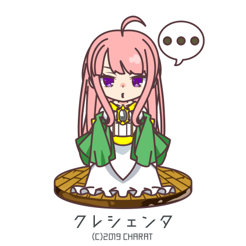
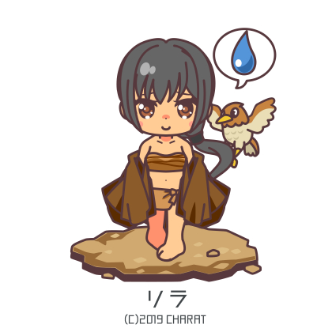
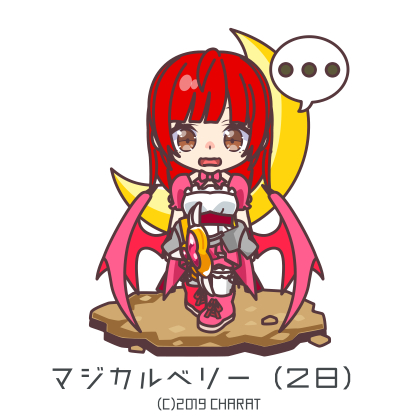

# Chapter 221: Those Who See Off

Four gathered around the sunken hearth.

From beside him, Krische stared intently at Gallen's face, as if checking his complexion.

*'Is it good?'*

*'Ah, very. The flavor is a little different from usual.'*

*'Ehehe, Krische learned how to cook from the oba-san next door. She's really good at cooking……'*

*'Galla, then. I'll have to go thank her tomorrow.'*

He said this while looking around the house.

Normally, with a child present, the inside of a house would become messy — but the opposite was true.

He had come to Gorka's house after a few days to share a meal, and the tools that had been scattered haphazardly along the walls were organized, clothing was neatly folded, and even the charcoal in the hearth had been tidied.

The whole atmosphere of Gorka's house had changed considerably.

*'This really shows just how rough Grace was. You truly took after Rina in all the good ways she didn't.'*

*'Uuu……'*

*'Ah, no, kaa-sama is just busy with work, so she simply doesn't have enough time……'*

*'I-it's fine, Krische. That just makes it worse, so please stop……'*

Grace hung her head with a terribly pitiful expression, and Gorka laughed.

*'Hahaha, true enough. I was startled when I came back and found her climbing up to the rafters. ……Krische, I'll help with the attic cleaning on the next rest day, so wait a while, alright? It's dangerous.'*

*'……Yes.'*

It wasn't just the cleaning and tidying that made things look brighter.

In the years since Krische had come, Grace and Gorka had become much more cheerful.

Recalling how the two of them had grieved over being unable to have children, and comparing that to the two of them now, he truly felt it.

Grace had called Krische a gift from the gods, and now Gallen felt the same.

He believed from the bottom of his heart that she was a blessing bestowed upon two people who had lived with good hearts.

*'Ah……'*

When he patted her head, her cheeks softened with joy.

As though even being happy embarrassed her, her expression turned slightly troubled and her eyes wandered.

*'K-Krische is no longer a spoiled little child, so……'*

*'Good grief, who told you such a thing?'*

*'She's embarrassed about being called "little clingy, spoiled Krische-chan." Fufu.'*

Grace answered with amusement.

Until not long ago, she had always trailed behind Grace whenever they went out.

Now she ventured out on her own to all sorts of places, but she still had a habit of clinging to Grace whenever she spotted her — she had likely been teased about it.

Krische had a tendency to worry too much about how others saw her.

Well-mannered, polite, and averse to any impropriety.

She probably took teasing words at face value.

*'Whether you're small or grown, you are my granddaughter. Just as Grace is still my daughter, no matter how old you become, that will not change. What is wrong with a grandfather patting his granddaughter's head?'*

*'Um……'*

*'The same goes for Grace. It is natural for a mother to cherish her child, and normal for a child to be spoiled by her mother — such bonds do not change.'*

*'Wah……'*

He gently grasped her slender waist, lifted her, and set her on his knee.

A child's body was always warm, as though carrying heat within.

*'You have someone to spoil you, so don't be embarrassed — be honest and let yourself be spoiled. There's no need to rush into adulthood. Someday, naturally, you'll find yourself on the spoiling side.'*

*'……Yes. Ehehe.'*

The warmth held in this small body surely signified all the various possibilities that lay ahead.

Unlike himself, now mere embers, this girl's life had only just begun.

Nothing made him happier than having been blessed with such a grandchild.

When the day came that his own fire went out, if Grace, Gorka, and this Krische carried that fire forward, then surely that would be the happiest possible end.

A girl slightly different from normal.

Some small anxieties notwithstanding — a good, kind granddaughter.

He would not be able to watch over her for the decades to come, but someone would come along to watch over her in his place.

Until then, he would do everything he could.

That was the sole remaining task of Gallen's final days.

* * *

It was a room lined with simple beds.

In the farthest one, a bed by the window where moonlight streamed in.

"Gallen-sama!"

He opened his eyes and found silver hair leaning against his chest.

The beautiful, sleeping face of Krische, and the face of the black-haired servant — Anne — her eyes brimming with tears.

"Where is……"

"This is the military academy infirmary. They said you collapsed suddenly, and it didn't seem right to carry you all the way to the estate, so— ah, I'm sorry, I'll fetch the doctor right away……!"

Anne rushed from the room in a fluster, and the noise seemed to wake Krische, who rubbed her sleepy eyes, lifted her face, and smiled with relief when she saw Gallen.

"Ojii-sama……"

"Krische……"

Krische moved to embrace him, then stopped herself, looking troubled.

Gallen smiled wryly and pulled his granddaughter's head to his chest.

His body felt terribly heavy.

A headache, thoughts hazy and foggy — he couldn't put any strength into his body.

"……Is it night?"

Through the double window, the shadows cast by moonlight — it must be the middle of the night.

"Ojii-sama, you've been sleeping for about two days…… um, inside your head, the blood, it…… Krische held it back with mana, but, she doesn't know if she did it properly……"

"I'm fine. ……Perhaps waking like this is thanks to you, Krische."

An old man who had been working in good health just the other day, collapsing suddenly and never waking again.

A story he had heard often. Gallen himself had seen it happen to several people.

Most likely, this was the same sort of thing.

"……This should be called a natural death. It's not something to grieve over too deeply."

"Ojii-sama still has plenty of energy…… it's not, it's not time yet……"

"I'm already past sixty. Either way, I knew I didn't have long."

Still holding her, even lifting his arm felt burdensome.

But that was fine.

He felt no need to let go of his beloved granddaughter.

"It would have been no surprise if I had died at any time, but I kept on living because there was a reason. ……Yet I must have finally found satisfaction with my life."

"……Ojii-sama, but——"

"Krische, it's alright. ……Everyone dies someday."

He put strength into his hand and moved it.

The silky texture of her hair hadn't changed since she was a child.

"A death that comes before its time is something to grieve, but if one can fulfill their natural span, that is something to be grateful for. ……Please don't cry."

"But……"

Something warm slowly spread across the shirt on his chest.

It carried warmth, seeping into Gallen's body.

"Grace and Gorka to bandits, and Bogan too…… I truly wished, from the bottom of my heart, to at least see you happy. ……But surely, my duty is now fulfilled."

"It's not, ful, filled, Krische still needs ojii-sama……"

"……You are surrounded by good people. At the very least, I am satisfied — satisfied that I can entrust you to them, without worry."

He stroked her trembling head and smiled.

——Yes, he was satisfied.

Few were those who could face death with such satisfaction.

And on top of that, to be seen off by the granddaughter he loved.

Surely, there was no one happier than him in this world.

"……Would you hear a somewhat troublesome request?"

For a while, no reply came.

As he stroked her head, he understood from the sensation that Krische had nodded without words.

"After I left the village with you, I grew my hair out as a small prayer of sorts. My duty is done…… they may already have departed…… but when you find the time, please bury it at the tree for the two of them. And give Galla my thanks."

Against his chest, her head nodded quietly.

"A simple funeral would be fine, I think, but your position likely won't allow it. In the desk drawer at my house, I've written a will. My assets go to you — take the money from there."

Gallen smiled wryly at that.

"That said, there isn't much I need to ask by word of mouth. ……Most of it is written there."

He had anticipated things to a degree and written it all down.

He had also informed the trading house where he kept his money, so the affairs should be settled without issue.

"……Looking back, mine was a life full of regrets."

He gazed up at the dimly lit ceiling as he spoke.

His wife had drawn her last breath from illness while he was away on the battlefield.

If he had quietly remained a hunter, he surely could have been at her side.

Leaving the military hadn't been solely out of remorse for burning a village on orders.

It hadn't been merely a matter of taking responsibility, either.

He simply couldn't bear it — so many things.

He had promised his wife a better life someday — yet every time he went to war he made her worry, and in the end he had left her to suffer and depart alone.

At the very least, Gallen had not been a good husband.

"Every time I thought I'd turned over a new leaf, I made another mistake."

He set down his sword and returned to being a hunter.

He withdrew from conflict as a mere hunter, trying to be a good father.

Yet the strength he had spent years cultivating rusted away, and he lost his daughter and her husband.

As a father, too, he had failed to protect what he should have protected.

And Bogan, his old comrade-in-arms.

"I let precious things slip through my fingers because I was a half-measure who never saw anything through…… neither a good husband nor a good father."

His gaze fell to his trembling granddaughter.

He mustered every ounce of strength he had and stroked her head.

"……Even with a life like that, I did not hate who I was as your grandfather."

"Ojii……sama……"

Gallen narrowed his eyes.

As though yielding to his slowly descending eyelids.

"Every time I saw your smile, every time I saw you surrounded by others…… from the very bottom of my heart, I simply thought, how glad I was. That you will surely…… go on living happily……"

And quietly, he closed his eyes.

"……I'm truly glad to have been your grandfather."

"Krische, too…… loves ojii-sama, so much."

She sniffled, halting and stumbling over the words.

Gallen smiled with satisfaction.

"……Continue to cherish those around you. If you do, surely……"

His words faded away as though dissolving, his breathing growing quiet.

After a time, that too stopped, and the heartbeat Krische had felt through his chest fell silent.

The girl flinched, then simply felt the warmth that still lingered, trembling quietly.

When the black-haired servant returned some time later with the doctor, she saw the scene and collapsed to the spot, covering her face with both hands.

* * *

He had served as adjutant to the Alberinea Division yet never accepted a peerage — by noble standards, he was of low rank.

However, a great many military personnel requested to attend the funeral of Gallen Rinea Karka, and for someone of his noble standing, the ceremony was of remarkably large scale.

Near the cemetery on the outskirts of the capital.

The coffin itself was plain, but in kingdom funeral rites, the mourners assembled the timber frame and firewood by their own hands.

The resulting frame grew to a size befitting a general's send-off — likely the largest ever granted to a person of common birth.

"——Having risen from private to centurion in a remarkably short time, Gallen-sama served alongside the hero Bogan Christand as his superior officer, campaigning across many battlefields before retiring. When the civil war came, he once again took up his sword, serving as Bogan's adjutant and demonstrating his valor, and in the recent Great War as well, he lent his strength as adjutant to the Alberinea Division."

The one who spoke before them was the queen clad in a crimson dress — Kreschenta.

Red, in the kingdom, was the noble color representing royal blood.

For the queen to wear a crimson dress at a funeral signified the posthumous welcoming of the deceased as blood of the kingdom.

"He sought neither rank nor title, simply fulfilling his military duty for the sake of others…… the peace we enjoy today was built upon the efforts of clean and upright soldiers like Gallen-sama. ……I am aware that many of you here know this, and it is for that reason you have gathered."

Kreschenta surveyed the mourners and continued.

"But so that we may engrave it once more upon our hearts, and so that we may pray for the peaceful rest of Gallen-sama…… let us observe a moment of silent prayer."

She closed her eyes, and every mourner followed suit.

Silence filled the gathering, and only birdsong echoed.

After a time, Kreschenta clapped her hands, bidding them open their eyes.

On that signal, from beside the bonfire, two figures in military uniforms — Krische and Selene — each approached the platform bearing a torch.

Selene walked with eyes full of concern for the Krische beside her.

Krische walked blankly, her steps heavy.

No one spoke, and neither did the two.

Quietly, they set fire to the oil-soaked straw beneath the platform and left their torches there.

Following them, led by Kokys — who appeared to be fighting back tears.

The mourners formed a line, and those who wished offered fire in turn.

"……Are you alright?"

As they returned to where Bery and the others were, Selene asked, and Krische nodded quietly.

"……Krische feels sort of, dazed."

When Krische looked up, Anne was trembling and being held by Bery.

Bery rubbed Anne's back while watching Krische with worry.

Krische had not eaten anything since that morning.

"Krische-sama……"

Krische shook her head gently and went to Bery's side.

Selene took Krische's arm, laced their fingers together, and squeezed tight.

"……When kaa-sama and the others…… Krische tried not to think about it, and after sleeping one night, Krische felt calm and clear…… but, today, something feels…… strange."

"It's not strange — it's normal."

Selene said this, released her hand, and moved in front of Krische.

She stroked her cheek and peered into the downcast violet eyes.

"……No one can be fine after losing someone important. You have to recover someday, but it's not something you have to rush."

"Selene……"

Then slowly, she embraced her and stroked her head.

"Gallen-sama was smiling. ……At the very least, he was watched over by you at the end, and he must have been very happy when that moment came. Satisfied with so many things."

"……Do you think so?"

"Yes. Otherwise, no one could face the end of their life laughing like that."

*Just like Otou-sama*, Selene said.

"So that you won't have to stand before such a proud person's grave, crying pitifully forever — be honest now, grieve now, and don't hold back your tears."

Then she slowly rubbed the slender back.

"……Until the sadness pours out along with every last tear. ……Funerals aren't for the dead — they're for the ones who see them off."

For a while, the girl said nothing, pressing her face into Selene's chest.

Then a small, stifled sobbing sound began to leak out.

Selene held her tenderly, gazing at the funeral flames.

Beside them, Kreschenta had been watching Krische anxiously — Selene gave her a smile and a nod.

* * *

——Two months later, before autumn arrived, two figures visited Karka: a girl with silver hair and a red-haired servant.

Together with a sturdily built woman, the two stood before a single tree and dug a hole.

As they took out the pure white lock of hair, a gentle breeze stirred.

A pair of wooden tags hanging from the tree swayed and fell, and exchanging a glance, they tied the tags to the lock and placed them in the hole.

Carefully covering it with earth, the three bowed their heads in unison.

As if in answer, the wind threaded through the gaps between the trees, brushing across their cheeks.

---

# Chapter 222: Character Introductions — Spoilers through Arc 9

*New additions: Milcals, Rinkara, Ranu. Other entries updated.*

---

## ■ Main Characters (Updated)

### ○ Krische = Alberinea = Christand

In her own mind she has grown up a little, but mostly still a child.

She has inscribed on her own tongue the same magical flavour-inscription that she inscribed on Bery's tongue — as an experiment.

**Armour:** Everyday clothes with gauntlets and reinforced boots. A garter belt.

→ *Self-assessment:* Very clever and capable, but still immature in many ways. A bit of an idiot. Bery's. A little grown-up.
**Likes:** *(adds)* Making things matching. A nightcap.
**Dislikes:** *(adds)* The death of those close to her.
**Worries:** The phenomenon of death.

---

### ○ Bery = (Lips) = Algan

**Appearance:** Red hair falling to the back. *(Hair has grown out from the shoulder-length described in earlier arcs.)*
Also: a magical inscription on her tongue.

**Worries:** Krische, who for some reason keeps offering her alcohol.

---

### ○ Kreschenta = Farna = Vera = Alberan

As expected, growth has stopped at 1:1 scale with Krische.

**Dislikes:** *(adds)* Women with large chests.
**Worries:** Onee-sama's taste for large chests.

---

## ■ People close to Krische (Updated)

### ● Gallen = Linea = Karka

*(Status changed to deceased.)*

Even after the Great Five-Nations War he worked energetically, but one day he noticed Krische living her days in happiness — and understanding that his own role was complete, he collapsed.

The old man who had outlived many precious people and accumulated regrets over his own powerlessness departed this life with a smile on his face, satisfied with his end: watched over by the granddaughter most dear to him.

He had been wishing, it turned out — that a day would come when his own powerlessness could be forgiven.

**Worries:** None.

---

### ○ Arne = Gieterns

Since the day Gallen departed, she has been writing down the history of the Christands whenever she finds spare time.

**Likes:** *(adds)* Gallen.
**Worries:** That everyone will one day meet death.

---

### ○ Elvena

Has repaid the debt to the Christands from Kalua's jade-tiger-subjugation reward, but as that was not a repayment of the kindness itself, continues to serve the Christand household unchanged.

**Worries:** Drunken Mia is extremely bold.

---

## ■ Black Pennant Special Company (Updated)

### ○ Mia = Linea = Kirnan

*(Name note: has received a full Rinea — full knight — investiture, hence the change from Nea to Linea.)*

Upon returning home she feels relief at having been able to deal with the jade tiger attack, while feeling the need to train after recognising that she would have died if Kalua had not been there.

**Worries:** Elvena's gaze has been sharp of late.

---

### ○ Kalua = Linea = Belryus

*(Full Rinea investiture received.)*

Like Mia and others, received a Rinea investiture through the Black Pennant's great military service.

As a reward for the jade tiger subjugation she could have received the management rights of a small village, but she declined, accepting a small house in a first-class city district and the reward money, which she used to repay the debt to the Christand household.

**Worries:** Drunken Mia.

---

### ○ Dagra = Linea = Arkas

*(Promotion: now a Baron.)*

Realising that the Black Pennant's existence is now capable of determining the outcome of even a battle of ten-thousands, he feels the weight of his duty as Krische's aide and as company commander more strongly.

The Black Pennant's great contributions were recognised; he was awarded the rank of baron and simultaneously given management rights of a post-town near the royal capital.

**Worries:** The future of the Black Pennant Special Company in peacetime.

---

### ○ Daz

Progress on improving prosthetic limbs continues with Neigal and Waltza.

---

### ○ Neigal

Feels strong gratitude to Krische for giving him a prosthetic hand and swears lifelong loyalty.

Ponders the cruelty wrought by the weapons Krische creates — Jaleia = Gashea, Baumje = Ira, and others — but arrives at the concept of weapons as deterrents and finds a tentative peace with it.

The time spent improving prosthetic limbs with Daz and Waltza has become good recreation.

---

### ○ Zaaka

*(New full entry added.)*

The battle-capable wounded-soldier type. Squad Leader.

A talented squad member with excellent swordsmanship, from a caravan-guard background — but on the final day of the Battle of Belnaik, he was wounded in the left eye. 

With injuries all over his body, he left the front and convalesced; his left eye was lost but he returned with no other lingering effects.

Rough but caring toward his squad members; beloved by them.

---

## ■ Christand Army Affiliates (Updated)

### ○ Nozan = Nerle = Ulferinea = Velraigh

Being called piyopiyo cheerfully by Krische turns out not to be entirely unwelcome.

**Likes:** *(adds)* Piyopiyo.
**Worries:** Reinforcing defensive fortifications along the Elsren border.

---

### ○ Granmeld = Linea = Varkus

**Worries:** That Nozan doesn't seem particularly bothered by being called piyopiyo. Slightly annoying.

---

### ○ Sardan = Linea = Galkaron

*(Updated nickname: Bald-and-glasses. Story reason: he had the choice between bald-and-clean and bald-and-glasses, but before he could exercise the choice it was decided for him as bald-and-glasses. His wife laughed at him considerably.)*

**Worries:** New fortress construction work.

---

### ○ Kokys = Naktla = Rozlinea = Argrand

*(Updated: now holds the honorary name Roz, meaning "fierce beast." His name suffix changed from Linea to Rozlinea.)*

Spending time at Krische's side, he has come to feel even more strongly that she is a precarious existence.

After Gallen's death he serves concurrently as Krische's vice-officer, swearing to fulfil his duty as her support for the rest of his life. The honorary name Roz — denoting a fierce beast — was permitted to him in conjunction with this.

→ *On Krische:* Young and beautiful genius girl. The kingdom's greatest warrior. Unsuited to the battlefield.
**Worries:** Nyan-nyan. The coldness born of Krische's purity. That Nozan takes the piyopiyo nickname so calmly.

---

### ○ Eruga = Gigraite = Korslinea = Falen

Ordinarily serves as the military academy's principal, teaching young nobles various things — but Gallen's death has made him consider his own lifespan again.

**Worries:** Partings to come.

---

### ○ Kuinez = Linea = Kaza

**Worries:** His superior has been unusually gentle lately, which is oddly unsettling.

---

### ○ Kise = Seil = Linea = Kirtiins

She has begun to understand Krische's operating principles: even if coldly ruthless on the battlefield, she is by no means brutal — and is it not the case that there is nothing at the bottom but a twisted goodness?

As if to prove it, the Krische after the war is as adorable as a child her age should be, and he cursed the tragedy that made her go out to battle.

→ *On Krische:* A crooked genius. No matter how cold and ruthless on the battlefield, at heart she is a child who looks exactly as she looks.
**Worries:** The correct nature of justice and ethics.

---

### ○ Barga = Nea = Kurtos

He still cannot empathise with Krische's cold-bloodedness, but reviewing the outcome of the Great Five-Nations War, he shows understanding for one kind of correctness in what she does.

→ *On Krische:* A child who, whatever her excellence, should not be sent to the battlefield.
**Worries:** Study of Krische's tactics.

---

### ○ Begil = Aronia = Linea = Sandika

When he returned home he casually suggested his wife try a garter belt, but under interrogation he could not conceal the reason, and was made to sit formally in seiza for a full day.

→ *On Krische:* *(updated)* The aesthetic crime of the gap between stocking and thigh —
**Likes:** *(adds)* Garter belt.
**Worries:** The world's failure to recognise his aesthetic appreciation.

---

### ○ Fagran = Linea = Alhajid

**Worries:** That every time he drinks with his superior Begil, he is passionately lectured on Krische's garter belt.

---

### ○ Gainz = Linea = Toska

With Gallen gone and his own retirement not far off, he is putting effort into developing successors.

Finding Krische seriously asking for explanations of his jokes has become trying.

**Worries:** The fruitless act of explaining a joke.

---

### ○ Aleha = Timi = Linea = Riibera

*(Name updated with Riibera added — a family name granted as recognition of his service.)*

His many military achievements and abilities have been recognised, his atonement considered complete, and he has been promoted to Fourth Corps Commander of the Direct Command Army and given the family name Riibera.

Currently on good terms with central general Teckrea = Remin; he has begun to feel affection for her unguarded face of many expressions, her clumsiness where she cannot hide her true feelings, and her seriousness.

Considering the status-related difficulties and secretly consulting Selene; thinking about when to propose.

**Likes:** *(adds)* Teckrea's many expressions.
**Worries:** How to propose to Teckrea in a way that will catch her off guard.

---

### ○ Waltza (= del = Grizlandi)

*(Updated: now also Fourth Corps Vice-officer.)*

After the war, promoted to Fourth Corps Vice-officer.

Thinking about the advantages of a prosthetic arm in combat; continues discussions with Daz and Neigal.

Of late he is truly watching over Aleha and Teckrea's relationship, and swears to live long enough to hold their child in his arms.

**Worries:** Longevity health methods.

---

## ■ Other Kingdom Nobles

### ○ Teckrea = Talku = Linea = Remin 『Order · Good』

The boyish cross-dressed beauty. Central-Kingdom General. Kingdom Duke.

Born into a ducal family — a genuine noble of pure lineage; she became head of the Remin ducal family when her elder half-brother died on his first campaign.

Since childhood she has had a strong sense of how a noble should be, and has cultivated herself to embody that ideal.

Even in her few battlefield campaigns she has accumulated merit, supplemented her insufficient experience with effort, and backed by family connections, advanced straightforwardly to general.

Neither extraordinary nor a genius, but the effort she has accumulated has become real ability; the swordsmanship she has polished to a fine edge will not yield to ordinary men.

She had intended to give herself to whoever defeated her in a sword match, but having grown so strong that she ran out of opponents, she has half given up.

Her younger sister married and had three sons; she is considering having one as an adopted heir. Sisters are close and she loves children; when she has free time she goes to her sister's and teaches the children swords.

Despite appearances, she has girlish tastes — a stuffed-animal collector.

She has fallen late in life for Aleha — good-looking, polite, brave — but her age, her height, her lack of feminine quality are all complexes that prevent her from confessing.

That said, her vice-officer Milcals and her servants seem to have found out immediately, and with their forceful support she is naturally closing the distance — so she thinks.

She believes Aleha hasn't noticed her feelings, but naturally Aleha has noticed, and she doesn't know he enjoys watching her make her many expressions.

She doesn't know either that while she isn't looking, Aleha has built a good relationship with Milcals and her servants, and that preparations for a proposal are quietly underway.

**★ Combat command:** She has learned what she should learn and holds a certain level above the standard as a general. In deploying troops in a major engagement and in tactics she has no openings, but lacks experience; once thrown outside her assumptions she can suddenly collapse — there is a fragility to her against surprise attacks and ambushes. However, she is a rare person of character; her bravery, her hard yet beautiful appearance, all earn high popularity from the soldiers, and she has charisma. Her army's morale is relatively high; her character and nature as a commander make her more capable than her individual ability suggests. With appropriate experience she has the qualities to become a great general.

**Appearance:** Dull gold hair. Blue eyes. Tall. Beautiful. Always wearing a severe expression.
**Armour:** Full plate with a visor carved in a face of fury.

→ *On Krische:* An absolute being comparable to dragons. An innocent and precarious girl. Beautiful.
**Good at:** Rolka-style swordsmanship. War-game exercises. Entertaining children. Sewing.
**Likes:** Swordsmanship. Stuffed animals. Knitting.
**Dislikes:** Cruel people.
**Worries:** Whether someone like herself — a late-maturing wallflower — can really be accepted by him.

---

### ○ Milcals = Tadia = Linea = Rettia 『Neutral · Good』

The my-lady-over-justice type. Kingdom Margrave.

Head of the Rettia family that has served the Remin family for generations; Teckrea's guide from childhood.

He dotes greatly on Teckrea — the master family's daughter, more or less born when a grandchild of his was entering a rebellious phase — and is the old man who stuffed her full of plush toys.

As her guide he taught her swords and so on, but adorable, beautiful Teckrea: Milcals taught the young, naive Teckrea who said swords were important — court etiquette, poetry, and dance lessons.

He worried deeply about the serious, clumsy, thoroughly awkward Teckrea, but rejoices greatly that a young man finally passing muster in her eyes — Aleha — has appeared, personally going to him and bowing his head.

Foreseeing that various problems will arise given Aleha's background, he is currently doing the rounds of various parties. Teckrea's late-blooming first love has, without her knowledge, spread across the Kingdom.

He and Waltza — two old men with the same purpose — are very close.

He regrets deeply having allowed Teckrea's elder brother to die on his first campaign, and when instructing Teckrea in swordsmanship his character changes to a frightening strictness.

**★ Combat command:** As a ducal family's military adviser, his knowledge of tactics and strategy is deep and broad; he has more than sufficient ability as a general. He has experienced numerous battlefields as aide to the former Remin duke, and his battlefield experience is rich for a central-army figure; no real weakness exists. The trauma of letting Teckrea's brother die has made him somewhat lacking in assertiveness — one could say it is a scar — but as a vice-officer this is actually a virtue, and he serves as a moderating voice for the direct Teckrea.

A master of Rolka-style swordsmanship.

**Appearance:** White hair in an all-back style. Blue eyes. Average build. A neatly trimmed somewhat long beard.
**Armour:** Half-plate bearing a painted goddess.

→ *On Krische:* A frightening girl who is frightening and also adorable and pitiful and pure. The elder sister Selene's air is exactly like the young Teckrea's.
**Good at:** Rolka-style swordsmanship. Instruction. Front-line command. Keeping children occupied.
**Likes:** Opera. Poetry. Fantasising about Teckrea's wedding. Doting on Teckrea.
**Dislikes:** War.
**Worries:** Teckrea's dress.

---

### ○ Elzaldo = Ouse = Linea = Gokkarusu 『Neutral · Good』

The neutral-faction elder type. Central-Kingdom General. Kingdom Duke.

A man who grew up straightforwardly and healthily as the eldest son of a ducal family.

The teaching of the distinguished Gokkarusu family is "eliminate weaknesses": not creating areas where one exceeds others, but polishing areas where one falls behind others is considered more important than standing out. Elzaldo has faithfully kept that teaching from childhood and toiled, and received the Gokkarusu family from his father.

Not only swordsmanship and arithmetic, but also the study of mathematics, etiquette, and rhetoric — he is truly learned in both the civil and martial arts, held in high regard even by other great nobles.

His fierce expression and severe manner are frequently misunderstood, but he is originally a person of deep feeling and rich sensitivity; his current weighty bearing is something built up over many years.

A rather timid character as a child, made to cry every day by his father and tutors.

The Zain-style swordsmanship taught in childhood was disrupted when he lost sight in his left eye on his first campaign; he learned Rolka-style afterwards and developed a way of fighting that plugs the left blind spot with a shield.

He loves astronomy and serves as patron to scholars — but in his spare time lines up alongside them to observe stellar orbits and participate in difficult research.

**★ Combat command:** The general summary would be: a general without fragility. He devotes overwhelming effort to prior preparation — winning because he should win, keeping losses minimal. He is not good at responding to sudden events, and himself understands this better than anyone, pouring his heart into achieving a strategic advantage of numerical and terrain superiority. What he prioritises is not the method of winning against those inferior to himself but the method of winning against those superior to himself; he builds everything on the premise of his enemy's tactical success, and approaches the battlefield. There is no flair in his warfare — precisely no risk-taking — but there is corresponding strong stability; he is a general who can be a model for younger commanders.

**Appearance:** Black hair swept back. Dark-brown eyes. Large. Fierce face. A tiger-like beard. A sword-scar over one eye.
**Armour:** Unadorned half-plate.

→ *On Krische:* A great tactician, strategist, and technologist who will carve her name in history. Also a child.
**Good at:** Zain-style swordsmanship. Rolka-style swordsmanship. Spear technique. Strategic planning. Mathematics. Staying up late.
**Likes:** The night sky. Mathematical formulae. Black-bean tea.
**Dislikes:** Broken logic.
**Worries:** Communication with scholars being difficult due to the northward movement.

---

## ■ Holy Elsren Empire (Arc 9 new and updated)

### ● Bazlar = Elment = Elsran = Shuindel = Lukazan 『Order · Evil』

The how-power-should-be-used type. Grand Duke of the Holy Elsren Empire.

Head of the Lukazan family — one of the three great ducal houses with succession rights to the imperial throne — and among the five most powerful figures in the monstrous Elsren state.

Gifted in political manoeuvring from childhood, though born the youngest of three brothers in the Lukazan family he politically eliminated — or killed — all three elder brothers and secured the headship.

A master of politics and power, also possessing an outstanding intelligence network; within Elsren he was considered one of those never to be made an enemy of.

It was by his hand that the blame for the battlefield defeat was concentrated on Aleha and the Sarshenka family.

Politically an outstanding talent, but his strategic and tactical ability is that of an ordinary general — his military command cannot match his political ability.

As a warrior he possesses supremely high ability, but has not been blessed with the talent of a commander who leads armies.

Killed by Krische, who cut his throat.

**★ Combat command:** Possesses combat ability of monstrous height — that of a warrior.

However, that is merely the ability of a warrior of savage bravery; not blessed with tactical or strategic ability — a barbaric hero type. That said, his outstanding point is understanding his own weaknesses and having the qualities of a ruler who uses others; as the overall commander of a large army, he has conversely extremely superior ability. He wields carrot and stick, and in making subordinates perform beyond their ability none can match him; a commander who does not shame the name of Grand Duke.

**Appearance:** Golden hair, all-back. Blue eyes. Large, muscular. A keen face. A neatly trimmed beard.
**Armour:** An elegant full plate with light breaking through clouds carved on it.

→ *On Krische:* Alberan's deranged cursed child. A disagreeable monster.
**Good at:** Forka-style swordsmanship. Deal-making. Carrot and stick. Tasting wine. Using people.
**Likes:** Looking down. Putting his foot on others' heads. Wine. Sword collecting.
**Dislikes:** Being looked down on. Being taken lightly.
**Worries:** Died without it being a match.

---

### ● Biinal = Kref = del = Sarshenka 『Order · Neutral』

The Cain-complex type toward the capable younger brother. Duke of the Holy Elsren Empire. Aleha's elder brother.

Born the eldest son of the Sarshenka family and with talent to match; originally a kind and excellent-natured person.

But everything went wrong when his brother — Aleha, ten years his junior — proved to be a genius who far surpassed him. Knowing his father's love was being directed to Aleha, he was seized by strong jealousy and began to treat Aleha as an enemy.

Everything Biinal had acquired through blood-and-sweat effort — in learning, in swordsmanship — Aleha picked up with ease; it was terrifying. The moment he inherited the headship, he ordered Aleha to the battlefield wanting him to die.

But Aleha continued to rack up great achievements, receiving the Holy Knight title and the name Shuindel; for Biinal, Aleha was not a brother but the existence that continued to give him a sense of inferiority.

When Aleha made a mistake, Biinal didn't shield him at all — he disowned him and threw him out. Biinal's brief peace: in the end Aleha's hands brought his life to its close.

Aleha has not forgotten the small Biinal of that time — a noble ideal in person, a kind elder brother worthy of respect.

**★ Combat command:** No particularly outstanding excellence, but high combat ability and command ability compared to the average. In sum, capable — no weakness and neither great victories nor great defeats. A general with the stable ability not to suffer the big defeats that incompetence brings. Has a somewhat neurotic side and tends toward excessive preparation, but this is more a virtue than a weakness, and his consideration that never lets soldiers starve earns him the acceptance of those men.

**Appearance:** Golden hair, all-back. Blue eyes. Lean and muscular. A slightly worn but tidy face.
**Armour:** An elegant full plate with paradise depicted on it.

→ *On Krische:* A human-shaped despair. A monster.
**Good at:** Elcafarrest-style sword and spear technique. Domain management. Commercial dealings.
**Likes:** Children. Wine. Painting.
**Dislikes:** A capable younger brother.
**Worries:** His wife and daughter.

---

### ○ Bad = Kiitas 『Neutral · Good』

*(Updated: The man who survived Krische twice through sheer luck.)*

In the Great Five-Nations War he was serving as messenger for the army of Aare = Keinkurusu.

Caught up in Krische's bait-and-annihilate tactic, but survived — carried General Aare on his back, encountered Krische again, and still escaped from within the northern wall. But Aare had already been killed by an arrow Krische fired; he learned that he had merely been overlooked by luck again.

Immediately afterwards he went as messenger to Grand Commander Bazlar, avoided Granmeld's assault, and in the end survived the battlefield too.

After returning home, drawing on these experiences, he gave up on rising in the world and decided to devote himself to domain management, setting down the sword.

Having attended Aare's final moments created a strange bond with the Keinkurusu family, through which he married the youngest sister of that family; despite some ups and downs, he lived a peaceful life.

The records he left are treated as important historical material on the war and on Alberinea.

→ *On Krische:* Silver-hair-very-scary.
**Dislikes:** Bows. Purple.
**Worries:** Flashback every time he sees a purple gemstone.

---

### ● Rinkara = Revis = Shuindel = Wokkal 『Order · Neutral』

The bad Grand Duke's supervisor type. Marquis of the Holy Elsren Empire.

A man who has served the Lukazan family as Bazlar's tutor from childhood; the one person who receives his wholehearted trust.

For Bazlar — half-abandoned and left to himself by his father — he was a father figure; Rinkara, having had no children with his wife, also thought of him as his own child.

He has thoughts about Bazlar's warped character, but surviving honestly in the magical realm of the nobility is difficult and he has resigned himself to it as unavoidable; he continued to serve by his side while sometimes playing the role of moderating voice.

His talent is ordinary, but his battlefield experience is extremely rich — close to Ferworse's in that respect.

Within the Lukazan army, strategy and tactics are basically his work; in that sense he is the true Grand Commander of Elsren in the Great Five-Nations War.

His skull was kicked to pieces and he was killed by Krische.

**★ Combat command:** An old general born into a military family who has accumulated training from youth.

He achieved brilliant results in his day and there is no one in the country who does not know him as a warrior. The brute strength acclaimed as "unrivalled" has faded with age, but that experience has melted into his very flesh, and there is no doubt that he remains one of Elsren's top one or two great generals even now. In older age he has lost his assertiveness and grown cautious; there is no longer flair, but his command — faithful to basic tactics and strategy — is highly stable; combined with the assertive Bazlar's character it meshes well, and he has won countless victories. Win when he should win; don't put his hand to battles he would lose. The ability required of a general is only that much — and only a general who can faithfully execute this is called a great general. Defeating him in this board game of war is difficult; to win against him over and above this, one would need something that makes the game itself collapse.

**Appearance:** Short white hair. Blue eyes. Lean. A face covered in wrinkles.
**Armour:** Unadorned half-plate.

→ *On Krische:* A talent of extraordinary nature. A monster not to be fought head-on.
**Good at:** Forka-style swordsmanship. Tactical and strategic planning. Appraising blades.
**Likes:** Military history research. Smithing. The army.
**Dislikes:** Politics. Noble society.
**Worries:** That at the limit, he would have liked to face Krische in single combat at his peak.

---

### ● Aare = Veinz = Keinkurusu 『Order · Good』

The young-master type from a good family. Duke of the Holy Elsren Empire.

The young head of the distinguished Keinkurusu family; a general under Bazlar's command in this campaign.

What set him off was being called a coward with no battlefield achievement in the political world; he paid Lukazan a large sum of money and went to the battlefield as a general.

Elsren, Garshaun, Eldelant — a simultaneous attack from three nations, an overwhelmingly advantageous situation. This was from the start a winning war, and there was no one to object to him — a man of good family — sitting as a nominal general; and that was his misfortune.

His character is sincere through and through and he does not neglect effort.

In peacetime he is a good noble loved by everyone; loved by his domain people — a rare person, but absolutely unsuited to the battlefield.

He never had the opportunity to overcome this, and fleeing, was shot through the back of the head by Krische's arrow and died.

---

### ● Ranu = Karud 『Neutral · Evil』

The evil nomad concept-model type. Grand Chief of the Karud tribe.

From a nomadic people living on the plains in Elsren's south — their grand chief.

This area's nomadic peoples were conquered in the time of Grabareine and forced into submission; after the split from Elsren they have been under Elsren's control.

A vicious cycle of self-governance being granted then uprisings recurring; the nomadic way of life with no fixed abode, and a society with strong tribal characteristics, means their position is not stable.

A non-mana-user as is the norm among those of plains birth, but a genius in horsemanship and archery, and sharp-witted; at twenty he stood at the apex of his own tribe, annexed surrounding tribes, and built a large tribe in a single generation — an aberrant.

His cruel and cold-blooded character also helped him consolidate the nomadic peoples through a politics of terror.

Greedy; after obtaining self-governance rights he intended to press Elsren for further concessions and build a nomadic state — but in the end he was betrayed by subordinates, his throat cut in the night, and killed.

---

## ■ Eldelant Kingdom (new entries)

### ▲ Veze Tribe

### ○ Red = Raani 『Neutral · Good』 → 『Neutral · Evil』

The fallen hot-blooded protagonist type. Warrior-chief of Raani. Veze hunting squad captain.

Young warrior-chief of the Raani tribe under the great Veze tribe.

Son of the previous warrior-chief Raadia, strongly inheriting his sword talent and becoming warrior-chief young.

With Gorukis — great chief of Veze and current King of Eldelant — and his father Raadia being friends, he has been close since childhood to Veze princess Shelna.

Pledged to marry in the future — a mutual love.

In Eldelant — where countless tribes war and internal conflict is unceasing — he was involved in battles from childhood and witnessed their carnage.

Traumatised by this, with Shelna he nursed the ideal of complete unification of the Eldelant kingdom in his heart, gathered companions and formed the Veze hunting squad.

As Shelna's right hand he continued to accumulate military distinction, but in the invasion war against Alberan lost almost everyone including Shelna.

In a state of self-abandonment, his subordinates desperately held him back and they retreated.

Narrowly escaping with his life through a body-double from Krische's pursuit, he was taken in by the bodyguard of the fleeing northern army general, Touba = Aakazu, and returned to Eldelant.

He decided to join hands with Aakazu for the purpose of revenge, and is wielding his sword for Eldelant's unification.

**★ Combat command:** Has not learned systematic tactical theory, but from the experience and intuition built through fighting in the complex forest he has an extremely fine instantaneous judgement ability. Enough to allow him to plunge unguarded into the enemy formation and rack up military distinction — a talent of a certain kind of genius — but his weakness is being straightforward and hot-headed. He sometimes amasses remarkable military distinctions and sometimes suffers embarrassing defeats, making him an unstable commander overall. He is ordinary when placed in a battle line and cannot demonstrate his ability unless given independent discretion — somewhat immature points remain. In combat he uses a great-sword style that exploits the weapon's weight and inertia; sometimes cuts down superior opponents, and overall has high variance.

**Appearance:** Short black hair. Brown eyes. Average build. A relatively tidy face.
**Armour:** Leather armour. Ballooning trousers.

→ *On Krische:* The enemy general Shelna warned about. Probably the one who killed Shelna.
**Good at:** Self-taught great-sword technique. Unarmed combat. Hunting. Fishing. Swimming.
**Likes:** Training. Sparring.
**Dislikes:** Alberan.
**Worries:** Hatred for Alberan.

---

### ● Shelna = Veze 『Neutral · Evil』

The mildly deranged type. First Princess of Veze.

A princess born with the deep indigo eyes that Eldelant legend says mark one gifted by heaven — "heaven-eyes."

From childhood she showed talent worthy of the legend; but the first time she casually killed a man who tried to lay hands on her was when she was seven.

Having been seen observing internals with a body cut open, she was feared as having no human heart — a mad princess — and the rumour spread. As a result she was sent to stay temporarily with the tribe whose chief was the king's friend: Raani.

There she spent some years with the familiar Red, and touching his gentleness, deepened their relationship; gradually she came to love him and began to feel shame at her own abnormality.

She dislikes the battlefield, but considers it her role to protect him and grant his wishes; the Eldelant unification goal too was originally to fulfil his ideal.

The world she wanted was only that: an ordinary gentle daily life where she and he could live in peace.

In the Alberan invasion war she encountered Krische and was killed.

**★ Combat command:** Extremely aggressive. From her Eldelant origins where most of the land is forest, she specialises above all in the "head-hunting tactic" by ambush and surprise attack, and does not value battle lines.

Her outstanding thinking ability allows her to grasp the battlefield as if seeing it from the air; she can sometimes command dozens of small units simultaneously even in poor visibility without difficulty. Her strategic and tactical thinking and reasoning ability are outstanding — what others call divine revelation is always the product of her abnormal thinking ability.

Truly a commander worthy of the name genius, but she has a bad habit of controlling resistant subordinates through terror, fails frequently at building trusting relationships, and no small number of her failures are caused by this.

She has the ability to easily lead movements that one would naturally think impossible on her own; yet the presence of her own overwhelming strength also becomes a blind spot. She rarely perceives the need to strengthen a particular defensive position, and that habit is a certain blind spot in what should otherwise be called perfect.

**Appearance:** Long ashen-blonde hair. Deep indigo eyes. Petite. Modest chest. Beautiful.
**Armour:** Matte breastplate with ancient-script engravings. Gauntlets.

→ *On Krische:* The one who spreads death. An absolute killer that not even she could match.
**Good at:** Killing. Arithmetic.
**Likes:** Red. Kissing. Physical affection. Tending her flower bed.
**Dislikes:** Not being ordinary. War.
**Worries:** She wanted to meet Red one more time.

---

## ■ Karka Village (Arc 9 updates)

### ○ Gara

With Gallen's death, and seeing at the same time the two grave-markers that arrived with a lock of his hair, she knows the weight on her shoulders has completely lifted.

**Worries:** None.

---

### ○ Perl

**Worries:** Seeing Bery again after a long time and she's still cute.

---

## ■ Creatures (Arc 9 updates)

### ○ Burrun

**Worries:** The mysterious stud festival that comes when winter ends.

---

### ○ Gurrun

**Worries:** Getting fat from the eat-sleep cycle.

*(Author's note: Things have been rather mysteriously busy, so it looks like the next chapter will start around mid-August.)*

---

# Chapter 223: Character Images and Extras

The character images were created using CHARAT.
I think the general atmosphere comes through, but they may not match everyone's mental image, so please consider this a buffer.
If you'd like to see them, please scroll.

**Krische Alberinea Christand**
Combat Power: She's pretty strong.
Dexterity: She's reasonably dexterous.
Intelligence: She's very smart.
Personality: She's hardworking, but maybe a little lazy.

**Bery Argan**
Combat Power: Bery must not fight.
Dexterity: She's good at cooking and super dexterous.
Intelligence: Bery is very, very smart.
Personality: Very kind, serious, can do anything, and hardworking.

**Selene Argalitte Rinea Christand**
Combat Power: Among those who are bad with the sword, she's reasonably okay.
Dexterity: She's incredibly rough and clumsy.
Intelligence: She's good at talking with all kinds of people.
Personality: Very kind. But sometimes a little scary.

**Kreschenta Farna Vera Alberan**
Combat Power: She's Krische's little sister, yet very weak. She's good at magic, though.
Dexterity: She's reasonably dexterous.
Intelligence: She should be very smart, but she's a little bit of an idiot.
Personality: She's clingy and is a naughty child who immediately badmouths Bery.

**Anne Giterns**
Combat Power: Very weak.
Dexterity: ……She's serious and tries very hard.
Intelligence: ……She remembers what you ask her to do, at least.
Personality: Full of energy.

**Kalua Belyus**
Combat Power: Her swordwork is rough, but among the unskilled, she's reasonably okay.
Dexterity: Surprisingly dexterous, but she hates fine detail and tries to slack off right away.
Intelligence: Not bad enough to call stupid.
Personality: Kind, but she immediately treats Krische like an idiot.

**Mia Kilnan**
Combat Power: Unbelievably very weak for a vice-captain.
Dexterity: Hopelessly clumsy.
Intelligence: Sometimes unbelievably stupid.
Personality: Fundamentally lacking in effort.

**Elvena Belyus**
Combat Power: Very weak.
Dexterity: She's on the dexterous side.
Intelligence: You can probably leave things to her to some extent.
Personality: She's kind. But mischief is no good.

**Lila Sharana**
Combat Power: Weak-weak.
Dexterity: She's not clumsy.
Intelligence: She's reasonably sharp.
Personality: She's a kind child. The Kreisharana people seem to like exposure.

* * *

——Extras——

**> The Secrets of Magical Bery <**

**Magical Stick**

The main weapon of Magical Bery, usable only by those with a heart of justice!

It amplifies Magical Bery's magical power and can conjure the Magical Kitchen into the surrounding area!

Magical Slicer, Magical Frying Pan — Magical Bery's Magical Cooking all begins with a single swing of this wand!

**Magical Dress**

The ultimate armor and weapon that shields against attacks from wicked monsters!

Its flowing garments bewilder the opponent, and at times bring about the enemy's self-destruction without even attacking!

It appears weak to slashing, weak to dissolving agents, and easy to tear — but fear not! A transparent Magical Barrier is deployed on the inside, so minor attacks can't budge it!

Magical Bery, who thrives in a pinch, only shows her true power once the Magical Dress is torn!

She'll overcome any crisis!

**Magical Wing**

An additional attachment that pops out from her waist!

By using the Magical Wing, Magical Bery can fly for short periods!

But of course, to protect her secret, Magical Bery rarely flies through the sky, and mostly uses it for acceleration on the ground — a bit disappointing!

If everyone sends their passionate cheers asking to see Magical Bery flying, she might just show you her heroic airborne form!

**Magical Body**

The charm of Magical Bery is, above all else, [REDACTED BY CENSORSHIP]

This is from when she was spotted in the park by the family she must protect (the future Magical Selene). (Photographer: Begil)

Magical Bery, who has secretly saved the Spirit Realm and humanity under cover of night.

The confusion is plain on her face — the desperate secret she has kept, that she is the magical girl Magical Bery, has been discovered by her family.

——Excerpt from *Monthly Magical Bery*, inaugural issue.

---

# Chapter 224: Side Story — Guardian

The Christand estate in Gurgain.

A young girl with golden hair, not yet ten years old, eyed the cloth on the desk with an irritable expression.

On the wooden board, cloth was stretched out, and long equations were written in fine charcoal.

For studying, they generally used cloth, since it could be washed and reused.

Parchment wasn't free, either.

Both her father and mother disliked spending money wastefully, and for Selene this was simply normal.

"The equation and the order are correct, but just here — the calculation is wrong."

The red-haired servant — Bery — glanced at the problem Selene was stuck on and pointed out the error without a moment's hesitation.

In the blink of an eye, amidst a long string of equations.

Bery was always like this, and Selene pursed her lips.

"……Bery, you know everything, don't you?"

Reviewing the arithmetic she'd been taught by her tutor.

Her mother was poor at teaching, so it was usually Bery who helped with her studies.

Ask her anything and she would answer, and she solved problems Selene couldn't understand with a mere glance.

Without writing out equations, even complex calculations — effortlessly.

"That's not true at all. There's more I don't know than I do."

A person who always smiled as though troubled — that was probably the impression she gave.

Whenever Selene said something, Bery invariably wore that same troubled smile.

Not smug, not mocking — she would smile as though wondering what to do.

"What kind of things don't you know, Bery?"

"……Things like that question, I suppose. Vague ones."

Again, with that slightly troubled look.

Bery smiled and said it.

Modest and refined — Selene had never seen Bery laugh loudly the way her mother did.

"For example, this arithmetic is simple. Follow the order, build up the calculations, and the answer will come on its own. The key is to do each step carefully. Your equation is correct, ojou-sama, and this time it was just a basic calculation error. Even without me, you would have arrived at the right answer by recalculating."

She traced her fingertip along her lips.

A habit of hers when she was thinking.

Something about the gesture on her beautiful face carried an air of allure.

Her mother's younger sister — the impression of their features was similar, but aside from the red hair, one would not recognize them as sisters at a glance.

Bright, vivid, and easy to read, her mother was the polar opposite — Bery's temperament was quiet, or to put it unkindly, dark, and it was impossible to tell what she was thinking.

Clever and capable of anything, yet she took pride in none of it, simply existing there as though it were the most natural thing — that kind of person.

Her unchanging presence since as long as Selene could remember was inorganic and somewhat doll-like, and perhaps that was exactly why such small habits and gestures drew the eye.

Like a colorless painting suddenly blooming with color.

"But, you see, there are far more problems in the world that have no answer."

"Problems with no answer?"

Bery nodded.

"For example…… what is the most delicious dish in the world? Can you tell me?"

"……Meat pie?"

After thinking for a moment, Selene answered, and Bery gave a wry smile.

"Then, shall I make your dinner nothing but meat pie every day from now on, ojou-sama?"

"Mu……"

"Fufu, that was a bit mean of me. But that's the point."

She removed the cloth from the board, stretched a fresh piece over it, and smoothed it out carefully.

As she fastened the four corners, Bery spoke.

"What is good and what is bad, what will bring joy and what will bring anger. Numbers may have answers, but when it comes to the dealings between people, there is no correct answer."

Then she placed the board back on the desk, flipped the removed cloth with a deft motion, folded it with remarkable neatness, and placed it in the basket.

*What's the point of folding laundry cloth before washing it?* Selene always wondered, but this was simply Bery's nature.

The complete opposite of her mother — Bery was extremely meticulous.

"If there were only one answer, I need only make meat pie for you, ojou-sama, and that would be that. But the world is not so simple."

"……Bery, do you always think about these complicated things while you cook?"

"Not always, but……"

*Sometimes*, she said, with that troubled look again.

"Just as even your favorite meat pie would grow tiresome if you ate it every day — what is correct is not always the right answer. Correctness is merely a guidepost, nothing more…… and problems without answers are something like that, perhaps."

Her words were clear yet difficult.

When Selene folded her arms and went 'muuu' in thought, Bery smiled softly.

"Just something that came up in conversation. You needn't think about it now — someday a problem like that will appear before you too, ojou-sama. There will be time enough to worry about it then."

"Otou-sama says mental preparation is important. I think important-sounding things like this should be learned ahead of time."

Selene folded her arms in a grown-up fashion and said this.

Bery stared at Selene, then at the board.

Without a word, she removed the cloth she had just prepared from the board, folded it neatly, and put it away.

"Let's call the review done for today. You must be tired from studying."

A fresh pot of tea, and cookies she had left in the room, placed on the desk.

She had no doubt seen through Selene's feeling of being fed up with studying.

Selene felt somehow embarrassed, her cheeks reddening as she watched.

"……For example, the law is one form of correctness. To break the law is to be a criminal, and it is wrong. ……Is this the right answer?"

"……Isn't it?"

"It is one right answer, yes. Viewed from a social perspective, it is unquestionably wrong, and the person who does it is a bad person — a criminal."

She poured the tea and set the cup before Selene.

Bringing a chair over, she sat down at an angle in front of her.

"However, this too is only one perspective — it is wrong only from the viewpoint of society."

"……?"

"……Let's say, for instance, a starving commoner stole bread for the sake of their child."

Bery took one cookie and hid it in her hand.

"From a social standpoint, it is wrong. But for that individual, there was no other choice — the only way to prevent their child from starving to death was this. ……Can we truly call this person evil?"

Selene furrowed her brow, and Bery watched her with a wry smile.

"Surely no one could say so definitively. What is evil from one angle is not evil from the individual's perspective, and from that child's point of view, the parent who committed a crime to protect them may be an admirable figure."

*It is a matter of perspective*, Bery said.

"The world contains countless perspectives, and with them, just as many forms of correctness, of good and evil. ……War is the same, isn't it? From Alberan's point of view, wicked Elsren — but the people of Elsren surely think the same of us."

Selene listened in silence, deep in thought.

"Correctness is something that changes depending on one's viewpoint and position. It is easy to condemn a stealing commoner from the comfort of never having starved, and easy to speak ill of an enemy nation's people. But correctness is never a single right answer."

*Another problem without an answer*, Bery said, and took another cookie, bringing it to Selene's lips.

Selene bit into it, and Bery too put the hidden cookie into her own mouth.

Honey sweetness with just a hint of salt — Bery's simple cookies, strangely, never grew tiresome.

Today the salt was a touch stronger than usual.

Perhaps because Selene had been sweating from sword practice — the amount felt just right, and it was delicious.

A small kindness, so subtle one wouldn't notice unless one were looking.

Perhaps the words she spoke were something of that same nature.

"Whether you wish it or not, you too will face such problems, ojou-sama. At that time, wielding justice as a noble will surely be the easiest choice."

"……The easiest?"

"Yes. Precisely because it is easy and simple to choose, I hope you will not be swept along by such correctness — but rather, consider the right thing to do from many perspectives, according to the situation. That is perhaps the most important and precious thing of all."

*It is very difficult, though*, Bery said, and Selene sank into thought.

Was it something like what her father said — that it was wrong to take the easy way out?

She understood perhaps half, and nodded vaguely.

Bery smiled wryly and gently stroked Selene's head.

"Fufu, perhaps this is still a bit too difficult for you, ojou-sama. You needn't worry about it now — when you study law someday, you'll hear the same sort of talk."

"Muuu……"

"……If I keep talking like this with you, ojou-sama, nee-sama will scold me again for filling your head with unnecessary things."

Then she laughed softly, with an air of quiet happiness.

At that moment, the door burst open with a bang.

"Quite right, Bery. Stuffing Selene's head with unnecessary things again. What will you do if Selene becomes a stuffy know-it-all too?"

Both hands on her hips, chest puffed out and striking a pose.

Swaying her long red hair, looking down at the seated Bery.

Her beautiful mother entered the room with a displeased furrow in her brow, striding in with heavy steps.

"Nee-sama, before you blame others, please reflect on yourself. ……Eavesdropping is not something to be admired."

"I wasn't eavesdropping. I just happened to be leaning against the door because I was tired, and I happened to hear your voices. How rude."

"I believe most people would call that eavesdropping……"

"That's just how it looks from *your* perspective. Listen here, Bery — there are many forms of correctness in this world."

Bery let out a feeble 'u' sound, blushing as she glared at her mother.

After a while she sighed, stood up, and went to close the door that had been left open.

"Um, kaa-sama, what about work……?"

"I got tired of doing it all by myself while you two were having your fun little study session. Help me, Bery. I have a lot of calculations to do. I want tea too."

Her mother set the bundle of parchment she'd been carrying in the spot where Bery had been sitting, casually pulled up a chair, sat down herself, and chomped on a cookie.

Watching her, Bery sighed as though exasperated and picked up a fresh cup.

"Mm, delicious. Selene, don't take Bery's words too seriously — you'll end up a stuffy idiot."

"……Nee-sama, please stop saying things like that. It makes things very difficult for me."

"I can't help it — it's the truth. Bery, rub my shoulders while you're at it."

"……Honestly."

With a slightly sulky shrug, Bery placed the tea before her mother.

Then, without any sign of reluctance, she placed both hands on her mother's shoulders and began to massage them.

She had only just turned twenty — yet Bery seemed much more of an adult compared to Selene.

But when she was with her mother, Bery looked slightly younger — more like an older sister than an aunt, her manner softening just a little.

She who could do anything was weak only to her mother — unruly, rough, and casual about everything.

Her sole weak point was surely right there.

"……What about this?"

"It would be best to let the mana crystals sit on salt for a while. I've heard rumors that mages have been buying them up. ……More importantly, shouldn't we prioritize distributing wheat from the south? The northern climate has been unstable these past few years."

"We don't have the money."

"Why not send Christand wheat directly to the administered territories and hire laborers in exchange? The war is over, and things will be on the decline for a while. If the roads are improved, many problems will be resolved, so it would be better to start on that now."

*I'll mention it to Bogan*, her mother said, flipping through the bundle of reports.

Selene picked one up — it was from the administered territory granted as a reward for war merit.

It seemed to be a small mine not far from here, but Selene had never seen it.

Her mother had Bery rub her shoulders while flipping through the parchment and asking questions.

Bery answered each question smoothly while rubbing her mother's shoulders.

Most of it was columns of numbers — at least, that was all Selene could see — yet the two exchanged words without pause.

Feeling rather left out, Selene puffed up her cheeks and ate cookies.

This wasn't the first or second time.

Occasionally the two of them would have their grown-up conversations, and every time, Selene was left on the outside.

*——Because I'm a child who can't even do arithmetic properly, so it can't be helped.*

She understood that, yet couldn't quite accept it.

Sometimes her mother would steal the servant from Selene, on account of being the younger sister.

And sometimes Bery would steal her mother from Selene, on account of being the younger sister.

Not wanting to interrupt them, Selene silently chomped on cookies, drank tea, kicked her feet back and forth hoping to be noticed, and puffed her cheeks up even more.

"Bery, what should I do about this?"

"Ah, um…… well, let's see……"

A question she couldn't answer, perhaps.

Noticing from Bery's tone that she was wearing a troubled expression, *serves her right*, Selene thought, and crunched a cookie between her teeth.

"At times like these, I always wonder whether to take a direct approach or an indirect approach. It's very vexing."

"I don't believe I've ever seen nee-sama take an indirect approach……"

"How rude. Today's me is different. I've decided to leave it to you, Bery."

"Ehhh……?"

Bery seemed even more flustered.

Slight curiosity was piqued, but Selene did not look their way.

"Come on, Bery. Your big sister is giving you an order."

"L-listen, please……"

"Come on, do it the way I always do. Quickly. Otherwise I'll sulk."

"Uuu……"

Selene maintained her attitude of being displeased, simply eating cookie after cookie, puffing her cheeks more and more——

"My apologies, ojou-sama……"

"……Unihh!?"

From behind, both hands gently squished her puffed cheeks.

A *phyuuu* — an absurd sound escaped.

"Fufu, Selene, what a funny face……!"

Looking up, her mother was doubled over with laughter. Bery, who had squished the cheeks, was reproaching her with a *nee-sama* and an exasperated tone.

Selene's face went bright red, and she glared at Bery.

Bery said *please forgive me* with a wry smile, scooped Selene up sideways, and sat her on her lap.

"My apologies — I did not mean to leave you out, ojou-sama."

"……I-I'm not angry or anything."

"Selene, you're really not honest, are you. You're like a certain someone I know."

"……Nee-sama. Please don't interject like that."

Saying this with exasperation, Bery held the squirming Selene still, stroked her head, stroked her cheek.

When Selene gave up resisting, Bery let out a soft, gentle laugh.

An endlessly gentle smile — and somehow it made Selene feel embarrassed, so she looked away and puffed her cheeks again.

"My, still cross, I see."

A finger pressed playfully into her cheek, and *phyuru* — another silly sound.

She shot a displeased glare, and Bery watched intently with interest.

Then, for some reason finding it amusing, she shook with quiet laughter and hugged Selene tight, pressing her into her ample chest.

"Fufun, could it be you're smitten with Selene's cuteness? Before you spin your sophistry, you should start by cherishing what's right in front of you."

"……The one who is always spinning sophistry is nee-sama, I believe. Nee-sama, why must you always……"

Bery shook her head, then continued.

"……But, well, yes. Fufu, unlike nee-sama — she is very adorable."

"What a rude way to put it. Saying such things to the most beautiful older sister in the world."

"I always wonder how you can say such things about yourself without the slightest embarrassment."

Being held yet somehow feeling left out again, that sort of sensation.

When Selene lifted her face from the chest and glared, Bery tilted her head and met her gaze, then smiled softly.

She gently stroked Selene's head, then pressed her back into her chest.

And when that happened, there was nothing to be done — Selene could only fall silent, could only be stroked.

It was surely because of memories like these.

Whether as an aunt or as an older sister.

For Selene, Bery was always naturally above her — someone who spoiled her without her even realizing it — and that amounted to something like an inferiority complex.

She probably thought, somewhere deep down, that this was an opponent she could never beat head-on.

From the day Selene was born, Bery Argan had been Selene Christand's guardian.

* * *

*Phyuuu* — the sound of air escaping from a cheek.

The strawberry-blonde girl who had made that silly sound snapped "What do you think you're doing!" with a supremely displeased expression, glaring at the red-haired servant who was poking her cheek.

What was Kreschenta angry about today — her sulking and her Bery-bashing were both everyday occurrences.

Whatever it was, it couldn't have been important.

"Do you have any idea what you're doing to the queen who rules this Alberan? Do you not understand what it means to know your place?"

"My, still cross, I see."

"Mugu……!"

Stroking Kreschenta's head and pressing her into her chest, Bery giggled.

Watching this, Selene said with exasperation.

"……You really haven't changed at all, have you? Not since the old days."

"……?"

Bery Argan tilted her head like a young girl, looking back at Selene with a quizzical expression.

Her personality had become a bit more cheerful — or rather, worse.

Whether that was a good thing or a bad thing, she couldn't say.

Kreschenta flailed and squirmed, yet showed no sign of actually escaping from Bery's lap, allowing herself to be stroked.

It felt like watching herself from long, long ago, from the outside.

Her words aside, Kreschenta was just as much a spoiled child as Krische — Selene smiled wryly as she fed cookies to the Krische sitting on her own lap.

There was something lonely in it — as though her own guardian had been taken away — and yet she accepted that this was simply how things were.

A strange feeling.

Or perhaps, this was what being an adult meant.

"Kreschenta-sama, is it perhaps naptime? Your body feels all warm and cozy."

"Don't treat me like a child!"

She stroked Kreschenta as though soothing a child, lifted her up, and questioned Selene with a glance.

Selene thought for a moment, then decided *oh well*, and similarly lifted Krische.

"Maybe I'll take a nap too, for once. You'll sleep too, won't you, Krische?"

"Ehehe, yes……"

Just as Bery had been Selene's guardian, now Selene, too, doted on the two of them.

Too early to call a proper adult, yet surely, Selene had aged as well.

"There you have it. If you insist you're not sleepy, Kreschenta-sama, I shall keep you company instead……"

"……I'd rather die than talk with you. Sleeping is far more productive."

"Fufu, then if you'll excuse me."

"I don't recall giving you permission to sleep beside me."

"Oh my…… force of habit, I'm afraid. My apologies."

"Your apologies lack all sincerity. What a truly hopeless servant— unihh."

"Honestly, what a foul-mouthed child. Kreschenta, if you don't want to, Krische can just sleep with the two of us and you can stay up by yourself."

"Uuu……"

Bery shook with amusement, and their brown eyes met.

They gazed at each other for a while, and then a laugh escaped naturally — they laughed together, each stroking the girl in their arms.

Bery had not changed much, and neither had Selene.

The only things that had changed were, at most, their relationship and their positions.

That said, being fellow guardians was not a bad thing in its own way — perhaps it was even a form of happiness.

Enough that she felt the thought of spending an endlessly long time together wouldn't be a burden at all.

---

# Chapter 225: The Demon King of Alberan

A spacious conference room adorned with magnificent furnishings.

"——Then how do you propose we oppose Alberan!? Every day we wait, their allies grow. We must strike them a decisive blow and demonstrate our martial might — or this momentum cannot be stopped!!"

——The Anti-Alberan Coalition Conference. The one shouting was the coalition's leader and ruler of the great eastern nation: Martial King Alfmarz Gelganik.

His face bore faint wrinkles. White hairs mingled in his black mustache.

Yet he still possessed the fighting spirit of a great warrior, and in his powerfully muscled frame and piercing gaze, not the slightest trace of aging could be felt.

Alfmarz slammed the great table as though to shatter it, glaring at each man present.

And these men were no mere men or nobles.

Every one of them was a king who ruled a nation, a military chief, or a great noble of royal blood.

"Calm yourself, King Gelganik. We all understand, even without raising your voice."

"No, you do not. When Alberan and Elsren clashed, I warned everyone here of the danger. And yet each of you acted for your own gain, and the result is that while Alberan swallowed Elsren, the best we managed was a ceasefire and an alliance. We did nothing but sit on our hands and watch Alberan's movements."

Alfmarz answered in fury.

The clash between Alberan and Elsren was nothing unusual.

It was a matter of the far west of the continent — nothing of great concern. But this time was clearly different.

Because Alberan intended to conquer Elsren outright.

Having made Galshan a vassal state and annexed Elderant.

Since winning the Five-Nations War in the west, Alberan's posture had plainly changed.

They had spent twenty years preparing, Alfmarz understood.

——Preparing to dominate the entire continent.

"This is Grabareine reborn. Why will you not learn from history? Do you think Alberan will destroy itself again, as it did before? Facing an Alberan that has built up power like a tidal wave? In my eyes, you have no sense of the danger we face."

The last Alberan invasion — at that time, too, Alfmarz's ancestors had formed an alliance to oppose Alberan.

So it was said, but a glance at the historical records told the truth.

It had been a complete defeat.

In tactics, strategy, troop quality, and equipment, Alberan had overwhelmed them — defeat after defeat.

If the split with Elsren had not occurred, the east would have fallen as well, and all the continent would have been under Alberan's rule.

After that, it had been Alberan in the west, Elsren in the center, and Gelganik in the east.

A rough balance had held — but now Alberan had conquered Elsren, reclaiming nearly all of its former territory.

This time, armed with unprecedented, advanced arcane technology.

They must not be underestimated.

In fact, even the combined might of the east might not be enough.

This was no time to be debating terms of peace in this conference.

"The question is not how to propose peace to Alberan, but how to strike them. We must unify our will. If we show weakness, they will exploit it. We must stand as one and determine how to fight our common enemy — Alberan!"

Alfmarz shouted, and for an instant, silence fell.

*'——Brave words. But there is no need to fight.'*

"——!?"

What shattered the silence was a voice — sweet, melting, a young girl's tone.

There were no women in the conference.

Not even servants were permitted here.

Much less a girl who was not even a woman.

With the voice, a wavering shape.

Standing atop the table — hair of gold glittering with red — clad in an elegant black dress, a beguiling child's smile of exquisite beauty.

Floating as though weightless, her body seemed faintly translucent.

In all that, one thing stood out sharply on the smiling girl's face — her gemstone-like violet eyes, gleaming with delight.

*'Do forgive me for the poor manners of standing on the table. Fufu, with so many of you gathered, it would be lonely for Alberan to be left out, wouldn't it? Do allow me to join.'*

Before the speechless men, the girl spun on her toes like a dancer, lifted the hem of her skirt, and curtsied.

An unearthly, fantastical, bewitching beauty.

——The girl was the being called the "Demon King of Alberan."

The very queen of Alberan, the subject of their discussion — Kreschenta.

*How eerie*, the men murmured, hands rising to their mouths.

"——You!!"

Alfmarz rose to his feet and hurled the knife from his belt.

A single throw aimed at the girl's forehead — but the knife passed through Kreschenta's brow and buried itself in the wall behind.

Kreschenta shook her shoulders with amusement and made a show of rubbing her forehead.

*'My. What would you do if that had hit? Assassinating another nation's monarch — that's a violation of the Sacred Convention.'*

"You barge openly into an enemy's conference and still say such things."

*'There is no law that forbids it, after all.'*

Kreschenta spoke as though mocking them, and clapped her hands together.

*'Fufu, enough idle chatter. I've come to inform you all of our future plans.'*

"What are you——"

*'The objective is the establishment of a continent-wide Unified Coalition with Alberan at its apex. To that end, from now on, Alberan will be paying a visit straight to the eastern edge.'*

Ignoring Alfmarz, Kreschenta gestured toward the simplified map of the continent on the wall behind him.

*'No bargaining, no hesitation. If you resist, we will destroy your nation and absorb it. If you kneel, we will welcome you as a member of the Unified Coalition.'*

And she moved not a finger but an open palm, sweeping it from west to east as though painting the map over.

*'I have only one request for all of you. The east has so many nations, it's quite a bother. We won't be sending envoys, so if you wish to submit, send your envoy to us. ……Simple and clear, yes?'*

"You speak madness……!"

Neither sneering nor mocking — as though looking at a troublesome child.

*'I'm not mad. It's only natural, isn't it?'*

After a beat, Kreschenta smiled, still looking every bit the girl she was.

*'No one wishes to lose many things in a losing war. Surely you can understand why I went to the trouble of showing myself like this.'*

Those violet eyes — inorganic, sweeping across the room as though tracing each face.

Like gemstones, and like a serpent watching its prey.

A chill ran down the spines of the men who met those eyes.

*'……If I felt like it, turning this room into a bloodbath would be a simple matter. I only refrain because of the trouble it would cause afterward.'*

The girl traced her lips with amusement, and Alfmarz's brow furrowed deeper.

"……Nonsense."

And he glared at the girl with hatred, spitting out that word.

*'Is it? Fufu, well, if you're foolish enough to challenge Alberan, you'll understand soon enough. ……Against Alberan, it won't even be a fight.'*

Giggling, shaking her shoulders with amusement, like a girl.

The Queen of Alberan did not age.

True to this, she looked endlessly young.

Like something not human — endlessly mad.

*'Starting at the beginning of next month, we'll be filling in this map from the west. Please decide quickly — I expect wise decisions from all of you. ……Now then, if you'll excuse me.'*

As she had appeared, she spun, curtsied.

The girl's form faded like mist dispersing, and what remained in the room was silence.

The men exchanged glances. Alfmarz turned his back and drove his fist into the wall with a thunderous crash.

"……That was theatrics to disrupt our unity. I wish to continue where we left off."

His words drew a tepid response.

The shock of Kreschenta's appearance — she who should have been far to the west — was immense, and even the kings who had shared Alfmarz's stance could not fully dispel it.

She had been able to converse with them.

There was every chance that everything said in this conference was being overheard — that, in fact, every one of their movements was known to the other side.

Under such circumstances, no one could muster the heat for discussion, and the conference was postponed to the following day.

From the Gelganik capital that night, the spies of each nation slipped away into the darkness, racing back to their respective countries.

* * *

——Alberan's Zenith.

The colossal tower erected beside Albernaria was so tall it seemed to pierce the clouds, and the blue light of magical energy it discharged into the sky above was visible even to those without mana sensitivity.

Alberan had poured enormous manpower into its construction — or rather, it had not.

To the citizens of the capital — and indeed to the nobles — it was an incomprehensible existence.

The tower had simply appeared one day, sprung from the earth.

Its perimeter was patrolled around the clock by iron giants — dozens of Jaleia Gashea in active operation, and only the queen and Alberinea, along with a select few granted permission, were allowed inside.

No one knew how it had been built or what its purpose was, and the queen offered no explanation.

Those with access to intelligence knew that a similar tower stood on the ancient dragon's land — Albyagel Mountain — but they were equally in the dark.

No one knew what the tower was for.

"Fufu, all done, onee-sama!"

"Ehehe, good girl."

The interior of the Zenith was, in truth, a hollow shell.

At its center, a cylindrical structure where blue magical light rose from deep in the earth toward the sky.

The queen — Kreschenta — who had been facing that column, laughed cheerfully and clung to her twin-like sister.

Silver hair and a nearly identical beautiful face.

The girl in the apron dress stroked her sister's head, then traced the mana crystal earring on her ear with a finger, and spoke.

"——Daz, the job's done. First Kuro-Mimi Squad, wrap up and pull out whenever. You're clear to head back."

A brief pause, then the reply.

*'Understood. Glad our job's finally over too.'*

"That's right — the Kuro-Mimi Squad took no losses and did excellent work through it all. Once you're back, you'll be retiring, Daz, so Krische intends to bestow upon you the title of Lifetime Honorary Piririn Squad Leader alongside the title of Lifetime Honorary Kuro-Mimi Squad Leader. It's a long trip, so be careful on the way home."

The reply took longer this time.

Krische tilted her head. Kreschenta watched her sister with exasperation.

*'Th…… thank you for your gracious words……'*

"Ehehe. The railway's been extended to the Klauzera region in western Elsren, so head there and catch a ride. Zatz is there, so there shouldn't be any problems."

*'……Yes.'*

"Well then, see you when you get back. Good work."

She released her hand from the mana crystal earring.

The *Ear Pururun* (named by Krische) — a communication device using mana crystals.

The vast magical power launched from deep underground into the sky by the Zenith created a dense mana field — commonly known as *Doro-Fuyo Space* (defined as "common" because Krische calls it that) — through which information was transmitted.

It was an arcane tool capable of transmitting and receiving voices.

Kreschenta had used the Zenith's magical power to project her image across the vast distance to the east, but the reason they could monitor the situation and conference schedule in real time was the resonance crystals installed by the Black Flag Special Service's intelligence unit — commonly known as the *Kuro-Mimi Squad* (defined as "common" because Krische calls it that).

The *Pururun Resonance Crystals* (generally referred to simply as resonance crystals), which read minute vibrations through windows to capture the sound within, allowed them to obtain other nations' intelligence in near real-time.

Just as those nations had feared — resonance crystals had been installed not only in allied and vassal states, but in enemy nations as well, and Alberan had secured not only military and economic superiority, but overwhelming informational superiority.

"Resonance crystal installation went off without a hitch. The continent should be conquered this year, and it'll take about ten years to sort everything out."

"Muuu…… the real work starts after that, doesn't it? It really is a little long."

"I'd be perfectly fine taking a leisurely hundred or two hundred years, myself."

"……Krische doesn't want that."

Krische puffed out her cheeks.

Kreschenta stared at her sister, placed both hands on her cheeks, and pressed her lips to them.

"Avoiding failure must be the first priority. I'll do my very best as well, but there are all sorts of issues. Please understand."

Lovingly, she stroked Krische's cheek, whispering.

Her violet eyes gleamed as though wet.

Krische gazed into those eyes, and though the dissatisfaction remained, she nodded quietly.

"Oh, finished already?"

The voice came from behind Krische.

From the elevator installed along the wall.

Joy brightened Krische's face at the sound, and she turned.

"Ehehe, done with work?"

"Yes. I came to check on things."

A woman in military uniform, beautiful golden hair.

Clear-featured, yet composed beauty.

Her poised bearing held an air of nobility, and about her hung the aura of one born to lead.

Past forty, her body — which had resumed growing some time ago — had lost all trace of girlhood in the face. No visible aging, but she could no longer be called a girl.

Selene Christand, Marshal of the Kingdom of Alberan.

Krische left Kreschenta and launched herself at Selene, planting a kiss.

Selene sighed with her usual exasperation, murmuring "honestly" as she stroked Krische's head.

"I told you to change out of the apron dress when you go outside, didn't I?"

"Today's only errand was coming here, so……"

"Don't make excuses."

"Unih……!"

Pinching Krische's soft cheeks, Selene directed her gaze at Kreschenta.

"For now it's settled. With this, hopefully the hawks will pull together to some degree. Now that their unity is shaken, they'll need results."

Disrupting the unity of the countless nations to the east and dragging them into a head-on decisive battle — that was the sole purpose of the provocation and intimidation.

If all of their allied nations turned hostile, it would be somewhat troublesome.

Even if they would win the war, the vast territory would necessitate dispersal of forces.

Alberan wanted to end the war more quickly.

But this provocation had disrupted their solidarity.

To reassemble their full strength, the other side would need results.

Facing an Alberan that had swallowed a great power like Elsren, they would need to demonstrate that their side had a real chance of victory — without that, the fence-sitters would never lend their wholehearted cooperation.

In other words, Alfmarz would need to crush Alberan's vanguard in a full-strength decisive engagement.

Without that, there was no future in which they could stand united against Alberan.

And if they could overwhelm the enemy's hawks with crushing force in that very battle, Alberan could force many nations to open their gates — without bloodshed.

"I hope for that. I want this to be the last war Alberan ever fights."

"The other side's leader, the King of Gelganik, seems quite the hot-blooded sort. He'll come out to fight regardless, and once we take his head it's just a matter of going through the motions. There isn't much of a differ——"

"There is a difference. People's lives are not numbers."

Selene sighed quietly.

"I know that — that's why I'm going to all this trouble, aren't I?"

Displeased, hands on hips, Kreschenta pouted and puffed her cheeks.

Selene smiled wryly, approached her, and poked a finger into her cheek to release the air.

*Phyuuu* — a silly sound echoed.

"I do wish you truly understood why I keep hammering this point."

"……I do understand, perfectly well."

"Good. ……Fufu."

"……What are you doi——"

Selene pulled Kreschenta's cheek with her left hand, and Krische, who had been watching, pulled the opposite cheek.

Stretched and pulled on both sides, Kreschenta's brow furrowed deeper and deeper until she reached her limit and seized both hands, peeling them from her cheeks.

Selene and Krische giggled. Only Kreschenta glared at them furiously.

Soothingly stroking her head, Selene said.

"They're calling you the Demon King of Alberan, I hear. ……But I don't want you two called cruel, inhuman villains. So——"

"I've heard this so many times it's coming out my ears. We've taken more than enough time to prepare. This is the best it can possibly be — it will end quickly, and the world will be at peace. ……Satisfied?"

"Yes, Your Majesty."

Selene kissed her forehead and smiled. Kreschenta rubbed her forehead and glared.

Krische said.

"Selene, how are the preparations?"

"On track, no issues. Right on schedule?"

"Ehehe, then let's set out the month after next."

"Sounds good. I'll leave it to you."

Happily, Krische took Selene's arm and tugged Kreschenta's hand.

"Then aside from small details, we're on break for a while. Krische was planning to make meat pie today. Selene, let's make it together?"

"You…… well, alright."

"……You'll just be in the way."

"Don't be rude. I've improved quite a bit."

"That's right, Kreschenta. Selene can even tell the difference between beef and mutton now."

"……The bar seems rather low for 'improvement.'"

"Oh, be quiet."

"Unih!"

* * *

In the historical records left across the entire continent, a single event from this year was recorded in every one of them.

——Kingdom Year 485: The Continental Unification War.

The adoption of the Unified Calendar that would be used long afterward came a mere year later.

---

(T/N for Chapter 221: "The tree for the two of them" — Gallen's hair is buried at the tree where Grace and Gorka's memorial tags hung, in Karka village. The falling wooden tags suggest their spirits are "departing" — Gallen joining them.)

(T/N for Chapter 221: "Gallen Rinea Karka" — His formal name at the funeral, using Karka as his place of origin per naming convention.)

(T/N for Chapter 222: This is an extensive author reference chapter. Only the main four characters and key updates are translated in full above; the remaining character profiles follow the same format. Key new facts for the knowledge base have been extracted into the companion file.)

(T/N for Chapter 223: The hiragana-only character descriptions are a deliberate stylistic choice by the author — a childlike, playful register. The "Magical Bery" extras are a recurring joke/side material about Bery as a magical girl. "REDACTED BY CENSORSHIP" is original.)

(T/N for Chapter 224: "Nee-sama" — Lazura's address for Bery inverted: Bery is the younger sister, but Lazura calls herself nee-sama. In context, Lazura is Bery's older sister and calls Bery by name while Bery calls Lazura "nee-sama." Selene's POV references "母" for Lazura.)

(T/N for Chapter 225: "Zenith" — 天極, lit. "heavenly pole/apex." A tower structure built by Krische/Kreschenta. "Ear Pururun" 耳ぷるるん — named by Krische per her usual absurd naming sense. "Doro-Fuyo Space" どろふよ空間 — "thick-floaty space," Krische's name for the dense mana field. "Kuro-Mimi Squad" くろみみ班 — "black-ear squad," Krische's name for the intelligence unit.)

(T/N for Chapter 225: "Alfmarz Gelganik" アルフマーズ＝ゲルガニク — new character. Romanization follows standard katakana rendering. "Martial King" 武王 — his title.)

(T/N for Chapter 225: The chapter is a significant time skip — likely decades or more. Selene is past forty. Krische and Kreschenta do not age. The "Continental Unification War" and "Unified Calendar" mark the epilogue-scale scope of this chapter. Kingdom Year 485 vs. the main story timeline suggests considerable passage of time.)

(T/N for Chapter 225: "Zatz" ザッツ — mentioned as being stationed in western Elsren. New name, brief mention only. Romanization tentative.)