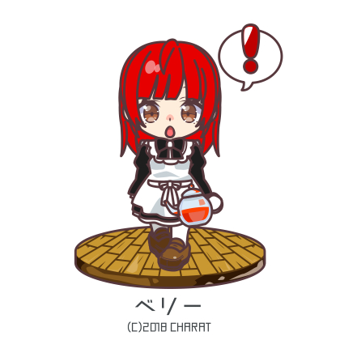
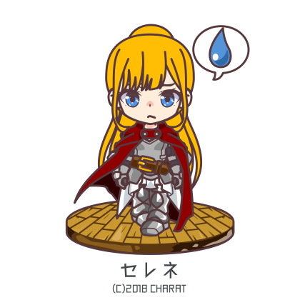
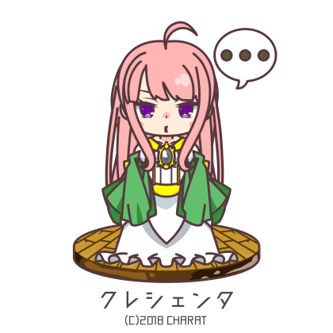
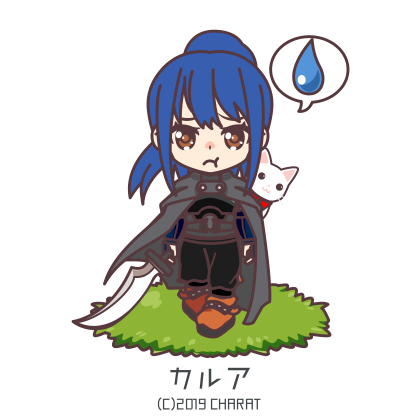
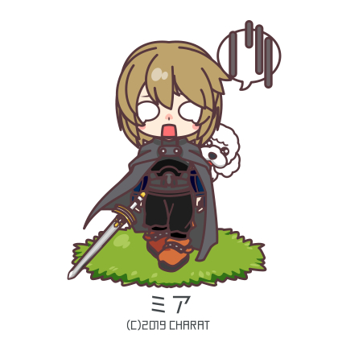

# Chapter 81: That Which Creeps Alongside Despair

Elrouga and Granmeld remained behind to process the prisoners, while Krische and the black century alone headed northeast at a brisk pace.

They passed through the forest and made for the Dragon's Maw――south, toward Nozan's encampment.

"……As expected. You've already arrived."

Nozan looked at Krische as she appeared, his tone one of genuine admiration.

He swept back his red hair and glanced at the sack carried by one of the century's soldiers.

"Yes, they weren't difficult opponents. It was easy. The aftermath was a bit troublesome, though."

"……Aftermath?"

The sack was untied, and what emerged was the debilitated form of Aulgorn.

His right arm was gone, bandages tightly wound from the base, his body clad in nothing but clothing.

"If you can believe it, he resisted after surrendering. One of Krische's soldiers was killed, and Vulture……ah, Centurion Dagra was stabbed and badly wounded."

"……I see."

Nozan furrowed his brow.

The man was gagged, bound, and weakened.

It was a state that could be called prisoner abuse, but the reasons were easy to infer.

That there were no visible bruises on his body was likely a mercy.

The Sacred Convention bound actions taken as military orders, but much else was left to one's conscience.

Killing a captured prisoner through lynching and reporting it as death from exhaustion or suicide was hardly uncommon.

"It is a clear violation of the Sacred Convention. Krische was considering simply putting him on display, but Krische has changed her mind. Krische intends to execute him publicly tomorrow, as an example."

"……I understand how you feel. However, I can't say I'm in favor."

He had anticipated what she would say.

While a Sacred Convention violation was punishable by death, executing a general based on one side's word alone would sour the enemy's sentiment.

It could even invite desperate resistance from their side.

"Krische has weighed the merits and drawbacks in Krische's own way. ……The other day, Krische's delaying action seems to have left a strong impression on the soldiers at the Dragon's Maw."

There was no anger visible on her face.

The girl sometimes transformed into something inorganic, an emotionless doll.

Nozan placed a hand on his chin and furrowed his brow.

"The reinforcements from the Dragon's Maw that were with the Markelus army……the enemy are soldiers so frightened of Krische that some even abandoned their status as prisoners and fled. If they are already afraid of Krische, then all the better. Krische thought it would be good to frighten them more and more, thoroughly, to the limit. ……Until the enemy soldiers lose all will to resist Krische."

Her smile carried an endlessly cold temperature.

"So Krische thought to make use of this man at just the right time. Having violated the Sacred Convention while holding the rank of a kingdom general, he will be executed regardless. And when the supreme commander violates the Sacred Convention, the standard punishment is quartering――Krische intends to carry that out before the enemy soldiers' eyes."

"I can understand the reasoning, but……even so, thinking of the future, I would prefer to stop this. Krische-sama is someone who should be protecting the kingdom for many years to come――it would stain your name."

"Krische has taken that into account as well. Krische is already disliked regardless, so in terms of roles, this way seems better, doesn't it?"

"……Roles?"

Yes, Krische nodded and turned her gaze toward Aulgorn.

Gagged and face-down as he was, he could surely hear every word.

"The cause of his resistance was that he underestimated Krische. Because of the foolish misconception that he could kill Krische, this man wounded one of Krische's precious subordinates. In Krische's opinion, this is a grave situation. If one considers the purpose of an army."

"……The purpose of an army, you say. That is a difficult thing to speak of."

"No, it's simple. An army exists to make the enemy afraid, and to prevent unnecessary conflict from arising. ――To force the other side into submission through fear backed by violence."

*――That is the true nature of an army, is it not?*

Her eyes narrowed as she looked at Aulgorn.

As if looking at an insect, not a person.

"The battle was concluded well enough, but because Krische failed in that regard, it produced a fool like this one. So it is something that must be reconsidered."

Nozan wore a troubled expression, hand on his chin, lost in thought.

Certainly, it was not wrong.

Establishing dominance through overwhelming violence, and by possessing it, preventing needless war.

Making the enemy afraid, making them hesitate.

There was a degree of reason in Krische's words.

"By brutally killing this man as an example and demanding surrender, unnecessary bloodshed can be suppressed. Krische and her people can deal with any remaining resisters at minimal risk. Resistance from surrendered prisoners can also be curbed to a degree. Krische thinks this is the approach to take going forward."

"Going forward?"

"If Krische keeps frightening them like this, Selene will be much safer than she is now. The more Krische makes the enemy believe she is truly terrifying, the more unnecessary battles can be avoided, and the more bloodlessly wars can be ended. Krische doesn't care what anyone thinks of her, and Krische herself won't have to waste effort on pointless things. It's nothing but benefits."

Killing enemies through brutal means and forcing surrender before battle through overwhelming terror.

There had been many such examples in the past.

Until the Sacred Convention, said to have been forged beneath the dragons in ancient times, established rules for war.

Looking at one side alone, it was not a bad idea.

The fact was that she was already feared.

And as the fighting continued, given her abnormal power and her nature, there was no doubt that number would only increase.

The problem was rebellion, but while there would be those who disliked her, few would be foolish enough to make an enemy of her. And even if they did, it was hard to imagine they could kill her.

"What did Corps Commander Faren say?"

"He was a bit hesitant, but said if that is what Krische thinks, then so be it."

"……I see."

The beloved adopted daughter of Bogan, whom he so revered.

There was some reluctance in shaping her into such a figure.

Selene would surely not be pleased either.

Yet regardless, it would be difficult for her to become a general who earned people's respect within the military.

*'She loves cooking and housework, loves peace, and Krische is a kind girl. But as you know, she is a bit different from other people……if one thinks of her as a military officer, she is almost too capable. I have no concerns about passing things on to Selene, but putting Krische at the forefront――that aspect concerns me somewhat.'*

The reason Bogan had steered her toward the strategic command corps he was still establishing was partly because he had recognized her nature.

A distorted talent clearly different from ordinary people――there was something about her that instinctively made people afraid.

Even if he stopped this here, as long as the war continued and she was part of it, it would be unavoidable eventually.

Weighing emotion against logic, Nozan sighed and nodded.

With Bogan gone, they were in no position to speak of ideals.

Thinking of the battles ahead, he wanted to minimize losses however possible.

Nozan chose logic.

"Understood. ……Thinking about what Selene-sama will say, my stomach aches."

"……Krische will speak to her properly afterward. But still, Krische thinks this is for the best. Krische wants everything to be over as soon as possible."

Even if things went well, for the next several years, perhaps more than a decade, the surrounding nations would grow restless around a kingdom weakened by civil war.

That was precisely why an early resolution was needed, to set the kingdom's affairs in order.

"……Then, let me explain the arrangements already in place. Originally, this was planned as an operation timed to Krische-sama's arrival……"

* * *

"What are they planning to do……"

The old general defending the Dragon's Maw, Geltz Wirring, stroked his long, snow-white chin beard and murmured from the mountain ridge fortress.

During Krische's "example," he had been away inspecting the north――the Christand side――so he knew only the rough details.

But he could see that his soldiers were showing deep fear.

Since then, the enemy had halted their attacks and maintained an eerie silence.

That silence only stoked the soldiers' terror further.

In the midst of battle, such emotions could be suppressed by the immediate fear of death and the excitement it produced.

But in silence, it slowly gnawed at the soldiers' hearts.

He was already well aware of the abnormality of Krische Christand.

A ruthlessness that would burn a mountain for the sake of victory. And her overwhelming ability.

Among those who had suffered casualties in the mountain sweeps was a battalion commander in whom Geltz placed great trust.

Not quite a warrior worth a thousand, but one worth a hundred――that kind of fighter.

Precisely because he was experienced in the mountains and trusted deeply by his men, Geltz had entrusted the sweep to him――yet by all accounts, he had been beheaded by the cursed child Krische without even exchanging a single blow.

It was beyond the ordinary.

Afterward, they had resorted to human-wave tactics, but against a mere hundred or so, that had only amounted to piecemeal commitment of forces, resulting in each group being destroyed in turn.

She, and the black-painted soldiers under her command, wielded devastating power in mountainous terrain.

The report that they had appeared here swelled Geltz's anguish.

――Surrender.

The word crossed his mind.

Aulgorn Hilkintos had been effortlessly broken before the cursed child.

The old general Geltz did not think Aulgorn incompetent.

The generals who guarded the kingdom's four corners were, to him, each a monster in their own right.

There were no incompetents among them.

Geltz did not possess extraordinary talent, but experience had taught him much.

War was a contest not merely between soldiers, but between the minds and self-mastery of their commanders.

At times bearing the weight of tens of thousands, even hundreds of thousands of lives, one had to make decisions under extreme pressure, where a careless word or moment of indulgence could decide victory or defeat and render it irreversible.

The generals who had won countless victories amid all that.

That was why they were entrusted with the kingdom's four corners.

Geltz, who doubted his own abilities, understood their abnormality better than anyone.

And the abnormality of Krische, who could defeat them with such ease.

He had already realized.

The battle had seemed evenly matched――but they had merely been made to believe so.

Selene Christand to the north, Nozan Velraigh to the south.

Both enemy commanders had simply been waiting for Krische Christand to arrive.

They had not doubted her victory against Aulgorn Hilkintos, and so they had refrained from pressing the offensive, content to wear down his forces and buy time.

What kind of monster must Krische Christand be, to command that degree of trust?

He did not think he could measure her with his own meager scale.

Had His Royal Highness the Prince failed to slay the hero Bogan, the battle the other day would have been a defeat.

The Black Lion and Lightning Quick――an anomaly had intruded upon the balanced struggle between monsters, and easily tipped the scales.

"……Give the men some meat before nightfall. I'm concerned about morale. We've been cutting back until now, but let them indulge a little."

"Yes sir!"

"……General Wirring."

A runner departed, and a brown-haired young adjutant opened his mouth with a hesitant air.

Young, but sharp of mind. Though his experience was still lacking, he would one day make a fine general.

Adjutant Rubens wore an uncertain expression, his gaze wavering.

Geltz smiled.

"Go ahead and speak. An adjutant is permitted any statement. An adjutant is expected to at times admonish the general, at times rouse him, to serve as both sword and arm."

He spoke in a deliberately gentle tone.

Geltz did not believe in lording over his subordinates.

"……Yes, sir. The current situation――we are surrounded, without reinforcements, and the soldiers' morale is no longer in any state to sustain a siege. At this rate, defeat is certain. I……believe we should surrender."

"……Mm."

It was a sound assessment.

The majority here would agree with his opinion.

Even the messengers and attendants nearby showed tension in their faces.

"That is precisely your role, Rubens. An adjutant must always restrain the superior's excesses and insist on rational judgment. ……Then, what is your assessment of attempting a breakout?"

"……South would be the sensible choice. Fleeing north would only mean drowning. If we aim for even a slender hope, then south――if we move at nightfall, we might be able to get some men through to the capital, to His Royal Highness. If the enemy is planning a surprise assault, there may be gaps we can slip through."

"……An excellent assessment. However, the enemy commander is General Velraigh. Naturally, in this situation, he will have anticipated our attempt to break out. It is impossible."

Soliciting opinions, only to reject them.

Rubens looked at Geltz in confusion.

Geltz smiled.

"Let me teach you something for the future. Basic tactics are, except when fighting barbarians, common knowledge that both sides can be expected to know. If one seeks to break out through a surprise blow, one must go beyond what the enemy can imagine. Without that, success only comes when the enemy is incompetent. Trusting in the enemy's incompetence and acting on it is foolish."

"……Yes, sir."

"Attendant, wine."

Geltz paused as if remembering something, and added with an "Ah."

"Give everyone here a cup as well."

So saying, he settled into his chair and gestured for Rubens to sit.

Rubens nodded with a solemn expression and sat.

Two wine cups were placed on the table and filled.

"You must always imagine the single, subtle move that surpasses the enemy. It may be a maneuver to catch them off guard, a tactic not found in any book――it takes many forms. Do you understand?"

"Yes, sir."

Geltz raised his cup, and Rubens followed suit.

"The recent battle――while attention was drawn to the left wing led by Selene Christand, Krische Christand leapt from the cliffs above with her elite. That was the move I could never have imagined. As a result, the enemy light infantry linked up with the formidable Second Corps――had things continued, that alone would have decided the outcome. Those who lead soldiers must always think of such ways to slip past the enemy's awareness."

*――My own capacity was not enough, though*, he added with a lonely smile.

"In a situation of force superiority, a straightforward push will win. But usually that is not the case. And even when it is, if the enemy has chosen to give battle, it is only natural to assume they have prepared a strategy to overcome your advantage. You must train your eye through every possible observation, never neglecting it. You are still young and talented. You have time ahead of you. You will surely become a finer commander than I."

"……General Wirring is a man deserving of respect, the finest general I could aspire to. Please, do not say such things."

"……Thank you. I am honored to have had an adjutant like you."

Thin tears glistened in Rubens's eyes.

He understood why this conversation was happening now.

"They will likely try to settle things tonight. Defeat cannot be avoided. But to surrender without fighting――I could not face the soldiers who have died before me. Someone must take responsibility. You understand, don't you?"

Rubens could not answer.

Geltz smiled gently.

"I will go to the front. I entrust full authority over the center to you. ……When the time comes, surrender. If they had intended to storm us, the enemy could have chosen that at any time. That they have waited this long means they are wary of losses. The example was meant to hasten our collapse and prompt surrender……whatever else, they will not commit atrocities."

"……But."

"I would appreciate your understanding. Must I really make this an order?"

Rubens was speechless for a time, but then he straightened his back and pressed his right hand to his chest.

It was a salute laden with every feeling.

Geltz smiled in satisfaction and returned it.

His face was clear.

* * *

――That evening, south of Mitskronia.

The screens at its base burst into flame, and smoke billowed upward.

The timber cut and hauled from Bernaich had all been intended for smoke.

The moisture-heavy branches and leaves produced great quantities of smoke when set alight.

Slowly, it crept upward, crawling across the slopes of Mitskronia.

"Now then, shall we get going?"

And at the Dragon's Maw――the central pass.

Krische moved to the point closest to the fortress and addressed her century.

With the smoke rising from the base, the enemy's attention would be entirely focused on the south.

"It should be much easier than descending the cliffs. Just follow along. Mia."

"Yes. First squad, advance in order. Captain Korintz, there's a lot of cargo, but please manage."

"Right. Don't spill any, you lot."

What some of the soldiers carried on their backs were jars of oil.

Climb the cliffs, and burn the mountain ridge fortress.

For the soldiers facing the north――Christand's army under Selene, that alone would be enough.

"The objective is to temporarily seize the fortress and raise that flag."

Krische looked at the flag and spoke.

It was the crescent-skull banner.

Like a sickle reaping stalks of grain, the scythe-sharp crescent moon represented Krische.

And the severed head――the hollow, death-signifying skull in profile.

Krische recalled Elrouga and allowed herself a smile.

It had apparently been completed recently, sent from Selene through Nozan to reach Krische.

As a demonstration of power, a banner served an important role.

The soldiers of Mitskronia had been shown this unit flag during the public execution, so upon seeing it raised over the fortress, they would understand at a glance who had taken it.

"If you encounter the general or any strong-looking opponents, always engage in groups of two squads or more. If you can run, run. Krische will handle it. Don't get badly injured like Vulture, alright?"

"Yes. Protect our lives, right?"

"That's right. You must protect your lives. Replacing personnel is a lot of work, after all."

"Fufu, yes. Understood."

Mia answered with a hint of amusement. Since Dagra's injury, this had become Krische's refrain.

Her words were soft, unadorned, and precisely because of that, they carried the ring of truth.

At the very least, her soldiers now considered their selection as her special unit the greatest fortune of their lives.

Without any spoken signal, they offered salutes, and Krische received them as she continued.

"This time Krische's group is a small force. There is no need to concern ourselves with the Sacred Convention. Even if we hold an overwhelming advantage, safety comes first. We are not taking prisoners in the fortress, so feel free. Even if the enemy shows no will to resist, unless they flee, kill them."

In her usual manner――yet somewhere cooler than usual.

"If you kill every last one, then it's safe."

Krische smiled at them.

---

# Chapter 82: The Scales of Malice

What had stood at the base of Mitskronia was not merely an arrow screen.

It was a blind to hide the timber hauled from Bernaich.

The branches and all had been tossed into shallow trenches and soaked in oil.

The large quantity of green wood, saturated with moisture, produced massive flames and enormous volumes of smoke.

And from south to north――the wind, blocked by the Dragon's Maw, carried the smoke upward, licking across the entirety of Mitskronia's scorched southern face――

From the mountain's base came the gongs and war cries of the Christand army.

Someone realized the intent and screamed.

"They're going to climb the mountain under cover of the smoke! Shoot whether you can see or not! Keep firing arrows!"

The bonfires were useless.

The billowing smoke blanketed everything.

Soldiers coughed and choked, fighting the terror of death, loosing arrows in a frenzy.

Many were too frightened, dropping their swords and fleeing.

Visibility――zero.

And here were the Bernaich Head-Hunter and the black-painted century.

The forest had burned away. The field of vision had been secured by countless bonfires.

That was why they had felt safe.

A tragedy like the one that had claimed so many brave men would not happen again――

This smoke was enough to shatter that conviction.

With their vision sealed, there was no telling where *that one* might appear.

A kingdom general, limbs severed――the image was seared into their minds.

The corpse had been left in the open. It was still there now.

If they resisted, they too would end up like that.

"Hiii……"

One, two, five, ten.

When the man beside you flees, the man beside him follows.

*They'll kill me. They'll kill me. They'll kill me.*

When someone driven mad screamed, those who mistook it for the arrival of the enemy did the same.

What they triggered through unbearable terror could only be called mass hysteria.

Screams erupting everywhere――those made the soldiers imagine a one-sided slaughter.

Robbed of their vision, their imaginations ran wild.

The rumored black-painted soldiers and silver hair. They imagined them killing their comrades one after another, and they ran.

This situation, where their commanders' presence vanished, was in fact a blessing for them.

Not for a lofty mission but to save their own lives――without fear of punishment, they could follow their instincts and flee.

The screams compounded, spreading, consuming the whole mountain.

Those who had been facing the Christand army to the north also heard the screams from the south and the smoke filling the sky, and began to tremble.

The Christand army had lit countless bonfires and deployed in orderly formation.

That was not for an attack.

More accurately, they were watching, to ensure the enemy could not flee.

If the enemy appeared from the south, they would be struck from behind with no escape.

Death crossed their minds as well, and screams engulfed the entire mountain.

Everyone feared being killed, and the army's cohesion crumbled.

"……Rubens, I leave this to you."

"……Yes, sir."

――And so Geltz Wirring, who had been at the mountain ridge, left the fortress.

Climbing the mountain under cover of smoke――this was no such simple action.

He had not imagined the enemy would advance through smoke that made even breathing difficult.

They had no need to.

They had merely blanketed the area in smoke.

That alone had rendered Geltz's soldiers useless.

Imagining the creeping monster, frightened, confused, most of them had already ceased to be soldiers.

His troops, exhausted from the mountain siege, were at their limit.

The enemy need only apply one final push at the precise point.

Moving west along the ridge, where the smoke thinned, Geltz saw what he had expected.

An army emerging from the remaining western woods, marching forward.

The figure at the head was unmistakable even from a distance.

General――Nozan Velraigh.

On the banner was painted a pair of elegant wings and a howling wolf.

To paint the hawk of Christand would be presumptuous, they said, yet they still painted wings――to show that they were the wolves who guarded Christand.

*――All who menace the hawk, the wolf pack shall devour.*

Bearing reverence bordering on worship for his fallen lord overhead, Nozan Velraigh marched along the ridge toward them.

"This is the end, then."

The enemy numbered about five thousand.

Not terribly many.

But his own forces, disorganized and without cohesion, amounted to fewer than two thousand gathered around him.

Through gaps in the smoke, the backs of his own soldiers could be seen fleeing.

The enemy deployed at the southern base raised war cries.

*Forward! Kill them! Slaughter them all! Krische-sama leads the way!*――they shouted this and that, yet made no move to actually advance up the slope.

But the soldiers on his side, trapped in the smoke, could not know the truth.

Even those who had barely managed not to flee believed the enemy was truly coming and exhausted their arrows, only growing more fatigued.

Collapse was inevitable. Without receiving a single attack.

No matter how much Geltz shouted, it was meaningless.

His words could not reach men in the grip of frenzy.

"……As expected. Brave soldiers gathered here, listen well!"

Geltz raised his voice.

Soldiers who still followed him despite being in a death ground of inescapable defeat.

Every one of them was a hero.

Some would tremble. Some would cower.

Even so, they suppressed those feelings and stood with Geltz.

For honor, for conviction, or for a friend――whatever it was, they were here for something beautiful.

Geltz felt nothing but gratitude.

"Before us stands a formidable foe, Nozan Velraigh. Serving under the hero Christand, he is called the strongest. Victory is no longer ours, and ahead lies only the road to death. You who remain here knowing this are, as soldiers――as warriors――braver and stronger than anyone."

Geltz saluted everyone present, no one in particular.

Not the salute of a superior, but the open-palmed press to the chest――the same salute they used.

"That you gathered here is enough for me. To have had soldiers like you under my command――I shall call that the greatest pride of my life."

He closed his eyes for a moment.

Defeat was unavoidable.

Today would be his last battle.

"And that is precisely why I say this to you. ……Value your lives."

Everyone was bewildered by those words.

They had barely held together because they had the general beside them.

"I will now advance, aiming for General Velraigh's head. Perhaps there is not even the faintest hope. And I cannot drag soldiers such as you――who should bear the future of this kingdom――along with me. ……Remain in this fortress, and when I fall, surrender alongside my adjutant Rubens."

There was little hope left even of whittling down the enemy's numbers through fighting.

With things so far gone, organized resistance was impossible.

Even if they took a few hundred, perhaps a thousand enemy soldiers down with them, what meaning would it have?

If so, then at least save as many as possible.

That was Geltz's decision.

"Though we crossed swords over differences of principle, I still respect the hero Bogan Christand to this day. He was a man overflowing with a warrior's pride more than any other. And I believe his confidant shares that same quality. ……The earlier display was meant to hasten our collapse. He is not a man who would commit outrages against those who have surrendered."

He had gained experience at the cost of many lives.

The body he had tempered beneath countless blades could still fight.

He was unremarkable, never surpassing the realm of ordinary men, yet he still held a warrior's pride.

"It is enough for you to witness my fight. ……I thank you for indulging my selfishness."

He dismounted.

Here, a horse was useless.

With a body transcending humanity through mana, no horse was needed.

――Forward.

His steps were sure. His mind was clear.

Several soldiers followed behind him.

From a few, to a few dozen.

And then past a hundred, past three hundred.

The exact number was unclear.

But Geltz smiled.

"……Fools, the lot of you."

"Hah, not as much as you, General."

One of the centurions laughed as he spoke.

"Let us cut a path with our lives. A general who's made such a bold declaration can't very well fail to reach the enemy commander."

The one who spoke next was a heavyset battalion commander.

A battalion commander making light remarks to a general. Depending on circumstances, such insolence could earn severe punishment, but Geltz did not grow angry. He merely laughed.

"Heh heh, indeed, that would be poor form. Rest easy――I too was once in your position, with sword and spear in hand. I don't intend to show you anything too pathetic."

"That's good to hear. If there's a chance after death, I'd love to request a bout."

"Ah, I promise."

Geltz nodded.

The centurion beside him laughed.

"Ha! I've never seen the battalion commander so much as swing a sword."

"Alva, you bastard. I've shown you plenty of times."

"That was swordsmanship? Stick-waving, at best. ……I'd assumed you came up here to surrender, but that's quite unlike you, Battalion Commander. Had a change of heart, have we?"

"The mouth on you. I'll have you flogged for this."

Geltz watched the exchange with evident enjoyment and nodded.

Then asked.

"What is your name?"

"First Corps, Second Battalion Commander Takilsu Nea Zengar, General."

"And you would be Alva. The Second Battalion was assigned to the southern defense, was it not?"

"Well, how to put it……most of the men fled. So I came here and found this sorry state."

"……I see."

"The battalion commander's authority extends only to his mouth and belly. The men all fled because they didn't want to die under his command……and for my own last moment to be alongside such a battalion commander. Nothing but emptiness."

*You bastard*, Takilsu bellowed, jabbing a finger behind him.

"Look there, dozens are eager to die alongside me. You see? That is the respect I have earned."

"Dozens out of a thousand. And most of them are mine. Is there anyone among you who wishes to die for Battalion Commander Zengar?!"

*There is not, Centurion Alva*――came the reply, and laughter rippled through those within earshot.

"Ha ha ha! Wonderful, truly wonderful. I wish I had met you sooner. I would have liked to sit down and drink with you."

Geltz clapped Takilsu and Alva on the shoulders with evident pleasure.

"Thanks to you, the coward's worm that lingered in me seems to have flown off somewhere. I may not look it, but my legs were shaking until just now."

He nodded deeply and continued.

"Let us show them that even a cornered mouse can bite a wolf."

"Ah, there's nothing else for it. But Alva, you're welcome to lay down your life protecting me while I escape."

"That would be the battalion commander's role. Unlike your daughters, my son is my own flesh and blood."

"You bastard……"

And so they marched toward their death.

The smoke was, in the end, only a momentary distraction. It thinned as they advanced.

And so, the distance between the two sides closed.

Before the drawn-up ranks of both armies stepped Geltz and Nozan.

The two generals faced each other just as before――the only differences being the number of soldiers and whether one was mounted.

A youthful voice rang out.

"To sally forth undaunted in this situation――quite splendid indeed. Allow me to apologize for my rudeness the other day, General Wirring. You are indeed a warrior."

He raised the visor of his wing-shaped helm; in his left hand, a steel shield.

The handsome face was twisted into a grin, the copper-haired man baring his teeth.

It was a wolf's smile.

"If I can serve as a foundation for soldiers with futures ahead of them, that is enough for me. Like you, I am not inclined toward needless bloodshed. Let this be our conclusion."

"Oh……I see."

At those words, Nozan's smile shifted, and he studied Geltz with an appraising gaze.

After a moment of thought, he spoke.

"If that is what you say, then this is likely the turning point. ……Before it is too late, let me ask. For the sake of the brave soldiers still here, would you not consider surrendering?"

"You think I would agree, having come this far?"

"Choose your words carefully, General Wirring."

Nozan said it without a trace of amusement.

There was something half-pitying in his eyes.

"Whichever you choose, it is a simple matter. At least for me. ……So my asking is purely a mercy――toward you and your soldiers."

A roundabout way of putting it.

Geltz furrowed his brow.

"What do you mean?"

"Well. Think on it."

Nozan smiled. As if baring fangs.

Geltz searched for the meaning, then shook his head, suspecting a stalling tactic.

"Victory and defeat shall be decided by the blade. My answer does not change."

"Is that so. ……A shame, I shall say."

Nozan lowered his visor, turned on his heel.

And drew his sword.

Geltz likewise turned his back and drew his own.

War cries echoed across the mountain.

* * *

――The battle could be called one-sided.

Five thousand against roughly three hundred.

A number that should never have stood a chance.

Geltz and his men were immediately surrounded――yet even so, there was defiance.

They were dead men from the start. Warriors so resolved that they did not fear even their own deaths.

Every last soldier charged toward General Nozan Velraigh.

Clearing the way at the front was a centurion known for ferocity within Geltz's army――Gikal.

With a bear-like frame, he swung his great hammer, mowing down foes.

Those around him were inspired, swinging their blades, and though hastily assembled, they were brave and fierce.

Soldiers resolved to die are strong.

By abandoning the life that lay ahead, they turned their own existence into fuel, burning everything they had as they pressed forward.

At the start of the battle, it was their charge that blazed.

――But it ended quickly.

What appeared before them was silver-winged armor.

And a steel greatshield.

"Ah, gah……!?"

The overhead blow of the great hammer――easily deflected with the greatshield.

And as he slipped past, a thrust of the longsword through the fallen Gikal's shoulder gap ended him.

――Shield in left hand, blade in right.

The renowned battlefield swordsmanship of the Rollka style revealed its true power when paired with a shield.

Before Nozan, who had mastered it, a mere strong man could not remain strong.

He used the shield to strike, to defend, and at times crushed enemy skulls with its steel face.

Those who faced him saw him as if he were a castle wall.

Their entire vision was filled by the steel shield, and then the sword that darted out was sharp and sudden.

Nozan Velraigh, at the very forefront of the melee, moved as though walking through an empty field.

Like a raging current split by a great boulder, the bodies of felled soldiers piled up on either side of his slender frame.

A tempered body and valor that feared no death ground.

Though hastily assembled, every one of them could be called an elite warrior.

Even so, Nozan's advance did not stop.

Full plate armor and a steel greatshield.

The total weight exceeded what an ordinary body could bear, yet his movements maintained the same speed and precision as if he wore nothing.

Not one person could so much as scratch his elegant armor――the hawk-wing engravings.

Only blood painted its silver surface.

First among the corps commanders of the hero Christand's army.

Nozan, too, was a monster who slew monsters.

In swordsmanship, he surpassed even his master Bogan, and the shield and blade that had felled countless warriors bore not a single blemish.

A single blow of his shield sent several men flying at once, and he overpowered those who faced him through sheer force.

When they turned their swords on him, their blades went wide as if cutting air, and that became their final swing before they vanished.

Power and technique――there was no one here who could topple the shadow-hero who possessed both.

"Guh!?"

"Battalion Commander!!"

The heavyset battalion commander, sent flying by the shield.

A centurion raised his blade to protect him.

And the shield gleamed upward from beneath the raised sword's base.

――A dull crash echoed.

The centurion's arm was shattered by the impact――the blade traced a line across his neck and he died,

"Alva!! You bastard……!!"

The battalion commander recovered his stance immediately, stepping forward with his whole body, sword ready.

*Even if it costs me my life――at least one blow.*

His lunging foot sank into the earth.

There was a ferocity in it that seemed to crush the distance between them.

――But the silver-winged warrior was calm to the end.

Against the deceptively quick blow of the large man, he lowered his stance.

Using the man's own momentum, he hurled the massive body overhead with his shield.

"Ah……"

And neatly slit the throat of the man as he floated in the air.

A rain of blood poured down, and the warrior showed not a flicker of interest.

Through the gap in the wing-shaped visor, only his gleaming eyes looked forward.

In his line of sight――there stood an old general in plain, sturdy armor.

His long beard swaying slightly, he offered a moment's silent prayer for the two deaths, then raised his spear.

"A duel, General Velraigh!!"

"Your spirit I acknowledge, but――"

――Geltz lunged.

An old man――yet his movements were incomparable to those of an ordinary person.

The hand spear was swung as if crushing the wind.

Its shaft whipped sharply toward the silver-winged warrior.

A blow that would have shattered a common soldier's spine through his armor.

Nozan deflected it easily with his shield――but Geltz was already gone.

He had circled further left, past Nozan's shield arm, and drawn his longsword.

The spear had been a feint from the start.

He slipped past the flank, circled around, and staked everything he had ever tempered――all of it in a single stroke.

His gaze targeted the gaps between armor joints――and the blade was keen.

Geltz sank low and unleashed a thrust so clean it could serve as a textbook example.

"――It is useless, old general."

"Guh!?"

Nozan did not even turn.

Yet from that position, his foot struck Geltz's torso with perfect precision.

A blow that warped the steel armor.

Geltz was slammed into a pile of soldiers, tumbled, and coughed.

"……I will acknowledge the courage it took to come at me. But this body, which served the hero Bogan Christand and was tempered under him――such skill cannot leave so much as a scratch upon it."

"Kh, not yet……"

Even as Geltz tried to rise, Nozan looked at him with something like pity.

"This too……was meant as a mercy. Look, old general. ――The smoke has cleared."

Nozan spoke, pointing somewhere.

It was Mitskronia's headquarters――the fortress.

At some point it had been set ablaze, and atop it flew a black flag bearing a crescent skull.

"Impossible……"

"Time's up, I should say. It seems you were too absorbed to notice, but――"

A sudden cascade of screams erupted.

From the soldiers Geltz had led.

"The moment I asked you earlier was your last chance. You refused, and now that choice cannot be undone. ――It is over, already."

With Nozan's words.

――Countless flowers of blood bloomed through the ranks, and the figure that burst through and alighted was a silver shadow.

Into the space of the two generals' duel.

Into that deliberately created arena stepped a girl, utterly out of place.

Her long silver hair was gathered into two tails that hung down; a shirt and skirt were hidden beneath her cloak.

Her beauty gleamed in the moonlight like a fairy's, and her violet eyes shone with a quiet radiance.

Slender and small――passing through the mist-like spray of blood, not a single drop of filth touched her snow-white skin.

In her hand, she carried an elegant blade that undulated like a woman's naked body.

Only that warped curved sword was stained with blood, giving off a faintly indecent, bewitching glow.

A girl who did not belong on a battlefield.

Yet no girl belonged on a battlefield more than she.

Her mere presence froze even the frenzy of the place.

Everyone here knew her.

As the embodied fear that clung to the Dragon's Maw.

And everyone here knew.

That she was despair in the form of a girl――something one must never meet on the battlefield.

――The cursed child, Krische Christand.

Upon seeing her, Geltz trembled and dropped the sword from his hand.

"Krische was going through the fortress killing everyone one by one, but you came out here after all."

A sweet voice that tickled the ear carried clearly across the silent battlefield.

Like a bell ringing, like a small bird singing.

The sound, divorced from fear or tension, was beautiful――in another setting, it might have been a voice one would listen to, enraptured.

"Yes, Krische-sama. ……Here."

In the frozen air, Nozan saluted naturally, sword still in hand.

As if the outcome had already been decided.

No one rushed to strike at the exposed Nozan.

Nor, naturally, at Krische, who simply stood there.

"That person is General Wirring, yes? Krische caught a brief glimpse of his face the other day. From a distance, though."

Her cherry-pink lips curved in a gentle smile.

"Killed everyone, you said……the fortress soldiers……"

Geltz asked, his voice barely a murmur.

Rubens. The face of the adjutant he had left behind surfaced in his mind.

"Krische's target was you, General. Krische thought you might be hiding somewhere, but……well, with all that smoke, you see."

*Krische was coughing the whole time, it was awful*, the girl said, covering her mouth with her cloak and wearing a troubled expression.

Without malice, guileless.

"Literally, killed everyone one by one. You're probably the only one left now, General Wirring."

*Krische killed your adjutant too, after all.*

She said it with a crazed smile.

* * *

――Rubens Rinea Alkerd was born into a certain noble house as the child of a concubine.

The family was one of male heirs――yet every child born had been a girl, so until he was ten and a few years more, it was said that he would inherit the family headship, and Rubens had lived up to that expectation.

He had devoted extraordinary effort to his studies and swordsmanship.

For the sake of his sickly mother.

Called a prodigy yet never growing arrogant, he continued to produce results, until even as a concubine's son, people said Rubens was the one most fit to inherit the name of Alkerd.

His turning point came when a boy was born between his father and the legal wife.

It was a story that happened all the time.

As if on cue, the treatment of him and his mother changed.

Now the army was the only path left to Rubens.

If he earned merit, if he rose through the ranks.

He could reclaim what he had once held and save his mother.

He trained without sparing even sleep, studying tactics, wielding sword and spear――and his good fortune was to be blessed with a worthy superior.

The one who recognized his talent before he had even reached thirty and promoted him to adjutant was Geltz Wirring.

A man rare for the central forces: one who had risen to general not through good birth, but through ability.

Geltz did not lord over his subordinates.

But his training was always rigorous, and he hammered every bit of experience and knowledge he possessed into Rubens.

A single lapse of attention could end hundreds, thousands, sometimes tens of thousands of lives.

A commander must never be lenient with himself.

Many before had been unable to endure his exacting adjutant training and requested reassignment.

But Rubens alone did not flee. He clung desperately to his instruction.

This was a chance Rubens could not let go of even in death.

The position of general's adjutant was one that sometimes even permitted assumption of the general's command――in name and substance, the army's number two.

For someone without connections or noble power to be selected as adjutant was exceedingly rare.

Rubens could not conceive of throwing away this opportunity.

Talented from the start, Rubens absorbed every kind of knowledge beyond what Geltz had hoped.

Master one thing, and immediately move to the next.

Polite and earnest, Rubens was an excellent student.

Over time, the expression on Geltz's face as he watched shifted from severity to gentleness――and one day, Geltz said to him:

*'I know that I lack brilliance. So I have tried to absorb every experience without letting a single one slip away, but……I often wish I had that one extra measure of wit. That is why, before my role is done, I wanted to entrust everything I have to someone with the talent I lack. Would you accept it?'*

*――Rubens, I believe I can entrust all that I have been to you.*

The words were heavy, and yet sent a shiver down his spine.

To be needed, to have everything he had done until now acknowledged.

Geltz's words were the words he had wanted from his father.

From that day, he threw himself into his work with even greater vigor.

Neither overconfident nor self-deprecating.

As the adjutant of Geltz Wirring, as the successor who would receive his everything.

But――

"Hmm, what a shame. Wrong guess. The general isn't here."

The one who plucked that bud was a single girl.

Having slaughtered every soldier on the upper levels of the fortress in a single breath, she tilted her silver-haired head.

Eyes like those of a doll――somehow inorganic――stared at him.

The widened violet irises shone with an eerie, cold light, and her well-formed face wore an expression that was somehow distorted, like a doll mimicking a human.

Not even a moment had passed since the alarm bell had sounded the enemy attack.

She had appeared before the bell stopped ringing, casually severing the necks of twelve men with precision, and now stood before Rubens.

"You're Adjutant Alkerd, yes? Where is the general――oh."

She plucked a sword from one of the corpses and drove it into a soldier climbing a ladder from below, killing him.

More fluid and beautiful than any swordwork he had ever seen――movement without waste.

He already understood more than well enough that he had no chance of winning.

She was a monster who could kill a person with the ease of kicking a pebble.

――*He should surrender.*

Reason whispered.

But Geltz was still fighting.

His beloved general was heading to what would surely be his last battlefield.

His convictions rejected what reason demanded.

"Forgive me, but I cannot let you pass――"

His right hand went to the hilt at his left hip.

The drawn sword, however,

"……Mm, you don't seem like you'll tell Krische."

"Ah, guh……!?"

Clattered onto the floor boards along with his right arm.

The voice had come from behind him, and the floor was before his eyes.

Before he knew it, Rubens's body had been forced to its knees.

"Well, that's fine. If Krische just asks around as she goes――"

"――Bunny, did you find him?"

"Erm……"

"Ugh!?"

Grabbed by the collar of his armor, Rubens's body was lifted into the air.

With a moment of weightlessness, his body, which had been on the fortress's third floor, was hurled to the ground.

Unable to take a proper fall, he writhed in agony as the girl landed lightly beside him.

The first squad and two others were there, and Mia was directing them.

"It was just the adjutant, wrong guess. Mia."

"……Nothing from anywhere so far."

The chestnut-haired centurion winced, *Uwaah*, and looked at Rubens.

The Wirring army soldiers around them, who had been fighting the black-painted century, stopped and stared at the girl.

Realizing that the figure before them was the cursed child Krische, and that the one-armed man who had fallen was Adjutant Rubens, some of them dropped their swords.

There was no will to fight in them.

But.

"――Kalua, no slacking. Krische's wish is safety first."

"Okaaay."

Her hatchet-like curved sword swung through the broken-spirited soldiers.

Two heads flew, and screams erupted.

"Hii――"

And with that as the signal, the black-painted soldiers fell upon them without mercy.

Rallying shattered morale is no easy thing.

The soldiers, who had barely maintained a semblance of coordination, were killed off one by one, like a beast tearing away limbs.

Rubens watched it happen, writhing in pain.

"How is it, Mia?"

"Yes, quite a few escaped, so about seventy percent of the cleanup is done. I thought I'd have Tagel's group continue mopping up the remaining enemy while Korintz's group starts setting fires as planned, but."

"Mm……yes, that's fine. Go ahead."

Fighting within the fortress――combat amid obstacles and elevation changes――was the most favorable terrain for the black century.

When pressed, they leapt atop watchtowers and structures to escape.

Then turned the tables, crushing the heads of unsuspecting soldiers from above.

Soldiers limited to two-dimensional movement could not catch them as they moved in three dimensions.

*Looks good*, Krische nodded, then addressed the prone, squirming Rubens.

"Krische will ask one more time. Where is the general?"

"The general……is not, here. I'll surrender, so please――"

There was nothing more he could do.

Rubens abandoned everything, cast away even his pride, and spoke.

"You can't do that. The general is still alive, and you, his adjutant, deciding to surrender on your own――that won't do."

But Krische spoke as if admonishing him.

When accepting a surrender, if there was a risk of casualties due to confusion in the chain of command, the receiving side could refuse it. This was to prevent a counterattack from units not informed of the surrender, or from a higher-ranking unit, after the accepting force had ceased hostilities upon hearing the word "surrender."

When the conditions of a chaotic battle and the general's survival overlapped, the general's orders took priority.

It was entirely legitimate under the Sacred Convention for the general to later revoke the adjutant's declaration of surrender and launch a counterattack.

Given that risk, Krische had no intention of accepting his surrender.

She would kill everyone who resisted, thoroughly, and secure safety.

There would not be a second Dagra.

In Krische's mind, the course of action was already decided.

"That can't……"

"What a shame. Krische had intended not to take prisoners in the fortress this time. If the general had been here, it would have been a different story."

Rubens stared blankly at the screams echoing around him, at the soldiers being killed.

That was all he could do, and he looked up at the smiling, crazed girl, tears welling, as if clinging to her.

"Please, I beg you――"

"Krische-sama, the general went west――toward General Velraigh with a small force, it seems."

"Oh, he went that way. Erm, then……ah, never mind. Good night."

"Ah――"

Inorganic violet eyes met his gaze for an instant,

And Krische crushed the clinging adjutant's neck beneath her foot.

"……Uwaah."

"Well then, Krische is heading to the general. Mia, you understand, yes?"

Mia nodded, making a deliberate effort not to look at the adjutant's body.

"Um……yes. If there's a counterattack from elsewhere, we withdraw immediately."

"Very good. That is what a centurion should say."

Krische puffed out her chest in an imperious manner, acting the part of a superior, nodding with satisfaction.

"The outcome is already as good as decided. Krische doesn't expect resistance, but this is a pointless battle. Don't let a single person die."

"……Yes."

Mia saluted happily, and Krische nodded with satisfaction.

She looked at Kalua.

"Mia's swordsmanship is so bad you'd be better off counting from the bottom, so Kalua, please make sure to protect her. It would be terrible if Mia got hurt too."

"Ugh……"

"Of couuurse, leave hopeless Mia to meeee!"

"Kalua!"

Mia glared, but Kalua paid her no mind.

Krische watched this, then turned her gaze to the other three.

They too saluted in acknowledgment.

"Well then, Krische is off. Krische will arrange for about a day's rest in town, so do your best."

With that, Krische dashed west――toward Nozan and Geltz.

There were enemy soldiers along the way, of course, but visibility was poor and they were in chaos. They posed no obstacle.

Those who cowered at the sight of her gave way; those brave enough not to were cut down.

No one pursued her.

Everyone knew it would be suicide.

And looking in the direction she had come from――toward the fortress――they understood.

The fortress had fallen.

Just as she had declared, the cursed child had come, and they had been defeated.

Krische cut down those in her way as she raced along the ridge through thinning smoke.

Then, cutting through the melee, she arrived at the slightly open ground――where Nozan and Geltz stood.

Both armies, both generals facing each other, and Krische had stepped into their space.

"――Krische thinks unnecessary bloodshed should be avoided. Would you please accept a full surrender?"

Krische approached Geltz slowly.

"You are the only one who can make that decision now, General Wirring."

With a light step.

"Surely the general thinks he would never surrender. Going so far as to charge General Velraigh with such a small force shows as much."

Geltz's actions were not born of logical judgment.

They were excessively reckless, excessively meaningless.

They would not affect the outcome, nor could they deal a significant blow.

Even so, the reason he had made such a choice was not entirely beyond her comprehension.

"Krische cannot understand it, but the general holds ideals about honor and glory and a sense of beauty that reveres death, yes? Krische is saying this with full awareness of that, and still asking you to surrender."

She smiled, nodded once to herself.

No one else spoke a word.

Everyone had been swallowed by the peculiar atmosphere she carried.

"Krische swears she won't treat you poorly. Krische did make threats earlier in the day, but unlike General Hilkintos, Krische follows the rules. Krische won't mistreat prisoners, and is prepared to provide generous protection as fellow subjects of the kingdom. But――"

The crazed violet eyes looked down upon Geltz Wirring.

"――If the general refuses, then for the sake of the future, Krische will slaughter every soldier remaining on this mountain. So that everyone who ever faces Krische in the future will think it better to surrender than to fight her."

The girl's mind was sane, and steeped in madness.

"An army without command or cohesion, frightened soldiers, the darkness of night. Surely you understand how easy it would be? From now on, whoever declares surrender, Krische will not accept it and will kill them. As you know, a self-initiated surrender can be refused if the other side considers hostilities to be ongoing."

And she asked with a smile.

"Please consider all of that carefully before you answer. Honestly, Krische could go either way. Either outcome would not be a bad result."

It was an endlessly lovely, endlessly charming smile, utterly devoid of humanity.

The curved sword she toyed with in her hand glinted red with blood, swaying.

"But still, by normal ethical standards, fewer deaths are surely a good thing, aren't they? If one thinks of the lives that could be saved by a single word from the general, the answer to a proposal like this should be obvious."

*――Right? Don't you think so?*

The moment he refused, she would lop off his head and carry out exactly what she had said.

Not the slightest trace of the hesitation a human ought to have existed in her.

"……surren, der."

"Hmm, um, Krische can't hear that. Once more, clearly, so that everyone here can hear. ……What is your decision?"

Geltz clenched his fists and repeated.

"I surrender……I surrender. Please, spare my soldiers."

His successor had been killed before his eyes, and he was not even permitted to die as a general on the battlefield.

"……Yes. An excellent decision. Fufu, Krische is glad the general is a reasonable man."

Before him stood despair that took everything.

The girl's heart was twisted enough to break everything Geltz had built.

---

# Chapter 83: Fool

――Dawn.

Selene, too, had grown accustomed to military affairs.

The Christand main army's casualties were practically zero.

Repeated feints――their role this time had been to heighten the enemy's vigilance and anxiety and wear them down, so even while taking on the bulk of prisoner processing, there was no confusion.

Once she had finished issuing the necessary orders, she temporarily left the north to Gallen and passed through the Dragon's Maw, heading south through the central pass.

Selene was accompanied by about thirty cavalry.

Whenever she moved any distance from the camp, she always brought an escort, even in friendly territory.

It could not be said that Bogan, who had been slain the other day, had been free of carelessness.

A hypothetical――had he brought slightly more escorts, escape might have been possible, and had that been the case, Christand would have won the battle that day.

A commander of an army, yet her father had taken his own safety too lightly.

That was the cause of the recent defeat.

Selene now looked upon her father's death through the eyes of a pure commander.

"……That is."

Through the Dragon's Maw, heading south.

Left abandoned before Mitskronia was a corpse with its limbs hacked off, and a flag.

Aulgorn Hilkintos――his wretched form.

Selene frowned and lowered her eyes.

She had been informed of Krische's actions through Nozan.

It had been half a fait accompli.

Krische had presumably already factored in how Selene would react.

Why had it been left out in the open like that?

To display it to the surrendered prisoners.

Like hanging a dead crow to ward off other crows. Simple and clear.

Krische would do such a thing without hesitation.

*Why would she do this?*――Selene did not think such things.

Krische could render things that held no value for her utterly valueless, to any degree.

If it could be made use of, she would do anything without so much as a change in expression.

What governed Krische's mind was always the cold logic of mathematics.

She considered ordering a burial――then decided against it.

At this point it was meaningless. And the soldiers were busy.

Better to leave it be and make maximum use of the effect.

Selene passed by, her golden hair swaying like a horse's tail.

The cavalry following her made a deliberate effort to avert their eyes from the corpse.

Its face had been pecked by crows, frozen in an expression of contorted agony.

* * *

Then onward to the Velraigh army's main camp.

Heading for the commander's tent where Nozan was, the black century naturally came into view.

Since it had been a forced march with only the century, they were borrowing tents from Nozan's forces.

Upon recognizing Selene, the soldiers immediately saluted, and Selene returned the gesture carefully.

"Where is Krische?"

"The corps commander is――"

"Selene!"

With the voice, a shadow suddenly burst from the side and clung to Selene atop her horse.

The horse paused a beat before whinnying in surprise, but did not buck.

The impact on Selene, for all the momentum behind it, was light.

Having heard the voice and imagined what would follow, Selene showed no sign of surprise.

She wore a troubled expression but stroked the silver hair, scolding, *Honestly.*

"What if you'd fallen, you fool?"

"Ehehe……Selene is reasonably good at riding, so it's fine, uu……"

"That's not the point. ……Good grief."

She pinched Krische's cheek――the soft white flesh――stretching it, and Selene gave a wry smile.

Her face and cloak were clean and spotless.

It had apparently not been too demanding a task.

Relieved that there was no sign of fatigue, Selene lifted Krische's slender body, cradled her sideways, and stroked her cheek.

"You look well. Were you lonely?"

"……Yes, Krische was maybe very lonely."

Krische relaxed, leaning into Selene's body.

*I should have taken off the armor before coming*, she thought with a small pang of regret.

Watching Krische nuzzle against her and frown at the feel of the armor was equal parts amusing and pitiable.

"Krische, what about work?"

"Krische only brought the black century, so Krische's group is finished. Krische expected Selene would come, so Krische has been preparing breakfast……"

She peeked upward.

Her lips were moving softly, and those large eyes looked a bit sleepy.

A quiet gurgle sounded from her stomach.

*Eat together, and while we're at it, sleep together*――that was surely the gist.

Selene could see right through her and smiled wryly.

"I'll just stop by General Velraigh's tent briefly. After that, let's eat together."

"……Yes."

"Elittes, I'll be resting with Krische for a while too, so all of you rest as well. At noon, gather the corps commanders here for a meeting."

"Yes, ma'am."

She held Krische for a little while, then removed her armor in Krische's tent.

Then left her behind and went to Nozan.

It was merely a greeting――the meeting would be held later, so Krische's presence was not necessary.

Or rather, it was more accurate to say that Krische, wanting to cook for Selene, had voluntarily stayed behind.

Krische was in higher spirits than usual.

"I'd expected to be yelled at the moment I saw you, but it seems that worry was unfounded."

Nozan gave a wry smile upon seeing Selene.

"That would just be taking it out on you. I'm not that short-tempered."

Selene glared at him and sighed, and Nozan swept back his hair and smiled.

"The general used to come to me quite often for consultation about Selene-sama's temper."

"……That was ages ago. I have at least some sense of judgment now."

"Ha ha, you've become so much calmer since Krische-sama came along."

Selene's cheeks colored as she muttered, *Honestly*, and sat down.

"Thanks to Krische and General Velraigh, I had an easy time of it. The preparations were a good opportunity for training. First, my thanks for that."

"It was only natural. From here, the stability of the rear under Selene-sama's command becomes critical."

"Yes. I didn't expect the west to be dealt with so easily, so it may be overkill, but."

Going forward, the Dragon's Maw would be used as the primary supply route.

The eastern region, still wounded from the recent war with the Holy Empire, had little surplus.

The Empire's widespread pillaging had burned villages and left civilians without work; while they could be hired as soldiers, sustaining the supply chain to feed them over the long term was difficult.

That, too, was a reason to hasten the capture of the Dragon's Maw.

Stabilizing the Dragon's Maw would finally give them the logistics to operate freely in the center.

And maintaining the rear supply lines through the Dragon's Maw was the role of Selene and the Christand army this time around; if the Velraigh army was the sword, the Christand army was the shield.

Had the Hilkintos army's entry been delayed, the Christand army would have confronted them while the Velraigh army marched on the capital.

"Being over-prepared is just right. His Royal Highness the Prince has been scattering gold from the treasury."

Selene nodded in agreement.

There were rumors that national treasures from the royal vault were being sold off in massive quantities.

Winning first, worrying about the aftermath later――Gildanstein seemed to be thinking of nothing else.

The amount of soldiers he could raise was unknown, but it would surely dwarf the roughly five thousand newly recruited by Christand's army.

Their side would settle at roughly sixty thousand combined with the Velraigh army, but the enemy would certainly exceed that.

Pouring gold from the treasury made it possible.

No matter the justification, fighting a "state" that controlled the royal palace meant exactly that.

"Rather, having defeated Hilkintos has brought us to parity. That is the better way to view it."

"……True. I'd like to hear your assessment――what about General Garhka?"

"My personal view……he is a favorable man. Despite being a great noble, he has no interest in politics……yes, he resembles the general――Bogan-sama."

Selene briefly pictured her father's face, but showed no particular reaction.

"Can we feel at ease?"

"Well. I don't believe he will act, personality-wise, but even so, we can't be entirely unguarded. There isn't much point in thinking about it. I understand how you feel, though."

*I also hope he doesn't move*, Nozan added with a wry smile.

"Well, that's true. No point thinking about it."

With both hands overhead, Selene stretched lithely.

"……I'll take all the prisoners here. That's fine, yes?"

"Yes. We're near our limit as it is. ……Also, it would be best to keep Krische-sama's force separate going forward."

Nozan said it quietly. Selene froze for an instant, then glared at him.

There was anger in her gaze, but Nozan met it head-on.

"……You're telling me to let Krische bear the blame alone?"

"Krische-sama desires that, surely. ……It is simply a matter of roles. If the carrot and the stick are mixed, neither is useful."

"Even so……"

"It is a matter of perspective. What is done is done. Then making the most of it is the only proper way to honor what was done. Just as one must not pity the soldiers sent to the rear guard, the soldiers sent to die. ……It is the same thing."

Nozan was deliberately cold in his phrasing.

Selene clenched her fists until they whitened, her gaze wavering weakly.

"However you feel, you understand, don't you?"

Seeing Selene unable to answer, Nozan spread his hands in a gesture of resignation.

"……Well, what you do is for you, as general, to decide, Selene-sama. I won't force you, but……either way, after the war, that is how it will be."

"……After the war?"

"Peace is nothing but a preparation period. Until the next war. ……If you think about where Krische-sama will be when that time comes, the only question is whether it happens sooner or later, isn't it?"

Selene tried to glare at Nozan again, but stopped.

She spoke as if sighing.

"……Thank you for the advice. You have a rotten personality."

"Ha ha. Someone who tells you what you don't want to hear is also needed. I do hope you won't dislike me for it."

"True enough. ……What you say isn't wrong. I'm powerless."

After saying this, Selene continued.

"……Even so, I want Krische to be happier than anyone. As much as possible, as much as I can, even a little."

"If it comes to that, I too wish for Selene-sama's and Krische-sama's happiness. On top of that……well, perhaps I am overstepping."

*And*, Nozan looked at Selene.

His tone was one of gentle admonishment.

"This was something Krische-sama thought of herself. And if Selene-sama agonizes over it, that will trouble Krische-sama. She is a kind person……you understand that, don't you?"

Selene did not answer.

* * *

Inside Krische's tent――within the blankets.

"Selene."

"……What?"

"……Ehehe, kiss."

Krische kissed her.

Clinging tight, rubbing her cheek against Selene's, and kissing.

Krische was still Krische――a fool.

Selene sighed with exasperation and a wry smile, pinching and stretching her cheeks.

They had finished eating, and there was a little time before the noon meeting.

For a meal in a war zone, it had been rather lavish.

Apparently something Krische had prepared in anticipation of their reunion.

Eager to see Selene, Krische had battled drowsiness while commanding the breakfast preparations, arranging not only soup and grilled dishes but even borrowing an oven to make pizza.

Having Krische cling to her so shamelessly in front of the soldiers was troublesome, but also adorable, and dear, and Selene could not bring herself to scold her too harshly.

Perhaps she had gotten a taste for it after being bedridden with injury the other day.

Krische had become more and more of a spoiled child.

Whether Krische becoming more foolish was a good or bad thing――that was something Selene found hard to decide.

Perhaps it was fine if it made Krische happy.

Even if only a small comfort, a brief moment, whatever it might be.

Even if the civil war ended neatly, there was no guarantee peace would follow.

If foreign nations moved, it would be on the scale of the recent Holy Empire invasion.

In that case, inevitably――they would have to borrow Krische's hand.

If that became a cycle.

When would she ever be able to fulfill the promise she had made to Krische?

She could not see the future. Only anxiety showed its face.

The world Krische desired seemed impossibly far away.

"……What are you thinking about what lies ahead, Krische?"

"Ahead?"

"Our future, I suppose. Knowing you, you've already predicted how things will go, haven't you?"

"Ah, I see."

Krische softened her happy smile just slightly.

"If Krische were the ruler of a neighboring country, Krische would not miss this opportunity. If they were considering invading the kingdom, there has never been a better chance. The reason it has not happened yet……or the reason it may not happen in the future……is simply that there are political obstacles on their side that prevent them from gaining practical benefit. There is a high probability that some nation will act."

She stroked Selene's cheek, her eyes somewhat distant.

"If multiple nations come at once, maintaining the current territory will be extraordinarily difficult. Contraction of the strategic defensive perimeter――shifting to interior-line operations centered on the capital would be the best option available to the kingdom. The forests as the western edge, Wulfenite as the eastern edge, and focus on maintaining national strength."

*――After that, Krische will crush them one by one.*

There was no strain in her voice at all.

Her gaze was transparent, neither warm nor cold.

Looking at Selene, and yet seeming to look at empty space.

"Selene and the others will defend the capital, and Krische will be the one who moves. That would be best, Krische thinks. When Krische gets tired, Krische can come back and rest――if everyone is in the capital, Krische can feel safe. No more being separated like now and feeling anxious."

Her eyes narrowed a little sadly, and Selene stroked her cheek.

Krische wore a soft smile.

"It will be close enough to come back anytime, and for a while, that will do. Krische would like to finish as quickly as possible, but, well, it should be a matter of a few years."

*Krische just needs to kill them all.*

She whispered in a sweet voice.

Pressing forehead to forehead, nuzzling nose against nose.

Her eyelids, drowsy and content, wrapped around the violet, and she continued.

"……Once Krische makes everyone around us understand――that they should never threaten Krische and the others――then it will be peaceful and everyone will be happy every day. Krische might have to do a bit of work, but still, every day at the estate, happy. Cooking, having tea, sleeping together like before."

*If that happens, Krische will be so happy.*

Her voice sounded as if she were trying to convince herself.

As if speaking of a distant dream.

"……Krische."

She had heard about Dagra's injury during the meal, how it had happened.

That was what had triggered all of this.

Krische had no interest in honor or duty, mercy or charity.

She simply conformed to what others expected, following rules and nothing more.

If the other side broke those rules, she would retaliate beyond measure.

To any extent, without limit, for the sake of her goal.

That was frightening.

"Krische will endure until then. ……Selene is worried about Krische, right?"

"……Yes."

When Selene answered, Krische kissed her happily.

"Ehehe, Krische has been getting better at understanding what people are thinking lately. Krische is very worried about Selene too, so it must be empathy."

She cupped Selene's cheeks and kissed again.

The soft sensation of lips. There was nothing indecent in it, only pure affection.

Everything about Krische always shone like a jewel.

"Selene is always thinking about all sorts of things for Krische's sake. That makes Krische very happy, but, Krische doesn't like Selene worrying and agonizing like this. So please, don't think about anything, just leave it to Krische."

Gold and silver tangled atop the blanket.

Krische lifted the strands, letting them flow and mingle.

"Krische……used to think Krische should be the most excellent person in the world. Krische wanted to be the best at everything, so Krische cared a lot about how others evaluated her, too……but lately, not so much."

The jewels wrapped in silver-spun lashes simply gazed at Selene.

"……Now, Krische doesn't care if someone dislikes her, or what anyone thinks, or how anyone evaluates her. As long as Selene and the others, who Krische loves so much, say they like Krische, and treasure Krische……then that's enough for Krische."

She buried her face in Selene's chest, looking for all the world like a small child.

Seeking a place of safety――perhaps a reaction to having been denied love during the time she needed it most.

What Krische always wanted was something like what a child asks of a parent.

"Even so, I can't help worrying about you. I hate it when you're disliked, or feared, or spoken of cruelly. ……I want you to understand that."

"……Yes. Krische thought Selene would probably say something like that. Krische thinks Bery would say the same thing too."

She wrapped her arms around Selene's back, clinging tight.

Selene simply held her, gently stroking her head.

"……Krische is sorry. But, Krische thinks this is for the best."

Selene's elegant face twisted for an instant, and her eyes fell.

Then she spoke as if sighing.

"……What a fool you are. If you're this much of a fool, I'll have to look after you for the rest of your life."

Krische squeezed tighter.

Rubbing her cheek against Selene's curves.

Leaning her small body in.

"Ehehe, Krische thinks Krische is very clever, but……"

*――Maybe Krische is just a little bit of a fool, sometimes.*

And in a whisper.

She returned those words, warm with feeling.

---

# Chapter 84: Character Profiles — Spoilers through Arc 4

*Note: Includes most named characters up to and including minor supporting roles. Alignments are impressionistic.*

**Alignment axes**

**Order** — values rules and discipline, universal principles, emphasises an orderly society and law.
**Chaos** — values the individual and their emotions and thought; prioritises personal will over social discipline and morality.
**Neutral** — the middle ground of either axis.
**Good** — an altruistic disposition; holds the moral principles one believes in above personal gain, and is willing to die for them.
**Evil** — a self-serving disposition; places personal gain above all else and is willing to trample others for it.
**Neutral** — a temperate disposition that inclines to neither extreme.

---

**How to read Kingdom noble names**

Example: 1, Gildenstein = 2, Calnaros = 3, Vel = 4, Saccarinea = 5, Alberan

1. Given name: Gildenstein
2. Largest territory under administration: Calnaros. (In practice all administered lands are included, making the full form very long; it is abbreviated.)
3. Males of the royal line with succession rights take Vel; females take Vera.
4. Honorary peerage title: Saccarinea.
5. Family name: Alberan.

Formally, between 4 and 5 there may be military ranks (Marshal, General, etc.) or court offices (Chancellor, etc.), and after the family name there may be a ducal or other peerage title. Because the resulting strings are already eye-glazingly long in the original, the text renders them with clarity in mind, attaching the relevant rank or office in Japanese characters at the end as needed.

Generally, titles other than the family name are not necessarily inherited by children, though it is customary for the eldest heir to inherit lands and titles without particular objection.
The sole exception is the honorary peerage (item 4), which denotes martial distinction and is not inherited.

---

**Height reference**

Average male: approx. 175 cm. Average female: approx. 160 cm.
*(blank / medium build)* — average
*Tall / large* — approx. 10 cm above average; "six shaku" for men means 180+ cm
*Petite* — approx. 10 cm below average
*Relatively* — the height in question is toward the lower end of tall/petite
*Very* — the height in question is toward the upper end of tall/petite

| Character | Approximate | Rough estimate |
|-----------|-------------|----------------|
| Krische | Late 140s | 147 cm |
| Bery | Early 150s | 152 cm |
| Selene | Late 150s | 159 cm |
| Kreshe(nta) | Early 130s (still growing!) | — |
| Kalua | Late 160s | 168–169 cm |
| Mia | Late 150s | 158 cm |
| Arne | ~160 | ~160 cm |

○ = alive at end of Arc 4 ● = deceased by end of Arc 4

---

## ■ Main Characters

### ○ Krische = Linea = Christand 『Order · Evil』

The girl who can kill people without a second thought. Adopted daughter of the Christand household. Protagonist.

She is what is called a "Weeping-less Babe" — a cursed child of the royal line — and was smuggled away from her execution by a servant charged with her care, eventually raised in the village of Karka.

An aberrant with no empathy, feeling no guilt for killing or violence; yet, having received genuine love from good people, she has gradually begun to understand ordinary ethics and emotions.

She takes words entirely at face value as a rule, and is poor at reading the feelings behind them.

In every other respect she is a literal genius of superhuman aptitude, capable of absorbing and advancing any technique at a glance. In all things she operates from the premise that *she is naturally capable of whatever is required*, has a strong attachment to her own excellence, and is a dedicated hard worker.

Her approach to human relationships follows the same logic — she functions primarily on a profit-and-loss basis — but because she cannot read others' feelings, she tends to over-value what others give her while under-valuing what she gives in return. As a result, she often imposes on herself a kind of exaggerated *reciprocation* for any pure goodwill directed at her, and spares no effort in meeting that self-imposed obligation. This stems from her own discomfort with relationships, yet that aspect of her is genuinely good; one's assessment of her shifts dramatically depending on whether one sees her as a mere aberrant or as a girl who is simply too pure.

**Appearance:** Long silver hair. Violet eyes. Very petite. Slender. Modest chest. Fairy-like.
**Armour:** Everyday clothes with gauntlets and reinforced boots.

→ *Self-assessment:* Very clever and capable, though still immature in many ways. Perhaps a *little* more clingy and greedy than most.
**Good at:** Killing. Magic. Arithmetic.
**Likes:** Housework including cooking. Sweet things. Being spoiled. Kissing, hugging, physical affection in general. Looking after others.
**Dislikes:** Anything that disturbs the peace around her.
**Worries:** Work is hard. Wants to be spoiled.

---

### ○ Selene = Algaritte = Linea = Christand 『Neutral · Good』

The earnest, deeply loving girl who can't catch a break. Head of the Christand household. General.

The sole heir of the martial Christand family.

She harbours a complex about being female, and has worked hard to follow in the footsteps of her father — the hero she looks up to. Until a few years ago she used to curse her own womanhood, and before she met Krische (whose talent is overwhelming) she imposed such excessive effort on herself that those around her worried. Caring for the childlike Krische — contrary to what her talent would suggest — broadened a perspective that had been wholly defined by being a general's daughter, and she has come to treasure the small moments of ordinary life.

She is highly capable — talented and hard-working — but fundamentally prone to overextending herself.

Growing up surrounded by excellent people — her heroic father Bogan and his subordinates, Bery, and Krische — has left her with a tendency to underestimate herself and impose unreasonable effort on a disposition that is already too serious and responsible for its own good.

She would fill any spare time with study or administrative work. The classic workaholic.

She dotes on Krische as a younger sister and feels deep affection for her, yet is also strongly aware of the danger in her abnormality.

**Appearance:** Long golden hair. Blue eyes. Slender. Average chest. Beautiful.
**Armour:** Silver-wind, silver-winged plate armour.

→ *On Krische:* A silly, oblivious child. Adorable. I want to let her live an ordinary life.
**Good at:** Horsemanship. Command.
**Likes:** Swordsmanship. Reading. Doting on Krische.
**Dislikes:** War. Her own powerlessness.
**Worries:** The extremely improper nature of the relationship between the servant and her sister. She herself is in uncertain territory.

---

### ○ Bery = (Lips) = Algan 『Chaos · Good』

The slightly broken holy-mother type. Servant of the Christand household.

Daughter of the fallen Algan family. Selene's aunt.

Originally sickly; for that reason her self-esteem is extremely low and her disposition is introverted. Troubled by the way her poor health imposed on others, she deliberately maintained a cool distance in childhood to spare people the trouble of worrying about her — which only made the servants dislike her more, worsening her condition. Somewhere along the way she began living while wishing for her own death.

Even after the family fell and she came to the Christands and her health issues resolved, her self-loathing only grew. Entrusted by her beloved elder sister to care for the far-too-serious Selene, she tried to act brightly as a substitute for her sister, but that too did not go well, and she cursed herself for being incapable of doing anything properly.

She is one of those saved by meeting Krische, by being the recipient of Krische's pure love and goodwill.

Outwardly calm and easy to get along with, but the collapse of the Algan family left her with a mild mistrust of men; combined with her introverted nature, she keeps human relationships at arm's length.

She has a talent's intuition and is efficient — too good to remain a servant — but in keeping with her disposition she is satisfied with her role as a servant and has no desire to step into the limelight.

At present she channels almost all her talent and passion into cooking; Bogan and Selene have always felt it was a waste.

Stubborn despite appearances. Appears logical but operates on instinct. Tends to prioritise emotion over reason in things she feels strongly about.

She holds deep affection for Krische and puts Krische's happiness first.

**Appearance:** Red hair cut level at the shoulder. Brown eyes. Petite. Full chest. Baby-faced and lovely.
**Armour:** Maid's uniform.

→ *On Krische:* Honest and pure. The reason to live. I want her always by my side.
**Good at:** All housework including cooking. Etiquette. Sophistry. Self-defence.
**Likes:** All housework including cooking. Teaching. Doting on Krische.
**Dislikes:** Self-serving people. Herself.
**Worries:** Krische is so unguarded that Bery's reason is occasionally in danger.

---

### ○ Kreschenta = Farna = Vera = Alberan 『Order · Evil』

The girl who can poison people without a second thought. First Princess of the Kingdom of Alberan.

A "Weeping-less Babe" — a cursed child of the royal line — but thanks to the quick thinking of a servant named Nora, she survived and was raised as a princess.

Like Krische, she pays the price of high intelligence with a deficit of empathy, and feels no guilt for self-serving killing. She has eliminated inconvenient obstacles — her own father, a younger brother, servants — by various means in order to seize power, and does not hesitate to dirty her hands in self-preservation.

Having nearly been killed the moment she was born as a cursed child, she is dominated by the obsessive conviction that she is always in danger of being eliminated. In some respects she is even more of an aberrant than Krische, but having grown up in the royal court, she has a pathological degree of acting ability and her abnormality has never come to light.

She recognises her true elder sister Krische as the one being in the world on her own level, and judging that they could work together, she framed their uncle Gildenstein for the king's murder and took shelter with the Christands.

Having built a relationship of trust through her interactions with Krische, Bery, and Selene, changes have begun to stir within her.

**Appearance:** Reddish-gold long hair. Violet eyes. Very petite. Slender. Essentially flat. Fairy-like.

→ *On Krische:* The only being in the world on my level. A bit of an idiot, which worries me.
**Good at:** Poisoning. Political assassination. Lying. Acting. Winning people over. Arithmetic.
**Likes:** Herself. Being pampered. Physical affection in general.
**Dislikes:** Anything that threatens her safety.
**Worries:** That onee-sama has been ensnared by the servant. That the servant's affection for onee-sama is clearly impure. That a part of her is pleased to be treated like a dog.

---

## ■ People close to Krische or the Christand household

### ● Bogan = Algaritte = Vezlinea = Christand 『Order · Neutral』

The noble and decisive hero. Selene's birth father. Bery's elder brother by marriage. Deceased. "The Thunderbolt."

A hero of the Kingdom who raised the once-fallen Christand barony to a margravate in a single generation, rising from soldier to General.

Having come up through the ranks, he understood the army's various problems. By assigning multiple tactically gifted adjutants to each corps commander and distributing the workload, he succeeded in raising the standard of capability. He is known for fierce attacks, staged tactical withdrawals, and flamboyant tactics, but he believes Christand's real strength lies not in on-the-spot tactics but in information-processing capability achieved through prior preparation.

He has calmed with age, but in his youth was prone to recklessness, a warrior who loved fighting at the front line. From the sight of him cutting down enemies and pressing forward with his wild swordsmanship, soldiers called him "Christand the Thunderbolt."

Uncommonly for a noble, he remained faithful to his late wife and took no concubine.

He dies in a duel with the King's brother, Gildenstein.

**Appearance:** Gold hair streaked with white, swept back. Blue eyes. Large, muscular. A fierce, sharp face. A moustache.
**Armour:** Dull-silver hawk plate armour.

→ *On Krische:* A prodigy of rare talent. A crooked yet gentle girl.
**Good at:** Rolka-style swordsmanship. Organisation-building. Command and deployment.
**Likes:** Military history. Alcohol. His daughter.
**Dislikes:** Political infighting. Extremists.
**Worries:** That he cannot find a suitable young man worthy of his daughter. Finding a match for Bery.

---

### ○ Gallen = Linea = Karka 『Neutral · Good』

The stoic, ungracious old soldier. Krische's adoptive grandfather. Bogan's former superior. Selene's current adjutant.

Once a talented centurion who rose from the ranks, he achieved remarkable military distinction alongside Bogan even without the gift of mana. He commanded deep respect from his subordinates and had the ability to one day reach general — but he resigned his commission out of remorse for having burned a village on a superior's orders.

Afterwards he lived as a hunter in his home village of Karka, spending peaceful days with his daughter and son-in-law and their adopted daughter Krische — until bandits attacked, killing the couple and leaving Krische unable to remain in the village. He departed with her, took shelter with Bogan, and returned to the army.

A long-suffering man who rejoices more than anything that Krische found understanding and happiness in the Christand household.

**Appearance:** White hair grown out carelessly. Dark-brown eyes. Muscular. An ungracious, grim face.
**Armour:** Dull-silver half-plate.

→ *On Krische:* A girl who is a little different from others, but good and gentler than anyone.
**Good at:** Archery. Command and deployment. The forest. Adversity. Not losing sight of himself.
**Likes:** Alcohol. Hunting. Maintaining his tools.
**Dislikes:** Cruelty.
**Worries:** That those around him keep dying before him. His self-restraint if Krische ever brings home a marriage partner.

---

### ○ Arne = Gieterns 『Neutral · Good』

The comically accident-prone girl. Servant of the Christand household.

Born into a marquis family. Despite numerous tutors and a rigorous education that produced underwhelming results, her parents — fearing for her future — sent her to the royal domain as a lady-in-waiting.

It was there that she encountered Bery, a Christand servant, and became utterly infatuated. She threw away the position her parents had gone to considerable pains to secure, came close to being disowned, and became a Christand servant.

Not unintelligent, not lacking in dexterity, but prone to nerves, flights of fantasy, and leading with impulse — she tends to fail at critical moments, which frequently exasperates those around her.

Her character is earnest and good; her birth and appearance are perfectly acceptable; if she would only sit quietly she would have no shortage of suitors — but sitting quietly is not in her nature.

Lately, confronted with the morally ambiguous realities of the Christand household, she cannot stop fantasising.

**Appearance:** Black hair tied back, falling to mid-back. Dark-brown eyes. Average height and build. Cute.

→ *On Krische:* A bewitching serial kisser. The mistress of the servant she admires, and the centre of her fantasies.
**Good at:** Passable cooking. Passable housework in general. Passable etiquette. Charitable interpretation. Impeccable timing (of blunders).
**Likes:** Daydreaming.
**Dislikes:** Her own blunders that always arrive at the worst possible moment.
**Worries:** The situation at the Christand household has grown beyond a matter involving only servant Bery — it now encompasses General's daughter Selene and Princess Kreschenta herself, has reached profound depths including such things as princess-dog-play that cannot be spoken of aloud, and as a result she cannot get to sleep at night for all the fantasising.

---

### ● Razla = Christand 『Chaos · Good』

The fatalist with a will of iron. Marchioness of Christand. Bery's elder sister.

Daughter of the fallen Algan family. Selene's mother.

The opposite of Bery in personality — bright, strong-willed, vivacious. A free spirit who, once she decides something is right, pushes forward without regard for social convention; she is willing to sacrifice herself if she deems it necessary, and when the Algan family fell, she offered herself without hesitation to protect the young Bery from the malice of merchants and nobles.

Towards Bery — too serious and gentle, forever driving herself to the brink — she maintained a careful neither-too-close-nor-too-far presence, always putting Bery's happiness first. Even after learning she had no future left, she worried that Bery might follow her, and when she asked Selene to look after her sister, it was as much to give Bery a reason to live as it was a mother's natural thought for her child.

She died in childbed fever following a stillbirth of her second child.

Clumsy like Selene, and rather imprecise.

**Appearance:** Long red hair. Brown eyes. Petite. Full chest. Beautiful.

→ *On Krische:* ……Who is that?
**Good at:** Sophistry. Winning arguments. Breaking rules.
**Likes:** Words like love and conviction. Fate. Siblings.
**Dislikes:** Rich people.
**Worries:** That she could not give Selene a younger sibling. That she is leaving before Bery.

---

## ■ The Black Century

### ○ Mia 『Neutral · Neutral』

The capable girl with an unfortunate lot. Second-in-command of the Black Century. First Squad leader.

From Kirnan village in the kingdom's north — the neighbouring village to Karka, where Krische was taken in, though some distance away.

She originally joined the Christand army to earn money, intending to use her natural strength and stamina to carry baggage. But Krische spotted her mana gift and aptitude, drafted her, and before she knew it she was fighting on the front line.

No formal education — village girl's knowledge — but naturally quick-witted and sharp.

She worked out mana-based virtual muscle construction entirely on her own and has talent in every area, yet her stubborn, slightly slow-natured disposition means her swordsmanship ranks near the bottom of the Black Century.

She tends to make mistakes at critical moments, and always ends up talking back. She is easy to single out for criticism due to comparisons with her best friend Kalua, and frequently finds herself unfairly scolded.

She was popular in her village but her self-assessment is low and she is oblivious — boys confessed to her multiple times without her noticing, and she let every one of them slip by.

**Appearance:** Chestnut hair to the shoulders. Blue eyes. Average height. Gentle curves. Cute.
**Armour:** Black-lacquered leather armour.

→ *On Krische:* A lovely, pure, frightening Commander. Smart and strong but childlike — can't leave her alone.
**Good at:** Quick thinking. Physical strength. Her sleeping posture and poor timing.
**Likes:** Sleep. Baths. Beautiful women.
**Dislikes:** Unreasonableness.
**Worries:** Somehow always ending up as the one who gets told off.

---

### ○ Kalua = Belryus 『Chaos · Neutral』

The dangerous girl who loves sword fights. First Squad of the Black Century.

From Belryus village in the kingdom's south. The village headman's daughter.

Originally a refined headman's daughter — clever, caring, pretty — beloved by all the village for her temperament. She was set to learn commerce from a merchant acquaintance to further the village's development, but her youngest sister was abducted by slave traders. She threw everything away and spent years searching every corner of the land, wearing away body and spirit against the various hardships of a woman travelling alone. She could not find a trace.

She became aware her heart was filling with resignation, yet she could not stop.

Moving on inertia, she chose to fight, and volunteered for the Christand army — the force opposing Prince Gildenstein, who was notoriously connected to many of the slave traders she despised.

Her years of solitary travel led her to adopt rough speech and coarse manners as a preference, and she acquired a masculine way of carrying herself. That said, she was raised well in etiquette and can conduct herself as a lady when she chooses.

Jaded, and uninterested in romance.

**Appearance:** Black hair to the waist. Dark-brown eyes. Slender and relatively tall. Full chest. Beautiful.
**Armour:** Black-lacquered leather armour.

→ *On Krische:* A slightly deranged genius girl. Gentle and earnest. Too unguarded — it's frightening.
**Good at:** Self-taught swordsmanship. Escape. Concealment.
**Likes:** Sword fights. Naps. Children.
**Dislikes:** Slave traders.
**Worries:** Krische is too unguarded to leave alone.

---

### ○ Dagra = Linea = Arkas 『Order · Good』

The straight-laced man who loves military life. Centurion of the Black Century. "The Vulture."

A commoner-born mana user. No exceptional standout quality, but no weaknesses either; experienced, perceptive, and exactly the kind of soldier Krische favours — one who respects military discipline and orders.

Strict yet always sincere in dealing with subordinates, he is an ideal centurion. During the war with the Holy Elsren Empire, he participated in Selene and Krische's special assault force as a centurion. His steady performance there was recognised, and he was appointed commander of Krische's directly subordinate "Black Century," composed exclusively of mana users.

He was initially seized by excessive fear of Krische's near-abnormal ability and cold-bloodedness, but came to know the trust placed in him, the magnitude of the role assigned to him, and the true, life-sized character of the girl called Krische = Christand — and swore to her from his heart his absolute loyalty.

Strict to himself and others alike, a genuine soldier who likes nothing better than military organisational life.

Such a soldier, he thought marriage had nothing to do with him — yet he was persistently wooed by a friend's daughter, fell, and is now the father of a child.

His shaved head is simply shaved daily for cleanliness in military service; there is nothing wrong with his hair. His hawk nose is prominent but he is by no means unhandsome.

**Appearance:** Shaved head. Dark-brown eyes. Muscular. Hawk nose.
**Armour:** Black-lacquered leather armour.

→ *On Krische:* A superior officer deserving of reverence — a girl to protect with one's life and to serve.
**Good at:** Mountain operations. Combat command. Rallying. Instruction.
**Likes:** Discipline. Military organisation. The Black Century.
**Dislikes:** Those who violate discipline. Stragglers.
**Worries:** The many people who regard Krische with hostility.

---

### — Black Century Members —

### ○ Bagu 『Chaos · Neutral』

The man who can't quite bring himself to be a villain. First Squad.

A war orphan raised in the slums who has been stealing since childhood. Dexterous and comfortable with rough situations, he was mocked by those around him because he couldn't go through with abductions or robberies. When the civil war broke out he was pondering this problem and joined the Century.

He fell for Kalua at first sight and made a forceful approach — which she repelled. Since then he has been working to win her over by legitimate means, and recently aimed at becoming a serious soldier.

Good at acrobatics and ambidextrous, he often pairs with Kalua as her support, complementing her style of forcing things through by strength.

---

### ○ Adol 『Neutral · Neutral』

The regular-at-the-tavern sort. First Squad.

Eldest son of a farming family who got fed up with fieldwork and came to town. Confident in his physical strength, he used it as a merchant caravan guard, where he met Kels and the two hit it off. After forming a partnership they built a small name for themselves, and they joined the Christand army hoping to advance further.

Together with Kels, he is among the top ranks in skill in the Squad.

---

### ○ Kels 『Neutral · Good』

The live-for-today spendthrift. First Squad.

Like Adol, a farming family's eldest son who tired of fieldwork and left his village.

*(Entry continues in text — abbreviated here as no further detail given.)*

---

*(The Black Century members section continues with entries for the remaining squad members — Bagu, Adol, and Kels are presented as representative examples of rank-and-file members.)*

---

## ■ Other (Arc 4 and prior)

### ○ Rolando = Seba 『Chaos · Evil』

The corrupt harem-protagonist archetype. Head of the Kirzaran Trading Company.

Originally the owner of a single shop who rose to become a major merchant through dealings with bandits including the slave trade. Well known throughout the Kingdom; one of its most prominent merchants.

Has a powerful inferiority complex about his appearance — a woman he liked in his youth mocked him, which drove him to pursue power and wealth. His ruthlessness and natural ability allowed him to climb to his current position.

Loves beautiful women above all else, but is too cowardly to make a move unless he holds the upper hand.

He was the cause of the Algan family's downfall, and what he did was essentially fraud.

**Appearance:** Thinning brown hair. Dark-brown eyes. Short and obese. Grotesque.

→ *On Krische:* A cursed child. To be toyed with if opportunity arises.
**Good at:** Commerce. Scheming. Fraud. Seduction.
**Likes:** Beautiful women. Submissive, defenceless women. Bondage.
**Dislikes:** Strong-willed women. People without money.
**Worries:** His hair is thinning and he's undecided about shaving it.

---

### ○ Elvena 『Chaos · Good』

The beautiful, unfortunate slave girl. Rolando's slave.

From a village in the kingdom's south — the village headman's daughter. Youngest of four sisters.

She followed the carriage of an elder sister who had gone to town, lost her, and was unluckily caught by slave traders while searching. Given her looks, she was put to work selling her body.

Rolando was one of her clients; he bought her and she now works as a servant in his mansion.

Kind in nature and unable to do wrong even when asked to, she is poor at extracting information from clients.

She has resigned herself to her situation and soothes her heart by dwelling on memories of her family.

**Appearance:** Black hair cut level at the shoulders. Dark-brown eyes. Slender. Full chest. Beautiful.

→ *On Krische:* Pure and lovely. In various senses so beautiful it makes mischief stir in her.
**Good at:** All housework.
**Likes:** Bright people. Pure people. Long hair. Cleaning. Devoting herself to others.
**Dislikes:** Sleeping with clients or her master.
**Worries:** That she will probably never see her sister or Krische again.

---

### ○ Dagris 『Neutral · Evil』

The man who wags his tail at strength. Kirzaran Company spy. Former assassin.

A veteran assassin long active in the underworld of Kirzaran, said to be known to everyone in those circles.

He severed all family ties and abandoned attachment to any home — the stoicism of cutting off everything that could become a weakness for the sake of his work made him valued and feared by every organisation.

After retiring from the front line he mainly brokers spies and assassins, but still sometimes goes into the field himself depending on the request.

He is tired of his long-running current life and wants to acquire some form of power to settle into stability.

**Appearance:** Dark-brown hair. Dark-brown eyes. Average build. Featureless face.

→ *On Krische:* A monster not to be engaged with. An opponent not to be defied.
**Good at:** Assassination. Intelligence. Poison preparation.
**Likes:** Those with strength. Getting the better of opponents.
**Dislikes:** The weak who have neither money nor power.
**Worries:** That his body is aging even if his technique has not dulled.

---

### ○ Yaruz 『Neutral · Good』

The good-natured travelling merchant. Member of the Varuzler Trading Company.

A merchant from the kingdom's north.

He conducts business with building trust with customers as his first priority. He sometimes makes deals at a loss for a customer's sake — which is why it took him longer to get his own shop — but the trust he built that way has seen his business flourish, a late bloomer in steady growth.

He had dealings with Karka village during his peddling days and has known Krische since her childhood. The sight of her always clutching her pocket money to buy ingredients was a comfort during his peddling years, and after she left the village he has worried about the misfortunes that befell her.

**Appearance:** Short brown hair. Dark-brown eyes. Slender, tall. Slightly lined face.

→ *On Krische:* A hardworking, lovely girl. A solace on the road. A clever, good-looking young woman.
**Good at:** Travel. Getting along with people.
**Likes:** Honest people. Hard workers. The accumulation of effort.
**Dislikes:** Commerce that pursues profit alone.
**Worries:** Krische's future now that she has become a soldier. Wants to help as much as possible.

---

### ● Nora 『Order · Good』

The woman caught between love and conscience. Royal domain servant. Wet nurse and attendant to Krische and Kreschenta.

Of middle-noble birth, she cared for the young Krische and Kreschenta.

She attended the confined Krische — designated a cursed child. She found the child uncanny at first, clearly different from others, but in the course of caring for her she came to see that she was young and honest, and grew to love her.

When the order came down to kill Krische, she refused, but could not disobey outright in her position. In the end she left her alive in a forest near Karka village, reporting the deed as done.

She deeply regrets having abandoned a Krische not yet three years old, and when a second cursed child — Kreschenta — was born, she worked desperately to save her life. But learning that Kreschenta was killing those around her for self-preservation filled Nora with guilt.

Kreschenta — who from the very moment of her birth had nearly been killed, who flinches excessively from everyone around her — Nora understands that what she seeks is not malice, not pleasure, but only the sense of safety she should by rights have been given. Unable to betray the one person Kreschenta trusts, Nora could not stop her from committing those acts, and in inner conflict cooperated with her.

Even loving Kreschenta as her own child, the guilt would not leave her. When she found a presence other than herself capable of protecting Kreschenta, she took her own life to atone for her own sins and Kreschenta's.

A person of love who remained true to her conscience until the very end.

**Appearance:** Black hair tied at the back. Brown eyes. Slender. Average chest. A tidy, shallow-featured face.

→ *On Krische:* A child who was simply a little different. I did something that cannot be forgiven.
**Good at:** Tidiness. Cleaning.
**Likes:** Children. Sewing.
**Dislikes:** Herself.
**Worries:** That she could not give Kreschenta true peace of mind. That she abandoned Krische.

---

## ■ Karka Village

### ● Grace 『Order · Good』

The saintly scatterbrain. Krische's adoptive mother. Gallen's daughter.

The kind woman who raised the abandoned infant Krische — the beginning of everything. Without her, Krische would most likely have become a bandit or something of the sort.

She noticed Krische's peculiarity early on, yet with the love of a real mother she raised her, persevered without giving up, and by patient and repeated teaching corrected her into a passably normal girl.

Almost all of the values within the aberrant Krische were given to her by Grace, and thanks to her teachings Krische is capable of a surface-normal life.

A scatterbrain in all things, clumsy and imprecise.

Her cooking — throw salt in hot water and call it done — was so awful that it is no exaggeration to say it is what first brought Krische and the art of cooking together.

The domestic aspect of Krische's personality was built largely out of Grace's own clumsiness and imprecision.

The women of the village loved her for her good nature and her absentmindedness; she was their central figure.

Killed by Gado.

**Appearance:** Long black hair tied at the back. Dark-brown eyes. Slender. Full chest. A pretty face with freckles.

→ *On Krische:* A gift from the gods. A little different in places, but a clever, good-looking daughter to be proud of.
**Good at:** Setting the atmosphere. Being clumsy. Teaching.
**Likes:** All housework (though bad at it). Togetherness.
**Dislikes:** Violent people.
**Worries:** Having left Krische alone.

---

### ● Gorka 『Order · Neutral』

The young man full of goodwill and popular with everyone. Krische's adoptive father.

A skilled hunter and the one who kept the hunters together.

He found the abandoned infant Krische collapsed in the forest while hunting and carried her to the village. Without him the story would have ended there, no question.

Given Krische's beauty and the clothing she wore, he couldn't decide how to treat her — she might be a noble's discarded child — but seeing his wife Grace's devoted care won him over, and he decided to raise her as his daughter.

Like Grace, he felt deep love for Krische, but at the same time he was aware of her missing pieces, and this always worried him.

In his heart of hearts, he was never quite able to fully deny the rumours that she had killed a child of the same age.

Killed by Gado.

**Appearance:** Short black hair. Dark-brown eyes. Tall, slender. A sharp face. A moustache.

→ *On Krische:* A hardworking, gentle daughter to be proud of. A genius, but somehow crooked in one aspect.
**Good at:** Leading hunters. Archery. The forest.
**Likes:** Hunting. Bows. Alcohol.
**Dislikes:** Lawless people.
**Worries:** That he died unable to protect his wife and daughter.

---

### ○ Gara 『Neutral · Good』

The big-hearted older-sister type. Grace's big-sister figure.

If Grace was the village's greatest beauty, Gara is its greatest iron woman.

Full-figured and lively, she is the leader among the women of the village, and has known Krische since she was taken in. Her house had an oven, so Krische often came to bake pies.

Her son was killed by Krische, but rather than hate her: when she was contemplating suicide over her grief, a young Krische was coming to borrow the oven and comforted her — without knowing what Krische had done, she came to feel deep affection for her.

A person who was made unhappy by Krische, then made happy by Krische.

Even after Krische left the village, she has kept Krische's old house in order so she can come back whenever she likes, and now and then bakes pumpkin pie in Krische's memory.

**Appearance:** Black hair tied at the back. Brown eyes. Well-built. A relatively tidy face.

→ *On Krische:* Someone to whom she owes a debt she can't repay. She thinks of her as her own daughter.
**Good at:** All housework. Funny stories.
**Likes:** Baking pies. Maintaining the oven.
**Dislikes:** Bandits.
**Worries:** That she couldn't protect Krische from the village gossip.

---

### ● Gado 『Neutral · Evil』

The unrewarded would-be suitor. Hunter of Karka.

A childhood friend of Grace who has been in love with her since they were small. Grace never noticed and had eyes only for Gorka; he bitterly resented their marriage.

He could never beat Gorka in the hunters' skill competition held at the festivals, and this built up an unreasonable grudge. When bandits attacked, he betrayed the village, killed Gorka, and tried to take Grace for himself.

Understanding that Krische was not normal, in his terror of her he ended up killing the Grace he had taken hostage.

The man who destroyed "The Slow Life the Girl Desired." Decapitated by Krische.

**Appearance:** Short black hair. Brown eyes. Lean.

→ *On Krische:* Beautiful but eerie. An aberrant.
**Good at:** Archery. The forest. Peeping.
**Likes:** Women. Money.
**Dislikes:** The unchanging life.
**Worries:** That he accidentally killed the hostage.

---

### ● Garo 『Chaos · Evil』

The unpopular, harassing type. Karka village watch.

A man who at fifteen joined the army aiming to rise in life, but could not endure the death-filled battlefield and ran home.

Not bad with a sword, but weak in spirit and now a heavy drinker. Using his battlefield swordsmanship, he served as one of the village watch and taught swordsmanship to villagers.

He made reasonable efforts since he'd have nowhere to go otherwise, but as Krische grew more beautiful he began to reach out to her under the guise of teaching her. At first Krische charitably interpreted his attentive instruction; but as the off-topic physical contact increased she grew uncomfortable, and in the end he took her into the forest and she killed him.

**Appearance:** Short black hair. Brown eyes. Muscular. A coarse face.

→ *On Krische:* A beauty unlike any he'd seen. People are put off by her, but she's just timid and endures things.
**Good at:** Touching. Boasting.
**Likes:** Women. Meat.
**Dislikes:** Karka village with no pleasure quarter.
**Worries:** Can't stop, won't stop.

---

### ● Zarl = Nea = Karka 『Order · Neutral』

The village elder type. Former soldier of the third corps of the Christand army.

A veteran soldier who spent many years in the army.

Even after retiring from the front, he served as a training instructor teaching swordsmanship, and in the village heads the watch.

He respected Gallen and in his heart wanted Gallen to take the position of watch captain, but knowing the circumstances under which Gallen left the army, he couldn't press the point.

A master of Rolka-style swordsmanship.

Stabbed from behind and killed by the bandit leader.

**Appearance:** Short white hair. Blue eyes. Lean but muscular. A deeply-etched, sharp face.

→ *On Krische:* A terrifyingly gifted child. A master of ever-changing swordsmanship. I find her daunting to think about.
**Good at:** Rolka-style swordsmanship. Small-unit command. Instruction.
**Likes:** Self-discipline. Regularity. Juice.
**Dislikes:** Anything that disturbs the peace.
**Worries:** Keeping up with Krische is exhausting.

---

## ■ Others

*(Rolando = Seba, Elvena, Dagris, Yaruz, and Nora translated above.)*

### ● Aleha (= Klauzer = Shuindel = Sarshenka) 『Order · Good』

*(See full entry below, under Arc 7 introductions.)*

### ● Waltza (= del = Grizlandi) 『Order · Good』

*(See full entry below, under Arc 7 introductions.)*

### ● Elvin = Turka = del = Dakrasha 『Neutral · Neutral』

The man cleanly killed by Krische. Vice-general of the Holy Elsren Empire. Marquis.

A vice-general who spent many years in the army, steadily building a record of results to reach his position.

Not one for unorthodox strategies — a man who took his assigned role seriously and saw it through. A capable officer with Aleha's full confidence — yet the wrong opponent; he is cleanly beheaded by Krische's surprise attack.

He had enough skill to dodge a thrown knife.

**Appearance:** Black hair streaked with white. Brown eyes. Slender. An unremarkable face.
**Armour:** Dull-silver heavenly-wing plate armour.

→ *On Krische:* I came, I saw, I died.
**Good at:** Forka-style swordsmanship. Drill.
**Likes:** Gardening. Training.
**Dislikes:** The Pontificate. Uncleanliness.
**Worries:** Died without really knowing what happened.

---

### ○ Bad = Kiitas 『Neutral · Good』

The silver-monster-is-scary type. Messenger soldier of the Holy Elsren Empire.

A young man of minor noble birth — from a cadet branch of the Dakrasha family.

Not exceptionally outstanding but handles everything without fuss; sharp and capable.

Has had a strong interest in swordsmanship since childhood and has studied multiple styles.

During Krische's mountain-command-post raid, he was badly wounded but managed not to be killed.

**Appearance:** Golden hair. Blue eyes. Slender. A keen face.
**Armour:** Leather armour.

→ *On Krische:* Silver-hair-scary.
**Good at:** Forka-style, Elcafarrest-style, Rolka-style swordsmanship and two more. Individual combat.
**Likes:** Sword training.
**Dislikes:** Bows.
**Worries:** Flinches every time he sees silver hair.

---

### ● Kult 『Neutral · Good』

The unnamed soldier who came to die. General soldier of the Holy Elsren Empire.

One of countless men born into poverty — a plain, good-natured boy.

His meeting with Corporal Orzan gave him an ideal to aim for and he stepped forward — only to be shot full of arrows before Krische's fortress and killed.

**Appearance:** Black hair. Blue eyes. Petite. Young-faced.
**Armour:** Leather armour.

→ *On Krische:* The person who built the fortress. Rumoured to be beautiful.
**Good at:** Being good-natured.
**Likes:** Dreaming. Camaraderie on the battlefield.
**Dislikes:** Pillage and assault.
**Worries:** Died at the end of suffering.

---

### ● Orzan 『Order · Good』

The man who guides unnamed soldiers who came to die. Corporal of the Holy Elsren Empire.

A veteran corporal.

Originally from a village that was once part of the Kingdom, but Gallen burned it and he moved to the Holy Empire.

He respects the centurion Gallen — who, in burning the village, did not pillage or assault its people, and gave them time to flee — and joined the army aiming to become that kind of person, but has remained a corporal forever.

Has half given up on advancement.

**Appearance:** Black hair. Brown eyes. Large. A rough-looking face.
**Armour:** Leather armour.

→ *On Krische:* Rumoured to be a beautiful girl. The fortress she built looks crude but is hard to take.
**Good at:** Handling women in the pleasure quarters. Finding one's way around red-light districts. Funny stories.
**Likes:** Pleasure-quarter tours. Alcohol. Faith.
**Dislikes:** Pillage in the name of the gods.
**Worries:** That he died without touching the fortress.

---

# Chapter 85: ※Main Character Visual References

Character images were created using CHARAT. The general atmosphere should be conveyed, but they may not match everyone's mental image, so please consider this a buffer. If you'd like to see them, please scroll down.

**Krische Alberinea Christand**
Combat power: Pretty strong
Dexterity: Fairly dexterous
Intelligence: Very smart
Personality: Hardworking, but maybe a bit lazy

**Bery Argan**
Combat power: Bery must not fight
Dexterity: Very good at cooking, super dexterous
Intelligence: Bery is very smart
Personality: Very kind, serious, can do anything, hardworking

**Selene Argalitte Rinea Christand**
Combat power: Among bad swordfighters, she's decent
Dexterity: Extremely rough and clumsy
Intelligence: Good at talking with all kinds of people
Personality: Very kind. But sometimes a little scary

**Kreschenta Farna Viera Alberan**
Combat power: Despite being Krische's sister, very weak
Dexterity: Fairly dexterous
Intelligence: Should be very smart, but a bit of a dummy
Personality: Likes being spoiled; an awful child who immediately badmouths Bery

**Anne Giterns**
Combat power: Very weak
Dexterity: ……Serious and hardworking
Intelligence: ……She at least remembers things you ask her to do
Personality: Full of energy

**Kalua Belyus**
Combat power: Rough swordsmanship, but decent among the bad
Dexterity: Surprisingly dexterous, but hates fine details so she immediately slacks off
Intelligence: Not so bad you'd call her dumb
Personality: Kind, but immediately treats Krische like a dummy

**Mia**
Combat power: Unbelievably weak for a vice-captain
Dexterity: Hopelessly clumsy
Intelligence: Sometimes unbelievably dumb
Personality: Fundamentally lacking in effort

---